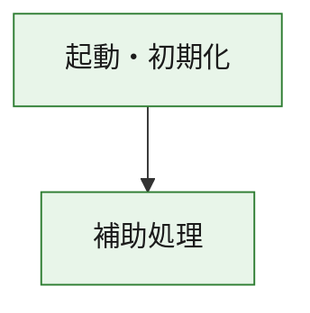
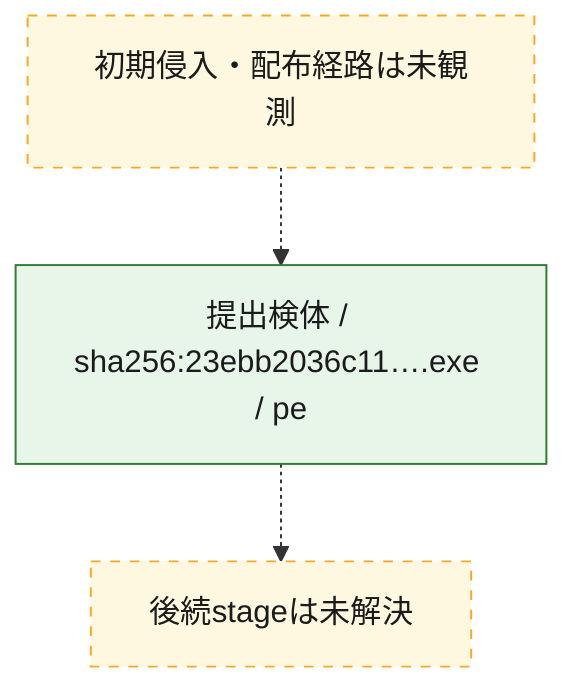
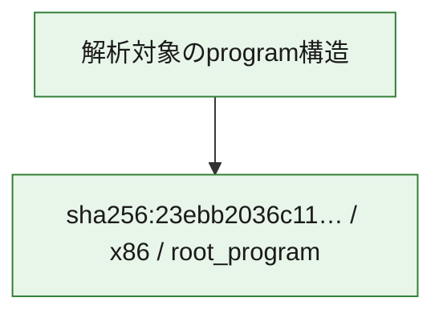

# 全体ロジック：23ebb2036c11da458530fe2aab09b0dac7c27922f92f0a3a8e8ea5a971f6db27

代表関数の静的証跡から、起動・初期化の処理群を確認しました。

## 読み方

- phaseの掲載順は解析上の整理順です。observed_call_edgesがない段階間の実行順を断定しません。
- 図の実線は静的に観測した関係、点線と黄色のノードは未観測・未解決の関係を示します。
- 図は静的な要約であり、動的実行を再現するものではありません。
- 詳細な関数解説とfingerprintは[STATIC-LOGIC.md](STATIC-LOGIC.md)を参照してください。

## 静的可視化

### 実行フロー

### 感染チェーン

### モジュール関係

## 処理段階

### 1. 起動・初期化

entry pointから初期化と後続処理への移行を確認します。
確度: `confirmed_static_function_evidence`

- `23ebb2036c11da458530fe2aab09b0dac7c27922f92f0a3a8e8ea5a971f6db27:ghidra:180001010` — 初期化と主要処理への分岐を行う入口関数です。 状態: `succeeded`、選定理由: `entry_point`, `meaningful_symbol_name`, `reviewed_call_centrality:22`, `role:entrypoint`, `small_program_complete_context`

### 2. 補助処理

主要処理を支える一般内部関数またはlibrary処理を確認します。
確度: `confirmed_static_function_evidence`

- `23ebb2036c11da458530fe2aab09b0dac7c27922f92f0a3a8e8ea5a971f6db27:ghidra:180001240` — 検体内部の一般処理を実装する関数です。 状態: `succeeded`、選定理由: `context_representative`, `reviewed_call_centrality:2`, `small_program_complete_context`
- `23ebb2036c11da458530fe2aab09b0dac7c27922f92f0a3a8e8ea5a971f6db27:ghidra:180001350` — 検体内部の一般処理を実装する関数です。 状態: `succeeded`、選定理由: `context_representative`, `reviewed_call_centrality:25`, `small_program_complete_context`
- `23ebb2036c11da458530fe2aab09b0dac7c27922f92f0a3a8e8ea5a971f6db27:ghidra:180003780` — 検体内部の一般処理を実装する関数です。 状態: `succeeded`、選定理由: `context_representative`, `reviewed_call_centrality:2`, `small_program_complete_context`
- `23ebb2036c11da458530fe2aab09b0dac7c27922f92f0a3a8e8ea5a971f6db27:ghidra:1800038e0` — 検体内部の一般処理を実装する関数です。 状態: `succeeded`、選定理由: `context_representative`, `reviewed_call_centrality:2`, `small_program_complete_context`

## 観測したcall関係

- `23ebb2036c11da458530fe2aab09b0dac7c27922f92f0a3a8e8ea5a971f6db27:ghidra:180001010` → `23ebb2036c11da458530fe2aab09b0dac7c27922f92f0a3a8e8ea5a971f6db27:ghidra:180001240` （`startup` → `support`）
- `23ebb2036c11da458530fe2aab09b0dac7c27922f92f0a3a8e8ea5a971f6db27:ghidra:180001010` → `23ebb2036c11da458530fe2aab09b0dac7c27922f92f0a3a8e8ea5a971f6db27:ghidra:180001350` （`startup` → `support`）
- `23ebb2036c11da458530fe2aab09b0dac7c27922f92f0a3a8e8ea5a971f6db27:ghidra:180001350` → `23ebb2036c11da458530fe2aab09b0dac7c27922f92f0a3a8e8ea5a971f6db27:ghidra:180001240` （`support` → `support`）
- `23ebb2036c11da458530fe2aab09b0dac7c27922f92f0a3a8e8ea5a971f6db27:ghidra:180001350` → `23ebb2036c11da458530fe2aab09b0dac7c27922f92f0a3a8e8ea5a971f6db27:ghidra:180003780` （`support` → `support`）
- `23ebb2036c11da458530fe2aab09b0dac7c27922f92f0a3a8e8ea5a971f6db27:ghidra:180001350` → `23ebb2036c11da458530fe2aab09b0dac7c27922f92f0a3a8e8ea5a971f6db27:ghidra:1800038e0` （`support` → `support`）
- `23ebb2036c11da458530fe2aab09b0dac7c27922f92f0a3a8e8ea5a971f6db27:ghidra:180003780` → `23ebb2036c11da458530fe2aab09b0dac7c27922f92f0a3a8e8ea5a971f6db27:ghidra:1800038e0` （`support` → `support`）
- `ghidra-function:103e26e06c0743cfda577e53` → `ghidra-function:efc620f6f15400d925de45c0` （`unclassified` → `unclassified`）
- `ghidra-function:433c5df49b39b61cbc4da87a` → `ghidra-function:1fc9f025b0bc58a29ff38155` （`unclassified` → `unclassified`）
- `ghidra-function:433c5df49b39b61cbc4da87a` → `ghidra-function:24c96e80a9eb16d92dc95322` （`unclassified` → `unclassified`）
- `ghidra-function:433c5df49b39b61cbc4da87a` → `ghidra-function:2fb1ca05d6319b8864fdd2e0` （`unclassified` → `unclassified`）
- `ghidra-function:433c5df49b39b61cbc4da87a` → `ghidra-function:49f77fcbaf85c6ad64be1f92` （`unclassified` → `unclassified`）
- `ghidra-function:433c5df49b39b61cbc4da87a` → `ghidra-function:640b2040ab46b7de2c2638e0` （`unclassified` → `unclassified`）
- `ghidra-function:433c5df49b39b61cbc4da87a` → `ghidra-function:6b133e8c48e6f25a9ba34f9a` （`unclassified` → `unclassified`）
- `ghidra-function:433c5df49b39b61cbc4da87a` → `ghidra-function:7a5878343100cfba82d7a08d` （`unclassified` → `unclassified`）
- `ghidra-function:433c5df49b39b61cbc4da87a` → `ghidra-function:86e5cc862aa87410f2595dee` （`unclassified` → `unclassified`）
- `ghidra-function:433c5df49b39b61cbc4da87a` → `ghidra-function:af254084450a155eda4b45e4` （`unclassified` → `unclassified`）
- `ghidra-function:433c5df49b39b61cbc4da87a` → `ghidra-function:b3842a4c076a285f10bb8709` （`unclassified` → `unclassified`）
- `ghidra-function:433c5df49b39b61cbc4da87a` → `ghidra-function:df7e4924a46fe34120b2db4f` （`unclassified` → `unclassified`）
- `ghidra-function:433c5df49b39b61cbc4da87a` → `ghidra-function:f95d47373b639a17fe255673` （`unclassified` → `unclassified`）
- `ghidra-function:b3842a4c076a285f10bb8709` → `ghidra-external:07cd3ad342e60f5fed0652b6` （`unclassified` → `unclassified`）
- `ghidra-function:b3842a4c076a285f10bb8709` → `ghidra-external:0fe14171f123958b8e6a9d29` （`unclassified` → `unclassified`）
- `ghidra-function:b3842a4c076a285f10bb8709` → `ghidra-external:13272256cceddcd6d1dcbc50` （`unclassified` → `unclassified`）
- `ghidra-function:b3842a4c076a285f10bb8709` → `ghidra-external:1c898bc555c406f5598bf139` （`unclassified` → `unclassified`）
- `ghidra-function:b3842a4c076a285f10bb8709` → `ghidra-external:2937035fe52093a6abd11865` （`unclassified` → `unclassified`）
- `ghidra-function:b3842a4c076a285f10bb8709` → `ghidra-external:2ecf93e432f1871edd95aaf5` （`unclassified` → `unclassified`）
- `ghidra-function:b3842a4c076a285f10bb8709` → `ghidra-external:2fe2e2ccd77b560fc28c6da9` （`unclassified` → `unclassified`）
- `ghidra-function:b3842a4c076a285f10bb8709` → `ghidra-external:36063305da92e87cc4f7e2f9` （`unclassified` → `unclassified`）
- `ghidra-function:b3842a4c076a285f10bb8709` → `ghidra-external:3767b8c8c019bc46c3159a50` （`unclassified` → `unclassified`）
- `ghidra-function:b3842a4c076a285f10bb8709` → `ghidra-external:3da8579178217f7e2b008b25` （`unclassified` → `unclassified`）
- `ghidra-function:b3842a4c076a285f10bb8709` → `ghidra-external:3e8a57d68d48897f7d5c3a41` （`unclassified` → `unclassified`）
- `ghidra-function:b3842a4c076a285f10bb8709` → `ghidra-external:4735d3ff44aa26518ccd7304` （`unclassified` → `unclassified`）
- `ghidra-function:b3842a4c076a285f10bb8709` → `ghidra-external:532ef652c859f68b74be2f9d` （`unclassified` → `unclassified`）
- `ghidra-function:b3842a4c076a285f10bb8709` → `ghidra-external:5752078451aa7a8f75385b2b` （`unclassified` → `unclassified`）
- `ghidra-function:b3842a4c076a285f10bb8709` → `ghidra-external:5e457c631aba36a0eea4a9e8` （`unclassified` → `unclassified`）
- `ghidra-function:b3842a4c076a285f10bb8709` → `ghidra-external:7190cef4682ac7ff712f5c43` （`unclassified` → `unclassified`）
- `ghidra-function:b3842a4c076a285f10bb8709` → `ghidra-external:8ae34a860619af72ddb4f12d` （`unclassified` → `unclassified`）
- `ghidra-function:b3842a4c076a285f10bb8709` → `ghidra-external:aa1c545e9e96d7db8bedacd8` （`unclassified` → `unclassified`）
- `ghidra-function:b3842a4c076a285f10bb8709` → `ghidra-external:c83e710e6a1e249c3bee9555` （`unclassified` → `unclassified`）
- `ghidra-function:b3842a4c076a285f10bb8709` → `ghidra-external:e2727125480fc336c09fe180` （`unclassified` → `unclassified`）
- `ghidra-function:b3842a4c076a285f10bb8709` → `ghidra-external:f68440715d65fee8b20139c1` （`unclassified` → `unclassified`）
- `ghidra-function:b3842a4c076a285f10bb8709` → `ghidra-function:103e26e06c0743cfda577e53` （`unclassified` → `unclassified`）
- `ghidra-function:b3842a4c076a285f10bb8709` → `ghidra-function:49f77fcbaf85c6ad64be1f92` （`unclassified` → `unclassified`）
- `ghidra-function:b3842a4c076a285f10bb8709` → `ghidra-function:efc620f6f15400d925de45c0` （`unclassified` → `unclassified`）

## 解析範囲と制約

- 選定外関数は全体inventoryへ残しますが、関数本体の個別解説対象にはしていません。
- indirect call、難読化、packer、VM、壊れたcontrol flowによりcall関係が欠落する場合があります。
- 文書は静的解析に基づき、検体実行や外部通信による動的確認は行っていません。
