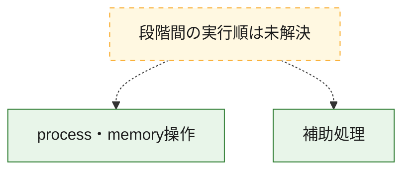
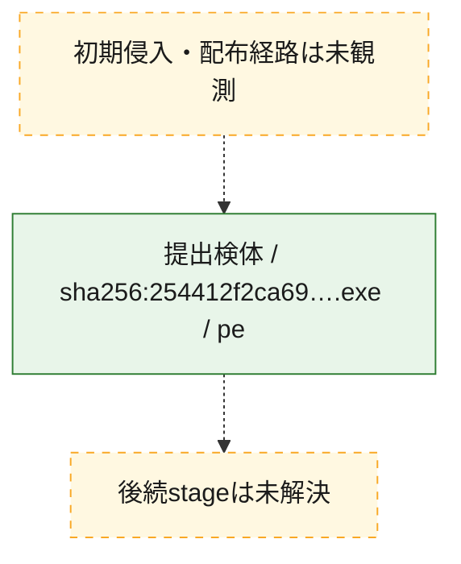
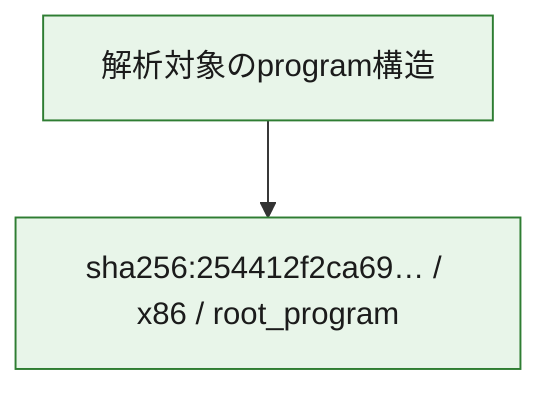

# 全体ロジック：254412f2ca69b69f8b686f874374e2584aaf55ad5c3e8ed6eddfa69f3fe6ea2b

代表関数の静的証跡から、process・memory操作の処理群を確認しました。

## 読み方

- phaseの掲載順は解析上の整理順です。observed_call_edgesがない段階間の実行順を断定しません。
- 図の実線は静的に観測した関係、点線と黄色のノードは未観測・未解決の関係を示します。
- 図は静的な要約であり、動的実行を再現するものではありません。
- 詳細な関数解説とfingerprintは[STATIC-LOGIC.md](STATIC-LOGIC.md)を参照してください。

## 静的可視化

### 実行フロー

### 感染チェーン

### モジュール関係

## 処理段階

### 1. process・memory操作

process、thread、module、memory操作と実行移行を確認します。
確度: `confirmed_static_function_evidence_with_limits`

- `254412f2ca69b69f8b686f874374e2584aaf55ad5c3e8ed6eddfa69f3fe6ea2b:ghidra:140001000` — process、thread、module、またはmemory操作に関係する関数です。 状態: `limited_bad_instruction_or_flow`、選定理由: `context_representative`, `reviewed_call_centrality:19`, `role:process_or_memory_operation`
- `254412f2ca69b69f8b686f874374e2584aaf55ad5c3e8ed6eddfa69f3fe6ea2b:ghidra:1400010c0` — process、thread、module、またはmemory操作に関係する関数です。 状態: `limited_bad_instruction_or_flow`、選定理由: `context_representative`, `reviewed_call_centrality:21`, `role:process_or_memory_operation`
- `254412f2ca69b69f8b686f874374e2584aaf55ad5c3e8ed6eddfa69f3fe6ea2b:ghidra:140001180` — process、thread、module、またはmemory操作に関係する関数です。 状態: `limited_bad_instruction_or_flow`、選定理由: `context_representative`, `reviewed_call_centrality:12`, `role:process_or_memory_operation`
- `254412f2ca69b69f8b686f874374e2584aaf55ad5c3e8ed6eddfa69f3fe6ea2b:ghidra:140001240` — process、thread、module、またはmemory操作に関係する関数です。 状態: `limited_bad_instruction_or_flow`、選定理由: `context_representative`, `reviewed_call_centrality:13`, `role:process_or_memory_operation`
- `254412f2ca69b69f8b686f874374e2584aaf55ad5c3e8ed6eddfa69f3fe6ea2b:ghidra:140001300` — process、thread、module、またはmemory操作に関係する関数です。 状態: `limited_bad_instruction_or_flow`、選定理由: `context_representative`, `reviewed_call_centrality:9`, `role:process_or_memory_operation`
- `254412f2ca69b69f8b686f874374e2584aaf55ad5c3e8ed6eddfa69f3fe6ea2b:ghidra:140001430` — process、thread、module、またはmemory操作に関係する関数です。 状態: `limited_bad_instruction_or_flow`、選定理由: `context_representative`, `reviewed_call_centrality:4`, `role:process_or_memory_operation`
- `254412f2ca69b69f8b686f874374e2584aaf55ad5c3e8ed6eddfa69f3fe6ea2b:ghidra:140001590` — process、thread、module、またはmemory操作に関係する関数です。 状態: `limited_bad_instruction_or_flow`、選定理由: `context_representative`, `reviewed_call_centrality:6`, `role:process_or_memory_operation`
- `254412f2ca69b69f8b686f874374e2584aaf55ad5c3e8ed6eddfa69f3fe6ea2b:ghidra:140001660` — process、thread、module、またはmemory操作に関係する関数です。 状態: `limited_bad_instruction_or_flow`、選定理由: `context_representative`, `reviewed_call_centrality:4`, `role:process_or_memory_operation`
- `254412f2ca69b69f8b686f874374e2584aaf55ad5c3e8ed6eddfa69f3fe6ea2b:ghidra:140001710` — process、thread、module、またはmemory操作に関係する関数です。 状態: `limited_bad_instruction_or_flow`、選定理由: `context_representative`, `reviewed_call_centrality:7`, `role:process_or_memory_operation`
- `254412f2ca69b69f8b686f874374e2584aaf55ad5c3e8ed6eddfa69f3fe6ea2b:ghidra:140001830` — process、thread、module、またはmemory操作に関係する関数です。 状態: `limited_bad_instruction_or_flow`、選定理由: `context_representative`, `reviewed_call_centrality:5`, `role:process_or_memory_operation`
- `254412f2ca69b69f8b686f874374e2584aaf55ad5c3e8ed6eddfa69f3fe6ea2b:ghidra:140001950` — process、thread、module、またはmemory操作に関係する関数です。 状態: `limited_bad_instruction_or_flow`、選定理由: `context_representative`, `reviewed_call_centrality:6`, `role:process_or_memory_operation`
- `254412f2ca69b69f8b686f874374e2584aaf55ad5c3e8ed6eddfa69f3fe6ea2b:ghidra:1400019e0` — process、thread、module、またはmemory操作に関係する関数です。 状態: `limited_bad_instruction_or_flow`、選定理由: `context_representative`, `reviewed_call_centrality:5`, `role:process_or_memory_operation`
- `254412f2ca69b69f8b686f874374e2584aaf55ad5c3e8ed6eddfa69f3fe6ea2b:ghidra:140001ad0` — process、thread、module、またはmemory操作に関係する関数です。 状態: `limited_bad_instruction_or_flow`、選定理由: `context_representative`, `reviewed_call_centrality:6`, `role:process_or_memory_operation`
- `254412f2ca69b69f8b686f874374e2584aaf55ad5c3e8ed6eddfa69f3fe6ea2b:ghidra:140001b60` — process、thread、module、またはmemory操作に関係する関数です。 状態: `limited_bad_instruction_or_flow`、選定理由: `context_representative`, `reviewed_call_centrality:5`, `role:process_or_memory_operation`
- `254412f2ca69b69f8b686f874374e2584aaf55ad5c3e8ed6eddfa69f3fe6ea2b:ghidra:140001c50` — process、thread、module、またはmemory操作に関係する関数です。 状態: `limited_bad_instruction_or_flow`、選定理由: `context_representative`, `reviewed_call_centrality:5`, `role:process_or_memory_operation`
- `254412f2ca69b69f8b686f874374e2584aaf55ad5c3e8ed6eddfa69f3fe6ea2b:ghidra:140001d20` — process、thread、module、またはmemory操作に関係する関数です。 状態: `limited_bad_instruction_or_flow`、選定理由: `context_representative`, `reviewed_call_centrality:9`, `role:process_or_memory_operation`

### 2. 補助処理

主要処理を支える一般内部関数またはlibrary処理を確認します。
確度: `confirmed_static_function_evidence`

- `254412f2ca69b69f8b686f874374e2584aaf55ad5c3e8ed6eddfa69f3fe6ea2b:ghidra:140001080` — 検体内部の一般処理を実装する関数です。 状態: `succeeded`、選定理由: `context_representative`, `reviewed_call_centrality:1`
- `254412f2ca69b69f8b686f874374e2584aaf55ad5c3e8ed6eddfa69f3fe6ea2b:ghidra:140001140` — 検体内部の一般処理を実装する関数です。 状態: `succeeded`、選定理由: `context_representative`, `reviewed_call_centrality:1`
- `254412f2ca69b69f8b686f874374e2584aaf55ad5c3e8ed6eddfa69f3fe6ea2b:ghidra:140001200` — 検体内部の一般処理を実装する関数です。 状態: `succeeded`、選定理由: `context_representative`, `reviewed_call_centrality:1`
- `254412f2ca69b69f8b686f874374e2584aaf55ad5c3e8ed6eddfa69f3fe6ea2b:ghidra:1400012c0` — 検体内部の一般処理を実装する関数です。 状態: `succeeded`、選定理由: `context_representative`, `reviewed_call_centrality:1`
- `254412f2ca69b69f8b686f874374e2584aaf55ad5c3e8ed6eddfa69f3fe6ea2b:ghidra:1400013c0` — 検体内部の一般処理を実装する関数です。 状態: `succeeded`、選定理由: `context_representative`, `reviewed_call_centrality:1`
- `254412f2ca69b69f8b686f874374e2584aaf55ad5c3e8ed6eddfa69f3fe6ea2b:ghidra:140001400` — 検体内部の一般処理を実装する関数です。 状態: `succeeded`、選定理由: `context_representative`, `reviewed_call_centrality:1`
- `254412f2ca69b69f8b686f874374e2584aaf55ad5c3e8ed6eddfa69f3fe6ea2b:ghidra:140001500` — 検体内部の一般処理を実装する関数です。 状態: `succeeded`、選定理由: `context_representative`, `reviewed_call_centrality:1`
- `254412f2ca69b69f8b686f874374e2584aaf55ad5c3e8ed6eddfa69f3fe6ea2b:ghidra:140001550` — 検体内部の一般処理を実装する関数です。 状態: `succeeded`、選定理由: `context_representative`, `reviewed_call_centrality:1`
- `254412f2ca69b69f8b686f874374e2584aaf55ad5c3e8ed6eddfa69f3fe6ea2b:ghidra:140001620` — 検体内部の一般処理を実装する関数です。 状態: `succeeded`、選定理由: `context_representative`, `reviewed_call_centrality:1`
- `254412f2ca69b69f8b686f874374e2584aaf55ad5c3e8ed6eddfa69f3fe6ea2b:ghidra:1400016d0` — 検体内部の一般処理を実装する関数です。 状態: `succeeded`、選定理由: `context_representative`, `reviewed_call_centrality:1`
- `254412f2ca69b69f8b686f874374e2584aaf55ad5c3e8ed6eddfa69f3fe6ea2b:ghidra:1400017f0` — 検体内部の一般処理を実装する関数です。 状態: `succeeded`、選定理由: `context_representative`, `reviewed_call_centrality:1`
- `254412f2ca69b69f8b686f874374e2584aaf55ad5c3e8ed6eddfa69f3fe6ea2b:ghidra:1400018d0` — 検体内部の一般処理を実装する関数です。 状態: `succeeded`、選定理由: `context_representative`, `reviewed_call_centrality:1`
- `254412f2ca69b69f8b686f874374e2584aaf55ad5c3e8ed6eddfa69f3fe6ea2b:ghidra:140001a90` — 検体内部の一般処理を実装する関数です。 状態: `succeeded`、選定理由: `context_representative`, `reviewed_call_centrality:1`
- `254412f2ca69b69f8b686f874374e2584aaf55ad5c3e8ed6eddfa69f3fe6ea2b:ghidra:140001c10` — 検体内部の一般処理を実装する関数です。 状態: `succeeded`、選定理由: `context_representative`, `reviewed_call_centrality:1`
- `254412f2ca69b69f8b686f874374e2584aaf55ad5c3e8ed6eddfa69f3fe6ea2b:ghidra:140001ce0` — 検体内部の一般処理を実装する関数です。 状態: `succeeded`、選定理由: `context_representative`, `reviewed_call_centrality:1`
- `254412f2ca69b69f8b686f874374e2584aaf55ad5c3e8ed6eddfa69f3fe6ea2b:ghidra:140001e20` — 検体内部の一般処理を実装する関数です。 状態: `succeeded`、選定理由: `context_representative`, `reviewed_call_centrality:1`

## 観測したcall関係

- 代表関数間で直接解決できた呼出関係はありません。

## 解析範囲と制約

- 選定外関数は全体inventoryへ残しますが、関数本体の個別解説対象にはしていません。
- indirect call、難読化、packer、VM、壊れたcontrol flowによりcall関係が欠落する場合があります。
- 文書は静的解析に基づき、検体実行や外部通信による動的確認は行っていません。
