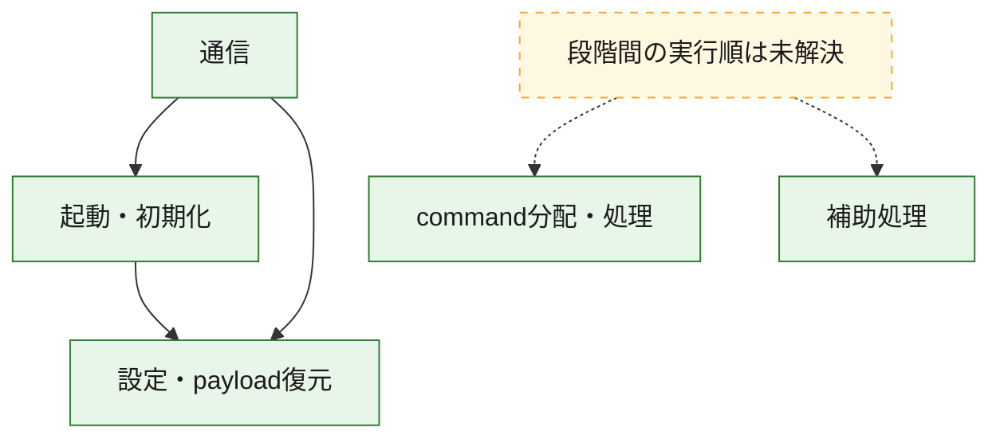
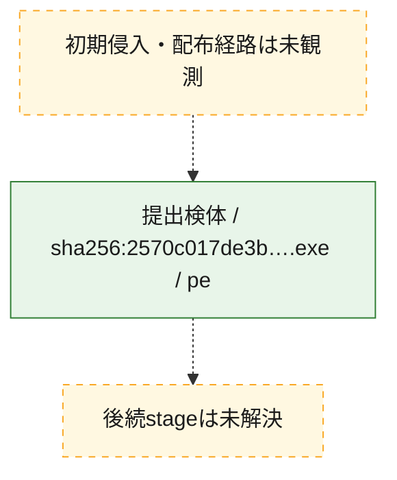
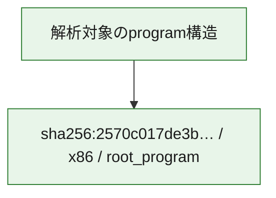

# 全体ロジック：2570c017de3beaa79242091df96c080a436738719be9aae01c835da3ac213707

代表関数の静的証跡から、起動・初期化、設定・payload復元、通信、command分配・処理の処理群を確認しました。

## 読み方

- phaseの掲載順は解析上の整理順です。observed_call_edgesがない段階間の実行順を断定しません。
- 図の実線は静的に観測した関係、点線と黄色のノードは未観測・未解決の関係を示します。
- 図は静的な要約であり、動的実行を再現するものではありません。
- 詳細な関数解説とfingerprintは[STATIC-LOGIC.md](STATIC-LOGIC.md)を参照してください。

## 静的可視化

### 実行フロー

### 感染チェーン

### モジュール関係

## 処理段階

### 1. 起動・初期化

entry pointから初期化と後続処理への移行を確認します。
確度: `confirmed_static_function_evidence`

- `2570c017de3beaa79242091df96c080a436738719be9aae01c835da3ac213707:ghidra:140009bb7` — 初期化と主要処理への分岐を行う入口関数です。 状態: `succeeded`、選定理由: `entry_point`, `meaningful_symbol_name`, `reviewed_call_centrality:7`, `role:entrypoint`
- `2570c017de3beaa79242091df96c080a436738719be9aae01c835da3ac213707:ghidra:140010e50` — 初期化と主要処理への分岐を行う入口関数です。 状態: `succeeded`、選定理由: `entry_point`, `meaningful_symbol_name`, `probable_go_main_user_code`, `reviewed_call_centrality:23`, `role:entrypoint`

### 2. 設定・payload復元

設定、resource、payload、暗号化データの復元・変換を確認します。
確度: `confirmed_static_function_evidence`

- `2570c017de3beaa79242091df96c080a436738719be9aae01c835da3ac213707:ghidra:1400016e1` — 設定、resource、payloadなどの解析・変換を行う関数です。 状態: `succeeded`、選定理由: `meaningful_symbol_name`, `reviewed_call_centrality:1`, `role:config_or_data_transform`
- `2570c017de3beaa79242091df96c080a436738719be9aae01c835da3ac213707:ghidra:140001c94` — 設定、resource、payloadなどの解析・変換を行う関数です。 状態: `succeeded`、選定理由: `meaningful_symbol_name`, `reviewed_call_centrality:1`, `role:config_or_data_transform`
- `2570c017de3beaa79242091df96c080a436738719be9aae01c835da3ac213707:ghidra:1400022ae` — 暗号、hash、encoding、または復号処理に関係する関数です。 状態: `succeeded`、選定理由: `meaningful_symbol_name`, `reviewed_call_centrality:4`, `role:cryptographic_transform`
- `2570c017de3beaa79242091df96c080a436738719be9aae01c835da3ac213707:ghidra:140002ecc` — 暗号、hash、encoding、または復号処理に関係する関数です。 状態: `succeeded`、選定理由: `meaningful_symbol_name`, `reviewed_call_centrality:4`, `role:cryptographic_transform`
- `2570c017de3beaa79242091df96c080a436738719be9aae01c835da3ac213707:ghidra:140002fb6` — 暗号、hash、encoding、または復号処理に関係する関数です。 状態: `succeeded`、選定理由: `meaningful_symbol_name`, `reviewed_call_centrality:12`, `role:cryptographic_transform`
- `2570c017de3beaa79242091df96c080a436738719be9aae01c835da3ac213707:ghidra:1400031e9` — 設定、resource、payloadなどの解析・変換を行う関数です。 状態: `succeeded`、選定理由: `meaningful_symbol_name`, `reviewed_call_centrality:13`, `role:config_or_data_transform`
- `2570c017de3beaa79242091df96c080a436738719be9aae01c835da3ac213707:ghidra:140003c95` — 設定、resource、payloadなどの解析・変換を行う関数です。 状態: `succeeded`、選定理由: `meaningful_symbol_name`, `reviewed_call_centrality:1`, `role:config_or_data_transform`
- `2570c017de3beaa79242091df96c080a436738719be9aae01c835da3ac213707:ghidra:140005261` — 設定、resource、payloadなどの解析・変換を行う関数です。 状態: `succeeded`、選定理由: `meaningful_symbol_name`, `reviewed_call_centrality:2`, `role:config_or_data_transform`
- `2570c017de3beaa79242091df96c080a436738719be9aae01c835da3ac213707:ghidra:140005dfb` — 暗号、hash、encoding、または復号処理に関係する関数です。 状態: `succeeded`、選定理由: `meaningful_symbol_name`, `reviewed_call_centrality:2`, `role:cryptographic_transform`
- `2570c017de3beaa79242091df96c080a436738719be9aae01c835da3ac213707:ghidra:140005f7d` — 設定、resource、payloadなどの解析・変換を行う関数です。 状態: `succeeded`、選定理由: `meaningful_symbol_name`, `reviewed_call_centrality:12`, `role:config_or_data_transform`
- `2570c017de3beaa79242091df96c080a436738719be9aae01c835da3ac213707:ghidra:1400064c3` — 設定、resource、payloadなどの解析・変換を行う関数です。 状態: `succeeded`、選定理由: `meaningful_symbol_name`, `reviewed_call_centrality:9`, `role:config_or_data_transform`
- `2570c017de3beaa79242091df96c080a436738719be9aae01c835da3ac213707:ghidra:140008307` — 設定、resource、payloadなどの解析・変換を行う関数です。 状態: `succeeded`、選定理由: `meaningful_symbol_name`, `reviewed_call_centrality:1`, `role:config_or_data_transform`
- `2570c017de3beaa79242091df96c080a436738719be9aae01c835da3ac213707:ghidra:14000a76a` — 設定、resource、payloadなどの解析・変換を行う関数です。 状態: `succeeded`、選定理由: `meaningful_symbol_name`, `reviewed_call_centrality:7`, `role:config_or_data_transform`

### 3. 通信

通信初期化、endpoint処理、送受信の役割を確認します。
確度: `confirmed_static_function_evidence`

- `2570c017de3beaa79242091df96c080a436738719be9aae01c835da3ac213707:ghidra:140005b93` — 通信初期化、送受信、またはendpoint処理に関係する関数です。 状態: `succeeded`、選定理由: `meaningful_symbol_name`, `reviewed_call_centrality:3`, `role:network_communication`
- `2570c017de3beaa79242091df96c080a436738719be9aae01c835da3ac213707:ghidra:140006ad1` — 通信初期化、送受信、またはendpoint処理に関係する関数です。 状態: `succeeded`、選定理由: `meaningful_symbol_name`, `reviewed_call_centrality:3`, `role:network_communication`
- `2570c017de3beaa79242091df96c080a436738719be9aae01c835da3ac213707:ghidra:140007711` — 通信初期化、送受信、またはendpoint処理に関係する関数です。 状態: `succeeded`、選定理由: `meaningful_symbol_name`, `reviewed_call_centrality:3`, `role:network_communication`
- `2570c017de3beaa79242091df96c080a436738719be9aae01c835da3ac213707:ghidra:1400090f9` — 通信初期化、送受信、またはendpoint処理に関係する関数です。 状態: `succeeded`、選定理由: `meaningful_symbol_name`, `reviewed_call_centrality:20`, `role:network_communication`
- `2570c017de3beaa79242091df96c080a436738719be9aae01c835da3ac213707:ghidra:140009339` — 通信初期化、送受信、またはendpoint処理に関係する関数です。 状態: `succeeded`、選定理由: `meaningful_symbol_name`, `reviewed_call_centrality:6`, `role:network_communication`
- `2570c017de3beaa79242091df96c080a436738719be9aae01c835da3ac213707:ghidra:140009696` — 通信初期化、送受信、またはendpoint処理に関係する関数です。 状態: `succeeded`、選定理由: `meaningful_symbol_name`, `reviewed_call_centrality:3`, `role:network_communication`
- `2570c017de3beaa79242091df96c080a436738719be9aae01c835da3ac213707:ghidra:1400096f5` — 通信初期化、送受信、またはendpoint処理に関係する関数です。 状態: `succeeded`、選定理由: `meaningful_symbol_name`, `reviewed_call_centrality:5`, `role:network_communication`
- `2570c017de3beaa79242091df96c080a436738719be9aae01c835da3ac213707:ghidra:140009831` — 通信初期化、送受信、またはendpoint処理に関係する関数です。 状態: `succeeded`、選定理由: `meaningful_symbol_name`, `reviewed_call_centrality:10`, `role:network_communication`
- `2570c017de3beaa79242091df96c080a436738719be9aae01c835da3ac213707:ghidra:140009fa5` — 通信初期化、送受信、またはendpoint処理に関係する関数です。 状態: `succeeded`、選定理由: `meaningful_symbol_name`, `reviewed_call_centrality:3`, `role:network_communication`
- `2570c017de3beaa79242091df96c080a436738719be9aae01c835da3ac213707:ghidra:14000a099` — 通信初期化、送受信、またはendpoint処理に関係する関数です。 状態: `succeeded`、選定理由: `meaningful_symbol_name`, `reviewed_call_centrality:16`, `role:network_communication`
- `2570c017de3beaa79242091df96c080a436738719be9aae01c835da3ac213707:ghidra:14000b607` — 通信初期化、送受信、またはendpoint処理に関係する関数です。 状態: `succeeded`、選定理由: `meaningful_symbol_name`, `reviewed_call_centrality:15`, `role:network_communication`
- `2570c017de3beaa79242091df96c080a436738719be9aae01c835da3ac213707:ghidra:14000b910` — 通信初期化、送受信、またはendpoint処理に関係する関数です。 状態: `succeeded`、選定理由: `meaningful_symbol_name`, `reviewed_call_centrality:12`, `role:network_communication`

### 4. command分配・処理

受信commandやtaskの解釈、分配、個別handlerへの移行を確認します。
確度: `confirmed_static_function_evidence`

- `2570c017de3beaa79242091df96c080a436738719be9aae01c835da3ac213707:ghidra:14000af49` — commandの解釈、分配、または個別処理を担当する関数です。 状態: `succeeded`、選定理由: `meaningful_symbol_name`, `reviewed_call_centrality:5`, `role:command_dispatch_or_handler`
- `2570c017de3beaa79242091df96c080a436738719be9aae01c835da3ac213707:ghidra:14000bc5a` — commandの解釈、分配、または個別処理を担当する関数です。 状態: `succeeded`、選定理由: `meaningful_symbol_name`, `reviewed_call_centrality:5`, `role:command_dispatch_or_handler`

### 5. 補助処理

主要処理を支える一般内部関数またはlibrary処理を確認します。
確度: `confirmed_static_function_evidence`

- `2570c017de3beaa79242091df96c080a436738719be9aae01c835da3ac213707:ghidra:140001410` — 検体内部の一般処理を実装する関数です。 状態: `succeeded`、選定理由: `entry_point`, `meaningful_symbol_name`, `reviewed_call_centrality:1`
- `2570c017de3beaa79242091df96c080a436738719be9aae01c835da3ac213707:ghidra:140012320` — compiler生成処理または汎用library処理とみられる関数です。 状態: `succeeded`、選定理由: `entry_point`, `meaningful_symbol_name`, `reviewed_call_centrality:1`
- `2570c017de3beaa79242091df96c080a436738719be9aae01c835da3ac213707:ghidra:140012350` — compiler生成処理または汎用library処理とみられる関数です。 状態: `succeeded`、選定理由: `entry_point`, `meaningful_symbol_name`, `reviewed_call_centrality:2`

## 観測したcall関係

- `2570c017de3beaa79242091df96c080a436738719be9aae01c835da3ac213707:ghidra:140002fb6` → `2570c017de3beaa79242091df96c080a436738719be9aae01c835da3ac213707:ghidra:140002ecc` （`configuration` → `configuration`）
- `2570c017de3beaa79242091df96c080a436738719be9aae01c835da3ac213707:ghidra:1400031e9` → `2570c017de3beaa79242091df96c080a436738719be9aae01c835da3ac213707:ghidra:140002ecc` （`configuration` → `configuration`）
- `2570c017de3beaa79242091df96c080a436738719be9aae01c835da3ac213707:ghidra:140005dfb` → `2570c017de3beaa79242091df96c080a436738719be9aae01c835da3ac213707:ghidra:1400022ae` （`configuration` → `configuration`）
- `2570c017de3beaa79242091df96c080a436738719be9aae01c835da3ac213707:ghidra:1400064c3` → `2570c017de3beaa79242091df96c080a436738719be9aae01c835da3ac213707:ghidra:1400031e9` （`configuration` → `configuration`）
- `2570c017de3beaa79242091df96c080a436738719be9aae01c835da3ac213707:ghidra:1400064c3` → `2570c017de3beaa79242091df96c080a436738719be9aae01c835da3ac213707:ghidra:140005f7d` （`configuration` → `configuration`）
- `2570c017de3beaa79242091df96c080a436738719be9aae01c835da3ac213707:ghidra:140006ad1` → `2570c017de3beaa79242091df96c080a436738719be9aae01c835da3ac213707:ghidra:140005b93` （`communication` → `communication`）
- `2570c017de3beaa79242091df96c080a436738719be9aae01c835da3ac213707:ghidra:140009339` → `2570c017de3beaa79242091df96c080a436738719be9aae01c835da3ac213707:ghidra:1400090f9` （`communication` → `communication`）
- `2570c017de3beaa79242091df96c080a436738719be9aae01c835da3ac213707:ghidra:140009831` → `2570c017de3beaa79242091df96c080a436738719be9aae01c835da3ac213707:ghidra:140002fb6` （`communication` → `configuration`）
- `2570c017de3beaa79242091df96c080a436738719be9aae01c835da3ac213707:ghidra:140009831` → `2570c017de3beaa79242091df96c080a436738719be9aae01c835da3ac213707:ghidra:140009696` （`communication` → `communication`）
- `2570c017de3beaa79242091df96c080a436738719be9aae01c835da3ac213707:ghidra:14000a099` → `2570c017de3beaa79242091df96c080a436738719be9aae01c835da3ac213707:ghidra:140009bb7` （`communication` → `startup`）
- `2570c017de3beaa79242091df96c080a436738719be9aae01c835da3ac213707:ghidra:14000a099` → `2570c017de3beaa79242091df96c080a436738719be9aae01c835da3ac213707:ghidra:140009fa5` （`communication` → `communication`）
- `2570c017de3beaa79242091df96c080a436738719be9aae01c835da3ac213707:ghidra:14000b607` → `2570c017de3beaa79242091df96c080a436738719be9aae01c835da3ac213707:ghidra:140009339` （`communication` → `communication`）
- `2570c017de3beaa79242091df96c080a436738719be9aae01c835da3ac213707:ghidra:14000b607` → `2570c017de3beaa79242091df96c080a436738719be9aae01c835da3ac213707:ghidra:1400096f5` （`communication` → `communication`）
- `2570c017de3beaa79242091df96c080a436738719be9aae01c835da3ac213707:ghidra:14000b607` → `2570c017de3beaa79242091df96c080a436738719be9aae01c835da3ac213707:ghidra:140009831` （`communication` → `communication`）
- `2570c017de3beaa79242091df96c080a436738719be9aae01c835da3ac213707:ghidra:14000b607` → `2570c017de3beaa79242091df96c080a436738719be9aae01c835da3ac213707:ghidra:14000a099` （`communication` → `communication`）
- `2570c017de3beaa79242091df96c080a436738719be9aae01c835da3ac213707:ghidra:14000b910` → `2570c017de3beaa79242091df96c080a436738719be9aae01c835da3ac213707:ghidra:14000a099` （`communication` → `communication`）
- `2570c017de3beaa79242091df96c080a436738719be9aae01c835da3ac213707:ghidra:14000b910` → `2570c017de3beaa79242091df96c080a436738719be9aae01c835da3ac213707:ghidra:14000b607` （`communication` → `communication`）
- `2570c017de3beaa79242091df96c080a436738719be9aae01c835da3ac213707:ghidra:140010e50` → `2570c017de3beaa79242091df96c080a436738719be9aae01c835da3ac213707:ghidra:1400064c3` （`startup` → `configuration`）
- `ghidra-function:1492caf3a3d0049ad08fedef` → `ghidra-function:301b5b52eec0e002a5e1bfb2` （`unclassified` → `unclassified`）
- `ghidra-function:1492caf3a3d0049ad08fedef` → `ghidra-function:7195fabaaca6d279b2721369` （`unclassified` → `unclassified`）
- `ghidra-function:1a8c7e981bd2343d494d92e7` → `ghidra-external:0b4edfe96d82a110e8cbe30c` （`unclassified` → `unclassified`）
- `ghidra-function:1a8c7e981bd2343d494d92e7` → `ghidra-external:dd651421b06f04667fc54699` （`unclassified` → `unclassified`）
- `ghidra-function:282aac7a15fce4e269e9e73d` → `ghidra-external:66ea75d0bbee27ccccec1160` （`unclassified` → `unclassified`）
- `ghidra-function:282aac7a15fce4e269e9e73d` → `ghidra-external:7094a4b9a122abc45317ff10` （`unclassified` → `unclassified`）
- `ghidra-function:282aac7a15fce4e269e9e73d` → `ghidra-external:aa3d71eedf1a0055c9c1854b` （`unclassified` → `unclassified`）
- `ghidra-function:282aac7a15fce4e269e9e73d` → `ghidra-external:b9ef16c195e2e52779d937b4` （`unclassified` → `unclassified`）
- `ghidra-function:282aac7a15fce4e269e9e73d` → `ghidra-external:d3bd3084a51102ff7fcf3a67` （`unclassified` → `unclassified`）
- `ghidra-function:282aac7a15fce4e269e9e73d` → `ghidra-external:e00345fc69505284d438954b` （`unclassified` → `unclassified`）
- `ghidra-function:282aac7a15fce4e269e9e73d` → `ghidra-external:ff863fd39c37cb742db0d089` （`unclassified` → `unclassified`）
- `ghidra-function:2f0f9a83d72b1671abe7e053` → `ghidra-function:1190fd514a98cc3368053386` （`unclassified` → `unclassified`）
- `ghidra-function:2f0f9a83d72b1671abe7e053` → `ghidra-function:2f6dd382dc3c435b0d442915` （`unclassified` → `unclassified`）
- `ghidra-function:2f0f9a83d72b1671abe7e053` → `ghidra-function:2f7a61dee078def7b6cd84b9` （`unclassified` → `unclassified`）
- `ghidra-function:2f0f9a83d72b1671abe7e053` → `ghidra-function:341639a3ad8e23308130a86d` （`unclassified` → `unclassified`）
- `ghidra-function:2f0f9a83d72b1671abe7e053` → `ghidra-function:384a9946caf082ad206e8897` （`unclassified` → `unclassified`）
- `ghidra-function:2f0f9a83d72b1671abe7e053` → `ghidra-function:43353af597daa3c0782fbb31` （`unclassified` → `unclassified`）
- `ghidra-function:2f0f9a83d72b1671abe7e053` → `ghidra-function:5ef8a0576be0b4b0fb5a3e89` （`unclassified` → `unclassified`）
- `ghidra-function:2f0f9a83d72b1671abe7e053` → `ghidra-function:775e7e87875676c08cc1c76a` （`unclassified` → `unclassified`）
- `ghidra-function:2f0f9a83d72b1671abe7e053` → `ghidra-function:77e37d95105c682f63674be1` （`unclassified` → `unclassified`）
- `ghidra-function:2f0f9a83d72b1671abe7e053` → `ghidra-function:a705d8e02bd9d6767e21979f` （`unclassified` → `unclassified`）
- `ghidra-function:2f0f9a83d72b1671abe7e053` → `ghidra-function:b78f6c8dbbb6da8a7d24c10e` （`unclassified` → `unclassified`）
- `ghidra-function:2f0f9a83d72b1671abe7e053` → `ghidra-function:ff746f2aee99ad0032735a51` （`unclassified` → `unclassified`）
- `ghidra-function:3883d56ca415220ee63e41d0` → `ghidra-external:93f21f4fdc1f59ed805742b9` （`unclassified` → `unclassified`）
- `ghidra-function:3883d56ca415220ee63e41d0` → `ghidra-external:b2438d06eb7b9f9c7a0715dc` （`unclassified` → `unclassified`）
- `ghidra-function:3883d56ca415220ee63e41d0` → `ghidra-external:c1b7275824a0adaf2cae5c82` （`unclassified` → `unclassified`）
- `ghidra-function:3883d56ca415220ee63e41d0` → `ghidra-external:c22f56164e07a379589a6aff` （`unclassified` → `unclassified`）
- `ghidra-function:3883d56ca415220ee63e41d0` → `ghidra-external:f8ae3a2061ad749c14cd2951` （`unclassified` → `unclassified`）
- `ghidra-function:3883d56ca415220ee63e41d0` → `ghidra-function:0b526cc38ccc260be3128c76` （`unclassified` → `unclassified`）
- `ghidra-function:3883d56ca415220ee63e41d0` → `ghidra-function:0f9e9d7fbadb6dcee9278672` （`unclassified` → `unclassified`）
- `ghidra-function:3883d56ca415220ee63e41d0` → `ghidra-function:11ff894f93654d90e7580bf9` （`unclassified` → `unclassified`）
- `ghidra-function:3883d56ca415220ee63e41d0` → `ghidra-function:2aefd459f9f2899d4d89365d` （`unclassified` → `unclassified`）
- `ghidra-function:3883d56ca415220ee63e41d0` → `ghidra-function:79b632c5b00dabd8a2694a50` （`unclassified` → `unclassified`）
- `ghidra-function:3883d56ca415220ee63e41d0` → `ghidra-function:ebeb7e960ff39c3ae902b005` （`unclassified` → `unclassified`）
- `ghidra-function:3ab800182b9cb6d08b28456a` → `ghidra-function:4fc05437c75cb947ffbbc549` （`unclassified` → `unclassified`）
- `ghidra-function:3ab800182b9cb6d08b28456a` → `ghidra-function:643dc86588d1c3f3eabe9adf` （`unclassified` → `unclassified`）
- `ghidra-function:3ab800182b9cb6d08b28456a` → `ghidra-function:f08e396f4f035ff899c14ac8` （`unclassified` → `unclassified`）
- `ghidra-function:4a1019cce6ec1e89da4dc318` → `ghidra-external:100be02c1b5dfb0a5a04d475` （`unclassified` → `unclassified`）
- `ghidra-function:4a1019cce6ec1e89da4dc318` → `ghidra-function:1492caf3a3d0049ad08fedef` （`unclassified` → `unclassified`）
- `ghidra-function:4a1019cce6ec1e89da4dc318` → `ghidra-function:6780dff90ea945735f07cb5d` （`unclassified` → `unclassified`）
- `ghidra-function:57c114620e63336b4f6f0371` → `ghidra-external:100be02c1b5dfb0a5a04d475` （`unclassified` → `unclassified`）
- `ghidra-function:57c114620e63336b4f6f0371` → `ghidra-external:5080e11b289cdaeba53b0a06` （`unclassified` → `unclassified`）
- `ghidra-function:57c114620e63336b4f6f0371` → `ghidra-external:66ea75d0bbee27ccccec1160` （`unclassified` → `unclassified`）
- `ghidra-function:57c114620e63336b4f6f0371` → `ghidra-external:9fa144aa601cb40af884db32` （`unclassified` → `unclassified`）
- `ghidra-function:57c114620e63336b4f6f0371` → `ghidra-function:0b526cc38ccc260be3128c76` （`unclassified` → `unclassified`）
- `ghidra-function:57c114620e63336b4f6f0371` → `ghidra-function:1cdea6052b83abc1a46af8f5` （`unclassified` → `unclassified`）
- `ghidra-function:57c114620e63336b4f6f0371` → `ghidra-function:236a0065e7ba53bc218aeb2a` （`unclassified` → `unclassified`）
- `ghidra-function:57c114620e63336b4f6f0371` → `ghidra-function:2c976dcb76cb273adbd0a536` （`unclassified` → `unclassified`）
- `ghidra-function:57c114620e63336b4f6f0371` → `ghidra-function:384a9946caf082ad206e8897` （`unclassified` → `unclassified`）
- `ghidra-function:57c114620e63336b4f6f0371` → `ghidra-function:437fbdee33d76b8063d65725` （`unclassified` → `unclassified`）
- `ghidra-function:57c114620e63336b4f6f0371` → `ghidra-function:5fd9d1dcbe12bbd32c115391` （`unclassified` → `unclassified`）
- `ghidra-function:57c114620e63336b4f6f0371` → `ghidra-function:746e91cd776c5d12c723c018` （`unclassified` → `unclassified`）
- `ghidra-function:57c114620e63336b4f6f0371` → `ghidra-function:81356ba2517b00b6386d9ad4` （`unclassified` → `unclassified`）
- `ghidra-function:57c114620e63336b4f6f0371` → `ghidra-function:8e43fa8b3be924c6609127d0` （`unclassified` → `unclassified`）
- `ghidra-function:57c114620e63336b4f6f0371` → `ghidra-function:973596b9c0e9a700f632fe09` （`unclassified` → `unclassified`）
- `ghidra-function:57c114620e63336b4f6f0371` → `ghidra-function:a16c54f7de3e98e7821eb3ff` （`unclassified` → `unclassified`）
- `ghidra-function:57c114620e63336b4f6f0371` → `ghidra-function:a1ef654250690a37a998e56e` （`unclassified` → `unclassified`）
- `ghidra-function:57c114620e63336b4f6f0371` → `ghidra-function:a30ee3484aa2699a158d42ad` （`unclassified` → `unclassified`）
- `ghidra-function:57c114620e63336b4f6f0371` → `ghidra-function:c3bb607968b415a79ba7580f` （`unclassified` → `unclassified`）
- `ghidra-function:57c114620e63336b4f6f0371` → `ghidra-function:f8cde3b47eeb6d3d3f7803f9` （`unclassified` → `unclassified`）
- `ghidra-function:594449ae79dda9c78332ee7e` → `ghidra-function:934f66a914ade3569c83534d` （`unclassified` → `unclassified`）
- `ghidra-function:5ad2b2ec1b6fda382364713c` → `ghidra-function:8aefa85c382d5bbbcbee4456` （`unclassified` → `unclassified`）
- `ghidra-function:5b8a30ec7133f59dd5d91aca` → `ghidra-function:3ab800182b9cb6d08b28456a` （`unclassified` → `unclassified`）
- `ghidra-function:5b8a30ec7133f59dd5d91aca` → `ghidra-function:deb02d0f8c0054f1c7364768` （`unclassified` → `unclassified`）
- `ghidra-function:5c1162dc3c6f67cb3c806738` → `ghidra-external:0b4edfe96d82a110e8cbe30c` （`unclassified` → `unclassified`）
- `ghidra-function:5c1162dc3c6f67cb3c806738` → `ghidra-function:23cb0a7894c744827638b6c5` （`unclassified` → `unclassified`）
- `ghidra-function:5c1162dc3c6f67cb3c806738` → `ghidra-function:2f6dd382dc3c435b0d442915` （`unclassified` → `unclassified`）
- `ghidra-function:5c1162dc3c6f67cb3c806738` → `ghidra-function:341639a3ad8e23308130a86d` （`unclassified` → `unclassified`）
- `ghidra-function:5c1162dc3c6f67cb3c806738` → `ghidra-function:384a9946caf082ad206e8897` （`unclassified` → `unclassified`）
- `ghidra-function:5c1162dc3c6f67cb3c806738` → `ghidra-function:3883d56ca415220ee63e41d0` （`unclassified` → `unclassified`）
- `ghidra-function:5c1162dc3c6f67cb3c806738` → `ghidra-function:4fd7a3a2367e7ded55b31558` （`unclassified` → `unclassified`）
- `ghidra-function:5c1162dc3c6f67cb3c806738` → `ghidra-function:5ef8a0576be0b4b0fb5a3e89` （`unclassified` → `unclassified`）
- `ghidra-function:5c1162dc3c6f67cb3c806738` → `ghidra-function:948e08137e58e6076821996d` （`unclassified` → `unclassified`）
- `ghidra-function:6309820d0f39bb8722deff93` → `ghidra-external:100be02c1b5dfb0a5a04d475` （`unclassified` → `unclassified`）
- `ghidra-function:6309820d0f39bb8722deff93` → `ghidra-external:5080e11b289cdaeba53b0a06` （`unclassified` → `unclassified`）
- `ghidra-function:6309820d0f39bb8722deff93` → `ghidra-external:624b5b4b58f18ad4b1a3ea6b` （`unclassified` → `unclassified`）
- `ghidra-function:6309820d0f39bb8722deff93` → `ghidra-external:66ea75d0bbee27ccccec1160` （`unclassified` → `unclassified`）
- `ghidra-function:6309820d0f39bb8722deff93` → `ghidra-external:b9ef16c195e2e52779d937b4` （`unclassified` → `unclassified`）
- `ghidra-function:6309820d0f39bb8722deff93` → `ghidra-function:158424b5ee99794ae0552551` （`unclassified` → `unclassified`）
- `ghidra-function:6309820d0f39bb8722deff93` → `ghidra-function:3f8b7f20a3d21f905078bad2` （`unclassified` → `unclassified`）
- `ghidra-function:6309820d0f39bb8722deff93` → `ghidra-function:a05c1ca43d3f67e4910ec0b8` （`unclassified` → `unclassified`）
- `ghidra-function:6309820d0f39bb8722deff93` → `ghidra-function:aaacc3e6f01f29e90b285639` （`unclassified` → `unclassified`）
- `ghidra-function:6309820d0f39bb8722deff93` → `ghidra-function:c63c0f053696ccca3bb32482` （`unclassified` → `unclassified`）
- `ghidra-function:6309820d0f39bb8722deff93` → `ghidra-function:ea42ab3e2a5dfb08b083e681` （`unclassified` → `unclassified`）
- `ghidra-function:6b2ee4a1cba92e000d4b4833` → `ghidra-external:66ea75d0bbee27ccccec1160` （`unclassified` → `unclassified`）
- `ghidra-function:6b2ee4a1cba92e000d4b4833` → `ghidra-function:55fb28adbe94ca9a7586d1b8` （`unclassified` → `unclassified`）
- `ghidra-function:6b2ee4a1cba92e000d4b4833` → `ghidra-function:dff7b1a6583f88184bc73850` （`unclassified` → `unclassified`）
- `ghidra-function:6b2ee4a1cba92e000d4b4833` → `ghidra-function:fbecc1f1dde6e0a8029a26ab` （`unclassified` → `unclassified`）
- `ghidra-function:775e7e87875676c08cc1c76a` → `ghidra-external:0b4edfe96d82a110e8cbe30c` （`unclassified` → `unclassified`）
- `ghidra-function:775e7e87875676c08cc1c76a` → `ghidra-external:66ea75d0bbee27ccccec1160` （`unclassified` → `unclassified`）
- `ghidra-function:775e7e87875676c08cc1c76a` → `ghidra-external:6ff4772d55938aef1cc6ebd2` （`unclassified` → `unclassified`）
- `ghidra-function:775e7e87875676c08cc1c76a` → `ghidra-external:b9ef16c195e2e52779d937b4` （`unclassified` → `unclassified`）
- `ghidra-function:775e7e87875676c08cc1c76a` → `ghidra-external:c1b7275824a0adaf2cae5c82` （`unclassified` → `unclassified`）
- `ghidra-function:775e7e87875676c08cc1c76a` → `ghidra-external:c5874166286301f45316b939` （`unclassified` → `unclassified`）
- `ghidra-function:775e7e87875676c08cc1c76a` → `ghidra-external:d75db04b21940bf6ce45bddd` （`unclassified` → `unclassified`）
- `ghidra-function:775e7e87875676c08cc1c76a` → `ghidra-external:ebbe85d27550f8652b7bb56f` （`unclassified` → `unclassified`）
- `ghidra-function:775e7e87875676c08cc1c76a` → `ghidra-function:1a8c7e981bd2343d494d92e7` （`unclassified` → `unclassified`）
- `ghidra-function:775e7e87875676c08cc1c76a` → `ghidra-function:5d07734acfd8fe551710ed5e` （`unclassified` → `unclassified`）
- `ghidra-function:775e7e87875676c08cc1c76a` → `ghidra-function:67ebd31db979f3ab27175933` （`unclassified` → `unclassified`）
- `ghidra-function:775e7e87875676c08cc1c76a` → `ghidra-function:7dbd3f577279fa57ab4c88f6` （`unclassified` → `unclassified`）
- `ghidra-function:775e7e87875676c08cc1c76a` → `ghidra-function:dff7b1a6583f88184bc73850` （`unclassified` → `unclassified`）
- `ghidra-function:77e37d95105c682f63674be1` → `ghidra-external:0b4edfe96d82a110e8cbe30c` （`unclassified` → `unclassified`）
- `ghidra-function:77e37d95105c682f63674be1` → `ghidra-function:22f29c940fea30d51af0ad6a` （`unclassified` → `unclassified`）
- `ghidra-function:77e37d95105c682f63674be1` → `ghidra-function:2f6dd382dc3c435b0d442915` （`unclassified` → `unclassified`）
- `ghidra-function:77e37d95105c682f63674be1` → `ghidra-function:341639a3ad8e23308130a86d` （`unclassified` → `unclassified`）
- `ghidra-function:77e37d95105c682f63674be1` → `ghidra-function:384a9946caf082ad206e8897` （`unclassified` → `unclassified`）
- `ghidra-function:77e37d95105c682f63674be1` → `ghidra-function:441ca5f66bdf2e0746b0f9cf` （`unclassified` → `unclassified`）
- `ghidra-function:77e37d95105c682f63674be1` → `ghidra-function:5c1162dc3c6f67cb3c806738` （`unclassified` → `unclassified`）
- `ghidra-function:77e37d95105c682f63674be1` → `ghidra-function:5ef8a0576be0b4b0fb5a3e89` （`unclassified` → `unclassified`）
- `ghidra-function:77e37d95105c682f63674be1` → `ghidra-function:6b2ee4a1cba92e000d4b4833` （`unclassified` → `unclassified`）
- `ghidra-function:77e37d95105c682f63674be1` → `ghidra-function:775e7e87875676c08cc1c76a` （`unclassified` → `unclassified`）
- `ghidra-function:77e37d95105c682f63674be1` → `ghidra-function:8e639b538dc9acb1735397af` （`unclassified` → `unclassified`）
- `ghidra-function:77e37d95105c682f63674be1` → `ghidra-function:b78f6c8dbbb6da8a7d24c10e` （`unclassified` → `unclassified`）
- `ghidra-function:77e37d95105c682f63674be1` → `ghidra-function:bfaa0a4709943c2d12db1924` （`unclassified` → `unclassified`）
- `ghidra-function:79b632c5b00dabd8a2694a50` → `ghidra-function:0f9e9d7fbadb6dcee9278672` （`unclassified` → `unclassified`）
- `ghidra-function:79b632c5b00dabd8a2694a50` → `ghidra-function:ebeb7e960ff39c3ae902b005` （`unclassified` → `unclassified`）
- `ghidra-function:7dbd3f577279fa57ab4c88f6` → `ghidra-external:073bf9ebc8d3412f9ab947c6` （`unclassified` → `unclassified`）
- `ghidra-function:7dbd3f577279fa57ab4c88f6` → `ghidra-external:61815d81281f304abc526e55` （`unclassified` → `unclassified`）
- `ghidra-function:7dbd3f577279fa57ab4c88f6` → `ghidra-external:b9ef16c195e2e52779d937b4` （`unclassified` → `unclassified`）
- `ghidra-function:7dbd3f577279fa57ab4c88f6` → `ghidra-external:dc5ddf14adc530dc636f0949` （`unclassified` → `unclassified`）
- `ghidra-function:7dbd3f577279fa57ab4c88f6` → `ghidra-function:242a9eb84747c9caf4f689e7` （`unclassified` → `unclassified`）
- `ghidra-function:7dbd3f577279fa57ab4c88f6` → `ghidra-function:d38348ff7d226ef132dc0456` （`unclassified` → `unclassified`）
- `ghidra-function:81356ba2517b00b6386d9ad4` → `ghidra-external:0b4edfe96d82a110e8cbe30c` （`unclassified` → `unclassified`）
- `ghidra-function:81356ba2517b00b6386d9ad4` → `ghidra-external:66ea75d0bbee27ccccec1160` （`unclassified` → `unclassified`）
- `ghidra-function:81356ba2517b00b6386d9ad4` → `ghidra-external:dd651421b06f04667fc54699` （`unclassified` → `unclassified`）
- `ghidra-function:81356ba2517b00b6386d9ad4` → `ghidra-function:55fb28adbe94ca9a7586d1b8` （`unclassified` → `unclassified`）
- `ghidra-function:81356ba2517b00b6386d9ad4` → `ghidra-function:6309820d0f39bb8722deff93` （`unclassified` → `unclassified`）
- `ghidra-function:81356ba2517b00b6386d9ad4` → `ghidra-function:91bb5f36aaa4a2f39285be7e` （`unclassified` → `unclassified`）
- `ghidra-function:81356ba2517b00b6386d9ad4` → `ghidra-function:dff7b1a6583f88184bc73850` （`unclassified` → `unclassified`）
- `ghidra-function:8c38466f98235a45986aee72` → `ghidra-external:624b5b4b58f18ad4b1a3ea6b` （`unclassified` → `unclassified`）
- `ghidra-function:8c38466f98235a45986aee72` → `ghidra-external:b9ef16c195e2e52779d937b4` （`unclassified` → `unclassified`）
- `ghidra-function:8c38466f98235a45986aee72` → `ghidra-function:158424b5ee99794ae0552551` （`unclassified` → `unclassified`）
- `ghidra-function:8c38466f98235a45986aee72` → `ghidra-function:3f8b7f20a3d21f905078bad2` （`unclassified` → `unclassified`）
- `ghidra-function:8c38466f98235a45986aee72` → `ghidra-function:aaacc3e6f01f29e90b285639` （`unclassified` → `unclassified`）
- `ghidra-function:91bb5f36aaa4a2f39285be7e` → `ghidra-external:93f21f4fdc1f59ed805742b9` （`unclassified` → `unclassified`）
- `ghidra-function:91bb5f36aaa4a2f39285be7e` → `ghidra-external:b2438d06eb7b9f9c7a0715dc` （`unclassified` → `unclassified`）
- `ghidra-function:91bb5f36aaa4a2f39285be7e` → `ghidra-external:b9ef16c195e2e52779d937b4` （`unclassified` → `unclassified`）
- `ghidra-function:91bb5f36aaa4a2f39285be7e` → `ghidra-external:c1b7275824a0adaf2cae5c82` （`unclassified` → `unclassified`）
- `ghidra-function:91bb5f36aaa4a2f39285be7e` → `ghidra-external:c20168dae0796e7ca12cf12c` （`unclassified` → `unclassified`）
- `ghidra-function:91bb5f36aaa4a2f39285be7e` → `ghidra-external:c22f56164e07a379589a6aff` （`unclassified` → `unclassified`）
- `ghidra-function:91bb5f36aaa4a2f39285be7e` → `ghidra-external:f8ae3a2061ad749c14cd2951` （`unclassified` → `unclassified`）
- `ghidra-function:91bb5f36aaa4a2f39285be7e` → `ghidra-function:0f9e9d7fbadb6dcee9278672` （`unclassified` → `unclassified`）
- `ghidra-function:91bb5f36aaa4a2f39285be7e` → `ghidra-function:11ff894f93654d90e7580bf9` （`unclassified` → `unclassified`）
- `ghidra-function:91bb5f36aaa4a2f39285be7e` → `ghidra-function:2aefd459f9f2899d4d89365d` （`unclassified` → `unclassified`）
- `ghidra-function:91bb5f36aaa4a2f39285be7e` → `ghidra-function:79b632c5b00dabd8a2694a50` （`unclassified` → `unclassified`）
- `ghidra-function:91bb5f36aaa4a2f39285be7e` → `ghidra-function:ebeb7e960ff39c3ae902b005` （`unclassified` → `unclassified`）
- `ghidra-function:948e08137e58e6076821996d` → `ghidra-external:2167e59afb135a3acff7f225` （`unclassified` → `unclassified`）
- `ghidra-function:948e08137e58e6076821996d` → `ghidra-function:fb72e65d5f1a34fbae5ecf78` （`unclassified` → `unclassified`）
- `ghidra-function:9f424cc46f7acbcae2b32a4e` → `ghidra-external:7094a4b9a122abc45317ff10` （`unclassified` → `unclassified`）
- `ghidra-function:a325e7ff00751eeec01bb0c2` → `ghidra-external:b9ef16c195e2e52779d937b4` （`unclassified` → `unclassified`）
- `ghidra-function:a325e7ff00751eeec01bb0c2` → `ghidra-external:dc5ddf14adc530dc636f0949` （`unclassified` → `unclassified`）
- `ghidra-function:b0f13880d0b0a55673210c65` → `ghidra-function:c335076f7b65ee83ed939be6` （`unclassified` → `unclassified`）
- `ghidra-function:bfaa0a4709943c2d12db1924` → `ghidra-external:0b4edfe96d82a110e8cbe30c` （`unclassified` → `unclassified`）
- `ghidra-function:bfaa0a4709943c2d12db1924` → `ghidra-external:7ae7f089cdb724babab217c5` （`unclassified` → `unclassified`）
- `ghidra-function:bfaa0a4709943c2d12db1924` → `ghidra-external:c1b7275824a0adaf2cae5c82` （`unclassified` → `unclassified`）
- `ghidra-function:bfaa0a4709943c2d12db1924` → `ghidra-function:63573d574bacba2686a4559f` （`unclassified` → `unclassified`）
- `ghidra-function:c4bb8d228a2ac9d1279adef5` → `ghidra-function:e5558803acab50244f079b9b` （`unclassified` → `unclassified`）
- `ghidra-function:c6a3a9a431f83a8ab4b94114` → `ghidra-external:624b5b4b58f18ad4b1a3ea6b` （`unclassified` → `unclassified`）
- `ghidra-function:c6a3a9a431f83a8ab4b94114` → `ghidra-external:b9ef16c195e2e52779d937b4` （`unclassified` → `unclassified`）
- `ghidra-function:c6a3a9a431f83a8ab4b94114` → `ghidra-function:158424b5ee99794ae0552551` （`unclassified` → `unclassified`）
- `ghidra-function:c6a3a9a431f83a8ab4b94114` → `ghidra-function:aaacc3e6f01f29e90b285639` （`unclassified` → `unclassified`）
- `ghidra-function:c6a3a9a431f83a8ab4b94114` → `ghidra-function:ea42ab3e2a5dfb08b083e681` （`unclassified` → `unclassified`）
- `ghidra-function:cc197b65557b1d6daf99d9c4` → `ghidra-external:b9ef16c195e2e52779d937b4` （`unclassified` → `unclassified`）
- `ghidra-function:cc197b65557b1d6daf99d9c4` → `ghidra-external:c1b7275824a0adaf2cae5c82` （`unclassified` → `unclassified`）
- `ghidra-function:cc197b65557b1d6daf99d9c4` → `ghidra-function:ac08d3d020318211a3e9d3ae` （`unclassified` → `unclassified`）
- `ghidra-function:d20cec78cab1850b04c9efd3` → `ghidra-function:035b61a3d2fd26e3b5cd2d49` （`unclassified` → `unclassified`）
- `ghidra-function:d6251bb17ac74a30ad754564` → `ghidra-external:5c9c6176f7decc16dad24d32` （`unclassified` → `unclassified`）
- `ghidra-function:d6251bb17ac74a30ad754564` → `ghidra-function:8aefa85c382d5bbbcbee4456` （`unclassified` → `unclassified`）
- `ghidra-function:fbecc1f1dde6e0a8029a26ab` → `ghidra-external:44eb435989f27a6e0ee57944` （`unclassified` → `unclassified`）
- `ghidra-function:fbecc1f1dde6e0a8029a26ab` → `ghidra-external:66ea75d0bbee27ccccec1160` （`unclassified` → `unclassified`）
- `ghidra-function:fbecc1f1dde6e0a8029a26ab` → `ghidra-external:aa3d71eedf1a0055c9c1854b` （`unclassified` → `unclassified`）
- `ghidra-function:fbecc1f1dde6e0a8029a26ab` → `ghidra-external:dd651421b06f04667fc54699` （`unclassified` → `unclassified`）
- `ghidra-function:fbecc1f1dde6e0a8029a26ab` → `ghidra-external:e00345fc69505284d438954b` （`unclassified` → `unclassified`）
- `ghidra-function:fbecc1f1dde6e0a8029a26ab` → `ghidra-function:3607124f38054614f8c2aaac` （`unclassified` → `unclassified`）
- `ghidra-function:fbecc1f1dde6e0a8029a26ab` → `ghidra-function:441ca5f66bdf2e0746b0f9cf` （`unclassified` → `unclassified`）
- `ghidra-function:fbecc1f1dde6e0a8029a26ab` → `ghidra-function:896b0b872d70a39dc4f83451` （`unclassified` → `unclassified`）
- `ghidra-function:fbecc1f1dde6e0a8029a26ab` → `ghidra-function:8df8fb17d974f1b0ee895ed7` （`unclassified` → `unclassified`）
- `ghidra-function:fbecc1f1dde6e0a8029a26ab` → `ghidra-function:8e22ce5ba0029ef4182702c0` （`unclassified` → `unclassified`）
- `ghidra-function:fbecc1f1dde6e0a8029a26ab` → `ghidra-function:b1fc769a2c7e97a507e7897b` （`unclassified` → `unclassified`）
- `ghidra-function:fbecc1f1dde6e0a8029a26ab` → `ghidra-function:e4382767fa50e89aaca251a4` （`unclassified` → `unclassified`）

## 解析範囲と制約

- 選定外関数は全体inventoryへ残しますが、関数本体の個別解説対象にはしていません。
- indirect call、難読化、packer、VM、壊れたcontrol flowによりcall関係が欠落する場合があります。
- 文書は静的解析に基づき、検体実行や外部通信による動的確認は行っていません。
