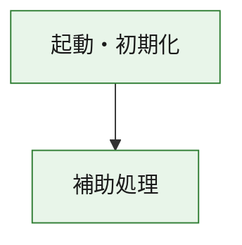
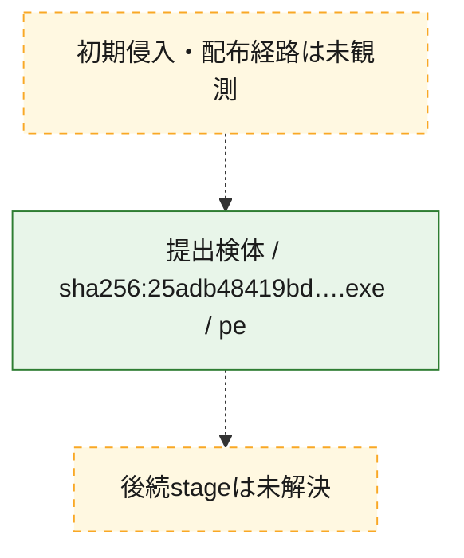
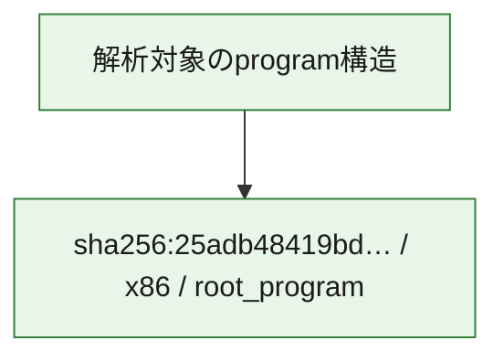

# 全体ロジック：25adb48419bdf28da15fa043c5c2473ffade5853e0efa7922165ff18614fd527

代表関数の静的証跡から、起動・初期化の処理群を確認しました。

## 読み方

- phaseの掲載順は解析上の整理順です。observed_call_edgesがない段階間の実行順を断定しません。
- 図の実線は静的に観測した関係、点線と黄色のノードは未観測・未解決の関係を示します。
- 図は静的な要約であり、動的実行を再現するものではありません。
- 詳細な関数解説とfingerprintは[STATIC-LOGIC.md](STATIC-LOGIC.md)を参照してください。

## 静的可視化

### 実行フロー

### 感染チェーン

### モジュール関係

## 処理段階

### 1. 起動・初期化

entry pointから初期化と後続処理への移行を確認します。
確度: `confirmed_static_function_evidence`

- `25adb48419bdf28da15fa043c5c2473ffade5853e0efa7922165ff18614fd527:ghidra:180001010` — 初期化と主要処理への分岐を行う入口関数です。 状態: `succeeded`、選定理由: `entry_point`, `meaningful_symbol_name`, `reviewed_call_centrality:22`, `role:entrypoint`, `small_program_complete_context`

### 2. 補助処理

主要処理を支える一般内部関数またはlibrary処理を確認します。
確度: `confirmed_static_function_evidence`

- `25adb48419bdf28da15fa043c5c2473ffade5853e0efa7922165ff18614fd527:ghidra:180001240` — 検体内部の一般処理を実装する関数です。 状態: `succeeded`、選定理由: `context_representative`, `reviewed_call_centrality:2`, `small_program_complete_context`
- `25adb48419bdf28da15fa043c5c2473ffade5853e0efa7922165ff18614fd527:ghidra:180001350` — 検体内部の一般処理を実装する関数です。 状態: `succeeded`、選定理由: `context_representative`, `reviewed_call_centrality:25`, `small_program_complete_context`
- `25adb48419bdf28da15fa043c5c2473ffade5853e0efa7922165ff18614fd527:ghidra:180003780` — 検体内部の一般処理を実装する関数です。 状態: `succeeded`、選定理由: `context_representative`, `reviewed_call_centrality:2`, `small_program_complete_context`
- `25adb48419bdf28da15fa043c5c2473ffade5853e0efa7922165ff18614fd527:ghidra:1800038e0` — 検体内部の一般処理を実装する関数です。 状態: `succeeded`、選定理由: `context_representative`, `reviewed_call_centrality:2`, `small_program_complete_context`

## 観測したcall関係

- `25adb48419bdf28da15fa043c5c2473ffade5853e0efa7922165ff18614fd527:ghidra:180001010` → `25adb48419bdf28da15fa043c5c2473ffade5853e0efa7922165ff18614fd527:ghidra:180001240` （`startup` → `support`）
- `25adb48419bdf28da15fa043c5c2473ffade5853e0efa7922165ff18614fd527:ghidra:180001010` → `25adb48419bdf28da15fa043c5c2473ffade5853e0efa7922165ff18614fd527:ghidra:180001350` （`startup` → `support`）
- `25adb48419bdf28da15fa043c5c2473ffade5853e0efa7922165ff18614fd527:ghidra:180001350` → `25adb48419bdf28da15fa043c5c2473ffade5853e0efa7922165ff18614fd527:ghidra:180001240` （`support` → `support`）
- `25adb48419bdf28da15fa043c5c2473ffade5853e0efa7922165ff18614fd527:ghidra:180001350` → `25adb48419bdf28da15fa043c5c2473ffade5853e0efa7922165ff18614fd527:ghidra:180003780` （`support` → `support`）
- `25adb48419bdf28da15fa043c5c2473ffade5853e0efa7922165ff18614fd527:ghidra:180001350` → `25adb48419bdf28da15fa043c5c2473ffade5853e0efa7922165ff18614fd527:ghidra:1800038e0` （`support` → `support`）
- `25adb48419bdf28da15fa043c5c2473ffade5853e0efa7922165ff18614fd527:ghidra:180003780` → `25adb48419bdf28da15fa043c5c2473ffade5853e0efa7922165ff18614fd527:ghidra:1800038e0` （`support` → `support`）
- `ghidra-function:398d599951e6d0b00cf895c9` → `ghidra-function:0427b231b15bcb2078ade8c5` （`unclassified` → `unclassified`）
- `ghidra-function:398d599951e6d0b00cf895c9` → `ghidra-function:1c1d126ebca1d813dde49711` （`unclassified` → `unclassified`）
- `ghidra-function:398d599951e6d0b00cf895c9` → `ghidra-function:5c6afc40945785f9191aa8bb` （`unclassified` → `unclassified`）
- `ghidra-function:398d599951e6d0b00cf895c9` → `ghidra-function:63b9dec3fa7d8b77db8f6ded` （`unclassified` → `unclassified`）
- `ghidra-function:398d599951e6d0b00cf895c9` → `ghidra-function:71d0023157fe56c443c870b0` （`unclassified` → `unclassified`）
- `ghidra-function:398d599951e6d0b00cf895c9` → `ghidra-function:7eec4150adf7c2a0699d715e` （`unclassified` → `unclassified`）
- `ghidra-function:398d599951e6d0b00cf895c9` → `ghidra-function:ad9a32c22b6ba206a205fbc9` （`unclassified` → `unclassified`）
- `ghidra-function:398d599951e6d0b00cf895c9` → `ghidra-function:b0d5958a37ead25edfbf7208` （`unclassified` → `unclassified`）
- `ghidra-function:398d599951e6d0b00cf895c9` → `ghidra-function:c20f07e2591015c81eb933cb` （`unclassified` → `unclassified`）
- `ghidra-function:398d599951e6d0b00cf895c9` → `ghidra-function:e9eaae18088268c1ad1ba5cc` （`unclassified` → `unclassified`）
- `ghidra-function:398d599951e6d0b00cf895c9` → `ghidra-function:fb97ba175644ec7b20ceec68` （`unclassified` → `unclassified`）
- `ghidra-function:398d599951e6d0b00cf895c9` → `ghidra-function:fe0a30e1b82ad243fc7f1a5a` （`unclassified` → `unclassified`）
- `ghidra-function:7eec4150adf7c2a0699d715e` → `ghidra-external:0ee9e8a7597012f4923feb94` （`unclassified` → `unclassified`）
- `ghidra-function:7eec4150adf7c2a0699d715e` → `ghidra-external:134f9eeac9847143eae71b69` （`unclassified` → `unclassified`）
- `ghidra-function:7eec4150adf7c2a0699d715e` → `ghidra-external:1b60a909f37447f09c8b87e5` （`unclassified` → `unclassified`）
- `ghidra-function:7eec4150adf7c2a0699d715e` → `ghidra-external:237d0ecc4ee58895ab16c0ee` （`unclassified` → `unclassified`）
- `ghidra-function:7eec4150adf7c2a0699d715e` → `ghidra-external:37469ac66b260f5efdeb3732` （`unclassified` → `unclassified`）
- `ghidra-function:7eec4150adf7c2a0699d715e` → `ghidra-external:3a9926fbbfffb6eb83bf564d` （`unclassified` → `unclassified`）
- `ghidra-function:7eec4150adf7c2a0699d715e` → `ghidra-external:558a9529241a71cd8276dcda` （`unclassified` → `unclassified`）
- `ghidra-function:7eec4150adf7c2a0699d715e` → `ghidra-external:5f986905406618d44dcdb512` （`unclassified` → `unclassified`）
- `ghidra-function:7eec4150adf7c2a0699d715e` → `ghidra-external:6715f430519723dcc1f559d2` （`unclassified` → `unclassified`）
- `ghidra-function:7eec4150adf7c2a0699d715e` → `ghidra-external:746ffd4d58d0550931d9ccee` （`unclassified` → `unclassified`）
- `ghidra-function:7eec4150adf7c2a0699d715e` → `ghidra-external:810af8eb4c3553a12f66c59b` （`unclassified` → `unclassified`）
- `ghidra-function:7eec4150adf7c2a0699d715e` → `ghidra-external:8adc74b95576a7dbb43de263` （`unclassified` → `unclassified`）
- `ghidra-function:7eec4150adf7c2a0699d715e` → `ghidra-external:a0396d54fa43adc70d59ec16` （`unclassified` → `unclassified`）
- `ghidra-function:7eec4150adf7c2a0699d715e` → `ghidra-external:b748068fba86517f891094b9` （`unclassified` → `unclassified`）
- `ghidra-function:7eec4150adf7c2a0699d715e` → `ghidra-external:cd781d3660288ecece8036ff` （`unclassified` → `unclassified`）
- `ghidra-function:7eec4150adf7c2a0699d715e` → `ghidra-external:cdf87a7da0ce711d0be3f1ff` （`unclassified` → `unclassified`）
- `ghidra-function:7eec4150adf7c2a0699d715e` → `ghidra-external:cfc685b6c2836f3af2d6ff41` （`unclassified` → `unclassified`）
- `ghidra-function:7eec4150adf7c2a0699d715e` → `ghidra-external:d19195e64037676fb415aa15` （`unclassified` → `unclassified`）
- `ghidra-function:7eec4150adf7c2a0699d715e` → `ghidra-external:d2ac6331f8130442cd3b4ec9` （`unclassified` → `unclassified`）
- `ghidra-function:7eec4150adf7c2a0699d715e` → `ghidra-external:d2d68102e5b448b9d7a725e5` （`unclassified` → `unclassified`）
- `ghidra-function:7eec4150adf7c2a0699d715e` → `ghidra-external:faeee1352ddd6fcf1e351bf4` （`unclassified` → `unclassified`）
- `ghidra-function:7eec4150adf7c2a0699d715e` → `ghidra-function:83f354ff49e90d42dac47359` （`unclassified` → `unclassified`）
- `ghidra-function:7eec4150adf7c2a0699d715e` → `ghidra-function:ad9a32c22b6ba206a205fbc9` （`unclassified` → `unclassified`）
- `ghidra-function:7eec4150adf7c2a0699d715e` → `ghidra-function:b0e40efa4dab3e7db106b016` （`unclassified` → `unclassified`）
- `ghidra-function:b0e40efa4dab3e7db106b016` → `ghidra-function:83f354ff49e90d42dac47359` （`unclassified` → `unclassified`）

## 解析範囲と制約

- 選定外関数は全体inventoryへ残しますが、関数本体の個別解説対象にはしていません。
- indirect call、難読化、packer、VM、壊れたcontrol flowによりcall関係が欠落する場合があります。
- 文書は静的解析に基づき、検体実行や外部通信による動的確認は行っていません。
