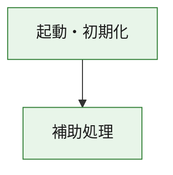
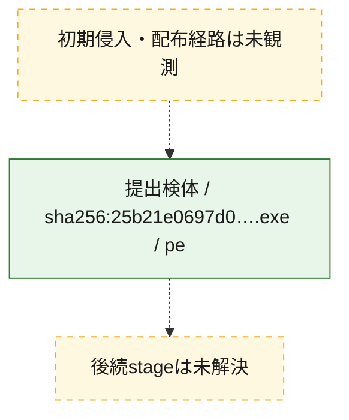
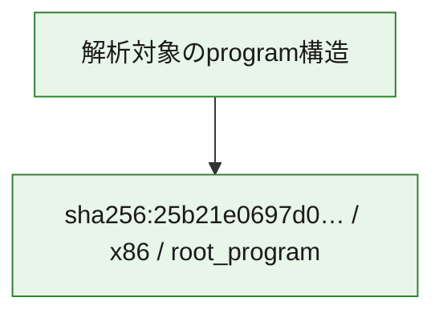

# 全体ロジック：25b21e0697d088ae2e1e498df18547600e96b1a8160cf2465d9567f7567509ea

代表関数の静的証跡から、起動・初期化の処理群を確認しました。

## 読み方

- phaseの掲載順は解析上の整理順です。observed_call_edgesがない段階間の実行順を断定しません。
- 図の実線は静的に観測した関係、点線と黄色のノードは未観測・未解決の関係を示します。
- 図は静的な要約であり、動的実行を再現するものではありません。
- 詳細な関数解説とfingerprintは[STATIC-LOGIC.md](STATIC-LOGIC.md)を参照してください。

## 静的可視化

### 実行フロー

### 感染チェーン

### モジュール関係

## 処理段階

### 1. 起動・初期化

entry pointから初期化と後続処理への移行を確認します。
確度: `confirmed_static_function_evidence`

- `25b21e0697d088ae2e1e498df18547600e96b1a8160cf2465d9567f7567509ea:ghidra:180001010` — 初期化と主要処理への分岐を行う入口関数です。 状態: `succeeded`、選定理由: `entry_point`, `meaningful_symbol_name`, `reviewed_call_centrality:22`, `role:entrypoint`, `small_program_complete_context`

### 2. 補助処理

主要処理を支える一般内部関数またはlibrary処理を確認します。
確度: `confirmed_static_function_evidence`

- `25b21e0697d088ae2e1e498df18547600e96b1a8160cf2465d9567f7567509ea:ghidra:180001240` — 検体内部の一般処理を実装する関数です。 状態: `succeeded`、選定理由: `context_representative`, `reviewed_call_centrality:2`, `small_program_complete_context`
- `25b21e0697d088ae2e1e498df18547600e96b1a8160cf2465d9567f7567509ea:ghidra:180001350` — 検体内部の一般処理を実装する関数です。 状態: `succeeded`、選定理由: `context_representative`, `reviewed_call_centrality:25`, `small_program_complete_context`
- `25b21e0697d088ae2e1e498df18547600e96b1a8160cf2465d9567f7567509ea:ghidra:180003780` — 検体内部の一般処理を実装する関数です。 状態: `succeeded`、選定理由: `context_representative`, `reviewed_call_centrality:2`, `small_program_complete_context`
- `25b21e0697d088ae2e1e498df18547600e96b1a8160cf2465d9567f7567509ea:ghidra:1800038e0` — 検体内部の一般処理を実装する関数です。 状態: `succeeded`、選定理由: `context_representative`, `reviewed_call_centrality:2`, `small_program_complete_context`

## 観測したcall関係

- `25b21e0697d088ae2e1e498df18547600e96b1a8160cf2465d9567f7567509ea:ghidra:180001010` → `25b21e0697d088ae2e1e498df18547600e96b1a8160cf2465d9567f7567509ea:ghidra:180001240` （`startup` → `support`）
- `25b21e0697d088ae2e1e498df18547600e96b1a8160cf2465d9567f7567509ea:ghidra:180001010` → `25b21e0697d088ae2e1e498df18547600e96b1a8160cf2465d9567f7567509ea:ghidra:180001350` （`startup` → `support`）
- `25b21e0697d088ae2e1e498df18547600e96b1a8160cf2465d9567f7567509ea:ghidra:180001350` → `25b21e0697d088ae2e1e498df18547600e96b1a8160cf2465d9567f7567509ea:ghidra:180001240` （`support` → `support`）
- `25b21e0697d088ae2e1e498df18547600e96b1a8160cf2465d9567f7567509ea:ghidra:180001350` → `25b21e0697d088ae2e1e498df18547600e96b1a8160cf2465d9567f7567509ea:ghidra:180003780` （`support` → `support`）
- `25b21e0697d088ae2e1e498df18547600e96b1a8160cf2465d9567f7567509ea:ghidra:180001350` → `25b21e0697d088ae2e1e498df18547600e96b1a8160cf2465d9567f7567509ea:ghidra:1800038e0` （`support` → `support`）
- `25b21e0697d088ae2e1e498df18547600e96b1a8160cf2465d9567f7567509ea:ghidra:180003780` → `25b21e0697d088ae2e1e498df18547600e96b1a8160cf2465d9567f7567509ea:ghidra:1800038e0` （`support` → `support`）
- `ghidra-function:23baa85489951b257fa0fa0b` → `ghidra-external:001e9a91fd3bbcba9ee903dc` （`unclassified` → `unclassified`）
- `ghidra-function:23baa85489951b257fa0fa0b` → `ghidra-external:0462f587213062b6046842b6` （`unclassified` → `unclassified`）
- `ghidra-function:23baa85489951b257fa0fa0b` → `ghidra-external:0897b707487abb47e8a59795` （`unclassified` → `unclassified`）
- `ghidra-function:23baa85489951b257fa0fa0b` → `ghidra-external:0e9b16907a799fe1f338bee5` （`unclassified` → `unclassified`）
- `ghidra-function:23baa85489951b257fa0fa0b` → `ghidra-external:11effbe30adfa6d1de21c25a` （`unclassified` → `unclassified`）
- `ghidra-function:23baa85489951b257fa0fa0b` → `ghidra-external:2327f955f137abd25c35ab3f` （`unclassified` → `unclassified`）
- `ghidra-function:23baa85489951b257fa0fa0b` → `ghidra-external:2f9816b531979168b196ac30` （`unclassified` → `unclassified`）
- `ghidra-function:23baa85489951b257fa0fa0b` → `ghidra-external:32802c92dfd60f900470244f` （`unclassified` → `unclassified`）
- `ghidra-function:23baa85489951b257fa0fa0b` → `ghidra-external:3a46ae199d04fd7fae37c1e0` （`unclassified` → `unclassified`）
- `ghidra-function:23baa85489951b257fa0fa0b` → `ghidra-external:3fd1264b11368f0e982ec04a` （`unclassified` → `unclassified`）
- `ghidra-function:23baa85489951b257fa0fa0b` → `ghidra-external:4484ae7c972f26d52f754c79` （`unclassified` → `unclassified`）
- `ghidra-function:23baa85489951b257fa0fa0b` → `ghidra-external:485ec50baf16aa71c3a10be2` （`unclassified` → `unclassified`）
- `ghidra-function:23baa85489951b257fa0fa0b` → `ghidra-external:54f2293dbc8de8c209e193e0` （`unclassified` → `unclassified`）
- `ghidra-function:23baa85489951b257fa0fa0b` → `ghidra-external:629e3bb67ffbad831a9547a0` （`unclassified` → `unclassified`）
- `ghidra-function:23baa85489951b257fa0fa0b` → `ghidra-external:845309fbfcf92a19ad691076` （`unclassified` → `unclassified`）
- `ghidra-function:23baa85489951b257fa0fa0b` → `ghidra-external:9e8ca03b430da8900f467228` （`unclassified` → `unclassified`）
- `ghidra-function:23baa85489951b257fa0fa0b` → `ghidra-external:a34cd180ad7cadb7c5997787` （`unclassified` → `unclassified`）
- `ghidra-function:23baa85489951b257fa0fa0b` → `ghidra-external:b6e137b9822a50f6d64300d4` （`unclassified` → `unclassified`）
- `ghidra-function:23baa85489951b257fa0fa0b` → `ghidra-external:bfe855ef85e7f305c6ff75d0` （`unclassified` → `unclassified`）
- `ghidra-function:23baa85489951b257fa0fa0b` → `ghidra-external:d3a60b8c57fb35d374f2c285` （`unclassified` → `unclassified`）
- `ghidra-function:23baa85489951b257fa0fa0b` → `ghidra-external:f8d7f7869bbbab8ffae5869c` （`unclassified` → `unclassified`）
- `ghidra-function:23baa85489951b257fa0fa0b` → `ghidra-function:3934829b005fab7f2cc433d6` （`unclassified` → `unclassified`）
- `ghidra-function:23baa85489951b257fa0fa0b` → `ghidra-function:deab3bdc360eec1369ed756b` （`unclassified` → `unclassified`）
- `ghidra-function:23baa85489951b257fa0fa0b` → `ghidra-function:dee0897f45a8a1cec49f979f` （`unclassified` → `unclassified`）
- `ghidra-function:3934829b005fab7f2cc433d6` → `ghidra-function:deab3bdc360eec1369ed756b` （`unclassified` → `unclassified`）
- `ghidra-function:d7e03eb4c2d12909048bd048` → `ghidra-function:0049c4b2a798d883c5d79cf3` （`unclassified` → `unclassified`）
- `ghidra-function:d7e03eb4c2d12909048bd048` → `ghidra-function:23baa85489951b257fa0fa0b` （`unclassified` → `unclassified`）
- `ghidra-function:d7e03eb4c2d12909048bd048` → `ghidra-function:30fb6e01a5d29417d2ee0410` （`unclassified` → `unclassified`）
- `ghidra-function:d7e03eb4c2d12909048bd048` → `ghidra-function:4c2ff3397d7b76aeb41a73d7` （`unclassified` → `unclassified`）
- `ghidra-function:d7e03eb4c2d12909048bd048` → `ghidra-function:8222a2a9bce28821254bda9b` （`unclassified` → `unclassified`）
- `ghidra-function:d7e03eb4c2d12909048bd048` → `ghidra-function:a76d5e6760c3046fda4d684c` （`unclassified` → `unclassified`）
- `ghidra-function:d7e03eb4c2d12909048bd048` → `ghidra-function:ab81bb6a569b1696bcdd5852` （`unclassified` → `unclassified`）
- `ghidra-function:d7e03eb4c2d12909048bd048` → `ghidra-function:b7ab9bfc93c47670b099bb18` （`unclassified` → `unclassified`）
- `ghidra-function:d7e03eb4c2d12909048bd048` → `ghidra-function:d26bb1c1e56de496539eb89b` （`unclassified` → `unclassified`）
- `ghidra-function:d7e03eb4c2d12909048bd048` → `ghidra-function:dee0897f45a8a1cec49f979f` （`unclassified` → `unclassified`）
- `ghidra-function:d7e03eb4c2d12909048bd048` → `ghidra-function:eb8c9d390011a8458a36823e` （`unclassified` → `unclassified`）
- `ghidra-function:d7e03eb4c2d12909048bd048` → `ghidra-function:ec304e54eaf72eff494c67f7` （`unclassified` → `unclassified`）

## 解析範囲と制約

- 選定外関数は全体inventoryへ残しますが、関数本体の個別解説対象にはしていません。
- indirect call、難読化、packer、VM、壊れたcontrol flowによりcall関係が欠落する場合があります。
- 文書は静的解析に基づき、検体実行や外部通信による動的確認は行っていません。
