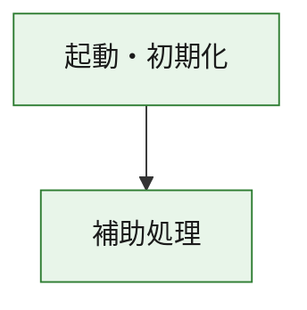
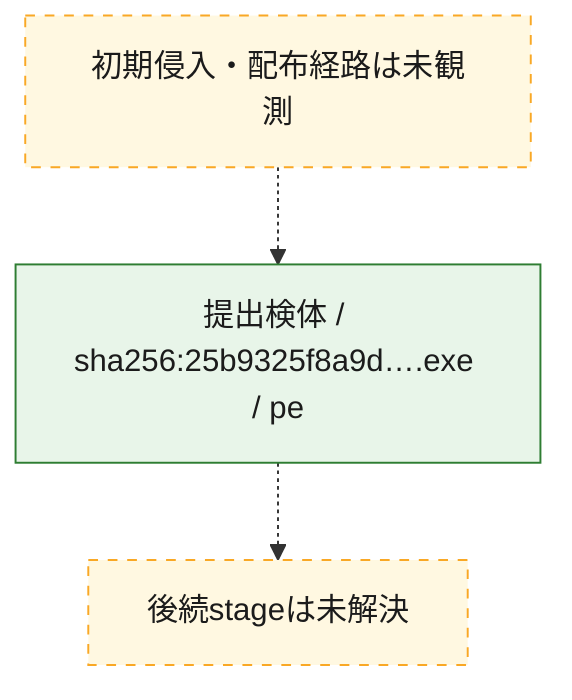
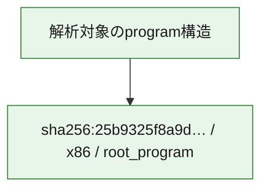

# 全体ロジック：25b9325f8a9dfdd485b3f6ed95c8e06134ffee3502aa2c449ca3ccfb4e20e3b7

代表関数の静的証跡から、起動・初期化の処理群を確認しました。

## 読み方

- phaseの掲載順は解析上の整理順です。observed_call_edgesがない段階間の実行順を断定しません。
- 図の実線は静的に観測した関係、点線と黄色のノードは未観測・未解決の関係を示します。
- 図は静的な要約であり、動的実行を再現するものではありません。
- 詳細な関数解説とfingerprintは[STATIC-LOGIC.md](STATIC-LOGIC.md)を参照してください。

## 静的可視化

### 実行フロー

### 感染チェーン

### モジュール関係

## 処理段階

### 1. 起動・初期化

entry pointから初期化と後続処理への移行を確認します。
確度: `confirmed_static_function_evidence`

- `25b9325f8a9dfdd485b3f6ed95c8e06134ffee3502aa2c449ca3ccfb4e20e3b7:ghidra:180001010` — 初期化と主要処理への分岐を行う入口関数です。 状態: `succeeded`、選定理由: `entry_point`, `meaningful_symbol_name`, `reviewed_call_centrality:22`, `role:entrypoint`, `small_program_complete_context`

### 2. 補助処理

主要処理を支える一般内部関数またはlibrary処理を確認します。
確度: `confirmed_static_function_evidence`

- `25b9325f8a9dfdd485b3f6ed95c8e06134ffee3502aa2c449ca3ccfb4e20e3b7:ghidra:180001240` — 検体内部の一般処理を実装する関数です。 状態: `succeeded`、選定理由: `context_representative`, `reviewed_call_centrality:2`, `small_program_complete_context`
- `25b9325f8a9dfdd485b3f6ed95c8e06134ffee3502aa2c449ca3ccfb4e20e3b7:ghidra:180001350` — 検体内部の一般処理を実装する関数です。 状態: `succeeded`、選定理由: `context_representative`, `reviewed_call_centrality:25`, `small_program_complete_context`
- `25b9325f8a9dfdd485b3f6ed95c8e06134ffee3502aa2c449ca3ccfb4e20e3b7:ghidra:180003780` — 検体内部の一般処理を実装する関数です。 状態: `succeeded`、選定理由: `context_representative`, `reviewed_call_centrality:2`, `small_program_complete_context`
- `25b9325f8a9dfdd485b3f6ed95c8e06134ffee3502aa2c449ca3ccfb4e20e3b7:ghidra:1800038e0` — 検体内部の一般処理を実装する関数です。 状態: `succeeded`、選定理由: `context_representative`, `reviewed_call_centrality:2`, `small_program_complete_context`

## 観測したcall関係

- `25b9325f8a9dfdd485b3f6ed95c8e06134ffee3502aa2c449ca3ccfb4e20e3b7:ghidra:180001010` → `25b9325f8a9dfdd485b3f6ed95c8e06134ffee3502aa2c449ca3ccfb4e20e3b7:ghidra:180001240` （`startup` → `support`）
- `25b9325f8a9dfdd485b3f6ed95c8e06134ffee3502aa2c449ca3ccfb4e20e3b7:ghidra:180001010` → `25b9325f8a9dfdd485b3f6ed95c8e06134ffee3502aa2c449ca3ccfb4e20e3b7:ghidra:180001350` （`startup` → `support`）
- `25b9325f8a9dfdd485b3f6ed95c8e06134ffee3502aa2c449ca3ccfb4e20e3b7:ghidra:180001350` → `25b9325f8a9dfdd485b3f6ed95c8e06134ffee3502aa2c449ca3ccfb4e20e3b7:ghidra:180001240` （`support` → `support`）
- `25b9325f8a9dfdd485b3f6ed95c8e06134ffee3502aa2c449ca3ccfb4e20e3b7:ghidra:180001350` → `25b9325f8a9dfdd485b3f6ed95c8e06134ffee3502aa2c449ca3ccfb4e20e3b7:ghidra:180003780` （`support` → `support`）
- `25b9325f8a9dfdd485b3f6ed95c8e06134ffee3502aa2c449ca3ccfb4e20e3b7:ghidra:180001350` → `25b9325f8a9dfdd485b3f6ed95c8e06134ffee3502aa2c449ca3ccfb4e20e3b7:ghidra:1800038e0` （`support` → `support`）
- `25b9325f8a9dfdd485b3f6ed95c8e06134ffee3502aa2c449ca3ccfb4e20e3b7:ghidra:180003780` → `25b9325f8a9dfdd485b3f6ed95c8e06134ffee3502aa2c449ca3ccfb4e20e3b7:ghidra:1800038e0` （`support` → `support`）
- `ghidra-function:52dd59444d13769de2be7cf5` → `ghidra-function:34b73a7f899118dced79f744` （`unclassified` → `unclassified`）
- `ghidra-function:52dd59444d13769de2be7cf5` → `ghidra-function:5479b5994ff44a9e1fdf8065` （`unclassified` → `unclassified`）
- `ghidra-function:52dd59444d13769de2be7cf5` → `ghidra-function:654b2f20778df2fadd72216c` （`unclassified` → `unclassified`）
- `ghidra-function:52dd59444d13769de2be7cf5` → `ghidra-function:6d8ddc37194861260340d3f5` （`unclassified` → `unclassified`）
- `ghidra-function:52dd59444d13769de2be7cf5` → `ghidra-function:749d5169099b5d2d0a0bf64d` （`unclassified` → `unclassified`）
- `ghidra-function:52dd59444d13769de2be7cf5` → `ghidra-function:b17c8a1603c3761e1b5aacb1` （`unclassified` → `unclassified`）
- `ghidra-function:52dd59444d13769de2be7cf5` → `ghidra-function:b5ee3148404c1f3ebe274c32` （`unclassified` → `unclassified`）
- `ghidra-function:52dd59444d13769de2be7cf5` → `ghidra-function:c67f93237da7e396d06cca8a` （`unclassified` → `unclassified`）
- `ghidra-function:52dd59444d13769de2be7cf5` → `ghidra-function:da3bddb1333761659eab9e41` （`unclassified` → `unclassified`）
- `ghidra-function:52dd59444d13769de2be7cf5` → `ghidra-function:da960503854fb6a105f2de2f` （`unclassified` → `unclassified`）
- `ghidra-function:52dd59444d13769de2be7cf5` → `ghidra-function:f874547ed9b8244122fd2278` （`unclassified` → `unclassified`）
- `ghidra-function:52dd59444d13769de2be7cf5` → `ghidra-function:fbb9d15ddbea683906398467` （`unclassified` → `unclassified`）
- `ghidra-function:c67f93237da7e396d06cca8a` → `ghidra-external:2226051947b0b04a847ae452` （`unclassified` → `unclassified`）
- `ghidra-function:c67f93237da7e396d06cca8a` → `ghidra-external:399a928c9889f1ed961a044e` （`unclassified` → `unclassified`）
- `ghidra-function:c67f93237da7e396d06cca8a` → `ghidra-external:3a6f2c82354f597ce6146a66` （`unclassified` → `unclassified`）
- `ghidra-function:c67f93237da7e396d06cca8a` → `ghidra-external:437a27c2cfbdae33647bc551` （`unclassified` → `unclassified`）
- `ghidra-function:c67f93237da7e396d06cca8a` → `ghidra-external:4634d284a03130d12e76d25e` （`unclassified` → `unclassified`）
- `ghidra-function:c67f93237da7e396d06cca8a` → `ghidra-external:48b152cdcecf82ad969cb207` （`unclassified` → `unclassified`）
- `ghidra-function:c67f93237da7e396d06cca8a` → `ghidra-external:590859a587c949d8c0ddb902` （`unclassified` → `unclassified`）
- `ghidra-function:c67f93237da7e396d06cca8a` → `ghidra-external:7179caabf522fa4714569fa6` （`unclassified` → `unclassified`）
- `ghidra-function:c67f93237da7e396d06cca8a` → `ghidra-external:7cd73f00d250389e3a03f1ef` （`unclassified` → `unclassified`）
- `ghidra-function:c67f93237da7e396d06cca8a` → `ghidra-external:803d79d58f9dc5036cde7196` （`unclassified` → `unclassified`）
- `ghidra-function:c67f93237da7e396d06cca8a` → `ghidra-external:8440fa513bedc0c55b3bc28e` （`unclassified` → `unclassified`）
- `ghidra-function:c67f93237da7e396d06cca8a` → `ghidra-external:979085504eba3e7010f8b7cc` （`unclassified` → `unclassified`）
- `ghidra-function:c67f93237da7e396d06cca8a` → `ghidra-external:9f7f078e2b1225c25e7476e2` （`unclassified` → `unclassified`）
- `ghidra-function:c67f93237da7e396d06cca8a` → `ghidra-external:ae2c679eb277b4b3f48c2b9a` （`unclassified` → `unclassified`）
- `ghidra-function:c67f93237da7e396d06cca8a` → `ghidra-external:b7f4feee665567473db806b4` （`unclassified` → `unclassified`）
- `ghidra-function:c67f93237da7e396d06cca8a` → `ghidra-external:bbc33591dd3e976a05bd5919` （`unclassified` → `unclassified`）
- `ghidra-function:c67f93237da7e396d06cca8a` → `ghidra-external:bd4aa0e2c6455abea2f81ae4` （`unclassified` → `unclassified`）
- `ghidra-function:c67f93237da7e396d06cca8a` → `ghidra-external:c4c48ab0286552ae2606d66b` （`unclassified` → `unclassified`）
- `ghidra-function:c67f93237da7e396d06cca8a` → `ghidra-external:e6c6f19bdc041c31696c76a0` （`unclassified` → `unclassified`）
- `ghidra-function:c67f93237da7e396d06cca8a` → `ghidra-external:e75ae7ae1c5f9deb66b12c12` （`unclassified` → `unclassified`）
- `ghidra-function:c67f93237da7e396d06cca8a` → `ghidra-external:eaf7f303e5173e026821c2fb` （`unclassified` → `unclassified`）
- `ghidra-function:c67f93237da7e396d06cca8a` → `ghidra-function:24b6d7adf638b367ca174ea8` （`unclassified` → `unclassified`）
- `ghidra-function:c67f93237da7e396d06cca8a` → `ghidra-function:b5ee3148404c1f3ebe274c32` （`unclassified` → `unclassified`）
- `ghidra-function:c67f93237da7e396d06cca8a` → `ghidra-function:d36ecb586aaf1dfcf97f9516` （`unclassified` → `unclassified`）
- `ghidra-function:d36ecb586aaf1dfcf97f9516` → `ghidra-function:24b6d7adf638b367ca174ea8` （`unclassified` → `unclassified`）

## 解析範囲と制約

- 選定外関数は全体inventoryへ残しますが、関数本体の個別解説対象にはしていません。
- indirect call、難読化、packer、VM、壊れたcontrol flowによりcall関係が欠落する場合があります。
- 文書は静的解析に基づき、検体実行や外部通信による動的確認は行っていません。
