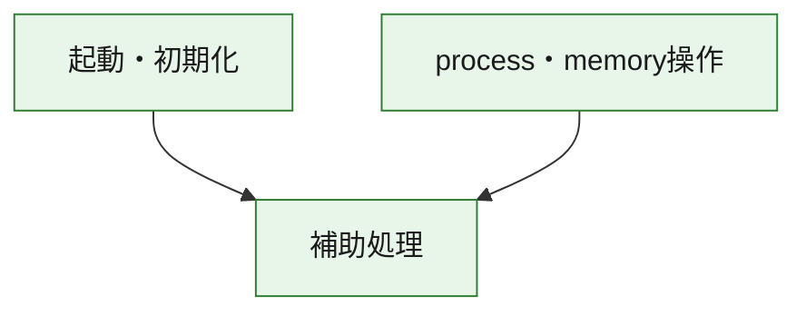
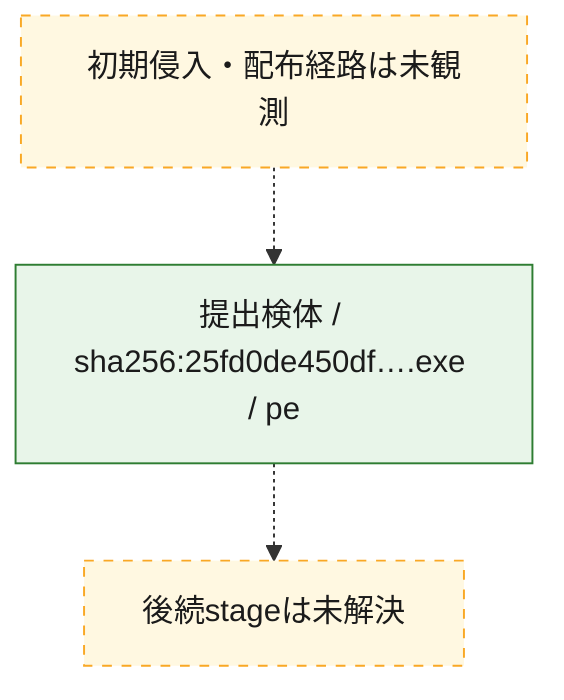
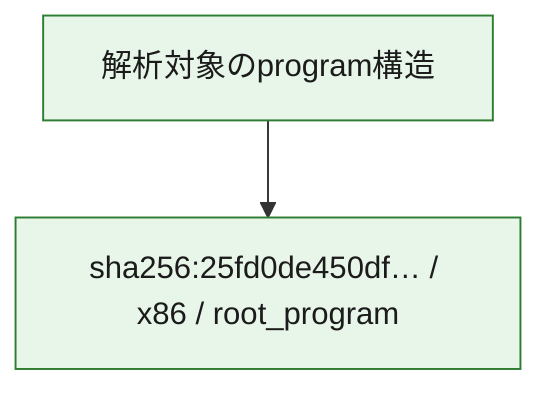

# 全体ロジック：25fd0de450dfcefe21d512f84a9da7ad528729b103952e1067179936b3351016

代表関数の静的証跡から、起動・初期化、process・memory操作の処理群を確認しました。

## 読み方

- phaseの掲載順は解析上の整理順です。observed_call_edgesがない段階間の実行順を断定しません。
- 図の実線は静的に観測した関係、点線と黄色のノードは未観測・未解決の関係を示します。
- 図は静的な要約であり、動的実行を再現するものではありません。
- 詳細な関数解説とfingerprintは[STATIC-LOGIC.md](STATIC-LOGIC.md)を参照してください。

## 静的可視化

### 実行フロー

### 感染チェーン

### モジュール関係

## 処理段階

### 1. 起動・初期化

entry pointから初期化と後続処理への移行を確認します。
確度: `confirmed_static_function_evidence`

- `25fd0de450dfcefe21d512f84a9da7ad528729b103952e1067179936b3351016:ghidra:140001460` — 初期化と主要処理への分岐を行う入口関数です。 状態: `succeeded`、選定理由: `entry_point`, `meaningful_symbol_name`, `reviewed_call_centrality:31`, `role:entrypoint`

### 2. process・memory操作

process、thread、module、memory操作と実行移行を確認します。
確度: `confirmed_static_function_evidence`

- `25fd0de450dfcefe21d512f84a9da7ad528729b103952e1067179936b3351016:ghidra:1400016d0` — process、thread、module、またはmemory操作に関係する関数です。 状態: `succeeded`、選定理由: `context_representative`, `reviewed_call_centrality:16`, `role:process_or_memory_operation`
- `25fd0de450dfcefe21d512f84a9da7ad528729b103952e1067179936b3351016:ghidra:140001730` — process、thread、module、またはmemory操作に関係する関数です。 状態: `succeeded`、選定理由: `context_representative`, `reviewed_call_centrality:12`, `role:process_or_memory_operation`

### 3. 補助処理

主要処理を支える一般内部関数またはlibrary処理を確認します。
確度: `confirmed_static_function_evidence_with_limits`

- `25fd0de450dfcefe21d512f84a9da7ad528729b103952e1067179936b3351016:ghidra:140001000` — 検体内部の一般処理を実装する関数です。 状態: `succeeded`、選定理由: `context_representative`
- `25fd0de450dfcefe21d512f84a9da7ad528729b103952e1067179936b3351016:ghidra:140001010` — 検体内部の一般処理を実装する関数です。 状態: `succeeded`、選定理由: `context_representative`
- `25fd0de450dfcefe21d512f84a9da7ad528729b103952e1067179936b3351016:ghidra:140001030` — 検体内部の一般処理を実装する関数です。 状態: `limited_bad_instruction_or_flow`、選定理由: `context_representative`, `reviewed_call_centrality:2`
- `25fd0de450dfcefe21d512f84a9da7ad528729b103952e1067179936b3351016:ghidra:140001040` — 検体内部の一般処理を実装する関数です。 状態: `succeeded`、選定理由: `context_representative`, `reviewed_call_centrality:33`
- `25fd0de450dfcefe21d512f84a9da7ad528729b103952e1067179936b3351016:ghidra:1400010a0` — 検体内部の一般処理を実装する関数です。 状態: `succeeded`、選定理由: `context_representative`, `reviewed_call_centrality:31`
- `25fd0de450dfcefe21d512f84a9da7ad528729b103952e1067179936b3351016:ghidra:140001480` — 検体内部の一般処理を実装する関数です。 状態: `succeeded`、選定理由: `context_representative`, `reviewed_call_centrality:31`
- `25fd0de450dfcefe21d512f84a9da7ad528729b103952e1067179936b3351016:ghidra:1400014a0` — 検体内部の一般処理を実装する関数です。 状態: `limited_bad_instruction_or_flow`、選定理由: `context_representative`, `reviewed_call_centrality:2`
- `25fd0de450dfcefe21d512f84a9da7ad528729b103952e1067179936b3351016:ghidra:1400014b0` — 検体内部の一般処理を実装する関数です。 状態: `limited_bad_instruction_or_flow`、選定理由: `context_representative`, `reviewed_call_centrality:2`
- `25fd0de450dfcefe21d512f84a9da7ad528729b103952e1067179936b3351016:ghidra:1400014c0` — 検体内部の一般処理を実装する関数です。 状態: `succeeded`、選定理由: `context_representative`
- `25fd0de450dfcefe21d512f84a9da7ad528729b103952e1067179936b3351016:ghidra:1400014d0` — 検体内部の一般処理を実装する関数です。 状態: `succeeded`、選定理由: `context_representative`
- `25fd0de450dfcefe21d512f84a9da7ad528729b103952e1067179936b3351016:ghidra:140001520` — 検体内部の一般処理を実装する関数です。 状態: `limited_bad_instruction_or_flow`、選定理由: `context_representative`, `reviewed_call_centrality:2`
- `25fd0de450dfcefe21d512f84a9da7ad528729b103952e1067179936b3351016:ghidra:1400015a0` — 検体内部の一般処理を実装する関数です。 状態: `limited_bad_instruction_or_flow`、選定理由: `context_representative`, `reviewed_call_centrality:6`
- `25fd0de450dfcefe21d512f84a9da7ad528729b103952e1067179936b3351016:ghidra:1400015c0` — 検体内部の一般処理を実装する関数です。 状態: `succeeded`、選定理由: `context_representative`, `reviewed_call_centrality:4`
- `25fd0de450dfcefe21d512f84a9da7ad528729b103952e1067179936b3351016:ghidra:1400015d0` — 検体内部の一般処理を実装する関数です。 状態: `succeeded`、選定理由: `context_representative`, `reviewed_call_centrality:2`
- `25fd0de450dfcefe21d512f84a9da7ad528729b103952e1067179936b3351016:ghidra:1400018a0` — 検体内部の一般処理を実装する関数です。 状態: `succeeded`、選定理由: `context_representative`, `reviewed_call_centrality:7`
- `25fd0de450dfcefe21d512f84a9da7ad528729b103952e1067179936b3351016:ghidra:140001c40` — 検体内部の一般処理を実装する関数です。 状態: `succeeded`、選定理由: `context_representative`
- `25fd0de450dfcefe21d512f84a9da7ad528729b103952e1067179936b3351016:ghidra:140001c80` — 検体内部の一般処理を実装する関数です。 状態: `limited_bad_instruction_or_flow`、選定理由: `context_representative`, `reviewed_call_centrality:6`
- `25fd0de450dfcefe21d512f84a9da7ad528729b103952e1067179936b3351016:ghidra:140001c90` — 検体内部の一般処理を実装する関数です。 状態: `succeeded`、選定理由: `context_representative`, `reviewed_call_centrality:4`
- `25fd0de450dfcefe21d512f84a9da7ad528729b103952e1067179936b3351016:ghidra:140001ca0` — 検体内部の一般処理を実装する関数です。 状態: `succeeded`、選定理由: `context_representative`
- `25fd0de450dfcefe21d512f84a9da7ad528729b103952e1067179936b3351016:ghidra:140001cd0` — 検体内部の一般処理を実装する関数です。 状態: `succeeded`、選定理由: `context_representative`
- `25fd0de450dfcefe21d512f84a9da7ad528729b103952e1067179936b3351016:ghidra:140001d20` — 検体内部の一般処理を実装する関数です。 状態: `succeeded`、選定理由: `context_representative`, `reviewed_call_centrality:3`
- `25fd0de450dfcefe21d512f84a9da7ad528729b103952e1067179936b3351016:ghidra:140001da0` — 検体内部の一般処理を実装する関数です。 状態: `succeeded`、選定理由: `context_representative`, `reviewed_call_centrality:4`
- `25fd0de450dfcefe21d512f84a9da7ad528729b103952e1067179936b3351016:ghidra:140001dd0` — 検体内部の一般処理を実装する関数です。 状態: `succeeded`、選定理由: `context_representative`, `reviewed_call_centrality:3`
- `25fd0de450dfcefe21d512f84a9da7ad528729b103952e1067179936b3351016:ghidra:140001e40` — 検体内部の一般処理を実装する関数です。 状態: `succeeded`、選定理由: `context_representative`, `reviewed_call_centrality:3`
- `25fd0de450dfcefe21d512f84a9da7ad528729b103952e1067179936b3351016:ghidra:140001ec0` — 検体内部の一般処理を実装する関数です。 状態: `succeeded`、選定理由: `context_representative`, `reviewed_call_centrality:2`
- `25fd0de450dfcefe21d512f84a9da7ad528729b103952e1067179936b3351016:ghidra:140001fc0` — 検体内部の一般処理を実装する関数です。 状態: `succeeded`、選定理由: `context_representative`, `reviewed_call_centrality:4`
- `25fd0de450dfcefe21d512f84a9da7ad528729b103952e1067179936b3351016:ghidra:140002030` — 検体内部の一般処理を実装する関数です。 状態: `succeeded`、選定理由: `context_representative`, `reviewed_call_centrality:3`
- `25fd0de450dfcefe21d512f84a9da7ad528729b103952e1067179936b3351016:ghidra:1400021a0` — 検体内部の一般処理を実装する関数です。 状態: `succeeded`、選定理由: `context_representative`, `reviewed_call_centrality:2`
- `25fd0de450dfcefe21d512f84a9da7ad528729b103952e1067179936b3351016:ghidra:1400022e0` — 検体内部の一般処理を実装する関数です。 状態: `succeeded`、選定理由: `context_representative`, `reviewed_call_centrality:4`

## 観測したcall関係

- `25fd0de450dfcefe21d512f84a9da7ad528729b103952e1067179936b3351016:ghidra:140001040` → `25fd0de450dfcefe21d512f84a9da7ad528729b103952e1067179936b3351016:ghidra:1400015a0` （`support` → `support`）
- `25fd0de450dfcefe21d512f84a9da7ad528729b103952e1067179936b3351016:ghidra:140001040` → `25fd0de450dfcefe21d512f84a9da7ad528729b103952e1067179936b3351016:ghidra:1400015c0` （`support` → `support`）
- `25fd0de450dfcefe21d512f84a9da7ad528729b103952e1067179936b3351016:ghidra:140001040` → `25fd0de450dfcefe21d512f84a9da7ad528729b103952e1067179936b3351016:ghidra:1400018a0` （`support` → `support`）
- `25fd0de450dfcefe21d512f84a9da7ad528729b103952e1067179936b3351016:ghidra:140001040` → `25fd0de450dfcefe21d512f84a9da7ad528729b103952e1067179936b3351016:ghidra:140001c80` （`support` → `support`）
- `25fd0de450dfcefe21d512f84a9da7ad528729b103952e1067179936b3351016:ghidra:140001040` → `25fd0de450dfcefe21d512f84a9da7ad528729b103952e1067179936b3351016:ghidra:140001c90` （`support` → `support`）
- `25fd0de450dfcefe21d512f84a9da7ad528729b103952e1067179936b3351016:ghidra:1400010a0` → `25fd0de450dfcefe21d512f84a9da7ad528729b103952e1067179936b3351016:ghidra:1400015a0` （`support` → `support`）
- `25fd0de450dfcefe21d512f84a9da7ad528729b103952e1067179936b3351016:ghidra:1400010a0` → `25fd0de450dfcefe21d512f84a9da7ad528729b103952e1067179936b3351016:ghidra:1400015c0` （`support` → `support`）
- `25fd0de450dfcefe21d512f84a9da7ad528729b103952e1067179936b3351016:ghidra:1400010a0` → `25fd0de450dfcefe21d512f84a9da7ad528729b103952e1067179936b3351016:ghidra:1400018a0` （`support` → `support`）
- `25fd0de450dfcefe21d512f84a9da7ad528729b103952e1067179936b3351016:ghidra:1400010a0` → `25fd0de450dfcefe21d512f84a9da7ad528729b103952e1067179936b3351016:ghidra:140001c80` （`support` → `support`）
- `25fd0de450dfcefe21d512f84a9da7ad528729b103952e1067179936b3351016:ghidra:1400010a0` → `25fd0de450dfcefe21d512f84a9da7ad528729b103952e1067179936b3351016:ghidra:140001c90` （`support` → `support`）
- `25fd0de450dfcefe21d512f84a9da7ad528729b103952e1067179936b3351016:ghidra:140001460` → `25fd0de450dfcefe21d512f84a9da7ad528729b103952e1067179936b3351016:ghidra:1400015a0` （`startup` → `support`）
- `25fd0de450dfcefe21d512f84a9da7ad528729b103952e1067179936b3351016:ghidra:140001460` → `25fd0de450dfcefe21d512f84a9da7ad528729b103952e1067179936b3351016:ghidra:1400015c0` （`startup` → `support`）
- `25fd0de450dfcefe21d512f84a9da7ad528729b103952e1067179936b3351016:ghidra:140001460` → `25fd0de450dfcefe21d512f84a9da7ad528729b103952e1067179936b3351016:ghidra:1400018a0` （`startup` → `support`）
- `25fd0de450dfcefe21d512f84a9da7ad528729b103952e1067179936b3351016:ghidra:140001460` → `25fd0de450dfcefe21d512f84a9da7ad528729b103952e1067179936b3351016:ghidra:140001c80` （`startup` → `support`）
- `25fd0de450dfcefe21d512f84a9da7ad528729b103952e1067179936b3351016:ghidra:140001460` → `25fd0de450dfcefe21d512f84a9da7ad528729b103952e1067179936b3351016:ghidra:140001c90` （`startup` → `support`）
- `25fd0de450dfcefe21d512f84a9da7ad528729b103952e1067179936b3351016:ghidra:140001480` → `25fd0de450dfcefe21d512f84a9da7ad528729b103952e1067179936b3351016:ghidra:1400015a0` （`support` → `support`）
- `25fd0de450dfcefe21d512f84a9da7ad528729b103952e1067179936b3351016:ghidra:140001480` → `25fd0de450dfcefe21d512f84a9da7ad528729b103952e1067179936b3351016:ghidra:1400015c0` （`support` → `support`）
- `25fd0de450dfcefe21d512f84a9da7ad528729b103952e1067179936b3351016:ghidra:140001480` → `25fd0de450dfcefe21d512f84a9da7ad528729b103952e1067179936b3351016:ghidra:1400018a0` （`support` → `support`）
- `25fd0de450dfcefe21d512f84a9da7ad528729b103952e1067179936b3351016:ghidra:140001480` → `25fd0de450dfcefe21d512f84a9da7ad528729b103952e1067179936b3351016:ghidra:140001c80` （`support` → `support`）
- `25fd0de450dfcefe21d512f84a9da7ad528729b103952e1067179936b3351016:ghidra:140001480` → `25fd0de450dfcefe21d512f84a9da7ad528729b103952e1067179936b3351016:ghidra:140001c90` （`support` → `support`）
- `25fd0de450dfcefe21d512f84a9da7ad528729b103952e1067179936b3351016:ghidra:1400016d0` → `25fd0de450dfcefe21d512f84a9da7ad528729b103952e1067179936b3351016:ghidra:140001d20` （`execution` → `support`）
- `25fd0de450dfcefe21d512f84a9da7ad528729b103952e1067179936b3351016:ghidra:1400016d0` → `25fd0de450dfcefe21d512f84a9da7ad528729b103952e1067179936b3351016:ghidra:140001da0` （`execution` → `support`）
- `25fd0de450dfcefe21d512f84a9da7ad528729b103952e1067179936b3351016:ghidra:1400016d0` → `25fd0de450dfcefe21d512f84a9da7ad528729b103952e1067179936b3351016:ghidra:140001dd0` （`execution` → `support`）
- `25fd0de450dfcefe21d512f84a9da7ad528729b103952e1067179936b3351016:ghidra:140001730` → `25fd0de450dfcefe21d512f84a9da7ad528729b103952e1067179936b3351016:ghidra:1400016d0` （`execution` → `execution`）
- `25fd0de450dfcefe21d512f84a9da7ad528729b103952e1067179936b3351016:ghidra:140001730` → `25fd0de450dfcefe21d512f84a9da7ad528729b103952e1067179936b3351016:ghidra:140001d20` （`execution` → `support`）
- `25fd0de450dfcefe21d512f84a9da7ad528729b103952e1067179936b3351016:ghidra:140001730` → `25fd0de450dfcefe21d512f84a9da7ad528729b103952e1067179936b3351016:ghidra:140001da0` （`execution` → `support`）
- `25fd0de450dfcefe21d512f84a9da7ad528729b103952e1067179936b3351016:ghidra:140001730` → `25fd0de450dfcefe21d512f84a9da7ad528729b103952e1067179936b3351016:ghidra:140001dd0` （`execution` → `support`）
- `25fd0de450dfcefe21d512f84a9da7ad528729b103952e1067179936b3351016:ghidra:1400018a0` → `25fd0de450dfcefe21d512f84a9da7ad528729b103952e1067179936b3351016:ghidra:140001da0` （`support` → `support`）
- `25fd0de450dfcefe21d512f84a9da7ad528729b103952e1067179936b3351016:ghidra:140002030` → `25fd0de450dfcefe21d512f84a9da7ad528729b103952e1067179936b3351016:ghidra:140001fc0` （`support` → `support`）
- `25fd0de450dfcefe21d512f84a9da7ad528729b103952e1067179936b3351016:ghidra:1400021a0` → `25fd0de450dfcefe21d512f84a9da7ad528729b103952e1067179936b3351016:ghidra:140001fc0` （`support` → `support`）
- `25fd0de450dfcefe21d512f84a9da7ad528729b103952e1067179936b3351016:ghidra:1400022e0` → `25fd0de450dfcefe21d512f84a9da7ad528729b103952e1067179936b3351016:ghidra:140001fc0` （`support` → `support`）
- `ghidra-function:02e2f958d6ffe68aba59a8ce` → `ghidra-external:a11a8adb6cb5f67ad357f595` （`unclassified` → `unclassified`）
- `ghidra-function:02e2f958d6ffe68aba59a8ce` → `ghidra-function:bc0211cd9221c70c66b16c56` （`unclassified` → `unclassified`）
- `ghidra-function:1f8e0f89dc23a3d6bd1094c0` → `ghidra-function:1fbba4425cf2cd801d2cc08a` （`unclassified` → `unclassified`）
- `ghidra-function:20ad83191ff994532c7f3794` → `ghidra-function:1fbba4425cf2cd801d2cc08a` （`unclassified` → `unclassified`）
- `ghidra-function:251cbf1a618ac53ec1472bac` → `ghidra-external:7a680f9754618340ab80b2b4` （`unclassified` → `unclassified`）
- `ghidra-function:251cbf1a618ac53ec1472bac` → `ghidra-external:b148eb0be620d8d90a255908` （`unclassified` → `unclassified`）
- `ghidra-function:251cbf1a618ac53ec1472bac` → `ghidra-function:162f16d68e03b02c7673529a` （`unclassified` → `unclassified`）
- `ghidra-function:251cbf1a618ac53ec1472bac` → `ghidra-function:447a5440dfc988e04d0ee2b5` （`unclassified` → `unclassified`）
- `ghidra-function:251cbf1a618ac53ec1472bac` → `ghidra-function:4bba95c777f2dfdb5c2fdd11` （`unclassified` → `unclassified`）
- `ghidra-function:251cbf1a618ac53ec1472bac` → `ghidra-function:8bc41ef34d0158b6b8a6a12b` （`unclassified` → `unclassified`）
- `ghidra-function:251cbf1a618ac53ec1472bac` → `ghidra-function:daddb8167f76d946928d56f5` （`unclassified` → `unclassified`）
- `ghidra-function:251cbf1a618ac53ec1472bac` → `ghidra-function:eb194ed71024af76431df260` （`unclassified` → `unclassified`）
- `ghidra-function:251cbf1a618ac53ec1472bac` → `ghidra-function:fca61d570f7774088920f64d` （`unclassified` → `unclassified`）
- `ghidra-function:2a473e3624291fa66e2f1be9` → `ghidra-external:14d7f2b094e33db1652b05d1` （`unclassified` → `unclassified`）
- `ghidra-function:2a473e3624291fa66e2f1be9` → `ghidra-function:92f6180dd55d35cca1b94ed5` （`unclassified` → `unclassified`）
- `ghidra-function:447a5440dfc988e04d0ee2b5` → `ghidra-external:b148eb0be620d8d90a255908` （`unclassified` → `unclassified`）
- `ghidra-function:4755a84b50b18103e55b06c6` → `ghidra-function:04f3fff26d7cc3b302f98074` （`unclassified` → `unclassified`）
- `ghidra-function:4755a84b50b18103e55b06c6` → `ghidra-function:aa9b8ba34c1f9d617472e921` （`unclassified` → `unclassified`）
- `ghidra-function:4755a84b50b18103e55b06c6` → `ghidra-function:e7f4a63ea32539f63d0740e9` （`unclassified` → `unclassified`）
- `ghidra-function:498c5dc6fbbbd1880ae327e6` → `ghidra-function:1fbba4425cf2cd801d2cc08a` （`unclassified` → `unclassified`）
- `ghidra-function:4c01d0671436641d8cc11d2e` → `ghidra-external:19d55fff420d9c6c9dcc4b14` （`unclassified` → `unclassified`）
- `ghidra-function:4c01d0671436641d8cc11d2e` → `ghidra-function:ba621b07c8d3d2a339f44b49` （`unclassified` → `unclassified`）
- `ghidra-function:4c01d0671436641d8cc11d2e` → `ghidra-function:dfc8c7fc48e1206f16e7ccc7` （`unclassified` → `unclassified`）
- `ghidra-function:50f45920079b6fb625188590` → `ghidra-external:22003a045274bb233ddbf05d` （`unclassified` → `unclassified`）
- `ghidra-function:50f45920079b6fb625188590` → `ghidra-external:2ce885656f4a56036c5e63ab` （`unclassified` → `unclassified`）
- `ghidra-function:50f45920079b6fb625188590` → `ghidra-external:327d19cacacd206ac2f1d50e` （`unclassified` → `unclassified`）
- `ghidra-function:50f45920079b6fb625188590` → `ghidra-external:4c6dc661ceee216e1bea80ba` （`unclassified` → `unclassified`）
- `ghidra-function:50f45920079b6fb625188590` → `ghidra-external:630cad44a78a45d1ba5e191f` （`unclassified` → `unclassified`）
- `ghidra-function:50f45920079b6fb625188590` → `ghidra-external:64e9fbc12fb2c57fba063ff5` （`unclassified` → `unclassified`）
- `ghidra-function:50f45920079b6fb625188590` → `ghidra-external:b148eb0be620d8d90a255908` （`unclassified` → `unclassified`）
- `ghidra-function:50f45920079b6fb625188590` → `ghidra-external:b5c20785052fb261dcb09bb5` （`unclassified` → `unclassified`）
- `ghidra-function:50f45920079b6fb625188590` → `ghidra-external:b975d0ef3c4bf0bc1f87f151` （`unclassified` → `unclassified`）
- `ghidra-function:50f45920079b6fb625188590` → `ghidra-external:c403706cd72f778ec7ad35c7` （`unclassified` → `unclassified`）
- `ghidra-function:50f45920079b6fb625188590` → `ghidra-external:cbc3df32a77c1445cd0217b4` （`unclassified` → `unclassified`）
- `ghidra-function:50f45920079b6fb625188590` → `ghidra-external:dc664d11cd1fc109448eb32e` （`unclassified` → `unclassified`）
- `ghidra-function:50f45920079b6fb625188590` → `ghidra-external:e6aa2c63c518166670a03644` （`unclassified` → `unclassified`）
- `ghidra-function:50f45920079b6fb625188590` → `ghidra-external:f7da52649579a1926cbda47c` （`unclassified` → `unclassified`）
- `ghidra-function:50f45920079b6fb625188590` → `ghidra-external:fc788989902353d160aebc6b` （`unclassified` → `unclassified`）
- `ghidra-function:50f45920079b6fb625188590` → `ghidra-function:2c60758de34ca679f4468000` （`unclassified` → `unclassified`）
- `ghidra-function:50f45920079b6fb625188590` → `ghidra-function:498c5dc6fbbbd1880ae327e6` （`unclassified` → `unclassified`）
- `ghidra-function:50f45920079b6fb625188590` → `ghidra-function:604ad2e8b00c3fb21278ebd9` （`unclassified` → `unclassified`）
- `ghidra-function:50f45920079b6fb625188590` → `ghidra-function:606ee785ea4cacdb04ba2adb` （`unclassified` → `unclassified`）
- `ghidra-function:50f45920079b6fb625188590` → `ghidra-function:66b37f476c9f9d7aee63f630` （`unclassified` → `unclassified`）
- `ghidra-function:50f45920079b6fb625188590` → `ghidra-function:69cb2e44cc122e98cca2523f` （`unclassified` → `unclassified`）
- `ghidra-function:50f45920079b6fb625188590` → `ghidra-function:7de28be94821b91747b47484` （`unclassified` → `unclassified`）
- `ghidra-function:50f45920079b6fb625188590` → `ghidra-function:addd61201ebf8fb0b0f331ca` （`unclassified` → `unclassified`）
- `ghidra-function:50f45920079b6fb625188590` → `ghidra-function:bc0211cd9221c70c66b16c56` （`unclassified` → `unclassified`）
- `ghidra-function:50f45920079b6fb625188590` → `ghidra-function:d536afcf1e37039333fe8037` （`unclassified` → `unclassified`）
- `ghidra-function:50f45920079b6fb625188590` → `ghidra-function:d787b99879ec783b1e1778b0` （`unclassified` → `unclassified`）
- `ghidra-function:50f45920079b6fb625188590` → `ghidra-function:e02353d89ecad6b502115b6a` （`unclassified` → `unclassified`）
- `ghidra-function:50f45920079b6fb625188590` → `ghidra-function:fb230af808fad6dc2bfa3270` （`unclassified` → `unclassified`）
- `ghidra-function:50f45920079b6fb625188590` → `ghidra-function:ff5c146788efbe3776e82f8c` （`unclassified` → `unclassified`）
- `ghidra-function:606ee785ea4cacdb04ba2adb` → `ghidra-external:7a680f9754618340ab80b2b4` （`unclassified` → `unclassified`）
- `ghidra-function:606ee785ea4cacdb04ba2adb` → `ghidra-external:b148eb0be620d8d90a255908` （`unclassified` → `unclassified`）
- `ghidra-function:606ee785ea4cacdb04ba2adb` → `ghidra-function:8bc41ef34d0158b6b8a6a12b` （`unclassified` → `unclassified`）
- `ghidra-function:66a4bc5b16182558a768236c` → `ghidra-external:22003a045274bb233ddbf05d` （`unclassified` → `unclassified`）
- `ghidra-function:66a4bc5b16182558a768236c` → `ghidra-external:2ce885656f4a56036c5e63ab` （`unclassified` → `unclassified`）
- `ghidra-function:66a4bc5b16182558a768236c` → `ghidra-external:327d19cacacd206ac2f1d50e` （`unclassified` → `unclassified`）
- `ghidra-function:66a4bc5b16182558a768236c` → `ghidra-external:4c6dc661ceee216e1bea80ba` （`unclassified` → `unclassified`）
- `ghidra-function:66a4bc5b16182558a768236c` → `ghidra-external:630cad44a78a45d1ba5e191f` （`unclassified` → `unclassified`）
- `ghidra-function:66a4bc5b16182558a768236c` → `ghidra-external:64e9fbc12fb2c57fba063ff5` （`unclassified` → `unclassified`）
- `ghidra-function:66a4bc5b16182558a768236c` → `ghidra-external:b148eb0be620d8d90a255908` （`unclassified` → `unclassified`）
- `ghidra-function:66a4bc5b16182558a768236c` → `ghidra-external:b5c20785052fb261dcb09bb5` （`unclassified` → `unclassified`）
- `ghidra-function:66a4bc5b16182558a768236c` → `ghidra-external:b975d0ef3c4bf0bc1f87f151` （`unclassified` → `unclassified`）
- `ghidra-function:66a4bc5b16182558a768236c` → `ghidra-external:c403706cd72f778ec7ad35c7` （`unclassified` → `unclassified`）
- `ghidra-function:66a4bc5b16182558a768236c` → `ghidra-external:cbc3df32a77c1445cd0217b4` （`unclassified` → `unclassified`）
- `ghidra-function:66a4bc5b16182558a768236c` → `ghidra-external:dc664d11cd1fc109448eb32e` （`unclassified` → `unclassified`）
- `ghidra-function:66a4bc5b16182558a768236c` → `ghidra-external:e6aa2c63c518166670a03644` （`unclassified` → `unclassified`）
- `ghidra-function:66a4bc5b16182558a768236c` → `ghidra-external:f7da52649579a1926cbda47c` （`unclassified` → `unclassified`）
- `ghidra-function:66a4bc5b16182558a768236c` → `ghidra-external:fc788989902353d160aebc6b` （`unclassified` → `unclassified`）
- `ghidra-function:66a4bc5b16182558a768236c` → `ghidra-function:2c60758de34ca679f4468000` （`unclassified` → `unclassified`）
- `ghidra-function:66a4bc5b16182558a768236c` → `ghidra-function:498c5dc6fbbbd1880ae327e6` （`unclassified` → `unclassified`）
- `ghidra-function:66a4bc5b16182558a768236c` → `ghidra-function:604ad2e8b00c3fb21278ebd9` （`unclassified` → `unclassified`）
- `ghidra-function:66a4bc5b16182558a768236c` → `ghidra-function:606ee785ea4cacdb04ba2adb` （`unclassified` → `unclassified`）
- `ghidra-function:66a4bc5b16182558a768236c` → `ghidra-function:66b37f476c9f9d7aee63f630` （`unclassified` → `unclassified`）
- `ghidra-function:66a4bc5b16182558a768236c` → `ghidra-function:69cb2e44cc122e98cca2523f` （`unclassified` → `unclassified`）
- `ghidra-function:66a4bc5b16182558a768236c` → `ghidra-function:7de28be94821b91747b47484` （`unclassified` → `unclassified`）
- `ghidra-function:66a4bc5b16182558a768236c` → `ghidra-function:addd61201ebf8fb0b0f331ca` （`unclassified` → `unclassified`）
- `ghidra-function:66a4bc5b16182558a768236c` → `ghidra-function:bc0211cd9221c70c66b16c56` （`unclassified` → `unclassified`）
- `ghidra-function:66a4bc5b16182558a768236c` → `ghidra-function:d536afcf1e37039333fe8037` （`unclassified` → `unclassified`）
- `ghidra-function:66a4bc5b16182558a768236c` → `ghidra-function:d787b99879ec783b1e1778b0` （`unclassified` → `unclassified`）
- `ghidra-function:66a4bc5b16182558a768236c` → `ghidra-function:e02353d89ecad6b502115b6a` （`unclassified` → `unclassified`）
- `ghidra-function:66a4bc5b16182558a768236c` → `ghidra-function:fb230af808fad6dc2bfa3270` （`unclassified` → `unclassified`）
- `ghidra-function:66a4bc5b16182558a768236c` → `ghidra-function:ff5c146788efbe3776e82f8c` （`unclassified` → `unclassified`）
- `ghidra-function:8bc41ef34d0158b6b8a6a12b` → `ghidra-external:b148eb0be620d8d90a255908` （`unclassified` → `unclassified`）
- `ghidra-function:aded2f5ff7d5ad630fb1d02e` → `ghidra-external:19d55fff420d9c6c9dcc4b14` （`unclassified` → `unclassified`）
- `ghidra-function:aded2f5ff7d5ad630fb1d02e` → `ghidra-external:b975d0ef3c4bf0bc1f87f151` （`unclassified` → `unclassified`）
- `ghidra-function:aded2f5ff7d5ad630fb1d02e` → `ghidra-function:cb98201de609f5228f5174a9` （`unclassified` → `unclassified`）
- `ghidra-function:aded2f5ff7d5ad630fb1d02e` → `ghidra-function:dfc8c7fc48e1206f16e7ccc7` （`unclassified` → `unclassified`）
- `ghidra-function:cb93363aec377168845f65e4` → `ghidra-external:22003a045274bb233ddbf05d` （`unclassified` → `unclassified`）
- `ghidra-function:cb93363aec377168845f65e4` → `ghidra-external:2ce885656f4a56036c5e63ab` （`unclassified` → `unclassified`）
- `ghidra-function:cb93363aec377168845f65e4` → `ghidra-external:327d19cacacd206ac2f1d50e` （`unclassified` → `unclassified`）
- `ghidra-function:cb93363aec377168845f65e4` → `ghidra-external:44802cda51778cddbef3d39a` （`unclassified` → `unclassified`）
- `ghidra-function:cb93363aec377168845f65e4` → `ghidra-external:4c6dc661ceee216e1bea80ba` （`unclassified` → `unclassified`）
- `ghidra-function:cb93363aec377168845f65e4` → `ghidra-external:630cad44a78a45d1ba5e191f` （`unclassified` → `unclassified`）
- `ghidra-function:cb93363aec377168845f65e4` → `ghidra-external:64e9fbc12fb2c57fba063ff5` （`unclassified` → `unclassified`）
- `ghidra-function:cb93363aec377168845f65e4` → `ghidra-external:b148eb0be620d8d90a255908` （`unclassified` → `unclassified`）
- `ghidra-function:cb93363aec377168845f65e4` → `ghidra-external:b5c20785052fb261dcb09bb5` （`unclassified` → `unclassified`）
- `ghidra-function:cb93363aec377168845f65e4` → `ghidra-external:b975d0ef3c4bf0bc1f87f151` （`unclassified` → `unclassified`）
- `ghidra-function:cb93363aec377168845f65e4` → `ghidra-external:c403706cd72f778ec7ad35c7` （`unclassified` → `unclassified`）
- `ghidra-function:cb93363aec377168845f65e4` → `ghidra-external:cb1efdda38d952c9073e910f` （`unclassified` → `unclassified`）
- `ghidra-function:cb93363aec377168845f65e4` → `ghidra-external:cbc3df32a77c1445cd0217b4` （`unclassified` → `unclassified`）
- `ghidra-function:cb93363aec377168845f65e4` → `ghidra-external:dc664d11cd1fc109448eb32e` （`unclassified` → `unclassified`）
- `ghidra-function:cb93363aec377168845f65e4` → `ghidra-external:e6aa2c63c518166670a03644` （`unclassified` → `unclassified`）
- `ghidra-function:cb93363aec377168845f65e4` → `ghidra-external:f7da52649579a1926cbda47c` （`unclassified` → `unclassified`）
- `ghidra-function:cb93363aec377168845f65e4` → `ghidra-external:fc788989902353d160aebc6b` （`unclassified` → `unclassified`）
- `ghidra-function:cb93363aec377168845f65e4` → `ghidra-function:2c60758de34ca679f4468000` （`unclassified` → `unclassified`）
- `ghidra-function:cb93363aec377168845f65e4` → `ghidra-function:498c5dc6fbbbd1880ae327e6` （`unclassified` → `unclassified`）
- `ghidra-function:cb93363aec377168845f65e4` → `ghidra-function:604ad2e8b00c3fb21278ebd9` （`unclassified` → `unclassified`）
- `ghidra-function:cb93363aec377168845f65e4` → `ghidra-function:606ee785ea4cacdb04ba2adb` （`unclassified` → `unclassified`）
- `ghidra-function:cb93363aec377168845f65e4` → `ghidra-function:66b37f476c9f9d7aee63f630` （`unclassified` → `unclassified`）
- `ghidra-function:cb93363aec377168845f65e4` → `ghidra-function:69cb2e44cc122e98cca2523f` （`unclassified` → `unclassified`）
- `ghidra-function:cb93363aec377168845f65e4` → `ghidra-function:7de28be94821b91747b47484` （`unclassified` → `unclassified`）
- `ghidra-function:cb93363aec377168845f65e4` → `ghidra-function:addd61201ebf8fb0b0f331ca` （`unclassified` → `unclassified`）
- `ghidra-function:cb93363aec377168845f65e4` → `ghidra-function:bc0211cd9221c70c66b16c56` （`unclassified` → `unclassified`）
- `ghidra-function:cb93363aec377168845f65e4` → `ghidra-function:d536afcf1e37039333fe8037` （`unclassified` → `unclassified`）
- `ghidra-function:cb93363aec377168845f65e4` → `ghidra-function:d787b99879ec783b1e1778b0` （`unclassified` → `unclassified`）
- `ghidra-function:cb93363aec377168845f65e4` → `ghidra-function:e02353d89ecad6b502115b6a` （`unclassified` → `unclassified`）
- `ghidra-function:cb93363aec377168845f65e4` → `ghidra-function:fb230af808fad6dc2bfa3270` （`unclassified` → `unclassified`）
- `ghidra-function:cb93363aec377168845f65e4` → `ghidra-function:ff5c146788efbe3776e82f8c` （`unclassified` → `unclassified`）
- `ghidra-function:d6d8cf0efdb75011d57d8442` → `ghidra-external:19d55fff420d9c6c9dcc4b14` （`unclassified` → `unclassified`）
- `ghidra-function:d6d8cf0efdb75011d57d8442` → `ghidra-function:dfc8c7fc48e1206f16e7ccc7` （`unclassified` → `unclassified`）
- `ghidra-function:daddb8167f76d946928d56f5` → `ghidra-external:b148eb0be620d8d90a255908` （`unclassified` → `unclassified`）
- `ghidra-function:dfc8c7fc48e1206f16e7ccc7` → `ghidra-external:19d55fff420d9c6c9dcc4b14` （`unclassified` → `unclassified`）
- `ghidra-function:e02353d89ecad6b502115b6a` → `ghidra-function:c58d621dac261ac3fd7680c7` （`unclassified` → `unclassified`）
- `ghidra-function:e03e613656f4c2f18fd776a2` → `ghidra-external:22003a045274bb233ddbf05d` （`unclassified` → `unclassified`）
- `ghidra-function:e03e613656f4c2f18fd776a2` → `ghidra-external:2ce885656f4a56036c5e63ab` （`unclassified` → `unclassified`）
- `ghidra-function:e03e613656f4c2f18fd776a2` → `ghidra-external:327d19cacacd206ac2f1d50e` （`unclassified` → `unclassified`）
- `ghidra-function:e03e613656f4c2f18fd776a2` → `ghidra-external:4c6dc661ceee216e1bea80ba` （`unclassified` → `unclassified`）
- `ghidra-function:e03e613656f4c2f18fd776a2` → `ghidra-external:630cad44a78a45d1ba5e191f` （`unclassified` → `unclassified`）
- `ghidra-function:e03e613656f4c2f18fd776a2` → `ghidra-external:64e9fbc12fb2c57fba063ff5` （`unclassified` → `unclassified`）
- `ghidra-function:e03e613656f4c2f18fd776a2` → `ghidra-external:b148eb0be620d8d90a255908` （`unclassified` → `unclassified`）
- `ghidra-function:e03e613656f4c2f18fd776a2` → `ghidra-external:b5c20785052fb261dcb09bb5` （`unclassified` → `unclassified`）
- `ghidra-function:e03e613656f4c2f18fd776a2` → `ghidra-external:b975d0ef3c4bf0bc1f87f151` （`unclassified` → `unclassified`）
- `ghidra-function:e03e613656f4c2f18fd776a2` → `ghidra-external:c403706cd72f778ec7ad35c7` （`unclassified` → `unclassified`）
- `ghidra-function:e03e613656f4c2f18fd776a2` → `ghidra-external:cbc3df32a77c1445cd0217b4` （`unclassified` → `unclassified`）
- `ghidra-function:e03e613656f4c2f18fd776a2` → `ghidra-external:dc664d11cd1fc109448eb32e` （`unclassified` → `unclassified`）
- `ghidra-function:e03e613656f4c2f18fd776a2` → `ghidra-external:e6aa2c63c518166670a03644` （`unclassified` → `unclassified`）
- `ghidra-function:e03e613656f4c2f18fd776a2` → `ghidra-external:f7da52649579a1926cbda47c` （`unclassified` → `unclassified`）
- `ghidra-function:e03e613656f4c2f18fd776a2` → `ghidra-external:fc788989902353d160aebc6b` （`unclassified` → `unclassified`）
- `ghidra-function:e03e613656f4c2f18fd776a2` → `ghidra-function:2c60758de34ca679f4468000` （`unclassified` → `unclassified`）
- `ghidra-function:e03e613656f4c2f18fd776a2` → `ghidra-function:498c5dc6fbbbd1880ae327e6` （`unclassified` → `unclassified`）
- `ghidra-function:e03e613656f4c2f18fd776a2` → `ghidra-function:604ad2e8b00c3fb21278ebd9` （`unclassified` → `unclassified`）
- `ghidra-function:e03e613656f4c2f18fd776a2` → `ghidra-function:606ee785ea4cacdb04ba2adb` （`unclassified` → `unclassified`）
- `ghidra-function:e03e613656f4c2f18fd776a2` → `ghidra-function:66b37f476c9f9d7aee63f630` （`unclassified` → `unclassified`）
- `ghidra-function:e03e613656f4c2f18fd776a2` → `ghidra-function:69cb2e44cc122e98cca2523f` （`unclassified` → `unclassified`）
- `ghidra-function:e03e613656f4c2f18fd776a2` → `ghidra-function:7de28be94821b91747b47484` （`unclassified` → `unclassified`）
- `ghidra-function:e03e613656f4c2f18fd776a2` → `ghidra-function:addd61201ebf8fb0b0f331ca` （`unclassified` → `unclassified`）
- `ghidra-function:e03e613656f4c2f18fd776a2` → `ghidra-function:bc0211cd9221c70c66b16c56` （`unclassified` → `unclassified`）
- `ghidra-function:e03e613656f4c2f18fd776a2` → `ghidra-function:d536afcf1e37039333fe8037` （`unclassified` → `unclassified`）
- `ghidra-function:e03e613656f4c2f18fd776a2` → `ghidra-function:d787b99879ec783b1e1778b0` （`unclassified` → `unclassified`）
- `ghidra-function:e03e613656f4c2f18fd776a2` → `ghidra-function:e02353d89ecad6b502115b6a` （`unclassified` → `unclassified`）
- `ghidra-function:e03e613656f4c2f18fd776a2` → `ghidra-function:fb230af808fad6dc2bfa3270` （`unclassified` → `unclassified`）
- `ghidra-function:e03e613656f4c2f18fd776a2` → `ghidra-function:ff5c146788efbe3776e82f8c` （`unclassified` → `unclassified`）
- `ghidra-function:eb194ed71024af76431df260` → `ghidra-external:3c8fa0576e337c13ee4dfc74` （`unclassified` → `unclassified`）
- `ghidra-function:eb194ed71024af76431df260` → `ghidra-external:677e74cc4d9a54d2ae98ca1b` （`unclassified` → `unclassified`）
- `ghidra-function:eb194ed71024af76431df260` → `ghidra-external:7a680f9754618340ab80b2b4` （`unclassified` → `unclassified`）
- `ghidra-function:eb194ed71024af76431df260` → `ghidra-external:a11a8adb6cb5f67ad357f595` （`unclassified` → `unclassified`）
- `ghidra-function:eb194ed71024af76431df260` → `ghidra-external:b148eb0be620d8d90a255908` （`unclassified` → `unclassified`）
- `ghidra-function:eb194ed71024af76431df260` → `ghidra-function:162f16d68e03b02c7673529a` （`unclassified` → `unclassified`）
- `ghidra-function:eb194ed71024af76431df260` → `ghidra-function:447a5440dfc988e04d0ee2b5` （`unclassified` → `unclassified`）
- `ghidra-function:eb194ed71024af76431df260` → `ghidra-function:4bba95c777f2dfdb5c2fdd11` （`unclassified` → `unclassified`）
- `ghidra-function:eb194ed71024af76431df260` → `ghidra-function:8bc41ef34d0158b6b8a6a12b` （`unclassified` → `unclassified`）
- `ghidra-function:eb194ed71024af76431df260` → `ghidra-function:bc0211cd9221c70c66b16c56` （`unclassified` → `unclassified`）
- `ghidra-function:eb194ed71024af76431df260` → `ghidra-function:daddb8167f76d946928d56f5` （`unclassified` → `unclassified`）
- `ghidra-function:eb194ed71024af76431df260` → `ghidra-function:fca61d570f7774088920f64d` （`unclassified` → `unclassified`）
- `ghidra-function:f44981a8988313367b0e544e` → `ghidra-function:5867b3df0721c6272e44a11f` （`unclassified` → `unclassified`）
- `ghidra-function:f45c3c0eb6353c416a2cb3d0` → `ghidra-function:1fbba4425cf2cd801d2cc08a` （`unclassified` → `unclassified`）

## 解析範囲と制約

- 選定外関数は全体inventoryへ残しますが、関数本体の個別解説対象にはしていません。
- indirect call、難読化、packer、VM、壊れたcontrol flowによりcall関係が欠落する場合があります。
- 文書は静的解析に基づき、検体実行や外部通信による動的確認は行っていません。
