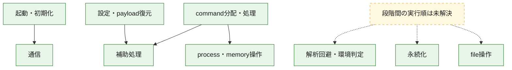

# 全体ロジック：2671b93e5dccb24ce9d3461a6f392f1251e78d3e11b6268475a51bed4298dffd

代表関数の静的証跡から、起動・初期化、設定・payload復元、解析回避・環境判定、永続化、process・memory操作、通信、command分配・処理、file操作の処理群を確認しました。

## 読み方

- phaseの掲載順は解析上の整理順です。observed_call_edgesがない段階間の実行順を断定しません。
- 図の実線は静的に観測した関係、点線と黄色のノードは未観測・未解決の関係を示します。
- 図は静的な要約であり、動的実行を再現するものではありません。
- 詳細な関数解説とfingerprintは[STATIC-LOGIC.md](STATIC-LOGIC.md)を参照してください。

## 静的可視化

### 実行フロー

### 感染チェーン

```mermaid
flowchart TD
  chain_initial["初期侵入・配布経路は未観測"]
  chain_01["提出検体 / sha256:2671b93e5dcc….exe / pe"]
  chain_02["静的復元層 1 / sha256:2671b93e5dcc….exe::embedded-pe / pe"]
  chain_03["静的復元層 1 / sha256:2671b93e5dcc….exe::embedded-pe / pe"]
  chain_04["静的復元層 1 / sha256:2671b93e5dcc….exe::embedded-pe / pe"]
  chain_05["静的復元層 1 / sha256:2671b93e5dcc….exe::embedded-pe / pe"]
  chain_06["静的復元層 1 / sha256:2671b93e5dcc….exe::embedded-pe / pe"]
  chain_07["静的復元層 1 / sha256:2671b93e5dcc….exe::embedded-pe / pe"]
  chain_08["静的復元層 1 / sha256:2671b93e5dcc….exe::embedded-pe / pe"]
  chain_09["静的復元層 1 / sha256:2671b93e5dcc….exe::embedded-pe / pe"]
  chain_10["静的復元層 1 / sha256:2671b93e5dcc….exe::pe-resource-pe / pe"]
  chain_11["静的復元層 1 / sha256:2671b93e5dcc….exe::pe-resource-pe / pe"]
  chain_12["静的復元層 1 / sha256:2671b93e5dcc….exe::pe-resource-pe / pe"]
  chain_13["静的復元層 1 / sha256:2671b93e5dcc….exe::pe-resource-pe / pe"]
  chain_14["静的復元層 1 / sha256:2671b93e5dcc….exe::pe-resource-pe / pe"]
  chain_01 -->|embedded-pe| chain_02
  chain_01 -->|embedded-pe| chain_03
  chain_01 -->|embedded-pe| chain_04
  chain_01 -->|embedded-pe| chain_05
  chain_01 -->|embedded-pe| chain_06
  chain_01 -->|embedded-pe| chain_07
  chain_01 -->|embedded-pe| chain_08
  chain_01 -->|embedded-pe| chain_09
  chain_01 -->|pe-resource-pe| chain_10
  chain_01 -->|pe-resource-pe| chain_11
  chain_01 -->|pe-resource-pe| chain_12
  chain_01 -->|pe-resource-pe| chain_13
  chain_01 -->|pe-resource-pe| chain_14
  chain_initial -.-> chain_01
  chain_unknown["後続stageは未解決"]
  chain_02 -.-> chain_unknown
  chain_03 -.-> chain_unknown
  chain_04 -.-> chain_unknown
  chain_05 -.-> chain_unknown
  chain_06 -.-> chain_unknown
  chain_07 -.-> chain_unknown
  chain_08 -.-> chain_unknown
  chain_09 -.-> chain_unknown
  chain_10 -.-> chain_unknown
  chain_11 -.-> chain_unknown
  chain_12 -.-> chain_unknown
  chain_13 -.-> chain_unknown
  chain_14 -.-> chain_unknown
  class chain_unknown unresolved
  class chain_01,chain_02,chain_03,chain_04,chain_05,chain_06,chain_07,chain_08,chain_09,chain_10,chain_11,chain_12,chain_13,chain_14 confirmed
  class chain_initial unresolved
  classDef confirmed fill:#e8f5e9,stroke:#2e7d32,color:#1b1b1b
  classDef unresolved fill:#fff8e1,stroke:#f9a825,color:#1b1b1b,stroke-dasharray:5 5
```

### モジュール関係

```mermaid
flowchart TD
  module_scope["解析対象のprogram構造"]
  module_01["sha256:19ac323ca6ea… / x86 / statically_recovered_program"]
  module_02["sha256:f4852d51c308… / x86 / statically_recovered_program"]
  module_03["sha256:ad6062215032… / x86 / statically_recovered_program"]
  module_04["sha256:8a55c15cc76e… / x86 / statically_recovered_program"]
  module_05["sha256:8ebc2702f85f… / x86 / statically_recovered_program"]
  module_06["sha256:9ed03af6b266… / x86 / statically_recovered_program"]
  module_07["sha256:b697d1a474ed… / x86 / statically_recovered_program"]
  module_08["sha256:289a4eea79ba… / x86 / statically_recovered_program"]
  module_09["sha256:808c61a09e22… / x86 / statically_recovered_program"]
  module_10["sha256:9342c7be8036… / x86 / statically_recovered_program"]
  module_11["sha256:e4b29e87ae28… / x86 / statically_recovered_program"]
  module_12["sha256:15148976d1df… / x86 / statically_recovered_program"]
  module_parent_unknown["復元元・親moduleは未特定"]
  module_parent_unknown -.-> module_01
  module_parent_unknown -.-> module_02
  module_parent_unknown -.-> module_03
  module_parent_unknown -.-> module_04
  module_parent_unknown -.-> module_05
  module_parent_unknown -.-> module_06
  module_parent_unknown -.-> module_07
  module_parent_unknown -.-> module_08
  module_parent_unknown -.-> module_09
  module_parent_unknown -.-> module_10
  module_parent_unknown -.-> module_11
  module_parent_unknown -.-> module_12
  class module_parent_unknown unresolved
  module_more["その他2moduleはstatic-logic.jsonを参照"]
  module_scope -.-> module_more
  class module_more unresolved
  class module_scope confirmed
  class module_01,module_02,module_03,module_04,module_05,module_06,module_07,module_08,module_09,module_10,module_11,module_12 confirmed
  classDef confirmed fill:#e8f5e9,stroke:#2e7d32,color:#1b1b1b
  classDef unresolved fill:#fff8e1,stroke:#f9a825,color:#1b1b1b,stroke-dasharray:5 5
```

## 処理段階

### 1. 起動・初期化

entry pointから初期化と後続処理への移行を確認します。
確度: `confirmed_static_function_evidence_with_limits`

- `19ac323ca6eae2f8145cdc2bac865b32cd5a48ad6ff199d4ca7da214b056e1dc:cil:0x06000001` — 初期化と主要処理への分岐を行う入口関数です。 状態: `succeeded`、選定理由: `entry_point`, `reviewed_call_centrality:10`, `small_program_complete_context`
- `19ac323ca6eae2f8145cdc2bac865b32cd5a48ad6ff199d4ca7da214b056e1dc:cil:0x0600000d` — 初期化と主要処理への分岐を行う入口関数です。 状態: `succeeded`、選定理由: `entry_point`, `reviewed_call_centrality:16`, `small_program_complete_context`
- `f4852d51c3082276d22df6b4896f6a5b6c89a7e158eb319f1959a740f9239f18:cil:0x06000003` — 初期化と主要処理への分岐を行う入口関数です。 状態: `succeeded`、選定理由: `entry_point`, `reviewed_call_centrality:4`, `small_program_complete_context`
- `f4852d51c3082276d22df6b4896f6a5b6c89a7e158eb319f1959a740f9239f18:cil:0x06000006` — 初期化と主要処理への分岐を行う入口関数です。 状態: `succeeded`、選定理由: `entry_point`, `large_function:instructions=73`, `reviewed_call_centrality:30`, `small_program_complete_context`
- `f4852d51c3082276d22df6b4896f6a5b6c89a7e158eb319f1959a740f9239f18:cil:0x06000007` — 初期化と主要処理への分岐を行う入口関数です。 状態: `succeeded`、選定理由: `entry_point`, `reviewed_call_centrality:4`, `small_program_complete_context`
- `ad6062215032ab58369403b1221562b5e7fb5ae7d52b29b7fad69eefb2d8455b:ghidra:1000742f` — 初期化と主要処理への分岐を行う入口関数です。 状態: `succeeded`、選定理由: `call_graph_centrality:in=0,out=2`, `entry_point`, `meaningful_symbol_name`, `reviewed_call_centrality:2`, `role:entrypoint`
- `8a55c15cc76e31042e17458c479772aa95bc1b908016c85b1dc8b8e3eff23254:ghidra:180007e50` — 初期化と主要処理への分岐を行う入口関数です。 状態: `succeeded`、選定理由: `call_graph_centrality:in=0,out=2`, `entry_point`, `meaningful_symbol_name`, `reviewed_call_centrality:2`, `role:entrypoint`
- `9ed03af6b266fa557b5ca3f52fac9251e314f0e98a9822145d7ddc6cc5424f70:ghidra:100069a5` — 初期化と主要処理への分岐を行う入口関数です。 状態: `succeeded`、選定理由: `entry_point`, `meaningful_symbol_name`, `role:entrypoint`
- `b697d1a474ed5e624c69853561282935b6008b79a27ff47592e27d9143d2a497:ghidra:1000f72c` — 初期化と主要処理への分岐を行う入口関数です。 状態: `succeeded`、選定理由: `call_graph_centrality:in=1,out=4`, `entry_point`, `meaningful_symbol_name`, `reviewed_call_centrality:5`, `reviewed_call_centrality:6`, `role:entrypoint`
- `b697d1a474ed5e624c69853561282935b6008b79a27ff47592e27d9143d2a497:ghidra:1000f900` — 初期化と主要処理への分岐を行う入口関数です。 状態: `succeeded`、選定理由: `call_graph_centrality:in=1,out=5`, `entry_point`, `large_function:instructions=79`, `meaningful_symbol_name`, `reviewed_call_centrality:6`, `role:entrypoint`
- `b697d1a474ed5e624c69853561282935b6008b79a27ff47592e27d9143d2a497:ghidra:1000f9fc` — 初期化と主要処理への分岐を行う入口関数です。 状態: `succeeded`、選定理由: `call_graph_centrality:in=1,out=1`, `entry_point`, `meaningful_symbol_name`, `reviewed_call_centrality:2`, `reviewed_call_centrality:3`, `role:entrypoint`
- `b697d1a474ed5e624c69853561282935b6008b79a27ff47592e27d9143d2a497:ghidra:10010a26` — 初期化と主要処理への分岐を行う入口関数です。 状態: `failed`、選定理由: `entry_point`, `meaningful_symbol_name`, `role:entrypoint`
- `289a4eea79baa4141744e44d60db713e18b5f23322663c63047962f51b467614:ghidra:10030718` — 初期化と主要処理への分岐を行う入口関数です。 状態: `succeeded`、選定理由: `call_graph_centrality:in=1,out=4`, `entry_point`, `meaningful_symbol_name`, `reviewed_call_centrality:5`, `reviewed_call_centrality:6`, `role:entrypoint`
- `289a4eea79baa4141744e44d60db713e18b5f23322663c63047962f51b467614:ghidra:10030907` — 初期化と主要処理への分岐を行う入口関数です。 状態: `succeeded`、選定理由: `call_graph_centrality:in=1,out=4`, `entry_point`, `large_function:instructions=85`, `meaningful_symbol_name`, `reviewed_call_centrality:5`, `role:entrypoint`
- `289a4eea79baa4141744e44d60db713e18b5f23322663c63047962f51b467614:ghidra:10030a0d` — 初期化と主要処理への分岐を行う入口関数です。 状態: `succeeded`、選定理由: `call_graph_centrality:in=1,out=1`, `entry_point`, `meaningful_symbol_name`, `reviewed_call_centrality:2`, `reviewed_call_centrality:3`, `role:entrypoint`
- `289a4eea79baa4141744e44d60db713e18b5f23322663c63047962f51b467614:ghidra:10030a38` — 初期化と主要処理への分岐を行う入口関数です。 状態: `succeeded`、選定理由: `call_graph_centrality:in=0,out=2`, `entry_point`, `meaningful_symbol_name`, `reviewed_call_centrality:2`, `role:entrypoint`
- `808c61a09e220c361cff01e76c30f269e6c037c85069e0811662fd86c137874a:ghidra:180037fc4` — 初期化と主要処理への分岐を行う入口関数です。 状態: `succeeded`、選定理由: `call_graph_centrality:in=1,out=3`, `entry_point`, `large_function:instructions=96`, `meaningful_symbol_name`, `reviewed_call_centrality:4`, `reviewed_call_centrality:5`, `role:entrypoint`
- `808c61a09e220c361cff01e76c30f269e6c037c85069e0811662fd86c137874a:ghidra:1800380f8` — 初期化と主要処理への分岐を行う入口関数です。 状態: `succeeded`、選定理由: `call_graph_centrality:in=0,out=2`, `entry_point`, `meaningful_symbol_name`, `reviewed_call_centrality:2`, `role:entrypoint`
- `9342c7be8036a5f8dc3895d75e3314dce961fd3bc70ee59928c67fa04f0c7e08:ghidra:1002ce85` — 初期化と主要処理への分岐を行う入口関数です。 状態: `succeeded`、選定理由: `call_graph_centrality:in=1,out=4`, `entry_point`, `meaningful_symbol_name`, `reviewed_call_centrality:5`, `reviewed_call_centrality:6`, `role:entrypoint`
- `9342c7be8036a5f8dc3895d75e3314dce961fd3bc70ee59928c67fa04f0c7e08:ghidra:1002d077` — 初期化と主要処理への分岐を行う入口関数です。 状態: `succeeded`、選定理由: `call_graph_centrality:in=1,out=4`, `entry_point`, `large_function:instructions=85`, `meaningful_symbol_name`, `reviewed_call_centrality:5`, `role:entrypoint`
- `9342c7be8036a5f8dc3895d75e3314dce961fd3bc70ee59928c67fa04f0c7e08:ghidra:1002d17d` — 初期化と主要処理への分岐を行う入口関数です。 状態: `succeeded`、選定理由: `call_graph_centrality:in=1,out=1`, `entry_point`, `meaningful_symbol_name`, `reviewed_call_centrality:2`, `reviewed_call_centrality:3`, `role:entrypoint`
- `9342c7be8036a5f8dc3895d75e3314dce961fd3bc70ee59928c67fa04f0c7e08:ghidra:1002d1a8` — 初期化と主要処理への分岐を行う入口関数です。 状態: `succeeded`、選定理由: `call_graph_centrality:in=0,out=2`, `entry_point`, `meaningful_symbol_name`, `reviewed_call_centrality:2`, `role:entrypoint`
- `e4b29e87ae288199964726c10ea221827cfde794c2aee17f71f4561cd09bf472:ghidra:180036ab4` — 初期化と主要処理への分岐を行う入口関数です。 状態: `succeeded`、選定理由: `call_graph_centrality:in=1,out=3`, `entry_point`, `large_function:instructions=96`, `meaningful_symbol_name`, `reviewed_call_centrality:5`, `role:entrypoint`
- `e4b29e87ae288199964726c10ea221827cfde794c2aee17f71f4561cd09bf472:ghidra:180036be8` — 初期化と主要処理への分岐を行う入口関数です。 状態: `succeeded`、選定理由: `call_graph_centrality:in=0,out=2`, `entry_point`, `meaningful_symbol_name`, `reviewed_call_centrality:2`, `role:entrypoint`
- `15148976d1df0b7648ff4085ef2da7c32d767be8203542234f86820c7dd7f39c:cil:0x060011b5` — 初期化と主要処理への分岐を行う入口関数です。 状態: `succeeded`、選定理由: `entry_point`, `reviewed_call_centrality:2`

### 2. 設定・payload復元

設定、resource、payload、暗号化データの復元・変換を確認します。
確度: `confirmed_static_function_evidence`

- `ad6062215032ab58369403b1221562b5e7fb5ae7d52b29b7fad69eefb2d8455b:ghidra:10008319` — 設定、resource、payloadなどの解析・変換を行う関数です。 状態: `succeeded`、選定理由: `call_graph_centrality:in=1,out=1`, `large_function:instructions=176`, `meaningful_symbol_name`, `reviewed_call_centrality:2`, `role:config_or_data_transform`
- `8a55c15cc76e31042e17458c479772aa95bc1b908016c85b1dc8b8e3eff23254:ghidra:180008140` — 設定、resource、payloadなどの解析・変換を行う関数です。 状態: `succeeded`、選定理由: `call_graph_centrality:in=3,out=7`, `large_function:instructions=99`, `meaningful_symbol_name`, `reviewed_call_centrality:11`, `reviewed_call_centrality:12`, `role:config_or_data_transform`
- `8a55c15cc76e31042e17458c479772aa95bc1b908016c85b1dc8b8e3eff23254:ghidra:1800085ec` — 設定、resource、payloadなどの解析・変換を行う関数です。 状態: `succeeded`、選定理由: `call_graph_centrality:in=3,out=1`, `meaningful_symbol_name`, `reviewed_call_centrality:4`, `reviewed_call_centrality:5`, `role:config_or_data_transform`
- `8a55c15cc76e31042e17458c479772aa95bc1b908016c85b1dc8b8e3eff23254:ghidra:1800091b4` — 設定、resource、payloadなどの解析・変換を行う関数です。 状態: `succeeded`、選定理由: `call_graph_centrality:in=1,out=1`, `large_function:instructions=163`, `meaningful_symbol_name`, `reviewed_call_centrality:2`, `role:config_or_data_transform`
- `8a55c15cc76e31042e17458c479772aa95bc1b908016c85b1dc8b8e3eff23254:ghidra:180009384` — 設定、resource、payloadなどの解析・変換を行う関数です。 状態: `succeeded`、選定理由: `call_graph_centrality:in=1,out=4`, `meaningful_symbol_name`, `reviewed_call_centrality:5`, `reviewed_call_centrality:6`, `role:config_or_data_transform`
- `8a55c15cc76e31042e17458c479772aa95bc1b908016c85b1dc8b8e3eff23254:ghidra:180009a08` — 設定、resource、payloadなどの解析・変換を行う関数です。 状態: `succeeded`、選定理由: `call_graph_centrality:in=1,out=2`, `reviewed_call_centrality:3`, `reviewed_call_centrality:4`, `role:config_or_data_transform`
- `8a55c15cc76e31042e17458c479772aa95bc1b908016c85b1dc8b8e3eff23254:ghidra:180009d5c` — 設定、resource、payloadなどの解析・変換を行う関数です。 状態: `succeeded`、選定理由: `call_graph_centrality:in=1,out=8`, `large_function:instructions=159`, `meaningful_symbol_name`, `reviewed_call_centrality:10`, `role:config_or_data_transform`
- `8a55c15cc76e31042e17458c479772aa95bc1b908016c85b1dc8b8e3eff23254:ghidra:180009fe4` — 設定、resource、payloadなどの解析・変換を行う関数です。 状態: `succeeded`、選定理由: `call_graph_centrality:in=1,out=6`, `large_function:instructions=72`, `meaningful_symbol_name`, `reviewed_call_centrality:7`, `reviewed_call_centrality:9`, `role:config_or_data_transform`
- `8a55c15cc76e31042e17458c479772aa95bc1b908016c85b1dc8b8e3eff23254:ghidra:18000a348` — 設定、resource、payloadなどの解析・変換を行う関数です。 状態: `succeeded`、選定理由: `call_graph_centrality:in=1,out=6`, `large_function:instructions=136`, `meaningful_symbol_name`, `reviewed_call_centrality:11`, `reviewed_call_centrality:8`, `role:config_or_data_transform`
- `8ebc2702f85fa29a3450e4aa7924b08f16abe5b8886980871cdcd89aa7c156a5:cil:0x06000267` — 設定、resource、payloadなどの解析・変換を行う関数です。 状態: `succeeded`、選定理由: `large_function:instructions=104`, `reviewed_call_centrality:20`, `role:config_or_data_transform`
- `8ebc2702f85fa29a3450e4aa7924b08f16abe5b8886980871cdcd89aa7c156a5:cil:0x06000286` — 暗号、hash、encoding、または復号処理に関係する関数です。 状態: `succeeded`、選定理由: `role:cryptographic_transform`
- `9ed03af6b266fa557b5ca3f52fac9251e314f0e98a9822145d7ddc6cc5424f70:ghidra:10008cd4` — 設定、resource、payloadなどの解析・変換を行う関数です。 状態: `succeeded`、選定理由: `call_graph_centrality:in=1,out=1`, `large_function:instructions=176`, `meaningful_symbol_name`, `reviewed_call_centrality:2`, `role:config_or_data_transform`
- `b697d1a474ed5e624c69853561282935b6008b79a27ff47592e27d9143d2a497:ghidra:10011d25` — 設定、resource、payloadなどの解析・変換を行う関数です。 状態: `succeeded`、選定理由: `call_graph_centrality:in=1,out=7`, `large_function:instructions=220`, `meaningful_symbol_name`, `reviewed_call_centrality:13`, `reviewed_call_centrality:8`, `role:config_or_data_transform`
- `b697d1a474ed5e624c69853561282935b6008b79a27ff47592e27d9143d2a497:ghidra:10011f4d` — 設定、resource、payloadなどの解析・変換を行う関数です。 状態: `succeeded`、選定理由: `call_graph_centrality:in=2,out=7`, `large_function:instructions=539`, `meaningful_symbol_name`, `reviewed_call_centrality:13`, `reviewed_call_centrality:9`, `role:config_or_data_transform`
- `b697d1a474ed5e624c69853561282935b6008b79a27ff47592e27d9143d2a497:ghidra:10012781` — 設定、resource、payloadなどの解析・変換を行う関数です。 状態: `succeeded`、選定理由: `call_graph_centrality:in=1,out=2`, `meaningful_symbol_name`, `reviewed_call_centrality:3`, `reviewed_call_centrality:5`, `role:config_or_data_transform`
- `b697d1a474ed5e624c69853561282935b6008b79a27ff47592e27d9143d2a497:ghidra:10012bf7` — 設定、resource、payloadなどの解析・変換を行う関数です。 状態: `succeeded`、選定理由: `call_graph_centrality:in=1,out=1`, `meaningful_symbol_name`, `reviewed_call_centrality:2`, `reviewed_call_centrality:4`, `role:config_or_data_transform`
- `b697d1a474ed5e624c69853561282935b6008b79a27ff47592e27d9143d2a497:ghidra:10012c6c` — 設定、resource、payloadなどの解析・変換を行う関数です。 状態: `succeeded`、選定理由: `call_graph_centrality:in=1,out=2`, `meaningful_symbol_name`, `reviewed_call_centrality:4`, `reviewed_call_centrality:5`, `role:config_or_data_transform`
- `b697d1a474ed5e624c69853561282935b6008b79a27ff47592e27d9143d2a497:ghidra:1001301d` — 設定、resource、payloadなどの解析・変換を行う関数です。 状態: `succeeded`、選定理由: `call_graph_centrality:in=0,out=1`, `meaningful_symbol_name`, `reviewed_call_centrality:1`, `reviewed_call_centrality:2`, `role:config_or_data_transform`
- `b697d1a474ed5e624c69853561282935b6008b79a27ff47592e27d9143d2a497:ghidra:10013079` — 設定、resource、payloadなどの解析・変換を行う関数です。 状態: `succeeded`、選定理由: `call_graph_centrality:in=0,out=1`, `meaningful_symbol_name`, `reviewed_call_centrality:1`, `reviewed_call_centrality:2`, `role:config_or_data_transform`
- `b697d1a474ed5e624c69853561282935b6008b79a27ff47592e27d9143d2a497:ghidra:100141a0` — 設定、resource、payloadなどの解析・変換を行う関数です。 状態: `succeeded`、選定理由: `call_graph_centrality:in=4,out=5`, `large_function:instructions=125`, `meaningful_symbol_name`, `reviewed_call_centrality:12`, `reviewed_call_centrality:9`, `role:config_or_data_transform`
- `b697d1a474ed5e624c69853561282935b6008b79a27ff47592e27d9143d2a497:ghidra:10014a83` — 設定、resource、payloadなどの解析・変換を行う関数です。 状態: `succeeded`、選定理由: `call_graph_centrality:in=1,out=2`, `meaningful_symbol_name`, `reviewed_call_centrality:3`, `reviewed_call_centrality:4`, `role:config_or_data_transform`
- `b697d1a474ed5e624c69853561282935b6008b79a27ff47592e27d9143d2a497:ghidra:10015098` — 設定、resource、payloadなどの解析・変換を行う関数です。 状態: `succeeded`、選定理由: `call_graph_centrality:in=1,out=7`, `large_function:instructions=116`, `meaningful_symbol_name`, `reviewed_call_centrality:10`, `reviewed_call_centrality:9`, `role:config_or_data_transform`
- `289a4eea79baa4141744e44d60db713e18b5f23322663c63047962f51b467614:ghidra:10032eb7` — 設定、resource、payloadなどの解析・変換を行う関数です。 状態: `succeeded`、選定理由: `call_graph_centrality:in=1,out=8`, `large_function:instructions=124`, `meaningful_symbol_name`, `reviewed_call_centrality:10`, `reviewed_call_centrality:9`, `role:config_or_data_transform`
- `289a4eea79baa4141744e44d60db713e18b5f23322663c63047962f51b467614:ghidra:1003639f` — 暗号、hash、encoding、または復号処理に関係する関数です。 状態: `succeeded`、選定理由: `call_graph_centrality:in=1,out=0`, `meaningful_symbol_name`, `reviewed_call_centrality:1`, `role:cryptographic_transform`
- `808c61a09e220c361cff01e76c30f269e6c037c85069e0811662fd86c137874a:ghidra:180012830` — 暗号、hash、encoding、または復号処理に関係する関数です。 状態: `succeeded`、選定理由: `call_graph_centrality:in=0,out=3`, `large_function:instructions=1408`, `reviewed_call_centrality:3`, `role:cryptographic_transform`
- `808c61a09e220c361cff01e76c30f269e6c037c85069e0811662fd86c137874a:ghidra:180013d90` — 暗号、hash、encoding、または復号処理に関係する関数です。 状態: `succeeded`、選定理由: `call_graph_centrality:in=0,out=4`, `large_function:instructions=2089`, `reviewed_call_centrality:4`, `role:cryptographic_transform`
- `808c61a09e220c361cff01e76c30f269e6c037c85069e0811662fd86c137874a:ghidra:180022730` — 暗号、hash、encoding、または復号処理に関係する関数です。 状態: `succeeded`、選定理由: `call_graph_centrality:in=0,out=13`, `large_function:instructions=2475`, `reviewed_call_centrality:13`, `reviewed_call_centrality:14`, `role:cryptographic_transform`
- `808c61a09e220c361cff01e76c30f269e6c037c85069e0811662fd86c137874a:ghidra:180024ca0` — 暗号、hash、encoding、または復号処理に関係する関数です。 状態: `succeeded`、選定理由: `call_graph_centrality:in=1,out=15`, `large_function:instructions=2450`, `reviewed_call_centrality:16`, `reviewed_call_centrality:17`, `role:cryptographic_transform`
- `808c61a09e220c361cff01e76c30f269e6c037c85069e0811662fd86c137874a:ghidra:180027020` — 暗号、hash、encoding、または復号処理に関係する関数です。 状態: `succeeded`、選定理由: `call_graph_centrality:in=0,out=14`, `large_function:instructions=2447`, `reviewed_call_centrality:14`, `reviewed_call_centrality:15`, `role:cryptographic_transform`
- `808c61a09e220c361cff01e76c30f269e6c037c85069e0811662fd86c137874a:ghidra:180029410` — 暗号、hash、encoding、または復号処理に関係する関数です。 状態: `succeeded`、選定理由: `call_graph_centrality:in=0,out=15`, `large_function:instructions=2466`, `reviewed_call_centrality:15`, `reviewed_call_centrality:16`, `role:cryptographic_transform`
- `808c61a09e220c361cff01e76c30f269e6c037c85069e0811662fd86c137874a:ghidra:18002b830` — 暗号、hash、encoding、または復号処理に関係する関数です。 状態: `succeeded`、選定理由: `call_graph_centrality:in=0,out=14`, `large_function:instructions=3801`, `reviewed_call_centrality:14`, `reviewed_call_centrality:15`, `role:cryptographic_transform`
- `808c61a09e220c361cff01e76c30f269e6c037c85069e0811662fd86c137874a:ghidra:18002ef60` — 暗号、hash、encoding、または復号処理に関係する関数です。 状態: `succeeded`、選定理由: `call_graph_centrality:in=0,out=15`, `large_function:instructions=3767`, `reviewed_call_centrality:15`, `reviewed_call_centrality:16`, `role:cryptographic_transform`
- `808c61a09e220c361cff01e76c30f269e6c037c85069e0811662fd86c137874a:ghidra:1800326c0` — 暗号、hash、encoding、または復号処理に関係する関数です。 状態: `succeeded`、選定理由: `call_graph_centrality:in=0,out=14`, `large_function:instructions=3023`, `reviewed_call_centrality:14`, `reviewed_call_centrality:15`, `role:cryptographic_transform`
- `808c61a09e220c361cff01e76c30f269e6c037c85069e0811662fd86c137874a:ghidra:180035270` — 暗号、hash、encoding、または復号処理に関係する関数です。 状態: `succeeded`、選定理由: `call_graph_centrality:in=0,out=15`, `large_function:instructions=2986`, `reviewed_call_centrality:15`, `reviewed_call_centrality:16`, `role:cryptographic_transform`
- `808c61a09e220c361cff01e76c30f269e6c037c85069e0811662fd86c137874a:ghidra:18003a124` — 設定、resource、payloadなどの解析・変換を行う関数です。 状態: `succeeded`、選定理由: `call_graph_centrality:in=1,out=8`, `large_function:instructions=112`, `meaningful_symbol_name`, `reviewed_call_centrality:10`, `reviewed_call_centrality:9`, `role:config_or_data_transform`
- `9342c7be8036a5f8dc3895d75e3314dce961fd3bc70ee59928c67fa04f0c7e08:ghidra:100065b0` — 設定、resource、payloadなどの解析・変換を行う関数です。 状態: `succeeded`、選定理由: `call_graph_centrality:in=0,out=1`, `entry_point`, `meaningful_symbol_name`, `reviewed_call_centrality:1`, `role:config_or_data_transform`
- `e4b29e87ae288199964726c10ea221827cfde794c2aee17f71f4561cd09bf472:ghidra:180007b50` — 設定、resource、payloadなどの解析・変換を行う関数です。 状態: `succeeded`、選定理由: `call_graph_centrality:in=0,out=1`, `entry_point`, `meaningful_symbol_name`, `reviewed_call_centrality:1`, `role:config_or_data_transform`
- `15148976d1df0b7648ff4085ef2da7c32d767be8203542234f86820c7dd7f39c:cil:0x06000dfc` — 設定、resource、payloadなどの解析・変換を行う関数です。 状態: `succeeded`、選定理由: `reviewed_call_centrality:22`, `role:config_or_data_transform`
- `15148976d1df0b7648ff4085ef2da7c32d767be8203542234f86820c7dd7f39c:cil:0x0600110a` — 暗号、hash、encoding、または復号処理に関係する関数です。 状態: `succeeded`、選定理由: `large_function:instructions=94`, `reviewed_call_centrality:26`, `role:cryptographic_transform`
- `cca228d4d04731a91fff3cc4a0551be447090c0e5c87dcc721ca6199bb1f26a9:cil:0x060002ee` — 暗号、hash、encoding、または復号処理に関係する関数です。 状態: `succeeded`、選定理由: `reviewed_call_centrality:6`, `role:cryptographic_transform`
- `cca228d4d04731a91fff3cc4a0551be447090c0e5c87dcc721ca6199bb1f26a9:cil:0x06000300` — 設定、resource、payloadなどの解析・変換を行う関数です。 状態: `succeeded`、選定理由: `reviewed_call_centrality:18`, `role:config_or_data_transform`

### 3. 解析回避・環境判定

debugger、sandbox、仮想環境、時間差などの判定を確認します。
確度: `confirmed_static_function_evidence`

- `ad6062215032ab58369403b1221562b5e7fb5ae7d52b29b7fad69eefb2d8455b:ghidra:10006a60` — debugger、仮想環境、sandbox、または時間差の確認に関係する関数です。 状態: `succeeded`、選定理由: `call_graph_centrality:in=1,out=0`, `large_function:instructions=578`, `reviewed_call_centrality:1`, `reviewed_call_centrality:7`, `role:anti_analysis`
- `ad6062215032ab58369403b1221562b5e7fb5ae7d52b29b7fad69eefb2d8455b:ghidra:1000a580` — debugger、仮想環境、sandbox、または時間差の確認に関係する関数です。 状態: `succeeded`、選定理由: `call_graph_centrality:in=5,out=1`, `large_function:instructions=244`, `meaningful_symbol_name`, `reviewed_call_centrality:6`, `reviewed_call_centrality:7`, `role:anti_analysis`
- `8a55c15cc76e31042e17458c479772aa95bc1b908016c85b1dc8b8e3eff23254:ghidra:180008bb0` — debugger、仮想環境、sandbox、または時間差の確認に関係する関数です。 状態: `succeeded`、選定理由: `call_graph_centrality:in=4,out=2`, `meaningful_symbol_name`, `reviewed_call_centrality:6`, `reviewed_call_centrality:7`, `role:anti_analysis`
- `8a55c15cc76e31042e17458c479772aa95bc1b908016c85b1dc8b8e3eff23254:ghidra:180008c30` — debugger、仮想環境、sandbox、または時間差の確認に関係する関数です。 状態: `succeeded`、選定理由: `call_graph_centrality:in=6,out=2`, `meaningful_symbol_name`, `reviewed_call_centrality:8`, `reviewed_call_centrality:9`, `role:anti_analysis`
- `8a55c15cc76e31042e17458c479772aa95bc1b908016c85b1dc8b8e3eff23254:ghidra:180008cb4` — debugger、仮想環境、sandbox、または時間差の確認に関係する関数です。 状態: `succeeded`、選定理由: `call_graph_centrality:in=1,out=2`, `meaningful_symbol_name`, `reviewed_call_centrality:3`, `reviewed_call_centrality:4`, `role:anti_analysis`

### 4. 永続化

自動起動や永続化に関係する設定変更を確認します。
確度: `confirmed_static_function_evidence`

- `f4852d51c3082276d22df6b4896f6a5b6c89a7e158eb319f1959a740f9239f18:cil:0x06000002` — 自動起動または永続化に関係する処理を含む関数です。 状態: `succeeded`、選定理由: `reviewed_call_centrality:2`, `role:persistence`, `small_program_complete_context`
- `8a55c15cc76e31042e17458c479772aa95bc1b908016c85b1dc8b8e3eff23254:ghidra:180008d3c` — 自動起動または永続化に関係する処理を含む関数です。 状態: `succeeded`、選定理由: `call_graph_centrality:in=1,out=6`, `large_function:instructions=184`, `meaningful_symbol_name`, `reviewed_call_centrality:12`, `reviewed_call_centrality:7`, `role:persistence`
- `8ebc2702f85fa29a3450e4aa7924b08f16abe5b8886980871cdcd89aa7c156a5:cil:0x06000005` — 自動起動または永続化に関係する処理を含む関数です。 状態: `succeeded`、選定理由: `reviewed_call_centrality:2`, `role:persistence`
- `b697d1a474ed5e624c69853561282935b6008b79a27ff47592e27d9143d2a497:ghidra:1000f8f1` — 自動起動または永続化に関係する処理を含む関数です。 状態: `succeeded`、選定理由: `call_graph_centrality:in=1,out=2`, `reviewed_call_centrality:3`, `role:persistence`
- `808c61a09e220c361cff01e76c30f269e6c037c85069e0811662fd86c137874a:ghidra:180037f34` — 自動起動または永続化に関係する処理を含む関数です。 状態: `succeeded`、選定理由: `call_graph_centrality:in=1,out=8`, `reviewed_call_centrality:9`, `role:persistence`
- `9342c7be8036a5f8dc3895d75e3314dce961fd3bc70ee59928c67fa04f0c7e08:ghidra:1002cfd0` — 自動起動または永続化に関係する処理を含む関数です。 状態: `succeeded`、選定理由: `call_graph_centrality:in=1,out=1`, `reviewed_call_centrality:2`, `role:persistence`
- `9342c7be8036a5f8dc3895d75e3314dce961fd3bc70ee59928c67fa04f0c7e08:ghidra:1002d060` — 自動起動または永続化に関係する処理を含む関数です。 状態: `succeeded`、選定理由: `call_graph_centrality:in=1,out=2`, `reviewed_call_centrality:3`, `role:persistence`
- `e4b29e87ae288199964726c10ea221827cfde794c2aee17f71f4561cd09bf472:ghidra:180036a24` — 自動起動または永続化に関係する処理を含む関数です。 状態: `succeeded`、選定理由: `call_graph_centrality:in=1,out=8`, `reviewed_call_centrality:9`, `role:persistence`
- `15148976d1df0b7648ff4085ef2da7c32d767be8203542234f86820c7dd7f39c:cil:0x06000022` — 自動起動または永続化に関係する処理を含む関数です。 状態: `succeeded`、選定理由: `reviewed_call_centrality:2`, `role:persistence`
- `cca228d4d04731a91fff3cc4a0551be447090c0e5c87dcc721ca6199bb1f26a9:cil:0x06000002` — 自動起動または永続化に関係する処理を含む関数です。 状態: `succeeded`、選定理由: `reviewed_call_centrality:2`, `role:persistence`

### 5. process・memory操作

process、thread、module、memory操作と実行移行を確認します。
確度: `confirmed_static_function_evidence_with_limits`

- `ad6062215032ab58369403b1221562b5e7fb5ae7d52b29b7fad69eefb2d8455b:ghidra:10007141` — process、thread、module、またはmemory操作に関係する関数です。 状態: `succeeded`、選定理由: `call_graph_centrality:in=5,out=6`, `meaningful_symbol_name`, `reviewed_call_centrality:11`, `reviewed_call_centrality:12`, `role:process_or_memory_operation`
- `ad6062215032ab58369403b1221562b5e7fb5ae7d52b29b7fad69eefb2d8455b:ghidra:1000761c` — process、thread、module、またはmemory操作に関係する関数です。 状態: `succeeded`、選定理由: `call_graph_centrality:in=2,out=8`, `large_function:instructions=92`, `meaningful_symbol_name`, `reviewed_call_centrality:10`, `reviewed_call_centrality:11`, `role:process_or_memory_operation`
- `ad6062215032ab58369403b1221562b5e7fb5ae7d52b29b7fad69eefb2d8455b:ghidra:10008e4d` — process、thread、module、またはmemory操作に関係する関数です。 状態: `succeeded`、選定理由: `call_graph_centrality:in=1,out=11`, `large_function:instructions=132`, `meaningful_symbol_name`, `reviewed_call_centrality:12`, `role:process_or_memory_operation`
- `ad6062215032ab58369403b1221562b5e7fb5ae7d52b29b7fad69eefb2d8455b:ghidra:10009a91` — process、thread、module、またはmemory操作に関係する関数です。 状態: `succeeded`、選定理由: `call_graph_centrality:in=1,out=5`, `large_function:instructions=128`, `meaningful_symbol_name`, `reviewed_call_centrality:6`, `reviewed_call_centrality:7`, `role:process_or_memory_operation`
- `ad6062215032ab58369403b1221562b5e7fb5ae7d52b29b7fad69eefb2d8455b:ghidra:10009cc5` — process、thread、module、またはmemory操作に関係する関数です。 状態: `succeeded`、選定理由: `call_graph_centrality:in=4,out=3`, `meaningful_symbol_name`, `reviewed_call_centrality:7`, `reviewed_call_centrality:8`, `role:process_or_memory_operation`
- `8a55c15cc76e31042e17458c479772aa95bc1b908016c85b1dc8b8e3eff23254:ghidra:180007b28` — process、thread、module、またはmemory操作に関係する関数です。 状態: `succeeded`、選定理由: `call_graph_centrality:in=5,out=6`, `meaningful_symbol_name`, `reviewed_call_centrality:11`, `reviewed_call_centrality:12`, `role:process_or_memory_operation`
- `8a55c15cc76e31042e17458c479772aa95bc1b908016c85b1dc8b8e3eff23254:ghidra:180008340` — process、thread、module、またはmemory操作に関係する関数です。 状態: `succeeded`、選定理由: `call_graph_centrality:in=4,out=13`, `large_function:instructions=154`, `reviewed_call_centrality:18`, `reviewed_call_centrality:20`, `role:file_operation`, `role:process_or_memory_operation`
- `8a55c15cc76e31042e17458c479772aa95bc1b908016c85b1dc8b8e3eff23254:ghidra:180008910` — process、thread、module、またはmemory操作に関係する関数です。 状態: `succeeded`、選定理由: `call_graph_centrality:in=4,out=8`, `meaningful_symbol_name`, `reviewed_call_centrality:12`, `reviewed_call_centrality:17`, `role:process_or_memory_operation`
- `8a55c15cc76e31042e17458c479772aa95bc1b908016c85b1dc8b8e3eff23254:ghidra:180008b2c` — process、thread、module、またはmemory操作に関係する関数です。 状態: `succeeded`、選定理由: `call_graph_centrality:in=1,out=8`, `meaningful_symbol_name`, `reviewed_call_centrality:12`, `reviewed_call_centrality:9`, `role:process_or_memory_operation`
- `8a55c15cc76e31042e17458c479772aa95bc1b908016c85b1dc8b8e3eff23254:ghidra:180009888` — process、thread、module、またはmemory操作に関係する関数です。 状態: `succeeded`、選定理由: `call_graph_centrality:in=2,out=9`, `large_function:instructions=80`, `meaningful_symbol_name`, `reviewed_call_centrality:11`, `reviewed_call_centrality:15`, `role:anti_analysis`, `role:process_or_memory_operation`
- `8a55c15cc76e31042e17458c479772aa95bc1b908016c85b1dc8b8e3eff23254:ghidra:1800099d4` — process、thread、module、またはmemory操作に関係する関数です。 状態: `limited_bad_instruction_or_flow`、選定理由: `call_graph_centrality:in=3,out=2`, `meaningful_symbol_name`, `reviewed_call_centrality:6`, `reviewed_call_centrality:7`, `role:process_or_memory_operation`
- `8a55c15cc76e31042e17458c479772aa95bc1b908016c85b1dc8b8e3eff23254:ghidra:180009bbc` — process、thread、module、またはmemory操作に関係する関数です。 状態: `succeeded`、選定理由: `call_graph_centrality:in=1,out=9`, `meaningful_symbol_name`, `reviewed_call_centrality:10`, `reviewed_call_centrality:12`, `role:process_or_memory_operation`
- `8a55c15cc76e31042e17458c479772aa95bc1b908016c85b1dc8b8e3eff23254:ghidra:18000affc` — process、thread、module、またはmemory操作に関係する関数です。 状態: `succeeded`、選定理由: `call_graph_centrality:in=1,out=7`, `large_function:instructions=182`, `meaningful_symbol_name`, `reviewed_call_centrality:10`, `reviewed_call_centrality:8`, `role:process_or_memory_operation`
- `8a55c15cc76e31042e17458c479772aa95bc1b908016c85b1dc8b8e3eff23254:ghidra:18000b274` — process、thread、module、またはmemory操作に関係する関数です。 状態: `succeeded`、選定理由: `call_graph_centrality:in=1,out=10`, `large_function:instructions=118`, `meaningful_symbol_name`, `reviewed_call_centrality:11`, `reviewed_call_centrality:13`, `role:process_or_memory_operation`
- `8ebc2702f85fa29a3450e4aa7924b08f16abe5b8886980871cdcd89aa7c156a5:cil:0x0600029f` — process、thread、module、またはmemory操作に関係する関数です。 状態: `succeeded`、選定理由: `reviewed_call_centrality:6`, `role:process_or_memory_operation`
- `9ed03af6b266fa557b5ca3f52fac9251e314f0e98a9822145d7ddc6cc5424f70:ghidra:10002c36` — process、thread、module、またはmemory操作に関係する関数です。 状態: `succeeded`、選定理由: `call_graph_centrality:in=4,out=7`, `large_function:instructions=130`, `reviewed_call_centrality:11`, `role:process_or_memory_operation`
- `9ed03af6b266fa557b5ca3f52fac9251e314f0e98a9822145d7ddc6cc5424f70:ghidra:10002e26` — process、thread、module、またはmemory操作に関係する関数です。 状態: `succeeded`、選定理由: `call_graph_centrality:in=3,out=5`, `large_function:instructions=125`, `reviewed_call_centrality:8`, `role:process_or_memory_operation`
- `9ed03af6b266fa557b5ca3f52fac9251e314f0e98a9822145d7ddc6cc5424f70:ghidra:1000432a` — process、thread、module、またはmemory操作に関係する関数です。 状態: `succeeded`、選定理由: `call_graph_centrality:in=1,out=6`, `meaningful_symbol_name`, `reviewed_call_centrality:7`, `reviewed_call_centrality:8`, `role:process_or_memory_operation`
- `9ed03af6b266fa557b5ca3f52fac9251e314f0e98a9822145d7ddc6cc5424f70:ghidra:1000440e` — process、thread、module、またはmemory操作に関係する関数です。 状態: `succeeded`、選定理由: `call_graph_centrality:in=6,out=5`, `meaningful_symbol_name`, `reviewed_call_centrality:11`, `role:process_or_memory_operation`
- `9ed03af6b266fa557b5ca3f52fac9251e314f0e98a9822145d7ddc6cc5424f70:ghidra:10004b21` — process、thread、module、またはmemory操作に関係する関数です。 状態: `succeeded`、選定理由: `call_graph_centrality:in=2,out=6`, `reviewed_call_centrality:10`, `reviewed_call_centrality:8`, `role:process_or_memory_operation`
- `9ed03af6b266fa557b5ca3f52fac9251e314f0e98a9822145d7ddc6cc5424f70:ghidra:100069b7` — process、thread、module、またはmemory操作に関係する関数です。 状態: `succeeded`、選定理由: `call_graph_centrality:in=2,out=7`, `large_function:instructions=92`, `meaningful_symbol_name`, `reviewed_call_centrality:10`, `reviewed_call_centrality:9`, `role:process_or_memory_operation`
- `9ed03af6b266fa557b5ca3f52fac9251e314f0e98a9822145d7ddc6cc5424f70:ghidra:10006fba` — process、thread、module、またはmemory操作に関係する関数です。 状態: `succeeded`、選定理由: `call_graph_centrality:in=9,out=3`, `meaningful_symbol_name`, `reviewed_call_centrality:12`, `reviewed_call_centrality:13`, `role:process_or_memory_operation`
- `9ed03af6b266fa557b5ca3f52fac9251e314f0e98a9822145d7ddc6cc5424f70:ghidra:1000798e` — process、thread、module、またはmemory操作に関係する関数です。 状態: `succeeded`、選定理由: `call_graph_centrality:in=1,out=5`, `meaningful_symbol_name`, `reviewed_call_centrality:6`, `reviewed_call_centrality:7`, `role:process_or_memory_operation`
- `9ed03af6b266fa557b5ca3f52fac9251e314f0e98a9822145d7ddc6cc5424f70:ghidra:10009d59` — process、thread、module、またはmemory操作に関係する関数です。 状態: `succeeded`、選定理由: `call_graph_centrality:in=1,out=4`, `large_function:instructions=128`, `meaningful_symbol_name`, `reviewed_call_centrality:5`, `role:process_or_memory_operation`
- `9ed03af6b266fa557b5ca3f52fac9251e314f0e98a9822145d7ddc6cc5424f70:ghidra:1000c908` — process、thread、module、またはmemory操作に関係する関数です。 状態: `succeeded`、選定理由: `call_graph_centrality:in=1,out=7`, `large_function:instructions=65`, `meaningful_symbol_name`, `reviewed_call_centrality:8`, `role:file_operation`, `role:process_or_memory_operation`
- `b697d1a474ed5e624c69853561282935b6008b79a27ff47592e27d9143d2a497:ghidra:1000f77f` — process、thread、module、またはmemory操作に関係する関数です。 状態: `succeeded`、選定理由: `call_graph_centrality:in=1,out=16`, `large_function:instructions=69`, `reviewed_call_centrality:17`, `role:persistence`, `role:process_or_memory_operation`
- `b697d1a474ed5e624c69853561282935b6008b79a27ff47592e27d9143d2a497:ghidra:1000f879` — process、thread、module、またはmemory操作に関係する関数です。 状態: `succeeded`、選定理由: `call_graph_centrality:in=1,out=9`, `reviewed_call_centrality:10`, `role:persistence`, `role:process_or_memory_operation`
- `b697d1a474ed5e624c69853561282935b6008b79a27ff47592e27d9143d2a497:ghidra:100127ab` — process、thread、module、またはmemory操作に関係する関数です。 状態: `succeeded`、選定理由: `call_graph_centrality:in=1,out=7`, `large_function:instructions=122`, `meaningful_symbol_name`, `reviewed_call_centrality:12`, `reviewed_call_centrality:8`, `role:process_or_memory_operation`
- `b697d1a474ed5e624c69853561282935b6008b79a27ff47592e27d9143d2a497:ghidra:10012927` — process、thread、module、またはmemory操作に関係する関数です。 状態: `succeeded`、選定理由: `call_graph_centrality:in=1,out=7`, `large_function:instructions=124`, `meaningful_symbol_name`, `reviewed_call_centrality:12`, `reviewed_call_centrality:8`, `role:process_or_memory_operation`
- `b697d1a474ed5e624c69853561282935b6008b79a27ff47592e27d9143d2a497:ghidra:10012e5c` — process、thread、module、またはmemory操作に関係する関数です。 状態: `succeeded`、選定理由: `call_graph_centrality:in=1,out=2`, `meaningful_symbol_name`, `reviewed_call_centrality:3`, `reviewed_call_centrality:4`, `role:process_or_memory_operation`
- `b697d1a474ed5e624c69853561282935b6008b79a27ff47592e27d9143d2a497:ghidra:10012e91` — process、thread、module、またはmemory操作に関係する関数です。 状態: `succeeded`、選定理由: `call_graph_centrality:in=1,out=2`, `meaningful_symbol_name`, `reviewed_call_centrality:3`, `reviewed_call_centrality:4`, `role:process_or_memory_operation`
- `b697d1a474ed5e624c69853561282935b6008b79a27ff47592e27d9143d2a497:ghidra:10014f6f` — process、thread、module、またはmemory操作に関係する関数です。 状態: `succeeded`、選定理由: `call_graph_centrality:in=1,out=2`, `meaningful_symbol_name`, `reviewed_call_centrality:4`, `role:process_or_memory_operation`
- `b697d1a474ed5e624c69853561282935b6008b79a27ff47592e27d9143d2a497:ghidra:10014ff4` — process、thread、module、またはmemory操作に関係する関数です。 状態: `succeeded`、選定理由: `call_graph_centrality:in=2,out=1`, `meaningful_symbol_name`, `reviewed_call_centrality:3`, `role:process_or_memory_operation`
- `b697d1a474ed5e624c69853561282935b6008b79a27ff47592e27d9143d2a497:ghidra:10015c1b` — process、thread、module、またはmemory操作に関係する関数です。 状態: `succeeded`、選定理由: `call_graph_centrality:in=1,out=5`, `meaningful_symbol_name`, `reviewed_call_centrality:7`, `reviewed_call_centrality:8`, `role:process_or_memory_operation`
- `b697d1a474ed5e624c69853561282935b6008b79a27ff47592e27d9143d2a497:ghidra:10015ccc` — process、thread、module、またはmemory操作に関係する関数です。 状態: `succeeded`、選定理由: `call_graph_centrality:in=1,out=5`, `meaningful_symbol_name`, `reviewed_call_centrality:7`, `reviewed_call_centrality:8`, `role:process_or_memory_operation`
- `289a4eea79baa4141744e44d60db713e18b5f23322663c63047962f51b467614:ghidra:1003076b` — process、thread、module、またはmemory操作に関係する関数です。 状態: `succeeded`、選定理由: `call_graph_centrality:in=1,out=15`, `large_function:instructions=75`, `reviewed_call_centrality:16`, `role:persistence`, `role:process_or_memory_operation`
- `289a4eea79baa4141744e44d60db713e18b5f23322663c63047962f51b467614:ghidra:10032d3c` — process、thread、module、またはmemory操作に関係する関数です。 状態: `succeeded`、選定理由: `call_graph_centrality:in=2,out=4`, `meaningful_symbol_name`, `reviewed_call_centrality:6`, `reviewed_call_centrality:9`, `role:process_or_memory_operation`
- `289a4eea79baa4141744e44d60db713e18b5f23322663c63047962f51b467614:ghidra:100361f9` — process、thread、module、またはmemory操作に関係する関数です。 状態: `succeeded`、選定理由: `call_graph_centrality:in=1,out=6`, `meaningful_symbol_name`, `reviewed_call_centrality:10`, `reviewed_call_centrality:7`, `role:file_operation`, `role:process_or_memory_operation`
- `289a4eea79baa4141744e44d60db713e18b5f23322663c63047962f51b467614:ghidra:1003627b` — process、thread、module、またはmemory操作に関係する関数です。 状態: `succeeded`、選定理由: `call_graph_centrality:in=1,out=6`, `meaningful_symbol_name`, `reviewed_call_centrality:11`, `reviewed_call_centrality:7`, `role:file_operation`, `role:process_or_memory_operation`
- `289a4eea79baa4141744e44d60db713e18b5f23322663c63047962f51b467614:ghidra:10037994` — process、thread、module、またはmemory操作に関係する関数です。 状態: `succeeded`、選定理由: `call_graph_centrality:in=1,out=9`, `meaningful_symbol_name`, `reviewed_call_centrality:12`, `reviewed_call_centrality:13`, `role:file_operation`, `role:process_or_memory_operation`
- `289a4eea79baa4141744e44d60db713e18b5f23322663c63047962f51b467614:ghidra:100380fc` — process、thread、module、またはmemory操作に関係する関数です。 状態: `succeeded`、選定理由: `call_graph_centrality:in=1,out=5`, `large_function:instructions=105`, `meaningful_symbol_name`, `reviewed_call_centrality:6`, `reviewed_call_centrality:9`, `role:file_operation`, `role:process_or_memory_operation`
- `808c61a09e220c361cff01e76c30f269e6c037c85069e0811662fd86c137874a:ghidra:18003cfd8` — process、thread、module、またはmemory操作に関係する関数です。 状態: `succeeded`、選定理由: `call_graph_centrality:in=9,out=5`, `large_function:instructions=127`, `meaningful_symbol_name`, `reviewed_call_centrality:16`, `reviewed_call_centrality:18`, `role:process_or_memory_operation`
- `9342c7be8036a5f8dc3895d75e3314dce961fd3bc70ee59928c67fa04f0c7e08:ghidra:10009250` — process、thread、module、またはmemory操作に関係する関数です。 状態: `succeeded`、選定理由: `call_graph_centrality:in=1,out=18`, `large_function:instructions=368`, `reviewed_call_centrality:20`, `reviewed_call_centrality:24`, `role:process_or_memory_operation`
- `9342c7be8036a5f8dc3895d75e3314dce961fd3bc70ee59928c67fa04f0c7e08:ghidra:10009aa0` — process、thread、module、またはmemory操作に関係する関数です。 状態: `succeeded`、選定理由: `call_graph_centrality:in=1,out=25`, `large_function:instructions=387`, `reviewed_call_centrality:27`, `reviewed_call_centrality:31`, `role:process_or_memory_operation`
- `9342c7be8036a5f8dc3895d75e3314dce961fd3bc70ee59928c67fa04f0c7e08:ghidra:1002ced8` — process、thread、module、またはmemory操作に関係する関数です。 状態: `succeeded`、選定理由: `call_graph_centrality:in=1,out=15`, `large_function:instructions=75`, `reviewed_call_centrality:16`, `reviewed_call_centrality:18`, `role:persistence`, `role:process_or_memory_operation`
- `9342c7be8036a5f8dc3895d75e3314dce961fd3bc70ee59928c67fa04f0c7e08:ghidra:1002cfe5` — process、thread、module、またはmemory操作に関係する関数です。 状態: `succeeded`、選定理由: `call_graph_centrality:in=1,out=8`, `reviewed_call_centrality:9`, `role:persistence`, `role:process_or_memory_operation`
- `9342c7be8036a5f8dc3895d75e3314dce961fd3bc70ee59928c67fa04f0c7e08:ghidra:1002fc2c` — process、thread、module、またはmemory操作に関係する関数です。 状態: `succeeded`、選定理由: `call_graph_centrality:in=1,out=4`, `large_function:instructions=75`, `meaningful_symbol_name`, `reviewed_call_centrality:7`, `reviewed_call_centrality:9`, `role:process_or_memory_operation`
- `e4b29e87ae288199964726c10ea221827cfde794c2aee17f71f4561cd09bf472:ghidra:18000add0` — process、thread、module、またはmemory操作に関係する関数です。 状態: `succeeded`、選定理由: `call_graph_centrality:in=1,out=16`, `large_function:instructions=339`, `reviewed_call_centrality:18`, `reviewed_call_centrality:23`, `role:process_or_memory_operation`
- `e4b29e87ae288199964726c10ea221827cfde794c2aee17f71f4561cd09bf472:ghidra:18000b510` — process、thread、module、またはmemory操作に関係する関数です。 状態: `succeeded`、選定理由: `call_graph_centrality:in=1,out=23`, `large_function:instructions=345`, `reviewed_call_centrality:25`, `reviewed_call_centrality:30`, `role:process_or_memory_operation`
- `e4b29e87ae288199964726c10ea221827cfde794c2aee17f71f4561cd09bf472:ghidra:1800368b8` — process、thread、module、またはmemory操作に関係する関数です。 状態: `succeeded`、選定理由: `call_graph_centrality:in=1,out=4`, `reviewed_call_centrality:5`, `reviewed_call_centrality:6`, `role:process_or_memory_operation`
- `e4b29e87ae288199964726c10ea221827cfde794c2aee17f71f4561cd09bf472:ghidra:1800392c0` — process、thread、module、またはmemory操作に関係する関数です。 状態: `succeeded`、選定理由: `call_graph_centrality:in=5,out=5`, `large_function:instructions=127`, `meaningful_symbol_name`, `reviewed_call_centrality:12`, `reviewed_call_centrality:15`, `role:process_or_memory_operation`
- `15148976d1df0b7648ff4085ef2da7c32d767be8203542234f86820c7dd7f39c:cil:0x06000142` — process、thread、module、またはmemory操作に関係する関数です。 状態: `succeeded`、選定理由: `large_function:instructions=71`, `reviewed_call_centrality:30`, `role:process_or_memory_operation`
- `cca228d4d04731a91fff3cc4a0551be447090c0e5c87dcc721ca6199bb1f26a9:cil:0x06000326` — process、thread、module、またはmemory操作に関係する関数です。 状態: `succeeded`、選定理由: `reviewed_call_centrality:16`, `role:process_or_memory_operation`

### 6. 通信

通信初期化、endpoint処理、送受信の役割を確認します。
確度: `confirmed_static_function_evidence`

- `8ebc2702f85fa29a3450e4aa7924b08f16abe5b8886980871cdcd89aa7c156a5:cil:0x0600006b` — 通信初期化、送受信、またはendpoint処理に関係する関数です。 状態: `succeeded`、選定理由: `large_function:instructions=81`, `reviewed_call_centrality:26`, `role:network_communication`
- `8ebc2702f85fa29a3450e4aa7924b08f16abe5b8886980871cdcd89aa7c156a5:cil:0x06000071` — 通信初期化、送受信、またはendpoint処理に関係する関数です。 状態: `succeeded`、選定理由: `large_function:instructions=204`, `reviewed_call_centrality:26`, `role:network_communication`
- `8ebc2702f85fa29a3450e4aa7924b08f16abe5b8886980871cdcd89aa7c156a5:cil:0x06000072` — 通信初期化、送受信、またはendpoint処理に関係する関数です。 状態: `succeeded`、選定理由: `large_function:instructions=225`, `reviewed_call_centrality:22`, `role:network_communication`
- `8ebc2702f85fa29a3450e4aa7924b08f16abe5b8886980871cdcd89aa7c156a5:cil:0x06000073` — 通信初期化、送受信、またはendpoint処理に関係する関数です。 状態: `succeeded`、選定理由: `large_function:instructions=193`, `reviewed_call_centrality:26`, `role:network_communication`
- `8ebc2702f85fa29a3450e4aa7924b08f16abe5b8886980871cdcd89aa7c156a5:cil:0x06000079` — 通信初期化、送受信、またはendpoint処理に関係する関数です。 状態: `succeeded`、選定理由: `large_function:instructions=126`, `reviewed_call_centrality:42`, `role:network_communication`
- `8ebc2702f85fa29a3450e4aa7924b08f16abe5b8886980871cdcd89aa7c156a5:cil:0x0600007b` — 通信初期化、送受信、またはendpoint処理に関係する関数です。 状態: `succeeded`、選定理由: `large_function:instructions=310`, `reviewed_call_centrality:62`, `role:network_communication`
- `8ebc2702f85fa29a3450e4aa7924b08f16abe5b8886980871cdcd89aa7c156a5:cil:0x06000082` — 通信初期化、送受信、またはendpoint処理に関係する関数です。 状態: `succeeded`、選定理由: `large_function:instructions=72`, `reviewed_call_centrality:30`, `role:network_communication`
- `8ebc2702f85fa29a3450e4aa7924b08f16abe5b8886980871cdcd89aa7c156a5:cil:0x0600009c` — 通信初期化、送受信、またはendpoint処理に関係する関数です。 状態: `succeeded`、選定理由: `large_function:instructions=477`, `reviewed_call_centrality:38`, `role:network_communication`
- `8ebc2702f85fa29a3450e4aa7924b08f16abe5b8886980871cdcd89aa7c156a5:cil:0x060000be` — 通信初期化、送受信、またはendpoint処理に関係する関数です。 状態: `succeeded`、選定理由: `large_function:instructions=484`, `reviewed_call_centrality:66`, `role:network_communication`
- `8ebc2702f85fa29a3450e4aa7924b08f16abe5b8886980871cdcd89aa7c156a5:cil:0x060000dd` — 通信初期化、送受信、またはendpoint処理に関係する関数です。 状態: `succeeded`、選定理由: `large_function:instructions=67`, `reviewed_call_centrality:28`, `role:network_communication`
- `8ebc2702f85fa29a3450e4aa7924b08f16abe5b8886980871cdcd89aa7c156a5:cil:0x06000134` — 通信初期化、送受信、またはendpoint処理に関係する関数です。 状態: `succeeded`、選定理由: `large_function:instructions=65`, `reviewed_call_centrality:30`, `role:network_communication`
- `8ebc2702f85fa29a3450e4aa7924b08f16abe5b8886980871cdcd89aa7c156a5:cil:0x0600013b` — 通信初期化、送受信、またはendpoint処理に関係する関数です。 状態: `succeeded`、選定理由: `large_function:instructions=69`, `reviewed_call_centrality:30`, `role:network_communication`
- `8ebc2702f85fa29a3450e4aa7924b08f16abe5b8886980871cdcd89aa7c156a5:cil:0x0600013d` — 通信初期化、送受信、またはendpoint処理に関係する関数です。 状態: `succeeded`、選定理由: `large_function:instructions=143`, `reviewed_call_centrality:40`, `role:network_communication`
- `8ebc2702f85fa29a3450e4aa7924b08f16abe5b8886980871cdcd89aa7c156a5:cil:0x06000157` — 通信初期化、送受信、またはendpoint処理に関係する関数です。 状態: `succeeded`、選定理由: `large_function:instructions=146`, `reviewed_call_centrality:40`, `role:network_communication`
- `8ebc2702f85fa29a3450e4aa7924b08f16abe5b8886980871cdcd89aa7c156a5:cil:0x0600015d` — 通信初期化、送受信、またはendpoint処理に関係する関数です。 状態: `succeeded`、選定理由: `large_function:instructions=179`, `reviewed_call_centrality:48`, `role:network_communication`
- `8ebc2702f85fa29a3450e4aa7924b08f16abe5b8886980871cdcd89aa7c156a5:cil:0x06000162` — 通信初期化、送受信、またはendpoint処理に関係する関数です。 状態: `succeeded`、選定理由: `large_function:instructions=169`, `reviewed_call_centrality:40`, `role:network_communication`
- `8ebc2702f85fa29a3450e4aa7924b08f16abe5b8886980871cdcd89aa7c156a5:cil:0x06000167` — 通信初期化、送受信、またはendpoint処理に関係する関数です。 状態: `succeeded`、選定理由: `large_function:instructions=413`, `reviewed_call_centrality:54`, `role:network_communication`
- `8ebc2702f85fa29a3450e4aa7924b08f16abe5b8886980871cdcd89aa7c156a5:cil:0x06000168` — 通信初期化、送受信、またはendpoint処理に関係する関数です。 状態: `succeeded`、選定理由: `large_function:instructions=116`, `reviewed_call_centrality:26`, `role:network_communication`
- `8ebc2702f85fa29a3450e4aa7924b08f16abe5b8886980871cdcd89aa7c156a5:cil:0x0600016a` — 通信初期化、送受信、またはendpoint処理に関係する関数です。 状態: `succeeded`、選定理由: `large_function:instructions=171`, `reviewed_call_centrality:30`, `role:network_communication`
- `8ebc2702f85fa29a3450e4aa7924b08f16abe5b8886980871cdcd89aa7c156a5:cil:0x0600016b` — 通信初期化、送受信、またはendpoint処理に関係する関数です。 状態: `succeeded`、選定理由: `large_function:instructions=99`, `reviewed_call_centrality:26`, `role:network_communication`
- `8ebc2702f85fa29a3450e4aa7924b08f16abe5b8886980871cdcd89aa7c156a5:cil:0x0600016c` — 通信初期化、送受信、またはendpoint処理に関係する関数です。 状態: `succeeded`、選定理由: `large_function:instructions=106`, `reviewed_call_centrality:34`, `role:network_communication`
- `8ebc2702f85fa29a3450e4aa7924b08f16abe5b8886980871cdcd89aa7c156a5:cil:0x0600017a` — 通信初期化、送受信、またはendpoint処理に関係する関数です。 状態: `succeeded`、選定理由: `large_function:instructions=100`, `reviewed_call_centrality:36`, `role:network_communication`
- `8ebc2702f85fa29a3450e4aa7924b08f16abe5b8886980871cdcd89aa7c156a5:cil:0x0600017c` — 通信初期化、送受信、またはendpoint処理に関係する関数です。 状態: `succeeded`、選定理由: `large_function:instructions=78`, `reviewed_call_centrality:28`, `role:network_communication`
- `8ebc2702f85fa29a3450e4aa7924b08f16abe5b8886980871cdcd89aa7c156a5:cil:0x0600017d` — 通信初期化、送受信、またはendpoint処理に関係する関数です。 状態: `succeeded`、選定理由: `large_function:instructions=159`, `reviewed_call_centrality:42`, `role:network_communication`
- `8ebc2702f85fa29a3450e4aa7924b08f16abe5b8886980871cdcd89aa7c156a5:cil:0x0600017f` — 通信初期化、送受信、またはendpoint処理に関係する関数です。 状態: `succeeded`、選定理由: `large_function:instructions=442`, `reviewed_call_centrality:54`, `role:network_communication`
- `8ebc2702f85fa29a3450e4aa7924b08f16abe5b8886980871cdcd89aa7c156a5:cil:0x0600019a` — 通信初期化、送受信、またはendpoint処理に関係する関数です。 状態: `succeeded`、選定理由: `large_function:instructions=75`, `reviewed_call_centrality:36`, `role:network_communication`
- `9ed03af6b266fa557b5ca3f52fac9251e314f0e98a9822145d7ddc6cc5424f70:ghidra:100092ba` — 通信初期化、送受信、またはendpoint処理に関係する関数です。 状態: `succeeded`、選定理由: `call_graph_centrality:in=18,out=0`, `reviewed_call_centrality:18`, `role:network_communication`
- `15148976d1df0b7648ff4085ef2da7c32d767be8203542234f86820c7dd7f39c:cil:0x0600025a` — 通信初期化、送受信、またはendpoint処理に関係する関数です。 状態: `succeeded`、選定理由: `large_function:instructions=140`, `reviewed_call_centrality:48`, `role:network_communication`
- `15148976d1df0b7648ff4085ef2da7c32d767be8203542234f86820c7dd7f39c:cil:0x0600025d` — 通信初期化、送受信、またはendpoint処理に関係する関数です。 状態: `succeeded`、選定理由: `large_function:instructions=170`, `reviewed_call_centrality:42`, `role:network_communication`
- `15148976d1df0b7648ff4085ef2da7c32d767be8203542234f86820c7dd7f39c:cil:0x06000266` — 通信初期化、送受信、またはendpoint処理に関係する関数です。 状態: `succeeded`、選定理由: `large_function:instructions=81`, `reviewed_call_centrality:46`, `role:network_communication`
- `15148976d1df0b7648ff4085ef2da7c32d767be8203542234f86820c7dd7f39c:cil:0x0600042c` — 通信初期化、送受信、またはendpoint処理に関係する関数です。 状態: `succeeded`、選定理由: `large_function:instructions=74`, `reviewed_call_centrality:28`, `role:network_communication`
- `15148976d1df0b7648ff4085ef2da7c32d767be8203542234f86820c7dd7f39c:cil:0x0600051e` — 通信初期化、送受信、またはendpoint処理に関係する関数です。 状態: `succeeded`、選定理由: `large_function:instructions=64`, `reviewed_call_centrality:32`, `role:network_communication`
- `15148976d1df0b7648ff4085ef2da7c32d767be8203542234f86820c7dd7f39c:cil:0x06000568` — 通信初期化、送受信、またはendpoint処理に関係する関数です。 状態: `succeeded`、選定理由: `large_function:instructions=97`, `reviewed_call_centrality:28`, `role:network_communication`
- `15148976d1df0b7648ff4085ef2da7c32d767be8203542234f86820c7dd7f39c:cil:0x060005e8` — 通信初期化、送受信、またはendpoint処理に関係する関数です。 状態: `succeeded`、選定理由: `large_function:instructions=308`, `reviewed_call_centrality:22`, `role:network_communication`
- `15148976d1df0b7648ff4085ef2da7c32d767be8203542234f86820c7dd7f39c:cil:0x060006d5` — 通信初期化、送受信、またはendpoint処理に関係する関数です。 状態: `succeeded`、選定理由: `large_function:instructions=81`, `reviewed_call_centrality:36`, `role:network_communication`
- `15148976d1df0b7648ff4085ef2da7c32d767be8203542234f86820c7dd7f39c:cil:0x06000779` — 通信初期化、送受信、またはendpoint処理に関係する関数です。 状態: `succeeded`、選定理由: `large_function:instructions=110`, `reviewed_call_centrality:28`, `role:network_communication`
- `15148976d1df0b7648ff4085ef2da7c32d767be8203542234f86820c7dd7f39c:cil:0x0600098a` — 通信初期化、送受信、またはendpoint処理に関係する関数です。 状態: `succeeded`、選定理由: `large_function:instructions=152`, `reviewed_call_centrality:36`, `role:network_communication`
- `15148976d1df0b7648ff4085ef2da7c32d767be8203542234f86820c7dd7f39c:cil:0x060009d1` — 通信初期化、送受信、またはendpoint処理に関係する関数です。 状態: `succeeded`、選定理由: `large_function:instructions=328`, `reviewed_call_centrality:76`, `role:network_communication`
- `15148976d1df0b7648ff4085ef2da7c32d767be8203542234f86820c7dd7f39c:cil:0x06000a18` — 通信初期化、送受信、またはendpoint処理に関係する関数です。 状態: `succeeded`、選定理由: `large_function:instructions=218`, `reviewed_call_centrality:56`, `role:network_communication`
- `15148976d1df0b7648ff4085ef2da7c32d767be8203542234f86820c7dd7f39c:cil:0x06000b20` — 通信初期化、送受信、またはendpoint処理に関係する関数です。 状態: `succeeded`、選定理由: `reviewed_call_centrality:32`, `role:network_communication`
- `15148976d1df0b7648ff4085ef2da7c32d767be8203542234f86820c7dd7f39c:cil:0x06000b4a` — 通信初期化、送受信、またはendpoint処理に関係する関数です。 状態: `succeeded`、選定理由: `reviewed_call_centrality:34`, `role:network_communication`
- `15148976d1df0b7648ff4085ef2da7c32d767be8203542234f86820c7dd7f39c:cil:0x06000b51` — 通信初期化、送受信、またはendpoint処理に関係する関数です。 状態: `succeeded`、選定理由: `large_function:instructions=216`, `reviewed_call_centrality:88`, `role:network_communication`
- `15148976d1df0b7648ff4085ef2da7c32d767be8203542234f86820c7dd7f39c:cil:0x06000b57` — 通信初期化、送受信、またはendpoint処理に関係する関数です。 状態: `succeeded`、選定理由: `large_function:instructions=76`, `reviewed_call_centrality:34`, `role:network_communication`
- `15148976d1df0b7648ff4085ef2da7c32d767be8203542234f86820c7dd7f39c:cil:0x06000b62` — 通信初期化、送受信、またはendpoint処理に関係する関数です。 状態: `succeeded`、選定理由: `large_function:instructions=75`, `reviewed_call_centrality:34`, `role:network_communication`
- `15148976d1df0b7648ff4085ef2da7c32d767be8203542234f86820c7dd7f39c:cil:0x06000ba2` — 通信初期化、送受信、またはendpoint処理に関係する関数です。 状態: `succeeded`、選定理由: `large_function:instructions=72`, `reviewed_call_centrality:30`, `role:network_communication`
- `15148976d1df0b7648ff4085ef2da7c32d767be8203542234f86820c7dd7f39c:cil:0x06000c15` — 通信初期化、送受信、またはendpoint処理に関係する関数です。 状態: `succeeded`、選定理由: `large_function:instructions=151`, `reviewed_call_centrality:40`, `role:network_communication`
- `15148976d1df0b7648ff4085ef2da7c32d767be8203542234f86820c7dd7f39c:cil:0x06000c18` — 通信初期化、送受信、またはendpoint処理に関係する関数です。 状態: `succeeded`、選定理由: `large_function:instructions=133`, `reviewed_call_centrality:32`, `role:network_communication`
- `15148976d1df0b7648ff4085ef2da7c32d767be8203542234f86820c7dd7f39c:cil:0x06000c6a` — 通信初期化、送受信、またはendpoint処理に関係する関数です。 状態: `succeeded`、選定理由: `reviewed_call_centrality:34`, `role:network_communication`
- `15148976d1df0b7648ff4085ef2da7c32d767be8203542234f86820c7dd7f39c:cil:0x06000c75` — 通信初期化、送受信、またはendpoint処理に関係する関数です。 状態: `succeeded`、選定理由: `large_function:instructions=136`, `reviewed_call_centrality:38`, `role:network_communication`
- `cca228d4d04731a91fff3cc4a0551be447090c0e5c87dcc721ca6199bb1f26a9:cil:0x0600001c` — 通信初期化、送受信、またはendpoint処理に関係する関数です。 状態: `succeeded`、選定理由: `reviewed_call_centrality:28`, `role:network_communication`
- `cca228d4d04731a91fff3cc4a0551be447090c0e5c87dcc721ca6199bb1f26a9:cil:0x06000055` — 通信初期化、送受信、またはendpoint処理に関係する関数です。 状態: `succeeded`、選定理由: `large_function:instructions=132`, `reviewed_call_centrality:30`, `role:network_communication`
- `cca228d4d04731a91fff3cc4a0551be447090c0e5c87dcc721ca6199bb1f26a9:cil:0x0600005f` — 通信初期化、送受信、またはendpoint処理に関係する関数です。 状態: `succeeded`、選定理由: `large_function:instructions=85`, `reviewed_call_centrality:50`, `role:network_communication`
- `cca228d4d04731a91fff3cc4a0551be447090c0e5c87dcc721ca6199bb1f26a9:cil:0x06000060` — 通信初期化、送受信、またはendpoint処理に関係する関数です。 状態: `succeeded`、選定理由: `large_function:instructions=119`, `reviewed_call_centrality:50`, `role:network_communication`
- `cca228d4d04731a91fff3cc4a0551be447090c0e5c87dcc721ca6199bb1f26a9:cil:0x06000071` — 通信初期化、送受信、またはendpoint処理に関係する関数です。 状態: `succeeded`、選定理由: `large_function:instructions=138`, `reviewed_call_centrality:56`, `role:network_communication`
- `cca228d4d04731a91fff3cc4a0551be447090c0e5c87dcc721ca6199bb1f26a9:cil:0x0600007a` — 通信初期化、送受信、またはendpoint処理に関係する関数です。 状態: `succeeded`、選定理由: `large_function:instructions=218`, `reviewed_call_centrality:52`, `role:network_communication`
- `cca228d4d04731a91fff3cc4a0551be447090c0e5c87dcc721ca6199bb1f26a9:cil:0x06000080` — 通信初期化、送受信、またはendpoint処理に関係する関数です。 状態: `succeeded`、選定理由: `large_function:instructions=623`, `reviewed_call_centrality:88`, `role:network_communication`
- `cca228d4d04731a91fff3cc4a0551be447090c0e5c87dcc721ca6199bb1f26a9:cil:0x06000081` — 通信初期化、送受信、またはendpoint処理に関係する関数です。 状態: `succeeded`、選定理由: `large_function:instructions=105`, `reviewed_call_centrality:54`, `role:network_communication`
- `cca228d4d04731a91fff3cc4a0551be447090c0e5c87dcc721ca6199bb1f26a9:cil:0x06000094` — 通信初期化、送受信、またはendpoint処理に関係する関数です。 状態: `succeeded`、選定理由: `large_function:instructions=144`, `reviewed_call_centrality:42`, `role:network_communication`
- `cca228d4d04731a91fff3cc4a0551be447090c0e5c87dcc721ca6199bb1f26a9:cil:0x0600009e` — 通信初期化、送受信、またはendpoint処理に関係する関数です。 状態: `succeeded`、選定理由: `reviewed_call_centrality:28`, `role:network_communication`
- `cca228d4d04731a91fff3cc4a0551be447090c0e5c87dcc721ca6199bb1f26a9:cil:0x060000a1` — 通信初期化、送受信、またはendpoint処理に関係する関数です。 状態: `succeeded`、選定理由: `large_function:instructions=117`, `reviewed_call_centrality:42`, `role:network_communication`
- `cca228d4d04731a91fff3cc4a0551be447090c0e5c87dcc721ca6199bb1f26a9:cil:0x060000a8` — 通信初期化、送受信、またはendpoint処理に関係する関数です。 状態: `succeeded`、選定理由: `large_function:instructions=85`, `reviewed_call_centrality:28`, `role:network_communication`
- `cca228d4d04731a91fff3cc4a0551be447090c0e5c87dcc721ca6199bb1f26a9:cil:0x060000b2` — 通信初期化、送受信、またはendpoint処理に関係する関数です。 状態: `succeeded`、選定理由: `reviewed_call_centrality:26`, `role:network_communication`
- `cca228d4d04731a91fff3cc4a0551be447090c0e5c87dcc721ca6199bb1f26a9:cil:0x060000b7` — 通信初期化、送受信、またはendpoint処理に関係する関数です。 状態: `succeeded`、選定理由: `reviewed_call_centrality:26`, `role:network_communication`
- `cca228d4d04731a91fff3cc4a0551be447090c0e5c87dcc721ca6199bb1f26a9:cil:0x060000c0` — 通信初期化、送受信、またはendpoint処理に関係する関数です。 状態: `succeeded`、選定理由: `large_function:instructions=237`, `reviewed_call_centrality:104`, `role:network_communication`
- `cca228d4d04731a91fff3cc4a0551be447090c0e5c87dcc721ca6199bb1f26a9:cil:0x060000c1` — 通信初期化、送受信、またはendpoint処理に関係する関数です。 状態: `succeeded`、選定理由: `large_function:instructions=104`, `reviewed_call_centrality:30`, `role:network_communication`
- `cca228d4d04731a91fff3cc4a0551be447090c0e5c87dcc721ca6199bb1f26a9:cil:0x060000c4` — 通信初期化、送受信、またはendpoint処理に関係する関数です。 状態: `succeeded`、選定理由: `reviewed_call_centrality:34`, `role:network_communication`
- `cca228d4d04731a91fff3cc4a0551be447090c0e5c87dcc721ca6199bb1f26a9:cil:0x060000da` — 通信初期化、送受信、またはendpoint処理に関係する関数です。 状態: `succeeded`、選定理由: `large_function:instructions=93`, `reviewed_call_centrality:32`, `role:network_communication`
- `cca228d4d04731a91fff3cc4a0551be447090c0e5c87dcc721ca6199bb1f26a9:cil:0x060000dd` — 通信初期化、送受信、またはendpoint処理に関係する関数です。 状態: `succeeded`、選定理由: `large_function:instructions=131`, `reviewed_call_centrality:32`, `role:network_communication`
- `cca228d4d04731a91fff3cc4a0551be447090c0e5c87dcc721ca6199bb1f26a9:cil:0x060000eb` — 通信初期化、送受信、またはendpoint処理に関係する関数です。 状態: `succeeded`、選定理由: `large_function:instructions=88`, `reviewed_call_centrality:44`, `role:network_communication`
- `cca228d4d04731a91fff3cc4a0551be447090c0e5c87dcc721ca6199bb1f26a9:cil:0x06000145` — 通信初期化、送受信、またはendpoint処理に関係する関数です。 状態: `succeeded`、選定理由: `large_function:instructions=220`, `reviewed_call_centrality:50`, `role:network_communication`
- `cca228d4d04731a91fff3cc4a0551be447090c0e5c87dcc721ca6199bb1f26a9:cil:0x060002fd` — 通信初期化、送受信、またはendpoint処理に関係する関数です。 状態: `succeeded`、選定理由: `reviewed_call_centrality:28`, `role:network_communication`
- `cca228d4d04731a91fff3cc4a0551be447090c0e5c87dcc721ca6199bb1f26a9:cil:0x0600030b` — 通信初期化、送受信、またはendpoint処理に関係する関数です。 状態: `succeeded`、選定理由: `reviewed_call_centrality:36`, `role:network_communication`
- `cca228d4d04731a91fff3cc4a0551be447090c0e5c87dcc721ca6199bb1f26a9:cil:0x06000327` — 通信初期化、送受信、またはendpoint処理に関係する関数です。 状態: `succeeded`、選定理由: `large_function:instructions=74`, `reviewed_call_centrality:28`, `role:network_communication`
- `cca228d4d04731a91fff3cc4a0551be447090c0e5c87dcc721ca6199bb1f26a9:cil:0x0600046d` — 通信初期化、送受信、またはendpoint処理に関係する関数です。 状態: `succeeded`、選定理由: `large_function:instructions=145`, `reviewed_call_centrality:24`, `role:network_communication`

### 7. command分配・処理

受信commandやtaskの解釈、分配、個別handlerへの移行を確認します。
確度: `confirmed_static_function_evidence_with_limits`

- `ad6062215032ab58369403b1221562b5e7fb5ae7d52b29b7fad69eefb2d8455b:ghidra:1000a479` — commandの解釈、分配、または個別処理を担当する関数です。 状態: `limited_bad_instruction_or_flow`、選定理由: `call_graph_centrality:in=1,out=1`, `meaningful_symbol_name`, `reviewed_call_centrality:2`, `role:command_dispatch_or_handler`
- `8a55c15cc76e31042e17458c479772aa95bc1b908016c85b1dc8b8e3eff23254:ghidra:180007be0` — commandの解釈、分配、または個別処理を担当する関数です。 状態: `succeeded`、選定理由: `call_graph_centrality:in=1,out=20`, `large_function:instructions=93`, `meaningful_symbol_name`, `reviewed_call_centrality:21`, `reviewed_call_centrality:24`, `role:command_dispatch_or_handler`
- `b697d1a474ed5e624c69853561282935b6008b79a27ff47592e27d9143d2a497:ghidra:1000fde2` — commandの解釈、分配、または個別処理を担当する関数です。 状態: `succeeded`、選定理由: `call_graph_centrality:in=1,out=4`, `reviewed_call_centrality:5`, `reviewed_call_centrality:6`, `role:command_dispatch_or_handler`
- `b697d1a474ed5e624c69853561282935b6008b79a27ff47592e27d9143d2a497:ghidra:10011635` — commandの解釈、分配、または個別処理を担当する関数です。 状態: `limited_bad_instruction_or_flow`、選定理由: `call_graph_centrality:in=1,out=1`, `meaningful_symbol_name`, `reviewed_call_centrality:2`, `role:command_dispatch_or_handler`
- `b697d1a474ed5e624c69853561282935b6008b79a27ff47592e27d9143d2a497:ghidra:10014e56` — commandの解釈、分配、または個別処理を担当する関数です。 状態: `succeeded`、選定理由: `call_graph_centrality:in=2,out=10`, `large_function:instructions=85`, `meaningful_symbol_name`, `reviewed_call_centrality:14`, `reviewed_call_centrality:15`, `role:command_dispatch_or_handler`
- `b697d1a474ed5e624c69853561282935b6008b79a27ff47592e27d9143d2a497:ghidra:100151bc` — commandの解釈、分配、または個別処理を担当する関数です。 状態: `succeeded`、選定理由: `call_graph_centrality:in=1,out=1`, `large_function:instructions=169`, `meaningful_symbol_name`, `reviewed_call_centrality:2`, `reviewed_call_centrality:3`, `role:command_dispatch_or_handler`
- `b697d1a474ed5e624c69853561282935b6008b79a27ff47592e27d9143d2a497:ghidra:100159ea` — commandの解釈、分配、または個別処理を担当する関数です。 状態: `succeeded`、選定理由: `call_graph_centrality:in=3,out=5`, `meaningful_symbol_name`, `reviewed_call_centrality:8`, `reviewed_call_centrality:9`, `role:command_dispatch_or_handler`
- `289a4eea79baa4141744e44d60db713e18b5f23322663c63047962f51b467614:ghidra:10033858` — commandの解釈、分配、または個別処理を担当する関数です。 状態: `succeeded`、選定理由: `call_graph_centrality:in=4,out=5`, `meaningful_symbol_name`, `reviewed_call_centrality:10`, `reviewed_call_centrality:11`, `role:command_dispatch_or_handler`
- `808c61a09e220c361cff01e76c30f269e6c037c85069e0811662fd86c137874a:ghidra:18003d9d0` — commandの解釈、分配、または個別処理を担当する関数です。 状態: `succeeded`、選定理由: `call_graph_centrality:in=1,out=8`, `large_function:instructions=174`, `meaningful_symbol_name`, `reviewed_call_centrality:11`, `reviewed_call_centrality:9`, `role:command_dispatch_or_handler`
- `9342c7be8036a5f8dc3895d75e3314dce961fd3bc70ee59928c67fa04f0c7e08:ghidra:1002f9b8` — commandの解釈、分配、または個別処理を担当する関数です。 状態: `limited_bad_instruction_or_flow`、選定理由: `call_graph_centrality:in=1,out=1`, `meaningful_symbol_name`, `reviewed_call_centrality:2`, `role:command_dispatch_or_handler`
- `9342c7be8036a5f8dc3895d75e3314dce961fd3bc70ee59928c67fa04f0c7e08:ghidra:100300c0` — commandの解釈、分配、または個別処理を担当する関数です。 状態: `succeeded`、選定理由: `call_graph_centrality:in=1,out=1`, `meaningful_symbol_name`, `reviewed_call_centrality:2`, `reviewed_call_centrality:3`, `role:command_dispatch_or_handler`, `role:config_or_data_transform`
- `9342c7be8036a5f8dc3895d75e3314dce961fd3bc70ee59928c67fa04f0c7e08:ghidra:100303b3` — commandの解釈、分配、または個別処理を担当する関数です。 状態: `succeeded`、選定理由: `call_graph_centrality:in=0,out=1`, `meaningful_symbol_name`, `reviewed_call_centrality:1`, `reviewed_call_centrality:2`, `role:command_dispatch_or_handler`
- `9342c7be8036a5f8dc3895d75e3314dce961fd3bc70ee59928c67fa04f0c7e08:ghidra:10030528` — commandの解釈、分配、または個別処理を担当する関数です。 状態: `succeeded`、選定理由: `call_graph_centrality:in=1,out=5`, `meaningful_symbol_name`, `reviewed_call_centrality:7`, `role:command_dispatch_or_handler`
- `9342c7be8036a5f8dc3895d75e3314dce961fd3bc70ee59928c67fa04f0c7e08:ghidra:100305c1` — commandの解釈、分配、または個別処理を担当する関数です。 状態: `succeeded`、選定理由: `call_graph_centrality:in=2,out=6`, `meaningful_symbol_name`, `reviewed_call_centrality:10`, `reviewed_call_centrality:8`, `role:command_dispatch_or_handler`
- `9342c7be8036a5f8dc3895d75e3314dce961fd3bc70ee59928c67fa04f0c7e08:ghidra:10030641` — commandの解釈、分配、または個別処理を担当する関数です。 状態: `succeeded`、選定理由: `call_graph_centrality:in=1,out=16`, `large_function:instructions=289`, `reviewed_call_centrality:19`, `reviewed_call_centrality:22`, `role:command_dispatch_or_handler`
- `9342c7be8036a5f8dc3895d75e3314dce961fd3bc70ee59928c67fa04f0c7e08:ghidra:100309cf` — commandの解釈、分配、または個別処理を担当する関数です。 状態: `succeeded`、選定理由: `call_graph_centrality:in=1,out=6`, `large_function:instructions=100`, `reviewed_call_centrality:7`, `reviewed_call_centrality:9`, `role:command_dispatch_or_handler`
- `9342c7be8036a5f8dc3895d75e3314dce961fd3bc70ee59928c67fa04f0c7e08:ghidra:10030f8c` — commandの解釈、分配、または個別処理を担当する関数です。 状態: `succeeded`、選定理由: `call_graph_centrality:in=2,out=7`, `reviewed_call_centrality:10`, `reviewed_call_centrality:12`, `role:command_dispatch_or_handler`, `role:config_or_data_transform`
- `e4b29e87ae288199964726c10ea221827cfde794c2aee17f71f4561cd09bf472:ghidra:180036908` — commandの解釈、分配、または個別処理を担当する関数です。 状態: `succeeded`、選定理由: `call_graph_centrality:in=1,out=14`, `large_function:instructions=67`, `reviewed_call_centrality:15`, `reviewed_call_centrality:18`, `role:command_dispatch_or_handler`
- `e4b29e87ae288199964726c10ea221827cfde794c2aee17f71f4561cd09bf472:ghidra:18003852c` — commandの解釈、分配、または個別処理を担当する関数です。 状態: `succeeded`、選定理由: `call_graph_centrality:in=1,out=1`, `reviewed_call_centrality:2`, `reviewed_call_centrality:3`, `role:command_dispatch_or_handler`
- `e4b29e87ae288199964726c10ea221827cfde794c2aee17f71f4561cd09bf472:ghidra:180038568` — commandの解釈、分配、または個別処理を担当する関数です。 状態: `succeeded`、選定理由: `call_graph_centrality:in=1,out=1`, `reviewed_call_centrality:2`, `reviewed_call_centrality:3`, `role:command_dispatch_or_handler`
- `e4b29e87ae288199964726c10ea221827cfde794c2aee17f71f4561cd09bf472:ghidra:1800396a8` — commandの解釈、分配、または個別処理を担当する関数です。 状態: `succeeded`、選定理由: `call_graph_centrality:in=1,out=2`, `meaningful_symbol_name`, `reviewed_call_centrality:4`, `role:command_dispatch_or_handler`
- `e4b29e87ae288199964726c10ea221827cfde794c2aee17f71f4561cd09bf472:ghidra:180039da4` — commandの解釈、分配、または個別処理を担当する関数です。 状態: `succeeded`、選定理由: `call_graph_centrality:in=1,out=6`, `large_function:instructions=145`, `meaningful_symbol_name`, `reviewed_call_centrality:8`, `reviewed_call_centrality:9`, `role:command_dispatch_or_handler`
- `e4b29e87ae288199964726c10ea221827cfde794c2aee17f71f4561cd09bf472:ghidra:180039fa4` — commandの解釈、分配、または個別処理を担当する関数です。 状態: `succeeded`、選定理由: `call_graph_centrality:in=1,out=5`, `meaningful_symbol_name`, `reviewed_call_centrality:6`, `reviewed_call_centrality:7`, `role:command_dispatch_or_handler`
- `e4b29e87ae288199964726c10ea221827cfde794c2aee17f71f4561cd09bf472:ghidra:18003a064` — commandの解釈、分配、または個別処理を担当する関数です。 状態: `succeeded`、選定理由: `call_graph_centrality:in=2,out=4`, `meaningful_symbol_name`, `reviewed_call_centrality:6`, `reviewed_call_centrality:9`, `role:command_dispatch_or_handler`
- `e4b29e87ae288199964726c10ea221827cfde794c2aee17f71f4561cd09bf472:ghidra:18003a134` — commandの解釈、分配、または個別処理を担当する関数です。 状態: `succeeded`、選定理由: `call_graph_centrality:in=1,out=18`, `large_function:instructions=293`, `meaningful_symbol_name`, `reviewed_call_centrality:21`, `reviewed_call_centrality:26`, `role:command_dispatch_or_handler`
- `e4b29e87ae288199964726c10ea221827cfde794c2aee17f71f4561cd09bf472:ghidra:18003a598` — commandの解釈、分配、または個別処理を担当する関数です。 状態: `succeeded`、選定理由: `call_graph_centrality:in=1,out=7`, `large_function:instructions=132`, `meaningful_symbol_name`, `reviewed_call_centrality:10`, `role:command_dispatch_or_handler`
- `e4b29e87ae288199964726c10ea221827cfde794c2aee17f71f4561cd09bf472:ghidra:18003a7c8` — commandの解釈、分配、または個別処理を担当する関数です。 状態: `succeeded`、選定理由: `call_graph_centrality:in=2,out=2`, `large_function:instructions=102`, `meaningful_symbol_name`, `reviewed_call_centrality:4`, `role:command_dispatch_or_handler`
- `e4b29e87ae288199964726c10ea221827cfde794c2aee17f71f4561cd09bf472:ghidra:18003ac44` — commandの解釈、分配、または個別処理を担当する関数です。 状態: `succeeded`、選定理由: `call_graph_centrality:in=0,out=7`, `large_function:instructions=93`, `meaningful_symbol_name`, `reviewed_call_centrality:8`, `role:command_dispatch_or_handler`, `role:config_or_data_transform`
- `e4b29e87ae288199964726c10ea221827cfde794c2aee17f71f4561cd09bf472:ghidra:18003aeb8` — commandの解釈、分配、または個別処理を担当する関数です。 状態: `succeeded`、選定理由: `call_graph_centrality:in=2,out=7`, `large_function:instructions=108`, `meaningful_symbol_name`, `reviewed_call_centrality:10`, `reviewed_call_centrality:11`, `role:command_dispatch_or_handler`, `role:config_or_data_transform`
- `e4b29e87ae288199964726c10ea221827cfde794c2aee17f71f4561cd09bf472:ghidra:18003b04c` — commandの解釈、分配、または個別処理を担当する関数です。 状態: `succeeded`、選定理由: `call_graph_centrality:in=1,out=5`, `meaningful_symbol_name`, `reviewed_call_centrality:6`, `reviewed_call_centrality:7`, `role:command_dispatch_or_handler`
- `e4b29e87ae288199964726c10ea221827cfde794c2aee17f71f4561cd09bf472:ghidra:18003b0e4` — commandの解釈、分配、または個別処理を担当する関数です。 状態: `succeeded`、選定理由: `call_graph_centrality:in=1,out=4`, `large_function:instructions=67`, `meaningful_symbol_name`, `reviewed_call_centrality:5`, `reviewed_call_centrality:6`, `role:command_dispatch_or_handler`
- `15148976d1df0b7648ff4085ef2da7c32d767be8203542234f86820c7dd7f39c:cil:0x060011b4` — commandの解釈、分配、または個別処理を担当する関数です。 状態: `succeeded`、選定理由: `reviewed_call_centrality:4`, `role:command_dispatch_or_handler`
- `cca228d4d04731a91fff3cc4a0551be447090c0e5c87dcc721ca6199bb1f26a9:cil:0x06000359` — commandの解釈、分配、または個別処理を担当する関数です。 状態: `succeeded`、選定理由: `large_function:instructions=145`, `reviewed_call_centrality:22`, `role:command_dispatch_or_handler`

### 8. file操作

fileやdirectoryの作成、読書き、削除を確認します。
確度: `confirmed_static_function_evidence`

- `ad6062215032ab58369403b1221562b5e7fb5ae7d52b29b7fad69eefb2d8455b:ghidra:100018d0` — fileまたはdirectoryの読書き・管理に関係する関数です。 状態: `succeeded`、選定理由: `call_graph_centrality:in=0,out=9`, `entry_point`, `large_function:instructions=700`, `meaningful_symbol_name`, `reviewed_call_centrality:10`, `reviewed_call_centrality:9`, `role:file_operation`
- `8a55c15cc76e31042e17458c479772aa95bc1b908016c85b1dc8b8e3eff23254:ghidra:180001ad0` — fileまたはdirectoryの読書き・管理に関係する関数です。 状態: `succeeded`、選定理由: `call_graph_centrality:in=0,out=9`, `entry_point`, `large_function:instructions=635`, `meaningful_symbol_name`, `reviewed_call_centrality:11`, `reviewed_call_centrality:9`, `role:file_operation`
- `8ebc2702f85fa29a3450e4aa7924b08f16abe5b8886980871cdcd89aa7c156a5:cil:0x060002e3` — fileまたはdirectoryの読書き・管理に関係する関数です。 状態: `succeeded`、選定理由: `reviewed_call_centrality:24`, `role:file_operation`
- `9ed03af6b266fa557b5ca3f52fac9251e314f0e98a9822145d7ddc6cc5424f70:ghidra:1000c9aa` — fileまたはdirectoryの読書き・管理に関係する関数です。 状態: `succeeded`、選定理由: `call_graph_centrality:in=1,out=1`, `reviewed_call_centrality:2`, `role:file_operation`
- `289a4eea79baa4141744e44d60db713e18b5f23322663c63047962f51b467614:ghidra:10006600` — fileまたはdirectoryの読書き・管理に関係する関数です。 状態: `succeeded`、選定理由: `call_graph_centrality:in=0,out=2`, `entry_point`, `meaningful_symbol_name`, `reviewed_call_centrality:2`, `role:file_operation`
- `289a4eea79baa4141744e44d60db713e18b5f23322663c63047962f51b467614:ghidra:10006660` — fileまたはdirectoryの読書き・管理に関係する関数です。 状態: `succeeded`、選定理由: `call_graph_centrality:in=0,out=1`, `entry_point`, `meaningful_symbol_name`, `reviewed_call_centrality:1`, `role:file_operation`
- `289a4eea79baa4141744e44d60db713e18b5f23322663c63047962f51b467614:ghidra:10006670` — fileまたはdirectoryの読書き・管理に関係する関数です。 状態: `succeeded`、選定理由: `entry_point`, `meaningful_symbol_name`, `role:file_operation`
- `289a4eea79baa4141744e44d60db713e18b5f23322663c63047962f51b467614:ghidra:10006680` — fileまたはdirectoryの読書き・管理に関係する関数です。 状態: `succeeded`、選定理由: `entry_point`, `meaningful_symbol_name`, `role:file_operation`
- `289a4eea79baa4141744e44d60db713e18b5f23322663c63047962f51b467614:ghidra:10006690` — fileまたはdirectoryの読書き・管理に関係する関数です。 状態: `succeeded`、選定理由: `call_graph_centrality:in=0,out=1`, `entry_point`, `meaningful_symbol_name`, `reviewed_call_centrality:1`, `role:file_operation`
- `289a4eea79baa4141744e44d60db713e18b5f23322663c63047962f51b467614:ghidra:10006740` — fileまたはdirectoryの読書き・管理に関係する関数です。 状態: `succeeded`、選定理由: `call_graph_centrality:in=0,out=9`, `entry_point`, `large_function:instructions=560`, `meaningful_symbol_name`, `reviewed_call_centrality:10`, `reviewed_call_centrality:9`, `role:file_operation`
- `289a4eea79baa4141744e44d60db713e18b5f23322663c63047962f51b467614:ghidra:1000f4a0` — fileまたはdirectoryの読書き・管理に関係する関数です。 状態: `succeeded`、選定理由: `call_graph_centrality:in=0,out=2`, `entry_point`, `meaningful_symbol_name`, `reviewed_call_centrality:2`, `role:file_operation`
- `289a4eea79baa4141744e44d60db713e18b5f23322663c63047962f51b467614:ghidra:1000f500` — fileまたはdirectoryの読書き・管理に関係する関数です。 状態: `succeeded`、選定理由: `entry_point`, `meaningful_symbol_name`, `role:file_operation`
- `289a4eea79baa4141744e44d60db713e18b5f23322663c63047962f51b467614:ghidra:1000f970` — fileまたはdirectoryの読書き・管理に関係する関数です。 状態: `succeeded`、選定理由: `call_graph_centrality:in=0,out=3`, `entry_point`, `large_function:instructions=102`, `meaningful_symbol_name`, `reviewed_call_centrality:3`, `role:file_operation`
- `289a4eea79baa4141744e44d60db713e18b5f23322663c63047962f51b467614:ghidra:10034700` — fileまたはdirectoryの読書き・管理に関係する関数です。 状態: `succeeded`、選定理由: `call_graph_centrality:in=1,out=11`, `large_function:instructions=195`, `meaningful_symbol_name`, `reviewed_call_centrality:14`, `reviewed_call_centrality:15`, `role:file_operation`
- `289a4eea79baa4141744e44d60db713e18b5f23322663c63047962f51b467614:ghidra:10037aab` — fileまたはdirectoryの読書き・管理に関係する関数です。 状態: `succeeded`、選定理由: `call_graph_centrality:in=1,out=10`, `large_function:instructions=319`, `meaningful_symbol_name`, `reviewed_call_centrality:14`, `role:file_operation`
- `808c61a09e220c361cff01e76c30f269e6c037c85069e0811662fd86c137874a:ghidra:1800042a0` — fileまたはdirectoryの読書き・管理に関係する関数です。 状態: `succeeded`、選定理由: `call_graph_centrality:in=2,out=2`, `large_function:instructions=1303`, `reviewed_call_centrality:4`, `reviewed_call_centrality:5`, `role:file_operation`
- `808c61a09e220c361cff01e76c30f269e6c037c85069e0811662fd86c137874a:ghidra:180006e20` — fileまたはdirectoryの読書き・管理に関係する関数です。 状態: `succeeded`、選定理由: `call_graph_centrality:in=0,out=2`, `entry_point`, `meaningful_symbol_name`, `reviewed_call_centrality:2`, `reviewed_call_centrality:3`, `role:file_operation`
- `808c61a09e220c361cff01e76c30f269e6c037c85069e0811662fd86c137874a:ghidra:180006e90` — fileまたはdirectoryの読書き・管理に関係する関数です。 状態: `succeeded`、選定理由: `entry_point`, `meaningful_symbol_name`, `role:file_operation`
- `808c61a09e220c361cff01e76c30f269e6c037c85069e0811662fd86c137874a:ghidra:180006ea0` — fileまたはdirectoryの読書き・管理に関係する関数です。 状態: `succeeded`、選定理由: `entry_point`, `meaningful_symbol_name`, `role:file_operation`
- `808c61a09e220c361cff01e76c30f269e6c037c85069e0811662fd86c137874a:ghidra:180006eb0` — fileまたはdirectoryの読書き・管理に関係する関数です。 状態: `succeeded`、選定理由: `call_graph_centrality:in=0,out=1`, `entry_point`, `meaningful_symbol_name`, `reviewed_call_centrality:1`, `role:file_operation`
- `808c61a09e220c361cff01e76c30f269e6c037c85069e0811662fd86c137874a:ghidra:180006fb0` — fileまたはdirectoryの読書き・管理に関係する関数です。 状態: `succeeded`、選定理由: `call_graph_centrality:in=0,out=9`, `entry_point`, `large_function:instructions=456`, `meaningful_symbol_name`, `reviewed_call_centrality:11`, `reviewed_call_centrality:9`, `role:file_operation`
- `808c61a09e220c361cff01e76c30f269e6c037c85069e0811662fd86c137874a:ghidra:180011c10` — fileまたはdirectoryの読書き・管理に関係する関数です。 状態: `succeeded`、選定理由: `entry_point`, `meaningful_symbol_name`, `role:file_operation`
- `808c61a09e220c361cff01e76c30f269e6c037c85069e0811662fd86c137874a:ghidra:180012110` — fileまたはdirectoryの読書き・管理に関係する関数です。 状態: `succeeded`、選定理由: `call_graph_centrality:in=0,out=3`, `entry_point`, `large_function:instructions=104`, `meaningful_symbol_name`, `reviewed_call_centrality:3`, `reviewed_call_centrality:4`, `role:file_operation`
- `15148976d1df0b7648ff4085ef2da7c32d767be8203542234f86820c7dd7f39c:cil:0x06000ff3` — fileまたはdirectoryの読書き・管理に関係する関数です。 状態: `succeeded`、選定理由: `large_function:instructions=98`, `reviewed_call_centrality:28`, `role:file_operation`
- `15148976d1df0b7648ff4085ef2da7c32d767be8203542234f86820c7dd7f39c:cil:0x060011b3` — fileまたはdirectoryの読書き・管理に関係する関数です。 状態: `succeeded`、選定理由: `large_function:instructions=107`, `reviewed_call_centrality:32`, `role:file_operation`
- `15148976d1df0b7648ff4085ef2da7c32d767be8203542234f86820c7dd7f39c:cil:0x060011b7` — fileまたはdirectoryの読書き・管理に関係する関数です。 状態: `succeeded`、選定理由: `reviewed_call_centrality:36`, `role:file_operation`
- `cca228d4d04731a91fff3cc4a0551be447090c0e5c87dcc721ca6199bb1f26a9:cil:0x06000458` — fileまたはdirectoryの読書き・管理に関係する関数です。 状態: `succeeded`、選定理由: `reviewed_call_centrality:8`, `role:file_operation`

### 9. 補助処理

主要処理を支える一般内部関数またはlibrary処理を確認します。
確度: `confirmed_static_function_evidence_with_limits`

- `19ac323ca6eae2f8145cdc2bac865b32cd5a48ad6ff199d4ca7da214b056e1dc:cil:0x06000007` — 検体内部の一般処理を実装する関数です。 状態: `succeeded`、選定理由: `reviewed_call_centrality:2`, `small_program_complete_context`
- `19ac323ca6eae2f8145cdc2bac865b32cd5a48ad6ff199d4ca7da214b056e1dc:cil:0x0600000c` — 検体内部の一般処理を実装する関数です。 状態: `succeeded`、選定理由: `reviewed_call_centrality:2`, `small_program_complete_context`
- `f4852d51c3082276d22df6b4896f6a5b6c89a7e158eb319f1959a740f9239f18:cil:0x06000001` — 検体内部の一般処理を実装する関数です。 状態: `succeeded`、選定理由: `reviewed_call_centrality:2`, `small_program_complete_context`
- `f4852d51c3082276d22df6b4896f6a5b6c89a7e158eb319f1959a740f9239f18:cil:0x06000004` — 検体内部の一般処理を実装する関数です。 状態: `succeeded`、選定理由: `reviewed_call_centrality:2`, `small_program_complete_context`
- `f4852d51c3082276d22df6b4896f6a5b6c89a7e158eb319f1959a740f9239f18:cil:0x06000005` — 検体内部の一般処理を実装する関数です。 状態: `succeeded`、選定理由: `reviewed_call_centrality:2`, `small_program_complete_context`
- `ad6062215032ab58369403b1221562b5e7fb5ae7d52b29b7fad69eefb2d8455b:ghidra:10001000` — 検体内部の一般処理を実装する関数です。 状態: `succeeded`、選定理由: `call_graph_centrality:in=4,out=0`, `large_function:instructions=227`, `reviewed_call_centrality:4`
- `ad6062215032ab58369403b1221562b5e7fb5ae7d52b29b7fad69eefb2d8455b:ghidra:10001550` — 検体内部の一般処理を実装する関数です。 状態: `succeeded`、選定理由: `call_graph_centrality:in=0,out=3`, `entry_point`, `large_function:instructions=187`, `meaningful_symbol_name`, `reviewed_call_centrality:3`
- `ad6062215032ab58369403b1221562b5e7fb5ae7d52b29b7fad69eefb2d8455b:ghidra:10001880` — 検体内部の一般処理を実装する関数です。 状態: `succeeded`、選定理由: `call_graph_centrality:in=6,out=2`, `reviewed_call_centrality:8`, `reviewed_call_centrality:9`
- `ad6062215032ab58369403b1221562b5e7fb5ae7d52b29b7fad69eefb2d8455b:ghidra:10002140` — 検体内部の一般処理を実装する関数です。 状態: `succeeded`、選定理由: `call_graph_centrality:in=1,out=0`, `entry_point`, `large_function:instructions=90`, `meaningful_symbol_name`, `reviewed_call_centrality:1`
- `ad6062215032ab58369403b1221562b5e7fb5ae7d52b29b7fad69eefb2d8455b:ghidra:10002330` — 検体内部の一般処理を実装する関数です。 状態: `succeeded`、選定理由: `call_graph_centrality:in=5,out=3`, `large_function:instructions=164`, `reviewed_call_centrality:8`, `reviewed_call_centrality:9`
- `ad6062215032ab58369403b1221562b5e7fb5ae7d52b29b7fad69eefb2d8455b:ghidra:10002690` — 検体内部の一般処理を実装する関数です。 状態: `succeeded`、選定理由: `call_graph_centrality:in=0,out=4`, `large_function:instructions=253`, `reviewed_call_centrality:4`
- `ad6062215032ab58369403b1221562b5e7fb5ae7d52b29b7fad69eefb2d8455b:ghidra:100029c0` — 検体内部の一般処理を実装する関数です。 状態: `succeeded`、選定理由: `call_graph_centrality:in=0,out=4`, `large_function:instructions=310`, `reviewed_call_centrality:4`
- `ad6062215032ab58369403b1221562b5e7fb5ae7d52b29b7fad69eefb2d8455b:ghidra:10002dc0` — 検体内部の一般処理を実装する関数です。 状態: `succeeded`、選定理由: `call_graph_centrality:in=1,out=3`, `large_function:instructions=217`, `reviewed_call_centrality:4`
- `ad6062215032ab58369403b1221562b5e7fb5ae7d52b29b7fad69eefb2d8455b:ghidra:100032f0` — 検体内部の一般処理を実装する関数です。 状態: `succeeded`、選定理由: `call_graph_centrality:in=0,out=3`, `entry_point`, `large_function:instructions=69`, `meaningful_symbol_name`, `reviewed_call_centrality:3`
- `ad6062215032ab58369403b1221562b5e7fb5ae7d52b29b7fad69eefb2d8455b:ghidra:100034d0` — 検体内部の一般処理を実装する関数です。 状態: `succeeded`、選定理由: `call_graph_centrality:in=0,out=7`, `entry_point`, `large_function:instructions=1681`, `meaningful_symbol_name`, `reviewed_call_centrality:7`, `reviewed_call_centrality:8`
- `ad6062215032ab58369403b1221562b5e7fb5ae7d52b29b7fad69eefb2d8455b:ghidra:100049e0` — 検体内部の一般処理を実装する関数です。 状態: `succeeded`、選定理由: `entry_point`, `meaningful_symbol_name`
- `ad6062215032ab58369403b1221562b5e7fb5ae7d52b29b7fad69eefb2d8455b:ghidra:10004a40` — 検体内部の一般処理を実装する関数です。 状態: `succeeded`、選定理由: `call_graph_centrality:in=1,out=0`, `large_function:instructions=345`, `reviewed_call_centrality:1`, `reviewed_call_centrality:5`
- `ad6062215032ab58369403b1221562b5e7fb5ae7d52b29b7fad69eefb2d8455b:ghidra:10005530` — 検体内部の一般処理を実装する関数です。 状態: `succeeded`、選定理由: `call_graph_centrality:in=1,out=0`, `large_function:instructions=363`, `reviewed_call_centrality:1`
- `ad6062215032ab58369403b1221562b5e7fb5ae7d52b29b7fad69eefb2d8455b:ghidra:10005f60` — 検体内部の一般処理を実装する関数です。 状態: `succeeded`、選定理由: `call_graph_centrality:in=5,out=8`, `large_function:instructions=150`, `reviewed_call_centrality:13`
- `ad6062215032ab58369403b1221562b5e7fb5ae7d52b29b7fad69eefb2d8455b:ghidra:10007100` — 検体内部の一般処理を実装する関数です。 状態: `succeeded`、選定理由: `call_graph_centrality:in=16,out=0`, `reviewed_call_centrality:16`
- `ad6062215032ab58369403b1221562b5e7fb5ae7d52b29b7fad69eefb2d8455b:ghidra:10007107` — 検体内部の一般処理を実装する関数です。 状態: `succeeded`、選定理由: `call_graph_centrality:in=17,out=4`, `meaningful_symbol_name`, `reviewed_call_centrality:21`, `reviewed_call_centrality:23`
- `ad6062215032ab58369403b1221562b5e7fb5ae7d52b29b7fad69eefb2d8455b:ghidra:100071d5` — compiler生成処理または汎用library処理とみられる関数です。 状態: `succeeded`、選定理由: `call_graph_centrality:in=1,out=23`, `large_function:instructions=99`, `meaningful_symbol_name`, `reviewed_call_centrality:25`, `reviewed_call_centrality:26`
- `ad6062215032ab58369403b1221562b5e7fb5ae7d52b29b7fad69eefb2d8455b:ghidra:10008c95` — 検体内部の一般処理を実装する関数です。 状態: `succeeded`、選定理由: `call_graph_centrality:in=12,out=1`, `reviewed_call_centrality:13`, `reviewed_call_centrality:14`
- `ad6062215032ab58369403b1221562b5e7fb5ae7d52b29b7fad69eefb2d8455b:ghidra:10009d4c` — 検体内部の一般処理を実装する関数です。 状態: `succeeded`、選定理由: `call_graph_centrality:in=2,out=3`, `meaningful_symbol_name`, `reviewed_call_centrality:6`, `reviewed_call_centrality:7`
- `ad6062215032ab58369403b1221562b5e7fb5ae7d52b29b7fad69eefb2d8455b:ghidra:1000a1eb` — 検体内部の一般処理を実装する関数です。 状態: `succeeded`、選定理由: `call_graph_centrality:in=1,out=7`, `large_function:instructions=68`, `meaningful_symbol_name`, `reviewed_call_centrality:10`, `reviewed_call_centrality:8`
- `ad6062215032ab58369403b1221562b5e7fb5ae7d52b29b7fad69eefb2d8455b:ghidra:1000a54a` — 検体内部の一般処理を実装する関数です。 状態: `succeeded`、選定理由: `call_graph_centrality:in=0,out=4`, `meaningful_symbol_name`, `reviewed_call_centrality:4`
- `8a55c15cc76e31042e17458c479772aa95bc1b908016c85b1dc8b8e3eff23254:ghidra:180001690` — 検体内部の一般処理を実装する関数です。 状態: `succeeded`、選定理由: `call_graph_centrality:in=0,out=3`, `entry_point`, `large_function:instructions=178`, `meaningful_symbol_name`, `reviewed_call_centrality:3`
- `8a55c15cc76e31042e17458c479772aa95bc1b908016c85b1dc8b8e3eff23254:ghidra:180002390` — 検体内部の一般処理を実装する関数です。 状態: `succeeded`、選定理由: `call_graph_centrality:in=1,out=0`, `entry_point`, `large_function:instructions=69`, `meaningful_symbol_name`, `reviewed_call_centrality:1`
- `8a55c15cc76e31042e17458c479772aa95bc1b908016c85b1dc8b8e3eff23254:ghidra:180003bc0` — 検体内部の一般処理を実装する関数です。 状態: `succeeded`、選定理由: `call_graph_centrality:in=0,out=3`, `entry_point`, `large_function:instructions=65`, `meaningful_symbol_name`, `reviewed_call_centrality:3`
- `8a55c15cc76e31042e17458c479772aa95bc1b908016c85b1dc8b8e3eff23254:ghidra:180003de0` — 検体内部の一般処理を実装する関数です。 状態: `succeeded`、選定理由: `call_graph_centrality:in=0,out=7`, `entry_point`, `large_function:instructions=1586`, `meaningful_symbol_name`, `reviewed_call_centrality:7`
- `8a55c15cc76e31042e17458c479772aa95bc1b908016c85b1dc8b8e3eff23254:ghidra:180005530` — 検体内部の一般処理を実装する関数です。 状態: `succeeded`、選定理由: `entry_point`, `meaningful_symbol_name`
- `8a55c15cc76e31042e17458c479772aa95bc1b908016c85b1dc8b8e3eff23254:ghidra:180007ae8` — 検体内部の一般処理を実装する関数です。 状態: `succeeded`、選定理由: `call_graph_centrality:in=18,out=4`, `meaningful_symbol_name`, `reviewed_call_centrality:22`, `reviewed_call_centrality:24`
- `8a55c15cc76e31042e17458c479772aa95bc1b908016c85b1dc8b8e3eff23254:ghidra:180007ed8` — 検体内部の一般処理を実装する関数です。 状態: `succeeded`、選定理由: `call_graph_centrality:in=13,out=1`, `meaningful_symbol_name`, `reviewed_call_centrality:14`
- `8a55c15cc76e31042e17458c479772aa95bc1b908016c85b1dc8b8e3eff23254:ghidra:18000c270` — compiler生成処理または汎用library処理とみられる関数です。 状態: `succeeded`、選定理由: `call_graph_centrality:in=1,out=7`, `large_function:instructions=206`, `meaningful_symbol_name`, `reviewed_call_centrality:11`, `reviewed_call_centrality:8`
- `8ebc2702f85fa29a3450e4aa7924b08f16abe5b8886980871cdcd89aa7c156a5:cil:0x0600029b` — 検体内部の一般処理を実装する関数です。 状態: `succeeded`、選定理由: `large_function:instructions=103`, `reviewed_call_centrality:12`
- `9ed03af6b266fa557b5ca3f52fac9251e314f0e98a9822145d7ddc6cc5424f70:ghidra:10001695` — 検体内部の一般処理を実装する関数です。 状態: `succeeded`、選定理由: `call_graph_centrality:in=1,out=5`, `large_function:instructions=111`, `reviewed_call_centrality:6`, `reviewed_call_centrality:8`
- `9ed03af6b266fa557b5ca3f52fac9251e314f0e98a9822145d7ddc6cc5424f70:ghidra:10001e01` — 検体内部の一般処理を実装する関数です。 状態: `succeeded`、選定理由: `call_graph_centrality:in=129,out=8`, `large_function:instructions=133`, `reviewed_call_centrality:137`, `reviewed_call_centrality:139`
- `9ed03af6b266fa557b5ca3f52fac9251e314f0e98a9822145d7ddc6cc5424f70:ghidra:10002ac5` — 検体内部の一般処理を実装する関数です。 状態: `succeeded`、選定理由: `call_graph_centrality:in=0,out=7`, `large_function:instructions=98`, `reviewed_call_centrality:7`
- `9ed03af6b266fa557b5ca3f52fac9251e314f0e98a9822145d7ddc6cc5424f70:ghidra:10002fb5` — 検体内部の一般処理を実装する関数です。 状態: `succeeded`、選定理由: `call_graph_centrality:in=1,out=8`, `large_function:instructions=195`, `reviewed_call_centrality:10`, `reviewed_call_centrality:9`
- `9ed03af6b266fa557b5ca3f52fac9251e314f0e98a9822145d7ddc6cc5424f70:ghidra:10003443` — 検体内部の一般処理を実装する関数です。 状態: `succeeded`、選定理由: `call_graph_centrality:in=0,out=6`, `large_function:instructions=206`, `reviewed_call_centrality:10`, `reviewed_call_centrality:6`
- `9ed03af6b266fa557b5ca3f52fac9251e314f0e98a9822145d7ddc6cc5424f70:ghidra:10003c36` — 検体内部の一般処理を実装する関数です。 状態: `succeeded`、選定理由: `call_graph_centrality:in=4,out=14`, `large_function:instructions=567`, `reviewed_call_centrality:18`, `reviewed_call_centrality:19`
- `9ed03af6b266fa557b5ca3f52fac9251e314f0e98a9822145d7ddc6cc5424f70:ghidra:100044a2` — 検体内部の一般処理を実装する関数です。 状態: `succeeded`、選定理由: `call_graph_centrality:in=22,out=2`, `meaningful_symbol_name`, `reviewed_call_centrality:24`, `reviewed_call_centrality:25`
- `9ed03af6b266fa557b5ca3f52fac9251e314f0e98a9822145d7ddc6cc5424f70:ghidra:100044dc` — 検体内部の一般処理を実装する関数です。 状態: `succeeded`、選定理由: `call_graph_centrality:in=2,out=5`, `large_function:instructions=290`, `reviewed_call_centrality:11`, `reviewed_call_centrality:7`
- `9ed03af6b266fa557b5ca3f52fac9251e314f0e98a9822145d7ddc6cc5424f70:ghidra:10005b52` — 検体内部の一般処理を実装する関数です。 状態: `succeeded`、選定理由: `call_graph_centrality:in=26,out=1`, `reviewed_call_centrality:27`
- `9ed03af6b266fa557b5ca3f52fac9251e314f0e98a9822145d7ddc6cc5424f70:ghidra:10005ba4` — compiler生成処理または汎用library処理とみられる関数です。 状態: `succeeded`、選定理由: `call_graph_centrality:in=43,out=1`, `meaningful_symbol_name`, `reviewed_call_centrality:44`
- `9ed03af6b266fa557b5ca3f52fac9251e314f0e98a9822145d7ddc6cc5424f70:ghidra:1000771e` — 検体内部の一般処理を実装する関数です。 状態: `succeeded`、選定理由: `call_graph_centrality:in=1,out=3`, `meaningful_symbol_name`, `reviewed_call_centrality:4`, `reviewed_call_centrality:5`
- `9ed03af6b266fa557b5ca3f52fac9251e314f0e98a9822145d7ddc6cc5424f70:ghidra:1000775e` — 検体内部の一般処理を実装する関数です。 状態: `succeeded`、選定理由: `call_graph_centrality:in=3,out=1`, `meaningful_symbol_name`, `reviewed_call_centrality:4`, `reviewed_call_centrality:5`
- `9ed03af6b266fa557b5ca3f52fac9251e314f0e98a9822145d7ddc6cc5424f70:ghidra:1000777c` — 検体内部の一般処理を実装する関数です。 状態: `succeeded`、選定理由: `call_graph_centrality:in=1,out=2`, `meaningful_symbol_name`, `reviewed_call_centrality:3`
- `9ed03af6b266fa557b5ca3f52fac9251e314f0e98a9822145d7ddc6cc5424f70:ghidra:100077e3` — 検体内部の一般処理を実装する関数です。 状態: `succeeded`、選定理由: `call_graph_centrality:in=2,out=1`, `meaningful_symbol_name`, `reviewed_call_centrality:3`, `reviewed_call_centrality:4`
- `9ed03af6b266fa557b5ca3f52fac9251e314f0e98a9822145d7ddc6cc5424f70:ghidra:10008bf8` — 検体内部の一般処理を実装する関数です。 状態: `succeeded`、選定理由: `call_graph_centrality:in=1,out=6`, `large_function:instructions=82`, `reviewed_call_centrality:7`
- `9ed03af6b266fa557b5ca3f52fac9251e314f0e98a9822145d7ddc6cc5424f70:ghidra:10009be3` — 検体内部の一般処理を実装する関数です。 状態: `succeeded`、選定理由: `call_graph_centrality:in=1,out=5`, `large_function:instructions=68`, `meaningful_symbol_name`, `reviewed_call_centrality:6`
- `9ed03af6b266fa557b5ca3f52fac9251e314f0e98a9822145d7ddc6cc5424f70:ghidra:10009f8d` — 検体内部の一般処理を実装する関数です。 状態: `succeeded`、選定理由: `call_graph_centrality:in=2,out=1`, `meaningful_symbol_name`, `reviewed_call_centrality:3`, `reviewed_call_centrality:4`
- `9ed03af6b266fa557b5ca3f52fac9251e314f0e98a9822145d7ddc6cc5424f70:ghidra:1000cd70` — 検体内部の一般処理を実装する関数です。 状態: `succeeded`、選定理由: `call_graph_centrality:in=1,out=0`, `large_function:instructions=92`, `meaningful_symbol_name`, `reviewed_call_centrality:1`, `reviewed_call_centrality:2`
- `b697d1a474ed5e624c69853561282935b6008b79a27ff47592e27d9143d2a497:ghidra:1000ca3b` — 検体内部の一般処理を実装する関数です。 状態: `succeeded`、選定理由: `call_graph_centrality:in=91,out=4`, `reviewed_call_centrality:95`
- `b697d1a474ed5e624c69853561282935b6008b79a27ff47592e27d9143d2a497:ghidra:10014a70` — compiler生成処理または汎用library処理とみられる関数です。 状態: `succeeded`、選定理由: `call_graph_centrality:in=54,out=1`, `meaningful_symbol_name`, `reviewed_call_centrality:24`, `reviewed_call_centrality:55`
- `289a4eea79baa4141744e44d60db713e18b5f23322663c63047962f51b467614:ghidra:100029a0` — 検体内部の一般処理を実装する関数です。 状態: `succeeded`、選定理由: `entry_point`, `meaningful_symbol_name`
- `289a4eea79baa4141744e44d60db713e18b5f23322663c63047962f51b467614:ghidra:100029b0` — 検体内部の一般処理を実装する関数です。 状態: `succeeded`、選定理由: `call_graph_centrality:in=0,out=1`, `entry_point`, `meaningful_symbol_name`, `reviewed_call_centrality:1`
- `289a4eea79baa4141744e44d60db713e18b5f23322663c63047962f51b467614:ghidra:100053a0` — 検体内部の一般処理を実装する関数です。 状態: `succeeded`、選定理由: `entry_point`, `meaningful_symbol_name`
- `289a4eea79baa4141744e44d60db713e18b5f23322663c63047962f51b467614:ghidra:100066d0` — 検体内部の一般処理を実装する関数です。 状態: `succeeded`、選定理由: `entry_point`, `meaningful_symbol_name`
- `289a4eea79baa4141744e44d60db713e18b5f23322663c63047962f51b467614:ghidra:1000b530` — 検体内部の一般処理を実装する関数です。 状態: `succeeded`、選定理由: `call_graph_centrality:in=0,out=2`, `entry_point`, `meaningful_symbol_name`, `reviewed_call_centrality:2`
- `289a4eea79baa4141744e44d60db713e18b5f23322663c63047962f51b467614:ghidra:1000b690` — 検体内部の一般処理を実装する関数です。 状態: `succeeded`、選定理由: `entry_point`, `meaningful_symbol_name`
- `289a4eea79baa4141744e44d60db713e18b5f23322663c63047962f51b467614:ghidra:1000ba10` — 検体内部の一般処理を実装する関数です。 状態: `succeeded`、選定理由: `call_graph_centrality:in=0,out=1`, `entry_point`, `large_function:instructions=68`, `meaningful_symbol_name`, `reviewed_call_centrality:1`, `reviewed_call_centrality:2`
- `289a4eea79baa4141744e44d60db713e18b5f23322663c63047962f51b467614:ghidra:10034291` — compiler生成処理または汎用library処理とみられる関数です。 状態: `succeeded`、選定理由: `call_graph_centrality:in=39,out=1`, `meaningful_symbol_name`, `reviewed_call_centrality:36`, `reviewed_call_centrality:40`
- `808c61a09e220c361cff01e76c30f269e6c037c85069e0811662fd86c137874a:ghidra:1800026c0` — 検体内部の一般処理を実装する関数です。 状態: `succeeded`、選定理由: `entry_point`, `meaningful_symbol_name`
- `808c61a09e220c361cff01e76c30f269e6c037c85069e0811662fd86c137874a:ghidra:1800026d0` — 検体内部の一般処理を実装する関数です。 状態: `succeeded`、選定理由: `call_graph_centrality:in=0,out=1`, `entry_point`, `meaningful_symbol_name`, `reviewed_call_centrality:1`
- `808c61a09e220c361cff01e76c30f269e6c037c85069e0811662fd86c137874a:ghidra:180005580` — 検体内部の一般処理を実装する関数です。 状態: `succeeded`、選定理由: `entry_point`, `meaningful_symbol_name`
- `808c61a09e220c361cff01e76c30f269e6c037c85069e0811662fd86c137874a:ghidra:180006f00` — 検体内部の一般処理を実装する関数です。 状態: `succeeded`、選定理由: `entry_point`, `meaningful_symbol_name`
- `808c61a09e220c361cff01e76c30f269e6c037c85069e0811662fd86c137874a:ghidra:18000cf60` — 検体内部の一般処理を実装する関数です。 状態: `succeeded`、選定理由: `call_graph_centrality:in=0,out=2`, `entry_point`, `meaningful_symbol_name`, `reviewed_call_centrality:2`, `reviewed_call_centrality:3`
- `808c61a09e220c361cff01e76c30f269e6c037c85069e0811662fd86c137874a:ghidra:18000d190` — 検体内部の一般処理を実装する関数です。 状態: `succeeded`、選定理由: `entry_point`, `meaningful_symbol_name`
- `808c61a09e220c361cff01e76c30f269e6c037c85069e0811662fd86c137874a:ghidra:18000d530` — 検体内部の一般処理を実装する関数です。 状態: `succeeded`、選定理由: `call_graph_centrality:in=0,out=1`, `entry_point`, `meaningful_symbol_name`, `reviewed_call_centrality:1`
- `808c61a09e220c361cff01e76c30f269e6c037c85069e0811662fd86c137874a:ghidra:18003b618` — compiler生成処理または汎用library処理とみられる関数です。 状態: `succeeded`、選定理由: `call_graph_centrality:in=36,out=1`, `meaningful_symbol_name`, `reviewed_call_centrality:37`
- `9342c7be8036a5f8dc3895d75e3314dce961fd3bc70ee59928c67fa04f0c7e08:ghidra:100038d0` — 検体内部の一般処理を実装する関数です。 状態: `succeeded`、選定理由: `call_graph_centrality:in=1,out=1`, `large_function:instructions=772`, `reviewed_call_centrality:2`
- `9342c7be8036a5f8dc3895d75e3314dce961fd3bc70ee59928c67fa04f0c7e08:ghidra:100049a0` — 検体内部の一般処理を実装する関数です。 状態: `succeeded`、選定理由: `call_graph_centrality:in=2,out=1`, `large_function:instructions=626`, `reviewed_call_centrality:3`
- `9342c7be8036a5f8dc3895d75e3314dce961fd3bc70ee59928c67fa04f0c7e08:ghidra:10005710` — 検体内部の一般処理を実装する関数です。 状態: `succeeded`、選定理由: `call_graph_centrality:in=2,out=8`, `large_function:instructions=503`, `reviewed_call_centrality:10`, `reviewed_call_centrality:12`
- `9342c7be8036a5f8dc3895d75e3314dce961fd3bc70ee59928c67fa04f0c7e08:ghidra:10008390` — compiler生成処理または汎用library処理とみられる関数です。 状態: `succeeded`、選定理由: `call_graph_centrality:in=45,out=0`, `meaningful_symbol_name`, `reviewed_call_centrality:20`, `reviewed_call_centrality:45`
- `9342c7be8036a5f8dc3895d75e3314dce961fd3bc70ee59928c67fa04f0c7e08:ghidra:1000b080` — 検体内部の一般処理を実装する関数です。 状態: `succeeded`、選定理由: `call_graph_centrality:in=3,out=15`, `large_function:instructions=1660`, `reviewed_call_centrality:19`
- `9342c7be8036a5f8dc3895d75e3314dce961fd3bc70ee59928c67fa04f0c7e08:ghidra:1000ce20` — 検体内部の一般処理を実装する関数です。 状態: `succeeded`、選定理由: `call_graph_centrality:in=0,out=7`, `entry_point`, `large_function:instructions=77`, `meaningful_symbol_name`, `reviewed_call_centrality:7`, `reviewed_call_centrality:8`
- `9342c7be8036a5f8dc3895d75e3314dce961fd3bc70ee59928c67fa04f0c7e08:ghidra:1000ee90` — 検体内部の一般処理を実装する関数です。 状態: `succeeded`、選定理由: `call_graph_centrality:in=1,out=8`, `large_function:instructions=368`, `reviewed_call_centrality:12`, `reviewed_call_centrality:9`
- `9342c7be8036a5f8dc3895d75e3314dce961fd3bc70ee59928c67fa04f0c7e08:ghidra:10010b30` — 検体内部の一般処理を実装する関数です。 状態: `succeeded`、選定理由: `call_graph_centrality:in=1,out=2`, `large_function:instructions=777`, `reviewed_call_centrality:3`
- `9342c7be8036a5f8dc3895d75e3314dce961fd3bc70ee59928c67fa04f0c7e08:ghidra:10011d30` — 検体内部の一般処理を実装する関数です。 状態: `succeeded`、選定理由: `call_graph_centrality:in=1,out=17`, `large_function:instructions=185`, `reviewed_call_centrality:18`
- `9342c7be8036a5f8dc3895d75e3314dce961fd3bc70ee59928c67fa04f0c7e08:ghidra:10029ee0` — 検体内部の一般処理を実装する関数です。 状態: `succeeded`、選定理由: `call_graph_centrality:in=15,out=3`, `reviewed_call_centrality:18`, `reviewed_call_centrality:19`
- `9342c7be8036a5f8dc3895d75e3314dce961fd3bc70ee59928c67fa04f0c7e08:ghidra:1002a2f0` — 検体内部の一般処理を実装する関数です。 状態: `succeeded`、選定理由: `call_graph_centrality:in=1,out=12`, `large_function:instructions=717`, `reviewed_call_centrality:15`
- `9342c7be8036a5f8dc3895d75e3314dce961fd3bc70ee59928c67fa04f0c7e08:ghidra:1002e9e0` — 検体内部の一般処理を実装する関数です。 状態: `limited_bad_instruction_or_flow`、選定理由: `call_graph_centrality:in=11,out=0`, `large_function:instructions=404`, `reviewed_call_centrality:12`, `reviewed_call_centrality:9`
- `e4b29e87ae288199964726c10ea221827cfde794c2aee17f71f4561cd09bf472:ghidra:18000cec0` — 検体内部の一般処理を実装する関数です。 状態: `succeeded`、選定理由: `call_graph_centrality:in=3,out=15`, `large_function:instructions=1688`, `reviewed_call_centrality:19`
- `e4b29e87ae288199964726c10ea221827cfde794c2aee17f71f4561cd09bf472:ghidra:18000f280` — 検体内部の一般処理を実装する関数です。 状態: `succeeded`、選定理由: `call_graph_centrality:in=0,out=6`, `entry_point`, `large_function:instructions=91`, `meaningful_symbol_name`, `reviewed_call_centrality:6`, `reviewed_call_centrality:8`
- `e4b29e87ae288199964726c10ea221827cfde794c2aee17f71f4561cd09bf472:ghidra:180013840` — 検体内部の一般処理を実装する関数です。 状態: `succeeded`、選定理由: `call_graph_centrality:in=1,out=2`, `large_function:instructions=705`, `reviewed_call_centrality:3`
- `e4b29e87ae288199964726c10ea221827cfde794c2aee17f71f4561cd09bf472:ghidra:180014b60` — 検体内部の一般処理を実装する関数です。 状態: `succeeded`、選定理由: `call_graph_centrality:in=1,out=17`, `large_function:instructions=168`, `reviewed_call_centrality:18`, `reviewed_call_centrality:19`
- `e4b29e87ae288199964726c10ea221827cfde794c2aee17f71f4561cd09bf472:ghidra:1800340a0` — 検体内部の一般処理を実装する関数です。 状態: `succeeded`、選定理由: `call_graph_centrality:in=1,out=11`, `large_function:instructions=585`, `reviewed_call_centrality:13`, `reviewed_call_centrality:14`
- `e4b29e87ae288199964726c10ea221827cfde794c2aee17f71f4561cd09bf472:ghidra:1800370d0` — 検体内部の一般処理を実装する関数です。 状態: `succeeded`、選定理由: `call_graph_centrality:in=1,out=2`, `large_function:instructions=786`, `reviewed_call_centrality:3`, `reviewed_call_centrality:5`
- `e4b29e87ae288199964726c10ea221827cfde794c2aee17f71f4561cd09bf472:ghidra:1800385f0` — 検体内部の一般処理を実装する関数です。 状態: `succeeded`、選定理由: `call_graph_centrality:in=15,out=1`, `large_function:instructions=250`, `reviewed_call_centrality:15`, `reviewed_call_centrality:16`
- `e4b29e87ae288199964726c10ea221827cfde794c2aee17f71f4561cd09bf472:ghidra:180038a50` — 検体内部の一般処理を実装する関数です。 状態: `succeeded`、選定理由: `call_graph_centrality:in=37,out=0`, `large_function:instructions=85`, `reviewed_call_centrality:31`, `reviewed_call_centrality:38`
- `e4b29e87ae288199964726c10ea221827cfde794c2aee17f71f4561cd09bf472:ghidra:1800390e0` — 検体内部の一般処理を実装する関数です。 状態: `succeeded`、選定理由: `call_graph_centrality:in=20,out=2`, `reviewed_call_centrality:20`, `reviewed_call_centrality:22`
- `e4b29e87ae288199964726c10ea221827cfde794c2aee17f71f4561cd09bf472:ghidra:18003a90c` — compiler生成処理または汎用library処理とみられる関数です。 状態: `succeeded`、選定理由: `call_graph_centrality:in=2,out=10`, `large_function:instructions=150`, `meaningful_symbol_name`, `reviewed_call_centrality:13`, `reviewed_call_centrality:16`
- `15148976d1df0b7648ff4085ef2da7c32d767be8203542234f86820c7dd7f39c:cil:0x06000cf9` — 検体内部の一般処理を実装する関数です。 状態: `succeeded`、選定理由: `large_function:instructions=103`, `reviewed_call_centrality:24`
- `cca228d4d04731a91fff3cc4a0551be447090c0e5c87dcc721ca6199bb1f26a9:cil:0x06000379` — 検体内部の一般処理を実装する関数です。 状態: `succeeded`、選定理由: `large_function:instructions=178`, `reviewed_call_centrality:36`
- `2671b93e5dccb24ce9d3461a6f392f1251e78d3e11b6268475a51bed4298dffd:ghidra:004018ff` — 検体内部の一般処理を実装する関数です。 状態: `succeeded`、選定理由: `meaningful_symbol_name`, `small_program_complete_context`

## 観測したcall関係

- `808c61a09e220c361cff01e76c30f269e6c037c85069e0811662fd86c137874a:ghidra:18003a124` → `808c61a09e220c361cff01e76c30f269e6c037c85069e0811662fd86c137874a:ghidra:18003b618` （`configuration` → `support`）
- `808c61a09e220c361cff01e76c30f269e6c037c85069e0811662fd86c137874a:ghidra:18003d9d0` → `808c61a09e220c361cff01e76c30f269e6c037c85069e0811662fd86c137874a:ghidra:18003b618` （`dispatch` → `support`）
- `b697d1a474ed5e624c69853561282935b6008b79a27ff47592e27d9143d2a497:ghidra:100127ab` → `b697d1a474ed5e624c69853561282935b6008b79a27ff47592e27d9143d2a497:ghidra:10012e5c` （`execution` → `execution`）
- `b697d1a474ed5e624c69853561282935b6008b79a27ff47592e27d9143d2a497:ghidra:10012927` → `b697d1a474ed5e624c69853561282935b6008b79a27ff47592e27d9143d2a497:ghidra:10012e5c` （`execution` → `execution`）
- `b697d1a474ed5e624c69853561282935b6008b79a27ff47592e27d9143d2a497:ghidra:100141a0` → `b697d1a474ed5e624c69853561282935b6008b79a27ff47592e27d9143d2a497:ghidra:10012bf7` （`configuration` → `configuration`）
- `b697d1a474ed5e624c69853561282935b6008b79a27ff47592e27d9143d2a497:ghidra:100159ea` → `ad6062215032ab58369403b1221562b5e7fb5ae7d52b29b7fad69eefb2d8455b:ghidra:10008e4d` （`dispatch` → `execution`）
- `f4852d51c3082276d22df6b4896f6a5b6c89a7e158eb319f1959a740f9239f18:cil:0x06000006` → `8ebc2702f85fa29a3450e4aa7924b08f16abe5b8886980871cdcd89aa7c156a5:cil:0x06000079` （`startup` → `communication`）

## 解析範囲と制約

- 選定外関数は全体inventoryへ残しますが、関数本体の個別解説対象にはしていません。
- indirect call、難読化、packer、VM、壊れたcontrol flowによりcall関係が欠落する場合があります。
- 文書は静的解析に基づき、検体実行や外部通信による動的確認は行っていません。
