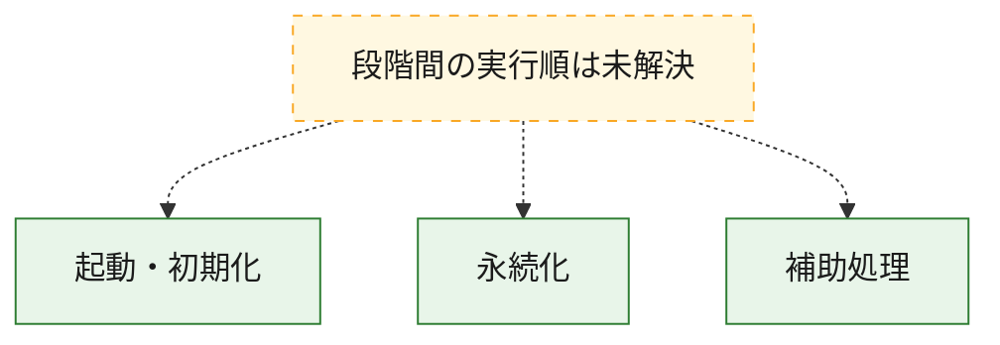
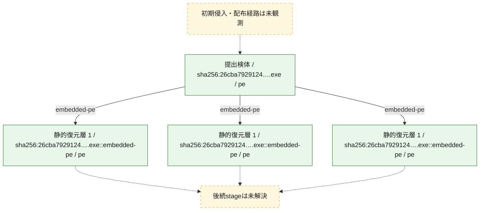
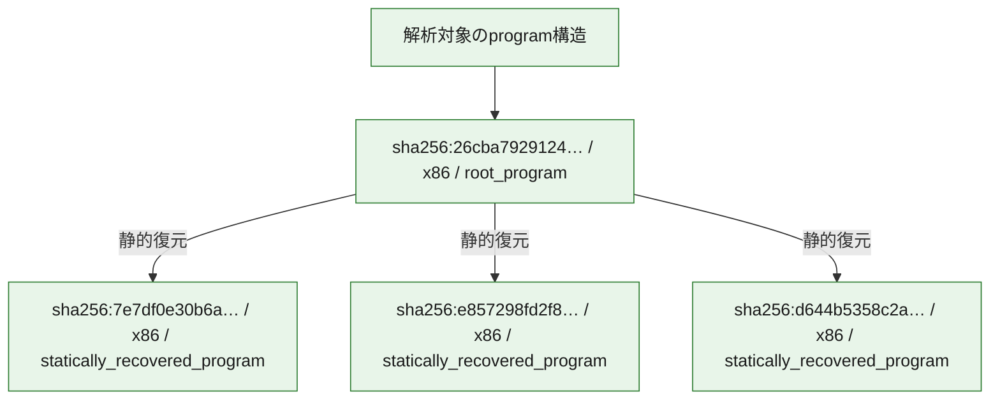

# 全体ロジック：26cba7929124eb13801a4e32c7071a2b3ab10896048bb25ca900e04edfa34795

代表関数の静的証跡から、起動・初期化、永続化の処理群を確認しました。

## 読み方

- phaseの掲載順は解析上の整理順です。observed_call_edgesがない段階間の実行順を断定しません。
- 図の実線は静的に観測した関係、点線と黄色のノードは未観測・未解決の関係を示します。
- 図は静的な要約であり、動的実行を再現するものではありません。
- 詳細な関数解説とfingerprintは[STATIC-LOGIC.md](STATIC-LOGIC.md)を参照してください。

## 静的可視化

### 実行フロー

### 感染チェーン

### モジュール関係

## 処理段階

### 1. 起動・初期化

entry pointから初期化と後続処理への移行を確認します。
確度: `confirmed_static_function_evidence`

- `e857298fd2f8d1c7d48780769433f33e7b3ceaae5ea5a74c13ce8c10bcc7b690:ghidra:140134b3c` — 初期化と主要処理への分岐を行う入口関数です。 状態: `succeeded`、選定理由: `entry_point`, `meaningful_symbol_name`, `reviewed_call_centrality:22`, `role:entrypoint`
- `26cba7929124eb13801a4e32c7071a2b3ab10896048bb25ca900e04edfa34795:ghidra:1400014c0` — 初期化と主要処理への分岐を行う入口関数です。 状態: `succeeded`、選定理由: `entry_point`, `meaningful_symbol_name`, `reviewed_call_centrality:1`, `role:entrypoint`

### 2. 永続化

自動起動や永続化に関係する設定変更を確認します。
確度: `confirmed_static_function_evidence`

- `26cba7929124eb13801a4e32c7071a2b3ab10896048bb25ca900e04edfa34795:ghidra:140001190` — 自動起動または永続化に関係する処理を含む関数です。 状態: `succeeded`、選定理由: `context_representative`, `reviewed_call_centrality:23`, `role:persistence`

### 3. 補助処理

主要処理を支える一般内部関数またはlibrary処理を確認します。
確度: `confirmed_static_function_evidence`

- `7e7df0e30b6aba8637fb58db0a2e7a876890b872f0d0b313424d46c9299580e8:ghidra:14000106f` — 検体内部の一般処理を実装する関数です。 状態: `succeeded`、選定理由: `context_representative`, `reviewed_call_centrality:2`, `small_program_complete_context`
- `7e7df0e30b6aba8637fb58db0a2e7a876890b872f0d0b313424d46c9299580e8:ghidra:1400011e8` — 検体内部の一般処理を実装する関数です。 状態: `succeeded`、選定理由: `context_representative`, `reviewed_call_centrality:3`, `small_program_complete_context`
- `7e7df0e30b6aba8637fb58db0a2e7a876890b872f0d0b313424d46c9299580e8:ghidra:140001252` — 検体内部の一般処理を実装する関数です。 状態: `succeeded`、選定理由: `context_representative`, `reviewed_call_centrality:4`, `small_program_complete_context`
- `7e7df0e30b6aba8637fb58db0a2e7a876890b872f0d0b313424d46c9299580e8:ghidra:1400012c3` — 検体内部の一般処理を実装する関数です。 状態: `succeeded`、選定理由: `context_representative`, `reviewed_call_centrality:3`, `small_program_complete_context`
- `7e7df0e30b6aba8637fb58db0a2e7a876890b872f0d0b313424d46c9299580e8:ghidra:140001345` — 検体内部の一般処理を実装する関数です。 状態: `succeeded`、選定理由: `context_representative`, `reviewed_call_centrality:5`, `small_program_complete_context`
- `7e7df0e30b6aba8637fb58db0a2e7a876890b872f0d0b313424d46c9299580e8:ghidra:140001383` — 検体内部の一般処理を実装する関数です。 状態: `succeeded`、選定理由: `context_representative`, `reviewed_call_centrality:4`, `small_program_complete_context`
- `7e7df0e30b6aba8637fb58db0a2e7a876890b872f0d0b313424d46c9299580e8:ghidra:1400013c1` — 検体内部の一般処理を実装する関数です。 状態: `succeeded`、選定理由: `context_representative`, `reviewed_call_centrality:4`, `small_program_complete_context`
- `7e7df0e30b6aba8637fb58db0a2e7a876890b872f0d0b313424d46c9299580e8:ghidra:1400013ff` — 検体内部の一般処理を実装する関数です。 状態: `succeeded`、選定理由: `context_representative`, `reviewed_call_centrality:7`, `small_program_complete_context`
- `7e7df0e30b6aba8637fb58db0a2e7a876890b872f0d0b313424d46c9299580e8:ghidra:1400014db` — 検体内部の一般処理を実装する関数です。 状態: `succeeded`、選定理由: `context_representative`, `reviewed_call_centrality:6`, `small_program_complete_context`
- `7e7df0e30b6aba8637fb58db0a2e7a876890b872f0d0b313424d46c9299580e8:ghidra:140001576` — 検体内部の一般処理を実装する関数です。 状態: `succeeded`、選定理由: `context_representative`, `reviewed_call_centrality:3`, `small_program_complete_context`
- `7e7df0e30b6aba8637fb58db0a2e7a876890b872f0d0b313424d46c9299580e8:ghidra:140001668` — 検体内部の一般処理を実装する関数です。 状態: `succeeded`、選定理由: `context_representative`, `reviewed_call_centrality:8`, `small_program_complete_context`
- `7e7df0e30b6aba8637fb58db0a2e7a876890b872f0d0b313424d46c9299580e8:ghidra:14000170f` — 検体内部の一般処理を実装する関数です。 状態: `succeeded`、選定理由: `context_representative`, `reviewed_call_centrality:7`, `small_program_complete_context`
- `7e7df0e30b6aba8637fb58db0a2e7a876890b872f0d0b313424d46c9299580e8:ghidra:140001917` — 検体内部の一般処理を実装する関数です。 状態: `succeeded`、選定理由: `context_representative`, `reviewed_call_centrality:12`, `small_program_complete_context`
- `7e7df0e30b6aba8637fb58db0a2e7a876890b872f0d0b313424d46c9299580e8:ghidra:140001ae2` — 検体内部の一般処理を実装する関数です。 状態: `succeeded`、選定理由: `context_representative`, `reviewed_call_centrality:3`, `small_program_complete_context`
- `7e7df0e30b6aba8637fb58db0a2e7a876890b872f0d0b313424d46c9299580e8:ghidra:140001b81` — 検体内部の一般処理を実装する関数です。 状態: `succeeded`、選定理由: `context_representative`, `reviewed_call_centrality:32`, `small_program_complete_context`
- `7e7df0e30b6aba8637fb58db0a2e7a876890b872f0d0b313424d46c9299580e8:ghidra:140003f70` — 検体内部の一般処理を実装する関数です。 状態: `succeeded`、選定理由: `context_representative`, `reviewed_call_centrality:3`, `small_program_complete_context`
- `7e7df0e30b6aba8637fb58db0a2e7a876890b872f0d0b313424d46c9299580e8:ghidra:140003f80` — 検体内部の一般処理を実装する関数です。 状態: `succeeded`、選定理由: `context_representative`, `reviewed_call_centrality:4`, `small_program_complete_context`
- `7e7df0e30b6aba8637fb58db0a2e7a876890b872f0d0b313424d46c9299580e8:ghidra:140004010` — 検体内部の一般処理を実装する関数です。 状態: `succeeded`、選定理由: `context_representative`, `reviewed_call_centrality:10`, `small_program_complete_context`
- `7e7df0e30b6aba8637fb58db0a2e7a876890b872f0d0b313424d46c9299580e8:ghidra:140004020` — 検体内部の一般処理を実装する関数です。 状態: `succeeded`、選定理由: `context_representative`, `reviewed_call_centrality:12`, `small_program_complete_context`
- `7e7df0e30b6aba8637fb58db0a2e7a876890b872f0d0b313424d46c9299580e8:ghidra:1400042a0` — 検体内部の一般処理を実装する関数です。 状態: `succeeded`、選定理由: `context_representative`, `reviewed_call_centrality:6`, `small_program_complete_context`
- `7e7df0e30b6aba8637fb58db0a2e7a876890b872f0d0b313424d46c9299580e8:ghidra:140004310` — 検体内部の一般処理を実装する関数です。 状態: `succeeded`、選定理由: `context_representative`, `reviewed_call_centrality:1`, `small_program_complete_context`
- `7e7df0e30b6aba8637fb58db0a2e7a876890b872f0d0b313424d46c9299580e8:ghidra:140004510` — 検体内部の一般処理を実装する関数です。 状態: `succeeded`、選定理由: `context_representative`, `reviewed_call_centrality:4`, `small_program_complete_context`
- `7e7df0e30b6aba8637fb58db0a2e7a876890b872f0d0b313424d46c9299580e8:ghidra:1400045a9` — 検体内部の一般処理を実装する関数です。 状態: `succeeded`、選定理由: `context_representative`, `reviewed_call_centrality:6`, `small_program_complete_context`
- `7e7df0e30b6aba8637fb58db0a2e7a876890b872f0d0b313424d46c9299580e8:ghidra:1400045e0` — 検体内部の一般処理を実装する関数です。 状態: `succeeded`、選定理由: `context_representative`, `reviewed_call_centrality:5`, `small_program_complete_context`
- `7e7df0e30b6aba8637fb58db0a2e7a876890b872f0d0b313424d46c9299580e8:ghidra:140004674` — 検体内部の一般処理を実装する関数です。 状態: `succeeded`、選定理由: `context_representative`, `reviewed_call_centrality:9`, `small_program_complete_context`
- `7e7df0e30b6aba8637fb58db0a2e7a876890b872f0d0b313424d46c9299580e8:ghidra:140004691` — 検体内部の一般処理を実装する関数です。 状態: `succeeded`、選定理由: `context_representative`, `reviewed_call_centrality:8`, `small_program_complete_context`
- `7e7df0e30b6aba8637fb58db0a2e7a876890b872f0d0b313424d46c9299580e8:ghidra:1400046b0` — 検体内部の一般処理を実装する関数です。 状態: `succeeded`、選定理由: `context_representative`, `reviewed_call_centrality:5`, `small_program_complete_context`
- `7e7df0e30b6aba8637fb58db0a2e7a876890b872f0d0b313424d46c9299580e8:ghidra:140004740` — 検体内部の一般処理を実装する関数です。 状態: `succeeded`、選定理由: `context_representative`, `reviewed_call_centrality:5`, `small_program_complete_context`
- `7e7df0e30b6aba8637fb58db0a2e7a876890b872f0d0b313424d46c9299580e8:ghidra:140004750` — 検体内部の一般処理を実装する関数です。 状態: `succeeded`、選定理由: `context_representative`, `reviewed_call_centrality:4`, `small_program_complete_context`
- `e857298fd2f8d1c7d48780769433f33e7b3ceaae5ea5a74c13ce8c10bcc7b690:ghidra:140118888` — 検体内部の一般処理を実装する関数です。 状態: `succeeded`、選定理由: `context_representative`, `reviewed_call_centrality:17`
- `e857298fd2f8d1c7d48780769433f33e7b3ceaae5ea5a74c13ce8c10bcc7b690:ghidra:14011926c` — 検体内部の一般処理を実装する関数です。 状態: `succeeded`、選定理由: `context_representative`, `reviewed_call_centrality:2`
- `e857298fd2f8d1c7d48780769433f33e7b3ceaae5ea5a74c13ce8c10bcc7b690:ghidra:14011928c` — 検体内部の一般処理を実装する関数です。 状態: `succeeded`、選定理由: `context_representative`, `reviewed_call_centrality:2`
- `e857298fd2f8d1c7d48780769433f33e7b3ceaae5ea5a74c13ce8c10bcc7b690:ghidra:1401192bc` — 検体内部の一般処理を実装する関数です。 状態: `succeeded`、選定理由: `context_representative`, `reviewed_call_centrality:4`
- `e857298fd2f8d1c7d48780769433f33e7b3ceaae5ea5a74c13ce8c10bcc7b690:ghidra:140119354` — 検体内部の一般処理を実装する関数です。 状態: `succeeded`、選定理由: `context_representative`, `reviewed_call_centrality:2`
- `e857298fd2f8d1c7d48780769433f33e7b3ceaae5ea5a74c13ce8c10bcc7b690:ghidra:1401193d4` — 検体内部の一般処理を実装する関数です。 状態: `succeeded`、選定理由: `context_representative`, `reviewed_call_centrality:2`
- `e857298fd2f8d1c7d48780769433f33e7b3ceaae5ea5a74c13ce8c10bcc7b690:ghidra:1401193f4` — 検体内部の一般処理を実装する関数です。 状態: `succeeded`、選定理由: `context_representative`, `reviewed_call_centrality:2`
- `e857298fd2f8d1c7d48780769433f33e7b3ceaae5ea5a74c13ce8c10bcc7b690:ghidra:140119424` — 検体内部の一般処理を実装する関数です。 状態: `succeeded`、選定理由: `context_representative`, `reviewed_call_centrality:3`
- `e857298fd2f8d1c7d48780769433f33e7b3ceaae5ea5a74c13ce8c10bcc7b690:ghidra:140119460` — 検体内部の一般処理を実装する関数です。 状態: `succeeded`、選定理由: `context_representative`, `reviewed_call_centrality:2`
- `e857298fd2f8d1c7d48780769433f33e7b3ceaae5ea5a74c13ce8c10bcc7b690:ghidra:140119488` — 検体内部の一般処理を実装する関数です。 状態: `succeeded`、選定理由: `context_representative`, `reviewed_call_centrality:2`
- `e857298fd2f8d1c7d48780769433f33e7b3ceaae5ea5a74c13ce8c10bcc7b690:ghidra:1401194e0` — 検体内部の一般処理を実装する関数です。 状態: `succeeded`、選定理由: `context_representative`, `reviewed_call_centrality:4`
- `e857298fd2f8d1c7d48780769433f33e7b3ceaae5ea5a74c13ce8c10bcc7b690:ghidra:140119614` — 検体内部の一般処理を実装する関数です。 状態: `succeeded`、選定理由: `context_representative`, `reviewed_call_centrality:1`
- `e857298fd2f8d1c7d48780769433f33e7b3ceaae5ea5a74c13ce8c10bcc7b690:ghidra:14011965c` — 検体内部の一般処理を実装する関数です。 状態: `succeeded`、選定理由: `context_representative`, `reviewed_call_centrality:2`
- `e857298fd2f8d1c7d48780769433f33e7b3ceaae5ea5a74c13ce8c10bcc7b690:ghidra:1401196d8` — 検体内部の一般処理を実装する関数です。 状態: `succeeded`、選定理由: `context_representative`, `reviewed_call_centrality:3`
- `e857298fd2f8d1c7d48780769433f33e7b3ceaae5ea5a74c13ce8c10bcc7b690:ghidra:1401196f8` — 検体内部の一般処理を実装する関数です。 状態: `succeeded`、選定理由: `context_representative`, `reviewed_call_centrality:1`
- `e857298fd2f8d1c7d48780769433f33e7b3ceaae5ea5a74c13ce8c10bcc7b690:ghidra:140119734` — 検体内部の一般処理を実装する関数です。 状態: `succeeded`、選定理由: `context_representative`, `reviewed_call_centrality:1`
- `e857298fd2f8d1c7d48780769433f33e7b3ceaae5ea5a74c13ce8c10bcc7b690:ghidra:140119770` — 検体内部の一般処理を実装する関数です。 状態: `succeeded`、選定理由: `context_representative`, `reviewed_call_centrality:2`
- `e857298fd2f8d1c7d48780769433f33e7b3ceaae5ea5a74c13ce8c10bcc7b690:ghidra:140119784` — 検体内部の一般処理を実装する関数です。 状態: `succeeded`、選定理由: `context_representative`, `reviewed_call_centrality:1`
- `e857298fd2f8d1c7d48780769433f33e7b3ceaae5ea5a74c13ce8c10bcc7b690:ghidra:140119810` — 検体内部の一般処理を実装する関数です。 状態: `succeeded`、選定理由: `context_representative`, `reviewed_call_centrality:1`
- `e857298fd2f8d1c7d48780769433f33e7b3ceaae5ea5a74c13ce8c10bcc7b690:ghidra:140119888` — 検体内部の一般処理を実装する関数です。 状態: `succeeded`、選定理由: `context_representative`, `reviewed_call_centrality:3`
- `e857298fd2f8d1c7d48780769433f33e7b3ceaae5ea5a74c13ce8c10bcc7b690:ghidra:1401198a8` — 検体内部の一般処理を実装する関数です。 状態: `succeeded`、選定理由: `context_representative`, `reviewed_call_centrality:1`
- `e857298fd2f8d1c7d48780769433f33e7b3ceaae5ea5a74c13ce8c10bcc7b690:ghidra:1401198e4` — 検体内部の一般処理を実装する関数です。 状態: `succeeded`、選定理由: `context_representative`, `reviewed_call_centrality:1`
- `e857298fd2f8d1c7d48780769433f33e7b3ceaae5ea5a74c13ce8c10bcc7b690:ghidra:140119938` — 検体内部の一般処理を実装する関数です。 状態: `succeeded`、選定理由: `context_representative`, `reviewed_call_centrality:1`
- `e857298fd2f8d1c7d48780769433f33e7b3ceaae5ea5a74c13ce8c10bcc7b690:ghidra:140119980` — 検体内部の一般処理を実装する関数です。 状態: `succeeded`、選定理由: `context_representative`
- `e857298fd2f8d1c7d48780769433f33e7b3ceaae5ea5a74c13ce8c10bcc7b690:ghidra:140119a04` — 検体内部の一般処理を実装する関数です。 状態: `succeeded`、選定理由: `context_representative`, `reviewed_call_centrality:4`
- `e857298fd2f8d1c7d48780769433f33e7b3ceaae5ea5a74c13ce8c10bcc7b690:ghidra:140119ac8` — 検体内部の一般処理を実装する関数です。 状態: `succeeded`、選定理由: `context_representative`, `reviewed_call_centrality:6`
- `e857298fd2f8d1c7d48780769433f33e7b3ceaae5ea5a74c13ce8c10bcc7b690:ghidra:140119b98` — 検体内部の一般処理を実装する関数です。 状態: `succeeded`、選定理由: `context_representative`, `reviewed_call_centrality:2`
- `e857298fd2f8d1c7d48780769433f33e7b3ceaae5ea5a74c13ce8c10bcc7b690:ghidra:140119bdc` — 検体内部の一般処理を実装する関数です。 状態: `succeeded`、選定理由: `context_representative`, `reviewed_call_centrality:3`
- `e857298fd2f8d1c7d48780769433f33e7b3ceaae5ea5a74c13ce8c10bcc7b690:ghidra:140119c78` — 検体内部の一般処理を実装する関数です。 状態: `succeeded`、選定理由: `context_representative`, `reviewed_call_centrality:5`
- `e857298fd2f8d1c7d48780769433f33e7b3ceaae5ea5a74c13ce8c10bcc7b690:ghidra:140119d40` — 検体内部の一般処理を実装する関数です。 状態: `succeeded`、選定理由: `context_representative`, `reviewed_call_centrality:4`
- `e857298fd2f8d1c7d48780769433f33e7b3ceaae5ea5a74c13ce8c10bcc7b690:ghidra:14012d77c` — 検体内部の一般処理を実装する関数です。 状態: `succeeded`、選定理由: `meaningful_symbol_name`
- `d644b5358c2af9eade675b0f578342e72839effad6e12dcaad884ad8169087ca:ghidra:1400010a0` — 検体内部の一般処理を実装する関数です。 状態: `succeeded`、選定理由: `context_representative`, `reviewed_call_centrality:2`
- `d644b5358c2af9eade675b0f578342e72839effad6e12dcaad884ad8169087ca:ghidra:1400011e0` — 検体内部の一般処理を実装する関数です。 状態: `succeeded`、選定理由: `context_representative`, `reviewed_call_centrality:4`
- `d644b5358c2af9eade675b0f578342e72839effad6e12dcaad884ad8169087ca:ghidra:140001260` — 検体内部の一般処理を実装する関数です。 状態: `succeeded`、選定理由: `context_representative`, `reviewed_call_centrality:4`
- `d644b5358c2af9eade675b0f578342e72839effad6e12dcaad884ad8169087ca:ghidra:140001300` — 検体内部の一般処理を実装する関数です。 状態: `succeeded`、選定理由: `context_representative`, `reviewed_call_centrality:4`
- `d644b5358c2af9eade675b0f578342e72839effad6e12dcaad884ad8169087ca:ghidra:140001400` — 検体内部の一般処理を実装する関数です。 状態: `succeeded`、選定理由: `context_representative`, `reviewed_call_centrality:8`
- `d644b5358c2af9eade675b0f578342e72839effad6e12dcaad884ad8169087ca:ghidra:140001880` — 検体内部の一般処理を実装する関数です。 状態: `succeeded`、選定理由: `context_representative`, `reviewed_call_centrality:2`
- `d644b5358c2af9eade675b0f578342e72839effad6e12dcaad884ad8169087ca:ghidra:140001980` — 検体内部の一般処理を実装する関数です。 状態: `succeeded`、選定理由: `context_representative`, `reviewed_call_centrality:2`
- `d644b5358c2af9eade675b0f578342e72839effad6e12dcaad884ad8169087ca:ghidra:140001a00` — 検体内部の一般処理を実装する関数です。 状態: `succeeded`、選定理由: `context_representative`, `reviewed_call_centrality:3`
- `d644b5358c2af9eade675b0f578342e72839effad6e12dcaad884ad8169087ca:ghidra:140001a60` — 検体内部の一般処理を実装する関数です。 状態: `succeeded`、選定理由: `context_representative`, `reviewed_call_centrality:11`
- `d644b5358c2af9eade675b0f578342e72839effad6e12dcaad884ad8169087ca:ghidra:140001fa0` — 検体内部の一般処理を実装する関数です。 状態: `succeeded`、選定理由: `context_representative`, `reviewed_call_centrality:11`
- `d644b5358c2af9eade675b0f578342e72839effad6e12dcaad884ad8169087ca:ghidra:1400028e0` — 検体内部の一般処理を実装する関数です。 状態: `succeeded`、選定理由: `context_representative`, `reviewed_call_centrality:2`
- `d644b5358c2af9eade675b0f578342e72839effad6e12dcaad884ad8169087ca:ghidra:140002960` — 検体内部の一般処理を実装する関数です。 状態: `succeeded`、選定理由: `context_representative`, `reviewed_call_centrality:2`
- `d644b5358c2af9eade675b0f578342e72839effad6e12dcaad884ad8169087ca:ghidra:140003900` — 検体内部の一般処理を実装する関数です。 状態: `succeeded`、選定理由: `context_representative`, `reviewed_call_centrality:1`
- `d644b5358c2af9eade675b0f578342e72839effad6e12dcaad884ad8169087ca:ghidra:140003940` — 検体内部の一般処理を実装する関数です。 状態: `succeeded`、選定理由: `context_representative`, `reviewed_call_centrality:10`
- `d644b5358c2af9eade675b0f578342e72839effad6e12dcaad884ad8169087ca:ghidra:140003bc0` — 検体内部の一般処理を実装する関数です。 状態: `succeeded`、選定理由: `context_representative`, `reviewed_call_centrality:5`
- `d644b5358c2af9eade675b0f578342e72839effad6e12dcaad884ad8169087ca:ghidra:140003e40` — 検体内部の一般処理を実装する関数です。 状態: `succeeded`、選定理由: `context_representative`, `reviewed_call_centrality:4`
- `d644b5358c2af9eade675b0f578342e72839effad6e12dcaad884ad8169087ca:ghidra:140003f60` — 検体内部の一般処理を実装する関数です。 状態: `succeeded`、選定理由: `context_representative`, `reviewed_call_centrality:7`
- `d644b5358c2af9eade675b0f578342e72839effad6e12dcaad884ad8169087ca:ghidra:1400040a0` — 検体内部の一般処理を実装する関数です。 状態: `succeeded`、選定理由: `context_representative`, `reviewed_call_centrality:9`
- `d644b5358c2af9eade675b0f578342e72839effad6e12dcaad884ad8169087ca:ghidra:140004360` — 検体内部の一般処理を実装する関数です。 状態: `succeeded`、選定理由: `context_representative`, `reviewed_call_centrality:3`
- `d644b5358c2af9eade675b0f578342e72839effad6e12dcaad884ad8169087ca:ghidra:1400043e0` — 検体内部の一般処理を実装する関数です。 状態: `succeeded`、選定理由: `context_representative`, `reviewed_call_centrality:5`
- `d644b5358c2af9eade675b0f578342e72839effad6e12dcaad884ad8169087ca:ghidra:140004580` — 検体内部の一般処理を実装する関数です。 状態: `succeeded`、選定理由: `context_representative`, `reviewed_call_centrality:2`
- `d644b5358c2af9eade675b0f578342e72839effad6e12dcaad884ad8169087ca:ghidra:140004780` — 検体内部の一般処理を実装する関数です。 状態: `succeeded`、選定理由: `context_representative`, `reviewed_call_centrality:3`
- `d644b5358c2af9eade675b0f578342e72839effad6e12dcaad884ad8169087ca:ghidra:1400047e0` — 検体内部の一般処理を実装する関数です。 状態: `succeeded`、選定理由: `context_representative`, `reviewed_call_centrality:6`
- `d644b5358c2af9eade675b0f578342e72839effad6e12dcaad884ad8169087ca:ghidra:140004940` — 検体内部の一般処理を実装する関数です。 状態: `succeeded`、選定理由: `context_representative`, `reviewed_call_centrality:6`
- `d644b5358c2af9eade675b0f578342e72839effad6e12dcaad884ad8169087ca:ghidra:140004aa0` — 検体内部の一般処理を実装する関数です。 状態: `succeeded`、選定理由: `context_representative`, `reviewed_call_centrality:7`
- `d644b5358c2af9eade675b0f578342e72839effad6e12dcaad884ad8169087ca:ghidra:140004c20` — 検体内部の一般処理を実装する関数です。 状態: `succeeded`、選定理由: `context_representative`, `reviewed_call_centrality:2`
- `d644b5358c2af9eade675b0f578342e72839effad6e12dcaad884ad8169087ca:ghidra:140004e40` — 検体内部の一般処理を実装する関数です。 状態: `succeeded`、選定理由: `context_representative`, `reviewed_call_centrality:8`
- `d644b5358c2af9eade675b0f578342e72839effad6e12dcaad884ad8169087ca:ghidra:140005060` — 検体内部の一般処理を実装する関数です。 状態: `succeeded`、選定理由: `context_representative`, `reviewed_call_centrality:6`
- `d644b5358c2af9eade675b0f578342e72839effad6e12dcaad884ad8169087ca:ghidra:140005160` — 検体内部の一般処理を実装する関数です。 状態: `succeeded`、選定理由: `context_representative`, `reviewed_call_centrality:5`
- `d644b5358c2af9eade675b0f578342e72839effad6e12dcaad884ad8169087ca:ghidra:140005280` — 検体内部の一般処理を実装する関数です。 状態: `succeeded`、選定理由: `context_representative`, `reviewed_call_centrality:7`
- `d644b5358c2af9eade675b0f578342e72839effad6e12dcaad884ad8169087ca:ghidra:140005460` — 検体内部の一般処理を実装する関数です。 状態: `succeeded`、選定理由: `context_representative`, `reviewed_call_centrality:5`
- `d644b5358c2af9eade675b0f578342e72839effad6e12dcaad884ad8169087ca:ghidra:140005640` — 検体内部の一般処理を実装する関数です。 状態: `succeeded`、選定理由: `context_representative`, `reviewed_call_centrality:6`
- `26cba7929124eb13801a4e32c7071a2b3ab10896048bb25ca900e04edfa34795:ghidra:140001000` — 検体内部の一般処理を実装する関数です。 状態: `succeeded`、選定理由: `context_representative`
- `26cba7929124eb13801a4e32c7071a2b3ab10896048bb25ca900e04edfa34795:ghidra:140001010` — 検体内部の一般処理を実装する関数です。 状態: `succeeded`、選定理由: `context_representative`, `reviewed_call_centrality:6`
- `26cba7929124eb13801a4e32c7071a2b3ab10896048bb25ca900e04edfa34795:ghidra:140001140` — 検体内部の一般処理を実装する関数です。 状態: `succeeded`、選定理由: `context_representative`, `reviewed_call_centrality:1`
- `26cba7929124eb13801a4e32c7071a2b3ab10896048bb25ca900e04edfa34795:ghidra:1400014e0` — 検体内部の一般処理を実装する関数です。 状態: `succeeded`、選定理由: `context_representative`, `reviewed_call_centrality:1`
- `26cba7929124eb13801a4e32c7071a2b3ab10896048bb25ca900e04edfa34795:ghidra:140001500` — 検体内部の一般処理を実装する関数です。 状態: `succeeded`、選定理由: `context_representative`, `reviewed_call_centrality:1`
- `26cba7929124eb13801a4e32c7071a2b3ab10896048bb25ca900e04edfa34795:ghidra:140001520` — 検体内部の一般処理を実装する関数です。 状態: `succeeded`、選定理由: `context_representative`, `reviewed_call_centrality:1`
- `26cba7929124eb13801a4e32c7071a2b3ab10896048bb25ca900e04edfa34795:ghidra:140001530` — 検体内部の一般処理を実装する関数です。 状態: `succeeded`、選定理由: `context_representative`
- `26cba7929124eb13801a4e32c7071a2b3ab10896048bb25ca900e04edfa34795:ghidra:1400015e0` — 検体内部の一般処理を実装する関数です。 状態: `succeeded`、選定理由: `context_representative`, `reviewed_call_centrality:2`
- `26cba7929124eb13801a4e32c7071a2b3ab10896048bb25ca900e04edfa34795:ghidra:140001780` — 検体内部の一般処理を実装する関数です。 状態: `succeeded`、選定理由: `context_representative`, `reviewed_call_centrality:2`
- `26cba7929124eb13801a4e32c7071a2b3ab10896048bb25ca900e04edfa34795:ghidra:140001820` — 検体内部の一般処理を実装する関数です。 状態: `succeeded`、選定理由: `context_representative`, `reviewed_call_centrality:3`
- `26cba7929124eb13801a4e32c7071a2b3ab10896048bb25ca900e04edfa34795:ghidra:1400018a0` — 検体内部の一般処理を実装する関数です。 状態: `succeeded`、選定理由: `context_representative`, `reviewed_call_centrality:4`
- `26cba7929124eb13801a4e32c7071a2b3ab10896048bb25ca900e04edfa34795:ghidra:140001940` — 検体内部の一般処理を実装する関数です。 状態: `succeeded`、選定理由: `context_representative`, `reviewed_call_centrality:4`
- `26cba7929124eb13801a4e32c7071a2b3ab10896048bb25ca900e04edfa34795:ghidra:140001a40` — 検体内部の一般処理を実装する関数です。 状態: `succeeded`、選定理由: `context_representative`, `reviewed_call_centrality:8`
- `26cba7929124eb13801a4e32c7071a2b3ab10896048bb25ca900e04edfa34795:ghidra:140001ec0` — 検体内部の一般処理を実装する関数です。 状態: `succeeded`、選定理由: `context_representative`, `reviewed_call_centrality:2`
- `26cba7929124eb13801a4e32c7071a2b3ab10896048bb25ca900e04edfa34795:ghidra:140002100` — 検体内部の一般処理を実装する関数です。 状態: `succeeded`、選定理由: `context_representative`, `reviewed_call_centrality:2`
- `26cba7929124eb13801a4e32c7071a2b3ab10896048bb25ca900e04edfa34795:ghidra:140002180` — 検体内部の一般処理を実装する関数です。 状態: `succeeded`、選定理由: `context_representative`, `reviewed_call_centrality:3`
- `26cba7929124eb13801a4e32c7071a2b3ab10896048bb25ca900e04edfa34795:ghidra:1400021e0` — 検体内部の一般処理を実装する関数です。 状態: `succeeded`、選定理由: `context_representative`, `reviewed_call_centrality:11`
- `26cba7929124eb13801a4e32c7071a2b3ab10896048bb25ca900e04edfa34795:ghidra:140002720` — 検体内部の一般処理を実装する関数です。 状態: `succeeded`、選定理由: `context_representative`, `reviewed_call_centrality:11`
- `26cba7929124eb13801a4e32c7071a2b3ab10896048bb25ca900e04edfa34795:ghidra:140003060` — 検体内部の一般処理を実装する関数です。 状態: `succeeded`、選定理由: `context_representative`, `reviewed_call_centrality:2`
- `26cba7929124eb13801a4e32c7071a2b3ab10896048bb25ca900e04edfa34795:ghidra:1400030e0` — 検体内部の一般処理を実装する関数です。 状態: `succeeded`、選定理由: `context_representative`, `reviewed_call_centrality:2`
- `26cba7929124eb13801a4e32c7071a2b3ab10896048bb25ca900e04edfa34795:ghidra:140004160` — 検体内部の一般処理を実装する関数です。 状態: `succeeded`、選定理由: `context_representative`, `reviewed_call_centrality:1`
- `26cba7929124eb13801a4e32c7071a2b3ab10896048bb25ca900e04edfa34795:ghidra:1400041a0` — 検体内部の一般処理を実装する関数です。 状態: `succeeded`、選定理由: `context_representative`, `reviewed_call_centrality:1`
- `26cba7929124eb13801a4e32c7071a2b3ab10896048bb25ca900e04edfa34795:ghidra:1400041e0` — 検体内部の一般処理を実装する関数です。 状態: `succeeded`、選定理由: `context_representative`, `reviewed_call_centrality:4`
- `26cba7929124eb13801a4e32c7071a2b3ab10896048bb25ca900e04edfa34795:ghidra:1400043c0` — 検体内部の一般処理を実装する関数です。 状態: `succeeded`、選定理由: `context_representative`, `reviewed_call_centrality:10`
- `26cba7929124eb13801a4e32c7071a2b3ab10896048bb25ca900e04edfa34795:ghidra:140004640` — 検体内部の一般処理を実装する関数です。 状態: `succeeded`、選定理由: `context_representative`, `reviewed_call_centrality:5`
- `26cba7929124eb13801a4e32c7071a2b3ab10896048bb25ca900e04edfa34795:ghidra:1400048c0` — 検体内部の一般処理を実装する関数です。 状態: `succeeded`、選定理由: `context_representative`, `reviewed_call_centrality:4`
- `26cba7929124eb13801a4e32c7071a2b3ab10896048bb25ca900e04edfa34795:ghidra:1400049e0` — 検体内部の一般処理を実装する関数です。 状態: `succeeded`、選定理由: `context_representative`, `reviewed_call_centrality:7`
- `26cba7929124eb13801a4e32c7071a2b3ab10896048bb25ca900e04edfa34795:ghidra:140004b20` — 検体内部の一般処理を実装する関数です。 状態: `succeeded`、選定理由: `context_representative`, `reviewed_call_centrality:9`
- `26cba7929124eb13801a4e32c7071a2b3ab10896048bb25ca900e04edfa34795:ghidra:140004de0` — 検体内部の一般処理を実装する関数です。 状態: `succeeded`、選定理由: `context_representative`, `reviewed_call_centrality:3`
- `26cba7929124eb13801a4e32c7071a2b3ab10896048bb25ca900e04edfa34795:ghidra:140004e60` — 検体内部の一般処理を実装する関数です。 状態: `succeeded`、選定理由: `context_representative`, `reviewed_call_centrality:5`

## 観測したcall関係

- 代表関数間で直接解決できた呼出関係はありません。

## 解析範囲と制約

- 選定外関数は全体inventoryへ残しますが、関数本体の個別解説対象にはしていません。
- indirect call、難読化、packer、VM、壊れたcontrol flowによりcall関係が欠落する場合があります。
- 文書は静的解析に基づき、検体実行や外部通信による動的確認は行っていません。
