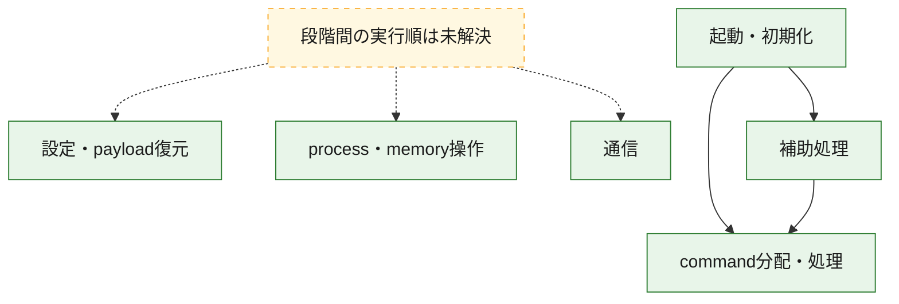
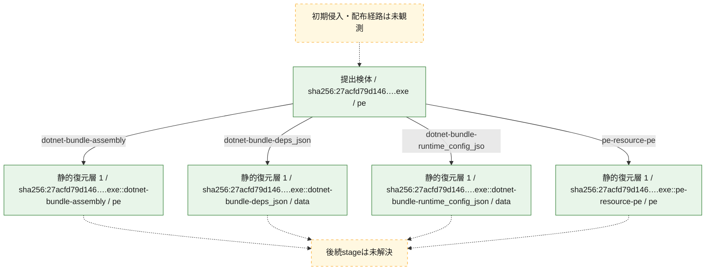
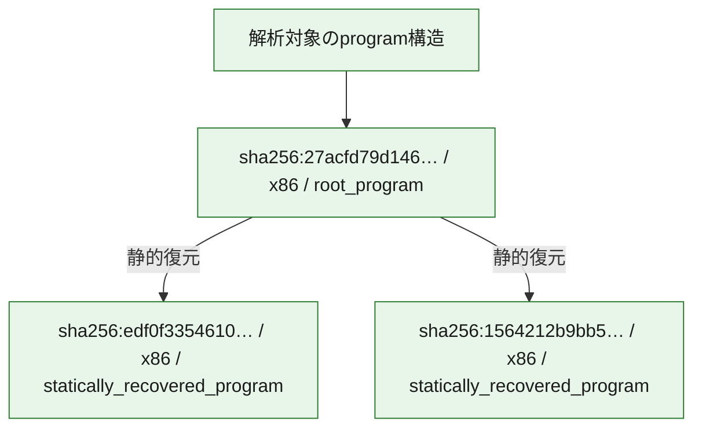

# 全体ロジック：27acfd79d14615e57aaaf388585dcd0be08ec68e2b5518f01e9e34fccb0bc580

代表関数の静的証跡から、起動・初期化、設定・payload復元、process・memory操作、通信、command分配・処理の処理群を確認しました。

## 読み方

- phaseの掲載順は解析上の整理順です。observed_call_edgesがない段階間の実行順を断定しません。
- 図の実線は静的に観測した関係、点線と黄色のノードは未観測・未解決の関係を示します。
- 図は静的な要約であり、動的実行を再現するものではありません。
- 詳細な関数解説とfingerprintは[STATIC-LOGIC.md](STATIC-LOGIC.md)を参照してください。

## 静的可視化

### 実行フロー

### 感染チェーン

### モジュール関係

## 処理段階

### 1. 起動・初期化

entry pointから初期化と後続処理への移行を確認します。
確度: `confirmed_static_function_evidence`

- `edf0f33546103ec53d44f1dfe70fd63fcebd6f1c43997163e7c3e020fc6923c7:cil:0x06000089` — 初期化と主要処理への分岐を行う入口関数です。 状態: `succeeded`、選定理由: `entry_point`, `reviewed_call_centrality:6`
- `edf0f33546103ec53d44f1dfe70fd63fcebd6f1c43997163e7c3e020fc6923c7:cil:0x060000a1` — 初期化と主要処理への分岐を行う入口関数です。 状態: `succeeded`、選定理由: `entry_point`, `reviewed_call_centrality:6`
- `edf0f33546103ec53d44f1dfe70fd63fcebd6f1c43997163e7c3e020fc6923c7:cil:0x060000b3` — 初期化と主要処理への分岐を行う入口関数です。 状態: `succeeded`、選定理由: `entry_point`, `large_function:instructions=239`, `reviewed_call_centrality:72`
- `edf0f33546103ec53d44f1dfe70fd63fcebd6f1c43997163e7c3e020fc6923c7:cil:0x060000b4` — 初期化と主要処理への分岐を行う入口関数です。 状態: `succeeded`、選定理由: `entry_point`, `reviewed_call_centrality:2`
- `1564212b9bb55e1da04fb59c68854c889decc263b1206cbb42a9cb398d7af098:ghidra:1800e1350` — 初期化と主要処理への分岐を行う入口関数です。 状態: `succeeded`、選定理由: `entry_point`, `meaningful_symbol_name`, `reviewed_call_centrality:5`, `role:entrypoint`
- `27acfd79d14615e57aaaf388585dcd0be08ec68e2b5518f01e9e34fccb0bc580:ghidra:1405c3050` — 初期化と主要処理への分岐を行う入口関数です。 状態: `succeeded`、選定理由: `entry_point`, `meaningful_symbol_name`, `reviewed_call_centrality:23`, `role:entrypoint`

### 2. 設定・payload復元

設定、resource、payload、暗号化データの復元・変換を確認します。
確度: `confirmed_static_function_evidence`

- `edf0f33546103ec53d44f1dfe70fd63fcebd6f1c43997163e7c3e020fc6923c7:cil:0x0600000e` — 暗号、hash、encoding、または復号処理に関係する関数です。 状態: `succeeded`、選定理由: `large_function:instructions=79`, `reviewed_call_centrality:4`, `role:cryptographic_transform`
- `edf0f33546103ec53d44f1dfe70fd63fcebd6f1c43997163e7c3e020fc6923c7:cil:0x06000015` — 暗号、hash、encoding、または復号処理に関係する関数です。 状態: `succeeded`、選定理由: `reviewed_call_centrality:4`, `role:cryptographic_transform`
- `edf0f33546103ec53d44f1dfe70fd63fcebd6f1c43997163e7c3e020fc6923c7:cil:0x0600001c` — 暗号、hash、encoding、または復号処理に関係する関数です。 状態: `succeeded`、選定理由: `reviewed_call_centrality:4`, `role:cryptographic_transform`
- `edf0f33546103ec53d44f1dfe70fd63fcebd6f1c43997163e7c3e020fc6923c7:cil:0x06000023` — 暗号、hash、encoding、または復号処理に関係する関数です。 状態: `succeeded`、選定理由: `reviewed_call_centrality:4`, `role:cryptographic_transform`
- `edf0f33546103ec53d44f1dfe70fd63fcebd6f1c43997163e7c3e020fc6923c7:cil:0x06000029` — 暗号、hash、encoding、または復号処理に関係する関数です。 状態: `succeeded`、選定理由: `reviewed_call_centrality:4`, `role:cryptographic_transform`
- `edf0f33546103ec53d44f1dfe70fd63fcebd6f1c43997163e7c3e020fc6923c7:cil:0x06000030` — 暗号、hash、encoding、または復号処理に関係する関数です。 状態: `succeeded`、選定理由: `reviewed_call_centrality:4`, `role:cryptographic_transform`
- `edf0f33546103ec53d44f1dfe70fd63fcebd6f1c43997163e7c3e020fc6923c7:cil:0x06000036` — 暗号、hash、encoding、または復号処理に関係する関数です。 状態: `succeeded`、選定理由: `reviewed_call_centrality:4`, `role:cryptographic_transform`
- `edf0f33546103ec53d44f1dfe70fd63fcebd6f1c43997163e7c3e020fc6923c7:cil:0x0600003c` — 暗号、hash、encoding、または復号処理に関係する関数です。 状態: `succeeded`、選定理由: `reviewed_call_centrality:4`, `role:cryptographic_transform`
- `edf0f33546103ec53d44f1dfe70fd63fcebd6f1c43997163e7c3e020fc6923c7:cil:0x06000042` — 暗号、hash、encoding、または復号処理に関係する関数です。 状態: `succeeded`、選定理由: `reviewed_call_centrality:4`, `role:cryptographic_transform`
- `edf0f33546103ec53d44f1dfe70fd63fcebd6f1c43997163e7c3e020fc6923c7:cil:0x06000048` — 暗号、hash、encoding、または復号処理に関係する関数です。 状態: `succeeded`、選定理由: `reviewed_call_centrality:4`, `role:cryptographic_transform`
- `edf0f33546103ec53d44f1dfe70fd63fcebd6f1c43997163e7c3e020fc6923c7:cil:0x0600004e` — 暗号、hash、encoding、または復号処理に関係する関数です。 状態: `succeeded`、選定理由: `reviewed_call_centrality:4`, `role:cryptographic_transform`
- `edf0f33546103ec53d44f1dfe70fd63fcebd6f1c43997163e7c3e020fc6923c7:cil:0x06000071` — 設定、resource、payloadなどの解析・変換を行う関数です。 状態: `succeeded`、選定理由: `role:config_or_data_transform`
- `edf0f33546103ec53d44f1dfe70fd63fcebd6f1c43997163e7c3e020fc6923c7:cil:0x06000093` — 設定、resource、payloadなどの解析・変換を行う関数です。 状態: `succeeded`、選定理由: `reviewed_call_centrality:14`, `role:config_or_data_transform`
- `edf0f33546103ec53d44f1dfe70fd63fcebd6f1c43997163e7c3e020fc6923c7:cil:0x0600009d` — 設定、resource、payloadなどの解析・変換を行う関数です。 状態: `succeeded`、選定理由: `large_function:instructions=72`, `reviewed_call_centrality:22`, `role:config_or_data_transform`
- `edf0f33546103ec53d44f1dfe70fd63fcebd6f1c43997163e7c3e020fc6923c7:cil:0x0600009e` — 設定、resource、payloadなどの解析・変換を行う関数です。 状態: `succeeded`、選定理由: `reviewed_call_centrality:10`, `role:config_or_data_transform`

### 3. process・memory操作

process、thread、module、memory操作と実行移行を確認します。
確度: `confirmed_static_function_evidence`

- `edf0f33546103ec53d44f1dfe70fd63fcebd6f1c43997163e7c3e020fc6923c7:cil:0x0600008c` — process、thread、module、またはmemory操作に関係する関数です。 状態: `succeeded`、選定理由: `large_function:instructions=140`, `reviewed_call_centrality:30`, `role:process_or_memory_operation`
- `edf0f33546103ec53d44f1dfe70fd63fcebd6f1c43997163e7c3e020fc6923c7:cil:0x06000092` — process、thread、module、またはmemory操作に関係する関数です。 状態: `succeeded`、選定理由: `reviewed_call_centrality:32`, `role:process_or_memory_operation`

### 4. 通信

通信初期化、endpoint処理、送受信の役割を確認します。
確度: `confirmed_static_function_evidence`

- `edf0f33546103ec53d44f1dfe70fd63fcebd6f1c43997163e7c3e020fc6923c7:cil:0x06000075` — 通信初期化、送受信、またはendpoint処理に関係する関数です。 状態: `succeeded`、選定理由: `role:network_communication`
- `edf0f33546103ec53d44f1dfe70fd63fcebd6f1c43997163e7c3e020fc6923c7:cil:0x06000096` — 通信初期化、送受信、またはendpoint処理に関係する関数です。 状態: `succeeded`、選定理由: `reviewed_call_centrality:6`, `role:network_communication`
- `edf0f33546103ec53d44f1dfe70fd63fcebd6f1c43997163e7c3e020fc6923c7:cil:0x06000098` — 通信初期化、送受信、またはendpoint処理に関係する関数です。 状態: `succeeded`、選定理由: `reviewed_call_centrality:6`, `role:network_communication`
- `edf0f33546103ec53d44f1dfe70fd63fcebd6f1c43997163e7c3e020fc6923c7:cil:0x0600009c` — 通信初期化、送受信、またはendpoint処理に関係する関数です。 状態: `succeeded`、選定理由: `reviewed_call_centrality:6`, `role:network_communication`
- `edf0f33546103ec53d44f1dfe70fd63fcebd6f1c43997163e7c3e020fc6923c7:cil:0x060000a7` — 通信初期化、送受信、またはendpoint処理に関係する関数です。 状態: `succeeded`、選定理由: `reviewed_call_centrality:2`, `role:network_communication`
- `edf0f33546103ec53d44f1dfe70fd63fcebd6f1c43997163e7c3e020fc6923c7:cil:0x060000ab` — 通信初期化、送受信、またはendpoint処理に関係する関数です。 状態: `succeeded`、選定理由: `large_function:instructions=468`, `reviewed_call_centrality:110`, `role:network_communication`
- `edf0f33546103ec53d44f1dfe70fd63fcebd6f1c43997163e7c3e020fc6923c7:cil:0x060000ad` — 通信初期化、送受信、またはendpoint処理に関係する関数です。 状態: `succeeded`、選定理由: `large_function:instructions=586`, `reviewed_call_centrality:60`, `role:network_communication`
- `edf0f33546103ec53d44f1dfe70fd63fcebd6f1c43997163e7c3e020fc6923c7:cil:0x060000af` — 通信初期化、送受信、またはendpoint処理に関係する関数です。 状態: `succeeded`、選定理由: `large_function:instructions=127`, `reviewed_call_centrality:24`, `role:network_communication`
- `edf0f33546103ec53d44f1dfe70fd63fcebd6f1c43997163e7c3e020fc6923c7:cil:0x060000b1` — 通信初期化、送受信、またはendpoint処理に関係する関数です。 状態: `succeeded`、選定理由: `large_function:instructions=585`, `reviewed_call_centrality:88`, `role:network_communication`

### 5. command分配・処理

受信commandやtaskの解釈、分配、個別handlerへの移行を確認します。
確度: `confirmed_static_function_evidence_with_limits`

- `1564212b9bb55e1da04fb59c68854c889decc263b1206cbb42a9cb398d7af098:ghidra:1800e5d00` — commandの解釈、分配、または個別処理を担当する関数です。 状態: `limited_bad_instruction_or_flow`、選定理由: `meaningful_symbol_name`, `reviewed_call_centrality:12`, `role:command_dispatch_or_handler`
- `27acfd79d14615e57aaaf388585dcd0be08ec68e2b5518f01e9e34fccb0bc580:ghidra:1405cc190` — commandの解釈、分配、または個別処理を担当する関数です。 状態: `limited_bad_instruction_or_flow`、選定理由: `meaningful_symbol_name`, `reviewed_call_centrality:4`, `role:command_dispatch_or_handler`

### 6. 補助処理

主要処理を支える一般内部関数またはlibrary処理を確認します。
確度: `confirmed_static_function_evidence_with_limits`

- `edf0f33546103ec53d44f1dfe70fd63fcebd6f1c43997163e7c3e020fc6923c7:cil:0x060000a0` — compiler生成処理または汎用library処理とみられる関数です。 状態: `succeeded`、選定理由: `reviewed_call_centrality:10`
- `edf0f33546103ec53d44f1dfe70fd63fcebd6f1c43997163e7c3e020fc6923c7:cil:0x060000b5` — 検体内部の一般処理を実装する関数です。 状態: `succeeded`、選定理由: `large_function:instructions=162`, `reviewed_call_centrality:52`
- `1564212b9bb55e1da04fb59c68854c889decc263b1206cbb42a9cb398d7af098:ghidra:180001000` — 検体内部の一般処理を実装する関数です。 状態: `succeeded`、選定理由: `context_representative`, `reviewed_call_centrality:1`
- `1564212b9bb55e1da04fb59c68854c889decc263b1206cbb42a9cb398d7af098:ghidra:180001030` — 検体内部の一般処理を実装する関数です。 状態: `succeeded`、選定理由: `context_representative`, `reviewed_call_centrality:1`
- `1564212b9bb55e1da04fb59c68854c889decc263b1206cbb42a9cb398d7af098:ghidra:1800010b0` — 検体内部の一般処理を実装する関数です。 状態: `succeeded`、選定理由: `context_representative`, `reviewed_call_centrality:2`
- `1564212b9bb55e1da04fb59c68854c889decc263b1206cbb42a9cb398d7af098:ghidra:1800010c0` — 検体内部の一般処理を実装する関数です。 状態: `succeeded`、選定理由: `context_representative`, `reviewed_call_centrality:3`
- `1564212b9bb55e1da04fb59c68854c889decc263b1206cbb42a9cb398d7af098:ghidra:180001100` — 検体内部の一般処理を実装する関数です。 状態: `succeeded`、選定理由: `context_representative`
- `1564212b9bb55e1da04fb59c68854c889decc263b1206cbb42a9cb398d7af098:ghidra:180001110` — 検体内部の一般処理を実装する関数です。 状態: `succeeded`、選定理由: `context_representative`
- `1564212b9bb55e1da04fb59c68854c889decc263b1206cbb42a9cb398d7af098:ghidra:180001120` — 検体内部の一般処理を実装する関数です。 状態: `succeeded`、選定理由: `context_representative`, `reviewed_call_centrality:5`
- `1564212b9bb55e1da04fb59c68854c889decc263b1206cbb42a9cb398d7af098:ghidra:180001190` — 検体内部の一般処理を実装する関数です。 状態: `succeeded`、選定理由: `context_representative`, `reviewed_call_centrality:4`
- `1564212b9bb55e1da04fb59c68854c889decc263b1206cbb42a9cb398d7af098:ghidra:180001240` — 検体内部の一般処理を実装する関数です。 状態: `succeeded`、選定理由: `context_representative`, `reviewed_call_centrality:8`
- `1564212b9bb55e1da04fb59c68854c889decc263b1206cbb42a9cb398d7af098:ghidra:180001370` — 検体内部の一般処理を実装する関数です。 状態: `succeeded`、選定理由: `context_representative`, `reviewed_call_centrality:6`
- `1564212b9bb55e1da04fb59c68854c889decc263b1206cbb42a9cb398d7af098:ghidra:180001460` — 検体内部の一般処理を実装する関数です。 状態: `succeeded`、選定理由: `context_representative`, `reviewed_call_centrality:6`
- `1564212b9bb55e1da04fb59c68854c889decc263b1206cbb42a9cb398d7af098:ghidra:180001530` — 検体内部の一般処理を実装する関数です。 状態: `succeeded`、選定理由: `context_representative`, `reviewed_call_centrality:4`
- `1564212b9bb55e1da04fb59c68854c889decc263b1206cbb42a9cb398d7af098:ghidra:180001740` — 検体内部の一般処理を実装する関数です。 状態: `succeeded`、選定理由: `context_representative`, `reviewed_call_centrality:2`
- `1564212b9bb55e1da04fb59c68854c889decc263b1206cbb42a9cb398d7af098:ghidra:1800017d0` — 検体内部の一般処理を実装する関数です。 状態: `succeeded`、選定理由: `context_representative`, `reviewed_call_centrality:4`
- `1564212b9bb55e1da04fb59c68854c889decc263b1206cbb42a9cb398d7af098:ghidra:180001950` — 検体内部の一般処理を実装する関数です。 状態: `succeeded`、選定理由: `context_representative`, `reviewed_call_centrality:6`
- `1564212b9bb55e1da04fb59c68854c889decc263b1206cbb42a9cb398d7af098:ghidra:180001b80` — 検体内部の一般処理を実装する関数です。 状態: `succeeded`、選定理由: `context_representative`, `reviewed_call_centrality:4`
- `1564212b9bb55e1da04fb59c68854c889decc263b1206cbb42a9cb398d7af098:ghidra:180001c90` — 検体内部の一般処理を実装する関数です。 状態: `succeeded`、選定理由: `context_representative`, `reviewed_call_centrality:14`
- `1564212b9bb55e1da04fb59c68854c889decc263b1206cbb42a9cb398d7af098:ghidra:180002100` — 検体内部の一般処理を実装する関数です。 状態: `succeeded`、選定理由: `context_representative`, `reviewed_call_centrality:5`
- `1564212b9bb55e1da04fb59c68854c889decc263b1206cbb42a9cb398d7af098:ghidra:180002250` — 検体内部の一般処理を実装する関数です。 状態: `succeeded`、選定理由: `context_representative`, `reviewed_call_centrality:13`
- `1564212b9bb55e1da04fb59c68854c889decc263b1206cbb42a9cb398d7af098:ghidra:1800024d0` — 検体内部の一般処理を実装する関数です。 状態: `succeeded`、選定理由: `context_representative`, `reviewed_call_centrality:1`
- `1564212b9bb55e1da04fb59c68854c889decc263b1206cbb42a9cb398d7af098:ghidra:180002510` — 検体内部の一般処理を実装する関数です。 状態: `succeeded`、選定理由: `context_representative`, `reviewed_call_centrality:8`
- `1564212b9bb55e1da04fb59c68854c889decc263b1206cbb42a9cb398d7af098:ghidra:180009ee0` — 検体内部の一般処理を実装する関数です。 状態: `succeeded`、選定理由: `entry_point`, `meaningful_symbol_name`, `reviewed_call_centrality:2`
- `1564212b9bb55e1da04fb59c68854c889decc263b1206cbb42a9cb398d7af098:ghidra:18000a1d0` — 検体内部の一般処理を実装する関数です。 状態: `succeeded`、選定理由: `entry_point`, `meaningful_symbol_name`, `reviewed_call_centrality:5`
- `1564212b9bb55e1da04fb59c68854c889decc263b1206cbb42a9cb398d7af098:ghidra:18000a3a0` — 検体内部の一般処理を実装する関数です。 状態: `succeeded`、選定理由: `entry_point`, `meaningful_symbol_name`, `reviewed_call_centrality:5`
- `1564212b9bb55e1da04fb59c68854c889decc263b1206cbb42a9cb398d7af098:ghidra:18000a630` — 検体内部の一般処理を実装する関数です。 状態: `succeeded`、選定理由: `entry_point`, `meaningful_symbol_name`
- `1564212b9bb55e1da04fb59c68854c889decc263b1206cbb42a9cb398d7af098:ghidra:18000ce60` — 検体内部の一般処理を実装する関数です。 状態: `succeeded`、選定理由: `meaningful_symbol_name`
- `1564212b9bb55e1da04fb59c68854c889decc263b1206cbb42a9cb398d7af098:ghidra:1800103c0` — 検体内部の一般処理を実装する関数です。 状態: `succeeded`、選定理由: `entry_point`, `meaningful_symbol_name`, `reviewed_call_centrality:4`
- `1564212b9bb55e1da04fb59c68854c889decc263b1206cbb42a9cb398d7af098:ghidra:180024ba0` — 検体内部の一般処理を実装する関数です。 状態: `succeeded`、選定理由: `entry_point`, `meaningful_symbol_name`, `reviewed_call_centrality:11`
- `1564212b9bb55e1da04fb59c68854c889decc263b1206cbb42a9cb398d7af098:ghidra:180025140` — 検体内部の一般処理を実装する関数です。 状態: `succeeded`、選定理由: `entry_point`, `meaningful_symbol_name`, `reviewed_call_centrality:10`
- `1564212b9bb55e1da04fb59c68854c889decc263b1206cbb42a9cb398d7af098:ghidra:1800e1700` — compiler生成処理または汎用library処理とみられる関数です。 状態: `succeeded`、選定理由: `entry_point`, `meaningful_symbol_name`, `reviewed_call_centrality:1`
- `27acfd79d14615e57aaaf388585dcd0be08ec68e2b5518f01e9e34fccb0bc580:ghidra:140001000` — 検体内部の一般処理を実装する関数です。 状態: `succeeded`、選定理由: `context_representative`, `reviewed_call_centrality:1`
- `27acfd79d14615e57aaaf388585dcd0be08ec68e2b5518f01e9e34fccb0bc580:ghidra:140001010` — 検体内部の一般処理を実装する関数です。 状態: `succeeded`、選定理由: `context_representative`, `reviewed_call_centrality:1`
- `27acfd79d14615e57aaaf388585dcd0be08ec68e2b5518f01e9e34fccb0bc580:ghidra:140001020` — 検体内部の一般処理を実装する関数です。 状態: `succeeded`、選定理由: `context_representative`
- `27acfd79d14615e57aaaf388585dcd0be08ec68e2b5518f01e9e34fccb0bc580:ghidra:140001080` — 検体内部の一般処理を実装する関数です。 状態: `succeeded`、選定理由: `context_representative`, `reviewed_call_centrality:2`
- `27acfd79d14615e57aaaf388585dcd0be08ec68e2b5518f01e9e34fccb0bc580:ghidra:1400010c0` — 検体内部の一般処理を実装する関数です。 状態: `succeeded`、選定理由: `context_representative`, `reviewed_call_centrality:2`
- `27acfd79d14615e57aaaf388585dcd0be08ec68e2b5518f01e9e34fccb0bc580:ghidra:140001110` — 検体内部の一般処理を実装する関数です。 状態: `succeeded`、選定理由: `context_representative`, `reviewed_call_centrality:1`
- `27acfd79d14615e57aaaf388585dcd0be08ec68e2b5518f01e9e34fccb0bc580:ghidra:140001140` — 検体内部の一般処理を実装する関数です。 状態: `succeeded`、選定理由: `context_representative`, `reviewed_call_centrality:1`
- `27acfd79d14615e57aaaf388585dcd0be08ec68e2b5518f01e9e34fccb0bc580:ghidra:140001150` — 検体内部の一般処理を実装する関数です。 状態: `succeeded`、選定理由: `context_representative`, `reviewed_call_centrality:1`
- `27acfd79d14615e57aaaf388585dcd0be08ec68e2b5518f01e9e34fccb0bc580:ghidra:140001160` — 検体内部の一般処理を実装する関数です。 状態: `succeeded`、選定理由: `context_representative`, `reviewed_call_centrality:2`
- `27acfd79d14615e57aaaf388585dcd0be08ec68e2b5518f01e9e34fccb0bc580:ghidra:1400011b0` — 検体内部の一般処理を実装する関数です。 状態: `succeeded`、選定理由: `context_representative`
- `27acfd79d14615e57aaaf388585dcd0be08ec68e2b5518f01e9e34fccb0bc580:ghidra:140001230` — 検体内部の一般処理を実装する関数です。 状態: `succeeded`、選定理由: `context_representative`, `reviewed_call_centrality:2`
- `27acfd79d14615e57aaaf388585dcd0be08ec68e2b5518f01e9e34fccb0bc580:ghidra:140001260` — 検体内部の一般処理を実装する関数です。 状態: `succeeded`、選定理由: `context_representative`
- `27acfd79d14615e57aaaf388585dcd0be08ec68e2b5518f01e9e34fccb0bc580:ghidra:140001480` — 検体内部の一般処理を実装する関数です。 状態: `succeeded`、選定理由: `context_representative`, `reviewed_call_centrality:2`
- `27acfd79d14615e57aaaf388585dcd0be08ec68e2b5518f01e9e34fccb0bc580:ghidra:140001490` — 検体内部の一般処理を実装する関数です。 状態: `succeeded`、選定理由: `context_representative`, `reviewed_call_centrality:1`
- `27acfd79d14615e57aaaf388585dcd0be08ec68e2b5518f01e9e34fccb0bc580:ghidra:1400014a0` — 検体内部の一般処理を実装する関数です。 状態: `succeeded`、選定理由: `context_representative`, `reviewed_call_centrality:1`
- `27acfd79d14615e57aaaf388585dcd0be08ec68e2b5518f01e9e34fccb0bc580:ghidra:1400014b0` — 検体内部の一般処理を実装する関数です。 状態: `succeeded`、選定理由: `context_representative`, `reviewed_call_centrality:1`
- `27acfd79d14615e57aaaf388585dcd0be08ec68e2b5518f01e9e34fccb0bc580:ghidra:1400014c0` — 検体内部の一般処理を実装する関数です。 状態: `succeeded`、選定理由: `context_representative`, `reviewed_call_centrality:1`
- `27acfd79d14615e57aaaf388585dcd0be08ec68e2b5518f01e9e34fccb0bc580:ghidra:1400014d0` — 検体内部の一般処理を実装する関数です。 状態: `succeeded`、選定理由: `context_representative`, `reviewed_call_centrality:2`
- `27acfd79d14615e57aaaf388585dcd0be08ec68e2b5518f01e9e34fccb0bc580:ghidra:140001500` — 検体内部の一般処理を実装する関数です。 状態: `succeeded`、選定理由: `context_representative`, `reviewed_call_centrality:2`
- `27acfd79d14615e57aaaf388585dcd0be08ec68e2b5518f01e9e34fccb0bc580:ghidra:140001530` — 検体内部の一般処理を実装する関数です。 状態: `succeeded`、選定理由: `context_representative`, `reviewed_call_centrality:2`
- `27acfd79d14615e57aaaf388585dcd0be08ec68e2b5518f01e9e34fccb0bc580:ghidra:140001560` — 検体内部の一般処理を実装する関数です。 状態: `succeeded`、選定理由: `context_representative`, `reviewed_call_centrality:2`
- `27acfd79d14615e57aaaf388585dcd0be08ec68e2b5518f01e9e34fccb0bc580:ghidra:14000cb20` — 検体内部の一般処理を実装する関数です。 状態: `succeeded`、選定理由: `meaningful_symbol_name`
- `27acfd79d14615e57aaaf388585dcd0be08ec68e2b5518f01e9e34fccb0bc580:ghidra:140564ae0` — 検体内部の一般処理を実装する関数です。 状態: `succeeded`、選定理由: `entry_point`, `meaningful_symbol_name`, `reviewed_call_centrality:11`
- `27acfd79d14615e57aaaf388585dcd0be08ec68e2b5518f01e9e34fccb0bc580:ghidra:1405c1b81` — 検体内部の一般処理を実装する関数です。 状態: `limited_bad_instruction_or_flow`、選定理由: `meaningful_symbol_name`, `reviewed_call_centrality:1`
- `27acfd79d14615e57aaaf388585dcd0be08ec68e2b5518f01e9e34fccb0bc580:ghidra:1405c1b8d` — 検体内部の一般処理を実装する関数です。 状態: `limited_bad_instruction_or_flow`、選定理由: `meaningful_symbol_name`, `reviewed_call_centrality:1`
- `27acfd79d14615e57aaaf388585dcd0be08ec68e2b5518f01e9e34fccb0bc580:ghidra:1405c1b99` — 検体内部の一般処理を実装する関数です。 状態: `limited_bad_instruction_or_flow`、選定理由: `meaningful_symbol_name`, `reviewed_call_centrality:1`
- `27acfd79d14615e57aaaf388585dcd0be08ec68e2b5518f01e9e34fccb0bc580:ghidra:1405c1c1e` — 検体内部の一般処理を実装する関数です。 状態: `limited_bad_instruction_or_flow`、選定理由: `meaningful_symbol_name`, `reviewed_call_centrality:1`
- `27acfd79d14615e57aaaf388585dcd0be08ec68e2b5518f01e9e34fccb0bc580:ghidra:1405c1c2a` — 検体内部の一般処理を実装する関数です。 状態: `limited_bad_instruction_or_flow`、選定理由: `meaningful_symbol_name`, `reviewed_call_centrality:1`
- `27acfd79d14615e57aaaf388585dcd0be08ec68e2b5518f01e9e34fccb0bc580:ghidra:1405c24d0` — compiler生成処理または汎用library処理とみられる関数です。 状態: `succeeded`、選定理由: `entry_point`, `meaningful_symbol_name`, `reviewed_call_centrality:1`
- `27acfd79d14615e57aaaf388585dcd0be08ec68e2b5518f01e9e34fccb0bc580:ghidra:1405c2c90` — compiler生成処理または汎用library処理とみられる関数です。 状態: `succeeded`、選定理由: `entry_point`, `meaningful_symbol_name`, `reviewed_call_centrality:2`

## 観測したcall関係

- `1564212b9bb55e1da04fb59c68854c889decc263b1206cbb42a9cb398d7af098:ghidra:180001030` → `1564212b9bb55e1da04fb59c68854c889decc263b1206cbb42a9cb398d7af098:ghidra:1800e5d00` （`support` → `dispatch`）
- `1564212b9bb55e1da04fb59c68854c889decc263b1206cbb42a9cb398d7af098:ghidra:1800010c0` → `1564212b9bb55e1da04fb59c68854c889decc263b1206cbb42a9cb398d7af098:ghidra:1800e5d00` （`support` → `dispatch`）
- `1564212b9bb55e1da04fb59c68854c889decc263b1206cbb42a9cb398d7af098:ghidra:180001370` → `1564212b9bb55e1da04fb59c68854c889decc263b1206cbb42a9cb398d7af098:ghidra:1800e5d00` （`support` → `dispatch`）
- `1564212b9bb55e1da04fb59c68854c889decc263b1206cbb42a9cb398d7af098:ghidra:180001460` → `1564212b9bb55e1da04fb59c68854c889decc263b1206cbb42a9cb398d7af098:ghidra:180001370` （`support` → `support`）
- `1564212b9bb55e1da04fb59c68854c889decc263b1206cbb42a9cb398d7af098:ghidra:180001460` → `1564212b9bb55e1da04fb59c68854c889decc263b1206cbb42a9cb398d7af098:ghidra:1800e5d00` （`support` → `dispatch`）
- `1564212b9bb55e1da04fb59c68854c889decc263b1206cbb42a9cb398d7af098:ghidra:180001530` → `1564212b9bb55e1da04fb59c68854c889decc263b1206cbb42a9cb398d7af098:ghidra:180001240` （`support` → `support`）
- `1564212b9bb55e1da04fb59c68854c889decc263b1206cbb42a9cb398d7af098:ghidra:180001740` → `1564212b9bb55e1da04fb59c68854c889decc263b1206cbb42a9cb398d7af098:ghidra:1800e5d00` （`support` → `dispatch`）
- `1564212b9bb55e1da04fb59c68854c889decc263b1206cbb42a9cb398d7af098:ghidra:180001950` → `1564212b9bb55e1da04fb59c68854c889decc263b1206cbb42a9cb398d7af098:ghidra:1800e5d00` （`support` → `dispatch`）
- `1564212b9bb55e1da04fb59c68854c889decc263b1206cbb42a9cb398d7af098:ghidra:180001b80` → `1564212b9bb55e1da04fb59c68854c889decc263b1206cbb42a9cb398d7af098:ghidra:180001740` （`support` → `support`）
- `1564212b9bb55e1da04fb59c68854c889decc263b1206cbb42a9cb398d7af098:ghidra:180001c90` → `1564212b9bb55e1da04fb59c68854c889decc263b1206cbb42a9cb398d7af098:ghidra:180001240` （`support` → `support`）
- `1564212b9bb55e1da04fb59c68854c889decc263b1206cbb42a9cb398d7af098:ghidra:180001c90` → `1564212b9bb55e1da04fb59c68854c889decc263b1206cbb42a9cb398d7af098:ghidra:180001950` （`support` → `support`）
- `1564212b9bb55e1da04fb59c68854c889decc263b1206cbb42a9cb398d7af098:ghidra:180001c90` → `1564212b9bb55e1da04fb59c68854c889decc263b1206cbb42a9cb398d7af098:ghidra:1800e5d00` （`support` → `dispatch`）
- `1564212b9bb55e1da04fb59c68854c889decc263b1206cbb42a9cb398d7af098:ghidra:180002100` → `1564212b9bb55e1da04fb59c68854c889decc263b1206cbb42a9cb398d7af098:ghidra:180001530` （`support` → `support`）
- `1564212b9bb55e1da04fb59c68854c889decc263b1206cbb42a9cb398d7af098:ghidra:180002250` → `1564212b9bb55e1da04fb59c68854c889decc263b1206cbb42a9cb398d7af098:ghidra:180001c90` （`support` → `support`）
- `1564212b9bb55e1da04fb59c68854c889decc263b1206cbb42a9cb398d7af098:ghidra:180002250` → `1564212b9bb55e1da04fb59c68854c889decc263b1206cbb42a9cb398d7af098:ghidra:180002100` （`support` → `support`）
- `1564212b9bb55e1da04fb59c68854c889decc263b1206cbb42a9cb398d7af098:ghidra:180002250` → `1564212b9bb55e1da04fb59c68854c889decc263b1206cbb42a9cb398d7af098:ghidra:1800e5d00` （`support` → `dispatch`）
- `1564212b9bb55e1da04fb59c68854c889decc263b1206cbb42a9cb398d7af098:ghidra:1800024d0` → `1564212b9bb55e1da04fb59c68854c889decc263b1206cbb42a9cb398d7af098:ghidra:180001950` （`support` → `support`）
- `1564212b9bb55e1da04fb59c68854c889decc263b1206cbb42a9cb398d7af098:ghidra:180002510` → `1564212b9bb55e1da04fb59c68854c889decc263b1206cbb42a9cb398d7af098:ghidra:180001c90` （`support` → `support`）
- `1564212b9bb55e1da04fb59c68854c889decc263b1206cbb42a9cb398d7af098:ghidra:180002510` → `1564212b9bb55e1da04fb59c68854c889decc263b1206cbb42a9cb398d7af098:ghidra:180002100` （`support` → `support`）
- `1564212b9bb55e1da04fb59c68854c889decc263b1206cbb42a9cb398d7af098:ghidra:180009ee0` → `1564212b9bb55e1da04fb59c68854c889decc263b1206cbb42a9cb398d7af098:ghidra:1800e5d00` （`support` → `dispatch`）
- `1564212b9bb55e1da04fb59c68854c889decc263b1206cbb42a9cb398d7af098:ghidra:1800103c0` → `1564212b9bb55e1da04fb59c68854c889decc263b1206cbb42a9cb398d7af098:ghidra:1800e5d00` （`support` → `dispatch`）
- `1564212b9bb55e1da04fb59c68854c889decc263b1206cbb42a9cb398d7af098:ghidra:180025140` → `1564212b9bb55e1da04fb59c68854c889decc263b1206cbb42a9cb398d7af098:ghidra:1800e5d00` （`support` → `dispatch`）
- `1564212b9bb55e1da04fb59c68854c889decc263b1206cbb42a9cb398d7af098:ghidra:1800e1350` → `1564212b9bb55e1da04fb59c68854c889decc263b1206cbb42a9cb398d7af098:ghidra:180001120` （`startup` → `support`）
- `1564212b9bb55e1da04fb59c68854c889decc263b1206cbb42a9cb398d7af098:ghidra:1800e1700` → `1564212b9bb55e1da04fb59c68854c889decc263b1206cbb42a9cb398d7af098:ghidra:1800e5d00` （`support` → `dispatch`）
- `27acfd79d14615e57aaaf388585dcd0be08ec68e2b5518f01e9e34fccb0bc580:ghidra:140564ae0` → `27acfd79d14615e57aaaf388585dcd0be08ec68e2b5518f01e9e34fccb0bc580:ghidra:1405cc190` （`support` → `dispatch`）
- `27acfd79d14615e57aaaf388585dcd0be08ec68e2b5518f01e9e34fccb0bc580:ghidra:1405c24d0` → `27acfd79d14615e57aaaf388585dcd0be08ec68e2b5518f01e9e34fccb0bc580:ghidra:1405cc190` （`support` → `dispatch`）
- `27acfd79d14615e57aaaf388585dcd0be08ec68e2b5518f01e9e34fccb0bc580:ghidra:1405c2c90` → `27acfd79d14615e57aaaf388585dcd0be08ec68e2b5518f01e9e34fccb0bc580:ghidra:1405cc190` （`support` → `dispatch`）
- `27acfd79d14615e57aaaf388585dcd0be08ec68e2b5518f01e9e34fccb0bc580:ghidra:1405c3050` → `27acfd79d14615e57aaaf388585dcd0be08ec68e2b5518f01e9e34fccb0bc580:ghidra:1405cc190` （`startup` → `dispatch`）
- `ghidra-function:04f3a8635217fd8e973fc5bb` → `ghidra-function:a04c1bf9c064325513cceb5f` （`unclassified` → `unclassified`）
- `ghidra-function:0618ab36ef0f89992712d688` → `ghidra-function:081b6e46e0602bfeca2f9aa4` （`unclassified` → `unclassified`）
- `ghidra-function:0618ab36ef0f89992712d688` → `ghidra-function:68b2e07b6bfc8ff007c86b12` （`unclassified` → `unclassified`）
- `ghidra-function:0618ab36ef0f89992712d688` → `ghidra-function:7c43e236d11e5b69e51678bb` （`unclassified` → `unclassified`）
- `ghidra-function:0618ab36ef0f89992712d688` → `ghidra-function:7d466942d38f9aff8cbff32e` （`unclassified` → `unclassified`）
- `ghidra-function:07206c741c45d315644dcad5` → `ghidra-function:7629288bae579e01b3f3b537` （`unclassified` → `unclassified`）
- `ghidra-function:07206c741c45d315644dcad5` → `ghidra-function:b40074cbb6b4cd91ee132a2c` （`unclassified` → `unclassified`）
- `ghidra-function:07e9a77bd28e31acd5b5c55a` → `ghidra-function:2332d79d7fed8ebd3e723fa8` （`unclassified` → `unclassified`）
- `ghidra-function:09a84e34ca5c1771e6748260` → `ghidra-function:2332d79d7fed8ebd3e723fa8` （`unclassified` → `unclassified`）
- `ghidra-function:09a84e34ca5c1771e6748260` → `ghidra-function:30bd64a7c408622b3f766032` （`unclassified` → `unclassified`）
- `ghidra-function:09a84e34ca5c1771e6748260` → `ghidra-function:7448bbe1280056373fe4f21c` （`unclassified` → `unclassified`）
- `ghidra-function:09a84e34ca5c1771e6748260` → `ghidra-function:eadd9bb4152207ec585b90d4` （`unclassified` → `unclassified`）
- `ghidra-function:0b863ea8d72a3f1036165e0b` → `ghidra-function:c82ebc4630f76087a702bf4c` （`unclassified` → `unclassified`）
- `ghidra-function:0cb902e43f0289fea611c4c1` → `ghidra-function:2332d79d7fed8ebd3e723fa8` （`unclassified` → `unclassified`）
- `ghidra-function:0cb902e43f0289fea611c4c1` → `ghidra-function:e6fb77b2140dab93504fbc05` （`unclassified` → `unclassified`）
- `ghidra-function:144681239dace31b0c909ad5` → `ghidra-function:2732cf0de7b67aa3b2bf4ec1` （`unclassified` → `unclassified`）
- `ghidra-function:144681239dace31b0c909ad5` → `ghidra-function:62b78734f7cde909601d700c` （`unclassified` → `unclassified`）
- `ghidra-function:144681239dace31b0c909ad5` → `ghidra-function:7294dada419682d42e36645a` （`unclassified` → `unclassified`）
- `ghidra-function:144681239dace31b0c909ad5` → `ghidra-function:8300fac1f44969399920917b` （`unclassified` → `unclassified`）
- `ghidra-function:144681239dace31b0c909ad5` → `ghidra-function:89d10b48a4742286108cb419` （`unclassified` → `unclassified`）
- `ghidra-function:144681239dace31b0c909ad5` → `ghidra-function:a811544215f711a797de391f` （`unclassified` → `unclassified`）
- `ghidra-function:144681239dace31b0c909ad5` → `ghidra-function:b3c8d12435c51b1c816d1dcb` （`unclassified` → `unclassified`）
- `ghidra-function:144681239dace31b0c909ad5` → `ghidra-function:ed7a8791815172a78535c54b` （`unclassified` → `unclassified`）
- `ghidra-function:17aa63a0b864e50e1529c640` → `ghidra-function:c82ebc4630f76087a702bf4c` （`unclassified` → `unclassified`）
- `ghidra-function:1aa2adffd6982138d2f9c4fc` → `ghidra-function:0b6fed6c7019401914e283fb` （`unclassified` → `unclassified`）
- `ghidra-function:1aa2adffd6982138d2f9c4fc` → `ghidra-function:11100e89bdcd2e45c6f9ca8e` （`unclassified` → `unclassified`）
- `ghidra-function:2393b5c590611879a8811e62` → `ghidra-external:5e731cda303cca80eb66eefe` （`unclassified` → `unclassified`）
- `ghidra-function:2393b5c590611879a8811e62` → `ghidra-function:07206c741c45d315644dcad5` （`unclassified` → `unclassified`）
- `ghidra-function:2393b5c590611879a8811e62` → `ghidra-function:a2cb7685c64561a5975b7c13` （`unclassified` → `unclassified`）
- `ghidra-function:2393b5c590611879a8811e62` → `ghidra-function:b16738bfd9a131974f536c7d` （`unclassified` → `unclassified`）
- `ghidra-function:2393b5c590611879a8811e62` → `ghidra-function:f2de4b458cfb5e5e95e0bf78` （`unclassified` → `unclassified`）
- `ghidra-function:2732cf0de7b67aa3b2bf4ec1` → `ghidra-external:793ab00ea598d33ecfb076f2` （`unclassified` → `unclassified`）
- `ghidra-function:2732cf0de7b67aa3b2bf4ec1` → `ghidra-function:081b6e46e0602bfeca2f9aa4` （`unclassified` → `unclassified`）
- `ghidra-function:2732cf0de7b67aa3b2bf4ec1` → `ghidra-function:0b6fed6c7019401914e283fb` （`unclassified` → `unclassified`）
- `ghidra-function:2732cf0de7b67aa3b2bf4ec1` → `ghidra-function:11100e89bdcd2e45c6f9ca8e` （`unclassified` → `unclassified`）
- `ghidra-function:2732cf0de7b67aa3b2bf4ec1` → `ghidra-function:2332d79d7fed8ebd3e723fa8` （`unclassified` → `unclassified`）
- `ghidra-function:2732cf0de7b67aa3b2bf4ec1` → `ghidra-function:2a657e261b135ca30d9870d6` （`unclassified` → `unclassified`）
- `ghidra-function:2732cf0de7b67aa3b2bf4ec1` → `ghidra-function:8e6d2eb4c1ed7a2ce910f1a8` （`unclassified` → `unclassified`）
- `ghidra-function:2732cf0de7b67aa3b2bf4ec1` → `ghidra-function:a04c1bf9c064325513cceb5f` （`unclassified` → `unclassified`）
- `ghidra-function:2732cf0de7b67aa3b2bf4ec1` → `ghidra-function:ed56de7ca56c741b928b6656` （`unclassified` → `unclassified`）
- `ghidra-function:34643c1150ab5f3c3aae32fc` → `ghidra-function:463851db22f5298cf55f286d` （`unclassified` → `unclassified`）
- `ghidra-function:39d24bdfd3c1b79184f0ea1c` → `ghidra-function:85d65f36fff091b0c6bea3ec` （`unclassified` → `unclassified`）
- `ghidra-function:44c52b2d67dc170864029fcf` → `ghidra-external:d0133cc464e222512d98e83c` （`unclassified` → `unclassified`）
- `ghidra-function:44c52b2d67dc170864029fcf` → `ghidra-function:30387fb2064cf4b788fff1f5` （`unclassified` → `unclassified`）
- `ghidra-function:44c52b2d67dc170864029fcf` → `ghidra-function:ce17995ac6361cdd7b633e0a` （`unclassified` → `unclassified`）
- `ghidra-function:44c52b2d67dc170864029fcf` → `ghidra-function:ed7a8791815172a78535c54b` （`unclassified` → `unclassified`）
- `ghidra-function:4552d45bcc9dd249932a7060` → `ghidra-function:2332d79d7fed8ebd3e723fa8` （`unclassified` → `unclassified`）
- `ghidra-function:4570af1f222ff986af8ef509` → `ghidra-external:793ab00ea598d33ecfb076f2` （`unclassified` → `unclassified`）
- `ghidra-function:4570af1f222ff986af8ef509` → `ghidra-function:30bd64a7c408622b3f766032` （`unclassified` → `unclassified`）
- `ghidra-function:4570af1f222ff986af8ef509` → `ghidra-function:4552d45bcc9dd249932a7060` （`unclassified` → `unclassified`）
- `ghidra-function:4570af1f222ff986af8ef509` → `ghidra-function:62b78734f7cde909601d700c` （`unclassified` → `unclassified`）
- `ghidra-function:478b53fe8f4b5859a63f0ac4` → `ghidra-external:05e720f2858f21959ea72109` （`unclassified` → `unclassified`）
- `ghidra-function:478b53fe8f4b5859a63f0ac4` → `ghidra-external:095c58809e19219d28f55249` （`unclassified` → `unclassified`）
- `ghidra-function:478b53fe8f4b5859a63f0ac4` → `ghidra-external:13c8935f5b7dfeb642cf0dbd` （`unclassified` → `unclassified`）
- `ghidra-function:478b53fe8f4b5859a63f0ac4` → `ghidra-external:25233b6ff1ea4b341e09bd80` （`unclassified` → `unclassified`）
- `ghidra-function:478b53fe8f4b5859a63f0ac4` → `ghidra-external:27c6a2094db013ae93c7b077` （`unclassified` → `unclassified`）
- `ghidra-function:478b53fe8f4b5859a63f0ac4` → `ghidra-external:36312e30b67abff69b41259f` （`unclassified` → `unclassified`）
- `ghidra-function:478b53fe8f4b5859a63f0ac4` → `ghidra-external:79da659a8fb19440db0c2be0` （`unclassified` → `unclassified`）
- `ghidra-function:478b53fe8f4b5859a63f0ac4` → `ghidra-external:7cf86a4c511fc1f1951011b3` （`unclassified` → `unclassified`）
- `ghidra-function:478b53fe8f4b5859a63f0ac4` → `ghidra-external:8a80e07d36a3b75d14150d37` （`unclassified` → `unclassified`）
- `ghidra-function:478b53fe8f4b5859a63f0ac4` → `ghidra-external:a796d3e7238418bc11a0de4c` （`unclassified` → `unclassified`）
- `ghidra-function:478b53fe8f4b5859a63f0ac4` → `ghidra-external:ce31cde89ed1b1f1c3d28eab` （`unclassified` → `unclassified`）
- `ghidra-function:478b53fe8f4b5859a63f0ac4` → `ghidra-external:d8c881ab0b26f0469e4220de` （`unclassified` → `unclassified`）
- `ghidra-function:478b53fe8f4b5859a63f0ac4` → `ghidra-external:f47d58c93bab77c9c7a67db8` （`unclassified` → `unclassified`）
- `ghidra-function:478b53fe8f4b5859a63f0ac4` → `ghidra-function:017ed14724de38003a462d69` （`unclassified` → `unclassified`）
- `ghidra-function:478b53fe8f4b5859a63f0ac4` → `ghidra-function:0a2b256b6957e586dd347aa3` （`unclassified` → `unclassified`）
- `ghidra-function:478b53fe8f4b5859a63f0ac4` → `ghidra-function:30d7f0d9e73a925a378ca766` （`unclassified` → `unclassified`）
- `ghidra-function:478b53fe8f4b5859a63f0ac4` → `ghidra-function:3210f430acb59b249c756592` （`unclassified` → `unclassified`）
- `ghidra-function:478b53fe8f4b5859a63f0ac4` → `ghidra-function:477fedd379ad9b3aee6db1cb` （`unclassified` → `unclassified`）
- `ghidra-function:478b53fe8f4b5859a63f0ac4` → `ghidra-function:72dae57e851e71e055e25bda` （`unclassified` → `unclassified`）
- `ghidra-function:478b53fe8f4b5859a63f0ac4` → `ghidra-function:85d65f36fff091b0c6bea3ec` （`unclassified` → `unclassified`）
- `ghidra-function:478b53fe8f4b5859a63f0ac4` → `ghidra-function:9af3a81636521f0a51101139` （`unclassified` → `unclassified`）
- `ghidra-function:478b53fe8f4b5859a63f0ac4` → `ghidra-function:f17cdadabf166e7bb68b1776` （`unclassified` → `unclassified`）
- `ghidra-function:478b53fe8f4b5859a63f0ac4` → `ghidra-function:fdeed8aedba3f3019a3eb66a` （`unclassified` → `unclassified`）
- `ghidra-function:553836d5c3a7a5decfd2e225` → `ghidra-external:0bb20a1a06569e9f02cadea8` （`unclassified` → `unclassified`）
- `ghidra-function:553836d5c3a7a5decfd2e225` → `ghidra-external:a48d06b94789c9e4ae538eb8` （`unclassified` → `unclassified`）
- `ghidra-function:56621bf3be9ddc2d086a0547` → `ghidra-function:c82ebc4630f76087a702bf4c` （`unclassified` → `unclassified`）
- `ghidra-function:59e77f03ccf528322ba06936` → `ghidra-function:09bcf68500296da68c5bf67a` （`unclassified` → `unclassified`）
- `ghidra-function:5a995618c47973a2b71fe83f` → `ghidra-function:c82ebc4630f76087a702bf4c` （`unclassified` → `unclassified`）
- `ghidra-function:60fb5767d855950d942b3bc4` → `ghidra-external:793ab00ea598d33ecfb076f2` （`unclassified` → `unclassified`）
- `ghidra-function:66cc22222f7136dac18d7f89` → `ghidra-function:c82ebc4630f76087a702bf4c` （`unclassified` → `unclassified`）
- `ghidra-function:6bf7f6bf036a16db7f97dfce` → `ghidra-external:19d0982182cb5a16ac75a3e9` （`unclassified` → `unclassified`）
- `ghidra-function:6bf7f6bf036a16db7f97dfce` → `ghidra-external:917137a2aba99b613895c28d` （`unclassified` → `unclassified`）
- `ghidra-function:6bf7f6bf036a16db7f97dfce` → `ghidra-external:96f96653deb4de84e90a2c83` （`unclassified` → `unclassified`）
- `ghidra-function:6bf7f6bf036a16db7f97dfce` → `ghidra-function:05bd209763ed68e3b79807d3` （`unclassified` → `unclassified`）
- `ghidra-function:6bf7f6bf036a16db7f97dfce` → `ghidra-function:081b6e46e0602bfeca2f9aa4` （`unclassified` → `unclassified`）
- `ghidra-function:6bf7f6bf036a16db7f97dfce` → `ghidra-function:43ea98c12fe0d6b67652ac81` （`unclassified` → `unclassified`）
- `ghidra-function:6bf7f6bf036a16db7f97dfce` → `ghidra-function:5a6b309da7833e2fea384176` （`unclassified` → `unclassified`）
- `ghidra-function:6bf7f6bf036a16db7f97dfce` → `ghidra-function:e906c41b95f85d4e5bee4d8f` （`unclassified` → `unclassified`）
- `ghidra-function:6fb9650642ba39d6d7217ca4` → `ghidra-function:c82ebc4630f76087a702bf4c` （`unclassified` → `unclassified`）
- `ghidra-function:82a85d5b7c39539ea980169f` → `ghidra-function:081b6e46e0602bfeca2f9aa4` （`unclassified` → `unclassified`）
- `ghidra-function:82a85d5b7c39539ea980169f` → `ghidra-function:68b2e07b6bfc8ff007c86b12` （`unclassified` → `unclassified`）
- `ghidra-function:82a85d5b7c39539ea980169f` → `ghidra-function:7c43e236d11e5b69e51678bb` （`unclassified` → `unclassified`）
- `ghidra-function:82a85d5b7c39539ea980169f` → `ghidra-function:7d466942d38f9aff8cbff32e` （`unclassified` → `unclassified`）
- `ghidra-function:8300fac1f44969399920917b` → `ghidra-function:30bd64a7c408622b3f766032` （`unclassified` → `unclassified`）
- `ghidra-function:8300fac1f44969399920917b` → `ghidra-function:b3c8d12435c51b1c816d1dcb` （`unclassified` → `unclassified`）
- `ghidra-function:8300fac1f44969399920917b` → `ghidra-function:be7f2c557b0c09a779945352` （`unclassified` → `unclassified`）
- `ghidra-function:87d327a8b0ee41943ac5213a` → `ghidra-function:2332d79d7fed8ebd3e723fa8` （`unclassified` → `unclassified`）
- `ghidra-function:87d327a8b0ee41943ac5213a` → `ghidra-function:62d01447bdc415faf62457e0` （`unclassified` → `unclassified`）
- `ghidra-function:87d327a8b0ee41943ac5213a` → `ghidra-function:92f2ce3d7956498ecca79f0f` （`unclassified` → `unclassified`）
- `ghidra-function:88b9c87d94d26a32fd1615cc` → `ghidra-function:09bcf68500296da68c5bf67a` （`unclassified` → `unclassified`）
- `ghidra-function:8e6d2eb4c1ed7a2ce910f1a8` → `ghidra-external:793ab00ea598d33ecfb076f2` （`unclassified` → `unclassified`）
- `ghidra-function:8e6d2eb4c1ed7a2ce910f1a8` → `ghidra-external:ca0494ad9c76f2dceeb82f41` （`unclassified` → `unclassified`）
- `ghidra-function:8e6d2eb4c1ed7a2ce910f1a8` → `ghidra-function:11100e89bdcd2e45c6f9ca8e` （`unclassified` → `unclassified`）
- `ghidra-function:8e6d2eb4c1ed7a2ce910f1a8` → `ghidra-function:ef95a8583ca9157756be2e49` （`unclassified` → `unclassified`）
- `ghidra-function:91d74112a6c30bd586c39480` → `ghidra-external:3d464b1f072acb96fae74b27` （`unclassified` → `unclassified`）
- `ghidra-function:91d74112a6c30bd586c39480` → `ghidra-function:85d65f36fff091b0c6bea3ec` （`unclassified` → `unclassified`）
- `ghidra-function:937228c76a26e72ae42f7149` → `ghidra-function:3a665041cce478ebdb64a4aa` （`unclassified` → `unclassified`）
- `ghidra-function:937228c76a26e72ae42f7149` → `ghidra-function:c82ebc4630f76087a702bf4c` （`unclassified` → `unclassified`）
- `ghidra-function:964dbe8b7aa0e9f536561093` → `ghidra-function:3a665041cce478ebdb64a4aa` （`unclassified` → `unclassified`）
- `ghidra-function:964dbe8b7aa0e9f536561093` → `ghidra-function:c82ebc4630f76087a702bf4c` （`unclassified` → `unclassified`）
- `ghidra-function:9dbe84f8a798a95738730ebf` → `ghidra-function:c82ebc4630f76087a702bf4c` （`unclassified` → `unclassified`）
- `ghidra-function:a04c1bf9c064325513cceb5f` → `ghidra-function:2332d79d7fed8ebd3e723fa8` （`unclassified` → `unclassified`）
- `ghidra-function:a04c1bf9c064325513cceb5f` → `ghidra-function:2a657e261b135ca30d9870d6` （`unclassified` → `unclassified`）
- `ghidra-function:a04c1bf9c064325513cceb5f` → `ghidra-function:ed56de7ca56c741b928b6656` （`unclassified` → `unclassified`）
- `ghidra-function:a512fbc6f2f6aa656f7ec273` → `ghidra-external:0ddb18c4a74c7263de30e0a8` （`unclassified` → `unclassified`）
- `ghidra-function:a512fbc6f2f6aa656f7ec273` → `ghidra-external:3d464b1f072acb96fae74b27` （`unclassified` → `unclassified`）
- `ghidra-function:a6457081669466a456f7773d` → `ghidra-external:19d0982182cb5a16ac75a3e9` （`unclassified` → `unclassified`）
- `ghidra-function:a6457081669466a456f7773d` → `ghidra-external:917137a2aba99b613895c28d` （`unclassified` → `unclassified`）
- `ghidra-function:a6457081669466a456f7773d` → `ghidra-external:96f96653deb4de84e90a2c83` （`unclassified` → `unclassified`）
- `ghidra-function:a6457081669466a456f7773d` → `ghidra-function:05bd209763ed68e3b79807d3` （`unclassified` → `unclassified`）
- `ghidra-function:a6457081669466a456f7773d` → `ghidra-function:081b6e46e0602bfeca2f9aa4` （`unclassified` → `unclassified`）
- `ghidra-function:a6457081669466a456f7773d` → `ghidra-function:2332d79d7fed8ebd3e723fa8` （`unclassified` → `unclassified`）
- `ghidra-function:a6457081669466a456f7773d` → `ghidra-function:43ea98c12fe0d6b67652ac81` （`unclassified` → `unclassified`）
- `ghidra-function:a6457081669466a456f7773d` → `ghidra-function:5a6b309da7833e2fea384176` （`unclassified` → `unclassified`）
- `ghidra-function:abb56b7032773c4d368330e2` → `ghidra-external:0bb20a1a06569e9f02cadea8` （`unclassified` → `unclassified`）
- `ghidra-function:abb56b7032773c4d368330e2` → `ghidra-external:a48d06b94789c9e4ae538eb8` （`unclassified` → `unclassified`）
- `ghidra-function:abb56b7032773c4d368330e2` → `ghidra-function:2332d79d7fed8ebd3e723fa8` （`unclassified` → `unclassified`）
- `ghidra-function:ae4efdb31358bdc9c221e61f` → `ghidra-external:793ab00ea598d33ecfb076f2` （`unclassified` → `unclassified`）
- `ghidra-function:ae4efdb31358bdc9c221e61f` → `ghidra-external:c3db2761c71d63edde9a272f` （`unclassified` → `unclassified`）
- `ghidra-function:ae4efdb31358bdc9c221e61f` → `ghidra-external:d0133cc464e222512d98e83c` （`unclassified` → `unclassified`）
- `ghidra-function:ae4efdb31358bdc9c221e61f` → `ghidra-function:2332d79d7fed8ebd3e723fa8` （`unclassified` → `unclassified`）
- `ghidra-function:ae4efdb31358bdc9c221e61f` → `ghidra-function:2732cf0de7b67aa3b2bf4ec1` （`unclassified` → `unclassified`）
- `ghidra-function:ae4efdb31358bdc9c221e61f` → `ghidra-function:28ccd2cdb314b1818a98951f` （`unclassified` → `unclassified`）
- `ghidra-function:ae4efdb31358bdc9c221e61f` → `ghidra-function:30387fb2064cf4b788fff1f5` （`unclassified` → `unclassified`）
- `ghidra-function:ae4efdb31358bdc9c221e61f` → `ghidra-function:62b78734f7cde909601d700c` （`unclassified` → `unclassified`）
- `ghidra-function:ae4efdb31358bdc9c221e61f` → `ghidra-function:8300fac1f44969399920917b` （`unclassified` → `unclassified`）
- `ghidra-function:ae4efdb31358bdc9c221e61f` → `ghidra-function:89d10b48a4742286108cb419` （`unclassified` → `unclassified`）
- `ghidra-function:ae4efdb31358bdc9c221e61f` → `ghidra-function:b3c8d12435c51b1c816d1dcb` （`unclassified` → `unclassified`）
- `ghidra-function:ae4efdb31358bdc9c221e61f` → `ghidra-function:ce17995ac6361cdd7b633e0a` （`unclassified` → `unclassified`）
- `ghidra-function:ae4efdb31358bdc9c221e61f` → `ghidra-function:ed7a8791815172a78535c54b` （`unclassified` → `unclassified`）
- `ghidra-function:ae554cf99e29c5224b90df6d` → `ghidra-external:0ddb18c4a74c7263de30e0a8` （`unclassified` → `unclassified`）
- `ghidra-function:ae554cf99e29c5224b90df6d` → `ghidra-external:3d464b1f072acb96fae74b27` （`unclassified` → `unclassified`）
- `ghidra-function:b56065ded0f5c6d692b222de` → `ghidra-function:2332d79d7fed8ebd3e723fa8` （`unclassified` → `unclassified`）
- `ghidra-function:b56065ded0f5c6d692b222de` → `ghidra-function:76a6fc5a3deb03e15b41442b` （`unclassified` → `unclassified`）
- `ghidra-function:b56065ded0f5c6d692b222de` → `ghidra-function:87d327a8b0ee41943ac5213a` （`unclassified` → `unclassified`）
- `ghidra-function:b56065ded0f5c6d692b222de` → `ghidra-function:aa08a9dd4b9b49542e2f7c91` （`unclassified` → `unclassified`）
- `ghidra-function:ba634db64387300f91562700` → `ghidra-function:3a665041cce478ebdb64a4aa` （`unclassified` → `unclassified`）
- `ghidra-function:ba634db64387300f91562700` → `ghidra-function:c82ebc4630f76087a702bf4c` （`unclassified` → `unclassified`）
- `ghidra-function:bb81f358b8640b9b8a39da22` → `ghidra-function:09bcf68500296da68c5bf67a` （`unclassified` → `unclassified`）
- `ghidra-function:be7f2c557b0c09a779945352` → `ghidra-external:1670be0e22a14be4bf55352e` （`unclassified` → `unclassified`）
- `ghidra-function:be7f2c557b0c09a779945352` → `ghidra-external:793ab00ea598d33ecfb076f2` （`unclassified` → `unclassified`）
- `ghidra-function:be7f2c557b0c09a779945352` → `ghidra-function:8e6d2eb4c1ed7a2ce910f1a8` （`unclassified` → `unclassified`）
- `ghidra-function:d179e4ff4628a9ae334ee8d1` → `ghidra-function:2169771d918ebdcfe0bb01dc` （`unclassified` → `unclassified`）
- `ghidra-function:d7d3da0b085408af38b78dbb` → `ghidra-function:c82ebc4630f76087a702bf4c` （`unclassified` → `unclassified`）
- `ghidra-function:d95d937746f8ab0c1eb23c47` → `ghidra-external:0902f1a850206a922987b7f5` （`unclassified` → `unclassified`）
- `ghidra-function:d95d937746f8ab0c1eb23c47` → `ghidra-external:2a03a0d89061507a9fd4646e` （`unclassified` → `unclassified`）
- `ghidra-function:d95d937746f8ab0c1eb23c47` → `ghidra-external:6f03dbd9a7383b28bcb61d40` （`unclassified` → `unclassified`）
- `ghidra-function:d95d937746f8ab0c1eb23c47` → `ghidra-external:a2cba6b6b15b87d362673a6a` （`unclassified` → `unclassified`）
- `ghidra-function:d95d937746f8ab0c1eb23c47` → `ghidra-function:85d65f36fff091b0c6bea3ec` （`unclassified` → `unclassified`）
- `ghidra-function:d95d937746f8ab0c1eb23c47` → `ghidra-function:86b9453f6ec703f929f08561` （`unclassified` → `unclassified`）
- `ghidra-function:d95d937746f8ab0c1eb23c47` → `ghidra-function:9a3bd2f97a3df1635c0a8297` （`unclassified` → `unclassified`）
- `ghidra-function:d95d937746f8ab0c1eb23c47` → `ghidra-function:9a748b46a0efd66bdf65fe3a` （`unclassified` → `unclassified`）
- `ghidra-function:d95d937746f8ab0c1eb23c47` → `ghidra-function:9c421648a77e47a8132645ec` （`unclassified` → `unclassified`）
- `ghidra-function:dcabf075d3c33c592d812634` → `ghidra-function:c82ebc4630f76087a702bf4c` （`unclassified` → `unclassified`）
- `ghidra-function:e2d250218197030737590b0f` → `ghidra-function:2332d79d7fed8ebd3e723fa8` （`unclassified` → `unclassified`）
- `ghidra-function:f03014237c990a654b8efe8a` → `ghidra-function:3a665041cce478ebdb64a4aa` （`unclassified` → `unclassified`）
- `ghidra-function:f03014237c990a654b8efe8a` → `ghidra-function:c82ebc4630f76087a702bf4c` （`unclassified` → `unclassified`）
- `ghidra-function:f5aa1d51d6c17f08a3abe6a7` → `ghidra-function:09bcf68500296da68c5bf67a` （`unclassified` → `unclassified`）
- `ghidra-function:fc66cbe13d3ca3636b865619` → `ghidra-function:09bcf68500296da68c5bf67a` （`unclassified` → `unclassified`）
- `ghidra-function:fcdac92e44cd8c0ff08b56f7` → `ghidra-function:463851db22f5298cf55f286d` （`unclassified` → `unclassified`）

## 解析範囲と制約

- 選定外関数は全体inventoryへ残しますが、関数本体の個別解説対象にはしていません。
- indirect call、難読化、packer、VM、壊れたcontrol flowによりcall関係が欠落する場合があります。
- 文書は静的解析に基づき、検体実行や外部通信による動的確認は行っていません。
