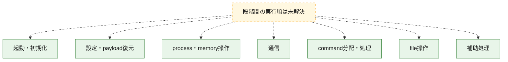
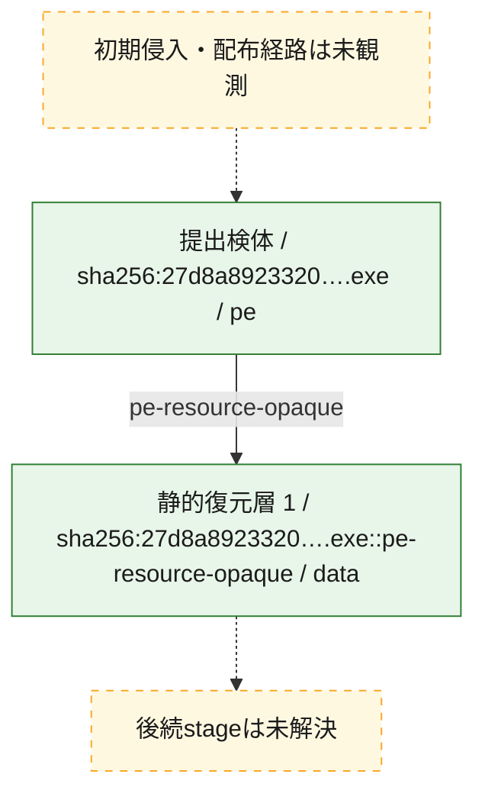
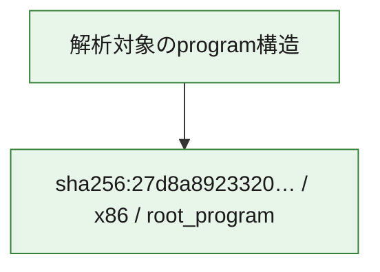

# 全体ロジック：27d8a89233202191ba3a5258b978ba4f1efdb2dd52ae7ef6f0c87130f061b012

代表関数の静的証跡から、起動・初期化、設定・payload復元、process・memory操作、通信、command分配・処理、file操作の処理群を確認しました。

## 読み方

- phaseの掲載順は解析上の整理順です。observed_call_edgesがない段階間の実行順を断定しません。
- 図の実線は静的に観測した関係、点線と黄色のノードは未観測・未解決の関係を示します。
- 図は静的な要約であり、動的実行を再現するものではありません。
- 詳細な関数解説とfingerprintは[STATIC-LOGIC.md](STATIC-LOGIC.md)を参照してください。

## 静的可視化

### 実行フロー

### 感染チェーン

### モジュール関係

## 処理段階

### 1. 起動・初期化

entry pointから初期化と後続処理への移行を確認します。
確度: `confirmed_static_function_evidence`

- `27d8a89233202191ba3a5258b978ba4f1efdb2dd52ae7ef6f0c87130f061b012:ghidra:00401000` — 初期化と主要処理への分岐を行う入口関数です。 状態: `succeeded`、選定理由: `call_graph_centrality:in=0,out=32`, `entry_point`, `large_function:instructions=97`, `meaningful_symbol_name`, `reviewed_call_centrality:32`, `reviewed_call_centrality:38`, `role:entrypoint`

### 2. 設定・payload復元

設定、resource、payload、暗号化データの復元・変換を確認します。
確度: `confirmed_static_function_evidence`

- `27d8a89233202191ba3a5258b978ba4f1efdb2dd52ae7ef6f0c87130f061b012:ghidra:00401b8f` — 設定、resource、payloadなどの解析・変換を行う関数です。 状態: `succeeded`、選定理由: `call_graph_centrality:in=1,out=25`, `large_function:instructions=233`, `reviewed_call_centrality:26`, `reviewed_call_centrality:36`, `role:config_or_data_transform`
- `27d8a89233202191ba3a5258b978ba4f1efdb2dd52ae7ef6f0c87130f061b012:ghidra:004026b8` — 設定、resource、payloadなどの解析・変換を行う関数です。 状態: `succeeded`、選定理由: `call_graph_centrality:in=4,out=6`, `reviewed_call_centrality:10`, `role:config_or_data_transform`
- `27d8a89233202191ba3a5258b978ba4f1efdb2dd52ae7ef6f0c87130f061b012:ghidra:0040271b` — 設定、resource、payloadなどの解析・変換を行う関数です。 状態: `succeeded`、選定理由: `call_graph_centrality:in=1,out=28`, `large_function:instructions=346`, `reviewed_call_centrality:29`, `reviewed_call_centrality:31`, `role:config_or_data_transform`
- `27d8a89233202191ba3a5258b978ba4f1efdb2dd52ae7ef6f0c87130f061b012:ghidra:00402ca9` — 設定、resource、payloadなどの解析・変換を行う関数です。 状態: `succeeded`、選定理由: `call_graph_centrality:in=2,out=20`, `large_function:instructions=133`, `reviewed_call_centrality:22`, `role:config_or_data_transform`
- `27d8a89233202191ba3a5258b978ba4f1efdb2dd52ae7ef6f0c87130f061b012:ghidra:00402e9d` — 設定、resource、payloadなどの解析・変換を行う関数です。 状態: `succeeded`、選定理由: `call_graph_centrality:in=2,out=8`, `reviewed_call_centrality:10`, `role:config_or_data_transform`
- `27d8a89233202191ba3a5258b978ba4f1efdb2dd52ae7ef6f0c87130f061b012:ghidra:00403cd7` — 設定、resource、payloadなどの解析・変換を行う関数です。 状態: `succeeded`、選定理由: `call_graph_centrality:in=2,out=16`, `large_function:instructions=82`, `reviewed_call_centrality:18`, `role:config_or_data_transform`

### 3. process・memory操作

process、thread、module、memory操作と実行移行を確認します。
確度: `confirmed_static_function_evidence`

- `27d8a89233202191ba3a5258b978ba4f1efdb2dd52ae7ef6f0c87130f061b012:ghidra:00401fa9` — process、thread、module、またはmemory操作に関係する関数です。 状態: `succeeded`、選定理由: `call_graph_centrality:in=3,out=6`, `reviewed_call_centrality:20`, `reviewed_call_centrality:9`, `role:file_operation`, `role:process_or_memory_operation`
- `27d8a89233202191ba3a5258b978ba4f1efdb2dd52ae7ef6f0c87130f061b012:ghidra:00405436` — process、thread、module、またはmemory操作に関係する関数です。 状態: `succeeded`、選定理由: `call_graph_centrality:in=1,out=6`, `reviewed_call_centrality:11`, `reviewed_call_centrality:7`, `role:process_or_memory_operation`
- `27d8a89233202191ba3a5258b978ba4f1efdb2dd52ae7ef6f0c87130f061b012:ghidra:00405492` — process、thread、module、またはmemory操作に関係する関数です。 状態: `succeeded`、選定理由: `call_graph_centrality:in=2,out=7`, `reviewed_call_centrality:14`, `reviewed_call_centrality:9`, `role:process_or_memory_operation`
- `27d8a89233202191ba3a5258b978ba4f1efdb2dd52ae7ef6f0c87130f061b012:ghidra:00409507` — process、thread、module、またはmemory操作に関係する関数です。 状態: `succeeded`、選定理由: `call_graph_centrality:in=0,out=8`, `reviewed_call_centrality:15`, `reviewed_call_centrality:8`, `role:process_or_memory_operation`
- `27d8a89233202191ba3a5258b978ba4f1efdb2dd52ae7ef6f0c87130f061b012:ghidra:00409588` — process、thread、module、またはmemory操作に関係する関数です。 状態: `succeeded`、選定理由: `call_graph_centrality:in=4,out=5`, `large_function:instructions=68`, `reviewed_call_centrality:13`, `reviewed_call_centrality:9`, `role:process_or_memory_operation`
- `27d8a89233202191ba3a5258b978ba4f1efdb2dd52ae7ef6f0c87130f061b012:ghidra:0040a756` — process、thread、module、またはmemory操作に関係する関数です。 状態: `succeeded`、選定理由: `call_graph_centrality:in=1,out=6`, `reviewed_call_centrality:11`, `reviewed_call_centrality:8`, `role:process_or_memory_operation`
- `27d8a89233202191ba3a5258b978ba4f1efdb2dd52ae7ef6f0c87130f061b012:ghidra:00412082` — process、thread、module、またはmemory操作に関係する関数です。 状態: `succeeded`、選定理由: `call_graph_centrality:in=2,out=11`, `large_function:instructions=74`, `reviewed_call_centrality:14`, `reviewed_call_centrality:24`, `role:process_or_memory_operation`

### 4. 通信

通信初期化、endpoint処理、送受信の役割を確認します。
確度: `confirmed_static_function_evidence`

- `27d8a89233202191ba3a5258b978ba4f1efdb2dd52ae7ef6f0c87130f061b012:ghidra:00408f69` — 通信初期化、送受信、またはendpoint処理に関係する関数です。 状態: `succeeded`、選定理由: `call_graph_centrality:in=1,out=28`, `large_function:instructions=270`, `reviewed_call_centrality:31`, `reviewed_call_centrality:49`, `role:network_communication`
- `27d8a89233202191ba3a5258b978ba4f1efdb2dd52ae7ef6f0c87130f061b012:ghidra:0040a83a` — 通信初期化、送受信、またはendpoint処理に関係する関数です。 状態: `succeeded`、選定理由: `call_graph_centrality:in=1,out=10`, `large_function:instructions=91`, `reviewed_call_centrality:12`, `reviewed_call_centrality:15`, `role:command_dispatch_or_handler`, `role:network_communication`

### 5. command分配・処理

受信commandやtaskの解釈、分配、個別handlerへの移行を確認します。
確度: `confirmed_static_function_evidence`

- `27d8a89233202191ba3a5258b978ba4f1efdb2dd52ae7ef6f0c87130f061b012:ghidra:00402022` — commandの解釈、分配、または個別処理を担当する関数です。 状態: `succeeded`、選定理由: `call_graph_centrality:in=1,out=6`, `large_function:instructions=68`, `reviewed_call_centrality:7`, `role:command_dispatch_or_handler`
- `27d8a89233202191ba3a5258b978ba4f1efdb2dd52ae7ef6f0c87130f061b012:ghidra:004024f1` — commandの解釈、分配、または個別処理を担当する関数です。 状態: `succeeded`、選定理由: `call_graph_centrality:in=1,out=16`, `large_function:instructions=148`, `reviewed_call_centrality:17`, `reviewed_call_centrality:18`, `role:command_dispatch_or_handler`
- `27d8a89233202191ba3a5258b978ba4f1efdb2dd52ae7ef6f0c87130f061b012:ghidra:00409355` — commandの解釈、分配、または個別処理を担当する関数です。 状態: `succeeded`、選定理由: `call_graph_centrality:in=2,out=12`, `large_function:instructions=116`, `reviewed_call_centrality:15`, `reviewed_call_centrality:19`, `role:command_dispatch_or_handler`
- `27d8a89233202191ba3a5258b978ba4f1efdb2dd52ae7ef6f0c87130f061b012:ghidra:0040973a` — commandの解釈、分配、または個別処理を担当する関数です。 状態: `succeeded`、選定理由: `call_graph_centrality:in=2,out=2`, `large_function:instructions=115`, `reviewed_call_centrality:5`, `role:command_dispatch_or_handler`
- `27d8a89233202191ba3a5258b978ba4f1efdb2dd52ae7ef6f0c87130f061b012:ghidra:0040da43` — commandの解釈、分配、または個別処理を担当する関数です。 状態: `succeeded`、選定理由: `call_graph_centrality:in=1,out=6`, `reviewed_call_centrality:13`, `reviewed_call_centrality:8`, `role:command_dispatch_or_handler`, `role:process_or_memory_operation`

### 6. file操作

fileやdirectoryの作成、読書き、削除を確認します。
確度: `confirmed_static_function_evidence`

- `27d8a89233202191ba3a5258b978ba4f1efdb2dd52ae7ef6f0c87130f061b012:ghidra:00401500` — fileまたはdirectoryの読書き・管理に関係する関数です。 状態: `succeeded`、選定理由: `call_graph_centrality:in=1,out=24`, `large_function:instructions=335`, `reviewed_call_centrality:25`, `reviewed_call_centrality:26`, `role:file_operation`
- `27d8a89233202191ba3a5258b978ba4f1efdb2dd52ae7ef6f0c87130f061b012:ghidra:0040195b` — fileまたはdirectoryの読書き・管理に関係する関数です。 状態: `succeeded`、選定理由: `call_graph_centrality:in=1,out=15`, `large_function:instructions=168`, `reviewed_call_centrality:16`, `reviewed_call_centrality:17`, `role:file_operation`
- `27d8a89233202191ba3a5258b978ba4f1efdb2dd52ae7ef6f0c87130f061b012:ghidra:00403275` — fileまたはdirectoryの読書き・管理に関係する関数です。 状態: `succeeded`、選定理由: `call_graph_centrality:in=1,out=16`, `large_function:instructions=176`, `reviewed_call_centrality:17`, `reviewed_call_centrality:18`, `role:file_operation`
- `27d8a89233202191ba3a5258b978ba4f1efdb2dd52ae7ef6f0c87130f061b012:ghidra:004034d1` — fileまたはdirectoryの読書き・管理に関係する関数です。 状態: `succeeded`、選定理由: `call_graph_centrality:in=1,out=7`, `reviewed_call_centrality:8`, `role:file_operation`
- `27d8a89233202191ba3a5258b978ba4f1efdb2dd52ae7ef6f0c87130f061b012:ghidra:00409698` — fileまたはdirectoryの読書き・管理に関係する関数です。 状態: `succeeded`、選定理由: `call_graph_centrality:in=2,out=5`, `reviewed_call_centrality:7`, `reviewed_call_centrality:8`, `role:file_operation`
- `27d8a89233202191ba3a5258b978ba4f1efdb2dd52ae7ef6f0c87130f061b012:ghidra:0040aac0` — fileまたはdirectoryの読書き・管理に関係する関数です。 状態: `succeeded`、選定理由: `call_graph_centrality:in=2,out=5`, `large_function:instructions=157`, `reviewed_call_centrality:10`, `reviewed_call_centrality:7`, `role:file_operation`
- `27d8a89233202191ba3a5258b978ba4f1efdb2dd52ae7ef6f0c87130f061b012:ghidra:0040acd0` — fileまたはdirectoryの読書き・管理に関係する関数です。 状態: `succeeded`、選定理由: `call_graph_centrality:in=1,out=4`, `large_function:instructions=76`, `reviewed_call_centrality:5`, `reviewed_call_centrality:7`, `role:file_operation`
- `27d8a89233202191ba3a5258b978ba4f1efdb2dd52ae7ef6f0c87130f061b012:ghidra:0040ae80` — fileまたはdirectoryの読書き・管理に関係する関数です。 状態: `succeeded`、選定理由: `call_graph_centrality:in=1,out=4`, `large_function:instructions=92`, `reviewed_call_centrality:6`, `reviewed_call_centrality:7`, `role:file_operation`
- `27d8a89233202191ba3a5258b978ba4f1efdb2dd52ae7ef6f0c87130f061b012:ghidra:0040b020` — fileまたはdirectoryの読書き・管理に関係する関数です。 状態: `succeeded`、選定理由: `call_graph_centrality:in=2,out=4`, `large_function:instructions=102`, `reviewed_call_centrality:7`, `reviewed_call_centrality:8`, `role:file_operation`

### 7. 補助処理

主要処理を支える一般内部関数またはlibrary処理を確認します。
確度: `confirmed_static_function_evidence`

- `27d8a89233202191ba3a5258b978ba4f1efdb2dd52ae7ef6f0c87130f061b012:ghidra:00403df3` — 検体内部の一般処理を実装する関数です。 状態: `succeeded`、選定理由: `call_graph_centrality:in=1,out=32`, `large_function:instructions=640`, `reviewed_call_centrality:33`, `reviewed_call_centrality:34`
- `27d8a89233202191ba3a5258b978ba4f1efdb2dd52ae7ef6f0c87130f061b012:ghidra:00405260` — compiler生成処理または汎用library処理とみられる関数です。 状態: `succeeded`、選定理由: `call_graph_centrality:in=1,out=0`, `meaningful_symbol_name`, `reviewed_call_centrality:1`, `reviewed_call_centrality:3`

## 観測したcall関係

- 代表関数間で直接解決できた呼出関係はありません。

## 解析範囲と制約

- 選定外関数は全体inventoryへ残しますが、関数本体の個別解説対象にはしていません。
- indirect call、難読化、packer、VM、壊れたcontrol flowによりcall関係が欠落する場合があります。
- 文書は静的解析に基づき、検体実行や外部通信による動的確認は行っていません。
