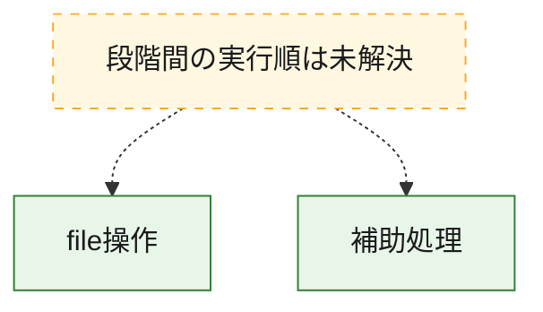
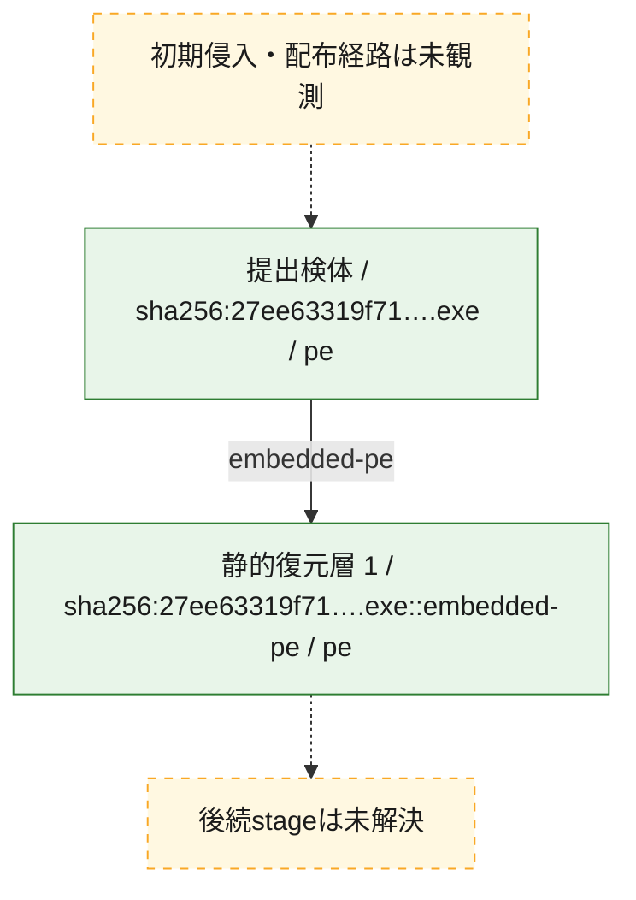
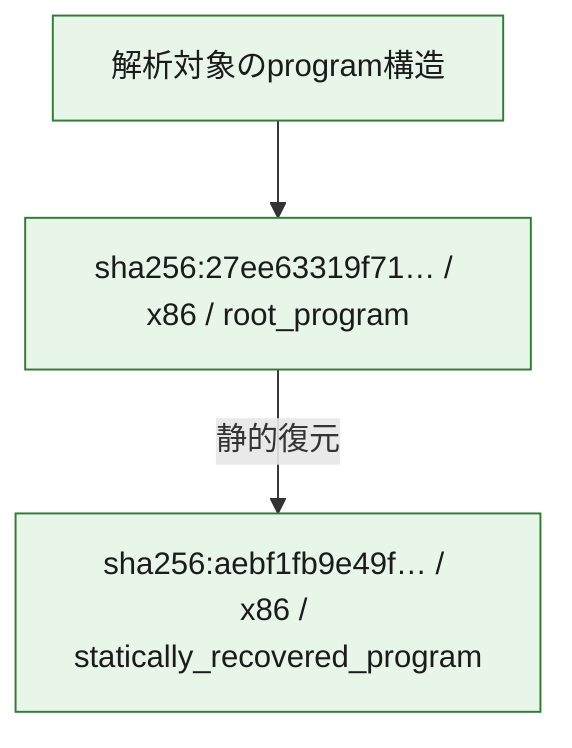

# 全体ロジック：27ee63319f718d13c5a896180c2712b3881d776f7d56b6525d0db0cbc24553eb

代表関数の静的証跡から、file操作の処理群を確認しました。

## 読み方

- phaseの掲載順は解析上の整理順です。observed_call_edgesがない段階間の実行順を断定しません。
- 図の実線は静的に観測した関係、点線と黄色のノードは未観測・未解決の関係を示します。
- 図は静的な要約であり、動的実行を再現するものではありません。
- 詳細な関数解説とfingerprintは[STATIC-LOGIC.md](STATIC-LOGIC.md)を参照してください。

## 静的可視化

### 実行フロー

### 感染チェーン

### モジュール関係

## 処理段階

### 1. file操作

fileやdirectoryの作成、読書き、削除を確認します。
確度: `confirmed_static_function_evidence`

- `27ee63319f718d13c5a896180c2712b3881d776f7d56b6525d0db0cbc24553eb:ghidra:00460440` — fileまたはdirectoryの読書き・管理に関係する関数です。 状態: `succeeded`、選定理由: `call_graph_centrality:in=0,out=3`, `reviewed_call_centrality:3`, `reviewed_call_centrality:5`, `role:file_operation`

### 2. 補助処理

主要処理を支える一般内部関数またはlibrary処理を確認します。
確度: `confirmed_static_function_evidence_with_limits`

- `aebf1fb9e49f743c0fe147158df9a041bb7d0fdfba1738a2b50c5ab1a6d3d7f4:ghidra:100108f9` — 外部APIまたはthunkであり、検体固有の関数本体を持ちません。 状態: `excluded_external_or_thunk`、選定理由: `context_representative`, `no_internal_body_structural_fallback`
- `27ee63319f718d13c5a896180c2712b3881d776f7d56b6525d0db0cbc24553eb:ghidra:00401f60` — 検体内部の一般処理を実装する関数です。 状態: `succeeded`、選定理由: `call_graph_centrality:in=80,out=0`, `reviewed_call_centrality:80`
- `27ee63319f718d13c5a896180c2712b3881d776f7d56b6525d0db0cbc24553eb:ghidra:004096c0` — 検体内部の一般処理を実装する関数です。 状態: `succeeded`、選定理由: `call_graph_centrality:in=125,out=8`, `large_function:instructions=116`, `reviewed_call_centrality:133`, `reviewed_call_centrality:136`
- `27ee63319f718d13c5a896180c2712b3881d776f7d56b6525d0db0cbc24553eb:ghidra:004098c0` — 検体内部の一般処理を実装する関数です。 状態: `succeeded`、選定理由: `call_graph_centrality:in=124,out=5`, `reviewed_call_centrality:129`, `reviewed_call_centrality:131`
- `27ee63319f718d13c5a896180c2712b3881d776f7d56b6525d0db0cbc24553eb:ghidra:0040aed0` — 検体内部の一般処理を実装する関数です。 状態: `succeeded`、選定理由: `call_graph_centrality:in=27,out=18`, `large_function:instructions=509`, `reviewed_call_centrality:45`, `reviewed_call_centrality:46`
- `27ee63319f718d13c5a896180c2712b3881d776f7d56b6525d0db0cbc24553eb:ghidra:0040b760` — 検体内部の一般処理を実装する関数です。 状態: `succeeded`、選定理由: `call_graph_centrality:in=145,out=2`, `reviewed_call_centrality:147`
- `27ee63319f718d13c5a896180c2712b3881d776f7d56b6525d0db0cbc24553eb:ghidra:00415cb0` — 検体内部の一般処理を実装する関数です。 状態: `succeeded`、選定理由: `call_graph_centrality:in=1,out=38`, `large_function:instructions=1146`, `reviewed_call_centrality:39`, `reviewed_call_centrality:45`
- `27ee63319f718d13c5a896180c2712b3881d776f7d56b6525d0db0cbc24553eb:ghidra:00422f10` — 検体内部の一般処理を実装する関数です。 状態: `succeeded`、選定理由: `call_graph_centrality:in=5,out=28`, `large_function:instructions=770`, `reviewed_call_centrality:33`, `reviewed_call_centrality:35`
- `27ee63319f718d13c5a896180c2712b3881d776f7d56b6525d0db0cbc24553eb:ghidra:00434920` — 検体内部の一般処理を実装する関数です。 状態: `succeeded`、選定理由: `call_graph_centrality:in=196,out=17`, `large_function:instructions=448`, `reviewed_call_centrality:213`
- `27ee63319f718d13c5a896180c2712b3881d776f7d56b6525d0db0cbc24553eb:ghidra:00435050` — 検体内部の一般処理を実装する関数です。 状態: `succeeded`、選定理由: `call_graph_centrality:in=253,out=2`, `reviewed_call_centrality:255`
- `27ee63319f718d13c5a896180c2712b3881d776f7d56b6525d0db0cbc24553eb:ghidra:00436800` — 検体内部の一般処理を実装する関数です。 状態: `succeeded`、選定理由: `call_graph_centrality:in=114,out=2`, `reviewed_call_centrality:116`
- `27ee63319f718d13c5a896180c2712b3881d776f7d56b6525d0db0cbc24553eb:ghidra:00436870` — 検体内部の一般処理を実装する関数です。 状態: `succeeded`、選定理由: `call_graph_centrality:in=114,out=2`, `reviewed_call_centrality:116`
- `27ee63319f718d13c5a896180c2712b3881d776f7d56b6525d0db0cbc24553eb:ghidra:00436a20` — 検体内部の一般処理を実装する関数です。 状態: `succeeded`、選定理由: `call_graph_centrality:in=84,out=2`, `reviewed_call_centrality:86`
- `27ee63319f718d13c5a896180c2712b3881d776f7d56b6525d0db0cbc24553eb:ghidra:00436d80` — 検体内部の一般処理を実装する関数です。 状態: `succeeded`、選定理由: `call_graph_centrality:in=60,out=5`, `large_function:instructions=111`, `reviewed_call_centrality:65`, `reviewed_call_centrality:66`
- `27ee63319f718d13c5a896180c2712b3881d776f7d56b6525d0db0cbc24553eb:ghidra:00436f80` — 検体内部の一般処理を実装する関数です。 状態: `succeeded`、選定理由: `call_graph_centrality:in=45,out=4`, `large_function:instructions=80`, `reviewed_call_centrality:49`
- `27ee63319f718d13c5a896180c2712b3881d776f7d56b6525d0db0cbc24553eb:ghidra:00437100` — 検体内部の一般処理を実装する関数です。 状態: `succeeded`、選定理由: `call_graph_centrality:in=116,out=2`, `reviewed_call_centrality:118`
- `27ee63319f718d13c5a896180c2712b3881d776f7d56b6525d0db0cbc24553eb:ghidra:0043c220` — 検体内部の一般処理を実装する関数です。 状態: `succeeded`、選定理由: `call_graph_centrality:in=1,out=41`, `large_function:instructions=876`, `reviewed_call_centrality:42`, `reviewed_call_centrality:47`
- `27ee63319f718d13c5a896180c2712b3881d776f7d56b6525d0db0cbc24553eb:ghidra:00447b10` — 検体内部の一般処理を実装する関数です。 状態: `succeeded`、選定理由: `call_graph_centrality:in=77,out=9`, `large_function:instructions=400`, `reviewed_call_centrality:86`, `reviewed_call_centrality:88`
- `27ee63319f718d13c5a896180c2712b3881d776f7d56b6525d0db0cbc24553eb:ghidra:004535f0` — 検体内部の一般処理を実装する関数です。 状態: `succeeded`、選定理由: `call_graph_centrality:in=7,out=25`, `large_function:instructions=1479`, `reviewed_call_centrality:32`, `reviewed_call_centrality:37`
- `27ee63319f718d13c5a896180c2712b3881d776f7d56b6525d0db0cbc24553eb:ghidra:0045e2e0` — 検体内部の一般処理を実装する関数です。 状態: `limited_bad_instruction_or_flow`、選定理由: `call_graph_centrality:in=65,out=2`, `reviewed_call_centrality:67`, `reviewed_call_centrality:68`
- `27ee63319f718d13c5a896180c2712b3881d776f7d56b6525d0db0cbc24553eb:ghidra:0045f800` — 検体内部の一般処理を実装する関数です。 状態: `succeeded`、選定理由: `call_graph_centrality:in=255,out=1`, `reviewed_call_centrality:256`
- `27ee63319f718d13c5a896180c2712b3881d776f7d56b6525d0db0cbc24553eb:ghidra:0045f880` — 検体内部の一般処理を実装する関数です。 状態: `succeeded`、選定理由: `call_graph_centrality:in=267,out=4`, `reviewed_call_centrality:271`
- `27ee63319f718d13c5a896180c2712b3881d776f7d56b6525d0db0cbc24553eb:ghidra:0045f890` — 検体内部の一般処理を実装する関数です。 状態: `succeeded`、選定理由: `call_graph_centrality:in=79,out=4`, `reviewed_call_centrality:83`
- `27ee63319f718d13c5a896180c2712b3881d776f7d56b6525d0db0cbc24553eb:ghidra:0045f8a0` — 検体内部の一般処理を実装する関数です。 状態: `succeeded`、選定理由: `call_graph_centrality:in=46,out=4`, `reviewed_call_centrality:50`
- `27ee63319f718d13c5a896180c2712b3881d776f7d56b6525d0db0cbc24553eb:ghidra:0045f8c0` — 検体内部の一般処理を実装する関数です。 状態: `succeeded`、選定理由: `call_graph_centrality:in=51,out=4`, `reviewed_call_centrality:55`
- `27ee63319f718d13c5a896180c2712b3881d776f7d56b6525d0db0cbc24553eb:ghidra:0045f8e0` — 検体内部の一般処理を実装する関数です。 状態: `succeeded`、選定理由: `call_graph_centrality:in=76,out=4`, `reviewed_call_centrality:80`
- `27ee63319f718d13c5a896180c2712b3881d776f7d56b6525d0db0cbc24553eb:ghidra:004600c0` — 検体内部の一般処理を実装する関数です。 状態: `succeeded`、選定理由: `call_graph_centrality:in=68,out=0`, `large_function:instructions=114`, `reviewed_call_centrality:68`
- `27ee63319f718d13c5a896180c2712b3881d776f7d56b6525d0db0cbc24553eb:ghidra:004b42c0` — 検体内部の一般処理を実装する関数です。 状態: `succeeded`、選定理由: `call_graph_centrality:in=4,out=34`, `large_function:instructions=1986`, `reviewed_call_centrality:38`
- `27ee63319f718d13c5a896180c2712b3881d776f7d56b6525d0db0cbc24553eb:ghidra:004bb8b0` — 検体内部の一般処理を実装する関数です。 状態: `succeeded`、選定理由: `call_graph_centrality:in=1,out=45`, `large_function:instructions=1920`, `reviewed_call_centrality:46`
- `27ee63319f718d13c5a896180c2712b3881d776f7d56b6525d0db0cbc24553eb:ghidra:004bda50` — 検体内部の一般処理を実装する関数です。 状態: `succeeded`、選定理由: `call_graph_centrality:in=2,out=33`, `large_function:instructions=2356`, `reviewed_call_centrality:35`
- `27ee63319f718d13c5a896180c2712b3881d776f7d56b6525d0db0cbc24553eb:ghidra:004c6a30` — 検体内部の一般処理を実装する関数です。 状態: `succeeded`、選定理由: `call_graph_centrality:in=1,out=36`, `large_function:instructions=1061`, `reviewed_call_centrality:37`
- `27ee63319f718d13c5a896180c2712b3881d776f7d56b6525d0db0cbc24553eb:ghidra:004d4ba0` — 検体内部の一般処理を実装する関数です。 状態: `succeeded`、選定理由: `call_graph_centrality:in=0,out=41`, `large_function:instructions=1094`, `reviewed_call_centrality:41`

## 観測したcall関係

- `27ee63319f718d13c5a896180c2712b3881d776f7d56b6525d0db0cbc24553eb:ghidra:004096c0` → `27ee63319f718d13c5a896180c2712b3881d776f7d56b6525d0db0cbc24553eb:ghidra:00435050` （`support` → `support`）
- `27ee63319f718d13c5a896180c2712b3881d776f7d56b6525d0db0cbc24553eb:ghidra:004096c0` → `27ee63319f718d13c5a896180c2712b3881d776f7d56b6525d0db0cbc24553eb:ghidra:0045e2e0` （`support` → `support`）
- `27ee63319f718d13c5a896180c2712b3881d776f7d56b6525d0db0cbc24553eb:ghidra:004098c0` → `27ee63319f718d13c5a896180c2712b3881d776f7d56b6525d0db0cbc24553eb:ghidra:00435050` （`support` → `support`）
- `27ee63319f718d13c5a896180c2712b3881d776f7d56b6525d0db0cbc24553eb:ghidra:0040aed0` → `27ee63319f718d13c5a896180c2712b3881d776f7d56b6525d0db0cbc24553eb:ghidra:00435050` （`support` → `support`）
- `27ee63319f718d13c5a896180c2712b3881d776f7d56b6525d0db0cbc24553eb:ghidra:0040aed0` → `27ee63319f718d13c5a896180c2712b3881d776f7d56b6525d0db0cbc24553eb:ghidra:0045f880` （`support` → `support`）
- `27ee63319f718d13c5a896180c2712b3881d776f7d56b6525d0db0cbc24553eb:ghidra:0040aed0` → `27ee63319f718d13c5a896180c2712b3881d776f7d56b6525d0db0cbc24553eb:ghidra:0045f890` （`support` → `support`）
- `27ee63319f718d13c5a896180c2712b3881d776f7d56b6525d0db0cbc24553eb:ghidra:0040b760` → `27ee63319f718d13c5a896180c2712b3881d776f7d56b6525d0db0cbc24553eb:ghidra:0040aed0` （`support` → `support`）
- `27ee63319f718d13c5a896180c2712b3881d776f7d56b6525d0db0cbc24553eb:ghidra:00415cb0` → `27ee63319f718d13c5a896180c2712b3881d776f7d56b6525d0db0cbc24553eb:ghidra:004096c0` （`support` → `support`）
- `27ee63319f718d13c5a896180c2712b3881d776f7d56b6525d0db0cbc24553eb:ghidra:00415cb0` → `27ee63319f718d13c5a896180c2712b3881d776f7d56b6525d0db0cbc24553eb:ghidra:004098c0` （`support` → `support`）
- `27ee63319f718d13c5a896180c2712b3881d776f7d56b6525d0db0cbc24553eb:ghidra:00415cb0` → `27ee63319f718d13c5a896180c2712b3881d776f7d56b6525d0db0cbc24553eb:ghidra:00435050` （`support` → `support`）
- `27ee63319f718d13c5a896180c2712b3881d776f7d56b6525d0db0cbc24553eb:ghidra:00415cb0` → `27ee63319f718d13c5a896180c2712b3881d776f7d56b6525d0db0cbc24553eb:ghidra:00436800` （`support` → `support`）
- `27ee63319f718d13c5a896180c2712b3881d776f7d56b6525d0db0cbc24553eb:ghidra:00415cb0` → `27ee63319f718d13c5a896180c2712b3881d776f7d56b6525d0db0cbc24553eb:ghidra:00436870` （`support` → `support`）
- `27ee63319f718d13c5a896180c2712b3881d776f7d56b6525d0db0cbc24553eb:ghidra:00415cb0` → `27ee63319f718d13c5a896180c2712b3881d776f7d56b6525d0db0cbc24553eb:ghidra:00436a20` （`support` → `support`）
- `27ee63319f718d13c5a896180c2712b3881d776f7d56b6525d0db0cbc24553eb:ghidra:00415cb0` → `27ee63319f718d13c5a896180c2712b3881d776f7d56b6525d0db0cbc24553eb:ghidra:00436d80` （`support` → `support`）
- `27ee63319f718d13c5a896180c2712b3881d776f7d56b6525d0db0cbc24553eb:ghidra:00415cb0` → `27ee63319f718d13c5a896180c2712b3881d776f7d56b6525d0db0cbc24553eb:ghidra:00437100` （`support` → `support`）
- `27ee63319f718d13c5a896180c2712b3881d776f7d56b6525d0db0cbc24553eb:ghidra:00415cb0` → `27ee63319f718d13c5a896180c2712b3881d776f7d56b6525d0db0cbc24553eb:ghidra:0045e2e0` （`support` → `support`）
- `27ee63319f718d13c5a896180c2712b3881d776f7d56b6525d0db0cbc24553eb:ghidra:00415cb0` → `27ee63319f718d13c5a896180c2712b3881d776f7d56b6525d0db0cbc24553eb:ghidra:0045f800` （`support` → `support`）
- `27ee63319f718d13c5a896180c2712b3881d776f7d56b6525d0db0cbc24553eb:ghidra:00415cb0` → `27ee63319f718d13c5a896180c2712b3881d776f7d56b6525d0db0cbc24553eb:ghidra:0045f880` （`support` → `support`）
- `27ee63319f718d13c5a896180c2712b3881d776f7d56b6525d0db0cbc24553eb:ghidra:00422f10` → `27ee63319f718d13c5a896180c2712b3881d776f7d56b6525d0db0cbc24553eb:ghidra:00435050` （`support` → `support`）
- `27ee63319f718d13c5a896180c2712b3881d776f7d56b6525d0db0cbc24553eb:ghidra:00422f10` → `27ee63319f718d13c5a896180c2712b3881d776f7d56b6525d0db0cbc24553eb:ghidra:00436800` （`support` → `support`）
- `27ee63319f718d13c5a896180c2712b3881d776f7d56b6525d0db0cbc24553eb:ghidra:00422f10` → `27ee63319f718d13c5a896180c2712b3881d776f7d56b6525d0db0cbc24553eb:ghidra:00436870` （`support` → `support`）
- `27ee63319f718d13c5a896180c2712b3881d776f7d56b6525d0db0cbc24553eb:ghidra:00422f10` → `27ee63319f718d13c5a896180c2712b3881d776f7d56b6525d0db0cbc24553eb:ghidra:00436a20` （`support` → `support`）
- `27ee63319f718d13c5a896180c2712b3881d776f7d56b6525d0db0cbc24553eb:ghidra:00422f10` → `27ee63319f718d13c5a896180c2712b3881d776f7d56b6525d0db0cbc24553eb:ghidra:00436d80` （`support` → `support`）
- `27ee63319f718d13c5a896180c2712b3881d776f7d56b6525d0db0cbc24553eb:ghidra:00422f10` → `27ee63319f718d13c5a896180c2712b3881d776f7d56b6525d0db0cbc24553eb:ghidra:00437100` （`support` → `support`）
- `27ee63319f718d13c5a896180c2712b3881d776f7d56b6525d0db0cbc24553eb:ghidra:00422f10` → `27ee63319f718d13c5a896180c2712b3881d776f7d56b6525d0db0cbc24553eb:ghidra:0045e2e0` （`support` → `support`）
- `27ee63319f718d13c5a896180c2712b3881d776f7d56b6525d0db0cbc24553eb:ghidra:00422f10` → `27ee63319f718d13c5a896180c2712b3881d776f7d56b6525d0db0cbc24553eb:ghidra:0045f880` （`support` → `support`）
- `27ee63319f718d13c5a896180c2712b3881d776f7d56b6525d0db0cbc24553eb:ghidra:00434920` → `27ee63319f718d13c5a896180c2712b3881d776f7d56b6525d0db0cbc24553eb:ghidra:00435050` （`support` → `support`）
- `27ee63319f718d13c5a896180c2712b3881d776f7d56b6525d0db0cbc24553eb:ghidra:00434920` → `27ee63319f718d13c5a896180c2712b3881d776f7d56b6525d0db0cbc24553eb:ghidra:00436800` （`support` → `support`）
- `27ee63319f718d13c5a896180c2712b3881d776f7d56b6525d0db0cbc24553eb:ghidra:00434920` → `27ee63319f718d13c5a896180c2712b3881d776f7d56b6525d0db0cbc24553eb:ghidra:00436870` （`support` → `support`）
- `27ee63319f718d13c5a896180c2712b3881d776f7d56b6525d0db0cbc24553eb:ghidra:00434920` → `27ee63319f718d13c5a896180c2712b3881d776f7d56b6525d0db0cbc24553eb:ghidra:00436a20` （`support` → `support`）
- `27ee63319f718d13c5a896180c2712b3881d776f7d56b6525d0db0cbc24553eb:ghidra:00434920` → `27ee63319f718d13c5a896180c2712b3881d776f7d56b6525d0db0cbc24553eb:ghidra:00437100` （`support` → `support`）
- `27ee63319f718d13c5a896180c2712b3881d776f7d56b6525d0db0cbc24553eb:ghidra:00434920` → `27ee63319f718d13c5a896180c2712b3881d776f7d56b6525d0db0cbc24553eb:ghidra:0045f800` （`support` → `support`）
- `27ee63319f718d13c5a896180c2712b3881d776f7d56b6525d0db0cbc24553eb:ghidra:00435050` → `27ee63319f718d13c5a896180c2712b3881d776f7d56b6525d0db0cbc24553eb:ghidra:0045e2e0` （`support` → `support`）
- `27ee63319f718d13c5a896180c2712b3881d776f7d56b6525d0db0cbc24553eb:ghidra:00436800` → `27ee63319f718d13c5a896180c2712b3881d776f7d56b6525d0db0cbc24553eb:ghidra:004096c0` （`support` → `support`）
- `27ee63319f718d13c5a896180c2712b3881d776f7d56b6525d0db0cbc24553eb:ghidra:00436870` → `27ee63319f718d13c5a896180c2712b3881d776f7d56b6525d0db0cbc24553eb:ghidra:004098c0` （`support` → `support`）
- `27ee63319f718d13c5a896180c2712b3881d776f7d56b6525d0db0cbc24553eb:ghidra:00436a20` → `27ee63319f718d13c5a896180c2712b3881d776f7d56b6525d0db0cbc24553eb:ghidra:00437100` （`support` → `support`）
- `27ee63319f718d13c5a896180c2712b3881d776f7d56b6525d0db0cbc24553eb:ghidra:00436d80` → `27ee63319f718d13c5a896180c2712b3881d776f7d56b6525d0db0cbc24553eb:ghidra:0045f880` （`support` → `support`）
- `27ee63319f718d13c5a896180c2712b3881d776f7d56b6525d0db0cbc24553eb:ghidra:00436d80` → `27ee63319f718d13c5a896180c2712b3881d776f7d56b6525d0db0cbc24553eb:ghidra:0045f8e0` （`support` → `support`）
- `27ee63319f718d13c5a896180c2712b3881d776f7d56b6525d0db0cbc24553eb:ghidra:00436f80` → `27ee63319f718d13c5a896180c2712b3881d776f7d56b6525d0db0cbc24553eb:ghidra:0045f880` （`support` → `support`）
- `27ee63319f718d13c5a896180c2712b3881d776f7d56b6525d0db0cbc24553eb:ghidra:0043c220` → `27ee63319f718d13c5a896180c2712b3881d776f7d56b6525d0db0cbc24553eb:ghidra:00401f60` （`support` → `support`）
- `27ee63319f718d13c5a896180c2712b3881d776f7d56b6525d0db0cbc24553eb:ghidra:0043c220` → `27ee63319f718d13c5a896180c2712b3881d776f7d56b6525d0db0cbc24553eb:ghidra:004096c0` （`support` → `support`）
- `27ee63319f718d13c5a896180c2712b3881d776f7d56b6525d0db0cbc24553eb:ghidra:0043c220` → `27ee63319f718d13c5a896180c2712b3881d776f7d56b6525d0db0cbc24553eb:ghidra:004098c0` （`support` → `support`）
- `27ee63319f718d13c5a896180c2712b3881d776f7d56b6525d0db0cbc24553eb:ghidra:0043c220` → `27ee63319f718d13c5a896180c2712b3881d776f7d56b6525d0db0cbc24553eb:ghidra:00435050` （`support` → `support`）
- `27ee63319f718d13c5a896180c2712b3881d776f7d56b6525d0db0cbc24553eb:ghidra:00447b10` → `27ee63319f718d13c5a896180c2712b3881d776f7d56b6525d0db0cbc24553eb:ghidra:0040aed0` （`support` → `support`）
- `27ee63319f718d13c5a896180c2712b3881d776f7d56b6525d0db0cbc24553eb:ghidra:00447b10` → `27ee63319f718d13c5a896180c2712b3881d776f7d56b6525d0db0cbc24553eb:ghidra:00434920` （`support` → `support`）
- `27ee63319f718d13c5a896180c2712b3881d776f7d56b6525d0db0cbc24553eb:ghidra:00447b10` → `27ee63319f718d13c5a896180c2712b3881d776f7d56b6525d0db0cbc24553eb:ghidra:0045f880` （`support` → `support`）
- `27ee63319f718d13c5a896180c2712b3881d776f7d56b6525d0db0cbc24553eb:ghidra:00447b10` → `27ee63319f718d13c5a896180c2712b3881d776f7d56b6525d0db0cbc24553eb:ghidra:0045f890` （`support` → `support`）
- `27ee63319f718d13c5a896180c2712b3881d776f7d56b6525d0db0cbc24553eb:ghidra:00447b10` → `27ee63319f718d13c5a896180c2712b3881d776f7d56b6525d0db0cbc24553eb:ghidra:004600c0` （`support` → `support`）
- `27ee63319f718d13c5a896180c2712b3881d776f7d56b6525d0db0cbc24553eb:ghidra:004535f0` → `27ee63319f718d13c5a896180c2712b3881d776f7d56b6525d0db0cbc24553eb:ghidra:00435050` （`support` → `support`）
- `27ee63319f718d13c5a896180c2712b3881d776f7d56b6525d0db0cbc24553eb:ghidra:004535f0` → `27ee63319f718d13c5a896180c2712b3881d776f7d56b6525d0db0cbc24553eb:ghidra:00436800` （`support` → `support`）
- `27ee63319f718d13c5a896180c2712b3881d776f7d56b6525d0db0cbc24553eb:ghidra:004535f0` → `27ee63319f718d13c5a896180c2712b3881d776f7d56b6525d0db0cbc24553eb:ghidra:00436870` （`support` → `support`）
- `27ee63319f718d13c5a896180c2712b3881d776f7d56b6525d0db0cbc24553eb:ghidra:004535f0` → `27ee63319f718d13c5a896180c2712b3881d776f7d56b6525d0db0cbc24553eb:ghidra:00436a20` （`support` → `support`）
- `27ee63319f718d13c5a896180c2712b3881d776f7d56b6525d0db0cbc24553eb:ghidra:004535f0` → `27ee63319f718d13c5a896180c2712b3881d776f7d56b6525d0db0cbc24553eb:ghidra:00436d80` （`support` → `support`）
- `27ee63319f718d13c5a896180c2712b3881d776f7d56b6525d0db0cbc24553eb:ghidra:004535f0` → `27ee63319f718d13c5a896180c2712b3881d776f7d56b6525d0db0cbc24553eb:ghidra:00436f80` （`support` → `support`）
- `27ee63319f718d13c5a896180c2712b3881d776f7d56b6525d0db0cbc24553eb:ghidra:004535f0` → `27ee63319f718d13c5a896180c2712b3881d776f7d56b6525d0db0cbc24553eb:ghidra:00437100` （`support` → `support`）
- `27ee63319f718d13c5a896180c2712b3881d776f7d56b6525d0db0cbc24553eb:ghidra:004535f0` → `27ee63319f718d13c5a896180c2712b3881d776f7d56b6525d0db0cbc24553eb:ghidra:0045f880` （`support` → `support`）
- `27ee63319f718d13c5a896180c2712b3881d776f7d56b6525d0db0cbc24553eb:ghidra:0045f880` → `27ee63319f718d13c5a896180c2712b3881d776f7d56b6525d0db0cbc24553eb:ghidra:00434920` （`support` → `support`）
- `27ee63319f718d13c5a896180c2712b3881d776f7d56b6525d0db0cbc24553eb:ghidra:0045f890` → `27ee63319f718d13c5a896180c2712b3881d776f7d56b6525d0db0cbc24553eb:ghidra:00434920` （`support` → `support`）
- `27ee63319f718d13c5a896180c2712b3881d776f7d56b6525d0db0cbc24553eb:ghidra:0045f8a0` → `27ee63319f718d13c5a896180c2712b3881d776f7d56b6525d0db0cbc24553eb:ghidra:00434920` （`support` → `support`）
- `27ee63319f718d13c5a896180c2712b3881d776f7d56b6525d0db0cbc24553eb:ghidra:0045f8c0` → `27ee63319f718d13c5a896180c2712b3881d776f7d56b6525d0db0cbc24553eb:ghidra:00434920` （`support` → `support`）
- `27ee63319f718d13c5a896180c2712b3881d776f7d56b6525d0db0cbc24553eb:ghidra:0045f8e0` → `27ee63319f718d13c5a896180c2712b3881d776f7d56b6525d0db0cbc24553eb:ghidra:00434920` （`support` → `support`）
- `27ee63319f718d13c5a896180c2712b3881d776f7d56b6525d0db0cbc24553eb:ghidra:004b42c0` → `27ee63319f718d13c5a896180c2712b3881d776f7d56b6525d0db0cbc24553eb:ghidra:0040b760` （`support` → `support`）
- `27ee63319f718d13c5a896180c2712b3881d776f7d56b6525d0db0cbc24553eb:ghidra:004b42c0` → `27ee63319f718d13c5a896180c2712b3881d776f7d56b6525d0db0cbc24553eb:ghidra:00434920` （`support` → `support`）
- `27ee63319f718d13c5a896180c2712b3881d776f7d56b6525d0db0cbc24553eb:ghidra:004b42c0` → `27ee63319f718d13c5a896180c2712b3881d776f7d56b6525d0db0cbc24553eb:ghidra:00447b10` （`support` → `support`）
- `27ee63319f718d13c5a896180c2712b3881d776f7d56b6525d0db0cbc24553eb:ghidra:004b42c0` → `27ee63319f718d13c5a896180c2712b3881d776f7d56b6525d0db0cbc24553eb:ghidra:0045f800` （`support` → `support`）
- `27ee63319f718d13c5a896180c2712b3881d776f7d56b6525d0db0cbc24553eb:ghidra:004b42c0` → `27ee63319f718d13c5a896180c2712b3881d776f7d56b6525d0db0cbc24553eb:ghidra:0045f880` （`support` → `support`）
- `27ee63319f718d13c5a896180c2712b3881d776f7d56b6525d0db0cbc24553eb:ghidra:004b42c0` → `27ee63319f718d13c5a896180c2712b3881d776f7d56b6525d0db0cbc24553eb:ghidra:004600c0` （`support` → `support`）
- `27ee63319f718d13c5a896180c2712b3881d776f7d56b6525d0db0cbc24553eb:ghidra:004bb8b0` → `27ee63319f718d13c5a896180c2712b3881d776f7d56b6525d0db0cbc24553eb:ghidra:0040b760` （`support` → `support`）
- `27ee63319f718d13c5a896180c2712b3881d776f7d56b6525d0db0cbc24553eb:ghidra:004bb8b0` → `27ee63319f718d13c5a896180c2712b3881d776f7d56b6525d0db0cbc24553eb:ghidra:00434920` （`support` → `support`）
- `27ee63319f718d13c5a896180c2712b3881d776f7d56b6525d0db0cbc24553eb:ghidra:004bb8b0` → `27ee63319f718d13c5a896180c2712b3881d776f7d56b6525d0db0cbc24553eb:ghidra:00447b10` （`support` → `support`）
- `27ee63319f718d13c5a896180c2712b3881d776f7d56b6525d0db0cbc24553eb:ghidra:004bb8b0` → `27ee63319f718d13c5a896180c2712b3881d776f7d56b6525d0db0cbc24553eb:ghidra:0045f800` （`support` → `support`）
- `27ee63319f718d13c5a896180c2712b3881d776f7d56b6525d0db0cbc24553eb:ghidra:004bb8b0` → `27ee63319f718d13c5a896180c2712b3881d776f7d56b6525d0db0cbc24553eb:ghidra:0045f880` （`support` → `support`）
- `27ee63319f718d13c5a896180c2712b3881d776f7d56b6525d0db0cbc24553eb:ghidra:004bb8b0` → `27ee63319f718d13c5a896180c2712b3881d776f7d56b6525d0db0cbc24553eb:ghidra:0045f8c0` （`support` → `support`）
- `27ee63319f718d13c5a896180c2712b3881d776f7d56b6525d0db0cbc24553eb:ghidra:004bb8b0` → `27ee63319f718d13c5a896180c2712b3881d776f7d56b6525d0db0cbc24553eb:ghidra:0045f8e0` （`support` → `support`）
- `27ee63319f718d13c5a896180c2712b3881d776f7d56b6525d0db0cbc24553eb:ghidra:004bb8b0` → `27ee63319f718d13c5a896180c2712b3881d776f7d56b6525d0db0cbc24553eb:ghidra:004bda50` （`support` → `support`）
- `27ee63319f718d13c5a896180c2712b3881d776f7d56b6525d0db0cbc24553eb:ghidra:004bda50` → `27ee63319f718d13c5a896180c2712b3881d776f7d56b6525d0db0cbc24553eb:ghidra:0040b760` （`support` → `support`）
- `27ee63319f718d13c5a896180c2712b3881d776f7d56b6525d0db0cbc24553eb:ghidra:004bda50` → `27ee63319f718d13c5a896180c2712b3881d776f7d56b6525d0db0cbc24553eb:ghidra:00434920` （`support` → `support`）
- `27ee63319f718d13c5a896180c2712b3881d776f7d56b6525d0db0cbc24553eb:ghidra:004bda50` → `27ee63319f718d13c5a896180c2712b3881d776f7d56b6525d0db0cbc24553eb:ghidra:0045f800` （`support` → `support`）
- `27ee63319f718d13c5a896180c2712b3881d776f7d56b6525d0db0cbc24553eb:ghidra:004bda50` → `27ee63319f718d13c5a896180c2712b3881d776f7d56b6525d0db0cbc24553eb:ghidra:0045f8c0` （`support` → `support`）
- `27ee63319f718d13c5a896180c2712b3881d776f7d56b6525d0db0cbc24553eb:ghidra:004c6a30` → `27ee63319f718d13c5a896180c2712b3881d776f7d56b6525d0db0cbc24553eb:ghidra:00447b10` （`support` → `support`）
- `27ee63319f718d13c5a896180c2712b3881d776f7d56b6525d0db0cbc24553eb:ghidra:004c6a30` → `27ee63319f718d13c5a896180c2712b3881d776f7d56b6525d0db0cbc24553eb:ghidra:0045f800` （`support` → `support`）
- `27ee63319f718d13c5a896180c2712b3881d776f7d56b6525d0db0cbc24553eb:ghidra:004c6a30` → `27ee63319f718d13c5a896180c2712b3881d776f7d56b6525d0db0cbc24553eb:ghidra:0045f880` （`support` → `support`）
- `27ee63319f718d13c5a896180c2712b3881d776f7d56b6525d0db0cbc24553eb:ghidra:004c6a30` → `27ee63319f718d13c5a896180c2712b3881d776f7d56b6525d0db0cbc24553eb:ghidra:0045f8c0` （`support` → `support`）
- `27ee63319f718d13c5a896180c2712b3881d776f7d56b6525d0db0cbc24553eb:ghidra:004c6a30` → `27ee63319f718d13c5a896180c2712b3881d776f7d56b6525d0db0cbc24553eb:ghidra:0045f8e0` （`support` → `support`）
- `27ee63319f718d13c5a896180c2712b3881d776f7d56b6525d0db0cbc24553eb:ghidra:004c6a30` → `27ee63319f718d13c5a896180c2712b3881d776f7d56b6525d0db0cbc24553eb:ghidra:004600c0` （`support` → `support`）
- `27ee63319f718d13c5a896180c2712b3881d776f7d56b6525d0db0cbc24553eb:ghidra:004d4ba0` → `27ee63319f718d13c5a896180c2712b3881d776f7d56b6525d0db0cbc24553eb:ghidra:0040b760` （`support` → `support`）
- `27ee63319f718d13c5a896180c2712b3881d776f7d56b6525d0db0cbc24553eb:ghidra:004d4ba0` → `27ee63319f718d13c5a896180c2712b3881d776f7d56b6525d0db0cbc24553eb:ghidra:00447b10` （`support` → `support`）
- `27ee63319f718d13c5a896180c2712b3881d776f7d56b6525d0db0cbc24553eb:ghidra:004d4ba0` → `27ee63319f718d13c5a896180c2712b3881d776f7d56b6525d0db0cbc24553eb:ghidra:0045f800` （`support` → `support`）
- `27ee63319f718d13c5a896180c2712b3881d776f7d56b6525d0db0cbc24553eb:ghidra:004d4ba0` → `27ee63319f718d13c5a896180c2712b3881d776f7d56b6525d0db0cbc24553eb:ghidra:0045f880` （`support` → `support`）
- `27ee63319f718d13c5a896180c2712b3881d776f7d56b6525d0db0cbc24553eb:ghidra:004d4ba0` → `27ee63319f718d13c5a896180c2712b3881d776f7d56b6525d0db0cbc24553eb:ghidra:0045f8a0` （`support` → `support`）
- `27ee63319f718d13c5a896180c2712b3881d776f7d56b6525d0db0cbc24553eb:ghidra:004d4ba0` → `27ee63319f718d13c5a896180c2712b3881d776f7d56b6525d0db0cbc24553eb:ghidra:0045f8e0` （`support` → `support`）
- `ghidra-function:001d7c461dc0a813e7569471` → `ghidra-function:003a999a690fdc6b12a73920` （`unclassified` → `unclassified`）
- `ghidra-function:001d7c461dc0a813e7569471` → `ghidra-function:11bbb3c64c8c6b68d62c99e6` （`unclassified` → `unclassified`）
- `ghidra-function:001d7c461dc0a813e7569471` → `ghidra-function:31d3bdf547f3e6d68aef7bf2` （`unclassified` → `unclassified`）
- `ghidra-function:001d7c461dc0a813e7569471` → `ghidra-function:d177e1f1fc8c37b13c75ccff` （`unclassified` → `unclassified`）
- `ghidra-function:003793a4dade16475abc9254` → `ghidra-function:003a999a690fdc6b12a73920` （`unclassified` → `unclassified`）
- `ghidra-function:003793a4dade16475abc9254` → `ghidra-function:058536a07f1cd27c606c67c2` （`unclassified` → `unclassified`）
- `ghidra-function:003793a4dade16475abc9254` → `ghidra-function:11bbb3c64c8c6b68d62c99e6` （`unclassified` → `unclassified`）
- `ghidra-function:003793a4dade16475abc9254` → `ghidra-function:31d3bdf547f3e6d68aef7bf2` （`unclassified` → `unclassified`）
- `ghidra-function:003793a4dade16475abc9254` → `ghidra-function:3a4b5ed7cf657ea59ee9bfd3` （`unclassified` → `unclassified`）
- `ghidra-function:003793a4dade16475abc9254` → `ghidra-function:43db7725f48238c50a2ccfd3` （`unclassified` → `unclassified`）
- `ghidra-function:003793a4dade16475abc9254` → `ghidra-function:61d1201fbf855376d55d3e72` （`unclassified` → `unclassified`）
- `ghidra-function:003793a4dade16475abc9254` → `ghidra-function:640602c3aef1d00a4c9f1736` （`unclassified` → `unclassified`）
- `ghidra-function:003793a4dade16475abc9254` → `ghidra-function:74a85e5c68b7931ea38e2ade` （`unclassified` → `unclassified`）
- `ghidra-function:003793a4dade16475abc9254` → `ghidra-function:894dc5c510de65544bf3cf9c` （`unclassified` → `unclassified`）
- `ghidra-function:003793a4dade16475abc9254` → `ghidra-function:93e823b515538d5a3eb757bb` （`unclassified` → `unclassified`）
- `ghidra-function:003793a4dade16475abc9254` → `ghidra-function:c79e7cdb97693e2d71c6fae3` （`unclassified` → `unclassified`）
- `ghidra-function:003793a4dade16475abc9254` → `ghidra-function:c9486d058138e34642466889` （`unclassified` → `unclassified`）
- `ghidra-function:003793a4dade16475abc9254` → `ghidra-function:d3d495ff39deb8a977524a46` （`unclassified` → `unclassified`）
- `ghidra-function:003793a4dade16475abc9254` → `ghidra-function:f9f225956d43d89660e50656` （`unclassified` → `unclassified`）
- `ghidra-function:003793a4dade16475abc9254` → `ghidra-function:ff907711e2cc2559302883d2` （`unclassified` → `unclassified`）
- `ghidra-function:00894498db7f130cfced637a` → `ghidra-function:003a999a690fdc6b12a73920` （`unclassified` → `unclassified`）
- `ghidra-function:00894498db7f130cfced637a` → `ghidra-function:2fb1fdb56bf9f9abaa6dabc8` （`unclassified` → `unclassified`）
- `ghidra-function:00894498db7f130cfced637a` → `ghidra-function:4d59824864a6ff6ccf3db38f` （`unclassified` → `unclassified`）
- `ghidra-function:00a3d60af3ef556e1db37c25` → `ghidra-function:003a999a690fdc6b12a73920` （`unclassified` → `unclassified`）
- `ghidra-function:00a3d60af3ef556e1db37c25` → `ghidra-function:2838e985ea1d08467d6a8e07` （`unclassified` → `unclassified`）
- `ghidra-function:00a3d60af3ef556e1db37c25` → `ghidra-function:2a700d7638bd25f153be23ad` （`unclassified` → `unclassified`）
- `ghidra-function:00a3d60af3ef556e1db37c25` → `ghidra-function:331479c4dab231c99cc3e5db` （`unclassified` → `unclassified`）
- `ghidra-function:00a3d60af3ef556e1db37c25` → `ghidra-function:43db7725f48238c50a2ccfd3` （`unclassified` → `unclassified`）
- `ghidra-function:00a3d60af3ef556e1db37c25` → `ghidra-function:51a534814a2b742cf1af2242` （`unclassified` → `unclassified`）
- `ghidra-function:00a3d60af3ef556e1db37c25` → `ghidra-function:640602c3aef1d00a4c9f1736` （`unclassified` → `unclassified`）
- `ghidra-function:00a3d60af3ef556e1db37c25` → `ghidra-function:65244da28677116faad4cc27` （`unclassified` → `unclassified`）
- `ghidra-function:00a3d60af3ef556e1db37c25` → `ghidra-function:983c7331af908a8a6ae59f40` （`unclassified` → `unclassified`）
- `ghidra-function:00a3d60af3ef556e1db37c25` → `ghidra-function:a11983ba280daef207aa6eab` （`unclassified` → `unclassified`）
- `ghidra-function:00a3d60af3ef556e1db37c25` → `ghidra-function:d0000817113547b8cb3eb07a` （`unclassified` → `unclassified`）
- `ghidra-function:00a49405428cf6bb35f9e95e` → `ghidra-function:003a999a690fdc6b12a73920` （`unclassified` → `unclassified`）
- `ghidra-function:00a49405428cf6bb35f9e95e` → `ghidra-function:3846dfd56a158b5bad785e69` （`unclassified` → `unclassified`）
- `ghidra-function:00a49405428cf6bb35f9e95e` → `ghidra-function:83582dfbbd27ea0f06ce2fe9` （`unclassified` → `unclassified`）
- `ghidra-function:00a49405428cf6bb35f9e95e` → `ghidra-function:92a308c9f7edc9fd47549df8` （`unclassified` → `unclassified`）
- `ghidra-function:00a49405428cf6bb35f9e95e` → `ghidra-function:9ba4e3c6113bfe2602f77f09` （`unclassified` → `unclassified`）
- `ghidra-function:00a49405428cf6bb35f9e95e` → `ghidra-function:dc39bb64b174b09da5b70419` （`unclassified` → `unclassified`）
- `ghidra-function:00c99e6f78867c748da1078d` → `ghidra-function:003a999a690fdc6b12a73920` （`unclassified` → `unclassified`）
- `ghidra-function:00c99e6f78867c748da1078d` → `ghidra-function:1b9b955bad989163eba8b932` （`unclassified` → `unclassified`）
- `ghidra-function:00f1d48fc147b9f75a16f11f` → `ghidra-function:003a999a690fdc6b12a73920` （`unclassified` → `unclassified`）
- `ghidra-function:00f1d48fc147b9f75a16f11f` → `ghidra-function:197d873bcf9f8fd9b17e7fe3` （`unclassified` → `unclassified`）
- `ghidra-function:00f1d48fc147b9f75a16f11f` → `ghidra-function:ae7c5eae539655a94ba2da6c` （`unclassified` → `unclassified`）
- `ghidra-function:014cda226b7bc1dfde80d0dc` → `ghidra-function:003a999a690fdc6b12a73920` （`unclassified` → `unclassified`）
- `ghidra-function:014cda226b7bc1dfde80d0dc` → `ghidra-function:30ee12ecdc70b7642135b919` （`unclassified` → `unclassified`）
- `ghidra-function:014cda226b7bc1dfde80d0dc` → `ghidra-function:3a4b5ed7cf657ea59ee9bfd3` （`unclassified` → `unclassified`）
- `ghidra-function:014cda226b7bc1dfde80d0dc` → `ghidra-function:ec23ab98d1841d0e6643d71d` （`unclassified` → `unclassified`）
- `ghidra-function:014cda226b7bc1dfde80d0dc` → `ghidra-function:f0659e1a38a3fde888df91b9` （`unclassified` → `unclassified`）
- `ghidra-function:01683059a627175a8fc2e3ca` → `ghidra-function:003a999a690fdc6b12a73920` （`unclassified` → `unclassified`）
- `ghidra-function:01683059a627175a8fc2e3ca` → `ghidra-function:895520aa07278fc08f7b3cd0` （`unclassified` → `unclassified`）
- `ghidra-function:01683059a627175a8fc2e3ca` → `ghidra-function:92a308c9f7edc9fd47549df8` （`unclassified` → `unclassified`）
- `ghidra-function:01d5fb18047a3e616f17a534` → `ghidra-function:003a999a690fdc6b12a73920` （`unclassified` → `unclassified`）
- `ghidra-function:01d5fb18047a3e616f17a534` → `ghidra-function:014cda226b7bc1dfde80d0dc` （`unclassified` → `unclassified`）
- `ghidra-function:01d5fb18047a3e616f17a534` → `ghidra-function:16d4812d9053506803afffbc` （`unclassified` → `unclassified`）
- `ghidra-function:01d5fb18047a3e616f17a534` → `ghidra-function:9ba4e3c6113bfe2602f77f09` （`unclassified` → `unclassified`）
- `ghidra-function:01d5fb18047a3e616f17a534` → `ghidra-function:de6d03756b53b3023fef834e` （`unclassified` → `unclassified`）
- `ghidra-function:01d74482c34fe1d8fa4773aa` → `ghidra-function:003a999a690fdc6b12a73920` （`unclassified` → `unclassified`）
- `ghidra-function:01d74482c34fe1d8fa4773aa` → `ghidra-function:4d59824864a6ff6ccf3db38f` （`unclassified` → `unclassified`）
- `ghidra-function:01d74482c34fe1d8fa4773aa` → `ghidra-function:99d4d8a04efa4eedbf0003f7` （`unclassified` → `unclassified`）
- `ghidra-function:020d625073fd1262945f37bc` → `ghidra-function:003a999a690fdc6b12a73920` （`unclassified` → `unclassified`）
- `ghidra-function:020d625073fd1262945f37bc` → `ghidra-function:8b05d6c264aec6b5227c7ee8` （`unclassified` → `unclassified`）
- `ghidra-function:02246b6cd67411f5cce8d1a0` → `ghidra-function:003a999a690fdc6b12a73920` （`unclassified` → `unclassified`）
- `ghidra-function:02246b6cd67411f5cce8d1a0` → `ghidra-function:3846dfd56a158b5bad785e69` （`unclassified` → `unclassified`）
- `ghidra-function:02246b6cd67411f5cce8d1a0` → `ghidra-function:56595108baf45eabf6f07b8b` （`unclassified` → `unclassified`）
- `ghidra-function:02246b6cd67411f5cce8d1a0` → `ghidra-function:9ba4e3c6113bfe2602f77f09` （`unclassified` → `unclassified`）
- `ghidra-function:02246b6cd67411f5cce8d1a0` → `ghidra-function:a848d6b9594f4c610f0c1ea9` （`unclassified` → `unclassified`）
- `ghidra-function:02246b6cd67411f5cce8d1a0` → `ghidra-function:dc39bb64b174b09da5b70419` （`unclassified` → `unclassified`）
- `ghidra-function:023952fed334ab81f8c45de8` → `ghidra-function:003a999a690fdc6b12a73920` （`unclassified` → `unclassified`）
- `ghidra-function:023952fed334ab81f8c45de8` → `ghidra-function:3a4b5ed7cf657ea59ee9bfd3` （`unclassified` → `unclassified`）
- `ghidra-function:023f1633f6ebf61c17a4ad88` → `ghidra-function:37c8a6a9d48c48553e49c00f` （`unclassified` → `unclassified`）
- `ghidra-function:023f1633f6ebf61c17a4ad88` → `ghidra-function:f7c8a0a90109815c7da78864` （`unclassified` → `unclassified`）
- `ghidra-function:0263792d746242a717b9b1c9` → `ghidra-function:003a999a690fdc6b12a73920` （`unclassified` → `unclassified`）
- `ghidra-function:0263792d746242a717b9b1c9` → `ghidra-function:1d5e82ea5183a63067add564` （`unclassified` → `unclassified`）
- `ghidra-function:0263792d746242a717b9b1c9` → `ghidra-function:fa98de43fc6fe283359a4ea5` （`unclassified` → `unclassified`）
- `ghidra-function:028e8e4c8e9c02463204ef75` → `ghidra-function:003a999a690fdc6b12a73920` （`unclassified` → `unclassified`）
- `ghidra-function:028e8e4c8e9c02463204ef75` → `ghidra-function:209ff8f059d258e5a6b1f606` （`unclassified` → `unclassified`）
- `ghidra-function:028e8e4c8e9c02463204ef75` → `ghidra-function:4f9440c43a0866834951c6ea` （`unclassified` → `unclassified`）
- `ghidra-function:028e8e4c8e9c02463204ef75` → `ghidra-function:554fdb44044b7f4335b30c2e` （`unclassified` → `unclassified`）
- `ghidra-function:028e8e4c8e9c02463204ef75` → `ghidra-function:c354611243e8bb70ea47947f` （`unclassified` → `unclassified`）
- `ghidra-function:029a617a29440365b17ffd2a` → `ghidra-function:0f846a441ea603f59bfcbfaf` （`unclassified` → `unclassified`）
- `ghidra-function:029a617a29440365b17ffd2a` → `ghidra-function:91bd8a669954847392b6e615` （`unclassified` → `unclassified`）
- `ghidra-function:029a617a29440365b17ffd2a` → `ghidra-function:e1aba63682d219842bfbc9f7` （`unclassified` → `unclassified`）
- `ghidra-function:02a77cbb90007e80129855aa` → `ghidra-function:003a999a690fdc6b12a73920` （`unclassified` → `unclassified`）
- `ghidra-function:02a77cbb90007e80129855aa` → `ghidra-function:241b4ac2dbc69de6752bbb6c` （`unclassified` → `unclassified`）
- `ghidra-function:02a77cbb90007e80129855aa` → `ghidra-function:4f9440c43a0866834951c6ea` （`unclassified` → `unclassified`）
- `ghidra-function:02a77cbb90007e80129855aa` → `ghidra-function:5845d19901b8df7aa0dea881` （`unclassified` → `unclassified`）
- `ghidra-function:02a77cbb90007e80129855aa` → `ghidra-function:9ae275f873afeadb99f4968b` （`unclassified` → `unclassified`）
- `ghidra-function:02a77cbb90007e80129855aa` → `ghidra-function:cacf483f791bd2e608e61147` （`unclassified` → `unclassified`）
- `ghidra-function:02a77cbb90007e80129855aa` → `ghidra-function:d85dff145402983bb8367544` （`unclassified` → `unclassified`）
- `ghidra-function:02bbc716044e2d58f6bd51ba` → `ghidra-function:003a999a690fdc6b12a73920` （`unclassified` → `unclassified`）
- `ghidra-function:02bbc716044e2d58f6bd51ba` → `ghidra-function:31d3bdf547f3e6d68aef7bf2` （`unclassified` → `unclassified`）
- `ghidra-function:02bbc716044e2d58f6bd51ba` → `ghidra-function:3a4b5ed7cf657ea59ee9bfd3` （`unclassified` → `unclassified`）
- `ghidra-function:02bbc716044e2d58f6bd51ba` → `ghidra-function:895520aa07278fc08f7b3cd0` （`unclassified` → `unclassified`）
- `ghidra-function:02bbc716044e2d58f6bd51ba` → `ghidra-function:968d7b68c169e0461483ebc7` （`unclassified` → `unclassified`）
- `ghidra-function:02bbc716044e2d58f6bd51ba` → `ghidra-function:be305ef0b2f0140c7e3f2952` （`unclassified` → `unclassified`）
- `ghidra-function:02df7bf91660b128addb3960` → `ghidra-function:003a999a690fdc6b12a73920` （`unclassified` → `unclassified`）
- `ghidra-function:02df7bf91660b128addb3960` → `ghidra-function:4daa6b498e0ec519cc04b1f9` （`unclassified` → `unclassified`）
- `ghidra-function:02df7bf91660b128addb3960` → `ghidra-function:4f9440c43a0866834951c6ea` （`unclassified` → `unclassified`）
- `ghidra-function:02df7bf91660b128addb3960` → `ghidra-function:b864040d590fdc3ac10fc944` （`unclassified` → `unclassified`）
- `ghidra-function:02df7bf91660b128addb3960` → `ghidra-function:d3d495ff39deb8a977524a46` （`unclassified` → `unclassified`）
- `ghidra-function:02df7bf91660b128addb3960` → `ghidra-function:eced7e10a8a5407f02b7e1a8` （`unclassified` → `unclassified`）
- `ghidra-function:0418eb76ae88ad4babc0f1ce` → `ghidra-function:003a999a690fdc6b12a73920` （`unclassified` → `unclassified`）
- `ghidra-function:0418eb76ae88ad4babc0f1ce` → `ghidra-function:31d3bdf547f3e6d68aef7bf2` （`unclassified` → `unclassified`）
- `ghidra-function:0418eb76ae88ad4babc0f1ce` → `ghidra-function:3a4b5ed7cf657ea59ee9bfd3` （`unclassified` → `unclassified`）
- `ghidra-function:0418eb76ae88ad4babc0f1ce` → `ghidra-function:9ba4e3c6113bfe2602f77f09` （`unclassified` → `unclassified`）
- `ghidra-function:0418eb76ae88ad4babc0f1ce` → `ghidra-function:ae3186ca845e60a3d2ce8cd7` （`unclassified` → `unclassified`）
- `ghidra-function:043711312aa80fbaebbbed14` → `ghidra-function:003a999a690fdc6b12a73920` （`unclassified` → `unclassified`）
- 残り7895件は`static-logic.json`に記録しています。

## 解析範囲と制約

- 選定外関数は全体inventoryへ残しますが、関数本体の個別解説対象にはしていません。
- indirect call、難読化、packer、VM、壊れたcontrol flowによりcall関係が欠落する場合があります。
- 文書は静的解析に基づき、検体実行や外部通信による動的確認は行っていません。
