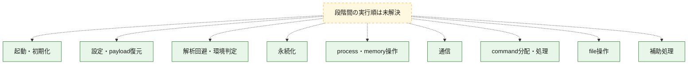
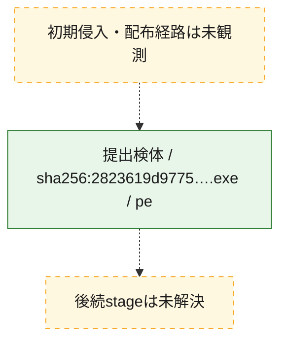
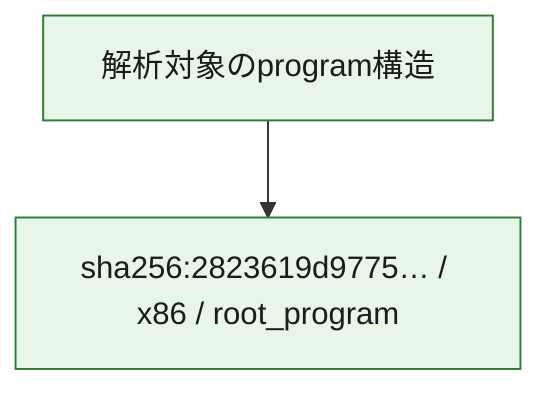

# 全体ロジック：2823619d9775c348c53807e986feee0c6862ee7350e2d0e4edc6954b2de73c02

代表関数の静的証跡から、起動・初期化、設定・payload復元、解析回避・環境判定、永続化、process・memory操作、通信、command分配・処理、file操作の処理群を確認しました。

## 読み方

- phaseの掲載順は解析上の整理順です。observed_call_edgesがない段階間の実行順を断定しません。
- 図の実線は静的に観測した関係、点線と黄色のノードは未観測・未解決の関係を示します。
- 図は静的な要約であり、動的実行を再現するものではありません。
- 詳細な関数解説とfingerprintは[STATIC-LOGIC.md](STATIC-LOGIC.md)を参照してください。

## 静的可視化

### 実行フロー

### 感染チェーン

### モジュール関係

## 処理段階

### 1. 起動・初期化

entry pointから初期化と後続処理への移行を確認します。
確度: `confirmed_static_function_evidence`

- `2823619d9775c348c53807e986feee0c6862ee7350e2d0e4edc6954b2de73c02:ghidra:14034dbe0` — 初期化と主要処理への分岐を行う入口関数です。 状態: `succeeded`、選定理由: `entry_point`, `meaningful_symbol_name`, `reviewed_call_centrality:29`, `role:entrypoint`
- `2823619d9775c348c53807e986feee0c6862ee7350e2d0e4edc6954b2de73c02:ghidra:14040d420` — 初期化と主要処理への分岐を行う入口関数です。 状態: `succeeded`、選定理由: `entry_point`, `meaningful_symbol_name`, `reviewed_call_centrality:2`, `role:entrypoint`
- `2823619d9775c348c53807e986feee0c6862ee7350e2d0e4edc6954b2de73c02:ghidra:140479ae0` — 初期化と主要処理への分岐を行う入口関数です。 状態: `succeeded`、選定理由: `entry_point`, `meaningful_symbol_name`, `reviewed_call_centrality:13`, `role:entrypoint`
- `2823619d9775c348c53807e986feee0c6862ee7350e2d0e4edc6954b2de73c02:ghidra:1404f4580` — 初期化と主要処理への分岐を行う入口関数です。 状態: `succeeded`、選定理由: `entry_point`, `meaningful_symbol_name`, `reviewed_call_centrality:4`, `role:entrypoint`
- `2823619d9775c348c53807e986feee0c6862ee7350e2d0e4edc6954b2de73c02:ghidra:1404f54c0` — 初期化と主要処理への分岐を行う入口関数です。 状態: `succeeded`、選定理由: `entry_point`, `meaningful_symbol_name`, `probable_go_main_user_code`, `reviewed_call_centrality:3`, `role:entrypoint`

### 2. 設定・payload復元

設定、resource、payload、暗号化データの復元・変換を確認します。
確度: `confirmed_static_function_evidence`

- `2823619d9775c348c53807e986feee0c6862ee7350e2d0e4edc6954b2de73c02:ghidra:14008f760` — 設定、resource、payloadなどの解析・変換を行う関数です。 状態: `succeeded`、選定理由: `meaningful_symbol_name`, `reviewed_call_centrality:4`, `role:config_or_data_transform`
- `2823619d9775c348c53807e986feee0c6862ee7350e2d0e4edc6954b2de73c02:ghidra:14008faa0` — 設定、resource、payloadなどの解析・変換を行う関数です。 状態: `succeeded`、選定理由: `meaningful_symbol_name`, `reviewed_call_centrality:4`, `role:config_or_data_transform`
- `2823619d9775c348c53807e986feee0c6862ee7350e2d0e4edc6954b2de73c02:ghidra:14008fc40` — 設定、resource、payloadなどの解析・変換を行う関数です。 状態: `succeeded`、選定理由: `meaningful_symbol_name`, `reviewed_call_centrality:4`, `role:config_or_data_transform`
- `2823619d9775c348c53807e986feee0c6862ee7350e2d0e4edc6954b2de73c02:ghidra:14008fde0` — 設定、resource、payloadなどの解析・変換を行う関数です。 状態: `succeeded`、選定理由: `meaningful_symbol_name`, `reviewed_call_centrality:7`, `role:config_or_data_transform`
- `2823619d9775c348c53807e986feee0c6862ee7350e2d0e4edc6954b2de73c02:ghidra:14008ff00` — 設定、resource、payloadなどの解析・変換を行う関数です。 状態: `succeeded`、選定理由: `meaningful_symbol_name`, `reviewed_call_centrality:8`, `role:config_or_data_transform`
- `2823619d9775c348c53807e986feee0c6862ee7350e2d0e4edc6954b2de73c02:ghidra:140098320` — 設定、resource、payloadなどの解析・変換を行う関数です。 状態: `succeeded`、選定理由: `meaningful_symbol_name`, `reviewed_call_centrality:5`, `role:config_or_data_transform`
- `2823619d9775c348c53807e986feee0c6862ee7350e2d0e4edc6954b2de73c02:ghidra:14010d320` — 暗号、hash、encoding、または復号処理に関係する関数です。 状態: `succeeded`、選定理由: `meaningful_symbol_name`, `reviewed_call_centrality:7`, `role:cryptographic_transform`

### 3. 解析回避・環境判定

debugger、sandbox、仮想環境、時間差などの判定を確認します。
確度: `confirmed_static_function_evidence`

- `2823619d9775c348c53807e986feee0c6862ee7350e2d0e4edc6954b2de73c02:ghidra:14031cca0` — debugger、仮想環境、sandbox、または時間差の確認に関係する関数です。 状態: `succeeded`、選定理由: `meaningful_symbol_name`, `reviewed_call_centrality:7`, `role:anti_analysis`

### 4. 永続化

自動起動や永続化に関係する設定変更を確認します。
確度: `confirmed_static_function_evidence`

- `2823619d9775c348c53807e986feee0c6862ee7350e2d0e4edc6954b2de73c02:ghidra:1403197c0` — 自動起動または永続化に関係する処理を含む関数です。 状態: `succeeded`、選定理由: `meaningful_symbol_name`, `reviewed_call_centrality:7`, `role:persistence`

### 5. process・memory操作

process、thread、module、memory操作と実行移行を確認します。
確度: `confirmed_static_function_evidence`

- `2823619d9775c348c53807e986feee0c6862ee7350e2d0e4edc6954b2de73c02:ghidra:140077740` — process、thread、module、またはmemory操作に関係する関数です。 状態: `succeeded`、選定理由: `meaningful_symbol_name`, `reviewed_call_centrality:3`, `role:process_or_memory_operation`
- `2823619d9775c348c53807e986feee0c6862ee7350e2d0e4edc6954b2de73c02:ghidra:140098620` — process、thread、module、またはmemory操作に関係する関数です。 状態: `succeeded`、選定理由: `meaningful_symbol_name`, `reviewed_call_centrality:6`, `role:process_or_memory_operation`
- `2823619d9775c348c53807e986feee0c6862ee7350e2d0e4edc6954b2de73c02:ghidra:14009a340` — process、thread、module、またはmemory操作に関係する関数です。 状態: `succeeded`、選定理由: `meaningful_symbol_name`, `reviewed_call_centrality:6`, `role:process_or_memory_operation`
- `2823619d9775c348c53807e986feee0c6862ee7350e2d0e4edc6954b2de73c02:ghidra:14009c1a0` — process、thread、module、またはmemory操作に関係する関数です。 状態: `succeeded`、選定理由: `meaningful_symbol_name`, `reviewed_call_centrality:6`, `role:process_or_memory_operation`

### 6. 通信

通信初期化、endpoint処理、送受信の役割を確認します。
確度: `confirmed_static_function_evidence`

- `2823619d9775c348c53807e986feee0c6862ee7350e2d0e4edc6954b2de73c02:ghidra:1400971e0` — 通信初期化、送受信、またはendpoint処理に関係する関数です。 状態: `succeeded`、選定理由: `meaningful_symbol_name`, `reviewed_call_centrality:3`, `role:network_communication`
- `2823619d9775c348c53807e986feee0c6862ee7350e2d0e4edc6954b2de73c02:ghidra:1400972e0` — 通信初期化、送受信、またはendpoint処理に関係する関数です。 状態: `succeeded`、選定理由: `meaningful_symbol_name`, `reviewed_call_centrality:3`, `role:network_communication`
- `2823619d9775c348c53807e986feee0c6862ee7350e2d0e4edc6954b2de73c02:ghidra:140097940` — 通信初期化、送受信、またはendpoint処理に関係する関数です。 状態: `succeeded`、選定理由: `meaningful_symbol_name`, `reviewed_call_centrality:3`, `role:network_communication`
- `2823619d9775c348c53807e986feee0c6862ee7350e2d0e4edc6954b2de73c02:ghidra:1400979a0` — 通信初期化、送受信、またはendpoint処理に関係する関数です。 状態: `succeeded`、選定理由: `meaningful_symbol_name`, `reviewed_call_centrality:4`, `role:network_communication`
- `2823619d9775c348c53807e986feee0c6862ee7350e2d0e4edc6954b2de73c02:ghidra:140097aa0` — 通信初期化、送受信、またはendpoint処理に関係する関数です。 状態: `succeeded`、選定理由: `meaningful_symbol_name`, `reviewed_call_centrality:7`, `role:network_communication`
- `2823619d9775c348c53807e986feee0c6862ee7350e2d0e4edc6954b2de73c02:ghidra:140099ac0` — 通信初期化、送受信、またはendpoint処理に関係する関数です。 状態: `succeeded`、選定理由: `meaningful_symbol_name`, `reviewed_call_centrality:5`, `role:network_communication`
- `2823619d9775c348c53807e986feee0c6862ee7350e2d0e4edc6954b2de73c02:ghidra:140099ba0` — 通信初期化、送受信、またはendpoint処理に関係する関数です。 状態: `succeeded`、選定理由: `meaningful_symbol_name`, `reviewed_call_centrality:7`, `role:network_communication`

### 7. command分配・処理

受信commandやtaskの解釈、分配、個別handlerへの移行を確認します。
確度: `confirmed_static_function_evidence`

- `2823619d9775c348c53807e986feee0c6862ee7350e2d0e4edc6954b2de73c02:ghidra:14009afe0` — commandの解釈、分配、または個別処理を担当する関数です。 状態: `succeeded`、選定理由: `meaningful_symbol_name`, `reviewed_call_centrality:5`, `role:command_dispatch_or_handler`

### 8. file操作

fileやdirectoryの作成、読書き、削除を確認します。
確度: `confirmed_static_function_evidence`

- `2823619d9775c348c53807e986feee0c6862ee7350e2d0e4edc6954b2de73c02:ghidra:140097c00` — fileまたはdirectoryの読書き・管理に関係する関数です。 状態: `succeeded`、選定理由: `meaningful_symbol_name`, `reviewed_call_centrality:7`, `role:file_operation`
- `2823619d9775c348c53807e986feee0c6862ee7350e2d0e4edc6954b2de73c02:ghidra:140099fc0` — fileまたはdirectoryの読書き・管理に関係する関数です。 状態: `succeeded`、選定理由: `meaningful_symbol_name`, `reviewed_call_centrality:7`, `role:file_operation`
- `2823619d9775c348c53807e986feee0c6862ee7350e2d0e4edc6954b2de73c02:ghidra:14009a0a0` — fileまたはdirectoryの読書き・管理に関係する関数です。 状態: `succeeded`、選定理由: `meaningful_symbol_name`, `reviewed_call_centrality:7`, `role:file_operation`
- `2823619d9775c348c53807e986feee0c6862ee7350e2d0e4edc6954b2de73c02:ghidra:14009a620` — fileまたはdirectoryの読書き・管理に関係する関数です。 状態: `succeeded`、選定理由: `meaningful_symbol_name`, `reviewed_call_centrality:6`, `role:file_operation`

### 9. 補助処理

主要処理を支える一般内部関数またはlibrary処理を確認します。
確度: `confirmed_static_function_evidence`

- `2823619d9775c348c53807e986feee0c6862ee7350e2d0e4edc6954b2de73c02:ghidra:140001080` — compiler生成処理または汎用library処理とみられる関数です。 状態: `succeeded`、選定理由: `meaningful_symbol_name`, `reviewed_call_centrality:4`
- `2823619d9775c348c53807e986feee0c6862ee7350e2d0e4edc6954b2de73c02:ghidra:140070e60` — 検体内部の一般処理を実装する関数です。 状態: `succeeded`、選定理由: `meaningful_symbol_name`, `reviewed_call_centrality:3`

## 観測したcall関係

- `ghidra-function:03e88fdd1d00c694ed863359` → `ghidra-external:0ccac71ddabd41ba994678d1` （`unclassified` → `unclassified`）
- `ghidra-function:03e88fdd1d00c694ed863359` → `ghidra-external:9373ea023a3a82e92e6bfda6` （`unclassified` → `unclassified`）
- `ghidra-function:03e88fdd1d00c694ed863359` → `ghidra-external:a00726518ca36ed0e3b7aefe` （`unclassified` → `unclassified`）
- `ghidra-function:03e88fdd1d00c694ed863359` → `ghidra-external:a15bf471323fa3f35d3d6eeb` （`unclassified` → `unclassified`）
- `ghidra-function:03e88fdd1d00c694ed863359` → `ghidra-external:b6ca9e4e884b68947ed60d34` （`unclassified` → `unclassified`）
- `ghidra-function:03e88fdd1d00c694ed863359` → `ghidra-external:fc611458b790a7ebcc967b00` （`unclassified` → `unclassified`）
- `ghidra-function:0f1a4291817a56941fd8f084` → `ghidra-external:48817498ef65fa7ab4ff2e0c` （`unclassified` → `unclassified`）
- `ghidra-function:0f1a4291817a56941fd8f084` → `ghidra-external:4c5712e52a4b67d5220e1bad` （`unclassified` → `unclassified`）
- `ghidra-function:0f1a4291817a56941fd8f084` → `ghidra-external:9373ea023a3a82e92e6bfda6` （`unclassified` → `unclassified`）
- `ghidra-function:0f1a4291817a56941fd8f084` → `ghidra-external:9ca73420dbe772d03c1a443b` （`unclassified` → `unclassified`）
- `ghidra-function:0f1a4291817a56941fd8f084` → `ghidra-external:c40ad9f2393a12b6850bd17d` （`unclassified` → `unclassified`）
- `ghidra-function:0f1a4291817a56941fd8f084` → `ghidra-external:c8d28375692b9f6b8bf91ad8` （`unclassified` → `unclassified`）
- `ghidra-function:0f1a4291817a56941fd8f084` → `ghidra-external:f55c1e86c43e282ca928f28c` （`unclassified` → `unclassified`）
- `ghidra-function:1f32d5387b365d92c7b8bef9` → `ghidra-external:468ddbb8c09941148d1aed32` （`unclassified` → `unclassified`）
- `ghidra-function:1f32d5387b365d92c7b8bef9` → `ghidra-external:690397a8efbe730b08d426c7` （`unclassified` → `unclassified`）
- `ghidra-function:1f32d5387b365d92c7b8bef9` → `ghidra-external:7cfc7e4f023aa02f9be93676` （`unclassified` → `unclassified`）
- `ghidra-function:1f32d5387b365d92c7b8bef9` → `ghidra-external:8c300e05705cfd5f5e9617c2` （`unclassified` → `unclassified`）
- `ghidra-function:1f32d5387b365d92c7b8bef9` → `ghidra-external:9373ea023a3a82e92e6bfda6` （`unclassified` → `unclassified`）
- `ghidra-function:1f32d5387b365d92c7b8bef9` → `ghidra-external:aab4019d109878849cca09fd` （`unclassified` → `unclassified`）
- `ghidra-function:1f32d5387b365d92c7b8bef9` → `ghidra-external:b6ca9e4e884b68947ed60d34` （`unclassified` → `unclassified`）
- `ghidra-function:3ee531c89ead7f52245e295c` → `ghidra-external:0ccac71ddabd41ba994678d1` （`unclassified` → `unclassified`）
- `ghidra-function:3ee531c89ead7f52245e295c` → `ghidra-external:442183f64c73d8ff85f7997e` （`unclassified` → `unclassified`）
- `ghidra-function:3ee531c89ead7f52245e295c` → `ghidra-external:9373ea023a3a82e92e6bfda6` （`unclassified` → `unclassified`）
- `ghidra-function:3ee531c89ead7f52245e295c` → `ghidra-external:98e89584356f753989bd3185` （`unclassified` → `unclassified`）
- `ghidra-function:3ee531c89ead7f52245e295c` → `ghidra-external:a15bf471323fa3f35d3d6eeb` （`unclassified` → `unclassified`）
- `ghidra-function:3ee531c89ead7f52245e295c` → `ghidra-external:b6ca9e4e884b68947ed60d34` （`unclassified` → `unclassified`）
- `ghidra-function:3ee531c89ead7f52245e295c` → `ghidra-external:baa0dd34430e9d794f01b0ed` （`unclassified` → `unclassified`）
- `ghidra-function:43ce485f9202af0aab1d57af` → `ghidra-external:0ccac71ddabd41ba994678d1` （`unclassified` → `unclassified`）
- `ghidra-function:43ce485f9202af0aab1d57af` → `ghidra-external:21c042a84bfc492a36757b19` （`unclassified` → `unclassified`）
- `ghidra-function:43ce485f9202af0aab1d57af` → `ghidra-external:9373ea023a3a82e92e6bfda6` （`unclassified` → `unclassified`）
- `ghidra-function:43ce485f9202af0aab1d57af` → `ghidra-external:a15bf471323fa3f35d3d6eeb` （`unclassified` → `unclassified`）
- `ghidra-function:43ce485f9202af0aab1d57af` → `ghidra-external:ad425cede7a2bd32c90f2ec2` （`unclassified` → `unclassified`）
- `ghidra-function:43ce485f9202af0aab1d57af` → `ghidra-external:b6ca9e4e884b68947ed60d34` （`unclassified` → `unclassified`）
- `ghidra-function:44cdd932cf1887dd869912b0` → `ghidra-external:4405233cb955b36196e467c8` （`unclassified` → `unclassified`）
- `ghidra-function:44cdd932cf1887dd869912b0` → `ghidra-external:8544ab0381de94467c0a0533` （`unclassified` → `unclassified`）
- `ghidra-function:44cdd932cf1887dd869912b0` → `ghidra-external:9985c739975c74d6a87a14f9` （`unclassified` → `unclassified`）
- `ghidra-function:44cdd932cf1887dd869912b0` → `ghidra-external:a2c69783ce98a13eb3f54a0d` （`unclassified` → `unclassified`）
- `ghidra-function:47525480e1c445cffb14bdc6` → `ghidra-external:0d1c8eb0bd44001dd72a519e` （`unclassified` → `unclassified`）
- `ghidra-function:47525480e1c445cffb14bdc6` → `ghidra-external:3a464fc733c23e6a808ba151` （`unclassified` → `unclassified`）
- `ghidra-function:47525480e1c445cffb14bdc6` → `ghidra-external:6bcfc34c1731ae3db578e94f` （`unclassified` → `unclassified`）
- `ghidra-function:47525480e1c445cffb14bdc6` → `ghidra-external:6fd4fe82d62079252b41b4c9` （`unclassified` → `unclassified`）
- `ghidra-function:47525480e1c445cffb14bdc6` → `ghidra-external:9373ea023a3a82e92e6bfda6` （`unclassified` → `unclassified`）
- `ghidra-function:47525480e1c445cffb14bdc6` → `ghidra-external:f730d14b9ae820aacdcd08ef` （`unclassified` → `unclassified`）
- `ghidra-function:47525480e1c445cffb14bdc6` → `ghidra-external:f8351295f51b9b48f72b6a2d` （`unclassified` → `unclassified`）
- `ghidra-function:50c44b6ecddff776a3c1c3c4` → `ghidra-external:149b69b05fd58c755a90ccd8` （`unclassified` → `unclassified`）
- `ghidra-function:50c44b6ecddff776a3c1c3c4` → `ghidra-external:749613fbf8f3a8f4f86e70e0` （`unclassified` → `unclassified`）
- `ghidra-function:50c44b6ecddff776a3c1c3c4` → `ghidra-external:9373ea023a3a82e92e6bfda6` （`unclassified` → `unclassified`）
- `ghidra-function:50c44b6ecddff776a3c1c3c4` → `ghidra-external:a15bf471323fa3f35d3d6eeb` （`unclassified` → `unclassified`）
- `ghidra-function:6a1ce0e85537976ae9fb9e8f` → `ghidra-external:237201f7fa8220b35569fcbc` （`unclassified` → `unclassified`）
- `ghidra-function:6a1ce0e85537976ae9fb9e8f` → `ghidra-external:76bc5fdf5077b663c210b4d8` （`unclassified` → `unclassified`）
- `ghidra-function:6a1ce0e85537976ae9fb9e8f` → `ghidra-external:9373ea023a3a82e92e6bfda6` （`unclassified` → `unclassified`）
- `ghidra-function:6c50d92528995b3d8f3f538e` → `ghidra-external:13d26cbcc2faaa9093092397` （`unclassified` → `unclassified`）
- `ghidra-function:6c50d92528995b3d8f3f538e` → `ghidra-external:32b846ece6acf87ece21188c` （`unclassified` → `unclassified`）
- `ghidra-function:6c50d92528995b3d8f3f538e` → `ghidra-external:6bcfc34c1731ae3db578e94f` （`unclassified` → `unclassified`）
- `ghidra-function:6c50d92528995b3d8f3f538e` → `ghidra-external:749613fbf8f3a8f4f86e70e0` （`unclassified` → `unclassified`）
- `ghidra-function:6c50d92528995b3d8f3f538e` → `ghidra-external:9373ea023a3a82e92e6bfda6` （`unclassified` → `unclassified`）
- `ghidra-function:6c50d92528995b3d8f3f538e` → `ghidra-external:a06e466c35bf6f56414f5b04` （`unclassified` → `unclassified`）
- `ghidra-function:6c50d92528995b3d8f3f538e` → `ghidra-external:d2eaad950a663ec267c9a0cb` （`unclassified` → `unclassified`）
- `ghidra-function:6f43cb5fe721a2d8c4637455` → `ghidra-external:13d26cbcc2faaa9093092397` （`unclassified` → `unclassified`）
- `ghidra-function:6f43cb5fe721a2d8c4637455` → `ghidra-external:9373ea023a3a82e92e6bfda6` （`unclassified` → `unclassified`）
- `ghidra-function:6f43cb5fe721a2d8c4637455` → `ghidra-external:f3af03fa9fa493c714f73b48` （`unclassified` → `unclassified`）
- `ghidra-function:7fdf56a95ac3a3bab31894cc` → `ghidra-external:0ccac71ddabd41ba994678d1` （`unclassified` → `unclassified`）
- `ghidra-function:7fdf56a95ac3a3bab31894cc` → `ghidra-external:2f1787e2f1de4ce05c156314` （`unclassified` → `unclassified`）
- `ghidra-function:7fdf56a95ac3a3bab31894cc` → `ghidra-external:9373ea023a3a82e92e6bfda6` （`unclassified` → `unclassified`）
- `ghidra-function:7fdf56a95ac3a3bab31894cc` → `ghidra-external:a15bf471323fa3f35d3d6eeb` （`unclassified` → `unclassified`）
- `ghidra-function:7fdf56a95ac3a3bab31894cc` → `ghidra-external:ad425cede7a2bd32c90f2ec2` （`unclassified` → `unclassified`）
- `ghidra-function:7fdf56a95ac3a3bab31894cc` → `ghidra-external:b6ca9e4e884b68947ed60d34` （`unclassified` → `unclassified`）
- `ghidra-function:826215150c6c2dcbedda1feb` → `ghidra-external:3e713d9fa6a8f09d9917c33b` （`unclassified` → `unclassified`）
- `ghidra-function:826215150c6c2dcbedda1feb` → `ghidra-external:4405233cb955b36196e467c8` （`unclassified` → `unclassified`）
- `ghidra-function:826215150c6c2dcbedda1feb` → `ghidra-external:468ddbb8c09941148d1aed32` （`unclassified` → `unclassified`）
- `ghidra-function:826215150c6c2dcbedda1feb` → `ghidra-external:51d1763fb42c2f0ea535cd2b` （`unclassified` → `unclassified`）
- `ghidra-function:826215150c6c2dcbedda1feb` → `ghidra-external:532830b90e3f533a22d9bf54` （`unclassified` → `unclassified`）
- `ghidra-function:826215150c6c2dcbedda1feb` → `ghidra-external:70f09f868abcf8d17897af92` （`unclassified` → `unclassified`）
- `ghidra-function:826215150c6c2dcbedda1feb` → `ghidra-external:9373ea023a3a82e92e6bfda6` （`unclassified` → `unclassified`）
- `ghidra-function:826215150c6c2dcbedda1feb` → `ghidra-external:a2c69783ce98a13eb3f54a0d` （`unclassified` → `unclassified`）
- `ghidra-function:8371d4358614560355583d79` → `ghidra-external:9985c739975c74d6a87a14f9` （`unclassified` → `unclassified`）
- `ghidra-function:8371d4358614560355583d79` → `ghidra-external:a2c69783ce98a13eb3f54a0d` （`unclassified` → `unclassified`）
- `ghidra-function:8371d4358614560355583d79` → `ghidra-external:f20f831e82a1d217bc16172e` （`unclassified` → `unclassified`）
- `ghidra-function:8371d4358614560355583d79` → `ghidra-external:f5db63f9ab9688e24f6fb025` （`unclassified` → `unclassified`）
- `ghidra-function:8778539c0b15dc9c9710c94a` → `ghidra-external:44dc214b459802d27d8e88b9` （`unclassified` → `unclassified`）
- `ghidra-function:8778539c0b15dc9c9710c94a` → `ghidra-external:9373ea023a3a82e92e6bfda6` （`unclassified` → `unclassified`）
- `ghidra-function:8778539c0b15dc9c9710c94a` → `ghidra-external:a2c69783ce98a13eb3f54a0d` （`unclassified` → `unclassified`）
- `ghidra-function:8778539c0b15dc9c9710c94a` → `ghidra-external:ce9dc590975aff7eafa0b9a1` （`unclassified` → `unclassified`）
- `ghidra-function:9218fbeab49a5a23eb34a35c` → `ghidra-external:30e09571a9bece7eb2ea8644` （`unclassified` → `unclassified`）
- `ghidra-function:9218fbeab49a5a23eb34a35c` → `ghidra-external:44dc214b459802d27d8e88b9` （`unclassified` → `unclassified`）
- `ghidra-function:9218fbeab49a5a23eb34a35c` → `ghidra-external:5d4ce26665d036a0fb8341ca` （`unclassified` → `unclassified`）
- `ghidra-function:9218fbeab49a5a23eb34a35c` → `ghidra-external:9373ea023a3a82e92e6bfda6` （`unclassified` → `unclassified`）
- `ghidra-function:9218fbeab49a5a23eb34a35c` → `ghidra-external:a2c69783ce98a13eb3f54a0d` （`unclassified` → `unclassified`）
- `ghidra-function:9ad22982890ddc8d6e9b1a26` → `ghidra-external:188b75d4ee9aadb393c66de8` （`unclassified` → `unclassified`）
- `ghidra-function:9ad22982890ddc8d6e9b1a26` → `ghidra-external:346be089be0a609c1d153591` （`unclassified` → `unclassified`）
- `ghidra-function:9ad22982890ddc8d6e9b1a26` → `ghidra-external:4405233cb955b36196e467c8` （`unclassified` → `unclassified`）
- `ghidra-function:9ad22982890ddc8d6e9b1a26` → `ghidra-external:44dc214b459802d27d8e88b9` （`unclassified` → `unclassified`）
- `ghidra-function:9ad22982890ddc8d6e9b1a26` → `ghidra-external:674834f4abd13235f9ce5d4c` （`unclassified` → `unclassified`）
- `ghidra-function:9ad22982890ddc8d6e9b1a26` → `ghidra-external:6bcfc34c1731ae3db578e94f` （`unclassified` → `unclassified`）
- `ghidra-function:9ad22982890ddc8d6e9b1a26` → `ghidra-external:70f09f868abcf8d17897af92` （`unclassified` → `unclassified`）
- `ghidra-function:9ad22982890ddc8d6e9b1a26` → `ghidra-external:7f67a5b319e8fe5081b408e0` （`unclassified` → `unclassified`）
- `ghidra-function:9ad22982890ddc8d6e9b1a26` → `ghidra-external:83aaadd6b695b143432af18d` （`unclassified` → `unclassified`）
- `ghidra-function:9ad22982890ddc8d6e9b1a26` → `ghidra-external:9373ea023a3a82e92e6bfda6` （`unclassified` → `unclassified`）
- `ghidra-function:9ad22982890ddc8d6e9b1a26` → `ghidra-external:b0f6e348b7d4dde81544162a` （`unclassified` → `unclassified`）
- `ghidra-function:9ad22982890ddc8d6e9b1a26` → `ghidra-external:b6167da64dd02c0a7efdc6e9` （`unclassified` → `unclassified`）
- `ghidra-function:9ad22982890ddc8d6e9b1a26` → `ghidra-external:eb559171b8662198c55be3a3` （`unclassified` → `unclassified`）
- `ghidra-function:9cc58836fade62f087355ab4` → `ghidra-external:9373ea023a3a82e92e6bfda6` （`unclassified` → `unclassified`）
- `ghidra-function:9cc58836fade62f087355ab4` → `ghidra-external:97011761e790f901d19ea21b` （`unclassified` → `unclassified`）
- `ghidra-function:9cc58836fade62f087355ab4` → `ghidra-external:98e89584356f753989bd3185` （`unclassified` → `unclassified`）
- `ghidra-function:9cc58836fade62f087355ab4` → `ghidra-external:a2c69783ce98a13eb3f54a0d` （`unclassified` → `unclassified`）
- `ghidra-function:9cc58836fade62f087355ab4` → `ghidra-external:c8f0ecf6e5302acaf98252a5` （`unclassified` → `unclassified`）
- `ghidra-function:9e13c0576716868241750962` → `ghidra-external:4405233cb955b36196e467c8` （`unclassified` → `unclassified`）
- `ghidra-function:9e13c0576716868241750962` → `ghidra-external:532830b90e3f533a22d9bf54` （`unclassified` → `unclassified`）
- `ghidra-function:9e13c0576716868241750962` → `ghidra-external:70f09f868abcf8d17897af92` （`unclassified` → `unclassified`）
- `ghidra-function:9e13c0576716868241750962` → `ghidra-external:791f22a34919b29ad0320cc9` （`unclassified` → `unclassified`）
- `ghidra-function:9e13c0576716868241750962` → `ghidra-external:8544ab0381de94467c0a0533` （`unclassified` → `unclassified`）
- `ghidra-function:9e13c0576716868241750962` → `ghidra-external:9373ea023a3a82e92e6bfda6` （`unclassified` → `unclassified`）
- `ghidra-function:9e13c0576716868241750962` → `ghidra-external:a2c69783ce98a13eb3f54a0d` （`unclassified` → `unclassified`）
- `ghidra-function:a5f356802a27f12e147ef42a` → `ghidra-external:01ca2adf6b564328d7962460` （`unclassified` → `unclassified`）
- `ghidra-function:a5f356802a27f12e147ef42a` → `ghidra-external:684e3a196589f354c1e058e1` （`unclassified` → `unclassified`）
- `ghidra-function:a5f356802a27f12e147ef42a` → `ghidra-external:690397a8efbe730b08d426c7` （`unclassified` → `unclassified`）
- `ghidra-function:a5f356802a27f12e147ef42a` → `ghidra-external:8c300e05705cfd5f5e9617c2` （`unclassified` → `unclassified`）
- `ghidra-function:a5f356802a27f12e147ef42a` → `ghidra-external:9373ea023a3a82e92e6bfda6` （`unclassified` → `unclassified`）
- `ghidra-function:a5f356802a27f12e147ef42a` → `ghidra-external:a15bf471323fa3f35d3d6eeb` （`unclassified` → `unclassified`）
- `ghidra-function:a5f356802a27f12e147ef42a` → `ghidra-external:b6ca9e4e884b68947ed60d34` （`unclassified` → `unclassified`）
- `ghidra-function:a73cc6749f39701ec92b3ec5` → `ghidra-external:468ddbb8c09941148d1aed32` （`unclassified` → `unclassified`）
- `ghidra-function:a73cc6749f39701ec92b3ec5` → `ghidra-external:532ac1607c025b3158ad2dee` （`unclassified` → `unclassified`）
- `ghidra-function:a73cc6749f39701ec92b3ec5` → `ghidra-external:6576f8fbd5c2857328779a23` （`unclassified` → `unclassified`）
- `ghidra-function:a73cc6749f39701ec92b3ec5` → `ghidra-external:9373ea023a3a82e92e6bfda6` （`unclassified` → `unclassified`）
- `ghidra-function:a73cc6749f39701ec92b3ec5` → `ghidra-external:97011761e790f901d19ea21b` （`unclassified` → `unclassified`）
- `ghidra-function:a73cc6749f39701ec92b3ec5` → `ghidra-external:a2c69783ce98a13eb3f54a0d` （`unclassified` → `unclassified`）
- `ghidra-function:b0212d7ba990b8654912fc15` → `ghidra-external:0ccac71ddabd41ba994678d1` （`unclassified` → `unclassified`）
- `ghidra-function:b0212d7ba990b8654912fc15` → `ghidra-external:108eaa5ca317e4135800947c` （`unclassified` → `unclassified`）
- `ghidra-function:b0212d7ba990b8654912fc15` → `ghidra-external:468ddbb8c09941148d1aed32` （`unclassified` → `unclassified`）
- `ghidra-function:b0212d7ba990b8654912fc15` → `ghidra-external:9373ea023a3a82e92e6bfda6` （`unclassified` → `unclassified`）
- `ghidra-function:b0212d7ba990b8654912fc15` → `ghidra-external:a15bf471323fa3f35d3d6eeb` （`unclassified` → `unclassified`）
- `ghidra-function:b0212d7ba990b8654912fc15` → `ghidra-external:b6ca9e4e884b68947ed60d34` （`unclassified` → `unclassified`）
- `ghidra-function:b0212d7ba990b8654912fc15` → `ghidra-external:fc611458b790a7ebcc967b00` （`unclassified` → `unclassified`）
- `ghidra-function:b32632221c9b90b6e002daf4` → `ghidra-external:24ad6aa6fbde8bf3dd27a7f5` （`unclassified` → `unclassified`）
- `ghidra-function:b32632221c9b90b6e002daf4` → `ghidra-external:9373ea023a3a82e92e6bfda6` （`unclassified` → `unclassified`）
- `ghidra-function:b32632221c9b90b6e002daf4` → `ghidra-external:fba7455c67279d8513162aff` （`unclassified` → `unclassified`）
- `ghidra-function:b884a4a09f8c88467b384ee0` → `ghidra-external:90400d7cad372a49056491fd` （`unclassified` → `unclassified`）
- `ghidra-function:b884a4a09f8c88467b384ee0` → `ghidra-external:9373ea023a3a82e92e6bfda6` （`unclassified` → `unclassified`）
- `ghidra-function:b884a4a09f8c88467b384ee0` → `ghidra-external:f8b86f2bf26fab9888330810` （`unclassified` → `unclassified`）
- `ghidra-function:bab802641f47811373867070` → `ghidra-external:0ccac71ddabd41ba994678d1` （`unclassified` → `unclassified`）
- `ghidra-function:bab802641f47811373867070` → `ghidra-external:9373ea023a3a82e92e6bfda6` （`unclassified` → `unclassified`）
- `ghidra-function:bab802641f47811373867070` → `ghidra-external:b6ca9e4e884b68947ed60d34` （`unclassified` → `unclassified`）
- `ghidra-function:bab802641f47811373867070` → `ghidra-external:f938386d5ec5a30cc180452b` （`unclassified` → `unclassified`）
- `ghidra-function:bab802641f47811373867070` → `ghidra-external:fc611458b790a7ebcc967b00` （`unclassified` → `unclassified`）
- `ghidra-function:c2b3035b34fef9a8c218c9d6` → `ghidra-external:3367422f7adb4b556815b11c` （`unclassified` → `unclassified`）
- `ghidra-function:c2b3035b34fef9a8c218c9d6` → `ghidra-external:633b8a404332979860449fcc` （`unclassified` → `unclassified`）
- `ghidra-function:c2b3035b34fef9a8c218c9d6` → `ghidra-external:a7e4a7f558bed83de2dd52fc` （`unclassified` → `unclassified`）
- `ghidra-function:cc42a40a4b19c4c8f1691d5e` → `ghidra-external:0b8d68fed0d7f05c13d2d424` （`unclassified` → `unclassified`）
- `ghidra-function:cc42a40a4b19c4c8f1691d5e` → `ghidra-external:9373ea023a3a82e92e6bfda6` （`unclassified` → `unclassified`）
- `ghidra-function:cc42a40a4b19c4c8f1691d5e` → `ghidra-external:cf6167b70a3d457fa005d56a` （`unclassified` → `unclassified`）
- `ghidra-function:d353570a9c2f43b6209c1bbe` → `ghidra-external:01ca2adf6b564328d7962460` （`unclassified` → `unclassified`）
- `ghidra-function:d353570a9c2f43b6209c1bbe` → `ghidra-external:2aecd3f961df41c1fddf8859` （`unclassified` → `unclassified`）
- `ghidra-function:d353570a9c2f43b6209c1bbe` → `ghidra-external:2f61fdd80a42fb8f2f083423` （`unclassified` → `unclassified`）
- `ghidra-function:d353570a9c2f43b6209c1bbe` → `ghidra-external:32b846ece6acf87ece21188c` （`unclassified` → `unclassified`）
- `ghidra-function:d353570a9c2f43b6209c1bbe` → `ghidra-external:39a6a60715acaf629631b87f` （`unclassified` → `unclassified`）
- `ghidra-function:d353570a9c2f43b6209c1bbe` → `ghidra-external:4405233cb955b36196e467c8` （`unclassified` → `unclassified`）
- `ghidra-function:d353570a9c2f43b6209c1bbe` → `ghidra-external:468ddbb8c09941148d1aed32` （`unclassified` → `unclassified`）
- `ghidra-function:d353570a9c2f43b6209c1bbe` → `ghidra-external:49e09c21fab8bf062619967b` （`unclassified` → `unclassified`）
- `ghidra-function:d353570a9c2f43b6209c1bbe` → `ghidra-external:50ec7df68b65695bd6f9104b` （`unclassified` → `unclassified`）
- `ghidra-function:d353570a9c2f43b6209c1bbe` → `ghidra-external:6237e72dc80ce7c885e047d2` （`unclassified` → `unclassified`）
- `ghidra-function:d353570a9c2f43b6209c1bbe` → `ghidra-external:6376f41a27cd2181001642a4` （`unclassified` → `unclassified`）
- `ghidra-function:d353570a9c2f43b6209c1bbe` → `ghidra-external:674834f4abd13235f9ce5d4c` （`unclassified` → `unclassified`）
- `ghidra-function:d353570a9c2f43b6209c1bbe` → `ghidra-external:6bcfc34c1731ae3db578e94f` （`unclassified` → `unclassified`）
- `ghidra-function:d353570a9c2f43b6209c1bbe` → `ghidra-external:70f09f868abcf8d17897af92` （`unclassified` → `unclassified`）
- `ghidra-function:d353570a9c2f43b6209c1bbe` → `ghidra-external:7189a6cfe6f439440e5824d6` （`unclassified` → `unclassified`）
- `ghidra-function:d353570a9c2f43b6209c1bbe` → `ghidra-external:9373ea023a3a82e92e6bfda6` （`unclassified` → `unclassified`）
- `ghidra-function:d353570a9c2f43b6209c1bbe` → `ghidra-external:a06e466c35bf6f56414f5b04` （`unclassified` → `unclassified`）
- `ghidra-function:d353570a9c2f43b6209c1bbe` → `ghidra-external:a15bf471323fa3f35d3d6eeb` （`unclassified` → `unclassified`）
- `ghidra-function:d353570a9c2f43b6209c1bbe` → `ghidra-external:a1623ebaec67aef56f6a9c60` （`unclassified` → `unclassified`）
- `ghidra-function:d353570a9c2f43b6209c1bbe` → `ghidra-external:a2c69783ce98a13eb3f54a0d` （`unclassified` → `unclassified`）
- `ghidra-function:d353570a9c2f43b6209c1bbe` → `ghidra-external:aab4019d109878849cca09fd` （`unclassified` → `unclassified`）
- `ghidra-function:d353570a9c2f43b6209c1bbe` → `ghidra-external:cf2b244a85b568ae6d887c83` （`unclassified` → `unclassified`）
- `ghidra-function:d353570a9c2f43b6209c1bbe` → `ghidra-external:d8f595d276598f95d940c104` （`unclassified` → `unclassified`）
- `ghidra-function:d353570a9c2f43b6209c1bbe` → `ghidra-external:e28c4f5d1df3cf6e10c40c3b` （`unclassified` → `unclassified`）
- `ghidra-function:d353570a9c2f43b6209c1bbe` → `ghidra-external:e627c20be8535bff8456ccf2` （`unclassified` → `unclassified`）
- `ghidra-function:d353570a9c2f43b6209c1bbe` → `ghidra-external:e8bc1dc1c235d07c83ae056b` （`unclassified` → `unclassified`）
- `ghidra-function:d353570a9c2f43b6209c1bbe` → `ghidra-external:ea37d6090cb695cbac4bab93` （`unclassified` → `unclassified`）
- `ghidra-function:d353570a9c2f43b6209c1bbe` → `ghidra-external:ed42d59285b100562ee55fd5` （`unclassified` → `unclassified`）
- `ghidra-function:d353570a9c2f43b6209c1bbe` → `ghidra-external:f0edd37aa033e703e3b2eb8c` （`unclassified` → `unclassified`）
- `ghidra-function:d9e891c77712bf0165291191` → `ghidra-external:41b195c9159d9dd39bdbac73` （`unclassified` → `unclassified`）
- `ghidra-function:d9e891c77712bf0165291191` → `ghidra-external:449691bb534111de9af6e1f8` （`unclassified` → `unclassified`）
- `ghidra-function:d9e891c77712bf0165291191` → `ghidra-external:90400d7cad372a49056491fd` （`unclassified` → `unclassified`）
- `ghidra-function:d9e891c77712bf0165291191` → `ghidra-external:9373ea023a3a82e92e6bfda6` （`unclassified` → `unclassified`）
- `ghidra-function:dd9abb8a1cc96767f050de1e` → `ghidra-external:9373ea023a3a82e92e6bfda6` （`unclassified` → `unclassified`）
- `ghidra-function:dd9abb8a1cc96767f050de1e` → `ghidra-external:e144b85fde40436051694a82` （`unclassified` → `unclassified`）
- `ghidra-function:e56ffa9a46d7fb2fbfdc41d8` → `ghidra-external:0ccac71ddabd41ba994678d1` （`unclassified` → `unclassified`）
- `ghidra-function:e56ffa9a46d7fb2fbfdc41d8` → `ghidra-external:149b69b05fd58c755a90ccd8` （`unclassified` → `unclassified`）
- `ghidra-function:e56ffa9a46d7fb2fbfdc41d8` → `ghidra-external:468ddbb8c09941148d1aed32` （`unclassified` → `unclassified`）
- `ghidra-function:e56ffa9a46d7fb2fbfdc41d8` → `ghidra-external:71e0c5750ee677dafe901489` （`unclassified` → `unclassified`）
- `ghidra-function:e56ffa9a46d7fb2fbfdc41d8` → `ghidra-external:9373ea023a3a82e92e6bfda6` （`unclassified` → `unclassified`）
- `ghidra-function:e56ffa9a46d7fb2fbfdc41d8` → `ghidra-external:a15bf471323fa3f35d3d6eeb` （`unclassified` → `unclassified`）
- `ghidra-function:e56ffa9a46d7fb2fbfdc41d8` → `ghidra-external:b6ca9e4e884b68947ed60d34` （`unclassified` → `unclassified`）
- `ghidra-function:f1f18887163890a575b02e3e` → `ghidra-external:3e713d9fa6a8f09d9917c33b` （`unclassified` → `unclassified`）
- `ghidra-function:f1f18887163890a575b02e3e` → `ghidra-external:4405233cb955b36196e467c8` （`unclassified` → `unclassified`）
- `ghidra-function:f1f18887163890a575b02e3e` → `ghidra-external:9985c739975c74d6a87a14f9` （`unclassified` → `unclassified`）
- `ghidra-function:f1f18887163890a575b02e3e` → `ghidra-external:a2c69783ce98a13eb3f54a0d` （`unclassified` → `unclassified`）

## 解析範囲と制約

- 選定外関数は全体inventoryへ残しますが、関数本体の個別解説対象にはしていません。
- indirect call、難読化、packer、VM、壊れたcontrol flowによりcall関係が欠落する場合があります。
- 文書は静的解析に基づき、検体実行や外部通信による動的確認は行っていません。
