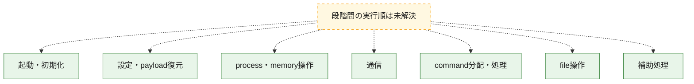
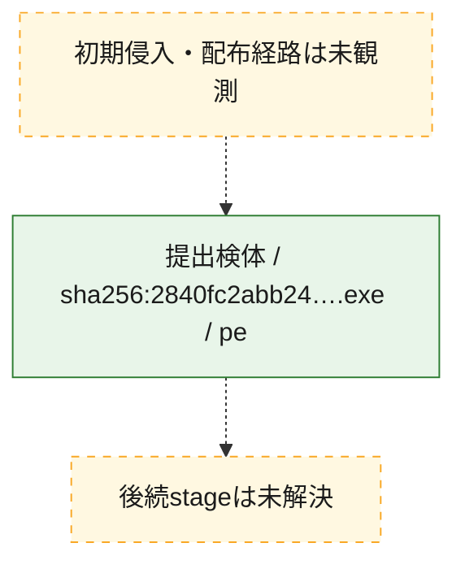
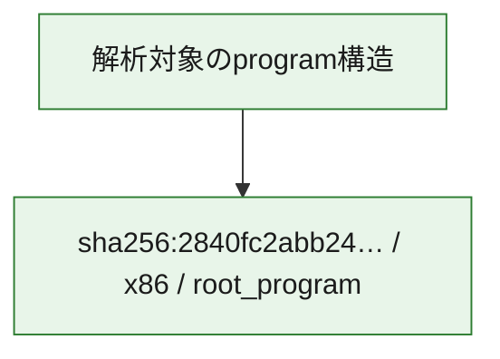

# 全体ロジック：2840fc2abb24a746ea1edd7e828affad3a5a1f92dd91778fe2af7f23ed489f7c

代表関数の静的証跡から、起動・初期化、設定・payload復元、process・memory操作、通信、command分配・処理、file操作の処理群を確認しました。

## 読み方

- phaseの掲載順は解析上の整理順です。observed_call_edgesがない段階間の実行順を断定しません。
- 図の実線は静的に観測した関係、点線と黄色のノードは未観測・未解決の関係を示します。
- 図は静的な要約であり、動的実行を再現するものではありません。
- 詳細な関数解説とfingerprintは[STATIC-LOGIC.md](STATIC-LOGIC.md)を参照してください。

## 静的可視化

### 実行フロー

### 感染チェーン

### モジュール関係

## 処理段階

### 1. 起動・初期化

entry pointから初期化と後続処理への移行を確認します。
確度: `confirmed_static_function_evidence_with_limits`

- `2840fc2abb24a746ea1edd7e828affad3a5a1f92dd91778fe2af7f23ed489f7c:ghidra:1400c0f60` — 初期化と主要処理への分岐を行う入口関数です。 状態: `succeeded`、選定理由: `entry_point`, `meaningful_symbol_name`, `probable_go_main_user_code`, `reviewed_call_centrality:5`, `role:entrypoint`
- `2840fc2abb24a746ea1edd7e828affad3a5a1f92dd91778fe2af7f23ed489f7c:ghidra:1400c1120` — 初期化と主要処理への分岐を行う入口関数です。 状態: `succeeded`、選定理由: `entry_point`, `meaningful_symbol_name`, `probable_go_main_user_code`, `reviewed_call_centrality:16`, `role:entrypoint`
- `2840fc2abb24a746ea1edd7e828affad3a5a1f92dd91778fe2af7f23ed489f7c:ghidra:1400c2aa0` — 初期化と主要処理への分岐を行う入口関数です。 状態: `succeeded`、選定理由: `entry_point`, `meaningful_symbol_name`, `probable_go_main_user_code`, `reviewed_call_centrality:16`, `role:entrypoint`
- `2840fc2abb24a746ea1edd7e828affad3a5a1f92dd91778fe2af7f23ed489f7c:ghidra:1400c4420` — 初期化と主要処理への分岐を行う入口関数です。 状態: `succeeded`、選定理由: `entry_point`, `meaningful_symbol_name`, `probable_go_main_user_code`, `reviewed_call_centrality:19`, `role:entrypoint`
- `2840fc2abb24a746ea1edd7e828affad3a5a1f92dd91778fe2af7f23ed489f7c:ghidra:1400c5dc0` — 初期化と主要処理への分岐を行う入口関数です。 状態: `succeeded`、選定理由: `entry_point`, `meaningful_symbol_name`, `probable_go_main_user_code`, `reviewed_call_centrality:20`, `role:entrypoint`
- `2840fc2abb24a746ea1edd7e828affad3a5a1f92dd91778fe2af7f23ed489f7c:ghidra:1400c7100` — 初期化と主要処理への分岐を行う入口関数です。 状態: `failed`、選定理由: `entry_point`, `meaningful_symbol_name`, `probable_go_main_user_code`, `role:entrypoint`
- `2840fc2abb24a746ea1edd7e828affad3a5a1f92dd91778fe2af7f23ed489f7c:ghidra:1400cdee0` — 初期化と主要処理への分岐を行う入口関数です。 状態: `succeeded`、選定理由: `entry_point`, `meaningful_symbol_name`, `probable_go_main_user_code`, `reviewed_call_centrality:16`, `role:entrypoint`
- `2840fc2abb24a746ea1edd7e828affad3a5a1f92dd91778fe2af7f23ed489f7c:ghidra:1400cff20` — 初期化と主要処理への分岐を行う入口関数です。 状態: `succeeded`、選定理由: `entry_point`, `meaningful_symbol_name`, `probable_go_main_user_code`, `reviewed_call_centrality:18`, `role:entrypoint`
- `2840fc2abb24a746ea1edd7e828affad3a5a1f92dd91778fe2af7f23ed489f7c:ghidra:1400d2000` — 初期化と主要処理への分岐を行う入口関数です。 状態: `succeeded`、選定理由: `entry_point`, `meaningful_symbol_name`, `probable_go_main_user_code`, `reviewed_call_centrality:23`, `role:entrypoint`
- `2840fc2abb24a746ea1edd7e828affad3a5a1f92dd91778fe2af7f23ed489f7c:ghidra:1400d3500` — 初期化と主要処理への分岐を行う入口関数です。 状態: `succeeded`、選定理由: `entry_point`, `meaningful_symbol_name`, `probable_go_main_user_code`, `reviewed_call_centrality:16`, `role:entrypoint`
- `2840fc2abb24a746ea1edd7e828affad3a5a1f92dd91778fe2af7f23ed489f7c:ghidra:1400d3c40` — 初期化と主要処理への分岐を行う入口関数です。 状態: `succeeded`、選定理由: `entry_point`, `meaningful_symbol_name`, `probable_go_main_user_code`, `reviewed_call_centrality:18`, `role:entrypoint`
- `2840fc2abb24a746ea1edd7e828affad3a5a1f92dd91778fe2af7f23ed489f7c:ghidra:1400d5cc0` — 初期化と主要処理への分岐を行う入口関数です。 状態: `succeeded`、選定理由: `entry_point`, `meaningful_symbol_name`, `probable_go_main_user_code`, `reviewed_call_centrality:17`, `role:entrypoint`
- `2840fc2abb24a746ea1edd7e828affad3a5a1f92dd91778fe2af7f23ed489f7c:ghidra:1400d69c0` — 初期化と主要処理への分岐を行う入口関数です。 状態: `succeeded`、選定理由: `entry_point`, `meaningful_symbol_name`, `probable_go_main_user_code`, `reviewed_call_centrality:18`, `role:entrypoint`
- `2840fc2abb24a746ea1edd7e828affad3a5a1f92dd91778fe2af7f23ed489f7c:ghidra:1400d8b00` — 初期化と主要処理への分岐を行う入口関数です。 状態: `succeeded`、選定理由: `entry_point`, `meaningful_symbol_name`, `probable_go_main_user_code`, `reviewed_call_centrality:22`, `role:entrypoint`
- `2840fc2abb24a746ea1edd7e828affad3a5a1f92dd91778fe2af7f23ed489f7c:ghidra:1400d9480` — 初期化と主要処理への分岐を行う入口関数です。 状態: `failed`、選定理由: `entry_point`, `meaningful_symbol_name`, `probable_go_main_user_code`, `role:entrypoint`
- `2840fc2abb24a746ea1edd7e828affad3a5a1f92dd91778fe2af7f23ed489f7c:ghidra:1400ea780` — 初期化と主要処理への分岐を行う入口関数です。 状態: `succeeded`、選定理由: `entry_point`, `meaningful_symbol_name`, `probable_go_main_user_code`, `reviewed_call_centrality:16`, `role:entrypoint`
- `2840fc2abb24a746ea1edd7e828affad3a5a1f92dd91778fe2af7f23ed489f7c:ghidra:1400ec760` — 初期化と主要処理への分岐を行う入口関数です。 状態: `succeeded`、選定理由: `entry_point`, `meaningful_symbol_name`, `probable_go_main_user_code`, `reviewed_call_centrality:17`, `role:entrypoint`
- `2840fc2abb24a746ea1edd7e828affad3a5a1f92dd91778fe2af7f23ed489f7c:ghidra:1400ee0e0` — 初期化と主要処理への分岐を行う入口関数です。 状態: `succeeded`、選定理由: `entry_point`, `meaningful_symbol_name`, `probable_go_main_user_code`, `reviewed_call_centrality:18`, `role:entrypoint`
- `2840fc2abb24a746ea1edd7e828affad3a5a1f92dd91778fe2af7f23ed489f7c:ghidra:1400f0d80` — 初期化と主要処理への分岐を行う入口関数です。 状態: `succeeded`、選定理由: `entry_point`, `meaningful_symbol_name`, `probable_go_main_user_code`, `reviewed_call_centrality:16`, `role:entrypoint`
- `2840fc2abb24a746ea1edd7e828affad3a5a1f92dd91778fe2af7f23ed489f7c:ghidra:1400f2080` — 初期化と主要処理への分岐を行う入口関数です。 状態: `succeeded`、選定理由: `entry_point`, `meaningful_symbol_name`, `probable_go_main_user_code`, `reviewed_call_centrality:16`, `role:entrypoint`
- `2840fc2abb24a746ea1edd7e828affad3a5a1f92dd91778fe2af7f23ed489f7c:ghidra:1400f4040` — 初期化と主要処理への分岐を行う入口関数です。 状態: `succeeded`、選定理由: `entry_point`, `meaningful_symbol_name`, `probable_go_main_user_code`, `reviewed_call_centrality:18`, `role:entrypoint`
- `2840fc2abb24a746ea1edd7e828affad3a5a1f92dd91778fe2af7f23ed489f7c:ghidra:1400f6660` — 初期化と主要処理への分岐を行う入口関数です。 状態: `succeeded`、選定理由: `entry_point`, `meaningful_symbol_name`, `probable_go_main_user_code`, `reviewed_call_centrality:22`, `role:entrypoint`
- `2840fc2abb24a746ea1edd7e828affad3a5a1f92dd91778fe2af7f23ed489f7c:ghidra:1400f8ce0` — 初期化と主要処理への分岐を行う入口関数です。 状態: `succeeded`、選定理由: `entry_point`, `meaningful_symbol_name`, `probable_go_main_user_code`, `reviewed_call_centrality:17`, `role:entrypoint`
- `2840fc2abb24a746ea1edd7e828affad3a5a1f92dd91778fe2af7f23ed489f7c:ghidra:1400face0` — 初期化と主要処理への分岐を行う入口関数です。 状態: `succeeded`、選定理由: `entry_point`, `meaningful_symbol_name`, `probable_go_main_user_code`, `reviewed_call_centrality:16`, `role:entrypoint`
- `2840fc2abb24a746ea1edd7e828affad3a5a1f92dd91778fe2af7f23ed489f7c:ghidra:1400fcca0` — 初期化と主要処理への分岐を行う入口関数です。 状態: `failed`、選定理由: `entry_point`, `meaningful_symbol_name`, `probable_go_main_user_code`, `role:entrypoint`

### 2. 設定・payload復元

設定、resource、payload、暗号化データの復元・変換を確認します。
確度: `confirmed_static_function_evidence`

- `2840fc2abb24a746ea1edd7e828affad3a5a1f92dd91778fe2af7f23ed489f7c:ghidra:140085da0` — 設定、resource、payloadなどの解析・変換を行う関数です。 状態: `succeeded`、選定理由: `meaningful_symbol_name`, `reviewed_call_centrality:4`, `role:config_or_data_transform`

### 3. process・memory操作

process、thread、module、memory操作と実行移行を確認します。
確度: `confirmed_static_function_evidence`

- `2840fc2abb24a746ea1edd7e828affad3a5a1f92dd91778fe2af7f23ed489f7c:ghidra:140098420` — process、thread、module、またはmemory操作に関係する関数です。 状態: `succeeded`、選定理由: `meaningful_symbol_name`, `reviewed_call_centrality:6`, `role:process_or_memory_operation`

### 4. 通信

通信初期化、endpoint処理、送受信の役割を確認します。
確度: `confirmed_static_function_evidence`

- `2840fc2abb24a746ea1edd7e828affad3a5a1f92dd91778fe2af7f23ed489f7c:ghidra:140099280` — 通信初期化、送受信、またはendpoint処理に関係する関数です。 状態: `succeeded`、選定理由: `meaningful_symbol_name`, `reviewed_call_centrality:6`, `role:network_communication`

### 5. command分配・処理

受信commandやtaskの解釈、分配、個別handlerへの移行を確認します。
確度: `confirmed_static_function_evidence`

- `2840fc2abb24a746ea1edd7e828affad3a5a1f92dd91778fe2af7f23ed489f7c:ghidra:140097820` — commandの解釈、分配、または個別処理を担当する関数です。 状態: `succeeded`、選定理由: `meaningful_symbol_name`, `reviewed_call_centrality:5`, `role:command_dispatch_or_handler`

### 6. file操作

fileやdirectoryの作成、読書き、削除を確認します。
確度: `confirmed_static_function_evidence`

- `2840fc2abb24a746ea1edd7e828affad3a5a1f92dd91778fe2af7f23ed489f7c:ghidra:140096460` — fileまたはdirectoryの読書き・管理に関係する関数です。 状態: `succeeded`、選定理由: `meaningful_symbol_name`, `reviewed_call_centrality:5`, `role:file_operation`

### 7. 補助処理

主要処理を支える一般内部関数またはlibrary処理を確認します。
確度: `confirmed_static_function_evidence`

- `2840fc2abb24a746ea1edd7e828affad3a5a1f92dd91778fe2af7f23ed489f7c:ghidra:140001080` — compiler生成処理または汎用library処理とみられる関数です。 状態: `succeeded`、選定理由: `meaningful_symbol_name`, `reviewed_call_centrality:5`
- `2840fc2abb24a746ea1edd7e828affad3a5a1f92dd91778fe2af7f23ed489f7c:ghidra:140071d60` — 検体内部の一般処理を実装する関数です。 状態: `succeeded`、選定理由: `meaningful_symbol_name`, `reviewed_call_centrality:3`

## 観測したcall関係

- `ghidra-function:072ae072dbb063974480d20e` → `ghidra-external:0e707cd1ed6c3f801243d813` （`unclassified` → `unclassified`）
- `ghidra-function:072ae072dbb063974480d20e` → `ghidra-external:1a60b7670fd8bf83d46316f0` （`unclassified` → `unclassified`）
- `ghidra-function:072ae072dbb063974480d20e` → `ghidra-external:1d11300fe0f192eed74e8d0e` （`unclassified` → `unclassified`）
- `ghidra-function:072ae072dbb063974480d20e` → `ghidra-external:22e82ae5f7b09d2b26f9cb9a` （`unclassified` → `unclassified`）
- `ghidra-function:072ae072dbb063974480d20e` → `ghidra-external:23595b00dfab8a7ebaedda64` （`unclassified` → `unclassified`）
- `ghidra-function:072ae072dbb063974480d20e` → `ghidra-external:2596e13746921b45955cddcc` （`unclassified` → `unclassified`）
- `ghidra-function:072ae072dbb063974480d20e` → `ghidra-external:3784582e885f3a09dc532efe` （`unclassified` → `unclassified`）
- `ghidra-function:072ae072dbb063974480d20e` → `ghidra-external:3962ea850fda3636cd0cf6c8` （`unclassified` → `unclassified`）
- `ghidra-function:072ae072dbb063974480d20e` → `ghidra-external:4142ccba3ea43780972785ae` （`unclassified` → `unclassified`）
- `ghidra-function:072ae072dbb063974480d20e` → `ghidra-external:5bd09578a6139e56c7c51261` （`unclassified` → `unclassified`）
- `ghidra-function:072ae072dbb063974480d20e` → `ghidra-external:5d3cc646710aba1a96482504` （`unclassified` → `unclassified`）
- `ghidra-function:072ae072dbb063974480d20e` → `ghidra-external:68eef71b7d989c6a0ac970d0` （`unclassified` → `unclassified`）
- `ghidra-function:072ae072dbb063974480d20e` → `ghidra-external:6d3a60d8a4b1805e3d3d6758` （`unclassified` → `unclassified`）
- `ghidra-function:072ae072dbb063974480d20e` → `ghidra-external:890f7d8ec1b06d16007b03ec` （`unclassified` → `unclassified`）
- `ghidra-function:072ae072dbb063974480d20e` → `ghidra-external:998b86644340bcfcf9a4f262` （`unclassified` → `unclassified`）
- `ghidra-function:072ae072dbb063974480d20e` → `ghidra-external:afd1ac0ad050dcdf085d30c9` （`unclassified` → `unclassified`）
- `ghidra-function:072ae072dbb063974480d20e` → `ghidra-external:b1bd5b03e59517ecedc2c642` （`unclassified` → `unclassified`）
- `ghidra-function:072ae072dbb063974480d20e` → `ghidra-external:be986c92c5e8e54f6f3a5acf` （`unclassified` → `unclassified`）
- `ghidra-function:072ae072dbb063974480d20e` → `ghidra-external:beb32701adffa3bcd15f1047` （`unclassified` → `unclassified`）
- `ghidra-function:072ae072dbb063974480d20e` → `ghidra-external:c34737d065f9b01a2f618c4a` （`unclassified` → `unclassified`）
- `ghidra-function:072ae072dbb063974480d20e` → `ghidra-external:d2c47391f7dae7d447e37a25` （`unclassified` → `unclassified`）
- `ghidra-function:072ae072dbb063974480d20e` → `ghidra-external:f1691b2db9fab72e4db3e25a` （`unclassified` → `unclassified`）
- `ghidra-function:072ae072dbb063974480d20e` → `ghidra-external:f422339b5451129e6686cced` （`unclassified` → `unclassified`）
- `ghidra-function:11234e6a688deb52f4731d00` → `ghidra-external:55082728b2cab8feb530e33f` （`unclassified` → `unclassified`）
- `ghidra-function:11234e6a688deb52f4731d00` → `ghidra-external:7a31bb873b465e139a923235` （`unclassified` → `unclassified`）
- `ghidra-function:11234e6a688deb52f4731d00` → `ghidra-external:c7359d3ab4093debf419a35d` （`unclassified` → `unclassified`）
- `ghidra-function:14566645d78a679b008471c0` → `ghidra-external:0e707cd1ed6c3f801243d813` （`unclassified` → `unclassified`）
- `ghidra-function:14566645d78a679b008471c0` → `ghidra-external:1d11300fe0f192eed74e8d0e` （`unclassified` → `unclassified`）
- `ghidra-function:14566645d78a679b008471c0` → `ghidra-external:23595b00dfab8a7ebaedda64` （`unclassified` → `unclassified`）
- `ghidra-function:14566645d78a679b008471c0` → `ghidra-external:25f52b9cce841c7bd77bb791` （`unclassified` → `unclassified`）
- `ghidra-function:14566645d78a679b008471c0` → `ghidra-external:4142ccba3ea43780972785ae` （`unclassified` → `unclassified`）
- `ghidra-function:14566645d78a679b008471c0` → `ghidra-external:5bd09578a6139e56c7c51261` （`unclassified` → `unclassified`）
- `ghidra-function:14566645d78a679b008471c0` → `ghidra-external:5d3cc646710aba1a96482504` （`unclassified` → `unclassified`）
- `ghidra-function:14566645d78a679b008471c0` → `ghidra-external:890f7d8ec1b06d16007b03ec` （`unclassified` → `unclassified`）
- `ghidra-function:14566645d78a679b008471c0` → `ghidra-external:998b86644340bcfcf9a4f262` （`unclassified` → `unclassified`）
- `ghidra-function:14566645d78a679b008471c0` → `ghidra-external:afd1ac0ad050dcdf085d30c9` （`unclassified` → `unclassified`）
- `ghidra-function:14566645d78a679b008471c0` → `ghidra-external:b1bd5b03e59517ecedc2c642` （`unclassified` → `unclassified`）
- `ghidra-function:14566645d78a679b008471c0` → `ghidra-external:be986c92c5e8e54f6f3a5acf` （`unclassified` → `unclassified`）
- `ghidra-function:14566645d78a679b008471c0` → `ghidra-external:beb32701adffa3bcd15f1047` （`unclassified` → `unclassified`）
- `ghidra-function:14566645d78a679b008471c0` → `ghidra-external:c34737d065f9b01a2f618c4a` （`unclassified` → `unclassified`）
- `ghidra-function:14566645d78a679b008471c0` → `ghidra-external:d324fc2bbeaed6f29164b0d6` （`unclassified` → `unclassified`）
- `ghidra-function:14566645d78a679b008471c0` → `ghidra-external:f422339b5451129e6686cced` （`unclassified` → `unclassified`）
- `ghidra-function:17bfc66ed31dfb73923659a0` → `ghidra-external:0e707cd1ed6c3f801243d813` （`unclassified` → `unclassified`）
- `ghidra-function:17bfc66ed31dfb73923659a0` → `ghidra-external:1d11300fe0f192eed74e8d0e` （`unclassified` → `unclassified`）
- `ghidra-function:17bfc66ed31dfb73923659a0` → `ghidra-external:23595b00dfab8a7ebaedda64` （`unclassified` → `unclassified`）
- `ghidra-function:17bfc66ed31dfb73923659a0` → `ghidra-external:4142ccba3ea43780972785ae` （`unclassified` → `unclassified`）
- `ghidra-function:17bfc66ed31dfb73923659a0` → `ghidra-external:5bd09578a6139e56c7c51261` （`unclassified` → `unclassified`）
- `ghidra-function:17bfc66ed31dfb73923659a0` → `ghidra-external:5d3cc646710aba1a96482504` （`unclassified` → `unclassified`）
- `ghidra-function:17bfc66ed31dfb73923659a0` → `ghidra-external:6d1a209e123dd60ff3b4f1b9` （`unclassified` → `unclassified`）
- `ghidra-function:17bfc66ed31dfb73923659a0` → `ghidra-external:890f7d8ec1b06d16007b03ec` （`unclassified` → `unclassified`）
- `ghidra-function:17bfc66ed31dfb73923659a0` → `ghidra-external:998b86644340bcfcf9a4f262` （`unclassified` → `unclassified`）
- `ghidra-function:17bfc66ed31dfb73923659a0` → `ghidra-external:afd1ac0ad050dcdf085d30c9` （`unclassified` → `unclassified`）
- `ghidra-function:17bfc66ed31dfb73923659a0` → `ghidra-external:b1bd5b03e59517ecedc2c642` （`unclassified` → `unclassified`）
- `ghidra-function:17bfc66ed31dfb73923659a0` → `ghidra-external:b585dcf1b4c5b2b4c35852e2` （`unclassified` → `unclassified`）
- `ghidra-function:17bfc66ed31dfb73923659a0` → `ghidra-external:be986c92c5e8e54f6f3a5acf` （`unclassified` → `unclassified`）
- `ghidra-function:17bfc66ed31dfb73923659a0` → `ghidra-external:beb32701adffa3bcd15f1047` （`unclassified` → `unclassified`）
- `ghidra-function:17bfc66ed31dfb73923659a0` → `ghidra-external:c34737d065f9b01a2f618c4a` （`unclassified` → `unclassified`）
- `ghidra-function:17bfc66ed31dfb73923659a0` → `ghidra-external:cbbf6f402ffda56a7046f0ac` （`unclassified` → `unclassified`）
- `ghidra-function:17bfc66ed31dfb73923659a0` → `ghidra-external:f422339b5451129e6686cced` （`unclassified` → `unclassified`）
- `ghidra-function:1a755dd55ae424f5c403cddb` → `ghidra-external:1a5fa4d8c2546e07eafa211a` （`unclassified` → `unclassified`）
- `ghidra-function:1a755dd55ae424f5c403cddb` → `ghidra-external:496dac47ef24e0bdaf6a11f2` （`unclassified` → `unclassified`）
- `ghidra-function:1a755dd55ae424f5c403cddb` → `ghidra-external:4becd94a7c8af0042d157557` （`unclassified` → `unclassified`）
- `ghidra-function:1a755dd55ae424f5c403cddb` → `ghidra-external:9ef7247d881451cb56bcccf2` （`unclassified` → `unclassified`）
- `ghidra-function:1a755dd55ae424f5c403cddb` → `ghidra-external:afd1ac0ad050dcdf085d30c9` （`unclassified` → `unclassified`）
- `ghidra-function:24a8cceb46ba39f959daf8d2` → `ghidra-external:1db282fb28d9a98626f50cea` （`unclassified` → `unclassified`）
- `ghidra-function:24a8cceb46ba39f959daf8d2` → `ghidra-external:2596e13746921b45955cddcc` （`unclassified` → `unclassified`）
- `ghidra-function:24a8cceb46ba39f959daf8d2` → `ghidra-external:25f52b9cce841c7bd77bb791` （`unclassified` → `unclassified`）
- `ghidra-function:24a8cceb46ba39f959daf8d2` → `ghidra-external:65bb0043704472714d6b7be6` （`unclassified` → `unclassified`）
- `ghidra-function:2fa18d1440193a778210bdce` → `ghidra-external:0e707cd1ed6c3f801243d813` （`unclassified` → `unclassified`）
- `ghidra-function:2fa18d1440193a778210bdce` → `ghidra-external:1d11300fe0f192eed74e8d0e` （`unclassified` → `unclassified`）
- `ghidra-function:2fa18d1440193a778210bdce` → `ghidra-external:1e1be37a61a0bc27f88c4d79` （`unclassified` → `unclassified`）
- `ghidra-function:2fa18d1440193a778210bdce` → `ghidra-external:22e82ae5f7b09d2b26f9cb9a` （`unclassified` → `unclassified`）
- `ghidra-function:2fa18d1440193a778210bdce` → `ghidra-external:23595b00dfab8a7ebaedda64` （`unclassified` → `unclassified`）
- `ghidra-function:2fa18d1440193a778210bdce` → `ghidra-external:25f52b9cce841c7bd77bb791` （`unclassified` → `unclassified`）
- `ghidra-function:2fa18d1440193a778210bdce` → `ghidra-external:4142ccba3ea43780972785ae` （`unclassified` → `unclassified`）
- `ghidra-function:2fa18d1440193a778210bdce` → `ghidra-external:5bd09578a6139e56c7c51261` （`unclassified` → `unclassified`）
- `ghidra-function:2fa18d1440193a778210bdce` → `ghidra-external:5d3cc646710aba1a96482504` （`unclassified` → `unclassified`）
- `ghidra-function:2fa18d1440193a778210bdce` → `ghidra-external:890f7d8ec1b06d16007b03ec` （`unclassified` → `unclassified`）
- `ghidra-function:2fa18d1440193a778210bdce` → `ghidra-external:998b86644340bcfcf9a4f262` （`unclassified` → `unclassified`）
- `ghidra-function:2fa18d1440193a778210bdce` → `ghidra-external:afd1ac0ad050dcdf085d30c9` （`unclassified` → `unclassified`）
- `ghidra-function:2fa18d1440193a778210bdce` → `ghidra-external:b1bd5b03e59517ecedc2c642` （`unclassified` → `unclassified`）
- `ghidra-function:2fa18d1440193a778210bdce` → `ghidra-external:be986c92c5e8e54f6f3a5acf` （`unclassified` → `unclassified`）
- `ghidra-function:2fa18d1440193a778210bdce` → `ghidra-external:beb32701adffa3bcd15f1047` （`unclassified` → `unclassified`）
- `ghidra-function:2fa18d1440193a778210bdce` → `ghidra-external:c34737d065f9b01a2f618c4a` （`unclassified` → `unclassified`）
- `ghidra-function:2fa18d1440193a778210bdce` → `ghidra-external:db4e732dde3408d3b77c7157` （`unclassified` → `unclassified`）
- `ghidra-function:2fa18d1440193a778210bdce` → `ghidra-external:f422339b5451129e6686cced` （`unclassified` → `unclassified`）
- `ghidra-function:2fa18d1440193a778210bdce` → `ghidra-external:f4f38ff964086bf652519968` （`unclassified` → `unclassified`）
- `ghidra-function:36cdd3a061a7b0420f870057` → `ghidra-external:0e707cd1ed6c3f801243d813` （`unclassified` → `unclassified`）
- `ghidra-function:36cdd3a061a7b0420f870057` → `ghidra-external:1d11300fe0f192eed74e8d0e` （`unclassified` → `unclassified`）
- `ghidra-function:36cdd3a061a7b0420f870057` → `ghidra-external:23595b00dfab8a7ebaedda64` （`unclassified` → `unclassified`）
- `ghidra-function:36cdd3a061a7b0420f870057` → `ghidra-external:4142ccba3ea43780972785ae` （`unclassified` → `unclassified`）
- `ghidra-function:36cdd3a061a7b0420f870057` → `ghidra-external:5bd09578a6139e56c7c51261` （`unclassified` → `unclassified`）
- `ghidra-function:36cdd3a061a7b0420f870057` → `ghidra-external:5d3cc646710aba1a96482504` （`unclassified` → `unclassified`）
- `ghidra-function:36cdd3a061a7b0420f870057` → `ghidra-external:85737a3d77501f00023f20d6` （`unclassified` → `unclassified`）
- `ghidra-function:36cdd3a061a7b0420f870057` → `ghidra-external:890f7d8ec1b06d16007b03ec` （`unclassified` → `unclassified`）
- `ghidra-function:36cdd3a061a7b0420f870057` → `ghidra-external:97de5093bdcf4f5c5bb709e4` （`unclassified` → `unclassified`）
- `ghidra-function:36cdd3a061a7b0420f870057` → `ghidra-external:998b86644340bcfcf9a4f262` （`unclassified` → `unclassified`）
- `ghidra-function:36cdd3a061a7b0420f870057` → `ghidra-external:afd1ac0ad050dcdf085d30c9` （`unclassified` → `unclassified`）
- `ghidra-function:36cdd3a061a7b0420f870057` → `ghidra-external:b1bd5b03e59517ecedc2c642` （`unclassified` → `unclassified`）
- `ghidra-function:36cdd3a061a7b0420f870057` → `ghidra-external:be986c92c5e8e54f6f3a5acf` （`unclassified` → `unclassified`）
- `ghidra-function:36cdd3a061a7b0420f870057` → `ghidra-external:beb32701adffa3bcd15f1047` （`unclassified` → `unclassified`）
- `ghidra-function:36cdd3a061a7b0420f870057` → `ghidra-external:c34737d065f9b01a2f618c4a` （`unclassified` → `unclassified`）
- `ghidra-function:36cdd3a061a7b0420f870057` → `ghidra-external:e58fa1485bd3d3a7d74d3e94` （`unclassified` → `unclassified`）
- `ghidra-function:36cdd3a061a7b0420f870057` → `ghidra-external:f422339b5451129e6686cced` （`unclassified` → `unclassified`）
- `ghidra-function:3f629f4cdab02fe2a83deb47` → `ghidra-external:0e707cd1ed6c3f801243d813` （`unclassified` → `unclassified`）
- `ghidra-function:3f629f4cdab02fe2a83deb47` → `ghidra-external:1d11300fe0f192eed74e8d0e` （`unclassified` → `unclassified`）
- `ghidra-function:3f629f4cdab02fe2a83deb47` → `ghidra-external:1e1be37a61a0bc27f88c4d79` （`unclassified` → `unclassified`）
- `ghidra-function:3f629f4cdab02fe2a83deb47` → `ghidra-external:23595b00dfab8a7ebaedda64` （`unclassified` → `unclassified`）
- `ghidra-function:3f629f4cdab02fe2a83deb47` → `ghidra-external:25f52b9cce841c7bd77bb791` （`unclassified` → `unclassified`）
- `ghidra-function:3f629f4cdab02fe2a83deb47` → `ghidra-external:4142ccba3ea43780972785ae` （`unclassified` → `unclassified`）
- `ghidra-function:3f629f4cdab02fe2a83deb47` → `ghidra-external:5bd09578a6139e56c7c51261` （`unclassified` → `unclassified`）
- `ghidra-function:3f629f4cdab02fe2a83deb47` → `ghidra-external:5d3cc646710aba1a96482504` （`unclassified` → `unclassified`）
- `ghidra-function:3f629f4cdab02fe2a83deb47` → `ghidra-external:6cea3216bc97132eca53682c` （`unclassified` → `unclassified`）
- `ghidra-function:3f629f4cdab02fe2a83deb47` → `ghidra-external:890f7d8ec1b06d16007b03ec` （`unclassified` → `unclassified`）
- `ghidra-function:3f629f4cdab02fe2a83deb47` → `ghidra-external:998b86644340bcfcf9a4f262` （`unclassified` → `unclassified`）
- `ghidra-function:3f629f4cdab02fe2a83deb47` → `ghidra-external:afd1ac0ad050dcdf085d30c9` （`unclassified` → `unclassified`）
- `ghidra-function:3f629f4cdab02fe2a83deb47` → `ghidra-external:b1bd5b03e59517ecedc2c642` （`unclassified` → `unclassified`）
- `ghidra-function:3f629f4cdab02fe2a83deb47` → `ghidra-external:be986c92c5e8e54f6f3a5acf` （`unclassified` → `unclassified`）
- `ghidra-function:3f629f4cdab02fe2a83deb47` → `ghidra-external:beb32701adffa3bcd15f1047` （`unclassified` → `unclassified`）
- `ghidra-function:3f629f4cdab02fe2a83deb47` → `ghidra-external:c34737d065f9b01a2f618c4a` （`unclassified` → `unclassified`）
- `ghidra-function:3f629f4cdab02fe2a83deb47` → `ghidra-external:db4e732dde3408d3b77c7157` （`unclassified` → `unclassified`）
- `ghidra-function:3f629f4cdab02fe2a83deb47` → `ghidra-external:f1691b2db9fab72e4db3e25a` （`unclassified` → `unclassified`）
- `ghidra-function:3f629f4cdab02fe2a83deb47` → `ghidra-external:f422339b5451129e6686cced` （`unclassified` → `unclassified`）
- `ghidra-function:3f629f4cdab02fe2a83deb47` → `ghidra-external:f4f38ff964086bf652519968` （`unclassified` → `unclassified`）
- `ghidra-function:4812f762e9dec0914828e0af` → `ghidra-external:0e707cd1ed6c3f801243d813` （`unclassified` → `unclassified`）
- `ghidra-function:4812f762e9dec0914828e0af` → `ghidra-external:1d11300fe0f192eed74e8d0e` （`unclassified` → `unclassified`）
- `ghidra-function:4812f762e9dec0914828e0af` → `ghidra-external:23595b00dfab8a7ebaedda64` （`unclassified` → `unclassified`）
- `ghidra-function:4812f762e9dec0914828e0af` → `ghidra-external:2596e13746921b45955cddcc` （`unclassified` → `unclassified`）
- `ghidra-function:4812f762e9dec0914828e0af` → `ghidra-external:25f52b9cce841c7bd77bb791` （`unclassified` → `unclassified`）
- `ghidra-function:4812f762e9dec0914828e0af` → `ghidra-external:4142ccba3ea43780972785ae` （`unclassified` → `unclassified`）
- `ghidra-function:4812f762e9dec0914828e0af` → `ghidra-external:5503e3f432530b5455491f64` （`unclassified` → `unclassified`）
- `ghidra-function:4812f762e9dec0914828e0af` → `ghidra-external:5bd09578a6139e56c7c51261` （`unclassified` → `unclassified`）
- `ghidra-function:4812f762e9dec0914828e0af` → `ghidra-external:5d3cc646710aba1a96482504` （`unclassified` → `unclassified`）
- `ghidra-function:4812f762e9dec0914828e0af` → `ghidra-external:890f7d8ec1b06d16007b03ec` （`unclassified` → `unclassified`）
- `ghidra-function:4812f762e9dec0914828e0af` → `ghidra-external:998b86644340bcfcf9a4f262` （`unclassified` → `unclassified`）
- `ghidra-function:4812f762e9dec0914828e0af` → `ghidra-external:afd1ac0ad050dcdf085d30c9` （`unclassified` → `unclassified`）
- `ghidra-function:4812f762e9dec0914828e0af` → `ghidra-external:b1bd5b03e59517ecedc2c642` （`unclassified` → `unclassified`）
- `ghidra-function:4812f762e9dec0914828e0af` → `ghidra-external:be986c92c5e8e54f6f3a5acf` （`unclassified` → `unclassified`）
- `ghidra-function:4812f762e9dec0914828e0af` → `ghidra-external:beb32701adffa3bcd15f1047` （`unclassified` → `unclassified`）
- `ghidra-function:4812f762e9dec0914828e0af` → `ghidra-external:c34737d065f9b01a2f618c4a` （`unclassified` → `unclassified`）
- `ghidra-function:4812f762e9dec0914828e0af` → `ghidra-external:d539aa9fe41bb0509b032d5e` （`unclassified` → `unclassified`）
- `ghidra-function:4812f762e9dec0914828e0af` → `ghidra-external:f422339b5451129e6686cced` （`unclassified` → `unclassified`）
- `ghidra-function:494219a085517a43db0e33c9` → `ghidra-external:0e707cd1ed6c3f801243d813` （`unclassified` → `unclassified`）
- `ghidra-function:494219a085517a43db0e33c9` → `ghidra-external:1d11300fe0f192eed74e8d0e` （`unclassified` → `unclassified`）
- `ghidra-function:494219a085517a43db0e33c9` → `ghidra-external:23595b00dfab8a7ebaedda64` （`unclassified` → `unclassified`）
- `ghidra-function:494219a085517a43db0e33c9` → `ghidra-external:4142ccba3ea43780972785ae` （`unclassified` → `unclassified`）
- `ghidra-function:494219a085517a43db0e33c9` → `ghidra-external:5bd09578a6139e56c7c51261` （`unclassified` → `unclassified`）
- `ghidra-function:494219a085517a43db0e33c9` → `ghidra-external:5d3cc646710aba1a96482504` （`unclassified` → `unclassified`）
- `ghidra-function:494219a085517a43db0e33c9` → `ghidra-external:8730b1f381610b2a10432d14` （`unclassified` → `unclassified`）
- `ghidra-function:494219a085517a43db0e33c9` → `ghidra-external:890f7d8ec1b06d16007b03ec` （`unclassified` → `unclassified`）
- `ghidra-function:494219a085517a43db0e33c9` → `ghidra-external:998b86644340bcfcf9a4f262` （`unclassified` → `unclassified`）
- `ghidra-function:494219a085517a43db0e33c9` → `ghidra-external:afd1ac0ad050dcdf085d30c9` （`unclassified` → `unclassified`）
- `ghidra-function:494219a085517a43db0e33c9` → `ghidra-external:b1bd5b03e59517ecedc2c642` （`unclassified` → `unclassified`）
- `ghidra-function:494219a085517a43db0e33c9` → `ghidra-external:bb8659e84525777065d7f5e2` （`unclassified` → `unclassified`）
- `ghidra-function:494219a085517a43db0e33c9` → `ghidra-external:be986c92c5e8e54f6f3a5acf` （`unclassified` → `unclassified`）
- `ghidra-function:494219a085517a43db0e33c9` → `ghidra-external:beb32701adffa3bcd15f1047` （`unclassified` → `unclassified`）
- `ghidra-function:494219a085517a43db0e33c9` → `ghidra-external:c34737d065f9b01a2f618c4a` （`unclassified` → `unclassified`）
- `ghidra-function:494219a085517a43db0e33c9` → `ghidra-external:f422339b5451129e6686cced` （`unclassified` → `unclassified`）
- `ghidra-function:70f4e52329491e854b20e952` → `ghidra-external:37930f92bd3af2d48c572896` （`unclassified` → `unclassified`）
- `ghidra-function:70f4e52329491e854b20e952` → `ghidra-external:46dea3c6b0d4c6217b0c1eed` （`unclassified` → `unclassified`）
- `ghidra-function:70f4e52329491e854b20e952` → `ghidra-external:6498d57c18fcfcca4b9e9060` （`unclassified` → `unclassified`）
- `ghidra-function:70f4e52329491e854b20e952` → `ghidra-external:6e7dce71402f4363a3e7ba04` （`unclassified` → `unclassified`）
- `ghidra-function:70f4e52329491e854b20e952` → `ghidra-external:879b3f8e6efc16a62d0157fa` （`unclassified` → `unclassified`）
- `ghidra-function:70f4e52329491e854b20e952` → `ghidra-external:afd1ac0ad050dcdf085d30c9` （`unclassified` → `unclassified`）
- `ghidra-function:740b7454ee96e7d5e36ce029` → `ghidra-external:6498d57c18fcfcca4b9e9060` （`unclassified` → `unclassified`）
- `ghidra-function:740b7454ee96e7d5e36ce029` → `ghidra-external:6e7dce71402f4363a3e7ba04` （`unclassified` → `unclassified`）
- `ghidra-function:740b7454ee96e7d5e36ce029` → `ghidra-external:843e3a4b0d70cc23a7234c0b` （`unclassified` → `unclassified`）
- `ghidra-function:740b7454ee96e7d5e36ce029` → `ghidra-external:879b3f8e6efc16a62d0157fa` （`unclassified` → `unclassified`）
- `ghidra-function:740b7454ee96e7d5e36ce029` → `ghidra-external:afd1ac0ad050dcdf085d30c9` （`unclassified` → `unclassified`）
- `ghidra-function:77af4c93c62833c44b9d738e` → `ghidra-external:0e707cd1ed6c3f801243d813` （`unclassified` → `unclassified`）
- `ghidra-function:77af4c93c62833c44b9d738e` → `ghidra-external:1d11300fe0f192eed74e8d0e` （`unclassified` → `unclassified`）
- `ghidra-function:77af4c93c62833c44b9d738e` → `ghidra-external:23595b00dfab8a7ebaedda64` （`unclassified` → `unclassified`）
- `ghidra-function:77af4c93c62833c44b9d738e` → `ghidra-external:25f52b9cce841c7bd77bb791` （`unclassified` → `unclassified`）
- `ghidra-function:77af4c93c62833c44b9d738e` → `ghidra-external:4142ccba3ea43780972785ae` （`unclassified` → `unclassified`）
- `ghidra-function:77af4c93c62833c44b9d738e` → `ghidra-external:5bd09578a6139e56c7c51261` （`unclassified` → `unclassified`）
- `ghidra-function:77af4c93c62833c44b9d738e` → `ghidra-external:5d3cc646710aba1a96482504` （`unclassified` → `unclassified`）
- `ghidra-function:77af4c93c62833c44b9d738e` → `ghidra-external:620c937d26862c667ad644e8` （`unclassified` → `unclassified`）
- `ghidra-function:77af4c93c62833c44b9d738e` → `ghidra-external:890f7d8ec1b06d16007b03ec` （`unclassified` → `unclassified`）
- `ghidra-function:77af4c93c62833c44b9d738e` → `ghidra-external:998b86644340bcfcf9a4f262` （`unclassified` → `unclassified`）
- `ghidra-function:77af4c93c62833c44b9d738e` → `ghidra-external:afd1ac0ad050dcdf085d30c9` （`unclassified` → `unclassified`）
- `ghidra-function:77af4c93c62833c44b9d738e` → `ghidra-external:b1bd5b03e59517ecedc2c642` （`unclassified` → `unclassified`）
- `ghidra-function:77af4c93c62833c44b9d738e` → `ghidra-external:be986c92c5e8e54f6f3a5acf` （`unclassified` → `unclassified`）
- `ghidra-function:77af4c93c62833c44b9d738e` → `ghidra-external:beb32701adffa3bcd15f1047` （`unclassified` → `unclassified`）
- `ghidra-function:77af4c93c62833c44b9d738e` → `ghidra-external:c34737d065f9b01a2f618c4a` （`unclassified` → `unclassified`）
- `ghidra-function:77af4c93c62833c44b9d738e` → `ghidra-external:f422339b5451129e6686cced` （`unclassified` → `unclassified`）
- `ghidra-function:8119a4b44f59081400ffdc60` → `ghidra-external:0e707cd1ed6c3f801243d813` （`unclassified` → `unclassified`）
- `ghidra-function:8119a4b44f59081400ffdc60` → `ghidra-external:1d11300fe0f192eed74e8d0e` （`unclassified` → `unclassified`）
- `ghidra-function:8119a4b44f59081400ffdc60` → `ghidra-external:23595b00dfab8a7ebaedda64` （`unclassified` → `unclassified`）
- `ghidra-function:8119a4b44f59081400ffdc60` → `ghidra-external:2731539cb10ae590681173e8` （`unclassified` → `unclassified`）
- `ghidra-function:8119a4b44f59081400ffdc60` → `ghidra-external:2a2739959f8260752ec976dd` （`unclassified` → `unclassified`）
- `ghidra-function:8119a4b44f59081400ffdc60` → `ghidra-external:4142ccba3ea43780972785ae` （`unclassified` → `unclassified`）
- `ghidra-function:8119a4b44f59081400ffdc60` → `ghidra-external:5bd09578a6139e56c7c51261` （`unclassified` → `unclassified`）
- `ghidra-function:8119a4b44f59081400ffdc60` → `ghidra-external:5d3cc646710aba1a96482504` （`unclassified` → `unclassified`）
- `ghidra-function:8119a4b44f59081400ffdc60` → `ghidra-external:6d1a209e123dd60ff3b4f1b9` （`unclassified` → `unclassified`）
- `ghidra-function:8119a4b44f59081400ffdc60` → `ghidra-external:890f7d8ec1b06d16007b03ec` （`unclassified` → `unclassified`）
- `ghidra-function:8119a4b44f59081400ffdc60` → `ghidra-external:998b86644340bcfcf9a4f262` （`unclassified` → `unclassified`）
- `ghidra-function:8119a4b44f59081400ffdc60` → `ghidra-external:afd1ac0ad050dcdf085d30c9` （`unclassified` → `unclassified`）
- `ghidra-function:8119a4b44f59081400ffdc60` → `ghidra-external:b1bd5b03e59517ecedc2c642` （`unclassified` → `unclassified`）
- `ghidra-function:8119a4b44f59081400ffdc60` → `ghidra-external:be986c92c5e8e54f6f3a5acf` （`unclassified` → `unclassified`）
- `ghidra-function:8119a4b44f59081400ffdc60` → `ghidra-external:beb32701adffa3bcd15f1047` （`unclassified` → `unclassified`）
- 残り214件は`static-logic.json`に記録しています。

## 解析範囲と制約

- 選定外関数は全体inventoryへ残しますが、関数本体の個別解説対象にはしていません。
- indirect call、難読化、packer、VM、壊れたcontrol flowによりcall関係が欠落する場合があります。
- 文書は静的解析に基づき、検体実行や外部通信による動的確認は行っていません。
