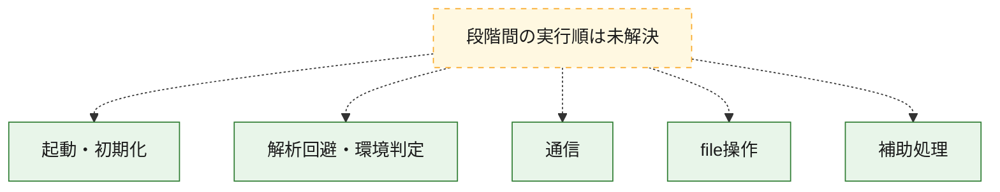
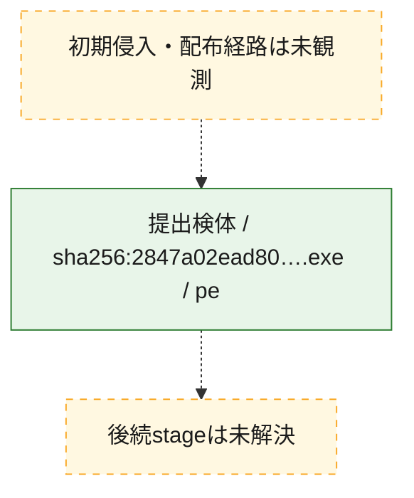
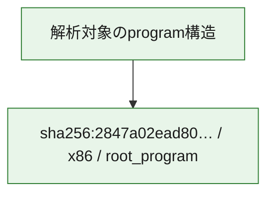

# 全体ロジック：2847a02ead80a60c25245bca169655b89fb2c724cb7bd7ec184860d94336b9c1

代表関数の静的証跡から、起動・初期化、解析回避・環境判定、通信、file操作の処理群を確認しました。

## 読み方

- phaseの掲載順は解析上の整理順です。observed_call_edgesがない段階間の実行順を断定しません。
- 図の実線は静的に観測した関係、点線と黄色のノードは未観測・未解決の関係を示します。
- 図は静的な要約であり、動的実行を再現するものではありません。
- 詳細な関数解説とfingerprintは[STATIC-LOGIC.md](STATIC-LOGIC.md)を参照してください。

## 静的可視化

### 実行フロー

### 感染チェーン

### モジュール関係

## 処理段階

### 1. 起動・初期化

entry pointから初期化と後続処理への移行を確認します。
確度: `confirmed_static_function_evidence`

- `2847a02ead80a60c25245bca169655b89fb2c724cb7bd7ec184860d94336b9c1:ghidra:1400013d0` — 初期化と主要処理への分岐を行う入口関数です。 状態: `succeeded`、選定理由: `entry_point`, `meaningful_symbol_name`, `reviewed_call_centrality:1`, `role:entrypoint`

### 2. 解析回避・環境判定

debugger、sandbox、仮想環境、時間差などの判定を確認します。
確度: `confirmed_static_function_evidence`

- `2847a02ead80a60c25245bca169655b89fb2c724cb7bd7ec184860d94336b9c1:ghidra:140001180` — debugger、仮想環境、sandbox、または時間差の確認に関係する関数です。 状態: `succeeded`、選定理由: `context_representative`, `reviewed_call_centrality:21`, `role:anti_analysis`

### 3. 通信

通信初期化、endpoint処理、送受信の役割を確認します。
確度: `confirmed_static_function_evidence`

- `2847a02ead80a60c25245bca169655b89fb2c724cb7bd7ec184860d94336b9c1:ghidra:1400016b0` — 通信初期化、送受信、またはendpoint処理に関係する関数です。 状態: `succeeded`、選定理由: `context_representative`, `reviewed_call_centrality:4`, `role:network_communication`

### 4. file操作

fileやdirectoryの作成、読書き、削除を確認します。
確度: `confirmed_static_function_evidence`

- `2847a02ead80a60c25245bca169655b89fb2c724cb7bd7ec184860d94336b9c1:ghidra:140001660` — fileまたはdirectoryの読書き・管理に関係する関数です。 状態: `succeeded`、選定理由: `context_representative`, `reviewed_call_centrality:7`, `role:file_operation`

### 5. 補助処理

主要処理を支える一般内部関数またはlibrary処理を確認します。
確度: `confirmed_static_function_evidence_with_limits`

- `2847a02ead80a60c25245bca169655b89fb2c724cb7bd7ec184860d94336b9c1:ghidra:140001000` — 検体内部の一般処理を実装する関数です。 状態: `succeeded`、選定理由: `context_representative`
- `2847a02ead80a60c25245bca169655b89fb2c724cb7bd7ec184860d94336b9c1:ghidra:140001010` — 検体内部の一般処理を実装する関数です。 状態: `succeeded`、選定理由: `context_representative`, `reviewed_call_centrality:6`
- `2847a02ead80a60c25245bca169655b89fb2c724cb7bd7ec184860d94336b9c1:ghidra:140001130` — 検体内部の一般処理を実装する関数です。 状態: `succeeded`、選定理由: `context_representative`, `reviewed_call_centrality:1`
- `2847a02ead80a60c25245bca169655b89fb2c724cb7bd7ec184860d94336b9c1:ghidra:1400013f0` — 検体内部の一般処理を実装する関数です。 状態: `succeeded`、選定理由: `context_representative`, `reviewed_call_centrality:1`
- `2847a02ead80a60c25245bca169655b89fb2c724cb7bd7ec184860d94336b9c1:ghidra:140001410` — 検体内部の一般処理を実装する関数です。 状態: `succeeded`、選定理由: `context_representative`, `reviewed_call_centrality:1`
- `2847a02ead80a60c25245bca169655b89fb2c724cb7bd7ec184860d94336b9c1:ghidra:140001430` — 検体内部の一般処理を実装する関数です。 状態: `succeeded`、選定理由: `context_representative`, `reviewed_call_centrality:1`
- `2847a02ead80a60c25245bca169655b89fb2c724cb7bd7ec184860d94336b9c1:ghidra:140001440` — 検体内部の一般処理を実装する関数です。 状態: `succeeded`、選定理由: `context_representative`
- `2847a02ead80a60c25245bca169655b89fb2c724cb7bd7ec184860d94336b9c1:ghidra:140001450` — 検体内部の一般処理を実装する関数です。 状態: `succeeded`、選定理由: `context_representative`
- `2847a02ead80a60c25245bca169655b89fb2c724cb7bd7ec184860d94336b9c1:ghidra:140001530` — 検体内部の一般処理を実装する関数です。 状態: `succeeded`、選定理由: `context_representative`
- `2847a02ead80a60c25245bca169655b89fb2c724cb7bd7ec184860d94336b9c1:ghidra:140001540` — 検体内部の一般処理を実装する関数です。 状態: `succeeded`、選定理由: `context_representative`, `reviewed_call_centrality:1`
- `2847a02ead80a60c25245bca169655b89fb2c724cb7bd7ec184860d94336b9c1:ghidra:1400015c0` — 検体内部の一般処理を実装する関数です。 状態: `succeeded`、選定理由: `context_representative`
- `2847a02ead80a60c25245bca169655b89fb2c724cb7bd7ec184860d94336b9c1:ghidra:1400015d0` — 検体内部の一般処理を実装する関数です。 状態: `limited_bad_instruction_or_flow`、選定理由: `context_representative`, `reviewed_call_centrality:3`
- `2847a02ead80a60c25245bca169655b89fb2c724cb7bd7ec184860d94336b9c1:ghidra:140001600` — 検体内部の一般処理を実装する関数です。 状態: `succeeded`、選定理由: `context_representative`, `reviewed_call_centrality:6`
- `2847a02ead80a60c25245bca169655b89fb2c724cb7bd7ec184860d94336b9c1:ghidra:1400016f0` — 検体内部の一般処理を実装する関数です。 状態: `succeeded`、選定理由: `context_representative`, `reviewed_call_centrality:2`
- `2847a02ead80a60c25245bca169655b89fb2c724cb7bd7ec184860d94336b9c1:ghidra:140001720` — 検体内部の一般処理を実装する関数です。 状態: `succeeded`、選定理由: `context_representative`, `reviewed_call_centrality:2`
- `2847a02ead80a60c25245bca169655b89fb2c724cb7bd7ec184860d94336b9c1:ghidra:140001750` — 検体内部の一般処理を実装する関数です。 状態: `succeeded`、選定理由: `context_representative`, `reviewed_call_centrality:2`
- `2847a02ead80a60c25245bca169655b89fb2c724cb7bd7ec184860d94336b9c1:ghidra:140001780` — 検体内部の一般処理を実装する関数です。 状態: `succeeded`、選定理由: `context_representative`, `reviewed_call_centrality:6`
- `2847a02ead80a60c25245bca169655b89fb2c724cb7bd7ec184860d94336b9c1:ghidra:140001800` — 検体内部の一般処理を実装する関数です。 状態: `succeeded`、選定理由: `context_representative`, `reviewed_call_centrality:1`
- `2847a02ead80a60c25245bca169655b89fb2c724cb7bd7ec184860d94336b9c1:ghidra:140001930` — 検体内部の一般処理を実装する関数です。 状態: `succeeded`、選定理由: `context_representative`, `reviewed_call_centrality:1`
- `2847a02ead80a60c25245bca169655b89fb2c724cb7bd7ec184860d94336b9c1:ghidra:1400019d0` — 検体内部の一般処理を実装する関数です。 状態: `succeeded`、選定理由: `context_representative`, `reviewed_call_centrality:3`
- `2847a02ead80a60c25245bca169655b89fb2c724cb7bd7ec184860d94336b9c1:ghidra:140001a70` — 検体内部の一般処理を実装する関数です。 状態: `succeeded`、選定理由: `context_representative`, `reviewed_call_centrality:2`
- `2847a02ead80a60c25245bca169655b89fb2c724cb7bd7ec184860d94336b9c1:ghidra:140001c50` — 検体内部の一般処理を実装する関数です。 状態: `succeeded`、選定理由: `context_representative`, `reviewed_call_centrality:7`
- `2847a02ead80a60c25245bca169655b89fb2c724cb7bd7ec184860d94336b9c1:ghidra:140001d20` — 検体内部の一般処理を実装する関数です。 状態: `succeeded`、選定理由: `context_representative`, `reviewed_call_centrality:2`
- `2847a02ead80a60c25245bca169655b89fb2c724cb7bd7ec184860d94336b9c1:ghidra:140001db0` — 検体内部の一般処理を実装する関数です。 状態: `succeeded`、選定理由: `context_representative`, `reviewed_call_centrality:1`
- `2847a02ead80a60c25245bca169655b89fb2c724cb7bd7ec184860d94336b9c1:ghidra:140001e10` — 検体内部の一般処理を実装する関数です。 状態: `succeeded`、選定理由: `context_representative`, `reviewed_call_centrality:10`
- `2847a02ead80a60c25245bca169655b89fb2c724cb7bd7ec184860d94336b9c1:ghidra:1400021c0` — 検体内部の一般処理を実装する関数です。 状態: `succeeded`、選定理由: `context_representative`, `reviewed_call_centrality:16`
- `2847a02ead80a60c25245bca169655b89fb2c724cb7bd7ec184860d94336b9c1:ghidra:14000d820` — compiler生成処理または汎用library処理とみられる関数です。 状態: `succeeded`、選定理由: `entry_point`, `meaningful_symbol_name`, `reviewed_call_centrality:1`
- `2847a02ead80a60c25245bca169655b89fb2c724cb7bd7ec184860d94336b9c1:ghidra:14000d850` — compiler生成処理または汎用library処理とみられる関数です。 状態: `succeeded`、選定理由: `entry_point`, `meaningful_symbol_name`, `reviewed_call_centrality:3`

## 観測したcall関係

- 代表関数間で直接解決できた呼出関係はありません。

## 解析範囲と制約

- 選定外関数は全体inventoryへ残しますが、関数本体の個別解説対象にはしていません。
- indirect call、難読化、packer、VM、壊れたcontrol flowによりcall関係が欠落する場合があります。
- 文書は静的解析に基づき、検体実行や外部通信による動的確認は行っていません。
