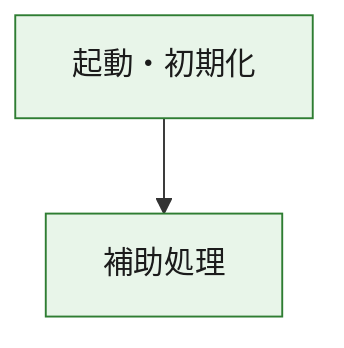
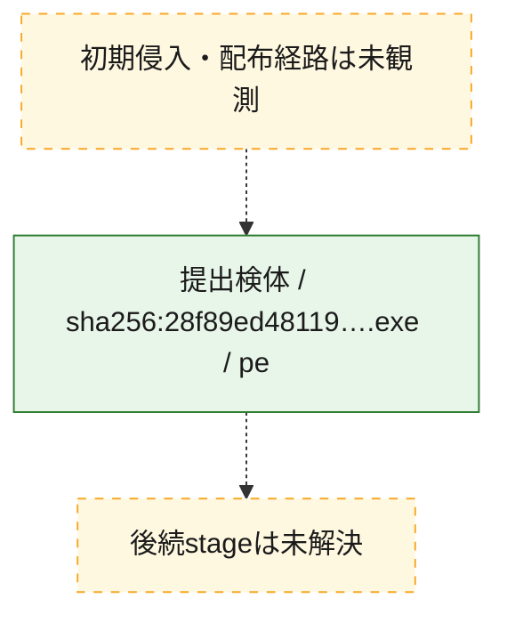
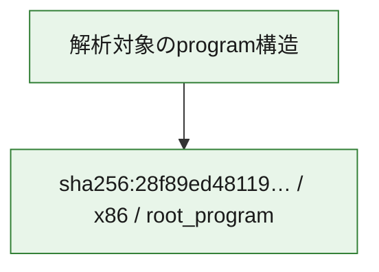

# 全体ロジック：28f89ed48119891e87c240e6238dec07c145fed79febe419d074b072e980c8bd

代表関数の静的証跡から、起動・初期化の処理群を確認しました。

## 読み方

- phaseの掲載順は解析上の整理順です。observed_call_edgesがない段階間の実行順を断定しません。
- 図の実線は静的に観測した関係、点線と黄色のノードは未観測・未解決の関係を示します。
- 図は静的な要約であり、動的実行を再現するものではありません。
- 詳細な関数解説とfingerprintは[STATIC-LOGIC.md](STATIC-LOGIC.md)を参照してください。

## 静的可視化

### 実行フロー

### 感染チェーン

### モジュール関係

## 処理段階

### 1. 起動・初期化

entry pointから初期化と後続処理への移行を確認します。
確度: `confirmed_static_function_evidence`

- `28f89ed48119891e87c240e6238dec07c145fed79febe419d074b072e980c8bd:ghidra:180001010` — 初期化と主要処理への分岐を行う入口関数です。 状態: `succeeded`、選定理由: `entry_point`, `meaningful_symbol_name`, `reviewed_call_centrality:22`, `role:entrypoint`, `small_program_complete_context`

### 2. 補助処理

主要処理を支える一般内部関数またはlibrary処理を確認します。
確度: `confirmed_static_function_evidence`

- `28f89ed48119891e87c240e6238dec07c145fed79febe419d074b072e980c8bd:ghidra:180001240` — 検体内部の一般処理を実装する関数です。 状態: `succeeded`、選定理由: `context_representative`, `reviewed_call_centrality:2`, `small_program_complete_context`
- `28f89ed48119891e87c240e6238dec07c145fed79febe419d074b072e980c8bd:ghidra:180001350` — 検体内部の一般処理を実装する関数です。 状態: `succeeded`、選定理由: `context_representative`, `reviewed_call_centrality:25`, `small_program_complete_context`
- `28f89ed48119891e87c240e6238dec07c145fed79febe419d074b072e980c8bd:ghidra:180003780` — 検体内部の一般処理を実装する関数です。 状態: `succeeded`、選定理由: `context_representative`, `reviewed_call_centrality:2`, `small_program_complete_context`
- `28f89ed48119891e87c240e6238dec07c145fed79febe419d074b072e980c8bd:ghidra:1800038e0` — 検体内部の一般処理を実装する関数です。 状態: `succeeded`、選定理由: `context_representative`, `reviewed_call_centrality:2`, `small_program_complete_context`

## 観測したcall関係

- `28f89ed48119891e87c240e6238dec07c145fed79febe419d074b072e980c8bd:ghidra:180001010` → `28f89ed48119891e87c240e6238dec07c145fed79febe419d074b072e980c8bd:ghidra:180001240` （`startup` → `support`）
- `28f89ed48119891e87c240e6238dec07c145fed79febe419d074b072e980c8bd:ghidra:180001010` → `28f89ed48119891e87c240e6238dec07c145fed79febe419d074b072e980c8bd:ghidra:180001350` （`startup` → `support`）
- `28f89ed48119891e87c240e6238dec07c145fed79febe419d074b072e980c8bd:ghidra:180001350` → `28f89ed48119891e87c240e6238dec07c145fed79febe419d074b072e980c8bd:ghidra:180001240` （`support` → `support`）
- `28f89ed48119891e87c240e6238dec07c145fed79febe419d074b072e980c8bd:ghidra:180001350` → `28f89ed48119891e87c240e6238dec07c145fed79febe419d074b072e980c8bd:ghidra:180003780` （`support` → `support`）
- `28f89ed48119891e87c240e6238dec07c145fed79febe419d074b072e980c8bd:ghidra:180001350` → `28f89ed48119891e87c240e6238dec07c145fed79febe419d074b072e980c8bd:ghidra:1800038e0` （`support` → `support`）
- `28f89ed48119891e87c240e6238dec07c145fed79febe419d074b072e980c8bd:ghidra:180003780` → `28f89ed48119891e87c240e6238dec07c145fed79febe419d074b072e980c8bd:ghidra:1800038e0` （`support` → `support`）
- `ghidra-function:17235972c0c00084fb97abd0` → `ghidra-function:4ef1fbf3381f13dbd206c217` （`unclassified` → `unclassified`）
- `ghidra-function:17235972c0c00084fb97abd0` → `ghidra-function:59a2f3769c98d258724f8aaf` （`unclassified` → `unclassified`）
- `ghidra-function:17235972c0c00084fb97abd0` → `ghidra-function:612c0f8f787933cfacf49f66` （`unclassified` → `unclassified`）
- `ghidra-function:17235972c0c00084fb97abd0` → `ghidra-function:7392241cb17319150ffa2bf8` （`unclassified` → `unclassified`）
- `ghidra-function:17235972c0c00084fb97abd0` → `ghidra-function:73ca71b798eaec09e45c86b2` （`unclassified` → `unclassified`）
- `ghidra-function:17235972c0c00084fb97abd0` → `ghidra-function:80e479687423dbf5a68874d9` （`unclassified` → `unclassified`）
- `ghidra-function:17235972c0c00084fb97abd0` → `ghidra-function:8592d7334106ff84287bcd18` （`unclassified` → `unclassified`）
- `ghidra-function:17235972c0c00084fb97abd0` → `ghidra-function:a8ef245c79e0ed2802e7915e` （`unclassified` → `unclassified`）
- `ghidra-function:17235972c0c00084fb97abd0` → `ghidra-function:b78d84d026691914226b462e` （`unclassified` → `unclassified`）
- `ghidra-function:17235972c0c00084fb97abd0` → `ghidra-function:cd58af01065bf6d9439f7cfe` （`unclassified` → `unclassified`）
- `ghidra-function:17235972c0c00084fb97abd0` → `ghidra-function:cec789965765fa3f1dfef106` （`unclassified` → `unclassified`）
- `ghidra-function:17235972c0c00084fb97abd0` → `ghidra-function:f4c0a9727672f549ed6b1bfd` （`unclassified` → `unclassified`）
- `ghidra-function:49b17da50f1ba794950f3fcc` → `ghidra-function:bfa42bcb8391a6ec7026588a` （`unclassified` → `unclassified`）
- `ghidra-function:4ef1fbf3381f13dbd206c217` → `ghidra-external:0d291bbe70ec5beb37f82c15` （`unclassified` → `unclassified`）
- `ghidra-function:4ef1fbf3381f13dbd206c217` → `ghidra-external:27d1b09841c509d63e931a96` （`unclassified` → `unclassified`）
- `ghidra-function:4ef1fbf3381f13dbd206c217` → `ghidra-external:2f25253efa9ac256e564c0d8` （`unclassified` → `unclassified`）
- `ghidra-function:4ef1fbf3381f13dbd206c217` → `ghidra-external:344293250056518ce26c5e3f` （`unclassified` → `unclassified`）
- `ghidra-function:4ef1fbf3381f13dbd206c217` → `ghidra-external:3a6296aebabf8df89a9965d1` （`unclassified` → `unclassified`）
- `ghidra-function:4ef1fbf3381f13dbd206c217` → `ghidra-external:5594fff5bdc56884dad11c47` （`unclassified` → `unclassified`）
- `ghidra-function:4ef1fbf3381f13dbd206c217` → `ghidra-external:5d5a9951422ecb35b4bb234b` （`unclassified` → `unclassified`）
- `ghidra-function:4ef1fbf3381f13dbd206c217` → `ghidra-external:62210f315d0ee098843758e5` （`unclassified` → `unclassified`）
- `ghidra-function:4ef1fbf3381f13dbd206c217` → `ghidra-external:6ae48cb1e2bc02129e01c5a3` （`unclassified` → `unclassified`）
- `ghidra-function:4ef1fbf3381f13dbd206c217` → `ghidra-external:83706cd829e5670104448687` （`unclassified` → `unclassified`）
- `ghidra-function:4ef1fbf3381f13dbd206c217` → `ghidra-external:87df8e4fd4d95e0ad356d0ab` （`unclassified` → `unclassified`）
- `ghidra-function:4ef1fbf3381f13dbd206c217` → `ghidra-external:881115c1d409b5d396fb8778` （`unclassified` → `unclassified`）
- `ghidra-function:4ef1fbf3381f13dbd206c217` → `ghidra-external:9d1c23e94e097efdb27ded17` （`unclassified` → `unclassified`）
- `ghidra-function:4ef1fbf3381f13dbd206c217` → `ghidra-external:a6bf8017e70aa123002383eb` （`unclassified` → `unclassified`）
- `ghidra-function:4ef1fbf3381f13dbd206c217` → `ghidra-external:a83ac516690f0eb9949f95b7` （`unclassified` → `unclassified`）
- `ghidra-function:4ef1fbf3381f13dbd206c217` → `ghidra-external:c7002ef8c49efa9955c066ab` （`unclassified` → `unclassified`）
- `ghidra-function:4ef1fbf3381f13dbd206c217` → `ghidra-external:cb3afacc3331485994428894` （`unclassified` → `unclassified`）
- `ghidra-function:4ef1fbf3381f13dbd206c217` → `ghidra-external:ccfba664776ab7d6e1525e82` （`unclassified` → `unclassified`）
- `ghidra-function:4ef1fbf3381f13dbd206c217` → `ghidra-external:e5d0481c60bbabcfce6d7ed4` （`unclassified` → `unclassified`）
- `ghidra-function:4ef1fbf3381f13dbd206c217` → `ghidra-external:e82642ed282742faa6d5c641` （`unclassified` → `unclassified`）
- `ghidra-function:4ef1fbf3381f13dbd206c217` → `ghidra-external:f512fc311468c850be1c25c5` （`unclassified` → `unclassified`）
- `ghidra-function:4ef1fbf3381f13dbd206c217` → `ghidra-function:49b17da50f1ba794950f3fcc` （`unclassified` → `unclassified`）
- `ghidra-function:4ef1fbf3381f13dbd206c217` → `ghidra-function:73ca71b798eaec09e45c86b2` （`unclassified` → `unclassified`）
- `ghidra-function:4ef1fbf3381f13dbd206c217` → `ghidra-function:bfa42bcb8391a6ec7026588a` （`unclassified` → `unclassified`）

## 解析範囲と制約

- 選定外関数は全体inventoryへ残しますが、関数本体の個別解説対象にはしていません。
- indirect call、難読化、packer、VM、壊れたcontrol flowによりcall関係が欠落する場合があります。
- 文書は静的解析に基づき、検体実行や外部通信による動的確認は行っていません。
