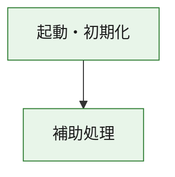
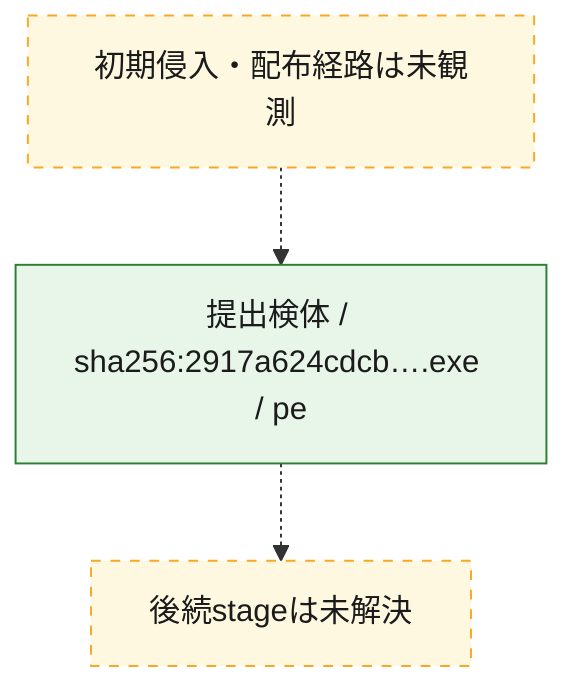
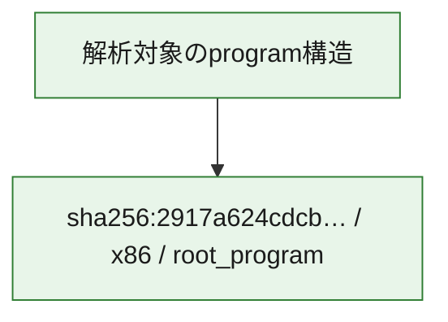

# 全体ロジック：2917a624cdcbf3d6fb2c3e9dd02ccc3f2760bcd36a074fc8a504c4cfa8f64d60

代表関数の静的証跡から、起動・初期化の処理群を確認しました。

## 読み方

- phaseの掲載順は解析上の整理順です。observed_call_edgesがない段階間の実行順を断定しません。
- 図の実線は静的に観測した関係、点線と黄色のノードは未観測・未解決の関係を示します。
- 図は静的な要約であり、動的実行を再現するものではありません。
- 詳細な関数解説とfingerprintは[STATIC-LOGIC.md](STATIC-LOGIC.md)を参照してください。

## 静的可視化

### 実行フロー

### 感染チェーン

### モジュール関係

## 処理段階

### 1. 起動・初期化

entry pointから初期化と後続処理への移行を確認します。
確度: `confirmed_static_function_evidence`

- `2917a624cdcbf3d6fb2c3e9dd02ccc3f2760bcd36a074fc8a504c4cfa8f64d60:ghidra:180001010` — 初期化と主要処理への分岐を行う入口関数です。 状態: `succeeded`、選定理由: `entry_point`, `meaningful_symbol_name`, `reviewed_call_centrality:22`, `role:entrypoint`, `small_program_complete_context`

### 2. 補助処理

主要処理を支える一般内部関数またはlibrary処理を確認します。
確度: `confirmed_static_function_evidence`

- `2917a624cdcbf3d6fb2c3e9dd02ccc3f2760bcd36a074fc8a504c4cfa8f64d60:ghidra:180001240` — 検体内部の一般処理を実装する関数です。 状態: `succeeded`、選定理由: `context_representative`, `reviewed_call_centrality:2`, `small_program_complete_context`
- `2917a624cdcbf3d6fb2c3e9dd02ccc3f2760bcd36a074fc8a504c4cfa8f64d60:ghidra:180001350` — 検体内部の一般処理を実装する関数です。 状態: `succeeded`、選定理由: `context_representative`, `reviewed_call_centrality:25`, `small_program_complete_context`
- `2917a624cdcbf3d6fb2c3e9dd02ccc3f2760bcd36a074fc8a504c4cfa8f64d60:ghidra:180003780` — 検体内部の一般処理を実装する関数です。 状態: `succeeded`、選定理由: `context_representative`, `reviewed_call_centrality:2`, `small_program_complete_context`
- `2917a624cdcbf3d6fb2c3e9dd02ccc3f2760bcd36a074fc8a504c4cfa8f64d60:ghidra:1800038e0` — 検体内部の一般処理を実装する関数です。 状態: `succeeded`、選定理由: `context_representative`, `reviewed_call_centrality:2`, `small_program_complete_context`

## 観測したcall関係

- `2917a624cdcbf3d6fb2c3e9dd02ccc3f2760bcd36a074fc8a504c4cfa8f64d60:ghidra:180001010` → `2917a624cdcbf3d6fb2c3e9dd02ccc3f2760bcd36a074fc8a504c4cfa8f64d60:ghidra:180001240` （`startup` → `support`）
- `2917a624cdcbf3d6fb2c3e9dd02ccc3f2760bcd36a074fc8a504c4cfa8f64d60:ghidra:180001010` → `2917a624cdcbf3d6fb2c3e9dd02ccc3f2760bcd36a074fc8a504c4cfa8f64d60:ghidra:180001350` （`startup` → `support`）
- `2917a624cdcbf3d6fb2c3e9dd02ccc3f2760bcd36a074fc8a504c4cfa8f64d60:ghidra:180001350` → `2917a624cdcbf3d6fb2c3e9dd02ccc3f2760bcd36a074fc8a504c4cfa8f64d60:ghidra:180001240` （`support` → `support`）
- `2917a624cdcbf3d6fb2c3e9dd02ccc3f2760bcd36a074fc8a504c4cfa8f64d60:ghidra:180001350` → `2917a624cdcbf3d6fb2c3e9dd02ccc3f2760bcd36a074fc8a504c4cfa8f64d60:ghidra:180003780` （`support` → `support`）
- `2917a624cdcbf3d6fb2c3e9dd02ccc3f2760bcd36a074fc8a504c4cfa8f64d60:ghidra:180001350` → `2917a624cdcbf3d6fb2c3e9dd02ccc3f2760bcd36a074fc8a504c4cfa8f64d60:ghidra:1800038e0` （`support` → `support`）
- `2917a624cdcbf3d6fb2c3e9dd02ccc3f2760bcd36a074fc8a504c4cfa8f64d60:ghidra:180003780` → `2917a624cdcbf3d6fb2c3e9dd02ccc3f2760bcd36a074fc8a504c4cfa8f64d60:ghidra:1800038e0` （`support` → `support`）
- `ghidra-function:7c056ddc4c849ed3d1990e38` → `ghidra-function:6c396ebe0066b1b0d06a1d9d` （`unclassified` → `unclassified`）
- `ghidra-function:a7a9d2258ff90fddf01c91ab` → `ghidra-external:02e32594da7acfe1d0c0b856` （`unclassified` → `unclassified`）
- `ghidra-function:a7a9d2258ff90fddf01c91ab` → `ghidra-external:0f11baab8cc2f29d92b4b548` （`unclassified` → `unclassified`）
- `ghidra-function:a7a9d2258ff90fddf01c91ab` → `ghidra-external:1dfda69cdf5a8a0b58fcf055` （`unclassified` → `unclassified`）
- `ghidra-function:a7a9d2258ff90fddf01c91ab` → `ghidra-external:287bb193dfba277fcaaec986` （`unclassified` → `unclassified`）
- `ghidra-function:a7a9d2258ff90fddf01c91ab` → `ghidra-external:311813f52b4036d29ffbdd33` （`unclassified` → `unclassified`）
- `ghidra-function:a7a9d2258ff90fddf01c91ab` → `ghidra-external:397de74b130c009f3757f1b9` （`unclassified` → `unclassified`）
- `ghidra-function:a7a9d2258ff90fddf01c91ab` → `ghidra-external:41ac21d65df579b51225d910` （`unclassified` → `unclassified`）
- `ghidra-function:a7a9d2258ff90fddf01c91ab` → `ghidra-external:5c06551e0823fc317b6e7bf1` （`unclassified` → `unclassified`）
- `ghidra-function:a7a9d2258ff90fddf01c91ab` → `ghidra-external:70c12e444383e5b656fd05cb` （`unclassified` → `unclassified`）
- `ghidra-function:a7a9d2258ff90fddf01c91ab` → `ghidra-external:74f8d62d3f9d3bc0c9a40335` （`unclassified` → `unclassified`）
- `ghidra-function:a7a9d2258ff90fddf01c91ab` → `ghidra-external:78db61b742ebd4df28991fbe` （`unclassified` → `unclassified`）
- `ghidra-function:a7a9d2258ff90fddf01c91ab` → `ghidra-external:83911bc436b12a3e11973593` （`unclassified` → `unclassified`）
- `ghidra-function:a7a9d2258ff90fddf01c91ab` → `ghidra-external:97773b6290bd941bf39c1d58` （`unclassified` → `unclassified`）
- `ghidra-function:a7a9d2258ff90fddf01c91ab` → `ghidra-external:980d23ce4e1c1e89a9a8df6f` （`unclassified` → `unclassified`）
- `ghidra-function:a7a9d2258ff90fddf01c91ab` → `ghidra-external:b3e55dd3a2f7e400238031ce` （`unclassified` → `unclassified`）
- `ghidra-function:a7a9d2258ff90fddf01c91ab` → `ghidra-external:d4a7fd7d2cdece6148b02da4` （`unclassified` → `unclassified`）
- `ghidra-function:a7a9d2258ff90fddf01c91ab` → `ghidra-external:e3fc5363c7685f2803867ff1` （`unclassified` → `unclassified`）
- `ghidra-function:a7a9d2258ff90fddf01c91ab` → `ghidra-external:e8fb8c46ce3213e5e00e7455` （`unclassified` → `unclassified`）
- `ghidra-function:a7a9d2258ff90fddf01c91ab` → `ghidra-external:efe6517f1d1375cfeb30da8d` （`unclassified` → `unclassified`）
- `ghidra-function:a7a9d2258ff90fddf01c91ab` → `ghidra-external:f9833f65344d3717552007b0` （`unclassified` → `unclassified`）
- `ghidra-function:a7a9d2258ff90fddf01c91ab` → `ghidra-external:fb99267537d179ff9429dac0` （`unclassified` → `unclassified`）
- `ghidra-function:a7a9d2258ff90fddf01c91ab` → `ghidra-function:6c396ebe0066b1b0d06a1d9d` （`unclassified` → `unclassified`）
- `ghidra-function:a7a9d2258ff90fddf01c91ab` → `ghidra-function:7c056ddc4c849ed3d1990e38` （`unclassified` → `unclassified`）
- `ghidra-function:a7a9d2258ff90fddf01c91ab` → `ghidra-function:c365049486a8972d68e19696` （`unclassified` → `unclassified`）
- `ghidra-function:c5dbd5b4dbdc96a534902160` → `ghidra-function:413d1300cfcfd933b84d789c` （`unclassified` → `unclassified`）
- `ghidra-function:c5dbd5b4dbdc96a534902160` → `ghidra-function:436c15f33e9133023a36bebe` （`unclassified` → `unclassified`）
- `ghidra-function:c5dbd5b4dbdc96a534902160` → `ghidra-function:6f4e1bd2198454719f99ab88` （`unclassified` → `unclassified`）
- `ghidra-function:c5dbd5b4dbdc96a534902160` → `ghidra-function:873c4cb9ddc2be7b6f671c82` （`unclassified` → `unclassified`）
- `ghidra-function:c5dbd5b4dbdc96a534902160` → `ghidra-function:9361d893915d88fe003ca3a9` （`unclassified` → `unclassified`）
- `ghidra-function:c5dbd5b4dbdc96a534902160` → `ghidra-function:a7a9d2258ff90fddf01c91ab` （`unclassified` → `unclassified`）
- `ghidra-function:c5dbd5b4dbdc96a534902160` → `ghidra-function:c365049486a8972d68e19696` （`unclassified` → `unclassified`）
- `ghidra-function:c5dbd5b4dbdc96a534902160` → `ghidra-function:c448f37cd072516eddb0df4c` （`unclassified` → `unclassified`）
- `ghidra-function:c5dbd5b4dbdc96a534902160` → `ghidra-function:c70483c1ba89468ddab80cfd` （`unclassified` → `unclassified`）
- `ghidra-function:c5dbd5b4dbdc96a534902160` → `ghidra-function:d81fdf976d58d198b2364ce1` （`unclassified` → `unclassified`）
- `ghidra-function:c5dbd5b4dbdc96a534902160` → `ghidra-function:d96d4f061fcb91c8a63897b3` （`unclassified` → `unclassified`）
- `ghidra-function:c5dbd5b4dbdc96a534902160` → `ghidra-function:db3e942c4a26c3e958af2082` （`unclassified` → `unclassified`）

## 解析範囲と制約

- 選定外関数は全体inventoryへ残しますが、関数本体の個別解説対象にはしていません。
- indirect call、難読化、packer、VM、壊れたcontrol flowによりcall関係が欠落する場合があります。
- 文書は静的解析に基づき、検体実行や外部通信による動的確認は行っていません。
