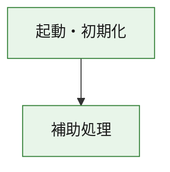
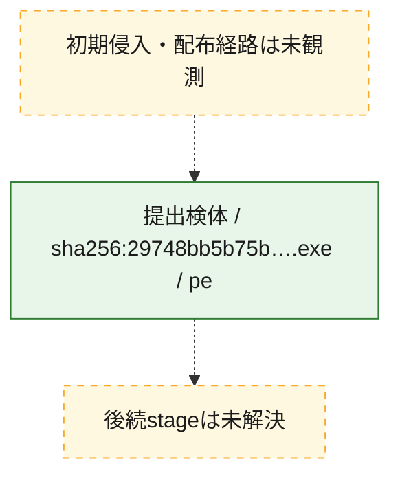
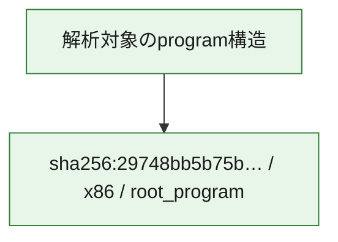

# 全体ロジック：29748bb5b75bf5aa71c320c0d6bb092b1a22559a7f88c04ab83a9698a819789f

代表関数の静的証跡から、起動・初期化の処理群を確認しました。

## 読み方

- phaseの掲載順は解析上の整理順です。observed_call_edgesがない段階間の実行順を断定しません。
- 図の実線は静的に観測した関係、点線と黄色のノードは未観測・未解決の関係を示します。
- 図は静的な要約であり、動的実行を再現するものではありません。
- 詳細な関数解説とfingerprintは[STATIC-LOGIC.md](STATIC-LOGIC.md)を参照してください。

## 静的可視化

### 実行フロー

### 感染チェーン

### モジュール関係

## 処理段階

### 1. 起動・初期化

entry pointから初期化と後続処理への移行を確認します。
確度: `confirmed_static_function_evidence`

- `29748bb5b75bf5aa71c320c0d6bb092b1a22559a7f88c04ab83a9698a819789f:ghidra:180001010` — 初期化と主要処理への分岐を行う入口関数です。 状態: `succeeded`、選定理由: `entry_point`, `meaningful_symbol_name`, `reviewed_call_centrality:22`, `role:entrypoint`, `small_program_complete_context`

### 2. 補助処理

主要処理を支える一般内部関数またはlibrary処理を確認します。
確度: `confirmed_static_function_evidence`

- `29748bb5b75bf5aa71c320c0d6bb092b1a22559a7f88c04ab83a9698a819789f:ghidra:180001240` — 検体内部の一般処理を実装する関数です。 状態: `succeeded`、選定理由: `context_representative`, `reviewed_call_centrality:2`, `small_program_complete_context`
- `29748bb5b75bf5aa71c320c0d6bb092b1a22559a7f88c04ab83a9698a819789f:ghidra:180001350` — 検体内部の一般処理を実装する関数です。 状態: `succeeded`、選定理由: `context_representative`, `reviewed_call_centrality:25`, `small_program_complete_context`
- `29748bb5b75bf5aa71c320c0d6bb092b1a22559a7f88c04ab83a9698a819789f:ghidra:180003780` — 検体内部の一般処理を実装する関数です。 状態: `succeeded`、選定理由: `context_representative`, `reviewed_call_centrality:2`, `small_program_complete_context`
- `29748bb5b75bf5aa71c320c0d6bb092b1a22559a7f88c04ab83a9698a819789f:ghidra:1800038e0` — 検体内部の一般処理を実装する関数です。 状態: `succeeded`、選定理由: `context_representative`, `reviewed_call_centrality:2`, `small_program_complete_context`

## 観測したcall関係

- `29748bb5b75bf5aa71c320c0d6bb092b1a22559a7f88c04ab83a9698a819789f:ghidra:180001010` → `29748bb5b75bf5aa71c320c0d6bb092b1a22559a7f88c04ab83a9698a819789f:ghidra:180001240` （`startup` → `support`）
- `29748bb5b75bf5aa71c320c0d6bb092b1a22559a7f88c04ab83a9698a819789f:ghidra:180001010` → `29748bb5b75bf5aa71c320c0d6bb092b1a22559a7f88c04ab83a9698a819789f:ghidra:180001350` （`startup` → `support`）
- `29748bb5b75bf5aa71c320c0d6bb092b1a22559a7f88c04ab83a9698a819789f:ghidra:180001350` → `29748bb5b75bf5aa71c320c0d6bb092b1a22559a7f88c04ab83a9698a819789f:ghidra:180001240` （`support` → `support`）
- `29748bb5b75bf5aa71c320c0d6bb092b1a22559a7f88c04ab83a9698a819789f:ghidra:180001350` → `29748bb5b75bf5aa71c320c0d6bb092b1a22559a7f88c04ab83a9698a819789f:ghidra:180003780` （`support` → `support`）
- `29748bb5b75bf5aa71c320c0d6bb092b1a22559a7f88c04ab83a9698a819789f:ghidra:180001350` → `29748bb5b75bf5aa71c320c0d6bb092b1a22559a7f88c04ab83a9698a819789f:ghidra:1800038e0` （`support` → `support`）
- `29748bb5b75bf5aa71c320c0d6bb092b1a22559a7f88c04ab83a9698a819789f:ghidra:180003780` → `29748bb5b75bf5aa71c320c0d6bb092b1a22559a7f88c04ab83a9698a819789f:ghidra:1800038e0` （`support` → `support`）
- `ghidra-function:2960d5f28e3261d49cb4cd4e` → `ghidra-external:0404a97a03635c184ba95cbc` （`unclassified` → `unclassified`）
- `ghidra-function:2960d5f28e3261d49cb4cd4e` → `ghidra-external:10b5a4fa4b1c35e3606150d2` （`unclassified` → `unclassified`）
- `ghidra-function:2960d5f28e3261d49cb4cd4e` → `ghidra-external:174ea2bcec43503d0af1728d` （`unclassified` → `unclassified`）
- `ghidra-function:2960d5f28e3261d49cb4cd4e` → `ghidra-external:1ceffd01ea57f44f9a3588f4` （`unclassified` → `unclassified`）
- `ghidra-function:2960d5f28e3261d49cb4cd4e` → `ghidra-external:2b6a81f285fe54933a6029a2` （`unclassified` → `unclassified`）
- `ghidra-function:2960d5f28e3261d49cb4cd4e` → `ghidra-external:3069d9dec1832353b3facfb7` （`unclassified` → `unclassified`）
- `ghidra-function:2960d5f28e3261d49cb4cd4e` → `ghidra-external:481d5552fedc057227c98c1f` （`unclassified` → `unclassified`）
- `ghidra-function:2960d5f28e3261d49cb4cd4e` → `ghidra-external:5794d5ccfeafb7e83446c5c7` （`unclassified` → `unclassified`）
- `ghidra-function:2960d5f28e3261d49cb4cd4e` → `ghidra-external:59bc3ef6b1a069e2e3b250fc` （`unclassified` → `unclassified`）
- `ghidra-function:2960d5f28e3261d49cb4cd4e` → `ghidra-external:5f84098e38d1dbbc9a87de4c` （`unclassified` → `unclassified`）
- `ghidra-function:2960d5f28e3261d49cb4cd4e` → `ghidra-external:7448a6ccd15bbe3ff080eb0a` （`unclassified` → `unclassified`）
- `ghidra-function:2960d5f28e3261d49cb4cd4e` → `ghidra-external:7717038010d2810486f09d34` （`unclassified` → `unclassified`）
- `ghidra-function:2960d5f28e3261d49cb4cd4e` → `ghidra-external:7e0200c545489b71b688b81d` （`unclassified` → `unclassified`）
- `ghidra-function:2960d5f28e3261d49cb4cd4e` → `ghidra-external:82caf958526ceb87d2e0127a` （`unclassified` → `unclassified`）
- `ghidra-function:2960d5f28e3261d49cb4cd4e` → `ghidra-external:859f1cc9222e1dda35f1d368` （`unclassified` → `unclassified`）
- `ghidra-function:2960d5f28e3261d49cb4cd4e` → `ghidra-external:888dc4969b1cab5d071c7fb2` （`unclassified` → `unclassified`）
- `ghidra-function:2960d5f28e3261d49cb4cd4e` → `ghidra-external:beca94c4c918894030240a73` （`unclassified` → `unclassified`）
- `ghidra-function:2960d5f28e3261d49cb4cd4e` → `ghidra-external:c325c42fc499f162914af091` （`unclassified` → `unclassified`）
- `ghidra-function:2960d5f28e3261d49cb4cd4e` → `ghidra-external:c697de4097f03d708df18f35` （`unclassified` → `unclassified`）
- `ghidra-function:2960d5f28e3261d49cb4cd4e` → `ghidra-external:e2792f4f65133de804da951d` （`unclassified` → `unclassified`）
- `ghidra-function:2960d5f28e3261d49cb4cd4e` → `ghidra-external:f93b4493a90e85c10c96f167` （`unclassified` → `unclassified`）
- `ghidra-function:2960d5f28e3261d49cb4cd4e` → `ghidra-function:40c865bf139d448a53652876` （`unclassified` → `unclassified`）
- `ghidra-function:2960d5f28e3261d49cb4cd4e` → `ghidra-function:635632dc44e3e04e14b654b9` （`unclassified` → `unclassified`）
- `ghidra-function:2960d5f28e3261d49cb4cd4e` → `ghidra-function:9690a1ed54eaa0253c85b04d` （`unclassified` → `unclassified`）
- `ghidra-function:635632dc44e3e04e14b654b9` → `ghidra-function:9690a1ed54eaa0253c85b04d` （`unclassified` → `unclassified`）
- `ghidra-function:b44738b06e0090f6a3e58507` → `ghidra-function:022f2513ac6366c15c26d6e5` （`unclassified` → `unclassified`）
- `ghidra-function:b44738b06e0090f6a3e58507` → `ghidra-function:1332a8239bbd81b1f15ea507` （`unclassified` → `unclassified`）
- `ghidra-function:b44738b06e0090f6a3e58507` → `ghidra-function:26f08036f6c138eaf46e5068` （`unclassified` → `unclassified`）
- `ghidra-function:b44738b06e0090f6a3e58507` → `ghidra-function:2960d5f28e3261d49cb4cd4e` （`unclassified` → `unclassified`）
- `ghidra-function:b44738b06e0090f6a3e58507` → `ghidra-function:40c865bf139d448a53652876` （`unclassified` → `unclassified`）
- `ghidra-function:b44738b06e0090f6a3e58507` → `ghidra-function:41adf23f5b134b53805bfbf7` （`unclassified` → `unclassified`）
- `ghidra-function:b44738b06e0090f6a3e58507` → `ghidra-function:4b3c47a3bc00196252bfd9f3` （`unclassified` → `unclassified`）
- `ghidra-function:b44738b06e0090f6a3e58507` → `ghidra-function:539252d2a11e3a93f46cd348` （`unclassified` → `unclassified`）
- `ghidra-function:b44738b06e0090f6a3e58507` → `ghidra-function:59da778a4c350c3ec79f3a26` （`unclassified` → `unclassified`）
- `ghidra-function:b44738b06e0090f6a3e58507` → `ghidra-function:8b9651fddbdfc27ab5fcb40c` （`unclassified` → `unclassified`）
- `ghidra-function:b44738b06e0090f6a3e58507` → `ghidra-function:925a9cc682956862885f6a63` （`unclassified` → `unclassified`）
- `ghidra-function:b44738b06e0090f6a3e58507` → `ghidra-function:ca50ae8e25e189485a04d1c4` （`unclassified` → `unclassified`）

## 解析範囲と制約

- 選定外関数は全体inventoryへ残しますが、関数本体の個別解説対象にはしていません。
- indirect call、難読化、packer、VM、壊れたcontrol flowによりcall関係が欠落する場合があります。
- 文書は静的解析に基づき、検体実行や外部通信による動的確認は行っていません。
