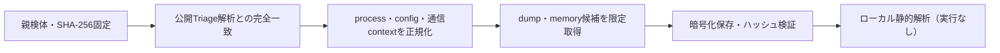

# Triage公開解析・後段取得証跡

## 完全ハッシュ一致

- [260916-czcg2svdrc](https://tria.ge/260916-czcg2svdrc): ファミリー候補 `dcrat`、評価score `10`

## プロセス・通信

- 観測process: `3D3CD76AF796D40252459D4D8C75B37D.exe, Idle.exe, SppExtComObj.exe, System.exe, WScript.exe, cmd.exe, dwm.exe, explorer.exe, lsass.exe, schtasks.exe, smartscreen.exe, spoolsv.exe, surrogatedriverinto.exe, w32tm.exe, wininit.exe`
- raw commandは保存せず、command SHA-256と処理patternだけをJSONへ保持します。
- sandbox background trafficは`context_only`であり、C2へ自動昇格しません。

- 取得できませんでした。

## 後段取得物

- `35a16c7c1a8ce0706c29c7991b7e1f5df9c6d99f17ebb248770fc4e59997f61c` / `memory_image` / 876544 bytes / 親と同一: `false` / 静的解析: `partial`

## 判定境界

Triage由来のfamily、process、config、通信は外部sandbox証跡です。Config extractorが返したendpointはC2候補として扱いますが、静的設定復元またはprocess帰属とprotocol応答が揃うまでは確認済みC2とはしません。取得成果物と検体は実行していません。
