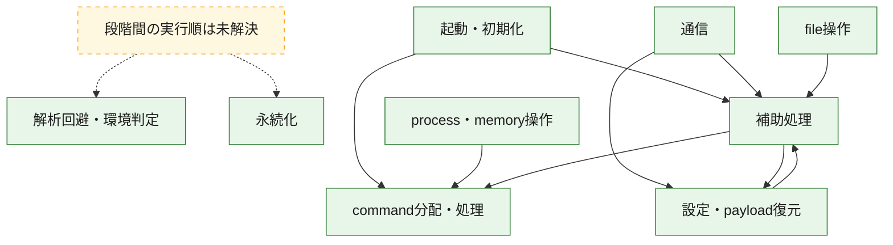

# 全体ロジック：2b39222023f4e8338281a684193da4b39a4772b143e780c345255da581b36647

代表関数の静的証跡から、起動・初期化、設定・payload復元、解析回避・環境判定、永続化、process・memory操作、通信、command分配・処理、file操作の処理群を確認しました。

## 読み方

- phaseの掲載順は解析上の整理順です。observed_call_edgesがない段階間の実行順を断定しません。
- 図の実線は静的に観測した関係、点線と黄色のノードは未観測・未解決の関係を示します。
- 図は静的な要約であり、動的実行を再現するものではありません。
- 詳細な関数解説とfingerprintは[STATIC-LOGIC.md](STATIC-LOGIC.md)を参照してください。

## 静的可視化

### 実行フロー

### 感染チェーン

```mermaid
flowchart TD
  chain_initial["初期侵入・配布経路は未観測"]
  chain_01["提出検体 / sha256:2b39222023f4….exe / pe"]
  chain_02["静的復元層 1 / sha256:2b39222023f4….exe::dotnet-bundle-assembly / pe"]
  chain_03["静的復元層 1 / sha256:2b39222023f4….exe::dotnet-bundle-assembly / pe"]
  chain_04["静的復元層 1 / sha256:2b39222023f4….exe::dotnet-bundle-assembly / pe"]
  chain_05["静的復元層 1 / sha256:2b39222023f4….exe::dotnet-bundle-assembly / pe"]
  chain_06["静的復元層 1 / sha256:2b39222023f4….exe::dotnet-bundle-assembly / pe"]
  chain_07["静的復元層 1 / sha256:2b39222023f4….exe::dotnet-bundle-assembly / pe"]
  chain_08["静的復元層 1 / sha256:2b39222023f4….exe::dotnet-bundle-assembly / pe"]
  chain_09["静的復元層 1 / sha256:2b39222023f4….exe::dotnet-bundle-assembly / pe"]
  chain_10["静的復元層 1 / sha256:2b39222023f4….exe::dotnet-bundle-assembly / pe"]
  chain_11["静的復元層 1 / sha256:2b39222023f4….exe::dotnet-bundle-assembly / pe"]
  chain_12["静的復元層 1 / sha256:2b39222023f4….exe::dotnet-bundle-assembly / pe"]
  chain_13["静的復元層 1 / sha256:2b39222023f4….exe::dotnet-bundle-assembly / pe"]
  chain_14["静的復元層 1 / sha256:2b39222023f4….exe::dotnet-bundle-assembly / pe"]
  chain_15["静的復元層 1 / sha256:2b39222023f4….exe::dotnet-bundle-assembly / pe"]
  chain_16["静的復元層 1 / sha256:2b39222023f4….exe::dotnet-bundle-assembly / pe"]
  chain_01 -->|dotnet-bundle-assembly| chain_02
  chain_01 -->|dotnet-bundle-assembly| chain_03
  chain_01 -->|dotnet-bundle-assembly| chain_04
  chain_01 -->|dotnet-bundle-assembly| chain_05
  chain_01 -->|dotnet-bundle-assembly| chain_06
  chain_01 -->|dotnet-bundle-assembly| chain_07
  chain_01 -->|dotnet-bundle-assembly| chain_08
  chain_01 -->|dotnet-bundle-assembly| chain_09
  chain_01 -->|dotnet-bundle-assembly| chain_10
  chain_01 -->|dotnet-bundle-assembly| chain_11
  chain_01 -->|dotnet-bundle-assembly| chain_12
  chain_01 -->|dotnet-bundle-assembly| chain_13
  chain_01 -->|dotnet-bundle-assembly| chain_14
  chain_01 -->|dotnet-bundle-assembly| chain_15
  chain_01 -->|dotnet-bundle-assembly| chain_16
  chain_initial -.-> chain_01
  chain_more["その他86層はstatic-layers.jsonを参照"]
  chain_02 -.-> chain_more
  chain_03 -.-> chain_more
  chain_04 -.-> chain_more
  chain_05 -.-> chain_more
  chain_06 -.-> chain_more
  chain_07 -.-> chain_more
  chain_08 -.-> chain_more
  chain_09 -.-> chain_more
  chain_10 -.-> chain_more
  chain_11 -.-> chain_more
  chain_12 -.-> chain_more
  chain_13 -.-> chain_more
  chain_14 -.-> chain_more
  chain_15 -.-> chain_more
  chain_16 -.-> chain_more
  class chain_more unresolved
  class chain_01,chain_02,chain_03,chain_04,chain_05,chain_06,chain_07,chain_08,chain_09,chain_10,chain_11,chain_12,chain_13,chain_14,chain_15,chain_16 confirmed
  class chain_initial unresolved
  classDef confirmed fill:#e8f5e9,stroke:#2e7d32,color:#1b1b1b
  classDef unresolved fill:#fff8e1,stroke:#f9a825,color:#1b1b1b,stroke-dasharray:5 5
```

### モジュール関係

```mermaid
flowchart TD
  module_scope["解析対象のprogram構造"]
  module_01["sha256:4bfc11bebae2… / x86 / statically_recovered_program"]
  module_02["sha256:7efc8dfef954… / x86 / statically_recovered_program"]
  module_03["sha256:9645242a547b… / x86 / statically_recovered_program"]
  module_04["sha256:fd4f0bc05412… / x86 / statically_recovered_program"]
  module_05["sha256:36447d0e4c9c… / x86 / statically_recovered_program"]
  module_06["sha256:5dc6a7838a0b… / x86 / statically_recovered_program"]
  module_07["sha256:6bf2b62e83f4… / x86 / statically_recovered_program"]
  module_08["sha256:aa87020c8371… / x86 / statically_recovered_program"]
  module_09["sha256:07ee7d2780a7… / x86 / statically_recovered_program"]
  module_10["sha256:1d619955d749… / x86 / statically_recovered_program"]
  module_11["sha256:44b71cb2bc82… / x86 / statically_recovered_program"]
  module_12["sha256:6beaf983fa8c… / x86 / statically_recovered_program"]
  module_parent_unknown["復元元・親moduleは未特定"]
  module_parent_unknown -.-> module_01
  module_parent_unknown -.-> module_02
  module_parent_unknown -.-> module_03
  module_parent_unknown -.-> module_04
  module_parent_unknown -.-> module_05
  module_parent_unknown -.-> module_06
  module_parent_unknown -.-> module_07
  module_parent_unknown -.-> module_08
  module_parent_unknown -.-> module_09
  module_parent_unknown -.-> module_10
  module_parent_unknown -.-> module_11
  module_parent_unknown -.-> module_12
  class module_parent_unknown unresolved
  module_more["その他84moduleはstatic-logic.jsonを参照"]
  module_scope -.-> module_more
  class module_more unresolved
  class module_scope confirmed
  class module_01,module_02,module_03,module_04,module_05,module_06,module_07,module_08,module_09,module_10,module_11,module_12 confirmed
  classDef confirmed fill:#e8f5e9,stroke:#2e7d32,color:#1b1b1b
  classDef unresolved fill:#fff8e1,stroke:#f9a825,color:#1b1b1b,stroke-dasharray:5 5
```

## 処理段階

### 1. 起動・初期化

entry pointから初期化と後続処理への移行を確認します。
確度: `confirmed_static_function_evidence`

- `61702e1173c49f32e7b1804667a249f8709680f01859d46cf30e74197fedc1c5:cil:0x06000065` — 初期化と主要処理への分岐を行う入口関数です。 状態: `succeeded`、選定理由: `entry_point`, `reviewed_call_centrality:6`
- `61702e1173c49f32e7b1804667a249f8709680f01859d46cf30e74197fedc1c5:cil:0x060000e6` — 初期化と主要処理への分岐を行う入口関数です。 状態: `succeeded`、選定理由: `entry_point`, `reviewed_call_centrality:8`
- `8cf296b4868c0dea441c452c50ed5c322837bf736a7c173f46dda4ebdfeb4c0b:cil:0x060000d5` — 初期化と主要処理への分岐を行う入口関数です。 状態: `succeeded`、選定理由: `entry_point`, `reviewed_call_centrality:8`
- `b9efe47b707862f98b68ad49a51e6637a9b3d1edc378690e56f35f5efdc57f72:cil:0x060000c4` — 初期化と主要処理への分岐を行う入口関数です。 状態: `succeeded`、選定理由: `entry_point`, `reviewed_call_centrality:6`
- `b9efe47b707862f98b68ad49a51e6637a9b3d1edc378690e56f35f5efdc57f72:cil:0x060000c7` — 初期化と主要処理への分岐を行う入口関数です。 状態: `succeeded`、選定理由: `entry_point`, `reviewed_call_centrality:6`
- `b9efe47b707862f98b68ad49a51e6637a9b3d1edc378690e56f35f5efdc57f72:cil:0x060000c8` — 初期化と主要処理への分岐を行う入口関数です。 状態: `succeeded`、選定理由: `entry_point`, `reviewed_call_centrality:2`
- `b9efe47b707862f98b68ad49a51e6637a9b3d1edc378690e56f35f5efdc57f72:cil:0x06000152` — 初期化と主要処理への分岐を行う入口関数です。 状態: `succeeded`、選定理由: `entry_point`, `reviewed_call_centrality:4`
- `b9efe47b707862f98b68ad49a51e6637a9b3d1edc378690e56f35f5efdc57f72:cil:0x06000153` — 初期化と主要処理への分岐を行う入口関数です。 状態: `succeeded`、選定理由: `entry_point`, `large_function:instructions=1594`, `reviewed_call_centrality:194`
- `b9efe47b707862f98b68ad49a51e6637a9b3d1edc378690e56f35f5efdc57f72:cil:0x06000154` — 初期化と主要処理への分岐を行う入口関数です。 状態: `succeeded`、選定理由: `entry_point`, `reviewed_call_centrality:2`
- `569667e92dda0af323a9f289c6bbe7a046bab7354f9fa0d37fc97404a0499ed3:cil:0x06000101` — 初期化と主要処理への分岐を行う入口関数です。 状態: `succeeded`、選定理由: `entry_point`, `reviewed_call_centrality:8`
- `5aea9c285f011d1e83f05834e12632ee5ebf65da1d546e696f525af47101a3b0:cil:0x060000d2` — 初期化と主要処理への分岐を行う入口関数です。 状態: `succeeded`、選定理由: `entry_point`, `reviewed_call_centrality:8`
- `5aea9c285f011d1e83f05834e12632ee5ebf65da1d546e696f525af47101a3b0:cil:0x0600018a` — 初期化と主要処理への分岐を行う入口関数です。 状態: `succeeded`、選定理由: `entry_point`, `reviewed_call_centrality:14`
- `5aea9c285f011d1e83f05834e12632ee5ebf65da1d546e696f525af47101a3b0:cil:0x06000205` — 初期化と主要処理への分岐を行う入口関数です。 状態: `succeeded`、選定理由: `entry_point`, `reviewed_call_centrality:8`
- `d24ca7be9b39ff4117edb0d207ff5ab1a0e1587557a3daaa44391f0b04d93816:cil:0x060002f1` — 初期化と主要処理への分岐を行う入口関数です。 状態: `succeeded`、選定理由: `entry_point`, `reviewed_call_centrality:6`
- `623ad5fa5ac38c460df0073f37fbb649e219ac486c926b822f77ebf02676d56c:cil:0x06000058` — 初期化と主要処理への分岐を行う入口関数です。 状態: `succeeded`、選定理由: `entry_point`, `reviewed_call_centrality:8`
- `c1b92da5356bb36f4ab55aa54b2d25a8a27518cf7a456eb4957ddfe94e2d428c:ghidra:1800e4090` — 初期化と主要処理への分岐を行う入口関数です。 状態: `succeeded`、選定理由: `entry_point`, `meaningful_symbol_name`, `reviewed_call_centrality:5`, `role:entrypoint`
- `d570b8cb9507f2fcac88f80a2fe7597d3e2331a84f337820a7d794632a67ed5d:cil:0x06002515` — 初期化と主要処理への分岐を行う入口関数です。 状態: `succeeded`、選定理由: `entry_point`, `reviewed_call_centrality:10`
- `ed80a1a5dd066c0407ad59686f9af90a4f3e55dbf3e4c973b53cc8c9d0706f82:cil:0x060001f7` — 初期化と主要処理への分岐を行う入口関数です。 状態: `succeeded`、選定理由: `entry_point`, `reviewed_call_centrality:2`
- `ed80a1a5dd066c0407ad59686f9af90a4f3e55dbf3e4c973b53cc8c9d0706f82:cil:0x06002cc0` — 初期化と主要処理への分岐を行う入口関数です。 状態: `succeeded`、選定理由: `entry_point`, `large_function:instructions=78`, `reviewed_call_centrality:22`
- `ed80a1a5dd066c0407ad59686f9af90a4f3e55dbf3e4c973b53cc8c9d0706f82:cil:0x06008212` — 初期化と主要処理への分岐を行う入口関数です。 状態: `succeeded`、選定理由: `entry_point`
- `ed80a1a5dd066c0407ad59686f9af90a4f3e55dbf3e4c973b53cc8c9d0706f82:cil:0x06009f37` — 初期化と主要処理への分岐を行う入口関数です。 状態: `succeeded`、選定理由: `entry_point`, `reviewed_call_centrality:4`
- `ed80a1a5dd066c0407ad59686f9af90a4f3e55dbf3e4c973b53cc8c9d0706f82:cil:0x0600a12b` — 初期化と主要処理への分岐を行う入口関数です。 状態: `succeeded`、選定理由: `entry_point`, `reviewed_call_centrality:4`
- `ed80a1a5dd066c0407ad59686f9af90a4f3e55dbf3e4c973b53cc8c9d0706f82:cil:0x0600a16c` — 初期化と主要処理への分岐を行う入口関数です。 状態: `succeeded`、選定理由: `entry_point`, `reviewed_call_centrality:4`
- `ed80a1a5dd066c0407ad59686f9af90a4f3e55dbf3e4c973b53cc8c9d0706f82:cil:0x0600a1f0` — 初期化と主要処理への分岐を行う入口関数です。 状態: `succeeded`、選定理由: `entry_point`, `reviewed_call_centrality:8`
- `ed80a1a5dd066c0407ad59686f9af90a4f3e55dbf3e4c973b53cc8c9d0706f82:cil:0x0600a366` — 初期化と主要処理への分岐を行う入口関数です。 状態: `succeeded`、選定理由: `entry_point`, `reviewed_call_centrality:8`
- `2b39222023f4e8338281a684193da4b39a4772b143e780c345255da581b36647:ghidra:1405c9170` — 初期化と主要処理への分岐を行う入口関数です。 状態: `succeeded`、選定理由: `entry_point`, `meaningful_symbol_name`, `reviewed_call_centrality:23`, `role:entrypoint`

### 2. 設定・payload復元

設定、resource、payload、暗号化データの復元・変換を確認します。
確度: `confirmed_static_function_evidence`

- `6578cef25cba5dcd0f7c34f2bbe6fad5c2cb59b601ab708c5f3e8d1dbfc60a95:cil:0x06000052` — 暗号、hash、encoding、または復号処理に関係する関数です。 状態: `succeeded`、選定理由: `role:cryptographic_transform`, `small_program_complete_context`
- `704d58b299577d640f365a4541089d99d8187b3071ff680599d3640251e470da:cil:0x06000001` — 設定、resource、payloadなどの解析・変換を行う関数です。 状態: `succeeded`、選定理由: `reviewed_call_centrality:2`, `role:config_or_data_transform`
- `704d58b299577d640f365a4541089d99d8187b3071ff680599d3640251e470da:cil:0x06000002` — 設定、resource、payloadなどの解析・変換を行う関数です。 状態: `succeeded`、選定理由: `role:config_or_data_transform`
- `704d58b299577d640f365a4541089d99d8187b3071ff680599d3640251e470da:cil:0x06000003` — 設定、resource、payloadなどの解析・変換を行う関数です。 状態: `succeeded`、選定理由: `reviewed_call_centrality:6`, `role:config_or_data_transform`
- `704d58b299577d640f365a4541089d99d8187b3071ff680599d3640251e470da:cil:0x06000004` — 設定、resource、payloadなどの解析・変換を行う関数です。 状態: `succeeded`、選定理由: `reviewed_call_centrality:4`, `role:config_or_data_transform`
- `9a7268c66cc9a63128c2d23c4abb0eec155e59f352f5a6859eecff62912dafbf:cil:0x0600000d` — 設定、resource、payloadなどの解析・変換を行う関数です。 状態: `succeeded`、選定理由: `reviewed_call_centrality:2`, `role:config_or_data_transform`
- `9a7268c66cc9a63128c2d23c4abb0eec155e59f352f5a6859eecff62912dafbf:cil:0x0600000e` — 設定、resource、payloadなどの解析・変換を行う関数です。 状態: `succeeded`、選定理由: `role:config_or_data_transform`
- `9a7268c66cc9a63128c2d23c4abb0eec155e59f352f5a6859eecff62912dafbf:cil:0x0600000f` — 設定、resource、payloadなどの解析・変換を行う関数です。 状態: `succeeded`、選定理由: `reviewed_call_centrality:6`, `role:config_or_data_transform`
- `9a7268c66cc9a63128c2d23c4abb0eec155e59f352f5a6859eecff62912dafbf:cil:0x06000011` — 設定、resource、payloadなどの解析・変換を行う関数です。 状態: `succeeded`、選定理由: `reviewed_call_centrality:4`, `role:config_or_data_transform`
- `7abfc26269a95cec0d93ca2a6b8148aa45d504c8f50a62fbbbad72408966d45a:cil:0x06000001` — 設定、resource、payloadなどの解析・変換を行う関数です。 状態: `succeeded`、選定理由: `reviewed_call_centrality:2`, `role:config_or_data_transform`
- `7abfc26269a95cec0d93ca2a6b8148aa45d504c8f50a62fbbbad72408966d45a:cil:0x06000002` — 設定、resource、payloadなどの解析・変換を行う関数です。 状態: `succeeded`、選定理由: `role:config_or_data_transform`
- `7abfc26269a95cec0d93ca2a6b8148aa45d504c8f50a62fbbbad72408966d45a:cil:0x06000003` — 設定、resource、payloadなどの解析・変換を行う関数です。 状態: `succeeded`、選定理由: `reviewed_call_centrality:6`, `role:config_or_data_transform`
- `7abfc26269a95cec0d93ca2a6b8148aa45d504c8f50a62fbbbad72408966d45a:cil:0x06000005` — 設定、resource、payloadなどの解析・変換を行う関数です。 状態: `succeeded`、選定理由: `reviewed_call_centrality:4`, `role:config_or_data_transform`
- `7abfc26269a95cec0d93ca2a6b8148aa45d504c8f50a62fbbbad72408966d45a:cil:0x06000038` — 設定、resource、payloadなどの解析・変換を行う関数です。 状態: `succeeded`、選定理由: `large_function:instructions=92`, `reviewed_call_centrality:22`, `role:config_or_data_transform`
- `65fbeb64bd73d658860c4a65799c1e57edc2d985e73fec1fe585b1dc660b1c91:cil:0x06000001` — 設定、resource、payloadなどの解析・変換を行う関数です。 状態: `succeeded`、選定理由: `reviewed_call_centrality:2`, `role:config_or_data_transform`
- `65fbeb64bd73d658860c4a65799c1e57edc2d985e73fec1fe585b1dc660b1c91:cil:0x06000002` — 設定、resource、payloadなどの解析・変換を行う関数です。 状態: `succeeded`、選定理由: `role:config_or_data_transform`
- `65fbeb64bd73d658860c4a65799c1e57edc2d985e73fec1fe585b1dc660b1c91:cil:0x06000003` — 設定、resource、payloadなどの解析・変換を行う関数です。 状態: `succeeded`、選定理由: `reviewed_call_centrality:6`, `role:config_or_data_transform`
- `65fbeb64bd73d658860c4a65799c1e57edc2d985e73fec1fe585b1dc660b1c91:cil:0x06000004` — 設定、resource、payloadなどの解析・変換を行う関数です。 状態: `succeeded`、選定理由: `reviewed_call_centrality:4`, `role:config_or_data_transform`
- `a08a235c45e6944b3a086f3df03e55b38a5958e7126948847eb33261fe1ca10b:cil:0x06000001` — 設定、resource、payloadなどの解析・変換を行う関数です。 状態: `succeeded`、選定理由: `reviewed_call_centrality:2`, `role:config_or_data_transform`
- `a08a235c45e6944b3a086f3df03e55b38a5958e7126948847eb33261fe1ca10b:cil:0x06000002` — 設定、resource、payloadなどの解析・変換を行う関数です。 状態: `succeeded`、選定理由: `role:config_or_data_transform`
- `a08a235c45e6944b3a086f3df03e55b38a5958e7126948847eb33261fe1ca10b:cil:0x06000003` — 設定、resource、payloadなどの解析・変換を行う関数です。 状態: `succeeded`、選定理由: `reviewed_call_centrality:6`, `role:config_or_data_transform`
- `a08a235c45e6944b3a086f3df03e55b38a5958e7126948847eb33261fe1ca10b:cil:0x06000005` — 設定、resource、payloadなどの解析・変換を行う関数です。 状態: `succeeded`、選定理由: `reviewed_call_centrality:4`, `role:config_or_data_transform`
- `16d9a18630f1d33ec7a709ab2f31652c91ebdfbc7a5a481378aebe2e1102ffc2:cil:0x06000001` — 設定、resource、payloadなどの解析・変換を行う関数です。 状態: `succeeded`、選定理由: `reviewed_call_centrality:2`, `role:config_or_data_transform`
- `16d9a18630f1d33ec7a709ab2f31652c91ebdfbc7a5a481378aebe2e1102ffc2:cil:0x06000002` — 設定、resource、payloadなどの解析・変換を行う関数です。 状態: `succeeded`、選定理由: `role:config_or_data_transform`
- `16d9a18630f1d33ec7a709ab2f31652c91ebdfbc7a5a481378aebe2e1102ffc2:cil:0x06000003` — 設定、resource、payloadなどの解析・変換を行う関数です。 状態: `succeeded`、選定理由: `reviewed_call_centrality:6`, `role:config_or_data_transform`
- `16d9a18630f1d33ec7a709ab2f31652c91ebdfbc7a5a481378aebe2e1102ffc2:cil:0x06000005` — 設定、resource、payloadなどの解析・変換を行う関数です。 状態: `succeeded`、選定理由: `reviewed_call_centrality:4`, `role:config_or_data_transform`
- `16d9a18630f1d33ec7a709ab2f31652c91ebdfbc7a5a481378aebe2e1102ffc2:cil:0x06000038` — 暗号、hash、encoding、または復号処理に関係する関数です。 状態: `succeeded`、選定理由: `reviewed_call_centrality:4`, `role:cryptographic_transform`
- `b671ae0e9463f65d2ad08366c890043fd570f7d3149bb57bc16b8d427d9684f5:cil:0x06000001` — 設定、resource、payloadなどの解析・変換を行う関数です。 状態: `succeeded`、選定理由: `reviewed_call_centrality:2`, `role:config_or_data_transform`
- `b671ae0e9463f65d2ad08366c890043fd570f7d3149bb57bc16b8d427d9684f5:cil:0x06000002` — 設定、resource、payloadなどの解析・変換を行う関数です。 状態: `succeeded`、選定理由: `role:config_or_data_transform`
- `b671ae0e9463f65d2ad08366c890043fd570f7d3149bb57bc16b8d427d9684f5:cil:0x06000003` — 設定、resource、payloadなどの解析・変換を行う関数です。 状態: `succeeded`、選定理由: `reviewed_call_centrality:6`, `role:config_or_data_transform`
- `b671ae0e9463f65d2ad08366c890043fd570f7d3149bb57bc16b8d427d9684f5:cil:0x06000004` — 設定、resource、payloadなどの解析・変換を行う関数です。 状態: `succeeded`、選定理由: `reviewed_call_centrality:4`, `role:config_or_data_transform`
- `b671ae0e9463f65d2ad08366c890043fd570f7d3149bb57bc16b8d427d9684f5:cil:0x06000006` — 設定、resource、payloadなどの解析・変換を行う関数です。 状態: `succeeded`、選定理由: `reviewed_call_centrality:4`, `role:config_or_data_transform`
- `b671ae0e9463f65d2ad08366c890043fd570f7d3149bb57bc16b8d427d9684f5:cil:0x0600000c` — 設定、resource、payloadなどの解析・変換を行う関数です。 状態: `succeeded`、選定理由: `reviewed_call_centrality:2`, `role:config_or_data_transform`
- `b671ae0e9463f65d2ad08366c890043fd570f7d3149bb57bc16b8d427d9684f5:cil:0x06000025` — 暗号、hash、encoding、または復号処理に関係する関数です。 状態: `succeeded`、選定理由: `reviewed_call_centrality:4`, `role:cryptographic_transform`
- `b671ae0e9463f65d2ad08366c890043fd570f7d3149bb57bc16b8d427d9684f5:cil:0x0600003a` — 暗号、hash、encoding、または復号処理に関係する関数です。 状態: `succeeded`、選定理由: `reviewed_call_centrality:4`, `role:cryptographic_transform`
- `b671ae0e9463f65d2ad08366c890043fd570f7d3149bb57bc16b8d427d9684f5:cil:0x06000057` — 暗号、hash、encoding、または復号処理に関係する関数です。 状態: `succeeded`、選定理由: `reviewed_call_centrality:4`, `role:cryptographic_transform`
- `b671ae0e9463f65d2ad08366c890043fd570f7d3149bb57bc16b8d427d9684f5:cil:0x06000063` — 暗号、hash、encoding、または復号処理に関係する関数です。 状態: `succeeded`、選定理由: `reviewed_call_centrality:6`, `role:cryptographic_transform`
- `b671ae0e9463f65d2ad08366c890043fd570f7d3149bb57bc16b8d427d9684f5:cil:0x06000068` — 暗号、hash、encoding、または復号処理に関係する関数です。 状態: `succeeded`、選定理由: `reviewed_call_centrality:4`, `role:cryptographic_transform`
- `b671ae0e9463f65d2ad08366c890043fd570f7d3149bb57bc16b8d427d9684f5:cil:0x0600006f` — 暗号、hash、encoding、または復号処理に関係する関数です。 状態: `succeeded`、選定理由: `reviewed_call_centrality:2`, `role:cryptographic_transform`
- `b671ae0e9463f65d2ad08366c890043fd570f7d3149bb57bc16b8d427d9684f5:cil:0x06000075` — 暗号、hash、encoding、または復号処理に関係する関数です。 状態: `succeeded`、選定理由: `reviewed_call_centrality:4`, `role:cryptographic_transform`
- `b671ae0e9463f65d2ad08366c890043fd570f7d3149bb57bc16b8d427d9684f5:cil:0x0600007e` — 暗号、hash、encoding、または復号処理に関係する関数です。 状態: `succeeded`、選定理由: `reviewed_call_centrality:4`, `role:cryptographic_transform`
- `b671ae0e9463f65d2ad08366c890043fd570f7d3149bb57bc16b8d427d9684f5:cil:0x06000089` — 暗号、hash、encoding、または復号処理に関係する関数です。 状態: `succeeded`、選定理由: `reviewed_call_centrality:2`, `role:cryptographic_transform`
- `b671ae0e9463f65d2ad08366c890043fd570f7d3149bb57bc16b8d427d9684f5:cil:0x0600009f` — 暗号、hash、encoding、または復号処理に関係する関数です。 状態: `succeeded`、選定理由: `reviewed_call_centrality:2`, `role:cryptographic_transform`
- `b671ae0e9463f65d2ad08366c890043fd570f7d3149bb57bc16b8d427d9684f5:cil:0x060000b7` — 暗号、hash、encoding、または復号処理に関係する関数です。 状態: `succeeded`、選定理由: `reviewed_call_centrality:2`, `role:cryptographic_transform`
- `b671ae0e9463f65d2ad08366c890043fd570f7d3149bb57bc16b8d427d9684f5:cil:0x060000bd` — 暗号、hash、encoding、または復号処理に関係する関数です。 状態: `succeeded`、選定理由: `reviewed_call_centrality:2`, `role:cryptographic_transform`
- `b671ae0e9463f65d2ad08366c890043fd570f7d3149bb57bc16b8d427d9684f5:cil:0x060000c3` — 暗号、hash、encoding、または復号処理に関係する関数です。 状態: `succeeded`、選定理由: `reviewed_call_centrality:2`, `role:cryptographic_transform`
- `b671ae0e9463f65d2ad08366c890043fd570f7d3149bb57bc16b8d427d9684f5:cil:0x060000ca` — 暗号、hash、encoding、または復号処理に関係する関数です。 状態: `succeeded`、選定理由: `reviewed_call_centrality:2`, `role:cryptographic_transform`
- `b671ae0e9463f65d2ad08366c890043fd570f7d3149bb57bc16b8d427d9684f5:cil:0x060000d0` — 暗号、hash、encoding、または復号処理に関係する関数です。 状態: `succeeded`、選定理由: `reviewed_call_centrality:2`, `role:cryptographic_transform`
- `b671ae0e9463f65d2ad08366c890043fd570f7d3149bb57bc16b8d427d9684f5:cil:0x060000d6` — 暗号、hash、encoding、または復号処理に関係する関数です。 状態: `succeeded`、選定理由: `reviewed_call_centrality:2`, `role:cryptographic_transform`
- `792c085fff01183ac597f69bf33db289d7301aabde1cc388904621a47efe719c:cil:0x06000001` — 設定、resource、payloadなどの解析・変換を行う関数です。 状態: `succeeded`、選定理由: `reviewed_call_centrality:2`, `role:config_or_data_transform`
- `792c085fff01183ac597f69bf33db289d7301aabde1cc388904621a47efe719c:cil:0x06000002` — 設定、resource、payloadなどの解析・変換を行う関数です。 状態: `succeeded`、選定理由: `role:config_or_data_transform`
- `792c085fff01183ac597f69bf33db289d7301aabde1cc388904621a47efe719c:cil:0x06000003` — 設定、resource、payloadなどの解析・変換を行う関数です。 状態: `succeeded`、選定理由: `reviewed_call_centrality:6`, `role:config_or_data_transform`
- `792c085fff01183ac597f69bf33db289d7301aabde1cc388904621a47efe719c:cil:0x06000004` — 設定、resource、payloadなどの解析・変換を行う関数です。 状態: `succeeded`、選定理由: `reviewed_call_centrality:4`, `role:config_or_data_transform`
- `f6ac00e499ec8f6cd60e092c83391ea9bc176baabed66e9479ddcea796de3448:cil:0x0600001a` — 設定、resource、payloadなどの解析・変換を行う関数です。 状態: `succeeded`、選定理由: `reviewed_call_centrality:2`, `role:config_or_data_transform`
- `f6ac00e499ec8f6cd60e092c83391ea9bc176baabed66e9479ddcea796de3448:cil:0x0600001b` — 設定、resource、payloadなどの解析・変換を行う関数です。 状態: `succeeded`、選定理由: `role:config_or_data_transform`
- `f6ac00e499ec8f6cd60e092c83391ea9bc176baabed66e9479ddcea796de3448:cil:0x0600001c` — 設定、resource、payloadなどの解析・変換を行う関数です。 状態: `succeeded`、選定理由: `reviewed_call_centrality:6`, `role:config_or_data_transform`
- `f6ac00e499ec8f6cd60e092c83391ea9bc176baabed66e9479ddcea796de3448:cil:0x0600001f` — 設定、resource、payloadなどの解析・変換を行う関数です。 状態: `succeeded`、選定理由: `reviewed_call_centrality:4`, `role:config_or_data_transform`
- `21b24bb967a254328e2644e2dbfe00e1205463663504819bbfcae6f6b43d426d:cil:0x0600001c` — 設定、resource、payloadなどの解析・変換を行う関数です。 状態: `succeeded`、選定理由: `reviewed_call_centrality:2`, `role:config_or_data_transform`
- `21b24bb967a254328e2644e2dbfe00e1205463663504819bbfcae6f6b43d426d:cil:0x0600001d` — 設定、resource、payloadなどの解析・変換を行う関数です。 状態: `succeeded`、選定理由: `role:config_or_data_transform`
- `21b24bb967a254328e2644e2dbfe00e1205463663504819bbfcae6f6b43d426d:cil:0x0600001e` — 設定、resource、payloadなどの解析・変換を行う関数です。 状態: `succeeded`、選定理由: `reviewed_call_centrality:6`, `role:config_or_data_transform`
- `21b24bb967a254328e2644e2dbfe00e1205463663504819bbfcae6f6b43d426d:cil:0x06000020` — 設定、resource、payloadなどの解析・変換を行う関数です。 状態: `succeeded`、選定理由: `reviewed_call_centrality:4`, `role:config_or_data_transform`
- `66e5ef5d0e23b4edd96f6d19b32d3e0a04ce57270d5ac55acced2bf177bbf68d:cil:0x06000001` — 設定、resource、payloadなどの解析・変換を行う関数です。 状態: `succeeded`、選定理由: `reviewed_call_centrality:2`, `role:config_or_data_transform`
- `66e5ef5d0e23b4edd96f6d19b32d3e0a04ce57270d5ac55acced2bf177bbf68d:cil:0x06000002` — 設定、resource、payloadなどの解析・変換を行う関数です。 状態: `succeeded`、選定理由: `role:config_or_data_transform`
- `66e5ef5d0e23b4edd96f6d19b32d3e0a04ce57270d5ac55acced2bf177bbf68d:cil:0x06000003` — 設定、resource、payloadなどの解析・変換を行う関数です。 状態: `succeeded`、選定理由: `reviewed_call_centrality:6`, `role:config_or_data_transform`
- `66e5ef5d0e23b4edd96f6d19b32d3e0a04ce57270d5ac55acced2bf177bbf68d:cil:0x06000005` — 設定、resource、payloadなどの解析・変換を行う関数です。 状態: `succeeded`、選定理由: `reviewed_call_centrality:4`, `role:config_or_data_transform`
- `66e5ef5d0e23b4edd96f6d19b32d3e0a04ce57270d5ac55acced2bf177bbf68d:cil:0x0600001b` — 暗号、hash、encoding、または復号処理に関係する関数です。 状態: `succeeded`、選定理由: `reviewed_call_centrality:4`, `role:cryptographic_transform`
- `66e5ef5d0e23b4edd96f6d19b32d3e0a04ce57270d5ac55acced2bf177bbf68d:cil:0x0600001c` — 暗号、hash、encoding、または復号処理に関係する関数です。 状態: `succeeded`、選定理由: `reviewed_call_centrality:20`, `role:cryptographic_transform`
- `66e5ef5d0e23b4edd96f6d19b32d3e0a04ce57270d5ac55acced2bf177bbf68d:cil:0x0600001d` — 暗号、hash、encoding、または復号処理に関係する関数です。 状態: `succeeded`、選定理由: `reviewed_call_centrality:14`, `role:cryptographic_transform`
- `66e5ef5d0e23b4edd96f6d19b32d3e0a04ce57270d5ac55acced2bf177bbf68d:cil:0x0600001e` — 暗号、hash、encoding、または復号処理に関係する関数です。 状態: `succeeded`、選定理由: `reviewed_call_centrality:8`, `role:cryptographic_transform`
- `66e5ef5d0e23b4edd96f6d19b32d3e0a04ce57270d5ac55acced2bf177bbf68d:cil:0x0600009f` — 暗号、hash、encoding、または復号処理に関係する関数です。 状態: `succeeded`、選定理由: `role:cryptographic_transform`
- `66e5ef5d0e23b4edd96f6d19b32d3e0a04ce57270d5ac55acced2bf177bbf68d:cil:0x060000a0` — 暗号、hash、encoding、または復号処理に関係する関数です。 状態: `succeeded`、選定理由: `role:cryptographic_transform`
- `66e5ef5d0e23b4edd96f6d19b32d3e0a04ce57270d5ac55acced2bf177bbf68d:cil:0x060000a6` — 暗号、hash、encoding、または復号処理に関係する関数です。 状態: `succeeded`、選定理由: `reviewed_call_centrality:26`, `role:cryptographic_transform`
- `a03f59c4562fe7c1e8f768765b1637239f145c37d4805c8c693ae48f426828eb:cil:0x06000006` — 設定、resource、payloadなどの解析・変換を行う関数です。 状態: `succeeded`、選定理由: `reviewed_call_centrality:2`, `role:config_or_data_transform`
- `a03f59c4562fe7c1e8f768765b1637239f145c37d4805c8c693ae48f426828eb:cil:0x06000007` — 設定、resource、payloadなどの解析・変換を行う関数です。 状態: `succeeded`、選定理由: `role:config_or_data_transform`
- `a03f59c4562fe7c1e8f768765b1637239f145c37d4805c8c693ae48f426828eb:cil:0x06000008` — 設定、resource、payloadなどの解析・変換を行う関数です。 状態: `succeeded`、選定理由: `reviewed_call_centrality:6`, `role:config_or_data_transform`
- `a03f59c4562fe7c1e8f768765b1637239f145c37d4805c8c693ae48f426828eb:cil:0x0600000b` — 設定、resource、payloadなどの解析・変換を行う関数です。 状態: `succeeded`、選定理由: `reviewed_call_centrality:4`, `role:config_or_data_transform`
- `a03f59c4562fe7c1e8f768765b1637239f145c37d4805c8c693ae48f426828eb:cil:0x0600005b` — 設定、resource、payloadなどの解析・変換を行う関数です。 状態: `succeeded`、選定理由: `large_function:instructions=104`, `reviewed_call_centrality:16`, `role:config_or_data_transform`
- `c337caf03b0d50c7cf4a4822872bd34603d11e7f689d211ecaea3ee74f65518a:cil:0x0600001c` — 設定、resource、payloadなどの解析・変換を行う関数です。 状態: `succeeded`、選定理由: `reviewed_call_centrality:6`, `role:config_or_data_transform`
- `c337caf03b0d50c7cf4a4822872bd34603d11e7f689d211ecaea3ee74f65518a:cil:0x0600001d` — 設定、resource、payloadなどの解析・変換を行う関数です。 状態: `succeeded`、選定理由: `reviewed_call_centrality:4`, `role:config_or_data_transform`
- `88d270860e5c00343057793d6a9b63b7e4cfdf847e62d8161a6ac8d1aa4bffb8:cil:0x06000001` — 設定、resource、payloadなどの解析・変換を行う関数です。 状態: `succeeded`、選定理由: `reviewed_call_centrality:2`, `role:config_or_data_transform`
- `88d270860e5c00343057793d6a9b63b7e4cfdf847e62d8161a6ac8d1aa4bffb8:cil:0x06000002` — 設定、resource、payloadなどの解析・変換を行う関数です。 状態: `succeeded`、選定理由: `role:config_or_data_transform`
- `88d270860e5c00343057793d6a9b63b7e4cfdf847e62d8161a6ac8d1aa4bffb8:cil:0x06000003` — 設定、resource、payloadなどの解析・変換を行う関数です。 状態: `succeeded`、選定理由: `reviewed_call_centrality:6`, `role:config_or_data_transform`
- `88d270860e5c00343057793d6a9b63b7e4cfdf847e62d8161a6ac8d1aa4bffb8:cil:0x06000005` — 設定、resource、payloadなどの解析・変換を行う関数です。 状態: `succeeded`、選定理由: `reviewed_call_centrality:4`, `role:config_or_data_transform`
- `61702e1173c49f32e7b1804667a249f8709680f01859d46cf30e74197fedc1c5:cil:0x06000001` — 設定、resource、payloadなどの解析・変換を行う関数です。 状態: `succeeded`、選定理由: `reviewed_call_centrality:2`, `role:config_or_data_transform`
- `61702e1173c49f32e7b1804667a249f8709680f01859d46cf30e74197fedc1c5:cil:0x06000002` — 設定、resource、payloadなどの解析・変換を行う関数です。 状態: `succeeded`、選定理由: `role:config_or_data_transform`
- `61702e1173c49f32e7b1804667a249f8709680f01859d46cf30e74197fedc1c5:cil:0x06000003` — 設定、resource、payloadなどの解析・変換を行う関数です。 状態: `succeeded`、選定理由: `reviewed_call_centrality:6`, `role:config_or_data_transform`
- `61702e1173c49f32e7b1804667a249f8709680f01859d46cf30e74197fedc1c5:cil:0x06000005` — 設定、resource、payloadなどの解析・変換を行う関数です。 状態: `succeeded`、選定理由: `reviewed_call_centrality:4`, `role:config_or_data_transform`
- `61702e1173c49f32e7b1804667a249f8709680f01859d46cf30e74197fedc1c5:cil:0x06000017` — 暗号、hash、encoding、または復号処理に関係する関数です。 状態: `succeeded`、選定理由: `reviewed_call_centrality:6`, `role:cryptographic_transform`
- `61702e1173c49f32e7b1804667a249f8709680f01859d46cf30e74197fedc1c5:cil:0x06000026` — 暗号、hash、encoding、または復号処理に関係する関数です。 状態: `succeeded`、選定理由: `reviewed_call_centrality:2`, `role:cryptographic_transform`
- `61702e1173c49f32e7b1804667a249f8709680f01859d46cf30e74197fedc1c5:cil:0x06000030` — 暗号、hash、encoding、または復号処理に関係する関数です。 状態: `succeeded`、選定理由: `reviewed_call_centrality:2`, `role:cryptographic_transform`
- `8cf296b4868c0dea441c452c50ed5c322837bf736a7c173f46dda4ebdfeb4c0b:cil:0x06000001` — 設定、resource、payloadなどの解析・変換を行う関数です。 状態: `succeeded`、選定理由: `reviewed_call_centrality:2`, `role:config_or_data_transform`
- `8cf296b4868c0dea441c452c50ed5c322837bf736a7c173f46dda4ebdfeb4c0b:cil:0x06000002` — 設定、resource、payloadなどの解析・変換を行う関数です。 状態: `succeeded`、選定理由: `role:config_or_data_transform`
- `8cf296b4868c0dea441c452c50ed5c322837bf736a7c173f46dda4ebdfeb4c0b:cil:0x06000003` — 設定、resource、payloadなどの解析・変換を行う関数です。 状態: `succeeded`、選定理由: `reviewed_call_centrality:6`, `role:config_or_data_transform`
- `8cf296b4868c0dea441c452c50ed5c322837bf736a7c173f46dda4ebdfeb4c0b:cil:0x06000005` — 設定、resource、payloadなどの解析・変換を行う関数です。 状態: `succeeded`、選定理由: `reviewed_call_centrality:4`, `role:config_or_data_transform`
- `8cf296b4868c0dea441c452c50ed5c322837bf736a7c173f46dda4ebdfeb4c0b:cil:0x06000020` — 暗号、hash、encoding、または復号処理に関係する関数です。 状態: `succeeded`、選定理由: `reviewed_call_centrality:6`, `role:cryptographic_transform`
- `1d5f0b64af1920709aa26d5b38991787b458eaa6da8bb8d86b4bb46ca0434026:cil:0x06000016` — 設定、resource、payloadなどの解析・変換を行う関数です。 状態: `succeeded`、選定理由: `reviewed_call_centrality:2`, `role:config_or_data_transform`
- `1d5f0b64af1920709aa26d5b38991787b458eaa6da8bb8d86b4bb46ca0434026:cil:0x06000017` — 設定、resource、payloadなどの解析・変換を行う関数です。 状態: `succeeded`、選定理由: `role:config_or_data_transform`
- `1d5f0b64af1920709aa26d5b38991787b458eaa6da8bb8d86b4bb46ca0434026:cil:0x06000018` — 設定、resource、payloadなどの解析・変換を行う関数です。 状態: `succeeded`、選定理由: `reviewed_call_centrality:6`, `role:config_or_data_transform`
- `1d5f0b64af1920709aa26d5b38991787b458eaa6da8bb8d86b4bb46ca0434026:cil:0x0600001b` — 設定、resource、payloadなどの解析・変換を行う関数です。 状態: `succeeded`、選定理由: `reviewed_call_centrality:4`, `role:config_or_data_transform`
- `ff5d42603b662a634857dcc6e1239547025d03794aea4f84d624579765c23ba9:cil:0x06000001` — 設定、resource、payloadなどの解析・変換を行う関数です。 状態: `succeeded`、選定理由: `reviewed_call_centrality:2`, `role:config_or_data_transform`
- `ff5d42603b662a634857dcc6e1239547025d03794aea4f84d624579765c23ba9:cil:0x06000002` — 設定、resource、payloadなどの解析・変換を行う関数です。 状態: `succeeded`、選定理由: `role:config_or_data_transform`
- `ff5d42603b662a634857dcc6e1239547025d03794aea4f84d624579765c23ba9:cil:0x06000003` — 設定、resource、payloadなどの解析・変換を行う関数です。 状態: `succeeded`、選定理由: `reviewed_call_centrality:6`, `role:config_or_data_transform`
- `ff5d42603b662a634857dcc6e1239547025d03794aea4f84d624579765c23ba9:cil:0x06000006` — 設定、resource、payloadなどの解析・変換を行う関数です。 状態: `succeeded`、選定理由: `reviewed_call_centrality:4`, `role:config_or_data_transform`
- `ff5d42603b662a634857dcc6e1239547025d03794aea4f84d624579765c23ba9:cil:0x06000083` — 設定、resource、payloadなどの解析・変換を行う関数です。 状態: `succeeded`、選定理由: `large_function:instructions=108`, `reviewed_call_centrality:38`, `role:config_or_data_transform`
- `ff5d42603b662a634857dcc6e1239547025d03794aea4f84d624579765c23ba9:cil:0x06000089` — 設定、resource、payloadなどの解析・変換を行う関数です。 状態: `succeeded`、選定理由: `reviewed_call_centrality:16`, `role:config_or_data_transform`
- `5f7623b92c1ef07c98546f63c83613f5f5f7af6513dc52e2e9e11447b6c1c7f6:cil:0x06000029` — 設定、resource、payloadなどの解析・変換を行う関数です。 状態: `succeeded`、選定理由: `reviewed_call_centrality:2`, `role:config_or_data_transform`
- `5f7623b92c1ef07c98546f63c83613f5f5f7af6513dc52e2e9e11447b6c1c7f6:cil:0x0600002a` — 設定、resource、payloadなどの解析・変換を行う関数です。 状態: `succeeded`、選定理由: `role:config_or_data_transform`
- `5f7623b92c1ef07c98546f63c83613f5f5f7af6513dc52e2e9e11447b6c1c7f6:cil:0x0600002b` — 設定、resource、payloadなどの解析・変換を行う関数です。 状態: `succeeded`、選定理由: `reviewed_call_centrality:6`, `role:config_or_data_transform`
- `5f7623b92c1ef07c98546f63c83613f5f5f7af6513dc52e2e9e11447b6c1c7f6:cil:0x0600002d` — 設定、resource、payloadなどの解析・変換を行う関数です。 状態: `succeeded`、選定理由: `reviewed_call_centrality:4`, `role:config_or_data_transform`
- `1003e24eaf96e8aa019b188fefabab4a6ca488d5c51e70600140bfa4dabe3bda:cil:0x06000017` — 設定、resource、payloadなどの解析・変換を行う関数です。 状態: `succeeded`、選定理由: `reviewed_call_centrality:2`, `role:config_or_data_transform`
- `1003e24eaf96e8aa019b188fefabab4a6ca488d5c51e70600140bfa4dabe3bda:cil:0x06000018` — 設定、resource、payloadなどの解析・変換を行う関数です。 状態: `succeeded`、選定理由: `role:config_or_data_transform`
- `1003e24eaf96e8aa019b188fefabab4a6ca488d5c51e70600140bfa4dabe3bda:cil:0x06000019` — 設定、resource、payloadなどの解析・変換を行う関数です。 状態: `succeeded`、選定理由: `reviewed_call_centrality:6`, `role:config_or_data_transform`
- `1003e24eaf96e8aa019b188fefabab4a6ca488d5c51e70600140bfa4dabe3bda:cil:0x0600001b` — 設定、resource、payloadなどの解析・変換を行う関数です。 状態: `succeeded`、選定理由: `reviewed_call_centrality:4`, `role:config_or_data_transform`
- `1003e24eaf96e8aa019b188fefabab4a6ca488d5c51e70600140bfa4dabe3bda:cil:0x06000063` — 暗号、hash、encoding、または復号処理に関係する関数です。 状態: `succeeded`、選定理由: `reviewed_call_centrality:2`, `role:cryptographic_transform`
- `1003e24eaf96e8aa019b188fefabab4a6ca488d5c51e70600140bfa4dabe3bda:cil:0x06000088` — 設定、resource、payloadなどの解析・変換を行う関数です。 状態: `succeeded`、選定理由: `large_function:instructions=126`, `reviewed_call_centrality:10`, `role:config_or_data_transform`
- `1003e24eaf96e8aa019b188fefabab4a6ca488d5c51e70600140bfa4dabe3bda:cil:0x06000089` — 設定、resource、payloadなどの解析・変換を行う関数です。 状態: `succeeded`、選定理由: `large_function:instructions=125`, `reviewed_call_centrality:10`, `role:config_or_data_transform`
- `552422be522e40937de77bdcaee0575282d2f2d449b19dd81f1a3ef23e85b73f:cil:0x06000001` — 設定、resource、payloadなどの解析・変換を行う関数です。 状態: `succeeded`、選定理由: `reviewed_call_centrality:2`, `role:config_or_data_transform`
- `552422be522e40937de77bdcaee0575282d2f2d449b19dd81f1a3ef23e85b73f:cil:0x06000002` — 設定、resource、payloadなどの解析・変換を行う関数です。 状態: `succeeded`、選定理由: `role:config_or_data_transform`
- `552422be522e40937de77bdcaee0575282d2f2d449b19dd81f1a3ef23e85b73f:cil:0x06000003` — 設定、resource、payloadなどの解析・変換を行う関数です。 状態: `succeeded`、選定理由: `reviewed_call_centrality:6`, `role:config_or_data_transform`
- `552422be522e40937de77bdcaee0575282d2f2d449b19dd81f1a3ef23e85b73f:cil:0x06000006` — 設定、resource、payloadなどの解析・変換を行う関数です。 状態: `succeeded`、選定理由: `reviewed_call_centrality:4`, `role:config_or_data_transform`
- `e8c09040a03d506e08e8165cba4e80cd2d69fb26629d7df65b0d72c1a290c216:cil:0x06000004` — 設定、resource、payloadなどの解析・変換を行う関数です。 状態: `succeeded`、選定理由: `reviewed_call_centrality:2`, `role:config_or_data_transform`
- `e8c09040a03d506e08e8165cba4e80cd2d69fb26629d7df65b0d72c1a290c216:cil:0x06000005` — 設定、resource、payloadなどの解析・変換を行う関数です。 状態: `succeeded`、選定理由: `role:config_or_data_transform`
- `e8c09040a03d506e08e8165cba4e80cd2d69fb26629d7df65b0d72c1a290c216:cil:0x06000006` — 設定、resource、payloadなどの解析・変換を行う関数です。 状態: `succeeded`、選定理由: `reviewed_call_centrality:6`, `role:config_or_data_transform`
- `e8c09040a03d506e08e8165cba4e80cd2d69fb26629d7df65b0d72c1a290c216:cil:0x0600000a` — 設定、resource、payloadなどの解析・変換を行う関数です。 状態: `succeeded`、選定理由: `reviewed_call_centrality:4`, `role:config_or_data_transform`
- `e8c09040a03d506e08e8165cba4e80cd2d69fb26629d7df65b0d72c1a290c216:cil:0x06000026` — 暗号、hash、encoding、または復号処理に関係する関数です。 状態: `succeeded`、選定理由: `reviewed_call_centrality:6`, `role:cryptographic_transform`
- `e8c09040a03d506e08e8165cba4e80cd2d69fb26629d7df65b0d72c1a290c216:cil:0x06000042` — 暗号、hash、encoding、または復号処理に関係する関数です。 状態: `succeeded`、選定理由: `reviewed_call_centrality:8`, `role:cryptographic_transform`
- `e8c09040a03d506e08e8165cba4e80cd2d69fb26629d7df65b0d72c1a290c216:cil:0x06000062` — 暗号、hash、encoding、または復号処理に関係する関数です。 状態: `succeeded`、選定理由: `reviewed_call_centrality:10`, `role:cryptographic_transform`
- `e8c09040a03d506e08e8165cba4e80cd2d69fb26629d7df65b0d72c1a290c216:cil:0x0600008c` — 暗号、hash、encoding、または復号処理に関係する関数です。 状態: `succeeded`、選定理由: `reviewed_call_centrality:10`, `role:cryptographic_transform`
- `e8c09040a03d506e08e8165cba4e80cd2d69fb26629d7df65b0d72c1a290c216:cil:0x060000b2` — 暗号、hash、encoding、または復号処理に関係する関数です。 状態: `succeeded`、選定理由: `reviewed_call_centrality:6`, `role:cryptographic_transform`
- `e8c09040a03d506e08e8165cba4e80cd2d69fb26629d7df65b0d72c1a290c216:cil:0x060000ce` — 暗号、hash、encoding、または復号処理に関係する関数です。 状態: `succeeded`、選定理由: `reviewed_call_centrality:6`, `role:cryptographic_transform`
- `e8c09040a03d506e08e8165cba4e80cd2d69fb26629d7df65b0d72c1a290c216:cil:0x06000183` — 暗号、hash、encoding、または復号処理に関係する関数です。 状態: `succeeded`、選定理由: `reviewed_call_centrality:10`, `role:cryptographic_transform`
- `63e22e512f3db18ab51d57663364479ce56fcd924085fd0d6bd136f299106fa6:cil:0x06000001` — 設定、resource、payloadなどの解析・変換を行う関数です。 状態: `succeeded`、選定理由: `reviewed_call_centrality:2`, `role:config_or_data_transform`
- `63e22e512f3db18ab51d57663364479ce56fcd924085fd0d6bd136f299106fa6:cil:0x06000002` — 設定、resource、payloadなどの解析・変換を行う関数です。 状態: `succeeded`、選定理由: `role:config_or_data_transform`
- `63e22e512f3db18ab51d57663364479ce56fcd924085fd0d6bd136f299106fa6:cil:0x06000003` — 設定、resource、payloadなどの解析・変換を行う関数です。 状態: `succeeded`、選定理由: `reviewed_call_centrality:6`, `role:config_or_data_transform`
- `63e22e512f3db18ab51d57663364479ce56fcd924085fd0d6bd136f299106fa6:cil:0x06000006` — 設定、resource、payloadなどの解析・変換を行う関数です。 状態: `succeeded`、選定理由: `reviewed_call_centrality:4`, `role:config_or_data_transform`
- `63e22e512f3db18ab51d57663364479ce56fcd924085fd0d6bd136f299106fa6:cil:0x0600005f` — 設定、resource、payloadなどの解析・変換を行う関数です。 状態: `succeeded`、選定理由: `reviewed_call_centrality:4`, `role:config_or_data_transform`
- `63e22e512f3db18ab51d57663364479ce56fcd924085fd0d6bd136f299106fa6:cil:0x06000060` — 設定、resource、payloadなどの解析・変換を行う関数です。 状態: `succeeded`、選定理由: `reviewed_call_centrality:8`, `role:config_or_data_transform`
- `63e22e512f3db18ab51d57663364479ce56fcd924085fd0d6bd136f299106fa6:cil:0x0600006b` — 設定、resource、payloadなどの解析・変換を行う関数です。 状態: `succeeded`、選定理由: `role:config_or_data_transform`
- `63e22e512f3db18ab51d57663364479ce56fcd924085fd0d6bd136f299106fa6:cil:0x06000138` — 設定、resource、payloadなどの解析・変換を行う関数です。 状態: `succeeded`、選定理由: `reviewed_call_centrality:4`, `role:config_or_data_transform`
- `63e22e512f3db18ab51d57663364479ce56fcd924085fd0d6bd136f299106fa6:cil:0x06000139` — 設定、resource、payloadなどの解析・変換を行う関数です。 状態: `succeeded`、選定理由: `reviewed_call_centrality:4`, `role:config_or_data_transform`
- `63e22e512f3db18ab51d57663364479ce56fcd924085fd0d6bd136f299106fa6:cil:0x06000142` — 設定、resource、payloadなどの解析・変換を行う関数です。 状態: `succeeded`、選定理由: `reviewed_call_centrality:14`, `role:config_or_data_transform`
- `b9efe47b707862f98b68ad49a51e6637a9b3d1edc378690e56f35f5efdc57f72:cil:0x06000004` — 暗号、hash、encoding、または復号処理に関係する関数です。 状態: `succeeded`、選定理由: `reviewed_call_centrality:4`, `role:cryptographic_transform`
- `b9efe47b707862f98b68ad49a51e6637a9b3d1edc378690e56f35f5efdc57f72:cil:0x06000009` — 暗号、hash、encoding、または復号処理に関係する関数です。 状態: `succeeded`、選定理由: `reviewed_call_centrality:4`, `role:cryptographic_transform`
- `b9efe47b707862f98b68ad49a51e6637a9b3d1edc378690e56f35f5efdc57f72:cil:0x0600000f` — 暗号、hash、encoding、または復号処理に関係する関数です。 状態: `succeeded`、選定理由: `reviewed_call_centrality:4`, `role:cryptographic_transform`
- `b9efe47b707862f98b68ad49a51e6637a9b3d1edc378690e56f35f5efdc57f72:cil:0x06000014` — 暗号、hash、encoding、または復号処理に関係する関数です。 状態: `succeeded`、選定理由: `reviewed_call_centrality:4`, `role:cryptographic_transform`
- `b9efe47b707862f98b68ad49a51e6637a9b3d1edc378690e56f35f5efdc57f72:cil:0x0600001b` — 暗号、hash、encoding、または復号処理に関係する関数です。 状態: `succeeded`、選定理由: `reviewed_call_centrality:4`, `role:cryptographic_transform`
- `b9efe47b707862f98b68ad49a51e6637a9b3d1edc378690e56f35f5efdc57f72:cil:0x06000022` — 暗号、hash、encoding、または復号処理に関係する関数です。 状態: `succeeded`、選定理由: `reviewed_call_centrality:4`, `role:cryptographic_transform`
- `b9efe47b707862f98b68ad49a51e6637a9b3d1edc378690e56f35f5efdc57f72:cil:0x06000028` — 暗号、hash、encoding、または復号処理に関係する関数です。 状態: `succeeded`、選定理由: `reviewed_call_centrality:4`, `role:cryptographic_transform`
- `b9efe47b707862f98b68ad49a51e6637a9b3d1edc378690e56f35f5efdc57f72:cil:0x06000033` — 暗号、hash、encoding、または復号処理に関係する関数です。 状態: `succeeded`、選定理由: `reviewed_call_centrality:4`, `role:cryptographic_transform`
- `b9efe47b707862f98b68ad49a51e6637a9b3d1edc378690e56f35f5efdc57f72:cil:0x06000038` — 暗号、hash、encoding、または復号処理に関係する関数です。 状態: `succeeded`、選定理由: `reviewed_call_centrality:4`, `role:cryptographic_transform`
- `b9efe47b707862f98b68ad49a51e6637a9b3d1edc378690e56f35f5efdc57f72:cil:0x06000053` — 暗号、hash、encoding、または復号処理に関係する関数です。 状態: `succeeded`、選定理由: `reviewed_call_centrality:6`, `role:cryptographic_transform`
- `b9efe47b707862f98b68ad49a51e6637a9b3d1edc378690e56f35f5efdc57f72:cil:0x06000097` — 設定、resource、payloadなどの解析・変換を行う関数です。 状態: `succeeded`、選定理由: `role:config_or_data_transform`
- `b9efe47b707862f98b68ad49a51e6637a9b3d1edc378690e56f35f5efdc57f72:cil:0x0600009e` — 暗号、hash、encoding、または復号処理に関係する関数です。 状態: `succeeded`、選定理由: `reviewed_call_centrality:6`, `role:cryptographic_transform`
- `b9efe47b707862f98b68ad49a51e6637a9b3d1edc378690e56f35f5efdc57f72:cil:0x060000eb` — 暗号、hash、encoding、または復号処理に関係する関数です。 状態: `succeeded`、選定理由: `large_function:instructions=100`, `reviewed_call_centrality:20`, `role:cryptographic_transform`
- `b9efe47b707862f98b68ad49a51e6637a9b3d1edc378690e56f35f5efdc57f72:cil:0x060000fc` — 暗号、hash、encoding、または復号処理に関係する関数です。 状態: `succeeded`、選定理由: `reviewed_call_centrality:6`, `role:cryptographic_transform`
- `b9efe47b707862f98b68ad49a51e6637a9b3d1edc378690e56f35f5efdc57f72:cil:0x0600010e` — 暗号、hash、encoding、または復号処理に関係する関数です。 状態: `succeeded`、選定理由: `reviewed_call_centrality:6`, `role:cryptographic_transform`
- `b9efe47b707862f98b68ad49a51e6637a9b3d1edc378690e56f35f5efdc57f72:cil:0x06000173` — 暗号、hash、encoding、または復号処理に関係する関数です。 状態: `succeeded`、選定理由: `reviewed_call_centrality:6`, `role:cryptographic_transform`
- `47b220c9a183125c8cf9e2a7b21b45947b3b1951412d719d7c5f047277c4927e:cil:0x06000031` — 設定、resource、payloadなどの解析・変換を行う関数です。 状態: `succeeded`、選定理由: `reviewed_call_centrality:2`, `role:config_or_data_transform`
- `47b220c9a183125c8cf9e2a7b21b45947b3b1951412d719d7c5f047277c4927e:cil:0x06000032` — 設定、resource、payloadなどの解析・変換を行う関数です。 状態: `succeeded`、選定理由: `role:config_or_data_transform`
- `47b220c9a183125c8cf9e2a7b21b45947b3b1951412d719d7c5f047277c4927e:cil:0x06000033` — 設定、resource、payloadなどの解析・変換を行う関数です。 状態: `succeeded`、選定理由: `reviewed_call_centrality:6`, `role:config_or_data_transform`
- `47b220c9a183125c8cf9e2a7b21b45947b3b1951412d719d7c5f047277c4927e:cil:0x06000035` — 設定、resource、payloadなどの解析・変換を行う関数です。 状態: `succeeded`、選定理由: `reviewed_call_centrality:4`, `role:config_or_data_transform`
- `47b220c9a183125c8cf9e2a7b21b45947b3b1951412d719d7c5f047277c4927e:cil:0x06000145` — 暗号、hash、encoding、または復号処理に関係する関数です。 状態: `succeeded`、選定理由: `large_function:instructions=82`, `reviewed_call_centrality:6`, `role:cryptographic_transform`
- `47b220c9a183125c8cf9e2a7b21b45947b3b1951412d719d7c5f047277c4927e:cil:0x06000149` — 設定、resource、payloadなどの解析・変換を行う関数です。 状態: `succeeded`、選定理由: `reviewed_call_centrality:4`, `role:config_or_data_transform`
- `47b220c9a183125c8cf9e2a7b21b45947b3b1951412d719d7c5f047277c4927e:cil:0x0600014a` — 設定、resource、payloadなどの解析・変換を行う関数です。 状態: `succeeded`、選定理由: `reviewed_call_centrality:10`, `role:config_or_data_transform`
- `47b220c9a183125c8cf9e2a7b21b45947b3b1951412d719d7c5f047277c4927e:cil:0x0600014b` — 設定、resource、payloadなどの解析・変換を行う関数です。 状態: `succeeded`、選定理由: `reviewed_call_centrality:4`, `role:config_or_data_transform`
- `47b220c9a183125c8cf9e2a7b21b45947b3b1951412d719d7c5f047277c4927e:cil:0x0600014c` — 設定、resource、payloadなどの解析・変換を行う関数です。 状態: `succeeded`、選定理由: `large_function:instructions=203`, `reviewed_call_centrality:16`, `role:config_or_data_transform`
- `58a4dc8a9efac1fe0ee67138b0dda35b2b812addc14c5d8251cc222b278a5c2d:cil:0x06000006` — 暗号、hash、encoding、または復号処理に関係する関数です。 状態: `succeeded`、選定理由: `reviewed_call_centrality:4`, `role:cryptographic_transform`
- `58a4dc8a9efac1fe0ee67138b0dda35b2b812addc14c5d8251cc222b278a5c2d:cil:0x06000019` — 設定、resource、payloadなどの解析・変換を行う関数です。 状態: `succeeded`、選定理由: `reviewed_call_centrality:2`, `role:config_or_data_transform`
- `58a4dc8a9efac1fe0ee67138b0dda35b2b812addc14c5d8251cc222b278a5c2d:cil:0x0600001a` — 設定、resource、payloadなどの解析・変換を行う関数です。 状態: `succeeded`、選定理由: `role:config_or_data_transform`
- `58a4dc8a9efac1fe0ee67138b0dda35b2b812addc14c5d8251cc222b278a5c2d:cil:0x0600001b` — 設定、resource、payloadなどの解析・変換を行う関数です。 状態: `succeeded`、選定理由: `reviewed_call_centrality:6`, `role:config_or_data_transform`
- `58a4dc8a9efac1fe0ee67138b0dda35b2b812addc14c5d8251cc222b278a5c2d:cil:0x0600001d` — 設定、resource、payloadなどの解析・変換を行う関数です。 状態: `succeeded`、選定理由: `reviewed_call_centrality:4`, `role:config_or_data_transform`
- `244167c32b3db092253e21a2301afa1e763fc861ca8a2304cb29feb773b85322:cil:0x06000033` — 設定、resource、payloadなどの解析・変換を行う関数です。 状態: `succeeded`、選定理由: `reviewed_call_centrality:2`, `role:config_or_data_transform`
- `244167c32b3db092253e21a2301afa1e763fc861ca8a2304cb29feb773b85322:cil:0x06000035` — 設定、resource、payloadなどの解析・変換を行う関数です。 状態: `succeeded`、選定理由: `reviewed_call_centrality:6`, `role:config_or_data_transform`
- `244167c32b3db092253e21a2301afa1e763fc861ca8a2304cb29feb773b85322:cil:0x06000037` — 設定、resource、payloadなどの解析・変換を行う関数です。 状態: `succeeded`、選定理由: `reviewed_call_centrality:4`, `role:config_or_data_transform`
- `ab06cb5eaff5ca00045dd847e167f0107a53114aca47d26ed3500adf38bd142b:cil:0x06000003` — 設定、resource、payloadなどの解析・変換を行う関数です。 状態: `succeeded`、選定理由: `reviewed_call_centrality:6`, `role:config_or_data_transform`
- `a50d6f54e509342c49b6b7c8d72684f68701fc97fade19956d4618a4a30e84fa:cil:0x060000c4` — 暗号、hash、encoding、または復号処理に関係する関数です。 状態: `succeeded`、選定理由: `role:cryptographic_transform`
- `a50d6f54e509342c49b6b7c8d72684f68701fc97fade19956d4618a4a30e84fa:cil:0x0600010f` — 設定、resource、payloadなどの解析・変換を行う関数です。 状態: `succeeded`、選定理由: `reviewed_call_centrality:2`, `role:config_or_data_transform`
- `a50d6f54e509342c49b6b7c8d72684f68701fc97fade19956d4618a4a30e84fa:cil:0x06000110` — 設定、resource、payloadなどの解析・変換を行う関数です。 状態: `succeeded`、選定理由: `role:config_or_data_transform`
- `a50d6f54e509342c49b6b7c8d72684f68701fc97fade19956d4618a4a30e84fa:cil:0x06000111` — 設定、resource、payloadなどの解析・変換を行う関数です。 状態: `succeeded`、選定理由: `reviewed_call_centrality:6`, `role:config_or_data_transform`
- `a50d6f54e509342c49b6b7c8d72684f68701fc97fade19956d4618a4a30e84fa:cil:0x06000114` — 設定、resource、payloadなどの解析・変換を行う関数です。 状態: `succeeded`、選定理由: `reviewed_call_centrality:4`, `role:config_or_data_transform`
- `eddadcb60dd56a06eb83f6f1284f9ae42c181af3cde4b19350938b1930d6f531:cil:0x06000005` — 暗号、hash、encoding、または復号処理に関係する関数です。 状態: `succeeded`、選定理由: `reviewed_call_centrality:4`, `role:cryptographic_transform`
- `eddadcb60dd56a06eb83f6f1284f9ae42c181af3cde4b19350938b1930d6f531:cil:0x06000007` — 設定、resource、payloadなどの解析・変換を行う関数です。 状態: `succeeded`、選定理由: `reviewed_call_centrality:2`, `role:config_or_data_transform`
- `eddadcb60dd56a06eb83f6f1284f9ae42c181af3cde4b19350938b1930d6f531:cil:0x06000008` — 設定、resource、payloadなどの解析・変換を行う関数です。 状態: `succeeded`、選定理由: `role:config_or_data_transform`
- `eddadcb60dd56a06eb83f6f1284f9ae42c181af3cde4b19350938b1930d6f531:cil:0x06000009` — 設定、resource、payloadなどの解析・変換を行う関数です。 状態: `succeeded`、選定理由: `reviewed_call_centrality:6`, `role:config_or_data_transform`
- `eddadcb60dd56a06eb83f6f1284f9ae42c181af3cde4b19350938b1930d6f531:cil:0x0600000c` — 設定、resource、payloadなどの解析・変換を行う関数です。 状態: `succeeded`、選定理由: `reviewed_call_centrality:4`, `role:config_or_data_transform`
- `93ce5ddafb25ba6aeae208ffc750da0f243f25e89fe7dbc5287e1d8b4f26a2e0:cil:0x06000001` — 設定、resource、payloadなどの解析・変換を行う関数です。 状態: `succeeded`、選定理由: `reviewed_call_centrality:2`, `role:config_or_data_transform`
- `93ce5ddafb25ba6aeae208ffc750da0f243f25e89fe7dbc5287e1d8b4f26a2e0:cil:0x06000002` — 設定、resource、payloadなどの解析・変換を行う関数です。 状態: `succeeded`、選定理由: `role:config_or_data_transform`
- `93ce5ddafb25ba6aeae208ffc750da0f243f25e89fe7dbc5287e1d8b4f26a2e0:cil:0x06000003` — 設定、resource、payloadなどの解析・変換を行う関数です。 状態: `succeeded`、選定理由: `reviewed_call_centrality:6`, `role:config_or_data_transform`
- `93ce5ddafb25ba6aeae208ffc750da0f243f25e89fe7dbc5287e1d8b4f26a2e0:cil:0x0600000c` — 設定、resource、payloadなどの解析・変換を行う関数です。 状態: `succeeded`、選定理由: `reviewed_call_centrality:4`, `role:config_or_data_transform`
- `be6047dc8b7d2545c2dd099c6868d3736ecd81ea053c6714e9a6f92ff547358e:cil:0x06000002` — 設定、resource、payloadなどの解析・変換を行う関数です。 状態: `succeeded`、選定理由: `reviewed_call_centrality:2`, `role:config_or_data_transform`
- `be6047dc8b7d2545c2dd099c6868d3736ecd81ea053c6714e9a6f92ff547358e:cil:0x06000003` — 設定、resource、payloadなどの解析・変換を行う関数です。 状態: `succeeded`、選定理由: `role:config_or_data_transform`
- `be6047dc8b7d2545c2dd099c6868d3736ecd81ea053c6714e9a6f92ff547358e:cil:0x06000004` — 設定、resource、payloadなどの解析・変換を行う関数です。 状態: `succeeded`、選定理由: `reviewed_call_centrality:6`, `role:config_or_data_transform`
- `be6047dc8b7d2545c2dd099c6868d3736ecd81ea053c6714e9a6f92ff547358e:cil:0x06000005` — 設定、resource、payloadなどの解析・変換を行う関数です。 状態: `succeeded`、選定理由: `reviewed_call_centrality:4`, `role:config_or_data_transform`
- `be6047dc8b7d2545c2dd099c6868d3736ecd81ea053c6714e9a6f92ff547358e:cil:0x0600000a` — 設定、resource、payloadなどの解析・変換を行う関数です。 状態: `succeeded`、選定理由: `reviewed_call_centrality:4`, `role:config_or_data_transform`
- `be6047dc8b7d2545c2dd099c6868d3736ecd81ea053c6714e9a6f92ff547358e:cil:0x0600000e` — 暗号、hash、encoding、または復号処理に関係する関数です。 状態: `succeeded`、選定理由: `reviewed_call_centrality:2`, `role:cryptographic_transform`
- `be6047dc8b7d2545c2dd099c6868d3736ecd81ea053c6714e9a6f92ff547358e:cil:0x06000041` — 設定、resource、payloadなどの解析・変換を行う関数です。 状態: `succeeded`、選定理由: `reviewed_call_centrality:2`, `role:config_or_data_transform`
- `be6047dc8b7d2545c2dd099c6868d3736ecd81ea053c6714e9a6f92ff547358e:cil:0x06000043` — 設定、resource、payloadなどの解析・変換を行う関数です。 状態: `succeeded`、選定理由: `reviewed_call_centrality:2`, `role:config_or_data_transform`
- `be6047dc8b7d2545c2dd099c6868d3736ecd81ea053c6714e9a6f92ff547358e:cil:0x06000044` — 設定、resource、payloadなどの解析・変換を行う関数です。 状態: `succeeded`、選定理由: `reviewed_call_centrality:2`, `role:config_or_data_transform`
- `be6047dc8b7d2545c2dd099c6868d3736ecd81ea053c6714e9a6f92ff547358e:cil:0x06000045` — 設定、resource、payloadなどの解析・変換を行う関数です。 状態: `succeeded`、選定理由: `reviewed_call_centrality:2`, `role:config_or_data_transform`
- `be6047dc8b7d2545c2dd099c6868d3736ecd81ea053c6714e9a6f92ff547358e:cil:0x060000a1` — 設定、resource、payloadなどの解析・変換を行う関数です。 状態: `succeeded`、選定理由: `role:config_or_data_transform`
- `be6047dc8b7d2545c2dd099c6868d3736ecd81ea053c6714e9a6f92ff547358e:cil:0x060000a2` — 設定、resource、payloadなどの解析・変換を行う関数です。 状態: `succeeded`、選定理由: `reviewed_call_centrality:4`, `role:config_or_data_transform`
- `be6047dc8b7d2545c2dd099c6868d3736ecd81ea053c6714e9a6f92ff547358e:cil:0x060000c3` — 設定、resource、payloadなどの解析・変換を行う関数です。 状態: `succeeded`、選定理由: `reviewed_call_centrality:2`, `role:config_or_data_transform`
- `be6047dc8b7d2545c2dd099c6868d3736ecd81ea053c6714e9a6f92ff547358e:cil:0x060000c4` — 設定、resource、payloadなどの解析・変換を行う関数です。 状態: `succeeded`、選定理由: `reviewed_call_centrality:2`, `role:config_or_data_transform`
- `be6047dc8b7d2545c2dd099c6868d3736ecd81ea053c6714e9a6f92ff547358e:cil:0x060000e4` — 暗号、hash、encoding、または復号処理に関係する関数です。 状態: `succeeded`、選定理由: `reviewed_call_centrality:2`, `role:cryptographic_transform`
- `be6047dc8b7d2545c2dd099c6868d3736ecd81ea053c6714e9a6f92ff547358e:cil:0x060000f1` — 設定、resource、payloadなどの解析・変換を行う関数です。 状態: `succeeded`、選定理由: `role:config_or_data_transform`
- `be6047dc8b7d2545c2dd099c6868d3736ecd81ea053c6714e9a6f92ff547358e:cil:0x060000f2` — 設定、resource、payloadなどの解析・変換を行う関数です。 状態: `succeeded`、選定理由: `reviewed_call_centrality:4`, `role:config_or_data_transform`
- `be6047dc8b7d2545c2dd099c6868d3736ecd81ea053c6714e9a6f92ff547358e:cil:0x06000129` — 設定、resource、payloadなどの解析・変換を行う関数です。 状態: `succeeded`、選定理由: `role:config_or_data_transform`
- `be6047dc8b7d2545c2dd099c6868d3736ecd81ea053c6714e9a6f92ff547358e:cil:0x0600012a` — 設定、resource、payloadなどの解析・変換を行う関数です。 状態: `succeeded`、選定理由: `role:config_or_data_transform`
- `be6047dc8b7d2545c2dd099c6868d3736ecd81ea053c6714e9a6f92ff547358e:cil:0x06000163` — 暗号、hash、encoding、または復号処理に関係する関数です。 状態: `succeeded`、選定理由: `reviewed_call_centrality:2`, `role:cryptographic_transform`
- `be6047dc8b7d2545c2dd099c6868d3736ecd81ea053c6714e9a6f92ff547358e:cil:0x06000169` — 暗号、hash、encoding、または復号処理に関係する関数です。 状態: `succeeded`、選定理由: `reviewed_call_centrality:6`, `role:cryptographic_transform`
- `be6047dc8b7d2545c2dd099c6868d3736ecd81ea053c6714e9a6f92ff547358e:cil:0x06000177` — 設定、resource、payloadなどの解析・変換を行う関数です。 状態: `succeeded`、選定理由: `role:config_or_data_transform`
- `be6047dc8b7d2545c2dd099c6868d3736ecd81ea053c6714e9a6f92ff547358e:cil:0x0600017e` — 設定、resource、payloadなどの解析・変換を行う関数です。 状態: `succeeded`、選定理由: `role:config_or_data_transform`
- `be6047dc8b7d2545c2dd099c6868d3736ecd81ea053c6714e9a6f92ff547358e:cil:0x0600017f` — 設定、resource、payloadなどの解析・変換を行う関数です。 状態: `succeeded`、選定理由: `reviewed_call_centrality:2`, `role:config_or_data_transform`
- `be6047dc8b7d2545c2dd099c6868d3736ecd81ea053c6714e9a6f92ff547358e:cil:0x06000180` — 設定、resource、payloadなどの解析・変換を行う関数です。 状態: `succeeded`、選定理由: `role:config_or_data_transform`
- `be6047dc8b7d2545c2dd099c6868d3736ecd81ea053c6714e9a6f92ff547358e:cil:0x06000181` — 設定、resource、payloadなどの解析・変換を行う関数です。 状態: `succeeded`、選定理由: `reviewed_call_centrality:2`, `role:config_or_data_transform`
- `be6047dc8b7d2545c2dd099c6868d3736ecd81ea053c6714e9a6f92ff547358e:cil:0x06000182` — 設定、resource、payloadなどの解析・変換を行う関数です。 状態: `succeeded`、選定理由: `reviewed_call_centrality:16`, `role:config_or_data_transform`
- `be6047dc8b7d2545c2dd099c6868d3736ecd81ea053c6714e9a6f92ff547358e:cil:0x06000183` — 設定、resource、payloadなどの解析・変換を行う関数です。 状態: `succeeded`、選定理由: `large_function:instructions=69`, `reviewed_call_centrality:34`, `role:config_or_data_transform`
- `be6047dc8b7d2545c2dd099c6868d3736ecd81ea053c6714e9a6f92ff547358e:cil:0x0600018f` — 設定、resource、payloadなどの解析・変換を行う関数です。 状態: `succeeded`、選定理由: `role:config_or_data_transform`
- `be6047dc8b7d2545c2dd099c6868d3736ecd81ea053c6714e9a6f92ff547358e:cil:0x06000191` — 設定、resource、payloadなどの解析・変換を行う関数です。 状態: `succeeded`、選定理由: `reviewed_call_centrality:2`, `role:config_or_data_transform`
- `e678e0129a87751c624cbe2e3ab83d55055a091a5b77d8138f02255deda4b6c4:cil:0x0600000d` — 設定、resource、payloadなどの解析・変換を行う関数です。 状態: `succeeded`、選定理由: `reviewed_call_centrality:6`, `role:config_or_data_transform`
- `e678e0129a87751c624cbe2e3ab83d55055a091a5b77d8138f02255deda4b6c4:cil:0x06000011` — 設定、resource、payloadなどの解析・変換を行う関数です。 状態: `succeeded`、選定理由: `reviewed_call_centrality:4`, `role:config_or_data_transform`
- `e678e0129a87751c624cbe2e3ab83d55055a091a5b77d8138f02255deda4b6c4:cil:0x06000058` — 暗号、hash、encoding、または復号処理に関係する関数です。 状態: `succeeded`、選定理由: `reviewed_call_centrality:18`, `role:cryptographic_transform`
- `e678e0129a87751c624cbe2e3ab83d55055a091a5b77d8138f02255deda4b6c4:cil:0x060000c8` — 暗号、hash、encoding、または復号処理に関係する関数です。 状態: `succeeded`、選定理由: `reviewed_call_centrality:6`, `role:cryptographic_transform`
- `e678e0129a87751c624cbe2e3ab83d55055a091a5b77d8138f02255deda4b6c4:cil:0x060000cf` — 暗号、hash、encoding、または復号処理に関係する関数です。 状態: `succeeded`、選定理由: `reviewed_call_centrality:6`, `role:cryptographic_transform`
- `e678e0129a87751c624cbe2e3ab83d55055a091a5b77d8138f02255deda4b6c4:cil:0x060000ec` — 設定、resource、payloadなどの解析・変換を行う関数です。 状態: `succeeded`、選定理由: `reviewed_call_centrality:4`, `role:config_or_data_transform`
- `e678e0129a87751c624cbe2e3ab83d55055a091a5b77d8138f02255deda4b6c4:cil:0x060000ed` — 設定、resource、payloadなどの解析・変換を行う関数です。 状態: `succeeded`、選定理由: `reviewed_call_centrality:2`, `role:config_or_data_transform`
- `e678e0129a87751c624cbe2e3ab83d55055a091a5b77d8138f02255deda4b6c4:cil:0x060000ee` — 設定、resource、payloadなどの解析・変換を行う関数です。 状態: `succeeded`、選定理由: `reviewed_call_centrality:2`, `role:config_or_data_transform`
- `e678e0129a87751c624cbe2e3ab83d55055a091a5b77d8138f02255deda4b6c4:cil:0x060000f2` — 設定、resource、payloadなどの解析・変換を行う関数です。 状態: `succeeded`、選定理由: `reviewed_call_centrality:6`, `role:config_or_data_transform`
- `e678e0129a87751c624cbe2e3ab83d55055a091a5b77d8138f02255deda4b6c4:cil:0x06000117` — 暗号、hash、encoding、または復号処理に関係する関数です。 状態: `succeeded`、選定理由: `reviewed_call_centrality:14`, `role:cryptographic_transform`
- `e678e0129a87751c624cbe2e3ab83d55055a091a5b77d8138f02255deda4b6c4:cil:0x06000123` — 設定、resource、payloadなどの解析・変換を行う関数です。 状態: `succeeded`、選定理由: `reviewed_call_centrality:6`, `role:config_or_data_transform`
- `e678e0129a87751c624cbe2e3ab83d55055a091a5b77d8138f02255deda4b6c4:cil:0x06000124` — 設定、resource、payloadなどの解析・変換を行う関数です。 状態: `succeeded`、選定理由: `reviewed_call_centrality:6`, `role:config_or_data_transform`
- `e678e0129a87751c624cbe2e3ab83d55055a091a5b77d8138f02255deda4b6c4:cil:0x06000125` — 設定、resource、payloadなどの解析・変換を行う関数です。 状態: `succeeded`、選定理由: `reviewed_call_centrality:6`, `role:config_or_data_transform`
- `e678e0129a87751c624cbe2e3ab83d55055a091a5b77d8138f02255deda4b6c4:cil:0x06000126` — 設定、resource、payloadなどの解析・変換を行う関数です。 状態: `succeeded`、選定理由: `reviewed_call_centrality:4`, `role:config_or_data_transform`
- `e678e0129a87751c624cbe2e3ab83d55055a091a5b77d8138f02255deda4b6c4:cil:0x06000127` — 設定、resource、payloadなどの解析・変換を行う関数です。 状態: `succeeded`、選定理由: `reviewed_call_centrality:14`, `role:config_or_data_transform`
- `e678e0129a87751c624cbe2e3ab83d55055a091a5b77d8138f02255deda4b6c4:cil:0x06000128` — 設定、resource、payloadなどの解析・変換を行う関数です。 状態: `succeeded`、選定理由: `reviewed_call_centrality:14`, `role:config_or_data_transform`
- `e678e0129a87751c624cbe2e3ab83d55055a091a5b77d8138f02255deda4b6c4:cil:0x06000132` — 暗号、hash、encoding、または復号処理に関係する関数です。 状態: `succeeded`、選定理由: `reviewed_call_centrality:6`, `role:cryptographic_transform`
- `e678e0129a87751c624cbe2e3ab83d55055a091a5b77d8138f02255deda4b6c4:cil:0x0600013e` — 設定、resource、payloadなどの解析・変換を行う関数です。 状態: `succeeded`、選定理由: `reviewed_call_centrality:18`, `role:config_or_data_transform`
- `e678e0129a87751c624cbe2e3ab83d55055a091a5b77d8138f02255deda4b6c4:cil:0x0600013f` — 設定、resource、payloadなどの解析・変換を行う関数です。 状態: `succeeded`、選定理由: `reviewed_call_centrality:8`, `role:config_or_data_transform`
- `e678e0129a87751c624cbe2e3ab83d55055a091a5b77d8138f02255deda4b6c4:cil:0x06000140` — 設定、resource、payloadなどの解析・変換を行う関数です。 状態: `succeeded`、選定理由: `large_function:instructions=71`, `reviewed_call_centrality:24`, `role:config_or_data_transform`
- `e678e0129a87751c624cbe2e3ab83d55055a091a5b77d8138f02255deda4b6c4:cil:0x0600014e` — 設定、resource、payloadなどの解析・変換を行う関数です。 状態: `succeeded`、選定理由: `reviewed_call_centrality:4`, `role:config_or_data_transform`
- `e678e0129a87751c624cbe2e3ab83d55055a091a5b77d8138f02255deda4b6c4:cil:0x0600014f` — 設定、resource、payloadなどの解析・変換を行う関数です。 状態: `succeeded`、選定理由: `large_function:instructions=69`, `reviewed_call_centrality:16`, `role:config_or_data_transform`
- `e678e0129a87751c624cbe2e3ab83d55055a091a5b77d8138f02255deda4b6c4:cil:0x06000150` — 設定、resource、payloadなどの解析・変換を行う関数です。 状態: `succeeded`、選定理由: `reviewed_call_centrality:6`, `role:config_or_data_transform`
- `e678e0129a87751c624cbe2e3ab83d55055a091a5b77d8138f02255deda4b6c4:cil:0x06000151` — 設定、resource、payloadなどの解析・変換を行う関数です。 状態: `succeeded`、選定理由: `reviewed_call_centrality:6`, `role:config_or_data_transform`
- `e678e0129a87751c624cbe2e3ab83d55055a091a5b77d8138f02255deda4b6c4:cil:0x06000158` — 設定、resource、payloadなどの解析・変換を行う関数です。 状態: `succeeded`、選定理由: `reviewed_call_centrality:12`, `role:config_or_data_transform`
- `e678e0129a87751c624cbe2e3ab83d55055a091a5b77d8138f02255deda4b6c4:cil:0x0600015b` — 設定、resource、payloadなどの解析・変換を行う関数です。 状態: `succeeded`、選定理由: `large_function:instructions=262`, `reviewed_call_centrality:8`, `role:config_or_data_transform`
- `e678e0129a87751c624cbe2e3ab83d55055a091a5b77d8138f02255deda4b6c4:cil:0x0600015f` — 設定、resource、payloadなどの解析・変換を行う関数です。 状態: `succeeded`、選定理由: `large_function:instructions=421`, `reviewed_call_centrality:20`, `role:config_or_data_transform`
- `e678e0129a87751c624cbe2e3ab83d55055a091a5b77d8138f02255deda4b6c4:cil:0x060001ad` — 暗号、hash、encoding、または復号処理に関係する関数です。 状態: `succeeded`、選定理由: `reviewed_call_centrality:6`, `role:cryptographic_transform`
- `e678e0129a87751c624cbe2e3ab83d55055a091a5b77d8138f02255deda4b6c4:cil:0x060001b3` — 暗号、hash、encoding、または復号処理に関係する関数です。 状態: `succeeded`、選定理由: `reviewed_call_centrality:6`, `role:cryptographic_transform`
- `569667e92dda0af323a9f289c6bbe7a046bab7354f9fa0d37fc97404a0499ed3:cil:0x06000006` — 設定、resource、payloadなどの解析・変換を行う関数です。 状態: `succeeded`、選定理由: `reviewed_call_centrality:2`, `role:config_or_data_transform`
- `569667e92dda0af323a9f289c6bbe7a046bab7354f9fa0d37fc97404a0499ed3:cil:0x06000007` — 設定、resource、payloadなどの解析・変換を行う関数です。 状態: `succeeded`、選定理由: `role:config_or_data_transform`
- `569667e92dda0af323a9f289c6bbe7a046bab7354f9fa0d37fc97404a0499ed3:cil:0x06000008` — 設定、resource、payloadなどの解析・変換を行う関数です。 状態: `succeeded`、選定理由: `reviewed_call_centrality:6`, `role:config_or_data_transform`
- `569667e92dda0af323a9f289c6bbe7a046bab7354f9fa0d37fc97404a0499ed3:cil:0x0600000b` — 設定、resource、payloadなどの解析・変換を行う関数です。 状態: `succeeded`、選定理由: `reviewed_call_centrality:4`, `role:config_or_data_transform`
- `569667e92dda0af323a9f289c6bbe7a046bab7354f9fa0d37fc97404a0499ed3:cil:0x060000b0` — 暗号、hash、encoding、または復号処理に関係する関数です。 状態: `succeeded`、選定理由: `reviewed_call_centrality:8`, `role:cryptographic_transform`
- `ae3627515191e83d6ea062d3566af536a587d8f04ca6cce8aa71599b092d4a25:cil:0x06000001` — 設定、resource、payloadなどの解析・変換を行う関数です。 状態: `succeeded`、選定理由: `reviewed_call_centrality:2`, `role:config_or_data_transform`
- `ae3627515191e83d6ea062d3566af536a587d8f04ca6cce8aa71599b092d4a25:cil:0x06000002` — 設定、resource、payloadなどの解析・変換を行う関数です。 状態: `succeeded`、選定理由: `role:config_or_data_transform`
- `ae3627515191e83d6ea062d3566af536a587d8f04ca6cce8aa71599b092d4a25:cil:0x06000003` — 設定、resource、payloadなどの解析・変換を行う関数です。 状態: `succeeded`、選定理由: `reviewed_call_centrality:6`, `role:config_or_data_transform`
- `ae3627515191e83d6ea062d3566af536a587d8f04ca6cce8aa71599b092d4a25:cil:0x06000006` — 設定、resource、payloadなどの解析・変換を行う関数です。 状態: `succeeded`、選定理由: `reviewed_call_centrality:4`, `role:config_or_data_transform`
- `ae3627515191e83d6ea062d3566af536a587d8f04ca6cce8aa71599b092d4a25:cil:0x06000021` — 設定、resource、payloadなどの解析・変換を行う関数です。 状態: `succeeded`、選定理由: `reviewed_call_centrality:2`, `role:config_or_data_transform`
- `ae3627515191e83d6ea062d3566af536a587d8f04ca6cce8aa71599b092d4a25:cil:0x06000033` — 設定、resource、payloadなどの解析・変換を行う関数です。 状態: `succeeded`、選定理由: `large_function:instructions=109`, `reviewed_call_centrality:8`, `role:config_or_data_transform`
- `ae3627515191e83d6ea062d3566af536a587d8f04ca6cce8aa71599b092d4a25:cil:0x06000034` — 設定、resource、payloadなどの解析・変換を行う関数です。 状態: `succeeded`、選定理由: `reviewed_call_centrality:6`, `role:config_or_data_transform`
- `ae3627515191e83d6ea062d3566af536a587d8f04ca6cce8aa71599b092d4a25:cil:0x0600003a` — 暗号、hash、encoding、または復号処理に関係する関数です。 状態: `succeeded`、選定理由: `reviewed_call_centrality:2`, `role:cryptographic_transform`
- `ae3627515191e83d6ea062d3566af536a587d8f04ca6cce8aa71599b092d4a25:cil:0x06000075` — 設定、resource、payloadなどの解析・変換を行う関数です。 状態: `succeeded`、選定理由: `reviewed_call_centrality:4`, `role:config_or_data_transform`
- `ae3627515191e83d6ea062d3566af536a587d8f04ca6cce8aa71599b092d4a25:cil:0x06000076` — 設定、resource、payloadなどの解析・変換を行う関数です。 状態: `succeeded`、選定理由: `reviewed_call_centrality:4`, `role:config_or_data_transform`
- `ae3627515191e83d6ea062d3566af536a587d8f04ca6cce8aa71599b092d4a25:cil:0x06000079` — 設定、resource、payloadなどの解析・変換を行う関数です。 状態: `succeeded`、選定理由: `large_function:instructions=168`, `reviewed_call_centrality:8`, `role:config_or_data_transform`
- `ae3627515191e83d6ea062d3566af536a587d8f04ca6cce8aa71599b092d4a25:cil:0x06000080` — 設定、resource、payloadなどの解析・変換を行う関数です。 状態: `succeeded`、選定理由: `reviewed_call_centrality:4`, `role:config_or_data_transform`
- `ae3627515191e83d6ea062d3566af536a587d8f04ca6cce8aa71599b092d4a25:cil:0x06000081` — 設定、resource、payloadなどの解析・変換を行う関数です。 状態: `succeeded`、選定理由: `reviewed_call_centrality:6`, `role:config_or_data_transform`
- `ae3627515191e83d6ea062d3566af536a587d8f04ca6cce8aa71599b092d4a25:cil:0x0600008b` — 設定、resource、payloadなどの解析・変換を行う関数です。 状態: `succeeded`、選定理由: `large_function:instructions=85`, `reviewed_call_centrality:14`, `role:config_or_data_transform`
- `ae3627515191e83d6ea062d3566af536a587d8f04ca6cce8aa71599b092d4a25:cil:0x06000097` — 設定、resource、payloadなどの解析・変換を行う関数です。 状態: `succeeded`、選定理由: `large_function:instructions=384`, `reviewed_call_centrality:36`, `role:config_or_data_transform`
- `ae3627515191e83d6ea062d3566af536a587d8f04ca6cce8aa71599b092d4a25:cil:0x060000bf` — 設定、resource、payloadなどの解析・変換を行う関数です。 状態: `succeeded`、選定理由: `large_function:instructions=167`, `reviewed_call_centrality:20`, `role:config_or_data_transform`
- `ae3627515191e83d6ea062d3566af536a587d8f04ca6cce8aa71599b092d4a25:cil:0x060000c0` — 設定、resource、payloadなどの解析・変換を行う関数です。 状態: `succeeded`、選定理由: `reviewed_call_centrality:2`, `role:config_or_data_transform`
- `ae3627515191e83d6ea062d3566af536a587d8f04ca6cce8aa71599b092d4a25:cil:0x0600012f` — 設定、resource、payloadなどの解析・変換を行う関数です。 状態: `succeeded`、選定理由: `large_function:instructions=74`, `reviewed_call_centrality:26`, `role:config_or_data_transform`
- `ae3627515191e83d6ea062d3566af536a587d8f04ca6cce8aa71599b092d4a25:cil:0x0600014a` — 暗号、hash、encoding、または復号処理に関係する関数です。 状態: `succeeded`、選定理由: `reviewed_call_centrality:10`, `role:cryptographic_transform`
- `36fefd219495298b0b28a6bbf1d99fb9b2471467f5a0d382af9730f0a32fc8f1:cil:0x06000009` — 設定、resource、payloadなどの解析・変換を行う関数です。 状態: `succeeded`、選定理由: `reviewed_call_centrality:6`, `role:config_or_data_transform`
- `36fefd219495298b0b28a6bbf1d99fb9b2471467f5a0d382af9730f0a32fc8f1:cil:0x0600000d` — 設定、resource、payloadなどの解析・変換を行う関数です。 状態: `succeeded`、選定理由: `reviewed_call_centrality:4`, `role:config_or_data_transform`
- `36fefd219495298b0b28a6bbf1d99fb9b2471467f5a0d382af9730f0a32fc8f1:cil:0x06000064` — 暗号、hash、encoding、または復号処理に関係する関数です。 状態: `succeeded`、選定理由: `reviewed_call_centrality:2`, `role:cryptographic_transform`
- `0546093ec627bf832c244be56d9acca471778385c534e0107f2a6dc6a78f93d2:cil:0x06000004` — 設定、resource、payloadなどの解析・変換を行う関数です。 状態: `succeeded`、選定理由: `large_function:instructions=90`, `reviewed_call_centrality:16`, `role:config_or_data_transform`
- `0546093ec627bf832c244be56d9acca471778385c534e0107f2a6dc6a78f93d2:cil:0x06000012` — 設定、resource、payloadなどの解析・変換を行う関数です。 状態: `succeeded`、選定理由: `reviewed_call_centrality:2`, `role:config_or_data_transform`
- `0546093ec627bf832c244be56d9acca471778385c534e0107f2a6dc6a78f93d2:cil:0x06000027` — 設定、resource、payloadなどの解析・変換を行う関数です。 状態: `succeeded`、選定理由: `reviewed_call_centrality:2`, `role:config_or_data_transform`
- `0546093ec627bf832c244be56d9acca471778385c534e0107f2a6dc6a78f93d2:cil:0x06000057` — 暗号、hash、encoding、または復号処理に関係する関数です。 状態: `succeeded`、選定理由: `reviewed_call_centrality:20`, `role:cryptographic_transform`
- `0546093ec627bf832c244be56d9acca471778385c534e0107f2a6dc6a78f93d2:cil:0x06000063` — 設定、resource、payloadなどの解析・変換を行う関数です。 状態: `succeeded`、選定理由: `reviewed_call_centrality:6`, `role:config_or_data_transform`
- `0546093ec627bf832c244be56d9acca471778385c534e0107f2a6dc6a78f93d2:cil:0x06000064` — 設定、resource、payloadなどの解析・変換を行う関数です。 状態: `succeeded`、選定理由: `reviewed_call_centrality:4`, `role:config_or_data_transform`
- `0546093ec627bf832c244be56d9acca471778385c534e0107f2a6dc6a78f93d2:cil:0x06000065` — 設定、resource、payloadなどの解析・変換を行う関数です。 状態: `succeeded`、選定理由: `large_function:instructions=573`, `reviewed_call_centrality:20`, `role:config_or_data_transform`
- `0546093ec627bf832c244be56d9acca471778385c534e0107f2a6dc6a78f93d2:cil:0x06000072` — 設定、resource、payloadなどの解析・変換を行う関数です。 状態: `succeeded`、選定理由: `large_function:instructions=916`, `reviewed_call_centrality:48`, `role:config_or_data_transform`
- `0546093ec627bf832c244be56d9acca471778385c534e0107f2a6dc6a78f93d2:cil:0x06000073` — 設定、resource、payloadなどの解析・変換を行う関数です。 状態: `succeeded`、選定理由: `large_function:instructions=295`, `reviewed_call_centrality:16`, `role:config_or_data_transform`
- `0546093ec627bf832c244be56d9acca471778385c534e0107f2a6dc6a78f93d2:cil:0x0600007f` — 設定、resource、payloadなどの解析・変換を行う関数です。 状態: `succeeded`、選定理由: `role:config_or_data_transform`
- `0546093ec627bf832c244be56d9acca471778385c534e0107f2a6dc6a78f93d2:cil:0x060000c5` — 暗号、hash、encoding、または復号処理に関係する関数です。 状態: `succeeded`、選定理由: `reviewed_call_centrality:4`, `role:cryptographic_transform`
- `0546093ec627bf832c244be56d9acca471778385c534e0107f2a6dc6a78f93d2:cil:0x060000df` — 設定、resource、payloadなどの解析・変換を行う関数です。 状態: `succeeded`、選定理由: `reviewed_call_centrality:2`, `role:config_or_data_transform`
- `0546093ec627bf832c244be56d9acca471778385c534e0107f2a6dc6a78f93d2:cil:0x06000113` — 設定、resource、payloadなどの解析・変換を行う関数です。 状態: `succeeded`、選定理由: `reviewed_call_centrality:2`, `role:config_or_data_transform`
- `0546093ec627bf832c244be56d9acca471778385c534e0107f2a6dc6a78f93d2:cil:0x06000114` — 設定、resource、payloadなどの解析・変換を行う関数です。 状態: `succeeded`、選定理由: `role:config_or_data_transform`
- `0546093ec627bf832c244be56d9acca471778385c534e0107f2a6dc6a78f93d2:cil:0x06000115` — 設定、resource、payloadなどの解析・変換を行う関数です。 状態: `succeeded`、選定理由: `reviewed_call_centrality:6`, `role:config_or_data_transform`
- `0546093ec627bf832c244be56d9acca471778385c534e0107f2a6dc6a78f93d2:cil:0x06000118` — 設定、resource、payloadなどの解析・変換を行う関数です。 状態: `succeeded`、選定理由: `reviewed_call_centrality:4`, `role:config_or_data_transform`
- `0546093ec627bf832c244be56d9acca471778385c534e0107f2a6dc6a78f93d2:cil:0x06000149` — 設定、resource、payloadなどの解析・変換を行う関数です。 状態: `succeeded`、選定理由: `large_function:instructions=130`, `reviewed_call_centrality:20`, `role:config_or_data_transform`
- `0546093ec627bf832c244be56d9acca471778385c534e0107f2a6dc6a78f93d2:cil:0x0600014b` — 設定、resource、payloadなどの解析・変換を行う関数です。 状態: `succeeded`、選定理由: `reviewed_call_centrality:12`, `role:config_or_data_transform`
- `0546093ec627bf832c244be56d9acca471778385c534e0107f2a6dc6a78f93d2:cil:0x0600014e` — 設定、resource、payloadなどの解析・変換を行う関数です。 状態: `succeeded`、選定理由: `large_function:instructions=262`, `reviewed_call_centrality:8`, `role:config_or_data_transform`
- `0546093ec627bf832c244be56d9acca471778385c534e0107f2a6dc6a78f93d2:cil:0x0600014f` — 設定、resource、payloadなどの解析・変換を行う関数です。 状態: `succeeded`、選定理由: `large_function:instructions=263`, `reviewed_call_centrality:26`, `role:config_or_data_transform`
- `0546093ec627bf832c244be56d9acca471778385c534e0107f2a6dc6a78f93d2:cil:0x06000155` — 設定、resource、payloadなどの解析・変換を行う関数です。 状態: `succeeded`、選定理由: `large_function:instructions=421`, `reviewed_call_centrality:20`, `role:config_or_data_transform`
- `d630c4db760a4a793f7ff3df0a3f6edeec40bcb94307e92ac493ad2d3eda1eaa:cil:0x06000004` — 設定、resource、payloadなどの解析・変換を行う関数です。 状態: `succeeded`、選定理由: `reviewed_call_centrality:2`, `role:config_or_data_transform`
- `d630c4db760a4a793f7ff3df0a3f6edeec40bcb94307e92ac493ad2d3eda1eaa:cil:0x06000005` — 設定、resource、payloadなどの解析・変換を行う関数です。 状態: `succeeded`、選定理由: `role:config_or_data_transform`
- `d630c4db760a4a793f7ff3df0a3f6edeec40bcb94307e92ac493ad2d3eda1eaa:cil:0x06000006` — 設定、resource、payloadなどの解析・変換を行う関数です。 状態: `succeeded`、選定理由: `reviewed_call_centrality:6`, `role:config_or_data_transform`
- `d630c4db760a4a793f7ff3df0a3f6edeec40bcb94307e92ac493ad2d3eda1eaa:cil:0x0600000a` — 設定、resource、payloadなどの解析・変換を行う関数です。 状態: `succeeded`、選定理由: `reviewed_call_centrality:4`, `role:config_or_data_transform`
- `d630c4db760a4a793f7ff3df0a3f6edeec40bcb94307e92ac493ad2d3eda1eaa:cil:0x06000070` — 設定、resource、payloadなどの解析・変換を行う関数です。 状態: `succeeded`、選定理由: `reviewed_call_centrality:6`, `role:config_or_data_transform`
- `d630c4db760a4a793f7ff3df0a3f6edeec40bcb94307e92ac493ad2d3eda1eaa:cil:0x060000dc` — 設定、resource、payloadなどの解析・変換を行う関数です。 状態: `succeeded`、選定理由: `reviewed_call_centrality:8`, `role:config_or_data_transform`
- `d630c4db760a4a793f7ff3df0a3f6edeec40bcb94307e92ac493ad2d3eda1eaa:cil:0x060000dd` — 設定、resource、payloadなどの解析・変換を行う関数です。 状態: `succeeded`、選定理由: `reviewed_call_centrality:18`, `role:config_or_data_transform`
- `d630c4db760a4a793f7ff3df0a3f6edeec40bcb94307e92ac493ad2d3eda1eaa:cil:0x060000df` — 設定、resource、payloadなどの解析・変換を行う関数です。 状態: `succeeded`、選定理由: `reviewed_call_centrality:6`, `role:config_or_data_transform`
- `5aea9c285f011d1e83f05834e12632ee5ebf65da1d546e696f525af47101a3b0:cil:0x06000001` — 設定、resource、payloadなどの解析・変換を行う関数です。 状態: `succeeded`、選定理由: `reviewed_call_centrality:2`, `role:config_or_data_transform`
- `5aea9c285f011d1e83f05834e12632ee5ebf65da1d546e696f525af47101a3b0:cil:0x06000002` — 設定、resource、payloadなどの解析・変換を行う関数です。 状態: `succeeded`、選定理由: `role:config_or_data_transform`
- `5aea9c285f011d1e83f05834e12632ee5ebf65da1d546e696f525af47101a3b0:cil:0x06000003` — 設定、resource、payloadなどの解析・変換を行う関数です。 状態: `succeeded`、選定理由: `reviewed_call_centrality:6`, `role:config_or_data_transform`
- `5aea9c285f011d1e83f05834e12632ee5ebf65da1d546e696f525af47101a3b0:cil:0x06000006` — 設定、resource、payloadなどの解析・変換を行う関数です。 状態: `succeeded`、選定理由: `reviewed_call_centrality:4`, `role:config_or_data_transform`
- `5aea9c285f011d1e83f05834e12632ee5ebf65da1d546e696f525af47101a3b0:cil:0x0600002d` — 暗号、hash、encoding、または復号処理に関係する関数です。 状態: `succeeded`、選定理由: `reviewed_call_centrality:4`, `role:cryptographic_transform`
- `5aea9c285f011d1e83f05834e12632ee5ebf65da1d546e696f525af47101a3b0:cil:0x060001be` — 暗号、hash、encoding、または復号処理に関係する関数です。 状態: `succeeded`、選定理由: `reviewed_call_centrality:2`, `role:cryptographic_transform`
- `5aea9c285f011d1e83f05834e12632ee5ebf65da1d546e696f525af47101a3b0:cil:0x060002d5` — 暗号、hash、encoding、または復号処理に関係する関数です。 状態: `succeeded`、選定理由: `reviewed_call_centrality:10`, `role:cryptographic_transform`
- `5aea9c285f011d1e83f05834e12632ee5ebf65da1d546e696f525af47101a3b0:cil:0x060002d7` — 暗号、hash、encoding、または復号処理に関係する関数です。 状態: `succeeded`、選定理由: `reviewed_call_centrality:2`, `role:cryptographic_transform`
- `2b4871e02b366113c6ccf3b1436fadde5e69fc0a3e3ac421e2fa0f7af8c2bc3b:cil:0x06000080` — 設定、resource、payloadなどの解析・変換を行う関数です。 状態: `succeeded`、選定理由: `reviewed_call_centrality:2`, `role:config_or_data_transform`
- `2b4871e02b366113c6ccf3b1436fadde5e69fc0a3e3ac421e2fa0f7af8c2bc3b:cil:0x06000081` — 設定、resource、payloadなどの解析・変換を行う関数です。 状態: `succeeded`、選定理由: `role:config_or_data_transform`
- `2b4871e02b366113c6ccf3b1436fadde5e69fc0a3e3ac421e2fa0f7af8c2bc3b:cil:0x06000082` — 設定、resource、payloadなどの解析・変換を行う関数です。 状態: `succeeded`、選定理由: `reviewed_call_centrality:6`, `role:config_or_data_transform`
- `2b4871e02b366113c6ccf3b1436fadde5e69fc0a3e3ac421e2fa0f7af8c2bc3b:cil:0x06000085` — 設定、resource、payloadなどの解析・変換を行う関数です。 状態: `succeeded`、選定理由: `reviewed_call_centrality:4`, `role:config_or_data_transform`
- `a02b202989ff28adee64fae1c9cc7290057ca2f234ed7a05c647617399e6d4c7:cil:0x0600006a` — 暗号、hash、encoding、または復号処理に関係する関数です。 状態: `succeeded`、選定理由: `large_function:instructions=139`, `reviewed_call_centrality:10`, `role:cryptographic_transform`
- `a02b202989ff28adee64fae1c9cc7290057ca2f234ed7a05c647617399e6d4c7:cil:0x06000080` — 設定、resource、payloadなどの解析・変換を行う関数です。 状態: `succeeded`、選定理由: `reviewed_call_centrality:2`, `role:config_or_data_transform`
- `a02b202989ff28adee64fae1c9cc7290057ca2f234ed7a05c647617399e6d4c7:cil:0x06000081` — 設定、resource、payloadなどの解析・変換を行う関数です。 状態: `succeeded`、選定理由: `reviewed_call_centrality:8`, `role:config_or_data_transform`
- `a02b202989ff28adee64fae1c9cc7290057ca2f234ed7a05c647617399e6d4c7:cil:0x06000083` — 設定、resource、payloadなどの解析・変換を行う関数です。 状態: `succeeded`、選定理由: `reviewed_call_centrality:2`, `role:config_or_data_transform`
- `a02b202989ff28adee64fae1c9cc7290057ca2f234ed7a05c647617399e6d4c7:cil:0x06000085` — 設定、resource、payloadなどの解析・変換を行う関数です。 状態: `succeeded`、選定理由: `reviewed_call_centrality:6`, `role:config_or_data_transform`
- `a02b202989ff28adee64fae1c9cc7290057ca2f234ed7a05c647617399e6d4c7:cil:0x06000089` — 設定、resource、payloadなどの解析・変換を行う関数です。 状態: `succeeded`、選定理由: `reviewed_call_centrality:4`, `role:config_or_data_transform`
- `a02b202989ff28adee64fae1c9cc7290057ca2f234ed7a05c647617399e6d4c7:cil:0x060000b9` — 暗号、hash、encoding、または復号処理に関係する関数です。 状態: `succeeded`、選定理由: `reviewed_call_centrality:2`, `role:cryptographic_transform`
- `a02b202989ff28adee64fae1c9cc7290057ca2f234ed7a05c647617399e6d4c7:cil:0x06000140` — 暗号、hash、encoding、または復号処理に関係する関数です。 状態: `succeeded`、選定理由: `reviewed_call_centrality:14`, `role:cryptographic_transform`
- `a02b202989ff28adee64fae1c9cc7290057ca2f234ed7a05c647617399e6d4c7:cil:0x06000146` — 暗号、hash、encoding、または復号処理に関係する関数です。 状態: `succeeded`、選定理由: `reviewed_call_centrality:22`, `role:cryptographic_transform`
- `a02b202989ff28adee64fae1c9cc7290057ca2f234ed7a05c647617399e6d4c7:cil:0x0600014b` — 設定、resource、payloadなどの解析・変換を行う関数です。 状態: `succeeded`、選定理由: `reviewed_call_centrality:10`, `role:config_or_data_transform`
- `f2735dd7adbc04c505805e9f069f9d545f34f1ff689e2a9d6bcda1a2480d3da7:cil:0x06000002` — 設定、resource、payloadなどの解析・変換を行う関数です。 状態: `succeeded`、選定理由: `reviewed_call_centrality:2`, `role:config_or_data_transform`
- `f2735dd7adbc04c505805e9f069f9d545f34f1ff689e2a9d6bcda1a2480d3da7:cil:0x06000004` — 設定、resource、payloadなどの解析・変換を行う関数です。 状態: `succeeded`、選定理由: `reviewed_call_centrality:6`, `role:config_or_data_transform`
- `f2735dd7adbc04c505805e9f069f9d545f34f1ff689e2a9d6bcda1a2480d3da7:cil:0x06000007` — 設定、resource、payloadなどの解析・変換を行う関数です。 状態: `succeeded`、選定理由: `reviewed_call_centrality:4`, `role:config_or_data_transform`
- `f2735dd7adbc04c505805e9f069f9d545f34f1ff689e2a9d6bcda1a2480d3da7:cil:0x06000334` — 暗号、hash、encoding、または復号処理に関係する関数です。 状態: `succeeded`、選定理由: `reviewed_call_centrality:2`, `role:cryptographic_transform`
- `f2735dd7adbc04c505805e9f069f9d545f34f1ff689e2a9d6bcda1a2480d3da7:cil:0x06000389` — 設定、resource、payloadなどの解析・変換を行う関数です。 状態: `succeeded`、選定理由: `reviewed_call_centrality:8`, `role:config_or_data_transform`
- `0f4d2be70f3715853dca3bd6c9b67de7738a5f4ec6e9959f526ef1dbf1f7fa8e:cil:0x06000001` — 設定、resource、payloadなどの解析・変換を行う関数です。 状態: `succeeded`、選定理由: `reviewed_call_centrality:2`, `role:config_or_data_transform`
- `0f4d2be70f3715853dca3bd6c9b67de7738a5f4ec6e9959f526ef1dbf1f7fa8e:cil:0x06000002` — 設定、resource、payloadなどの解析・変換を行う関数です。 状態: `succeeded`、選定理由: `role:config_or_data_transform`
- `0f4d2be70f3715853dca3bd6c9b67de7738a5f4ec6e9959f526ef1dbf1f7fa8e:cil:0x06000003` — 設定、resource、payloadなどの解析・変換を行う関数です。 状態: `succeeded`、選定理由: `reviewed_call_centrality:6`, `role:config_or_data_transform`
- `0f4d2be70f3715853dca3bd6c9b67de7738a5f4ec6e9959f526ef1dbf1f7fa8e:cil:0x06000006` — 設定、resource、payloadなどの解析・変換を行う関数です。 状態: `succeeded`、選定理由: `reviewed_call_centrality:4`, `role:config_or_data_transform`
- `0f4d2be70f3715853dca3bd6c9b67de7738a5f4ec6e9959f526ef1dbf1f7fa8e:cil:0x06000012` — 設定、resource、payloadなどの解析・変換を行う関数です。 状態: `succeeded`、選定理由: `reviewed_call_centrality:2`, `role:config_or_data_transform`
- `0f4d2be70f3715853dca3bd6c9b67de7738a5f4ec6e9959f526ef1dbf1f7fa8e:cil:0x0600001f` — 暗号、hash、encoding、または復号処理に関係する関数です。 状態: `succeeded`、選定理由: `reviewed_call_centrality:2`, `role:cryptographic_transform`
- `0f4d2be70f3715853dca3bd6c9b67de7738a5f4ec6e9959f526ef1dbf1f7fa8e:cil:0x06000080` — 暗号、hash、encoding、または復号処理に関係する関数です。 状態: `succeeded`、選定理由: `large_function:instructions=68`, `reviewed_call_centrality:18`, `role:cryptographic_transform`
- `0f4d2be70f3715853dca3bd6c9b67de7738a5f4ec6e9959f526ef1dbf1f7fa8e:cil:0x0600010a` — 暗号、hash、encoding、または復号処理に関係する関数です。 状態: `succeeded`、選定理由: `reviewed_call_centrality:2`, `role:cryptographic_transform`
- `0f4d2be70f3715853dca3bd6c9b67de7738a5f4ec6e9959f526ef1dbf1f7fa8e:cil:0x0600011e` — 暗号、hash、encoding、または復号処理に関係する関数です。 状態: `succeeded`、選定理由: `reviewed_call_centrality:2`, `role:cryptographic_transform`
- `0f4d2be70f3715853dca3bd6c9b67de7738a5f4ec6e9959f526ef1dbf1f7fa8e:cil:0x0600013f` — 暗号、hash、encoding、または復号処理に関係する関数です。 状態: `succeeded`、選定理由: `reviewed_call_centrality:10`, `role:cryptographic_transform`
- `0f4d2be70f3715853dca3bd6c9b67de7738a5f4ec6e9959f526ef1dbf1f7fa8e:cil:0x060001a1` — 設定、resource、payloadなどの解析・変換を行う関数です。 状態: `succeeded`、選定理由: `reviewed_call_centrality:2`, `role:config_or_data_transform`
- `0f4d2be70f3715853dca3bd6c9b67de7738a5f4ec6e9959f526ef1dbf1f7fa8e:cil:0x060001a2` — 設定、resource、payloadなどの解析・変換を行う関数です。 状態: `succeeded`、選定理由: `reviewed_call_centrality:10`, `role:config_or_data_transform`
- `0f4d2be70f3715853dca3bd6c9b67de7738a5f4ec6e9959f526ef1dbf1f7fa8e:cil:0x060001b4` — 暗号、hash、encoding、または復号処理に関係する関数です。 状態: `succeeded`、選定理由: `reviewed_call_centrality:2`, `role:cryptographic_transform`
- `0f4d2be70f3715853dca3bd6c9b67de7738a5f4ec6e9959f526ef1dbf1f7fa8e:cil:0x060001d5` — 暗号、hash、encoding、または復号処理に関係する関数です。 状態: `succeeded`、選定理由: `reviewed_call_centrality:2`, `role:cryptographic_transform`
- `0f4d2be70f3715853dca3bd6c9b67de7738a5f4ec6e9959f526ef1dbf1f7fa8e:cil:0x06000204` — 設定、resource、payloadなどの解析・変換を行う関数です。 状態: `succeeded`、選定理由: `reviewed_call_centrality:2`, `role:config_or_data_transform`
- `0f4d2be70f3715853dca3bd6c9b67de7738a5f4ec6e9959f526ef1dbf1f7fa8e:cil:0x06000205` — 設定、resource、payloadなどの解析・変換を行う関数です。 状態: `succeeded`、選定理由: `reviewed_call_centrality:10`, `role:config_or_data_transform`
- `0f4d2be70f3715853dca3bd6c9b67de7738a5f4ec6e9959f526ef1dbf1f7fa8e:cil:0x0600023f` — 暗号、hash、encoding、または復号処理に関係する関数です。 状態: `succeeded`、選定理由: `reviewed_call_centrality:6`, `role:cryptographic_transform`
- `0f4d2be70f3715853dca3bd6c9b67de7738a5f4ec6e9959f526ef1dbf1f7fa8e:cil:0x06000269` — 暗号、hash、encoding、または復号処理に関係する関数です。 状態: `succeeded`、選定理由: `reviewed_call_centrality:4`, `role:cryptographic_transform`
- `0f4d2be70f3715853dca3bd6c9b67de7738a5f4ec6e9959f526ef1dbf1f7fa8e:cil:0x0600029e` — 暗号、hash、encoding、または復号処理に関係する関数です。 状態: `succeeded`、選定理由: `role:cryptographic_transform`
- `0f4d2be70f3715853dca3bd6c9b67de7738a5f4ec6e9959f526ef1dbf1f7fa8e:cil:0x060002ae` — 暗号、hash、encoding、または復号処理に関係する関数です。 状態: `succeeded`、選定理由: `role:cryptographic_transform`
- `0f4d2be70f3715853dca3bd6c9b67de7738a5f4ec6e9959f526ef1dbf1f7fa8e:cil:0x06000312` — 暗号、hash、encoding、または復号処理に関係する関数です。 状態: `succeeded`、選定理由: `reviewed_call_centrality:4`, `role:cryptographic_transform`
- `0f4d2be70f3715853dca3bd6c9b67de7738a5f4ec6e9959f526ef1dbf1f7fa8e:cil:0x0600032f` — 暗号、hash、encoding、または復号処理に関係する関数です。 状態: `succeeded`、選定理由: `reviewed_call_centrality:2`, `role:cryptographic_transform`
- `0f4d2be70f3715853dca3bd6c9b67de7738a5f4ec6e9959f526ef1dbf1f7fa8e:cil:0x06000331` — 暗号、hash、encoding、または復号処理に関係する関数です。 状態: `succeeded`、選定理由: `reviewed_call_centrality:10`, `role:cryptographic_transform`
- `0f4d2be70f3715853dca3bd6c9b67de7738a5f4ec6e9959f526ef1dbf1f7fa8e:cil:0x060003af` — 暗号、hash、encoding、または復号処理に関係する関数です。 状態: `succeeded`、選定理由: `reviewed_call_centrality:2`, `role:cryptographic_transform`
- `0f4d2be70f3715853dca3bd6c9b67de7738a5f4ec6e9959f526ef1dbf1f7fa8e:cil:0x060003ce` — 暗号、hash、encoding、または復号処理に関係する関数です。 状態: `succeeded`、選定理由: `reviewed_call_centrality:2`, `role:cryptographic_transform`
- `99fc38bd6a7defd709b7459ff7e454543c15442d1c295238094504b6301a1050:cil:0x06000009` — 設定、resource、payloadなどの解析・変換を行う関数です。 状態: `succeeded`、選定理由: `reviewed_call_centrality:2`, `role:config_or_data_transform`
- `99fc38bd6a7defd709b7459ff7e454543c15442d1c295238094504b6301a1050:cil:0x0600000a` — 設定、resource、payloadなどの解析・変換を行う関数です。 状態: `succeeded`、選定理由: `role:config_or_data_transform`
- `99fc38bd6a7defd709b7459ff7e454543c15442d1c295238094504b6301a1050:cil:0x0600000b` — 設定、resource、payloadなどの解析・変換を行う関数です。 状態: `succeeded`、選定理由: `reviewed_call_centrality:6`, `role:config_or_data_transform`
- `99fc38bd6a7defd709b7459ff7e454543c15442d1c295238094504b6301a1050:cil:0x0600000d` — 設定、resource、payloadなどの解析・変換を行う関数です。 状態: `succeeded`、選定理由: `reviewed_call_centrality:4`, `role:config_or_data_transform`
- `99fc38bd6a7defd709b7459ff7e454543c15442d1c295238094504b6301a1050:cil:0x060000ae` — 設定、resource、payloadなどの解析・変換を行う関数です。 状態: `succeeded`、選定理由: `reviewed_call_centrality:6`, `role:config_or_data_transform`
- `99fc38bd6a7defd709b7459ff7e454543c15442d1c295238094504b6301a1050:cil:0x060000ee` — 設定、resource、payloadなどの解析・変換を行う関数です。 状態: `succeeded`、選定理由: `reviewed_call_centrality:4`, `role:config_or_data_transform`
- `99fc38bd6a7defd709b7459ff7e454543c15442d1c295238094504b6301a1050:cil:0x0600013c` — 設定、resource、payloadなどの解析・変換を行う関数です。 状態: `succeeded`、選定理由: `reviewed_call_centrality:10`, `role:config_or_data_transform`
- `99fc38bd6a7defd709b7459ff7e454543c15442d1c295238094504b6301a1050:cil:0x0600021c` — 設定、resource、payloadなどの解析・変換を行う関数です。 状態: `succeeded`、選定理由: `large_function:instructions=126`, `reviewed_call_centrality:20`, `role:config_or_data_transform`
- `99fc38bd6a7defd709b7459ff7e454543c15442d1c295238094504b6301a1050:cil:0x0600021d` — 設定、resource、payloadなどの解析・変換を行う関数です。 状態: `succeeded`、選定理由: `large_function:instructions=118`, `reviewed_call_centrality:14`, `role:config_or_data_transform`
- `99fc38bd6a7defd709b7459ff7e454543c15442d1c295238094504b6301a1050:cil:0x0600021e` — 設定、resource、payloadなどの解析・変換を行う関数です。 状態: `succeeded`、選定理由: `large_function:instructions=248`, `reviewed_call_centrality:28`, `role:config_or_data_transform`
- `99fc38bd6a7defd709b7459ff7e454543c15442d1c295238094504b6301a1050:cil:0x0600021f` — 設定、resource、payloadなどの解析・変換を行う関数です。 状態: `succeeded`、選定理由: `large_function:instructions=411`, `reviewed_call_centrality:20`, `role:config_or_data_transform`
- `5e053f23212c0f0eb0ee1a17a94ced79afd7d8d2175b35f2750b85eb570b5db0:cil:0x0600005b` — 設定、resource、payloadなどの解析・変換を行う関数です。 状態: `succeeded`、選定理由: `large_function:instructions=175`, `reviewed_call_centrality:22`, `role:config_or_data_transform`
- `5e053f23212c0f0eb0ee1a17a94ced79afd7d8d2175b35f2750b85eb570b5db0:cil:0x06000156` — 設定、resource、payloadなどの解析・変換を行う関数です。 状態: `succeeded`、選定理由: `large_function:instructions=80`, `reviewed_call_centrality:26`, `role:config_or_data_transform`
- `5e053f23212c0f0eb0ee1a17a94ced79afd7d8d2175b35f2750b85eb570b5db0:cil:0x0600016c` — 設定、resource、payloadなどの解析・変換を行う関数です。 状態: `succeeded`、選定理由: `reviewed_call_centrality:16`, `role:config_or_data_transform`
- `5e053f23212c0f0eb0ee1a17a94ced79afd7d8d2175b35f2750b85eb570b5db0:cil:0x0600016d` — 設定、resource、payloadなどの解析・変換を行う関数です。 状態: `succeeded`、選定理由: `large_function:instructions=172`, `reviewed_call_centrality:26`, `role:config_or_data_transform`
- `5e053f23212c0f0eb0ee1a17a94ced79afd7d8d2175b35f2750b85eb570b5db0:cil:0x0600016f` — 設定、resource、payloadなどの解析・変換を行う関数です。 状態: `succeeded`、選定理由: `large_function:instructions=76`, `reviewed_call_centrality:10`, `role:config_or_data_transform`
- `5e053f23212c0f0eb0ee1a17a94ced79afd7d8d2175b35f2750b85eb570b5db0:cil:0x06000170` — 設定、resource、payloadなどの解析・変換を行う関数です。 状態: `succeeded`、選定理由: `large_function:instructions=131`, `reviewed_call_centrality:22`, `role:config_or_data_transform`
- `5e053f23212c0f0eb0ee1a17a94ced79afd7d8d2175b35f2750b85eb570b5db0:cil:0x06000171` — 設定、resource、payloadなどの解析・変換を行う関数です。 状態: `succeeded`、選定理由: `large_function:instructions=123`, `reviewed_call_centrality:24`, `role:config_or_data_transform`
- `5e053f23212c0f0eb0ee1a17a94ced79afd7d8d2175b35f2750b85eb570b5db0:cil:0x0600027f` — 設定、resource、payloadなどの解析・変換を行う関数です。 状態: `succeeded`、選定理由: `large_function:instructions=125`, `reviewed_call_centrality:8`, `role:config_or_data_transform`
- `5e053f23212c0f0eb0ee1a17a94ced79afd7d8d2175b35f2750b85eb570b5db0:cil:0x060002d8` — 設定、resource、payloadなどの解析・変換を行う関数です。 状態: `succeeded`、選定理由: `large_function:instructions=288`, `reviewed_call_centrality:24`, `role:config_or_data_transform`
- `5e053f23212c0f0eb0ee1a17a94ced79afd7d8d2175b35f2750b85eb570b5db0:cil:0x06000310` — 設定、resource、payloadなどの解析・変換を行う関数です。 状態: `succeeded`、選定理由: `large_function:instructions=304`, `reviewed_call_centrality:24`, `role:config_or_data_transform`
- `5e053f23212c0f0eb0ee1a17a94ced79afd7d8d2175b35f2750b85eb570b5db0:cil:0x0600035c` — 設定、resource、payloadなどの解析・変換を行う関数です。 状態: `succeeded`、選定理由: `large_function:instructions=126`, `reviewed_call_centrality:32`, `role:config_or_data_transform`
- `5e053f23212c0f0eb0ee1a17a94ced79afd7d8d2175b35f2750b85eb570b5db0:cil:0x06000374` — 設定、resource、payloadなどの解析・変換を行う関数です。 状態: `succeeded`、選定理由: `large_function:instructions=152`, `reviewed_call_centrality:26`, `role:config_or_data_transform`
- `5e053f23212c0f0eb0ee1a17a94ced79afd7d8d2175b35f2750b85eb570b5db0:cil:0x0600037f` — 暗号、hash、encoding、または復号処理に関係する関数です。 状態: `succeeded`、選定理由: `reviewed_call_centrality:8`, `role:cryptographic_transform`
- `5e053f23212c0f0eb0ee1a17a94ced79afd7d8d2175b35f2750b85eb570b5db0:cil:0x06000382` — 設定、resource、payloadなどの解析・変換を行う関数です。 状態: `succeeded`、選定理由: `large_function:instructions=86`, `reviewed_call_centrality:24`, `role:config_or_data_transform`
- `5e053f23212c0f0eb0ee1a17a94ced79afd7d8d2175b35f2750b85eb570b5db0:cil:0x06000383` — 設定、resource、payloadなどの解析・変換を行う関数です。 状態: `succeeded`、選定理由: `large_function:instructions=120`, `reviewed_call_centrality:28`, `role:config_or_data_transform`
- `5e053f23212c0f0eb0ee1a17a94ced79afd7d8d2175b35f2750b85eb570b5db0:cil:0x06000395` — 設定、resource、payloadなどの解析・変換を行う関数です。 状態: `succeeded`、選定理由: `large_function:instructions=82`, `reviewed_call_centrality:28`, `role:config_or_data_transform`
- `5e053f23212c0f0eb0ee1a17a94ced79afd7d8d2175b35f2750b85eb570b5db0:cil:0x06000396` — 設定、resource、payloadなどの解析・変換を行う関数です。 状態: `succeeded`、選定理由: `reviewed_call_centrality:12`, `role:config_or_data_transform`
- `3e8ff9bb002715f5ab50263f6fe7c340355a5a963c03821c3a240ffa36b9f223:cil:0x0600000c` — 設定、resource、payloadなどの解析・変換を行う関数です。 状態: `succeeded`、選定理由: `reviewed_call_centrality:6`, `role:config_or_data_transform`
- `3e8ff9bb002715f5ab50263f6fe7c340355a5a963c03821c3a240ffa36b9f223:cil:0x06000101` — 設定、resource、payloadなどの解析・変換を行う関数です。 状態: `succeeded`、選定理由: `reviewed_call_centrality:8`, `role:config_or_data_transform`
- `3e8ff9bb002715f5ab50263f6fe7c340355a5a963c03821c3a240ffa36b9f223:cil:0x06000106` — 暗号、hash、encoding、または復号処理に関係する関数です。 状態: `succeeded`、選定理由: `reviewed_call_centrality:10`, `role:cryptographic_transform`
- `3e8ff9bb002715f5ab50263f6fe7c340355a5a963c03821c3a240ffa36b9f223:cil:0x06000127` — 暗号、hash、encoding、または復号処理に関係する関数です。 状態: `succeeded`、選定理由: `reviewed_call_centrality:24`, `role:cryptographic_transform`
- `3e8ff9bb002715f5ab50263f6fe7c340355a5a963c03821c3a240ffa36b9f223:cil:0x060001d5` — 暗号、hash、encoding、または復号処理に関係する関数です。 状態: `succeeded`、選定理由: `reviewed_call_centrality:4`, `role:cryptographic_transform`
- `3e8ff9bb002715f5ab50263f6fe7c340355a5a963c03821c3a240ffa36b9f223:cil:0x060001f8` — 設定、resource、payloadなどの解析・変換を行う関数です。 状態: `succeeded`、選定理由: `large_function:instructions=93`, `reviewed_call_centrality:18`, `role:config_or_data_transform`
- `3e8ff9bb002715f5ab50263f6fe7c340355a5a963c03821c3a240ffa36b9f223:cil:0x06000236` — 暗号、hash、encoding、または復号処理に関係する関数です。 状態: `succeeded`、選定理由: `reviewed_call_centrality:6`, `role:cryptographic_transform`
- `3e8ff9bb002715f5ab50263f6fe7c340355a5a963c03821c3a240ffa36b9f223:cil:0x0600025d` — 設定、resource、payloadなどの解析・変換を行う関数です。 状態: `succeeded`、選定理由: `reviewed_call_centrality:8`, `role:config_or_data_transform`
- `3e8ff9bb002715f5ab50263f6fe7c340355a5a963c03821c3a240ffa36b9f223:cil:0x0600025e` — 設定、resource、payloadなどの解析・変換を行う関数です。 状態: `succeeded`、選定理由: `large_function:instructions=370`, `reviewed_call_centrality:18`, `role:config_or_data_transform`
- `3e8ff9bb002715f5ab50263f6fe7c340355a5a963c03821c3a240ffa36b9f223:cil:0x0600025f` — 設定、resource、payloadなどの解析・変換を行う関数です。 状態: `succeeded`、選定理由: `reviewed_call_centrality:6`, `role:config_or_data_transform`
- `3e8ff9bb002715f5ab50263f6fe7c340355a5a963c03821c3a240ffa36b9f223:cil:0x06000402` — 設定、resource、payloadなどの解析・変換を行う関数です。 状態: `succeeded`、選定理由: `reviewed_call_centrality:8`, `role:config_or_data_transform`
- `3e8ff9bb002715f5ab50263f6fe7c340355a5a963c03821c3a240ffa36b9f223:cil:0x06000403` — 設定、resource、payloadなどの解析・変換を行う関数です。 状態: `succeeded`、選定理由: `reviewed_call_centrality:8`, `role:config_or_data_transform`
- `3e8ff9bb002715f5ab50263f6fe7c340355a5a963c03821c3a240ffa36b9f223:cil:0x06000410` — 設定、resource、payloadなどの解析・変換を行う関数です。 状態: `succeeded`、選定理由: `large_function:instructions=94`, `reviewed_call_centrality:32`, `role:config_or_data_transform`
- `3e8ff9bb002715f5ab50263f6fe7c340355a5a963c03821c3a240ffa36b9f223:cil:0x06000411` — 設定、resource、payloadなどの解析・変換を行う関数です。 状態: `succeeded`、選定理由: `large_function:instructions=167`, `reviewed_call_centrality:24`, `role:config_or_data_transform`
- `3e8ff9bb002715f5ab50263f6fe7c340355a5a963c03821c3a240ffa36b9f223:cil:0x06000427` — 設定、resource、payloadなどの解析・変換を行う関数です。 状態: `succeeded`、選定理由: `reviewed_call_centrality:12`, `role:config_or_data_transform`
- `3e8ff9bb002715f5ab50263f6fe7c340355a5a963c03821c3a240ffa36b9f223:cil:0x06000444` — 暗号、hash、encoding、または復号処理に関係する関数です。 状態: `succeeded`、選定理由: `reviewed_call_centrality:4`, `role:cryptographic_transform`
- `3e8ff9bb002715f5ab50263f6fe7c340355a5a963c03821c3a240ffa36b9f223:cil:0x06000474` — 暗号、hash、encoding、または復号処理に関係する関数です。 状態: `succeeded`、選定理由: `reviewed_call_centrality:4`, `role:cryptographic_transform`
- `b4bf19b0c8e412b9d0f479fc5268bf44e04ca656cd121044ca51f2652595af6c:cil:0x06000069` — 設定、resource、payloadなどの解析・変換を行う関数です。 状態: `succeeded`、選定理由: `reviewed_call_centrality:6`, `role:config_or_data_transform`
- `b4bf19b0c8e412b9d0f479fc5268bf44e04ca656cd121044ca51f2652595af6c:cil:0x06000100` — 暗号、hash、encoding、または復号処理に関係する関数です。 状態: `succeeded`、選定理由: `reviewed_call_centrality:4`, `role:cryptographic_transform`
- `c3bbbb42561e9de67da6accd846fa710944d38b4bde88ee111943ea4afb5b82f:cil:0x06000101` — 設定、resource、payloadなどの解析・変換を行う関数です。 状態: `succeeded`、選定理由: `reviewed_call_centrality:20`, `role:config_or_data_transform`
- `c3bbbb42561e9de67da6accd846fa710944d38b4bde88ee111943ea4afb5b82f:cil:0x06000138` — 設定、resource、payloadなどの解析・変換を行う関数です。 状態: `succeeded`、選定理由: `large_function:instructions=73`, `reviewed_call_centrality:16`, `role:config_or_data_transform`
- `c3bbbb42561e9de67da6accd846fa710944d38b4bde88ee111943ea4afb5b82f:cil:0x06000139` — 設定、resource、payloadなどの解析・変換を行う関数です。 状態: `succeeded`、選定理由: `large_function:instructions=156`, `reviewed_call_centrality:14`, `role:config_or_data_transform`
- `c3bbbb42561e9de67da6accd846fa710944d38b4bde88ee111943ea4afb5b82f:cil:0x0600014b` — 設定、resource、payloadなどの解析・変換を行う関数です。 状態: `succeeded`、選定理由: `large_function:instructions=110`, `reviewed_call_centrality:14`, `role:config_or_data_transform`
- `c3bbbb42561e9de67da6accd846fa710944d38b4bde88ee111943ea4afb5b82f:cil:0x0600014e` — 設定、resource、payloadなどの解析・変換を行う関数です。 状態: `succeeded`、選定理由: `large_function:instructions=68`, `reviewed_call_centrality:26`, `role:config_or_data_transform`
- `c3bbbb42561e9de67da6accd846fa710944d38b4bde88ee111943ea4afb5b82f:cil:0x06000179` — 設定、resource、payloadなどの解析・変換を行う関数です。 状態: `succeeded`、選定理由: `large_function:instructions=74`, `reviewed_call_centrality:16`, `role:config_or_data_transform`
- `c3bbbb42561e9de67da6accd846fa710944d38b4bde88ee111943ea4afb5b82f:cil:0x0600017b` — 設定、resource、payloadなどの解析・変換を行う関数です。 状態: `succeeded`、選定理由: `reviewed_call_centrality:14`, `role:config_or_data_transform`
- `c3bbbb42561e9de67da6accd846fa710944d38b4bde88ee111943ea4afb5b82f:cil:0x06000216` — 暗号、hash、encoding、または復号処理に関係する関数です。 状態: `succeeded`、選定理由: `reviewed_call_centrality:2`, `role:cryptographic_transform`
- `1605bb05b7cd623dc79c8f4ec2e10ea5779b5bd343f909a9c0dece472ee2a8f2:cil:0x06000014` — 設定、resource、payloadなどの解析・変換を行う関数です。 状態: `succeeded`、選定理由: `reviewed_call_centrality:8`, `role:config_or_data_transform`
- `1605bb05b7cd623dc79c8f4ec2e10ea5779b5bd343f909a9c0dece472ee2a8f2:cil:0x0600004a` — 設定、resource、payloadなどの解析・変換を行う関数です。 状態: `succeeded`、選定理由: `reviewed_call_centrality:2`, `role:config_or_data_transform`
- `1605bb05b7cd623dc79c8f4ec2e10ea5779b5bd343f909a9c0dece472ee2a8f2:cil:0x0600004c` — 設定、resource、payloadなどの解析・変換を行う関数です。 状態: `succeeded`、選定理由: `reviewed_call_centrality:6`, `role:config_or_data_transform`
- `1605bb05b7cd623dc79c8f4ec2e10ea5779b5bd343f909a9c0dece472ee2a8f2:cil:0x06000050` — 設定、resource、payloadなどの解析・変換を行う関数です。 状態: `succeeded`、選定理由: `reviewed_call_centrality:4`, `role:config_or_data_transform`
- `1605bb05b7cd623dc79c8f4ec2e10ea5779b5bd343f909a9c0dece472ee2a8f2:cil:0x06000103` — 暗号、hash、encoding、または復号処理に関係する関数です。 状態: `succeeded`、選定理由: `reviewed_call_centrality:2`, `role:cryptographic_transform`
- `1605bb05b7cd623dc79c8f4ec2e10ea5779b5bd343f909a9c0dece472ee2a8f2:cil:0x0600014b` — 設定、resource、payloadなどの解析・変換を行う関数です。 状態: `succeeded`、選定理由: `reviewed_call_centrality:6`, `role:config_or_data_transform`
- `1605bb05b7cd623dc79c8f4ec2e10ea5779b5bd343f909a9c0dece472ee2a8f2:cil:0x0600018b` — 設定、resource、payloadなどの解析・変換を行う関数です。 状態: `succeeded`、選定理由: `reviewed_call_centrality:6`, `role:config_or_data_transform`
- `1605bb05b7cd623dc79c8f4ec2e10ea5779b5bd343f909a9c0dece472ee2a8f2:cil:0x060001b1` — 設定、resource、payloadなどの解析・変換を行う関数です。 状態: `succeeded`、選定理由: `reviewed_call_centrality:6`, `role:config_or_data_transform`
- `1605bb05b7cd623dc79c8f4ec2e10ea5779b5bd343f909a9c0dece472ee2a8f2:cil:0x060002b6` — 暗号、hash、encoding、または復号処理に関係する関数です。 状態: `succeeded`、選定理由: `reviewed_call_centrality:10`, `role:cryptographic_transform`
- `1605bb05b7cd623dc79c8f4ec2e10ea5779b5bd343f909a9c0dece472ee2a8f2:cil:0x060002f6` — 暗号、hash、encoding、または復号処理に関係する関数です。 状態: `succeeded`、選定理由: `reviewed_call_centrality:4`, `role:cryptographic_transform`
- `1605bb05b7cd623dc79c8f4ec2e10ea5779b5bd343f909a9c0dece472ee2a8f2:cil:0x060002f7` — 暗号、hash、encoding、または復号処理に関係する関数です。 状態: `succeeded`、選定理由: `reviewed_call_centrality:4`, `role:cryptographic_transform`
- `1605bb05b7cd623dc79c8f4ec2e10ea5779b5bd343f909a9c0dece472ee2a8f2:cil:0x060002f8` — 暗号、hash、encoding、または復号処理に関係する関数です。 状態: `succeeded`、選定理由: `reviewed_call_centrality:4`, `role:cryptographic_transform`
- `1605bb05b7cd623dc79c8f4ec2e10ea5779b5bd343f909a9c0dece472ee2a8f2:cil:0x060002f9` — 暗号、hash、encoding、または復号処理に関係する関数です。 状態: `succeeded`、選定理由: `reviewed_call_centrality:4`, `role:cryptographic_transform`
- `1605bb05b7cd623dc79c8f4ec2e10ea5779b5bd343f909a9c0dece472ee2a8f2:cil:0x060002fa` — 暗号、hash、encoding、または復号処理に関係する関数です。 状態: `succeeded`、選定理由: `reviewed_call_centrality:4`, `role:cryptographic_transform`
- `1605bb05b7cd623dc79c8f4ec2e10ea5779b5bd343f909a9c0dece472ee2a8f2:cil:0x0600033b` — 設定、resource、payloadなどの解析・変換を行う関数です。 状態: `succeeded`、選定理由: `reviewed_call_centrality:20`, `role:config_or_data_transform`
- `1605bb05b7cd623dc79c8f4ec2e10ea5779b5bd343f909a9c0dece472ee2a8f2:cil:0x06000357` — 設定、resource、payloadなどの解析・変換を行う関数です。 状態: `succeeded`、選定理由: `reviewed_call_centrality:10`, `role:config_or_data_transform`
- `1605bb05b7cd623dc79c8f4ec2e10ea5779b5bd343f909a9c0dece472ee2a8f2:cil:0x0600039b` — 設定、resource、payloadなどの解析・変換を行う関数です。 状態: `succeeded`、選定理由: `reviewed_call_centrality:4`, `role:config_or_data_transform`
- `1605bb05b7cd623dc79c8f4ec2e10ea5779b5bd343f909a9c0dece472ee2a8f2:cil:0x060003c2` — 設定、resource、payloadなどの解析・変換を行う関数です。 状態: `succeeded`、選定理由: `large_function:instructions=74`, `reviewed_call_centrality:14`, `role:config_or_data_transform`
- `1605bb05b7cd623dc79c8f4ec2e10ea5779b5bd343f909a9c0dece472ee2a8f2:cil:0x060003c3` — 設定、resource、payloadなどの解析・変換を行う関数です。 状態: `succeeded`、選定理由: `reviewed_call_centrality:14`, `role:config_or_data_transform`
- `1605bb05b7cd623dc79c8f4ec2e10ea5779b5bd343f909a9c0dece472ee2a8f2:cil:0x060003c4` — 設定、resource、payloadなどの解析・変換を行う関数です。 状態: `succeeded`、選定理由: `reviewed_call_centrality:12`, `role:config_or_data_transform`
- `1605bb05b7cd623dc79c8f4ec2e10ea5779b5bd343f909a9c0dece472ee2a8f2:cil:0x060003c5` — 設定、resource、payloadなどの解析・変換を行う関数です。 状態: `succeeded`、選定理由: `large_function:instructions=134`, `reviewed_call_centrality:20`, `role:config_or_data_transform`
- `1605bb05b7cd623dc79c8f4ec2e10ea5779b5bd343f909a9c0dece472ee2a8f2:cil:0x060003cc` — 設定、resource、payloadなどの解析・変換を行う関数です。 状態: `succeeded`、選定理由: `reviewed_call_centrality:4`, `role:config_or_data_transform`
- `1605bb05b7cd623dc79c8f4ec2e10ea5779b5bd343f909a9c0dece472ee2a8f2:cil:0x06000455` — 設定、resource、payloadなどの解析・変換を行う関数です。 状態: `succeeded`、選定理由: `large_function:instructions=118`, `reviewed_call_centrality:16`, `role:config_or_data_transform`
- `139264775432faf15a813e607e1919ea869d3321079ba134ffa36b350577c271:cil:0x06000001` — 設定、resource、payloadなどの解析・変換を行う関数です。 状態: `succeeded`、選定理由: `reviewed_call_centrality:2`, `role:config_or_data_transform`
- `139264775432faf15a813e607e1919ea869d3321079ba134ffa36b350577c271:cil:0x06000002` — 設定、resource、payloadなどの解析・変換を行う関数です。 状態: `succeeded`、選定理由: `role:config_or_data_transform`
- `139264775432faf15a813e607e1919ea869d3321079ba134ffa36b350577c271:cil:0x06000003` — 設定、resource、payloadなどの解析・変換を行う関数です。 状態: `succeeded`、選定理由: `reviewed_call_centrality:6`, `role:config_or_data_transform`
- `139264775432faf15a813e607e1919ea869d3321079ba134ffa36b350577c271:cil:0x06000004` — 設定、resource、payloadなどの解析・変換を行う関数です。 状態: `succeeded`、選定理由: `reviewed_call_centrality:4`, `role:config_or_data_transform`
- `139264775432faf15a813e607e1919ea869d3321079ba134ffa36b350577c271:cil:0x0600013e` — 暗号、hash、encoding、または復号処理に関係する関数です。 状態: `succeeded`、選定理由: `reviewed_call_centrality:2`, `role:cryptographic_transform`
- `139264775432faf15a813e607e1919ea869d3321079ba134ffa36b350577c271:cil:0x0600013f` — 暗号、hash、encoding、または復号処理に関係する関数です。 状態: `succeeded`、選定理由: `reviewed_call_centrality:4`, `role:cryptographic_transform`
- `139264775432faf15a813e607e1919ea869d3321079ba134ffa36b350577c271:cil:0x0600051f` — 暗号、hash、encoding、または復号処理に関係する関数です。 状態: `succeeded`、選定理由: `reviewed_call_centrality:2`, `role:cryptographic_transform`
- `d24ca7be9b39ff4117edb0d207ff5ab1a0e1587557a3daaa44391f0b04d93816:cil:0x0600000b` — 設定、resource、payloadなどの解析・変換を行う関数です。 状態: `succeeded`、選定理由: `reviewed_call_centrality:2`, `role:config_or_data_transform`
- `d24ca7be9b39ff4117edb0d207ff5ab1a0e1587557a3daaa44391f0b04d93816:cil:0x0600000d` — 設定、resource、payloadなどの解析・変換を行う関数です。 状態: `succeeded`、選定理由: `reviewed_call_centrality:6`, `role:config_or_data_transform`
- `d24ca7be9b39ff4117edb0d207ff5ab1a0e1587557a3daaa44391f0b04d93816:cil:0x06000012` — 設定、resource、payloadなどの解析・変換を行う関数です。 状態: `succeeded`、選定理由: `reviewed_call_centrality:4`, `role:config_or_data_transform`
- `d24ca7be9b39ff4117edb0d207ff5ab1a0e1587557a3daaa44391f0b04d93816:cil:0x060000c4` — 設定、resource、payloadなどの解析・変換を行う関数です。 状態: `succeeded`、選定理由: `reviewed_call_centrality:10`, `role:config_or_data_transform`
- `d24ca7be9b39ff4117edb0d207ff5ab1a0e1587557a3daaa44391f0b04d93816:cil:0x06000165` — 暗号、hash、encoding、または復号処理に関係する関数です。 状態: `succeeded`、選定理由: `reviewed_call_centrality:6`, `role:cryptographic_transform`
- `d24ca7be9b39ff4117edb0d207ff5ab1a0e1587557a3daaa44391f0b04d93816:cil:0x060002fb` — 暗号、hash、encoding、または復号処理に関係する関数です。 状態: `succeeded`、選定理由: `reviewed_call_centrality:6`, `role:cryptographic_transform`
- `d24ca7be9b39ff4117edb0d207ff5ab1a0e1587557a3daaa44391f0b04d93816:cil:0x060004c6` — 暗号、hash、encoding、または復号処理に関係する関数です。 状態: `succeeded`、選定理由: `reviewed_call_centrality:4`, `role:cryptographic_transform`
- `d24ca7be9b39ff4117edb0d207ff5ab1a0e1587557a3daaa44391f0b04d93816:cil:0x0600056d` — 暗号、hash、encoding、または復号処理に関係する関数です。 状態: `succeeded`、選定理由: `reviewed_call_centrality:4`, `role:cryptographic_transform`
- `d24ca7be9b39ff4117edb0d207ff5ab1a0e1587557a3daaa44391f0b04d93816:cil:0x0600057f` — 暗号、hash、encoding、または復号処理に関係する関数です。 状態: `succeeded`、選定理由: `reviewed_call_centrality:8`, `role:cryptographic_transform`
- `d24ca7be9b39ff4117edb0d207ff5ab1a0e1587557a3daaa44391f0b04d93816:cil:0x0600058b` — 暗号、hash、encoding、または復号処理に関係する関数です。 状態: `succeeded`、選定理由: `reviewed_call_centrality:6`, `role:cryptographic_transform`
- `d24ca7be9b39ff4117edb0d207ff5ab1a0e1587557a3daaa44391f0b04d93816:cil:0x060006d2` — 暗号、hash、encoding、または復号処理に関係する関数です。 状態: `succeeded`、選定理由: `reviewed_call_centrality:4`, `role:cryptographic_transform`
- `d24ca7be9b39ff4117edb0d207ff5ab1a0e1587557a3daaa44391f0b04d93816:cil:0x060006de` — 暗号、hash、encoding、または復号処理に関係する関数です。 状態: `succeeded`、選定理由: `reviewed_call_centrality:4`, `role:cryptographic_transform`
- `d24ca7be9b39ff4117edb0d207ff5ab1a0e1587557a3daaa44391f0b04d93816:cil:0x060006e6` — 暗号、hash、encoding、または復号処理に関係する関数です。 状態: `succeeded`、選定理由: `reviewed_call_centrality:4`, `role:cryptographic_transform`
- `d24ca7be9b39ff4117edb0d207ff5ab1a0e1587557a3daaa44391f0b04d93816:cil:0x06000739` — 暗号、hash、encoding、または復号処理に関係する関数です。 状態: `succeeded`、選定理由: `reviewed_call_centrality:6`, `role:cryptographic_transform`
- `d24ca7be9b39ff4117edb0d207ff5ab1a0e1587557a3daaa44391f0b04d93816:cil:0x0600074a` — 設定、resource、payloadなどの解析・変換を行う関数です。 状態: `succeeded`、選定理由: `reviewed_call_centrality:16`, `role:config_or_data_transform`
- `d24ca7be9b39ff4117edb0d207ff5ab1a0e1587557a3daaa44391f0b04d93816:cil:0x06000750` — 設定、resource、payloadなどの解析・変換を行う関数です。 状態: `succeeded`、選定理由: `reviewed_call_centrality:12`, `role:config_or_data_transform`
- `d24ca7be9b39ff4117edb0d207ff5ab1a0e1587557a3daaa44391f0b04d93816:cil:0x06000751` — 設定、resource、payloadなどの解析・変換を行う関数です。 状態: `succeeded`、選定理由: `reviewed_call_centrality:22`, `role:config_or_data_transform`
- `d24ca7be9b39ff4117edb0d207ff5ab1a0e1587557a3daaa44391f0b04d93816:cil:0x0600087f` — 暗号、hash、encoding、または復号処理に関係する関数です。 状態: `succeeded`、選定理由: `reviewed_call_centrality:4`, `role:cryptographic_transform`
- `d24ca7be9b39ff4117edb0d207ff5ab1a0e1587557a3daaa44391f0b04d93816:cil:0x06000895` — 設定、resource、payloadなどの解析・変換を行う関数です。 状態: `succeeded`、選定理由: `reviewed_call_centrality:2`, `role:config_or_data_transform`
- `d24ca7be9b39ff4117edb0d207ff5ab1a0e1587557a3daaa44391f0b04d93816:cil:0x06000896` — 設定、resource、payloadなどの解析・変換を行う関数です。 状態: `succeeded`、選定理由: `reviewed_call_centrality:2`, `role:config_or_data_transform`
- `d24ca7be9b39ff4117edb0d207ff5ab1a0e1587557a3daaa44391f0b04d93816:cil:0x060008de` — 暗号、hash、encoding、または復号処理に関係する関数です。 状態: `succeeded`、選定理由: `reviewed_call_centrality:8`, `role:cryptographic_transform`
- `d8cdfa91b3cedc1d928848a2724f230b130ee549e8b9008ad38e3ed10e8e9af6:cil:0x06000001` — 設定、resource、payloadなどの解析・変換を行う関数です。 状態: `succeeded`、選定理由: `reviewed_call_centrality:2`, `role:config_or_data_transform`
- `d8cdfa91b3cedc1d928848a2724f230b130ee549e8b9008ad38e3ed10e8e9af6:cil:0x06000003` — 設定、resource、payloadなどの解析・変換を行う関数です。 状態: `succeeded`、選定理由: `reviewed_call_centrality:6`, `role:config_or_data_transform`
- `d8cdfa91b3cedc1d928848a2724f230b130ee549e8b9008ad38e3ed10e8e9af6:cil:0x06000004` — 設定、resource、payloadなどの解析・変換を行う関数です。 状態: `succeeded`、選定理由: `reviewed_call_centrality:4`, `role:config_or_data_transform`
- `d8cdfa91b3cedc1d928848a2724f230b130ee549e8b9008ad38e3ed10e8e9af6:cil:0x0600019c` — 暗号、hash、encoding、または復号処理に関係する関数です。 状態: `succeeded`、選定理由: `reviewed_call_centrality:4`, `role:cryptographic_transform`
- `d8cdfa91b3cedc1d928848a2724f230b130ee549e8b9008ad38e3ed10e8e9af6:cil:0x0600019d` — 暗号、hash、encoding、または復号処理に関係する関数です。 状態: `succeeded`、選定理由: `reviewed_call_centrality:4`, `role:cryptographic_transform`
- `d8cdfa91b3cedc1d928848a2724f230b130ee549e8b9008ad38e3ed10e8e9af6:cil:0x06000201` — 暗号、hash、encoding、または復号処理に関係する関数です。 状態: `succeeded`、選定理由: `reviewed_call_centrality:4`, `role:cryptographic_transform`
- `d8cdfa91b3cedc1d928848a2724f230b130ee549e8b9008ad38e3ed10e8e9af6:cil:0x06000208` — 暗号、hash、encoding、または復号処理に関係する関数です。 状態: `succeeded`、選定理由: `reviewed_call_centrality:12`, `role:cryptographic_transform`
- `d8cdfa91b3cedc1d928848a2724f230b130ee549e8b9008ad38e3ed10e8e9af6:cil:0x06000220` — 暗号、hash、encoding、または復号処理に関係する関数です。 状態: `succeeded`、選定理由: `reviewed_call_centrality:10`, `role:cryptographic_transform`
- `d8cdfa91b3cedc1d928848a2724f230b130ee549e8b9008ad38e3ed10e8e9af6:cil:0x06000240` — 暗号、hash、encoding、または復号処理に関係する関数です。 状態: `succeeded`、選定理由: `reviewed_call_centrality:4`, `role:cryptographic_transform`
- `d8cdfa91b3cedc1d928848a2724f230b130ee549e8b9008ad38e3ed10e8e9af6:cil:0x06000411` — 暗号、hash、encoding、または復号処理に関係する関数です。 状態: `succeeded`、選定理由: `reviewed_call_centrality:14`, `role:cryptographic_transform`
- `d8cdfa91b3cedc1d928848a2724f230b130ee549e8b9008ad38e3ed10e8e9af6:cil:0x06000413` — 暗号、hash、encoding、または復号処理に関係する関数です。 状態: `succeeded`、選定理由: `reviewed_call_centrality:16`, `role:cryptographic_transform`
- `d8cdfa91b3cedc1d928848a2724f230b130ee549e8b9008ad38e3ed10e8e9af6:cil:0x0600041b` — 暗号、hash、encoding、または復号処理に関係する関数です。 状態: `succeeded`、選定理由: `large_function:instructions=92`, `reviewed_call_centrality:24`, `role:cryptographic_transform`
- `d8cdfa91b3cedc1d928848a2724f230b130ee549e8b9008ad38e3ed10e8e9af6:cil:0x0600041d` — 暗号、hash、encoding、または復号処理に関係する関数です。 状態: `succeeded`、選定理由: `large_function:instructions=95`, `reviewed_call_centrality:26`, `role:cryptographic_transform`
- `d8cdfa91b3cedc1d928848a2724f230b130ee549e8b9008ad38e3ed10e8e9af6:cil:0x0600050a` — 暗号、hash、encoding、または復号処理に関係する関数です。 状態: `succeeded`、選定理由: `reviewed_call_centrality:2`, `role:cryptographic_transform`
- `d8cdfa91b3cedc1d928848a2724f230b130ee549e8b9008ad38e3ed10e8e9af6:cil:0x0600050b` — 暗号、hash、encoding、または復号処理に関係する関数です。 状態: `succeeded`、選定理由: `reviewed_call_centrality:2`, `role:cryptographic_transform`
- `d8cdfa91b3cedc1d928848a2724f230b130ee549e8b9008ad38e3ed10e8e9af6:cil:0x06000522` — 暗号、hash、encoding、または復号処理に関係する関数です。 状態: `succeeded`、選定理由: `reviewed_call_centrality:4`, `role:cryptographic_transform`
- `d8cdfa91b3cedc1d928848a2724f230b130ee549e8b9008ad38e3ed10e8e9af6:cil:0x06000574` — 暗号、hash、encoding、または復号処理に関係する関数です。 状態: `succeeded`、選定理由: `reviewed_call_centrality:2`, `role:cryptographic_transform`
- `623ad5fa5ac38c460df0073f37fbb649e219ac486c926b822f77ebf02676d56c:cil:0x06000003` — 設定、resource、payloadなどの解析・変換を行う関数です。 状態: `succeeded`、選定理由: `reviewed_call_centrality:6`, `role:config_or_data_transform`
- `623ad5fa5ac38c460df0073f37fbb649e219ac486c926b822f77ebf02676d56c:cil:0x060000d5` — 暗号、hash、encoding、または復号処理に関係する関数です。 状態: `succeeded`、選定理由: `reviewed_call_centrality:8`, `role:cryptographic_transform`
- `623ad5fa5ac38c460df0073f37fbb649e219ac486c926b822f77ebf02676d56c:cil:0x060002d0` — 暗号、hash、encoding、または復号処理に関係する関数です。 状態: `succeeded`、選定理由: `reviewed_call_centrality:8`, `role:cryptographic_transform`
- `623ad5fa5ac38c460df0073f37fbb649e219ac486c926b822f77ebf02676d56c:cil:0x0600079e` — 暗号、hash、encoding、または復号処理に関係する関数です。 状態: `succeeded`、選定理由: `large_function:instructions=191`, `reviewed_call_centrality:6`, `role:cryptographic_transform`
- `623ad5fa5ac38c460df0073f37fbb649e219ac486c926b822f77ebf02676d56c:cil:0x0600079f` — 暗号、hash、encoding、または復号処理に関係する関数です。 状態: `succeeded`、選定理由: `large_function:instructions=213`, `reviewed_call_centrality:6`, `role:cryptographic_transform`
- `623ad5fa5ac38c460df0073f37fbb649e219ac486c926b822f77ebf02676d56c:cil:0x06000813` — 暗号、hash、encoding、または復号処理に関係する関数です。 状態: `succeeded`、選定理由: `reviewed_call_centrality:8`, `role:cryptographic_transform`
- `623ad5fa5ac38c460df0073f37fbb649e219ac486c926b822f77ebf02676d56c:cil:0x06000814` — 暗号、hash、encoding、または復号処理に関係する関数です。 状態: `succeeded`、選定理由: `reviewed_call_centrality:8`, `role:cryptographic_transform`
- `623ad5fa5ac38c460df0073f37fbb649e219ac486c926b822f77ebf02676d56c:cil:0x0600081a` — 暗号、hash、encoding、または復号処理に関係する関数です。 状態: `succeeded`、選定理由: `reviewed_call_centrality:8`, `role:cryptographic_transform`
- `623ad5fa5ac38c460df0073f37fbb649e219ac486c926b822f77ebf02676d56c:cil:0x0600081b` — 暗号、hash、encoding、または復号処理に関係する関数です。 状態: `succeeded`、選定理由: `reviewed_call_centrality:8`, `role:cryptographic_transform`
- `623ad5fa5ac38c460df0073f37fbb649e219ac486c926b822f77ebf02676d56c:cil:0x06000828` — 暗号、hash、encoding、または復号処理に関係する関数です。 状態: `succeeded`、選定理由: `reviewed_call_centrality:10`, `role:cryptographic_transform`
- `623ad5fa5ac38c460df0073f37fbb649e219ac486c926b822f77ebf02676d56c:cil:0x06000829` — 暗号、hash、encoding、または復号処理に関係する関数です。 状態: `succeeded`、選定理由: `reviewed_call_centrality:10`, `role:cryptographic_transform`
- `623ad5fa5ac38c460df0073f37fbb649e219ac486c926b822f77ebf02676d56c:cil:0x0600082f` — 暗号、hash、encoding、または復号処理に関係する関数です。 状態: `succeeded`、選定理由: `reviewed_call_centrality:10`, `role:cryptographic_transform`
- `623ad5fa5ac38c460df0073f37fbb649e219ac486c926b822f77ebf02676d56c:cil:0x06000830` — 暗号、hash、encoding、または復号処理に関係する関数です。 状態: `succeeded`、選定理由: `reviewed_call_centrality:10`, `role:cryptographic_transform`
- `623ad5fa5ac38c460df0073f37fbb649e219ac486c926b822f77ebf02676d56c:cil:0x0600083d` — 暗号、hash、encoding、または復号処理に関係する関数です。 状態: `succeeded`、選定理由: `reviewed_call_centrality:10`, `role:cryptographic_transform`
- `623ad5fa5ac38c460df0073f37fbb649e219ac486c926b822f77ebf02676d56c:cil:0x0600083e` — 暗号、hash、encoding、または復号処理に関係する関数です。 状態: `succeeded`、選定理由: `reviewed_call_centrality:10`, `role:cryptographic_transform`
- `623ad5fa5ac38c460df0073f37fbb649e219ac486c926b822f77ebf02676d56c:cil:0x06000844` — 暗号、hash、encoding、または復号処理に関係する関数です。 状態: `succeeded`、選定理由: `reviewed_call_centrality:8`, `role:cryptographic_transform`
- `623ad5fa5ac38c460df0073f37fbb649e219ac486c926b822f77ebf02676d56c:cil:0x06000845` — 暗号、hash、encoding、または復号処理に関係する関数です。 状態: `succeeded`、選定理由: `reviewed_call_centrality:8`, `role:cryptographic_transform`
- `623ad5fa5ac38c460df0073f37fbb649e219ac486c926b822f77ebf02676d56c:cil:0x0600087a` — 暗号、hash、encoding、または復号処理に関係する関数です。 状態: `succeeded`、選定理由: `reviewed_call_centrality:8`, `role:cryptographic_transform`
- `623ad5fa5ac38c460df0073f37fbb649e219ac486c926b822f77ebf02676d56c:cil:0x0600087b` — 暗号、hash、encoding、または復号処理に関係する関数です。 状態: `succeeded`、選定理由: `reviewed_call_centrality:8`, `role:cryptographic_transform`
- `623ad5fa5ac38c460df0073f37fbb649e219ac486c926b822f77ebf02676d56c:cil:0x06000881` — 暗号、hash、encoding、または復号処理に関係する関数です。 状態: `succeeded`、選定理由: `reviewed_call_centrality:8`, `role:cryptographic_transform`
- `623ad5fa5ac38c460df0073f37fbb649e219ac486c926b822f77ebf02676d56c:cil:0x06000882` — 暗号、hash、encoding、または復号処理に関係する関数です。 状態: `succeeded`、選定理由: `reviewed_call_centrality:8`, `role:cryptographic_transform`
- `623ad5fa5ac38c460df0073f37fbb649e219ac486c926b822f77ebf02676d56c:cil:0x06000886` — 暗号、hash、encoding、または復号処理に関係する関数です。 状態: `succeeded`、選定理由: `reviewed_call_centrality:8`, `role:cryptographic_transform`
- `623ad5fa5ac38c460df0073f37fbb649e219ac486c926b822f77ebf02676d56c:cil:0x06000887` — 暗号、hash、encoding、または復号処理に関係する関数です。 状態: `succeeded`、選定理由: `reviewed_call_centrality:8`, `role:cryptographic_transform`
- `623ad5fa5ac38c460df0073f37fbb649e219ac486c926b822f77ebf02676d56c:cil:0x06000892` — 暗号、hash、encoding、または復号処理に関係する関数です。 状態: `succeeded`、選定理由: `reviewed_call_centrality:10`, `role:cryptographic_transform`
- `623ad5fa5ac38c460df0073f37fbb649e219ac486c926b822f77ebf02676d56c:cil:0x06000893` — 暗号、hash、encoding、または復号処理に関係する関数です。 状態: `succeeded`、選定理由: `reviewed_call_centrality:10`, `role:cryptographic_transform`
- `623ad5fa5ac38c460df0073f37fbb649e219ac486c926b822f77ebf02676d56c:cil:0x06000899` — 暗号、hash、encoding、または復号処理に関係する関数です。 状態: `succeeded`、選定理由: `reviewed_call_centrality:10`, `role:cryptographic_transform`
- `623ad5fa5ac38c460df0073f37fbb649e219ac486c926b822f77ebf02676d56c:cil:0x0600089a` — 暗号、hash、encoding、または復号処理に関係する関数です。 状態: `succeeded`、選定理由: `reviewed_call_centrality:10`, `role:cryptographic_transform`
- `623ad5fa5ac38c460df0073f37fbb649e219ac486c926b822f77ebf02676d56c:cil:0x0600089e` — 暗号、hash、encoding、または復号処理に関係する関数です。 状態: `succeeded`、選定理由: `reviewed_call_centrality:10`, `role:cryptographic_transform`
- `623ad5fa5ac38c460df0073f37fbb649e219ac486c926b822f77ebf02676d56c:cil:0x0600089f` — 暗号、hash、encoding、または復号処理に関係する関数です。 状態: `succeeded`、選定理由: `reviewed_call_centrality:10`, `role:cryptographic_transform`
- `2d073ff1f059dda2814c320ac5782536dc268b335e23e8e8b4d0d3b0833b617f:cil:0x06000003` — 設定、resource、payloadなどの解析・変換を行う関数です。 状態: `succeeded`、選定理由: `reviewed_call_centrality:6`, `role:config_or_data_transform`
- `2d073ff1f059dda2814c320ac5782536dc268b335e23e8e8b4d0d3b0833b617f:cil:0x06000004` — 設定、resource、payloadなどの解析・変換を行う関数です。 状態: `succeeded`、選定理由: `reviewed_call_centrality:4`, `role:config_or_data_transform`
- `2d073ff1f059dda2814c320ac5782536dc268b335e23e8e8b4d0d3b0833b617f:cil:0x06000007` — 設定、resource、payloadなどの解析・変換を行う関数です。 状態: `succeeded`、選定理由: `reviewed_call_centrality:4`, `role:config_or_data_transform`
- `2d073ff1f059dda2814c320ac5782536dc268b335e23e8e8b4d0d3b0833b617f:cil:0x060000c6` — 暗号、hash、encoding、または復号処理に関係する関数です。 状態: `succeeded`、選定理由: `reviewed_call_centrality:10`, `role:cryptographic_transform`
- `2d073ff1f059dda2814c320ac5782536dc268b335e23e8e8b4d0d3b0833b617f:cil:0x060000d2` — 暗号、hash、encoding、または復号処理に関係する関数です。 状態: `succeeded`、選定理由: `reviewed_call_centrality:10`, `role:cryptographic_transform`
- `2d073ff1f059dda2814c320ac5782536dc268b335e23e8e8b4d0d3b0833b617f:cil:0x060000dc` — 暗号、hash、encoding、または復号処理に関係する関数です。 状態: `succeeded`、選定理由: `reviewed_call_centrality:4`, `role:cryptographic_transform`
- `2d073ff1f059dda2814c320ac5782536dc268b335e23e8e8b4d0d3b0833b617f:cil:0x060000e7` — 暗号、hash、encoding、または復号処理に関係する関数です。 状態: `succeeded`、選定理由: `reviewed_call_centrality:10`, `role:cryptographic_transform`
- `2d073ff1f059dda2814c320ac5782536dc268b335e23e8e8b4d0d3b0833b617f:cil:0x060000f6` — 暗号、hash、encoding、または復号処理に関係する関数です。 状態: `succeeded`、選定理由: `reviewed_call_centrality:6`, `role:cryptographic_transform`
- `2d073ff1f059dda2814c320ac5782536dc268b335e23e8e8b4d0d3b0833b617f:cil:0x06000104` — 暗号、hash、encoding、または復号処理に関係する関数です。 状態: `succeeded`、選定理由: `reviewed_call_centrality:12`, `role:cryptographic_transform`
- `2d073ff1f059dda2814c320ac5782536dc268b335e23e8e8b4d0d3b0833b617f:cil:0x06000113` — 暗号、hash、encoding、または復号処理に関係する関数です。 状態: `succeeded`、選定理由: `reviewed_call_centrality:14`, `role:cryptographic_transform`
- `2d073ff1f059dda2814c320ac5782536dc268b335e23e8e8b4d0d3b0833b617f:cil:0x0600011f` — 暗号、hash、encoding、または復号処理に関係する関数です。 状態: `succeeded`、選定理由: `reviewed_call_centrality:6`, `role:cryptographic_transform`
- `2d073ff1f059dda2814c320ac5782536dc268b335e23e8e8b4d0d3b0833b617f:cil:0x0600012c` — 暗号、hash、encoding、または復号処理に関係する関数です。 状態: `succeeded`、選定理由: `reviewed_call_centrality:10`, `role:cryptographic_transform`
- `2d073ff1f059dda2814c320ac5782536dc268b335e23e8e8b4d0d3b0833b617f:cil:0x06000137` — 暗号、hash、encoding、または復号処理に関係する関数です。 状態: `succeeded`、選定理由: `reviewed_call_centrality:12`, `role:cryptographic_transform`
- `2d073ff1f059dda2814c320ac5782536dc268b335e23e8e8b4d0d3b0833b617f:cil:0x06000143` — 暗号、hash、encoding、または復号処理に関係する関数です。 状態: `succeeded`、選定理由: `reviewed_call_centrality:10`, `role:cryptographic_transform`
- `2d073ff1f059dda2814c320ac5782536dc268b335e23e8e8b4d0d3b0833b617f:cil:0x06000194` — 設定、resource、payloadなどの解析・変換を行う関数です。 状態: `succeeded`、選定理由: `reviewed_call_centrality:16`, `role:config_or_data_transform`
- `2d073ff1f059dda2814c320ac5782536dc268b335e23e8e8b4d0d3b0833b617f:cil:0x060001f4` — 暗号、hash、encoding、または復号処理に関係する関数です。 状態: `succeeded`、選定理由: `reviewed_call_centrality:6`, `role:cryptographic_transform`
- `2d073ff1f059dda2814c320ac5782536dc268b335e23e8e8b4d0d3b0833b617f:cil:0x060002cf` — 暗号、hash、encoding、または復号処理に関係する関数です。 状態: `succeeded`、選定理由: `reviewed_call_centrality:6`, `role:cryptographic_transform`
- `2d073ff1f059dda2814c320ac5782536dc268b335e23e8e8b4d0d3b0833b617f:cil:0x06000393` — 暗号、hash、encoding、または復号処理に関係する関数です。 状態: `succeeded`、選定理由: `reviewed_call_centrality:4`, `role:cryptographic_transform`
- `2d073ff1f059dda2814c320ac5782536dc268b335e23e8e8b4d0d3b0833b617f:cil:0x06000840` — 暗号、hash、encoding、または復号処理に関係する関数です。 状態: `succeeded`、選定理由: `reviewed_call_centrality:6`, `role:cryptographic_transform`
- `6c267acb79006291cda2484bd9d39f289419b7d3448e1a1f30ef7c2ad7dce82c:cil:0x06000077` — 設定、resource、payloadなどの解析・変換を行う関数です。 状態: `succeeded`、選定理由: `reviewed_call_centrality:10`, `role:config_or_data_transform`
- `6c267acb79006291cda2484bd9d39f289419b7d3448e1a1f30ef7c2ad7dce82c:cil:0x06000082` — 設定、resource、payloadなどの解析・変換を行う関数です。 状態: `succeeded`、選定理由: `reviewed_call_centrality:12`, `role:config_or_data_transform`
- `6c267acb79006291cda2484bd9d39f289419b7d3448e1a1f30ef7c2ad7dce82c:cil:0x06000083` — 設定、resource、payloadなどの解析・変換を行う関数です。 状態: `succeeded`、選定理由: `reviewed_call_centrality:10`, `role:config_or_data_transform`
- `6c267acb79006291cda2484bd9d39f289419b7d3448e1a1f30ef7c2ad7dce82c:cil:0x060000b7` — 設定、resource、payloadなどの解析・変換を行う関数です。 状態: `succeeded`、選定理由: `reviewed_call_centrality:10`, `role:config_or_data_transform`
- `6c267acb79006291cda2484bd9d39f289419b7d3448e1a1f30ef7c2ad7dce82c:cil:0x060000c0` — 設定、resource、payloadなどの解析・変換を行う関数です。 状態: `succeeded`、選定理由: `reviewed_call_centrality:12`, `role:config_or_data_transform`
- `6c267acb79006291cda2484bd9d39f289419b7d3448e1a1f30ef7c2ad7dce82c:cil:0x060000c1` — 設定、resource、payloadなどの解析・変換を行う関数です。 状態: `succeeded`、選定理由: `reviewed_call_centrality:10`, `role:config_or_data_transform`
- `6c267acb79006291cda2484bd9d39f289419b7d3448e1a1f30ef7c2ad7dce82c:cil:0x060000e4` — 暗号、hash、encoding、または復号処理に関係する関数です。 状態: `succeeded`、選定理由: `reviewed_call_centrality:10`, `role:cryptographic_transform`
- `6c267acb79006291cda2484bd9d39f289419b7d3448e1a1f30ef7c2ad7dce82c:cil:0x06000129` — 設定、resource、payloadなどの解析・変換を行う関数です。 状態: `succeeded`、選定理由: `large_function:instructions=110`, `reviewed_call_centrality:12`, `role:config_or_data_transform`
- `6c267acb79006291cda2484bd9d39f289419b7d3448e1a1f30ef7c2ad7dce82c:cil:0x060001bc` — 暗号、hash、encoding、または復号処理に関係する関数です。 状態: `succeeded`、選定理由: `large_function:instructions=211`, `reviewed_call_centrality:12`, `role:cryptographic_transform`
- `6c267acb79006291cda2484bd9d39f289419b7d3448e1a1f30ef7c2ad7dce82c:cil:0x06000251` — 暗号、hash、encoding、または復号処理に関係する関数です。 状態: `succeeded`、選定理由: `large_function:instructions=484`, `reviewed_call_centrality:52`, `role:cryptographic_transform`
- `6c267acb79006291cda2484bd9d39f289419b7d3448e1a1f30ef7c2ad7dce82c:cil:0x06000367` — 設定、resource、payloadなどの解析・変換を行う関数です。 状態: `succeeded`、選定理由: `reviewed_call_centrality:10`, `role:config_or_data_transform`
- `6c267acb79006291cda2484bd9d39f289419b7d3448e1a1f30ef7c2ad7dce82c:cil:0x06000432` — 設定、resource、payloadなどの解析・変換を行う関数です。 状態: `succeeded`、選定理由: `large_function:instructions=96`, `reviewed_call_centrality:20`, `role:config_or_data_transform`
- `6c267acb79006291cda2484bd9d39f289419b7d3448e1a1f30ef7c2ad7dce82c:cil:0x060004f5` — 設定、resource、payloadなどの解析・変換を行う関数です。 状態: `succeeded`、選定理由: `large_function:instructions=196`, `reviewed_call_centrality:30`, `role:config_or_data_transform`
- `6c267acb79006291cda2484bd9d39f289419b7d3448e1a1f30ef7c2ad7dce82c:cil:0x06000527` — 設定、resource、payloadなどの解析・変換を行う関数です。 状態: `succeeded`、選定理由: `large_function:instructions=69`, `reviewed_call_centrality:12`, `role:config_or_data_transform`
- `6c267acb79006291cda2484bd9d39f289419b7d3448e1a1f30ef7c2ad7dce82c:cil:0x060005df` — 設定、resource、payloadなどの解析・変換を行う関数です。 状態: `succeeded`、選定理由: `large_function:instructions=292`, `reviewed_call_centrality:52`, `role:config_or_data_transform`
- `6c267acb79006291cda2484bd9d39f289419b7d3448e1a1f30ef7c2ad7dce82c:cil:0x060005e0` — 設定、resource、payloadなどの解析・変換を行う関数です。 状態: `succeeded`、選定理由: `large_function:instructions=78`, `reviewed_call_centrality:10`, `role:config_or_data_transform`
- `6c267acb79006291cda2484bd9d39f289419b7d3448e1a1f30ef7c2ad7dce82c:cil:0x060006a5` — 設定、resource、payloadなどの解析・変換を行う関数です。 状態: `succeeded`、選定理由: `reviewed_call_centrality:22`, `role:config_or_data_transform`
- `6c267acb79006291cda2484bd9d39f289419b7d3448e1a1f30ef7c2ad7dce82c:cil:0x060006a7` — 設定、resource、payloadなどの解析・変換を行う関数です。 状態: `succeeded`、選定理由: `reviewed_call_centrality:14`, `role:config_or_data_transform`
- `6c267acb79006291cda2484bd9d39f289419b7d3448e1a1f30ef7c2ad7dce82c:cil:0x060006a8` — 設定、resource、payloadなどの解析・変換を行う関数です。 状態: `succeeded`、選定理由: `reviewed_call_centrality:16`, `role:config_or_data_transform`
- `6c267acb79006291cda2484bd9d39f289419b7d3448e1a1f30ef7c2ad7dce82c:cil:0x06000710` — 設定、resource、payloadなどの解析・変換を行う関数です。 状態: `succeeded`、選定理由: `reviewed_call_centrality:8`, `role:config_or_data_transform`
- `0009a3da0de5b968f777f715103c873a5de5f1840b870c95f6b7c11ac05246c4:cil:0x06000001` — 設定、resource、payloadなどの解析・変換を行う関数です。 状態: `succeeded`、選定理由: `reviewed_call_centrality:2`, `role:config_or_data_transform`
- `0009a3da0de5b968f777f715103c873a5de5f1840b870c95f6b7c11ac05246c4:cil:0x06000002` — 設定、resource、payloadなどの解析・変換を行う関数です。 状態: `succeeded`、選定理由: `role:config_or_data_transform`
- `0009a3da0de5b968f777f715103c873a5de5f1840b870c95f6b7c11ac05246c4:cil:0x06000003` — 設定、resource、payloadなどの解析・変換を行う関数です。 状態: `succeeded`、選定理由: `reviewed_call_centrality:6`, `role:config_or_data_transform`
- `0009a3da0de5b968f777f715103c873a5de5f1840b870c95f6b7c11ac05246c4:cil:0x06000004` — 設定、resource、payloadなどの解析・変換を行う関数です。 状態: `succeeded`、選定理由: `reviewed_call_centrality:4`, `role:config_or_data_transform`
- `0009a3da0de5b968f777f715103c873a5de5f1840b870c95f6b7c11ac05246c4:cil:0x060000bf` — 暗号、hash、encoding、または復号処理に関係する関数です。 状態: `succeeded`、選定理由: `reviewed_call_centrality:6`, `role:cryptographic_transform`
- `0009a3da0de5b968f777f715103c873a5de5f1840b870c95f6b7c11ac05246c4:cil:0x06000164` — 暗号、hash、encoding、または復号処理に関係する関数です。 状態: `succeeded`、選定理由: `reviewed_call_centrality:6`, `role:cryptographic_transform`
- `8ae9f649d43f1f3fb635170784bcb753d305bc36a42703b4b0bedb15a29729f0:cil:0x060004ed` — 暗号、hash、encoding、または復号処理に関係する関数です。 状態: `succeeded`、選定理由: `reviewed_call_centrality:18`, `role:cryptographic_transform`
- `8ae9f649d43f1f3fb635170784bcb753d305bc36a42703b4b0bedb15a29729f0:cil:0x06000525` — 設定、resource、payloadなどの解析・変換を行う関数です。 状態: `succeeded`、選定理由: `large_function:instructions=203`, `reviewed_call_centrality:50`, `role:config_or_data_transform`
- `8ae9f649d43f1f3fb635170784bcb753d305bc36a42703b4b0bedb15a29729f0:cil:0x06000527` — 設定、resource、payloadなどの解析・変換を行う関数です。 状態: `succeeded`、選定理由: `large_function:instructions=188`, `reviewed_call_centrality:18`, `role:config_or_data_transform`
- `8ae9f649d43f1f3fb635170784bcb753d305bc36a42703b4b0bedb15a29729f0:cil:0x060007a3` — 設定、resource、payloadなどの解析・変換を行う関数です。 状態: `succeeded`、選定理由: `reviewed_call_centrality:22`, `role:config_or_data_transform`
- `8ae9f649d43f1f3fb635170784bcb753d305bc36a42703b4b0bedb15a29729f0:cil:0x0600083e` — 設定、resource、payloadなどの解析・変換を行う関数です。 状態: `succeeded`、選定理由: `large_function:instructions=140`, `reviewed_call_centrality:20`, `role:config_or_data_transform`
- `8ae9f649d43f1f3fb635170784bcb753d305bc36a42703b4b0bedb15a29729f0:cil:0x060008e8` — 設定、resource、payloadなどの解析・変換を行う関数です。 状態: `succeeded`、選定理由: `large_function:instructions=134`, `reviewed_call_centrality:46`, `role:config_or_data_transform`
- `8ae9f649d43f1f3fb635170784bcb753d305bc36a42703b4b0bedb15a29729f0:cil:0x060008f2` — 設定、resource、payloadなどの解析・変換を行う関数です。 状態: `succeeded`、選定理由: `large_function:instructions=186`, `reviewed_call_centrality:40`, `role:config_or_data_transform`
- `8ae9f649d43f1f3fb635170784bcb753d305bc36a42703b4b0bedb15a29729f0:cil:0x0600092e` — 設定、resource、payloadなどの解析・変換を行う関数です。 状態: `succeeded`、選定理由: `large_function:instructions=111`, `reviewed_call_centrality:38`, `role:config_or_data_transform`
- `8ae9f649d43f1f3fb635170784bcb753d305bc36a42703b4b0bedb15a29729f0:cil:0x06000935` — 設定、resource、payloadなどの解析・変換を行う関数です。 状態: `succeeded`、選定理由: `reviewed_call_centrality:20`, `role:config_or_data_transform`
- `8ae9f649d43f1f3fb635170784bcb753d305bc36a42703b4b0bedb15a29729f0:cil:0x06000936` — 設定、resource、payloadなどの解析・変換を行う関数です。 状態: `succeeded`、選定理由: `large_function:instructions=113`, `reviewed_call_centrality:22`, `role:config_or_data_transform`
- `8ae9f649d43f1f3fb635170784bcb753d305bc36a42703b4b0bedb15a29729f0:cil:0x06000a01` — 設定、resource、payloadなどの解析・変換を行う関数です。 状態: `succeeded`、選定理由: `large_function:instructions=213`, `reviewed_call_centrality:34`, `role:config_or_data_transform`
- `8ae9f649d43f1f3fb635170784bcb753d305bc36a42703b4b0bedb15a29729f0:cil:0x06000aca` — 設定、resource、payloadなどの解析・変換を行う関数です。 状態: `succeeded`、選定理由: `reviewed_call_centrality:22`, `role:config_or_data_transform`
- `8ae9f649d43f1f3fb635170784bcb753d305bc36a42703b4b0bedb15a29729f0:cil:0x06000acc` — 設定、resource、payloadなどの解析・変換を行う関数です。 状態: `succeeded`、選定理由: `large_function:instructions=131`, `reviewed_call_centrality:26`, `role:config_or_data_transform`
- `8ae9f649d43f1f3fb635170784bcb753d305bc36a42703b4b0bedb15a29729f0:cil:0x06000ad6` — 設定、resource、payloadなどの解析・変換を行う関数です。 状態: `succeeded`、選定理由: `large_function:instructions=78`, `reviewed_call_centrality:32`, `role:config_or_data_transform`
- `8ae9f649d43f1f3fb635170784bcb753d305bc36a42703b4b0bedb15a29729f0:cil:0x06000c7e` — 設定、resource、payloadなどの解析・変換を行う関数です。 状態: `succeeded`、選定理由: `large_function:instructions=75`, `reviewed_call_centrality:26`, `role:config_or_data_transform`
- `631a7719e6e67e4f86e553031c56038eafca2ab5fa161c8cff786a92838a0255:cil:0x060002fd` — 設定、resource、payloadなどの解析・変換を行う関数です。 状態: `succeeded`、選定理由: `large_function:instructions=563`, `reviewed_call_centrality:8`, `role:config_or_data_transform`
- `631a7719e6e67e4f86e553031c56038eafca2ab5fa161c8cff786a92838a0255:cil:0x06000326` — 暗号、hash、encoding、または復号処理に関係する関数です。 状態: `succeeded`、選定理由: `large_function:instructions=89`, `reviewed_call_centrality:10`, `role:cryptographic_transform`
- `631a7719e6e67e4f86e553031c56038eafca2ab5fa161c8cff786a92838a0255:cil:0x0600038b` — 暗号、hash、encoding、または復号処理に関係する関数です。 状態: `succeeded`、選定理由: `large_function:instructions=81`, `reviewed_call_centrality:24`, `role:cryptographic_transform`
- `631a7719e6e67e4f86e553031c56038eafca2ab5fa161c8cff786a92838a0255:cil:0x06000398` — 暗号、hash、encoding、または復号処理に関係する関数です。 状態: `succeeded`、選定理由: `reviewed_call_centrality:20`, `role:cryptographic_transform`
- `631a7719e6e67e4f86e553031c56038eafca2ab5fa161c8cff786a92838a0255:cil:0x0600039a` — 暗号、hash、encoding、または復号処理に関係する関数です。 状態: `succeeded`、選定理由: `large_function:instructions=104`, `reviewed_call_centrality:28`, `role:cryptographic_transform`
- `631a7719e6e67e4f86e553031c56038eafca2ab5fa161c8cff786a92838a0255:cil:0x0600042e` — 暗号、hash、encoding、または復号処理に関係する関数です。 状態: `succeeded`、選定理由: `large_function:instructions=162`, `reviewed_call_centrality:20`, `role:cryptographic_transform`
- `631a7719e6e67e4f86e553031c56038eafca2ab5fa161c8cff786a92838a0255:cil:0x06000457` — 暗号、hash、encoding、または復号処理に関係する関数です。 状態: `succeeded`、選定理由: `large_function:instructions=120`, `reviewed_call_centrality:26`, `role:cryptographic_transform`
- `631a7719e6e67e4f86e553031c56038eafca2ab5fa161c8cff786a92838a0255:cil:0x060004c7` — 暗号、hash、encoding、または復号処理に関係する関数です。 状態: `succeeded`、選定理由: `large_function:instructions=64`, `reviewed_call_centrality:12`, `role:cryptographic_transform`
- `631a7719e6e67e4f86e553031c56038eafca2ab5fa161c8cff786a92838a0255:cil:0x060005d0` — 設定、resource、payloadなどの解析・変換を行う関数です。 状態: `succeeded`、選定理由: `large_function:instructions=336`, `reviewed_call_centrality:22`, `role:config_or_data_transform`
- `631a7719e6e67e4f86e553031c56038eafca2ab5fa161c8cff786a92838a0255:cil:0x06000657` — 暗号、hash、encoding、または復号処理に関係する関数です。 状態: `succeeded`、選定理由: `reviewed_call_centrality:10`, `role:cryptographic_transform`
- `631a7719e6e67e4f86e553031c56038eafca2ab5fa161c8cff786a92838a0255:cil:0x06000675` — 暗号、hash、encoding、または復号処理に関係する関数です。 状態: `succeeded`、選定理由: `reviewed_call_centrality:14`, `role:cryptographic_transform`
- `631a7719e6e67e4f86e553031c56038eafca2ab5fa161c8cff786a92838a0255:cil:0x060007e0` — 暗号、hash、encoding、または復号処理に関係する関数です。 状態: `succeeded`、選定理由: `reviewed_call_centrality:10`, `role:cryptographic_transform`
- `631a7719e6e67e4f86e553031c56038eafca2ab5fa161c8cff786a92838a0255:cil:0x06000bda` — 設定、resource、payloadなどの解析・変換を行う関数です。 状態: `succeeded`、選定理由: `large_function:instructions=191`, `reviewed_call_centrality:40`, `role:config_or_data_transform`
- `631a7719e6e67e4f86e553031c56038eafca2ab5fa161c8cff786a92838a0255:cil:0x06000bee` — 設定、resource、payloadなどの解析・変換を行う関数です。 状態: `succeeded`、選定理由: `reviewed_call_centrality:14`, `role:config_or_data_transform`
- `631a7719e6e67e4f86e553031c56038eafca2ab5fa161c8cff786a92838a0255:cil:0x06000c13` — 設定、resource、payloadなどの解析・変換を行う関数です。 状態: `succeeded`、選定理由: `reviewed_call_centrality:28`, `role:config_or_data_transform`
- `631a7719e6e67e4f86e553031c56038eafca2ab5fa161c8cff786a92838a0255:cil:0x06000c62` — 暗号、hash、encoding、または復号処理に関係する関数です。 状態: `succeeded`、選定理由: `reviewed_call_centrality:12`, `role:cryptographic_transform`
- `631a7719e6e67e4f86e553031c56038eafca2ab5fa161c8cff786a92838a0255:cil:0x06000ee9` — 設定、resource、payloadなどの解析・変換を行う関数です。 状態: `succeeded`、選定理由: `large_function:instructions=74`, `reviewed_call_centrality:24`, `role:config_or_data_transform`
- `631a7719e6e67e4f86e553031c56038eafca2ab5fa161c8cff786a92838a0255:cil:0x06000ef1` — 設定、resource、payloadなどの解析・変換を行う関数です。 状態: `succeeded`、選定理由: `reviewed_call_centrality:10`, `role:config_or_data_transform`
- `631a7719e6e67e4f86e553031c56038eafca2ab5fa161c8cff786a92838a0255:cil:0x06000ef6` — 暗号、hash、encoding、または復号処理に関係する関数です。 状態: `succeeded`、選定理由: `reviewed_call_centrality:20`, `role:cryptographic_transform`
- `631a7719e6e67e4f86e553031c56038eafca2ab5fa161c8cff786a92838a0255:cil:0x06000ef9` — 設定、resource、payloadなどの解析・変換を行う関数です。 状態: `succeeded`、選定理由: `large_function:instructions=142`, `reviewed_call_centrality:36`, `role:config_or_data_transform`
- `631a7719e6e67e4f86e553031c56038eafca2ab5fa161c8cff786a92838a0255:cil:0x06000f54` — 暗号、hash、encoding、または復号処理に関係する関数です。 状態: `succeeded`、選定理由: `reviewed_call_centrality:16`, `role:cryptographic_transform`
- `631a7719e6e67e4f86e553031c56038eafca2ab5fa161c8cff786a92838a0255:cil:0x06000f65` — 設定、resource、payloadなどの解析・変換を行う関数です。 状態: `succeeded`、選定理由: `large_function:instructions=123`, `reviewed_call_centrality:34`, `role:config_or_data_transform`
- `631a7719e6e67e4f86e553031c56038eafca2ab5fa161c8cff786a92838a0255:cil:0x06000f66` — 設定、resource、payloadなどの解析・変換を行う関数です。 状態: `succeeded`、選定理由: `reviewed_call_centrality:18`, `role:config_or_data_transform`
- `631a7719e6e67e4f86e553031c56038eafca2ab5fa161c8cff786a92838a0255:cil:0x06000f9a` — 暗号、hash、encoding、または復号処理に関係する関数です。 状態: `succeeded`、選定理由: `reviewed_call_centrality:14`, `role:cryptographic_transform`
- `631a7719e6e67e4f86e553031c56038eafca2ab5fa161c8cff786a92838a0255:cil:0x06000fe3` — 設定、resource、payloadなどの解析・変換を行う関数です。 状態: `succeeded`、選定理由: `reviewed_call_centrality:10`, `role:config_or_data_transform`
- `631a7719e6e67e4f86e553031c56038eafca2ab5fa161c8cff786a92838a0255:cil:0x060010e7` — 暗号、hash、encoding、または復号処理に関係する関数です。 状態: `succeeded`、選定理由: `large_function:instructions=339`, `reviewed_call_centrality:8`, `role:cryptographic_transform`
- `631a7719e6e67e4f86e553031c56038eafca2ab5fa161c8cff786a92838a0255:cil:0x06001309` — 暗号、hash、encoding、または復号処理に関係する関数です。 状態: `succeeded`、選定理由: `reviewed_call_centrality:10`, `role:cryptographic_transform`
- `631a7719e6e67e4f86e553031c56038eafca2ab5fa161c8cff786a92838a0255:cil:0x0600141f` — 設定、resource、payloadなどの解析・変換を行う関数です。 状態: `succeeded`、選定理由: `reviewed_call_centrality:24`, `role:config_or_data_transform`
- `631a7719e6e67e4f86e553031c56038eafca2ab5fa161c8cff786a92838a0255:cil:0x06001489` — 設定、resource、payloadなどの解析・変換を行う関数です。 状態: `succeeded`、選定理由: `reviewed_call_centrality:22`, `role:config_or_data_transform`
- `631a7719e6e67e4f86e553031c56038eafca2ab5fa161c8cff786a92838a0255:cil:0x0600155c` — 設定、resource、payloadなどの解析・変換を行う関数です。 状態: `succeeded`、選定理由: `reviewed_call_centrality:12`, `role:config_or_data_transform`
- `951bc9ff57eea7c382eb75cc595a9598afde341db853291b937be37da6ca3e81:cil:0x0600037b` — 設定、resource、payloadなどの解析・変換を行う関数です。 状態: `succeeded`、選定理由: `large_function:instructions=71`, `reviewed_call_centrality:26`, `role:config_or_data_transform`
- `951bc9ff57eea7c382eb75cc595a9598afde341db853291b937be37da6ca3e81:cil:0x0600046e` — 設定、resource、payloadなどの解析・変換を行う関数です。 状態: `succeeded`、選定理由: `reviewed_call_centrality:16`, `role:config_or_data_transform`
- `951bc9ff57eea7c382eb75cc595a9598afde341db853291b937be37da6ca3e81:cil:0x0600085c` — 暗号、hash、encoding、または復号処理に関係する関数です。 状態: `succeeded`、選定理由: `large_function:instructions=68`, `reviewed_call_centrality:30`, `role:cryptographic_transform`
- `951bc9ff57eea7c382eb75cc595a9598afde341db853291b937be37da6ca3e81:cil:0x060008ad` — 設定、resource、payloadなどの解析・変換を行う関数です。 状態: `succeeded`、選定理由: `large_function:instructions=112`, `reviewed_call_centrality:42`, `role:config_or_data_transform`
- `951bc9ff57eea7c382eb75cc595a9598afde341db853291b937be37da6ca3e81:cil:0x060008ae` — 設定、resource、payloadなどの解析・変換を行う関数です。 状態: `succeeded`、選定理由: `reviewed_call_centrality:18`, `role:config_or_data_transform`
- `951bc9ff57eea7c382eb75cc595a9598afde341db853291b937be37da6ca3e81:cil:0x060008b2` — 設定、resource、payloadなどの解析・変換を行う関数です。 状態: `succeeded`、選定理由: `large_function:instructions=141`, `reviewed_call_centrality:30`, `role:config_or_data_transform`
- `951bc9ff57eea7c382eb75cc595a9598afde341db853291b937be37da6ca3e81:cil:0x06000956` — 設定、resource、payloadなどの解析・変換を行う関数です。 状態: `succeeded`、選定理由: `large_function:instructions=78`, `reviewed_call_centrality:34`, `role:config_or_data_transform`
- `951bc9ff57eea7c382eb75cc595a9598afde341db853291b937be37da6ca3e81:cil:0x06000958` — 設定、resource、payloadなどの解析・変換を行う関数です。 状態: `succeeded`、選定理由: `large_function:instructions=337`, `reviewed_call_centrality:72`, `role:config_or_data_transform`
- `951bc9ff57eea7c382eb75cc595a9598afde341db853291b937be37da6ca3e81:cil:0x0600095a` — 設定、resource、payloadなどの解析・変換を行う関数です。 状態: `succeeded`、選定理由: `large_function:instructions=233`, `reviewed_call_centrality:40`, `role:config_or_data_transform`
- `951bc9ff57eea7c382eb75cc595a9598afde341db853291b937be37da6ca3e81:cil:0x0600095e` — 設定、resource、payloadなどの解析・変換を行う関数です。 状態: `succeeded`、選定理由: `large_function:instructions=273`, `reviewed_call_centrality:40`, `role:config_or_data_transform`
- `951bc9ff57eea7c382eb75cc595a9598afde341db853291b937be37da6ca3e81:cil:0x06000a19` — 設定、resource、payloadなどの解析・変換を行う関数です。 状態: `succeeded`、選定理由: `large_function:instructions=132`, `reviewed_call_centrality:30`, `role:config_or_data_transform`
- `951bc9ff57eea7c382eb75cc595a9598afde341db853291b937be37da6ca3e81:cil:0x06000bba` — 設定、resource、payloadなどの解析・変換を行う関数です。 状態: `succeeded`、選定理由: `large_function:instructions=91`, `reviewed_call_centrality:36`, `role:config_or_data_transform`
- `951bc9ff57eea7c382eb75cc595a9598afde341db853291b937be37da6ca3e81:cil:0x06000bbb` — 設定、resource、payloadなどの解析・変換を行う関数です。 状態: `succeeded`、選定理由: `large_function:instructions=68`, `reviewed_call_centrality:36`, `role:config_or_data_transform`
- `951bc9ff57eea7c382eb75cc595a9598afde341db853291b937be37da6ca3e81:cil:0x06000ec5` — 設定、resource、payloadなどの解析・変換を行う関数です。 状態: `succeeded`、選定理由: `large_function:instructions=701`, `reviewed_call_centrality:64`, `role:config_or_data_transform`
- `951bc9ff57eea7c382eb75cc595a9598afde341db853291b937be37da6ca3e81:cil:0x06000fd3` — 設定、resource、payloadなどの解析・変換を行う関数です。 状態: `succeeded`、選定理由: `reviewed_call_centrality:18`, `role:config_or_data_transform`
- `951bc9ff57eea7c382eb75cc595a9598afde341db853291b937be37da6ca3e81:cil:0x0600100a` — 設定、resource、payloadなどの解析・変換を行う関数です。 状態: `succeeded`、選定理由: `large_function:instructions=250`, `reviewed_call_centrality:26`, `role:config_or_data_transform`
- `951bc9ff57eea7c382eb75cc595a9598afde341db853291b937be37da6ca3e81:cil:0x06001271` — 暗号、hash、encoding、または復号処理に関係する関数です。 状態: `succeeded`、選定理由: `reviewed_call_centrality:22`, `role:cryptographic_transform`
- `951bc9ff57eea7c382eb75cc595a9598afde341db853291b937be37da6ca3e81:cil:0x060012ed` — 設定、resource、payloadなどの解析・変換を行う関数です。 状態: `succeeded`、選定理由: `reviewed_call_centrality:16`, `role:config_or_data_transform`
- `951bc9ff57eea7c382eb75cc595a9598afde341db853291b937be37da6ca3e81:cil:0x060016ee` — 設定、resource、payloadなどの解析・変換を行う関数です。 状態: `succeeded`、選定理由: `large_function:instructions=85`, `reviewed_call_centrality:22`, `role:config_or_data_transform`
- `f5d05f16c2f31ae822bca8db63019067c8d83b09376b0a60c38b9c98fa0e088f:cil:0x06000001` — 設定、resource、payloadなどの解析・変換を行う関数です。 状態: `succeeded`、選定理由: `reviewed_call_centrality:2`, `role:config_or_data_transform`
- `f5d05f16c2f31ae822bca8db63019067c8d83b09376b0a60c38b9c98fa0e088f:cil:0x06000002` — 設定、resource、payloadなどの解析・変換を行う関数です。 状態: `succeeded`、選定理由: `role:config_or_data_transform`
- `f5d05f16c2f31ae822bca8db63019067c8d83b09376b0a60c38b9c98fa0e088f:cil:0x06000003` — 設定、resource、payloadなどの解析・変換を行う関数です。 状態: `succeeded`、選定理由: `reviewed_call_centrality:6`, `role:config_or_data_transform`
- `f5d05f16c2f31ae822bca8db63019067c8d83b09376b0a60c38b9c98fa0e088f:cil:0x06000008` — 設定、resource、payloadなどの解析・変換を行う関数です。 状態: `succeeded`、選定理由: `reviewed_call_centrality:4`, `role:config_or_data_transform`
- `f5d05f16c2f31ae822bca8db63019067c8d83b09376b0a60c38b9c98fa0e088f:cil:0x06000cd4` — 暗号、hash、encoding、または復号処理に関係する関数です。 状態: `succeeded`、選定理由: `reviewed_call_centrality:8`, `role:cryptographic_transform`
- `f5d05f16c2f31ae822bca8db63019067c8d83b09376b0a60c38b9c98fa0e088f:cil:0x06000e9f` — 暗号、hash、encoding、または復号処理に関係する関数です。 状態: `succeeded`、選定理由: `reviewed_call_centrality:4`, `role:cryptographic_transform`
- `f5d05f16c2f31ae822bca8db63019067c8d83b09376b0a60c38b9c98fa0e088f:cil:0x060010c8` — 暗号、hash、encoding、または復号処理に関係する関数です。 状態: `succeeded`、選定理由: `reviewed_call_centrality:2`, `role:cryptographic_transform`
- `f5d05f16c2f31ae822bca8db63019067c8d83b09376b0a60c38b9c98fa0e088f:cil:0x060010cc` — 暗号、hash、encoding、または復号処理に関係する関数です。 状態: `succeeded`、選定理由: `reviewed_call_centrality:2`, `role:cryptographic_transform`
- `f5d05f16c2f31ae822bca8db63019067c8d83b09376b0a60c38b9c98fa0e088f:cil:0x060010d0` — 暗号、hash、encoding、または復号処理に関係する関数です。 状態: `succeeded`、選定理由: `reviewed_call_centrality:4`, `role:cryptographic_transform`
- `f5d05f16c2f31ae822bca8db63019067c8d83b09376b0a60c38b9c98fa0e088f:cil:0x060010e3` — 暗号、hash、encoding、または復号処理に関係する関数です。 状態: `succeeded`、選定理由: `reviewed_call_centrality:6`, `role:cryptographic_transform`
- `f5d05f16c2f31ae822bca8db63019067c8d83b09376b0a60c38b9c98fa0e088f:cil:0x0600127a` — 暗号、hash、encoding、または復号処理に関係する関数です。 状態: `succeeded`、選定理由: `reviewed_call_centrality:12`, `role:cryptographic_transform`
- `d570b8cb9507f2fcac88f80a2fe7597d3e2331a84f337820a7d794632a67ed5d:cil:0x06000232` — 設定、resource、payloadなどの解析・変換を行う関数です。 状態: `succeeded`、選定理由: `large_function:instructions=193`, `reviewed_call_centrality:42`, `role:config_or_data_transform`
- `d570b8cb9507f2fcac88f80a2fe7597d3e2331a84f337820a7d794632a67ed5d:cil:0x060010cc` — 暗号、hash、encoding、または復号処理に関係する関数です。 状態: `succeeded`、選定理由: `large_function:instructions=128`, `reviewed_call_centrality:28`, `role:cryptographic_transform`
- `d570b8cb9507f2fcac88f80a2fe7597d3e2331a84f337820a7d794632a67ed5d:cil:0x06001221` — 設定、resource、payloadなどの解析・変換を行う関数です。 状態: `succeeded`、選定理由: `large_function:instructions=704`, `reviewed_call_centrality:76`, `role:config_or_data_transform`
- `d570b8cb9507f2fcac88f80a2fe7597d3e2331a84f337820a7d794632a67ed5d:cil:0x06001222` — 設定、resource、payloadなどの解析・変換を行う関数です。 状態: `succeeded`、選定理由: `large_function:instructions=353`, `reviewed_call_centrality:56`, `role:config_or_data_transform`
- `d570b8cb9507f2fcac88f80a2fe7597d3e2331a84f337820a7d794632a67ed5d:cil:0x06001223` — 設定、resource、payloadなどの解析・変換を行う関数です。 状態: `succeeded`、選定理由: `large_function:instructions=219`, `reviewed_call_centrality:42`, `role:config_or_data_transform`
- `d570b8cb9507f2fcac88f80a2fe7597d3e2331a84f337820a7d794632a67ed5d:cil:0x06001225` — 設定、resource、payloadなどの解析・変換を行う関数です。 状態: `succeeded`、選定理由: `large_function:instructions=287`, `reviewed_call_centrality:50`, `role:config_or_data_transform`
- `d570b8cb9507f2fcac88f80a2fe7597d3e2331a84f337820a7d794632a67ed5d:cil:0x06001229` — 設定、resource、payloadなどの解析・変換を行う関数です。 状態: `succeeded`、選定理由: `large_function:instructions=490`, `reviewed_call_centrality:64`, `role:config_or_data_transform`
- `d570b8cb9507f2fcac88f80a2fe7597d3e2331a84f337820a7d794632a67ed5d:cil:0x06001230` — 設定、resource、payloadなどの解析・変換を行う関数です。 状態: `succeeded`、選定理由: `large_function:instructions=620`, `reviewed_call_centrality:62`, `role:config_or_data_transform`
- `d570b8cb9507f2fcac88f80a2fe7597d3e2331a84f337820a7d794632a67ed5d:cil:0x06001233` — 設定、resource、payloadなどの解析・変換を行う関数です。 状態: `succeeded`、選定理由: `large_function:instructions=473`, `reviewed_call_centrality:32`, `role:config_or_data_transform`
- `d570b8cb9507f2fcac88f80a2fe7597d3e2331a84f337820a7d794632a67ed5d:cil:0x06001243` — 設定、resource、payloadなどの解析・変換を行う関数です。 状態: `succeeded`、選定理由: `large_function:instructions=215`, `reviewed_call_centrality:38`, `role:config_or_data_transform`
- `d570b8cb9507f2fcac88f80a2fe7597d3e2331a84f337820a7d794632a67ed5d:cil:0x06001249` — 設定、resource、payloadなどの解析・変換を行う関数です。 状態: `succeeded`、選定理由: `large_function:instructions=131`, `reviewed_call_centrality:42`, `role:config_or_data_transform`
- `d570b8cb9507f2fcac88f80a2fe7597d3e2331a84f337820a7d794632a67ed5d:cil:0x06001277` — 設定、resource、payloadなどの解析・変換を行う関数です。 状態: `succeeded`、選定理由: `large_function:instructions=335`, `reviewed_call_centrality:46`, `role:config_or_data_transform`
- `d570b8cb9507f2fcac88f80a2fe7597d3e2331a84f337820a7d794632a67ed5d:cil:0x060012cd` — 設定、resource、payloadなどの解析・変換を行う関数です。 状態: `succeeded`、選定理由: `large_function:instructions=307`, `reviewed_call_centrality:50`, `role:config_or_data_transform`
- `d570b8cb9507f2fcac88f80a2fe7597d3e2331a84f337820a7d794632a67ed5d:cil:0x060012d3` — 設定、resource、payloadなどの解析・変換を行う関数です。 状態: `succeeded`、選定理由: `large_function:instructions=230`, `reviewed_call_centrality:38`, `role:config_or_data_transform`
- `d570b8cb9507f2fcac88f80a2fe7597d3e2331a84f337820a7d794632a67ed5d:cil:0x06001c16` — 設定、resource、payloadなどの解析・変換を行う関数です。 状態: `succeeded`、選定理由: `large_function:instructions=176`, `reviewed_call_centrality:42`, `role:config_or_data_transform`
- `d570b8cb9507f2fcac88f80a2fe7597d3e2331a84f337820a7d794632a67ed5d:cil:0x06001c17` — 設定、resource、payloadなどの解析・変換を行う関数です。 状態: `succeeded`、選定理由: `large_function:instructions=214`, `reviewed_call_centrality:70`, `role:config_or_data_transform`
- `d570b8cb9507f2fcac88f80a2fe7597d3e2331a84f337820a7d794632a67ed5d:cil:0x06001c18` — 設定、resource、payloadなどの解析・変換を行う関数です。 状態: `succeeded`、選定理由: `large_function:instructions=248`, `reviewed_call_centrality:74`, `role:config_or_data_transform`
- `d570b8cb9507f2fcac88f80a2fe7597d3e2331a84f337820a7d794632a67ed5d:cil:0x06001c1a` — 設定、resource、payloadなどの解析・変換を行う関数です。 状態: `succeeded`、選定理由: `large_function:instructions=144`, `reviewed_call_centrality:48`, `role:config_or_data_transform`
- `d570b8cb9507f2fcac88f80a2fe7597d3e2331a84f337820a7d794632a67ed5d:cil:0x06001c1b` — 設定、resource、payloadなどの解析・変換を行う関数です。 状態: `succeeded`、選定理由: `large_function:instructions=130`, `reviewed_call_centrality:36`, `role:config_or_data_transform`
- `d570b8cb9507f2fcac88f80a2fe7597d3e2331a84f337820a7d794632a67ed5d:cil:0x06001c1e` — 設定、resource、payloadなどの解析・変換を行う関数です。 状態: `succeeded`、選定理由: `large_function:instructions=171`, `reviewed_call_centrality:62`, `role:config_or_data_transform`
- `d570b8cb9507f2fcac88f80a2fe7597d3e2331a84f337820a7d794632a67ed5d:cil:0x06001c24` — 設定、resource、payloadなどの解析・変換を行う関数です。 状態: `succeeded`、選定理由: `large_function:instructions=219`, `reviewed_call_centrality:36`, `role:config_or_data_transform`
- `d570b8cb9507f2fcac88f80a2fe7597d3e2331a84f337820a7d794632a67ed5d:cil:0x0600209d` — 設定、resource、payloadなどの解析・変換を行う関数です。 状態: `succeeded`、選定理由: `large_function:instructions=265`, `reviewed_call_centrality:60`, `role:config_or_data_transform`
- `d570b8cb9507f2fcac88f80a2fe7597d3e2331a84f337820a7d794632a67ed5d:cil:0x06002ce8` — 設定、resource、payloadなどの解析・変換を行う関数です。 状態: `succeeded`、選定理由: `large_function:instructions=154`, `reviewed_call_centrality:48`, `role:config_or_data_transform`
- `d570b8cb9507f2fcac88f80a2fe7597d3e2331a84f337820a7d794632a67ed5d:cil:0x06003125` — 設定、resource、payloadなどの解析・変換を行う関数です。 状態: `succeeded`、選定理由: `large_function:instructions=97`, `reviewed_call_centrality:36`, `role:config_or_data_transform`
- `d570b8cb9507f2fcac88f80a2fe7597d3e2331a84f337820a7d794632a67ed5d:cil:0x06004389` — 設定、resource、payloadなどの解析・変換を行う関数です。 状態: `succeeded`、選定理由: `large_function:instructions=103`, `reviewed_call_centrality:38`, `role:config_or_data_transform`
- `d570b8cb9507f2fcac88f80a2fe7597d3e2331a84f337820a7d794632a67ed5d:cil:0x060043a4` — 設定、resource、payloadなどの解析・変換を行う関数です。 状態: `succeeded`、選定理由: `large_function:instructions=155`, `reviewed_call_centrality:62`, `role:config_or_data_transform`
- `ed80a1a5dd066c0407ad59686f9af90a4f3e55dbf3e4c973b53cc8c9d0706f82:cil:0x060004f8` — 設定、resource、payloadなどの解析・変換を行う関数です。 状態: `succeeded`、選定理由: `large_function:instructions=189`, `reviewed_call_centrality:68`, `role:config_or_data_transform`
- `ed80a1a5dd066c0407ad59686f9af90a4f3e55dbf3e4c973b53cc8c9d0706f82:cil:0x060013d5` — 設定、resource、payloadなどの解析・変換を行う関数です。 状態: `succeeded`、選定理由: `large_function:instructions=346`, `reviewed_call_centrality:50`, `role:config_or_data_transform`
- `ed80a1a5dd066c0407ad59686f9af90a4f3e55dbf3e4c973b53cc8c9d0706f82:cil:0x060013ef` — 設定、resource、payloadなどの解析・変換を行う関数です。 状態: `succeeded`、選定理由: `large_function:instructions=969`, `reviewed_call_centrality:74`, `role:config_or_data_transform`
- `ed80a1a5dd066c0407ad59686f9af90a4f3e55dbf3e4c973b53cc8c9d0706f82:cil:0x060013f1` — 設定、resource、payloadなどの解析・変換を行う関数です。 状態: `succeeded`、選定理由: `large_function:instructions=358`, `reviewed_call_centrality:56`, `role:config_or_data_transform`
- `ed80a1a5dd066c0407ad59686f9af90a4f3e55dbf3e4c973b53cc8c9d0706f82:cil:0x06001b48` — 設定、resource、payloadなどの解析・変換を行う関数です。 状態: `succeeded`、選定理由: `large_function:instructions=465`, `reviewed_call_centrality:52`, `role:config_or_data_transform`
- `ed80a1a5dd066c0407ad59686f9af90a4f3e55dbf3e4c973b53cc8c9d0706f82:cil:0x06001b69` — 設定、resource、payloadなどの解析・変換を行う関数です。 状態: `succeeded`、選定理由: `large_function:instructions=687`, `reviewed_call_centrality:34`, `role:config_or_data_transform`
- `ed80a1a5dd066c0407ad59686f9af90a4f3e55dbf3e4c973b53cc8c9d0706f82:cil:0x060024bd` — 設定、resource、payloadなどの解析・変換を行う関数です。 状態: `succeeded`、選定理由: `large_function:instructions=165`, `reviewed_call_centrality:160`, `role:config_or_data_transform`
- `ed80a1a5dd066c0407ad59686f9af90a4f3e55dbf3e4c973b53cc8c9d0706f82:cil:0x060025f9` — 設定、resource、payloadなどの解析・変換を行う関数です。 状態: `succeeded`、選定理由: `large_function:instructions=150`, `reviewed_call_centrality:50`, `role:config_or_data_transform`
- `ed80a1a5dd066c0407ad59686f9af90a4f3e55dbf3e4c973b53cc8c9d0706f82:cil:0x06002b46` — 設定、resource、payloadなどの解析・変換を行う関数です。 状態: `succeeded`、選定理由: `large_function:instructions=213`, `reviewed_call_centrality:76`, `role:config_or_data_transform`
- `ed80a1a5dd066c0407ad59686f9af90a4f3e55dbf3e4c973b53cc8c9d0706f82:cil:0x060035b8` — 暗号、hash、encoding、または復号処理に関係する関数です。 状態: `succeeded`、選定理由: `large_function:instructions=760`, `reviewed_call_centrality:78`, `role:cryptographic_transform`
- `ed80a1a5dd066c0407ad59686f9af90a4f3e55dbf3e4c973b53cc8c9d0706f82:cil:0x060036d0` — 設定、resource、payloadなどの解析・変換を行う関数です。 状態: `succeeded`、選定理由: `large_function:instructions=534`, `reviewed_call_centrality:46`, `role:config_or_data_transform`
- `ed80a1a5dd066c0407ad59686f9af90a4f3e55dbf3e4c973b53cc8c9d0706f82:cil:0x06003c0e` — 設定、resource、payloadなどの解析・変換を行う関数です。 状態: `succeeded`、選定理由: `large_function:instructions=530`, `reviewed_call_centrality:40`, `role:config_or_data_transform`
- `ed80a1a5dd066c0407ad59686f9af90a4f3e55dbf3e4c973b53cc8c9d0706f82:cil:0x06009a6a` — 設定、resource、payloadなどの解析・変換を行う関数です。 状態: `succeeded`、選定理由: `large_function:instructions=130`, `reviewed_call_centrality:56`, `role:config_or_data_transform`
- `ed80a1a5dd066c0407ad59686f9af90a4f3e55dbf3e4c973b53cc8c9d0706f82:cil:0x06009ac2` — 設定、resource、payloadなどの解析・変換を行う関数です。 状態: `succeeded`、選定理由: `large_function:instructions=371`, `reviewed_call_centrality:42`, `role:config_or_data_transform`
- `ed80a1a5dd066c0407ad59686f9af90a4f3e55dbf3e4c973b53cc8c9d0706f82:cil:0x06009c3a` — 設定、resource、payloadなどの解析・変換を行う関数です。 状態: `succeeded`、選定理由: `large_function:instructions=98`, `reviewed_call_centrality:50`, `role:config_or_data_transform`
- `ed80a1a5dd066c0407ad59686f9af90a4f3e55dbf3e4c973b53cc8c9d0706f82:cil:0x06009c44` — 設定、resource、payloadなどの解析・変換を行う関数です。 状態: `succeeded`、選定理由: `large_function:instructions=96`, `reviewed_call_centrality:52`, `role:config_or_data_transform`
- `ed80a1a5dd066c0407ad59686f9af90a4f3e55dbf3e4c973b53cc8c9d0706f82:cil:0x06009d03` — 設定、resource、payloadなどの解析・変換を行う関数です。 状態: `succeeded`、選定理由: `large_function:instructions=108`, `reviewed_call_centrality:58`, `role:config_or_data_transform`

### 3. 解析回避・環境判定

debugger、sandbox、仮想環境、時間差などの判定を確認します。
確度: `confirmed_static_function_evidence`

- `2b4871e02b366113c6ccf3b1436fadde5e69fc0a3e3ac421e2fa0f7af8c2bc3b:cil:0x06000058` — debugger、仮想環境、sandbox、または時間差の確認に関係する関数です。 状態: `succeeded`、選定理由: `reviewed_call_centrality:8`, `role:anti_analysis`
- `2b4871e02b366113c6ccf3b1436fadde5e69fc0a3e3ac421e2fa0f7af8c2bc3b:cil:0x060001bb` — debugger、仮想環境、sandbox、または時間差の確認に関係する関数です。 状態: `succeeded`、選定理由: `reviewed_call_centrality:10`, `role:anti_analysis`
- `c1b92da5356bb36f4ab55aa54b2d25a8a27518cf7a456eb4957ddfe94e2d428c:ghidra:180001000` — debugger、仮想環境、sandbox、または時間差の確認に関係する関数です。 状態: `succeeded`、選定理由: `context_representative`, `reviewed_call_centrality:7`, `role:anti_analysis`
- `ed80a1a5dd066c0407ad59686f9af90a4f3e55dbf3e4c973b53cc8c9d0706f82:cil:0x06006c17` — debugger、仮想環境、sandbox、または時間差の確認に関係する関数です。 状態: `succeeded`、選定理由: `reviewed_call_centrality:4`, `role:anti_analysis`

### 4. 永続化

自動起動や永続化に関係する設定変更を確認します。
確度: `confirmed_static_function_evidence`

- `1d5f0b64af1920709aa26d5b38991787b458eaa6da8bb8d86b4bb46ca0434026:cil:0x06000066` — 自動起動または永続化に関係する処理を含む関数です。 状態: `succeeded`、選定理由: `reviewed_call_centrality:18`, `role:persistence`
- `1d5f0b64af1920709aa26d5b38991787b458eaa6da8bb8d86b4bb46ca0434026:cil:0x06000067` — 自動起動または永続化に関係する処理を含む関数です。 状態: `succeeded`、選定理由: `reviewed_call_centrality:16`, `role:persistence`
- `5f7623b92c1ef07c98546f63c83613f5f5f7af6513dc52e2e9e11447b6c1c7f6:cil:0x06000058` — 自動起動または永続化に関係する処理を含む関数です。 状態: `succeeded`、選定理由: `reviewed_call_centrality:16`, `role:persistence`
- `244167c32b3db092253e21a2301afa1e763fc861ca8a2304cb29feb773b85322:cil:0x0600014f` — 自動起動または永続化に関係する処理を含む関数です。 状態: `succeeded`、選定理由: `reviewed_call_centrality:16`, `role:persistence`
- `244167c32b3db092253e21a2301afa1e763fc861ca8a2304cb29feb773b85322:cil:0x06000150` — 自動起動または永続化に関係する処理を含む関数です。 状態: `succeeded`、選定理由: `reviewed_call_centrality:16`, `role:persistence`

### 5. process・memory操作

process、thread、module、memory操作と実行移行を確認します。
確度: `confirmed_static_function_evidence`

- `21b24bb967a254328e2644e2dbfe00e1205463663504819bbfcae6f6b43d426d:cil:0x06000006` — process、thread、module、またはmemory操作に関係する関数です。 状態: `succeeded`、選定理由: `reviewed_call_centrality:2`, `role:process_or_memory_operation`
- `21b24bb967a254328e2644e2dbfe00e1205463663504819bbfcae6f6b43d426d:cil:0x0600000c` — process、thread、module、またはmemory操作に関係する関数です。 状態: `succeeded`、選定理由: `reviewed_call_centrality:14`, `role:process_or_memory_operation`
- `21b24bb967a254328e2644e2dbfe00e1205463663504819bbfcae6f6b43d426d:cil:0x06000071` — process、thread、module、またはmemory操作に関係する関数です。 状態: `succeeded`、選定理由: `large_function:instructions=101`, `reviewed_call_centrality:34`, `role:process_or_memory_operation`
- `b9efe47b707862f98b68ad49a51e6637a9b3d1edc378690e56f35f5efdc57f72:cil:0x060000b7` — process、thread、module、またはmemory操作に関係する関数です。 状態: `succeeded`、選定理由: `reviewed_call_centrality:20`, `role:process_or_memory_operation`
- `2b4871e02b366113c6ccf3b1436fadde5e69fc0a3e3ac421e2fa0f7af8c2bc3b:cil:0x0600000e` — process、thread、module、またはmemory操作に関係する関数です。 状態: `succeeded`、選定理由: `large_function:instructions=74`, `reviewed_call_centrality:10`, `role:process_or_memory_operation`
- `2b4871e02b366113c6ccf3b1436fadde5e69fc0a3e3ac421e2fa0f7af8c2bc3b:cil:0x06000177` — process、thread、module、またはmemory操作に関係する関数です。 状態: `succeeded`、選定理由: `large_function:instructions=84`, `reviewed_call_centrality:54`, `role:process_or_memory_operation`
- `2b4871e02b366113c6ccf3b1436fadde5e69fc0a3e3ac421e2fa0f7af8c2bc3b:cil:0x06000178` — process、thread、module、またはmemory操作に関係する関数です。 状態: `succeeded`、選定理由: `reviewed_call_centrality:4`, `role:process_or_memory_operation`
- `2b4871e02b366113c6ccf3b1436fadde5e69fc0a3e3ac421e2fa0f7af8c2bc3b:cil:0x06000179` — process、thread、module、またはmemory操作に関係する関数です。 状態: `succeeded`、選定理由: `reviewed_call_centrality:4`, `role:process_or_memory_operation`
- `2b4871e02b366113c6ccf3b1436fadde5e69fc0a3e3ac421e2fa0f7af8c2bc3b:cil:0x0600017a` — process、thread、module、またはmemory操作に関係する関数です。 状態: `succeeded`、選定理由: `reviewed_call_centrality:4`, `role:process_or_memory_operation`
- `2b4871e02b366113c6ccf3b1436fadde5e69fc0a3e3ac421e2fa0f7af8c2bc3b:cil:0x0600017b` — process、thread、module、またはmemory操作に関係する関数です。 状態: `succeeded`、選定理由: `reviewed_call_centrality:8`, `role:process_or_memory_operation`
- `2b4871e02b366113c6ccf3b1436fadde5e69fc0a3e3ac421e2fa0f7af8c2bc3b:cil:0x0600018c` — process、thread、module、またはmemory操作に関係する関数です。 状態: `succeeded`、選定理由: `reviewed_call_centrality:12`, `role:process_or_memory_operation`
- `2b4871e02b366113c6ccf3b1436fadde5e69fc0a3e3ac421e2fa0f7af8c2bc3b:cil:0x0600018d` — process、thread、module、またはmemory操作に関係する関数です。 状態: `succeeded`、選定理由: `reviewed_call_centrality:12`, `role:process_or_memory_operation`
- `2b4871e02b366113c6ccf3b1436fadde5e69fc0a3e3ac421e2fa0f7af8c2bc3b:cil:0x060001a4` — process、thread、module、またはmemory操作に関係する関数です。 状態: `succeeded`、選定理由: `large_function:instructions=498`, `reviewed_call_centrality:112`, `role:process_or_memory_operation`
- `3e8ff9bb002715f5ab50263f6fe7c340355a5a963c03821c3a240ffa36b9f223:cil:0x060001ed` — process、thread、module、またはmemory操作に関係する関数です。 状態: `succeeded`、選定理由: `reviewed_call_centrality:24`, `role:process_or_memory_operation`
- `3e8ff9bb002715f5ab50263f6fe7c340355a5a963c03821c3a240ffa36b9f223:cil:0x06000239` — process、thread、module、またはmemory操作に関係する関数です。 状態: `succeeded`、選定理由: `reviewed_call_centrality:14`, `role:process_or_memory_operation`
- `3e8ff9bb002715f5ab50263f6fe7c340355a5a963c03821c3a240ffa36b9f223:cil:0x06000248` — process、thread、module、またはmemory操作に関係する関数です。 状態: `succeeded`、選定理由: `reviewed_call_centrality:8`, `role:process_or_memory_operation`
- `3e8ff9bb002715f5ab50263f6fe7c340355a5a963c03821c3a240ffa36b9f223:cil:0x06000256` — process、thread、module、またはmemory操作に関係する関数です。 状態: `succeeded`、選定理由: `reviewed_call_centrality:16`, `role:process_or_memory_operation`
- `3e8ff9bb002715f5ab50263f6fe7c340355a5a963c03821c3a240ffa36b9f223:cil:0x0600025c` — process、thread、module、またはmemory操作に関係する関数です。 状態: `succeeded`、選定理由: `large_function:instructions=98`, `reviewed_call_centrality:34`, `role:process_or_memory_operation`
- `8ae9f649d43f1f3fb635170784bcb753d305bc36a42703b4b0bedb15a29729f0:cil:0x06000183` — process、thread、module、またはmemory操作に関係する関数です。 状態: `succeeded`、選定理由: `reviewed_call_centrality:8`, `role:process_or_memory_operation`
- `ed80a1a5dd066c0407ad59686f9af90a4f3e55dbf3e4c973b53cc8c9d0706f82:cil:0x06003610` — process、thread、module、またはmemory操作に関係する関数です。 状態: `succeeded`、選定理由: `large_function:instructions=75`, `reviewed_call_centrality:12`, `role:process_or_memory_operation`

### 6. 通信

通信初期化、endpoint処理、送受信の役割を確認します。
確度: `confirmed_static_function_evidence`

- `c337caf03b0d50c7cf4a4822872bd34603d11e7f689d211ecaea3ee74f65518a:cil:0x06000004` — 通信初期化、送受信、またはendpoint処理に関係する関数です。 状態: `succeeded`、選定理由: `large_function:instructions=81`, `reviewed_call_centrality:14`, `role:network_communication`
- `c337caf03b0d50c7cf4a4822872bd34603d11e7f689d211ecaea3ee74f65518a:cil:0x06000005` — 通信初期化、送受信、またはendpoint処理に関係する関数です。 状態: `succeeded`、選定理由: `large_function:instructions=102`, `reviewed_call_centrality:16`, `role:network_communication`
- `c337caf03b0d50c7cf4a4822872bd34603d11e7f689d211ecaea3ee74f65518a:cil:0x06000016` — 通信初期化、送受信、またはendpoint処理に関係する関数です。 状態: `succeeded`、選定理由: `reviewed_call_centrality:8`, `role:network_communication`
- `c337caf03b0d50c7cf4a4822872bd34603d11e7f689d211ecaea3ee74f65518a:cil:0x06000040` — 通信初期化、送受信、またはendpoint処理に関係する関数です。 状態: `succeeded`、選定理由: `reviewed_call_centrality:12`, `role:network_communication`
- `c337caf03b0d50c7cf4a4822872bd34603d11e7f689d211ecaea3ee74f65518a:cil:0x06000041` — 通信初期化、送受信、またはendpoint処理に関係する関数です。 状態: `succeeded`、選定理由: `reviewed_call_centrality:14`, `role:network_communication`
- `c337caf03b0d50c7cf4a4822872bd34603d11e7f689d211ecaea3ee74f65518a:cil:0x06000042` — 通信初期化、送受信、またはendpoint処理に関係する関数です。 状態: `succeeded`、選定理由: `reviewed_call_centrality:6`, `role:network_communication`
- `c337caf03b0d50c7cf4a4822872bd34603d11e7f689d211ecaea3ee74f65518a:cil:0x06000043` — 通信初期化、送受信、またはendpoint処理に関係する関数です。 状態: `succeeded`、選定理由: `reviewed_call_centrality:6`, `role:network_communication`
- `c337caf03b0d50c7cf4a4822872bd34603d11e7f689d211ecaea3ee74f65518a:cil:0x06000044` — 通信初期化、送受信、またはendpoint処理に関係する関数です。 状態: `succeeded`、選定理由: `reviewed_call_centrality:4`, `role:network_communication`
- `c337caf03b0d50c7cf4a4822872bd34603d11e7f689d211ecaea3ee74f65518a:cil:0x06000045` — 通信初期化、送受信、またはendpoint処理に関係する関数です。 状態: `succeeded`、選定理由: `reviewed_call_centrality:4`, `role:network_communication`
- `c337caf03b0d50c7cf4a4822872bd34603d11e7f689d211ecaea3ee74f65518a:cil:0x06000046` — 通信初期化、送受信、またはendpoint処理に関係する関数です。 状態: `succeeded`、選定理由: `reviewed_call_centrality:4`, `role:network_communication`
- `c337caf03b0d50c7cf4a4822872bd34603d11e7f689d211ecaea3ee74f65518a:cil:0x06000047` — 通信初期化、送受信、またはendpoint処理に関係する関数です。 状態: `succeeded`、選定理由: `reviewed_call_centrality:4`, `role:network_communication`
- `c337caf03b0d50c7cf4a4822872bd34603d11e7f689d211ecaea3ee74f65518a:cil:0x0600004a` — 通信初期化、送受信、またはendpoint処理に関係する関数です。 状態: `succeeded`、選定理由: `reviewed_call_centrality:4`, `role:network_communication`
- `c337caf03b0d50c7cf4a4822872bd34603d11e7f689d211ecaea3ee74f65518a:cil:0x0600004b` — 通信初期化、送受信、またはendpoint処理に関係する関数です。 状態: `succeeded`、選定理由: `reviewed_call_centrality:4`, `role:network_communication`
- `c337caf03b0d50c7cf4a4822872bd34603d11e7f689d211ecaea3ee74f65518a:cil:0x0600004d` — 通信初期化、送受信、またはendpoint処理に関係する関数です。 状態: `succeeded`、選定理由: `reviewed_call_centrality:4`, `role:network_communication`
- `c337caf03b0d50c7cf4a4822872bd34603d11e7f689d211ecaea3ee74f65518a:cil:0x0600004e` — 通信初期化、送受信、またはendpoint処理に関係する関数です。 状態: `succeeded`、選定理由: `reviewed_call_centrality:4`, `role:network_communication`
- `c337caf03b0d50c7cf4a4822872bd34603d11e7f689d211ecaea3ee74f65518a:cil:0x0600004f` — 通信初期化、送受信、またはendpoint処理に関係する関数です。 状態: `succeeded`、選定理由: `reviewed_call_centrality:4`, `role:network_communication`
- `c337caf03b0d50c7cf4a4822872bd34603d11e7f689d211ecaea3ee74f65518a:cil:0x06000050` — 通信初期化、送受信、またはendpoint処理に関係する関数です。 状態: `succeeded`、選定理由: `reviewed_call_centrality:4`, `role:network_communication`
- `c337caf03b0d50c7cf4a4822872bd34603d11e7f689d211ecaea3ee74f65518a:cil:0x06000054` — 通信初期化、送受信、またはendpoint処理に関係する関数です。 状態: `succeeded`、選定理由: `reviewed_call_centrality:6`, `role:network_communication`
- `c337caf03b0d50c7cf4a4822872bd34603d11e7f689d211ecaea3ee74f65518a:cil:0x06000055` — 通信初期化、送受信、またはendpoint処理に関係する関数です。 状態: `succeeded`、選定理由: `reviewed_call_centrality:8`, `role:network_communication`
- `c337caf03b0d50c7cf4a4822872bd34603d11e7f689d211ecaea3ee74f65518a:cil:0x06000057` — 通信初期化、送受信、またはendpoint処理に関係する関数です。 状態: `succeeded`、選定理由: `reviewed_call_centrality:6`, `role:network_communication`
- `c337caf03b0d50c7cf4a4822872bd34603d11e7f689d211ecaea3ee74f65518a:cil:0x06000058` — 通信初期化、送受信、またはendpoint処理に関係する関数です。 状態: `succeeded`、選定理由: `reviewed_call_centrality:14`, `role:network_communication`
- `c337caf03b0d50c7cf4a4822872bd34603d11e7f689d211ecaea3ee74f65518a:cil:0x0600005a` — 通信初期化、送受信、またはendpoint処理に関係する関数です。 状態: `succeeded`、選定理由: `reviewed_call_centrality:10`, `role:network_communication`
- `c337caf03b0d50c7cf4a4822872bd34603d11e7f689d211ecaea3ee74f65518a:cil:0x0600005c` — 通信初期化、送受信、またはendpoint処理に関係する関数です。 状態: `succeeded`、選定理由: `reviewed_call_centrality:12`, `role:network_communication`
- `c337caf03b0d50c7cf4a4822872bd34603d11e7f689d211ecaea3ee74f65518a:cil:0x0600005d` — 通信初期化、送受信、またはendpoint処理に関係する関数です。 状態: `succeeded`、選定理由: `reviewed_call_centrality:6`, `role:network_communication`
- `c337caf03b0d50c7cf4a4822872bd34603d11e7f689d211ecaea3ee74f65518a:cil:0x06000061` — 通信初期化、送受信、またはendpoint処理に関係する関数です。 状態: `succeeded`、選定理由: `reviewed_call_centrality:6`, `role:network_communication`
- `c337caf03b0d50c7cf4a4822872bd34603d11e7f689d211ecaea3ee74f65518a:cil:0x06000063` — 通信初期化、送受信、またはendpoint処理に関係する関数です。 状態: `succeeded`、選定理由: `large_function:instructions=89`, `reviewed_call_centrality:28`, `role:network_communication`
- `c337caf03b0d50c7cf4a4822872bd34603d11e7f689d211ecaea3ee74f65518a:cil:0x06000068` — 通信初期化、送受信、またはendpoint処理に関係する関数です。 状態: `succeeded`、選定理由: `large_function:instructions=68`, `reviewed_call_centrality:14`, `role:network_communication`
- `c337caf03b0d50c7cf4a4822872bd34603d11e7f689d211ecaea3ee74f65518a:cil:0x06000077` — 通信初期化、送受信、またはendpoint処理に関係する関数です。 状態: `succeeded`、選定理由: `reviewed_call_centrality:6`, `role:network_communication`
- `ff5d42603b662a634857dcc6e1239547025d03794aea4f84d624579765c23ba9:cil:0x06000007` — 通信初期化、送受信、またはendpoint処理に関係する関数です。 状態: `succeeded`、選定理由: `reviewed_call_centrality:2`, `role:network_communication`
- `ff5d42603b662a634857dcc6e1239547025d03794aea4f84d624579765c23ba9:cil:0x0600000b` — 通信初期化、送受信、またはendpoint処理に関係する関数です。 状態: `succeeded`、選定理由: `reviewed_call_centrality:2`, `role:network_communication`
- `ff5d42603b662a634857dcc6e1239547025d03794aea4f84d624579765c23ba9:cil:0x06000021` — 通信初期化、送受信、またはendpoint処理に関係する関数です。 状態: `succeeded`、選定理由: `reviewed_call_centrality:2`, `role:network_communication`
- `ff5d42603b662a634857dcc6e1239547025d03794aea4f84d624579765c23ba9:cil:0x06000022` — 通信初期化、送受信、またはendpoint処理に関係する関数です。 状態: `succeeded`、選定理由: `reviewed_call_centrality:32`, `role:network_communication`
- `ff5d42603b662a634857dcc6e1239547025d03794aea4f84d624579765c23ba9:cil:0x06000023` — 通信初期化、送受信、またはendpoint処理に関係する関数です。 状態: `succeeded`、選定理由: `reviewed_call_centrality:6`, `role:network_communication`
- `ff5d42603b662a634857dcc6e1239547025d03794aea4f84d624579765c23ba9:cil:0x06000024` — 通信初期化、送受信、またはendpoint処理に関係する関数です。 状態: `succeeded`、選定理由: `reviewed_call_centrality:4`, `role:network_communication`
- `ff5d42603b662a634857dcc6e1239547025d03794aea4f84d624579765c23ba9:cil:0x06000025` — 通信初期化、送受信、またはendpoint処理に関係する関数です。 状態: `succeeded`、選定理由: `reviewed_call_centrality:4`, `role:network_communication`
- `ff5d42603b662a634857dcc6e1239547025d03794aea4f84d624579765c23ba9:cil:0x06000026` — 通信初期化、送受信、またはendpoint処理に関係する関数です。 状態: `succeeded`、選定理由: `reviewed_call_centrality:4`, `role:network_communication`
- `ff5d42603b662a634857dcc6e1239547025d03794aea4f84d624579765c23ba9:cil:0x06000027` — 通信初期化、送受信、またはendpoint処理に関係する関数です。 状態: `succeeded`、選定理由: `reviewed_call_centrality:4`, `role:network_communication`
- `ff5d42603b662a634857dcc6e1239547025d03794aea4f84d624579765c23ba9:cil:0x06000028` — 通信初期化、送受信、またはendpoint処理に関係する関数です。 状態: `succeeded`、選定理由: `reviewed_call_centrality:4`, `role:network_communication`
- `ff5d42603b662a634857dcc6e1239547025d03794aea4f84d624579765c23ba9:cil:0x0600002b` — 通信初期化、送受信、またはendpoint処理に関係する関数です。 状態: `succeeded`、選定理由: `reviewed_call_centrality:8`, `role:network_communication`
- `ff5d42603b662a634857dcc6e1239547025d03794aea4f84d624579765c23ba9:cil:0x06000077` — 通信初期化、送受信、またはendpoint処理に関係する関数です。 状態: `succeeded`、選定理由: `role:network_communication`
- `ff5d42603b662a634857dcc6e1239547025d03794aea4f84d624579765c23ba9:cil:0x06000078` — 通信初期化、送受信、またはendpoint処理に関係する関数です。 状態: `succeeded`、選定理由: `role:network_communication`
- `ff5d42603b662a634857dcc6e1239547025d03794aea4f84d624579765c23ba9:cil:0x06000081` — 通信初期化、送受信、またはendpoint処理に関係する関数です。 状態: `succeeded`、選定理由: `reviewed_call_centrality:6`, `role:network_communication`
- `ff5d42603b662a634857dcc6e1239547025d03794aea4f84d624579765c23ba9:cil:0x06000084` — 通信初期化、送受信、またはendpoint処理に関係する関数です。 状態: `succeeded`、選定理由: `large_function:instructions=83`, `reviewed_call_centrality:28`, `role:network_communication`
- `ff5d42603b662a634857dcc6e1239547025d03794aea4f84d624579765c23ba9:cil:0x06000086` — 通信初期化、送受信、またはendpoint処理に関係する関数です。 状態: `succeeded`、選定理由: `reviewed_call_centrality:24`, `role:network_communication`
- `ff5d42603b662a634857dcc6e1239547025d03794aea4f84d624579765c23ba9:cil:0x0600008a` — 通信初期化、送受信、またはendpoint処理に関係する関数です。 状態: `succeeded`、選定理由: `large_function:instructions=96`, `reviewed_call_centrality:24`, `role:network_communication`
- `5f7623b92c1ef07c98546f63c83613f5f5f7af6513dc52e2e9e11447b6c1c7f6:cil:0x06000007` — 通信初期化、送受信、またはendpoint処理に関係する関数です。 状態: `succeeded`、選定理由: `reviewed_call_centrality:12`, `role:network_communication`
- `5f7623b92c1ef07c98546f63c83613f5f5f7af6513dc52e2e9e11447b6c1c7f6:cil:0x06000031` — 通信初期化、送受信、またはendpoint処理に関係する関数です。 状態: `succeeded`、選定理由: `reviewed_call_centrality:2`, `role:network_communication`
- `1003e24eaf96e8aa019b188fefabab4a6ca488d5c51e70600140bfa4dabe3bda:cil:0x06000006` — 通信初期化、送受信、またはendpoint処理に関係する関数です。 状態: `succeeded`、選定理由: `reviewed_call_centrality:10`, `role:network_communication`
- `1003e24eaf96e8aa019b188fefabab4a6ca488d5c51e70600140bfa4dabe3bda:cil:0x06000014` — 通信初期化、送受信、またはendpoint処理に関係する関数です。 状態: `succeeded`、選定理由: `reviewed_call_centrality:8`, `role:network_communication`
- `1003e24eaf96e8aa019b188fefabab4a6ca488d5c51e70600140bfa4dabe3bda:cil:0x06000031` — 通信初期化、送受信、またはendpoint処理に関係する関数です。 状態: `succeeded`、選定理由: `reviewed_call_centrality:8`, `role:network_communication`
- `1003e24eaf96e8aa019b188fefabab4a6ca488d5c51e70600140bfa4dabe3bda:cil:0x06000082` — 通信初期化、送受信、またはendpoint処理に関係する関数です。 状態: `succeeded`、選定理由: `reviewed_call_centrality:12`, `role:network_communication`
- `b9efe47b707862f98b68ad49a51e6637a9b3d1edc378690e56f35f5efdc57f72:cil:0x0600006f` — 通信初期化、送受信、またはendpoint処理に関係する関数です。 状態: `succeeded`、選定理由: `reviewed_call_centrality:6`, `role:network_communication`
- `b9efe47b707862f98b68ad49a51e6637a9b3d1edc378690e56f35f5efdc57f72:cil:0x06000071` — 通信初期化、送受信、またはendpoint処理に関係する関数です。 状態: `succeeded`、選定理由: `reviewed_call_centrality:6`, `role:network_communication`
- `b9efe47b707862f98b68ad49a51e6637a9b3d1edc378690e56f35f5efdc57f72:cil:0x060000c6` — 通信初期化、送受信、またはendpoint処理に関係する関数です。 状態: `succeeded`、選定理由: `reviewed_call_centrality:6`, `role:network_communication`
- `b9efe47b707862f98b68ad49a51e6637a9b3d1edc378690e56f35f5efdc57f72:cil:0x06000141` — 通信初期化、送受信、またはendpoint処理に関係する関数です。 状態: `succeeded`、選定理由: `large_function:instructions=1372`, `reviewed_call_centrality:168`, `role:network_communication`
- `47b220c9a183125c8cf9e2a7b21b45947b3b1951412d719d7c5f047277c4927e:cil:0x0600013e` — 通信初期化、送受信、またはendpoint処理に関係する関数です。 状態: `succeeded`、選定理由: `reviewed_call_centrality:4`, `role:network_communication`
- `47b220c9a183125c8cf9e2a7b21b45947b3b1951412d719d7c5f047277c4927e:cil:0x0600025b` — 通信初期化、送受信、またはendpoint処理に関係する関数です。 状態: `succeeded`、選定理由: `role:network_communication`
- `244167c32b3db092253e21a2301afa1e763fc861ca8a2304cb29feb773b85322:cil:0x06000006` — 通信初期化、送受信、またはendpoint処理に関係する関数です。 状態: `succeeded`、選定理由: `reviewed_call_centrality:14`, `role:network_communication`
- `244167c32b3db092253e21a2301afa1e763fc861ca8a2304cb29feb773b85322:cil:0x06000007` — 通信初期化、送受信、またはendpoint処理に関係する関数です。 状態: `succeeded`、選定理由: `reviewed_call_centrality:14`, `role:network_communication`
- `244167c32b3db092253e21a2301afa1e763fc861ca8a2304cb29feb773b85322:cil:0x0600009a` — 通信初期化、送受信、またはendpoint処理に関係する関数です。 状態: `succeeded`、選定理由: `reviewed_call_centrality:2`, `role:network_communication`
- `244167c32b3db092253e21a2301afa1e763fc861ca8a2304cb29feb773b85322:cil:0x0600009b` — 通信初期化、送受信、またはendpoint処理に関係する関数です。 状態: `succeeded`、選定理由: `reviewed_call_centrality:10`, `role:network_communication`
- `244167c32b3db092253e21a2301afa1e763fc861ca8a2304cb29feb773b85322:cil:0x0600009c` — 通信初期化、送受信、またはendpoint処理に関係する関数です。 状態: `succeeded`、選定理由: `reviewed_call_centrality:4`, `role:network_communication`
- `244167c32b3db092253e21a2301afa1e763fc861ca8a2304cb29feb773b85322:cil:0x0600009d` — 通信初期化、送受信、またはendpoint処理に関係する関数です。 状態: `succeeded`、選定理由: `reviewed_call_centrality:12`, `role:network_communication`
- `244167c32b3db092253e21a2301afa1e763fc861ca8a2304cb29feb773b85322:cil:0x0600009e` — 通信初期化、送受信、またはendpoint処理に関係する関数です。 状態: `succeeded`、選定理由: `reviewed_call_centrality:4`, `role:network_communication`
- `244167c32b3db092253e21a2301afa1e763fc861ca8a2304cb29feb773b85322:cil:0x0600009f` — 通信初期化、送受信、またはendpoint処理に関係する関数です。 状態: `succeeded`、選定理由: `reviewed_call_centrality:4`, `role:network_communication`
- `244167c32b3db092253e21a2301afa1e763fc861ca8a2304cb29feb773b85322:cil:0x060000a0` — 通信初期化、送受信、またはendpoint処理に関係する関数です。 状態: `succeeded`、選定理由: `reviewed_call_centrality:2`, `role:network_communication`
- `244167c32b3db092253e21a2301afa1e763fc861ca8a2304cb29feb773b85322:cil:0x060000a1` — 通信初期化、送受信、またはendpoint処理に関係する関数です。 状態: `succeeded`、選定理由: `reviewed_call_centrality:18`, `role:network_communication`
- `244167c32b3db092253e21a2301afa1e763fc861ca8a2304cb29feb773b85322:cil:0x060000a2` — 通信初期化、送受信、またはendpoint処理に関係する関数です。 状態: `succeeded`、選定理由: `reviewed_call_centrality:4`, `role:network_communication`
- `244167c32b3db092253e21a2301afa1e763fc861ca8a2304cb29feb773b85322:cil:0x060000a5` — 通信初期化、送受信、またはendpoint処理に関係する関数です。 状態: `succeeded`、選定理由: `reviewed_call_centrality:8`, `role:network_communication`
- `244167c32b3db092253e21a2301afa1e763fc861ca8a2304cb29feb773b85322:cil:0x060000a9` — 通信初期化、送受信、またはendpoint処理に関係する関数です。 状態: `succeeded`、選定理由: `large_function:instructions=118`, `reviewed_call_centrality:20`, `role:network_communication`
- `244167c32b3db092253e21a2301afa1e763fc861ca8a2304cb29feb773b85322:cil:0x060000ac` — 通信初期化、送受信、またはendpoint処理に関係する関数です。 状態: `succeeded`、選定理由: `reviewed_call_centrality:2`, `role:network_communication`
- `244167c32b3db092253e21a2301afa1e763fc861ca8a2304cb29feb773b85322:cil:0x060000af` — 通信初期化、送受信、またはendpoint処理に関係する関数です。 状態: `succeeded`、選定理由: `reviewed_call_centrality:2`, `role:network_communication`
- `244167c32b3db092253e21a2301afa1e763fc861ca8a2304cb29feb773b85322:cil:0x060000bd` — 通信初期化、送受信、またはendpoint処理に関係する関数です。 状態: `succeeded`、選定理由: `reviewed_call_centrality:12`, `role:network_communication`
- `244167c32b3db092253e21a2301afa1e763fc861ca8a2304cb29feb773b85322:cil:0x060000cc` — 通信初期化、送受信、またはendpoint処理に関係する関数です。 状態: `succeeded`、選定理由: `reviewed_call_centrality:8`, `role:network_communication`
- `ab06cb5eaff5ca00045dd847e167f0107a53114aca47d26ed3500adf38bd142b:cil:0x06000090` — 通信初期化、送受信、またはendpoint処理に関係する関数です。 状態: `succeeded`、選定理由: `reviewed_call_centrality:8`, `role:network_communication`
- `ab06cb5eaff5ca00045dd847e167f0107a53114aca47d26ed3500adf38bd142b:cil:0x06000091` — 通信初期化、送受信、またはendpoint処理に関係する関数です。 状態: `succeeded`、選定理由: `reviewed_call_centrality:14`, `role:network_communication`
- `ab06cb5eaff5ca00045dd847e167f0107a53114aca47d26ed3500adf38bd142b:cil:0x06000093` — 通信初期化、送受信、またはendpoint処理に関係する関数です。 状態: `succeeded`、選定理由: `large_function:instructions=80`, `reviewed_call_centrality:24`, `role:network_communication`
- `ab06cb5eaff5ca00045dd847e167f0107a53114aca47d26ed3500adf38bd142b:cil:0x0600009d` — 通信初期化、送受信、またはendpoint処理に関係する関数です。 状態: `succeeded`、選定理由: `reviewed_call_centrality:10`, `role:network_communication`
- `ab06cb5eaff5ca00045dd847e167f0107a53114aca47d26ed3500adf38bd142b:cil:0x0600009e` — 通信初期化、送受信、またはendpoint処理に関係する関数です。 状態: `succeeded`、選定理由: `large_function:instructions=67`, `reviewed_call_centrality:12`, `role:network_communication`
- `ab06cb5eaff5ca00045dd847e167f0107a53114aca47d26ed3500adf38bd142b:cil:0x060000a3` — 通信初期化、送受信、またはendpoint処理に関係する関数です。 状態: `succeeded`、選定理由: `large_function:instructions=88`, `reviewed_call_centrality:28`, `role:network_communication`
- `ab06cb5eaff5ca00045dd847e167f0107a53114aca47d26ed3500adf38bd142b:cil:0x060000a4` — 通信初期化、送受信、またはendpoint処理に関係する関数です。 状態: `succeeded`、選定理由: `large_function:instructions=77`, `reviewed_call_centrality:26`, `role:network_communication`
- `ab06cb5eaff5ca00045dd847e167f0107a53114aca47d26ed3500adf38bd142b:cil:0x060000a8` — 通信初期化、送受信、またはendpoint処理に関係する関数です。 状態: `succeeded`、選定理由: `large_function:instructions=79`, `reviewed_call_centrality:22`, `role:network_communication`
- `ab06cb5eaff5ca00045dd847e167f0107a53114aca47d26ed3500adf38bd142b:cil:0x060000ac` — 通信初期化、送受信、またはendpoint処理に関係する関数です。 状態: `succeeded`、選定理由: `reviewed_call_centrality:16`, `role:network_communication`
- `ab06cb5eaff5ca00045dd847e167f0107a53114aca47d26ed3500adf38bd142b:cil:0x060000ae` — 通信初期化、送受信、またはendpoint処理に関係する関数です。 状態: `succeeded`、選定理由: `reviewed_call_centrality:10`, `role:network_communication`
- `ab06cb5eaff5ca00045dd847e167f0107a53114aca47d26ed3500adf38bd142b:cil:0x060000b3` — 通信初期化、送受信、またはendpoint処理に関係する関数です。 状態: `succeeded`、選定理由: `large_function:instructions=115`, `reviewed_call_centrality:26`, `role:network_communication`
- `ab06cb5eaff5ca00045dd847e167f0107a53114aca47d26ed3500adf38bd142b:cil:0x060000b5` — 通信初期化、送受信、またはendpoint処理に関係する関数です。 状態: `succeeded`、選定理由: `large_function:instructions=132`, `reviewed_call_centrality:24`, `role:network_communication`
- `ab06cb5eaff5ca00045dd847e167f0107a53114aca47d26ed3500adf38bd142b:cil:0x060000c0` — 通信初期化、送受信、またはendpoint処理に関係する関数です。 状態: `succeeded`、選定理由: `reviewed_call_centrality:10`, `role:network_communication`
- `ab06cb5eaff5ca00045dd847e167f0107a53114aca47d26ed3500adf38bd142b:cil:0x060000c2` — 通信初期化、送受信、またはendpoint処理に関係する関数です。 状態: `succeeded`、選定理由: `reviewed_call_centrality:16`, `role:network_communication`
- `ab06cb5eaff5ca00045dd847e167f0107a53114aca47d26ed3500adf38bd142b:cil:0x060000c3` — 通信初期化、送受信、またはendpoint処理に関係する関数です。 状態: `succeeded`、選定理由: `reviewed_call_centrality:6`, `role:network_communication`
- `ab06cb5eaff5ca00045dd847e167f0107a53114aca47d26ed3500adf38bd142b:cil:0x060000c5` — 通信初期化、送受信、またはendpoint処理に関係する関数です。 状態: `succeeded`、選定理由: `reviewed_call_centrality:16`, `role:network_communication`
- `ab06cb5eaff5ca00045dd847e167f0107a53114aca47d26ed3500adf38bd142b:cil:0x060000c8` — 通信初期化、送受信、またはendpoint処理に関係する関数です。 状態: `succeeded`、選定理由: `large_function:instructions=66`, `reviewed_call_centrality:20`, `role:network_communication`
- `ab06cb5eaff5ca00045dd847e167f0107a53114aca47d26ed3500adf38bd142b:cil:0x060000cb` — 通信初期化、送受信、またはendpoint処理に関係する関数です。 状態: `succeeded`、選定理由: `large_function:instructions=88`, `reviewed_call_centrality:24`, `role:network_communication`
- `ab06cb5eaff5ca00045dd847e167f0107a53114aca47d26ed3500adf38bd142b:cil:0x060000ce` — 通信初期化、送受信、またはendpoint処理に関係する関数です。 状態: `succeeded`、選定理由: `large_function:instructions=106`, `reviewed_call_centrality:22`, `role:network_communication`
- `ab06cb5eaff5ca00045dd847e167f0107a53114aca47d26ed3500adf38bd142b:cil:0x060000d1` — 通信初期化、送受信、またはendpoint処理に関係する関数です。 状態: `succeeded`、選定理由: `large_function:instructions=113`, `reviewed_call_centrality:28`, `role:network_communication`
- `ab06cb5eaff5ca00045dd847e167f0107a53114aca47d26ed3500adf38bd142b:cil:0x060000d4` — 通信初期化、送受信、またはendpoint処理に関係する関数です。 状態: `succeeded`、選定理由: `large_function:instructions=104`, `reviewed_call_centrality:24`, `role:network_communication`
- `ab06cb5eaff5ca00045dd847e167f0107a53114aca47d26ed3500adf38bd142b:cil:0x060000d8` — 通信初期化、送受信、またはendpoint処理に関係する関数です。 状態: `succeeded`、選定理由: `reviewed_call_centrality:10`, `role:network_communication`
- `ab06cb5eaff5ca00045dd847e167f0107a53114aca47d26ed3500adf38bd142b:cil:0x060000e2` — 通信初期化、送受信、またはendpoint処理に関係する関数です。 状態: `succeeded`、選定理由: `reviewed_call_centrality:10`, `role:network_communication`
- `ab06cb5eaff5ca00045dd847e167f0107a53114aca47d26ed3500adf38bd142b:cil:0x060000e4` — 通信初期化、送受信、またはendpoint処理に関係する関数です。 状態: `succeeded`、選定理由: `reviewed_call_centrality:10`, `role:network_communication`
- `ab06cb5eaff5ca00045dd847e167f0107a53114aca47d26ed3500adf38bd142b:cil:0x060000e6` — 通信初期化、送受信、またはendpoint処理に関係する関数です。 状態: `succeeded`、選定理由: `reviewed_call_centrality:12`, `role:network_communication`
- `ab06cb5eaff5ca00045dd847e167f0107a53114aca47d26ed3500adf38bd142b:cil:0x060000ea` — 通信初期化、送受信、またはendpoint処理に関係する関数です。 状態: `succeeded`、選定理由: `reviewed_call_centrality:10`, `role:network_communication`
- `ab06cb5eaff5ca00045dd847e167f0107a53114aca47d26ed3500adf38bd142b:cil:0x060000ee` — 通信初期化、送受信、またはendpoint処理に関係する関数です。 状態: `succeeded`、選定理由: `reviewed_call_centrality:10`, `role:network_communication`
- `ab06cb5eaff5ca00045dd847e167f0107a53114aca47d26ed3500adf38bd142b:cil:0x060000f2` — 通信初期化、送受信、またはendpoint処理に関係する関数です。 状態: `succeeded`、選定理由: `reviewed_call_centrality:10`, `role:network_communication`
- `ab06cb5eaff5ca00045dd847e167f0107a53114aca47d26ed3500adf38bd142b:cil:0x06000108` — 通信初期化、送受信、またはendpoint処理に関係する関数です。 状態: `succeeded`、選定理由: `reviewed_call_centrality:10`, `role:network_communication`
- `e678e0129a87751c624cbe2e3ab83d55055a091a5b77d8138f02255deda4b6c4:cil:0x06000015` — 通信初期化、送受信、またはendpoint処理に関係する関数です。 状態: `succeeded`、選定理由: `reviewed_call_centrality:2`, `role:network_communication`
- `36fefd219495298b0b28a6bbf1d99fb9b2471467f5a0d382af9730f0a32fc8f1:cil:0x06000057` — 通信初期化、送受信、またはendpoint処理に関係する関数です。 状態: `succeeded`、選定理由: `reviewed_call_centrality:4`, `role:network_communication`
- `36fefd219495298b0b28a6bbf1d99fb9b2471467f5a0d382af9730f0a32fc8f1:cil:0x06000058` — 通信初期化、送受信、またはendpoint処理に関係する関数です。 状態: `succeeded`、選定理由: `reviewed_call_centrality:4`, `role:network_communication`
- `36fefd219495298b0b28a6bbf1d99fb9b2471467f5a0d382af9730f0a32fc8f1:cil:0x0600005b` — 通信初期化、送受信、またはendpoint処理に関係する関数です。 状態: `succeeded`、選定理由: `reviewed_call_centrality:4`, `role:network_communication`
- `36fefd219495298b0b28a6bbf1d99fb9b2471467f5a0d382af9730f0a32fc8f1:cil:0x0600005c` — 通信初期化、送受信、またはendpoint処理に関係する関数です。 状態: `succeeded`、選定理由: `reviewed_call_centrality:4`, `role:network_communication`
- `36fefd219495298b0b28a6bbf1d99fb9b2471467f5a0d382af9730f0a32fc8f1:cil:0x06000076` — 通信初期化、送受信、またはendpoint処理に関係する関数です。 状態: `succeeded`、選定理由: `reviewed_call_centrality:14`, `role:network_communication`
- `36fefd219495298b0b28a6bbf1d99fb9b2471467f5a0d382af9730f0a32fc8f1:cil:0x06000078` — 通信初期化、送受信、またはendpoint処理に関係する関数です。 状態: `succeeded`、選定理由: `large_function:instructions=77`, `reviewed_call_centrality:20`, `role:network_communication`
- `36fefd219495298b0b28a6bbf1d99fb9b2471467f5a0d382af9730f0a32fc8f1:cil:0x06000079` — 通信初期化、送受信、またはendpoint処理に関係する関数です。 状態: `succeeded`、選定理由: `reviewed_call_centrality:18`, `role:network_communication`
- `36fefd219495298b0b28a6bbf1d99fb9b2471467f5a0d382af9730f0a32fc8f1:cil:0x0600007a` — 通信初期化、送受信、またはendpoint処理に関係する関数です。 状態: `succeeded`、選定理由: `reviewed_call_centrality:12`, `role:network_communication`
- `36fefd219495298b0b28a6bbf1d99fb9b2471467f5a0d382af9730f0a32fc8f1:cil:0x06000081` — 通信初期化、送受信、またはendpoint処理に関係する関数です。 状態: `succeeded`、選定理由: `reviewed_call_centrality:18`, `role:network_communication`
- `36fefd219495298b0b28a6bbf1d99fb9b2471467f5a0d382af9730f0a32fc8f1:cil:0x06000082` — 通信初期化、送受信、またはendpoint処理に関係する関数です。 状態: `succeeded`、選定理由: `large_function:instructions=116`, `reviewed_call_centrality:40`, `role:network_communication`
- `36fefd219495298b0b28a6bbf1d99fb9b2471467f5a0d382af9730f0a32fc8f1:cil:0x06000084` — 通信初期化、送受信、またはendpoint処理に関係する関数です。 状態: `succeeded`、選定理由: `reviewed_call_centrality:6`, `role:network_communication`
- `36fefd219495298b0b28a6bbf1d99fb9b2471467f5a0d382af9730f0a32fc8f1:cil:0x06000085` — 通信初期化、送受信、またはendpoint処理に関係する関数です。 状態: `succeeded`、選定理由: `large_function:instructions=102`, `reviewed_call_centrality:24`, `role:network_communication`
- `36fefd219495298b0b28a6bbf1d99fb9b2471467f5a0d382af9730f0a32fc8f1:cil:0x06000088` — 通信初期化、送受信、またはendpoint処理に関係する関数です。 状態: `succeeded`、選定理由: `reviewed_call_centrality:6`, `role:network_communication`
- `36fefd219495298b0b28a6bbf1d99fb9b2471467f5a0d382af9730f0a32fc8f1:cil:0x06000089` — 通信初期化、送受信、またはendpoint処理に関係する関数です。 状態: `succeeded`、選定理由: `reviewed_call_centrality:6`, `role:network_communication`
- `36fefd219495298b0b28a6bbf1d99fb9b2471467f5a0d382af9730f0a32fc8f1:cil:0x0600008e` — 通信初期化、送受信、またはendpoint処理に関係する関数です。 状態: `succeeded`、選定理由: `reviewed_call_centrality:6`, `role:network_communication`
- `36fefd219495298b0b28a6bbf1d99fb9b2471467f5a0d382af9730f0a32fc8f1:cil:0x0600008f` — 通信初期化、送受信、またはendpoint処理に関係する関数です。 状態: `succeeded`、選定理由: `large_function:instructions=230`, `reviewed_call_centrality:40`, `role:network_communication`
- `36fefd219495298b0b28a6bbf1d99fb9b2471467f5a0d382af9730f0a32fc8f1:cil:0x06000091` — 通信初期化、送受信、またはendpoint処理に関係する関数です。 状態: `succeeded`、選定理由: `reviewed_call_centrality:6`, `role:network_communication`
- `36fefd219495298b0b28a6bbf1d99fb9b2471467f5a0d382af9730f0a32fc8f1:cil:0x06000095` — 通信初期化、送受信、またはendpoint処理に関係する関数です。 状態: `succeeded`、選定理由: `reviewed_call_centrality:4`, `role:network_communication`
- `36fefd219495298b0b28a6bbf1d99fb9b2471467f5a0d382af9730f0a32fc8f1:cil:0x06000096` — 通信初期化、送受信、またはendpoint処理に関係する関数です。 状態: `succeeded`、選定理由: `reviewed_call_centrality:4`, `role:network_communication`
- `36fefd219495298b0b28a6bbf1d99fb9b2471467f5a0d382af9730f0a32fc8f1:cil:0x060000a4` — 通信初期化、送受信、またはendpoint処理に関係する関数です。 状態: `succeeded`、選定理由: `reviewed_call_centrality:22`, `role:network_communication`
- `36fefd219495298b0b28a6bbf1d99fb9b2471467f5a0d382af9730f0a32fc8f1:cil:0x060000a6` — 通信初期化、送受信、またはendpoint処理に関係する関数です。 状態: `succeeded`、選定理由: `reviewed_call_centrality:6`, `role:network_communication`
- `36fefd219495298b0b28a6bbf1d99fb9b2471467f5a0d382af9730f0a32fc8f1:cil:0x060000f3` — 通信初期化、送受信、またはendpoint処理に関係する関数です。 状態: `succeeded`、選定理由: `reviewed_call_centrality:6`, `role:network_communication`
- `36fefd219495298b0b28a6bbf1d99fb9b2471467f5a0d382af9730f0a32fc8f1:cil:0x060000f4` — 通信初期化、送受信、またはendpoint処理に関係する関数です。 状態: `succeeded`、選定理由: `reviewed_call_centrality:8`, `role:network_communication`
- `36fefd219495298b0b28a6bbf1d99fb9b2471467f5a0d382af9730f0a32fc8f1:cil:0x060000f5` — 通信初期化、送受信、またはendpoint処理に関係する関数です。 状態: `succeeded`、選定理由: `reviewed_call_centrality:4`, `role:network_communication`
- `36fefd219495298b0b28a6bbf1d99fb9b2471467f5a0d382af9730f0a32fc8f1:cil:0x060000f6` — 通信初期化、送受信、またはendpoint処理に関係する関数です。 状態: `succeeded`、選定理由: `reviewed_call_centrality:6`, `role:network_communication`
- `36fefd219495298b0b28a6bbf1d99fb9b2471467f5a0d382af9730f0a32fc8f1:cil:0x06000100` — 通信初期化、送受信、またはendpoint処理に関係する関数です。 状態: `succeeded`、選定理由: `reviewed_call_centrality:28`, `role:network_communication`
- `36fefd219495298b0b28a6bbf1d99fb9b2471467f5a0d382af9730f0a32fc8f1:cil:0x06000143` — 通信初期化、送受信、またはendpoint処理に関係する関数です。 状態: `succeeded`、選定理由: `reviewed_call_centrality:4`, `role:network_communication`
- `2b4871e02b366113c6ccf3b1436fadde5e69fc0a3e3ac421e2fa0f7af8c2bc3b:cil:0x06000095` — 通信初期化、送受信、またはendpoint処理に関係する関数です。 状態: `succeeded`、選定理由: `reviewed_call_centrality:2`, `role:network_communication`
- `a02b202989ff28adee64fae1c9cc7290057ca2f234ed7a05c647617399e6d4c7:cil:0x06000026` — 通信初期化、送受信、またはendpoint処理に関係する関数です。 状態: `succeeded`、選定理由: `reviewed_call_centrality:4`, `role:network_communication`
- `a02b202989ff28adee64fae1c9cc7290057ca2f234ed7a05c647617399e6d4c7:cil:0x06000031` — 通信初期化、送受信、またはendpoint処理に関係する関数です。 状態: `succeeded`、選定理由: `reviewed_call_centrality:4`, `role:network_communication`
- `a02b202989ff28adee64fae1c9cc7290057ca2f234ed7a05c647617399e6d4c7:cil:0x06000032` — 通信初期化、送受信、またはendpoint処理に関係する関数です。 状態: `succeeded`、選定理由: `reviewed_call_centrality:4`, `role:network_communication`
- `a02b202989ff28adee64fae1c9cc7290057ca2f234ed7a05c647617399e6d4c7:cil:0x06000033` — 通信初期化、送受信、またはendpoint処理に関係する関数です。 状態: `succeeded`、選定理由: `reviewed_call_centrality:4`, `role:network_communication`
- `a02b202989ff28adee64fae1c9cc7290057ca2f234ed7a05c647617399e6d4c7:cil:0x06000034` — 通信初期化、送受信、またはendpoint処理に関係する関数です。 状態: `succeeded`、選定理由: `reviewed_call_centrality:4`, `role:network_communication`
- `a02b202989ff28adee64fae1c9cc7290057ca2f234ed7a05c647617399e6d4c7:cil:0x06000035` — 通信初期化、送受信、またはendpoint処理に関係する関数です。 状態: `succeeded`、選定理由: `reviewed_call_centrality:4`, `role:network_communication`
- `a02b202989ff28adee64fae1c9cc7290057ca2f234ed7a05c647617399e6d4c7:cil:0x06000037` — 通信初期化、送受信、またはendpoint処理に関係する関数です。 状態: `succeeded`、選定理由: `reviewed_call_centrality:4`, `role:network_communication`
- `a02b202989ff28adee64fae1c9cc7290057ca2f234ed7a05c647617399e6d4c7:cil:0x0600012c` — 通信初期化、送受信、またはendpoint処理に関係する関数です。 状態: `succeeded`、選定理由: `reviewed_call_centrality:8`, `role:network_communication`
- `a02b202989ff28adee64fae1c9cc7290057ca2f234ed7a05c647617399e6d4c7:cil:0x0600012d` — 通信初期化、送受信、またはendpoint処理に関係する関数です。 状態: `succeeded`、選定理由: `reviewed_call_centrality:8`, `role:network_communication`
- `a02b202989ff28adee64fae1c9cc7290057ca2f234ed7a05c647617399e6d4c7:cil:0x0600019a` — 通信初期化、送受信、またはendpoint処理に関係する関数です。 状態: `succeeded`、選定理由: `reviewed_call_centrality:14`, `role:network_communication`
- `a02b202989ff28adee64fae1c9cc7290057ca2f234ed7a05c647617399e6d4c7:cil:0x060001a7` — 通信初期化、送受信、またはendpoint処理に関係する関数です。 状態: `succeeded`、選定理由: `reviewed_call_centrality:6`, `role:network_communication`
- `a02b202989ff28adee64fae1c9cc7290057ca2f234ed7a05c647617399e6d4c7:cil:0x060001b9` — 通信初期化、送受信、またはendpoint処理に関係する関数です。 状態: `succeeded`、選定理由: `reviewed_call_centrality:6`, `role:network_communication`
- `a02b202989ff28adee64fae1c9cc7290057ca2f234ed7a05c647617399e6d4c7:cil:0x060001eb` — 通信初期化、送受信、またはendpoint処理に関係する関数です。 状態: `succeeded`、選定理由: `reviewed_call_centrality:2`, `role:network_communication`
- `a02b202989ff28adee64fae1c9cc7290057ca2f234ed7a05c647617399e6d4c7:cil:0x06000235` — 通信初期化、送受信、またはendpoint処理に関係する関数です。 状態: `succeeded`、選定理由: `reviewed_call_centrality:18`, `role:network_communication`
- `a02b202989ff28adee64fae1c9cc7290057ca2f234ed7a05c647617399e6d4c7:cil:0x06000236` — 通信初期化、送受信、またはendpoint処理に関係する関数です。 状態: `succeeded`、選定理由: `reviewed_call_centrality:12`, `role:network_communication`
- `a02b202989ff28adee64fae1c9cc7290057ca2f234ed7a05c647617399e6d4c7:cil:0x06000237` — 通信初期化、送受信、またはendpoint処理に関係する関数です。 状態: `succeeded`、選定理由: `reviewed_call_centrality:6`, `role:network_communication`
- `a02b202989ff28adee64fae1c9cc7290057ca2f234ed7a05c647617399e6d4c7:cil:0x06000238` — 通信初期化、送受信、またはendpoint処理に関係する関数です。 状態: `succeeded`、選定理由: `reviewed_call_centrality:6`, `role:network_communication`
- `a02b202989ff28adee64fae1c9cc7290057ca2f234ed7a05c647617399e6d4c7:cil:0x06000239` — 通信初期化、送受信、またはendpoint処理に関係する関数です。 状態: `succeeded`、選定理由: `reviewed_call_centrality:6`, `role:network_communication`
- `a02b202989ff28adee64fae1c9cc7290057ca2f234ed7a05c647617399e6d4c7:cil:0x0600023a` — 通信初期化、送受信、またはendpoint処理に関係する関数です。 状態: `succeeded`、選定理由: `reviewed_call_centrality:4`, `role:network_communication`
- `f2735dd7adbc04c505805e9f069f9d545f34f1ff689e2a9d6bcda1a2480d3da7:cil:0x06000036` — 通信初期化、送受信、またはendpoint処理に関係する関数です。 状態: `succeeded`、選定理由: `reviewed_call_centrality:2`, `role:network_communication`
- `f2735dd7adbc04c505805e9f069f9d545f34f1ff689e2a9d6bcda1a2480d3da7:cil:0x060000f7` — 通信初期化、送受信、またはendpoint処理に関係する関数です。 状態: `succeeded`、選定理由: `reviewed_call_centrality:6`, `role:network_communication`
- `f2735dd7adbc04c505805e9f069f9d545f34f1ff689e2a9d6bcda1a2480d3da7:cil:0x0600011d` — 通信初期化、送受信、またはendpoint処理に関係する関数です。 状態: `succeeded`、選定理由: `large_function:instructions=182`, `reviewed_call_centrality:80`, `role:network_communication`
- `f2735dd7adbc04c505805e9f069f9d545f34f1ff689e2a9d6bcda1a2480d3da7:cil:0x06000140` — 通信初期化、送受信、またはendpoint処理に関係する関数です。 状態: `succeeded`、選定理由: `large_function:instructions=279`, `reviewed_call_centrality:74`, `role:network_communication`
- `f2735dd7adbc04c505805e9f069f9d545f34f1ff689e2a9d6bcda1a2480d3da7:cil:0x06000240` — 通信初期化、送受信、またはendpoint処理に関係する関数です。 状態: `succeeded`、選定理由: `reviewed_call_centrality:8`, `role:network_communication`
- `f2735dd7adbc04c505805e9f069f9d545f34f1ff689e2a9d6bcda1a2480d3da7:cil:0x06000242` — 通信初期化、送受信、またはendpoint処理に関係する関数です。 状態: `succeeded`、選定理由: `reviewed_call_centrality:14`, `role:network_communication`
- `f2735dd7adbc04c505805e9f069f9d545f34f1ff689e2a9d6bcda1a2480d3da7:cil:0x0600028b` — 通信初期化、送受信、またはendpoint処理に関係する関数です。 状態: `succeeded`、選定理由: `reviewed_call_centrality:6`, `role:network_communication`
- `f2735dd7adbc04c505805e9f069f9d545f34f1ff689e2a9d6bcda1a2480d3da7:cil:0x06000293` — 通信初期化、送受信、またはendpoint処理に関係する関数です。 状態: `succeeded`、選定理由: `large_function:instructions=73`, `reviewed_call_centrality:18`, `role:network_communication`
- `f2735dd7adbc04c505805e9f069f9d545f34f1ff689e2a9d6bcda1a2480d3da7:cil:0x06000294` — 通信初期化、送受信、またはendpoint処理に関係する関数です。 状態: `succeeded`、選定理由: `large_function:instructions=200`, `reviewed_call_centrality:40`, `role:network_communication`
- `f2735dd7adbc04c505805e9f069f9d545f34f1ff689e2a9d6bcda1a2480d3da7:cil:0x060002a3` — 通信初期化、送受信、またはendpoint処理に関係する関数です。 状態: `succeeded`、選定理由: `reviewed_call_centrality:2`, `role:network_communication`
- `f2735dd7adbc04c505805e9f069f9d545f34f1ff689e2a9d6bcda1a2480d3da7:cil:0x060002a5` — 通信初期化、送受信、またはendpoint処理に関係する関数です。 状態: `succeeded`、選定理由: `reviewed_call_centrality:10`, `role:network_communication`
- `f2735dd7adbc04c505805e9f069f9d545f34f1ff689e2a9d6bcda1a2480d3da7:cil:0x060002ab` — 通信初期化、送受信、またはendpoint処理に関係する関数です。 状態: `succeeded`、選定理由: `large_function:instructions=175`, `reviewed_call_centrality:50`, `role:network_communication`
- `f2735dd7adbc04c505805e9f069f9d545f34f1ff689e2a9d6bcda1a2480d3da7:cil:0x060002bc` — 通信初期化、送受信、またはendpoint処理に関係する関数です。 状態: `succeeded`、選定理由: `reviewed_call_centrality:16`, `role:network_communication`
- `f2735dd7adbc04c505805e9f069f9d545f34f1ff689e2a9d6bcda1a2480d3da7:cil:0x060002bf` — 通信初期化、送受信、またはendpoint処理に関係する関数です。 状態: `succeeded`、選定理由: `reviewed_call_centrality:12`, `role:network_communication`
- `f2735dd7adbc04c505805e9f069f9d545f34f1ff689e2a9d6bcda1a2480d3da7:cil:0x060002e0` — 通信初期化、送受信、またはendpoint処理に関係する関数です。 状態: `succeeded`、選定理由: `reviewed_call_centrality:4`, `role:network_communication`
- `f2735dd7adbc04c505805e9f069f9d545f34f1ff689e2a9d6bcda1a2480d3da7:cil:0x060002e6` — 通信初期化、送受信、またはendpoint処理に関係する関数です。 状態: `succeeded`、選定理由: `reviewed_call_centrality:2`, `role:network_communication`
- `f2735dd7adbc04c505805e9f069f9d545f34f1ff689e2a9d6bcda1a2480d3da7:cil:0x060002f8` — 通信初期化、送受信、またはendpoint処理に関係する関数です。 状態: `succeeded`、選定理由: `reviewed_call_centrality:4`, `role:network_communication`
- `f2735dd7adbc04c505805e9f069f9d545f34f1ff689e2a9d6bcda1a2480d3da7:cil:0x06000305` — 通信初期化、送受信、またはendpoint処理に関係する関数です。 状態: `succeeded`、選定理由: `reviewed_call_centrality:6`, `role:network_communication`
- `f2735dd7adbc04c505805e9f069f9d545f34f1ff689e2a9d6bcda1a2480d3da7:cil:0x0600034e` — 通信初期化、送受信、またはendpoint処理に関係する関数です。 状態: `succeeded`、選定理由: `reviewed_call_centrality:2`, `role:network_communication`
- `5e053f23212c0f0eb0ee1a17a94ced79afd7d8d2175b35f2750b85eb570b5db0:cil:0x0600020f` — 通信初期化、送受信、またはendpoint処理に関係する関数です。 状態: `succeeded`、選定理由: `reviewed_call_centrality:10`, `role:network_communication`
- `5e053f23212c0f0eb0ee1a17a94ced79afd7d8d2175b35f2750b85eb570b5db0:cil:0x06000210` — 通信初期化、送受信、またはendpoint処理に関係する関数です。 状態: `succeeded`、選定理由: `reviewed_call_centrality:10`, `role:network_communication`
- `5e053f23212c0f0eb0ee1a17a94ced79afd7d8d2175b35f2750b85eb570b5db0:cil:0x06000214` — 通信初期化、送受信、またはendpoint処理に関係する関数です。 状態: `succeeded`、選定理由: `reviewed_call_centrality:20`, `role:network_communication`
- `5e053f23212c0f0eb0ee1a17a94ced79afd7d8d2175b35f2750b85eb570b5db0:cil:0x0600021c` — 通信初期化、送受信、またはendpoint処理に関係する関数です。 状態: `succeeded`、選定理由: `large_function:instructions=67`, `reviewed_call_centrality:14`, `role:network_communication`
- `b4bf19b0c8e412b9d0f479fc5268bf44e04ca656cd121044ca51f2652595af6c:cil:0x060000d1` — 通信初期化、送受信、またはendpoint処理に関係する関数です。 状態: `succeeded`、選定理由: `large_function:instructions=132`, `reviewed_call_centrality:42`, `role:network_communication`
- `b4bf19b0c8e412b9d0f479fc5268bf44e04ca656cd121044ca51f2652595af6c:cil:0x060001ad` — 通信初期化、送受信、またはendpoint処理に関係する関数です。 状態: `succeeded`、選定理由: `large_function:instructions=80`, `reviewed_call_centrality:44`, `role:network_communication`
- `b4bf19b0c8e412b9d0f479fc5268bf44e04ca656cd121044ca51f2652595af6c:cil:0x060001b0` — 通信初期化、送受信、またはendpoint処理に関係する関数です。 状態: `succeeded`、選定理由: `large_function:instructions=103`, `reviewed_call_centrality:40`, `role:network_communication`
- `b4bf19b0c8e412b9d0f479fc5268bf44e04ca656cd121044ca51f2652595af6c:cil:0x060001bb` — 通信初期化、送受信、またはendpoint処理に関係する関数です。 状態: `succeeded`、選定理由: `large_function:instructions=84`, `reviewed_call_centrality:44`, `role:network_communication`
- `b4bf19b0c8e412b9d0f479fc5268bf44e04ca656cd121044ca51f2652595af6c:cil:0x060001bd` — 通信初期化、送受信、またはendpoint処理に関係する関数です。 状態: `succeeded`、選定理由: `large_function:instructions=104`, `reviewed_call_centrality:38`, `role:network_communication`
- `b4bf19b0c8e412b9d0f479fc5268bf44e04ca656cd121044ca51f2652595af6c:cil:0x060001c4` — 通信初期化、送受信、またはendpoint処理に関係する関数です。 状態: `succeeded`、選定理由: `large_function:instructions=101`, `reviewed_call_centrality:44`, `role:network_communication`
- `b4bf19b0c8e412b9d0f479fc5268bf44e04ca656cd121044ca51f2652595af6c:cil:0x060001c9` — 通信初期化、送受信、またはendpoint処理に関係する関数です。 状態: `succeeded`、選定理由: `reviewed_call_centrality:34`, `role:network_communication`
- `b4bf19b0c8e412b9d0f479fc5268bf44e04ca656cd121044ca51f2652595af6c:cil:0x060001ca` — 通信初期化、送受信、またはendpoint処理に関係する関数です。 状態: `succeeded`、選定理由: `reviewed_call_centrality:32`, `role:network_communication`
- `b4bf19b0c8e412b9d0f479fc5268bf44e04ca656cd121044ca51f2652595af6c:cil:0x060001cf` — 通信初期化、送受信、またはendpoint処理に関係する関数です。 状態: `succeeded`、選定理由: `large_function:instructions=93`, `reviewed_call_centrality:38`, `role:network_communication`
- `b4bf19b0c8e412b9d0f479fc5268bf44e04ca656cd121044ca51f2652595af6c:cil:0x060001d5` — 通信初期化、送受信、またはendpoint処理に関係する関数です。 状態: `succeeded`、選定理由: `large_function:instructions=85`, `reviewed_call_centrality:44`, `role:network_communication`
- `b4bf19b0c8e412b9d0f479fc5268bf44e04ca656cd121044ca51f2652595af6c:cil:0x060001d6` — 通信初期化、送受信、またはendpoint処理に関係する関数です。 状態: `succeeded`、選定理由: `large_function:instructions=97`, `reviewed_call_centrality:36`, `role:network_communication`
- `b4bf19b0c8e412b9d0f479fc5268bf44e04ca656cd121044ca51f2652595af6c:cil:0x060001d7` — 通信初期化、送受信、またはendpoint処理に関係する関数です。 状態: `succeeded`、選定理由: `large_function:instructions=114`, `reviewed_call_centrality:48`, `role:network_communication`
- `b4bf19b0c8e412b9d0f479fc5268bf44e04ca656cd121044ca51f2652595af6c:cil:0x060001d8` — 通信初期化、送受信、またはendpoint処理に関係する関数です。 状態: `succeeded`、選定理由: `large_function:instructions=179`, `reviewed_call_centrality:66`, `role:network_communication`
- `b4bf19b0c8e412b9d0f479fc5268bf44e04ca656cd121044ca51f2652595af6c:cil:0x060001dd` — 通信初期化、送受信、またはendpoint処理に関係する関数です。 状態: `succeeded`、選定理由: `large_function:instructions=139`, `reviewed_call_centrality:56`, `role:network_communication`
- `b4bf19b0c8e412b9d0f479fc5268bf44e04ca656cd121044ca51f2652595af6c:cil:0x060001de` — 通信初期化、送受信、またはendpoint処理に関係する関数です。 状態: `succeeded`、選定理由: `large_function:instructions=70`, `reviewed_call_centrality:42`, `role:network_communication`
- `b4bf19b0c8e412b9d0f479fc5268bf44e04ca656cd121044ca51f2652595af6c:cil:0x06000219` — 通信初期化、送受信、またはendpoint処理に関係する関数です。 状態: `succeeded`、選定理由: `large_function:instructions=172`, `reviewed_call_centrality:56`, `role:network_communication`
- `b4bf19b0c8e412b9d0f479fc5268bf44e04ca656cd121044ca51f2652595af6c:cil:0x06000222` — 通信初期化、送受信、またはendpoint処理に関係する関数です。 状態: `succeeded`、選定理由: `large_function:instructions=85`, `reviewed_call_centrality:34`, `role:network_communication`
- `b4bf19b0c8e412b9d0f479fc5268bf44e04ca656cd121044ca51f2652595af6c:cil:0x0600022a` — 通信初期化、送受信、またはendpoint処理に関係する関数です。 状態: `succeeded`、選定理由: `large_function:instructions=108`, `reviewed_call_centrality:36`, `role:network_communication`
- `b4bf19b0c8e412b9d0f479fc5268bf44e04ca656cd121044ca51f2652595af6c:cil:0x0600022f` — 通信初期化、送受信、またはendpoint処理に関係する関数です。 状態: `succeeded`、選定理由: `large_function:instructions=93`, `reviewed_call_centrality:36`, `role:network_communication`
- `b4bf19b0c8e412b9d0f479fc5268bf44e04ca656cd121044ca51f2652595af6c:cil:0x0600026f` — 通信初期化、送受信、またはendpoint処理に関係する関数です。 状態: `succeeded`、選定理由: `reviewed_call_centrality:32`, `role:network_communication`
- `b4bf19b0c8e412b9d0f479fc5268bf44e04ca656cd121044ca51f2652595af6c:cil:0x06000281` — 通信初期化、送受信、またはendpoint処理に関係する関数です。 状態: `succeeded`、選定理由: `large_function:instructions=127`, `reviewed_call_centrality:30`, `role:network_communication`
- `b4bf19b0c8e412b9d0f479fc5268bf44e04ca656cd121044ca51f2652595af6c:cil:0x0600031a` — 通信初期化、送受信、またはendpoint処理に関係する関数です。 状態: `succeeded`、選定理由: `large_function:instructions=198`, `reviewed_call_centrality:30`, `role:network_communication`
- `b4bf19b0c8e412b9d0f479fc5268bf44e04ca656cd121044ca51f2652595af6c:cil:0x06000324` — 通信初期化、送受信、またはendpoint処理に関係する関数です。 状態: `succeeded`、選定理由: `large_function:instructions=235`, `reviewed_call_centrality:28`, `role:network_communication`
- `b4bf19b0c8e412b9d0f479fc5268bf44e04ca656cd121044ca51f2652595af6c:cil:0x060003cf` — 通信初期化、送受信、またはendpoint処理に関係する関数です。 状態: `succeeded`、選定理由: `large_function:instructions=149`, `reviewed_call_centrality:34`, `role:network_communication`
- `b4bf19b0c8e412b9d0f479fc5268bf44e04ca656cd121044ca51f2652595af6c:cil:0x06000439` — 通信初期化、送受信、またはendpoint処理に関係する関数です。 状態: `succeeded`、選定理由: `large_function:instructions=123`, `reviewed_call_centrality:30`, `role:network_communication`
- `b4bf19b0c8e412b9d0f479fc5268bf44e04ca656cd121044ca51f2652595af6c:cil:0x06000442` — 通信初期化、送受信、またはendpoint処理に関係する関数です。 状態: `succeeded`、選定理由: `large_function:instructions=142`, `reviewed_call_centrality:36`, `role:network_communication`
- `b4bf19b0c8e412b9d0f479fc5268bf44e04ca656cd121044ca51f2652595af6c:cil:0x06000448` — 通信初期化、送受信、またはendpoint処理に関係する関数です。 状態: `succeeded`、選定理由: `large_function:instructions=142`, `reviewed_call_centrality:36`, `role:network_communication`
- `c3bbbb42561e9de67da6accd846fa710944d38b4bde88ee111943ea4afb5b82f:cil:0x06000002` — 通信初期化、送受信、またはendpoint処理に関係する関数です。 状態: `succeeded`、選定理由: `large_function:instructions=141`, `reviewed_call_centrality:26`, `role:network_communication`
- `c3bbbb42561e9de67da6accd846fa710944d38b4bde88ee111943ea4afb5b82f:cil:0x06000003` — 通信初期化、送受信、またはendpoint処理に関係する関数です。 状態: `succeeded`、選定理由: `large_function:instructions=142`, `reviewed_call_centrality:26`, `role:network_communication`
- `c3bbbb42561e9de67da6accd846fa710944d38b4bde88ee111943ea4afb5b82f:cil:0x06000005` — 通信初期化、送受信、またはendpoint処理に関係する関数です。 状態: `succeeded`、選定理由: `reviewed_call_centrality:12`, `role:network_communication`
- `c3bbbb42561e9de67da6accd846fa710944d38b4bde88ee111943ea4afb5b82f:cil:0x06000006` — 通信初期化、送受信、またはendpoint処理に関係する関数です。 状態: `succeeded`、選定理由: `reviewed_call_centrality:12`, `role:network_communication`
- `c3bbbb42561e9de67da6accd846fa710944d38b4bde88ee111943ea4afb5b82f:cil:0x06000023` — 通信初期化、送受信、またはendpoint処理に関係する関数です。 状態: `succeeded`、選定理由: `reviewed_call_centrality:14`, `role:network_communication`
- `c3bbbb42561e9de67da6accd846fa710944d38b4bde88ee111943ea4afb5b82f:cil:0x06000024` — 通信初期化、送受信、またはendpoint処理に関係する関数です。 状態: `succeeded`、選定理由: `reviewed_call_centrality:14`, `role:network_communication`
- `c3bbbb42561e9de67da6accd846fa710944d38b4bde88ee111943ea4afb5b82f:cil:0x06000026` — 通信初期化、送受信、またはendpoint処理に関係する関数です。 状態: `succeeded`、選定理由: `reviewed_call_centrality:14`, `role:network_communication`
- `c3bbbb42561e9de67da6accd846fa710944d38b4bde88ee111943ea4afb5b82f:cil:0x06000027` — 通信初期化、送受信、またはendpoint処理に関係する関数です。 状態: `succeeded`、選定理由: `reviewed_call_centrality:14`, `role:network_communication`
- `c3bbbb42561e9de67da6accd846fa710944d38b4bde88ee111943ea4afb5b82f:cil:0x0600002b` — 通信初期化、送受信、またはendpoint処理に関係する関数です。 状態: `succeeded`、選定理由: `reviewed_call_centrality:14`, `role:network_communication`
- `c3bbbb42561e9de67da6accd846fa710944d38b4bde88ee111943ea4afb5b82f:cil:0x0600002c` — 通信初期化、送受信、またはendpoint処理に関係する関数です。 状態: `succeeded`、選定理由: `reviewed_call_centrality:14`, `role:network_communication`
- `c3bbbb42561e9de67da6accd846fa710944d38b4bde88ee111943ea4afb5b82f:cil:0x06000106` — 通信初期化、送受信、またはendpoint処理に関係する関数です。 状態: `succeeded`、選定理由: `large_function:instructions=79`, `reviewed_call_centrality:12`, `role:network_communication`
- `c3bbbb42561e9de67da6accd846fa710944d38b4bde88ee111943ea4afb5b82f:cil:0x06000195` — 通信初期化、送受信、またはendpoint処理に関係する関数です。 状態: `succeeded`、選定理由: `large_function:instructions=308`, `reviewed_call_centrality:40`, `role:network_communication`
- `c3bbbb42561e9de67da6accd846fa710944d38b4bde88ee111943ea4afb5b82f:cil:0x060001e0` — 通信初期化、送受信、またはendpoint処理に関係する関数です。 状態: `succeeded`、選定理由: `reviewed_call_centrality:14`, `role:network_communication`
- `c3bbbb42561e9de67da6accd846fa710944d38b4bde88ee111943ea4afb5b82f:cil:0x06000206` — 通信初期化、送受信、またはendpoint処理に関係する関数です。 状態: `succeeded`、選定理由: `large_function:instructions=291`, `reviewed_call_centrality:56`, `role:network_communication`
- `c3bbbb42561e9de67da6accd846fa710944d38b4bde88ee111943ea4afb5b82f:cil:0x060002c2` — 通信初期化、送受信、またはendpoint処理に関係する関数です。 状態: `succeeded`、選定理由: `reviewed_call_centrality:14`, `role:network_communication`
- `c3bbbb42561e9de67da6accd846fa710944d38b4bde88ee111943ea4afb5b82f:cil:0x060002c4` — 通信初期化、送受信、またはendpoint処理に関係する関数です。 状態: `succeeded`、選定理由: `large_function:instructions=104`, `reviewed_call_centrality:34`, `role:network_communication`
- `c3bbbb42561e9de67da6accd846fa710944d38b4bde88ee111943ea4afb5b82f:cil:0x0600031a` — 通信初期化、送受信、またはendpoint処理に関係する関数です。 状態: `succeeded`、選定理由: `large_function:instructions=141`, `reviewed_call_centrality:32`, `role:network_communication`
- `c3bbbb42561e9de67da6accd846fa710944d38b4bde88ee111943ea4afb5b82f:cil:0x06000368` — 通信初期化、送受信、またはendpoint処理に関係する関数です。 状態: `succeeded`、選定理由: `reviewed_call_centrality:18`, `role:network_communication`
- `c3bbbb42561e9de67da6accd846fa710944d38b4bde88ee111943ea4afb5b82f:cil:0x0600036b` — 通信初期化、送受信、またはendpoint処理に関係する関数です。 状態: `succeeded`、選定理由: `reviewed_call_centrality:14`, `role:network_communication`
- `c3bbbb42561e9de67da6accd846fa710944d38b4bde88ee111943ea4afb5b82f:cil:0x06000370` — 通信初期化、送受信、またはendpoint処理に関係する関数です。 状態: `succeeded`、選定理由: `large_function:instructions=81`, `reviewed_call_centrality:20`, `role:network_communication`
- `c3bbbb42561e9de67da6accd846fa710944d38b4bde88ee111943ea4afb5b82f:cil:0x060003db` — 通信初期化、送受信、またはendpoint処理に関係する関数です。 状態: `succeeded`、選定理由: `reviewed_call_centrality:16`, `role:network_communication`
- `c3bbbb42561e9de67da6accd846fa710944d38b4bde88ee111943ea4afb5b82f:cil:0x060003e1` — 通信初期化、送受信、またはendpoint処理に関係する関数です。 状態: `succeeded`、選定理由: `reviewed_call_centrality:12`, `role:network_communication`
- `1605bb05b7cd623dc79c8f4ec2e10ea5779b5bd343f909a9c0dece472ee2a8f2:cil:0x06000330` — 通信初期化、送受信、またはendpoint処理に関係する関数です。 状態: `succeeded`、選定理由: `reviewed_call_centrality:6`, `role:network_communication`
- `1605bb05b7cd623dc79c8f4ec2e10ea5779b5bd343f909a9c0dece472ee2a8f2:cil:0x06000332` — 通信初期化、送受信、またはendpoint処理に関係する関数です。 状態: `succeeded`、選定理由: `reviewed_call_centrality:12`, `role:network_communication`
- `1605bb05b7cd623dc79c8f4ec2e10ea5779b5bd343f909a9c0dece472ee2a8f2:cil:0x06000422` — 通信初期化、送受信、またはendpoint処理に関係する関数です。 状態: `succeeded`、選定理由: `reviewed_call_centrality:6`, `role:network_communication`
- `1605bb05b7cd623dc79c8f4ec2e10ea5779b5bd343f909a9c0dece472ee2a8f2:cil:0x06000423` — 通信初期化、送受信、またはendpoint処理に関係する関数です。 状態: `succeeded`、選定理由: `reviewed_call_centrality:6`, `role:network_communication`
- `1605bb05b7cd623dc79c8f4ec2e10ea5779b5bd343f909a9c0dece472ee2a8f2:cil:0x06000424` — 通信初期化、送受信、またはendpoint処理に関係する関数です。 状態: `succeeded`、選定理由: `reviewed_call_centrality:6`, `role:network_communication`
- `d8cdfa91b3cedc1d928848a2724f230b130ee549e8b9008ad38e3ed10e8e9af6:cil:0x060001d2` — 通信初期化、送受信、またはendpoint処理に関係する関数です。 状態: `succeeded`、選定理由: `reviewed_call_centrality:4`, `role:network_communication`
- `d8cdfa91b3cedc1d928848a2724f230b130ee549e8b9008ad38e3ed10e8e9af6:cil:0x060001d4` — 通信初期化、送受信、またはendpoint処理に関係する関数です。 状態: `succeeded`、選定理由: `reviewed_call_centrality:2`, `role:network_communication`
- `d8cdfa91b3cedc1d928848a2724f230b130ee549e8b9008ad38e3ed10e8e9af6:cil:0x06000346` — 通信初期化、送受信、またはendpoint処理に関係する関数です。 状態: `succeeded`、選定理由: `reviewed_call_centrality:2`, `role:network_communication`
- `d8cdfa91b3cedc1d928848a2724f230b130ee549e8b9008ad38e3ed10e8e9af6:cil:0x060003c1` — 通信初期化、送受信、またはendpoint処理に関係する関数です。 状態: `succeeded`、選定理由: `reviewed_call_centrality:2`, `role:network_communication`
- `d8cdfa91b3cedc1d928848a2724f230b130ee549e8b9008ad38e3ed10e8e9af6:cil:0x06000487` — 通信初期化、送受信、またはendpoint処理に関係する関数です。 状態: `succeeded`、選定理由: `reviewed_call_centrality:2`, `role:network_communication`
- `8ae9f649d43f1f3fb635170784bcb753d305bc36a42703b4b0bedb15a29729f0:cil:0x06000184` — 通信初期化、送受信、またはendpoint処理に関係する関数です。 状態: `succeeded`、選定理由: `large_function:instructions=439`, `reviewed_call_centrality:102`, `role:network_communication`
- `8ae9f649d43f1f3fb635170784bcb753d305bc36a42703b4b0bedb15a29729f0:cil:0x06000211` — 通信初期化、送受信、またはendpoint処理に関係する関数です。 状態: `succeeded`、選定理由: `large_function:instructions=72`, `reviewed_call_centrality:26`, `role:network_communication`
- `8ae9f649d43f1f3fb635170784bcb753d305bc36a42703b4b0bedb15a29729f0:cil:0x060003b6` — 通信初期化、送受信、またはendpoint処理に関係する関数です。 状態: `succeeded`、選定理由: `reviewed_call_centrality:26`, `role:network_communication`
- `8ae9f649d43f1f3fb635170784bcb753d305bc36a42703b4b0bedb15a29729f0:cil:0x060004ad` — 通信初期化、送受信、またはendpoint処理に関係する関数です。 状態: `succeeded`、選定理由: `large_function:instructions=243`, `reviewed_call_centrality:62`, `role:network_communication`
- `8ae9f649d43f1f3fb635170784bcb753d305bc36a42703b4b0bedb15a29729f0:cil:0x06000728` — 通信初期化、送受信、またはendpoint処理に関係する関数です。 状態: `succeeded`、選定理由: `reviewed_call_centrality:22`, `role:network_communication`
- `8ae9f649d43f1f3fb635170784bcb753d305bc36a42703b4b0bedb15a29729f0:cil:0x06000729` — 通信初期化、送受信、またはendpoint処理に関係する関数です。 状態: `succeeded`、選定理由: `large_function:instructions=191`, `reviewed_call_centrality:30`, `role:network_communication`
- `8ae9f649d43f1f3fb635170784bcb753d305bc36a42703b4b0bedb15a29729f0:cil:0x0600072a` — 通信初期化、送受信、またはendpoint処理に関係する関数です。 状態: `succeeded`、選定理由: `reviewed_call_centrality:24`, `role:network_communication`
- `8ae9f649d43f1f3fb635170784bcb753d305bc36a42703b4b0bedb15a29729f0:cil:0x0600072c` — 通信初期化、送受信、またはendpoint処理に関係する関数です。 状態: `succeeded`、選定理由: `reviewed_call_centrality:22`, `role:network_communication`
- `8ae9f649d43f1f3fb635170784bcb753d305bc36a42703b4b0bedb15a29729f0:cil:0x06000804` — 通信初期化、送受信、またはendpoint処理に関係する関数です。 状態: `succeeded`、選定理由: `large_function:instructions=66`, `reviewed_call_centrality:20`, `role:network_communication`
- `8ae9f649d43f1f3fb635170784bcb753d305bc36a42703b4b0bedb15a29729f0:cil:0x06000806` — 通信初期化、送受信、またはendpoint処理に関係する関数です。 状態: `succeeded`、選定理由: `large_function:instructions=105`, `reviewed_call_centrality:34`, `role:network_communication`
- `8ae9f649d43f1f3fb635170784bcb753d305bc36a42703b4b0bedb15a29729f0:cil:0x06000896` — 通信初期化、送受信、またはendpoint処理に関係する関数です。 状態: `succeeded`、選定理由: `reviewed_call_centrality:28`, `role:network_communication`
- `8ae9f649d43f1f3fb635170784bcb753d305bc36a42703b4b0bedb15a29729f0:cil:0x060008d0` — 通信初期化、送受信、またはendpoint処理に関係する関数です。 状態: `succeeded`、選定理由: `large_function:instructions=335`, `reviewed_call_centrality:56`, `role:network_communication`
- `8ae9f649d43f1f3fb635170784bcb753d305bc36a42703b4b0bedb15a29729f0:cil:0x06000977` — 通信初期化、送受信、またはendpoint処理に関係する関数です。 状態: `succeeded`、選定理由: `large_function:instructions=143`, `reviewed_call_centrality:22`, `role:network_communication`
- `d570b8cb9507f2fcac88f80a2fe7597d3e2331a84f337820a7d794632a67ed5d:cil:0x0600263e` — 通信初期化、送受信、またはendpoint処理に関係する関数です。 状態: `succeeded`、選定理由: `reviewed_call_centrality:14`, `role:network_communication`
- `ed80a1a5dd066c0407ad59686f9af90a4f3e55dbf3e4c973b53cc8c9d0706f82:cil:0x06009b47` — 通信初期化、送受信、またはendpoint処理に関係する関数です。 状態: `succeeded`、選定理由: `large_function:instructions=172`, `reviewed_call_centrality:14`, `role:network_communication`

### 7. command分配・処理

受信commandやtaskの解釈、分配、個別handlerへの移行を確認します。
確度: `confirmed_static_function_evidence_with_limits`

- `a08a235c45e6944b3a086f3df03e55b38a5958e7126948847eb33261fe1ca10b:cil:0x06000007` — commandの解釈、分配、または個別処理を担当する関数です。 状態: `succeeded`、選定理由: `reviewed_call_centrality:2`, `role:command_dispatch_or_handler`
- `a08a235c45e6944b3a086f3df03e55b38a5958e7126948847eb33261fe1ca10b:cil:0x0600000b` — commandの解釈、分配、または個別処理を担当する関数です。 状態: `succeeded`、選定理由: `reviewed_call_centrality:2`, `role:command_dispatch_or_handler`
- `b671ae0e9463f65d2ad08366c890043fd570f7d3149bb57bc16b8d427d9684f5:cil:0x0600008e` — commandの解釈、分配、または個別処理を担当する関数です。 状態: `succeeded`、選定理由: `reviewed_call_centrality:6`, `role:command_dispatch_or_handler`
- `b671ae0e9463f65d2ad08366c890043fd570f7d3149bb57bc16b8d427d9684f5:cil:0x06000092` — commandの解釈、分配、または個別処理を担当する関数です。 状態: `succeeded`、選定理由: `reviewed_call_centrality:4`, `role:command_dispatch_or_handler`
- `a03f59c4562fe7c1e8f768765b1637239f145c37d4805c8c693ae48f426828eb:cil:0x06000040` — commandの解釈、分配、または個別処理を担当する関数です。 状態: `succeeded`、選定理由: `role:command_dispatch_or_handler`
- `1003e24eaf96e8aa019b188fefabab4a6ca488d5c51e70600140bfa4dabe3bda:cil:0x0600006b` — commandの解釈、分配、または個別処理を担当する関数です。 状態: `succeeded`、選定理由: `reviewed_call_centrality:12`, `role:command_dispatch_or_handler`
- `1003e24eaf96e8aa019b188fefabab4a6ca488d5c51e70600140bfa4dabe3bda:cil:0x06000076` — commandの解釈、分配、または個別処理を担当する関数です。 状態: `succeeded`、選定理由: `reviewed_call_centrality:2`, `role:command_dispatch_or_handler`
- `1003e24eaf96e8aa019b188fefabab4a6ca488d5c51e70600140bfa4dabe3bda:cil:0x06000077` — commandの解釈、分配、または個別処理を担当する関数です。 状態: `succeeded`、選定理由: `reviewed_call_centrality:2`, `role:command_dispatch_or_handler`
- `1003e24eaf96e8aa019b188fefabab4a6ca488d5c51e70600140bfa4dabe3bda:cil:0x06000096` — commandの解釈、分配、または個別処理を担当する関数です。 状態: `succeeded`、選定理由: `reviewed_call_centrality:6`, `role:command_dispatch_or_handler`
- `e8c09040a03d506e08e8165cba4e80cd2d69fb26629d7df65b0d72c1a290c216:cil:0x0600014d` — commandの解釈、分配、または個別処理を担当する関数です。 状態: `succeeded`、選定理由: `reviewed_call_centrality:2`, `role:command_dispatch_or_handler`
- `b9efe47b707862f98b68ad49a51e6637a9b3d1edc378690e56f35f5efdc57f72:cil:0x06000067` — commandの解釈、分配、または個別処理を担当する関数です。 状態: `succeeded`、選定理由: `reviewed_call_centrality:2`, `role:command_dispatch_or_handler`
- `47b220c9a183125c8cf9e2a7b21b45947b3b1951412d719d7c5f047277c4927e:cil:0x06000117` — commandの解釈、分配、または個別処理を担当する関数です。 状態: `succeeded`、選定理由: `reviewed_call_centrality:2`, `role:command_dispatch_or_handler`
- `47b220c9a183125c8cf9e2a7b21b45947b3b1951412d719d7c5f047277c4927e:cil:0x06000118` — commandの解釈、分配、または個別処理を担当する関数です。 状態: `succeeded`、選定理由: `reviewed_call_centrality:2`, `role:command_dispatch_or_handler`
- `47b220c9a183125c8cf9e2a7b21b45947b3b1951412d719d7c5f047277c4927e:cil:0x06000119` — commandの解釈、分配、または個別処理を担当する関数です。 状態: `succeeded`、選定理由: `reviewed_call_centrality:2`, `role:command_dispatch_or_handler`
- `eddadcb60dd56a06eb83f6f1284f9ae42c181af3cde4b19350938b1930d6f531:cil:0x06000017` — commandの解釈、分配、または個別処理を担当する関数です。 状態: `succeeded`、選定理由: `reviewed_call_centrality:2`, `role:command_dispatch_or_handler`
- `eddadcb60dd56a06eb83f6f1284f9ae42c181af3cde4b19350938b1930d6f531:cil:0x06000018` — commandの解釈、分配、または個別処理を担当する関数です。 状態: `succeeded`、選定理由: `reviewed_call_centrality:10`, `role:command_dispatch_or_handler`
- `eddadcb60dd56a06eb83f6f1284f9ae42c181af3cde4b19350938b1930d6f531:cil:0x06000027` — commandの解釈、分配、または個別処理を担当する関数です。 状態: `succeeded`、選定理由: `reviewed_call_centrality:6`, `role:command_dispatch_or_handler`
- `eddadcb60dd56a06eb83f6f1284f9ae42c181af3cde4b19350938b1930d6f531:cil:0x06000028` — commandの解釈、分配、または個別処理を担当する関数です。 状態: `succeeded`、選定理由: `reviewed_call_centrality:14`, `role:command_dispatch_or_handler`
- `93ce5ddafb25ba6aeae208ffc750da0f243f25e89fe7dbc5287e1d8b4f26a2e0:cil:0x0600006f` — commandの解釈、分配、または個別処理を担当する関数です。 状態: `succeeded`、選定理由: `reviewed_call_centrality:6`, `role:command_dispatch_or_handler`
- `93ce5ddafb25ba6aeae208ffc750da0f243f25e89fe7dbc5287e1d8b4f26a2e0:cil:0x06000070` — commandの解釈、分配、または個別処理を担当する関数です。 状態: `succeeded`、選定理由: `reviewed_call_centrality:4`, `role:command_dispatch_or_handler`
- `93ce5ddafb25ba6aeae208ffc750da0f243f25e89fe7dbc5287e1d8b4f26a2e0:cil:0x060000c0` — commandの解釈、分配、または個別処理を担当する関数です。 状態: `succeeded`、選定理由: `reviewed_call_centrality:8`, `role:command_dispatch_or_handler`
- `93ce5ddafb25ba6aeae208ffc750da0f243f25e89fe7dbc5287e1d8b4f26a2e0:cil:0x060000c1` — commandの解釈、分配、または個別処理を担当する関数です。 状態: `succeeded`、選定理由: `reviewed_call_centrality:6`, `role:command_dispatch_or_handler`
- `2b4871e02b366113c6ccf3b1436fadde5e69fc0a3e3ac421e2fa0f7af8c2bc3b:cil:0x0600007c` — commandの解釈、分配、または個別処理を担当する関数です。 状態: `succeeded`、選定理由: `reviewed_call_centrality:8`, `role:command_dispatch_or_handler`
- `2b4871e02b366113c6ccf3b1436fadde5e69fc0a3e3ac421e2fa0f7af8c2bc3b:cil:0x060000b8` — commandの解釈、分配、または個別処理を担当する関数です。 状態: `succeeded`、選定理由: `reviewed_call_centrality:2`, `role:command_dispatch_or_handler`
- `2b4871e02b366113c6ccf3b1436fadde5e69fc0a3e3ac421e2fa0f7af8c2bc3b:cil:0x060001a6` — commandの解釈、分配、または個別処理を担当する関数です。 状態: `succeeded`、選定理由: `reviewed_call_centrality:14`, `role:command_dispatch_or_handler`
- `2b4871e02b366113c6ccf3b1436fadde5e69fc0a3e3ac421e2fa0f7af8c2bc3b:cil:0x060001b0` — commandの解釈、分配、または個別処理を担当する関数です。 状態: `succeeded`、選定理由: `large_function:instructions=233`, `reviewed_call_centrality:72`, `role:command_dispatch_or_handler`
- `2b4871e02b366113c6ccf3b1436fadde5e69fc0a3e3ac421e2fa0f7af8c2bc3b:cil:0x060001b2` — commandの解釈、分配、または個別処理を担当する関数です。 状態: `succeeded`、選定理由: `role:command_dispatch_or_handler`
- `2b4871e02b366113c6ccf3b1436fadde5e69fc0a3e3ac421e2fa0f7af8c2bc3b:cil:0x060001c8` — commandの解釈、分配、または個別処理を担当する関数です。 状態: `succeeded`、選定理由: `reviewed_call_centrality:6`, `role:command_dispatch_or_handler`
- `2b4871e02b366113c6ccf3b1436fadde5e69fc0a3e3ac421e2fa0f7af8c2bc3b:cil:0x060001c9` — commandの解釈、分配、または個別処理を担当する関数です。 状態: `succeeded`、選定理由: `reviewed_call_centrality:24`, `role:command_dispatch_or_handler`
- `2b4871e02b366113c6ccf3b1436fadde5e69fc0a3e3ac421e2fa0f7af8c2bc3b:cil:0x0600024d` — commandの解釈、分配、または個別処理を担当する関数です。 状態: `succeeded`、選定理由: `role:command_dispatch_or_handler`
- `2b4871e02b366113c6ccf3b1436fadde5e69fc0a3e3ac421e2fa0f7af8c2bc3b:cil:0x0600024e` — commandの解釈、分配、または個別処理を担当する関数です。 状態: `succeeded`、選定理由: `role:command_dispatch_or_handler`
- `a02b202989ff28adee64fae1c9cc7290057ca2f234ed7a05c647617399e6d4c7:cil:0x0600011d` — commandの解釈、分配、または個別処理を担当する関数です。 状態: `succeeded`、選定理由: `reviewed_call_centrality:8`, `role:command_dispatch_or_handler`
- `f2735dd7adbc04c505805e9f069f9d545f34f1ff689e2a9d6bcda1a2480d3da7:cil:0x0600003d` — commandの解釈、分配、または個別処理を担当する関数です。 状態: `succeeded`、選定理由: `reviewed_call_centrality:2`, `role:command_dispatch_or_handler`
- `f2735dd7adbc04c505805e9f069f9d545f34f1ff689e2a9d6bcda1a2480d3da7:cil:0x0600003f` — commandの解釈、分配、または個別処理を担当する関数です。 状態: `succeeded`、選定理由: `reviewed_call_centrality:2`, `role:command_dispatch_or_handler`
- `f2735dd7adbc04c505805e9f069f9d545f34f1ff689e2a9d6bcda1a2480d3da7:cil:0x0600028a` — commandの解釈、分配、または個別処理を担当する関数です。 状態: `succeeded`、選定理由: `large_function:instructions=145`, `reviewed_call_centrality:38`, `role:command_dispatch_or_handler`
- `f2735dd7adbc04c505805e9f069f9d545f34f1ff689e2a9d6bcda1a2480d3da7:cil:0x0600028c` — commandの解釈、分配、または個別処理を担当する関数です。 状態: `succeeded`、選定理由: `large_function:instructions=125`, `reviewed_call_centrality:18`, `role:command_dispatch_or_handler`
- `f2735dd7adbc04c505805e9f069f9d545f34f1ff689e2a9d6bcda1a2480d3da7:cil:0x060002bd` — commandの解釈、分配、または個別処理を担当する関数です。 状態: `succeeded`、選定理由: `reviewed_call_centrality:22`, `role:command_dispatch_or_handler`
- `f2735dd7adbc04c505805e9f069f9d545f34f1ff689e2a9d6bcda1a2480d3da7:cil:0x060002be` — commandの解釈、分配、または個別処理を担当する関数です。 状態: `succeeded`、選定理由: `reviewed_call_centrality:10`, `role:command_dispatch_or_handler`
- `5e053f23212c0f0eb0ee1a17a94ced79afd7d8d2175b35f2750b85eb570b5db0:cil:0x06000231` — commandの解釈、分配、または個別処理を担当する関数です。 状態: `succeeded`、選定理由: `reviewed_call_centrality:8`, `role:command_dispatch_or_handler`
- `5e053f23212c0f0eb0ee1a17a94ced79afd7d8d2175b35f2750b85eb570b5db0:cil:0x06000239` — commandの解釈、分配、または個別処理を担当する関数です。 状態: `succeeded`、選定理由: `reviewed_call_centrality:12`, `role:command_dispatch_or_handler`
- `5e053f23212c0f0eb0ee1a17a94ced79afd7d8d2175b35f2750b85eb570b5db0:cil:0x0600023e` — commandの解釈、分配、または個別処理を担当する関数です。 状態: `succeeded`、選定理由: `reviewed_call_centrality:12`, `role:command_dispatch_or_handler`
- `5e053f23212c0f0eb0ee1a17a94ced79afd7d8d2175b35f2750b85eb570b5db0:cil:0x06000243` — commandの解釈、分配、または個別処理を担当する関数です。 状態: `succeeded`、選定理由: `reviewed_call_centrality:14`, `role:command_dispatch_or_handler`
- `5e053f23212c0f0eb0ee1a17a94ced79afd7d8d2175b35f2750b85eb570b5db0:cil:0x06000248` — commandの解釈、分配、または個別処理を担当する関数です。 状態: `succeeded`、選定理由: `reviewed_call_centrality:14`, `role:command_dispatch_or_handler`
- `5e053f23212c0f0eb0ee1a17a94ced79afd7d8d2175b35f2750b85eb570b5db0:cil:0x0600024d` — commandの解釈、分配、または個別処理を担当する関数です。 状態: `succeeded`、選定理由: `reviewed_call_centrality:14`, `role:command_dispatch_or_handler`
- `5e053f23212c0f0eb0ee1a17a94ced79afd7d8d2175b35f2750b85eb570b5db0:cil:0x06000252` — commandの解釈、分配、または個別処理を担当する関数です。 状態: `succeeded`、選定理由: `reviewed_call_centrality:14`, `role:command_dispatch_or_handler`
- `5e053f23212c0f0eb0ee1a17a94ced79afd7d8d2175b35f2750b85eb570b5db0:cil:0x06000258` — commandの解釈、分配、または個別処理を担当する関数です。 状態: `succeeded`、選定理由: `reviewed_call_centrality:14`, `role:command_dispatch_or_handler`
- `5e053f23212c0f0eb0ee1a17a94ced79afd7d8d2175b35f2750b85eb570b5db0:cil:0x0600025c` — commandの解釈、分配、または個別処理を担当する関数です。 状態: `succeeded`、選定理由: `reviewed_call_centrality:12`, `role:command_dispatch_or_handler`
- `3e8ff9bb002715f5ab50263f6fe7c340355a5a963c03821c3a240ffa36b9f223:cil:0x060001aa` — commandの解釈、分配、または個別処理を担当する関数です。 状態: `succeeded`、選定理由: `large_function:instructions=104`, `reviewed_call_centrality:30`, `role:command_dispatch_or_handler`
- `3e8ff9bb002715f5ab50263f6fe7c340355a5a963c03821c3a240ffa36b9f223:cil:0x060003fb` — commandの解釈、分配、または個別処理を担当する関数です。 状態: `succeeded`、選定理由: `reviewed_call_centrality:20`, `role:command_dispatch_or_handler`
- `3e8ff9bb002715f5ab50263f6fe7c340355a5a963c03821c3a240ffa36b9f223:cil:0x06000400` — commandの解釈、分配、または個別処理を担当する関数です。 状態: `succeeded`、選定理由: `large_function:instructions=373`, `reviewed_call_centrality:82`, `role:command_dispatch_or_handler`
- `3e8ff9bb002715f5ab50263f6fe7c340355a5a963c03821c3a240ffa36b9f223:cil:0x0600041a` — commandの解釈、分配、または個別処理を担当する関数です。 状態: `succeeded`、選定理由: `reviewed_call_centrality:30`, `role:command_dispatch_or_handler`
- `3e8ff9bb002715f5ab50263f6fe7c340355a5a963c03821c3a240ffa36b9f223:cil:0x0600041b` — commandの解釈、分配、または個別処理を担当する関数です。 状態: `succeeded`、選定理由: `reviewed_call_centrality:30`, `role:command_dispatch_or_handler`
- `3e8ff9bb002715f5ab50263f6fe7c340355a5a963c03821c3a240ffa36b9f223:cil:0x0600041c` — commandの解釈、分配、または個別処理を担当する関数です。 状態: `succeeded`、選定理由: `reviewed_call_centrality:30`, `role:command_dispatch_or_handler`
- `3e8ff9bb002715f5ab50263f6fe7c340355a5a963c03821c3a240ffa36b9f223:cil:0x0600041e` — commandの解釈、分配、または個別処理を担当する関数です。 状態: `succeeded`、選定理由: `reviewed_call_centrality:6`, `role:command_dispatch_or_handler`
- `3e8ff9bb002715f5ab50263f6fe7c340355a5a963c03821c3a240ffa36b9f223:cil:0x06000421` — commandの解釈、分配、または個別処理を担当する関数です。 状態: `succeeded`、選定理由: `reviewed_call_centrality:6`, `role:command_dispatch_or_handler`
- `b4bf19b0c8e412b9d0f479fc5268bf44e04ca656cd121044ca51f2652595af6c:cil:0x060000db` — commandの解釈、分配、または個別処理を担当する関数です。 状態: `succeeded`、選定理由: `large_function:instructions=103`, `reviewed_call_centrality:8`, `role:command_dispatch_or_handler`
- `1605bb05b7cd623dc79c8f4ec2e10ea5779b5bd343f909a9c0dece472ee2a8f2:cil:0x06000218` — commandの解釈、分配、または個別処理を担当する関数です。 状態: `succeeded`、選定理由: `large_function:instructions=206`, `reviewed_call_centrality:18`, `role:command_dispatch_or_handler`
- `1605bb05b7cd623dc79c8f4ec2e10ea5779b5bd343f909a9c0dece472ee2a8f2:cil:0x06000227` — commandの解釈、分配、または個別処理を担当する関数です。 状態: `succeeded`、選定理由: `reviewed_call_centrality:2`, `role:command_dispatch_or_handler`
- `d24ca7be9b39ff4117edb0d207ff5ab1a0e1587557a3daaa44391f0b04d93816:cil:0x0600016b` — commandの解釈、分配、または個別処理を担当する関数です。 状態: `succeeded`、選定理由: `reviewed_call_centrality:2`, `role:command_dispatch_or_handler`
- `d24ca7be9b39ff4117edb0d207ff5ab1a0e1587557a3daaa44391f0b04d93816:cil:0x06000305` — commandの解釈、分配、または個別処理を担当する関数です。 状態: `succeeded`、選定理由: `large_function:instructions=98`, `reviewed_call_centrality:36`, `role:command_dispatch_or_handler`
- `d24ca7be9b39ff4117edb0d207ff5ab1a0e1587557a3daaa44391f0b04d93816:cil:0x0600030a` — commandの解釈、分配、または個別処理を担当する関数です。 状態: `succeeded`、選定理由: `large_function:instructions=86`, `reviewed_call_centrality:22`, `role:command_dispatch_or_handler`
- `d24ca7be9b39ff4117edb0d207ff5ab1a0e1587557a3daaa44391f0b04d93816:cil:0x06000416` — commandの解釈、分配、または個別処理を担当する関数です。 状態: `succeeded`、選定理由: `reviewed_call_centrality:6`, `role:command_dispatch_or_handler`
- `d24ca7be9b39ff4117edb0d207ff5ab1a0e1587557a3daaa44391f0b04d93816:cil:0x06000417` — commandの解釈、分配、または個別処理を担当する関数です。 状態: `succeeded`、選定理由: `reviewed_call_centrality:10`, `role:command_dispatch_or_handler`
- `d24ca7be9b39ff4117edb0d207ff5ab1a0e1587557a3daaa44391f0b04d93816:cil:0x0600072e` — commandの解釈、分配、または個別処理を担当する関数です。 状態: `succeeded`、選定理由: `reviewed_call_centrality:4`, `role:command_dispatch_or_handler`
- `d24ca7be9b39ff4117edb0d207ff5ab1a0e1587557a3daaa44391f0b04d93816:cil:0x0600072f` — commandの解釈、分配、または個別処理を担当する関数です。 状態: `succeeded`、選定理由: `reviewed_call_centrality:4`, `role:command_dispatch_or_handler`
- `d24ca7be9b39ff4117edb0d207ff5ab1a0e1587557a3daaa44391f0b04d93816:cil:0x06000734` — commandの解釈、分配、または個別処理を担当する関数です。 状態: `succeeded`、選定理由: `reviewed_call_centrality:2`, `role:command_dispatch_or_handler`
- `d8cdfa91b3cedc1d928848a2724f230b130ee549e8b9008ad38e3ed10e8e9af6:cil:0x06000161` — commandの解釈、分配、または個別処理を担当する関数です。 状態: `succeeded`、選定理由: `reviewed_call_centrality:10`, `role:command_dispatch_or_handler`
- `d8cdfa91b3cedc1d928848a2724f230b130ee549e8b9008ad38e3ed10e8e9af6:cil:0x0600016a` — commandの解釈、分配、または個別処理を担当する関数です。 状態: `succeeded`、選定理由: `reviewed_call_centrality:6`, `role:command_dispatch_or_handler`
- `d8cdfa91b3cedc1d928848a2724f230b130ee549e8b9008ad38e3ed10e8e9af6:cil:0x06000177` — commandの解釈、分配、または個別処理を担当する関数です。 状態: `succeeded`、選定理由: `large_function:instructions=64`, `reviewed_call_centrality:12`, `role:command_dispatch_or_handler`
- `d8cdfa91b3cedc1d928848a2724f230b130ee549e8b9008ad38e3ed10e8e9af6:cil:0x06000178` — commandの解釈、分配、または個別処理を担当する関数です。 状態: `succeeded`、選定理由: `reviewed_call_centrality:2`, `role:command_dispatch_or_handler`
- `d8cdfa91b3cedc1d928848a2724f230b130ee549e8b9008ad38e3ed10e8e9af6:cil:0x0600017f` — commandの解釈、分配、または個別処理を担当する関数です。 状態: `succeeded`、選定理由: `reviewed_call_centrality:2`, `role:command_dispatch_or_handler`
- `d8cdfa91b3cedc1d928848a2724f230b130ee549e8b9008ad38e3ed10e8e9af6:cil:0x06000183` — commandの解釈、分配、または個別処理を担当する関数です。 状態: `succeeded`、選定理由: `reviewed_call_centrality:2`, `role:command_dispatch_or_handler`
- `d8cdfa91b3cedc1d928848a2724f230b130ee549e8b9008ad38e3ed10e8e9af6:cil:0x0600036f` — commandの解釈、分配、または個別処理を担当する関数です。 状態: `succeeded`、選定理由: `large_function:instructions=98`, `reviewed_call_centrality:56`, `role:command_dispatch_or_handler`
- `d8cdfa91b3cedc1d928848a2724f230b130ee549e8b9008ad38e3ed10e8e9af6:cil:0x06000373` — commandの解釈、分配、または個別処理を担当する関数です。 状態: `succeeded`、選定理由: `reviewed_call_centrality:12`, `role:command_dispatch_or_handler`
- `2d073ff1f059dda2814c320ac5782536dc268b335e23e8e8b4d0d3b0833b617f:cil:0x0600006e` — commandの解釈、分配、または個別処理を担当する関数です。 状態: `succeeded`、選定理由: `reviewed_call_centrality:8`, `role:command_dispatch_or_handler`
- `2d073ff1f059dda2814c320ac5782536dc268b335e23e8e8b4d0d3b0833b617f:cil:0x0600006f` — commandの解釈、分配、または個別処理を担当する関数です。 状態: `succeeded`、選定理由: `reviewed_call_centrality:14`, `role:command_dispatch_or_handler`
- `2d073ff1f059dda2814c320ac5782536dc268b335e23e8e8b4d0d3b0833b617f:cil:0x06000072` — commandの解釈、分配、または個別処理を担当する関数です。 状態: `succeeded`、選定理由: `reviewed_call_centrality:4`, `role:command_dispatch_or_handler`
- `2d073ff1f059dda2814c320ac5782536dc268b335e23e8e8b4d0d3b0833b617f:cil:0x060000cb` — commandの解釈、分配、または個別処理を担当する関数です。 状態: `succeeded`、選定理由: `reviewed_call_centrality:10`, `role:command_dispatch_or_handler`
- `2d073ff1f059dda2814c320ac5782536dc268b335e23e8e8b4d0d3b0833b617f:cil:0x060000d7` — commandの解釈、分配、または個別処理を担当する関数です。 状態: `succeeded`、選定理由: `reviewed_call_centrality:4`, `role:command_dispatch_or_handler`
- `2d073ff1f059dda2814c320ac5782536dc268b335e23e8e8b4d0d3b0833b617f:cil:0x06000196` — commandの解釈、分配、または個別処理を担当する関数です。 状態: `succeeded`、選定理由: `reviewed_call_centrality:4`, `role:command_dispatch_or_handler`
- `2d073ff1f059dda2814c320ac5782536dc268b335e23e8e8b4d0d3b0833b617f:cil:0x06000201` — commandの解釈、分配、または個別処理を担当する関数です。 状態: `succeeded`、選定理由: `reviewed_call_centrality:8`, `role:command_dispatch_or_handler`
- `2d073ff1f059dda2814c320ac5782536dc268b335e23e8e8b4d0d3b0833b617f:cil:0x0600030c` — commandの解釈、分配、または個別処理を担当する関数です。 状態: `succeeded`、選定理由: `reviewed_call_centrality:24`, `role:command_dispatch_or_handler`
- `2d073ff1f059dda2814c320ac5782536dc268b335e23e8e8b4d0d3b0833b617f:cil:0x06000372` — commandの解釈、分配、または個別処理を担当する関数です。 状態: `succeeded`、選定理由: `reviewed_call_centrality:4`, `role:command_dispatch_or_handler`
- `2d073ff1f059dda2814c320ac5782536dc268b335e23e8e8b4d0d3b0833b617f:cil:0x060006df` — commandの解釈、分配、または個別処理を担当する関数です。 状態: `succeeded`、選定理由: `reviewed_call_centrality:4`, `role:command_dispatch_or_handler`
- `2d073ff1f059dda2814c320ac5782536dc268b335e23e8e8b4d0d3b0833b617f:cil:0x06000711` — commandの解釈、分配、または個別処理を担当する関数です。 状態: `succeeded`、選定理由: `large_function:instructions=405`, `reviewed_call_centrality:134`, `role:command_dispatch_or_handler`
- `6c267acb79006291cda2484bd9d39f289419b7d3448e1a1f30ef7c2ad7dce82c:cil:0x06000583` — commandの解釈、分配、または個別処理を担当する関数です。 状態: `succeeded`、選定理由: `reviewed_call_centrality:18`, `role:command_dispatch_or_handler`
- `6c267acb79006291cda2484bd9d39f289419b7d3448e1a1f30ef7c2ad7dce82c:cil:0x06000585` — commandの解釈、分配、または個別処理を担当する関数です。 状態: `succeeded`、選定理由: `reviewed_call_centrality:12`, `role:command_dispatch_or_handler`
- `6c267acb79006291cda2484bd9d39f289419b7d3448e1a1f30ef7c2ad7dce82c:cil:0x06000697` — commandの解釈、分配、または個別処理を担当する関数です。 状態: `succeeded`、選定理由: `reviewed_call_centrality:14`, `role:command_dispatch_or_handler`
- `c1b92da5356bb36f4ab55aa54b2d25a8a27518cf7a456eb4957ddfe94e2d428c:ghidra:1800e8a40` — commandの解釈、分配、または個別処理を担当する関数です。 状態: `limited_bad_instruction_or_flow`、選定理由: `meaningful_symbol_name`, `reviewed_call_centrality:12`, `role:command_dispatch_or_handler`
- `8ae9f649d43f1f3fb635170784bcb753d305bc36a42703b4b0bedb15a29729f0:cil:0x06000399` — commandの解釈、分配、または個別処理を担当する関数です。 状態: `succeeded`、選定理由: `large_function:instructions=169`, `reviewed_call_centrality:18`, `role:command_dispatch_or_handler`
- `951bc9ff57eea7c382eb75cc595a9598afde341db853291b937be37da6ca3e81:cil:0x06001657` — commandの解釈、分配、または個別処理を担当する関数です。 状態: `succeeded`、選定理由: `reviewed_call_centrality:18`, `role:command_dispatch_or_handler`
- `951bc9ff57eea7c382eb75cc595a9598afde341db853291b937be37da6ca3e81:cil:0x0600165c` — commandの解釈、分配、または個別処理を担当する関数です。 状態: `succeeded`、選定理由: `reviewed_call_centrality:18`, `role:command_dispatch_or_handler`
- `951bc9ff57eea7c382eb75cc595a9598afde341db853291b937be37da6ca3e81:cil:0x0600165e` — commandの解釈、分配、または個別処理を担当する関数です。 状態: `succeeded`、選定理由: `reviewed_call_centrality:18`, `role:command_dispatch_or_handler`
- `951bc9ff57eea7c382eb75cc595a9598afde341db853291b937be37da6ca3e81:cil:0x06001685` — commandの解釈、分配、または個別処理を担当する関数です。 状態: `succeeded`、選定理由: `reviewed_call_centrality:20`, `role:command_dispatch_or_handler`
- `951bc9ff57eea7c382eb75cc595a9598afde341db853291b937be37da6ca3e81:cil:0x06001686` — commandの解釈、分配、または個別処理を担当する関数です。 状態: `succeeded`、選定理由: `large_function:instructions=185`, `reviewed_call_centrality:42`, `role:command_dispatch_or_handler`
- `951bc9ff57eea7c382eb75cc595a9598afde341db853291b937be37da6ca3e81:cil:0x06001687` — commandの解釈、分配、または個別処理を担当する関数です。 状態: `succeeded`、選定理由: `large_function:instructions=159`, `reviewed_call_centrality:44`, `role:command_dispatch_or_handler`
- `951bc9ff57eea7c382eb75cc595a9598afde341db853291b937be37da6ca3e81:cil:0x060016a2` — commandの解釈、分配、または個別処理を担当する関数です。 状態: `succeeded`、選定理由: `reviewed_call_centrality:18`, `role:command_dispatch_or_handler`
- `951bc9ff57eea7c382eb75cc595a9598afde341db853291b937be37da6ca3e81:cil:0x060016a7` — commandの解釈、分配、または個別処理を担当する関数です。 状態: `succeeded`、選定理由: `large_function:instructions=97`, `reviewed_call_centrality:34`, `role:command_dispatch_or_handler`
- `951bc9ff57eea7c382eb75cc595a9598afde341db853291b937be37da6ca3e81:cil:0x060016a8` — commandの解釈、分配、または個別処理を担当する関数です。 状態: `succeeded`、選定理由: `reviewed_call_centrality:22`, `role:command_dispatch_or_handler`
- `951bc9ff57eea7c382eb75cc595a9598afde341db853291b937be37da6ca3e81:cil:0x06001774` — commandの解釈、分配、または個別処理を担当する関数です。 状態: `succeeded`、選定理由: `large_function:instructions=200`, `reviewed_call_centrality:42`, `role:command_dispatch_or_handler`
- `951bc9ff57eea7c382eb75cc595a9598afde341db853291b937be37da6ca3e81:cil:0x06001777` — commandの解釈、分配、または個別処理を担当する関数です。 状態: `succeeded`、選定理由: `large_function:instructions=165`, `reviewed_call_centrality:54`, `role:command_dispatch_or_handler`
- `f5d05f16c2f31ae822bca8db63019067c8d83b09376b0a60c38b9c98fa0e088f:cil:0x06000994` — commandの解釈、分配、または個別処理を担当する関数です。 状態: `succeeded`、選定理由: `role:command_dispatch_or_handler`
- `f5d05f16c2f31ae822bca8db63019067c8d83b09376b0a60c38b9c98fa0e088f:cil:0x06000995` — commandの解釈、分配、または個別処理を担当する関数です。 状態: `succeeded`、選定理由: `role:command_dispatch_or_handler`
- `f5d05f16c2f31ae822bca8db63019067c8d83b09376b0a60c38b9c98fa0e088f:cil:0x060009a0` — commandの解釈、分配、または個別処理を担当する関数です。 状態: `succeeded`、選定理由: `role:command_dispatch_or_handler`
- `f5d05f16c2f31ae822bca8db63019067c8d83b09376b0a60c38b9c98fa0e088f:cil:0x060009a1` — commandの解釈、分配、または個別処理を担当する関数です。 状態: `succeeded`、選定理由: `role:command_dispatch_or_handler`
- `f5d05f16c2f31ae822bca8db63019067c8d83b09376b0a60c38b9c98fa0e088f:cil:0x06000b38` — commandの解釈、分配、または個別処理を担当する関数です。 状態: `succeeded`、選定理由: `reviewed_call_centrality:2`, `role:command_dispatch_or_handler`
- `f5d05f16c2f31ae822bca8db63019067c8d83b09376b0a60c38b9c98fa0e088f:cil:0x06000b39` — commandの解釈、分配、または個別処理を担当する関数です。 状態: `succeeded`、選定理由: `reviewed_call_centrality:2`, `role:command_dispatch_or_handler`
- `f5d05f16c2f31ae822bca8db63019067c8d83b09376b0a60c38b9c98fa0e088f:cil:0x06000b3a` — commandの解釈、分配、または個別処理を担当する関数です。 状態: `succeeded`、選定理由: `reviewed_call_centrality:6`, `role:command_dispatch_or_handler`
- `f5d05f16c2f31ae822bca8db63019067c8d83b09376b0a60c38b9c98fa0e088f:cil:0x06000bdc` — commandの解釈、分配、または個別処理を担当する関数です。 状態: `succeeded`、選定理由: `large_function:instructions=67`, `reviewed_call_centrality:12`, `role:command_dispatch_or_handler`
- `f5d05f16c2f31ae822bca8db63019067c8d83b09376b0a60c38b9c98fa0e088f:cil:0x06000c70` — commandの解釈、分配、または個別処理を担当する関数です。 状態: `succeeded`、選定理由: `reviewed_call_centrality:4`, `role:command_dispatch_or_handler`
- `f5d05f16c2f31ae822bca8db63019067c8d83b09376b0a60c38b9c98fa0e088f:cil:0x0600107e` — commandの解釈、分配、または個別処理を担当する関数です。 状態: `succeeded`、選定理由: `large_function:instructions=149`, `reviewed_call_centrality:26`, `role:command_dispatch_or_handler`
- `f5d05f16c2f31ae822bca8db63019067c8d83b09376b0a60c38b9c98fa0e088f:cil:0x06001080` — commandの解釈、分配、または個別処理を担当する関数です。 状態: `succeeded`、選定理由: `large_function:instructions=157`, `reviewed_call_centrality:26`, `role:command_dispatch_or_handler`
- `f5d05f16c2f31ae822bca8db63019067c8d83b09376b0a60c38b9c98fa0e088f:cil:0x06001082` — commandの解釈、分配、または個別処理を担当する関数です。 状態: `succeeded`、選定理由: `large_function:instructions=165`, `reviewed_call_centrality:26`, `role:command_dispatch_or_handler`
- `f5d05f16c2f31ae822bca8db63019067c8d83b09376b0a60c38b9c98fa0e088f:cil:0x06001084` — commandの解釈、分配、または個別処理を担当する関数です。 状態: `succeeded`、選定理由: `large_function:instructions=173`, `reviewed_call_centrality:26`, `role:command_dispatch_or_handler`
- `f5d05f16c2f31ae822bca8db63019067c8d83b09376b0a60c38b9c98fa0e088f:cil:0x06001086` — commandの解釈、分配、または個別処理を担当する関数です。 状態: `succeeded`、選定理由: `large_function:instructions=181`, `reviewed_call_centrality:26`, `role:command_dispatch_or_handler`
- `f5d05f16c2f31ae822bca8db63019067c8d83b09376b0a60c38b9c98fa0e088f:cil:0x06001088` — commandの解釈、分配、または個別処理を担当する関数です。 状態: `succeeded`、選定理由: `large_function:instructions=189`, `reviewed_call_centrality:26`, `role:command_dispatch_or_handler`
- `f5d05f16c2f31ae822bca8db63019067c8d83b09376b0a60c38b9c98fa0e088f:cil:0x0600108a` — commandの解釈、分配、または個別処理を担当する関数です。 状態: `succeeded`、選定理由: `large_function:instructions=197`, `reviewed_call_centrality:26`, `role:command_dispatch_or_handler`
- `f5d05f16c2f31ae822bca8db63019067c8d83b09376b0a60c38b9c98fa0e088f:cil:0x0600108c` — commandの解釈、分配、または個別処理を担当する関数です。 状態: `succeeded`、選定理由: `large_function:instructions=205`, `reviewed_call_centrality:26`, `role:command_dispatch_or_handler`
- `f5d05f16c2f31ae822bca8db63019067c8d83b09376b0a60c38b9c98fa0e088f:cil:0x0600108e` — commandの解釈、分配、または個別処理を担当する関数です。 状態: `succeeded`、選定理由: `large_function:instructions=213`, `reviewed_call_centrality:26`, `role:command_dispatch_or_handler`
- `f5d05f16c2f31ae822bca8db63019067c8d83b09376b0a60c38b9c98fa0e088f:cil:0x06001090` — commandの解釈、分配、または個別処理を担当する関数です。 状態: `succeeded`、選定理由: `large_function:instructions=221`, `reviewed_call_centrality:26`, `role:command_dispatch_or_handler`
- `d570b8cb9507f2fcac88f80a2fe7597d3e2331a84f337820a7d794632a67ed5d:cil:0x060020a9` — commandの解釈、分配、または個別処理を担当する関数です。 状態: `succeeded`、選定理由: `large_function:instructions=210`, `reviewed_call_centrality:60`, `role:command_dispatch_or_handler`
- `d570b8cb9507f2fcac88f80a2fe7597d3e2331a84f337820a7d794632a67ed5d:cil:0x06002ed9` — commandの解釈、分配、または個別処理を担当する関数です。 状態: `succeeded`、選定理由: `large_function:instructions=147`, `reviewed_call_centrality:46`, `role:command_dispatch_or_handler`
- `ed80a1a5dd066c0407ad59686f9af90a4f3e55dbf3e4c973b53cc8c9d0706f82:cil:0x06009b42` — commandの解釈、分配、または個別処理を担当する関数です。 状態: `succeeded`、選定理由: `large_function:instructions=292`, `reviewed_call_centrality:54`, `role:command_dispatch_or_handler`
- `2b39222023f4e8338281a684193da4b39a4772b143e780c345255da581b36647:ghidra:140622fd0` — commandの解釈、分配、または個別処理を担当する関数です。 状態: `limited_bad_instruction_or_flow`、選定理由: `meaningful_symbol_name`, `reviewed_call_centrality:7`, `role:command_dispatch_or_handler`

### 8. file操作

fileやdirectoryの作成、読書き、削除を確認します。
確度: `confirmed_static_function_evidence`

- `21b24bb967a254328e2644e2dbfe00e1205463663504819bbfcae6f6b43d426d:cil:0x06000002` — fileまたはdirectoryの読書き・管理に関係する関数です。 状態: `succeeded`、選定理由: `reviewed_call_centrality:4`, `role:file_operation`
- `21b24bb967a254328e2644e2dbfe00e1205463663504819bbfcae6f6b43d426d:cil:0x06000003` — fileまたはdirectoryの読書き・管理に関係する関数です。 状態: `succeeded`、選定理由: `reviewed_call_centrality:4`, `role:file_operation`
- `21b24bb967a254328e2644e2dbfe00e1205463663504819bbfcae6f6b43d426d:cil:0x06000008` — fileまたはdirectoryの読書き・管理に関係する関数です。 状態: `succeeded`、選定理由: `large_function:instructions=67`, `reviewed_call_centrality:22`, `role:file_operation`
- `21b24bb967a254328e2644e2dbfe00e1205463663504819bbfcae6f6b43d426d:cil:0x06000009` — fileまたはdirectoryの読書き・管理に関係する関数です。 状態: `succeeded`、選定理由: `reviewed_call_centrality:18`, `role:file_operation`
- `66e5ef5d0e23b4edd96f6d19b32d3e0a04ce57270d5ac55acced2bf177bbf68d:cil:0x06000028` — fileまたはdirectoryの読書き・管理に関係する関数です。 状態: `succeeded`、選定理由: `reviewed_call_centrality:12`, `role:file_operation`
- `66e5ef5d0e23b4edd96f6d19b32d3e0a04ce57270d5ac55acced2bf177bbf68d:cil:0x0600002b` — fileまたはdirectoryの読書き・管理に関係する関数です。 状態: `succeeded`、選定理由: `reviewed_call_centrality:14`, `role:file_operation`
- `66e5ef5d0e23b4edd96f6d19b32d3e0a04ce57270d5ac55acced2bf177bbf68d:cil:0x0600002c` — fileまたはdirectoryの読書き・管理に関係する関数です。 状態: `succeeded`、選定理由: `reviewed_call_centrality:12`, `role:file_operation`
- `66e5ef5d0e23b4edd96f6d19b32d3e0a04ce57270d5ac55acced2bf177bbf68d:cil:0x06000034` — fileまたはdirectoryの読書き・管理に関係する関数です。 状態: `succeeded`、選定理由: `reviewed_call_centrality:4`, `role:file_operation`
- `66e5ef5d0e23b4edd96f6d19b32d3e0a04ce57270d5ac55acced2bf177bbf68d:cil:0x06000038` — fileまたはdirectoryの読書き・管理に関係する関数です。 状態: `succeeded`、選定理由: `reviewed_call_centrality:4`, `role:file_operation`
- `66e5ef5d0e23b4edd96f6d19b32d3e0a04ce57270d5ac55acced2bf177bbf68d:cil:0x06000039` — fileまたはdirectoryの読書き・管理に関係する関数です。 状態: `succeeded`、選定理由: `reviewed_call_centrality:18`, `role:file_operation`
- `66e5ef5d0e23b4edd96f6d19b32d3e0a04ce57270d5ac55acced2bf177bbf68d:cil:0x0600003a` — fileまたはdirectoryの読書き・管理に関係する関数です。 状態: `succeeded`、選定理由: `reviewed_call_centrality:18`, `role:file_operation`
- `66e5ef5d0e23b4edd96f6d19b32d3e0a04ce57270d5ac55acced2bf177bbf68d:cil:0x0600003b` — fileまたはdirectoryの読書き・管理に関係する関数です。 状態: `succeeded`、選定理由: `reviewed_call_centrality:18`, `role:file_operation`
- `66e5ef5d0e23b4edd96f6d19b32d3e0a04ce57270d5ac55acced2bf177bbf68d:cil:0x060000af` — fileまたはdirectoryの読書き・管理に関係する関数です。 状態: `succeeded`、選定理由: `reviewed_call_centrality:18`, `role:file_operation`
- `a03f59c4562fe7c1e8f768765b1637239f145c37d4805c8c693ae48f426828eb:cil:0x06000001` — fileまたはdirectoryの読書き・管理に関係する関数です。 状態: `succeeded`、選定理由: `reviewed_call_centrality:14`, `role:file_operation`
- `a03f59c4562fe7c1e8f768765b1637239f145c37d4805c8c693ae48f426828eb:cil:0x06000002` — fileまたはdirectoryの読書き・管理に関係する関数です。 状態: `succeeded`、選定理由: `reviewed_call_centrality:18`, `role:file_operation`
- `a03f59c4562fe7c1e8f768765b1637239f145c37d4805c8c693ae48f426828eb:cil:0x06000003` — fileまたはdirectoryの読書き・管理に関係する関数です。 状態: `succeeded`、選定理由: `reviewed_call_centrality:4`, `role:file_operation`
- `a03f59c4562fe7c1e8f768765b1637239f145c37d4805c8c693ae48f426828eb:cil:0x06000055` — fileまたはdirectoryの読書き・管理に関係する関数です。 状態: `succeeded`、選定理由: `large_function:instructions=80`, `reviewed_call_centrality:38`, `role:file_operation`
- `a03f59c4562fe7c1e8f768765b1637239f145c37d4805c8c693ae48f426828eb:cil:0x0600005a` — fileまたはdirectoryの読書き・管理に関係する関数です。 状態: `succeeded`、選定理由: `reviewed_call_centrality:26`, `role:file_operation`
- `1d5f0b64af1920709aa26d5b38991787b458eaa6da8bb8d86b4bb46ca0434026:cil:0x06000001` — fileまたはdirectoryの読書き・管理に関係する関数です。 状態: `succeeded`、選定理由: `reviewed_call_centrality:18`, `role:file_operation`
- `1d5f0b64af1920709aa26d5b38991787b458eaa6da8bb8d86b4bb46ca0434026:cil:0x06000002` — fileまたはdirectoryの読書き・管理に関係する関数です。 状態: `succeeded`、選定理由: `reviewed_call_centrality:4`, `role:file_operation`
- `1d5f0b64af1920709aa26d5b38991787b458eaa6da8bb8d86b4bb46ca0434026:cil:0x06000005` — fileまたはdirectoryの読書き・管理に関係する関数です。 状態: `succeeded`、選定理由: `reviewed_call_centrality:4`, `role:file_operation`
- `1d5f0b64af1920709aa26d5b38991787b458eaa6da8bb8d86b4bb46ca0434026:cil:0x06000009` — fileまたはdirectoryの読書き・管理に関係する関数です。 状態: `succeeded`、選定理由: `reviewed_call_centrality:10`, `role:file_operation`
- `1d5f0b64af1920709aa26d5b38991787b458eaa6da8bb8d86b4bb46ca0434026:cil:0x0600000a` — fileまたはdirectoryの読書き・管理に関係する関数です。 状態: `succeeded`、選定理由: `reviewed_call_centrality:4`, `role:file_operation`
- `1d5f0b64af1920709aa26d5b38991787b458eaa6da8bb8d86b4bb46ca0434026:cil:0x06000080` — fileまたはdirectoryの読書き・管理に関係する関数です。 状態: `succeeded`、選定理由: `reviewed_call_centrality:8`, `role:file_operation`
- `1d5f0b64af1920709aa26d5b38991787b458eaa6da8bb8d86b4bb46ca0434026:cil:0x06000082` — fileまたはdirectoryの読書き・管理に関係する関数です。 状態: `succeeded`、選定理由: `large_function:instructions=73`, `reviewed_call_centrality:4`, `role:file_operation`
- `1d5f0b64af1920709aa26d5b38991787b458eaa6da8bb8d86b4bb46ca0434026:cil:0x06000084` — fileまたはdirectoryの読書き・管理に関係する関数です。 状態: `succeeded`、選定理由: `reviewed_call_centrality:8`, `role:file_operation`
- `1d5f0b64af1920709aa26d5b38991787b458eaa6da8bb8d86b4bb46ca0434026:cil:0x0600009b` — fileまたはdirectoryの読書き・管理に関係する関数です。 状態: `succeeded`、選定理由: `large_function:instructions=64`, `reviewed_call_centrality:18`, `role:file_operation`
- `1d5f0b64af1920709aa26d5b38991787b458eaa6da8bb8d86b4bb46ca0434026:cil:0x0600009d` — fileまたはdirectoryの読書き・管理に関係する関数です。 状態: `succeeded`、選定理由: `large_function:instructions=185`, `reviewed_call_centrality:36`, `role:file_operation`
- `244167c32b3db092253e21a2301afa1e763fc861ca8a2304cb29feb773b85322:cil:0x0600000e` — fileまたはdirectoryの読書き・管理に関係する関数です。 状態: `succeeded`、選定理由: `reviewed_call_centrality:14`, `role:file_operation`
- `244167c32b3db092253e21a2301afa1e763fc861ca8a2304cb29feb773b85322:cil:0x0600000f` — fileまたはdirectoryの読書き・管理に関係する関数です。 状態: `succeeded`、選定理由: `reviewed_call_centrality:14`, `role:file_operation`
- `244167c32b3db092253e21a2301afa1e763fc861ca8a2304cb29feb773b85322:cil:0x06000010` — fileまたはdirectoryの読書き・管理に関係する関数です。 状態: `succeeded`、選定理由: `reviewed_call_centrality:14`, `role:file_operation`
- `244167c32b3db092253e21a2301afa1e763fc861ca8a2304cb29feb773b85322:cil:0x06000011` — fileまたはdirectoryの読書き・管理に関係する関数です。 状態: `succeeded`、選定理由: `reviewed_call_centrality:14`, `role:file_operation`
- `244167c32b3db092253e21a2301afa1e763fc861ca8a2304cb29feb773b85322:cil:0x06000109` — fileまたはdirectoryの読書き・管理に関係する関数です。 状態: `succeeded`、選定理由: `reviewed_call_centrality:12`, `role:file_operation`
- `244167c32b3db092253e21a2301afa1e763fc861ca8a2304cb29feb773b85322:cil:0x0600010a` — fileまたはdirectoryの読書き・管理に関係する関数です。 状態: `succeeded`、選定理由: `large_function:instructions=88`, `reviewed_call_centrality:32`, `role:file_operation`
- `244167c32b3db092253e21a2301afa1e763fc861ca8a2304cb29feb773b85322:cil:0x0600010b` — fileまたはdirectoryの読書き・管理に関係する関数です。 状態: `succeeded`、選定理由: `reviewed_call_centrality:10`, `role:file_operation`
- `244167c32b3db092253e21a2301afa1e763fc861ca8a2304cb29feb773b85322:cil:0x0600010c` — fileまたはdirectoryの読書き・管理に関係する関数です。 状態: `succeeded`、選定理由: `reviewed_call_centrality:30`, `role:file_operation`
- `a50d6f54e509342c49b6b7c8d72684f68701fc97fade19956d4618a4a30e84fa:cil:0x06000014` — fileまたはdirectoryの読書き・管理に関係する関数です。 状態: `succeeded`、選定理由: `reviewed_call_centrality:8`, `role:file_operation`
- `a50d6f54e509342c49b6b7c8d72684f68701fc97fade19956d4618a4a30e84fa:cil:0x06000020` — fileまたはdirectoryの読書き・管理に関係する関数です。 状態: `succeeded`、選定理由: `reviewed_call_centrality:8`, `role:file_operation`
- `a50d6f54e509342c49b6b7c8d72684f68701fc97fade19956d4618a4a30e84fa:cil:0x060000cf` — fileまたはdirectoryの読書き・管理に関係する関数です。 状態: `succeeded`、選定理由: `reviewed_call_centrality:2`, `role:file_operation`
- `a50d6f54e509342c49b6b7c8d72684f68701fc97fade19956d4618a4a30e84fa:cil:0x0600010d` — fileまたはdirectoryの読書き・管理に関係する関数です。 状態: `succeeded`、選定理由: `reviewed_call_centrality:12`, `role:file_operation`
- `a50d6f54e509342c49b6b7c8d72684f68701fc97fade19956d4618a4a30e84fa:cil:0x0600010e` — fileまたはdirectoryの読書き・管理に関係する関数です。 状態: `succeeded`、選定理由: `reviewed_call_centrality:12`, `role:file_operation`
- `d630c4db760a4a793f7ff3df0a3f6edeec40bcb94307e92ac493ad2d3eda1eaa:cil:0x060000e8` — fileまたはdirectoryの読書き・管理に関係する関数です。 状態: `succeeded`、選定理由: `reviewed_call_centrality:2`, `role:file_operation`
- `d630c4db760a4a793f7ff3df0a3f6edeec40bcb94307e92ac493ad2d3eda1eaa:cil:0x0600011a` — fileまたはdirectoryの読書き・管理に関係する関数です。 状態: `succeeded`、選定理由: `reviewed_call_centrality:22`, `role:file_operation`
- `d630c4db760a4a793f7ff3df0a3f6edeec40bcb94307e92ac493ad2d3eda1eaa:cil:0x0600017f` — fileまたはdirectoryの読書き・管理に関係する関数です。 状態: `succeeded`、選定理由: `reviewed_call_centrality:6`, `role:file_operation`
- `d630c4db760a4a793f7ff3df0a3f6edeec40bcb94307e92ac493ad2d3eda1eaa:cil:0x06000180` — fileまたはdirectoryの読書き・管理に関係する関数です。 状態: `succeeded`、選定理由: `reviewed_call_centrality:6`, `role:file_operation`
- `99fc38bd6a7defd709b7459ff7e454543c15442d1c295238094504b6301a1050:cil:0x06000054` — fileまたはdirectoryの読書き・管理に関係する関数です。 状態: `succeeded`、選定理由: `reviewed_call_centrality:4`, `role:file_operation`
- `99fc38bd6a7defd709b7459ff7e454543c15442d1c295238094504b6301a1050:cil:0x0600006f` — fileまたはdirectoryの読書き・管理に関係する関数です。 状態: `succeeded`、選定理由: `reviewed_call_centrality:12`, `role:file_operation`
- `99fc38bd6a7defd709b7459ff7e454543c15442d1c295238094504b6301a1050:cil:0x06000070` — fileまたはdirectoryの読書き・管理に関係する関数です。 状態: `succeeded`、選定理由: `reviewed_call_centrality:6`, `role:file_operation`
- `99fc38bd6a7defd709b7459ff7e454543c15442d1c295238094504b6301a1050:cil:0x06000071` — fileまたはdirectoryの読書き・管理に関係する関数です。 状態: `succeeded`、選定理由: `reviewed_call_centrality:2`, `role:file_operation`
- `99fc38bd6a7defd709b7459ff7e454543c15442d1c295238094504b6301a1050:cil:0x06000072` — fileまたはdirectoryの読書き・管理に関係する関数です。 状態: `succeeded`、選定理由: `reviewed_call_centrality:6`, `role:file_operation`
- `99fc38bd6a7defd709b7459ff7e454543c15442d1c295238094504b6301a1050:cil:0x06000073` — fileまたはdirectoryの読書き・管理に関係する関数です。 状態: `succeeded`、選定理由: `large_function:instructions=170`, `reviewed_call_centrality:38`, `role:file_operation`
- `99fc38bd6a7defd709b7459ff7e454543c15442d1c295238094504b6301a1050:cil:0x06000080` — fileまたはdirectoryの読書き・管理に関係する関数です。 状態: `succeeded`、選定理由: `reviewed_call_centrality:6`, `role:file_operation`
- `6c267acb79006291cda2484bd9d39f289419b7d3448e1a1f30ef7c2ad7dce82c:cil:0x06000139` — fileまたはdirectoryの読書き・管理に関係する関数です。 状態: `succeeded`、選定理由: `large_function:instructions=163`, `reviewed_call_centrality:36`, `role:file_operation`
- `6c267acb79006291cda2484bd9d39f289419b7d3448e1a1f30ef7c2ad7dce82c:cil:0x0600013a` — fileまたはdirectoryの読書き・管理に関係する関数です。 状態: `succeeded`、選定理由: `reviewed_call_centrality:12`, `role:file_operation`
- `6c267acb79006291cda2484bd9d39f289419b7d3448e1a1f30ef7c2ad7dce82c:cil:0x0600055b` — fileまたはdirectoryの読書き・管理に関係する関数です。 状態: `succeeded`、選定理由: `reviewed_call_centrality:10`, `role:file_operation`
- `6c267acb79006291cda2484bd9d39f289419b7d3448e1a1f30ef7c2ad7dce82c:cil:0x06000577` — fileまたはdirectoryの読書き・管理に関係する関数です。 状態: `succeeded`、選定理由: `reviewed_call_centrality:28`, `role:file_operation`
- `6c267acb79006291cda2484bd9d39f289419b7d3448e1a1f30ef7c2ad7dce82c:cil:0x06000578` — fileまたはdirectoryの読書き・管理に関係する関数です。 状態: `succeeded`、選定理由: `reviewed_call_centrality:20`, `role:file_operation`
- `6c267acb79006291cda2484bd9d39f289419b7d3448e1a1f30ef7c2ad7dce82c:cil:0x06000601` — fileまたはdirectoryの読書き・管理に関係する関数です。 状態: `succeeded`、選定理由: `large_function:instructions=64`, `reviewed_call_centrality:20`, `role:file_operation`
- `6c267acb79006291cda2484bd9d39f289419b7d3448e1a1f30ef7c2ad7dce82c:cil:0x06000653` — fileまたはdirectoryの読書き・管理に関係する関数です。 状態: `succeeded`、選定理由: `reviewed_call_centrality:14`, `role:file_operation`
- `ed80a1a5dd066c0407ad59686f9af90a4f3e55dbf3e4c973b53cc8c9d0706f82:cil:0x060093b2` — fileまたはdirectoryの読書き・管理に関係する関数です。 状態: `succeeded`、選定理由: `large_function:instructions=185`, `reviewed_call_centrality:36`, `role:file_operation`

### 9. 補助処理

主要処理を支える一般内部関数またはlibrary処理を確認します。
確度: `confirmed_static_function_evidence_with_limits`

- `615f1d4f821d25f46e61bc70dd879b4129daa754f42f427a23fa68c4dc74f09a:cil:0x06000002` — 検体内部の一般処理を実装する関数です。 状態: `succeeded`、選定理由: `context_representative`, `small_program_complete_context`
- `615f1d4f821d25f46e61bc70dd879b4129daa754f42f427a23fa68c4dc74f09a:cil:0x06000003` — 検体内部の一般処理を実装する関数です。 状態: `succeeded`、選定理由: `context_representative`, `small_program_complete_context`
- `615f1d4f821d25f46e61bc70dd879b4129daa754f42f427a23fa68c4dc74f09a:cil:0x06000004` — compiler生成処理または汎用library処理とみられる関数です。 状態: `succeeded`、選定理由: `reviewed_call_centrality:2`, `small_program_complete_context`
- `615f1d4f821d25f46e61bc70dd879b4129daa754f42f427a23fa68c4dc74f09a:cil:0x06000005` — compiler生成処理または汎用library処理とみられる関数です。 状態: `succeeded`、選定理由: `reviewed_call_centrality:4`, `small_program_complete_context`
- `d6f5fbc775d7b1639c1740e3e10834f6fb729fc5fe7619b972df79d528abaf18:cil:0x06000004` — compiler生成処理または汎用library処理とみられる関数です。 状態: `succeeded`、選定理由: `reviewed_call_centrality:2`
- `d6f5fbc775d7b1639c1740e3e10834f6fb729fc5fe7619b972df79d528abaf18:cil:0x06000005` — compiler生成処理または汎用library処理とみられる関数です。 状態: `succeeded`、選定理由: `reviewed_call_centrality:2`
- `d6f5fbc775d7b1639c1740e3e10834f6fb729fc5fe7619b972df79d528abaf18:cil:0x06000006` — compiler生成処理または汎用library処理とみられる関数です。 状態: `succeeded`、選定理由: `reviewed_call_centrality:2`
- `d6f5fbc775d7b1639c1740e3e10834f6fb729fc5fe7619b972df79d528abaf18:cil:0x06000007` — compiler生成処理または汎用library処理とみられる関数です。 状態: `succeeded`、選定理由: `reviewed_call_centrality:2`
- `d6f5fbc775d7b1639c1740e3e10834f6fb729fc5fe7619b972df79d528abaf18:cil:0x06000008` — compiler生成処理または汎用library処理とみられる関数です。 状態: `succeeded`、選定理由: `reviewed_call_centrality:12`
- `d6f5fbc775d7b1639c1740e3e10834f6fb729fc5fe7619b972df79d528abaf18:cil:0x06000009` — compiler生成処理または汎用library処理とみられる関数です。 状態: `succeeded`、選定理由: `reviewed_call_centrality:4`
- `d6f5fbc775d7b1639c1740e3e10834f6fb729fc5fe7619b972df79d528abaf18:cil:0x0600000a` — compiler生成処理または汎用library処理とみられる関数です。 状態: `succeeded`、選定理由: `reviewed_call_centrality:4`
- `d6f5fbc775d7b1639c1740e3e10834f6fb729fc5fe7619b972df79d528abaf18:cil:0x0600000b` — compiler生成処理または汎用library処理とみられる関数です。 状態: `succeeded`、選定理由: `reviewed_call_centrality:4`
- `d6f5fbc775d7b1639c1740e3e10834f6fb729fc5fe7619b972df79d528abaf18:cil:0x0600000c` — compiler生成処理または汎用library処理とみられる関数です。 状態: `succeeded`、選定理由: `reviewed_call_centrality:4`
- `d6f5fbc775d7b1639c1740e3e10834f6fb729fc5fe7619b972df79d528abaf18:cil:0x0600000d` — compiler生成処理または汎用library処理とみられる関数です。 状態: `succeeded`、選定理由: `reviewed_call_centrality:4`
- `d6f5fbc775d7b1639c1740e3e10834f6fb729fc5fe7619b972df79d528abaf18:cil:0x06000012` — 検体内部の一般処理を実装する関数です。 状態: `succeeded`、選定理由: `reviewed_call_centrality:6`
- `d6f5fbc775d7b1639c1740e3e10834f6fb729fc5fe7619b972df79d528abaf18:cil:0x06000013` — 検体内部の一般処理を実装する関数です。 状態: `succeeded`、選定理由: `reviewed_call_centrality:4`
- `d6f5fbc775d7b1639c1740e3e10834f6fb729fc5fe7619b972df79d528abaf18:cil:0x06000014` — 検体内部の一般処理を実装する関数です。 状態: `succeeded`、選定理由: `reviewed_call_centrality:2`
- `d6f5fbc775d7b1639c1740e3e10834f6fb729fc5fe7619b972df79d528abaf18:cil:0x06000017` — 検体内部の一般処理を実装する関数です。 状態: `succeeded`、選定理由: `reviewed_call_centrality:4`
- `d6f5fbc775d7b1639c1740e3e10834f6fb729fc5fe7619b972df79d528abaf18:cil:0x06000018` — 検体内部の一般処理を実装する関数です。 状態: `succeeded`、選定理由: `reviewed_call_centrality:4`
- `d6f5fbc775d7b1639c1740e3e10834f6fb729fc5fe7619b972df79d528abaf18:cil:0x06000019` — 検体内部の一般処理を実装する関数です。 状態: `succeeded`、選定理由: `reviewed_call_centrality:6`
- `d6f5fbc775d7b1639c1740e3e10834f6fb729fc5fe7619b972df79d528abaf18:cil:0x0600001a` — 検体内部の一般処理を実装する関数です。 状態: `succeeded`、選定理由: `reviewed_call_centrality:18`
- `d6f5fbc775d7b1639c1740e3e10834f6fb729fc5fe7619b972df79d528abaf18:cil:0x0600001b` — 検体内部の一般処理を実装する関数です。 状態: `succeeded`、選定理由: `reviewed_call_centrality:6`
- `d6f5fbc775d7b1639c1740e3e10834f6fb729fc5fe7619b972df79d528abaf18:cil:0x0600001c` — 検体内部の一般処理を実装する関数です。 状態: `succeeded`、選定理由: `large_function:instructions=161`, `reviewed_call_centrality:30`
- `d6f5fbc775d7b1639c1740e3e10834f6fb729fc5fe7619b972df79d528abaf18:cil:0x0600001d` — 検体内部の一般処理を実装する関数です。 状態: `succeeded`、選定理由: `reviewed_call_centrality:12`
- `d6f5fbc775d7b1639c1740e3e10834f6fb729fc5fe7619b972df79d528abaf18:cil:0x0600001e` — compiler生成処理または汎用library処理とみられる関数です。 状態: `succeeded`、選定理由: `reviewed_call_centrality:4`
- `d6f5fbc775d7b1639c1740e3e10834f6fb729fc5fe7619b972df79d528abaf18:cil:0x06000022` — 検体内部の一般処理を実装する関数です。 状態: `succeeded`、選定理由: `large_function:instructions=74`, `reviewed_call_centrality:28`
- `d6f5fbc775d7b1639c1740e3e10834f6fb729fc5fe7619b972df79d528abaf18:cil:0x06000024` — 検体内部の一般処理を実装する関数です。 状態: `succeeded`、選定理由: `reviewed_call_centrality:10`
- `d6f5fbc775d7b1639c1740e3e10834f6fb729fc5fe7619b972df79d528abaf18:cil:0x06000028` — 検体内部の一般処理を実装する関数です。 状態: `succeeded`、選定理由: `reviewed_call_centrality:2`
- `d6f5fbc775d7b1639c1740e3e10834f6fb729fc5fe7619b972df79d528abaf18:cil:0x06000029` — 検体内部の一般処理を実装する関数です。 状態: `succeeded`、選定理由: `reviewed_call_centrality:2`
- `d6f5fbc775d7b1639c1740e3e10834f6fb729fc5fe7619b972df79d528abaf18:cil:0x0600002a` — 検体内部の一般処理を実装する関数です。 状態: `succeeded`、選定理由: `reviewed_call_centrality:2`
- `d6f5fbc775d7b1639c1740e3e10834f6fb729fc5fe7619b972df79d528abaf18:cil:0x0600002b` — 検体内部の一般処理を実装する関数です。 状態: `succeeded`、選定理由: `reviewed_call_centrality:2`
- `d6f5fbc775d7b1639c1740e3e10834f6fb729fc5fe7619b972df79d528abaf18:cil:0x0600002c` — 検体内部の一般処理を実装する関数です。 状態: `succeeded`、選定理由: `reviewed_call_centrality:2`
- `d6f5fbc775d7b1639c1740e3e10834f6fb729fc5fe7619b972df79d528abaf18:cil:0x0600002d` — 検体内部の一般処理を実装する関数です。 状態: `succeeded`、選定理由: `reviewed_call_centrality:2`
- `d6f5fbc775d7b1639c1740e3e10834f6fb729fc5fe7619b972df79d528abaf18:cil:0x0600002e` — 検体内部の一般処理を実装する関数です。 状態: `succeeded`、選定理由: `reviewed_call_centrality:2`
- `d6f5fbc775d7b1639c1740e3e10834f6fb729fc5fe7619b972df79d528abaf18:cil:0x0600002f` — 検体内部の一般処理を実装する関数です。 状態: `succeeded`、選定理由: `reviewed_call_centrality:2`
- `d6f5fbc775d7b1639c1740e3e10834f6fb729fc5fe7619b972df79d528abaf18:cil:0x06000030` — 検体内部の一般処理を実装する関数です。 状態: `succeeded`、選定理由: `reviewed_call_centrality:2`
- `6578cef25cba5dcd0f7c34f2bbe6fad5c2cb59b601ab708c5f3e8d1dbfc60a95:cil:0x06000001` — compiler生成処理または汎用library処理とみられる関数です。 状態: `succeeded`、選定理由: `reviewed_call_centrality:4`, `small_program_complete_context`
- `6578cef25cba5dcd0f7c34f2bbe6fad5c2cb59b601ab708c5f3e8d1dbfc60a95:cil:0x06000002` — 検体内部の一般処理を実装する関数です。 状態: `succeeded`、選定理由: `reviewed_call_centrality:14`, `small_program_complete_context`
- `6578cef25cba5dcd0f7c34f2bbe6fad5c2cb59b601ab708c5f3e8d1dbfc60a95:cil:0x06000003` — 検体内部の一般処理を実装する関数です。 状態: `succeeded`、選定理由: `large_function:instructions=111`, `reviewed_call_centrality:48`, `small_program_complete_context`
- `6578cef25cba5dcd0f7c34f2bbe6fad5c2cb59b601ab708c5f3e8d1dbfc60a95:cil:0x06000004` — 検体内部の一般処理を実装する関数です。 状態: `succeeded`、選定理由: `reviewed_call_centrality:12`, `small_program_complete_context`
- `6578cef25cba5dcd0f7c34f2bbe6fad5c2cb59b601ab708c5f3e8d1dbfc60a95:cil:0x06000005` — 検体内部の一般処理を実装する関数です。 状態: `succeeded`、選定理由: `reviewed_call_centrality:6`, `small_program_complete_context`
- `6578cef25cba5dcd0f7c34f2bbe6fad5c2cb59b601ab708c5f3e8d1dbfc60a95:cil:0x06000006` — 検体内部の一般処理を実装する関数です。 状態: `succeeded`、選定理由: `reviewed_call_centrality:4`, `small_program_complete_context`
- `6578cef25cba5dcd0f7c34f2bbe6fad5c2cb59b601ab708c5f3e8d1dbfc60a95:cil:0x06000007` — 検体内部の一般処理を実装する関数です。 状態: `succeeded`、選定理由: `large_function:instructions=84`, `reviewed_call_centrality:20`, `small_program_complete_context`
- `6578cef25cba5dcd0f7c34f2bbe6fad5c2cb59b601ab708c5f3e8d1dbfc60a95:cil:0x06000008` — 検体内部の一般処理を実装する関数です。 状態: `succeeded`、選定理由: `reviewed_call_centrality:4`, `small_program_complete_context`
- `6578cef25cba5dcd0f7c34f2bbe6fad5c2cb59b601ab708c5f3e8d1dbfc60a95:cil:0x06000050` — compiler生成処理または汎用library処理とみられる関数です。 状態: `succeeded`、選定理由: `context_representative`, `small_program_complete_context`
- `6578cef25cba5dcd0f7c34f2bbe6fad5c2cb59b601ab708c5f3e8d1dbfc60a95:cil:0x06000051` — 検体内部の一般処理を実装する関数です。 状態: `succeeded`、選定理由: `context_representative`, `small_program_complete_context`
- `6578cef25cba5dcd0f7c34f2bbe6fad5c2cb59b601ab708c5f3e8d1dbfc60a95:cil:0x06000053` — 検体内部の一般処理を実装する関数です。 状態: `succeeded`、選定理由: `reviewed_call_centrality:2`, `small_program_complete_context`
- `6578cef25cba5dcd0f7c34f2bbe6fad5c2cb59b601ab708c5f3e8d1dbfc60a95:cil:0x06000054` — 検体内部の一般処理を実装する関数です。 状態: `succeeded`、選定理由: `context_representative`, `small_program_complete_context`
- `6578cef25cba5dcd0f7c34f2bbe6fad5c2cb59b601ab708c5f3e8d1dbfc60a95:cil:0x06000055` — 検体内部の一般処理を実装する関数です。 状態: `succeeded`、選定理由: `reviewed_call_centrality:2`, `small_program_complete_context`
- `6578cef25cba5dcd0f7c34f2bbe6fad5c2cb59b601ab708c5f3e8d1dbfc60a95:cil:0x06000056` — 検体内部の一般処理を実装する関数です。 状態: `succeeded`、選定理由: `reviewed_call_centrality:2`, `small_program_complete_context`
- `6578cef25cba5dcd0f7c34f2bbe6fad5c2cb59b601ab708c5f3e8d1dbfc60a95:cil:0x06000057` — compiler生成処理または汎用library処理とみられる関数です。 状態: `succeeded`、選定理由: `reviewed_call_centrality:2`, `small_program_complete_context`
- `6578cef25cba5dcd0f7c34f2bbe6fad5c2cb59b601ab708c5f3e8d1dbfc60a95:cil:0x06000058` — compiler生成処理または汎用library処理とみられる関数です。 状態: `succeeded`、選定理由: `reviewed_call_centrality:2`, `small_program_complete_context`
- `6578cef25cba5dcd0f7c34f2bbe6fad5c2cb59b601ab708c5f3e8d1dbfc60a95:cil:0x06000059` — compiler生成処理または汎用library処理とみられる関数です。 状態: `succeeded`、選定理由: `reviewed_call_centrality:2`, `small_program_complete_context`
- `6578cef25cba5dcd0f7c34f2bbe6fad5c2cb59b601ab708c5f3e8d1dbfc60a95:cil:0x0600005a` — compiler生成処理または汎用library処理とみられる関数です。 状態: `succeeded`、選定理由: `large_function:instructions=144`, `reviewed_call_centrality:2`, `small_program_complete_context`
- `6578cef25cba5dcd0f7c34f2bbe6fad5c2cb59b601ab708c5f3e8d1dbfc60a95:cil:0x0600005b` — compiler生成処理または汎用library処理とみられる関数です。 状態: `succeeded`、選定理由: `reviewed_call_centrality:2`, `small_program_complete_context`
- `6578cef25cba5dcd0f7c34f2bbe6fad5c2cb59b601ab708c5f3e8d1dbfc60a95:cil:0x0600005c` — compiler生成処理または汎用library処理とみられる関数です。 状態: `succeeded`、選定理由: `reviewed_call_centrality:2`, `small_program_complete_context`
- `cbf1da7048153697f1c47175b61579e5f8e79e178d62b04787d626055ed9792e:cil:0x06000001` — 検体内部の一般処理を実装する関数です。 状態: `succeeded`、選定理由: `reviewed_call_centrality:4`
- `cbf1da7048153697f1c47175b61579e5f8e79e178d62b04787d626055ed9792e:cil:0x06000002` — 検体内部の一般処理を実装する関数です。 状態: `succeeded`、選定理由: `reviewed_call_centrality:4`
- `cbf1da7048153697f1c47175b61579e5f8e79e178d62b04787d626055ed9792e:cil:0x06000003` — 検体内部の一般処理を実装する関数です。 状態: `succeeded`、選定理由: `reviewed_call_centrality:4`
- `cbf1da7048153697f1c47175b61579e5f8e79e178d62b04787d626055ed9792e:cil:0x06000008` — 検体内部の一般処理を実装する関数です。 状態: `succeeded`、選定理由: `context_representative`
- `cbf1da7048153697f1c47175b61579e5f8e79e178d62b04787d626055ed9792e:cil:0x06000009` — 検体内部の一般処理を実装する関数です。 状態: `succeeded`、選定理由: `context_representative`
- `cbf1da7048153697f1c47175b61579e5f8e79e178d62b04787d626055ed9792e:cil:0x0600000a` — 検体内部の一般処理を実装する関数です。 状態: `succeeded`、選定理由: `context_representative`
- `cbf1da7048153697f1c47175b61579e5f8e79e178d62b04787d626055ed9792e:cil:0x0600000b` — 検体内部の一般処理を実装する関数です。 状態: `succeeded`、選定理由: `context_representative`
- `cbf1da7048153697f1c47175b61579e5f8e79e178d62b04787d626055ed9792e:cil:0x0600000c` — 検体内部の一般処理を実装する関数です。 状態: `succeeded`、選定理由: `context_representative`
- `cbf1da7048153697f1c47175b61579e5f8e79e178d62b04787d626055ed9792e:cil:0x0600000d` — 検体内部の一般処理を実装する関数です。 状態: `succeeded`、選定理由: `context_representative`
- `cbf1da7048153697f1c47175b61579e5f8e79e178d62b04787d626055ed9792e:cil:0x0600000e` — 検体内部の一般処理を実装する関数です。 状態: `succeeded`、選定理由: `context_representative`
- `cbf1da7048153697f1c47175b61579e5f8e79e178d62b04787d626055ed9792e:cil:0x0600000f` — 検体内部の一般処理を実装する関数です。 状態: `succeeded`、選定理由: `context_representative`
- `cbf1da7048153697f1c47175b61579e5f8e79e178d62b04787d626055ed9792e:cil:0x06000010` — 検体内部の一般処理を実装する関数です。 状態: `succeeded`、選定理由: `context_representative`
- `cbf1da7048153697f1c47175b61579e5f8e79e178d62b04787d626055ed9792e:cil:0x06000011` — 検体内部の一般処理を実装する関数です。 状態: `succeeded`、選定理由: `context_representative`
- `cbf1da7048153697f1c47175b61579e5f8e79e178d62b04787d626055ed9792e:cil:0x06000012` — 検体内部の一般処理を実装する関数です。 状態: `succeeded`、選定理由: `context_representative`
- `cbf1da7048153697f1c47175b61579e5f8e79e178d62b04787d626055ed9792e:cil:0x06000013` — 検体内部の一般処理を実装する関数です。 状態: `succeeded`、選定理由: `context_representative`
- `cbf1da7048153697f1c47175b61579e5f8e79e178d62b04787d626055ed9792e:cil:0x06000014` — 検体内部の一般処理を実装する関数です。 状態: `succeeded`、選定理由: `context_representative`
- `cbf1da7048153697f1c47175b61579e5f8e79e178d62b04787d626055ed9792e:cil:0x06000015` — 検体内部の一般処理を実装する関数です。 状態: `succeeded`、選定理由: `context_representative`
- `cbf1da7048153697f1c47175b61579e5f8e79e178d62b04787d626055ed9792e:cil:0x06000016` — 検体内部の一般処理を実装する関数です。 状態: `succeeded`、選定理由: `context_representative`
- `cbf1da7048153697f1c47175b61579e5f8e79e178d62b04787d626055ed9792e:cil:0x06000017` — 検体内部の一般処理を実装する関数です。 状態: `succeeded`、選定理由: `context_representative`
- `cbf1da7048153697f1c47175b61579e5f8e79e178d62b04787d626055ed9792e:cil:0x06000018` — 検体内部の一般処理を実装する関数です。 状態: `succeeded`、選定理由: `context_representative`
- `cbf1da7048153697f1c47175b61579e5f8e79e178d62b04787d626055ed9792e:cil:0x06000019` — 検体内部の一般処理を実装する関数です。 状態: `succeeded`、選定理由: `context_representative`
- `cbf1da7048153697f1c47175b61579e5f8e79e178d62b04787d626055ed9792e:cil:0x0600001a` — 検体内部の一般処理を実装する関数です。 状態: `succeeded`、選定理由: `context_representative`
- `cbf1da7048153697f1c47175b61579e5f8e79e178d62b04787d626055ed9792e:cil:0x06000023` — 検体内部の一般処理を実装する関数です。 状態: `succeeded`、選定理由: `reviewed_call_centrality:10`
- `cbf1da7048153697f1c47175b61579e5f8e79e178d62b04787d626055ed9792e:cil:0x06000024` — 検体内部の一般処理を実装する関数です。 状態: `succeeded`、選定理由: `large_function:instructions=110`, `reviewed_call_centrality:36`
- `cbf1da7048153697f1c47175b61579e5f8e79e178d62b04787d626055ed9792e:cil:0x06000025` — compiler生成処理または汎用library処理とみられる関数です。 状態: `succeeded`、選定理由: `large_function:instructions=68`, `reviewed_call_centrality:16`
- `cbf1da7048153697f1c47175b61579e5f8e79e178d62b04787d626055ed9792e:cil:0x06000026` — 検体内部の一般処理を実装する関数です。 状態: `succeeded`、選定理由: `reviewed_call_centrality:2`
- `cbf1da7048153697f1c47175b61579e5f8e79e178d62b04787d626055ed9792e:cil:0x06000027` — 検体内部の一般処理を実装する関数です。 状態: `succeeded`、選定理由: `reviewed_call_centrality:6`
- `cbf1da7048153697f1c47175b61579e5f8e79e178d62b04787d626055ed9792e:cil:0x06000028` — 検体内部の一般処理を実装する関数です。 状態: `succeeded`、選定理由: `reviewed_call_centrality:4`
- `cbf1da7048153697f1c47175b61579e5f8e79e178d62b04787d626055ed9792e:cil:0x06000029` — 検体内部の一般処理を実装する関数です。 状態: `succeeded`、選定理由: `reviewed_call_centrality:2`
- `cbf1da7048153697f1c47175b61579e5f8e79e178d62b04787d626055ed9792e:cil:0x0600002a` — 検体内部の一般処理を実装する関数です。 状態: `succeeded`、選定理由: `large_function:instructions=422`, `reviewed_call_centrality:22`
- `cbf1da7048153697f1c47175b61579e5f8e79e178d62b04787d626055ed9792e:cil:0x0600002b` — 検体内部の一般処理を実装する関数です。 状態: `succeeded`、選定理由: `context_representative`
- `cbf1da7048153697f1c47175b61579e5f8e79e178d62b04787d626055ed9792e:cil:0x0600002c` — 検体内部の一般処理を実装する関数です。 状態: `succeeded`、選定理由: `context_representative`
- `704d58b299577d640f365a4541089d99d8187b3071ff680599d3640251e470da:cil:0x06000010` — compiler生成処理または汎用library処理とみられる関数です。 状態: `succeeded`、選定理由: `reviewed_call_centrality:2`
- `704d58b299577d640f365a4541089d99d8187b3071ff680599d3640251e470da:cil:0x06000011` — 検体内部の一般処理を実装する関数です。 状態: `succeeded`、選定理由: `reviewed_call_centrality:12`
- `704d58b299577d640f365a4541089d99d8187b3071ff680599d3640251e470da:cil:0x06000015` — compiler生成処理または汎用library処理とみられる関数です。 状態: `succeeded`、選定理由: `reviewed_call_centrality:4`
- `704d58b299577d640f365a4541089d99d8187b3071ff680599d3640251e470da:cil:0x06000016` — 検体内部の一般処理を実装する関数です。 状態: `succeeded`、選定理由: `reviewed_call_centrality:4`
- `704d58b299577d640f365a4541089d99d8187b3071ff680599d3640251e470da:cil:0x0600001a` — 検体内部の一般処理を実装する関数です。 状態: `succeeded`、選定理由: `reviewed_call_centrality:4`
- `704d58b299577d640f365a4541089d99d8187b3071ff680599d3640251e470da:cil:0x0600001b` — 検体内部の一般処理を実装する関数です。 状態: `succeeded`、選定理由: `reviewed_call_centrality:4`
- `704d58b299577d640f365a4541089d99d8187b3071ff680599d3640251e470da:cil:0x0600001c` — 検体内部の一般処理を実装する関数です。 状態: `succeeded`、選定理由: `reviewed_call_centrality:6`
- `704d58b299577d640f365a4541089d99d8187b3071ff680599d3640251e470da:cil:0x0600001d` — 検体内部の一般処理を実装する関数です。 状態: `succeeded`、選定理由: `reviewed_call_centrality:4`
- `704d58b299577d640f365a4541089d99d8187b3071ff680599d3640251e470da:cil:0x0600001e` — 検体内部の一般処理を実装する関数です。 状態: `succeeded`、選定理由: `reviewed_call_centrality:4`
- `704d58b299577d640f365a4541089d99d8187b3071ff680599d3640251e470da:cil:0x06000020` — 検体内部の一般処理を実装する関数です。 状態: `succeeded`、選定理由: `reviewed_call_centrality:4`
- `704d58b299577d640f365a4541089d99d8187b3071ff680599d3640251e470da:cil:0x06000021` — 検体内部の一般処理を実装する関数です。 状態: `succeeded`、選定理由: `reviewed_call_centrality:6`
- `704d58b299577d640f365a4541089d99d8187b3071ff680599d3640251e470da:cil:0x06000027` — compiler生成処理または汎用library処理とみられる関数です。 状態: `succeeded`、選定理由: `reviewed_call_centrality:2`
- `704d58b299577d640f365a4541089d99d8187b3071ff680599d3640251e470da:cil:0x0600002a` — compiler生成処理または汎用library処理とみられる関数です。 状態: `succeeded`、選定理由: `reviewed_call_centrality:4`
- `704d58b299577d640f365a4541089d99d8187b3071ff680599d3640251e470da:cil:0x0600002b` — 検体内部の一般処理を実装する関数です。 状態: `succeeded`、選定理由: `reviewed_call_centrality:2`
- `704d58b299577d640f365a4541089d99d8187b3071ff680599d3640251e470da:cil:0x0600002d` — 検体内部の一般処理を実装する関数です。 状態: `succeeded`、選定理由: `reviewed_call_centrality:6`
- `704d58b299577d640f365a4541089d99d8187b3071ff680599d3640251e470da:cil:0x0600002e` — 検体内部の一般処理を実装する関数です。 状態: `succeeded`、選定理由: `reviewed_call_centrality:4`
- `704d58b299577d640f365a4541089d99d8187b3071ff680599d3640251e470da:cil:0x0600002f` — 検体内部の一般処理を実装する関数です。 状態: `succeeded`、選定理由: `reviewed_call_centrality:4`
- `704d58b299577d640f365a4541089d99d8187b3071ff680599d3640251e470da:cil:0x06000031` — 検体内部の一般処理を実装する関数です。 状態: `succeeded`、選定理由: `reviewed_call_centrality:2`
- `704d58b299577d640f365a4541089d99d8187b3071ff680599d3640251e470da:cil:0x06000032` — 検体内部の一般処理を実装する関数です。 状態: `succeeded`、選定理由: `reviewed_call_centrality:2`
- `704d58b299577d640f365a4541089d99d8187b3071ff680599d3640251e470da:cil:0x06000033` — 検体内部の一般処理を実装する関数です。 状態: `succeeded`、選定理由: `reviewed_call_centrality:2`
- `704d58b299577d640f365a4541089d99d8187b3071ff680599d3640251e470da:cil:0x06000034` — 検体内部の一般処理を実装する関数です。 状態: `succeeded`、選定理由: `reviewed_call_centrality:4`
- `704d58b299577d640f365a4541089d99d8187b3071ff680599d3640251e470da:cil:0x06000035` — 検体内部の一般処理を実装する関数です。 状態: `succeeded`、選定理由: `reviewed_call_centrality:4`
- `704d58b299577d640f365a4541089d99d8187b3071ff680599d3640251e470da:cil:0x06000038` — 検体内部の一般処理を実装する関数です。 状態: `succeeded`、選定理由: `reviewed_call_centrality:12`
- `704d58b299577d640f365a4541089d99d8187b3071ff680599d3640251e470da:cil:0x0600003a` — 検体内部の一般処理を実装する関数です。 状態: `succeeded`、選定理由: `reviewed_call_centrality:16`
- `704d58b299577d640f365a4541089d99d8187b3071ff680599d3640251e470da:cil:0x0600003b` — 検体内部の一般処理を実装する関数です。 状態: `succeeded`、選定理由: `reviewed_call_centrality:4`
- `704d58b299577d640f365a4541089d99d8187b3071ff680599d3640251e470da:cil:0x0600003c` — 検体内部の一般処理を実装する関数です。 状態: `succeeded`、選定理由: `reviewed_call_centrality:4`
- `704d58b299577d640f365a4541089d99d8187b3071ff680599d3640251e470da:cil:0x06000041` — 検体内部の一般処理を実装する関数です。 状態: `succeeded`、選定理由: `reviewed_call_centrality:10`
- `704d58b299577d640f365a4541089d99d8187b3071ff680599d3640251e470da:cil:0x0600004f` — compiler生成処理または汎用library処理とみられる関数です。 状態: `succeeded`、選定理由: `reviewed_call_centrality:2`
- `9a7268c66cc9a63128c2d23c4abb0eec155e59f352f5a6859eecff62912dafbf:cil:0x06000001` — 検体内部の一般処理を実装する関数です。 状態: `succeeded`、選定理由: `reviewed_call_centrality:10`
- `9a7268c66cc9a63128c2d23c4abb0eec155e59f352f5a6859eecff62912dafbf:cil:0x06000002` — 検体内部の一般処理を実装する関数です。 状態: `succeeded`、選定理由: `reviewed_call_centrality:10`
- `9a7268c66cc9a63128c2d23c4abb0eec155e59f352f5a6859eecff62912dafbf:cil:0x06000003` — 検体内部の一般処理を実装する関数です。 状態: `succeeded`、選定理由: `reviewed_call_centrality:8`
- `9a7268c66cc9a63128c2d23c4abb0eec155e59f352f5a6859eecff62912dafbf:cil:0x06000004` — 検体内部の一般処理を実装する関数です。 状態: `succeeded`、選定理由: `reviewed_call_centrality:10`
- `9a7268c66cc9a63128c2d23c4abb0eec155e59f352f5a6859eecff62912dafbf:cil:0x06000005` — 検体内部の一般処理を実装する関数です。 状態: `succeeded`、選定理由: `reviewed_call_centrality:10`
- `9a7268c66cc9a63128c2d23c4abb0eec155e59f352f5a6859eecff62912dafbf:cil:0x06000006` — 検体内部の一般処理を実装する関数です。 状態: `succeeded`、選定理由: `reviewed_call_centrality:8`
- `9a7268c66cc9a63128c2d23c4abb0eec155e59f352f5a6859eecff62912dafbf:cil:0x06000010` — 検体内部の一般処理を実装する関数です。 状態: `succeeded`、選定理由: `reviewed_call_centrality:10`
- `9a7268c66cc9a63128c2d23c4abb0eec155e59f352f5a6859eecff62912dafbf:cil:0x06000023` — compiler生成処理または汎用library処理とみられる関数です。 状態: `succeeded`、選定理由: `reviewed_call_centrality:6`
- `9a7268c66cc9a63128c2d23c4abb0eec155e59f352f5a6859eecff62912dafbf:cil:0x06000026` — 検体内部の一般処理を実装する関数です。 状態: `succeeded`、選定理由: `reviewed_call_centrality:4`
- `9a7268c66cc9a63128c2d23c4abb0eec155e59f352f5a6859eecff62912dafbf:cil:0x06000027` — 検体内部の一般処理を実装する関数です。 状態: `succeeded`、選定理由: `reviewed_call_centrality:4`
- `9a7268c66cc9a63128c2d23c4abb0eec155e59f352f5a6859eecff62912dafbf:cil:0x0600002b` — 検体内部の一般処理を実装する関数です。 状態: `succeeded`、選定理由: `reviewed_call_centrality:12`
- `9a7268c66cc9a63128c2d23c4abb0eec155e59f352f5a6859eecff62912dafbf:cil:0x0600002c` — 検体内部の一般処理を実装する関数です。 状態: `succeeded`、選定理由: `reviewed_call_centrality:8`
- `9a7268c66cc9a63128c2d23c4abb0eec155e59f352f5a6859eecff62912dafbf:cil:0x0600002d` — 検体内部の一般処理を実装する関数です。 状態: `succeeded`、選定理由: `reviewed_call_centrality:8`
- `9a7268c66cc9a63128c2d23c4abb0eec155e59f352f5a6859eecff62912dafbf:cil:0x0600002e` — 検体内部の一般処理を実装する関数です。 状態: `succeeded`、選定理由: `reviewed_call_centrality:8`
- `9a7268c66cc9a63128c2d23c4abb0eec155e59f352f5a6859eecff62912dafbf:cil:0x0600002f` — 検体内部の一般処理を実装する関数です。 状態: `succeeded`、選定理由: `reviewed_call_centrality:4`
- `9a7268c66cc9a63128c2d23c4abb0eec155e59f352f5a6859eecff62912dafbf:cil:0x06000030` — 検体内部の一般処理を実装する関数です。 状態: `succeeded`、選定理由: `reviewed_call_centrality:12`
- `9a7268c66cc9a63128c2d23c4abb0eec155e59f352f5a6859eecff62912dafbf:cil:0x06000031` — 検体内部の一般処理を実装する関数です。 状態: `succeeded`、選定理由: `reviewed_call_centrality:14`
- `9a7268c66cc9a63128c2d23c4abb0eec155e59f352f5a6859eecff62912dafbf:cil:0x06000032` — compiler生成処理または汎用library処理とみられる関数です。 状態: `succeeded`、選定理由: `reviewed_call_centrality:6`
- `9a7268c66cc9a63128c2d23c4abb0eec155e59f352f5a6859eecff62912dafbf:cil:0x06000033` — compiler生成処理または汎用library処理とみられる関数です。 状態: `succeeded`、選定理由: `reviewed_call_centrality:6`
- `9a7268c66cc9a63128c2d23c4abb0eec155e59f352f5a6859eecff62912dafbf:cil:0x06000034` — compiler生成処理または汎用library処理とみられる関数です。 状態: `succeeded`、選定理由: `reviewed_call_centrality:6`
- `9a7268c66cc9a63128c2d23c4abb0eec155e59f352f5a6859eecff62912dafbf:cil:0x06000037` — 検体内部の一般処理を実装する関数です。 状態: `succeeded`、選定理由: `reviewed_call_centrality:8`
- `9a7268c66cc9a63128c2d23c4abb0eec155e59f352f5a6859eecff62912dafbf:cil:0x0600003a` — 検体内部の一般処理を実装する関数です。 状態: `succeeded`、選定理由: `reviewed_call_centrality:4`
- `9a7268c66cc9a63128c2d23c4abb0eec155e59f352f5a6859eecff62912dafbf:cil:0x0600003b` — 検体内部の一般処理を実装する関数です。 状態: `succeeded`、選定理由: `large_function:instructions=131`, `reviewed_call_centrality:46`
- `9a7268c66cc9a63128c2d23c4abb0eec155e59f352f5a6859eecff62912dafbf:cil:0x0600003e` — 検体内部の一般処理を実装する関数です。 状態: `succeeded`、選定理由: `large_function:instructions=68`, `reviewed_call_centrality:14`
- `9a7268c66cc9a63128c2d23c4abb0eec155e59f352f5a6859eecff62912dafbf:cil:0x0600003f` — 検体内部の一般処理を実装する関数です。 状態: `succeeded`、選定理由: `reviewed_call_centrality:18`
- `9a7268c66cc9a63128c2d23c4abb0eec155e59f352f5a6859eecff62912dafbf:cil:0x06000040` — 検体内部の一般処理を実装する関数です。 状態: `succeeded`、選定理由: `reviewed_call_centrality:6`
- `9a7268c66cc9a63128c2d23c4abb0eec155e59f352f5a6859eecff62912dafbf:cil:0x06000041` — 検体内部の一般処理を実装する関数です。 状態: `succeeded`、選定理由: `reviewed_call_centrality:4`
- `9a7268c66cc9a63128c2d23c4abb0eec155e59f352f5a6859eecff62912dafbf:cil:0x06000042` — 検体内部の一般処理を実装する関数です。 状態: `succeeded`、選定理由: `reviewed_call_centrality:4`
- `7abfc26269a95cec0d93ca2a6b8148aa45d504c8f50a62fbbbad72408966d45a:cil:0x06000004` — 検体内部の一般処理を実装する関数です。 状態: `succeeded`、選定理由: `reviewed_call_centrality:10`
- `7abfc26269a95cec0d93ca2a6b8148aa45d504c8f50a62fbbbad72408966d45a:cil:0x06000012` — 検体内部の一般処理を実装する関数です。 状態: `succeeded`、選定理由: `reviewed_call_centrality:10`
- `7abfc26269a95cec0d93ca2a6b8148aa45d504c8f50a62fbbbad72408966d45a:cil:0x06000013` — 検体内部の一般処理を実装する関数です。 状態: `succeeded`、選定理由: `reviewed_call_centrality:10`
- `7abfc26269a95cec0d93ca2a6b8148aa45d504c8f50a62fbbbad72408966d45a:cil:0x06000014` — 検体内部の一般処理を実装する関数です。 状態: `succeeded`、選定理由: `reviewed_call_centrality:10`
- `7abfc26269a95cec0d93ca2a6b8148aa45d504c8f50a62fbbbad72408966d45a:cil:0x06000015` — 検体内部の一般処理を実装する関数です。 状態: `succeeded`、選定理由: `reviewed_call_centrality:10`
- `7abfc26269a95cec0d93ca2a6b8148aa45d504c8f50a62fbbbad72408966d45a:cil:0x06000016` — 検体内部の一般処理を実装する関数です。 状態: `succeeded`、選定理由: `reviewed_call_centrality:14`
- `7abfc26269a95cec0d93ca2a6b8148aa45d504c8f50a62fbbbad72408966d45a:cil:0x06000017` — 検体内部の一般処理を実装する関数です。 状態: `succeeded`、選定理由: `reviewed_call_centrality:10`
- `7abfc26269a95cec0d93ca2a6b8148aa45d504c8f50a62fbbbad72408966d45a:cil:0x06000018` — 検体内部の一般処理を実装する関数です。 状態: `succeeded`、選定理由: `reviewed_call_centrality:10`
- `7abfc26269a95cec0d93ca2a6b8148aa45d504c8f50a62fbbbad72408966d45a:cil:0x0600001b` — 検体内部の一般処理を実装する関数です。 状態: `succeeded`、選定理由: `reviewed_call_centrality:10`
- `7abfc26269a95cec0d93ca2a6b8148aa45d504c8f50a62fbbbad72408966d45a:cil:0x0600001c` — 検体内部の一般処理を実装する関数です。 状態: `succeeded`、選定理由: `reviewed_call_centrality:10`
- `7abfc26269a95cec0d93ca2a6b8148aa45d504c8f50a62fbbbad72408966d45a:cil:0x0600001f` — 検体内部の一般処理を実装する関数です。 状態: `succeeded`、選定理由: `reviewed_call_centrality:6`
- `7abfc26269a95cec0d93ca2a6b8148aa45d504c8f50a62fbbbad72408966d45a:cil:0x06000021` — 検体内部の一般処理を実装する関数です。 状態: `succeeded`、選定理由: `large_function:instructions=68`, `reviewed_call_centrality:18`
- `7abfc26269a95cec0d93ca2a6b8148aa45d504c8f50a62fbbbad72408966d45a:cil:0x06000026` — 検体内部の一般処理を実装する関数です。 状態: `succeeded`、選定理由: `reviewed_call_centrality:10`
- `7abfc26269a95cec0d93ca2a6b8148aa45d504c8f50a62fbbbad72408966d45a:cil:0x06000027` — 検体内部の一般処理を実装する関数です。 状態: `succeeded`、選定理由: `reviewed_call_centrality:10`
- `7abfc26269a95cec0d93ca2a6b8148aa45d504c8f50a62fbbbad72408966d45a:cil:0x06000028` — 検体内部の一般処理を実装する関数です。 状態: `succeeded`、選定理由: `reviewed_call_centrality:22`
- `7abfc26269a95cec0d93ca2a6b8148aa45d504c8f50a62fbbbad72408966d45a:cil:0x06000029` — 検体内部の一般処理を実装する関数です。 状態: `succeeded`、選定理由: `reviewed_call_centrality:12`
- `7abfc26269a95cec0d93ca2a6b8148aa45d504c8f50a62fbbbad72408966d45a:cil:0x0600002a` — 検体内部の一般処理を実装する関数です。 状態: `succeeded`、選定理由: `reviewed_call_centrality:10`
- `7abfc26269a95cec0d93ca2a6b8148aa45d504c8f50a62fbbbad72408966d45a:cil:0x0600002b` — 検体内部の一般処理を実装する関数です。 状態: `succeeded`、選定理由: `reviewed_call_centrality:10`
- `7abfc26269a95cec0d93ca2a6b8148aa45d504c8f50a62fbbbad72408966d45a:cil:0x0600002c` — 検体内部の一般処理を実装する関数です。 状態: `succeeded`、選定理由: `reviewed_call_centrality:20`
- `7abfc26269a95cec0d93ca2a6b8148aa45d504c8f50a62fbbbad72408966d45a:cil:0x0600002d` — 検体内部の一般処理を実装する関数です。 状態: `succeeded`、選定理由: `reviewed_call_centrality:6`
- `7abfc26269a95cec0d93ca2a6b8148aa45d504c8f50a62fbbbad72408966d45a:cil:0x06000032` — 検体内部の一般処理を実装する関数です。 状態: `succeeded`、選定理由: `reviewed_call_centrality:6`
- `7abfc26269a95cec0d93ca2a6b8148aa45d504c8f50a62fbbbad72408966d45a:cil:0x06000039` — 検体内部の一般処理を実装する関数です。 状態: `succeeded`、選定理由: `reviewed_call_centrality:16`
- `7abfc26269a95cec0d93ca2a6b8148aa45d504c8f50a62fbbbad72408966d45a:cil:0x0600003a` — 検体内部の一般処理を実装する関数です。 状態: `succeeded`、選定理由: `large_function:instructions=472`, `reviewed_call_centrality:8`
- `7abfc26269a95cec0d93ca2a6b8148aa45d504c8f50a62fbbbad72408966d45a:cil:0x0600003d` — compiler生成処理または汎用library処理とみられる関数です。 状態: `succeeded`、選定理由: `reviewed_call_centrality:4`
- `7abfc26269a95cec0d93ca2a6b8148aa45d504c8f50a62fbbbad72408966d45a:cil:0x06000043` — 検体内部の一般処理を実装する関数です。 状態: `succeeded`、選定理由: `reviewed_call_centrality:10`
- `7abfc26269a95cec0d93ca2a6b8148aa45d504c8f50a62fbbbad72408966d45a:cil:0x06000045` — 検体内部の一般処理を実装する関数です。 状態: `succeeded`、選定理由: `large_function:instructions=88`, `reviewed_call_centrality:14`
- `7abfc26269a95cec0d93ca2a6b8148aa45d504c8f50a62fbbbad72408966d45a:cil:0x06000048` — 検体内部の一般処理を実装する関数です。 状態: `succeeded`、選定理由: `reviewed_call_centrality:6`
- `65fbeb64bd73d658860c4a65799c1e57edc2d985e73fec1fe585b1dc660b1c91:cil:0x06000010` — 検体内部の一般処理を実装する関数です。 状態: `succeeded`、選定理由: `reviewed_call_centrality:12`
- `65fbeb64bd73d658860c4a65799c1e57edc2d985e73fec1fe585b1dc660b1c91:cil:0x06000013` — 検体内部の一般処理を実装する関数です。 状態: `succeeded`、選定理由: `reviewed_call_centrality:18`
- `65fbeb64bd73d658860c4a65799c1e57edc2d985e73fec1fe585b1dc660b1c91:cil:0x06000014` — 検体内部の一般処理を実装する関数です。 状態: `succeeded`、選定理由: `reviewed_call_centrality:14`
- `65fbeb64bd73d658860c4a65799c1e57edc2d985e73fec1fe585b1dc660b1c91:cil:0x06000015` — 検体内部の一般処理を実装する関数です。 状態: `succeeded`、選定理由: `reviewed_call_centrality:16`
- `65fbeb64bd73d658860c4a65799c1e57edc2d985e73fec1fe585b1dc660b1c91:cil:0x06000016` — 検体内部の一般処理を実装する関数です。 状態: `succeeded`、選定理由: `large_function:instructions=64`, `reviewed_call_centrality:16`
- `65fbeb64bd73d658860c4a65799c1e57edc2d985e73fec1fe585b1dc660b1c91:cil:0x06000017` — 検体内部の一般処理を実装する関数です。 状態: `succeeded`、選定理由: `reviewed_call_centrality:12`
- `65fbeb64bd73d658860c4a65799c1e57edc2d985e73fec1fe585b1dc660b1c91:cil:0x06000018` — 検体内部の一般処理を実装する関数です。 状態: `succeeded`、選定理由: `large_function:instructions=102`, `reviewed_call_centrality:32`
- `65fbeb64bd73d658860c4a65799c1e57edc2d985e73fec1fe585b1dc660b1c91:cil:0x06000019` — 検体内部の一般処理を実装する関数です。 状態: `succeeded`、選定理由: `reviewed_call_centrality:12`
- `65fbeb64bd73d658860c4a65799c1e57edc2d985e73fec1fe585b1dc660b1c91:cil:0x0600001a` — 検体内部の一般処理を実装する関数です。 状態: `succeeded`、選定理由: `reviewed_call_centrality:18`
- `65fbeb64bd73d658860c4a65799c1e57edc2d985e73fec1fe585b1dc660b1c91:cil:0x0600001b` — 検体内部の一般処理を実装する関数です。 状態: `succeeded`、選定理由: `reviewed_call_centrality:8`
- `65fbeb64bd73d658860c4a65799c1e57edc2d985e73fec1fe585b1dc660b1c91:cil:0x0600001e` — compiler生成処理または汎用library処理とみられる関数です。 状態: `succeeded`、選定理由: `reviewed_call_centrality:6`
- `65fbeb64bd73d658860c4a65799c1e57edc2d985e73fec1fe585b1dc660b1c91:cil:0x06000029` — 検体内部の一般処理を実装する関数です。 状態: `succeeded`、選定理由: `reviewed_call_centrality:10`
- `65fbeb64bd73d658860c4a65799c1e57edc2d985e73fec1fe585b1dc660b1c91:cil:0x0600002c` — 検体内部の一般処理を実装する関数です。 状態: `succeeded`、選定理由: `large_function:instructions=77`, `reviewed_call_centrality:32`
- `65fbeb64bd73d658860c4a65799c1e57edc2d985e73fec1fe585b1dc660b1c91:cil:0x06000035` — 検体内部の一般処理を実装する関数です。 状態: `succeeded`、選定理由: `reviewed_call_centrality:10`
- `65fbeb64bd73d658860c4a65799c1e57edc2d985e73fec1fe585b1dc660b1c91:cil:0x06000036` — 検体内部の一般処理を実装する関数です。 状態: `succeeded`、選定理由: `reviewed_call_centrality:14`
- `65fbeb64bd73d658860c4a65799c1e57edc2d985e73fec1fe585b1dc660b1c91:cil:0x06000037` — 検体内部の一般処理を実装する関数です。 状態: `succeeded`、選定理由: `reviewed_call_centrality:10`
- `65fbeb64bd73d658860c4a65799c1e57edc2d985e73fec1fe585b1dc660b1c91:cil:0x06000038` — 検体内部の一般処理を実装する関数です。 状態: `succeeded`、選定理由: `reviewed_call_centrality:12`
- `65fbeb64bd73d658860c4a65799c1e57edc2d985e73fec1fe585b1dc660b1c91:cil:0x06000039` — 検体内部の一般処理を実装する関数です。 状態: `succeeded`、選定理由: `reviewed_call_centrality:12`
- `65fbeb64bd73d658860c4a65799c1e57edc2d985e73fec1fe585b1dc660b1c91:cil:0x0600003a` — 検体内部の一般処理を実装する関数です。 状態: `succeeded`、選定理由: `reviewed_call_centrality:20`
- `65fbeb64bd73d658860c4a65799c1e57edc2d985e73fec1fe585b1dc660b1c91:cil:0x0600003c` — 検体内部の一般処理を実装する関数です。 状態: `succeeded`、選定理由: `reviewed_call_centrality:10`
- `65fbeb64bd73d658860c4a65799c1e57edc2d985e73fec1fe585b1dc660b1c91:cil:0x0600003f` — 検体内部の一般処理を実装する関数です。 状態: `succeeded`、選定理由: `large_function:instructions=73`, `reviewed_call_centrality:20`
- `65fbeb64bd73d658860c4a65799c1e57edc2d985e73fec1fe585b1dc660b1c91:cil:0x06000040` — 検体内部の一般処理を実装する関数です。 状態: `succeeded`、選定理由: `large_function:instructions=68`, `reviewed_call_centrality:18`
- `65fbeb64bd73d658860c4a65799c1e57edc2d985e73fec1fe585b1dc660b1c91:cil:0x06000041` — 検体内部の一般処理を実装する関数です。 状態: `succeeded`、選定理由: `large_function:instructions=88`, `reviewed_call_centrality:24`
- `65fbeb64bd73d658860c4a65799c1e57edc2d985e73fec1fe585b1dc660b1c91:cil:0x06000042` — 検体内部の一般処理を実装する関数です。 状態: `succeeded`、選定理由: `large_function:instructions=172`, `reviewed_call_centrality:10`
- `65fbeb64bd73d658860c4a65799c1e57edc2d985e73fec1fe585b1dc660b1c91:cil:0x06000045` — 検体内部の一般処理を実装する関数です。 状態: `succeeded`、選定理由: `reviewed_call_centrality:14`
- `65fbeb64bd73d658860c4a65799c1e57edc2d985e73fec1fe585b1dc660b1c91:cil:0x06000046` — 検体内部の一般処理を実装する関数です。 状態: `succeeded`、選定理由: `reviewed_call_centrality:12`
- `65fbeb64bd73d658860c4a65799c1e57edc2d985e73fec1fe585b1dc660b1c91:cil:0x06000047` — 検体内部の一般処理を実装する関数です。 状態: `succeeded`、選定理由: `reviewed_call_centrality:14`
- `65fbeb64bd73d658860c4a65799c1e57edc2d985e73fec1fe585b1dc660b1c91:cil:0x06000048` — 検体内部の一般処理を実装する関数です。 状態: `succeeded`、選定理由: `reviewed_call_centrality:14`
- `a08a235c45e6944b3a086f3df03e55b38a5958e7126948847eb33261fe1ca10b:cil:0x06000004` — 検体内部の一般処理を実装する関数です。 状態: `succeeded`、選定理由: `reviewed_call_centrality:10`
- `a08a235c45e6944b3a086f3df03e55b38a5958e7126948847eb33261fe1ca10b:cil:0x06000010` — 検体内部の一般処理を実装する関数です。 状態: `succeeded`、選定理由: `reviewed_call_centrality:16`
- `a08a235c45e6944b3a086f3df03e55b38a5958e7126948847eb33261fe1ca10b:cil:0x06000011` — 検体内部の一般処理を実装する関数です。 状態: `succeeded`、選定理由: `reviewed_call_centrality:4`
- `a08a235c45e6944b3a086f3df03e55b38a5958e7126948847eb33261fe1ca10b:cil:0x06000012` — 検体内部の一般処理を実装する関数です。 状態: `succeeded`、選定理由: `reviewed_call_centrality:16`
- `a08a235c45e6944b3a086f3df03e55b38a5958e7126948847eb33261fe1ca10b:cil:0x06000013` — compiler生成処理または汎用library処理とみられる関数です。 状態: `succeeded`、選定理由: `reviewed_call_centrality:8`
- `a08a235c45e6944b3a086f3df03e55b38a5958e7126948847eb33261fe1ca10b:cil:0x06000017` — compiler生成処理または汎用library処理とみられる関数です。 状態: `succeeded`、選定理由: `large_function:instructions=70`, `reviewed_call_centrality:32`
- `a08a235c45e6944b3a086f3df03e55b38a5958e7126948847eb33261fe1ca10b:cil:0x06000019` — 検体内部の一般処理を実装する関数です。 状態: `succeeded`、選定理由: `reviewed_call_centrality:12`
- `a08a235c45e6944b3a086f3df03e55b38a5958e7126948847eb33261fe1ca10b:cil:0x0600001a` — 検体内部の一般処理を実装する関数です。 状態: `succeeded`、選定理由: `large_function:instructions=74`, `reviewed_call_centrality:32`
- `a08a235c45e6944b3a086f3df03e55b38a5958e7126948847eb33261fe1ca10b:cil:0x0600001b` — 検体内部の一般処理を実装する関数です。 状態: `succeeded`、選定理由: `reviewed_call_centrality:16`
- `a08a235c45e6944b3a086f3df03e55b38a5958e7126948847eb33261fe1ca10b:cil:0x0600001c` — 検体内部の一般処理を実装する関数です。 状態: `succeeded`、選定理由: `reviewed_call_centrality:6`
- `a08a235c45e6944b3a086f3df03e55b38a5958e7126948847eb33261fe1ca10b:cil:0x0600001d` — 検体内部の一般処理を実装する関数です。 状態: `succeeded`、選定理由: `reviewed_call_centrality:12`
- `a08a235c45e6944b3a086f3df03e55b38a5958e7126948847eb33261fe1ca10b:cil:0x0600001e` — compiler生成処理または汎用library処理とみられる関数です。 状態: `succeeded`、選定理由: `reviewed_call_centrality:12`
- `a08a235c45e6944b3a086f3df03e55b38a5958e7126948847eb33261fe1ca10b:cil:0x0600001f` — 検体内部の一般処理を実装する関数です。 状態: `succeeded`、選定理由: `large_function:instructions=77`, `reviewed_call_centrality:14`
- `a08a235c45e6944b3a086f3df03e55b38a5958e7126948847eb33261fe1ca10b:cil:0x06000020` — 検体内部の一般処理を実装する関数です。 状態: `succeeded`、選定理由: `reviewed_call_centrality:8`
- `a08a235c45e6944b3a086f3df03e55b38a5958e7126948847eb33261fe1ca10b:cil:0x06000021` — 検体内部の一般処理を実装する関数です。 状態: `succeeded`、選定理由: `large_function:instructions=347`, `reviewed_call_centrality:108`
- `a08a235c45e6944b3a086f3df03e55b38a5958e7126948847eb33261fe1ca10b:cil:0x06000022` — 検体内部の一般処理を実装する関数です。 状態: `succeeded`、選定理由: `large_function:instructions=380`, `reviewed_call_centrality:60`
- `a08a235c45e6944b3a086f3df03e55b38a5958e7126948847eb33261fe1ca10b:cil:0x06000024` — 検体内部の一般処理を実装する関数です。 状態: `succeeded`、選定理由: `large_function:instructions=78`, `reviewed_call_centrality:20`
- `a08a235c45e6944b3a086f3df03e55b38a5958e7126948847eb33261fe1ca10b:cil:0x06000025` — 検体内部の一般処理を実装する関数です。 状態: `succeeded`、選定理由: `reviewed_call_centrality:6`
- `a08a235c45e6944b3a086f3df03e55b38a5958e7126948847eb33261fe1ca10b:cil:0x06000026` — 検体内部の一般処理を実装する関数です。 状態: `succeeded`、選定理由: `reviewed_call_centrality:6`
- `a08a235c45e6944b3a086f3df03e55b38a5958e7126948847eb33261fe1ca10b:cil:0x06000027` — compiler生成処理または汎用library処理とみられる関数です。 状態: `succeeded`、選定理由: `large_function:instructions=238`
- `a08a235c45e6944b3a086f3df03e55b38a5958e7126948847eb33261fe1ca10b:cil:0x0600002b` — 検体内部の一般処理を実装する関数です。 状態: `succeeded`、選定理由: `reviewed_call_centrality:6`
- `a08a235c45e6944b3a086f3df03e55b38a5958e7126948847eb33261fe1ca10b:cil:0x0600002c` — compiler生成処理または汎用library処理とみられる関数です。 状態: `succeeded`、選定理由: `reviewed_call_centrality:8`
- `a08a235c45e6944b3a086f3df03e55b38a5958e7126948847eb33261fe1ca10b:cil:0x06000030` — 検体内部の一般処理を実装する関数です。 状態: `succeeded`、選定理由: `reviewed_call_centrality:6`
- `a08a235c45e6944b3a086f3df03e55b38a5958e7126948847eb33261fe1ca10b:cil:0x06000046` — 検体内部の一般処理を実装する関数です。 状態: `succeeded`、選定理由: `large_function:instructions=130`, `reviewed_call_centrality:42`
- `a08a235c45e6944b3a086f3df03e55b38a5958e7126948847eb33261fe1ca10b:cil:0x06000049` — 検体内部の一般処理を実装する関数です。 状態: `succeeded`、選定理由: `reviewed_call_centrality:8`
- `a08a235c45e6944b3a086f3df03e55b38a5958e7126948847eb33261fe1ca10b:cil:0x0600004b` — 検体内部の一般処理を実装する関数です。 状態: `succeeded`、選定理由: `reviewed_call_centrality:6`
- `16d9a18630f1d33ec7a709ab2f31652c91ebdfbc7a5a481378aebe2e1102ffc2:cil:0x06000004` — 検体内部の一般処理を実装する関数です。 状態: `succeeded`、選定理由: `reviewed_call_centrality:10`
- `16d9a18630f1d33ec7a709ab2f31652c91ebdfbc7a5a481378aebe2e1102ffc2:cil:0x0600003d` — 検体内部の一般処理を実装する関数です。 状態: `succeeded`、選定理由: `reviewed_call_centrality:20`
- `16d9a18630f1d33ec7a709ab2f31652c91ebdfbc7a5a481378aebe2e1102ffc2:cil:0x06000040` — compiler生成処理または汎用library処理とみられる関数です。 状態: `succeeded`、選定理由: `reviewed_call_centrality:8`
- `16d9a18630f1d33ec7a709ab2f31652c91ebdfbc7a5a481378aebe2e1102ffc2:cil:0x06000043` — 検体内部の一般処理を実装する関数です。 状態: `succeeded`、選定理由: `reviewed_call_centrality:10`
- `16d9a18630f1d33ec7a709ab2f31652c91ebdfbc7a5a481378aebe2e1102ffc2:cil:0x06000044` — 検体内部の一般処理を実装する関数です。 状態: `succeeded`、選定理由: `reviewed_call_centrality:18`
- `16d9a18630f1d33ec7a709ab2f31652c91ebdfbc7a5a481378aebe2e1102ffc2:cil:0x06000045` — 検体内部の一般処理を実装する関数です。 状態: `succeeded`、選定理由: `reviewed_call_centrality:18`
- `16d9a18630f1d33ec7a709ab2f31652c91ebdfbc7a5a481378aebe2e1102ffc2:cil:0x06000046` — 検体内部の一般処理を実装する関数です。 状態: `succeeded`、選定理由: `reviewed_call_centrality:12`
- `16d9a18630f1d33ec7a709ab2f31652c91ebdfbc7a5a481378aebe2e1102ffc2:cil:0x06000047` — 検体内部の一般処理を実装する関数です。 状態: `succeeded`、選定理由: `reviewed_call_centrality:18`
- `16d9a18630f1d33ec7a709ab2f31652c91ebdfbc7a5a481378aebe2e1102ffc2:cil:0x06000049` — 検体内部の一般処理を実装する関数です。 状態: `succeeded`、選定理由: `reviewed_call_centrality:14`
- `16d9a18630f1d33ec7a709ab2f31652c91ebdfbc7a5a481378aebe2e1102ffc2:cil:0x0600004d` — 検体内部の一般処理を実装する関数です。 状態: `succeeded`、選定理由: `reviewed_call_centrality:10`
- `16d9a18630f1d33ec7a709ab2f31652c91ebdfbc7a5a481378aebe2e1102ffc2:cil:0x0600004e` — 検体内部の一般処理を実装する関数です。 状態: `succeeded`、選定理由: `reviewed_call_centrality:16`
- `16d9a18630f1d33ec7a709ab2f31652c91ebdfbc7a5a481378aebe2e1102ffc2:cil:0x0600004f` — 検体内部の一般処理を実装する関数です。 状態: `succeeded`、選定理由: `reviewed_call_centrality:12`
- `16d9a18630f1d33ec7a709ab2f31652c91ebdfbc7a5a481378aebe2e1102ffc2:cil:0x06000050` — 検体内部の一般処理を実装する関数です。 状態: `succeeded`、選定理由: `reviewed_call_centrality:16`
- `16d9a18630f1d33ec7a709ab2f31652c91ebdfbc7a5a481378aebe2e1102ffc2:cil:0x06000053` — 検体内部の一般処理を実装する関数です。 状態: `succeeded`、選定理由: `reviewed_call_centrality:8`
- `16d9a18630f1d33ec7a709ab2f31652c91ebdfbc7a5a481378aebe2e1102ffc2:cil:0x0600005f` — 検体内部の一般処理を実装する関数です。 状態: `succeeded`、選定理由: `reviewed_call_centrality:10`
- `16d9a18630f1d33ec7a709ab2f31652c91ebdfbc7a5a481378aebe2e1102ffc2:cil:0x06000060` — 検体内部の一般処理を実装する関数です。 状態: `succeeded`、選定理由: `reviewed_call_centrality:12`
- `16d9a18630f1d33ec7a709ab2f31652c91ebdfbc7a5a481378aebe2e1102ffc2:cil:0x06000061` — 検体内部の一般処理を実装する関数です。 状態: `succeeded`、選定理由: `reviewed_call_centrality:10`
- `16d9a18630f1d33ec7a709ab2f31652c91ebdfbc7a5a481378aebe2e1102ffc2:cil:0x06000062` — 検体内部の一般処理を実装する関数です。 状態: `succeeded`、選定理由: `reviewed_call_centrality:10`
- `16d9a18630f1d33ec7a709ab2f31652c91ebdfbc7a5a481378aebe2e1102ffc2:cil:0x06000063` — 検体内部の一般処理を実装する関数です。 状態: `succeeded`、選定理由: `reviewed_call_centrality:12`
- `16d9a18630f1d33ec7a709ab2f31652c91ebdfbc7a5a481378aebe2e1102ffc2:cil:0x06000076` — compiler生成処理または汎用library処理とみられる関数です。 状態: `succeeded`、選定理由: `reviewed_call_centrality:8`
- `16d9a18630f1d33ec7a709ab2f31652c91ebdfbc7a5a481378aebe2e1102ffc2:cil:0x06000087` — compiler生成処理または汎用library処理とみられる関数です。 状態: `succeeded`、選定理由: `reviewed_call_centrality:8`
- `16d9a18630f1d33ec7a709ab2f31652c91ebdfbc7a5a481378aebe2e1102ffc2:cil:0x06000089` — compiler生成処理または汎用library処理とみられる関数です。 状態: `succeeded`、選定理由: `reviewed_call_centrality:12`
- `16d9a18630f1d33ec7a709ab2f31652c91ebdfbc7a5a481378aebe2e1102ffc2:cil:0x0600008b` — compiler生成処理または汎用library処理とみられる関数です。 状態: `succeeded`、選定理由: `reviewed_call_centrality:16`
- `16d9a18630f1d33ec7a709ab2f31652c91ebdfbc7a5a481378aebe2e1102ffc2:cil:0x0600008d` — compiler生成処理または汎用library処理とみられる関数です。 状態: `succeeded`、選定理由: `reviewed_call_centrality:10`
- `16d9a18630f1d33ec7a709ab2f31652c91ebdfbc7a5a481378aebe2e1102ffc2:cil:0x0600008f` — compiler生成処理または汎用library処理とみられる関数です。 状態: `succeeded`、選定理由: `reviewed_call_centrality:12`
- `16d9a18630f1d33ec7a709ab2f31652c91ebdfbc7a5a481378aebe2e1102ffc2:cil:0x06000090` — compiler生成処理または汎用library処理とみられる関数です。 状態: `succeeded`、選定理由: `reviewed_call_centrality:12`
- `16d9a18630f1d33ec7a709ab2f31652c91ebdfbc7a5a481378aebe2e1102ffc2:cil:0x06000091` — compiler生成処理または汎用library処理とみられる関数です。 状態: `succeeded`、選定理由: `reviewed_call_centrality:12`
- `b671ae0e9463f65d2ad08366c890043fd570f7d3149bb57bc16b8d427d9684f5:cil:0x06000005` — 検体内部の一般処理を実装する関数です。 状態: `succeeded`、選定理由: `reviewed_call_centrality:10`
- `b671ae0e9463f65d2ad08366c890043fd570f7d3149bb57bc16b8d427d9684f5:cil:0x0600003b` — 検体内部の一般処理を実装する関数です。 状態: `succeeded`、選定理由: `large_function:instructions=254`, `reviewed_call_centrality:48`
- `b671ae0e9463f65d2ad08366c890043fd570f7d3149bb57bc16b8d427d9684f5:cil:0x06000046` — 検体内部の一般処理を実装する関数です。 状態: `succeeded`、選定理由: `reviewed_call_centrality:12`
- `b671ae0e9463f65d2ad08366c890043fd570f7d3149bb57bc16b8d427d9684f5:cil:0x0600004e` — 検体内部の一般処理を実装する関数です。 状態: `succeeded`、選定理由: `reviewed_call_centrality:16`
- `b671ae0e9463f65d2ad08366c890043fd570f7d3149bb57bc16b8d427d9684f5:cil:0x06000061` — 検体内部の一般処理を実装する関数です。 状態: `succeeded`、選定理由: `reviewed_call_centrality:12`
- `b671ae0e9463f65d2ad08366c890043fd570f7d3149bb57bc16b8d427d9684f5:cil:0x06000087` — 検体内部の一般処理を実装する関数です。 状態: `succeeded`、選定理由: `reviewed_call_centrality:12`
- `b671ae0e9463f65d2ad08366c890043fd570f7d3149bb57bc16b8d427d9684f5:cil:0x060000ab` — compiler生成処理または汎用library処理とみられる関数です。 状態: `succeeded`、選定理由: `reviewed_call_centrality:10`
- `b671ae0e9463f65d2ad08366c890043fd570f7d3149bb57bc16b8d427d9684f5:cil:0x060000de` — 検体内部の一般処理を実装する関数です。 状態: `succeeded`、選定理由: `reviewed_call_centrality:12`
- `792c085fff01183ac597f69bf33db289d7301aabde1cc388904621a47efe719c:cil:0x0600000a` — compiler生成処理または汎用library処理とみられる関数です。 状態: `succeeded`、選定理由: `reviewed_call_centrality:6`
- `792c085fff01183ac597f69bf33db289d7301aabde1cc388904621a47efe719c:cil:0x06000014` — 検体内部の一般処理を実装する関数です。 状態: `succeeded`、選定理由: `large_function:instructions=99`, `reviewed_call_centrality:20`
- `792c085fff01183ac597f69bf33db289d7301aabde1cc388904621a47efe719c:cil:0x06000016` — 検体内部の一般処理を実装する関数です。 状態: `succeeded`、選定理由: `reviewed_call_centrality:8`
- `792c085fff01183ac597f69bf33db289d7301aabde1cc388904621a47efe719c:cil:0x06000017` — 検体内部の一般処理を実装する関数です。 状態: `succeeded`、選定理由: `reviewed_call_centrality:10`
- `792c085fff01183ac597f69bf33db289d7301aabde1cc388904621a47efe719c:cil:0x06000018` — 検体内部の一般処理を実装する関数です。 状態: `succeeded`、選定理由: `reviewed_call_centrality:14`
- `792c085fff01183ac597f69bf33db289d7301aabde1cc388904621a47efe719c:cil:0x06000021` — 検体内部の一般処理を実装する関数です。 状態: `succeeded`、選定理由: `reviewed_call_centrality:6`
- `792c085fff01183ac597f69bf33db289d7301aabde1cc388904621a47efe719c:cil:0x06000023` — 検体内部の一般処理を実装する関数です。 状態: `succeeded`、選定理由: `reviewed_call_centrality:6`
- `792c085fff01183ac597f69bf33db289d7301aabde1cc388904621a47efe719c:cil:0x06000024` — 検体内部の一般処理を実装する関数です。 状態: `succeeded`、選定理由: `large_function:instructions=65`, `reviewed_call_centrality:20`
- `792c085fff01183ac597f69bf33db289d7301aabde1cc388904621a47efe719c:cil:0x06000025` — 検体内部の一般処理を実装する関数です。 状態: `succeeded`、選定理由: `reviewed_call_centrality:12`
- `792c085fff01183ac597f69bf33db289d7301aabde1cc388904621a47efe719c:cil:0x0600002a` — 検体内部の一般処理を実装する関数です。 状態: `succeeded`、選定理由: `large_function:instructions=264`, `reviewed_call_centrality:58`
- `792c085fff01183ac597f69bf33db289d7301aabde1cc388904621a47efe719c:cil:0x0600002d` — compiler生成処理または汎用library処理とみられる関数です。 状態: `succeeded`、選定理由: `reviewed_call_centrality:6`
- `792c085fff01183ac597f69bf33db289d7301aabde1cc388904621a47efe719c:cil:0x06000031` — 検体内部の一般処理を実装する関数です。 状態: `succeeded`、選定理由: `reviewed_call_centrality:8`
- `792c085fff01183ac597f69bf33db289d7301aabde1cc388904621a47efe719c:cil:0x06000032` — 検体内部の一般処理を実装する関数です。 状態: `succeeded`、選定理由: `reviewed_call_centrality:8`
- `792c085fff01183ac597f69bf33db289d7301aabde1cc388904621a47efe719c:cil:0x06000033` — 検体内部の一般処理を実装する関数です。 状態: `succeeded`、選定理由: `large_function:instructions=351`, `reviewed_call_centrality:46`
- `792c085fff01183ac597f69bf33db289d7301aabde1cc388904621a47efe719c:cil:0x06000039` — 検体内部の一般処理を実装する関数です。 状態: `succeeded`、選定理由: `reviewed_call_centrality:6`
- `792c085fff01183ac597f69bf33db289d7301aabde1cc388904621a47efe719c:cil:0x0600003a` — 検体内部の一般処理を実装する関数です。 状態: `succeeded`、選定理由: `reviewed_call_centrality:6`
- `792c085fff01183ac597f69bf33db289d7301aabde1cc388904621a47efe719c:cil:0x0600003c` — 検体内部の一般処理を実装する関数です。 状態: `succeeded`、選定理由: `reviewed_call_centrality:8`
- `792c085fff01183ac597f69bf33db289d7301aabde1cc388904621a47efe719c:cil:0x0600003d` — 検体内部の一般処理を実装する関数です。 状態: `succeeded`、選定理由: `reviewed_call_centrality:10`
- `792c085fff01183ac597f69bf33db289d7301aabde1cc388904621a47efe719c:cil:0x06000040` — 検体内部の一般処理を実装する関数です。 状態: `succeeded`、選定理由: `large_function:instructions=144`, `reviewed_call_centrality:28`
- `792c085fff01183ac597f69bf33db289d7301aabde1cc388904621a47efe719c:cil:0x06000047` — compiler生成処理または汎用library処理とみられる関数です。 状態: `succeeded`、選定理由: `reviewed_call_centrality:6`
- `792c085fff01183ac597f69bf33db289d7301aabde1cc388904621a47efe719c:cil:0x06000048` — 検体内部の一般処理を実装する関数です。 状態: `succeeded`、選定理由: `large_function:instructions=309`, `reviewed_call_centrality:44`
- `792c085fff01183ac597f69bf33db289d7301aabde1cc388904621a47efe719c:cil:0x0600004a` — 検体内部の一般処理を実装する関数です。 状態: `succeeded`、選定理由: `large_function:instructions=67`, `reviewed_call_centrality:12`
- `792c085fff01183ac597f69bf33db289d7301aabde1cc388904621a47efe719c:cil:0x0600004b` — 検体内部の一般処理を実装する関数です。 状態: `succeeded`、選定理由: `reviewed_call_centrality:12`
- `792c085fff01183ac597f69bf33db289d7301aabde1cc388904621a47efe719c:cil:0x06000053` — 検体内部の一般処理を実装する関数です。 状態: `succeeded`、選定理由: `reviewed_call_centrality:10`
- `792c085fff01183ac597f69bf33db289d7301aabde1cc388904621a47efe719c:cil:0x06000054` — 検体内部の一般処理を実装する関数です。 状態: `succeeded`、選定理由: `large_function:instructions=99`, `reviewed_call_centrality:20`
- `792c085fff01183ac597f69bf33db289d7301aabde1cc388904621a47efe719c:cil:0x06000056` — compiler生成処理または汎用library処理とみられる関数です。 状態: `succeeded`、選定理由: `reviewed_call_centrality:12`
- `792c085fff01183ac597f69bf33db289d7301aabde1cc388904621a47efe719c:cil:0x0600005a` — 検体内部の一般処理を実装する関数です。 状態: `succeeded`、選定理由: `reviewed_call_centrality:12`
- `792c085fff01183ac597f69bf33db289d7301aabde1cc388904621a47efe719c:cil:0x0600005c` — 検体内部の一般処理を実装する関数です。 状態: `succeeded`、選定理由: `reviewed_call_centrality:8`
- `f6ac00e499ec8f6cd60e092c83391ea9bc176baabed66e9479ddcea796de3448:cil:0x06000001` — 検体内部の一般処理を実装する関数です。 状態: `succeeded`、選定理由: `reviewed_call_centrality:10`
- `f6ac00e499ec8f6cd60e092c83391ea9bc176baabed66e9479ddcea796de3448:cil:0x06000002` — 検体内部の一般処理を実装する関数です。 状態: `succeeded`、選定理由: `reviewed_call_centrality:8`
- `f6ac00e499ec8f6cd60e092c83391ea9bc176baabed66e9479ddcea796de3448:cil:0x06000006` — 検体内部の一般処理を実装する関数です。 状態: `succeeded`、選定理由: `reviewed_call_centrality:10`
- `f6ac00e499ec8f6cd60e092c83391ea9bc176baabed66e9479ddcea796de3448:cil:0x06000007` — 検体内部の一般処理を実装する関数です。 状態: `succeeded`、選定理由: `reviewed_call_centrality:8`
- `f6ac00e499ec8f6cd60e092c83391ea9bc176baabed66e9479ddcea796de3448:cil:0x06000008` — 検体内部の一般処理を実装する関数です。 状態: `succeeded`、選定理由: `reviewed_call_centrality:8`
- `f6ac00e499ec8f6cd60e092c83391ea9bc176baabed66e9479ddcea796de3448:cil:0x0600001d` — 検体内部の一般処理を実装する関数です。 状態: `succeeded`、選定理由: `reviewed_call_centrality:10`
- `f6ac00e499ec8f6cd60e092c83391ea9bc176baabed66e9479ddcea796de3448:cil:0x0600001e` — 検体内部の一般処理を実装する関数です。 状態: `succeeded`、選定理由: `reviewed_call_centrality:10`
- `f6ac00e499ec8f6cd60e092c83391ea9bc176baabed66e9479ddcea796de3448:cil:0x0600003b` — 検体内部の一般処理を実装する関数です。 状態: `succeeded`、選定理由: `reviewed_call_centrality:18`
- `f6ac00e499ec8f6cd60e092c83391ea9bc176baabed66e9479ddcea796de3448:cil:0x0600003f` — 検体内部の一般処理を実装する関数です。 状態: `succeeded`、選定理由: `reviewed_call_centrality:14`
- `f6ac00e499ec8f6cd60e092c83391ea9bc176baabed66e9479ddcea796de3448:cil:0x06000041` — 検体内部の一般処理を実装する関数です。 状態: `succeeded`、選定理由: `reviewed_call_centrality:20`
- `f6ac00e499ec8f6cd60e092c83391ea9bc176baabed66e9479ddcea796de3448:cil:0x06000042` — 検体内部の一般処理を実装する関数です。 状態: `succeeded`、選定理由: `reviewed_call_centrality:12`
- `f6ac00e499ec8f6cd60e092c83391ea9bc176baabed66e9479ddcea796de3448:cil:0x06000046` — 検体内部の一般処理を実装する関数です。 状態: `succeeded`、選定理由: `reviewed_call_centrality:16`
- `f6ac00e499ec8f6cd60e092c83391ea9bc176baabed66e9479ddcea796de3448:cil:0x0600004a` — 検体内部の一般処理を実装する関数です。 状態: `succeeded`、選定理由: `reviewed_call_centrality:14`
- `f6ac00e499ec8f6cd60e092c83391ea9bc176baabed66e9479ddcea796de3448:cil:0x0600004b` — 検体内部の一般処理を実装する関数です。 状態: `succeeded`、選定理由: `large_function:instructions=73`, `reviewed_call_centrality:14`
- `f6ac00e499ec8f6cd60e092c83391ea9bc176baabed66e9479ddcea796de3448:cil:0x0600004f` — compiler生成処理または汎用library処理とみられる関数です。 状態: `succeeded`、選定理由: `reviewed_call_centrality:24`
- `f6ac00e499ec8f6cd60e092c83391ea9bc176baabed66e9479ddcea796de3448:cil:0x06000051` — 検体内部の一般処理を実装する関数です。 状態: `succeeded`、選定理由: `reviewed_call_centrality:8`
- `f6ac00e499ec8f6cd60e092c83391ea9bc176baabed66e9479ddcea796de3448:cil:0x06000063` — 検体内部の一般処理を実装する関数です。 状態: `succeeded`、選定理由: `large_function:instructions=129`, `reviewed_call_centrality:32`
- `f6ac00e499ec8f6cd60e092c83391ea9bc176baabed66e9479ddcea796de3448:cil:0x06000065` — 検体内部の一般処理を実装する関数です。 状態: `succeeded`、選定理由: `large_function:instructions=134`, `reviewed_call_centrality:24`
- `f6ac00e499ec8f6cd60e092c83391ea9bc176baabed66e9479ddcea796de3448:cil:0x06000067` — 検体内部の一般処理を実装する関数です。 状態: `succeeded`、選定理由: `large_function:instructions=171`, `reviewed_call_centrality:46`
- `f6ac00e499ec8f6cd60e092c83391ea9bc176baabed66e9479ddcea796de3448:cil:0x06000069` — 検体内部の一般処理を実装する関数です。 状態: `succeeded`、選定理由: `large_function:instructions=132`, `reviewed_call_centrality:30`
- `f6ac00e499ec8f6cd60e092c83391ea9bc176baabed66e9479ddcea796de3448:cil:0x06000070` — 検体内部の一般処理を実装する関数です。 状態: `succeeded`、選定理由: `large_function:instructions=115`, `reviewed_call_centrality:14`
- `f6ac00e499ec8f6cd60e092c83391ea9bc176baabed66e9479ddcea796de3448:cil:0x06000071` — 検体内部の一般処理を実装する関数です。 状態: `succeeded`、選定理由: `reviewed_call_centrality:8`
- `f6ac00e499ec8f6cd60e092c83391ea9bc176baabed66e9479ddcea796de3448:cil:0x06000072` — compiler生成処理または汎用library処理とみられる関数です。 状態: `succeeded`、選定理由: `reviewed_call_centrality:12`
- `f6ac00e499ec8f6cd60e092c83391ea9bc176baabed66e9479ddcea796de3448:cil:0x06000073` — 検体内部の一般処理を実装する関数です。 状態: `succeeded`、選定理由: `reviewed_call_centrality:10`
- `f6ac00e499ec8f6cd60e092c83391ea9bc176baabed66e9479ddcea796de3448:cil:0x06000077` — 検体内部の一般処理を実装する関数です。 状態: `succeeded`、選定理由: `reviewed_call_centrality:20`
- `f6ac00e499ec8f6cd60e092c83391ea9bc176baabed66e9479ddcea796de3448:cil:0x06000078` — 検体内部の一般処理を実装する関数です。 状態: `succeeded`、選定理由: `reviewed_call_centrality:20`
- `f6ac00e499ec8f6cd60e092c83391ea9bc176baabed66e9479ddcea796de3448:cil:0x0600007e` — 検体内部の一般処理を実装する関数です。 状態: `succeeded`、選定理由: `large_function:instructions=104`, `reviewed_call_centrality:14`
- `f6ac00e499ec8f6cd60e092c83391ea9bc176baabed66e9479ddcea796de3448:cil:0x06000080` — 検体内部の一般処理を実装する関数です。 状態: `succeeded`、選定理由: `large_function:instructions=68`, `reviewed_call_centrality:16`
- `21b24bb967a254328e2644e2dbfe00e1205463663504819bbfcae6f6b43d426d:cil:0x0600000a` — 検体内部の一般処理を実装する関数です。 状態: `succeeded`、選定理由: `reviewed_call_centrality:20`
- `21b24bb967a254328e2644e2dbfe00e1205463663504819bbfcae6f6b43d426d:cil:0x0600000b` — 検体内部の一般処理を実装する関数です。 状態: `succeeded`、選定理由: `reviewed_call_centrality:18`
- `21b24bb967a254328e2644e2dbfe00e1205463663504819bbfcae6f6b43d426d:cil:0x06000012` — 検体内部の一般処理を実装する関数です。 状態: `succeeded`、選定理由: `reviewed_call_centrality:14`
- `21b24bb967a254328e2644e2dbfe00e1205463663504819bbfcae6f6b43d426d:cil:0x0600001f` — 検体内部の一般処理を実装する関数です。 状態: `succeeded`、選定理由: `reviewed_call_centrality:10`
- `21b24bb967a254328e2644e2dbfe00e1205463663504819bbfcae6f6b43d426d:cil:0x0600003e` — 検体内部の一般処理を実装する関数です。 状態: `succeeded`、選定理由: `large_function:instructions=131`, `reviewed_call_centrality:46`
- `21b24bb967a254328e2644e2dbfe00e1205463663504819bbfcae6f6b43d426d:cil:0x0600004a` — 検体内部の一般処理を実装する関数です。 状態: `succeeded`、選定理由: `large_function:instructions=108`, `reviewed_call_centrality:28`
- `21b24bb967a254328e2644e2dbfe00e1205463663504819bbfcae6f6b43d426d:cil:0x0600004b` — 検体内部の一般処理を実装する関数です。 状態: `succeeded`、選定理由: `reviewed_call_centrality:16`
- `21b24bb967a254328e2644e2dbfe00e1205463663504819bbfcae6f6b43d426d:cil:0x0600004c` — 検体内部の一般処理を実装する関数です。 状態: `succeeded`、選定理由: `reviewed_call_centrality:20`
- `21b24bb967a254328e2644e2dbfe00e1205463663504819bbfcae6f6b43d426d:cil:0x0600004f` — 検体内部の一般処理を実装する関数です。 状態: `succeeded`、選定理由: `large_function:instructions=65`, `reviewed_call_centrality:20`
- `21b24bb967a254328e2644e2dbfe00e1205463663504819bbfcae6f6b43d426d:cil:0x06000052` — 検体内部の一般処理を実装する関数です。 状態: `succeeded`、選定理由: `reviewed_call_centrality:16`
- `21b24bb967a254328e2644e2dbfe00e1205463663504819bbfcae6f6b43d426d:cil:0x06000055` — 検体内部の一般処理を実装する関数です。 状態: `succeeded`、選定理由: `reviewed_call_centrality:14`
- `21b24bb967a254328e2644e2dbfe00e1205463663504819bbfcae6f6b43d426d:cil:0x06000058` — 検体内部の一般処理を実装する関数です。 状態: `succeeded`、選定理由: `reviewed_call_centrality:14`
- `21b24bb967a254328e2644e2dbfe00e1205463663504819bbfcae6f6b43d426d:cil:0x0600005e` — 検体内部の一般処理を実装する関数です。 状態: `succeeded`、選定理由: `reviewed_call_centrality:12`
- `21b24bb967a254328e2644e2dbfe00e1205463663504819bbfcae6f6b43d426d:cil:0x06000060` — 検体内部の一般処理を実装する関数です。 状態: `succeeded`、選定理由: `reviewed_call_centrality:18`
- `21b24bb967a254328e2644e2dbfe00e1205463663504819bbfcae6f6b43d426d:cil:0x06000063` — 検体内部の一般処理を実装する関数です。 状態: `succeeded`、選定理由: `large_function:instructions=93`, `reviewed_call_centrality:26`
- `21b24bb967a254328e2644e2dbfe00e1205463663504819bbfcae6f6b43d426d:cil:0x06000067` — 検体内部の一般処理を実装する関数です。 状態: `succeeded`、選定理由: `reviewed_call_centrality:14`
- `21b24bb967a254328e2644e2dbfe00e1205463663504819bbfcae6f6b43d426d:cil:0x06000072` — 検体内部の一般処理を実装する関数です。 状態: `succeeded`、選定理由: `large_function:instructions=81`, `reviewed_call_centrality:14`
- `21b24bb967a254328e2644e2dbfe00e1205463663504819bbfcae6f6b43d426d:cil:0x06000074` — compiler生成処理または汎用library処理とみられる関数です。 状態: `succeeded`、選定理由: `reviewed_call_centrality:14`
- `21b24bb967a254328e2644e2dbfe00e1205463663504819bbfcae6f6b43d426d:cil:0x06000077` — 検体内部の一般処理を実装する関数です。 状態: `succeeded`、選定理由: `reviewed_call_centrality:10`
- `21b24bb967a254328e2644e2dbfe00e1205463663504819bbfcae6f6b43d426d:cil:0x06000079` — compiler生成処理または汎用library処理とみられる関数です。 状態: `succeeded`、選定理由: `reviewed_call_centrality:14`
- `21b24bb967a254328e2644e2dbfe00e1205463663504819bbfcae6f6b43d426d:cil:0x0600007d` — 検体内部の一般処理を実装する関数です。 状態: `succeeded`、選定理由: `reviewed_call_centrality:10`
- `66e5ef5d0e23b4edd96f6d19b32d3e0a04ce57270d5ac55acced2bf177bbf68d:cil:0x0600001f` — 検体内部の一般処理を実装する関数です。 状態: `succeeded`、選定理由: `large_function:instructions=192`, `reviewed_call_centrality:10`
- `66e5ef5d0e23b4edd96f6d19b32d3e0a04ce57270d5ac55acced2bf177bbf68d:cil:0x0600002e` — 検体内部の一般処理を実装する関数です。 状態: `succeeded`、選定理由: `reviewed_call_centrality:18`
- `66e5ef5d0e23b4edd96f6d19b32d3e0a04ce57270d5ac55acced2bf177bbf68d:cil:0x06000030` — 検体内部の一般処理を実装する関数です。 状態: `succeeded`、選定理由: `reviewed_call_centrality:18`
- `66e5ef5d0e23b4edd96f6d19b32d3e0a04ce57270d5ac55acced2bf177bbf68d:cil:0x06000035` — 検体内部の一般処理を実装する関数です。 状態: `succeeded`、選定理由: `reviewed_call_centrality:12`
- `66e5ef5d0e23b4edd96f6d19b32d3e0a04ce57270d5ac55acced2bf177bbf68d:cil:0x06000053` — 検体内部の一般処理を実装する関数です。 状態: `succeeded`、選定理由: `reviewed_call_centrality:20`
- `66e5ef5d0e23b4edd96f6d19b32d3e0a04ce57270d5ac55acced2bf177bbf68d:cil:0x06000057` — 検体内部の一般処理を実装する関数です。 状態: `succeeded`、選定理由: `large_function:instructions=86`, `reviewed_call_centrality:18`
- `66e5ef5d0e23b4edd96f6d19b32d3e0a04ce57270d5ac55acced2bf177bbf68d:cil:0x0600005a` — compiler生成処理または汎用library処理とみられる関数です。 状態: `succeeded`、選定理由: `reviewed_call_centrality:22`
- `66e5ef5d0e23b4edd96f6d19b32d3e0a04ce57270d5ac55acced2bf177bbf68d:cil:0x0600005b` — 検体内部の一般処理を実装する関数です。 状態: `succeeded`、選定理由: `reviewed_call_centrality:14`
- `66e5ef5d0e23b4edd96f6d19b32d3e0a04ce57270d5ac55acced2bf177bbf68d:cil:0x0600005c` — 検体内部の一般処理を実装する関数です。 状態: `succeeded`、選定理由: `reviewed_call_centrality:12`
- `66e5ef5d0e23b4edd96f6d19b32d3e0a04ce57270d5ac55acced2bf177bbf68d:cil:0x0600006f` — 検体内部の一般処理を実装する関数です。 状態: `succeeded`、選定理由: `large_function:instructions=78`, `reviewed_call_centrality:30`
- `66e5ef5d0e23b4edd96f6d19b32d3e0a04ce57270d5ac55acced2bf177bbf68d:cil:0x060000a2` — 検体内部の一般処理を実装する関数です。 状態: `succeeded`、選定理由: `reviewed_call_centrality:26`
- `66e5ef5d0e23b4edd96f6d19b32d3e0a04ce57270d5ac55acced2bf177bbf68d:cil:0x060000ad` — 検体内部の一般処理を実装する関数です。 状態: `succeeded`、選定理由: `reviewed_call_centrality:22`
- `a03f59c4562fe7c1e8f768765b1637239f145c37d4805c8c693ae48f426828eb:cil:0x06000009` — 検体内部の一般処理を実装する関数です。 状態: `succeeded`、選定理由: `reviewed_call_centrality:10`
- `a03f59c4562fe7c1e8f768765b1637239f145c37d4805c8c693ae48f426828eb:cil:0x0600000a` — 検体内部の一般処理を実装する関数です。 状態: `succeeded`、選定理由: `reviewed_call_centrality:10`
- `a03f59c4562fe7c1e8f768765b1637239f145c37d4805c8c693ae48f426828eb:cil:0x06000023` — compiler生成処理または汎用library処理とみられる関数です。 状態: `succeeded`、選定理由: `reviewed_call_centrality:10`
- `a03f59c4562fe7c1e8f768765b1637239f145c37d4805c8c693ae48f426828eb:cil:0x06000030` — 検体内部の一般処理を実装する関数です。 状態: `succeeded`、選定理由: `reviewed_call_centrality:18`
- `a03f59c4562fe7c1e8f768765b1637239f145c37d4805c8c693ae48f426828eb:cil:0x0600003c` — 検体内部の一般処理を実装する関数です。 状態: `succeeded`、選定理由: `reviewed_call_centrality:14`
- `a03f59c4562fe7c1e8f768765b1637239f145c37d4805c8c693ae48f426828eb:cil:0x0600003d` — 検体内部の一般処理を実装する関数です。 状態: `succeeded`、選定理由: `reviewed_call_centrality:12`
- `a03f59c4562fe7c1e8f768765b1637239f145c37d4805c8c693ae48f426828eb:cil:0x0600003f` — 検体内部の一般処理を実装する関数です。 状態: `succeeded`、選定理由: `reviewed_call_centrality:10`
- `a03f59c4562fe7c1e8f768765b1637239f145c37d4805c8c693ae48f426828eb:cil:0x06000041` — 検体内部の一般処理を実装する関数です。 状態: `succeeded`、選定理由: `reviewed_call_centrality:14`
- `a03f59c4562fe7c1e8f768765b1637239f145c37d4805c8c693ae48f426828eb:cil:0x06000045` — 検体内部の一般処理を実装する関数です。 状態: `succeeded`、選定理由: `reviewed_call_centrality:8`
- `a03f59c4562fe7c1e8f768765b1637239f145c37d4805c8c693ae48f426828eb:cil:0x06000046` — 検体内部の一般処理を実装する関数です。 状態: `succeeded`、選定理由: `reviewed_call_centrality:8`
- `a03f59c4562fe7c1e8f768765b1637239f145c37d4805c8c693ae48f426828eb:cil:0x06000047` — 検体内部の一般処理を実装する関数です。 状態: `succeeded`、選定理由: `reviewed_call_centrality:8`
- `a03f59c4562fe7c1e8f768765b1637239f145c37d4805c8c693ae48f426828eb:cil:0x06000049` — 検体内部の一般処理を実装する関数です。 状態: `succeeded`、選定理由: `large_function:instructions=120`, `reviewed_call_centrality:30`
- `a03f59c4562fe7c1e8f768765b1637239f145c37d4805c8c693ae48f426828eb:cil:0x06000059` — 検体内部の一般処理を実装する関数です。 状態: `succeeded`、選定理由: `large_function:instructions=68`, `reviewed_call_centrality:28`
- `a03f59c4562fe7c1e8f768765b1637239f145c37d4805c8c693ae48f426828eb:cil:0x0600006a` — 検体内部の一般処理を実装する関数です。 状態: `succeeded`、選定理由: `reviewed_call_centrality:8`
- `a03f59c4562fe7c1e8f768765b1637239f145c37d4805c8c693ae48f426828eb:cil:0x0600006c` — 検体内部の一般処理を実装する関数です。 状態: `succeeded`、選定理由: `reviewed_call_centrality:8`
- `a03f59c4562fe7c1e8f768765b1637239f145c37d4805c8c693ae48f426828eb:cil:0x0600007c` — 検体内部の一般処理を実装する関数です。 状態: `succeeded`、選定理由: `reviewed_call_centrality:18`
- `a03f59c4562fe7c1e8f768765b1637239f145c37d4805c8c693ae48f426828eb:cil:0x0600007f` — 検体内部の一般処理を実装する関数です。 状態: `succeeded`、選定理由: `reviewed_call_centrality:14`
- `a03f59c4562fe7c1e8f768765b1637239f145c37d4805c8c693ae48f426828eb:cil:0x06000082` — 検体内部の一般処理を実装する関数です。 状態: `succeeded`、選定理由: `reviewed_call_centrality:10`
- `a03f59c4562fe7c1e8f768765b1637239f145c37d4805c8c693ae48f426828eb:cil:0x0600009d` — 検体内部の一般処理を実装する関数です。 状態: `succeeded`、選定理由: `reviewed_call_centrality:12`
- `a03f59c4562fe7c1e8f768765b1637239f145c37d4805c8c693ae48f426828eb:cil:0x0600009e` — 検体内部の一般処理を実装する関数です。 状態: `succeeded`、選定理由: `reviewed_call_centrality:8`
- `a03f59c4562fe7c1e8f768765b1637239f145c37d4805c8c693ae48f426828eb:cil:0x060000a0` — 検体内部の一般処理を実装する関数です。 状態: `succeeded`、選定理由: `reviewed_call_centrality:8`
- `c337caf03b0d50c7cf4a4822872bd34603d11e7f689d211ecaea3ee74f65518a:cil:0x0600002f` — compiler生成処理または汎用library処理とみられる関数です。 状態: `succeeded`、選定理由: `reviewed_call_centrality:12`
- `c337caf03b0d50c7cf4a4822872bd34603d11e7f689d211ecaea3ee74f65518a:cil:0x0600007e` — 検体内部の一般処理を実装する関数です。 状態: `succeeded`、選定理由: `large_function:instructions=198`, `reviewed_call_centrality:38`
- `88d270860e5c00343057793d6a9b63b7e4cfdf847e62d8161a6ac8d1aa4bffb8:cil:0x06000004` — 検体内部の一般処理を実装する関数です。 状態: `succeeded`、選定理由: `reviewed_call_centrality:10`
- `88d270860e5c00343057793d6a9b63b7e4cfdf847e62d8161a6ac8d1aa4bffb8:cil:0x0600000e` — 検体内部の一般処理を実装する関数です。 状態: `succeeded`、選定理由: `reviewed_call_centrality:14`
- `88d270860e5c00343057793d6a9b63b7e4cfdf847e62d8161a6ac8d1aa4bffb8:cil:0x0600000f` — 検体内部の一般処理を実装する関数です。 状態: `succeeded`、選定理由: `reviewed_call_centrality:12`
- `88d270860e5c00343057793d6a9b63b7e4cfdf847e62d8161a6ac8d1aa4bffb8:cil:0x06000010` — compiler生成処理または汎用library処理とみられる関数です。 状態: `succeeded`、選定理由: `reviewed_call_centrality:4`
- `88d270860e5c00343057793d6a9b63b7e4cfdf847e62d8161a6ac8d1aa4bffb8:cil:0x06000013` — 検体内部の一般処理を実装する関数です。 状態: `succeeded`、選定理由: `reviewed_call_centrality:12`
- `88d270860e5c00343057793d6a9b63b7e4cfdf847e62d8161a6ac8d1aa4bffb8:cil:0x06000014` — 検体内部の一般処理を実装する関数です。 状態: `succeeded`、選定理由: `reviewed_call_centrality:8`
- `88d270860e5c00343057793d6a9b63b7e4cfdf847e62d8161a6ac8d1aa4bffb8:cil:0x06000020` — 検体内部の一般処理を実装する関数です。 状態: `succeeded`、選定理由: `reviewed_call_centrality:8`
- `88d270860e5c00343057793d6a9b63b7e4cfdf847e62d8161a6ac8d1aa4bffb8:cil:0x06000022` — 検体内部の一般処理を実装する関数です。 状態: `succeeded`、選定理由: `large_function:instructions=77`, `reviewed_call_centrality:30`
- `88d270860e5c00343057793d6a9b63b7e4cfdf847e62d8161a6ac8d1aa4bffb8:cil:0x06000025` — 検体内部の一般処理を実装する関数です。 状態: `succeeded`、選定理由: `reviewed_call_centrality:18`
- `88d270860e5c00343057793d6a9b63b7e4cfdf847e62d8161a6ac8d1aa4bffb8:cil:0x06000026` — 検体内部の一般処理を実装する関数です。 状態: `succeeded`、選定理由: `reviewed_call_centrality:10`
- `88d270860e5c00343057793d6a9b63b7e4cfdf847e62d8161a6ac8d1aa4bffb8:cil:0x0600003b` — 検体内部の一般処理を実装する関数です。 状態: `succeeded`、選定理由: `reviewed_call_centrality:14`
- `88d270860e5c00343057793d6a9b63b7e4cfdf847e62d8161a6ac8d1aa4bffb8:cil:0x06000044` — 検体内部の一般処理を実装する関数です。 状態: `succeeded`、選定理由: `reviewed_call_centrality:10`
- `88d270860e5c00343057793d6a9b63b7e4cfdf847e62d8161a6ac8d1aa4bffb8:cil:0x06000048` — 検体内部の一般処理を実装する関数です。 状態: `succeeded`、選定理由: `large_function:instructions=187`, `reviewed_call_centrality:46`
- `88d270860e5c00343057793d6a9b63b7e4cfdf847e62d8161a6ac8d1aa4bffb8:cil:0x0600004a` — 検体内部の一般処理を実装する関数です。 状態: `succeeded`、選定理由: `large_function:instructions=208`, `reviewed_call_centrality:46`
- `88d270860e5c00343057793d6a9b63b7e4cfdf847e62d8161a6ac8d1aa4bffb8:cil:0x0600004c` — 検体内部の一般処理を実装する関数です。 状態: `succeeded`、選定理由: `large_function:instructions=204`, `reviewed_call_centrality:46`
- `88d270860e5c00343057793d6a9b63b7e4cfdf847e62d8161a6ac8d1aa4bffb8:cil:0x0600004e` — 検体内部の一般処理を実装する関数です。 状態: `succeeded`、選定理由: `large_function:instructions=196`, `reviewed_call_centrality:46`
- `88d270860e5c00343057793d6a9b63b7e4cfdf847e62d8161a6ac8d1aa4bffb8:cil:0x06000050` — 検体内部の一般処理を実装する関数です。 状態: `succeeded`、選定理由: `large_function:instructions=205`, `reviewed_call_centrality:52`
- `88d270860e5c00343057793d6a9b63b7e4cfdf847e62d8161a6ac8d1aa4bffb8:cil:0x06000052` — 検体内部の一般処理を実装する関数です。 状態: `succeeded`、選定理由: `large_function:instructions=158`, `reviewed_call_centrality:36`
- `88d270860e5c00343057793d6a9b63b7e4cfdf847e62d8161a6ac8d1aa4bffb8:cil:0x06000056` — 検体内部の一般処理を実装する関数です。 状態: `succeeded`、選定理由: `reviewed_call_centrality:8`
- `88d270860e5c00343057793d6a9b63b7e4cfdf847e62d8161a6ac8d1aa4bffb8:cil:0x06000057` — 検体内部の一般処理を実装する関数です。 状態: `succeeded`、選定理由: `reviewed_call_centrality:22`
- `88d270860e5c00343057793d6a9b63b7e4cfdf847e62d8161a6ac8d1aa4bffb8:cil:0x0600005c` — 検体内部の一般処理を実装する関数です。 状態: `succeeded`、選定理由: `reviewed_call_centrality:14`
- `88d270860e5c00343057793d6a9b63b7e4cfdf847e62d8161a6ac8d1aa4bffb8:cil:0x06000060` — 検体内部の一般処理を実装する関数です。 状態: `succeeded`、選定理由: `reviewed_call_centrality:12`
- `88d270860e5c00343057793d6a9b63b7e4cfdf847e62d8161a6ac8d1aa4bffb8:cil:0x06000061` — 検体内部の一般処理を実装する関数です。 状態: `succeeded`、選定理由: `reviewed_call_centrality:20`
- `88d270860e5c00343057793d6a9b63b7e4cfdf847e62d8161a6ac8d1aa4bffb8:cil:0x06000063` — 検体内部の一般処理を実装する関数です。 状態: `succeeded`、選定理由: `reviewed_call_centrality:38`
- `88d270860e5c00343057793d6a9b63b7e4cfdf847e62d8161a6ac8d1aa4bffb8:cil:0x06000068` — 検体内部の一般処理を実装する関数です。 状態: `succeeded`、選定理由: `large_function:instructions=292`, `reviewed_call_centrality:46`
- `88d270860e5c00343057793d6a9b63b7e4cfdf847e62d8161a6ac8d1aa4bffb8:cil:0x0600006a` — 検体内部の一般処理を実装する関数です。 状態: `succeeded`、選定理由: `large_function:instructions=80`, `reviewed_call_centrality:24`
- `88d270860e5c00343057793d6a9b63b7e4cfdf847e62d8161a6ac8d1aa4bffb8:cil:0x0600006c` — 検体内部の一般処理を実装する関数です。 状態: `succeeded`、選定理由: `large_function:instructions=107`, `reviewed_call_centrality:30`
- `88d270860e5c00343057793d6a9b63b7e4cfdf847e62d8161a6ac8d1aa4bffb8:cil:0x0600006e` — 検体内部の一般処理を実装する関数です。 状態: `succeeded`、選定理由: `large_function:instructions=288`, `reviewed_call_centrality:50`
- `61702e1173c49f32e7b1804667a249f8709680f01859d46cf30e74197fedc1c5:cil:0x0600003b` — 検体内部の一般処理を実装する関数です。 状態: `succeeded`、選定理由: `reviewed_call_centrality:12`
- `61702e1173c49f32e7b1804667a249f8709680f01859d46cf30e74197fedc1c5:cil:0x0600003d` — 検体内部の一般処理を実装する関数です。 状態: `succeeded`、選定理由: `reviewed_call_centrality:14`
- `61702e1173c49f32e7b1804667a249f8709680f01859d46cf30e74197fedc1c5:cil:0x06000045` — 検体内部の一般処理を実装する関数です。 状態: `succeeded`、選定理由: `reviewed_call_centrality:12`
- `61702e1173c49f32e7b1804667a249f8709680f01859d46cf30e74197fedc1c5:cil:0x0600005c` — 検体内部の一般処理を実装する関数です。 状態: `succeeded`、選定理由: `large_function:instructions=69`, `reviewed_call_centrality:14`
- `61702e1173c49f32e7b1804667a249f8709680f01859d46cf30e74197fedc1c5:cil:0x0600005f` — 検体内部の一般処理を実装する関数です。 状態: `succeeded`、選定理由: `reviewed_call_centrality:14`
- `61702e1173c49f32e7b1804667a249f8709680f01859d46cf30e74197fedc1c5:cil:0x06000087` — 検体内部の一般処理を実装する関数です。 状態: `succeeded`、選定理由: `large_function:instructions=73`, `reviewed_call_centrality:14`
- `61702e1173c49f32e7b1804667a249f8709680f01859d46cf30e74197fedc1c5:cil:0x06000091` — 検体内部の一般処理を実装する関数です。 状態: `succeeded`、選定理由: `reviewed_call_centrality:24`
- `61702e1173c49f32e7b1804667a249f8709680f01859d46cf30e74197fedc1c5:cil:0x060000a3` — 検体内部の一般処理を実装する関数です。 状態: `succeeded`、選定理由: `reviewed_call_centrality:24`
- `61702e1173c49f32e7b1804667a249f8709680f01859d46cf30e74197fedc1c5:cil:0x060000ac` — compiler生成処理または汎用library処理とみられる関数です。 状態: `succeeded`、選定理由: `reviewed_call_centrality:10`
- `61702e1173c49f32e7b1804667a249f8709680f01859d46cf30e74197fedc1c5:cil:0x060000b2` — 検体内部の一般処理を実装する関数です。 状態: `succeeded`、選定理由: `reviewed_call_centrality:12`
- `61702e1173c49f32e7b1804667a249f8709680f01859d46cf30e74197fedc1c5:cil:0x060000b4` — 検体内部の一般処理を実装する関数です。 状態: `succeeded`、選定理由: `large_function:instructions=81`, `reviewed_call_centrality:20`
- `61702e1173c49f32e7b1804667a249f8709680f01859d46cf30e74197fedc1c5:cil:0x060000b7` — 検体内部の一般処理を実装する関数です。 状態: `succeeded`、選定理由: `reviewed_call_centrality:16`
- `61702e1173c49f32e7b1804667a249f8709680f01859d46cf30e74197fedc1c5:cil:0x060000ba` — 検体内部の一般処理を実装する関数です。 状態: `succeeded`、選定理由: `reviewed_call_centrality:14`
- `61702e1173c49f32e7b1804667a249f8709680f01859d46cf30e74197fedc1c5:cil:0x060000d2` — 検体内部の一般処理を実装する関数です。 状態: `succeeded`、選定理由: `reviewed_call_centrality:22`
- `61702e1173c49f32e7b1804667a249f8709680f01859d46cf30e74197fedc1c5:cil:0x060000d4` — 検体内部の一般処理を実装する関数です。 状態: `succeeded`、選定理由: `reviewed_call_centrality:20`
- `61702e1173c49f32e7b1804667a249f8709680f01859d46cf30e74197fedc1c5:cil:0x060000d6` — 検体内部の一般処理を実装する関数です。 状態: `succeeded`、選定理由: `reviewed_call_centrality:14`
- `61702e1173c49f32e7b1804667a249f8709680f01859d46cf30e74197fedc1c5:cil:0x060000dc` — 検体内部の一般処理を実装する関数です。 状態: `succeeded`、選定理由: `reviewed_call_centrality:20`
- `61702e1173c49f32e7b1804667a249f8709680f01859d46cf30e74197fedc1c5:cil:0x060000dd` — 検体内部の一般処理を実装する関数です。 状態: `succeeded`、選定理由: `reviewed_call_centrality:22`
- `61702e1173c49f32e7b1804667a249f8709680f01859d46cf30e74197fedc1c5:cil:0x060000de` — 検体内部の一般処理を実装する関数です。 状態: `succeeded`、選定理由: `reviewed_call_centrality:16`
- `61702e1173c49f32e7b1804667a249f8709680f01859d46cf30e74197fedc1c5:cil:0x060000e3` — 検体内部の一般処理を実装する関数です。 状態: `succeeded`、選定理由: `large_function:instructions=81`, `reviewed_call_centrality:26`
- `61702e1173c49f32e7b1804667a249f8709680f01859d46cf30e74197fedc1c5:cil:0x060000ee` — 検体内部の一般処理を実装する関数です。 状態: `succeeded`、選定理由: `reviewed_call_centrality:20`
- `61702e1173c49f32e7b1804667a249f8709680f01859d46cf30e74197fedc1c5:cil:0x060000f3` — 検体内部の一般処理を実装する関数です。 状態: `succeeded`、選定理由: `reviewed_call_centrality:16`
- `61702e1173c49f32e7b1804667a249f8709680f01859d46cf30e74197fedc1c5:cil:0x060000f4` — 検体内部の一般処理を実装する関数です。 状態: `succeeded`、選定理由: `reviewed_call_centrality:14`
- `8cf296b4868c0dea441c452c50ed5c322837bf736a7c173f46dda4ebdfeb4c0b:cil:0x06000004` — 検体内部の一般処理を実装する関数です。 状態: `succeeded`、選定理由: `reviewed_call_centrality:10`
- `8cf296b4868c0dea441c452c50ed5c322837bf736a7c173f46dda4ebdfeb4c0b:cil:0x06000029` — 検体内部の一般処理を実装する関数です。 状態: `succeeded`、選定理由: `reviewed_call_centrality:20`
- `8cf296b4868c0dea441c452c50ed5c322837bf736a7c173f46dda4ebdfeb4c0b:cil:0x0600002f` — 検体内部の一般処理を実装する関数です。 状態: `succeeded`、選定理由: `reviewed_call_centrality:10`
- `8cf296b4868c0dea441c452c50ed5c322837bf736a7c173f46dda4ebdfeb4c0b:cil:0x06000030` — 検体内部の一般処理を実装する関数です。 状態: `succeeded`、選定理由: `reviewed_call_centrality:18`
- `8cf296b4868c0dea441c452c50ed5c322837bf736a7c173f46dda4ebdfeb4c0b:cil:0x06000032` — 検体内部の一般処理を実装する関数です。 状態: `succeeded`、選定理由: `reviewed_call_centrality:14`
- `8cf296b4868c0dea441c452c50ed5c322837bf736a7c173f46dda4ebdfeb4c0b:cil:0x06000033` — 検体内部の一般処理を実装する関数です。 状態: `succeeded`、選定理由: `reviewed_call_centrality:18`
- `8cf296b4868c0dea441c452c50ed5c322837bf736a7c173f46dda4ebdfeb4c0b:cil:0x06000035` — 検体内部の一般処理を実装する関数です。 状態: `succeeded`、選定理由: `reviewed_call_centrality:18`
- `8cf296b4868c0dea441c452c50ed5c322837bf736a7c173f46dda4ebdfeb4c0b:cil:0x0600004b` — 検体内部の一般処理を実装する関数です。 状態: `succeeded`、選定理由: `reviewed_call_centrality:16`
- `8cf296b4868c0dea441c452c50ed5c322837bf736a7c173f46dda4ebdfeb4c0b:cil:0x0600004d` — 検体内部の一般処理を実装する関数です。 状態: `succeeded`、選定理由: `reviewed_call_centrality:12`
- `8cf296b4868c0dea441c452c50ed5c322837bf736a7c173f46dda4ebdfeb4c0b:cil:0x0600004f` — 検体内部の一般処理を実装する関数です。 状態: `succeeded`、選定理由: `reviewed_call_centrality:16`
- `8cf296b4868c0dea441c452c50ed5c322837bf736a7c173f46dda4ebdfeb4c0b:cil:0x0600005f` — compiler生成処理または汎用library処理とみられる関数です。 状態: `succeeded`、選定理由: `reviewed_call_centrality:8`
- `8cf296b4868c0dea441c452c50ed5c322837bf736a7c173f46dda4ebdfeb4c0b:cil:0x06000060` — compiler生成処理または汎用library処理とみられる関数です。 状態: `succeeded`、選定理由: `reviewed_call_centrality:14`
- `8cf296b4868c0dea441c452c50ed5c322837bf736a7c173f46dda4ebdfeb4c0b:cil:0x06000066` — 検体内部の一般処理を実装する関数です。 状態: `succeeded`、選定理由: `large_function:instructions=80`, `reviewed_call_centrality:16`
- `8cf296b4868c0dea441c452c50ed5c322837bf736a7c173f46dda4ebdfeb4c0b:cil:0x06000076` — 検体内部の一般処理を実装する関数です。 状態: `succeeded`、選定理由: `reviewed_call_centrality:8`
- `8cf296b4868c0dea441c452c50ed5c322837bf736a7c173f46dda4ebdfeb4c0b:cil:0x0600008e` — compiler生成処理または汎用library処理とみられる関数です。 状態: `succeeded`、選定理由: `reviewed_call_centrality:8`
- `8cf296b4868c0dea441c452c50ed5c322837bf736a7c173f46dda4ebdfeb4c0b:cil:0x06000092` — compiler生成処理または汎用library処理とみられる関数です。 状態: `succeeded`、選定理由: `reviewed_call_centrality:16`
- `8cf296b4868c0dea441c452c50ed5c322837bf736a7c173f46dda4ebdfeb4c0b:cil:0x06000093` — 検体内部の一般処理を実装する関数です。 状態: `succeeded`、選定理由: `reviewed_call_centrality:14`
- `8cf296b4868c0dea441c452c50ed5c322837bf736a7c173f46dda4ebdfeb4c0b:cil:0x06000095` — 検体内部の一般処理を実装する関数です。 状態: `succeeded`、選定理由: `reviewed_call_centrality:10`
- `8cf296b4868c0dea441c452c50ed5c322837bf736a7c173f46dda4ebdfeb4c0b:cil:0x060000a2` — 検体内部の一般処理を実装する関数です。 状態: `succeeded`、選定理由: `reviewed_call_centrality:20`
- `8cf296b4868c0dea441c452c50ed5c322837bf736a7c173f46dda4ebdfeb4c0b:cil:0x060000b0` — 検体内部の一般処理を実装する関数です。 状態: `succeeded`、選定理由: `large_function:instructions=66`, `reviewed_call_centrality:8`
- `8cf296b4868c0dea441c452c50ed5c322837bf736a7c173f46dda4ebdfeb4c0b:cil:0x060000ca` — 検体内部の一般処理を実装する関数です。 状態: `succeeded`、選定理由: `reviewed_call_centrality:8`
- `8cf296b4868c0dea441c452c50ed5c322837bf736a7c173f46dda4ebdfeb4c0b:cil:0x060000e2` — 検体内部の一般処理を実装する関数です。 状態: `succeeded`、選定理由: `reviewed_call_centrality:10`
- `8cf296b4868c0dea441c452c50ed5c322837bf736a7c173f46dda4ebdfeb4c0b:cil:0x060000f3` — 検体内部の一般処理を実装する関数です。 状態: `succeeded`、選定理由: `reviewed_call_centrality:10`
- `8cf296b4868c0dea441c452c50ed5c322837bf736a7c173f46dda4ebdfeb4c0b:cil:0x060000ff` — compiler生成処理または汎用library処理とみられる関数です。 状態: `succeeded`、選定理由: `reviewed_call_centrality:14`
- `8cf296b4868c0dea441c452c50ed5c322837bf736a7c173f46dda4ebdfeb4c0b:cil:0x06000106` — 検体内部の一般処理を実装する関数です。 状態: `succeeded`、選定理由: `large_function:instructions=78`, `reviewed_call_centrality:16`
- `8cf296b4868c0dea441c452c50ed5c322837bf736a7c173f46dda4ebdfeb4c0b:cil:0x06000112` — 検体内部の一般処理を実装する関数です。 状態: `succeeded`、選定理由: `reviewed_call_centrality:8`
- `1d5f0b64af1920709aa26d5b38991787b458eaa6da8bb8d86b4bb46ca0434026:cil:0x06000004` — 検体内部の一般処理を実装する関数です。 状態: `succeeded`、選定理由: `reviewed_call_centrality:18`
- `1d5f0b64af1920709aa26d5b38991787b458eaa6da8bb8d86b4bb46ca0434026:cil:0x06000006` — 検体内部の一般処理を実装する関数です。 状態: `succeeded`、選定理由: `reviewed_call_centrality:10`
- `1d5f0b64af1920709aa26d5b38991787b458eaa6da8bb8d86b4bb46ca0434026:cil:0x0600001a` — 検体内部の一般処理を実装する関数です。 状態: `succeeded`、選定理由: `reviewed_call_centrality:10`
- `1d5f0b64af1920709aa26d5b38991787b458eaa6da8bb8d86b4bb46ca0434026:cil:0x06000037` — 検体内部の一般処理を実装する関数です。 状態: `succeeded`、選定理由: `large_function:instructions=280`, `reviewed_call_centrality:72`
- `1d5f0b64af1920709aa26d5b38991787b458eaa6da8bb8d86b4bb46ca0434026:cil:0x06000038` — 検体内部の一般処理を実装する関数です。 状態: `succeeded`、選定理由: `large_function:instructions=261`, `reviewed_call_centrality:58`
- `1d5f0b64af1920709aa26d5b38991787b458eaa6da8bb8d86b4bb46ca0434026:cil:0x06000039` — 検体内部の一般処理を実装する関数です。 状態: `succeeded`、選定理由: `large_function:instructions=163`, `reviewed_call_centrality:50`
- `1d5f0b64af1920709aa26d5b38991787b458eaa6da8bb8d86b4bb46ca0434026:cil:0x06000060` — compiler生成処理または汎用library処理とみられる関数です。 状態: `succeeded`、選定理由: `reviewed_call_centrality:8`
- `1d5f0b64af1920709aa26d5b38991787b458eaa6da8bb8d86b4bb46ca0434026:cil:0x06000062` — 検体内部の一般処理を実装する関数です。 状態: `succeeded`、選定理由: `reviewed_call_centrality:12`
- `1d5f0b64af1920709aa26d5b38991787b458eaa6da8bb8d86b4bb46ca0434026:cil:0x0600006b` — 検体内部の一般処理を実装する関数です。 状態: `succeeded`、選定理由: `large_function:instructions=69`, `reviewed_call_centrality:30`
- `1d5f0b64af1920709aa26d5b38991787b458eaa6da8bb8d86b4bb46ca0434026:cil:0x0600006d` — 検体内部の一般処理を実装する関数です。 状態: `succeeded`、選定理由: `large_function:instructions=69`, `reviewed_call_centrality:30`
- `1d5f0b64af1920709aa26d5b38991787b458eaa6da8bb8d86b4bb46ca0434026:cil:0x0600007c` — 検体内部の一般処理を実装する関数です。 状態: `succeeded`、選定理由: `reviewed_call_centrality:12`
- `1d5f0b64af1920709aa26d5b38991787b458eaa6da8bb8d86b4bb46ca0434026:cil:0x0600007d` — 検体内部の一般処理を実装する関数です。 状態: `succeeded`、選定理由: `reviewed_call_centrality:14`
- `1d5f0b64af1920709aa26d5b38991787b458eaa6da8bb8d86b4bb46ca0434026:cil:0x0600007f` — 検体内部の一般処理を実装する関数です。 状態: `succeeded`、選定理由: `large_function:instructions=111`, `reviewed_call_centrality:26`
- `1d5f0b64af1920709aa26d5b38991787b458eaa6da8bb8d86b4bb46ca0434026:cil:0x0600008e` — 検体内部の一般処理を実装する関数です。 状態: `succeeded`、選定理由: `reviewed_call_centrality:12`
- `1d5f0b64af1920709aa26d5b38991787b458eaa6da8bb8d86b4bb46ca0434026:cil:0x06000092` — 検体内部の一般処理を実装する関数です。 状態: `succeeded`、選定理由: `large_function:instructions=141`, `reviewed_call_centrality:12`
- `1d5f0b64af1920709aa26d5b38991787b458eaa6da8bb8d86b4bb46ca0434026:cil:0x06000095` — 検体内部の一般処理を実装する関数です。 状態: `succeeded`、選定理由: `large_function:instructions=131`, `reviewed_call_centrality:46`
- `ff5d42603b662a634857dcc6e1239547025d03794aea4f84d624579765c23ba9:cil:0x06000018` — compiler生成処理または汎用library処理とみられる関数です。 状態: `succeeded`、選定理由: `reviewed_call_centrality:4`
- `ff5d42603b662a634857dcc6e1239547025d03794aea4f84d624579765c23ba9:cil:0x0600002e` — 検体内部の一般処理を実装する関数です。 状態: `succeeded`、選定理由: `large_function:instructions=95`, `reviewed_call_centrality:30`
- `ff5d42603b662a634857dcc6e1239547025d03794aea4f84d624579765c23ba9:cil:0x06000030` — 検体内部の一般処理を実装する関数です。 状態: `succeeded`、選定理由: `reviewed_call_centrality:26`
- `ff5d42603b662a634857dcc6e1239547025d03794aea4f84d624579765c23ba9:cil:0x0600003e` — 検体内部の一般処理を実装する関数です。 状態: `succeeded`、選定理由: `large_function:instructions=64`, `reviewed_call_centrality:16`
- `ff5d42603b662a634857dcc6e1239547025d03794aea4f84d624579765c23ba9:cil:0x0600006a` — 検体内部の一般処理を実装する関数です。 状態: `succeeded`、選定理由: `reviewed_call_centrality:24`
- `ff5d42603b662a634857dcc6e1239547025d03794aea4f84d624579765c23ba9:cil:0x06000082` — 検体内部の一般処理を実装する関数です。 状態: `succeeded`、選定理由: `large_function:instructions=115`, `reviewed_call_centrality:52`
- `ff5d42603b662a634857dcc6e1239547025d03794aea4f84d624579765c23ba9:cil:0x06000085` — 検体内部の一般処理を実装する関数です。 状態: `succeeded`、選定理由: `reviewed_call_centrality:18`
- `ff5d42603b662a634857dcc6e1239547025d03794aea4f84d624579765c23ba9:cil:0x06000087` — 検体内部の一般処理を実装する関数です。 状態: `succeeded`、選定理由: `reviewed_call_centrality:24`
- `ff5d42603b662a634857dcc6e1239547025d03794aea4f84d624579765c23ba9:cil:0x06000092` — 検体内部の一般処理を実装する関数です。 状態: `succeeded`、選定理由: `large_function:instructions=605`, `reviewed_call_centrality:166`
- `5f7623b92c1ef07c98546f63c83613f5f5f7af6513dc52e2e9e11447b6c1c7f6:cil:0x06000003` — 検体内部の一般処理を実装する関数です。 状態: `succeeded`、選定理由: `large_function:instructions=94`, `reviewed_call_centrality:26`
- `5f7623b92c1ef07c98546f63c83613f5f5f7af6513dc52e2e9e11447b6c1c7f6:cil:0x06000008` — 検体内部の一般処理を実装する関数です。 状態: `succeeded`、選定理由: `large_function:instructions=91`, `reviewed_call_centrality:16`
- `5f7623b92c1ef07c98546f63c83613f5f5f7af6513dc52e2e9e11447b6c1c7f6:cil:0x0600000c` — 検体内部の一般処理を実装する関数です。 状態: `succeeded`、選定理由: `large_function:instructions=82`, `reviewed_call_centrality:10`
- `5f7623b92c1ef07c98546f63c83613f5f5f7af6513dc52e2e9e11447b6c1c7f6:cil:0x0600000f` — 検体内部の一般処理を実装する関数です。 状態: `succeeded`、選定理由: `reviewed_call_centrality:16`
- `5f7623b92c1ef07c98546f63c83613f5f5f7af6513dc52e2e9e11447b6c1c7f6:cil:0x06000010` — 検体内部の一般処理を実装する関数です。 状態: `succeeded`、選定理由: `reviewed_call_centrality:12`
- `5f7623b92c1ef07c98546f63c83613f5f5f7af6513dc52e2e9e11447b6c1c7f6:cil:0x06000011` — 検体内部の一般処理を実装する関数です。 状態: `succeeded`、選定理由: `large_function:instructions=126`, `reviewed_call_centrality:10`
- `5f7623b92c1ef07c98546f63c83613f5f5f7af6513dc52e2e9e11447b6c1c7f6:cil:0x06000013` — 検体内部の一般処理を実装する関数です。 状態: `succeeded`、選定理由: `reviewed_call_centrality:12`
- `5f7623b92c1ef07c98546f63c83613f5f5f7af6513dc52e2e9e11447b6c1c7f6:cil:0x06000014` — 検体内部の一般処理を実装する関数です。 状態: `succeeded`、選定理由: `reviewed_call_centrality:12`
- `5f7623b92c1ef07c98546f63c83613f5f5f7af6513dc52e2e9e11447b6c1c7f6:cil:0x06000054` — 検体内部の一般処理を実装する関数です。 状態: `succeeded`、選定理由: `reviewed_call_centrality:12`
- `5f7623b92c1ef07c98546f63c83613f5f5f7af6513dc52e2e9e11447b6c1c7f6:cil:0x06000067` — 検体内部の一般処理を実装する関数です。 状態: `succeeded`、選定理由: `large_function:instructions=77`, `reviewed_call_centrality:20`
- `5f7623b92c1ef07c98546f63c83613f5f5f7af6513dc52e2e9e11447b6c1c7f6:cil:0x0600006d` — compiler生成処理または汎用library処理とみられる関数です。 状態: `succeeded`、選定理由: `reviewed_call_centrality:4`
- `5f7623b92c1ef07c98546f63c83613f5f5f7af6513dc52e2e9e11447b6c1c7f6:cil:0x06000077` — 検体内部の一般処理を実装する関数です。 状態: `succeeded`、選定理由: `large_function:instructions=143`, `reviewed_call_centrality:30`
- `5f7623b92c1ef07c98546f63c83613f5f5f7af6513dc52e2e9e11447b6c1c7f6:cil:0x06000079` — 検体内部の一般処理を実装する関数です。 状態: `succeeded`、選定理由: `reviewed_call_centrality:24`
- `5f7623b92c1ef07c98546f63c83613f5f5f7af6513dc52e2e9e11447b6c1c7f6:cil:0x0600007b` — 検体内部の一般処理を実装する関数です。 状態: `succeeded`、選定理由: `reviewed_call_centrality:26`
- `5f7623b92c1ef07c98546f63c83613f5f5f7af6513dc52e2e9e11447b6c1c7f6:cil:0x06000080` — 検体内部の一般処理を実装する関数です。 状態: `succeeded`、選定理由: `large_function:instructions=77`, `reviewed_call_centrality:26`
- `5f7623b92c1ef07c98546f63c83613f5f5f7af6513dc52e2e9e11447b6c1c7f6:cil:0x06000082` — 検体内部の一般処理を実装する関数です。 状態: `succeeded`、選定理由: `reviewed_call_centrality:24`
- `5f7623b92c1ef07c98546f63c83613f5f5f7af6513dc52e2e9e11447b6c1c7f6:cil:0x06000085` — 検体内部の一般処理を実装する関数です。 状態: `succeeded`、選定理由: `reviewed_call_centrality:24`
- `5f7623b92c1ef07c98546f63c83613f5f5f7af6513dc52e2e9e11447b6c1c7f6:cil:0x06000086` — 検体内部の一般処理を実装する関数です。 状態: `succeeded`、選定理由: `reviewed_call_centrality:16`
- `5f7623b92c1ef07c98546f63c83613f5f5f7af6513dc52e2e9e11447b6c1c7f6:cil:0x0600008d` — 検体内部の一般処理を実装する関数です。 状態: `succeeded`、選定理由: `large_function:instructions=80`, `reviewed_call_centrality:14`
- `5f7623b92c1ef07c98546f63c83613f5f5f7af6513dc52e2e9e11447b6c1c7f6:cil:0x06000092` — 検体内部の一般処理を実装する関数です。 状態: `succeeded`、選定理由: `large_function:instructions=83`, `reviewed_call_centrality:22`
- `5f7623b92c1ef07c98546f63c83613f5f5f7af6513dc52e2e9e11447b6c1c7f6:cil:0x06000094` — 検体内部の一般処理を実装する関数です。 状態: `succeeded`、選定理由: `large_function:instructions=149`, `reviewed_call_centrality:20`
- `5f7623b92c1ef07c98546f63c83613f5f5f7af6513dc52e2e9e11447b6c1c7f6:cil:0x06000098` — 検体内部の一般処理を実装する関数です。 状態: `succeeded`、選定理由: `large_function:instructions=338`, `reviewed_call_centrality:52`
- `5f7623b92c1ef07c98546f63c83613f5f5f7af6513dc52e2e9e11447b6c1c7f6:cil:0x0600009c` — 検体内部の一般処理を実装する関数です。 状態: `succeeded`、選定理由: `large_function:instructions=224`, `reviewed_call_centrality:38`
- `5f7623b92c1ef07c98546f63c83613f5f5f7af6513dc52e2e9e11447b6c1c7f6:cil:0x0600009f` — 検体内部の一般処理を実装する関数です。 状態: `succeeded`、選定理由: `reviewed_call_centrality:14`
- `5f7623b92c1ef07c98546f63c83613f5f5f7af6513dc52e2e9e11447b6c1c7f6:cil:0x060000a9` — 検体内部の一般処理を実装する関数です。 状態: `succeeded`、選定理由: `reviewed_call_centrality:16`
- `1003e24eaf96e8aa019b188fefabab4a6ca488d5c51e70600140bfa4dabe3bda:cil:0x06000020` — 検体内部の一般処理を実装する関数です。 状態: `succeeded`、選定理由: `large_function:instructions=64`, `reviewed_call_centrality:24`
- `1003e24eaf96e8aa019b188fefabab4a6ca488d5c51e70600140bfa4dabe3bda:cil:0x06000022` — 検体内部の一般処理を実装する関数です。 状態: `succeeded`、選定理由: `large_function:instructions=72`, `reviewed_call_centrality:22`
- `1003e24eaf96e8aa019b188fefabab4a6ca488d5c51e70600140bfa4dabe3bda:cil:0x06000026` — 検体内部の一般処理を実装する関数です。 状態: `succeeded`、選定理由: `reviewed_call_centrality:24`
- `1003e24eaf96e8aa019b188fefabab4a6ca488d5c51e70600140bfa4dabe3bda:cil:0x0600002b` — 検体内部の一般処理を実装する関数です。 状態: `succeeded`、選定理由: `large_function:instructions=65`, `reviewed_call_centrality:24`
- `1003e24eaf96e8aa019b188fefabab4a6ca488d5c51e70600140bfa4dabe3bda:cil:0x06000036` — 検体内部の一般処理を実装する関数です。 状態: `succeeded`、選定理由: `reviewed_call_centrality:18`
- `1003e24eaf96e8aa019b188fefabab4a6ca488d5c51e70600140bfa4dabe3bda:cil:0x06000038` — 検体内部の一般処理を実装する関数です。 状態: `succeeded`、選定理由: `reviewed_call_centrality:20`
- `1003e24eaf96e8aa019b188fefabab4a6ca488d5c51e70600140bfa4dabe3bda:cil:0x0600003c` — 検体内部の一般処理を実装する関数です。 状態: `succeeded`、選定理由: `large_function:instructions=98`, `reviewed_call_centrality:32`
- `1003e24eaf96e8aa019b188fefabab4a6ca488d5c51e70600140bfa4dabe3bda:cil:0x0600003f` — 検体内部の一般処理を実装する関数です。 状態: `succeeded`、選定理由: `large_function:instructions=155`, `reviewed_call_centrality:36`
- `1003e24eaf96e8aa019b188fefabab4a6ca488d5c51e70600140bfa4dabe3bda:cil:0x06000041` — 検体内部の一般処理を実装する関数です。 状態: `succeeded`、選定理由: `large_function:instructions=164`, `reviewed_call_centrality:52`
- `1003e24eaf96e8aa019b188fefabab4a6ca488d5c51e70600140bfa4dabe3bda:cil:0x06000046` — 検体内部の一般処理を実装する関数です。 状態: `succeeded`、選定理由: `large_function:instructions=88`, `reviewed_call_centrality:30`
- `1003e24eaf96e8aa019b188fefabab4a6ca488d5c51e70600140bfa4dabe3bda:cil:0x0600004a` — 検体内部の一般処理を実装する関数です。 状態: `succeeded`、選定理由: `large_function:instructions=124`, `reviewed_call_centrality:18`
- `1003e24eaf96e8aa019b188fefabab4a6ca488d5c51e70600140bfa4dabe3bda:cil:0x0600004e` — 検体内部の一般処理を実装する関数です。 状態: `succeeded`、選定理由: `large_function:instructions=75`, `reviewed_call_centrality:18`
- `1003e24eaf96e8aa019b188fefabab4a6ca488d5c51e70600140bfa4dabe3bda:cil:0x06000064` — 検体内部の一般処理を実装する関数です。 状態: `succeeded`、選定理由: `large_function:instructions=134`, `reviewed_call_centrality:38`
- `1003e24eaf96e8aa019b188fefabab4a6ca488d5c51e70600140bfa4dabe3bda:cil:0x06000071` — 検体内部の一般処理を実装する関数です。 状態: `succeeded`、選定理由: `reviewed_call_centrality:22`
- `1003e24eaf96e8aa019b188fefabab4a6ca488d5c51e70600140bfa4dabe3bda:cil:0x06000078` — compiler生成処理または汎用library処理とみられる関数です。 状態: `succeeded`、選定理由: `reviewed_call_centrality:12`
- `1003e24eaf96e8aa019b188fefabab4a6ca488d5c51e70600140bfa4dabe3bda:cil:0x06000083` — 検体内部の一般処理を実装する関数です。 状態: `succeeded`、選定理由: `large_function:instructions=82`, `reviewed_call_centrality:22`
- `1003e24eaf96e8aa019b188fefabab4a6ca488d5c51e70600140bfa4dabe3bda:cil:0x06000087` — 検体内部の一般処理を実装する関数です。 状態: `succeeded`、選定理由: `reviewed_call_centrality:32`
- `552422be522e40937de77bdcaee0575282d2f2d449b19dd81f1a3ef23e85b73f:cil:0x06000004` — 検体内部の一般処理を実装する関数です。 状態: `succeeded`、選定理由: `reviewed_call_centrality:10`
- `552422be522e40937de77bdcaee0575282d2f2d449b19dd81f1a3ef23e85b73f:cil:0x06000005` — 検体内部の一般処理を実装する関数です。 状態: `succeeded`、選定理由: `reviewed_call_centrality:10`
- `552422be522e40937de77bdcaee0575282d2f2d449b19dd81f1a3ef23e85b73f:cil:0x06000018` — 検体内部の一般処理を実装する関数です。 状態: `succeeded`、選定理由: `reviewed_call_centrality:16`
- `552422be522e40937de77bdcaee0575282d2f2d449b19dd81f1a3ef23e85b73f:cil:0x0600001a` — 検体内部の一般処理を実装する関数です。 状態: `succeeded`、選定理由: `reviewed_call_centrality:18`
- `552422be522e40937de77bdcaee0575282d2f2d449b19dd81f1a3ef23e85b73f:cil:0x06000049` — 検体内部の一般処理を実装する関数です。 状態: `succeeded`、選定理由: `large_function:instructions=280`, `reviewed_call_centrality:48`
- `552422be522e40937de77bdcaee0575282d2f2d449b19dd81f1a3ef23e85b73f:cil:0x0600004c` — 検体内部の一般処理を実装する関数です。 状態: `succeeded`、選定理由: `large_function:instructions=430`, `reviewed_call_centrality:54`
- `552422be522e40937de77bdcaee0575282d2f2d449b19dd81f1a3ef23e85b73f:cil:0x0600004e` — 検体内部の一般処理を実装する関数です。 状態: `succeeded`、選定理由: `large_function:instructions=75`, `reviewed_call_centrality:12`
- `552422be522e40937de77bdcaee0575282d2f2d449b19dd81f1a3ef23e85b73f:cil:0x0600004f` — 検体内部の一般処理を実装する関数です。 状態: `succeeded`、選定理由: `reviewed_call_centrality:12`
- `552422be522e40937de77bdcaee0575282d2f2d449b19dd81f1a3ef23e85b73f:cil:0x06000057` — 検体内部の一般処理を実装する関数です。 状態: `succeeded`、選定理由: `reviewed_call_centrality:10`
- `552422be522e40937de77bdcaee0575282d2f2d449b19dd81f1a3ef23e85b73f:cil:0x06000065` — 検体内部の一般処理を実装する関数です。 状態: `succeeded`、選定理由: `large_function:instructions=67`, `reviewed_call_centrality:18`
- `552422be522e40937de77bdcaee0575282d2f2d449b19dd81f1a3ef23e85b73f:cil:0x06000076` — 検体内部の一般処理を実装する関数です。 状態: `succeeded`、選定理由: `reviewed_call_centrality:10`
- `552422be522e40937de77bdcaee0575282d2f2d449b19dd81f1a3ef23e85b73f:cil:0x0600007a` — 検体内部の一般処理を実装する関数です。 状態: `succeeded`、選定理由: `large_function:instructions=65`, `reviewed_call_centrality:16`
- `552422be522e40937de77bdcaee0575282d2f2d449b19dd81f1a3ef23e85b73f:cil:0x0600007d` — 検体内部の一般処理を実装する関数です。 状態: `succeeded`、選定理由: `large_function:instructions=335`, `reviewed_call_centrality:48`
- `552422be522e40937de77bdcaee0575282d2f2d449b19dd81f1a3ef23e85b73f:cil:0x0600007f` — 検体内部の一般処理を実装する関数です。 状態: `succeeded`、選定理由: `large_function:instructions=71`, `reviewed_call_centrality:12`
- `552422be522e40937de77bdcaee0575282d2f2d449b19dd81f1a3ef23e85b73f:cil:0x06000080` — 検体内部の一般処理を実装する関数です。 状態: `succeeded`、選定理由: `reviewed_call_centrality:12`
- `552422be522e40937de77bdcaee0575282d2f2d449b19dd81f1a3ef23e85b73f:cil:0x06000088` — 検体内部の一般処理を実装する関数です。 状態: `succeeded`、選定理由: `reviewed_call_centrality:10`
- `552422be522e40937de77bdcaee0575282d2f2d449b19dd81f1a3ef23e85b73f:cil:0x06000089` — 検体内部の一般処理を実装する関数です。 状態: `succeeded`、選定理由: `large_function:instructions=139`, `reviewed_call_centrality:24`
- `552422be522e40937de77bdcaee0575282d2f2d449b19dd81f1a3ef23e85b73f:cil:0x0600008b` — 検体内部の一般処理を実装する関数です。 状態: `succeeded`、選定理由: `large_function:instructions=137`, `reviewed_call_centrality:24`
- `552422be522e40937de77bdcaee0575282d2f2d449b19dd81f1a3ef23e85b73f:cil:0x0600008d` — 検体内部の一般処理を実装する関数です。 状態: `succeeded`、選定理由: `large_function:instructions=135`, `reviewed_call_centrality:22`
- `552422be522e40937de77bdcaee0575282d2f2d449b19dd81f1a3ef23e85b73f:cil:0x0600008f` — 検体内部の一般処理を実装する関数です。 状態: `succeeded`、選定理由: `large_function:instructions=133`, `reviewed_call_centrality:22`
- `552422be522e40937de77bdcaee0575282d2f2d449b19dd81f1a3ef23e85b73f:cil:0x06000092` — 検体内部の一般処理を実装する関数です。 状態: `succeeded`、選定理由: `reviewed_call_centrality:18`
- `552422be522e40937de77bdcaee0575282d2f2d449b19dd81f1a3ef23e85b73f:cil:0x06000095` — compiler生成処理または汎用library処理とみられる関数です。 状態: `succeeded`、選定理由: `reviewed_call_centrality:8`
- `552422be522e40937de77bdcaee0575282d2f2d449b19dd81f1a3ef23e85b73f:cil:0x0600009c` — 検体内部の一般処理を実装する関数です。 状態: `succeeded`、選定理由: `reviewed_call_centrality:10`
- `552422be522e40937de77bdcaee0575282d2f2d449b19dd81f1a3ef23e85b73f:cil:0x0600009e` — 検体内部の一般処理を実装する関数です。 状態: `succeeded`、選定理由: `reviewed_call_centrality:10`
- `552422be522e40937de77bdcaee0575282d2f2d449b19dd81f1a3ef23e85b73f:cil:0x0600009f` — 検体内部の一般処理を実装する関数です。 状態: `succeeded`、選定理由: `reviewed_call_centrality:14`
- `552422be522e40937de77bdcaee0575282d2f2d449b19dd81f1a3ef23e85b73f:cil:0x060000a1` — 検体内部の一般処理を実装する関数です。 状態: `succeeded`、選定理由: `large_function:instructions=172`, `reviewed_call_centrality:42`
- `552422be522e40937de77bdcaee0575282d2f2d449b19dd81f1a3ef23e85b73f:cil:0x060000aa` — 検体内部の一般処理を実装する関数です。 状態: `succeeded`、選定理由: `reviewed_call_centrality:14`
- `552422be522e40937de77bdcaee0575282d2f2d449b19dd81f1a3ef23e85b73f:cil:0x060000b5` — 検体内部の一般処理を実装する関数です。 状態: `succeeded`、選定理由: `large_function:instructions=70`, `reviewed_call_centrality:16`
- `e8c09040a03d506e08e8165cba4e80cd2d69fb26629d7df65b0d72c1a290c216:cil:0x06000010` — compiler生成処理または汎用library処理とみられる関数です。 状態: `succeeded`、選定理由: `large_function:instructions=704`
- `e8c09040a03d506e08e8165cba4e80cd2d69fb26629d7df65b0d72c1a290c216:cil:0x06000063` — 検体内部の一般処理を実装する関数です。 状態: `succeeded`、選定理由: `reviewed_call_centrality:16`
- `e8c09040a03d506e08e8165cba4e80cd2d69fb26629d7df65b0d72c1a290c216:cil:0x06000066` — 検体内部の一般処理を実装する関数です。 状態: `succeeded`、選定理由: `reviewed_call_centrality:18`
- `e8c09040a03d506e08e8165cba4e80cd2d69fb26629d7df65b0d72c1a290c216:cil:0x06000067` — 検体内部の一般処理を実装する関数です。 状態: `succeeded`、選定理由: `reviewed_call_centrality:14`
- `e8c09040a03d506e08e8165cba4e80cd2d69fb26629d7df65b0d72c1a290c216:cil:0x06000069` — 検体内部の一般処理を実装する関数です。 状態: `succeeded`、選定理由: `reviewed_call_centrality:14`
- `e8c09040a03d506e08e8165cba4e80cd2d69fb26629d7df65b0d72c1a290c216:cil:0x0600006c` — 検体内部の一般処理を実装する関数です。 状態: `succeeded`、選定理由: `reviewed_call_centrality:16`
- `e8c09040a03d506e08e8165cba4e80cd2d69fb26629d7df65b0d72c1a290c216:cil:0x0600008d` — 検体内部の一般処理を実装する関数です。 状態: `succeeded`、選定理由: `reviewed_call_centrality:16`
- `e8c09040a03d506e08e8165cba4e80cd2d69fb26629d7df65b0d72c1a290c216:cil:0x06000090` — 検体内部の一般処理を実装する関数です。 状態: `succeeded`、選定理由: `reviewed_call_centrality:18`
- `e8c09040a03d506e08e8165cba4e80cd2d69fb26629d7df65b0d72c1a290c216:cil:0x06000091` — 検体内部の一般処理を実装する関数です。 状態: `succeeded`、選定理由: `reviewed_call_centrality:14`
- `e8c09040a03d506e08e8165cba4e80cd2d69fb26629d7df65b0d72c1a290c216:cil:0x06000093` — 検体内部の一般処理を実装する関数です。 状態: `succeeded`、選定理由: `reviewed_call_centrality:14`
- `e8c09040a03d506e08e8165cba4e80cd2d69fb26629d7df65b0d72c1a290c216:cil:0x06000097` — 検体内部の一般処理を実装する関数です。 状態: `succeeded`、選定理由: `reviewed_call_centrality:16`
- `e8c09040a03d506e08e8165cba4e80cd2d69fb26629d7df65b0d72c1a290c216:cil:0x0600016c` — 検体内部の一般処理を実装する関数です。 状態: `succeeded`、選定理由: `reviewed_call_centrality:20`
- `e8c09040a03d506e08e8165cba4e80cd2d69fb26629d7df65b0d72c1a290c216:cil:0x0600017e` — 検体内部の一般処理を実装する関数です。 状態: `succeeded`、選定理由: `reviewed_call_centrality:24`
- `e8c09040a03d506e08e8165cba4e80cd2d69fb26629d7df65b0d72c1a290c216:cil:0x0600018a` — 検体内部の一般処理を実装する関数です。 状態: `succeeded`、選定理由: `large_function:instructions=116`, `reviewed_call_centrality:34`
- `e8c09040a03d506e08e8165cba4e80cd2d69fb26629d7df65b0d72c1a290c216:cil:0x0600018b` — 検体内部の一般処理を実装する関数です。 状態: `succeeded`、選定理由: `large_function:instructions=137`, `reviewed_call_centrality:24`
- `e8c09040a03d506e08e8165cba4e80cd2d69fb26629d7df65b0d72c1a290c216:cil:0x06000190` — 検体内部の一般処理を実装する関数です。 状態: `succeeded`、選定理由: `reviewed_call_centrality:12`
- `e8c09040a03d506e08e8165cba4e80cd2d69fb26629d7df65b0d72c1a290c216:cil:0x060001b8` — 検体内部の一般処理を実装する関数です。 状態: `succeeded`、選定理由: `large_function:instructions=380`, `reviewed_call_centrality:50`
- `e8c09040a03d506e08e8165cba4e80cd2d69fb26629d7df65b0d72c1a290c216:cil:0x060001b9` — 検体内部の一般処理を実装する関数です。 状態: `succeeded`、選定理由: `reviewed_call_centrality:14`
- `e8c09040a03d506e08e8165cba4e80cd2d69fb26629d7df65b0d72c1a290c216:cil:0x060001ba` — 検体内部の一般処理を実装する関数です。 状態: `succeeded`、選定理由: `large_function:instructions=66`, `reviewed_call_centrality:26`
- `e8c09040a03d506e08e8165cba4e80cd2d69fb26629d7df65b0d72c1a290c216:cil:0x060001bc` — 検体内部の一般処理を実装する関数です。 状態: `succeeded`、選定理由: `reviewed_call_centrality:14`
- `63e22e512f3db18ab51d57663364479ce56fcd924085fd0d6bd136f299106fa6:cil:0x0600005b` — 検体内部の一般処理を実装する関数です。 状態: `succeeded`、選定理由: `reviewed_call_centrality:22`
- `63e22e512f3db18ab51d57663364479ce56fcd924085fd0d6bd136f299106fa6:cil:0x060000ba` — 検体内部の一般処理を実装する関数です。 状態: `succeeded`、選定理由: `large_function:instructions=92`, `reviewed_call_centrality:24`
- `63e22e512f3db18ab51d57663364479ce56fcd924085fd0d6bd136f299106fa6:cil:0x060000bb` — 検体内部の一般処理を実装する関数です。 状態: `succeeded`、選定理由: `large_function:instructions=95`, `reviewed_call_centrality:24`
- `63e22e512f3db18ab51d57663364479ce56fcd924085fd0d6bd136f299106fa6:cil:0x060000be` — 検体内部の一般処理を実装する関数です。 状態: `succeeded`、選定理由: `large_function:instructions=202`, `reviewed_call_centrality:28`
- `63e22e512f3db18ab51d57663364479ce56fcd924085fd0d6bd136f299106fa6:cil:0x060000bf` — 検体内部の一般処理を実装する関数です。 状態: `succeeded`、選定理由: `large_function:instructions=92`, `reviewed_call_centrality:24`
- `63e22e512f3db18ab51d57663364479ce56fcd924085fd0d6bd136f299106fa6:cil:0x060000c0` — 検体内部の一般処理を実装する関数です。 状態: `succeeded`、選定理由: `large_function:instructions=92`, `reviewed_call_centrality:24`
- `63e22e512f3db18ab51d57663364479ce56fcd924085fd0d6bd136f299106fa6:cil:0x060000c1` — 検体内部の一般処理を実装する関数です。 状態: `succeeded`、選定理由: `large_function:instructions=95`, `reviewed_call_centrality:24`
- `63e22e512f3db18ab51d57663364479ce56fcd924085fd0d6bd136f299106fa6:cil:0x060000c2` — 検体内部の一般処理を実装する関数です。 状態: `succeeded`、選定理由: `large_function:instructions=95`, `reviewed_call_centrality:24`
- `63e22e512f3db18ab51d57663364479ce56fcd924085fd0d6bd136f299106fa6:cil:0x060000c3` — 検体内部の一般処理を実装する関数です。 状態: `succeeded`、選定理由: `large_function:instructions=92`, `reviewed_call_centrality:24`
- `63e22e512f3db18ab51d57663364479ce56fcd924085fd0d6bd136f299106fa6:cil:0x060000c4` — 検体内部の一般処理を実装する関数です。 状態: `succeeded`、選定理由: `large_function:instructions=92`, `reviewed_call_centrality:24`
- `63e22e512f3db18ab51d57663364479ce56fcd924085fd0d6bd136f299106fa6:cil:0x060000c5` — 検体内部の一般処理を実装する関数です。 状態: `succeeded`、選定理由: `large_function:instructions=95`, `reviewed_call_centrality:24`
- `63e22e512f3db18ab51d57663364479ce56fcd924085fd0d6bd136f299106fa6:cil:0x060000c6` — 検体内部の一般処理を実装する関数です。 状態: `succeeded`、選定理由: `large_function:instructions=95`, `reviewed_call_centrality:24`
- `63e22e512f3db18ab51d57663364479ce56fcd924085fd0d6bd136f299106fa6:cil:0x060000fd` — 検体内部の一般処理を実装する関数です。 状態: `succeeded`、選定理由: `large_function:instructions=154`, `reviewed_call_centrality:44`
- `63e22e512f3db18ab51d57663364479ce56fcd924085fd0d6bd136f299106fa6:cil:0x0600011e` — compiler生成処理または汎用library処理とみられる関数です。 状態: `succeeded`、選定理由: `reviewed_call_centrality:14`
- `63e22e512f3db18ab51d57663364479ce56fcd924085fd0d6bd136f299106fa6:cil:0x06000126` — 検体内部の一般処理を実装する関数です。 状態: `succeeded`、選定理由: `large_function:instructions=117`, `reviewed_call_centrality:26`
- `63e22e512f3db18ab51d57663364479ce56fcd924085fd0d6bd136f299106fa6:cil:0x06000127` — 検体内部の一般処理を実装する関数です。 状態: `succeeded`、選定理由: `large_function:instructions=120`, `reviewed_call_centrality:26`
- `63e22e512f3db18ab51d57663364479ce56fcd924085fd0d6bd136f299106fa6:cil:0x06000128` — 検体内部の一般処理を実装する関数です。 状態: `succeeded`、選定理由: `large_function:instructions=123`, `reviewed_call_centrality:26`
- `63e22e512f3db18ab51d57663364479ce56fcd924085fd0d6bd136f299106fa6:cil:0x06000129` — 検体内部の一般処理を実装する関数です。 状態: `succeeded`、選定理由: `large_function:instructions=120`, `reviewed_call_centrality:26`
- `63e22e512f3db18ab51d57663364479ce56fcd924085fd0d6bd136f299106fa6:cil:0x0600012a` — 検体内部の一般処理を実装する関数です。 状態: `succeeded`、選定理由: `large_function:instructions=120`, `reviewed_call_centrality:26`
- `63e22e512f3db18ab51d57663364479ce56fcd924085fd0d6bd136f299106fa6:cil:0x0600012d` — 検体内部の一般処理を実装する関数です。 状態: `succeeded`、選定理由: `large_function:instructions=120`, `reviewed_call_centrality:26`
- `63e22e512f3db18ab51d57663364479ce56fcd924085fd0d6bd136f299106fa6:cil:0x06000132` — 検体内部の一般処理を実装する関数です。 状態: `succeeded`、選定理由: `large_function:instructions=105`, `reviewed_call_centrality:26`
- `63e22e512f3db18ab51d57663364479ce56fcd924085fd0d6bd136f299106fa6:cil:0x06000144` — 検体内部の一般処理を実装する関数です。 状態: `succeeded`、選定理由: `reviewed_call_centrality:26`
- `b9efe47b707862f98b68ad49a51e6637a9b3d1edc378690e56f35f5efdc57f72:cil:0x06000064` — compiler生成処理または汎用library処理とみられる関数です。 状態: `succeeded`、選定理由: `large_function:instructions=206`, `reviewed_call_centrality:70`
- `b9efe47b707862f98b68ad49a51e6637a9b3d1edc378690e56f35f5efdc57f72:cil:0x0600015f` — 検体内部の一般処理を実装する関数です。 状態: `succeeded`、選定理由: `large_function:instructions=1070`, `reviewed_call_centrality:122`
- `b9efe47b707862f98b68ad49a51e6637a9b3d1edc378690e56f35f5efdc57f72:cil:0x0600017d` — 検体内部の一般処理を実装する関数です。 状態: `succeeded`、選定理由: `large_function:instructions=1037`, `reviewed_call_centrality:154`
- `b9efe47b707862f98b68ad49a51e6637a9b3d1edc378690e56f35f5efdc57f72:cil:0x06000187` — 検体内部の一般処理を実装する関数です。 状態: `succeeded`、選定理由: `large_function:instructions=1156`, `reviewed_call_centrality:158`
- `47b220c9a183125c8cf9e2a7b21b45947b3b1951412d719d7c5f047277c4927e:cil:0x0600002a` — 検体内部の一般処理を実装する関数です。 状態: `succeeded`、選定理由: `reviewed_call_centrality:14`
- `47b220c9a183125c8cf9e2a7b21b45947b3b1951412d719d7c5f047277c4927e:cil:0x0600002b` — 検体内部の一般処理を実装する関数です。 状態: `succeeded`、選定理由: `reviewed_call_centrality:16`
- `47b220c9a183125c8cf9e2a7b21b45947b3b1951412d719d7c5f047277c4927e:cil:0x06000046` — 検体内部の一般処理を実装する関数です。 状態: `succeeded`、選定理由: `reviewed_call_centrality:16`
- `47b220c9a183125c8cf9e2a7b21b45947b3b1951412d719d7c5f047277c4927e:cil:0x06000047` — 検体内部の一般処理を実装する関数です。 状態: `succeeded`、選定理由: `reviewed_call_centrality:18`
- `47b220c9a183125c8cf9e2a7b21b45947b3b1951412d719d7c5f047277c4927e:cil:0x0600011f` — 検体内部の一般処理を実装する関数です。 状態: `succeeded`、選定理由: `large_function:instructions=79`, `reviewed_call_centrality:26`
- `47b220c9a183125c8cf9e2a7b21b45947b3b1951412d719d7c5f047277c4927e:cil:0x06000120` — 検体内部の一般処理を実装する関数です。 状態: `succeeded`、選定理由: `reviewed_call_centrality:14`
- `47b220c9a183125c8cf9e2a7b21b45947b3b1951412d719d7c5f047277c4927e:cil:0x06000123` — 検体内部の一般処理を実装する関数です。 状態: `succeeded`、選定理由: `large_function:instructions=78`, `reviewed_call_centrality:30`
- `47b220c9a183125c8cf9e2a7b21b45947b3b1951412d719d7c5f047277c4927e:cil:0x06000126` — 検体内部の一般処理を実装する関数です。 状態: `succeeded`、選定理由: `large_function:instructions=159`, `reviewed_call_centrality:36`
- `47b220c9a183125c8cf9e2a7b21b45947b3b1951412d719d7c5f047277c4927e:cil:0x060001de` — 検体内部の一般処理を実装する関数です。 状態: `succeeded`、選定理由: `reviewed_call_centrality:18`
- `47b220c9a183125c8cf9e2a7b21b45947b3b1951412d719d7c5f047277c4927e:cil:0x060001df` — 検体内部の一般処理を実装する関数です。 状態: `succeeded`、選定理由: `reviewed_call_centrality:20`
- `47b220c9a183125c8cf9e2a7b21b45947b3b1951412d719d7c5f047277c4927e:cil:0x060001e0` — 検体内部の一般処理を実装する関数です。 状態: `succeeded`、選定理由: `large_function:instructions=158`, `reviewed_call_centrality:26`
- `47b220c9a183125c8cf9e2a7b21b45947b3b1951412d719d7c5f047277c4927e:cil:0x060001e1` — 検体内部の一般処理を実装する関数です。 状態: `succeeded`、選定理由: `large_function:instructions=191`, `reviewed_call_centrality:34`
- `47b220c9a183125c8cf9e2a7b21b45947b3b1951412d719d7c5f047277c4927e:cil:0x060001f1` — 検体内部の一般処理を実装する関数です。 状態: `succeeded`、選定理由: `large_function:instructions=124`, `reviewed_call_centrality:40`
- `47b220c9a183125c8cf9e2a7b21b45947b3b1951412d719d7c5f047277c4927e:cil:0x0600020a` — compiler生成処理または汎用library処理とみられる関数です。 状態: `succeeded`、選定理由: `large_function:instructions=112`, `reviewed_call_centrality:22`
- `47b220c9a183125c8cf9e2a7b21b45947b3b1951412d719d7c5f047277c4927e:cil:0x0600024e` — 検体内部の一般処理を実装する関数です。 状態: `succeeded`、選定理由: `large_function:instructions=71`, `reviewed_call_centrality:14`
- `47b220c9a183125c8cf9e2a7b21b45947b3b1951412d719d7c5f047277c4927e:cil:0x06000285` — 検体内部の一般処理を実装する関数です。 状態: `succeeded`、選定理由: `reviewed_call_centrality:12`
- `47b220c9a183125c8cf9e2a7b21b45947b3b1951412d719d7c5f047277c4927e:cil:0x06000287` — 検体内部の一般処理を実装する関数です。 状態: `succeeded`、選定理由: `reviewed_call_centrality:14`
- `47b220c9a183125c8cf9e2a7b21b45947b3b1951412d719d7c5f047277c4927e:cil:0x06000293` — 検体内部の一般処理を実装する関数です。 状態: `succeeded`、選定理由: `large_function:instructions=86`, `reviewed_call_centrality:18`
- `58a4dc8a9efac1fe0ee67138b0dda35b2b812addc14c5d8251cc222b278a5c2d:cil:0x06000024` — 検体内部の一般処理を実装する関数です。 状態: `succeeded`、選定理由: `reviewed_call_centrality:18`
- `58a4dc8a9efac1fe0ee67138b0dda35b2b812addc14c5d8251cc222b278a5c2d:cil:0x06000025` — 検体内部の一般処理を実装する関数です。 状態: `succeeded`、選定理由: `large_function:instructions=119`, `reviewed_call_centrality:44`
- `58a4dc8a9efac1fe0ee67138b0dda35b2b812addc14c5d8251cc222b278a5c2d:cil:0x06000028` — 検体内部の一般処理を実装する関数です。 状態: `succeeded`、選定理由: `reviewed_call_centrality:18`
- `58a4dc8a9efac1fe0ee67138b0dda35b2b812addc14c5d8251cc222b278a5c2d:cil:0x06000029` — 検体内部の一般処理を実装する関数です。 状態: `succeeded`、選定理由: `large_function:instructions=78`, `reviewed_call_centrality:30`
- `58a4dc8a9efac1fe0ee67138b0dda35b2b812addc14c5d8251cc222b278a5c2d:cil:0x06000030` — 検体内部の一般処理を実装する関数です。 状態: `succeeded`、選定理由: `reviewed_call_centrality:18`
- `58a4dc8a9efac1fe0ee67138b0dda35b2b812addc14c5d8251cc222b278a5c2d:cil:0x06000058` — compiler生成処理または汎用library処理とみられる関数です。 状態: `succeeded`、選定理由: `large_function:instructions=95`, `reviewed_call_centrality:26`
- `58a4dc8a9efac1fe0ee67138b0dda35b2b812addc14c5d8251cc222b278a5c2d:cil:0x06000059` — 検体内部の一般処理を実装する関数です。 状態: `succeeded`、選定理由: `large_function:instructions=150`, `reviewed_call_centrality:24`
- `58a4dc8a9efac1fe0ee67138b0dda35b2b812addc14c5d8251cc222b278a5c2d:cil:0x0600005a` — 検体内部の一般処理を実装する関数です。 状態: `succeeded`、選定理由: `large_function:instructions=134`, `reviewed_call_centrality:28`
- `58a4dc8a9efac1fe0ee67138b0dda35b2b812addc14c5d8251cc222b278a5c2d:cil:0x0600005b` — 検体内部の一般処理を実装する関数です。 状態: `succeeded`、選定理由: `large_function:instructions=142`, `reviewed_call_centrality:28`
- `58a4dc8a9efac1fe0ee67138b0dda35b2b812addc14c5d8251cc222b278a5c2d:cil:0x06000062` — 検体内部の一般処理を実装する関数です。 状態: `succeeded`、選定理由: `large_function:instructions=69`, `reviewed_call_centrality:28`
- `58a4dc8a9efac1fe0ee67138b0dda35b2b812addc14c5d8251cc222b278a5c2d:cil:0x06000065` — 検体内部の一般処理を実装する関数です。 状態: `succeeded`、選定理由: `large_function:instructions=72`, `reviewed_call_centrality:18`
- `58a4dc8a9efac1fe0ee67138b0dda35b2b812addc14c5d8251cc222b278a5c2d:cil:0x06000068` — 検体内部の一般処理を実装する関数です。 状態: `succeeded`、選定理由: `large_function:instructions=117`, `reviewed_call_centrality:26`
- `58a4dc8a9efac1fe0ee67138b0dda35b2b812addc14c5d8251cc222b278a5c2d:cil:0x0600006c` — 検体内部の一般処理を実装する関数です。 状態: `succeeded`、選定理由: `large_function:instructions=71`, `reviewed_call_centrality:16`
- `58a4dc8a9efac1fe0ee67138b0dda35b2b812addc14c5d8251cc222b278a5c2d:cil:0x0600006e` — 検体内部の一般処理を実装する関数です。 状態: `succeeded`、選定理由: `reviewed_call_centrality:20`
- `58a4dc8a9efac1fe0ee67138b0dda35b2b812addc14c5d8251cc222b278a5c2d:cil:0x0600007e` — 検体内部の一般処理を実装する関数です。 状態: `succeeded`、選定理由: `reviewed_call_centrality:24`
- `58a4dc8a9efac1fe0ee67138b0dda35b2b812addc14c5d8251cc222b278a5c2d:cil:0x060000a5` — 検体内部の一般処理を実装する関数です。 状態: `succeeded`、選定理由: `large_function:instructions=97`, `reviewed_call_centrality:18`
- `58a4dc8a9efac1fe0ee67138b0dda35b2b812addc14c5d8251cc222b278a5c2d:cil:0x060000a6` — 検体内部の一般処理を実装する関数です。 状態: `succeeded`、選定理由: `reviewed_call_centrality:18`
- `58a4dc8a9efac1fe0ee67138b0dda35b2b812addc14c5d8251cc222b278a5c2d:cil:0x060000a9` — 検体内部の一般処理を実装する関数です。 状態: `succeeded`、選定理由: `reviewed_call_centrality:18`
- `58a4dc8a9efac1fe0ee67138b0dda35b2b812addc14c5d8251cc222b278a5c2d:cil:0x060000af` — 検体内部の一般処理を実装する関数です。 状態: `succeeded`、選定理由: `large_function:instructions=64`, `reviewed_call_centrality:18`
- `58a4dc8a9efac1fe0ee67138b0dda35b2b812addc14c5d8251cc222b278a5c2d:cil:0x060000b1` — 検体内部の一般処理を実装する関数です。 状態: `succeeded`、選定理由: `reviewed_call_centrality:18`
- `58a4dc8a9efac1fe0ee67138b0dda35b2b812addc14c5d8251cc222b278a5c2d:cil:0x060000b4` — 検体内部の一般処理を実装する関数です。 状態: `succeeded`、選定理由: `large_function:instructions=207`, `reviewed_call_centrality:26`
- `58a4dc8a9efac1fe0ee67138b0dda35b2b812addc14c5d8251cc222b278a5c2d:cil:0x060000b6` — 検体内部の一般処理を実装する関数です。 状態: `succeeded`、選定理由: `large_function:instructions=65`, `reviewed_call_centrality:18`
- `58a4dc8a9efac1fe0ee67138b0dda35b2b812addc14c5d8251cc222b278a5c2d:cil:0x060000b7` — 検体内部の一般処理を実装する関数です。 状態: `succeeded`、選定理由: `large_function:instructions=192`, `reviewed_call_centrality:20`
- `58a4dc8a9efac1fe0ee67138b0dda35b2b812addc14c5d8251cc222b278a5c2d:cil:0x060000b9` — 検体内部の一般処理を実装する関数です。 状態: `succeeded`、選定理由: `reviewed_call_centrality:18`
- `58a4dc8a9efac1fe0ee67138b0dda35b2b812addc14c5d8251cc222b278a5c2d:cil:0x060000bb` — 検体内部の一般処理を実装する関数です。 状態: `succeeded`、選定理由: `large_function:instructions=80`, `reviewed_call_centrality:24`
- `58a4dc8a9efac1fe0ee67138b0dda35b2b812addc14c5d8251cc222b278a5c2d:cil:0x060000be` — 検体内部の一般処理を実装する関数です。 状態: `succeeded`、選定理由: `large_function:instructions=85`, `reviewed_call_centrality:18`
- `58a4dc8a9efac1fe0ee67138b0dda35b2b812addc14c5d8251cc222b278a5c2d:cil:0x060000c4` — 検体内部の一般処理を実装する関数です。 状態: `succeeded`、選定理由: `large_function:instructions=68`, `reviewed_call_centrality:16`
- `244167c32b3db092253e21a2301afa1e763fc861ca8a2304cb29feb773b85322:cil:0x06000079` — 検体内部の一般処理を実装する関数です。 状態: `succeeded`、選定理由: `large_function:instructions=131`, `reviewed_call_centrality:46`
- `244167c32b3db092253e21a2301afa1e763fc861ca8a2304cb29feb773b85322:cil:0x06000097` — compiler生成処理または汎用library処理とみられる関数です。 状態: `succeeded`、選定理由: `large_function:instructions=73`, `reviewed_call_centrality:26`
- `ab06cb5eaff5ca00045dd847e167f0107a53114aca47d26ed3500adf38bd142b:cil:0x06000054` — compiler生成処理または汎用library処理とみられる関数です。 状態: `succeeded`、選定理由: `reviewed_call_centrality:12`
- `ab06cb5eaff5ca00045dd847e167f0107a53114aca47d26ed3500adf38bd142b:cil:0x06000141` — 検体内部の一般処理を実装する関数です。 状態: `succeeded`、選定理由: `large_function:instructions=564`, `reviewed_call_centrality:52`
- `a50d6f54e509342c49b6b7c8d72684f68701fc97fade19956d4618a4a30e84fa:cil:0x06000041` — 検体内部の一般処理を実装する関数です。 状態: `succeeded`、選定理由: `reviewed_call_centrality:14`
- `a50d6f54e509342c49b6b7c8d72684f68701fc97fade19956d4618a4a30e84fa:cil:0x06000043` — 検体内部の一般処理を実装する関数です。 状態: `succeeded`、選定理由: `reviewed_call_centrality:16`
- `a50d6f54e509342c49b6b7c8d72684f68701fc97fade19956d4618a4a30e84fa:cil:0x060000ac` — 検体内部の一般処理を実装する関数です。 状態: `succeeded`、選定理由: `reviewed_call_centrality:14`
- `a50d6f54e509342c49b6b7c8d72684f68701fc97fade19956d4618a4a30e84fa:cil:0x060000dd` — 検体内部の一般処理を実装する関数です。 状態: `succeeded`、選定理由: `reviewed_call_centrality:16`
- `a50d6f54e509342c49b6b7c8d72684f68701fc97fade19956d4618a4a30e84fa:cil:0x060000de` — 検体内部の一般処理を実装する関数です。 状態: `succeeded`、選定理由: `large_function:instructions=104`, `reviewed_call_centrality:20`
- `a50d6f54e509342c49b6b7c8d72684f68701fc97fade19956d4618a4a30e84fa:cil:0x060000e0` — 検体内部の一般処理を実装する関数です。 状態: `succeeded`、選定理由: `reviewed_call_centrality:16`
- `a50d6f54e509342c49b6b7c8d72684f68701fc97fade19956d4618a4a30e84fa:cil:0x060000e7` — 検体内部の一般処理を実装する関数です。 状態: `succeeded`、選定理由: `reviewed_call_centrality:14`
- `a50d6f54e509342c49b6b7c8d72684f68701fc97fade19956d4618a4a30e84fa:cil:0x060000eb` — 検体内部の一般処理を実装する関数です。 状態: `succeeded`、選定理由: `large_function:instructions=78`, `reviewed_call_centrality:20`
- `a50d6f54e509342c49b6b7c8d72684f68701fc97fade19956d4618a4a30e84fa:cil:0x060000ed` — 検体内部の一般処理を実装する関数です。 状態: `succeeded`、選定理由: `reviewed_call_centrality:24`
- `a50d6f54e509342c49b6b7c8d72684f68701fc97fade19956d4618a4a30e84fa:cil:0x060000ef` — 検体内部の一般処理を実装する関数です。 状態: `succeeded`、選定理由: `large_function:instructions=285`, `reviewed_call_centrality:26`
- `a50d6f54e509342c49b6b7c8d72684f68701fc97fade19956d4618a4a30e84fa:cil:0x060000f0` — 検体内部の一般処理を実装する関数です。 状態: `succeeded`、選定理由: `reviewed_call_centrality:20`
- `a50d6f54e509342c49b6b7c8d72684f68701fc97fade19956d4618a4a30e84fa:cil:0x060000f1` — 検体内部の一般処理を実装する関数です。 状態: `succeeded`、選定理由: `reviewed_call_centrality:14`
- `a50d6f54e509342c49b6b7c8d72684f68701fc97fade19956d4618a4a30e84fa:cil:0x060000f6` — 検体内部の一般処理を実装する関数です。 状態: `succeeded`、選定理由: `reviewed_call_centrality:14`
- `a50d6f54e509342c49b6b7c8d72684f68701fc97fade19956d4618a4a30e84fa:cil:0x06000101` — 検体内部の一般処理を実装する関数です。 状態: `succeeded`、選定理由: `large_function:instructions=87`, `reviewed_call_centrality:14`
- `a50d6f54e509342c49b6b7c8d72684f68701fc97fade19956d4618a4a30e84fa:cil:0x06000102` — 検体内部の一般処理を実装する関数です。 状態: `succeeded`、選定理由: `large_function:instructions=179`, `reviewed_call_centrality:30`
- `a50d6f54e509342c49b6b7c8d72684f68701fc97fade19956d4618a4a30e84fa:cil:0x06000106` — 検体内部の一般処理を実装する関数です。 状態: `succeeded`、選定理由: `reviewed_call_centrality:18`
- `a50d6f54e509342c49b6b7c8d72684f68701fc97fade19956d4618a4a30e84fa:cil:0x06000160` — 検体内部の一般処理を実装する関数です。 状態: `succeeded`、選定理由: `reviewed_call_centrality:18`
- `a50d6f54e509342c49b6b7c8d72684f68701fc97fade19956d4618a4a30e84fa:cil:0x06000165` — 検体内部の一般処理を実装する関数です。 状態: `succeeded`、選定理由: `large_function:instructions=81`, `reviewed_call_centrality:18`
- `a50d6f54e509342c49b6b7c8d72684f68701fc97fade19956d4618a4a30e84fa:cil:0x06000166` — 検体内部の一般処理を実装する関数です。 状態: `succeeded`、選定理由: `large_function:instructions=88`, `reviewed_call_centrality:14`
- `a50d6f54e509342c49b6b7c8d72684f68701fc97fade19956d4618a4a30e84fa:cil:0x06000168` — 検体内部の一般処理を実装する関数です。 状態: `succeeded`、選定理由: `large_function:instructions=88`, `reviewed_call_centrality:14`
- `a50d6f54e509342c49b6b7c8d72684f68701fc97fade19956d4618a4a30e84fa:cil:0x0600017a` — compiler生成処理または汎用library処理とみられる関数です。 状態: `succeeded`、選定理由: `reviewed_call_centrality:8`
- `a50d6f54e509342c49b6b7c8d72684f68701fc97fade19956d4618a4a30e84fa:cil:0x060001ac` — 検体内部の一般処理を実装する関数です。 状態: `succeeded`、選定理由: `large_function:instructions=131`, `reviewed_call_centrality:46`
- `eddadcb60dd56a06eb83f6f1284f9ae42c181af3cde4b19350938b1930d6f531:cil:0x0600001f` — compiler生成処理または汎用library処理とみられる関数です。 状態: `succeeded`、選定理由: `reviewed_call_centrality:4`
- `eddadcb60dd56a06eb83f6f1284f9ae42c181af3cde4b19350938b1930d6f531:cil:0x0600002e` — 検体内部の一般処理を実装する関数です。 状態: `succeeded`、選定理由: `large_function:instructions=88`, `reviewed_call_centrality:36`
- `eddadcb60dd56a06eb83f6f1284f9ae42c181af3cde4b19350938b1930d6f531:cil:0x06000030` — 検体内部の一般処理を実装する関数です。 状態: `succeeded`、選定理由: `large_function:instructions=77`, `reviewed_call_centrality:28`
- `eddadcb60dd56a06eb83f6f1284f9ae42c181af3cde4b19350938b1930d6f531:cil:0x06000032` — 検体内部の一般処理を実装する関数です。 状態: `succeeded`、選定理由: `reviewed_call_centrality:20`
- `eddadcb60dd56a06eb83f6f1284f9ae42c181af3cde4b19350938b1930d6f531:cil:0x06000033` — 検体内部の一般処理を実装する関数です。 状態: `succeeded`、選定理由: `large_function:instructions=197`, `reviewed_call_centrality:42`
- `eddadcb60dd56a06eb83f6f1284f9ae42c181af3cde4b19350938b1930d6f531:cil:0x06000036` — 検体内部の一般処理を実装する関数です。 状態: `succeeded`、選定理由: `reviewed_call_centrality:22`
- `eddadcb60dd56a06eb83f6f1284f9ae42c181af3cde4b19350938b1930d6f531:cil:0x06000037` — 検体内部の一般処理を実装する関数です。 状態: `succeeded`、選定理由: `large_function:instructions=119`, `reviewed_call_centrality:36`
- `eddadcb60dd56a06eb83f6f1284f9ae42c181af3cde4b19350938b1930d6f531:cil:0x06000039` — 検体内部の一般処理を実装する関数です。 状態: `succeeded`、選定理由: `reviewed_call_centrality:20`
- `eddadcb60dd56a06eb83f6f1284f9ae42c181af3cde4b19350938b1930d6f531:cil:0x0600003a` — 検体内部の一般処理を実装する関数です。 状態: `succeeded`、選定理由: `reviewed_call_centrality:24`
- `eddadcb60dd56a06eb83f6f1284f9ae42c181af3cde4b19350938b1930d6f531:cil:0x0600003b` — 検体内部の一般処理を実装する関数です。 状態: `succeeded`、選定理由: `reviewed_call_centrality:22`
- `eddadcb60dd56a06eb83f6f1284f9ae42c181af3cde4b19350938b1930d6f531:cil:0x06000064` — 検体内部の一般処理を実装する関数です。 状態: `succeeded`、選定理由: `reviewed_call_centrality:22`
- `eddadcb60dd56a06eb83f6f1284f9ae42c181af3cde4b19350938b1930d6f531:cil:0x06000066` — 検体内部の一般処理を実装する関数です。 状態: `succeeded`、選定理由: `reviewed_call_centrality:22`
- `eddadcb60dd56a06eb83f6f1284f9ae42c181af3cde4b19350938b1930d6f531:cil:0x06000068` — 検体内部の一般処理を実装する関数です。 状態: `succeeded`、選定理由: `reviewed_call_centrality:22`
- `eddadcb60dd56a06eb83f6f1284f9ae42c181af3cde4b19350938b1930d6f531:cil:0x06000072` — 検体内部の一般処理を実装する関数です。 状態: `succeeded`、選定理由: `reviewed_call_centrality:22`
- `eddadcb60dd56a06eb83f6f1284f9ae42c181af3cde4b19350938b1930d6f531:cil:0x06000081` — 検体内部の一般処理を実装する関数です。 状態: `succeeded`、選定理由: `reviewed_call_centrality:20`
- `eddadcb60dd56a06eb83f6f1284f9ae42c181af3cde4b19350938b1930d6f531:cil:0x06000085` — 検体内部の一般処理を実装する関数です。 状態: `succeeded`、選定理由: `reviewed_call_centrality:20`
- `eddadcb60dd56a06eb83f6f1284f9ae42c181af3cde4b19350938b1930d6f531:cil:0x06000092` — 検体内部の一般処理を実装する関数です。 状態: `succeeded`、選定理由: `reviewed_call_centrality:22`
- `eddadcb60dd56a06eb83f6f1284f9ae42c181af3cde4b19350938b1930d6f531:cil:0x06000097` — 検体内部の一般処理を実装する関数です。 状態: `succeeded`、選定理由: `reviewed_call_centrality:22`
- `eddadcb60dd56a06eb83f6f1284f9ae42c181af3cde4b19350938b1930d6f531:cil:0x0600009b` — 検体内部の一般処理を実装する関数です。 状態: `succeeded`、選定理由: `reviewed_call_centrality:22`
- `eddadcb60dd56a06eb83f6f1284f9ae42c181af3cde4b19350938b1930d6f531:cil:0x060000af` — 検体内部の一般処理を実装する関数です。 状態: `succeeded`、選定理由: `reviewed_call_centrality:22`
- `eddadcb60dd56a06eb83f6f1284f9ae42c181af3cde4b19350938b1930d6f531:cil:0x060000f9` — 検体内部の一般処理を実装する関数です。 状態: `succeeded`、選定理由: `reviewed_call_centrality:20`
- `eddadcb60dd56a06eb83f6f1284f9ae42c181af3cde4b19350938b1930d6f531:cil:0x060000fa` — 検体内部の一般処理を実装する関数です。 状態: `succeeded`、選定理由: `reviewed_call_centrality:20`
- `eddadcb60dd56a06eb83f6f1284f9ae42c181af3cde4b19350938b1930d6f531:cil:0x06000104` — 検体内部の一般処理を実装する関数です。 状態: `succeeded`、選定理由: `large_function:instructions=66`, `reviewed_call_centrality:24`
- `93ce5ddafb25ba6aeae208ffc750da0f243f25e89fe7dbc5287e1d8b4f26a2e0:cil:0x06000020` — 検体内部の一般処理を実装する関数です。 状態: `succeeded`、選定理由: `reviewed_call_centrality:20`
- `93ce5ddafb25ba6aeae208ffc750da0f243f25e89fe7dbc5287e1d8b4f26a2e0:cil:0x06000055` — 検体内部の一般処理を実装する関数です。 状態: `succeeded`、選定理由: `large_function:instructions=91`, `reviewed_call_centrality:22`
- `93ce5ddafb25ba6aeae208ffc750da0f243f25e89fe7dbc5287e1d8b4f26a2e0:cil:0x06000060` — 検体内部の一般処理を実装する関数です。 状態: `succeeded`、選定理由: `reviewed_call_centrality:22`
- `93ce5ddafb25ba6aeae208ffc750da0f243f25e89fe7dbc5287e1d8b4f26a2e0:cil:0x06000063` — 検体内部の一般処理を実装する関数です。 状態: `succeeded`、選定理由: `large_function:instructions=177`, `reviewed_call_centrality:40`
- `93ce5ddafb25ba6aeae208ffc750da0f243f25e89fe7dbc5287e1d8b4f26a2e0:cil:0x06000064` — 検体内部の一般処理を実装する関数です。 状態: `succeeded`、選定理由: `reviewed_call_centrality:24`
- `93ce5ddafb25ba6aeae208ffc750da0f243f25e89fe7dbc5287e1d8b4f26a2e0:cil:0x06000069` — 検体内部の一般処理を実装する関数です。 状態: `succeeded`、選定理由: `large_function:instructions=92`, `reviewed_call_centrality:32`
- `93ce5ddafb25ba6aeae208ffc750da0f243f25e89fe7dbc5287e1d8b4f26a2e0:cil:0x0600006a` — 検体内部の一般処理を実装する関数です。 状態: `succeeded`、選定理由: `reviewed_call_centrality:20`
- `93ce5ddafb25ba6aeae208ffc750da0f243f25e89fe7dbc5287e1d8b4f26a2e0:cil:0x0600007a` — 検体内部の一般処理を実装する関数です。 状態: `succeeded`、選定理由: `large_function:instructions=68`, `reviewed_call_centrality:36`
- `93ce5ddafb25ba6aeae208ffc750da0f243f25e89fe7dbc5287e1d8b4f26a2e0:cil:0x0600007b` — 検体内部の一般処理を実装する関数です。 状態: `succeeded`、選定理由: `reviewed_call_centrality:20`
- `93ce5ddafb25ba6aeae208ffc750da0f243f25e89fe7dbc5287e1d8b4f26a2e0:cil:0x060000ab` — 検体内部の一般処理を実装する関数です。 状態: `succeeded`、選定理由: `large_function:instructions=88`, `reviewed_call_centrality:22`
- `93ce5ddafb25ba6aeae208ffc750da0f243f25e89fe7dbc5287e1d8b4f26a2e0:cil:0x060000e7` — 検体内部の一般処理を実装する関数です。 状態: `succeeded`、選定理由: `large_function:instructions=204`, `reviewed_call_centrality:38`
- `93ce5ddafb25ba6aeae208ffc750da0f243f25e89fe7dbc5287e1d8b4f26a2e0:cil:0x060000e9` — 検体内部の一般処理を実装する関数です。 状態: `succeeded`、選定理由: `large_function:instructions=93`, `reviewed_call_centrality:28`
- `93ce5ddafb25ba6aeae208ffc750da0f243f25e89fe7dbc5287e1d8b4f26a2e0:cil:0x06000109` — 検体内部の一般処理を実装する関数です。 状態: `succeeded`、選定理由: `reviewed_call_centrality:24`
- `93ce5ddafb25ba6aeae208ffc750da0f243f25e89fe7dbc5287e1d8b4f26a2e0:cil:0x0600010b` — 検体内部の一般処理を実装する関数です。 状態: `succeeded`、選定理由: `large_function:instructions=77`, `reviewed_call_centrality:20`
- `93ce5ddafb25ba6aeae208ffc750da0f243f25e89fe7dbc5287e1d8b4f26a2e0:cil:0x06000122` — 検体内部の一般処理を実装する関数です。 状態: `succeeded`、選定理由: `large_function:instructions=132`, `reviewed_call_centrality:28`
- `93ce5ddafb25ba6aeae208ffc750da0f243f25e89fe7dbc5287e1d8b4f26a2e0:cil:0x0600015b` — 検体内部の一般処理を実装する関数です。 状態: `succeeded`、選定理由: `reviewed_call_centrality:26`
- `93ce5ddafb25ba6aeae208ffc750da0f243f25e89fe7dbc5287e1d8b4f26a2e0:cil:0x06000164` — 検体内部の一般処理を実装する関数です。 状態: `succeeded`、選定理由: `reviewed_call_centrality:22`
- `93ce5ddafb25ba6aeae208ffc750da0f243f25e89fe7dbc5287e1d8b4f26a2e0:cil:0x0600016a` — 検体内部の一般処理を実装する関数です。 状態: `succeeded`、選定理由: `large_function:instructions=277`, `reviewed_call_centrality:58`
- `93ce5ddafb25ba6aeae208ffc750da0f243f25e89fe7dbc5287e1d8b4f26a2e0:cil:0x06000171` — 検体内部の一般処理を実装する関数です。 状態: `succeeded`、選定理由: `large_function:instructions=242`, `reviewed_call_centrality:64`
- `93ce5ddafb25ba6aeae208ffc750da0f243f25e89fe7dbc5287e1d8b4f26a2e0:cil:0x06000173` — 検体内部の一般処理を実装する関数です。 状態: `succeeded`、選定理由: `large_function:instructions=233`, `reviewed_call_centrality:60`
- `93ce5ddafb25ba6aeae208ffc750da0f243f25e89fe7dbc5287e1d8b4f26a2e0:cil:0x06000180` — compiler生成処理または汎用library処理とみられる関数です。 状態: `succeeded`、選定理由: `reviewed_call_centrality:16`
- `93ce5ddafb25ba6aeae208ffc750da0f243f25e89fe7dbc5287e1d8b4f26a2e0:cil:0x06000193` — 検体内部の一般処理を実装する関数です。 状態: `succeeded`、選定理由: `large_function:instructions=72`, `reviewed_call_centrality:20`
- `93ce5ddafb25ba6aeae208ffc750da0f243f25e89fe7dbc5287e1d8b4f26a2e0:cil:0x06000197` — 検体内部の一般処理を実装する関数です。 状態: `succeeded`、選定理由: `large_function:instructions=167`, `reviewed_call_centrality:40`
- `93ce5ddafb25ba6aeae208ffc750da0f243f25e89fe7dbc5287e1d8b4f26a2e0:cil:0x06000199` — 検体内部の一般処理を実装する関数です。 状態: `succeeded`、選定理由: `large_function:instructions=324`, `reviewed_call_centrality:60`
- `be6047dc8b7d2545c2dd099c6868d3736ecd81ea053c6714e9a6f92ff547358e:cil:0x06000051` — compiler生成処理または汎用library処理とみられる関数です。 状態: `succeeded`、選定理由: `reviewed_call_centrality:16`
- `be6047dc8b7d2545c2dd099c6868d3736ecd81ea053c6714e9a6f92ff547358e:cil:0x06000132` — 検体内部の一般処理を実装する関数です。 状態: `succeeded`、選定理由: `large_function:instructions=150`, `reviewed_call_centrality:42`
- `e678e0129a87751c624cbe2e3ab83d55055a091a5b77d8138f02255deda4b6c4:cil:0x0600019c` — 検体内部の一般処理を実装する関数です。 状態: `succeeded`、選定理由: `large_function:instructions=259`, `reviewed_call_centrality:60`
- `e678e0129a87751c624cbe2e3ab83d55055a091a5b77d8138f02255deda4b6c4:cil:0x060001a8` — compiler生成処理または汎用library処理とみられる関数です。 状態: `succeeded`、選定理由: `reviewed_call_centrality:18`
- `569667e92dda0af323a9f289c6bbe7a046bab7354f9fa0d37fc97404a0499ed3:cil:0x06000046` — 検体内部の一般処理を実装する関数です。 状態: `succeeded`、選定理由: `large_function:instructions=129`, `reviewed_call_centrality:34`
- `569667e92dda0af323a9f289c6bbe7a046bab7354f9fa0d37fc97404a0499ed3:cil:0x0600004d` — 検体内部の一般処理を実装する関数です。 状態: `succeeded`、選定理由: `large_function:instructions=94`, `reviewed_call_centrality:24`
- `569667e92dda0af323a9f289c6bbe7a046bab7354f9fa0d37fc97404a0499ed3:cil:0x06000054` — 検体内部の一般処理を実装する関数です。 状態: `succeeded`、選定理由: `large_function:instructions=94`, `reviewed_call_centrality:38`
- `569667e92dda0af323a9f289c6bbe7a046bab7354f9fa0d37fc97404a0499ed3:cil:0x0600005f` — 検体内部の一般処理を実装する関数です。 状態: `succeeded`、選定理由: `large_function:instructions=123`, `reviewed_call_centrality:36`
- `569667e92dda0af323a9f289c6bbe7a046bab7354f9fa0d37fc97404a0499ed3:cil:0x06000060` — 検体内部の一般処理を実装する関数です。 状態: `succeeded`、選定理由: `reviewed_call_centrality:16`
- `569667e92dda0af323a9f289c6bbe7a046bab7354f9fa0d37fc97404a0499ed3:cil:0x06000067` — 検体内部の一般処理を実装する関数です。 状態: `succeeded`、選定理由: `reviewed_call_centrality:20`
- `569667e92dda0af323a9f289c6bbe7a046bab7354f9fa0d37fc97404a0499ed3:cil:0x0600006c` — 検体内部の一般処理を実装する関数です。 状態: `succeeded`、選定理由: `large_function:instructions=70`, `reviewed_call_centrality:24`
- `569667e92dda0af323a9f289c6bbe7a046bab7354f9fa0d37fc97404a0499ed3:cil:0x06000083` — compiler生成処理または汎用library処理とみられる関数です。 状態: `succeeded`、選定理由: `reviewed_call_centrality:18`
- `569667e92dda0af323a9f289c6bbe7a046bab7354f9fa0d37fc97404a0499ed3:cil:0x0600008d` — 検体内部の一般処理を実装する関数です。 状態: `succeeded`、選定理由: `reviewed_call_centrality:20`
- `569667e92dda0af323a9f289c6bbe7a046bab7354f9fa0d37fc97404a0499ed3:cil:0x060000ac` — compiler生成処理または汎用library処理とみられる関数です。 状態: `succeeded`、選定理由: `large_function:instructions=117`, `reviewed_call_centrality:24`
- `569667e92dda0af323a9f289c6bbe7a046bab7354f9fa0d37fc97404a0499ed3:cil:0x060000b2` — 検体内部の一般処理を実装する関数です。 状態: `succeeded`、選定理由: `reviewed_call_centrality:20`
- `569667e92dda0af323a9f289c6bbe7a046bab7354f9fa0d37fc97404a0499ed3:cil:0x060000b7` — 検体内部の一般処理を実装する関数です。 状態: `succeeded`、選定理由: `large_function:instructions=127`, `reviewed_call_centrality:16`
- `569667e92dda0af323a9f289c6bbe7a046bab7354f9fa0d37fc97404a0499ed3:cil:0x060000b8` — 検体内部の一般処理を実装する関数です。 状態: `succeeded`、選定理由: `large_function:instructions=85`, `reviewed_call_centrality:16`
- `569667e92dda0af323a9f289c6bbe7a046bab7354f9fa0d37fc97404a0499ed3:cil:0x060000bb` — 検体内部の一般処理を実装する関数です。 状態: `succeeded`、選定理由: `large_function:instructions=129`, `reviewed_call_centrality:26`
- `569667e92dda0af323a9f289c6bbe7a046bab7354f9fa0d37fc97404a0499ed3:cil:0x060000bd` — 検体内部の一般処理を実装する関数です。 状態: `succeeded`、選定理由: `reviewed_call_centrality:16`
- `569667e92dda0af323a9f289c6bbe7a046bab7354f9fa0d37fc97404a0499ed3:cil:0x060000c3` — 検体内部の一般処理を実装する関数です。 状態: `succeeded`、選定理由: `large_function:instructions=198`, `reviewed_call_centrality:24`
- `569667e92dda0af323a9f289c6bbe7a046bab7354f9fa0d37fc97404a0499ed3:cil:0x060000cd` — 検体内部の一般処理を実装する関数です。 状態: `succeeded`、選定理由: `large_function:instructions=85`, `reviewed_call_centrality:16`
- `569667e92dda0af323a9f289c6bbe7a046bab7354f9fa0d37fc97404a0499ed3:cil:0x060000ce` — 検体内部の一般処理を実装する関数です。 状態: `succeeded`、選定理由: `large_function:instructions=83`, `reviewed_call_centrality:16`
- `569667e92dda0af323a9f289c6bbe7a046bab7354f9fa0d37fc97404a0499ed3:cil:0x060000cf` — 検体内部の一般処理を実装する関数です。 状態: `succeeded`、選定理由: `large_function:instructions=77`, `reviewed_call_centrality:16`
- `569667e92dda0af323a9f289c6bbe7a046bab7354f9fa0d37fc97404a0499ed3:cil:0x060000e7` — 検体内部の一般処理を実装する関数です。 状態: `succeeded`、選定理由: `reviewed_call_centrality:24`
- `569667e92dda0af323a9f289c6bbe7a046bab7354f9fa0d37fc97404a0499ed3:cil:0x060000eb` — 検体内部の一般処理を実装する関数です。 状態: `succeeded`、選定理由: `large_function:instructions=229`, `reviewed_call_centrality:26`
- `569667e92dda0af323a9f289c6bbe7a046bab7354f9fa0d37fc97404a0499ed3:cil:0x0600010d` — 検体内部の一般処理を実装する関数です。 状態: `succeeded`、選定理由: `large_function:instructions=206`, `reviewed_call_centrality:28`
- `569667e92dda0af323a9f289c6bbe7a046bab7354f9fa0d37fc97404a0499ed3:cil:0x06000111` — 検体内部の一般処理を実装する関数です。 状態: `succeeded`、選定理由: `large_function:instructions=133`, `reviewed_call_centrality:18`
- `569667e92dda0af323a9f289c6bbe7a046bab7354f9fa0d37fc97404a0499ed3:cil:0x0600012b` — 検体内部の一般処理を実装する関数です。 状態: `succeeded`、選定理由: `large_function:instructions=93`, `reviewed_call_centrality:16`
- `569667e92dda0af323a9f289c6bbe7a046bab7354f9fa0d37fc97404a0499ed3:cil:0x06000155` — 検体内部の一般処理を実装する関数です。 状態: `succeeded`、選定理由: `reviewed_call_centrality:16`
- `569667e92dda0af323a9f289c6bbe7a046bab7354f9fa0d37fc97404a0499ed3:cil:0x06000170` — 検体内部の一般処理を実装する関数です。 状態: `succeeded`、選定理由: `large_function:instructions=200`, `reviewed_call_centrality:14`
- `ae3627515191e83d6ea062d3566af536a587d8f04ca6cce8aa71599b092d4a25:cil:0x06000055` — compiler生成処理または汎用library処理とみられる関数です。 状態: `succeeded`、選定理由: `reviewed_call_centrality:8`
- `ae3627515191e83d6ea062d3566af536a587d8f04ca6cce8aa71599b092d4a25:cil:0x0600008f` — 検体内部の一般処理を実装する関数です。 状態: `succeeded`、選定理由: `large_function:instructions=242`, `reviewed_call_centrality:36`
- `ae3627515191e83d6ea062d3566af536a587d8f04ca6cce8aa71599b092d4a25:cil:0x06000095` — 検体内部の一般処理を実装する関数です。 状態: `succeeded`、選定理由: `large_function:instructions=119`, `reviewed_call_centrality:36`
- `ae3627515191e83d6ea062d3566af536a587d8f04ca6cce8aa71599b092d4a25:cil:0x060000a2` — 検体内部の一般処理を実装する関数です。 状態: `succeeded`、選定理由: `large_function:instructions=99`, `reviewed_call_centrality:38`
- `ae3627515191e83d6ea062d3566af536a587d8f04ca6cce8aa71599b092d4a25:cil:0x060000ad` — 検体内部の一般処理を実装する関数です。 状態: `succeeded`、選定理由: `large_function:instructions=235`, `reviewed_call_centrality:32`
- `ae3627515191e83d6ea062d3566af536a587d8f04ca6cce8aa71599b092d4a25:cil:0x060000b1` — 検体内部の一般処理を実装する関数です。 状態: `succeeded`、選定理由: `large_function:instructions=259`, `reviewed_call_centrality:26`
- `ae3627515191e83d6ea062d3566af536a587d8f04ca6cce8aa71599b092d4a25:cil:0x060000b4` — 検体内部の一般処理を実装する関数です。 状態: `succeeded`、選定理由: `large_function:instructions=108`, `reviewed_call_centrality:32`
- `ae3627515191e83d6ea062d3566af536a587d8f04ca6cce8aa71599b092d4a25:cil:0x06000106` — 検体内部の一般処理を実装する関数です。 状態: `succeeded`、選定理由: `large_function:instructions=184`, `reviewed_call_centrality:44`
- `ae3627515191e83d6ea062d3566af536a587d8f04ca6cce8aa71599b092d4a25:cil:0x0600010a` — 検体内部の一般処理を実装する関数です。 状態: `succeeded`、選定理由: `large_function:instructions=92`, `reviewed_call_centrality:32`
- `ae3627515191e83d6ea062d3566af536a587d8f04ca6cce8aa71599b092d4a25:cil:0x06000114` — 検体内部の一般処理を実装する関数です。 状態: `succeeded`、選定理由: `large_function:instructions=170`, `reviewed_call_centrality:42`
- `ae3627515191e83d6ea062d3566af536a587d8f04ca6cce8aa71599b092d4a25:cil:0x0600012e` — 検体内部の一般処理を実装する関数です。 状態: `succeeded`、選定理由: `large_function:instructions=130`, `reviewed_call_centrality:34`
- `ae3627515191e83d6ea062d3566af536a587d8f04ca6cce8aa71599b092d4a25:cil:0x06000153` — 検体内部の一般処理を実装する関数です。 状態: `succeeded`、選定理由: `large_function:instructions=1499`, `reviewed_call_centrality:4`
- `ae3627515191e83d6ea062d3566af536a587d8f04ca6cce8aa71599b092d4a25:cil:0x06000154` — 検体内部の一般処理を実装する関数です。 状態: `succeeded`、選定理由: `large_function:instructions=1318`, `reviewed_call_centrality:14`
- `36fefd219495298b0b28a6bbf1d99fb9b2471467f5a0d382af9730f0a32fc8f1:cil:0x0600006d` — compiler生成処理または汎用library処理とみられる関数です。 状態: `succeeded`、選定理由: `large_function:instructions=163`, `reviewed_call_centrality:36`
- `36fefd219495298b0b28a6bbf1d99fb9b2471467f5a0d382af9730f0a32fc8f1:cil:0x060000d8` — 検体内部の一般処理を実装する関数です。 状態: `succeeded`、選定理由: `large_function:instructions=1080`, `reviewed_call_centrality:142`
- `0546093ec627bf832c244be56d9acca471778385c534e0107f2a6dc6a78f93d2:cil:0x06000010` — 検体内部の一般処理を実装する関数です。 状態: `succeeded`、選定理由: `large_function:instructions=278`, `reviewed_call_centrality:36`
- `0546093ec627bf832c244be56d9acca471778385c534e0107f2a6dc6a78f93d2:cil:0x06000033` — compiler生成処理または汎用library処理とみられる関数です。 状態: `succeeded`、選定理由: `large_function:instructions=76`, `reviewed_call_centrality:24`
- `0546093ec627bf832c244be56d9acca471778385c534e0107f2a6dc6a78f93d2:cil:0x06000044` — 検体内部の一般処理を実装する関数です。 状態: `succeeded`、選定理由: `large_function:instructions=268`, `reviewed_call_centrality:40`
- `0546093ec627bf832c244be56d9acca471778385c534e0107f2a6dc6a78f93d2:cil:0x06000059` — 検体内部の一般処理を実装する関数です。 状態: `succeeded`、選定理由: `large_function:instructions=134`, `reviewed_call_centrality:40`
- `0546093ec627bf832c244be56d9acca471778385c534e0107f2a6dc6a78f93d2:cil:0x0600005f` — 検体内部の一般処理を実装する関数です。 状態: `succeeded`、選定理由: `large_function:instructions=267`, `reviewed_call_centrality:34`
- `0546093ec627bf832c244be56d9acca471778385c534e0107f2a6dc6a78f93d2:cil:0x0600006f` — 検体内部の一般処理を実装する関数です。 状態: `succeeded`、選定理由: `large_function:instructions=519`, `reviewed_call_centrality:44`
- `0546093ec627bf832c244be56d9acca471778385c534e0107f2a6dc6a78f93d2:cil:0x06000075` — 検体内部の一般処理を実装する関数です。 状態: `succeeded`、選定理由: `large_function:instructions=785`, `reviewed_call_centrality:36`
- `0546093ec627bf832c244be56d9acca471778385c534e0107f2a6dc6a78f93d2:cil:0x06000078` — 検体内部の一般処理を実装する関数です。 状態: `succeeded`、選定理由: `large_function:instructions=505`, `reviewed_call_centrality:44`
- `0546093ec627bf832c244be56d9acca471778385c534e0107f2a6dc6a78f93d2:cil:0x0600007b` — 検体内部の一般処理を実装する関数です。 状態: `succeeded`、選定理由: `large_function:instructions=481`, `reviewed_call_centrality:58`
- `0546093ec627bf832c244be56d9acca471778385c534e0107f2a6dc6a78f93d2:cil:0x06000093` — 検体内部の一般処理を実装する関数です。 状態: `succeeded`、選定理由: `large_function:instructions=314`, `reviewed_call_centrality:38`
- `0546093ec627bf832c244be56d9acca471778385c534e0107f2a6dc6a78f93d2:cil:0x060000c8` — 検体内部の一般処理を実装する関数です。 状態: `succeeded`、選定理由: `large_function:instructions=157`, `reviewed_call_centrality:42`
- `d630c4db760a4a793f7ff3df0a3f6edeec40bcb94307e92ac493ad2d3eda1eaa:cil:0x0600004a` — 検体内部の一般処理を実装する関数です。 状態: `succeeded`、選定理由: `large_function:instructions=131`, `reviewed_call_centrality:46`
- `d630c4db760a4a793f7ff3df0a3f6edeec40bcb94307e92ac493ad2d3eda1eaa:cil:0x060000a7` — 検体内部の一般処理を実装する関数です。 状態: `succeeded`、選定理由: `large_function:instructions=162`, `reviewed_call_centrality:46`
- `d630c4db760a4a793f7ff3df0a3f6edeec40bcb94307e92ac493ad2d3eda1eaa:cil:0x060000bb` — 検体内部の一般処理を実装する関数です。 状態: `succeeded`、選定理由: `large_function:instructions=334`, `reviewed_call_centrality:46`
- `d630c4db760a4a793f7ff3df0a3f6edeec40bcb94307e92ac493ad2d3eda1eaa:cil:0x060000bd` — 検体内部の一般処理を実装する関数です。 状態: `succeeded`、選定理由: `large_function:instructions=113`, `reviewed_call_centrality:34`
- `d630c4db760a4a793f7ff3df0a3f6edeec40bcb94307e92ac493ad2d3eda1eaa:cil:0x060000c1` — 検体内部の一般処理を実装する関数です。 状態: `succeeded`、選定理由: `large_function:instructions=176`, `reviewed_call_centrality:44`
- `d630c4db760a4a793f7ff3df0a3f6edeec40bcb94307e92ac493ad2d3eda1eaa:cil:0x060000c3` — 検体内部の一般処理を実装する関数です。 状態: `succeeded`、選定理由: `large_function:instructions=242`, `reviewed_call_centrality:34`
- `d630c4db760a4a793f7ff3df0a3f6edeec40bcb94307e92ac493ad2d3eda1eaa:cil:0x060000c5` — 検体内部の一般処理を実装する関数です。 状態: `succeeded`、選定理由: `large_function:instructions=340`, `reviewed_call_centrality:44`
- `d630c4db760a4a793f7ff3df0a3f6edeec40bcb94307e92ac493ad2d3eda1eaa:cil:0x060000c7` — 検体内部の一般処理を実装する関数です。 状態: `succeeded`、選定理由: `large_function:instructions=151`, `reviewed_call_centrality:46`
- `d630c4db760a4a793f7ff3df0a3f6edeec40bcb94307e92ac493ad2d3eda1eaa:cil:0x060000c9` — 検体内部の一般処理を実装する関数です。 状態: `succeeded`、選定理由: `large_function:instructions=132`, `reviewed_call_centrality:36`
- `d630c4db760a4a793f7ff3df0a3f6edeec40bcb94307e92ac493ad2d3eda1eaa:cil:0x060000cb` — 検体内部の一般処理を実装する関数です。 状態: `succeeded`、選定理由: `large_function:instructions=238`, `reviewed_call_centrality:44`
- `d630c4db760a4a793f7ff3df0a3f6edeec40bcb94307e92ac493ad2d3eda1eaa:cil:0x0600011f` — 検体内部の一般処理を実装する関数です。 状態: `succeeded`、選定理由: `large_function:instructions=164`, `reviewed_call_centrality:44`
- `d630c4db760a4a793f7ff3df0a3f6edeec40bcb94307e92ac493ad2d3eda1eaa:cil:0x06000134` — compiler生成処理または汎用library処理とみられる関数です。 状態: `succeeded`、選定理由: `large_function:instructions=73`, `reviewed_call_centrality:16`
- `d630c4db760a4a793f7ff3df0a3f6edeec40bcb94307e92ac493ad2d3eda1eaa:cil:0x0600014a` — 検体内部の一般処理を実装する関数です。 状態: `succeeded`、選定理由: `large_function:instructions=287`, `reviewed_call_centrality:60`
- `d630c4db760a4a793f7ff3df0a3f6edeec40bcb94307e92ac493ad2d3eda1eaa:cil:0x0600014c` — 検体内部の一般処理を実装する関数です。 状態: `succeeded`、選定理由: `large_function:instructions=165`, `reviewed_call_centrality:44`
- `d630c4db760a4a793f7ff3df0a3f6edeec40bcb94307e92ac493ad2d3eda1eaa:cil:0x0600014e` — 検体内部の一般処理を実装する関数です。 状態: `succeeded`、選定理由: `large_function:instructions=165`, `reviewed_call_centrality:44`
- `d630c4db760a4a793f7ff3df0a3f6edeec40bcb94307e92ac493ad2d3eda1eaa:cil:0x06000150` — 検体内部の一般処理を実装する関数です。 状態: `succeeded`、選定理由: `large_function:instructions=228`, `reviewed_call_centrality:54`
- `d630c4db760a4a793f7ff3df0a3f6edeec40bcb94307e92ac493ad2d3eda1eaa:cil:0x0600016b` — 検体内部の一般処理を実装する関数です。 状態: `succeeded`、選定理由: `large_function:instructions=153`, `reviewed_call_centrality:34`
- `d630c4db760a4a793f7ff3df0a3f6edeec40bcb94307e92ac493ad2d3eda1eaa:cil:0x0600016f` — 検体内部の一般処理を実装する関数です。 状態: `succeeded`、選定理由: `large_function:instructions=183`, `reviewed_call_centrality:38`
- `d630c4db760a4a793f7ff3df0a3f6edeec40bcb94307e92ac493ad2d3eda1eaa:cil:0x0600018a` — 検体内部の一般処理を実装する関数です。 状態: `succeeded`、選定理由: `large_function:instructions=130`, `reviewed_call_centrality:34`
- `d630c4db760a4a793f7ff3df0a3f6edeec40bcb94307e92ac493ad2d3eda1eaa:cil:0x0600018f` — 検体内部の一般処理を実装する関数です。 状態: `succeeded`、選定理由: `large_function:instructions=181`, `reviewed_call_centrality:46`
- `5aea9c285f011d1e83f05834e12632ee5ebf65da1d546e696f525af47101a3b0:cil:0x06000068` — 検体内部の一般処理を実装する関数です。 状態: `succeeded`、選定理由: `large_function:instructions=80`, `reviewed_call_centrality:24`
- `5aea9c285f011d1e83f05834e12632ee5ebf65da1d546e696f525af47101a3b0:cil:0x060000c8` — 検体内部の一般処理を実装する関数です。 状態: `succeeded`、選定理由: `large_function:instructions=83`, `reviewed_call_centrality:30`
- `5aea9c285f011d1e83f05834e12632ee5ebf65da1d546e696f525af47101a3b0:cil:0x060000e2` — 検体内部の一般処理を実装する関数です。 状態: `succeeded`、選定理由: `large_function:instructions=84`, `reviewed_call_centrality:32`
- `5aea9c285f011d1e83f05834e12632ee5ebf65da1d546e696f525af47101a3b0:cil:0x0600011b` — 検体内部の一般処理を実装する関数です。 状態: `succeeded`、選定理由: `large_function:instructions=84`, `reviewed_call_centrality:32`
- `5aea9c285f011d1e83f05834e12632ee5ebf65da1d546e696f525af47101a3b0:cil:0x06000148` — 検体内部の一般処理を実装する関数です。 状態: `succeeded`、選定理由: `reviewed_call_centrality:24`
- `5aea9c285f011d1e83f05834e12632ee5ebf65da1d546e696f525af47101a3b0:cil:0x06000190` — 検体内部の一般処理を実装する関数です。 状態: `succeeded`、選定理由: `large_function:instructions=71`, `reviewed_call_centrality:28`
- `5aea9c285f011d1e83f05834e12632ee5ebf65da1d546e696f525af47101a3b0:cil:0x060001a8` — 検体内部の一般処理を実装する関数です。 状態: `succeeded`、選定理由: `large_function:instructions=71`, `reviewed_call_centrality:28`
- `5aea9c285f011d1e83f05834e12632ee5ebf65da1d546e696f525af47101a3b0:cil:0x060001cd` — compiler生成処理または汎用library処理とみられる関数です。 状態: `succeeded`、選定理由: `large_function:instructions=75`, `reviewed_call_centrality:24`
- `5aea9c285f011d1e83f05834e12632ee5ebf65da1d546e696f525af47101a3b0:cil:0x060001eb` — 検体内部の一般処理を実装する関数です。 状態: `succeeded`、選定理由: `large_function:instructions=116`, `reviewed_call_centrality:26`
- `5aea9c285f011d1e83f05834e12632ee5ebf65da1d546e696f525af47101a3b0:cil:0x06000250` — 検体内部の一般処理を実装する関数です。 状態: `succeeded`、選定理由: `large_function:instructions=116`, `reviewed_call_centrality:26`
- `5aea9c285f011d1e83f05834e12632ee5ebf65da1d546e696f525af47101a3b0:cil:0x06000252` — 検体内部の一般処理を実装する関数です。 状態: `succeeded`、選定理由: `large_function:instructions=157`, `reviewed_call_centrality:36`
- `5aea9c285f011d1e83f05834e12632ee5ebf65da1d546e696f525af47101a3b0:cil:0x06000258` — 検体内部の一般処理を実装する関数です。 状態: `succeeded`、選定理由: `large_function:instructions=75`, `reviewed_call_centrality:28`
- `5aea9c285f011d1e83f05834e12632ee5ebf65da1d546e696f525af47101a3b0:cil:0x06000267` — 検体内部の一般処理を実装する関数です。 状態: `succeeded`、選定理由: `large_function:instructions=196`, `reviewed_call_centrality:24`
- `5aea9c285f011d1e83f05834e12632ee5ebf65da1d546e696f525af47101a3b0:cil:0x06000269` — 検体内部の一般処理を実装する関数です。 状態: `succeeded`、選定理由: `large_function:instructions=138`, `reviewed_call_centrality:24`
- `5aea9c285f011d1e83f05834e12632ee5ebf65da1d546e696f525af47101a3b0:cil:0x0600026b` — 検体内部の一般処理を実装する関数です。 状態: `succeeded`、選定理由: `large_function:instructions=85`, `reviewed_call_centrality:24`
- `5aea9c285f011d1e83f05834e12632ee5ebf65da1d546e696f525af47101a3b0:cil:0x06000272` — 検体内部の一般処理を実装する関数です。 状態: `succeeded`、選定理由: `large_function:instructions=66`, `reviewed_call_centrality:26`
- `5aea9c285f011d1e83f05834e12632ee5ebf65da1d546e696f525af47101a3b0:cil:0x06000273` — 検体内部の一般処理を実装する関数です。 状態: `succeeded`、選定理由: `large_function:instructions=84`, `reviewed_call_centrality:26`
- `5aea9c285f011d1e83f05834e12632ee5ebf65da1d546e696f525af47101a3b0:cil:0x06000276` — 検体内部の一般処理を実装する関数です。 状態: `succeeded`、選定理由: `large_function:instructions=114`, `reviewed_call_centrality:24`
- `5aea9c285f011d1e83f05834e12632ee5ebf65da1d546e696f525af47101a3b0:cil:0x060002b5` — 検体内部の一般処理を実装する関数です。 状態: `succeeded`、選定理由: `large_function:instructions=106`, `reviewed_call_centrality:26`
- `5aea9c285f011d1e83f05834e12632ee5ebf65da1d546e696f525af47101a3b0:cil:0x060002b6` — 検体内部の一般処理を実装する関数です。 状態: `succeeded`、選定理由: `large_function:instructions=72`, `reviewed_call_centrality:24`
- `5aea9c285f011d1e83f05834e12632ee5ebf65da1d546e696f525af47101a3b0:cil:0x060002e2` — 検体内部の一般処理を実装する関数です。 状態: `succeeded`、選定理由: `reviewed_call_centrality:26`
- `2b4871e02b366113c6ccf3b1436fadde5e69fc0a3e3ac421e2fa0f7af8c2bc3b:cil:0x06000057` — compiler生成処理または汎用library処理とみられる関数です。 状態: `succeeded`、選定理由: `reviewed_call_centrality:14`
- `2b4871e02b366113c6ccf3b1436fadde5e69fc0a3e3ac421e2fa0f7af8c2bc3b:cil:0x0600011d` — 検体内部の一般処理を実装する関数です。 状態: `succeeded`、選定理由: `large_function:instructions=190`, `reviewed_call_centrality:52`
- `2b4871e02b366113c6ccf3b1436fadde5e69fc0a3e3ac421e2fa0f7af8c2bc3b:cil:0x060001d4` — 検体内部の一般処理を実装する関数です。 状態: `succeeded`、選定理由: `large_function:instructions=252`, `reviewed_call_centrality:48`
- `2b4871e02b366113c6ccf3b1436fadde5e69fc0a3e3ac421e2fa0f7af8c2bc3b:cil:0x0600028c` — 検体内部の一般処理を実装する関数です。 状態: `succeeded`、選定理由: `large_function:instructions=295`, `reviewed_call_centrality:58`
- `2b4871e02b366113c6ccf3b1436fadde5e69fc0a3e3ac421e2fa0f7af8c2bc3b:cil:0x0600028f` — 検体内部の一般処理を実装する関数です。 状態: `succeeded`、選定理由: `large_function:instructions=84`, `reviewed_call_centrality:30`
- `2b4871e02b366113c6ccf3b1436fadde5e69fc0a3e3ac421e2fa0f7af8c2bc3b:cil:0x06000292` — 検体内部の一般処理を実装する関数です。 状態: `succeeded`、選定理由: `large_function:instructions=240`, `reviewed_call_centrality:62`
- `2b4871e02b366113c6ccf3b1436fadde5e69fc0a3e3ac421e2fa0f7af8c2bc3b:cil:0x060002a1` — 検体内部の一般処理を実装する関数です。 状態: `succeeded`、選定理由: `large_function:instructions=229`, `reviewed_call_centrality:72`
- `a02b202989ff28adee64fae1c9cc7290057ca2f234ed7a05c647617399e6d4c7:cil:0x06000117` — compiler生成処理または汎用library処理とみられる関数です。 状態: `succeeded`、選定理由: `large_function:instructions=446`, `reviewed_call_centrality:74`
- `a02b202989ff28adee64fae1c9cc7290057ca2f234ed7a05c647617399e6d4c7:cil:0x0600021b` — 検体内部の一般処理を実装する関数です。 状態: `succeeded`、選定理由: `large_function:instructions=633`, `reviewed_call_centrality:90`
- `f2735dd7adbc04c505805e9f069f9d545f34f1ff689e2a9d6bcda1a2480d3da7:cil:0x06000238` — compiler生成処理または汎用library処理とみられる関数です。 状態: `succeeded`、選定理由: `large_function:instructions=105`, `reviewed_call_centrality:34`
- `f2735dd7adbc04c505805e9f069f9d545f34f1ff689e2a9d6bcda1a2480d3da7:cil:0x060002aa` — 検体内部の一般処理を実装する関数です。 状態: `succeeded`、選定理由: `large_function:instructions=426`, `reviewed_call_centrality:76`
- `0f4d2be70f3715853dca3bd6c9b67de7738a5f4ec6e9959f526ef1dbf1f7fa8e:cil:0x06000153` — 検体内部の一般処理を実装する関数です。 状態: `succeeded`、選定理由: `large_function:instructions=140`, `reviewed_call_centrality:48`
- `0f4d2be70f3715853dca3bd6c9b67de7738a5f4ec6e9959f526ef1dbf1f7fa8e:cil:0x06000155` — 検体内部の一般処理を実装する関数です。 状態: `succeeded`、選定理由: `large_function:instructions=272`, `reviewed_call_centrality:68`
- `0f4d2be70f3715853dca3bd6c9b67de7738a5f4ec6e9959f526ef1dbf1f7fa8e:cil:0x06000157` — 検体内部の一般処理を実装する関数です。 状態: `succeeded`、選定理由: `large_function:instructions=503`, `reviewed_call_centrality:62`
- `0f4d2be70f3715853dca3bd6c9b67de7738a5f4ec6e9959f526ef1dbf1f7fa8e:cil:0x06000159` — 検体内部の一般処理を実装する関数です。 状態: `succeeded`、選定理由: `large_function:instructions=668`, `reviewed_call_centrality:82`
- `0f4d2be70f3715853dca3bd6c9b67de7738a5f4ec6e9959f526ef1dbf1f7fa8e:cil:0x060001bf` — 検体内部の一般処理を実装する関数です。 状態: `succeeded`、選定理由: `large_function:instructions=220`, `reviewed_call_centrality:48`
- `0f4d2be70f3715853dca3bd6c9b67de7738a5f4ec6e9959f526ef1dbf1f7fa8e:cil:0x060001c7` — compiler生成処理または汎用library処理とみられる関数です。 状態: `succeeded`、選定理由: `reviewed_call_centrality:10`
- `0f4d2be70f3715853dca3bd6c9b67de7738a5f4ec6e9959f526ef1dbf1f7fa8e:cil:0x06000255` — 検体内部の一般処理を実装する関数です。 状態: `succeeded`、選定理由: `large_function:instructions=184`, `reviewed_call_centrality:44`
- `99fc38bd6a7defd709b7459ff7e454543c15442d1c295238094504b6301a1050:cil:0x0600004c` — compiler生成処理または汎用library処理とみられる関数です。 状態: `succeeded`、選定理由: `large_function:instructions=91`, `reviewed_call_centrality:32`
- `99fc38bd6a7defd709b7459ff7e454543c15442d1c295238094504b6301a1050:cil:0x06000084` — 検体内部の一般処理を実装する関数です。 状態: `succeeded`、選定理由: `large_function:instructions=420`, `reviewed_call_centrality:62`
- `99fc38bd6a7defd709b7459ff7e454543c15442d1c295238094504b6301a1050:cil:0x0600008c` — 検体内部の一般処理を実装する関数です。 状態: `succeeded`、選定理由: `large_function:instructions=228`, `reviewed_call_centrality:46`
- `99fc38bd6a7defd709b7459ff7e454543c15442d1c295238094504b6301a1050:cil:0x0600008e` — 検体内部の一般処理を実装する関数です。 状態: `succeeded`、選定理由: `large_function:instructions=202`, `reviewed_call_centrality:52`
- `99fc38bd6a7defd709b7459ff7e454543c15442d1c295238094504b6301a1050:cil:0x06000094` — 検体内部の一般処理を実装する関数です。 状態: `succeeded`、選定理由: `large_function:instructions=482`, `reviewed_call_centrality:64`
- `99fc38bd6a7defd709b7459ff7e454543c15442d1c295238094504b6301a1050:cil:0x0600010a` — 検体内部の一般処理を実装する関数です。 状態: `succeeded`、選定理由: `large_function:instructions=259`, `reviewed_call_centrality:48`
- `99fc38bd6a7defd709b7459ff7e454543c15442d1c295238094504b6301a1050:cil:0x0600011a` — 検体内部の一般処理を実装する関数です。 状態: `succeeded`、選定理由: `large_function:instructions=300`, `reviewed_call_centrality:60`
- `99fc38bd6a7defd709b7459ff7e454543c15442d1c295238094504b6301a1050:cil:0x06000126` — 検体内部の一般処理を実装する関数です。 状態: `succeeded`、選定理由: `large_function:instructions=150`, `reviewed_call_centrality:42`
- `99fc38bd6a7defd709b7459ff7e454543c15442d1c295238094504b6301a1050:cil:0x0600012e` — 検体内部の一般処理を実装する関数です。 状態: `succeeded`、選定理由: `large_function:instructions=300`, `reviewed_call_centrality:42`
- `99fc38bd6a7defd709b7459ff7e454543c15442d1c295238094504b6301a1050:cil:0x06000132` — 検体内部の一般処理を実装する関数です。 状態: `succeeded`、選定理由: `large_function:instructions=430`, `reviewed_call_centrality:70`
- `99fc38bd6a7defd709b7459ff7e454543c15442d1c295238094504b6301a1050:cil:0x06000134` — 検体内部の一般処理を実装する関数です。 状態: `succeeded`、選定理由: `large_function:instructions=255`, `reviewed_call_centrality:42`
- `99fc38bd6a7defd709b7459ff7e454543c15442d1c295238094504b6301a1050:cil:0x06000185` — 検体内部の一般処理を実装する関数です。 状態: `succeeded`、選定理由: `large_function:instructions=264`, `reviewed_call_centrality:50`
- `99fc38bd6a7defd709b7459ff7e454543c15442d1c295238094504b6301a1050:cil:0x0600029a` — 検体内部の一般処理を実装する関数です。 状態: `succeeded`、選定理由: `large_function:instructions=181`, `reviewed_call_centrality:46`
- `99fc38bd6a7defd709b7459ff7e454543c15442d1c295238094504b6301a1050:cil:0x060002a2` — 検体内部の一般処理を実装する関数です。 状態: `succeeded`、選定理由: `large_function:instructions=148`, `reviewed_call_centrality:42`
- `5e053f23212c0f0eb0ee1a17a94ced79afd7d8d2175b35f2750b85eb570b5db0:cil:0x060001e3` — compiler生成処理または汎用library処理とみられる関数です。 状態: `succeeded`、選定理由: `reviewed_call_centrality:16`
- `5e053f23212c0f0eb0ee1a17a94ced79afd7d8d2175b35f2750b85eb570b5db0:cil:0x06000284` — 検体内部の一般処理を実装する関数です。 状態: `succeeded`、選定理由: `large_function:instructions=688`, `reviewed_call_centrality:106`
- `3e8ff9bb002715f5ab50263f6fe7c340355a5a963c03821c3a240ffa36b9f223:cil:0x060001fb` — 検体内部の一般処理を実装する関数です。 状態: `succeeded`、選定理由: `large_function:instructions=427`, `reviewed_call_centrality:46`
- `3e8ff9bb002715f5ab50263f6fe7c340355a5a963c03821c3a240ffa36b9f223:cil:0x06000480` — compiler生成処理または汎用library処理とみられる関数です。 状態: `succeeded`、選定理由: `large_function:instructions=222`, `reviewed_call_centrality:38`
- `b4bf19b0c8e412b9d0f479fc5268bf44e04ca656cd121044ca51f2652595af6c:cil:0x0600028c` — compiler生成処理または汎用library処理とみられる関数です。 状態: `succeeded`、選定理由: `large_function:instructions=147`, `reviewed_call_centrality:40`
- `b4bf19b0c8e412b9d0f479fc5268bf44e04ca656cd121044ca51f2652595af6c:cil:0x06000339` — 検体内部の一般処理を実装する関数です。 状態: `succeeded`、選定理由: `large_function:instructions=455`, `reviewed_call_centrality:92`
- `c3bbbb42561e9de67da6accd846fa710944d38b4bde88ee111943ea4afb5b82f:cil:0x06000119` — compiler生成処理または汎用library処理とみられる関数です。 状態: `succeeded`、選定理由: `large_function:instructions=281`, `reviewed_call_centrality:40`
- `c3bbbb42561e9de67da6accd846fa710944d38b4bde88ee111943ea4afb5b82f:cil:0x0600018a` — 検体内部の一般処理を実装する関数です。 状態: `succeeded`、選定理由: `large_function:instructions=1015`, `reviewed_call_centrality:164`
- `1605bb05b7cd623dc79c8f4ec2e10ea5779b5bd343f909a9c0dece472ee2a8f2:cil:0x06000385` — 検体内部の一般処理を実装する関数です。 状態: `succeeded`、選定理由: `large_function:instructions=507`, `reviewed_call_centrality:104`
- `1605bb05b7cd623dc79c8f4ec2e10ea5779b5bd343f909a9c0dece472ee2a8f2:cil:0x060003a4` — compiler生成処理または汎用library処理とみられる関数です。 状態: `succeeded`、選定理由: `large_function:instructions=201`, `reviewed_call_centrality:44`
- `139264775432faf15a813e607e1919ea869d3321079ba134ffa36b350577c271:cil:0x06000011` — 検体内部の一般処理を実装する関数です。 状態: `succeeded`、選定理由: `large_function:instructions=138`, `reviewed_call_centrality:22`
- `139264775432faf15a813e607e1919ea869d3321079ba134ffa36b350577c271:cil:0x06000022` — 検体内部の一般処理を実装する関数です。 状態: `succeeded`、選定理由: `large_function:instructions=122`, `reviewed_call_centrality:34`
- `139264775432faf15a813e607e1919ea869d3321079ba134ffa36b350577c271:cil:0x06000027` — 検体内部の一般処理を実装する関数です。 状態: `succeeded`、選定理由: `large_function:instructions=72`, `reviewed_call_centrality:32`
- `139264775432faf15a813e607e1919ea869d3321079ba134ffa36b350577c271:cil:0x0600002d` — 検体内部の一般処理を実装する関数です。 状態: `succeeded`、選定理由: `large_function:instructions=71`, `reviewed_call_centrality:26`
- `139264775432faf15a813e607e1919ea869d3321079ba134ffa36b350577c271:cil:0x06000033` — 検体内部の一般処理を実装する関数です。 状態: `succeeded`、選定理由: `reviewed_call_centrality:24`
- `139264775432faf15a813e607e1919ea869d3321079ba134ffa36b350577c271:cil:0x06000039` — 検体内部の一般処理を実装する関数です。 状態: `succeeded`、選定理由: `large_function:instructions=79`, `reviewed_call_centrality:28`
- `139264775432faf15a813e607e1919ea869d3321079ba134ffa36b350577c271:cil:0x060000a2` — 検体内部の一般処理を実装する関数です。 状態: `succeeded`、選定理由: `large_function:instructions=119`, `reviewed_call_centrality:24`
- `139264775432faf15a813e607e1919ea869d3321079ba134ffa36b350577c271:cil:0x060000a7` — 検体内部の一般処理を実装する関数です。 状態: `succeeded`、選定理由: `large_function:instructions=292`, `reviewed_call_centrality:46`
- `139264775432faf15a813e607e1919ea869d3321079ba134ffa36b350577c271:cil:0x060000b9` — 検体内部の一般処理を実装する関数です。 状態: `succeeded`、選定理由: `large_function:instructions=290`, `reviewed_call_centrality:44`
- `139264775432faf15a813e607e1919ea869d3321079ba134ffa36b350577c271:cil:0x060000c3` — 検体内部の一般処理を実装する関数です。 状態: `succeeded`、選定理由: `large_function:instructions=97`, `reviewed_call_centrality:24`
- `139264775432faf15a813e607e1919ea869d3321079ba134ffa36b350577c271:cil:0x060000c8` — 検体内部の一般処理を実装する関数です。 状態: `succeeded`、選定理由: `large_function:instructions=292`, `reviewed_call_centrality:46`
- `139264775432faf15a813e607e1919ea869d3321079ba134ffa36b350577c271:cil:0x060000e9` — 検体内部の一般処理を実装する関数です。 状態: `succeeded`、選定理由: `large_function:instructions=68`, `reviewed_call_centrality:32`
- `139264775432faf15a813e607e1919ea869d3321079ba134ffa36b350577c271:cil:0x060000fb` — 検体内部の一般処理を実装する関数です。 状態: `succeeded`、選定理由: `large_function:instructions=259`, `reviewed_call_centrality:50`
- `139264775432faf15a813e607e1919ea869d3321079ba134ffa36b350577c271:cil:0x06000113` — 検体内部の一般処理を実装する関数です。 状態: `succeeded`、選定理由: `large_function:instructions=73`, `reviewed_call_centrality:28`
- `139264775432faf15a813e607e1919ea869d3321079ba134ffa36b350577c271:cil:0x06000114` — 検体内部の一般処理を実装する関数です。 状態: `succeeded`、選定理由: `large_function:instructions=202`, `reviewed_call_centrality:32`
- `139264775432faf15a813e607e1919ea869d3321079ba134ffa36b350577c271:cil:0x06000126` — 検体内部の一般処理を実装する関数です。 状態: `succeeded`、選定理由: `reviewed_call_centrality:26`
- `139264775432faf15a813e607e1919ea869d3321079ba134ffa36b350577c271:cil:0x06000139` — 検体内部の一般処理を実装する関数です。 状態: `succeeded`、選定理由: `large_function:instructions=68`, `reviewed_call_centrality:24`
- `139264775432faf15a813e607e1919ea869d3321079ba134ffa36b350577c271:cil:0x0600013c` — 検体内部の一般処理を実装する関数です。 状態: `succeeded`、選定理由: `large_function:instructions=76`, `reviewed_call_centrality:24`
- `139264775432faf15a813e607e1919ea869d3321079ba134ffa36b350577c271:cil:0x06000171` — 検体内部の一般処理を実装する関数です。 状態: `succeeded`、選定理由: `large_function:instructions=83`, `reviewed_call_centrality:26`
- `139264775432faf15a813e607e1919ea869d3321079ba134ffa36b350577c271:cil:0x06000212` — compiler生成処理または汎用library処理とみられる関数です。 状態: `succeeded`、選定理由: `reviewed_call_centrality:6`
- `139264775432faf15a813e607e1919ea869d3321079ba134ffa36b350577c271:cil:0x0600029f` — 検体内部の一般処理を実装する関数です。 状態: `succeeded`、選定理由: `large_function:instructions=139`, `reviewed_call_centrality:30`
- `139264775432faf15a813e607e1919ea869d3321079ba134ffa36b350577c271:cil:0x060002a0` — 検体内部の一般処理を実装する関数です。 状態: `succeeded`、選定理由: `large_function:instructions=196`, `reviewed_call_centrality:30`
- `139264775432faf15a813e607e1919ea869d3321079ba134ffa36b350577c271:cil:0x0600034a` — 検体内部の一般処理を実装する関数です。 状態: `succeeded`、選定理由: `reviewed_call_centrality:26`
- `139264775432faf15a813e607e1919ea869d3321079ba134ffa36b350577c271:cil:0x0600034b` — 検体内部の一般処理を実装する関数です。 状態: `succeeded`、選定理由: `reviewed_call_centrality:24`
- `139264775432faf15a813e607e1919ea869d3321079ba134ffa36b350577c271:cil:0x060004a7` — 検体内部の一般処理を実装する関数です。 状態: `succeeded`、選定理由: `large_function:instructions=278`, `reviewed_call_centrality:28`
- `d24ca7be9b39ff4117edb0d207ff5ab1a0e1587557a3daaa44391f0b04d93816:cil:0x06000066` — 検体内部の一般処理を実装する関数です。 状態: `succeeded`、選定理由: `large_function:instructions=380`, `reviewed_call_centrality:50`
- `d24ca7be9b39ff4117edb0d207ff5ab1a0e1587557a3daaa44391f0b04d93816:cil:0x06000632` — compiler生成処理または汎用library処理とみられる関数です。 状態: `succeeded`、選定理由: `large_function:instructions=130`, `reviewed_call_centrality:36`
- `d8cdfa91b3cedc1d928848a2724f230b130ee549e8b9008ad38e3ed10e8e9af6:cil:0x06000169` — compiler生成処理または汎用library処理とみられる関数です。 状態: `succeeded`、選定理由: `large_function:instructions=69`, `reviewed_call_centrality:20`
- `d8cdfa91b3cedc1d928848a2724f230b130ee549e8b9008ad38e3ed10e8e9af6:cil:0x0600036d` — 検体内部の一般処理を実装する関数です。 状態: `succeeded`、選定理由: `large_function:instructions=74`, `reviewed_call_centrality:42`
- `623ad5fa5ac38c460df0073f37fbb649e219ac486c926b822f77ebf02676d56c:cil:0x06000693` — 検体内部の一般処理を実装する関数です。 状態: `succeeded`、選定理由: `large_function:instructions=324`, `reviewed_call_centrality:54`
- `623ad5fa5ac38c460df0073f37fbb649e219ac486c926b822f77ebf02676d56c:cil:0x06000738` — compiler生成処理または汎用library処理とみられる関数です。 状態: `succeeded`、選定理由: `large_function:instructions=102`, `reviewed_call_centrality:28`
- `2d073ff1f059dda2814c320ac5782536dc268b335e23e8e8b4d0d3b0833b617f:cil:0x060003c2` — 検体内部の一般処理を実装する関数です。 状態: `succeeded`、選定理由: `large_function:instructions=777`, `reviewed_call_centrality:76`
- `2d073ff1f059dda2814c320ac5782536dc268b335e23e8e8b4d0d3b0833b617f:cil:0x06000572` — compiler生成処理または汎用library処理とみられる関数です。 状態: `succeeded`、選定理由: `large_function:instructions=1236`, `reviewed_call_centrality:4`
- `6c267acb79006291cda2484bd9d39f289419b7d3448e1a1f30ef7c2ad7dce82c:cil:0x06000473` — 検体内部の一般処理を実装する関数です。 状態: `succeeded`、選定理由: `large_function:instructions=2080`, `reviewed_call_centrality:102`
- `6c267acb79006291cda2484bd9d39f289419b7d3448e1a1f30ef7c2ad7dce82c:cil:0x060005b7` — compiler生成処理または汎用library処理とみられる関数です。 状態: `succeeded`、選定理由: `reviewed_call_centrality:12`
- `0009a3da0de5b968f777f715103c873a5de5f1840b870c95f6b7c11ac05246c4:cil:0x060001e6` — compiler生成処理または汎用library処理とみられる関数です。 状態: `succeeded`、選定理由: `reviewed_call_centrality:6`
- `0009a3da0de5b968f777f715103c873a5de5f1840b870c95f6b7c11ac05246c4:cil:0x0600020a` — 検体内部の一般処理を実装する関数です。 状態: `succeeded`、選定理由: `large_function:instructions=377`, `reviewed_call_centrality:48`
- `0009a3da0de5b968f777f715103c873a5de5f1840b870c95f6b7c11ac05246c4:cil:0x06000217` — 検体内部の一般処理を実装する関数です。 状態: `succeeded`、選定理由: `large_function:instructions=494`, `reviewed_call_centrality:54`
- `0009a3da0de5b968f777f715103c873a5de5f1840b870c95f6b7c11ac05246c4:cil:0x06000224` — 検体内部の一般処理を実装する関数です。 状態: `succeeded`、選定理由: `large_function:instructions=379`, `reviewed_call_centrality:48`
- `0009a3da0de5b968f777f715103c873a5de5f1840b870c95f6b7c11ac05246c4:cil:0x06000231` — 検体内部の一般処理を実装する関数です。 状態: `succeeded`、選定理由: `large_function:instructions=549`, `reviewed_call_centrality:54`
- `0009a3da0de5b968f777f715103c873a5de5f1840b870c95f6b7c11ac05246c4:cil:0x06000298` — 検体内部の一般処理を実装する関数です。 状態: `succeeded`、選定理由: `large_function:instructions=364`, `reviewed_call_centrality:48`
- `0009a3da0de5b968f777f715103c873a5de5f1840b870c95f6b7c11ac05246c4:cil:0x060002a5` — 検体内部の一般処理を実装する関数です。 状態: `succeeded`、選定理由: `large_function:instructions=401`, `reviewed_call_centrality:50`
- `0009a3da0de5b968f777f715103c873a5de5f1840b870c95f6b7c11ac05246c4:cil:0x060002e6` — 検体内部の一般処理を実装する関数です。 状態: `succeeded`、選定理由: `large_function:instructions=474`, `reviewed_call_centrality:54`
- `0009a3da0de5b968f777f715103c873a5de5f1840b870c95f6b7c11ac05246c4:cil:0x060002f3` — 検体内部の一般処理を実装する関数です。 状態: `succeeded`、選定理由: `large_function:instructions=477`, `reviewed_call_centrality:56`
- `0009a3da0de5b968f777f715103c873a5de5f1840b870c95f6b7c11ac05246c4:cil:0x06000300` — 検体内部の一般処理を実装する関数です。 状態: `succeeded`、選定理由: `large_function:instructions=545`, `reviewed_call_centrality:58`
- `0009a3da0de5b968f777f715103c873a5de5f1840b870c95f6b7c11ac05246c4:cil:0x0600038e` — 検体内部の一般処理を実装する関数です。 状態: `succeeded`、選定理由: `large_function:instructions=488`, `reviewed_call_centrality:48`
- `0009a3da0de5b968f777f715103c873a5de5f1840b870c95f6b7c11ac05246c4:cil:0x060003b5` — 検体内部の一般処理を実装する関数です。 状態: `succeeded`、選定理由: `large_function:instructions=459`, `reviewed_call_centrality:56`
- `0009a3da0de5b968f777f715103c873a5de5f1840b870c95f6b7c11ac05246c4:cil:0x060003c2` — 検体内部の一般処理を実装する関数です。 状態: `succeeded`、選定理由: `large_function:instructions=462`, `reviewed_call_centrality:58`
- `0009a3da0de5b968f777f715103c873a5de5f1840b870c95f6b7c11ac05246c4:cil:0x060003cf` — 検体内部の一般処理を実装する関数です。 状態: `succeeded`、選定理由: `large_function:instructions=533`, `reviewed_call_centrality:60`
- `0009a3da0de5b968f777f715103c873a5de5f1840b870c95f6b7c11ac05246c4:cil:0x060003dc` — 検体内部の一般処理を実装する関数です。 状態: `succeeded`、選定理由: `large_function:instructions=422`, `reviewed_call_centrality:46`
- `0009a3da0de5b968f777f715103c873a5de5f1840b870c95f6b7c11ac05246c4:cil:0x060003e9` — 検体内部の一般処理を実装する関数です。 状態: `succeeded`、選定理由: `large_function:instructions=521`, `reviewed_call_centrality:50`
- `0009a3da0de5b968f777f715103c873a5de5f1840b870c95f6b7c11ac05246c4:cil:0x0600040f` — 検体内部の一般処理を実装する関数です。 状態: `succeeded`、選定理由: `large_function:instructions=585`, `reviewed_call_centrality:48`
- `0009a3da0de5b968f777f715103c873a5de5f1840b870c95f6b7c11ac05246c4:cil:0x06000425` — 検体内部の一般処理を実装する関数です。 状態: `succeeded`、選定理由: `large_function:instructions=665`, `reviewed_call_centrality:42`
- `0009a3da0de5b968f777f715103c873a5de5f1840b870c95f6b7c11ac05246c4:cil:0x0600042b` — 検体内部の一般処理を実装する関数です。 状態: `succeeded`、選定理由: `large_function:instructions=665`, `reviewed_call_centrality:42`
- `0009a3da0de5b968f777f715103c873a5de5f1840b870c95f6b7c11ac05246c4:cil:0x0600047c` — 検体内部の一般処理を実装する関数です。 状態: `succeeded`、選定理由: `large_function:instructions=585`, `reviewed_call_centrality:48`
- `0009a3da0de5b968f777f715103c873a5de5f1840b870c95f6b7c11ac05246c4:cil:0x060004ca` — 検体内部の一般処理を実装する関数です。 状態: `succeeded`、選定理由: `large_function:instructions=332`, `reviewed_call_centrality:48`
- `0009a3da0de5b968f777f715103c873a5de5f1840b870c95f6b7c11ac05246c4:cil:0x060004f1` — 検体内部の一般処理を実装する関数です。 状態: `succeeded`、選定理由: `large_function:instructions=344`, `reviewed_call_centrality:48`
- `0009a3da0de5b968f777f715103c873a5de5f1840b870c95f6b7c11ac05246c4:cil:0x06000518` — 検体内部の一般処理を実装する関数です。 状態: `succeeded`、選定理由: `large_function:instructions=390`, `reviewed_call_centrality:50`
- `0009a3da0de5b968f777f715103c873a5de5f1840b870c95f6b7c11ac05246c4:cil:0x0600054c` — 検体内部の一般処理を実装する関数です。 状態: `succeeded`、選定理由: `large_function:instructions=402`, `reviewed_call_centrality:50`
- `0009a3da0de5b968f777f715103c873a5de5f1840b870c95f6b7c11ac05246c4:cil:0x060006a4` — 検体内部の一般処理を実装する関数です。 状態: `succeeded`、選定理由: `large_function:instructions=563`, `reviewed_call_centrality:46`
- `0009a3da0de5b968f777f715103c873a5de5f1840b870c95f6b7c11ac05246c4:cil:0x06000731` — 検体内部の一般処理を実装する関数です。 状態: `succeeded`、選定理由: `large_function:instructions=720`, `reviewed_call_centrality:48`
- `c1b92da5356bb36f4ab55aa54b2d25a8a27518cf7a456eb4957ddfe94e2d428c:ghidra:180001110` — 検体内部の一般処理を実装する関数です。 状態: `succeeded`、選定理由: `context_representative`, `reviewed_call_centrality:5`
- `c1b92da5356bb36f4ab55aa54b2d25a8a27518cf7a456eb4957ddfe94e2d428c:ghidra:180001180` — 検体内部の一般処理を実装する関数です。 状態: `succeeded`、選定理由: `context_representative`, `reviewed_call_centrality:1`
- `c1b92da5356bb36f4ab55aa54b2d25a8a27518cf7a456eb4957ddfe94e2d428c:ghidra:1800011b0` — 検体内部の一般処理を実装する関数です。 状態: `succeeded`、選定理由: `context_representative`, `reviewed_call_centrality:1`
- `c1b92da5356bb36f4ab55aa54b2d25a8a27518cf7a456eb4957ddfe94e2d428c:ghidra:180001230` — 検体内部の一般処理を実装する関数です。 状態: `succeeded`、選定理由: `context_representative`, `reviewed_call_centrality:2`
- `c1b92da5356bb36f4ab55aa54b2d25a8a27518cf7a456eb4957ddfe94e2d428c:ghidra:180001240` — 検体内部の一般処理を実装する関数です。 状態: `succeeded`、選定理由: `context_representative`, `reviewed_call_centrality:3`
- `c1b92da5356bb36f4ab55aa54b2d25a8a27518cf7a456eb4957ddfe94e2d428c:ghidra:180001280` — 検体内部の一般処理を実装する関数です。 状態: `succeeded`、選定理由: `context_representative`
- `c1b92da5356bb36f4ab55aa54b2d25a8a27518cf7a456eb4957ddfe94e2d428c:ghidra:180001290` — 検体内部の一般処理を実装する関数です。 状態: `succeeded`、選定理由: `context_representative`
- `c1b92da5356bb36f4ab55aa54b2d25a8a27518cf7a456eb4957ddfe94e2d428c:ghidra:1800012a0` — 検体内部の一般処理を実装する関数です。 状態: `succeeded`、選定理由: `context_representative`, `reviewed_call_centrality:4`
- `c1b92da5356bb36f4ab55aa54b2d25a8a27518cf7a456eb4957ddfe94e2d428c:ghidra:180001350` — 検体内部の一般処理を実装する関数です。 状態: `succeeded`、選定理由: `context_representative`, `reviewed_call_centrality:8`
- `c1b92da5356bb36f4ab55aa54b2d25a8a27518cf7a456eb4957ddfe94e2d428c:ghidra:180001490` — 検体内部の一般処理を実装する関数です。 状態: `succeeded`、選定理由: `context_representative`, `reviewed_call_centrality:6`
- `c1b92da5356bb36f4ab55aa54b2d25a8a27518cf7a456eb4957ddfe94e2d428c:ghidra:180001580` — 検体内部の一般処理を実装する関数です。 状態: `succeeded`、選定理由: `context_representative`, `reviewed_call_centrality:6`
- `c1b92da5356bb36f4ab55aa54b2d25a8a27518cf7a456eb4957ddfe94e2d428c:ghidra:180001650` — 検体内部の一般処理を実装する関数です。 状態: `succeeded`、選定理由: `context_representative`, `reviewed_call_centrality:4`
- `c1b92da5356bb36f4ab55aa54b2d25a8a27518cf7a456eb4957ddfe94e2d428c:ghidra:180001860` — 検体内部の一般処理を実装する関数です。 状態: `succeeded`、選定理由: `context_representative`, `reviewed_call_centrality:2`
- `c1b92da5356bb36f4ab55aa54b2d25a8a27518cf7a456eb4957ddfe94e2d428c:ghidra:1800018f0` — 検体内部の一般処理を実装する関数です。 状態: `succeeded`、選定理由: `context_representative`, `reviewed_call_centrality:3`
- `c1b92da5356bb36f4ab55aa54b2d25a8a27518cf7a456eb4957ddfe94e2d428c:ghidra:180001a70` — 検体内部の一般処理を実装する関数です。 状態: `succeeded`、選定理由: `context_representative`, `reviewed_call_centrality:6`
- `c1b92da5356bb36f4ab55aa54b2d25a8a27518cf7a456eb4957ddfe94e2d428c:ghidra:180001ca0` — 検体内部の一般処理を実装する関数です。 状態: `succeeded`、選定理由: `context_representative`, `reviewed_call_centrality:4`
- `c1b92da5356bb36f4ab55aa54b2d25a8a27518cf7a456eb4957ddfe94e2d428c:ghidra:180001de0` — 検体内部の一般処理を実装する関数です。 状態: `succeeded`、選定理由: `context_representative`, `reviewed_call_centrality:13`
- `c1b92da5356bb36f4ab55aa54b2d25a8a27518cf7a456eb4957ddfe94e2d428c:ghidra:180002250` — 検体内部の一般処理を実装する関数です。 状態: `succeeded`、選定理由: `context_representative`, `reviewed_call_centrality:4`
- `c1b92da5356bb36f4ab55aa54b2d25a8a27518cf7a456eb4957ddfe94e2d428c:ghidra:1800023d0` — 検体内部の一般処理を実装する関数です。 状態: `succeeded`、選定理由: `context_representative`, `reviewed_call_centrality:12`
- `c1b92da5356bb36f4ab55aa54b2d25a8a27518cf7a456eb4957ddfe94e2d428c:ghidra:180002630` — 検体内部の一般処理を実装する関数です。 状態: `succeeded`、選定理由: `context_representative`, `reviewed_call_centrality:1`
- `c1b92da5356bb36f4ab55aa54b2d25a8a27518cf7a456eb4957ddfe94e2d428c:ghidra:18000a3a0` — 検体内部の一般処理を実装する関数です。 状態: `succeeded`、選定理由: `entry_point`, `meaningful_symbol_name`, `reviewed_call_centrality:20`
- `c1b92da5356bb36f4ab55aa54b2d25a8a27518cf7a456eb4957ddfe94e2d428c:ghidra:18000a9b0` — 検体内部の一般処理を実装する関数です。 状態: `succeeded`、選定理由: `entry_point`, `meaningful_symbol_name`, `reviewed_call_centrality:5`
- `c1b92da5356bb36f4ab55aa54b2d25a8a27518cf7a456eb4957ddfe94e2d428c:ghidra:18000ab80` — 検体内部の一般処理を実装する関数です。 状態: `succeeded`、選定理由: `entry_point`, `meaningful_symbol_name`, `reviewed_call_centrality:5`
- `c1b92da5356bb36f4ab55aa54b2d25a8a27518cf7a456eb4957ddfe94e2d428c:ghidra:18000ae10` — 検体内部の一般処理を実装する関数です。 状態: `succeeded`、選定理由: `entry_point`, `meaningful_symbol_name`
- `c1b92da5356bb36f4ab55aa54b2d25a8a27518cf7a456eb4957ddfe94e2d428c:ghidra:18000d530` — 検体内部の一般処理を実装する関数です。 状態: `succeeded`、選定理由: `meaningful_symbol_name`
- `c1b92da5356bb36f4ab55aa54b2d25a8a27518cf7a456eb4957ddfe94e2d428c:ghidra:180010970` — 検体内部の一般処理を実装する関数です。 状態: `succeeded`、選定理由: `entry_point`, `meaningful_symbol_name`, `reviewed_call_centrality:4`
- `c1b92da5356bb36f4ab55aa54b2d25a8a27518cf7a456eb4957ddfe94e2d428c:ghidra:180024050` — 検体内部の一般処理を実装する関数です。 状態: `succeeded`、選定理由: `entry_point`, `meaningful_symbol_name`, `reviewed_call_centrality:8`
- `c1b92da5356bb36f4ab55aa54b2d25a8a27518cf7a456eb4957ddfe94e2d428c:ghidra:180024440` — 検体内部の一般処理を実装する関数です。 状態: `succeeded`、選定理由: `entry_point`, `meaningful_symbol_name`, `reviewed_call_centrality:9`
- `c1b92da5356bb36f4ab55aa54b2d25a8a27518cf7a456eb4957ddfe94e2d428c:ghidra:1800e4440` — compiler生成処理または汎用library処理とみられる関数です。 状態: `succeeded`、選定理由: `entry_point`, `meaningful_symbol_name`, `reviewed_call_centrality:1`
- `8ae9f649d43f1f3fb635170784bcb753d305bc36a42703b4b0bedb15a29729f0:cil:0x0600044b` — compiler生成処理または汎用library処理とみられる関数です。 状態: `succeeded`、選定理由: `large_function:instructions=290`, `reviewed_call_centrality:62`
- `8ae9f649d43f1f3fb635170784bcb753d305bc36a42703b4b0bedb15a29729f0:cil:0x060005dd` — 検体内部の一般処理を実装する関数です。 状態: `succeeded`、選定理由: `large_function:instructions=1203`, `reviewed_call_centrality:178`
- `631a7719e6e67e4f86e553031c56038eafca2ab5fa161c8cff786a92838a0255:cil:0x0600045b` — 検体内部の一般処理を実装する関数です。 状態: `succeeded`、選定理由: `large_function:instructions=672`, `reviewed_call_centrality:80`
- `631a7719e6e67e4f86e553031c56038eafca2ab5fa161c8cff786a92838a0255:cil:0x060014b5` — compiler生成処理または汎用library処理とみられる関数です。 状態: `succeeded`、選定理由: `large_function:instructions=328`, `reviewed_call_centrality:98`
- `951bc9ff57eea7c382eb75cc595a9598afde341db853291b937be37da6ca3e81:cil:0x06000f83` — 検体内部の一般処理を実装する関数です。 状態: `succeeded`、選定理由: `large_function:instructions=1752`, `reviewed_call_centrality:118`
- `951bc9ff57eea7c382eb75cc595a9598afde341db853291b937be37da6ca3e81:cil:0x060013b0` — compiler生成処理または汎用library処理とみられる関数です。 状態: `succeeded`、選定理由: `large_function:instructions=207`, `reviewed_call_centrality:42`
- `f5d05f16c2f31ae822bca8db63019067c8d83b09376b0a60c38b9c98fa0e088f:cil:0x06000129` — compiler生成処理または汎用library処理とみられる関数です。 状態: `succeeded`、選定理由: `large_function:instructions=72`, `reviewed_call_centrality:30`
- `f5d05f16c2f31ae822bca8db63019067c8d83b09376b0a60c38b9c98fa0e088f:cil:0x06000c04` — 検体内部の一般処理を実装する関数です。 状態: `succeeded`、選定理由: `large_function:instructions=471`, `reviewed_call_centrality:80`
- `d570b8cb9507f2fcac88f80a2fe7597d3e2331a84f337820a7d794632a67ed5d:cil:0x0600317e` — compiler生成処理または汎用library処理とみられる関数です。 状態: `succeeded`、選定理由: `large_function:instructions=397`, `reviewed_call_centrality:56`
- `d570b8cb9507f2fcac88f80a2fe7597d3e2331a84f337820a7d794632a67ed5d:cil:0x06003fdc` — 検体内部の一般処理を実装する関数です。 状態: `succeeded`、選定理由: `large_function:instructions=2109`, `reviewed_call_centrality:262`
- `ed80a1a5dd066c0407ad59686f9af90a4f3e55dbf3e4c973b53cc8c9d0706f82:cil:0x060011e7` — 検体内部の一般処理を実装する関数です。 状態: `succeeded`、選定理由: `large_function:instructions=1046`, `reviewed_call_centrality:64`
- `ed80a1a5dd066c0407ad59686f9af90a4f3e55dbf3e4c973b53cc8c9d0706f82:cil:0x06008b76` — compiler生成処理または汎用library処理とみられる関数です。 状態: `succeeded`、選定理由: `large_function:instructions=508`, `reviewed_call_centrality:80`
- `2b39222023f4e8338281a684193da4b39a4772b143e780c345255da581b36647:ghidra:14002aed0` — 検体内部の一般処理を実装する関数です。 状態: `succeeded`、選定理由: `entry_point`, `meaningful_symbol_name`
- `2b39222023f4e8338281a684193da4b39a4772b143e780c345255da581b36647:ghidra:1405b6a80` — 検体内部の一般処理を実装する関数です。 状態: `succeeded`、選定理由: `entry_point`, `meaningful_symbol_name`, `reviewed_call_centrality:3`
- `2b39222023f4e8338281a684193da4b39a4772b143e780c345255da581b36647:ghidra:1405c8570` — compiler生成処理または汎用library処理とみられる関数です。 状態: `succeeded`、選定理由: `entry_point`, `meaningful_symbol_name`, `reviewed_call_centrality:1`
- `2b39222023f4e8338281a684193da4b39a4772b143e780c345255da581b36647:ghidra:1405cd3b0` — 検体内部の一般処理を実装する関数です。 状態: `succeeded`、選定理由: `entry_point`, `meaningful_symbol_name`, `reviewed_call_centrality:1`
- `2b39222023f4e8338281a684193da4b39a4772b143e780c345255da581b36647:ghidra:1405cd5b0` — 検体内部の一般処理を実装する関数です。 状態: `succeeded`、選定理由: `entry_point`, `meaningful_symbol_name`, `reviewed_call_centrality:8`
- `2b39222023f4e8338281a684193da4b39a4772b143e780c345255da581b36647:ghidra:1405cdb60` — 検体内部の一般処理を実装する関数です。 状態: `succeeded`、選定理由: `entry_point`, `meaningful_symbol_name`, `reviewed_call_centrality:7`
- `2b39222023f4e8338281a684193da4b39a4772b143e780c345255da581b36647:ghidra:1405ce2b0` — 検体内部の一般処理を実装する関数です。 状態: `succeeded`、選定理由: `entry_point`, `meaningful_symbol_name`, `reviewed_call_centrality:4`
- `2b39222023f4e8338281a684193da4b39a4772b143e780c345255da581b36647:ghidra:1405ce470` — 検体内部の一般処理を実装する関数です。 状態: `succeeded`、選定理由: `entry_point`, `meaningful_symbol_name`, `reviewed_call_centrality:4`
- `2b39222023f4e8338281a684193da4b39a4772b143e780c345255da581b36647:ghidra:1405ce5e0` — 検体内部の一般処理を実装する関数です。 状態: `succeeded`、選定理由: `entry_point`, `meaningful_symbol_name`, `reviewed_call_centrality:4`
- `2b39222023f4e8338281a684193da4b39a4772b143e780c345255da581b36647:ghidra:1405ce650` — 検体内部の一般処理を実装する関数です。 状態: `succeeded`、選定理由: `entry_point`, `meaningful_symbol_name`
- `2b39222023f4e8338281a684193da4b39a4772b143e780c345255da581b36647:ghidra:1405ce660` — 検体内部の一般処理を実装する関数です。 状態: `succeeded`、選定理由: `entry_point`, `meaningful_symbol_name`
- `2b39222023f4e8338281a684193da4b39a4772b143e780c345255da581b36647:ghidra:1405ce680` — 検体内部の一般処理を実装する関数です。 状態: `succeeded`、選定理由: `entry_point`, `meaningful_symbol_name`
- `2b39222023f4e8338281a684193da4b39a4772b143e780c345255da581b36647:ghidra:1405ce6b0` — 検体内部の一般処理を実装する関数です。 状態: `succeeded`、選定理由: `entry_point`, `meaningful_symbol_name`, `reviewed_call_centrality:3`
- `2b39222023f4e8338281a684193da4b39a4772b143e780c345255da581b36647:ghidra:1405ce730` — 検体内部の一般処理を実装する関数です。 状態: `succeeded`、選定理由: `entry_point`, `meaningful_symbol_name`
- `2b39222023f4e8338281a684193da4b39a4772b143e780c345255da581b36647:ghidra:1405ce810` — 検体内部の一般処理を実装する関数です。 状態: `succeeded`、選定理由: `entry_point`, `meaningful_symbol_name`
- `2b39222023f4e8338281a684193da4b39a4772b143e780c345255da581b36647:ghidra:1405ce880` — 検体内部の一般処理を実装する関数です。 状態: `succeeded`、選定理由: `entry_point`, `meaningful_symbol_name`
- `2b39222023f4e8338281a684193da4b39a4772b143e780c345255da581b36647:ghidra:140618b20` — 検体内部の一般処理を実装する関数です。 状態: `succeeded`、選定理由: `entry_point`, `meaningful_symbol_name`, `reviewed_call_centrality:2`
- `2b39222023f4e8338281a684193da4b39a4772b143e780c345255da581b36647:ghidra:140618c30` — 検体内部の一般処理を実装する関数です。 状態: `succeeded`、選定理由: `entry_point`, `meaningful_symbol_name`, `reviewed_call_centrality:4`
- `2b39222023f4e8338281a684193da4b39a4772b143e780c345255da581b36647:ghidra:140618ce0` — 検体内部の一般処理を実装する関数です。 状態: `succeeded`、選定理由: `entry_point`, `meaningful_symbol_name`, `reviewed_call_centrality:5`
- `2b39222023f4e8338281a684193da4b39a4772b143e780c345255da581b36647:ghidra:140618db0` — 検体内部の一般処理を実装する関数です。 状態: `succeeded`、選定理由: `entry_point`, `meaningful_symbol_name`, `reviewed_call_centrality:21`
- `2b39222023f4e8338281a684193da4b39a4772b143e780c345255da581b36647:ghidra:14061a2b0` — 検体内部の一般処理を実装する関数です。 状態: `succeeded`、選定理由: `entry_point`, `meaningful_symbol_name`, `reviewed_call_centrality:2`
- `2b39222023f4e8338281a684193da4b39a4772b143e780c345255da581b36647:ghidra:14061a300` — 検体内部の一般処理を実装する関数です。 状態: `succeeded`、選定理由: `entry_point`, `meaningful_symbol_name`
- `2b39222023f4e8338281a684193da4b39a4772b143e780c345255da581b36647:ghidra:14061a4b0` — 検体内部の一般処理を実装する関数です。 状態: `succeeded`、選定理由: `entry_point`, `meaningful_symbol_name`
- `2b39222023f4e8338281a684193da4b39a4772b143e780c345255da581b36647:ghidra:14061a4c0` — 検体内部の一般処理を実装する関数です。 状態: `succeeded`、選定理由: `entry_point`, `meaningful_symbol_name`
- `2b39222023f4e8338281a684193da4b39a4772b143e780c345255da581b36647:ghidra:14061a500` — 検体内部の一般処理を実装する関数です。 状態: `succeeded`、選定理由: `entry_point`, `meaningful_symbol_name`
- `2b39222023f4e8338281a684193da4b39a4772b143e780c345255da581b36647:ghidra:14061a540` — 検体内部の一般処理を実装する関数です。 状態: `succeeded`、選定理由: `entry_point`, `meaningful_symbol_name`
- `2b39222023f4e8338281a684193da4b39a4772b143e780c345255da581b36647:ghidra:14061a560` — 検体内部の一般処理を実装する関数です。 状態: `succeeded`、選定理由: `entry_point`, `meaningful_symbol_name`
- `2b39222023f4e8338281a684193da4b39a4772b143e780c345255da581b36647:ghidra:14061a580` — 検体内部の一般処理を実装する関数です。 状態: `succeeded`、選定理由: `entry_point`, `meaningful_symbol_name`
- `2b39222023f4e8338281a684193da4b39a4772b143e780c345255da581b36647:ghidra:14061a5d0` — 検体内部の一般処理を実装する関数です。 状態: `succeeded`、選定理由: `entry_point`, `meaningful_symbol_name`, `reviewed_call_centrality:3`
- `2b39222023f4e8338281a684193da4b39a4772b143e780c345255da581b36647:ghidra:140620070` — 検体内部の一般処理を実装する関数です。 状態: `limited_bad_instruction_or_flow`、選定理由: `entry_point`, `meaningful_symbol_name`, `reviewed_call_centrality:2`

## 観測したcall関係

- `1003e24eaf96e8aa019b188fefabab4a6ca488d5c51e70600140bfa4dabe3bda:cil:0x06000022` → `e678e0129a87751c624cbe2e3ab83d55055a091a5b77d8138f02255deda4b6c4:cil:0x060000ec` （`support` → `configuration`）
- `1003e24eaf96e8aa019b188fefabab4a6ca488d5c51e70600140bfa4dabe3bda:cil:0x0600002b` → `e678e0129a87751c624cbe2e3ab83d55055a091a5b77d8138f02255deda4b6c4:cil:0x060000ec` （`support` → `configuration`）
- `1003e24eaf96e8aa019b188fefabab4a6ca488d5c51e70600140bfa4dabe3bda:cil:0x06000031` → `e678e0129a87751c624cbe2e3ab83d55055a091a5b77d8138f02255deda4b6c4:cil:0x060000ec` （`communication` → `configuration`）
- `1003e24eaf96e8aa019b188fefabab4a6ca488d5c51e70600140bfa4dabe3bda:cil:0x06000036` → `e678e0129a87751c624cbe2e3ab83d55055a091a5b77d8138f02255deda4b6c4:cil:0x060000ec` （`support` → `configuration`）
- `1003e24eaf96e8aa019b188fefabab4a6ca488d5c51e70600140bfa4dabe3bda:cil:0x06000041` → `e678e0129a87751c624cbe2e3ab83d55055a091a5b77d8138f02255deda4b6c4:cil:0x060000ec` （`support` → `configuration`）
- `2b39222023f4e8338281a684193da4b39a4772b143e780c345255da581b36647:ghidra:1405b6a80` → `2b39222023f4e8338281a684193da4b39a4772b143e780c345255da581b36647:ghidra:140622fd0` （`support` → `dispatch`）
- `2b39222023f4e8338281a684193da4b39a4772b143e780c345255da581b36647:ghidra:1405c8570` → `2b39222023f4e8338281a684193da4b39a4772b143e780c345255da581b36647:ghidra:140622fd0` （`support` → `dispatch`）
- `2b39222023f4e8338281a684193da4b39a4772b143e780c345255da581b36647:ghidra:1405c9170` → `2b39222023f4e8338281a684193da4b39a4772b143e780c345255da581b36647:ghidra:140622fd0` （`startup` → `dispatch`）
- `2b39222023f4e8338281a684193da4b39a4772b143e780c345255da581b36647:ghidra:1405cd5b0` → `2b39222023f4e8338281a684193da4b39a4772b143e780c345255da581b36647:ghidra:1405ce2b0` （`support` → `support`）
- `2b39222023f4e8338281a684193da4b39a4772b143e780c345255da581b36647:ghidra:1405cd5b0` → `2b39222023f4e8338281a684193da4b39a4772b143e780c345255da581b36647:ghidra:1405ce470` （`support` → `support`）
- `2b39222023f4e8338281a684193da4b39a4772b143e780c345255da581b36647:ghidra:140618b20` → `2b39222023f4e8338281a684193da4b39a4772b143e780c345255da581b36647:ghidra:140622fd0` （`support` → `dispatch`）
- `2b39222023f4e8338281a684193da4b39a4772b143e780c345255da581b36647:ghidra:140618c30` → `2b39222023f4e8338281a684193da4b39a4772b143e780c345255da581b36647:ghidra:140622fd0` （`support` → `dispatch`）
- `2b39222023f4e8338281a684193da4b39a4772b143e780c345255da581b36647:ghidra:140618ce0` → `2b39222023f4e8338281a684193da4b39a4772b143e780c345255da581b36647:ghidra:140618db0` （`support` → `support`）
- `2b39222023f4e8338281a684193da4b39a4772b143e780c345255da581b36647:ghidra:140618db0` → `2b39222023f4e8338281a684193da4b39a4772b143e780c345255da581b36647:ghidra:140622fd0` （`support` → `dispatch`）
- `2b39222023f4e8338281a684193da4b39a4772b143e780c345255da581b36647:ghidra:14061a2b0` → `2b39222023f4e8338281a684193da4b39a4772b143e780c345255da581b36647:ghidra:140622fd0` （`support` → `dispatch`）
- `47b220c9a183125c8cf9e2a7b21b45947b3b1951412d719d7c5f047277c4927e:cil:0x06000126` → `b4bf19b0c8e412b9d0f479fc5268bf44e04ca656cd121044ca51f2652595af6c:cil:0x0600028c` （`support` → `support`）
- `66e5ef5d0e23b4edd96f6d19b32d3e0a04ce57270d5ac55acced2bf177bbf68d:cil:0x060000a6` → `0546093ec627bf832c244be56d9acca471778385c534e0107f2a6dc6a78f93d2:cil:0x06000033` （`configuration` → `support`）
- `66e5ef5d0e23b4edd96f6d19b32d3e0a04ce57270d5ac55acced2bf177bbf68d:cil:0x060000af` → `1d5f0b64af1920709aa26d5b38991787b458eaa6da8bb8d86b4bb46ca0434026:cil:0x0600007d` （`file_activity` → `support`）
- `6c267acb79006291cda2484bd9d39f289419b7d3448e1a1f30ef7c2ad7dce82c:cil:0x060000e4` → `f5d05f16c2f31ae822bca8db63019067c8d83b09376b0a60c38b9c98fa0e088f:cil:0x060010e3` （`configuration` → `configuration`）
- `6c267acb79006291cda2484bd9d39f289419b7d3448e1a1f30ef7c2ad7dce82c:cil:0x060006a5` → `5f7623b92c1ef07c98546f63c83613f5f5f7af6513dc52e2e9e11447b6c1c7f6:cil:0x0600007b` （`configuration` → `support`）
- `6c267acb79006291cda2484bd9d39f289419b7d3448e1a1f30ef7c2ad7dce82c:cil:0x060006a5` → `5f7623b92c1ef07c98546f63c83613f5f5f7af6513dc52e2e9e11447b6c1c7f6:cil:0x06000082` （`configuration` → `support`）
- `6c267acb79006291cda2484bd9d39f289419b7d3448e1a1f30ef7c2ad7dce82c:cil:0x060006a7` → `5f7623b92c1ef07c98546f63c83613f5f5f7af6513dc52e2e9e11447b6c1c7f6:cil:0x06000082` （`configuration` → `support`）
- `6c267acb79006291cda2484bd9d39f289419b7d3448e1a1f30ef7c2ad7dce82c:cil:0x060006a8` → `5f7623b92c1ef07c98546f63c83613f5f5f7af6513dc52e2e9e11447b6c1c7f6:cil:0x06000077` （`configuration` → `support`）
- `6c267acb79006291cda2484bd9d39f289419b7d3448e1a1f30ef7c2ad7dce82c:cil:0x060006a8` → `5f7623b92c1ef07c98546f63c83613f5f5f7af6513dc52e2e9e11447b6c1c7f6:cil:0x0600009c` （`configuration` → `support`）
- `704d58b299577d640f365a4541089d99d8187b3071ff680599d3640251e470da:cil:0x06000041` → `615f1d4f821d25f46e61bc70dd879b4129daa754f42f427a23fa68c4dc74f09a:cil:0x06000002` （`support` → `support`）
- `7abfc26269a95cec0d93ca2a6b8148aa45d504c8f50a62fbbbad72408966d45a:cil:0x06000016` → `61702e1173c49f32e7b1804667a249f8709680f01859d46cf30e74197fedc1c5:cil:0x060000ba` （`support` → `support`）
- `7abfc26269a95cec0d93ca2a6b8148aa45d504c8f50a62fbbbad72408966d45a:cil:0x06000017` → `61702e1173c49f32e7b1804667a249f8709680f01859d46cf30e74197fedc1c5:cil:0x060000ba` （`support` → `support`）
- `7abfc26269a95cec0d93ca2a6b8148aa45d504c8f50a62fbbbad72408966d45a:cil:0x06000018` → `61702e1173c49f32e7b1804667a249f8709680f01859d46cf30e74197fedc1c5:cil:0x060000ba` （`support` → `support`）
- `7abfc26269a95cec0d93ca2a6b8148aa45d504c8f50a62fbbbad72408966d45a:cil:0x06000026` → `61702e1173c49f32e7b1804667a249f8709680f01859d46cf30e74197fedc1c5:cil:0x060000b2` （`support` → `support`）
- `7abfc26269a95cec0d93ca2a6b8148aa45d504c8f50a62fbbbad72408966d45a:cil:0x06000027` → `61702e1173c49f32e7b1804667a249f8709680f01859d46cf30e74197fedc1c5:cil:0x060000b2` （`support` → `support`）
- `7abfc26269a95cec0d93ca2a6b8148aa45d504c8f50a62fbbbad72408966d45a:cil:0x06000028` → `61702e1173c49f32e7b1804667a249f8709680f01859d46cf30e74197fedc1c5:cil:0x060000b2` （`support` → `support`）
- `7abfc26269a95cec0d93ca2a6b8148aa45d504c8f50a62fbbbad72408966d45a:cil:0x06000029` → `61702e1173c49f32e7b1804667a249f8709680f01859d46cf30e74197fedc1c5:cil:0x060000b2` （`support` → `support`）
- `7abfc26269a95cec0d93ca2a6b8148aa45d504c8f50a62fbbbad72408966d45a:cil:0x0600002a` → `61702e1173c49f32e7b1804667a249f8709680f01859d46cf30e74197fedc1c5:cil:0x060000b2` （`support` → `support`）
- `88d270860e5c00343057793d6a9b63b7e4cfdf847e62d8161a6ac8d1aa4bffb8:cil:0x0600003b` → `99fc38bd6a7defd709b7459ff7e454543c15442d1c295238094504b6301a1050:cil:0x0600004c` （`support` → `support`）
- `8ae9f649d43f1f3fb635170784bcb753d305bc36a42703b4b0bedb15a29729f0:cil:0x060004ad` → `b4bf19b0c8e412b9d0f479fc5268bf44e04ca656cd121044ca51f2652595af6c:cil:0x060001ad` （`communication` → `communication`）
- `8ae9f649d43f1f3fb635170784bcb753d305bc36a42703b4b0bedb15a29729f0:cil:0x060004ad` → `b4bf19b0c8e412b9d0f479fc5268bf44e04ca656cd121044ca51f2652595af6c:cil:0x06000219` （`communication` → `communication`）
- `8ae9f649d43f1f3fb635170784bcb753d305bc36a42703b4b0bedb15a29729f0:cil:0x060004ad` → `b4bf19b0c8e412b9d0f479fc5268bf44e04ca656cd121044ca51f2652595af6c:cil:0x0600028c` （`communication` → `support`）
- `a02b202989ff28adee64fae1c9cc7290057ca2f234ed7a05c647617399e6d4c7:cil:0x0600014b` → `e678e0129a87751c624cbe2e3ab83d55055a091a5b77d8138f02255deda4b6c4:cil:0x060000ec` （`configuration` → `configuration`）
- `a08a235c45e6944b3a086f3df03e55b38a5958e7126948847eb33261fe1ca10b:cil:0x0600001c` → `ed80a1a5dd066c0407ad59686f9af90a4f3e55dbf3e4c973b53cc8c9d0706f82:cil:0x06008b76` （`support` → `support`）
- `a08a235c45e6944b3a086f3df03e55b38a5958e7126948847eb33261fe1ca10b:cil:0x06000046` → `ed80a1a5dd066c0407ad59686f9af90a4f3e55dbf3e4c973b53cc8c9d0706f82:cil:0x06008b76` （`support` → `support`）
- `b4bf19b0c8e412b9d0f479fc5268bf44e04ca656cd121044ca51f2652595af6c:cil:0x060001d8` → `e678e0129a87751c624cbe2e3ab83d55055a091a5b77d8138f02255deda4b6c4:cil:0x060001a8` （`communication` → `support`）
- `b4bf19b0c8e412b9d0f479fc5268bf44e04ca656cd121044ca51f2652595af6c:cil:0x060001dd` → `e678e0129a87751c624cbe2e3ab83d55055a091a5b77d8138f02255deda4b6c4:cil:0x060001a8` （`communication` → `support`）
- `b4bf19b0c8e412b9d0f479fc5268bf44e04ca656cd121044ca51f2652595af6c:cil:0x06000222` → `e678e0129a87751c624cbe2e3ab83d55055a091a5b77d8138f02255deda4b6c4:cil:0x060001a8` （`communication` → `support`）
- `b4bf19b0c8e412b9d0f479fc5268bf44e04ca656cd121044ca51f2652595af6c:cil:0x060003cf` → `1003e24eaf96e8aa019b188fefabab4a6ca488d5c51e70600140bfa4dabe3bda:cil:0x0600002b` （`communication` → `support`）
- `b9efe47b707862f98b68ad49a51e6637a9b3d1edc378690e56f35f5efdc57f72:cil:0x060000b7` → `2b4871e02b366113c6ccf3b1436fadde5e69fc0a3e3ac421e2fa0f7af8c2bc3b:cil:0x06000177` （`execution` → `execution`）
- `b9efe47b707862f98b68ad49a51e6637a9b3d1edc378690e56f35f5efdc57f72:cil:0x060000b7` → `2b4871e02b366113c6ccf3b1436fadde5e69fc0a3e3ac421e2fa0f7af8c2bc3b:cil:0x0600024e` （`execution` → `dispatch`）
- `b9efe47b707862f98b68ad49a51e6637a9b3d1edc378690e56f35f5efdc57f72:cil:0x06000141` → `0546093ec627bf832c244be56d9acca471778385c534e0107f2a6dc6a78f93d2:cil:0x06000033` （`communication` → `support`）
- `c1b92da5356bb36f4ab55aa54b2d25a8a27518cf7a456eb4957ddfe94e2d428c:ghidra:1800011b0` → `c1b92da5356bb36f4ab55aa54b2d25a8a27518cf7a456eb4957ddfe94e2d428c:ghidra:1800e8a40` （`support` → `dispatch`）
- `c1b92da5356bb36f4ab55aa54b2d25a8a27518cf7a456eb4957ddfe94e2d428c:ghidra:180001240` → `c1b92da5356bb36f4ab55aa54b2d25a8a27518cf7a456eb4957ddfe94e2d428c:ghidra:1800e8a40` （`support` → `dispatch`）
- `c1b92da5356bb36f4ab55aa54b2d25a8a27518cf7a456eb4957ddfe94e2d428c:ghidra:180001490` → `c1b92da5356bb36f4ab55aa54b2d25a8a27518cf7a456eb4957ddfe94e2d428c:ghidra:1800e8a40` （`support` → `dispatch`）
- `c1b92da5356bb36f4ab55aa54b2d25a8a27518cf7a456eb4957ddfe94e2d428c:ghidra:180001580` → `c1b92da5356bb36f4ab55aa54b2d25a8a27518cf7a456eb4957ddfe94e2d428c:ghidra:180001490` （`support` → `support`）
- `c1b92da5356bb36f4ab55aa54b2d25a8a27518cf7a456eb4957ddfe94e2d428c:ghidra:180001580` → `c1b92da5356bb36f4ab55aa54b2d25a8a27518cf7a456eb4957ddfe94e2d428c:ghidra:1800e8a40` （`support` → `dispatch`）
- `c1b92da5356bb36f4ab55aa54b2d25a8a27518cf7a456eb4957ddfe94e2d428c:ghidra:180001650` → `c1b92da5356bb36f4ab55aa54b2d25a8a27518cf7a456eb4957ddfe94e2d428c:ghidra:180001350` （`support` → `support`）
- `c1b92da5356bb36f4ab55aa54b2d25a8a27518cf7a456eb4957ddfe94e2d428c:ghidra:180001860` → `c1b92da5356bb36f4ab55aa54b2d25a8a27518cf7a456eb4957ddfe94e2d428c:ghidra:1800e8a40` （`support` → `dispatch`）
- `c1b92da5356bb36f4ab55aa54b2d25a8a27518cf7a456eb4957ddfe94e2d428c:ghidra:180001a70` → `c1b92da5356bb36f4ab55aa54b2d25a8a27518cf7a456eb4957ddfe94e2d428c:ghidra:1800e8a40` （`support` → `dispatch`）
- `c1b92da5356bb36f4ab55aa54b2d25a8a27518cf7a456eb4957ddfe94e2d428c:ghidra:180001ca0` → `c1b92da5356bb36f4ab55aa54b2d25a8a27518cf7a456eb4957ddfe94e2d428c:ghidra:180001860` （`support` → `support`）
- `c1b92da5356bb36f4ab55aa54b2d25a8a27518cf7a456eb4957ddfe94e2d428c:ghidra:180001de0` → `c1b92da5356bb36f4ab55aa54b2d25a8a27518cf7a456eb4957ddfe94e2d428c:ghidra:180001350` （`support` → `support`）
- `c1b92da5356bb36f4ab55aa54b2d25a8a27518cf7a456eb4957ddfe94e2d428c:ghidra:180001de0` → `c1b92da5356bb36f4ab55aa54b2d25a8a27518cf7a456eb4957ddfe94e2d428c:ghidra:180001a70` （`support` → `support`）
- `c1b92da5356bb36f4ab55aa54b2d25a8a27518cf7a456eb4957ddfe94e2d428c:ghidra:180001de0` → `c1b92da5356bb36f4ab55aa54b2d25a8a27518cf7a456eb4957ddfe94e2d428c:ghidra:1800e8a40` （`support` → `dispatch`）
- `c1b92da5356bb36f4ab55aa54b2d25a8a27518cf7a456eb4957ddfe94e2d428c:ghidra:180002250` → `c1b92da5356bb36f4ab55aa54b2d25a8a27518cf7a456eb4957ddfe94e2d428c:ghidra:180001650` （`support` → `support`）
- `c1b92da5356bb36f4ab55aa54b2d25a8a27518cf7a456eb4957ddfe94e2d428c:ghidra:1800023d0` → `c1b92da5356bb36f4ab55aa54b2d25a8a27518cf7a456eb4957ddfe94e2d428c:ghidra:180001de0` （`support` → `support`）
- `c1b92da5356bb36f4ab55aa54b2d25a8a27518cf7a456eb4957ddfe94e2d428c:ghidra:1800023d0` → `c1b92da5356bb36f4ab55aa54b2d25a8a27518cf7a456eb4957ddfe94e2d428c:ghidra:180002250` （`support` → `support`）
- `c1b92da5356bb36f4ab55aa54b2d25a8a27518cf7a456eb4957ddfe94e2d428c:ghidra:1800023d0` → `c1b92da5356bb36f4ab55aa54b2d25a8a27518cf7a456eb4957ddfe94e2d428c:ghidra:1800e8a40` （`support` → `dispatch`）
- `c1b92da5356bb36f4ab55aa54b2d25a8a27518cf7a456eb4957ddfe94e2d428c:ghidra:180002630` → `c1b92da5356bb36f4ab55aa54b2d25a8a27518cf7a456eb4957ddfe94e2d428c:ghidra:180001a70` （`support` → `support`）
- `c1b92da5356bb36f4ab55aa54b2d25a8a27518cf7a456eb4957ddfe94e2d428c:ghidra:18000a3a0` → `c1b92da5356bb36f4ab55aa54b2d25a8a27518cf7a456eb4957ddfe94e2d428c:ghidra:1800e8a40` （`support` → `dispatch`）
- `c1b92da5356bb36f4ab55aa54b2d25a8a27518cf7a456eb4957ddfe94e2d428c:ghidra:180010970` → `c1b92da5356bb36f4ab55aa54b2d25a8a27518cf7a456eb4957ddfe94e2d428c:ghidra:1800e8a40` （`support` → `dispatch`）
- `c1b92da5356bb36f4ab55aa54b2d25a8a27518cf7a456eb4957ddfe94e2d428c:ghidra:180024050` → `c1b92da5356bb36f4ab55aa54b2d25a8a27518cf7a456eb4957ddfe94e2d428c:ghidra:1800e8a40` （`support` → `dispatch`）
- `c1b92da5356bb36f4ab55aa54b2d25a8a27518cf7a456eb4957ddfe94e2d428c:ghidra:1800e4090` → `c1b92da5356bb36f4ab55aa54b2d25a8a27518cf7a456eb4957ddfe94e2d428c:ghidra:180001110` （`startup` → `support`）
- `c1b92da5356bb36f4ab55aa54b2d25a8a27518cf7a456eb4957ddfe94e2d428c:ghidra:1800e4440` → `c1b92da5356bb36f4ab55aa54b2d25a8a27518cf7a456eb4957ddfe94e2d428c:ghidra:1800e8a40` （`support` → `dispatch`）
- `c337caf03b0d50c7cf4a4822872bd34603d11e7f689d211ecaea3ee74f65518a:cil:0x06000040` → `e678e0129a87751c624cbe2e3ab83d55055a091a5b77d8138f02255deda4b6c4:cil:0x060000ec` （`communication` → `configuration`）
- `c337caf03b0d50c7cf4a4822872bd34603d11e7f689d211ecaea3ee74f65518a:cil:0x06000058` → `e678e0129a87751c624cbe2e3ab83d55055a091a5b77d8138f02255deda4b6c4:cil:0x060000ec` （`communication` → `configuration`）
- `c337caf03b0d50c7cf4a4822872bd34603d11e7f689d211ecaea3ee74f65518a:cil:0x0600005c` → `1003e24eaf96e8aa019b188fefabab4a6ca488d5c51e70600140bfa4dabe3bda:cil:0x0600002b` （`communication` → `support`）
- `d6f5fbc775d7b1639c1740e3e10834f6fb729fc5fe7619b972df79d528abaf18:cil:0x0600001a` → `0546093ec627bf832c244be56d9acca471778385c534e0107f2a6dc6a78f93d2:cil:0x06000033` （`support` → `support`）
- `d6f5fbc775d7b1639c1740e3e10834f6fb729fc5fe7619b972df79d528abaf18:cil:0x06000022` → `1003e24eaf96e8aa019b188fefabab4a6ca488d5c51e70600140bfa4dabe3bda:cil:0x06000020` （`support` → `support`）
- `d6f5fbc775d7b1639c1740e3e10834f6fb729fc5fe7619b972df79d528abaf18:cil:0x06000022` → `e678e0129a87751c624cbe2e3ab83d55055a091a5b77d8138f02255deda4b6c4:cil:0x060000ec` （`support` → `configuration`）
- `f2735dd7adbc04c505805e9f069f9d545f34f1ff689e2a9d6bcda1a2480d3da7:cil:0x0600011d` → `8ae9f649d43f1f3fb635170784bcb753d305bc36a42703b4b0bedb15a29729f0:cil:0x06000211` （`communication` → `communication`）
- `f2735dd7adbc04c505805e9f069f9d545f34f1ff689e2a9d6bcda1a2480d3da7:cil:0x06000140` → `1003e24eaf96e8aa019b188fefabab4a6ca488d5c51e70600140bfa4dabe3bda:cil:0x0600002b` （`communication` → `support`）
- `f2735dd7adbc04c505805e9f069f9d545f34f1ff689e2a9d6bcda1a2480d3da7:cil:0x06000140` → `b4bf19b0c8e412b9d0f479fc5268bf44e04ca656cd121044ca51f2652595af6c:cil:0x060001ad` （`communication` → `communication`）
- `f2735dd7adbc04c505805e9f069f9d545f34f1ff689e2a9d6bcda1a2480d3da7:cil:0x06000140` → `b4bf19b0c8e412b9d0f479fc5268bf44e04ca656cd121044ca51f2652595af6c:cil:0x06000219` （`communication` → `communication`）
- `f2735dd7adbc04c505805e9f069f9d545f34f1ff689e2a9d6bcda1a2480d3da7:cil:0x06000140` → `b4bf19b0c8e412b9d0f479fc5268bf44e04ca656cd121044ca51f2652595af6c:cil:0x0600028c` （`communication` → `support`）
- `f2735dd7adbc04c505805e9f069f9d545f34f1ff689e2a9d6bcda1a2480d3da7:cil:0x06000242` → `b4bf19b0c8e412b9d0f479fc5268bf44e04ca656cd121044ca51f2652595af6c:cil:0x060001ad` （`communication` → `communication`）
- `f2735dd7adbc04c505805e9f069f9d545f34f1ff689e2a9d6bcda1a2480d3da7:cil:0x06000242` → `b4bf19b0c8e412b9d0f479fc5268bf44e04ca656cd121044ca51f2652595af6c:cil:0x0600028c` （`communication` → `support`）
- `f2735dd7adbc04c505805e9f069f9d545f34f1ff689e2a9d6bcda1a2480d3da7:cil:0x060002ab` → `b4bf19b0c8e412b9d0f479fc5268bf44e04ca656cd121044ca51f2652595af6c:cil:0x060001ad` （`communication` → `communication`）
- `f2735dd7adbc04c505805e9f069f9d545f34f1ff689e2a9d6bcda1a2480d3da7:cil:0x060002bf` → `b4bf19b0c8e412b9d0f479fc5268bf44e04ca656cd121044ca51f2652595af6c:cil:0x0600028c` （`communication` → `support`）
- `f6ac00e499ec8f6cd60e092c83391ea9bc176baabed66e9479ddcea796de3448:cil:0x06000070` → `2b39222023f4e8338281a684193da4b39a4772b143e780c345255da581b36647:ghidra:140618db0` （`support` → `support`）
- `f6ac00e499ec8f6cd60e092c83391ea9bc176baabed66e9479ddcea796de3448:cil:0x06000070` → `2b39222023f4e8338281a684193da4b39a4772b143e780c345255da581b36647:ghidra:14061a500` （`support` → `support`）
- `f6ac00e499ec8f6cd60e092c83391ea9bc176baabed66e9479ddcea796de3448:cil:0x06000071` → `2b39222023f4e8338281a684193da4b39a4772b143e780c345255da581b36647:ghidra:140618ce0` （`support` → `support`）
- `f6ac00e499ec8f6cd60e092c83391ea9bc176baabed66e9479ddcea796de3448:cil:0x06000072` → `2b39222023f4e8338281a684193da4b39a4772b143e780c345255da581b36647:ghidra:1405ce2b0` （`support` → `support`）
- `f6ac00e499ec8f6cd60e092c83391ea9bc176baabed66e9479ddcea796de3448:cil:0x06000073` → `2b39222023f4e8338281a684193da4b39a4772b143e780c345255da581b36647:ghidra:1405ce2b0` （`support` → `support`）
- `f6ac00e499ec8f6cd60e092c83391ea9bc176baabed66e9479ddcea796de3448:cil:0x06000077` → `2b39222023f4e8338281a684193da4b39a4772b143e780c345255da581b36647:ghidra:1405ce730` （`support` → `support`）
- `f6ac00e499ec8f6cd60e092c83391ea9bc176baabed66e9479ddcea796de3448:cil:0x06000078` → `2b39222023f4e8338281a684193da4b39a4772b143e780c345255da581b36647:ghidra:1405ce730` （`support` → `support`）
- `f6ac00e499ec8f6cd60e092c83391ea9bc176baabed66e9479ddcea796de3448:cil:0x0600007e` → `2b39222023f4e8338281a684193da4b39a4772b143e780c345255da581b36647:ghidra:1405cdb60` （`support` → `support`）
- `f6ac00e499ec8f6cd60e092c83391ea9bc176baabed66e9479ddcea796de3448:cil:0x0600007e` → `2b39222023f4e8338281a684193da4b39a4772b143e780c345255da581b36647:ghidra:1405ce650` （`support` → `support`）
- `f6ac00e499ec8f6cd60e092c83391ea9bc176baabed66e9479ddcea796de3448:cil:0x06000080` → `2b39222023f4e8338281a684193da4b39a4772b143e780c345255da581b36647:ghidra:1405cd5b0` （`support` → `support`）
- `ff5d42603b662a634857dcc6e1239547025d03794aea4f84d624579765c23ba9:cil:0x06000024` → `36fefd219495298b0b28a6bbf1d99fb9b2471467f5a0d382af9730f0a32fc8f1:cil:0x060000f4` （`communication` → `communication`）
- `ff5d42603b662a634857dcc6e1239547025d03794aea4f84d624579765c23ba9:cil:0x06000025` → `36fefd219495298b0b28a6bbf1d99fb9b2471467f5a0d382af9730f0a32fc8f1:cil:0x060000f4` （`communication` → `communication`）
- `ff5d42603b662a634857dcc6e1239547025d03794aea4f84d624579765c23ba9:cil:0x06000026` → `36fefd219495298b0b28a6bbf1d99fb9b2471467f5a0d382af9730f0a32fc8f1:cil:0x060000f4` （`communication` → `communication`）
- `ff5d42603b662a634857dcc6e1239547025d03794aea4f84d624579765c23ba9:cil:0x06000027` → `36fefd219495298b0b28a6bbf1d99fb9b2471467f5a0d382af9730f0a32fc8f1:cil:0x060000f3` （`communication` → `communication`）
- `ff5d42603b662a634857dcc6e1239547025d03794aea4f84d624579765c23ba9:cil:0x06000028` → `36fefd219495298b0b28a6bbf1d99fb9b2471467f5a0d382af9730f0a32fc8f1:cil:0x060000f3` （`communication` → `communication`）
- `ghidra-function:00b65d43e16ddc8d700484c1` → `ghidra-external:80c36a9cd5375f431f498a1d` （`unclassified` → `unclassified`）
- `ghidra-function:00b65d43e16ddc8d700484c1` → `ghidra-function:0e1e5ee1bac19237b06f970b` （`unclassified` → `unclassified`）
- `ghidra-function:00b65d43e16ddc8d700484c1` → `ghidra-function:148e17027b949def2dc9b9c1` （`unclassified` → `unclassified`）
- `ghidra-function:00b65d43e16ddc8d700484c1` → `ghidra-function:3254cdc80e36a80b34e2419c` （`unclassified` → `unclassified`）
- `ghidra-function:00b65d43e16ddc8d700484c1` → `ghidra-function:edf00ef010134f66924eeee6` （`unclassified` → `unclassified`）
- `ghidra-function:02513fe6db4e1b0a0b260400` → `ghidra-function:944cf8d31e5c0d713e452635` （`unclassified` → `unclassified`）
- `ghidra-function:1c031daa2bb90ab3f4219da9` → `ghidra-external:5b28defcee66e86ee075305e` （`unclassified` → `unclassified`）
- `ghidra-function:1c031daa2bb90ab3f4219da9` → `ghidra-function:15ed37fd84346eba98210114` （`unclassified` → `unclassified`）
- `ghidra-function:1c031daa2bb90ab3f4219da9` → `ghidra-function:55bcd6ffc6ea13bd2d96fc5c` （`unclassified` → `unclassified`）
- `ghidra-function:1c031daa2bb90ab3f4219da9` → `ghidra-function:cdddbda9e2618476f4fa8aad` （`unclassified` → `unclassified`）
- `ghidra-function:1dd1e7d16442762ca4ae1424` → `ghidra-function:9fe0e8716ad8584f63e90a8b` （`unclassified` → `unclassified`）
- `ghidra-function:1dd1e7d16442762ca4ae1424` → `ghidra-function:b49893d3d67bc305b591d614` （`unclassified` → `unclassified`）
- `ghidra-function:296cbfbd0353613c4cb400ae` → `ghidra-function:e5a06de15306888362d1e463` （`unclassified` → `unclassified`）
- `ghidra-function:2db8832e08b6f6993a3e2894` → `ghidra-external:26022c659f5ccf1fb9af4b14` （`unclassified` → `unclassified`）
- `ghidra-function:2db8832e08b6f6993a3e2894` → `ghidra-external:5b28defcee66e86ee075305e` （`unclassified` → `unclassified`）
- `ghidra-function:2db8832e08b6f6993a3e2894` → `ghidra-function:2ffd826b0f96ac75b1aaf5e1` （`unclassified` → `unclassified`）
- `ghidra-function:2ffd826b0f96ac75b1aaf5e1` → `ghidra-external:5b28defcee66e86ee075305e` （`unclassified` → `unclassified`）
- `ghidra-function:2ffd826b0f96ac75b1aaf5e1` → `ghidra-function:04c067c7fa47b583f3fef613` （`unclassified` → `unclassified`）
- `ghidra-function:2ffd826b0f96ac75b1aaf5e1` → `ghidra-function:0793e4191988935ef15b550c` （`unclassified` → `unclassified`）
- `ghidra-function:2ffd826b0f96ac75b1aaf5e1` → `ghidra-function:ecf7c5b0a50c5aad35dca43f` （`unclassified` → `unclassified`）
- `ghidra-function:3254cdc80e36a80b34e2419c` → `ghidra-function:501778d0c80713661617d362` （`unclassified` → `unclassified`）
- `ghidra-function:3254cdc80e36a80b34e2419c` → `ghidra-function:dfd12f1daeeec543d7f5c492` （`unclassified` → `unclassified`）
- `ghidra-function:326b15ef2a7d4e6248190aab` → `ghidra-function:06db65f85980d647a750080f` （`unclassified` → `unclassified`）
- `ghidra-function:326b15ef2a7d4e6248190aab` → `ghidra-function:3c65b16cd6b2d15f55f6d5c6` （`unclassified` → `unclassified`）
- `ghidra-function:326b15ef2a7d4e6248190aab` → `ghidra-function:4bdeb65483ce67cc88637d4c` （`unclassified` → `unclassified`）
- `ghidra-function:326b15ef2a7d4e6248190aab` → `ghidra-function:b49893d3d67bc305b591d614` （`unclassified` → `unclassified`）
- `ghidra-function:326b15ef2a7d4e6248190aab` → `ghidra-function:dee6d97b655c075ee4341feb` （`unclassified` → `unclassified`）
- `ghidra-function:3c2cff710e8c31574f492734` → `ghidra-function:2791811022fdeb51756e7b62` （`unclassified` → `unclassified`）
- `ghidra-function:3c2cff710e8c31574f492734` → `ghidra-function:a19b4d0f59c63c553d2f5f4f` （`unclassified` → `unclassified`）
- `ghidra-function:3c2cff710e8c31574f492734` → `ghidra-function:e5a06de15306888362d1e463` （`unclassified` → `unclassified`）
- `ghidra-function:4054fd4bd6b25957add63a38` → `ghidra-external:171cc7f1c12516ac51751fbe` （`unclassified` → `unclassified`）
- `ghidra-function:4054fd4bd6b25957add63a38` → `ghidra-external:3f9795f94dffa32a287e75c2` （`unclassified` → `unclassified`）
- `ghidra-function:4054fd4bd6b25957add63a38` → `ghidra-function:d78edf9c889a66ca8ede41c5` （`unclassified` → `unclassified`）
- `ghidra-function:41319fb1888ba43fb80c32e3` → `ghidra-function:2db8832e08b6f6993a3e2894` （`unclassified` → `unclassified`）
- `ghidra-function:41319fb1888ba43fb80c32e3` → `ghidra-function:cdddbda9e2618476f4fa8aad` （`unclassified` → `unclassified`）
- `ghidra-function:41319fb1888ba43fb80c32e3` → `ghidra-function:e9da840face7b845fa3d9eb5` （`unclassified` → `unclassified`）
- `ghidra-function:44c63eba55c8a275b95e33e1` → `ghidra-function:0793e4191988935ef15b550c` （`unclassified` → `unclassified`）
- `ghidra-function:44c63eba55c8a275b95e33e1` → `ghidra-function:b28365e9380b678f3fa7908f` （`unclassified` → `unclassified`）
- `ghidra-function:4bdeb65483ce67cc88637d4c` → `ghidra-external:1f7a94054821e92cec57116d` （`unclassified` → `unclassified`）
- `ghidra-function:4bdeb65483ce67cc88637d4c` → `ghidra-external:76260bf7ad5cfd1c52c751b5` （`unclassified` → `unclassified`）
- `ghidra-function:4bdeb65483ce67cc88637d4c` → `ghidra-external:9edecdf37ba439470063fea9` （`unclassified` → `unclassified`）
- `ghidra-function:4bdeb65483ce67cc88637d4c` → `ghidra-external:b76d62dad30c10f9ad0e15b0` （`unclassified` → `unclassified`）
- `ghidra-function:4bdeb65483ce67cc88637d4c` → `ghidra-external:e7f541a3d1121a05c11dbd05` （`unclassified` → `unclassified`）
- `ghidra-function:4bdeb65483ce67cc88637d4c` → `ghidra-function:1319ad0c3da82aea3347d0a6` （`unclassified` → `unclassified`）
- `ghidra-function:4bdeb65483ce67cc88637d4c` → `ghidra-function:16842399295fd6cc354e8ac5` （`unclassified` → `unclassified`）
- `ghidra-function:4bdeb65483ce67cc88637d4c` → `ghidra-function:251babacd7aa0a4f59b39790` （`unclassified` → `unclassified`）
- `ghidra-function:4bdeb65483ce67cc88637d4c` → `ghidra-function:28cc3c18bc85adf0ed756165` （`unclassified` → `unclassified`）
- `ghidra-function:4bdeb65483ce67cc88637d4c` → `ghidra-function:6243328e15049d93ef03a099` （`unclassified` → `unclassified`）
- `ghidra-function:4bdeb65483ce67cc88637d4c` → `ghidra-function:66648f6916f2af9b864082c3` （`unclassified` → `unclassified`）
- `ghidra-function:4bdeb65483ce67cc88637d4c` → `ghidra-function:8568864512c96685fad40dfd` （`unclassified` → `unclassified`）
- `ghidra-function:4bdeb65483ce67cc88637d4c` → `ghidra-function:9fe0e8716ad8584f63e90a8b` （`unclassified` → `unclassified`）
- `ghidra-function:4bdeb65483ce67cc88637d4c` → `ghidra-function:a829153b381703182751e856` （`unclassified` → `unclassified`）
- `ghidra-function:4bdeb65483ce67cc88637d4c` → `ghidra-function:bb25e9cc812d49f1cff19562` （`unclassified` → `unclassified`）
- `ghidra-function:4bdeb65483ce67cc88637d4c` → `ghidra-function:c383c6aa4ddfe80c2ce75ec4` （`unclassified` → `unclassified`）
- `ghidra-function:4bdeb65483ce67cc88637d4c` → `ghidra-function:d2e5bf1fed981a52b9a16232` （`unclassified` → `unclassified`）
- `ghidra-function:4bdeb65483ce67cc88637d4c` → `ghidra-function:db3f05ad1ad193225a23930b` （`unclassified` → `unclassified`）
- `ghidra-function:4bdeb65483ce67cc88637d4c` → `ghidra-function:dbb1380f65d2daefc3655420` （`unclassified` → `unclassified`）
- `ghidra-function:4bdeb65483ce67cc88637d4c` → `ghidra-function:e34fb6ad9cce6091b2bc4d72` （`unclassified` → `unclassified`）
- `ghidra-function:52bc6138d0d2f6fa61e61ca5` → `ghidra-external:b955a6e8491eb206c4880015` （`unclassified` → `unclassified`）
- `ghidra-function:52bc6138d0d2f6fa61e61ca5` → `ghidra-function:13ae6322a59fd3fa542d99e0` （`unclassified` → `unclassified`）
- `ghidra-function:52bc6138d0d2f6fa61e61ca5` → `ghidra-function:30fe3dd9d653ce9aff852c50` （`unclassified` → `unclassified`）
- `ghidra-function:52bc6138d0d2f6fa61e61ca5` → `ghidra-function:4054fd4bd6b25957add63a38` （`unclassified` → `unclassified`）
- `ghidra-function:52bc6138d0d2f6fa61e61ca5` → `ghidra-function:50e911eb09338e8a2cbfc71c` （`unclassified` → `unclassified`）
- `ghidra-function:52bc6138d0d2f6fa61e61ca5` → `ghidra-function:64c9dcdaafc231ae88ef1cc6` （`unclassified` → `unclassified`）
- `ghidra-function:52bc6138d0d2f6fa61e61ca5` → `ghidra-function:8cccd899499ae8e08d4563fa` （`unclassified` → `unclassified`）
- `ghidra-function:52bc6138d0d2f6fa61e61ca5` → `ghidra-function:d8e596003b28d4576c505ce9` （`unclassified` → `unclassified`）
- `ghidra-function:543ad7773ac4a8f12cf42534` → `ghidra-function:b5b46b841389354f1a9b41b0` （`unclassified` → `unclassified`）
- `ghidra-function:543ad7773ac4a8f12cf42534` → `ghidra-function:c7b9bbe7bf4338afb312eeb9` （`unclassified` → `unclassified`）
- `ghidra-function:543ad7773ac4a8f12cf42534` → `ghidra-function:e6eba5901e17c40251e8c3bc` （`unclassified` → `unclassified`）
- `ghidra-function:543ad7773ac4a8f12cf42534` → `ghidra-function:f259d567ed04cb78936d21a4` （`unclassified` → `unclassified`）
- `ghidra-function:55bcd6ffc6ea13bd2d96fc5c` → `ghidra-function:e5a06de15306888362d1e463` （`unclassified` → `unclassified`）
- `ghidra-function:5870e56a6607eaba9be23788` → `ghidra-function:580115e711c67aa492a341b0` （`unclassified` → `unclassified`）
- `ghidra-function:5870e56a6607eaba9be23788` → `ghidra-function:9fe0e8716ad8584f63e90a8b` （`unclassified` → `unclassified`）
- `ghidra-function:5d79601bbd9e4b64648bdf77` → `ghidra-external:4a22c207788359bc121d553d` （`unclassified` → `unclassified`）
- `ghidra-function:5d79601bbd9e4b64648bdf77` → `ghidra-external:549bdbe8984dafc54962e119` （`unclassified` → `unclassified`）
- `ghidra-function:5d79601bbd9e4b64648bdf77` → `ghidra-external:589d64291f10ae794de8c2eb` （`unclassified` → `unclassified`）
- `ghidra-function:5d79601bbd9e4b64648bdf77` → `ghidra-function:4bb516d95a73be17289cb09e` （`unclassified` → `unclassified`）
- `ghidra-function:5e98f0a5018231ff0dcec110` → `ghidra-external:589d64291f10ae794de8c2eb` （`unclassified` → `unclassified`）
- `ghidra-function:5e98f0a5018231ff0dcec110` → `ghidra-function:489490a6e36fb469273ede8f` （`unclassified` → `unclassified`）
- `ghidra-function:5e98f0a5018231ff0dcec110` → `ghidra-function:71a45aa0b8ce5d9dbcb7d420` （`unclassified` → `unclassified`）
- `ghidra-function:608b40f38b5aa62782d373f9` → `ghidra-external:2cc630bacc0ebedcee91f3aa` （`unclassified` → `unclassified`）
- `ghidra-function:608b40f38b5aa62782d373f9` → `ghidra-external:75a059b74e1c1dcc7d8db8d8` （`unclassified` → `unclassified`）
- `ghidra-function:608b40f38b5aa62782d373f9` → `ghidra-function:e5a06de15306888362d1e463` （`unclassified` → `unclassified`）
- `ghidra-function:676b108221afcd4983861c00` → `ghidra-external:15a84fecf40f80901ecc7a1e` （`unclassified` → `unclassified`）
- `ghidra-function:6993e8c8f2bf1aed4ffbf8be` → `ghidra-external:f043700abf7638ee906f1d2e` （`unclassified` → `unclassified`）
- `ghidra-function:6993e8c8f2bf1aed4ffbf8be` → `ghidra-function:96f4ffd7bd3e078cb041f54f` （`unclassified` → `unclassified`）
- `ghidra-function:6993e8c8f2bf1aed4ffbf8be` → `ghidra-function:bfabbf74ad6b59eb1976dbb4` （`unclassified` → `unclassified`）
- `ghidra-function:6c3711bef7a53e8cdd93b2dd` → `ghidra-external:5b28defcee66e86ee075305e` （`unclassified` → `unclassified`）
- `ghidra-function:8d05a82ace453b09167d8a30` → `ghidra-external:035369ef42a2d6cd7778c64f` （`unclassified` → `unclassified`）
- `ghidra-function:8d05a82ace453b09167d8a30` → `ghidra-external:04d1dfa236bf3c842c11e867` （`unclassified` → `unclassified`）
- `ghidra-function:8d05a82ace453b09167d8a30` → `ghidra-external:31e74e70ba93e910346622b8` （`unclassified` → `unclassified`）
- `ghidra-function:8d05a82ace453b09167d8a30` → `ghidra-external:3c4c850b482ad5ee615537c5` （`unclassified` → `unclassified`）
- `ghidra-function:8d05a82ace453b09167d8a30` → `ghidra-external:4a3daea9c9cd7703de4b665d` （`unclassified` → `unclassified`）
- `ghidra-function:8d05a82ace453b09167d8a30` → `ghidra-external:50162f4182d1c19902d97f2b` （`unclassified` → `unclassified`）
- `ghidra-function:8d05a82ace453b09167d8a30` → `ghidra-external:7dab0a764bc334b2dab55258` （`unclassified` → `unclassified`）
- `ghidra-function:8d05a82ace453b09167d8a30` → `ghidra-external:88058875ea1aab98328c9bcc` （`unclassified` → `unclassified`）
- `ghidra-function:8d05a82ace453b09167d8a30` → `ghidra-external:96c0924720d0724cffe78a19` （`unclassified` → `unclassified`）
- `ghidra-function:8d05a82ace453b09167d8a30` → `ghidra-external:b30d382026692636be6522c0` （`unclassified` → `unclassified`）
- `ghidra-function:8d05a82ace453b09167d8a30` → `ghidra-external:c14d8cf2acf17ff96f616747` （`unclassified` → `unclassified`）
- `ghidra-function:8d05a82ace453b09167d8a30` → `ghidra-external:d3caebbb0ac35d24cfb0ffd8` （`unclassified` → `unclassified`）
- `ghidra-function:8d05a82ace453b09167d8a30` → `ghidra-external:fe68b59c64d625b717ee828e` （`unclassified` → `unclassified`）
- 残り100件は`static-logic.json`に記録しています。

## 解析範囲と制約

- 選定外関数は全体inventoryへ残しますが、関数本体の個別解説対象にはしていません。
- indirect call、難読化、packer、VM、壊れたcontrol flowによりcall関係が欠落する場合があります。
- 文書は静的解析に基づき、検体実行や外部通信による動的確認は行っていません。
