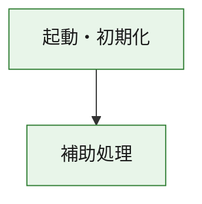
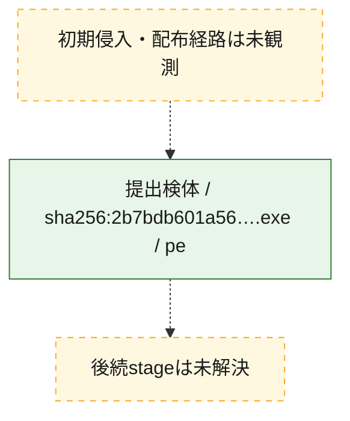
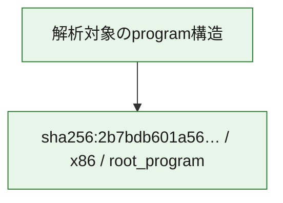

# 全体ロジック：2b7bdb601a56544cc9a75e425b0010abb5b7fc1907fdc7ca6b1e0bb70c771f69

代表関数の静的証跡から、起動・初期化の処理群を確認しました。

## 読み方

- phaseの掲載順は解析上の整理順です。observed_call_edgesがない段階間の実行順を断定しません。
- 図の実線は静的に観測した関係、点線と黄色のノードは未観測・未解決の関係を示します。
- 図は静的な要約であり、動的実行を再現するものではありません。
- 詳細な関数解説とfingerprintは[STATIC-LOGIC.md](STATIC-LOGIC.md)を参照してください。

## 静的可視化

### 実行フロー

### 感染チェーン

### モジュール関係

## 処理段階

### 1. 起動・初期化

entry pointから初期化と後続処理への移行を確認します。
確度: `confirmed_static_function_evidence`

- `2b7bdb601a56544cc9a75e425b0010abb5b7fc1907fdc7ca6b1e0bb70c771f69:ghidra:180001010` — 初期化と主要処理への分岐を行う入口関数です。 状態: `succeeded`、選定理由: `entry_point`, `meaningful_symbol_name`, `reviewed_call_centrality:22`, `role:entrypoint`, `small_program_complete_context`

### 2. 補助処理

主要処理を支える一般内部関数またはlibrary処理を確認します。
確度: `confirmed_static_function_evidence`

- `2b7bdb601a56544cc9a75e425b0010abb5b7fc1907fdc7ca6b1e0bb70c771f69:ghidra:180001240` — 検体内部の一般処理を実装する関数です。 状態: `succeeded`、選定理由: `context_representative`, `reviewed_call_centrality:2`, `small_program_complete_context`
- `2b7bdb601a56544cc9a75e425b0010abb5b7fc1907fdc7ca6b1e0bb70c771f69:ghidra:180001350` — 検体内部の一般処理を実装する関数です。 状態: `succeeded`、選定理由: `context_representative`, `reviewed_call_centrality:25`, `small_program_complete_context`
- `2b7bdb601a56544cc9a75e425b0010abb5b7fc1907fdc7ca6b1e0bb70c771f69:ghidra:180003780` — 検体内部の一般処理を実装する関数です。 状態: `succeeded`、選定理由: `context_representative`, `reviewed_call_centrality:2`, `small_program_complete_context`
- `2b7bdb601a56544cc9a75e425b0010abb5b7fc1907fdc7ca6b1e0bb70c771f69:ghidra:1800038e0` — 検体内部の一般処理を実装する関数です。 状態: `succeeded`、選定理由: `context_representative`, `reviewed_call_centrality:2`, `small_program_complete_context`

## 観測したcall関係

- `2b7bdb601a56544cc9a75e425b0010abb5b7fc1907fdc7ca6b1e0bb70c771f69:ghidra:180001010` → `2b7bdb601a56544cc9a75e425b0010abb5b7fc1907fdc7ca6b1e0bb70c771f69:ghidra:180001240` （`startup` → `support`）
- `2b7bdb601a56544cc9a75e425b0010abb5b7fc1907fdc7ca6b1e0bb70c771f69:ghidra:180001010` → `2b7bdb601a56544cc9a75e425b0010abb5b7fc1907fdc7ca6b1e0bb70c771f69:ghidra:180001350` （`startup` → `support`）
- `2b7bdb601a56544cc9a75e425b0010abb5b7fc1907fdc7ca6b1e0bb70c771f69:ghidra:180001350` → `2b7bdb601a56544cc9a75e425b0010abb5b7fc1907fdc7ca6b1e0bb70c771f69:ghidra:180001240` （`support` → `support`）
- `2b7bdb601a56544cc9a75e425b0010abb5b7fc1907fdc7ca6b1e0bb70c771f69:ghidra:180001350` → `2b7bdb601a56544cc9a75e425b0010abb5b7fc1907fdc7ca6b1e0bb70c771f69:ghidra:180003780` （`support` → `support`）
- `2b7bdb601a56544cc9a75e425b0010abb5b7fc1907fdc7ca6b1e0bb70c771f69:ghidra:180001350` → `2b7bdb601a56544cc9a75e425b0010abb5b7fc1907fdc7ca6b1e0bb70c771f69:ghidra:1800038e0` （`support` → `support`）
- `2b7bdb601a56544cc9a75e425b0010abb5b7fc1907fdc7ca6b1e0bb70c771f69:ghidra:180003780` → `2b7bdb601a56544cc9a75e425b0010abb5b7fc1907fdc7ca6b1e0bb70c771f69:ghidra:1800038e0` （`support` → `support`）
- `ghidra-function:5c55e27724cbe71837b4bda6` → `ghidra-function:21631f8fa783652572ebfc02` （`unclassified` → `unclassified`）
- `ghidra-function:6932a8c73e4f114e1a8ea33f` → `ghidra-function:1ebbe8a4bfe2f7d0061b8572` （`unclassified` → `unclassified`）
- `ghidra-function:6932a8c73e4f114e1a8ea33f` → `ghidra-function:2d92ef56e078427351a727ca` （`unclassified` → `unclassified`）
- `ghidra-function:6932a8c73e4f114e1a8ea33f` → `ghidra-function:53364d5f4b778c67b3fac726` （`unclassified` → `unclassified`）
- `ghidra-function:6932a8c73e4f114e1a8ea33f` → `ghidra-function:691fcd09781911568bd34a69` （`unclassified` → `unclassified`）
- `ghidra-function:6932a8c73e4f114e1a8ea33f` → `ghidra-function:693bd0783ee0975af4351050` （`unclassified` → `unclassified`）
- `ghidra-function:6932a8c73e4f114e1a8ea33f` → `ghidra-function:7e6c43f7ed9d84e51138329b` （`unclassified` → `unclassified`）
- `ghidra-function:6932a8c73e4f114e1a8ea33f` → `ghidra-function:a62fb9552900fea0ce85c7ff` （`unclassified` → `unclassified`）
- `ghidra-function:6932a8c73e4f114e1a8ea33f` → `ghidra-function:a6de3af9240c052b5638e219` （`unclassified` → `unclassified`）
- `ghidra-function:6932a8c73e4f114e1a8ea33f` → `ghidra-function:b7aaa51b342f8015e8f8e97a` （`unclassified` → `unclassified`）
- `ghidra-function:6932a8c73e4f114e1a8ea33f` → `ghidra-function:da28562fc3ba22d060dd25ea` （`unclassified` → `unclassified`）
- `ghidra-function:6932a8c73e4f114e1a8ea33f` → `ghidra-function:de74f5354d6d61ef9e864573` （`unclassified` → `unclassified`）
- `ghidra-function:6932a8c73e4f114e1a8ea33f` → `ghidra-function:fc4f73f9f17de98b649a4e79` （`unclassified` → `unclassified`）
- `ghidra-function:b7aaa51b342f8015e8f8e97a` → `ghidra-external:08ac759b989decb9f8325e97` （`unclassified` → `unclassified`）
- `ghidra-function:b7aaa51b342f8015e8f8e97a` → `ghidra-external:4593a528ba8ac033b4f33498` （`unclassified` → `unclassified`）
- `ghidra-function:b7aaa51b342f8015e8f8e97a` → `ghidra-external:4ced661072e3364465858582` （`unclassified` → `unclassified`）
- `ghidra-function:b7aaa51b342f8015e8f8e97a` → `ghidra-external:54534637d8814c82ca22c755` （`unclassified` → `unclassified`）
- `ghidra-function:b7aaa51b342f8015e8f8e97a` → `ghidra-external:54ff1c33b308e60d12777c61` （`unclassified` → `unclassified`）
- `ghidra-function:b7aaa51b342f8015e8f8e97a` → `ghidra-external:5c8820fb6b46f05bf27c788f` （`unclassified` → `unclassified`）
- `ghidra-function:b7aaa51b342f8015e8f8e97a` → `ghidra-external:633ac805f516314f9c581cc6` （`unclassified` → `unclassified`）
- `ghidra-function:b7aaa51b342f8015e8f8e97a` → `ghidra-external:714ca199c3d66790f751e930` （`unclassified` → `unclassified`）
- `ghidra-function:b7aaa51b342f8015e8f8e97a` → `ghidra-external:79a67452150bb14df74b5852` （`unclassified` → `unclassified`）
- `ghidra-function:b7aaa51b342f8015e8f8e97a` → `ghidra-external:8065725812d3623377a00b31` （`unclassified` → `unclassified`）
- `ghidra-function:b7aaa51b342f8015e8f8e97a` → `ghidra-external:8bf58b1af7b135baaca94979` （`unclassified` → `unclassified`）
- `ghidra-function:b7aaa51b342f8015e8f8e97a` → `ghidra-external:99a424c6841406d20ce94fe0` （`unclassified` → `unclassified`）
- `ghidra-function:b7aaa51b342f8015e8f8e97a` → `ghidra-external:ad623b81d1508557029e4a57` （`unclassified` → `unclassified`）
- `ghidra-function:b7aaa51b342f8015e8f8e97a` → `ghidra-external:b5a2b4379bfc39bc5cbe3a7e` （`unclassified` → `unclassified`）
- `ghidra-function:b7aaa51b342f8015e8f8e97a` → `ghidra-external:b6ba56da8a6bdaf08b6e0fc5` （`unclassified` → `unclassified`）
- `ghidra-function:b7aaa51b342f8015e8f8e97a` → `ghidra-external:caa4d8e5b52f0a9e9c2f4acf` （`unclassified` → `unclassified`）
- `ghidra-function:b7aaa51b342f8015e8f8e97a` → `ghidra-external:e8383b2b4b2551ec32ba74e5` （`unclassified` → `unclassified`）
- `ghidra-function:b7aaa51b342f8015e8f8e97a` → `ghidra-external:f01c7e365094d1bd896ab68c` （`unclassified` → `unclassified`）
- `ghidra-function:b7aaa51b342f8015e8f8e97a` → `ghidra-external:f206c2ef7c4b0cc56df9fd18` （`unclassified` → `unclassified`）
- `ghidra-function:b7aaa51b342f8015e8f8e97a` → `ghidra-external:f44e8b5db9215765e78339c5` （`unclassified` → `unclassified`）
- `ghidra-function:b7aaa51b342f8015e8f8e97a` → `ghidra-external:fb1eed76183aebeaf2adf59c` （`unclassified` → `unclassified`）
- `ghidra-function:b7aaa51b342f8015e8f8e97a` → `ghidra-function:21631f8fa783652572ebfc02` （`unclassified` → `unclassified`）
- `ghidra-function:b7aaa51b342f8015e8f8e97a` → `ghidra-function:2d92ef56e078427351a727ca` （`unclassified` → `unclassified`）
- `ghidra-function:b7aaa51b342f8015e8f8e97a` → `ghidra-function:5c55e27724cbe71837b4bda6` （`unclassified` → `unclassified`）

## 解析範囲と制約

- 選定外関数は全体inventoryへ残しますが、関数本体の個別解説対象にはしていません。
- indirect call、難読化、packer、VM、壊れたcontrol flowによりcall関係が欠落する場合があります。
- 文書は静的解析に基づき、検体実行や外部通信による動的確認は行っていません。
