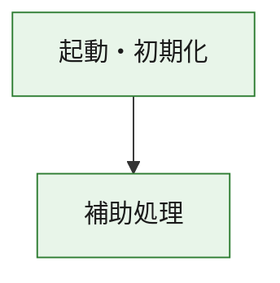
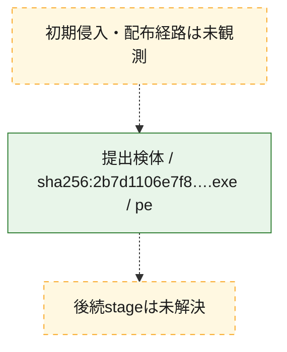
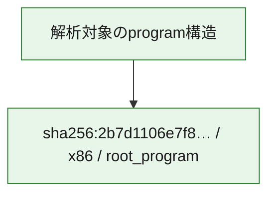

# 全体ロジック：2b7d1106e7f8c2d0bd11dc879e7fe585d040b8f095f08bc43159bc679a0000d0

代表関数の静的証跡から、起動・初期化の処理群を確認しました。

## 読み方

- phaseの掲載順は解析上の整理順です。observed_call_edgesがない段階間の実行順を断定しません。
- 図の実線は静的に観測した関係、点線と黄色のノードは未観測・未解決の関係を示します。
- 図は静的な要約であり、動的実行を再現するものではありません。
- 詳細な関数解説とfingerprintは[STATIC-LOGIC.md](STATIC-LOGIC.md)を参照してください。

## 静的可視化

### 実行フロー

### 感染チェーン

### モジュール関係

## 処理段階

### 1. 起動・初期化

entry pointから初期化と後続処理への移行を確認します。
確度: `confirmed_static_function_evidence`

- `2b7d1106e7f8c2d0bd11dc879e7fe585d040b8f095f08bc43159bc679a0000d0:ghidra:180001010` — 初期化と主要処理への分岐を行う入口関数です。 状態: `succeeded`、選定理由: `entry_point`, `meaningful_symbol_name`, `reviewed_call_centrality:22`, `role:entrypoint`, `small_program_complete_context`

### 2. 補助処理

主要処理を支える一般内部関数またはlibrary処理を確認します。
確度: `confirmed_static_function_evidence`

- `2b7d1106e7f8c2d0bd11dc879e7fe585d040b8f095f08bc43159bc679a0000d0:ghidra:180001240` — 検体内部の一般処理を実装する関数です。 状態: `succeeded`、選定理由: `context_representative`, `reviewed_call_centrality:2`, `small_program_complete_context`
- `2b7d1106e7f8c2d0bd11dc879e7fe585d040b8f095f08bc43159bc679a0000d0:ghidra:180001350` — 検体内部の一般処理を実装する関数です。 状態: `succeeded`、選定理由: `context_representative`, `reviewed_call_centrality:25`, `small_program_complete_context`
- `2b7d1106e7f8c2d0bd11dc879e7fe585d040b8f095f08bc43159bc679a0000d0:ghidra:180003780` — 検体内部の一般処理を実装する関数です。 状態: `succeeded`、選定理由: `context_representative`, `reviewed_call_centrality:2`, `small_program_complete_context`
- `2b7d1106e7f8c2d0bd11dc879e7fe585d040b8f095f08bc43159bc679a0000d0:ghidra:1800038e0` — 検体内部の一般処理を実装する関数です。 状態: `succeeded`、選定理由: `context_representative`, `reviewed_call_centrality:2`, `small_program_complete_context`

## 観測したcall関係

- `2b7d1106e7f8c2d0bd11dc879e7fe585d040b8f095f08bc43159bc679a0000d0:ghidra:180001010` → `2b7d1106e7f8c2d0bd11dc879e7fe585d040b8f095f08bc43159bc679a0000d0:ghidra:180001240` （`startup` → `support`）
- `2b7d1106e7f8c2d0bd11dc879e7fe585d040b8f095f08bc43159bc679a0000d0:ghidra:180001010` → `2b7d1106e7f8c2d0bd11dc879e7fe585d040b8f095f08bc43159bc679a0000d0:ghidra:180001350` （`startup` → `support`）
- `2b7d1106e7f8c2d0bd11dc879e7fe585d040b8f095f08bc43159bc679a0000d0:ghidra:180001350` → `2b7d1106e7f8c2d0bd11dc879e7fe585d040b8f095f08bc43159bc679a0000d0:ghidra:180001240` （`support` → `support`）
- `2b7d1106e7f8c2d0bd11dc879e7fe585d040b8f095f08bc43159bc679a0000d0:ghidra:180001350` → `2b7d1106e7f8c2d0bd11dc879e7fe585d040b8f095f08bc43159bc679a0000d0:ghidra:180003780` （`support` → `support`）
- `2b7d1106e7f8c2d0bd11dc879e7fe585d040b8f095f08bc43159bc679a0000d0:ghidra:180001350` → `2b7d1106e7f8c2d0bd11dc879e7fe585d040b8f095f08bc43159bc679a0000d0:ghidra:1800038e0` （`support` → `support`）
- `2b7d1106e7f8c2d0bd11dc879e7fe585d040b8f095f08bc43159bc679a0000d0:ghidra:180003780` → `2b7d1106e7f8c2d0bd11dc879e7fe585d040b8f095f08bc43159bc679a0000d0:ghidra:1800038e0` （`support` → `support`）
- `ghidra-function:5b83a73a259d879c3dbd83e3` → `ghidra-function:0f6224a60bf69aa997ea2723` （`unclassified` → `unclassified`）
- `ghidra-function:5b83a73a259d879c3dbd83e3` → `ghidra-function:17a547d8f21e2ebd2513dfb9` （`unclassified` → `unclassified`）
- `ghidra-function:5b83a73a259d879c3dbd83e3` → `ghidra-function:257a2e22c6cdda70bcf55c85` （`unclassified` → `unclassified`）
- `ghidra-function:5b83a73a259d879c3dbd83e3` → `ghidra-function:33f15f7756a3dabdbf3744d9` （`unclassified` → `unclassified`）
- `ghidra-function:5b83a73a259d879c3dbd83e3` → `ghidra-function:37af64668c6e11f5422f5cf3` （`unclassified` → `unclassified`）
- `ghidra-function:5b83a73a259d879c3dbd83e3` → `ghidra-function:6b962bbb9ac03249dff85e8e` （`unclassified` → `unclassified`）
- `ghidra-function:5b83a73a259d879c3dbd83e3` → `ghidra-function:85ea375799a41b02a376d9f1` （`unclassified` → `unclassified`）
- `ghidra-function:5b83a73a259d879c3dbd83e3` → `ghidra-function:aa547a3b442301c59ff4d1ef` （`unclassified` → `unclassified`）
- `ghidra-function:5b83a73a259d879c3dbd83e3` → `ghidra-function:b1cc9a1a947e4c62c14d7c79` （`unclassified` → `unclassified`）
- `ghidra-function:5b83a73a259d879c3dbd83e3` → `ghidra-function:e472ff332effbe937e64216f` （`unclassified` → `unclassified`）
- `ghidra-function:5b83a73a259d879c3dbd83e3` → `ghidra-function:e9deca8d66da07329e867edc` （`unclassified` → `unclassified`）
- `ghidra-function:5b83a73a259d879c3dbd83e3` → `ghidra-function:ef65f774de6fe52173bd7b49` （`unclassified` → `unclassified`）
- `ghidra-function:c6d7278bcdeeeb574c073306` → `ghidra-function:8ef08438c0627223c1d36b79` （`unclassified` → `unclassified`）
- `ghidra-function:e472ff332effbe937e64216f` → `ghidra-external:0f270e542fd460fe54984fbf` （`unclassified` → `unclassified`）
- `ghidra-function:e472ff332effbe937e64216f` → `ghidra-external:10462c40b99ae287395811da` （`unclassified` → `unclassified`）
- `ghidra-function:e472ff332effbe937e64216f` → `ghidra-external:1938eeeae51401c8f58c45bc` （`unclassified` → `unclassified`）
- `ghidra-function:e472ff332effbe937e64216f` → `ghidra-external:1f7512ec17758bb43924aa84` （`unclassified` → `unclassified`）
- `ghidra-function:e472ff332effbe937e64216f` → `ghidra-external:31e54853c8492f45b257f288` （`unclassified` → `unclassified`）
- `ghidra-function:e472ff332effbe937e64216f` → `ghidra-external:332e4ba71a09133b4bcfe6a6` （`unclassified` → `unclassified`）
- `ghidra-function:e472ff332effbe937e64216f` → `ghidra-external:4882e3f3639fa580d1844d74` （`unclassified` → `unclassified`）
- `ghidra-function:e472ff332effbe937e64216f` → `ghidra-external:4efa71efb54af5ac00287b01` （`unclassified` → `unclassified`）
- `ghidra-function:e472ff332effbe937e64216f` → `ghidra-external:541e058140cb50d39726538c` （`unclassified` → `unclassified`）
- `ghidra-function:e472ff332effbe937e64216f` → `ghidra-external:5a8a8e62b1a7542989d99e16` （`unclassified` → `unclassified`）
- `ghidra-function:e472ff332effbe937e64216f` → `ghidra-external:5c01e2223512cf32324aafc9` （`unclassified` → `unclassified`）
- `ghidra-function:e472ff332effbe937e64216f` → `ghidra-external:6d7502d629ab61fd280a49a4` （`unclassified` → `unclassified`）
- `ghidra-function:e472ff332effbe937e64216f` → `ghidra-external:901f57760608fccec0fa71b9` （`unclassified` → `unclassified`）
- `ghidra-function:e472ff332effbe937e64216f` → `ghidra-external:9661f25a58ac1498da3aefca` （`unclassified` → `unclassified`）
- `ghidra-function:e472ff332effbe937e64216f` → `ghidra-external:b5db753043442d51847416c4` （`unclassified` → `unclassified`）
- `ghidra-function:e472ff332effbe937e64216f` → `ghidra-external:bbc67f5139acc8aac5b0e7c9` （`unclassified` → `unclassified`）
- `ghidra-function:e472ff332effbe937e64216f` → `ghidra-external:bd6d8f829f9b9a82c8561600` （`unclassified` → `unclassified`）
- `ghidra-function:e472ff332effbe937e64216f` → `ghidra-external:c199fd096201837c0f25aaa5` （`unclassified` → `unclassified`）
- `ghidra-function:e472ff332effbe937e64216f` → `ghidra-external:d21bb4d79e433f386db93f28` （`unclassified` → `unclassified`）
- `ghidra-function:e472ff332effbe937e64216f` → `ghidra-external:dbd2ca22b0e6c12b0d1e7244` （`unclassified` → `unclassified`）
- `ghidra-function:e472ff332effbe937e64216f` → `ghidra-external:faef3aed95ef14c05b5f720c` （`unclassified` → `unclassified`）
- `ghidra-function:e472ff332effbe937e64216f` → `ghidra-function:17a547d8f21e2ebd2513dfb9` （`unclassified` → `unclassified`）
- `ghidra-function:e472ff332effbe937e64216f` → `ghidra-function:8ef08438c0627223c1d36b79` （`unclassified` → `unclassified`）
- `ghidra-function:e472ff332effbe937e64216f` → `ghidra-function:c6d7278bcdeeeb574c073306` （`unclassified` → `unclassified`）

## 解析範囲と制約

- 選定外関数は全体inventoryへ残しますが、関数本体の個別解説対象にはしていません。
- indirect call、難読化、packer、VM、壊れたcontrol flowによりcall関係が欠落する場合があります。
- 文書は静的解析に基づき、検体実行や外部通信による動的確認は行っていません。
