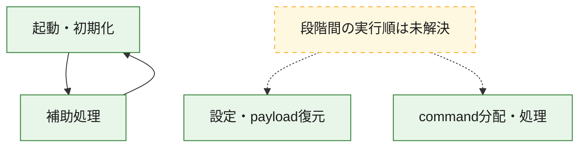
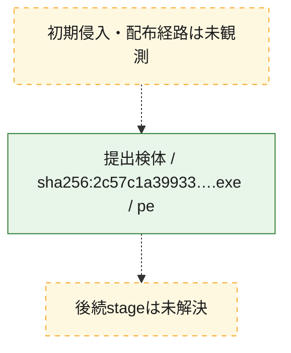
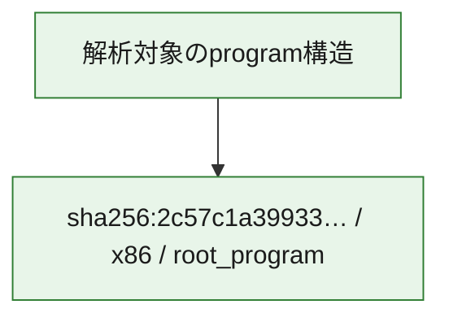

# 全体ロジック：2c57c1a39933514c63b5a7b585f5948ead04b65e4df96fb595ccda84208c4aa0

代表関数の静的証跡から、起動・初期化、設定・payload復元、command分配・処理の処理群を確認しました。

## 読み方

- phaseの掲載順は解析上の整理順です。observed_call_edgesがない段階間の実行順を断定しません。
- 図の実線は静的に観測した関係、点線と黄色のノードは未観測・未解決の関係を示します。
- 図は静的な要約であり、動的実行を再現するものではありません。
- 詳細な関数解説とfingerprintは[STATIC-LOGIC.md](STATIC-LOGIC.md)を参照してください。

## 静的可視化

### 実行フロー

### 感染チェーン

### モジュール関係

## 処理段階

### 1. 起動・初期化

entry pointから初期化と後続処理への移行を確認します。
確度: `confirmed_static_function_evidence`

- `2c57c1a39933514c63b5a7b585f5948ead04b65e4df96fb595ccda84208c4aa0:ghidra:1400ee8c0` — 初期化と主要処理への分岐を行う入口関数です。 状態: `succeeded`、選定理由: `entry_point`, `meaningful_symbol_name`, `probable_go_main_user_code`, `reviewed_call_centrality:49`, `role:entrypoint`

### 2. 設定・payload復元

設定、resource、payload、暗号化データの復元・変換を確認します。
確度: `confirmed_static_function_evidence`

- `2c57c1a39933514c63b5a7b585f5948ead04b65e4df96fb595ccda84208c4aa0:ghidra:140037e40` — 暗号、hash、encoding、または復号処理に関係する関数です。 状態: `succeeded`、選定理由: `meaningful_symbol_name`, `reviewed_call_centrality:1`, `role:cryptographic_transform`
- `2c57c1a39933514c63b5a7b585f5948ead04b65e4df96fb595ccda84208c4aa0:ghidra:140038400` — 暗号、hash、encoding、または復号処理に関係する関数です。 状態: `succeeded`、選定理由: `meaningful_symbol_name`, `reviewed_call_centrality:1`, `role:cryptographic_transform`
- `2c57c1a39933514c63b5a7b585f5948ead04b65e4df96fb595ccda84208c4aa0:ghidra:1400519e0` — 暗号、hash、encoding、または復号処理に関係する関数です。 状態: `succeeded`、選定理由: `meaningful_symbol_name`, `reviewed_call_centrality:1`, `role:cryptographic_transform`
- `2c57c1a39933514c63b5a7b585f5948ead04b65e4df96fb595ccda84208c4aa0:ghidra:140051f80` — 暗号、hash、encoding、または復号処理に関係する関数です。 状態: `succeeded`、選定理由: `meaningful_symbol_name`, `reviewed_call_centrality:1`, `role:cryptographic_transform`
- `2c57c1a39933514c63b5a7b585f5948ead04b65e4df96fb595ccda84208c4aa0:ghidra:1400e65c0` — 暗号、hash、encoding、または復号処理に関係する関数です。 状態: `succeeded`、選定理由: `meaningful_symbol_name`, `role:cryptographic_transform`
- `2c57c1a39933514c63b5a7b585f5948ead04b65e4df96fb595ccda84208c4aa0:ghidra:1400e7200` — 暗号、hash、encoding、または復号処理に関係する関数です。 状態: `succeeded`、選定理由: `meaningful_symbol_name`, `role:cryptographic_transform`

### 3. command分配・処理

受信commandやtaskの解釈、分配、個別handlerへの移行を確認します。
確度: `confirmed_static_function_evidence`

- `2c57c1a39933514c63b5a7b585f5948ead04b65e4df96fb595ccda84208c4aa0:ghidra:14000f630` — commandの解釈、分配、または個別処理を担当する関数です。 状態: `succeeded`、選定理由: `meaningful_symbol_name`, `reviewed_call_centrality:6`, `role:command_dispatch_or_handler`
- `2c57c1a39933514c63b5a7b585f5948ead04b65e4df96fb595ccda84208c4aa0:ghidra:14001ddd0` — commandの解釈、分配、または個別処理を担当する関数です。 状態: `succeeded`、選定理由: `meaningful_symbol_name`, `role:command_dispatch_or_handler`
- `2c57c1a39933514c63b5a7b585f5948ead04b65e4df96fb595ccda84208c4aa0:ghidra:140023520` — commandの解釈、分配、または個別処理を担当する関数です。 状態: `succeeded`、選定理由: `meaningful_symbol_name`, `reviewed_call_centrality:13`, `role:command_dispatch_or_handler`
- `2c57c1a39933514c63b5a7b585f5948ead04b65e4df96fb595ccda84208c4aa0:ghidra:1400e7ad0` — commandの解釈、分配、または個別処理を担当する関数です。 状態: `succeeded`、選定理由: `meaningful_symbol_name`, `reviewed_call_centrality:2`, `role:command_dispatch_or_handler`
- `2c57c1a39933514c63b5a7b585f5948ead04b65e4df96fb595ccda84208c4aa0:ghidra:1400e9340` — commandの解釈、分配、または個別処理を担当する関数です。 状態: `succeeded`、選定理由: `meaningful_symbol_name`, `reviewed_call_centrality:1`, `role:command_dispatch_or_handler`

### 4. 補助処理

主要処理を支える一般内部関数またはlibrary処理を確認します。
確度: `confirmed_static_function_evidence_with_limits`

- `2c57c1a39933514c63b5a7b585f5948ead04b65e4df96fb595ccda84208c4aa0:ghidra:140001010` — 検体内部の一般処理を実装する関数です。 状態: `succeeded`、選定理由: `meaningful_symbol_name`
- `2c57c1a39933514c63b5a7b585f5948ead04b65e4df96fb595ccda84208c4aa0:ghidra:140001030` — 検体内部の一般処理を実装する関数です。 状態: `limited_bad_instruction_or_flow`、選定理由: `meaningful_symbol_name`, `reviewed_call_centrality:2`
- `2c57c1a39933514c63b5a7b585f5948ead04b65e4df96fb595ccda84208c4aa0:ghidra:140001460` — 検体内部の一般処理を実装する関数です。 状態: `succeeded`、選定理由: `meaningful_symbol_name`, `reviewed_call_centrality:30`
- `2c57c1a39933514c63b5a7b585f5948ead04b65e4df96fb595ccda84208c4aa0:ghidra:140001480` — 検体内部の一般処理を実装する関数です。 状態: `succeeded`、選定理由: `entry_point`, `meaningful_symbol_name`, `reviewed_call_centrality:30`
- `2c57c1a39933514c63b5a7b585f5948ead04b65e4df96fb595ccda84208c4aa0:ghidra:1400014a0` — 検体内部の一般処理を実装する関数です。 状態: `limited_bad_instruction_or_flow`、選定理由: `meaningful_symbol_name`, `reviewed_call_centrality:2`
- `2c57c1a39933514c63b5a7b585f5948ead04b65e4df96fb595ccda84208c4aa0:ghidra:1400014d0` — 検体内部の一般処理を実装する関数です。 状態: `succeeded`、選定理由: `meaningful_symbol_name`, `reviewed_call_centrality:3`
- `2c57c1a39933514c63b5a7b585f5948ead04b65e4df96fb595ccda84208c4aa0:ghidra:140001590` — 検体内部の一般処理を実装する関数です。 状態: `succeeded`、選定理由: `meaningful_symbol_name`, `reviewed_call_centrality:26`
- `2c57c1a39933514c63b5a7b585f5948ead04b65e4df96fb595ccda84208c4aa0:ghidra:140001610` — 検体内部の一般処理を実装する関数です。 状態: `succeeded`、選定理由: `meaningful_symbol_name`, `reviewed_call_centrality:15`
- `2c57c1a39933514c63b5a7b585f5948ead04b65e4df96fb595ccda84208c4aa0:ghidra:1400016d0` — 検体内部の一般処理を実装する関数です。 状態: `succeeded`、選定理由: `meaningful_symbol_name`, `reviewed_call_centrality:11`
- `2c57c1a39933514c63b5a7b585f5948ead04b65e4df96fb595ccda84208c4aa0:ghidra:140001980` — 検体内部の一般処理を実装する関数です。 状態: `succeeded`、選定理由: `meaningful_symbol_name`, `reviewed_call_centrality:6`
- `2c57c1a39933514c63b5a7b585f5948ead04b65e4df96fb595ccda84208c4aa0:ghidra:140001a80` — 検体内部の一般処理を実装する関数です。 状態: `succeeded`、選定理由: `meaningful_symbol_name`
- `2c57c1a39933514c63b5a7b585f5948ead04b65e4df96fb595ccda84208c4aa0:ghidra:140001b50` — 検体内部の一般処理を実装する関数です。 状態: `succeeded`、選定理由: `meaningful_symbol_name`
- `2c57c1a39933514c63b5a7b585f5948ead04b65e4df96fb595ccda84208c4aa0:ghidra:140001bb0` — 検体内部の一般処理を実装する関数です。 状態: `succeeded`、選定理由: `meaningful_symbol_name`, `reviewed_call_centrality:2`
- `2c57c1a39933514c63b5a7b585f5948ead04b65e4df96fb595ccda84208c4aa0:ghidra:140001c80` — 検体内部の一般処理を実装する関数です。 状態: `succeeded`、選定理由: `meaningful_symbol_name`, `reviewed_call_centrality:1`
- `2c57c1a39933514c63b5a7b585f5948ead04b65e4df96fb595ccda84208c4aa0:ghidra:140001d00` — 検体内部の一般処理を実装する関数です。 状態: `succeeded`、選定理由: `meaningful_symbol_name`
- `2c57c1a39933514c63b5a7b585f5948ead04b65e4df96fb595ccda84208c4aa0:ghidra:140001d60` — 検体内部の一般処理を実装する関数です。 状態: `succeeded`、選定理由: `meaningful_symbol_name`, `reviewed_call_centrality:1`
- `2c57c1a39933514c63b5a7b585f5948ead04b65e4df96fb595ccda84208c4aa0:ghidra:140001df0` — 検体内部の一般処理を実装する関数です。 状態: `succeeded`、選定理由: `meaningful_symbol_name`
- `2c57c1a39933514c63b5a7b585f5948ead04b65e4df96fb595ccda84208c4aa0:ghidra:140001f40` — 検体内部の一般処理を実装する関数です。 状態: `succeeded`、選定理由: `meaningful_symbol_name`
- `2c57c1a39933514c63b5a7b585f5948ead04b65e4df96fb595ccda84208c4aa0:ghidra:140001f70` — 検体内部の一般処理を実装する関数です。 状態: `succeeded`、選定理由: `meaningful_symbol_name`, `reviewed_call_centrality:4`
- `2c57c1a39933514c63b5a7b585f5948ead04b65e4df96fb595ccda84208c4aa0:ghidra:14001db40` — compiler生成処理または汎用library処理とみられる関数です。 状態: `limited_bad_instruction_or_flow`、選定理由: `entry_point`, `meaningful_symbol_name`, `reviewed_call_centrality:12`

## 観測したcall関係

- `2c57c1a39933514c63b5a7b585f5948ead04b65e4df96fb595ccda84208c4aa0:ghidra:140001460` → `2c57c1a39933514c63b5a7b585f5948ead04b65e4df96fb595ccda84208c4aa0:ghidra:1400ee8c0` （`support` → `startup`）
- `2c57c1a39933514c63b5a7b585f5948ead04b65e4df96fb595ccda84208c4aa0:ghidra:140001480` → `2c57c1a39933514c63b5a7b585f5948ead04b65e4df96fb595ccda84208c4aa0:ghidra:1400ee8c0` （`support` → `startup`）
- `2c57c1a39933514c63b5a7b585f5948ead04b65e4df96fb595ccda84208c4aa0:ghidra:140001c80` → `2c57c1a39933514c63b5a7b585f5948ead04b65e4df96fb595ccda84208c4aa0:ghidra:140001bb0` （`support` → `support`）
- `2c57c1a39933514c63b5a7b585f5948ead04b65e4df96fb595ccda84208c4aa0:ghidra:140001d60` → `2c57c1a39933514c63b5a7b585f5948ead04b65e4df96fb595ccda84208c4aa0:ghidra:140001bb0` （`support` → `support`）
- `2c57c1a39933514c63b5a7b585f5948ead04b65e4df96fb595ccda84208c4aa0:ghidra:1400ee8c0` → `2c57c1a39933514c63b5a7b585f5948ead04b65e4df96fb595ccda84208c4aa0:ghidra:1400016d0` （`startup` → `support`）
- `ghidra-function:06cb1afac3dc61168e71221d` → `ghidra-external:2a602b5c641081e8c3c7b307` （`unclassified` → `unclassified`）
- `ghidra-function:0790098e9d4a7654465cd049` → `ghidra-external:b2fc9e78dc3badc8f2823426` （`unclassified` → `unclassified`）
- `ghidra-function:0790098e9d4a7654465cd049` → `ghidra-external:e6ca0f42102d715a97f2eaf2` （`unclassified` → `unclassified`）
- `ghidra-function:0fc58db424862cc9638b92b3` → `ghidra-external:1f2c0b48f751c050449fbe63` （`unclassified` → `unclassified`）
- `ghidra-function:0fc58db424862cc9638b92b3` → `ghidra-external:23a4ce8a477a9612d00d0a94` （`unclassified` → `unclassified`）
- `ghidra-function:0fc58db424862cc9638b92b3` → `ghidra-external:6b291feca6313b4c19293240` （`unclassified` → `unclassified`）
- `ghidra-function:0fc58db424862cc9638b92b3` → `ghidra-external:7f3227f0a8ad633bd964f95e` （`unclassified` → `unclassified`）
- `ghidra-function:0fc58db424862cc9638b92b3` → `ghidra-function:248337a6412e897c38aaf1e3` （`unclassified` → `unclassified`）
- `ghidra-function:0fc58db424862cc9638b92b3` → `ghidra-function:8202445234955ae6d3e9e6ba` （`unclassified` → `unclassified`）
- `ghidra-function:17c50d12d39dda9fa0da2360` → `ghidra-external:25e0a84e65e63bd4a33e8071` （`unclassified` → `unclassified`）
- `ghidra-function:17c50d12d39dda9fa0da2360` → `ghidra-external:2816a6e7f99ae2a20b1ba64d` （`unclassified` → `unclassified`）
- `ghidra-function:17c50d12d39dda9fa0da2360` → `ghidra-external:5119bf23f0cd617fcde9c23e` （`unclassified` → `unclassified`）
- `ghidra-function:17c50d12d39dda9fa0da2360` → `ghidra-external:794a2ded2f0b82e55b3a35e2` （`unclassified` → `unclassified`）
- `ghidra-function:17c50d12d39dda9fa0da2360` → `ghidra-external:b2fc9e78dc3badc8f2823426` （`unclassified` → `unclassified`）
- `ghidra-function:17c50d12d39dda9fa0da2360` → `ghidra-external:cbf2f81a823ce466b647ec9e` （`unclassified` → `unclassified`）
- `ghidra-function:17c50d12d39dda9fa0da2360` → `ghidra-external:d9225c538af2b11795e3bda2` （`unclassified` → `unclassified`）
- `ghidra-function:17c50d12d39dda9fa0da2360` → `ghidra-external:e6ca0f42102d715a97f2eaf2` （`unclassified` → `unclassified`）
- `ghidra-function:17c50d12d39dda9fa0da2360` → `ghidra-function:39cc07638468431b7b5cc9c0` （`unclassified` → `unclassified`）
- `ghidra-function:17c50d12d39dda9fa0da2360` → `ghidra-function:43c1fb9498c01e52fbc06ee9` （`unclassified` → `unclassified`）
- `ghidra-function:17c50d12d39dda9fa0da2360` → `ghidra-function:54ae7267df20cfb87d6b8e20` （`unclassified` → `unclassified`）
- `ghidra-function:17c50d12d39dda9fa0da2360` → `ghidra-function:5b8441beb4703eff00268d89` （`unclassified` → `unclassified`）
- `ghidra-function:17c50d12d39dda9fa0da2360` → `ghidra-function:b1c7254460966c5843b87058` （`unclassified` → `unclassified`）
- `ghidra-function:17c50d12d39dda9fa0da2360` → `ghidra-function:d26d52e178475c92d84abfb7` （`unclassified` → `unclassified`）
- `ghidra-function:17c50d12d39dda9fa0da2360` → `ghidra-function:f8d0958854bb1b9ab0f0b2ab` （`unclassified` → `unclassified`）
- `ghidra-function:19c7a0a44c10a7c448746c8d` → `ghidra-external:23a4ce8a477a9612d00d0a94` （`unclassified` → `unclassified`）
- `ghidra-function:19c7a0a44c10a7c448746c8d` → `ghidra-external:52c5c917c5e02835c97c0400` （`unclassified` → `unclassified`）
- `ghidra-function:19c7a0a44c10a7c448746c8d` → `ghidra-external:9f215dd0b64fabd73c057d34` （`unclassified` → `unclassified`）
- `ghidra-function:1eec25707ea50faf65c4ce18` → `ghidra-external:23a4ce8a477a9612d00d0a94` （`unclassified` → `unclassified`）
- `ghidra-function:1eec25707ea50faf65c4ce18` → `ghidra-external:42d4da32cf7ef6fa127ed182` （`unclassified` → `unclassified`）
- `ghidra-function:1eec25707ea50faf65c4ce18` → `ghidra-external:8a7224e5edfcd9b660c109d7` （`unclassified` → `unclassified`）
- `ghidra-function:1eec25707ea50faf65c4ce18` → `ghidra-external:f00da1983fe75726b8d59300` （`unclassified` → `unclassified`）
- `ghidra-function:261389dcc9846d8510aeded9` → `ghidra-external:0ed9d1fab161267ebd985977` （`unclassified` → `unclassified`）
- `ghidra-function:261389dcc9846d8510aeded9` → `ghidra-external:42d4da32cf7ef6fa127ed182` （`unclassified` → `unclassified`）
- `ghidra-function:261389dcc9846d8510aeded9` → `ghidra-function:3386f26f1909fec442a7343e` （`unclassified` → `unclassified`）
- `ghidra-function:261389dcc9846d8510aeded9` → `ghidra-function:c0395637e399884767fe8f05` （`unclassified` → `unclassified`）
- `ghidra-function:2f2f2aead084a48f903f466d` → `ghidra-external:12a8b52ead854b1083d418f6` （`unclassified` → `unclassified`）
- `ghidra-function:2f2f2aead084a48f903f466d` → `ghidra-external:1bb95b1342bdd8dbeb56bbcc` （`unclassified` → `unclassified`）
- `ghidra-function:2f2f2aead084a48f903f466d` → `ghidra-external:1f2c0b48f751c050449fbe63` （`unclassified` → `unclassified`）
- `ghidra-function:2f2f2aead084a48f903f466d` → `ghidra-external:23a4ce8a477a9612d00d0a94` （`unclassified` → `unclassified`）
- `ghidra-function:2f2f2aead084a48f903f466d` → `ghidra-external:2816a6e7f99ae2a20b1ba64d` （`unclassified` → `unclassified`）
- `ghidra-function:2f2f2aead084a48f903f466d` → `ghidra-external:3c3a1fe742e165d8f1357b73` （`unclassified` → `unclassified`）
- `ghidra-function:2f2f2aead084a48f903f466d` → `ghidra-external:410fbaeaea1001cdb7180315` （`unclassified` → `unclassified`）
- `ghidra-function:2f2f2aead084a48f903f466d` → `ghidra-external:42166245a4d59fff58a1e729` （`unclassified` → `unclassified`）
- `ghidra-function:2f2f2aead084a48f903f466d` → `ghidra-external:42d4da32cf7ef6fa127ed182` （`unclassified` → `unclassified`）
- `ghidra-function:2f2f2aead084a48f903f466d` → `ghidra-external:52c5c917c5e02835c97c0400` （`unclassified` → `unclassified`）
- `ghidra-function:2f2f2aead084a48f903f466d` → `ghidra-external:60df7e4d137e6b8b3372ee4b` （`unclassified` → `unclassified`）
- `ghidra-function:2f2f2aead084a48f903f466d` → `ghidra-external:6436630636954ffe54c424ab` （`unclassified` → `unclassified`）
- `ghidra-function:2f2f2aead084a48f903f466d` → `ghidra-external:66f5588d537dbdf1c6f3dc0d` （`unclassified` → `unclassified`）
- `ghidra-function:2f2f2aead084a48f903f466d` → `ghidra-external:73bca73422cdf3af41ecb503` （`unclassified` → `unclassified`）
- `ghidra-function:2f2f2aead084a48f903f466d` → `ghidra-external:764166aeb2c8f87172953773` （`unclassified` → `unclassified`）
- `ghidra-function:2f2f2aead084a48f903f466d` → `ghidra-external:7f3227f0a8ad633bd964f95e` （`unclassified` → `unclassified`）
- `ghidra-function:2f2f2aead084a48f903f466d` → `ghidra-external:87c791ee0a0cf1c5df09b2bb` （`unclassified` → `unclassified`）
- `ghidra-function:2f2f2aead084a48f903f466d` → `ghidra-external:a8077781e72f264fb64a47fd` （`unclassified` → `unclassified`）
- `ghidra-function:2f2f2aead084a48f903f466d` → `ghidra-external:cbf2f81a823ce466b647ec9e` （`unclassified` → `unclassified`）
- `ghidra-function:2f2f2aead084a48f903f466d` → `ghidra-external:ce75d6d47d82e452a8e5efa1` （`unclassified` → `unclassified`）
- `ghidra-function:2f2f2aead084a48f903f466d` → `ghidra-external:cfe3584abafc4f3e3bb53421` （`unclassified` → `unclassified`）
- `ghidra-function:2f2f2aead084a48f903f466d` → `ghidra-external:dface1001343175c4cb68986` （`unclassified` → `unclassified`）
- `ghidra-function:2f2f2aead084a48f903f466d` → `ghidra-external:e7c03e22ba9d75b534ec25a3` （`unclassified` → `unclassified`）
- `ghidra-function:2f2f2aead084a48f903f466d` → `ghidra-function:11fddcbac59620e6d49b3b93` （`unclassified` → `unclassified`）
- `ghidra-function:2f2f2aead084a48f903f466d` → `ghidra-function:248337a6412e897c38aaf1e3` （`unclassified` → `unclassified`）
- `ghidra-function:2f2f2aead084a48f903f466d` → `ghidra-function:3f2c28e08487db20146a1a79` （`unclassified` → `unclassified`）
- `ghidra-function:2f2f2aead084a48f903f466d` → `ghidra-function:4371d09448fbe25ee81903d0` （`unclassified` → `unclassified`）
- `ghidra-function:2f2f2aead084a48f903f466d` → `ghidra-function:4809ccefb2686c4601d48cee` （`unclassified` → `unclassified`）
- `ghidra-function:2f2f2aead084a48f903f466d` → `ghidra-function:68dd63c30a636ba6020ebed8` （`unclassified` → `unclassified`）
- `ghidra-function:2f2f2aead084a48f903f466d` → `ghidra-function:69ee47037e58c8d9cbc84cbe` （`unclassified` → `unclassified`）
- `ghidra-function:2f2f2aead084a48f903f466d` → `ghidra-function:74b56966838e6501af50aa75` （`unclassified` → `unclassified`）
- `ghidra-function:2f2f2aead084a48f903f466d` → `ghidra-function:792b330b6d41ceb5e124ea66` （`unclassified` → `unclassified`）
- `ghidra-function:2f2f2aead084a48f903f466d` → `ghidra-function:8202445234955ae6d3e9e6ba` （`unclassified` → `unclassified`）
- `ghidra-function:2f2f2aead084a48f903f466d` → `ghidra-function:8a0b50a2b7e9291223f2206a` （`unclassified` → `unclassified`）
- `ghidra-function:2f2f2aead084a48f903f466d` → `ghidra-function:8f9bb49a7853fb90613f8ec8` （`unclassified` → `unclassified`）
- `ghidra-function:2f2f2aead084a48f903f466d` → `ghidra-function:97dc6b7bdc64edc053c739a0` （`unclassified` → `unclassified`）
- `ghidra-function:2f2f2aead084a48f903f466d` → `ghidra-function:a19b502ba889a33d75d42297` （`unclassified` → `unclassified`）
- `ghidra-function:2f2f2aead084a48f903f466d` → `ghidra-function:a4f32a0bc655067a1c7adfb4` （`unclassified` → `unclassified`）
- `ghidra-function:2f2f2aead084a48f903f466d` → `ghidra-function:a571edd0b12ab52f93cf45a6` （`unclassified` → `unclassified`）
- `ghidra-function:2f2f2aead084a48f903f466d` → `ghidra-function:a82d4eb403f47cefa4fe81ee` （`unclassified` → `unclassified`）
- `ghidra-function:2f2f2aead084a48f903f466d` → `ghidra-function:b03e868f3ccb549465708269` （`unclassified` → `unclassified`）
- `ghidra-function:2f2f2aead084a48f903f466d` → `ghidra-function:c7f194255a351f6a723697ea` （`unclassified` → `unclassified`）
- `ghidra-function:2f2f2aead084a48f903f466d` → `ghidra-function:e7e3346f04ea90d656d36c42` （`unclassified` → `unclassified`）
- `ghidra-function:2f2f2aead084a48f903f466d` → `ghidra-function:eae45cab93db4faaf85ef4a7` （`unclassified` → `unclassified`）
- `ghidra-function:4496e91341dbdef2f668ccf8` → `ghidra-function:cc064694e81344b92067c45e` （`unclassified` → `unclassified`）
- `ghidra-function:532000d8d28956789bdd3015` → `ghidra-function:f8b643e836493a38988834e2` （`unclassified` → `unclassified`）
- `ghidra-function:69ee47037e58c8d9cbc84cbe` → `ghidra-external:5119bf23f0cd617fcde9c23e` （`unclassified` → `unclassified`）
- `ghidra-function:69ee47037e58c8d9cbc84cbe` → `ghidra-external:794a2ded2f0b82e55b3a35e2` （`unclassified` → `unclassified`）
- `ghidra-function:69ee47037e58c8d9cbc84cbe` → `ghidra-external:b2fc9e78dc3badc8f2823426` （`unclassified` → `unclassified`）
- `ghidra-function:69ee47037e58c8d9cbc84cbe` → `ghidra-external:e6ca0f42102d715a97f2eaf2` （`unclassified` → `unclassified`）
- `ghidra-function:69ee47037e58c8d9cbc84cbe` → `ghidra-function:39cc07638468431b7b5cc9c0` （`unclassified` → `unclassified`）
- `ghidra-function:69ee47037e58c8d9cbc84cbe` → `ghidra-function:43c1fb9498c01e52fbc06ee9` （`unclassified` → `unclassified`）
- `ghidra-function:69ee47037e58c8d9cbc84cbe` → `ghidra-function:5b8441beb4703eff00268d89` （`unclassified` → `unclassified`）
- `ghidra-function:69ee47037e58c8d9cbc84cbe` → `ghidra-function:b1c7254460966c5843b87058` （`unclassified` → `unclassified`）
- `ghidra-function:69ee47037e58c8d9cbc84cbe` → `ghidra-function:d26d52e178475c92d84abfb7` （`unclassified` → `unclassified`）
- `ghidra-function:69ee47037e58c8d9cbc84cbe` → `ghidra-function:f8d0958854bb1b9ab0f0b2ab` （`unclassified` → `unclassified`）
- `ghidra-function:768abe71fa8640eeda24852a` → `ghidra-function:c9616f4edd810f60d73be56c` （`unclassified` → `unclassified`）
- `ghidra-function:826daf8f718a4cdda185222e` → `ghidra-external:eece94c46e0d6386106fcaef` （`unclassified` → `unclassified`）
- `ghidra-function:946a3610ddb5375ccfc57628` → `ghidra-external:42644bd4bed63bcced58b538` （`unclassified` → `unclassified`）
- `ghidra-function:a89933e8520bf9b69b0e8b43` → `ghidra-external:21d225d1ed8ea9d8bf016ead` （`unclassified` → `unclassified`）
- `ghidra-function:a89933e8520bf9b69b0e8b43` → `ghidra-external:25e0a84e65e63bd4a33e8071` （`unclassified` → `unclassified`）
- `ghidra-function:a89933e8520bf9b69b0e8b43` → `ghidra-external:2816a6e7f99ae2a20b1ba64d` （`unclassified` → `unclassified`）
- `ghidra-function:a89933e8520bf9b69b0e8b43` → `ghidra-external:410fbaeaea1001cdb7180315` （`unclassified` → `unclassified`）
- `ghidra-function:a89933e8520bf9b69b0e8b43` → `ghidra-external:48c6d2e749d52353968a8eb7` （`unclassified` → `unclassified`）
- `ghidra-function:a89933e8520bf9b69b0e8b43` → `ghidra-external:5119bf23f0cd617fcde9c23e` （`unclassified` → `unclassified`）
- `ghidra-function:a89933e8520bf9b69b0e8b43` → `ghidra-external:794a2ded2f0b82e55b3a35e2` （`unclassified` → `unclassified`）
- `ghidra-function:a89933e8520bf9b69b0e8b43` → `ghidra-external:b04e5c46f3502e74c10a0d2e` （`unclassified` → `unclassified`）
- `ghidra-function:a89933e8520bf9b69b0e8b43` → `ghidra-external:b2fc9e78dc3badc8f2823426` （`unclassified` → `unclassified`）
- `ghidra-function:a89933e8520bf9b69b0e8b43` → `ghidra-external:ce75d6d47d82e452a8e5efa1` （`unclassified` → `unclassified`）
- `ghidra-function:a89933e8520bf9b69b0e8b43` → `ghidra-external:d9225c538af2b11795e3bda2` （`unclassified` → `unclassified`）
- `ghidra-function:a89933e8520bf9b69b0e8b43` → `ghidra-external:e6ca0f42102d715a97f2eaf2` （`unclassified` → `unclassified`）
- `ghidra-function:a89933e8520bf9b69b0e8b43` → `ghidra-function:2b7d3ff4a89ec9667f532148` （`unclassified` → `unclassified`）
- `ghidra-function:a89933e8520bf9b69b0e8b43` → `ghidra-function:2e33537dec9b8fd34be245fe` （`unclassified` → `unclassified`）
- `ghidra-function:a89933e8520bf9b69b0e8b43` → `ghidra-function:39cc07638468431b7b5cc9c0` （`unclassified` → `unclassified`）
- `ghidra-function:a89933e8520bf9b69b0e8b43` → `ghidra-function:43c1fb9498c01e52fbc06ee9` （`unclassified` → `unclassified`）
- `ghidra-function:a89933e8520bf9b69b0e8b43` → `ghidra-function:54ae7267df20cfb87d6b8e20` （`unclassified` → `unclassified`）
- `ghidra-function:a89933e8520bf9b69b0e8b43` → `ghidra-function:5b8441beb4703eff00268d89` （`unclassified` → `unclassified`）
- `ghidra-function:a89933e8520bf9b69b0e8b43` → `ghidra-function:93cf805889ea14ed46c32f38` （`unclassified` → `unclassified`）
- `ghidra-function:a89933e8520bf9b69b0e8b43` → `ghidra-function:b1c7254460966c5843b87058` （`unclassified` → `unclassified`）
- `ghidra-function:a89933e8520bf9b69b0e8b43` → `ghidra-function:c59d35ee781ee7001d2352c1` （`unclassified` → `unclassified`）
- `ghidra-function:a89933e8520bf9b69b0e8b43` → `ghidra-function:c9c5392acefd217ae5b98649` （`unclassified` → `unclassified`）
- `ghidra-function:a89933e8520bf9b69b0e8b43` → `ghidra-function:cf57406861c9777fbe20dd61` （`unclassified` → `unclassified`）
- `ghidra-function:a89933e8520bf9b69b0e8b43` → `ghidra-function:d26d52e178475c92d84abfb7` （`unclassified` → `unclassified`）
- `ghidra-function:a89933e8520bf9b69b0e8b43` → `ghidra-function:efae8abe9441e50c083bcdcb` （`unclassified` → `unclassified`）
- `ghidra-function:a89933e8520bf9b69b0e8b43` → `ghidra-function:f8d0958854bb1b9ab0f0b2ab` （`unclassified` → `unclassified`）
- `ghidra-function:b5900bb38de787abe8d2f325` → `ghidra-external:8421c4f6791ac4d335ed5e33` （`unclassified` → `unclassified`）
- `ghidra-function:d0ce1b2d30d7f9d079637840` → `ghidra-external:096dd3cd69af6e07594c9dee` （`unclassified` → `unclassified`）
- `ghidra-function:d0ce1b2d30d7f9d079637840` → `ghidra-external:16189a503acb15f48dfd8e2d` （`unclassified` → `unclassified`）
- `ghidra-function:d0ce1b2d30d7f9d079637840` → `ghidra-external:23a4ce8a477a9612d00d0a94` （`unclassified` → `unclassified`）
- `ghidra-function:d0ce1b2d30d7f9d079637840` → `ghidra-external:2816a6e7f99ae2a20b1ba64d` （`unclassified` → `unclassified`）
- `ghidra-function:d0ce1b2d30d7f9d079637840` → `ghidra-external:3a00cd1ed77bd256bfa0f58b` （`unclassified` → `unclassified`）
- `ghidra-function:d0ce1b2d30d7f9d079637840` → `ghidra-external:4398f59531deac8ddac1eb2f` （`unclassified` → `unclassified`）
- `ghidra-function:d0ce1b2d30d7f9d079637840` → `ghidra-external:48074ff5f9e23ec81e3787e8` （`unclassified` → `unclassified`）
- `ghidra-function:d0ce1b2d30d7f9d079637840` → `ghidra-external:57ca5a8ac22420c9fdf81582` （`unclassified` → `unclassified`）
- `ghidra-function:d0ce1b2d30d7f9d079637840` → `ghidra-external:7a61fb612ca2fbb132176623` （`unclassified` → `unclassified`）
- `ghidra-function:d0ce1b2d30d7f9d079637840` → `ghidra-external:89c61f5214b0703f43154a45` （`unclassified` → `unclassified`）
- `ghidra-function:d0ce1b2d30d7f9d079637840` → `ghidra-external:90081886d37e1b0f0fe4ce5c` （`unclassified` → `unclassified`）
- `ghidra-function:d0ce1b2d30d7f9d079637840` → `ghidra-external:b2fc9e78dc3badc8f2823426` （`unclassified` → `unclassified`）
- `ghidra-function:d0ce1b2d30d7f9d079637840` → `ghidra-external:cd0569e237abb8a2e93a2a15` （`unclassified` → `unclassified`）
- `ghidra-function:d0ce1b2d30d7f9d079637840` → `ghidra-external:d4e10d39cc0ae3b45e3d9f4a` （`unclassified` → `unclassified`）
- `ghidra-function:d0ce1b2d30d7f9d079637840` → `ghidra-external:d747dc479126c407f2347557` （`unclassified` → `unclassified`）
- `ghidra-function:d0ce1b2d30d7f9d079637840` → `ghidra-external:e67cd3fd599a84b46877184c` （`unclassified` → `unclassified`）
- `ghidra-function:d0ce1b2d30d7f9d079637840` → `ghidra-external:e6ca0f42102d715a97f2eaf2` （`unclassified` → `unclassified`）
- `ghidra-function:d0ce1b2d30d7f9d079637840` → `ghidra-external:f0c9d2d9aba4fb7164df3bc0` （`unclassified` → `unclassified`）
- `ghidra-function:d0ce1b2d30d7f9d079637840` → `ghidra-external:f3b597d0ef983d859865780b` （`unclassified` → `unclassified`）
- `ghidra-function:d0ce1b2d30d7f9d079637840` → `ghidra-function:196216ad410bf49f5b4a3684` （`unclassified` → `unclassified`）
- `ghidra-function:d0ce1b2d30d7f9d079637840` → `ghidra-function:2f2f2aead084a48f903f466d` （`unclassified` → `unclassified`）
- `ghidra-function:d0ce1b2d30d7f9d079637840` → `ghidra-function:3ee3756383ba67e042fe0889` （`unclassified` → `unclassified`）
- `ghidra-function:d0ce1b2d30d7f9d079637840` → `ghidra-function:64c353890fb0cf8c69cbf088` （`unclassified` → `unclassified`）
- `ghidra-function:d0ce1b2d30d7f9d079637840` → `ghidra-function:68dd63c30a636ba6020ebed8` （`unclassified` → `unclassified`）
- `ghidra-function:d0ce1b2d30d7f9d079637840` → `ghidra-function:693de44af29dbe30608f4973` （`unclassified` → `unclassified`）
- `ghidra-function:d0ce1b2d30d7f9d079637840` → `ghidra-function:81a4d97ededcce6cf314ea49` （`unclassified` → `unclassified`）
- `ghidra-function:d0ce1b2d30d7f9d079637840` → `ghidra-function:b1debf3356e413a082a120f9` （`unclassified` → `unclassified`）
- `ghidra-function:d0ce1b2d30d7f9d079637840` → `ghidra-function:e6277e856263d227a37331fc` （`unclassified` → `unclassified`）
- `ghidra-function:e1a6f5b6cee996776ff68dfe` → `ghidra-external:a9409f17ae52a572a75bae07` （`unclassified` → `unclassified`）
- `ghidra-function:f22bc26655f36844f00e2dc9` → `ghidra-external:0ed9d1fab161267ebd985977` （`unclassified` → `unclassified`）
- `ghidra-function:f22bc26655f36844f00e2dc9` → `ghidra-external:3d132b78f3a946747c5cf0f7` （`unclassified` → `unclassified`）
- `ghidra-function:f22bc26655f36844f00e2dc9` → `ghidra-external:8454b62a6d734202de580605` （`unclassified` → `unclassified`）
- `ghidra-function:f22bc26655f36844f00e2dc9` → `ghidra-external:8a7224e5edfcd9b660c109d7` （`unclassified` → `unclassified`）
- `ghidra-function:f22bc26655f36844f00e2dc9` → `ghidra-external:f9c8ea43ba732c1f9d6dcc21` （`unclassified` → `unclassified`）
- `ghidra-function:f22bc26655f36844f00e2dc9` → `ghidra-function:2b7d3ff4a89ec9667f532148` （`unclassified` → `unclassified`）
- `ghidra-function:f22bc26655f36844f00e2dc9` → `ghidra-function:4c3ff2c1d48cea1dd855bccd` （`unclassified` → `unclassified`）
- `ghidra-function:f22bc26655f36844f00e2dc9` → `ghidra-function:6f2996be845256d945856bce` （`unclassified` → `unclassified`）
- `ghidra-function:f22bc26655f36844f00e2dc9` → `ghidra-function:c59d35ee781ee7001d2352c1` （`unclassified` → `unclassified`）
- `ghidra-function:f22bc26655f36844f00e2dc9` → `ghidra-function:c9c5392acefd217ae5b98649` （`unclassified` → `unclassified`）
- `ghidra-function:f22bc26655f36844f00e2dc9` → `ghidra-function:df1a83751c18d89429e7f182` （`unclassified` → `unclassified`）
- `ghidra-function:f22bc26655f36844f00e2dc9` → `ghidra-function:f59671c82b4f64b3d1875782` （`unclassified` → `unclassified`）
- `ghidra-function:f4a2044c91dac4ae7ded849c` → `ghidra-function:c9616f4edd810f60d73be56c` （`unclassified` → `unclassified`）
- `ghidra-function:f8355f153e44df35b8c11419` → `ghidra-external:42d4da32cf7ef6fa127ed182` （`unclassified` → `unclassified`）
- `ghidra-function:f8355f153e44df35b8c11419` → `ghidra-external:6a6d2fa606693ebd9decb989` （`unclassified` → `unclassified`）
- `ghidra-function:f8355f153e44df35b8c11419` → `ghidra-external:7a21fc6dbec00677b1e57a60` （`unclassified` → `unclassified`）
- `ghidra-function:f8355f153e44df35b8c11419` → `ghidra-external:861a635fdd6d2ce8a000bc04` （`unclassified` → `unclassified`）
- `ghidra-function:f8355f153e44df35b8c11419` → `ghidra-function:899c83b9d91e1101a4c02587` （`unclassified` → `unclassified`）
- `ghidra-function:f8355f153e44df35b8c11419` → `ghidra-function:a2abe4b37fbdc87eac69ee79` （`unclassified` → `unclassified`）
- `ghidra-function:f8355f153e44df35b8c11419` → `ghidra-function:b9803cfd9c2b3ee3749b61d7` （`unclassified` → `unclassified`）
- `ghidra-function:f8355f153e44df35b8c11419` → `ghidra-function:c0e6abbdddb97ac43ca0c177` （`unclassified` → `unclassified`）
- `ghidra-function:f8355f153e44df35b8c11419` → `ghidra-function:d6e9b90577bca063e090b1a7` （`unclassified` → `unclassified`）
- `ghidra-function:fd43e926ab31e9fb6ff70e9b` → `ghidra-external:096dd3cd69af6e07594c9dee` （`unclassified` → `unclassified`）
- `ghidra-function:fd43e926ab31e9fb6ff70e9b` → `ghidra-external:16189a503acb15f48dfd8e2d` （`unclassified` → `unclassified`）
- `ghidra-function:fd43e926ab31e9fb6ff70e9b` → `ghidra-external:23a4ce8a477a9612d00d0a94` （`unclassified` → `unclassified`）
- `ghidra-function:fd43e926ab31e9fb6ff70e9b` → `ghidra-external:2816a6e7f99ae2a20b1ba64d` （`unclassified` → `unclassified`）
- `ghidra-function:fd43e926ab31e9fb6ff70e9b` → `ghidra-external:3a00cd1ed77bd256bfa0f58b` （`unclassified` → `unclassified`）
- `ghidra-function:fd43e926ab31e9fb6ff70e9b` → `ghidra-external:4398f59531deac8ddac1eb2f` （`unclassified` → `unclassified`）
- `ghidra-function:fd43e926ab31e9fb6ff70e9b` → `ghidra-external:48074ff5f9e23ec81e3787e8` （`unclassified` → `unclassified`）
- `ghidra-function:fd43e926ab31e9fb6ff70e9b` → `ghidra-external:57ca5a8ac22420c9fdf81582` （`unclassified` → `unclassified`）
- `ghidra-function:fd43e926ab31e9fb6ff70e9b` → `ghidra-external:7a61fb612ca2fbb132176623` （`unclassified` → `unclassified`）
- `ghidra-function:fd43e926ab31e9fb6ff70e9b` → `ghidra-external:89c61f5214b0703f43154a45` （`unclassified` → `unclassified`）
- `ghidra-function:fd43e926ab31e9fb6ff70e9b` → `ghidra-external:90081886d37e1b0f0fe4ce5c` （`unclassified` → `unclassified`）
- `ghidra-function:fd43e926ab31e9fb6ff70e9b` → `ghidra-external:b2fc9e78dc3badc8f2823426` （`unclassified` → `unclassified`）
- `ghidra-function:fd43e926ab31e9fb6ff70e9b` → `ghidra-external:cd0569e237abb8a2e93a2a15` （`unclassified` → `unclassified`）
- `ghidra-function:fd43e926ab31e9fb6ff70e9b` → `ghidra-external:d4e10d39cc0ae3b45e3d9f4a` （`unclassified` → `unclassified`）
- `ghidra-function:fd43e926ab31e9fb6ff70e9b` → `ghidra-external:d747dc479126c407f2347557` （`unclassified` → `unclassified`）
- `ghidra-function:fd43e926ab31e9fb6ff70e9b` → `ghidra-external:e67cd3fd599a84b46877184c` （`unclassified` → `unclassified`）
- `ghidra-function:fd43e926ab31e9fb6ff70e9b` → `ghidra-external:e6ca0f42102d715a97f2eaf2` （`unclassified` → `unclassified`）
- `ghidra-function:fd43e926ab31e9fb6ff70e9b` → `ghidra-external:f0c9d2d9aba4fb7164df3bc0` （`unclassified` → `unclassified`）
- `ghidra-function:fd43e926ab31e9fb6ff70e9b` → `ghidra-external:f3b597d0ef983d859865780b` （`unclassified` → `unclassified`）
- `ghidra-function:fd43e926ab31e9fb6ff70e9b` → `ghidra-function:196216ad410bf49f5b4a3684` （`unclassified` → `unclassified`）
- `ghidra-function:fd43e926ab31e9fb6ff70e9b` → `ghidra-function:2f2f2aead084a48f903f466d` （`unclassified` → `unclassified`）
- `ghidra-function:fd43e926ab31e9fb6ff70e9b` → `ghidra-function:3ee3756383ba67e042fe0889` （`unclassified` → `unclassified`）
- `ghidra-function:fd43e926ab31e9fb6ff70e9b` → `ghidra-function:64c353890fb0cf8c69cbf088` （`unclassified` → `unclassified`）
- 残り5件は`static-logic.json`に記録しています。

## 解析範囲と制約

- 選定外関数は全体inventoryへ残しますが、関数本体の個別解説対象にはしていません。
- indirect call、難読化、packer、VM、壊れたcontrol flowによりcall関係が欠落する場合があります。
- 文書は静的解析に基づき、検体実行や外部通信による動的確認は行っていません。
