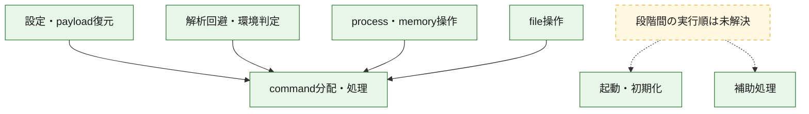

# 全体ロジック：2c6790b4141e5bbd9684c129acb2a7aeb1b8b3c167dfdfd6b3e9df7013bd1f4d

代表関数の静的証跡から、起動・初期化、設定・payload復元、解析回避・環境判定、process・memory操作、command分配・処理、file操作の処理群を確認しました。

## 読み方

- phaseの掲載順は解析上の整理順です。observed_call_edgesがない段階間の実行順を断定しません。
- 図の実線は静的に観測した関係、点線と黄色のノードは未観測・未解決の関係を示します。
- 図は静的な要約であり、動的実行を再現するものではありません。
- 詳細な関数解説とfingerprintは[STATIC-LOGIC.md](STATIC-LOGIC.md)を参照してください。

## 静的可視化

### 実行フロー

### 感染チェーン

```mermaid
flowchart TD
  chain_initial["初期侵入・配布経路は未観測"]
  chain_01["提出検体 / sha256:2c6790b4141e….exe / pe"]
  chain_02["静的復元層 1 / sha256:2c6790b4141e….exe::7z-7z / 7z"]
  chain_03["静的復元層 1 / sha256:2c6790b4141e….exe::7z-pe / pe"]
  chain_04["静的復元層 1 / sha256:2c6790b4141e….exe::7z-pe / pe"]
  chain_05["静的復元層 1 / sha256:2c6790b4141e….exe::7z-pe / pe"]
  chain_06["静的復元層 1 / sha256:2c6790b4141e….exe::7z-script / data"]
  chain_07["静的復元層 2 / sha256:2c6790b4141e….exe::7z-7z::7z-data / data"]
  chain_08["静的復元層 2 / sha256:2c6790b4141e….exe::7z-7z::7z-data / data"]
  chain_09["静的復元層 2 / sha256:2c6790b4141e….exe::7z-7z::7z-data / data"]
  chain_10["静的復元層 2 / sha256:2c6790b4141e….exe::7z-7z::7z-data / data"]
  chain_11["静的復元層 2 / sha256:2c6790b4141e….exe::7z-7z::7z-data / data"]
  chain_12["静的復元層 2 / sha256:2c6790b4141e….exe::7z-7z::7z-data / data"]
  chain_13["静的復元層 2 / sha256:2c6790b4141e….exe::7z-7z::7z-data / data"]
  chain_14["静的復元層 2 / sha256:2c6790b4141e….exe::7z-7z::7z-data / data"]
  chain_15["静的復元層 2 / sha256:2c6790b4141e….exe::7z-7z::7z-data / data"]
  chain_16["静的復元層 2 / sha256:2c6790b4141e….exe::7z-7z::7z-data / data"]
  chain_01 -->|7z-7z| chain_02
  chain_01 -->|7z-pe| chain_03
  chain_01 -->|7z-pe| chain_04
  chain_01 -->|7z-pe| chain_05
  chain_01 -->|7z-script| chain_06
  chain_02 -->|7z-data| chain_07
  chain_02 -->|7z-data| chain_08
  chain_02 -->|7z-data| chain_09
  chain_02 -->|7z-data| chain_10
  chain_02 -->|7z-data| chain_11
  chain_02 -->|7z-data| chain_12
  chain_02 -->|7z-data| chain_13
  chain_02 -->|7z-data| chain_14
  chain_02 -->|7z-data| chain_15
  chain_02 -->|7z-data| chain_16
  chain_initial -.-> chain_01
  chain_more["その他21層はstatic-layers.jsonを参照"]
  chain_03 -.-> chain_more
  chain_04 -.-> chain_more
  chain_05 -.-> chain_more
  chain_06 -.-> chain_more
  chain_07 -.-> chain_more
  chain_08 -.-> chain_more
  chain_09 -.-> chain_more
  chain_10 -.-> chain_more
  chain_11 -.-> chain_more
  chain_12 -.-> chain_more
  chain_13 -.-> chain_more
  chain_14 -.-> chain_more
  chain_15 -.-> chain_more
  chain_16 -.-> chain_more
  class chain_more unresolved
  class chain_01,chain_02,chain_03,chain_04,chain_05,chain_06,chain_07,chain_08,chain_09,chain_10,chain_11,chain_12,chain_13,chain_14,chain_15,chain_16 confirmed
  class chain_initial unresolved
  classDef confirmed fill:#e8f5e9,stroke:#2e7d32,color:#1b1b1b
  classDef unresolved fill:#fff8e1,stroke:#f9a825,color:#1b1b1b,stroke-dasharray:5 5
```

### モジュール関係

```mermaid
flowchart TD
  module_scope["解析対象のprogram構造"]
  module_01["sha256:3eb38ae99653… / x86 / statically_recovered_program"]
  module_02["sha256:b72e9013a620… / x86 / statically_recovered_program"]
  module_03["sha256:9b1fbf0c11c5… / x86 / statically_recovered_program"]
  module_04["sha256:6a5cc9c5b3e3… / AARCH64 / statically_recovered_program"]
  module_05["sha256:386e7a520b14… / x86 / statically_recovered_program"]
  module_06["sha256:b393f05e8ff9… / x86 / statically_recovered_program"]
  module_07["sha256:e142752e073c… / x86 / statically_recovered_program"]
  module_08["sha256:5789ca1822f3… / x86 / statically_recovered_program"]
  module_09["sha256:f806f89dc41d… / x86 / statically_recovered_program"]
  module_10["sha256:e1ab367644f7… / x86 / statically_recovered_program"]
  module_11["sha256:7353f25dc5cf… / x86 / statically_recovered_program"]
  module_12["sha256:2df870c1719a… / x86 / statically_recovered_program"]
  module_parent_unknown["復元元・親moduleは未特定"]
  module_parent_unknown -.-> module_01
  module_parent_unknown -.-> module_02
  module_parent_unknown -.-> module_03
  module_parent_unknown -.-> module_04
  module_parent_unknown -.-> module_05
  module_parent_unknown -.-> module_06
  module_parent_unknown -.-> module_07
  module_parent_unknown -.-> module_08
  module_parent_unknown -.-> module_09
  module_parent_unknown -.-> module_10
  module_parent_unknown -.-> module_11
  module_parent_unknown -.-> module_12
  class module_parent_unknown unresolved
  module_more["その他2moduleはstatic-logic.jsonを参照"]
  module_scope -.-> module_more
  class module_more unresolved
  class module_scope confirmed
  class module_01,module_02,module_03,module_04,module_05,module_06,module_07,module_08,module_09,module_10,module_11,module_12 confirmed
  classDef confirmed fill:#e8f5e9,stroke:#2e7d32,color:#1b1b1b
  classDef unresolved fill:#fff8e1,stroke:#f9a825,color:#1b1b1b,stroke-dasharray:5 5
```

## 処理段階

### 1. 起動・初期化

entry pointから初期化と後続処理への移行を確認します。
確度: `confirmed_static_function_evidence`

- `386e7a520b143aa7b6fa1a28a0237391a938bbedd0b245733a3da3a215026a3f:ghidra:1800045f0` — 初期化と主要処理への分岐を行う入口関数です。 状態: `succeeded`、選定理由: `entry_point`, `meaningful_symbol_name`, `reviewed_call_centrality:5`, `role:entrypoint`

### 2. 設定・payload復元

設定、resource、payload、暗号化データの復元・変換を確認します。
確度: `confirmed_static_function_evidence`

- `e142752e073c0051a0beb963981af70263ed673959515545521a7941d3230838:ghidra:1800013d0` — 設定、resource、payloadなどの解析・変換を行う関数です。 状態: `succeeded`、選定理由: `entry_point`, `meaningful_symbol_name`, `reviewed_call_centrality:2`, `role:config_or_data_transform`
- `e142752e073c0051a0beb963981af70263ed673959515545521a7941d3230838:ghidra:180001670` — 設定、resource、payloadなどの解析・変換を行う関数です。 状態: `succeeded`、選定理由: `entry_point`, `meaningful_symbol_name`, `reviewed_call_centrality:2`, `role:config_or_data_transform`
- `e142752e073c0051a0beb963981af70263ed673959515545521a7941d3230838:ghidra:1800016b0` — 設定、resource、payloadなどの解析・変換を行う関数です。 状態: `succeeded`、選定理由: `entry_point`, `meaningful_symbol_name`, `reviewed_call_centrality:2`, `role:config_or_data_transform`
- `e142752e073c0051a0beb963981af70263ed673959515545521a7941d3230838:ghidra:180002120` — 暗号、hash、encoding、または復号処理に関係する関数です。 状態: `succeeded`、選定理由: `entry_point`, `meaningful_symbol_name`, `reviewed_call_centrality:2`, `role:cryptographic_transform`
- `e142752e073c0051a0beb963981af70263ed673959515545521a7941d3230838:ghidra:180002220` — 暗号、hash、encoding、または復号処理に関係する関数です。 状態: `succeeded`、選定理由: `entry_point`, `meaningful_symbol_name`, `reviewed_call_centrality:2`, `role:cryptographic_transform`
- `b0ff1bad8e2f34b12dfcc4b5387bdc042f9bc2f963e11dea1758397ca0e907ea:ghidra:18000ae40` — 設定、resource、payloadなどの解析・変換を行う関数です。 状態: `succeeded`、選定理由: `entry_point`, `meaningful_symbol_name`, `reviewed_call_centrality:9`, `role:config_or_data_transform`
- `b0ff1bad8e2f34b12dfcc4b5387bdc042f9bc2f963e11dea1758397ca0e907ea:ghidra:18000b4e0` — 設定、resource、payloadなどの解析・変換を行う関数です。 状態: `succeeded`、選定理由: `entry_point`, `meaningful_symbol_name`, `reviewed_call_centrality:7`, `role:config_or_data_transform`
- `b0ff1bad8e2f34b12dfcc4b5387bdc042f9bc2f963e11dea1758397ca0e907ea:ghidra:18000b5a0` — 設定、resource、payloadなどの解析・変換を行う関数です。 状態: `succeeded`、選定理由: `entry_point`, `meaningful_symbol_name`, `reviewed_call_centrality:7`, `role:config_or_data_transform`
- `b0ff1bad8e2f34b12dfcc4b5387bdc042f9bc2f963e11dea1758397ca0e907ea:ghidra:18000d7f0` — 暗号、hash、encoding、または復号処理に関係する関数です。 状態: `succeeded`、選定理由: `entry_point`, `meaningful_symbol_name`, `reviewed_call_centrality:7`, `role:cryptographic_transform`
- `b0ff1bad8e2f34b12dfcc4b5387bdc042f9bc2f963e11dea1758397ca0e907ea:ghidra:18000db10` — 暗号、hash、encoding、または復号処理に関係する関数です。 状態: `succeeded`、選定理由: `entry_point`, `meaningful_symbol_name`, `reviewed_call_centrality:14`, `role:cryptographic_transform`
- `b0ff1bad8e2f34b12dfcc4b5387bdc042f9bc2f963e11dea1758397ca0e907ea:ghidra:180012e90` — 暗号、hash、encoding、または復号処理に関係する関数です。 状態: `succeeded`、選定理由: `entry_point`, `meaningful_symbol_name`, `reviewed_call_centrality:12`, `role:cryptographic_transform`
- `b0ff1bad8e2f34b12dfcc4b5387bdc042f9bc2f963e11dea1758397ca0e907ea:ghidra:1800138d0` — 暗号、hash、encoding、または復号処理に関係する関数です。 状態: `succeeded`、選定理由: `entry_point`, `meaningful_symbol_name`, `reviewed_call_centrality:25`, `role:cryptographic_transform`
- `b0ff1bad8e2f34b12dfcc4b5387bdc042f9bc2f963e11dea1758397ca0e907ea:ghidra:180014c40` — 暗号、hash、encoding、または復号処理に関係する関数です。 状態: `succeeded`、選定理由: `entry_point`, `meaningful_symbol_name`, `reviewed_call_centrality:32`, `role:cryptographic_transform`
- `b0ff1bad8e2f34b12dfcc4b5387bdc042f9bc2f963e11dea1758397ca0e907ea:ghidra:1800151f0` — 暗号、hash、encoding、または復号処理に関係する関数です。 状態: `succeeded`、選定理由: `entry_point`, `meaningful_symbol_name`, `reviewed_call_centrality:6`, `role:cryptographic_transform`
- `b0ff1bad8e2f34b12dfcc4b5387bdc042f9bc2f963e11dea1758397ca0e907ea:ghidra:180015530` — 暗号、hash、encoding、または復号処理に関係する関数です。 状態: `succeeded`、選定理由: `entry_point`, `meaningful_symbol_name`, `reviewed_call_centrality:26`, `role:cryptographic_transform`
- `b0ff1bad8e2f34b12dfcc4b5387bdc042f9bc2f963e11dea1758397ca0e907ea:ghidra:1800157d0` — 暗号、hash、encoding、または復号処理に関係する関数です。 状態: `succeeded`、選定理由: `entry_point`, `meaningful_symbol_name`, `reviewed_call_centrality:17`, `role:cryptographic_transform`
- `b0ff1bad8e2f34b12dfcc4b5387bdc042f9bc2f963e11dea1758397ca0e907ea:ghidra:180016b20` — 暗号、hash、encoding、または復号処理に関係する関数です。 状態: `succeeded`、選定理由: `entry_point`, `meaningful_symbol_name`, `reviewed_call_centrality:11`, `role:cryptographic_transform`
- `b0ff1bad8e2f34b12dfcc4b5387bdc042f9bc2f963e11dea1758397ca0e907ea:ghidra:1800170d0` — 暗号、hash、encoding、または復号処理に関係する関数です。 状態: `succeeded`、選定理由: `entry_point`, `meaningful_symbol_name`, `reviewed_call_centrality:11`, `role:cryptographic_transform`
- `b0ff1bad8e2f34b12dfcc4b5387bdc042f9bc2f963e11dea1758397ca0e907ea:ghidra:180017160` — 暗号、hash、encoding、または復号処理に関係する関数です。 状態: `succeeded`、選定理由: `entry_point`, `meaningful_symbol_name`, `reviewed_call_centrality:11`, `role:cryptographic_transform`
- `b0ff1bad8e2f34b12dfcc4b5387bdc042f9bc2f963e11dea1758397ca0e907ea:ghidra:1800171f0` — 暗号、hash、encoding、または復号処理に関係する関数です。 状態: `succeeded`、選定理由: `entry_point`, `meaningful_symbol_name`, `reviewed_call_centrality:11`, `role:cryptographic_transform`

### 3. 解析回避・環境判定

debugger、sandbox、仮想環境、時間差などの判定を確認します。
確度: `confirmed_static_function_evidence`

- `e142752e073c0051a0beb963981af70263ed673959515545521a7941d3230838:ghidra:180001e50` — debugger、仮想環境、sandbox、または時間差の確認に関係する関数です。 状態: `succeeded`、選定理由: `entry_point`, `meaningful_symbol_name`, `reviewed_call_centrality:2`, `role:anti_analysis`
- `e142752e073c0051a0beb963981af70263ed673959515545521a7941d3230838:ghidra:180001e90` — debugger、仮想環境、sandbox、または時間差の確認に関係する関数です。 状態: `succeeded`、選定理由: `entry_point`, `meaningful_symbol_name`, `reviewed_call_centrality:2`, `role:anti_analysis`
- `e142752e073c0051a0beb963981af70263ed673959515545521a7941d3230838:ghidra:180002720` — debugger、仮想環境、sandbox、または時間差の確認に関係する関数です。 状態: `succeeded`、選定理由: `entry_point`, `meaningful_symbol_name`, `reviewed_call_centrality:2`, `role:anti_analysis`
- `e142752e073c0051a0beb963981af70263ed673959515545521a7941d3230838:ghidra:180002790` — debugger、仮想環境、sandbox、または時間差の確認に関係する関数です。 状態: `succeeded`、選定理由: `entry_point`, `meaningful_symbol_name`, `reviewed_call_centrality:2`, `role:anti_analysis`
- `b0ff1bad8e2f34b12dfcc4b5387bdc042f9bc2f963e11dea1758397ca0e907ea:ghidra:18000cf60` — debugger、仮想環境、sandbox、または時間差の確認に関係する関数です。 状態: `succeeded`、選定理由: `entry_point`, `meaningful_symbol_name`, `reviewed_call_centrality:8`, `role:anti_analysis`
- `b0ff1bad8e2f34b12dfcc4b5387bdc042f9bc2f963e11dea1758397ca0e907ea:ghidra:18000d020` — debugger、仮想環境、sandbox、または時間差の確認に関係する関数です。 状態: `succeeded`、選定理由: `entry_point`, `meaningful_symbol_name`, `reviewed_call_centrality:7`, `role:anti_analysis`
- `b0ff1bad8e2f34b12dfcc4b5387bdc042f9bc2f963e11dea1758397ca0e907ea:ghidra:18000ead0` — debugger、仮想環境、sandbox、または時間差の確認に関係する関数です。 状態: `succeeded`、選定理由: `entry_point`, `meaningful_symbol_name`, `reviewed_call_centrality:8`, `role:anti_analysis`
- `b0ff1bad8e2f34b12dfcc4b5387bdc042f9bc2f963e11dea1758397ca0e907ea:ghidra:18000ec70` — debugger、仮想環境、sandbox、または時間差の確認に関係する関数です。 状態: `succeeded`、選定理由: `entry_point`, `meaningful_symbol_name`, `reviewed_call_centrality:6`, `role:anti_analysis`

### 4. process・memory操作

process、thread、module、memory操作と実行移行を確認します。
確度: `confirmed_static_function_evidence`

- `e142752e073c0051a0beb963981af70263ed673959515545521a7941d3230838:ghidra:180001b20` — process、thread、module、またはmemory操作に関係する関数です。 状態: `succeeded`、選定理由: `entry_point`, `meaningful_symbol_name`, `reviewed_call_centrality:2`, `role:process_or_memory_operation`
- `b0ff1bad8e2f34b12dfcc4b5387bdc042f9bc2f963e11dea1758397ca0e907ea:ghidra:18000c430` — process、thread、module、またはmemory操作に関係する関数です。 状態: `succeeded`、選定理由: `entry_point`, `meaningful_symbol_name`, `reviewed_call_centrality:6`, `role:process_or_memory_operation`

### 5. command分配・処理

受信commandやtaskの解釈、分配、個別handlerへの移行を確認します。
確度: `confirmed_static_function_evidence_with_limits`

- `6a5cc9c5b3e390fe08fea0de3a22248d5836cea0b26aa6a80d9447c45ec04b12:ghidra:180001050` — commandの解釈、分配、または個別処理を担当する関数です。 状態: `limited_bad_instruction_or_flow`、選定理由: `meaningful_symbol_name`, `role:command_dispatch_or_handler`
- `386e7a520b143aa7b6fa1a28a0237391a938bbedd0b245733a3da3a215026a3f:ghidra:180012dd0` — commandの解釈、分配、または個別処理を担当する関数です。 状態: `limited_bad_instruction_or_flow`、選定理由: `meaningful_symbol_name`, `role:command_dispatch_or_handler`
- `e142752e073c0051a0beb963981af70263ed673959515545521a7941d3230838:ghidra:1800014d0` — commandの解釈、分配、または個別処理を担当する関数です。 状態: `succeeded`、選定理由: `entry_point`, `meaningful_symbol_name`, `reviewed_call_centrality:2`, `role:command_dispatch_or_handler`
- `e142752e073c0051a0beb963981af70263ed673959515545521a7941d3230838:ghidra:180001510` — commandの解釈、分配、または個別処理を担当する関数です。 状態: `succeeded`、選定理由: `entry_point`, `meaningful_symbol_name`, `reviewed_call_centrality:2`, `role:command_dispatch_or_handler`
- `e142752e073c0051a0beb963981af70263ed673959515545521a7941d3230838:ghidra:180001550` — commandの解釈、分配、または個別処理を担当する関数です。 状態: `succeeded`、選定理由: `entry_point`, `meaningful_symbol_name`, `reviewed_call_centrality:2`, `role:command_dispatch_or_handler`
- `e142752e073c0051a0beb963981af70263ed673959515545521a7941d3230838:ghidra:180001590` — commandの解釈、分配、または個別処理を担当する関数です。 状態: `succeeded`、選定理由: `entry_point`, `meaningful_symbol_name`, `reviewed_call_centrality:2`, `role:command_dispatch_or_handler`
- `e142752e073c0051a0beb963981af70263ed673959515545521a7941d3230838:ghidra:1800015d0` — commandの解釈、分配、または個別処理を担当する関数です。 状態: `succeeded`、選定理由: `entry_point`, `meaningful_symbol_name`, `reviewed_call_centrality:2`, `role:command_dispatch_or_handler`
- `e142752e073c0051a0beb963981af70263ed673959515545521a7941d3230838:ghidra:180001610` — commandの解釈、分配、または個別処理を担当する関数です。 状態: `succeeded`、選定理由: `entry_point`, `meaningful_symbol_name`, `reviewed_call_centrality:2`, `role:command_dispatch_or_handler`
- `e142752e073c0051a0beb963981af70263ed673959515545521a7941d3230838:ghidra:180001640` — commandの解釈、分配、または個別処理を担当する関数です。 状態: `succeeded`、選定理由: `entry_point`, `meaningful_symbol_name`, `reviewed_call_centrality:2`, `role:command_dispatch_or_handler`
- `e142752e073c0051a0beb963981af70263ed673959515545521a7941d3230838:ghidra:1800016f0` — commandの解釈、分配、または個別処理を担当する関数です。 状態: `succeeded`、選定理由: `entry_point`, `meaningful_symbol_name`, `reviewed_call_centrality:2`, `role:command_dispatch_or_handler`
- `e142752e073c0051a0beb963981af70263ed673959515545521a7941d3230838:ghidra:180001710` — commandの解釈、分配、または個別処理を担当する関数です。 状態: `succeeded`、選定理由: `entry_point`, `meaningful_symbol_name`, `reviewed_call_centrality:2`, `role:command_dispatch_or_handler`
- `e142752e073c0051a0beb963981af70263ed673959515545521a7941d3230838:ghidra:180001740` — commandの解釈、分配、または個別処理を担当する関数です。 状態: `succeeded`、選定理由: `entry_point`, `meaningful_symbol_name`, `reviewed_call_centrality:2`, `role:command_dispatch_or_handler`
- `e142752e073c0051a0beb963981af70263ed673959515545521a7941d3230838:ghidra:180001770` — commandの解釈、分配、または個別処理を担当する関数です。 状態: `succeeded`、選定理由: `entry_point`, `meaningful_symbol_name`, `reviewed_call_centrality:2`, `role:command_dispatch_or_handler`
- `5789ca1822f3a5a67cd2c24e6ff0307e688b76a2e99831050bdcf8b8d155956d:ghidra:180001020` — commandの解釈、分配、または個別処理を担当する関数です。 状態: `succeeded`、選定理由: `context_representative`, `reviewed_call_centrality:1`, `role:command_dispatch_or_handler`
- `5789ca1822f3a5a67cd2c24e6ff0307e688b76a2e99831050bdcf8b8d155956d:ghidra:180001060` — commandの解釈、分配、または個別処理を担当する関数です。 状態: `succeeded`、選定理由: `context_representative`, `reviewed_call_centrality:3`, `role:command_dispatch_or_handler`
- `5789ca1822f3a5a67cd2c24e6ff0307e688b76a2e99831050bdcf8b8d155956d:ghidra:180001230` — commandの解釈、分配、または個別処理を担当する関数です。 状態: `succeeded`、選定理由: `context_representative`, `reviewed_call_centrality:4`, `role:command_dispatch_or_handler`
- `5789ca1822f3a5a67cd2c24e6ff0307e688b76a2e99831050bdcf8b8d155956d:ghidra:180001340` — commandの解釈、分配、または個別処理を担当する関数です。 状態: `succeeded`、選定理由: `context_representative`, `reviewed_call_centrality:4`, `role:command_dispatch_or_handler`
- `5789ca1822f3a5a67cd2c24e6ff0307e688b76a2e99831050bdcf8b8d155956d:ghidra:180001460` — commandの解釈、分配、または個別処理を担当する関数です。 状態: `succeeded`、選定理由: `context_representative`, `reviewed_call_centrality:4`, `role:command_dispatch_or_handler`
- `5789ca1822f3a5a67cd2c24e6ff0307e688b76a2e99831050bdcf8b8d155956d:ghidra:1800015d0` — commandの解釈、分配、または個別処理を担当する関数です。 状態: `succeeded`、選定理由: `context_representative`, `reviewed_call_centrality:7`, `role:command_dispatch_or_handler`
- `5789ca1822f3a5a67cd2c24e6ff0307e688b76a2e99831050bdcf8b8d155956d:ghidra:180001670` — commandの解釈、分配、または個別処理を担当する関数です。 状態: `succeeded`、選定理由: `context_representative`, `reviewed_call_centrality:11`, `role:command_dispatch_or_handler`
- `5789ca1822f3a5a67cd2c24e6ff0307e688b76a2e99831050bdcf8b8d155956d:ghidra:180001760` — commandの解釈、分配、または個別処理を担当する関数です。 状態: `succeeded`、選定理由: `context_representative`, `reviewed_call_centrality:7`, `role:command_dispatch_or_handler`
- `5789ca1822f3a5a67cd2c24e6ff0307e688b76a2e99831050bdcf8b8d155956d:ghidra:1800018c0` — commandの解釈、分配、または個別処理を担当する関数です。 状態: `succeeded`、選定理由: `context_representative`, `reviewed_call_centrality:7`, `role:command_dispatch_or_handler`
- `2df870c1719ab057ea37aa15e3e379360c1dd8eaea2eaa56cb7b026f5ee4f19f:ghidra:180001020` — commandの解釈、分配、または個別処理を担当する関数です。 状態: `succeeded`、選定理由: `context_representative`, `reviewed_call_centrality:1`, `role:command_dispatch_or_handler`
- `2df870c1719ab057ea37aa15e3e379360c1dd8eaea2eaa56cb7b026f5ee4f19f:ghidra:180001060` — commandの解釈、分配、または個別処理を担当する関数です。 状態: `succeeded`、選定理由: `context_representative`, `reviewed_call_centrality:8`, `role:command_dispatch_or_handler`
- `2df870c1719ab057ea37aa15e3e379360c1dd8eaea2eaa56cb7b026f5ee4f19f:ghidra:180001180` — commandの解釈、分配、または個別処理を担当する関数です。 状態: `succeeded`、選定理由: `context_representative`, `reviewed_call_centrality:6`, `role:command_dispatch_or_handler`
- `2df870c1719ab057ea37aa15e3e379360c1dd8eaea2eaa56cb7b026f5ee4f19f:ghidra:180001300` — commandの解釈、分配、または個別処理を担当する関数です。 状態: `succeeded`、選定理由: `context_representative`, `reviewed_call_centrality:6`, `role:command_dispatch_or_handler`
- `2df870c1719ab057ea37aa15e3e379360c1dd8eaea2eaa56cb7b026f5ee4f19f:ghidra:180001470` — commandの解釈、分配、または個別処理を担当する関数です。 状態: `succeeded`、選定理由: `context_representative`, `reviewed_call_centrality:8`, `role:command_dispatch_or_handler`
- `2df870c1719ab057ea37aa15e3e379360c1dd8eaea2eaa56cb7b026f5ee4f19f:ghidra:1800016b0` — commandの解釈、分配、または個別処理を担当する関数です。 状態: `succeeded`、選定理由: `context_representative`, `reviewed_call_centrality:8`, `role:command_dispatch_or_handler`
- `2df870c1719ab057ea37aa15e3e379360c1dd8eaea2eaa56cb7b026f5ee4f19f:ghidra:180001910` — commandの解釈、分配、または個別処理を担当する関数です。 状態: `succeeded`、選定理由: `context_representative`, `reviewed_call_centrality:8`, `role:command_dispatch_or_handler`
- `2df870c1719ab057ea37aa15e3e379360c1dd8eaea2eaa56cb7b026f5ee4f19f:ghidra:180001b50` — commandの解釈、分配、または個別処理を担当する関数です。 状態: `succeeded`、選定理由: `context_representative`, `reviewed_call_centrality:8`, `role:command_dispatch_or_handler`

### 6. file操作

fileやdirectoryの作成、読書き、削除を確認します。
確度: `confirmed_static_function_evidence`

- `e142752e073c0051a0beb963981af70263ed673959515545521a7941d3230838:ghidra:180002380` — fileまたはdirectoryの読書き・管理に関係する関数です。 状態: `succeeded`、選定理由: `entry_point`, `meaningful_symbol_name`, `reviewed_call_centrality:2`, `role:file_operation`
- `e142752e073c0051a0beb963981af70263ed673959515545521a7941d3230838:ghidra:1800023c0` — fileまたはdirectoryの読書き・管理に関係する関数です。 状態: `succeeded`、選定理由: `entry_point`, `meaningful_symbol_name`, `reviewed_call_centrality:2`, `role:file_operation`
- `e142752e073c0051a0beb963981af70263ed673959515545521a7941d3230838:ghidra:180002a50` — fileまたはdirectoryの読書き・管理に関係する関数です。 状態: `succeeded`、選定理由: `entry_point`, `meaningful_symbol_name`, `reviewed_call_centrality:2`, `role:file_operation`
- `e142752e073c0051a0beb963981af70263ed673959515545521a7941d3230838:ghidra:180002a80` — fileまたはdirectoryの読書き・管理に関係する関数です。 状態: `succeeded`、選定理由: `entry_point`, `meaningful_symbol_name`, `reviewed_call_centrality:2`, `role:file_operation`
- `e142752e073c0051a0beb963981af70263ed673959515545521a7941d3230838:ghidra:180002ab0` — fileまたはdirectoryの読書き・管理に関係する関数です。 状態: `succeeded`、選定理由: `entry_point`, `meaningful_symbol_name`, `reviewed_call_centrality:2`, `role:file_operation`
- `e142752e073c0051a0beb963981af70263ed673959515545521a7941d3230838:ghidra:180002af0` — fileまたはdirectoryの読書き・管理に関係する関数です。 状態: `succeeded`、選定理由: `entry_point`, `meaningful_symbol_name`, `reviewed_call_centrality:2`, `role:file_operation`
- `e142752e073c0051a0beb963981af70263ed673959515545521a7941d3230838:ghidra:180002b30` — fileまたはdirectoryの読書き・管理に関係する関数です。 状態: `succeeded`、選定理由: `entry_point`, `meaningful_symbol_name`, `reviewed_call_centrality:2`, `role:file_operation`
- `e142752e073c0051a0beb963981af70263ed673959515545521a7941d3230838:ghidra:180002b70` — fileまたはdirectoryの読書き・管理に関係する関数です。 状態: `succeeded`、選定理由: `entry_point`, `meaningful_symbol_name`, `reviewed_call_centrality:2`, `role:file_operation`
- `e142752e073c0051a0beb963981af70263ed673959515545521a7941d3230838:ghidra:180002ba0` — fileまたはdirectoryの読書き・管理に関係する関数です。 状態: `succeeded`、選定理由: `entry_point`, `meaningful_symbol_name`, `reviewed_call_centrality:2`, `role:file_operation`
- `e142752e073c0051a0beb963981af70263ed673959515545521a7941d3230838:ghidra:180002bd0` — fileまたはdirectoryの読書き・管理に関係する関数です。 状態: `succeeded`、選定理由: `entry_point`, `meaningful_symbol_name`, `reviewed_call_centrality:2`, `role:file_operation`
- `e142752e073c0051a0beb963981af70263ed673959515545521a7941d3230838:ghidra:180002cc0` — fileまたはdirectoryの読書き・管理に関係する関数です。 状態: `succeeded`、選定理由: `entry_point`, `meaningful_symbol_name`, `reviewed_call_centrality:2`, `role:file_operation`
- `b0ff1bad8e2f34b12dfcc4b5387bdc042f9bc2f963e11dea1758397ca0e907ea:ghidra:18000dee0` — fileまたはdirectoryの読書き・管理に関係する関数です。 状態: `succeeded`、選定理由: `entry_point`, `meaningful_symbol_name`, `reviewed_call_centrality:9`, `role:file_operation`
- `b0ff1bad8e2f34b12dfcc4b5387bdc042f9bc2f963e11dea1758397ca0e907ea:ghidra:18000dfc0` — fileまたはdirectoryの読書き・管理に関係する関数です。 状態: `succeeded`、選定理由: `entry_point`, `meaningful_symbol_name`, `reviewed_call_centrality:9`, `role:file_operation`
- `b0ff1bad8e2f34b12dfcc4b5387bdc042f9bc2f963e11dea1758397ca0e907ea:ghidra:18000f560` — fileまたはdirectoryの読書き・管理に関係する関数です。 状態: `succeeded`、選定理由: `entry_point`, `meaningful_symbol_name`, `reviewed_call_centrality:9`, `role:file_operation`
- `b0ff1bad8e2f34b12dfcc4b5387bdc042f9bc2f963e11dea1758397ca0e907ea:ghidra:18000f630` — fileまたはdirectoryの読書き・管理に関係する関数です。 状態: `succeeded`、選定理由: `entry_point`, `meaningful_symbol_name`, `reviewed_call_centrality:7`, `role:file_operation`
- `b0ff1bad8e2f34b12dfcc4b5387bdc042f9bc2f963e11dea1758397ca0e907ea:ghidra:18000f6d0` — fileまたはdirectoryの読書き・管理に関係する関数です。 状態: `succeeded`、選定理由: `entry_point`, `meaningful_symbol_name`, `reviewed_call_centrality:7`, `role:file_operation`
- `b0ff1bad8e2f34b12dfcc4b5387bdc042f9bc2f963e11dea1758397ca0e907ea:ghidra:18000f790` — fileまたはdirectoryの読書き・管理に関係する関数です。 状態: `succeeded`、選定理由: `entry_point`, `meaningful_symbol_name`, `reviewed_call_centrality:7`, `role:file_operation`
- `b0ff1bad8e2f34b12dfcc4b5387bdc042f9bc2f963e11dea1758397ca0e907ea:ghidra:18000f850` — fileまたはdirectoryの読書き・管理に関係する関数です。 状態: `succeeded`、選定理由: `entry_point`, `meaningful_symbol_name`, `reviewed_call_centrality:7`, `role:file_operation`
- `b0ff1bad8e2f34b12dfcc4b5387bdc042f9bc2f963e11dea1758397ca0e907ea:ghidra:18000f910` — fileまたはdirectoryの読書き・管理に関係する関数です。 状態: `succeeded`、選定理由: `entry_point`, `meaningful_symbol_name`, `reviewed_call_centrality:7`, `role:file_operation`
- `b0ff1bad8e2f34b12dfcc4b5387bdc042f9bc2f963e11dea1758397ca0e907ea:ghidra:18000f9b0` — fileまたはdirectoryの読書き・管理に関係する関数です。 状態: `succeeded`、選定理由: `entry_point`, `meaningful_symbol_name`, `reviewed_call_centrality:7`, `role:file_operation`
- `b0ff1bad8e2f34b12dfcc4b5387bdc042f9bc2f963e11dea1758397ca0e907ea:ghidra:18000fa50` — fileまたはdirectoryの読書き・管理に関係する関数です。 状態: `succeeded`、選定理由: `entry_point`, `meaningful_symbol_name`, `reviewed_call_centrality:7`, `role:file_operation`
- `b0ff1bad8e2f34b12dfcc4b5387bdc042f9bc2f963e11dea1758397ca0e907ea:ghidra:18000fd60` — fileまたはdirectoryの読書き・管理に関係する関数です。 状態: `succeeded`、選定理由: `entry_point`, `meaningful_symbol_name`, `reviewed_call_centrality:9`, `role:file_operation`

### 7. 補助処理

主要処理を支える一般内部関数またはlibrary処理を確認します。
確度: `confirmed_static_function_evidence_with_limits`

- `9b1fbf0c11c520ae714af8aa9af12cfd48503eedecd7398d8992ee94d1b4dc37:ghidra:00401eda` — 検体内部の一般処理を実装する関数です。 状態: `succeeded`、選定理由: `meaningful_symbol_name`, `small_program_complete_context`
- `6a5cc9c5b3e390fe08fea0de3a22248d5836cea0b26aa6a80d9447c45ec04b12:ghidra:1800014f0` — 検体内部の一般処理を実装する関数です。 状態: `succeeded`、選定理由: `meaningful_symbol_name`
- `6a5cc9c5b3e390fe08fea0de3a22248d5836cea0b26aa6a80d9447c45ec04b12:ghidra:180003ef0` — 検体内部の一般処理を実装する関数です。 状態: `limited_bad_instruction_or_flow`、選定理由: `meaningful_symbol_name`, `reviewed_call_centrality:1`
- `6a5cc9c5b3e390fe08fea0de3a22248d5836cea0b26aa6a80d9447c45ec04b12:ghidra:180003efc` — 検体内部の一般処理を実装する関数です。 状態: `limited_bad_instruction_or_flow`、選定理由: `meaningful_symbol_name`, `reviewed_call_centrality:1`
- `6a5cc9c5b3e390fe08fea0de3a22248d5836cea0b26aa6a80d9447c45ec04b12:ghidra:180003f08` — 検体内部の一般処理を実装する関数です。 状態: `limited_bad_instruction_or_flow`、選定理由: `meaningful_symbol_name`, `reviewed_call_centrality:1`
- `6a5cc9c5b3e390fe08fea0de3a22248d5836cea0b26aa6a80d9447c45ec04b12:ghidra:180003f14` — 検体内部の一般処理を実装する関数です。 状態: `limited_bad_instruction_or_flow`、選定理由: `meaningful_symbol_name`, `reviewed_call_centrality:1`
- `6a5cc9c5b3e390fe08fea0de3a22248d5836cea0b26aa6a80d9447c45ec04b12:ghidra:180003f20` — 検体内部の一般処理を実装する関数です。 状態: `limited_bad_instruction_or_flow`、選定理由: `meaningful_symbol_name`, `reviewed_call_centrality:1`
- `6a5cc9c5b3e390fe08fea0de3a22248d5836cea0b26aa6a80d9447c45ec04b12:ghidra:180003f2c` — 検体内部の一般処理を実装する関数です。 状態: `limited_bad_instruction_or_flow`、選定理由: `meaningful_symbol_name`, `reviewed_call_centrality:1`
- `6a5cc9c5b3e390fe08fea0de3a22248d5836cea0b26aa6a80d9447c45ec04b12:ghidra:180003f38` — 検体内部の一般処理を実装する関数です。 状態: `limited_bad_instruction_or_flow`、選定理由: `meaningful_symbol_name`, `reviewed_call_centrality:1`
- `6a5cc9c5b3e390fe08fea0de3a22248d5836cea0b26aa6a80d9447c45ec04b12:ghidra:180003f44` — 検体内部の一般処理を実装する関数です。 状態: `limited_bad_instruction_or_flow`、選定理由: `meaningful_symbol_name`, `reviewed_call_centrality:1`
- `6a5cc9c5b3e390fe08fea0de3a22248d5836cea0b26aa6a80d9447c45ec04b12:ghidra:180003f50` — 検体内部の一般処理を実装する関数です。 状態: `limited_bad_instruction_or_flow`、選定理由: `meaningful_symbol_name`, `reviewed_call_centrality:1`
- `6a5cc9c5b3e390fe08fea0de3a22248d5836cea0b26aa6a80d9447c45ec04b12:ghidra:180003f5c` — 検体内部の一般処理を実装する関数です。 状態: `limited_bad_instruction_or_flow`、選定理由: `meaningful_symbol_name`, `reviewed_call_centrality:1`
- `6a5cc9c5b3e390fe08fea0de3a22248d5836cea0b26aa6a80d9447c45ec04b12:ghidra:180003f68` — 検体内部の一般処理を実装する関数です。 状態: `limited_bad_instruction_or_flow`、選定理由: `meaningful_symbol_name`, `reviewed_call_centrality:1`
- `6a5cc9c5b3e390fe08fea0de3a22248d5836cea0b26aa6a80d9447c45ec04b12:ghidra:180003f74` — 検体内部の一般処理を実装する関数です。 状態: `limited_bad_instruction_or_flow`、選定理由: `meaningful_symbol_name`, `reviewed_call_centrality:1`
- `6a5cc9c5b3e390fe08fea0de3a22248d5836cea0b26aa6a80d9447c45ec04b12:ghidra:180003f80` — 検体内部の一般処理を実装する関数です。 状態: `limited_bad_instruction_or_flow`、選定理由: `meaningful_symbol_name`, `reviewed_call_centrality:1`
- `6a5cc9c5b3e390fe08fea0de3a22248d5836cea0b26aa6a80d9447c45ec04b12:ghidra:180003f8c` — 検体内部の一般処理を実装する関数です。 状態: `limited_bad_instruction_or_flow`、選定理由: `meaningful_symbol_name`, `reviewed_call_centrality:1`
- `6a5cc9c5b3e390fe08fea0de3a22248d5836cea0b26aa6a80d9447c45ec04b12:ghidra:180003f98` — 検体内部の一般処理を実装する関数です。 状態: `limited_bad_instruction_or_flow`、選定理由: `meaningful_symbol_name`, `reviewed_call_centrality:1`
- `6a5cc9c5b3e390fe08fea0de3a22248d5836cea0b26aa6a80d9447c45ec04b12:ghidra:180003fa4` — 検体内部の一般処理を実装する関数です。 状態: `limited_bad_instruction_or_flow`、選定理由: `meaningful_symbol_name`, `reviewed_call_centrality:1`
- `6a5cc9c5b3e390fe08fea0de3a22248d5836cea0b26aa6a80d9447c45ec04b12:ghidra:180003fb0` — 検体内部の一般処理を実装する関数です。 状態: `limited_bad_instruction_or_flow`、選定理由: `meaningful_symbol_name`, `reviewed_call_centrality:1`
- `6a5cc9c5b3e390fe08fea0de3a22248d5836cea0b26aa6a80d9447c45ec04b12:ghidra:180003fbc` — 検体内部の一般処理を実装する関数です。 状態: `limited_bad_instruction_or_flow`、選定理由: `meaningful_symbol_name`, `reviewed_call_centrality:1`
- `6a5cc9c5b3e390fe08fea0de3a22248d5836cea0b26aa6a80d9447c45ec04b12:ghidra:180003fc8` — 検体内部の一般処理を実装する関数です。 状態: `limited_bad_instruction_or_flow`、選定理由: `meaningful_symbol_name`, `reviewed_call_centrality:1`
- `6a5cc9c5b3e390fe08fea0de3a22248d5836cea0b26aa6a80d9447c45ec04b12:ghidra:180003fd4` — 検体内部の一般処理を実装する関数です。 状態: `limited_bad_instruction_or_flow`、選定理由: `meaningful_symbol_name`, `reviewed_call_centrality:1`
- `6a5cc9c5b3e390fe08fea0de3a22248d5836cea0b26aa6a80d9447c45ec04b12:ghidra:180003fe0` — 検体内部の一般処理を実装する関数です。 状態: `limited_bad_instruction_or_flow`、選定理由: `meaningful_symbol_name`, `reviewed_call_centrality:1`
- `6a5cc9c5b3e390fe08fea0de3a22248d5836cea0b26aa6a80d9447c45ec04b12:ghidra:180003fec` — 検体内部の一般処理を実装する関数です。 状態: `limited_bad_instruction_or_flow`、選定理由: `meaningful_symbol_name`, `reviewed_call_centrality:1`
- `6a5cc9c5b3e390fe08fea0de3a22248d5836cea0b26aa6a80d9447c45ec04b12:ghidra:180003ff8` — 検体内部の一般処理を実装する関数です。 状態: `limited_bad_instruction_or_flow`、選定理由: `meaningful_symbol_name`, `reviewed_call_centrality:1`
- `6a5cc9c5b3e390fe08fea0de3a22248d5836cea0b26aa6a80d9447c45ec04b12:ghidra:180004004` — 検体内部の一般処理を実装する関数です。 状態: `limited_bad_instruction_or_flow`、選定理由: `meaningful_symbol_name`, `reviewed_call_centrality:1`
- `6a5cc9c5b3e390fe08fea0de3a22248d5836cea0b26aa6a80d9447c45ec04b12:ghidra:180004010` — 検体内部の一般処理を実装する関数です。 状態: `limited_bad_instruction_or_flow`、選定理由: `meaningful_symbol_name`, `reviewed_call_centrality:1`
- `6a5cc9c5b3e390fe08fea0de3a22248d5836cea0b26aa6a80d9447c45ec04b12:ghidra:18000401c` — 検体内部の一般処理を実装する関数です。 状態: `limited_bad_instruction_or_flow`、選定理由: `meaningful_symbol_name`, `reviewed_call_centrality:1`
- `6a5cc9c5b3e390fe08fea0de3a22248d5836cea0b26aa6a80d9447c45ec04b12:ghidra:180004028` — 検体内部の一般処理を実装する関数です。 状態: `limited_bad_instruction_or_flow`、選定理由: `meaningful_symbol_name`, `reviewed_call_centrality:1`
- `6a5cc9c5b3e390fe08fea0de3a22248d5836cea0b26aa6a80d9447c45ec04b12:ghidra:180004034` — 検体内部の一般処理を実装する関数です。 状態: `limited_bad_instruction_or_flow`、選定理由: `meaningful_symbol_name`, `reviewed_call_centrality:1`
- `6a5cc9c5b3e390fe08fea0de3a22248d5836cea0b26aa6a80d9447c45ec04b12:ghidra:180004040` — 検体内部の一般処理を実装する関数です。 状態: `limited_bad_instruction_or_flow`、選定理由: `meaningful_symbol_name`, `reviewed_call_centrality:1`
- `6a5cc9c5b3e390fe08fea0de3a22248d5836cea0b26aa6a80d9447c45ec04b12:ghidra:18000404c` — 検体内部の一般処理を実装する関数です。 状態: `limited_bad_instruction_or_flow`、選定理由: `meaningful_symbol_name`, `reviewed_call_centrality:1`
- `386e7a520b143aa7b6fa1a28a0237391a938bbedd0b245733a3da3a215026a3f:ghidra:1800010c0` — 検体内部の一般処理を実装する関数です。 状態: `succeeded`、選定理由: `meaningful_symbol_name`
- `386e7a520b143aa7b6fa1a28a0237391a938bbedd0b245733a3da3a215026a3f:ghidra:180002370` — 検体内部の一般処理を実装する関数です。 状態: `succeeded`、選定理由: `entry_point`, `meaningful_symbol_name`, `reviewed_call_centrality:2`
- `386e7a520b143aa7b6fa1a28a0237391a938bbedd0b245733a3da3a215026a3f:ghidra:1800040a1` — 検体内部の一般処理を実装する関数です。 状態: `limited_bad_instruction_or_flow`、選定理由: `meaningful_symbol_name`, `reviewed_call_centrality:1`
- `386e7a520b143aa7b6fa1a28a0237391a938bbedd0b245733a3da3a215026a3f:ghidra:1800040ad` — 検体内部の一般処理を実装する関数です。 状態: `limited_bad_instruction_or_flow`、選定理由: `meaningful_symbol_name`, `reviewed_call_centrality:1`
- `386e7a520b143aa7b6fa1a28a0237391a938bbedd0b245733a3da3a215026a3f:ghidra:1800040b9` — 検体内部の一般処理を実装する関数です。 状態: `limited_bad_instruction_or_flow`、選定理由: `meaningful_symbol_name`, `reviewed_call_centrality:1`
- `386e7a520b143aa7b6fa1a28a0237391a938bbedd0b245733a3da3a215026a3f:ghidra:1800040c5` — 検体内部の一般処理を実装する関数です。 状態: `limited_bad_instruction_or_flow`、選定理由: `meaningful_symbol_name`, `reviewed_call_centrality:1`
- `386e7a520b143aa7b6fa1a28a0237391a938bbedd0b245733a3da3a215026a3f:ghidra:1800040d1` — 検体内部の一般処理を実装する関数です。 状態: `limited_bad_instruction_or_flow`、選定理由: `meaningful_symbol_name`, `reviewed_call_centrality:1`
- `386e7a520b143aa7b6fa1a28a0237391a938bbedd0b245733a3da3a215026a3f:ghidra:1800040dd` — 検体内部の一般処理を実装する関数です。 状態: `limited_bad_instruction_or_flow`、選定理由: `meaningful_symbol_name`, `reviewed_call_centrality:1`
- `386e7a520b143aa7b6fa1a28a0237391a938bbedd0b245733a3da3a215026a3f:ghidra:1800040e9` — 検体内部の一般処理を実装する関数です。 状態: `limited_bad_instruction_or_flow`、選定理由: `meaningful_symbol_name`, `reviewed_call_centrality:1`
- `386e7a520b143aa7b6fa1a28a0237391a938bbedd0b245733a3da3a215026a3f:ghidra:1800040f5` — 検体内部の一般処理を実装する関数です。 状態: `limited_bad_instruction_or_flow`、選定理由: `meaningful_symbol_name`, `reviewed_call_centrality:1`
- `386e7a520b143aa7b6fa1a28a0237391a938bbedd0b245733a3da3a215026a3f:ghidra:180004101` — 検体内部の一般処理を実装する関数です。 状態: `limited_bad_instruction_or_flow`、選定理由: `meaningful_symbol_name`, `reviewed_call_centrality:1`
- `386e7a520b143aa7b6fa1a28a0237391a938bbedd0b245733a3da3a215026a3f:ghidra:18000410d` — 検体内部の一般処理を実装する関数です。 状態: `limited_bad_instruction_or_flow`、選定理由: `meaningful_symbol_name`, `reviewed_call_centrality:1`
- `386e7a520b143aa7b6fa1a28a0237391a938bbedd0b245733a3da3a215026a3f:ghidra:180004119` — 検体内部の一般処理を実装する関数です。 状態: `limited_bad_instruction_or_flow`、選定理由: `meaningful_symbol_name`, `reviewed_call_centrality:1`
- `386e7a520b143aa7b6fa1a28a0237391a938bbedd0b245733a3da3a215026a3f:ghidra:180004125` — 検体内部の一般処理を実装する関数です。 状態: `limited_bad_instruction_or_flow`、選定理由: `meaningful_symbol_name`, `reviewed_call_centrality:1`
- `386e7a520b143aa7b6fa1a28a0237391a938bbedd0b245733a3da3a215026a3f:ghidra:180004131` — 検体内部の一般処理を実装する関数です。 状態: `limited_bad_instruction_or_flow`、選定理由: `meaningful_symbol_name`, `reviewed_call_centrality:1`
- `386e7a520b143aa7b6fa1a28a0237391a938bbedd0b245733a3da3a215026a3f:ghidra:18000413d` — 検体内部の一般処理を実装する関数です。 状態: `limited_bad_instruction_or_flow`、選定理由: `meaningful_symbol_name`, `reviewed_call_centrality:1`
- `386e7a520b143aa7b6fa1a28a0237391a938bbedd0b245733a3da3a215026a3f:ghidra:180004149` — 検体内部の一般処理を実装する関数です。 状態: `limited_bad_instruction_or_flow`、選定理由: `meaningful_symbol_name`, `reviewed_call_centrality:1`
- `386e7a520b143aa7b6fa1a28a0237391a938bbedd0b245733a3da3a215026a3f:ghidra:180004155` — 検体内部の一般処理を実装する関数です。 状態: `limited_bad_instruction_or_flow`、選定理由: `meaningful_symbol_name`, `reviewed_call_centrality:1`
- `386e7a520b143aa7b6fa1a28a0237391a938bbedd0b245733a3da3a215026a3f:ghidra:180004161` — 検体内部の一般処理を実装する関数です。 状態: `limited_bad_instruction_or_flow`、選定理由: `meaningful_symbol_name`, `reviewed_call_centrality:1`
- `386e7a520b143aa7b6fa1a28a0237391a938bbedd0b245733a3da3a215026a3f:ghidra:18000416d` — 検体内部の一般処理を実装する関数です。 状態: `limited_bad_instruction_or_flow`、選定理由: `meaningful_symbol_name`, `reviewed_call_centrality:1`
- `386e7a520b143aa7b6fa1a28a0237391a938bbedd0b245733a3da3a215026a3f:ghidra:180004179` — 検体内部の一般処理を実装する関数です。 状態: `limited_bad_instruction_or_flow`、選定理由: `meaningful_symbol_name`, `reviewed_call_centrality:1`
- `386e7a520b143aa7b6fa1a28a0237391a938bbedd0b245733a3da3a215026a3f:ghidra:180004185` — 検体内部の一般処理を実装する関数です。 状態: `limited_bad_instruction_or_flow`、選定理由: `meaningful_symbol_name`, `reviewed_call_centrality:1`
- `386e7a520b143aa7b6fa1a28a0237391a938bbedd0b245733a3da3a215026a3f:ghidra:180004191` — 検体内部の一般処理を実装する関数です。 状態: `limited_bad_instruction_or_flow`、選定理由: `meaningful_symbol_name`, `reviewed_call_centrality:1`
- `386e7a520b143aa7b6fa1a28a0237391a938bbedd0b245733a3da3a215026a3f:ghidra:18000419d` — 検体内部の一般処理を実装する関数です。 状態: `limited_bad_instruction_or_flow`、選定理由: `meaningful_symbol_name`, `reviewed_call_centrality:1`
- `386e7a520b143aa7b6fa1a28a0237391a938bbedd0b245733a3da3a215026a3f:ghidra:1800041a9` — 検体内部の一般処理を実装する関数です。 状態: `limited_bad_instruction_or_flow`、選定理由: `meaningful_symbol_name`, `reviewed_call_centrality:1`
- `386e7a520b143aa7b6fa1a28a0237391a938bbedd0b245733a3da3a215026a3f:ghidra:1800041b5` — 検体内部の一般処理を実装する関数です。 状態: `limited_bad_instruction_or_flow`、選定理由: `meaningful_symbol_name`, `reviewed_call_centrality:1`
- `386e7a520b143aa7b6fa1a28a0237391a938bbedd0b245733a3da3a215026a3f:ghidra:1800041c1` — 検体内部の一般処理を実装する関数です。 状態: `limited_bad_instruction_or_flow`、選定理由: `meaningful_symbol_name`, `reviewed_call_centrality:1`
- `386e7a520b143aa7b6fa1a28a0237391a938bbedd0b245733a3da3a215026a3f:ghidra:1800041cd` — 検体内部の一般処理を実装する関数です。 状態: `limited_bad_instruction_or_flow`、選定理由: `meaningful_symbol_name`, `reviewed_call_centrality:1`
- `386e7a520b143aa7b6fa1a28a0237391a938bbedd0b245733a3da3a215026a3f:ghidra:1800041d9` — 検体内部の一般処理を実装する関数です。 状態: `limited_bad_instruction_or_flow`、選定理由: `meaningful_symbol_name`, `reviewed_call_centrality:1`
- `386e7a520b143aa7b6fa1a28a0237391a938bbedd0b245733a3da3a215026a3f:ghidra:1800041e5` — 検体内部の一般処理を実装する関数です。 状態: `limited_bad_instruction_or_flow`、選定理由: `meaningful_symbol_name`, `reviewed_call_centrality:1`
- `b393f05e8ff919ef071181050e1873c9a776e1a0ae8329aefff7007d0cadf592:ghidra:100248ac` — 検体内部の一般処理を実装する関数です。 状態: `succeeded`、選定理由: `meaningful_symbol_name`, `small_program_complete_context`
- `5789ca1822f3a5a67cd2c24e6ff0307e688b76a2e99831050bdcf8b8d155956d:ghidra:180001000` — 検体内部の一般処理を実装する関数です。 状態: `succeeded`、選定理由: `context_representative`
- `5789ca1822f3a5a67cd2c24e6ff0307e688b76a2e99831050bdcf8b8d155956d:ghidra:180001010` — 検体内部の一般処理を実装する関数です。 状態: `succeeded`、選定理由: `context_representative`
- `5789ca1822f3a5a67cd2c24e6ff0307e688b76a2e99831050bdcf8b8d155956d:ghidra:1800011f0` — 検体内部の一般処理を実装する関数です。 状態: `succeeded`、選定理由: `context_representative`
- `5789ca1822f3a5a67cd2c24e6ff0307e688b76a2e99831050bdcf8b8d155956d:ghidra:1800012f0` — 検体内部の一般処理を実装する関数です。 状態: `succeeded`、選定理由: `context_representative`, `reviewed_call_centrality:1`
- `5789ca1822f3a5a67cd2c24e6ff0307e688b76a2e99831050bdcf8b8d155956d:ghidra:180001310` — 検体内部の一般処理を実装する関数です。 状態: `succeeded`、選定理由: `context_representative`, `reviewed_call_centrality:1`
- `5789ca1822f3a5a67cd2c24e6ff0307e688b76a2e99831050bdcf8b8d155956d:ghidra:180001440` — 検体内部の一般処理を実装する関数です。 状態: `succeeded`、選定理由: `context_representative`, `reviewed_call_centrality:2`
- `5789ca1822f3a5a67cd2c24e6ff0307e688b76a2e99831050bdcf8b8d155956d:ghidra:180001540` — 検体内部の一般処理を実装する関数です。 状態: `succeeded`、選定理由: `context_representative`, `reviewed_call_centrality:2`
- `5789ca1822f3a5a67cd2c24e6ff0307e688b76a2e99831050bdcf8b8d155956d:ghidra:180001560` — 検体内部の一般処理を実装する関数です。 状態: `succeeded`、選定理由: `context_representative`, `reviewed_call_centrality:1`
- `5789ca1822f3a5a67cd2c24e6ff0307e688b76a2e99831050bdcf8b8d155956d:ghidra:180001970` — 検体内部の一般処理を実装する関数です。 状態: `succeeded`、選定理由: `context_representative`, `reviewed_call_centrality:2`
- `5789ca1822f3a5a67cd2c24e6ff0307e688b76a2e99831050bdcf8b8d155956d:ghidra:1800019f0` — 検体内部の一般処理を実装する関数です。 状態: `succeeded`、選定理由: `context_representative`, `reviewed_call_centrality:1`
- `5789ca1822f3a5a67cd2c24e6ff0307e688b76a2e99831050bdcf8b8d155956d:ghidra:180001b70` — 検体内部の一般処理を実装する関数です。 状態: `succeeded`、選定理由: `context_representative`, `reviewed_call_centrality:8`
- `5789ca1822f3a5a67cd2c24e6ff0307e688b76a2e99831050bdcf8b8d155956d:ghidra:180001c40` — 検体内部の一般処理を実装する関数です。 状態: `succeeded`、選定理由: `context_representative`, `reviewed_call_centrality:6`
- `5789ca1822f3a5a67cd2c24e6ff0307e688b76a2e99831050bdcf8b8d155956d:ghidra:180001de0` — 検体内部の一般処理を実装する関数です。 状態: `succeeded`、選定理由: `context_representative`, `reviewed_call_centrality:6`
- `5789ca1822f3a5a67cd2c24e6ff0307e688b76a2e99831050bdcf8b8d155956d:ghidra:180001e60` — 検体内部の一般処理を実装する関数です。 状態: `succeeded`、選定理由: `context_representative`, `reviewed_call_centrality:3`
- `5789ca1822f3a5a67cd2c24e6ff0307e688b76a2e99831050bdcf8b8d155956d:ghidra:1800022c0` — 検体内部の一般処理を実装する関数です。 状態: `succeeded`、選定理由: `context_representative`, `reviewed_call_centrality:7`
- `5789ca1822f3a5a67cd2c24e6ff0307e688b76a2e99831050bdcf8b8d155956d:ghidra:180002500` — 検体内部の一般処理を実装する関数です。 状態: `succeeded`、選定理由: `context_representative`, `reviewed_call_centrality:8`
- `5789ca1822f3a5a67cd2c24e6ff0307e688b76a2e99831050bdcf8b8d155956d:ghidra:180002600` — 検体内部の一般処理を実装する関数です。 状態: `succeeded`、選定理由: `context_representative`, `reviewed_call_centrality:3`
- `5789ca1822f3a5a67cd2c24e6ff0307e688b76a2e99831050bdcf8b8d155956d:ghidra:1800026a0` — 検体内部の一般処理を実装する関数です。 状態: `succeeded`、選定理由: `context_representative`, `reviewed_call_centrality:16`
- `5789ca1822f3a5a67cd2c24e6ff0307e688b76a2e99831050bdcf8b8d155956d:ghidra:180002850` — 検体内部の一般処理を実装する関数です。 状態: `succeeded`、選定理由: `context_representative`, `reviewed_call_centrality:2`
- `5789ca1822f3a5a67cd2c24e6ff0307e688b76a2e99831050bdcf8b8d155956d:ghidra:180002a10` — 検体内部の一般処理を実装する関数です。 状態: `succeeded`、選定理由: `context_representative`, `reviewed_call_centrality:3`
- `5789ca1822f3a5a67cd2c24e6ff0307e688b76a2e99831050bdcf8b8d155956d:ghidra:180002c90` — 検体内部の一般処理を実装する関数です。 状態: `succeeded`、選定理由: `context_representative`, `reviewed_call_centrality:7`
- `5789ca1822f3a5a67cd2c24e6ff0307e688b76a2e99831050bdcf8b8d155956d:ghidra:180002fc0` — 検体内部の一般処理を実装する関数です。 状態: `succeeded`、選定理由: `context_representative`, `reviewed_call_centrality:9`
- `5789ca1822f3a5a67cd2c24e6ff0307e688b76a2e99831050bdcf8b8d155956d:ghidra:180003600` — 検体内部の一般処理を実装する関数です。 状態: `succeeded`、選定理由: `context_representative`, `reviewed_call_centrality:1`
- `f806f89dc41dde00ca7124dc1e649bdc9b08ff2eff5c891b764f3e5aefa9548c:ghidra:180001000` — 検体内部の一般処理を実装する関数です。 状態: `limited_bad_instruction_or_flow`、選定理由: `context_representative`, `reviewed_call_centrality:3`
- `f806f89dc41dde00ca7124dc1e649bdc9b08ff2eff5c891b764f3e5aefa9548c:ghidra:180001060` — 検体内部の一般処理を実装する関数です。 状態: `succeeded`、選定理由: `context_representative`, `reviewed_call_centrality:3`
- `f806f89dc41dde00ca7124dc1e649bdc9b08ff2eff5c891b764f3e5aefa9548c:ghidra:1800010a0` — 検体内部の一般処理を実装する関数です。 状態: `succeeded`、選定理由: `meaningful_symbol_name`
- `f806f89dc41dde00ca7124dc1e649bdc9b08ff2eff5c891b764f3e5aefa9548c:ghidra:1800010b0` — 検体内部の一般処理を実装する関数です。 状態: `succeeded`、選定理由: `context_representative`, `reviewed_call_centrality:1`
- `f806f89dc41dde00ca7124dc1e649bdc9b08ff2eff5c891b764f3e5aefa9548c:ghidra:1800010e0` — 検体内部の一般処理を実装する関数です。 状態: `succeeded`、選定理由: `context_representative`, `reviewed_call_centrality:2`
- `f806f89dc41dde00ca7124dc1e649bdc9b08ff2eff5c891b764f3e5aefa9548c:ghidra:180001130` — 検体内部の一般処理を実装する関数です。 状態: `succeeded`、選定理由: `context_representative`, `reviewed_call_centrality:3`
- `f806f89dc41dde00ca7124dc1e649bdc9b08ff2eff5c891b764f3e5aefa9548c:ghidra:180001150` — 検体内部の一般処理を実装する関数です。 状態: `succeeded`、選定理由: `context_representative`, `reviewed_call_centrality:2`
- `f806f89dc41dde00ca7124dc1e649bdc9b08ff2eff5c891b764f3e5aefa9548c:ghidra:180001170` — 検体内部の一般処理を実装する関数です。 状態: `succeeded`、選定理由: `context_representative`, `reviewed_call_centrality:3`
- `f806f89dc41dde00ca7124dc1e649bdc9b08ff2eff5c891b764f3e5aefa9548c:ghidra:1800011b0` — 検体内部の一般処理を実装する関数です。 状態: `succeeded`、選定理由: `context_representative`, `reviewed_call_centrality:8`
- `f806f89dc41dde00ca7124dc1e649bdc9b08ff2eff5c891b764f3e5aefa9548c:ghidra:180001260` — 検体内部の一般処理を実装する関数です。 状態: `succeeded`、選定理由: `context_representative`, `reviewed_call_centrality:9`
- `f806f89dc41dde00ca7124dc1e649bdc9b08ff2eff5c891b764f3e5aefa9548c:ghidra:180001300` — 検体内部の一般処理を実装する関数です。 状態: `succeeded`、選定理由: `context_representative`, `reviewed_call_centrality:8`
- `f806f89dc41dde00ca7124dc1e649bdc9b08ff2eff5c891b764f3e5aefa9548c:ghidra:1800013a0` — 検体内部の一般処理を実装する関数です。 状態: `succeeded`、選定理由: `context_representative`, `reviewed_call_centrality:8`
- `f806f89dc41dde00ca7124dc1e649bdc9b08ff2eff5c891b764f3e5aefa9548c:ghidra:180001450` — 検体内部の一般処理を実装する関数です。 状態: `succeeded`、選定理由: `context_representative`, `reviewed_call_centrality:8`
- `f806f89dc41dde00ca7124dc1e649bdc9b08ff2eff5c891b764f3e5aefa9548c:ghidra:1800014f0` — 検体内部の一般処理を実装する関数です。 状態: `succeeded`、選定理由: `context_representative`, `reviewed_call_centrality:8`
- `f806f89dc41dde00ca7124dc1e649bdc9b08ff2eff5c891b764f3e5aefa9548c:ghidra:1800015b0` — 検体内部の一般処理を実装する関数です。 状態: `succeeded`、選定理由: `context_representative`, `reviewed_call_centrality:14`
- `f806f89dc41dde00ca7124dc1e649bdc9b08ff2eff5c891b764f3e5aefa9548c:ghidra:1800017d0` — 検体内部の一般処理を実装する関数です。 状態: `succeeded`、選定理由: `context_representative`, `reviewed_call_centrality:8`
- `f806f89dc41dde00ca7124dc1e649bdc9b08ff2eff5c891b764f3e5aefa9548c:ghidra:180001870` — 検体内部の一般処理を実装する関数です。 状態: `succeeded`、選定理由: `context_representative`, `reviewed_call_centrality:34`
- `f806f89dc41dde00ca7124dc1e649bdc9b08ff2eff5c891b764f3e5aefa9548c:ghidra:180001b00` — 検体内部の一般処理を実装する関数です。 状態: `succeeded`、選定理由: `context_representative`, `reviewed_call_centrality:8`
- `f806f89dc41dde00ca7124dc1e649bdc9b08ff2eff5c891b764f3e5aefa9548c:ghidra:180001b20` — 検体内部の一般処理を実装する関数です。 状態: `succeeded`、選定理由: `context_representative`, `reviewed_call_centrality:9`
- `f806f89dc41dde00ca7124dc1e649bdc9b08ff2eff5c891b764f3e5aefa9548c:ghidra:180001c60` — 検体内部の一般処理を実装する関数です。 状態: `succeeded`、選定理由: `context_representative`, `reviewed_call_centrality:17`
- `f806f89dc41dde00ca7124dc1e649bdc9b08ff2eff5c891b764f3e5aefa9548c:ghidra:180001e90` — 検体内部の一般処理を実装する関数です。 状態: `succeeded`、選定理由: `context_representative`, `reviewed_call_centrality:27`
- `f806f89dc41dde00ca7124dc1e649bdc9b08ff2eff5c891b764f3e5aefa9548c:ghidra:180001f90` — 検体内部の一般処理を実装する関数です。 状態: `succeeded`、選定理由: `context_representative`, `reviewed_call_centrality:11`
- `f806f89dc41dde00ca7124dc1e649bdc9b08ff2eff5c891b764f3e5aefa9548c:ghidra:180002100` — 検体内部の一般処理を実装する関数です。 状態: `succeeded`、選定理由: `context_representative`, `reviewed_call_centrality:2`
- `f806f89dc41dde00ca7124dc1e649bdc9b08ff2eff5c891b764f3e5aefa9548c:ghidra:180002130` — 検体内部の一般処理を実装する関数です。 状態: `succeeded`、選定理由: `context_representative`, `reviewed_call_centrality:11`
- `f806f89dc41dde00ca7124dc1e649bdc9b08ff2eff5c891b764f3e5aefa9548c:ghidra:180002280` — 検体内部の一般処理を実装する関数です。 状態: `succeeded`、選定理由: `context_representative`, `reviewed_call_centrality:8`
- `f806f89dc41dde00ca7124dc1e649bdc9b08ff2eff5c891b764f3e5aefa9548c:ghidra:180002350` — 検体内部の一般処理を実装する関数です。 状態: `succeeded`、選定理由: `context_representative`, `reviewed_call_centrality:4`
- `f806f89dc41dde00ca7124dc1e649bdc9b08ff2eff5c891b764f3e5aefa9548c:ghidra:180002380` — 検体内部の一般処理を実装する関数です。 状態: `succeeded`、選定理由: `context_representative`, `reviewed_call_centrality:19`
- `f806f89dc41dde00ca7124dc1e649bdc9b08ff2eff5c891b764f3e5aefa9548c:ghidra:180002580` — 検体内部の一般処理を実装する関数です。 状態: `succeeded`、選定理由: `context_representative`, `reviewed_call_centrality:8`
- `f806f89dc41dde00ca7124dc1e649bdc9b08ff2eff5c891b764f3e5aefa9548c:ghidra:180002600` — 検体内部の一般処理を実装する関数です。 状態: `succeeded`、選定理由: `context_representative`, `reviewed_call_centrality:2`
- `f806f89dc41dde00ca7124dc1e649bdc9b08ff2eff5c891b764f3e5aefa9548c:ghidra:180002640` — 検体内部の一般処理を実装する関数です。 状態: `succeeded`、選定理由: `context_representative`, `reviewed_call_centrality:2`
- `f806f89dc41dde00ca7124dc1e649bdc9b08ff2eff5c891b764f3e5aefa9548c:ghidra:180002660` — 検体内部の一般処理を実装する関数です。 状態: `succeeded`、選定理由: `context_representative`, `reviewed_call_centrality:6`
- `f806f89dc41dde00ca7124dc1e649bdc9b08ff2eff5c891b764f3e5aefa9548c:ghidra:180018fb0` — 検体内部の一般処理を実装する関数です。 状態: `succeeded`、選定理由: `entry_point`, `meaningful_symbol_name`, `reviewed_call_centrality:1`
- `e1ab367644f72ebcdc8eb3fcfe829ff51719559ac2a43a1600e712b16871ad65:ghidra:180001000` — 検体内部の一般処理を実装する関数です。 状態: `succeeded`、選定理由: `context_representative`, `reviewed_call_centrality:1`
- `e1ab367644f72ebcdc8eb3fcfe829ff51719559ac2a43a1600e712b16871ad65:ghidra:180001070` — 検体内部の一般処理を実装する関数です。 状態: `succeeded`、選定理由: `context_representative`, `reviewed_call_centrality:1`
- `e1ab367644f72ebcdc8eb3fcfe829ff51719559ac2a43a1600e712b16871ad65:ghidra:180001110` — 検体内部の一般処理を実装する関数です。 状態: `succeeded`、選定理由: `context_representative`
- `e1ab367644f72ebcdc8eb3fcfe829ff51719559ac2a43a1600e712b16871ad65:ghidra:1800011c0` — 検体内部の一般処理を実装する関数です。 状態: `succeeded`、選定理由: `context_representative`
- `e1ab367644f72ebcdc8eb3fcfe829ff51719559ac2a43a1600e712b16871ad65:ghidra:180001220` — 検体内部の一般処理を実装する関数です。 状態: `succeeded`、選定理由: `context_representative`
- `e1ab367644f72ebcdc8eb3fcfe829ff51719559ac2a43a1600e712b16871ad65:ghidra:180001260` — 検体内部の一般処理を実装する関数です。 状態: `succeeded`、選定理由: `context_representative`
- `e1ab367644f72ebcdc8eb3fcfe829ff51719559ac2a43a1600e712b16871ad65:ghidra:1800012b0` — 検体内部の一般処理を実装する関数です。 状態: `succeeded`、選定理由: `context_representative`
- `e1ab367644f72ebcdc8eb3fcfe829ff51719559ac2a43a1600e712b16871ad65:ghidra:180001330` — 検体内部の一般処理を実装する関数です。 状態: `succeeded`、選定理由: `context_representative`, `reviewed_call_centrality:1`
- `e1ab367644f72ebcdc8eb3fcfe829ff51719559ac2a43a1600e712b16871ad65:ghidra:1800013c0` — 検体内部の一般処理を実装する関数です。 状態: `succeeded`、選定理由: `context_representative`
- `e1ab367644f72ebcdc8eb3fcfe829ff51719559ac2a43a1600e712b16871ad65:ghidra:1800013e0` — 検体内部の一般処理を実装する関数です。 状態: `succeeded`、選定理由: `context_representative`
- `e1ab367644f72ebcdc8eb3fcfe829ff51719559ac2a43a1600e712b16871ad65:ghidra:180001410` — 検体内部の一般処理を実装する関数です。 状態: `succeeded`、選定理由: `context_representative`
- `e1ab367644f72ebcdc8eb3fcfe829ff51719559ac2a43a1600e712b16871ad65:ghidra:180001430` — 検体内部の一般処理を実装する関数です。 状態: `succeeded`、選定理由: `context_representative`
- `e1ab367644f72ebcdc8eb3fcfe829ff51719559ac2a43a1600e712b16871ad65:ghidra:180001520` — 検体内部の一般処理を実装する関数です。 状態: `succeeded`、選定理由: `context_representative`
- `e1ab367644f72ebcdc8eb3fcfe829ff51719559ac2a43a1600e712b16871ad65:ghidra:180001570` — 検体内部の一般処理を実装する関数です。 状態: `succeeded`、選定理由: `context_representative`, `reviewed_call_centrality:1`
- `e1ab367644f72ebcdc8eb3fcfe829ff51719559ac2a43a1600e712b16871ad65:ghidra:1800016f0` — 検体内部の一般処理を実装する関数です。 状態: `succeeded`、選定理由: `context_representative`, `reviewed_call_centrality:1`
- `e1ab367644f72ebcdc8eb3fcfe829ff51719559ac2a43a1600e712b16871ad65:ghidra:180001850` — 検体内部の一般処理を実装する関数です。 状態: `succeeded`、選定理由: `context_representative`
- `e1ab367644f72ebcdc8eb3fcfe829ff51719559ac2a43a1600e712b16871ad65:ghidra:1800018a0` — 検体内部の一般処理を実装する関数です。 状態: `succeeded`、選定理由: `context_representative`
- `e1ab367644f72ebcdc8eb3fcfe829ff51719559ac2a43a1600e712b16871ad65:ghidra:1800018e0` — 検体内部の一般処理を実装する関数です。 状態: `succeeded`、選定理由: `context_representative`
- `e1ab367644f72ebcdc8eb3fcfe829ff51719559ac2a43a1600e712b16871ad65:ghidra:180001930` — 検体内部の一般処理を実装する関数です。 状態: `succeeded`、選定理由: `context_representative`, `reviewed_call_centrality:1`
- `e1ab367644f72ebcdc8eb3fcfe829ff51719559ac2a43a1600e712b16871ad65:ghidra:180001990` — 検体内部の一般処理を実装する関数です。 状態: `succeeded`、選定理由: `context_representative`, `reviewed_call_centrality:1`
- `e1ab367644f72ebcdc8eb3fcfe829ff51719559ac2a43a1600e712b16871ad65:ghidra:180001a50` — 検体内部の一般処理を実装する関数です。 状態: `succeeded`、選定理由: `context_representative`
- `e1ab367644f72ebcdc8eb3fcfe829ff51719559ac2a43a1600e712b16871ad65:ghidra:180001be0` — 検体内部の一般処理を実装する関数です。 状態: `succeeded`、選定理由: `context_representative`, `reviewed_call_centrality:1`
- `e1ab367644f72ebcdc8eb3fcfe829ff51719559ac2a43a1600e712b16871ad65:ghidra:180001d70` — 検体内部の一般処理を実装する関数です。 状態: `succeeded`、選定理由: `context_representative`, `reviewed_call_centrality:3`
- `e1ab367644f72ebcdc8eb3fcfe829ff51719559ac2a43a1600e712b16871ad65:ghidra:180001ef0` — 検体内部の一般処理を実装する関数です。 状態: `succeeded`、選定理由: `context_representative`, `reviewed_call_centrality:1`
- `e1ab367644f72ebcdc8eb3fcfe829ff51719559ac2a43a1600e712b16871ad65:ghidra:180002070` — 検体内部の一般処理を実装する関数です。 状態: `succeeded`、選定理由: `context_representative`, `reviewed_call_centrality:9`
- `e1ab367644f72ebcdc8eb3fcfe829ff51719559ac2a43a1600e712b16871ad65:ghidra:1800021c0` — 検体内部の一般処理を実装する関数です。 状態: `succeeded`、選定理由: `context_representative`
- `e1ab367644f72ebcdc8eb3fcfe829ff51719559ac2a43a1600e712b16871ad65:ghidra:1800021e0` — 検体内部の一般処理を実装する関数です。 状態: `succeeded`、選定理由: `context_representative`
- `e1ab367644f72ebcdc8eb3fcfe829ff51719559ac2a43a1600e712b16871ad65:ghidra:180002200` — 検体内部の一般処理を実装する関数です。 状態: `succeeded`、選定理由: `context_representative`
- `e1ab367644f72ebcdc8eb3fcfe829ff51719559ac2a43a1600e712b16871ad65:ghidra:180002250` — 検体内部の一般処理を実装する関数です。 状態: `succeeded`、選定理由: `context_representative`
- `e1ab367644f72ebcdc8eb3fcfe829ff51719559ac2a43a1600e712b16871ad65:ghidra:1800022a0` — 検体内部の一般処理を実装する関数です。 状態: `succeeded`、選定理由: `context_representative`
- `e1ab367644f72ebcdc8eb3fcfe829ff51719559ac2a43a1600e712b16871ad65:ghidra:180002300` — 検体内部の一般処理を実装する関数です。 状態: `succeeded`、選定理由: `context_representative`
- `e1ab367644f72ebcdc8eb3fcfe829ff51719559ac2a43a1600e712b16871ad65:ghidra:180002360` — 検体内部の一般処理を実装する関数です。 状態: `succeeded`、選定理由: `context_representative`
- `7353f25dc5cf84d09894e3e0461cef0e56799adbc617fce37620ca67240b547d:ghidra:180001060` — 検体内部の一般処理を実装する関数です。 状態: `succeeded`、選定理由: `context_representative`, `reviewed_call_centrality:1`
- `7353f25dc5cf84d09894e3e0461cef0e56799adbc617fce37620ca67240b547d:ghidra:1800010a0` — 検体内部の一般処理を実装する関数です。 状態: `succeeded`、選定理由: `context_representative`, `reviewed_call_centrality:1`
- `7353f25dc5cf84d09894e3e0461cef0e56799adbc617fce37620ca67240b547d:ghidra:1800010e0` — 検体内部の一般処理を実装する関数です。 状態: `succeeded`、選定理由: `context_representative`, `reviewed_call_centrality:2`
- `7353f25dc5cf84d09894e3e0461cef0e56799adbc617fce37620ca67240b547d:ghidra:180001110` — 検体内部の一般処理を実装する関数です。 状態: `succeeded`、選定理由: `context_representative`, `reviewed_call_centrality:2`
- `7353f25dc5cf84d09894e3e0461cef0e56799adbc617fce37620ca67240b547d:ghidra:180001680` — 検体内部の一般処理を実装する関数です。 状態: `succeeded`、選定理由: `context_representative`, `reviewed_call_centrality:2`
- `7353f25dc5cf84d09894e3e0461cef0e56799adbc617fce37620ca67240b547d:ghidra:180001880` — 検体内部の一般処理を実装する関数です。 状態: `succeeded`、選定理由: `context_representative`, `reviewed_call_centrality:2`
- `7353f25dc5cf84d09894e3e0461cef0e56799adbc617fce37620ca67240b547d:ghidra:180001f90` — 検体内部の一般処理を実装する関数です。 状態: `succeeded`、選定理由: `context_representative`, `reviewed_call_centrality:2`
- `7353f25dc5cf84d09894e3e0461cef0e56799adbc617fce37620ca67240b547d:ghidra:180002280` — 検体内部の一般処理を実装する関数です。 状態: `succeeded`、選定理由: `context_representative`, `reviewed_call_centrality:2`
- `7353f25dc5cf84d09894e3e0461cef0e56799adbc617fce37620ca67240b547d:ghidra:180002700` — 検体内部の一般処理を実装する関数です。 状態: `succeeded`、選定理由: `context_representative`, `reviewed_call_centrality:2`
- `7353f25dc5cf84d09894e3e0461cef0e56799adbc617fce37620ca67240b547d:ghidra:1800028b0` — 検体内部の一般処理を実装する関数です。 状態: `succeeded`、選定理由: `context_representative`, `reviewed_call_centrality:2`
- `7353f25dc5cf84d09894e3e0461cef0e56799adbc617fce37620ca67240b547d:ghidra:180002d30` — 検体内部の一般処理を実装する関数です。 状態: `succeeded`、選定理由: `context_representative`, `reviewed_call_centrality:2`
- `7353f25dc5cf84d09894e3e0461cef0e56799adbc617fce37620ca67240b547d:ghidra:180002e70` — 検体内部の一般処理を実装する関数です。 状態: `failed`、選定理由: `context_representative`
- `7353f25dc5cf84d09894e3e0461cef0e56799adbc617fce37620ca67240b547d:ghidra:180006ff0` — 検体内部の一般処理を実装する関数です。 状態: `succeeded`、選定理由: `context_representative`, `reviewed_call_centrality:1`
- `7353f25dc5cf84d09894e3e0461cef0e56799adbc617fce37620ca67240b547d:ghidra:180007010` — 検体内部の一般処理を実装する関数です。 状態: `succeeded`、選定理由: `context_representative`, `reviewed_call_centrality:1`
- `7353f25dc5cf84d09894e3e0461cef0e56799adbc617fce37620ca67240b547d:ghidra:180007030` — 検体内部の一般処理を実装する関数です。 状態: `succeeded`、選定理由: `context_representative`, `reviewed_call_centrality:1`
- `7353f25dc5cf84d09894e3e0461cef0e56799adbc617fce37620ca67240b547d:ghidra:180007050` — 検体内部の一般処理を実装する関数です。 状態: `succeeded`、選定理由: `context_representative`, `reviewed_call_centrality:1`
- `7353f25dc5cf84d09894e3e0461cef0e56799adbc617fce37620ca67240b547d:ghidra:180007070` — 検体内部の一般処理を実装する関数です。 状態: `succeeded`、選定理由: `context_representative`, `reviewed_call_centrality:1`
- `7353f25dc5cf84d09894e3e0461cef0e56799adbc617fce37620ca67240b547d:ghidra:180007090` — 検体内部の一般処理を実装する関数です。 状態: `succeeded`、選定理由: `context_representative`, `reviewed_call_centrality:1`
- `7353f25dc5cf84d09894e3e0461cef0e56799adbc617fce37620ca67240b547d:ghidra:1800070b0` — 検体内部の一般処理を実装する関数です。 状態: `succeeded`、選定理由: `context_representative`, `reviewed_call_centrality:1`
- `7353f25dc5cf84d09894e3e0461cef0e56799adbc617fce37620ca67240b547d:ghidra:1800070d0` — 検体内部の一般処理を実装する関数です。 状態: `succeeded`、選定理由: `context_representative`, `reviewed_call_centrality:1`
- `7353f25dc5cf84d09894e3e0461cef0e56799adbc617fce37620ca67240b547d:ghidra:1800070f0` — 検体内部の一般処理を実装する関数です。 状態: `succeeded`、選定理由: `context_representative`, `reviewed_call_centrality:1`
- `7353f25dc5cf84d09894e3e0461cef0e56799adbc617fce37620ca67240b547d:ghidra:180007c20` — 検体内部の一般処理を実装する関数です。 状態: `succeeded`、選定理由: `entry_point`, `meaningful_symbol_name`, `reviewed_call_centrality:1`
- `7353f25dc5cf84d09894e3e0461cef0e56799adbc617fce37620ca67240b547d:ghidra:180007c60` — 検体内部の一般処理を実装する関数です。 状態: `succeeded`、選定理由: `entry_point`, `meaningful_symbol_name`, `reviewed_call_centrality:1`
- `7353f25dc5cf84d09894e3e0461cef0e56799adbc617fce37620ca67240b547d:ghidra:180007cb0` — 検体内部の一般処理を実装する関数です。 状態: `succeeded`、選定理由: `entry_point`, `meaningful_symbol_name`, `reviewed_call_centrality:1`
- `7353f25dc5cf84d09894e3e0461cef0e56799adbc617fce37620ca67240b547d:ghidra:180007cf0` — 検体内部の一般処理を実装する関数です。 状態: `succeeded`、選定理由: `entry_point`, `meaningful_symbol_name`, `reviewed_call_centrality:1`
- `7353f25dc5cf84d09894e3e0461cef0e56799adbc617fce37620ca67240b547d:ghidra:180007d30` — 検体内部の一般処理を実装する関数です。 状態: `succeeded`、選定理由: `entry_point`, `meaningful_symbol_name`, `reviewed_call_centrality:5`
- `7353f25dc5cf84d09894e3e0461cef0e56799adbc617fce37620ca67240b547d:ghidra:180007ed0` — 検体内部の一般処理を実装する関数です。 状態: `succeeded`、選定理由: `entry_point`, `meaningful_symbol_name`, `reviewed_call_centrality:4`
- `7353f25dc5cf84d09894e3e0461cef0e56799adbc617fce37620ca67240b547d:ghidra:180008070` — 検体内部の一般処理を実装する関数です。 状態: `succeeded`、選定理由: `entry_point`, `meaningful_symbol_name`, `reviewed_call_centrality:2`
- `7353f25dc5cf84d09894e3e0461cef0e56799adbc617fce37620ca67240b547d:ghidra:180008080` — 検体内部の一般処理を実装する関数です。 状態: `succeeded`、選定理由: `entry_point`, `meaningful_symbol_name`, `reviewed_call_centrality:3`
- `7353f25dc5cf84d09894e3e0461cef0e56799adbc617fce37620ca67240b547d:ghidra:180008130` — 検体内部の一般処理を実装する関数です。 状態: `succeeded`、選定理由: `entry_point`, `meaningful_symbol_name`, `reviewed_call_centrality:5`
- `7353f25dc5cf84d09894e3e0461cef0e56799adbc617fce37620ca67240b547d:ghidra:180008250` — 検体内部の一般処理を実装する関数です。 状態: `succeeded`、選定理由: `entry_point`, `meaningful_symbol_name`, `reviewed_call_centrality:4`
- `7353f25dc5cf84d09894e3e0461cef0e56799adbc617fce37620ca67240b547d:ghidra:180018190` — 検体内部の一般処理を実装する関数です。 状態: `succeeded`、選定理由: `entry_point`, `meaningful_symbol_name`, `reviewed_call_centrality:13`
- `2df870c1719ab057ea37aa15e3e379360c1dd8eaea2eaa56cb7b026f5ee4f19f:ghidra:180001000` — 検体内部の一般処理を実装する関数です。 状態: `succeeded`、選定理由: `context_representative`
- `2df870c1719ab057ea37aa15e3e379360c1dd8eaea2eaa56cb7b026f5ee4f19f:ghidra:180001010` — 検体内部の一般処理を実装する関数です。 状態: `succeeded`、選定理由: `context_representative`
- `2df870c1719ab057ea37aa15e3e379360c1dd8eaea2eaa56cb7b026f5ee4f19f:ghidra:180001120` — 検体内部の一般処理を実装する関数です。 状態: `succeeded`、選定理由: `context_representative`, `reviewed_call_centrality:1`
- `2df870c1719ab057ea37aa15e3e379360c1dd8eaea2eaa56cb7b026f5ee4f19f:ghidra:180001140` — 検体内部の一般処理を実装する関数です。 状態: `succeeded`、選定理由: `context_representative`, `reviewed_call_centrality:1`
- `2df870c1719ab057ea37aa15e3e379360c1dd8eaea2eaa56cb7b026f5ee4f19f:ghidra:180001260` — 検体内部の一般処理を実装する関数です。 状態: `succeeded`、選定理由: `context_representative`, `reviewed_call_centrality:1`
- `2df870c1719ab057ea37aa15e3e379360c1dd8eaea2eaa56cb7b026f5ee4f19f:ghidra:180001290` — 検体内部の一般処理を実装する関数です。 状態: `succeeded`、選定理由: `context_representative`, `reviewed_call_centrality:2`
- `2df870c1719ab057ea37aa15e3e379360c1dd8eaea2eaa56cb7b026f5ee4f19f:ghidra:1800013e0` — 検体内部の一般処理を実装する関数です。 状態: `succeeded`、選定理由: `context_representative`, `reviewed_call_centrality:1`
- `2df870c1719ab057ea37aa15e3e379360c1dd8eaea2eaa56cb7b026f5ee4f19f:ghidra:180001410` — 検体内部の一般処理を実装する関数です。 状態: `succeeded`、選定理由: `context_representative`, `reviewed_call_centrality:2`
- `2df870c1719ab057ea37aa15e3e379360c1dd8eaea2eaa56cb7b026f5ee4f19f:ghidra:1800015e0` — 検体内部の一般処理を実装する関数です。 状態: `succeeded`、選定理由: `context_representative`, `reviewed_call_centrality:1`
- `2df870c1719ab057ea37aa15e3e379360c1dd8eaea2eaa56cb7b026f5ee4f19f:ghidra:180001610` — 検体内部の一般処理を実装する関数です。 状態: `succeeded`、選定理由: `context_representative`, `reviewed_call_centrality:1`
- `2df870c1719ab057ea37aa15e3e379360c1dd8eaea2eaa56cb7b026f5ee4f19f:ghidra:180001640` — 検体内部の一般処理を実装する関数です。 状態: `succeeded`、選定理由: `context_representative`, `reviewed_call_centrality:1`
- `2df870c1719ab057ea37aa15e3e379360c1dd8eaea2eaa56cb7b026f5ee4f19f:ghidra:180001680` — 検体内部の一般処理を実装する関数です。 状態: `succeeded`、選定理由: `context_representative`, `reviewed_call_centrality:1`
- `2df870c1719ab057ea37aa15e3e379360c1dd8eaea2eaa56cb7b026f5ee4f19f:ghidra:180001840` — 検体内部の一般処理を実装する関数です。 状態: `succeeded`、選定理由: `context_representative`, `reviewed_call_centrality:1`
- `2df870c1719ab057ea37aa15e3e379360c1dd8eaea2eaa56cb7b026f5ee4f19f:ghidra:180001870` — 検体内部の一般処理を実装する関数です。 状態: `succeeded`、選定理由: `context_representative`, `reviewed_call_centrality:1`
- `2df870c1719ab057ea37aa15e3e379360c1dd8eaea2eaa56cb7b026f5ee4f19f:ghidra:1800018a0` — 検体内部の一般処理を実装する関数です。 状態: `succeeded`、選定理由: `context_representative`, `reviewed_call_centrality:1`
- `2df870c1719ab057ea37aa15e3e379360c1dd8eaea2eaa56cb7b026f5ee4f19f:ghidra:1800018e0` — 検体内部の一般処理を実装する関数です。 状態: `succeeded`、選定理由: `context_representative`, `reviewed_call_centrality:1`
- `2df870c1719ab057ea37aa15e3e379360c1dd8eaea2eaa56cb7b026f5ee4f19f:ghidra:180001a80` — 検体内部の一般処理を実装する関数です。 状態: `succeeded`、選定理由: `context_representative`, `reviewed_call_centrality:1`
- `2df870c1719ab057ea37aa15e3e379360c1dd8eaea2eaa56cb7b026f5ee4f19f:ghidra:180001ab0` — 検体内部の一般処理を実装する関数です。 状態: `succeeded`、選定理由: `context_representative`, `reviewed_call_centrality:1`
- `2df870c1719ab057ea37aa15e3e379360c1dd8eaea2eaa56cb7b026f5ee4f19f:ghidra:180001ae0` — 検体内部の一般処理を実装する関数です。 状態: `succeeded`、選定理由: `context_representative`, `reviewed_call_centrality:1`
- `2df870c1719ab057ea37aa15e3e379360c1dd8eaea2eaa56cb7b026f5ee4f19f:ghidra:180001b20` — 検体内部の一般処理を実装する関数です。 状態: `succeeded`、選定理由: `context_representative`, `reviewed_call_centrality:1`
- `2df870c1719ab057ea37aa15e3e379360c1dd8eaea2eaa56cb7b026f5ee4f19f:ghidra:180001cc0` — 検体内部の一般処理を実装する関数です。 状態: `succeeded`、選定理由: `context_representative`, `reviewed_call_centrality:1`
- `2df870c1719ab057ea37aa15e3e379360c1dd8eaea2eaa56cb7b026f5ee4f19f:ghidra:180001cf0` — 検体内部の一般処理を実装する関数です。 状態: `succeeded`、選定理由: `context_representative`, `reviewed_call_centrality:1`
- `2df870c1719ab057ea37aa15e3e379360c1dd8eaea2eaa56cb7b026f5ee4f19f:ghidra:180001d20` — 検体内部の一般処理を実装する関数です。 状態: `succeeded`、選定理由: `context_representative`, `reviewed_call_centrality:1`
- `2df870c1719ab057ea37aa15e3e379360c1dd8eaea2eaa56cb7b026f5ee4f19f:ghidra:180001d60` — 検体内部の一般処理を実装する関数です。 状態: `succeeded`、選定理由: `context_representative`, `reviewed_call_centrality:1`
- `b0ff1bad8e2f34b12dfcc4b5387bdc042f9bc2f963e11dea1758397ca0e907ea:ghidra:180002910` — 検体内部の一般処理を実装する関数です。 状態: `limited_bad_instruction_or_flow`、選定理由: `entry_point`, `meaningful_symbol_name`, `reviewed_call_centrality:2`

## 観測したcall関係

- `2df870c1719ab057ea37aa15e3e379360c1dd8eaea2eaa56cb7b026f5ee4f19f:ghidra:180001020` → `6a5cc9c5b3e390fe08fea0de3a22248d5836cea0b26aa6a80d9447c45ec04b12:ghidra:180001050` （`dispatch` → `dispatch`）
- `2df870c1719ab057ea37aa15e3e379360c1dd8eaea2eaa56cb7b026f5ee4f19f:ghidra:180001060` → `6a5cc9c5b3e390fe08fea0de3a22248d5836cea0b26aa6a80d9447c45ec04b12:ghidra:180001050` （`dispatch` → `dispatch`）
- `2df870c1719ab057ea37aa15e3e379360c1dd8eaea2eaa56cb7b026f5ee4f19f:ghidra:180001180` → `6a5cc9c5b3e390fe08fea0de3a22248d5836cea0b26aa6a80d9447c45ec04b12:ghidra:180001050` （`dispatch` → `dispatch`）
- `2df870c1719ab057ea37aa15e3e379360c1dd8eaea2eaa56cb7b026f5ee4f19f:ghidra:180001300` → `6a5cc9c5b3e390fe08fea0de3a22248d5836cea0b26aa6a80d9447c45ec04b12:ghidra:180001050` （`dispatch` → `dispatch`）
- `2df870c1719ab057ea37aa15e3e379360c1dd8eaea2eaa56cb7b026f5ee4f19f:ghidra:180001470` → `6a5cc9c5b3e390fe08fea0de3a22248d5836cea0b26aa6a80d9447c45ec04b12:ghidra:180001050` （`dispatch` → `dispatch`）
- `2df870c1719ab057ea37aa15e3e379360c1dd8eaea2eaa56cb7b026f5ee4f19f:ghidra:1800016b0` → `6a5cc9c5b3e390fe08fea0de3a22248d5836cea0b26aa6a80d9447c45ec04b12:ghidra:180001050` （`dispatch` → `dispatch`）
- `2df870c1719ab057ea37aa15e3e379360c1dd8eaea2eaa56cb7b026f5ee4f19f:ghidra:180001910` → `6a5cc9c5b3e390fe08fea0de3a22248d5836cea0b26aa6a80d9447c45ec04b12:ghidra:180001050` （`dispatch` → `dispatch`）
- `2df870c1719ab057ea37aa15e3e379360c1dd8eaea2eaa56cb7b026f5ee4f19f:ghidra:180001b50` → `6a5cc9c5b3e390fe08fea0de3a22248d5836cea0b26aa6a80d9447c45ec04b12:ghidra:180001050` （`dispatch` → `dispatch`）
- `5789ca1822f3a5a67cd2c24e6ff0307e688b76a2e99831050bdcf8b8d155956d:ghidra:180001020` → `6a5cc9c5b3e390fe08fea0de3a22248d5836cea0b26aa6a80d9447c45ec04b12:ghidra:180001050` （`dispatch` → `dispatch`）
- `5789ca1822f3a5a67cd2c24e6ff0307e688b76a2e99831050bdcf8b8d155956d:ghidra:180001060` → `6a5cc9c5b3e390fe08fea0de3a22248d5836cea0b26aa6a80d9447c45ec04b12:ghidra:180001050` （`dispatch` → `dispatch`）
- `5789ca1822f3a5a67cd2c24e6ff0307e688b76a2e99831050bdcf8b8d155956d:ghidra:180001230` → `6a5cc9c5b3e390fe08fea0de3a22248d5836cea0b26aa6a80d9447c45ec04b12:ghidra:180001050` （`dispatch` → `dispatch`）
- `5789ca1822f3a5a67cd2c24e6ff0307e688b76a2e99831050bdcf8b8d155956d:ghidra:180001340` → `6a5cc9c5b3e390fe08fea0de3a22248d5836cea0b26aa6a80d9447c45ec04b12:ghidra:180001050` （`dispatch` → `dispatch`）
- `5789ca1822f3a5a67cd2c24e6ff0307e688b76a2e99831050bdcf8b8d155956d:ghidra:180001460` → `6a5cc9c5b3e390fe08fea0de3a22248d5836cea0b26aa6a80d9447c45ec04b12:ghidra:180001050` （`dispatch` → `dispatch`）
- `5789ca1822f3a5a67cd2c24e6ff0307e688b76a2e99831050bdcf8b8d155956d:ghidra:1800015d0` → `6a5cc9c5b3e390fe08fea0de3a22248d5836cea0b26aa6a80d9447c45ec04b12:ghidra:180001050` （`dispatch` → `dispatch`）
- `5789ca1822f3a5a67cd2c24e6ff0307e688b76a2e99831050bdcf8b8d155956d:ghidra:180001670` → `6a5cc9c5b3e390fe08fea0de3a22248d5836cea0b26aa6a80d9447c45ec04b12:ghidra:180001050` （`dispatch` → `dispatch`）
- `5789ca1822f3a5a67cd2c24e6ff0307e688b76a2e99831050bdcf8b8d155956d:ghidra:180001760` → `6a5cc9c5b3e390fe08fea0de3a22248d5836cea0b26aa6a80d9447c45ec04b12:ghidra:180001050` （`dispatch` → `dispatch`）
- `5789ca1822f3a5a67cd2c24e6ff0307e688b76a2e99831050bdcf8b8d155956d:ghidra:1800018c0` → `6a5cc9c5b3e390fe08fea0de3a22248d5836cea0b26aa6a80d9447c45ec04b12:ghidra:180001050` （`dispatch` → `dispatch`）
- `b0ff1bad8e2f34b12dfcc4b5387bdc042f9bc2f963e11dea1758397ca0e907ea:ghidra:180014c40` → `6a5cc9c5b3e390fe08fea0de3a22248d5836cea0b26aa6a80d9447c45ec04b12:ghidra:180001050` （`configuration` → `dispatch`）
- `e142752e073c0051a0beb963981af70263ed673959515545521a7941d3230838:ghidra:1800013d0` → `6a5cc9c5b3e390fe08fea0de3a22248d5836cea0b26aa6a80d9447c45ec04b12:ghidra:180001050` （`configuration` → `dispatch`）
- `e142752e073c0051a0beb963981af70263ed673959515545521a7941d3230838:ghidra:1800014d0` → `6a5cc9c5b3e390fe08fea0de3a22248d5836cea0b26aa6a80d9447c45ec04b12:ghidra:180001050` （`dispatch` → `dispatch`）
- `e142752e073c0051a0beb963981af70263ed673959515545521a7941d3230838:ghidra:180001510` → `6a5cc9c5b3e390fe08fea0de3a22248d5836cea0b26aa6a80d9447c45ec04b12:ghidra:180001050` （`dispatch` → `dispatch`）
- `e142752e073c0051a0beb963981af70263ed673959515545521a7941d3230838:ghidra:180001550` → `6a5cc9c5b3e390fe08fea0de3a22248d5836cea0b26aa6a80d9447c45ec04b12:ghidra:180001050` （`dispatch` → `dispatch`）
- `e142752e073c0051a0beb963981af70263ed673959515545521a7941d3230838:ghidra:180001590` → `6a5cc9c5b3e390fe08fea0de3a22248d5836cea0b26aa6a80d9447c45ec04b12:ghidra:180001050` （`dispatch` → `dispatch`）
- `e142752e073c0051a0beb963981af70263ed673959515545521a7941d3230838:ghidra:1800015d0` → `6a5cc9c5b3e390fe08fea0de3a22248d5836cea0b26aa6a80d9447c45ec04b12:ghidra:180001050` （`dispatch` → `dispatch`）
- `e142752e073c0051a0beb963981af70263ed673959515545521a7941d3230838:ghidra:180001610` → `6a5cc9c5b3e390fe08fea0de3a22248d5836cea0b26aa6a80d9447c45ec04b12:ghidra:180001050` （`dispatch` → `dispatch`）
- `e142752e073c0051a0beb963981af70263ed673959515545521a7941d3230838:ghidra:180001640` → `6a5cc9c5b3e390fe08fea0de3a22248d5836cea0b26aa6a80d9447c45ec04b12:ghidra:180001050` （`dispatch` → `dispatch`）
- `e142752e073c0051a0beb963981af70263ed673959515545521a7941d3230838:ghidra:180001670` → `6a5cc9c5b3e390fe08fea0de3a22248d5836cea0b26aa6a80d9447c45ec04b12:ghidra:180001050` （`configuration` → `dispatch`）
- `e142752e073c0051a0beb963981af70263ed673959515545521a7941d3230838:ghidra:1800016b0` → `6a5cc9c5b3e390fe08fea0de3a22248d5836cea0b26aa6a80d9447c45ec04b12:ghidra:180001050` （`configuration` → `dispatch`）
- `e142752e073c0051a0beb963981af70263ed673959515545521a7941d3230838:ghidra:1800016f0` → `6a5cc9c5b3e390fe08fea0de3a22248d5836cea0b26aa6a80d9447c45ec04b12:ghidra:180001050` （`dispatch` → `dispatch`）
- `e142752e073c0051a0beb963981af70263ed673959515545521a7941d3230838:ghidra:180001710` → `6a5cc9c5b3e390fe08fea0de3a22248d5836cea0b26aa6a80d9447c45ec04b12:ghidra:180001050` （`dispatch` → `dispatch`）
- `e142752e073c0051a0beb963981af70263ed673959515545521a7941d3230838:ghidra:180001740` → `6a5cc9c5b3e390fe08fea0de3a22248d5836cea0b26aa6a80d9447c45ec04b12:ghidra:180001050` （`dispatch` → `dispatch`）
- `e142752e073c0051a0beb963981af70263ed673959515545521a7941d3230838:ghidra:180001770` → `6a5cc9c5b3e390fe08fea0de3a22248d5836cea0b26aa6a80d9447c45ec04b12:ghidra:180001050` （`dispatch` → `dispatch`）
- `e142752e073c0051a0beb963981af70263ed673959515545521a7941d3230838:ghidra:180001b20` → `6a5cc9c5b3e390fe08fea0de3a22248d5836cea0b26aa6a80d9447c45ec04b12:ghidra:180001050` （`execution` → `dispatch`）
- `e142752e073c0051a0beb963981af70263ed673959515545521a7941d3230838:ghidra:180001e50` → `6a5cc9c5b3e390fe08fea0de3a22248d5836cea0b26aa6a80d9447c45ec04b12:ghidra:180001050` （`evasion` → `dispatch`）
- `e142752e073c0051a0beb963981af70263ed673959515545521a7941d3230838:ghidra:180001e90` → `6a5cc9c5b3e390fe08fea0de3a22248d5836cea0b26aa6a80d9447c45ec04b12:ghidra:180001050` （`evasion` → `dispatch`）
- `e142752e073c0051a0beb963981af70263ed673959515545521a7941d3230838:ghidra:180002120` → `6a5cc9c5b3e390fe08fea0de3a22248d5836cea0b26aa6a80d9447c45ec04b12:ghidra:180001050` （`configuration` → `dispatch`）
- `e142752e073c0051a0beb963981af70263ed673959515545521a7941d3230838:ghidra:180002220` → `6a5cc9c5b3e390fe08fea0de3a22248d5836cea0b26aa6a80d9447c45ec04b12:ghidra:180001050` （`configuration` → `dispatch`）
- `e142752e073c0051a0beb963981af70263ed673959515545521a7941d3230838:ghidra:180002380` → `6a5cc9c5b3e390fe08fea0de3a22248d5836cea0b26aa6a80d9447c45ec04b12:ghidra:180001050` （`file_activity` → `dispatch`）
- `e142752e073c0051a0beb963981af70263ed673959515545521a7941d3230838:ghidra:1800023c0` → `6a5cc9c5b3e390fe08fea0de3a22248d5836cea0b26aa6a80d9447c45ec04b12:ghidra:180001050` （`file_activity` → `dispatch`）
- `e142752e073c0051a0beb963981af70263ed673959515545521a7941d3230838:ghidra:180002720` → `6a5cc9c5b3e390fe08fea0de3a22248d5836cea0b26aa6a80d9447c45ec04b12:ghidra:180001050` （`evasion` → `dispatch`）
- `e142752e073c0051a0beb963981af70263ed673959515545521a7941d3230838:ghidra:180002790` → `6a5cc9c5b3e390fe08fea0de3a22248d5836cea0b26aa6a80d9447c45ec04b12:ghidra:180001050` （`evasion` → `dispatch`）
- `e142752e073c0051a0beb963981af70263ed673959515545521a7941d3230838:ghidra:180002a50` → `6a5cc9c5b3e390fe08fea0de3a22248d5836cea0b26aa6a80d9447c45ec04b12:ghidra:180001050` （`file_activity` → `dispatch`）
- `e142752e073c0051a0beb963981af70263ed673959515545521a7941d3230838:ghidra:180002a80` → `6a5cc9c5b3e390fe08fea0de3a22248d5836cea0b26aa6a80d9447c45ec04b12:ghidra:180001050` （`file_activity` → `dispatch`）
- `e142752e073c0051a0beb963981af70263ed673959515545521a7941d3230838:ghidra:180002ab0` → `6a5cc9c5b3e390fe08fea0de3a22248d5836cea0b26aa6a80d9447c45ec04b12:ghidra:180001050` （`file_activity` → `dispatch`）
- `e142752e073c0051a0beb963981af70263ed673959515545521a7941d3230838:ghidra:180002af0` → `6a5cc9c5b3e390fe08fea0de3a22248d5836cea0b26aa6a80d9447c45ec04b12:ghidra:180001050` （`file_activity` → `dispatch`）
- `e142752e073c0051a0beb963981af70263ed673959515545521a7941d3230838:ghidra:180002b30` → `6a5cc9c5b3e390fe08fea0de3a22248d5836cea0b26aa6a80d9447c45ec04b12:ghidra:180001050` （`file_activity` → `dispatch`）
- `e142752e073c0051a0beb963981af70263ed673959515545521a7941d3230838:ghidra:180002b70` → `6a5cc9c5b3e390fe08fea0de3a22248d5836cea0b26aa6a80d9447c45ec04b12:ghidra:180001050` （`file_activity` → `dispatch`）
- `e142752e073c0051a0beb963981af70263ed673959515545521a7941d3230838:ghidra:180002ba0` → `6a5cc9c5b3e390fe08fea0de3a22248d5836cea0b26aa6a80d9447c45ec04b12:ghidra:180001050` （`file_activity` → `dispatch`）
- `e142752e073c0051a0beb963981af70263ed673959515545521a7941d3230838:ghidra:180002bd0` → `6a5cc9c5b3e390fe08fea0de3a22248d5836cea0b26aa6a80d9447c45ec04b12:ghidra:180001050` （`file_activity` → `dispatch`）
- `e142752e073c0051a0beb963981af70263ed673959515545521a7941d3230838:ghidra:180002cc0` → `6a5cc9c5b3e390fe08fea0de3a22248d5836cea0b26aa6a80d9447c45ec04b12:ghidra:180001050` （`file_activity` → `dispatch`）

## 解析範囲と制約

- 選定外関数は全体inventoryへ残しますが、関数本体の個別解説対象にはしていません。
- indirect call、難読化、packer、VM、壊れたcontrol flowによりcall関係が欠落する場合があります。
- 文書は静的解析に基づき、検体実行や外部通信による動的確認は行っていません。
