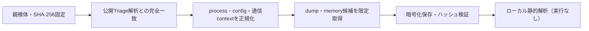

# Triage公開解析・後段取得証跡

## 完全ハッシュ一致

- [260923-x5lm5aah65](https://tria.ge/260923-x5lm5aah65): ファミリー候補 `未確定`、評価score `7`
- [260424-24nhjse19r](https://tria.ge/260424-24nhjse19r): ファミリー候補 `未確定`、評価score `7`
- [260317-zrgs5aev9x](https://tria.ge/260317-zrgs5aev9x): ファミリー候補 `未確定`、評価score `7`

## プロセス・通信

- 観測process: `VC_redist.x86.exe, gdoc17.exe, gdoc17.tmp, msiexec.exe, srtasks.exe, vc_redist.x86.exe, vssvc.exe`
- raw commandは保存せず、command SHA-256と処理patternだけをJSONへ保持します。
- sandbox background trafficは`context_only`であり、C2へ自動昇格しません。

- 取得できませんでした。

## 後段取得物

- `002e38d227aa5bd55cc026b69fd470e8341fc2d026f60005a2ad8ad4d1ec8883` / `memory_image` / 954368 bytes / 親と同一: `false` / 静的解析: `partial`

## 判定境界

Triage由来のfamily、process、config、通信は外部sandbox証跡です。Config extractorが返したendpointはC2候補として扱いますが、静的設定復元またはprocess帰属とprotocol応答が揃うまでは確認済みC2とはしません。取得成果物と検体は実行していません。
