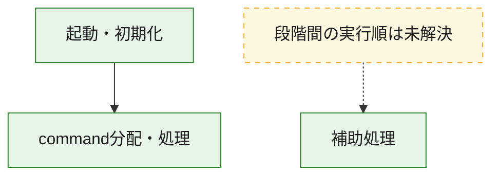
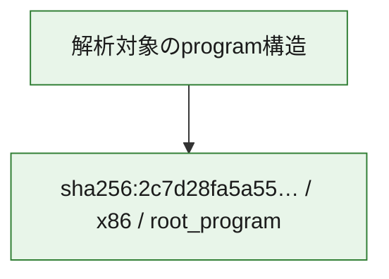

# 全体ロジック：2c7d28fa5a5563968536784beb4f0addae0f53a4cdca5c58eac8267abbd81dcc

代表関数の静的証跡から、起動・初期化、command分配・処理の処理群を確認しました。

## 読み方

- phaseの掲載順は解析上の整理順です。observed_call_edgesがない段階間の実行順を断定しません。
- 図の実線は静的に観測した関係、点線と黄色のノードは未観測・未解決の関係を示します。
- 図は静的な要約であり、動的実行を再現するものではありません。
- 詳細な関数解説とfingerprintは[STATIC-LOGIC.md](STATIC-LOGIC.md)を参照してください。

## 静的可視化

### 実行フロー

### 感染チェーン

```mermaid
flowchart TD
  chain_initial["初期侵入・配布経路は未観測"]
  chain_01["提出検体 / sha256:2c7d28fa5a55….exe / pe"]
  chain_02["静的復元層 1 / sha256:2c7d28fa5a55….exe::pe-resource-script / script"]
  chain_03["静的復元層 1 / sha256:2c7d28fa5a55….exe::pe-resource-script / script"]
  chain_04["静的復元層 1 / sha256:2c7d28fa5a55….exe::pe-resource-script / script"]
  chain_05["静的復元層 1 / sha256:2c7d28fa5a55….exe::pe-resource-script / script"]
  chain_06["静的復元層 1 / sha256:2c7d28fa5a55….exe::pe-resource-script / script"]
  chain_07["静的復元層 1 / sha256:2c7d28fa5a55….exe::pe-resource-script / script"]
  chain_08["静的復元層 1 / sha256:2c7d28fa5a55….exe::pe-resource-script / script"]
  chain_09["静的復元層 1 / sha256:2c7d28fa5a55….exe::pe-resource-script / script"]
  chain_10["静的復元層 1 / sha256:2c7d28fa5a55….exe::pe-resource-script / script"]
  chain_11["静的復元層 1 / sha256:2c7d28fa5a55….exe::pe-resource-script / script"]
  chain_12["静的復元層 1 / sha256:2c7d28fa5a55….exe::pe-resource-script / script"]
  chain_13["静的復元層 1 / sha256:2c7d28fa5a55….exe::pe-resource-script / script"]
  chain_14["静的復元層 1 / sha256:2c7d28fa5a55….exe::pe-resource-script / script"]
  chain_15["静的復元層 1 / sha256:2c7d28fa5a55….exe::pe-resource-script / script"]
  chain_16["静的復元層 1 / sha256:2c7d28fa5a55….exe::pe-resource-script / script"]
  chain_01 -->|pe-resource-script| chain_02
  chain_01 -->|pe-resource-script| chain_03
  chain_01 -->|pe-resource-script| chain_04
  chain_01 -->|pe-resource-script| chain_05
  chain_01 -->|pe-resource-script| chain_06
  chain_01 -->|pe-resource-script| chain_07
  chain_01 -->|pe-resource-script| chain_08
  chain_01 -->|pe-resource-script| chain_09
  chain_01 -->|pe-resource-script| chain_10
  chain_01 -->|pe-resource-script| chain_11
  chain_01 -->|pe-resource-script| chain_12
  chain_01 -->|pe-resource-script| chain_13
  chain_01 -->|pe-resource-script| chain_14
  chain_01 -->|pe-resource-script| chain_15
  chain_01 -->|pe-resource-script| chain_16
  chain_initial -.-> chain_01
  chain_more["その他1層はstatic-layers.jsonを参照"]
  chain_02 -.-> chain_more
  chain_03 -.-> chain_more
  chain_04 -.-> chain_more
  chain_05 -.-> chain_more
  chain_06 -.-> chain_more
  chain_07 -.-> chain_more
  chain_08 -.-> chain_more
  chain_09 -.-> chain_more
  chain_10 -.-> chain_more
  chain_11 -.-> chain_more
  chain_12 -.-> chain_more
  chain_13 -.-> chain_more
  chain_14 -.-> chain_more
  chain_15 -.-> chain_more
  chain_16 -.-> chain_more
  class chain_more unresolved
  class chain_01,chain_02,chain_03,chain_04,chain_05,chain_06,chain_07,chain_08,chain_09,chain_10,chain_11,chain_12,chain_13,chain_14,chain_15,chain_16 confirmed
  class chain_initial unresolved
  classDef confirmed fill:#e8f5e9,stroke:#2e7d32,color:#1b1b1b
  classDef unresolved fill:#fff8e1,stroke:#f9a825,color:#1b1b1b,stroke-dasharray:5 5
```

### モジュール関係

## 処理段階

### 1. 起動・初期化

entry pointから初期化と後続処理への移行を確認します。
確度: `confirmed_static_function_evidence`

- `2c7d28fa5a5563968536784beb4f0addae0f53a4cdca5c58eac8267abbd81dcc:ghidra:140213c40` — 初期化と主要処理への分岐を行う入口関数です。 状態: `succeeded`、選定理由: `entry_point`, `meaningful_symbol_name`, `reviewed_call_centrality:22`, `role:entrypoint`

### 2. command分配・処理

受信commandやtaskの解釈、分配、個別handlerへの移行を確認します。
確度: `confirmed_static_function_evidence_with_limits`

- `2c7d28fa5a5563968536784beb4f0addae0f53a4cdca5c58eac8267abbd81dcc:ghidra:140224460` — commandの解釈、分配、または個別処理を担当する関数です。 状態: `limited_bad_instruction_or_flow`、選定理由: `meaningful_symbol_name`, `reviewed_call_centrality:1`, `role:command_dispatch_or_handler`

### 3. 補助処理

主要処理を支える一般内部関数またはlibrary処理を確認します。
確度: `confirmed_static_function_evidence_with_limits`

- `2c7d28fa5a5563968536784beb4f0addae0f53a4cdca5c58eac8267abbd81dcc:ghidra:1401b1180` — 検体内部の一般処理を実装する関数です。 状態: `succeeded`、選定理由: `context_representative`, `reviewed_call_centrality:3`
- `2c7d28fa5a5563968536784beb4f0addae0f53a4cdca5c58eac8267abbd81dcc:ghidra:1401b1290` — 検体内部の一般処理を実装する関数です。 状態: `succeeded`、選定理由: `context_representative`, `reviewed_call_centrality:1`
- `2c7d28fa5a5563968536784beb4f0addae0f53a4cdca5c58eac8267abbd81dcc:ghidra:1401b1340` — 検体内部の一般処理を実装する関数です。 状態: `succeeded`、選定理由: `context_representative`, `reviewed_call_centrality:1`
- `2c7d28fa5a5563968536784beb4f0addae0f53a4cdca5c58eac8267abbd81dcc:ghidra:1401b13d0` — 検体内部の一般処理を実装する関数です。 状態: `succeeded`、選定理由: `context_representative`, `reviewed_call_centrality:5`
- `2c7d28fa5a5563968536784beb4f0addae0f53a4cdca5c58eac8267abbd81dcc:ghidra:1401b1460` — 検体内部の一般処理を実装する関数です。 状態: `succeeded`、選定理由: `context_representative`, `reviewed_call_centrality:8`
- `2c7d28fa5a5563968536784beb4f0addae0f53a4cdca5c58eac8267abbd81dcc:ghidra:1401b1560` — 検体内部の一般処理を実装する関数です。 状態: `succeeded`、選定理由: `context_representative`, `reviewed_call_centrality:5`
- `2c7d28fa5a5563968536784beb4f0addae0f53a4cdca5c58eac8267abbd81dcc:ghidra:1401b16b0` — 検体内部の一般処理を実装する関数です。 状態: `succeeded`、選定理由: `context_representative`, `reviewed_call_centrality:6`
- `2c7d28fa5a5563968536784beb4f0addae0f53a4cdca5c58eac8267abbd81dcc:ghidra:1401b1910` — 検体内部の一般処理を実装する関数です。 状態: `succeeded`、選定理由: `context_representative`, `reviewed_call_centrality:1`
- `2c7d28fa5a5563968536784beb4f0addae0f53a4cdca5c58eac8267abbd81dcc:ghidra:1401b1940` — 検体内部の一般処理を実装する関数です。 状態: `succeeded`、選定理由: `context_representative`, `reviewed_call_centrality:1`
- `2c7d28fa5a5563968536784beb4f0addae0f53a4cdca5c58eac8267abbd81dcc:ghidra:1401b1980` — 検体内部の一般処理を実装する関数です。 状態: `limited_bad_instruction_or_flow`、選定理由: `context_representative`, `reviewed_call_centrality:3`
- `2c7d28fa5a5563968536784beb4f0addae0f53a4cdca5c58eac8267abbd81dcc:ghidra:1401b1a30` — 検体内部の一般処理を実装する関数です。 状態: `succeeded`、選定理由: `context_representative`, `reviewed_call_centrality:4`
- `2c7d28fa5a5563968536784beb4f0addae0f53a4cdca5c58eac8267abbd81dcc:ghidra:1401b1ac0` — 検体内部の一般処理を実装する関数です。 状態: `succeeded`、選定理由: `context_representative`, `reviewed_call_centrality:4`
- `2c7d28fa5a5563968536784beb4f0addae0f53a4cdca5c58eac8267abbd81dcc:ghidra:1401b1b90` — 検体内部の一般処理を実装する関数です。 状態: `succeeded`、選定理由: `context_representative`, `reviewed_call_centrality:1`
- `2c7d28fa5a5563968536784beb4f0addae0f53a4cdca5c58eac8267abbd81dcc:ghidra:1401b1bc0` — 検体内部の一般処理を実装する関数です。 状態: `succeeded`、選定理由: `context_representative`, `reviewed_call_centrality:1`
- `2c7d28fa5a5563968536784beb4f0addae0f53a4cdca5c58eac8267abbd81dcc:ghidra:1401b1c00` — 検体内部の一般処理を実装する関数です。 状態: `succeeded`、選定理由: `context_representative`, `reviewed_call_centrality:1`
- `2c7d28fa5a5563968536784beb4f0addae0f53a4cdca5c58eac8267abbd81dcc:ghidra:1401b1c70` — 検体内部の一般処理を実装する関数です。 状態: `succeeded`、選定理由: `context_representative`, `reviewed_call_centrality:1`
- `2c7d28fa5a5563968536784beb4f0addae0f53a4cdca5c58eac8267abbd81dcc:ghidra:1401b1cc0` — 検体内部の一般処理を実装する関数です。 状態: `succeeded`、選定理由: `context_representative`, `reviewed_call_centrality:1`
- `2c7d28fa5a5563968536784beb4f0addae0f53a4cdca5c58eac8267abbd81dcc:ghidra:1401b1d00` — 検体内部の一般処理を実装する関数です。 状態: `succeeded`、選定理由: `context_representative`, `reviewed_call_centrality:2`
- `2c7d28fa5a5563968536784beb4f0addae0f53a4cdca5c58eac8267abbd81dcc:ghidra:1401b1d60` — 検体内部の一般処理を実装する関数です。 状態: `succeeded`、選定理由: `context_representative`, `reviewed_call_centrality:2`
- `2c7d28fa5a5563968536784beb4f0addae0f53a4cdca5c58eac8267abbd81dcc:ghidra:1401b1e40` — 検体内部の一般処理を実装する関数です。 状態: `succeeded`、選定理由: `context_representative`, `reviewed_call_centrality:2`
- `2c7d28fa5a5563968536784beb4f0addae0f53a4cdca5c58eac8267abbd81dcc:ghidra:1401b1e90` — 検体内部の一般処理を実装する関数です。 状態: `succeeded`、選定理由: `context_representative`, `reviewed_call_centrality:2`
- `2c7d28fa5a5563968536784beb4f0addae0f53a4cdca5c58eac8267abbd81dcc:ghidra:1401b1ee0` — 検体内部の一般処理を実装する関数です。 状態: `succeeded`、選定理由: `context_representative`, `reviewed_call_centrality:2`
- `2c7d28fa5a5563968536784beb4f0addae0f53a4cdca5c58eac8267abbd81dcc:ghidra:1401b28b0` — 検体内部の一般処理を実装する関数です。 状態: `succeeded`、選定理由: `context_representative`, `reviewed_call_centrality:6`
- `2c7d28fa5a5563968536784beb4f0addae0f53a4cdca5c58eac8267abbd81dcc:ghidra:1401b2ad0` — 検体内部の一般処理を実装する関数です。 状態: `succeeded`、選定理由: `context_representative`, `reviewed_call_centrality:1`
- `2c7d28fa5a5563968536784beb4f0addae0f53a4cdca5c58eac8267abbd81dcc:ghidra:1401b2f40` — 検体内部の一般処理を実装する関数です。 状態: `succeeded`、選定理由: `context_representative`, `reviewed_call_centrality:1`
- `2c7d28fa5a5563968536784beb4f0addae0f53a4cdca5c58eac8267abbd81dcc:ghidra:1401b33f0` — 検体内部の一般処理を実装する関数です。 状態: `succeeded`、選定理由: `context_representative`, `reviewed_call_centrality:1`
- `2c7d28fa5a5563968536784beb4f0addae0f53a4cdca5c58eac8267abbd81dcc:ghidra:1401b3880` — 検体内部の一般処理を実装する関数です。 状態: `succeeded`、選定理由: `context_representative`, `reviewed_call_centrality:4`
- `2c7d28fa5a5563968536784beb4f0addae0f53a4cdca5c58eac8267abbd81dcc:ghidra:1401b39b0` — 検体内部の一般処理を実装する関数です。 状態: `succeeded`、選定理由: `context_representative`, `reviewed_call_centrality:9`
- `2c7d28fa5a5563968536784beb4f0addae0f53a4cdca5c58eac8267abbd81dcc:ghidra:1401b3bc0` — 検体内部の一般処理を実装する関数です。 状態: `succeeded`、選定理由: `context_representative`, `reviewed_call_centrality:73`
- `2c7d28fa5a5563968536784beb4f0addae0f53a4cdca5c58eac8267abbd81dcc:ghidra:1402157c0` — 検体内部の一般処理を実装する関数です。 状態: `succeeded`、選定理由: `meaningful_symbol_name`

## 観測したcall関係

- `2c7d28fa5a5563968536784beb4f0addae0f53a4cdca5c58eac8267abbd81dcc:ghidra:1401b13d0` → `2c7d28fa5a5563968536784beb4f0addae0f53a4cdca5c58eac8267abbd81dcc:ghidra:1401b39b0` （`support` → `support`）
- `2c7d28fa5a5563968536784beb4f0addae0f53a4cdca5c58eac8267abbd81dcc:ghidra:1401b3bc0` → `2c7d28fa5a5563968536784beb4f0addae0f53a4cdca5c58eac8267abbd81dcc:ghidra:1401b39b0` （`support` → `support`）
- `2c7d28fa5a5563968536784beb4f0addae0f53a4cdca5c58eac8267abbd81dcc:ghidra:140213c40` → `2c7d28fa5a5563968536784beb4f0addae0f53a4cdca5c58eac8267abbd81dcc:ghidra:140224460` （`startup` → `dispatch`）
- `ghidra-function:033f5ae2b361b58ae9e53a47` → `ghidra-external:0a26753f083d36bec1dbe6fd` （`unclassified` → `unclassified`）
- `ghidra-function:033f5ae2b361b58ae9e53a47` → `ghidra-external:0a9c25fe57c79785d71f1f28` （`unclassified` → `unclassified`）
- `ghidra-function:033f5ae2b361b58ae9e53a47` → `ghidra-external:11f37666bca9d946049e80d7` （`unclassified` → `unclassified`）
- `ghidra-function:033f5ae2b361b58ae9e53a47` → `ghidra-external:1445cb6a00cb5581ec16a996` （`unclassified` → `unclassified`）
- `ghidra-function:033f5ae2b361b58ae9e53a47` → `ghidra-external:2004c1a1a73bc85b5b9a3b05` （`unclassified` → `unclassified`）
- `ghidra-function:033f5ae2b361b58ae9e53a47` → `ghidra-external:21663405a08adc89fdf8052d` （`unclassified` → `unclassified`）
- `ghidra-function:033f5ae2b361b58ae9e53a47` → `ghidra-external:2781b2a61819444bcedd8b71` （`unclassified` → `unclassified`）
- `ghidra-function:033f5ae2b361b58ae9e53a47` → `ghidra-external:27fa992a9717cb5e93f0ae94` （`unclassified` → `unclassified`）
- `ghidra-function:033f5ae2b361b58ae9e53a47` → `ghidra-external:380b06f22d88cf67e6c4ad15` （`unclassified` → `unclassified`）
- `ghidra-function:033f5ae2b361b58ae9e53a47` → `ghidra-external:3c0bd04ddbe1ac91884a5ee3` （`unclassified` → `unclassified`）
- `ghidra-function:033f5ae2b361b58ae9e53a47` → `ghidra-external:56eaa2fb0d2a4eb790270efa` （`unclassified` → `unclassified`）
- `ghidra-function:033f5ae2b361b58ae9e53a47` → `ghidra-external:5a436fca02a0d2b415c5fd78` （`unclassified` → `unclassified`）
- `ghidra-function:033f5ae2b361b58ae9e53a47` → `ghidra-external:6463795d9c717bc05827aec8` （`unclassified` → `unclassified`）
- `ghidra-function:033f5ae2b361b58ae9e53a47` → `ghidra-external:71067057e45adee66ee531a3` （`unclassified` → `unclassified`）
- `ghidra-function:033f5ae2b361b58ae9e53a47` → `ghidra-external:7394808c2a28c80af324e1f4` （`unclassified` → `unclassified`）
- `ghidra-function:033f5ae2b361b58ae9e53a47` → `ghidra-external:74030fd040992863a28ced23` （`unclassified` → `unclassified`）
- `ghidra-function:033f5ae2b361b58ae9e53a47` → `ghidra-external:7608d7d46675a867a6d960c0` （`unclassified` → `unclassified`）
- `ghidra-function:033f5ae2b361b58ae9e53a47` → `ghidra-external:7807431632aba89c09ab6298` （`unclassified` → `unclassified`）
- `ghidra-function:033f5ae2b361b58ae9e53a47` → `ghidra-external:7a0b6a073dd8a53a7197ac75` （`unclassified` → `unclassified`）
- `ghidra-function:033f5ae2b361b58ae9e53a47` → `ghidra-external:7b1175ebf013cd1e3a0e48b6` （`unclassified` → `unclassified`）
- `ghidra-function:033f5ae2b361b58ae9e53a47` → `ghidra-external:7c51ae1b4388c2099bf824b8` （`unclassified` → `unclassified`）
- `ghidra-function:033f5ae2b361b58ae9e53a47` → `ghidra-external:7f0eaea94446f8c22f3bc605` （`unclassified` → `unclassified`）
- `ghidra-function:033f5ae2b361b58ae9e53a47` → `ghidra-external:7fa581a2021becd7850c7173` （`unclassified` → `unclassified`）
- `ghidra-function:033f5ae2b361b58ae9e53a47` → `ghidra-external:87b3f4c51444ac2ba0805c9a` （`unclassified` → `unclassified`）
- `ghidra-function:033f5ae2b361b58ae9e53a47` → `ghidra-external:8ec07ad6bd6772dc846efbbb` （`unclassified` → `unclassified`）
- `ghidra-function:033f5ae2b361b58ae9e53a47` → `ghidra-external:a26efc6de4b2542ce75685ad` （`unclassified` → `unclassified`）
- `ghidra-function:033f5ae2b361b58ae9e53a47` → `ghidra-external:aa711a5ce28987463d9177f7` （`unclassified` → `unclassified`）
- `ghidra-function:033f5ae2b361b58ae9e53a47` → `ghidra-external:b352eaf61a0ce89ebd524097` （`unclassified` → `unclassified`）
- `ghidra-function:033f5ae2b361b58ae9e53a47` → `ghidra-external:bb3d5b3df9286e56199152fb` （`unclassified` → `unclassified`）
- `ghidra-function:033f5ae2b361b58ae9e53a47` → `ghidra-external:bf03fa72ab85e141cdcf49a9` （`unclassified` → `unclassified`）
- `ghidra-function:033f5ae2b361b58ae9e53a47` → `ghidra-external:c1bd4c7c27ca14e1c8192912` （`unclassified` → `unclassified`）
- `ghidra-function:033f5ae2b361b58ae9e53a47` → `ghidra-external:c302f4c15b28bd347b631df5` （`unclassified` → `unclassified`）
- `ghidra-function:033f5ae2b361b58ae9e53a47` → `ghidra-external:de880e047261fc6519fea3a9` （`unclassified` → `unclassified`）
- `ghidra-function:033f5ae2b361b58ae9e53a47` → `ghidra-external:dee892a1f330c9702fcccacf` （`unclassified` → `unclassified`）
- `ghidra-function:033f5ae2b361b58ae9e53a47` → `ghidra-external:e183f22f9ee40b2a1f85a683` （`unclassified` → `unclassified`）
- `ghidra-function:033f5ae2b361b58ae9e53a47` → `ghidra-external:e1b33939e9e4992bcc39c8ca` （`unclassified` → `unclassified`）
- `ghidra-function:033f5ae2b361b58ae9e53a47` → `ghidra-external:e8ee6801ecdd4a3a6970f0f5` （`unclassified` → `unclassified`）
- `ghidra-function:033f5ae2b361b58ae9e53a47` → `ghidra-external:ef411e8399a46aa32fb1a702` （`unclassified` → `unclassified`）
- `ghidra-function:033f5ae2b361b58ae9e53a47` → `ghidra-external:f5cbfb632e9f03520d35e08a` （`unclassified` → `unclassified`）
- `ghidra-function:033f5ae2b361b58ae9e53a47` → `ghidra-function:027e79a8fe036f15cf24e8a8` （`unclassified` → `unclassified`）
- `ghidra-function:033f5ae2b361b58ae9e53a47` → `ghidra-function:05865bd654aefe0b72e4abc0` （`unclassified` → `unclassified`）
- `ghidra-function:033f5ae2b361b58ae9e53a47` → `ghidra-function:0713da2a5122238f93c31c42` （`unclassified` → `unclassified`）
- `ghidra-function:033f5ae2b361b58ae9e53a47` → `ghidra-function:0fb504a3de2f2e599264400e` （`unclassified` → `unclassified`）
- `ghidra-function:033f5ae2b361b58ae9e53a47` → `ghidra-function:26342633aff3d430c4211ad9` （`unclassified` → `unclassified`）
- `ghidra-function:033f5ae2b361b58ae9e53a47` → `ghidra-function:2b4d5bda7322f4703d20a5ae` （`unclassified` → `unclassified`）
- `ghidra-function:033f5ae2b361b58ae9e53a47` → `ghidra-function:35e8f911a62ca74c6497f43d` （`unclassified` → `unclassified`）
- `ghidra-function:033f5ae2b361b58ae9e53a47` → `ghidra-function:431c535f2d7548c3349633ac` （`unclassified` → `unclassified`）
- `ghidra-function:033f5ae2b361b58ae9e53a47` → `ghidra-function:4d0d7cee473971b2030e749d` （`unclassified` → `unclassified`）
- `ghidra-function:033f5ae2b361b58ae9e53a47` → `ghidra-function:55b1251cbea5def104ce7d0b` （`unclassified` → `unclassified`）
- `ghidra-function:033f5ae2b361b58ae9e53a47` → `ghidra-function:5b57778d9018cae5013ff834` （`unclassified` → `unclassified`）
- `ghidra-function:033f5ae2b361b58ae9e53a47` → `ghidra-function:5ffff4aded01204b58181f67` （`unclassified` → `unclassified`）
- `ghidra-function:033f5ae2b361b58ae9e53a47` → `ghidra-function:71493cbc65e4febc8392ee7c` （`unclassified` → `unclassified`）
- `ghidra-function:033f5ae2b361b58ae9e53a47` → `ghidra-function:7bb119e0e5102e4403942ae2` （`unclassified` → `unclassified`）
- `ghidra-function:033f5ae2b361b58ae9e53a47` → `ghidra-function:84fc4ee75a9898b322a149d5` （`unclassified` → `unclassified`）
- `ghidra-function:033f5ae2b361b58ae9e53a47` → `ghidra-function:8a26b068b1c57df37d04d0e9` （`unclassified` → `unclassified`）
- `ghidra-function:033f5ae2b361b58ae9e53a47` → `ghidra-function:9127c86837a3f30b708da029` （`unclassified` → `unclassified`）
- `ghidra-function:033f5ae2b361b58ae9e53a47` → `ghidra-function:949331afeabf3c1e59848334` （`unclassified` → `unclassified`）
- `ghidra-function:033f5ae2b361b58ae9e53a47` → `ghidra-function:9b449c4c86ad94f57da68a87` （`unclassified` → `unclassified`）
- `ghidra-function:033f5ae2b361b58ae9e53a47` → `ghidra-function:9be9827bcea36f7c0e1d7838` （`unclassified` → `unclassified`）
- `ghidra-function:033f5ae2b361b58ae9e53a47` → `ghidra-function:9fa00f3794d9c289e0a7a633` （`unclassified` → `unclassified`）
- `ghidra-function:033f5ae2b361b58ae9e53a47` → `ghidra-function:aa72ec63edf451deadfb1e20` （`unclassified` → `unclassified`）
- `ghidra-function:033f5ae2b361b58ae9e53a47` → `ghidra-function:b15bef66f05c11b0873ef802` （`unclassified` → `unclassified`）
- `ghidra-function:033f5ae2b361b58ae9e53a47` → `ghidra-function:b522f4a31a9bd3abd2263fce` （`unclassified` → `unclassified`）
- `ghidra-function:033f5ae2b361b58ae9e53a47` → `ghidra-function:bc044363d462791b8ad50b93` （`unclassified` → `unclassified`）
- `ghidra-function:033f5ae2b361b58ae9e53a47` → `ghidra-function:ca92a519ca412e38d7977326` （`unclassified` → `unclassified`）
- `ghidra-function:033f5ae2b361b58ae9e53a47` → `ghidra-function:cd3728af969c90cba4ff7117` （`unclassified` → `unclassified`）
- `ghidra-function:033f5ae2b361b58ae9e53a47` → `ghidra-function:cd79da6371604eb84d79daef` （`unclassified` → `unclassified`）
- `ghidra-function:033f5ae2b361b58ae9e53a47` → `ghidra-function:d05e49417b96be583f231201` （`unclassified` → `unclassified`）
- `ghidra-function:033f5ae2b361b58ae9e53a47` → `ghidra-function:d228f4e94e0dd28a8e8ffac7` （`unclassified` → `unclassified`）
- `ghidra-function:033f5ae2b361b58ae9e53a47` → `ghidra-function:d8a2598986681201bf7d9b14` （`unclassified` → `unclassified`）
- `ghidra-function:033f5ae2b361b58ae9e53a47` → `ghidra-function:df7231bf05fe5088d4eb0988` （`unclassified` → `unclassified`）
- `ghidra-function:033f5ae2b361b58ae9e53a47` → `ghidra-function:efd5a6e81680d724ef61b213` （`unclassified` → `unclassified`）
- `ghidra-function:033f5ae2b361b58ae9e53a47` → `ghidra-function:fd5fa9c8a7a84ed7f474a3fa` （`unclassified` → `unclassified`）
- `ghidra-function:0343b3329df89682f3eeb714` → `ghidra-external:b21b55fb0b8d5ff0a39b65bb` （`unclassified` → `unclassified`）
- `ghidra-function:0343b3329df89682f3eeb714` → `ghidra-function:324f9946929b242d4da11f12` （`unclassified` → `unclassified`）
- `ghidra-function:0e2eabd267921620371eb014` → `ghidra-external:56f9f30b6c07c5ae593c8895` （`unclassified` → `unclassified`）
- `ghidra-function:0e2eabd267921620371eb014` → `ghidra-external:b21b55fb0b8d5ff0a39b65bb` （`unclassified` → `unclassified`）
- `ghidra-function:17f3c0e2404c17709845830b` → `ghidra-external:56f9f30b6c07c5ae593c8895` （`unclassified` → `unclassified`）
- `ghidra-function:17f3c0e2404c17709845830b` → `ghidra-function:20c9a4f5af508c1424678dfa` （`unclassified` → `unclassified`）
- `ghidra-function:17f3c0e2404c17709845830b` → `ghidra-function:4d6defd7e61cf29d37c063fe` （`unclassified` → `unclassified`）
- `ghidra-function:17f3c0e2404c17709845830b` → `ghidra-function:bb5d730ed19aa40d86e84f19` （`unclassified` → `unclassified`）
- `ghidra-function:20ee3e0ce5be18025a7c6582` → `ghidra-external:b21b55fb0b8d5ff0a39b65bb` （`unclassified` → `unclassified`）
- `ghidra-function:20ee3e0ce5be18025a7c6582` → `ghidra-function:324f9946929b242d4da11f12` （`unclassified` → `unclassified`）
- `ghidra-function:2887e105b599262afdea4601` → `ghidra-function:bb5d730ed19aa40d86e84f19` （`unclassified` → `unclassified`）
- `ghidra-function:55903a02cb17e26bfe9e763c` → `ghidra-external:56f9f30b6c07c5ae593c8895` （`unclassified` → `unclassified`）
- `ghidra-function:55903a02cb17e26bfe9e763c` → `ghidra-external:b21b55fb0b8d5ff0a39b65bb` （`unclassified` → `unclassified`）
- `ghidra-function:57859496b383397512bdb575` → `ghidra-function:ff1f2bab2359faf23837aaf9` （`unclassified` → `unclassified`）
- `ghidra-function:5e1b8b03ecf7bf0c3b19a69a` → `ghidra-external:56f9f30b6c07c5ae593c8895` （`unclassified` → `unclassified`）
- `ghidra-function:5e1b8b03ecf7bf0c3b19a69a` → `ghidra-function:20c9a4f5af508c1424678dfa` （`unclassified` → `unclassified`）
- `ghidra-function:5e1b8b03ecf7bf0c3b19a69a` → `ghidra-function:4d6defd7e61cf29d37c063fe` （`unclassified` → `unclassified`）
- `ghidra-function:5e1b8b03ecf7bf0c3b19a69a` → `ghidra-function:a5a692cc87247697d1316c18` （`unclassified` → `unclassified`）
- `ghidra-function:5e625dad86f8c6f4799a3a65` → `ghidra-external:67cc93f8183cbee5fcf12c82` （`unclassified` → `unclassified`）
- `ghidra-function:5e625dad86f8c6f4799a3a65` → `ghidra-external:70090ce256a90f12e07f26d1` （`unclassified` → `unclassified`）
- `ghidra-function:5e625dad86f8c6f4799a3a65` → `ghidra-external:774408d20f4390d813570178` （`unclassified` → `unclassified`）
- `ghidra-function:5e625dad86f8c6f4799a3a65` → `ghidra-external:cacebc12f1226a71aa6fbb81` （`unclassified` → `unclassified`）
- `ghidra-function:5e625dad86f8c6f4799a3a65` → `ghidra-external:dba5ecc38b6f0d8b52a60c95` （`unclassified` → `unclassified`）
- `ghidra-function:5e625dad86f8c6f4799a3a65` → `ghidra-function:55b1251cbea5def104ce7d0b` （`unclassified` → `unclassified`）
- `ghidra-function:5e625dad86f8c6f4799a3a65` → `ghidra-function:84fc4ee75a9898b322a149d5` （`unclassified` → `unclassified`）
- `ghidra-function:5e625dad86f8c6f4799a3a65` → `ghidra-function:cd3728af969c90cba4ff7117` （`unclassified` → `unclassified`）
- `ghidra-function:6e8b7e8e7e45d8ef34d2944a` → `ghidra-function:ff1f2bab2359faf23837aaf9` （`unclassified` → `unclassified`）
- `ghidra-function:78fc147ee0ad83e2a3c70c39` → `ghidra-function:55b1251cbea5def104ce7d0b` （`unclassified` → `unclassified`）
- `ghidra-function:80cd4a81d8792214f51893c2` → `ghidra-function:eb340850f67414ad4705ad92` （`unclassified` → `unclassified`）
- `ghidra-function:825865b8d370a5bc428ca8d9` → `ghidra-function:bb5d730ed19aa40d86e84f19` （`unclassified` → `unclassified`）
- `ghidra-function:86afc7e85d80729d4f6b3481` → `ghidra-external:b8751e2931d4c8ada3e1b16a` （`unclassified` → `unclassified`）
- `ghidra-function:86afc7e85d80729d4f6b3481` → `ghidra-function:55b1251cbea5def104ce7d0b` （`unclassified` → `unclassified`）
- `ghidra-function:86afc7e85d80729d4f6b3481` → `ghidra-function:84fc4ee75a9898b322a149d5` （`unclassified` → `unclassified`）
- `ghidra-function:86afc7e85d80729d4f6b3481` → `ghidra-function:cd3728af969c90cba4ff7117` （`unclassified` → `unclassified`）
- `ghidra-function:888fa5fab6cf6c58829c069d` → `ghidra-external:c4019266016fb187b919ae15` （`unclassified` → `unclassified`）
- `ghidra-function:88956cb8149248a1e4c1fa61` → `ghidra-function:0149c5b4b483603a1237b1c2` （`unclassified` → `unclassified`）
- `ghidra-function:88956cb8149248a1e4c1fa61` → `ghidra-function:55b1251cbea5def104ce7d0b` （`unclassified` → `unclassified`）
- `ghidra-function:88956cb8149248a1e4c1fa61` → `ghidra-function:9fe1d2e3b7c6c098cd904841` （`unclassified` → `unclassified`）
- `ghidra-function:88956cb8149248a1e4c1fa61` → `ghidra-function:cd3728af969c90cba4ff7117` （`unclassified` → `unclassified`）
- `ghidra-function:88956cb8149248a1e4c1fa61` → `ghidra-function:d8a2598986681201bf7d9b14` （`unclassified` → `unclassified`）
- `ghidra-function:8c9d04b0b5e5aad783531874` → `ghidra-function:55b1251cbea5def104ce7d0b` （`unclassified` → `unclassified`）
- `ghidra-function:8c9d04b0b5e5aad783531874` → `ghidra-function:84fc4ee75a9898b322a149d5` （`unclassified` → `unclassified`）
- `ghidra-function:8c9d04b0b5e5aad783531874` → `ghidra-function:cd3728af969c90cba4ff7117` （`unclassified` → `unclassified`）
- `ghidra-function:8d55e1d2960669a953db56d9` → `ghidra-function:55b1251cbea5def104ce7d0b` （`unclassified` → `unclassified`）
- `ghidra-function:932470d1108daeb2b1aa7adc` → `ghidra-function:ff1f2bab2359faf23837aaf9` （`unclassified` → `unclassified`）
- `ghidra-function:934350db161cea9b681fd852` → `ghidra-function:7ce168a66d2e110d115c956a` （`unclassified` → `unclassified`）
- `ghidra-function:9fbd04eb486e5144a3a3aa3a` → `ghidra-external:8ec07ad6bd6772dc846efbbb` （`unclassified` → `unclassified`）
- `ghidra-function:9fbd04eb486e5144a3a3aa3a` → `ghidra-external:bf03fa72ab85e141cdcf49a9` （`unclassified` → `unclassified`）
- `ghidra-function:9fbd04eb486e5144a3a3aa3a` → `ghidra-function:28d6c4c3db1891fd570751fc` （`unclassified` → `unclassified`）
- `ghidra-function:9fbd04eb486e5144a3a3aa3a` → `ghidra-function:55b1251cbea5def104ce7d0b` （`unclassified` → `unclassified`）
- `ghidra-function:9fbd04eb486e5144a3a3aa3a` → `ghidra-function:84fc4ee75a9898b322a149d5` （`unclassified` → `unclassified`）
- `ghidra-function:9fbd04eb486e5144a3a3aa3a` → `ghidra-function:cd3728af969c90cba4ff7117` （`unclassified` → `unclassified`）
- `ghidra-function:a48d2ce1c88498fc9f433d6f` → `ghidra-external:c4019266016fb187b919ae15` （`unclassified` → `unclassified`）
- `ghidra-function:ab0b7df1368897110ebf7943` → `ghidra-external:91c1ba4c696038e175134637` （`unclassified` → `unclassified`）
- `ghidra-function:ab0b7df1368897110ebf7943` → `ghidra-external:9cc3833050b78378084937c6` （`unclassified` → `unclassified`）
- `ghidra-function:ab0b7df1368897110ebf7943` → `ghidra-external:e5eb14db100a77bb7774b059` （`unclassified` → `unclassified`）
- `ghidra-function:be8aef8e5dcd0978608f73b8` → `ghidra-external:56f9f30b6c07c5ae593c8895` （`unclassified` → `unclassified`）
- `ghidra-function:be8aef8e5dcd0978608f73b8` → `ghidra-external:b21b55fb0b8d5ff0a39b65bb` （`unclassified` → `unclassified`）
- `ghidra-function:be8aef8e5dcd0978608f73b8` → `ghidra-function:20c9a4f5af508c1424678dfa` （`unclassified` → `unclassified`）
- `ghidra-function:be8aef8e5dcd0978608f73b8` → `ghidra-function:4d6defd7e61cf29d37c063fe` （`unclassified` → `unclassified`）
- `ghidra-function:be8aef8e5dcd0978608f73b8` → `ghidra-function:bb5d730ed19aa40d86e84f19` （`unclassified` → `unclassified`）
- `ghidra-function:d8a2598986681201bf7d9b14` → `ghidra-function:0e418559a3adc6a1f679daf9` （`unclassified` → `unclassified`）
- `ghidra-function:d8a2598986681201bf7d9b14` → `ghidra-function:35e1c5ff9b81b193f136a902` （`unclassified` → `unclassified`）
- `ghidra-function:d8a2598986681201bf7d9b14` → `ghidra-function:55b1251cbea5def104ce7d0b` （`unclassified` → `unclassified`）
- `ghidra-function:d8a2598986681201bf7d9b14` → `ghidra-function:7e4712140573106ae0485d80` （`unclassified` → `unclassified`）
- `ghidra-function:d8a2598986681201bf7d9b14` → `ghidra-function:adfa0d073d8621c318be18a9` （`unclassified` → `unclassified`）
- `ghidra-function:d8a2598986681201bf7d9b14` → `ghidra-function:bda9ebb99379973d265d94f4` （`unclassified` → `unclassified`）
- `ghidra-function:d8a2598986681201bf7d9b14` → `ghidra-function:daa128d4631592fe175ffec9` （`unclassified` → `unclassified`）
- `ghidra-function:df95bad753335b0d5d053136` → `ghidra-external:56f9f30b6c07c5ae593c8895` （`unclassified` → `unclassified`）
- `ghidra-function:df95bad753335b0d5d053136` → `ghidra-function:1dfec0b351796fd03626dfeb` （`unclassified` → `unclassified`）
- `ghidra-function:df95bad753335b0d5d053136` → `ghidra-function:20c9a4f5af508c1424678dfa` （`unclassified` → `unclassified`）
- `ghidra-function:df95bad753335b0d5d053136` → `ghidra-function:5c66f7f7fdd62689b1c20b12` （`unclassified` → `unclassified`）
- `ghidra-function:df95bad753335b0d5d053136` → `ghidra-function:bb5d730ed19aa40d86e84f19` （`unclassified` → `unclassified`）
- `ghidra-function:df95bad753335b0d5d053136` → `ghidra-function:e54c2b5288d5c3988dc16151` （`unclassified` → `unclassified`）
- `ghidra-function:f3fafb7c8a75f04ac7ceb2a3` → `ghidra-external:b21b55fb0b8d5ff0a39b65bb` （`unclassified` → `unclassified`）
- `ghidra-function:f3fafb7c8a75f04ac7ceb2a3` → `ghidra-function:324f9946929b242d4da11f12` （`unclassified` → `unclassified`）
- `ghidra-function:f639382bddb021678648d57b` → `ghidra-external:c4019266016fb187b919ae15` （`unclassified` → `unclassified`）
- `ghidra-function:f904901efd7a1e4f63d9e3ea` → `ghidra-external:24f4ce2640a5300e5292a1a8` （`unclassified` → `unclassified`）
- `ghidra-function:f904901efd7a1e4f63d9e3ea` → `ghidra-external:4b210606fb9d1fe7cf92035b` （`unclassified` → `unclassified`）
- `ghidra-function:f904901efd7a1e4f63d9e3ea` → `ghidra-external:4fd88f4f7d86f2003255963b` （`unclassified` → `unclassified`）
- `ghidra-function:f904901efd7a1e4f63d9e3ea` → `ghidra-external:52d5d79994d2df312058d588` （`unclassified` → `unclassified`）
- `ghidra-function:f904901efd7a1e4f63d9e3ea` → `ghidra-external:56f9f30b6c07c5ae593c8895` （`unclassified` → `unclassified`）
- `ghidra-function:f904901efd7a1e4f63d9e3ea` → `ghidra-external:bfe0e851604e5a6816dd6239` （`unclassified` → `unclassified`）
- `ghidra-function:f904901efd7a1e4f63d9e3ea` → `ghidra-external:f11d5d327a8d3d49025b525c` （`unclassified` → `unclassified`）
- `ghidra-function:f904901efd7a1e4f63d9e3ea` → `ghidra-function:09e9df615fe0ac5dcd27ca69` （`unclassified` → `unclassified`）
- `ghidra-function:f904901efd7a1e4f63d9e3ea` → `ghidra-function:14a56843fe06de762b257d94` （`unclassified` → `unclassified`）
- `ghidra-function:f904901efd7a1e4f63d9e3ea` → `ghidra-function:47981c17b7958d13c45b6f32` （`unclassified` → `unclassified`）
- `ghidra-function:f904901efd7a1e4f63d9e3ea` → `ghidra-function:6adf7eb345d2e2c570f4ad78` （`unclassified` → `unclassified`）
- `ghidra-function:f904901efd7a1e4f63d9e3ea` → `ghidra-function:6d3d44883b73ec629e17b1ea` （`unclassified` → `unclassified`）
- `ghidra-function:f904901efd7a1e4f63d9e3ea` → `ghidra-function:758d5e01763f1f75953bce4d` （`unclassified` → `unclassified`）
- `ghidra-function:f904901efd7a1e4f63d9e3ea` → `ghidra-function:7aed3629ca9072827e73c552` （`unclassified` → `unclassified`）
- `ghidra-function:f904901efd7a1e4f63d9e3ea` → `ghidra-function:7d8354319a07172c59836657` （`unclassified` → `unclassified`）
- `ghidra-function:f904901efd7a1e4f63d9e3ea` → `ghidra-function:83da7744cc4ddb45cb494d56` （`unclassified` → `unclassified`）
- `ghidra-function:f904901efd7a1e4f63d9e3ea` → `ghidra-function:916dc6e8f81770cb4d461cd1` （`unclassified` → `unclassified`）
- `ghidra-function:f904901efd7a1e4f63d9e3ea` → `ghidra-function:95ebd49650ee26fad4e4734a` （`unclassified` → `unclassified`）
- `ghidra-function:f904901efd7a1e4f63d9e3ea` → `ghidra-function:9f604c6c28ee1f377975d56c` （`unclassified` → `unclassified`）
- `ghidra-function:f904901efd7a1e4f63d9e3ea` → `ghidra-function:a7380aed8407413833476f12` （`unclassified` → `unclassified`）
- `ghidra-function:f904901efd7a1e4f63d9e3ea` → `ghidra-function:d2c94d8df947d7073a6e8ef3` （`unclassified` → `unclassified`）
- `ghidra-function:f904901efd7a1e4f63d9e3ea` → `ghidra-function:d8f64743618790fcc1eae5ee` （`unclassified` → `unclassified`）

## 解析範囲と制約

- 選定外関数は全体inventoryへ残しますが、関数本体の個別解説対象にはしていません。
- indirect call、難読化、packer、VM、壊れたcontrol flowによりcall関係が欠落する場合があります。
- 文書は静的解析に基づき、検体実行や外部通信による動的確認は行っていません。
