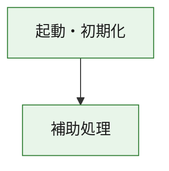
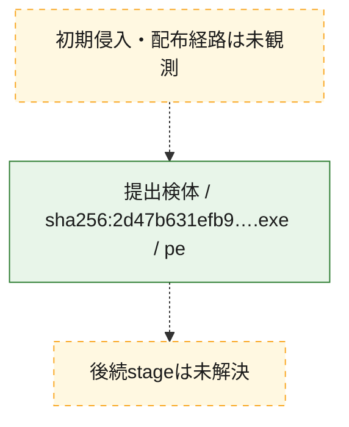
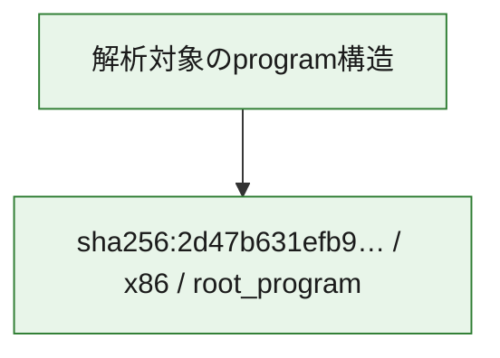

# 全体ロジック：2d47b631efb98fc407b5361d696adb49d3d401245bc5dc21bc6dcba6e06b9083

代表関数の静的証跡から、起動・初期化の処理群を確認しました。

## 読み方

- phaseの掲載順は解析上の整理順です。observed_call_edgesがない段階間の実行順を断定しません。
- 図の実線は静的に観測した関係、点線と黄色のノードは未観測・未解決の関係を示します。
- 図は静的な要約であり、動的実行を再現するものではありません。
- 詳細な関数解説とfingerprintは[STATIC-LOGIC.md](STATIC-LOGIC.md)を参照してください。

## 静的可視化

### 実行フロー

### 感染チェーン

### モジュール関係

## 処理段階

### 1. 起動・初期化

entry pointから初期化と後続処理への移行を確認します。
確度: `confirmed_static_function_evidence`

- `2d47b631efb98fc407b5361d696adb49d3d401245bc5dc21bc6dcba6e06b9083:ghidra:180001010` — 初期化と主要処理への分岐を行う入口関数です。 状態: `succeeded`、選定理由: `entry_point`, `meaningful_symbol_name`, `reviewed_call_centrality:22`, `role:entrypoint`, `small_program_complete_context`

### 2. 補助処理

主要処理を支える一般内部関数またはlibrary処理を確認します。
確度: `confirmed_static_function_evidence`

- `2d47b631efb98fc407b5361d696adb49d3d401245bc5dc21bc6dcba6e06b9083:ghidra:180001240` — 検体内部の一般処理を実装する関数です。 状態: `succeeded`、選定理由: `context_representative`, `reviewed_call_centrality:2`, `small_program_complete_context`
- `2d47b631efb98fc407b5361d696adb49d3d401245bc5dc21bc6dcba6e06b9083:ghidra:180001350` — 検体内部の一般処理を実装する関数です。 状態: `succeeded`、選定理由: `context_representative`, `reviewed_call_centrality:25`, `small_program_complete_context`
- `2d47b631efb98fc407b5361d696adb49d3d401245bc5dc21bc6dcba6e06b9083:ghidra:180003780` — 検体内部の一般処理を実装する関数です。 状態: `succeeded`、選定理由: `context_representative`, `reviewed_call_centrality:2`, `small_program_complete_context`
- `2d47b631efb98fc407b5361d696adb49d3d401245bc5dc21bc6dcba6e06b9083:ghidra:1800038e0` — 検体内部の一般処理を実装する関数です。 状態: `succeeded`、選定理由: `context_representative`, `reviewed_call_centrality:2`, `small_program_complete_context`

## 観測したcall関係

- `2d47b631efb98fc407b5361d696adb49d3d401245bc5dc21bc6dcba6e06b9083:ghidra:180001010` → `2d47b631efb98fc407b5361d696adb49d3d401245bc5dc21bc6dcba6e06b9083:ghidra:180001240` （`startup` → `support`）
- `2d47b631efb98fc407b5361d696adb49d3d401245bc5dc21bc6dcba6e06b9083:ghidra:180001010` → `2d47b631efb98fc407b5361d696adb49d3d401245bc5dc21bc6dcba6e06b9083:ghidra:180001350` （`startup` → `support`）
- `2d47b631efb98fc407b5361d696adb49d3d401245bc5dc21bc6dcba6e06b9083:ghidra:180001350` → `2d47b631efb98fc407b5361d696adb49d3d401245bc5dc21bc6dcba6e06b9083:ghidra:180001240` （`support` → `support`）
- `2d47b631efb98fc407b5361d696adb49d3d401245bc5dc21bc6dcba6e06b9083:ghidra:180001350` → `2d47b631efb98fc407b5361d696adb49d3d401245bc5dc21bc6dcba6e06b9083:ghidra:180003780` （`support` → `support`）
- `2d47b631efb98fc407b5361d696adb49d3d401245bc5dc21bc6dcba6e06b9083:ghidra:180001350` → `2d47b631efb98fc407b5361d696adb49d3d401245bc5dc21bc6dcba6e06b9083:ghidra:1800038e0` （`support` → `support`）
- `2d47b631efb98fc407b5361d696adb49d3d401245bc5dc21bc6dcba6e06b9083:ghidra:180003780` → `2d47b631efb98fc407b5361d696adb49d3d401245bc5dc21bc6dcba6e06b9083:ghidra:1800038e0` （`support` → `support`）
- `ghidra-function:28cfcf2930971d56f94bb184` → `ghidra-function:c51ebcddbcb0a001350b87fd` （`unclassified` → `unclassified`）
- `ghidra-function:6380e7bd44020b330f4951bc` → `ghidra-external:1945c1d5c3a8fb12fcb726e2` （`unclassified` → `unclassified`）
- `ghidra-function:6380e7bd44020b330f4951bc` → `ghidra-external:3e7e9b50bc420ff2423efebc` （`unclassified` → `unclassified`）
- `ghidra-function:6380e7bd44020b330f4951bc` → `ghidra-external:49aa73d5010c904aa8247d0a` （`unclassified` → `unclassified`）
- `ghidra-function:6380e7bd44020b330f4951bc` → `ghidra-external:5eb3913c028f92a76e84e422` （`unclassified` → `unclassified`）
- `ghidra-function:6380e7bd44020b330f4951bc` → `ghidra-external:678c8a244b17adb514a67a01` （`unclassified` → `unclassified`）
- `ghidra-function:6380e7bd44020b330f4951bc` → `ghidra-external:7281ac5fd20942b94b6701c9` （`unclassified` → `unclassified`）
- `ghidra-function:6380e7bd44020b330f4951bc` → `ghidra-external:7591c15da4768d1c155f0454` （`unclassified` → `unclassified`）
- `ghidra-function:6380e7bd44020b330f4951bc` → `ghidra-external:831d8c847b10d52c50496855` （`unclassified` → `unclassified`）
- `ghidra-function:6380e7bd44020b330f4951bc` → `ghidra-external:9702cbbac99421ce73318484` （`unclassified` → `unclassified`）
- `ghidra-function:6380e7bd44020b330f4951bc` → `ghidra-external:9cf3215292c1da5fb47f43e6` （`unclassified` → `unclassified`）
- `ghidra-function:6380e7bd44020b330f4951bc` → `ghidra-external:a4c663d97f5c9d542234a122` （`unclassified` → `unclassified`）
- `ghidra-function:6380e7bd44020b330f4951bc` → `ghidra-external:a8df583a86aeffc29e09c59b` （`unclassified` → `unclassified`）
- `ghidra-function:6380e7bd44020b330f4951bc` → `ghidra-external:b763b4df34e2f0a1d0c27417` （`unclassified` → `unclassified`）
- `ghidra-function:6380e7bd44020b330f4951bc` → `ghidra-external:c1b54dbc2c2c9a15c2142c83` （`unclassified` → `unclassified`）
- `ghidra-function:6380e7bd44020b330f4951bc` → `ghidra-external:c1deee47704727ddc68fff40` （`unclassified` → `unclassified`）
- `ghidra-function:6380e7bd44020b330f4951bc` → `ghidra-external:cef5d80f869e25ec28486001` （`unclassified` → `unclassified`）
- `ghidra-function:6380e7bd44020b330f4951bc` → `ghidra-external:d993df8f9125b926f9d86820` （`unclassified` → `unclassified`）
- `ghidra-function:6380e7bd44020b330f4951bc` → `ghidra-external:e6731d7362036a6b9766e15c` （`unclassified` → `unclassified`）
- `ghidra-function:6380e7bd44020b330f4951bc` → `ghidra-external:eddbf4f175d9b6231b776be4` （`unclassified` → `unclassified`）
- `ghidra-function:6380e7bd44020b330f4951bc` → `ghidra-external:f0852e1e534bf456012b849e` （`unclassified` → `unclassified`）
- `ghidra-function:6380e7bd44020b330f4951bc` → `ghidra-external:fdd644beb5a7ea2c4bad4b8d` （`unclassified` → `unclassified`）
- `ghidra-function:6380e7bd44020b330f4951bc` → `ghidra-function:231e322123d26fbb9e9ff6b4` （`unclassified` → `unclassified`）
- `ghidra-function:6380e7bd44020b330f4951bc` → `ghidra-function:28cfcf2930971d56f94bb184` （`unclassified` → `unclassified`）
- `ghidra-function:6380e7bd44020b330f4951bc` → `ghidra-function:c51ebcddbcb0a001350b87fd` （`unclassified` → `unclassified`）
- `ghidra-function:6b0f97845fd53eba6e971d37` → `ghidra-function:0fc53d8351b514452a8bc265` （`unclassified` → `unclassified`）
- `ghidra-function:6b0f97845fd53eba6e971d37` → `ghidra-function:231e322123d26fbb9e9ff6b4` （`unclassified` → `unclassified`）
- `ghidra-function:6b0f97845fd53eba6e971d37` → `ghidra-function:2c502519003824ef121f76aa` （`unclassified` → `unclassified`）
- `ghidra-function:6b0f97845fd53eba6e971d37` → `ghidra-function:4d2d3c3f701b4f0fd0463444` （`unclassified` → `unclassified`）
- `ghidra-function:6b0f97845fd53eba6e971d37` → `ghidra-function:5473ac86535f50f1019051df` （`unclassified` → `unclassified`）
- `ghidra-function:6b0f97845fd53eba6e971d37` → `ghidra-function:6380e7bd44020b330f4951bc` （`unclassified` → `unclassified`）
- `ghidra-function:6b0f97845fd53eba6e971d37` → `ghidra-function:69caf901844b3490b6463f5c` （`unclassified` → `unclassified`）
- `ghidra-function:6b0f97845fd53eba6e971d37` → `ghidra-function:884811c283288b6e7fc14e75` （`unclassified` → `unclassified`）
- `ghidra-function:6b0f97845fd53eba6e971d37` → `ghidra-function:a4ddcc91b1c0bd4db88f6ba2` （`unclassified` → `unclassified`）
- `ghidra-function:6b0f97845fd53eba6e971d37` → `ghidra-function:c01eb4f9c8dcd2a58d8fc592` （`unclassified` → `unclassified`）
- `ghidra-function:6b0f97845fd53eba6e971d37` → `ghidra-function:d3632a19288249dc607e9567` （`unclassified` → `unclassified`）
- `ghidra-function:6b0f97845fd53eba6e971d37` → `ghidra-function:deae6e587117d8777ada6b7b` （`unclassified` → `unclassified`）

## 解析範囲と制約

- 選定外関数は全体inventoryへ残しますが、関数本体の個別解説対象にはしていません。
- indirect call、難読化、packer、VM、壊れたcontrol flowによりcall関係が欠落する場合があります。
- 文書は静的解析に基づき、検体実行や外部通信による動的確認は行っていません。
