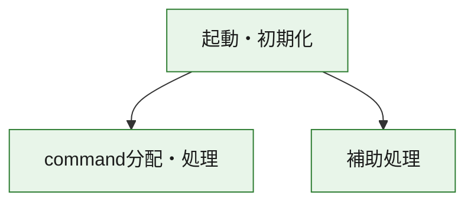
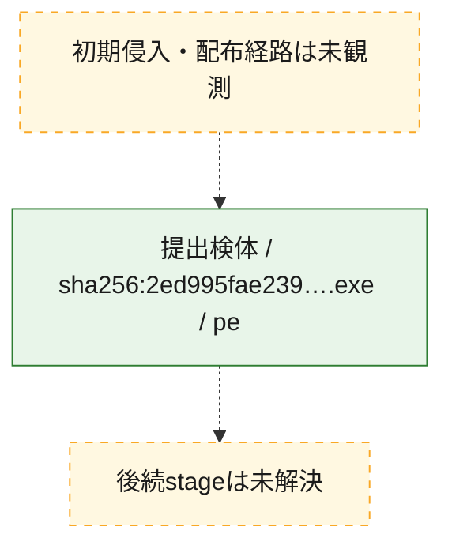
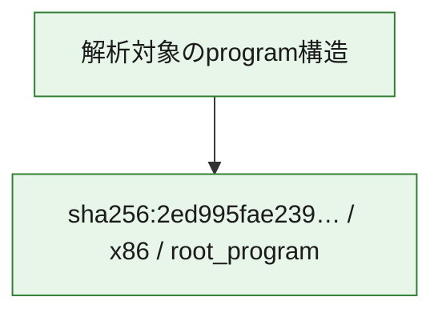

# 全体ロジック：2ed995fae2393446405a51f54f2f4035319448f4264c75ad4a540af8281b8744

代表関数の静的証跡から、起動・初期化、command分配・処理の処理群を確認しました。

## 読み方

- phaseの掲載順は解析上の整理順です。observed_call_edgesがない段階間の実行順を断定しません。
- 図の実線は静的に観測した関係、点線と黄色のノードは未観測・未解決の関係を示します。
- 図は静的な要約であり、動的実行を再現するものではありません。
- 詳細な関数解説とfingerprintは[STATIC-LOGIC.md](STATIC-LOGIC.md)を参照してください。

## 静的可視化

### 実行フロー

### 感染チェーン

### モジュール関係

## 処理段階

### 1. 起動・初期化

entry pointから初期化と後続処理への移行を確認します。
確度: `confirmed_static_function_evidence`

- `2ed995fae2393446405a51f54f2f4035319448f4264c75ad4a540af8281b8744:ghidra:140597e30` — 初期化と主要処理への分岐を行う入口関数です。 状態: `succeeded`、選定理由: `entry_point`, `meaningful_symbol_name`, `reviewed_call_centrality:22`, `role:entrypoint`

### 2. command分配・処理

受信commandやtaskの解釈、分配、個別handlerへの移行を確認します。
確度: `confirmed_static_function_evidence_with_limits`

- `2ed995fae2393446405a51f54f2f4035319448f4264c75ad4a540af8281b8744:ghidra:14059da40` — commandの解釈、分配、または個別処理を担当する関数です。 状態: `limited_bad_instruction_or_flow`、選定理由: `meaningful_symbol_name`, `reviewed_call_centrality:1`, `role:command_dispatch_or_handler`

### 3. 補助処理

主要処理を支える一般内部関数またはlibrary処理を確認します。
確度: `confirmed_static_function_evidence_with_limits`

- `2ed995fae2393446405a51f54f2f4035319448f4264c75ad4a540af8281b8744:ghidra:140001000` — 検体内部の一般処理を実装する関数です。 状態: `succeeded`、選定理由: `context_representative`, `reviewed_call_centrality:1`
- `2ed995fae2393446405a51f54f2f4035319448f4264c75ad4a540af8281b8744:ghidra:140001020` — 検体内部の一般処理を実装する関数です。 状態: `succeeded`、選定理由: `context_representative`, `reviewed_call_centrality:13`
- `2ed995fae2393446405a51f54f2f4035319448f4264c75ad4a540af8281b8744:ghidra:140001120` — 検体内部の一般処理を実装する関数です。 状態: `succeeded`、選定理由: `context_representative`, `reviewed_call_centrality:2`
- `2ed995fae2393446405a51f54f2f4035319448f4264c75ad4a540af8281b8744:ghidra:140001140` — 検体内部の一般処理を実装する関数です。 状態: `succeeded`、選定理由: `context_representative`, `reviewed_call_centrality:2`
- `2ed995fae2393446405a51f54f2f4035319448f4264c75ad4a540af8281b8744:ghidra:140001160` — 検体内部の一般処理を実装する関数です。 状態: `limited_bad_instruction_or_flow`、選定理由: `context_representative`, `reviewed_call_centrality:5`
- `2ed995fae2393446405a51f54f2f4035319448f4264c75ad4a540af8281b8744:ghidra:140001190` — 検体内部の一般処理を実装する関数です。 状態: `limited_bad_instruction_or_flow`、選定理由: `context_representative`, `reviewed_call_centrality:8`
- `2ed995fae2393446405a51f54f2f4035319448f4264c75ad4a540af8281b8744:ghidra:140001240` — 検体内部の一般処理を実装する関数です。 状態: `limited_bad_instruction_or_flow`、選定理由: `context_representative`, `reviewed_call_centrality:8`
- `2ed995fae2393446405a51f54f2f4035319448f4264c75ad4a540af8281b8744:ghidra:1400014d0` — 検体内部の一般処理を実装する関数です。 状態: `succeeded`、選定理由: `context_representative`, `reviewed_call_centrality:4`
- `2ed995fae2393446405a51f54f2f4035319448f4264c75ad4a540af8281b8744:ghidra:140001520` — 検体内部の一般処理を実装する関数です。 状態: `succeeded`、選定理由: `context_representative`, `reviewed_call_centrality:6`
- `2ed995fae2393446405a51f54f2f4035319448f4264c75ad4a540af8281b8744:ghidra:140001740` — 検体内部の一般処理を実装する関数です。 状態: `succeeded`、選定理由: `context_representative`, `reviewed_call_centrality:4`
- `2ed995fae2393446405a51f54f2f4035319448f4264c75ad4a540af8281b8744:ghidra:140001790` — 検体内部の一般処理を実装する関数です。 状態: `succeeded`、選定理由: `context_representative`, `reviewed_call_centrality:9`
- `2ed995fae2393446405a51f54f2f4035319448f4264c75ad4a540af8281b8744:ghidra:140001a30` — 検体内部の一般処理を実装する関数です。 状態: `succeeded`、選定理由: `context_representative`, `reviewed_call_centrality:4`
- `2ed995fae2393446405a51f54f2f4035319448f4264c75ad4a540af8281b8744:ghidra:140001a80` — 検体内部の一般処理を実装する関数です。 状態: `succeeded`、選定理由: `context_representative`, `reviewed_call_centrality:14`
- `2ed995fae2393446405a51f54f2f4035319448f4264c75ad4a540af8281b8744:ghidra:140002790` — 検体内部の一般処理を実装する関数です。 状態: `succeeded`、選定理由: `context_representative`, `reviewed_call_centrality:4`
- `2ed995fae2393446405a51f54f2f4035319448f4264c75ad4a540af8281b8744:ghidra:1400027e0` — 検体内部の一般処理を実装する関数です。 状態: `succeeded`、選定理由: `context_representative`, `reviewed_call_centrality:8`
- `2ed995fae2393446405a51f54f2f4035319448f4264c75ad4a540af8281b8744:ghidra:140003010` — 検体内部の一般処理を実装する関数です。 状態: `succeeded`、選定理由: `context_representative`, `reviewed_call_centrality:4`
- `2ed995fae2393446405a51f54f2f4035319448f4264c75ad4a540af8281b8744:ghidra:140003060` — 検体内部の一般処理を実装する関数です。 状態: `succeeded`、選定理由: `context_representative`, `reviewed_call_centrality:7`
- `2ed995fae2393446405a51f54f2f4035319448f4264c75ad4a540af8281b8744:ghidra:140003420` — 検体内部の一般処理を実装する関数です。 状態: `succeeded`、選定理由: `context_representative`, `reviewed_call_centrality:4`
- `2ed995fae2393446405a51f54f2f4035319448f4264c75ad4a540af8281b8744:ghidra:140003470` — 検体内部の一般処理を実装する関数です。 状態: `succeeded`、選定理由: `context_representative`, `reviewed_call_centrality:4`
- `2ed995fae2393446405a51f54f2f4035319448f4264c75ad4a540af8281b8744:ghidra:1400034e0` — 検体内部の一般処理を実装する関数です。 状態: `succeeded`、選定理由: `context_representative`, `reviewed_call_centrality:9`
- `2ed995fae2393446405a51f54f2f4035319448f4264c75ad4a540af8281b8744:ghidra:1400035c0` — 検体内部の一般処理を実装する関数です。 状態: `succeeded`、選定理由: `context_representative`, `reviewed_call_centrality:4`
- `2ed995fae2393446405a51f54f2f4035319448f4264c75ad4a540af8281b8744:ghidra:140003610` — 検体内部の一般処理を実装する関数です。 状態: `succeeded`、選定理由: `context_representative`, `reviewed_call_centrality:4`
- `2ed995fae2393446405a51f54f2f4035319448f4264c75ad4a540af8281b8744:ghidra:140003660` — 検体内部の一般処理を実装する関数です。 状態: `limited_bad_instruction_or_flow`、選定理由: `context_representative`, `reviewed_call_centrality:4`
- `2ed995fae2393446405a51f54f2f4035319448f4264c75ad4a540af8281b8744:ghidra:1400036d0` — 検体内部の一般処理を実装する関数です。 状態: `succeeded`、選定理由: `context_representative`, `reviewed_call_centrality:1`
- `2ed995fae2393446405a51f54f2f4035319448f4264c75ad4a540af8281b8744:ghidra:140003710` — 検体内部の一般処理を実装する関数です。 状態: `limited_bad_instruction_or_flow`、選定理由: `context_representative`, `reviewed_call_centrality:4`
- `2ed995fae2393446405a51f54f2f4035319448f4264c75ad4a540af8281b8744:ghidra:140003750` — 検体内部の一般処理を実装する関数です。 状態: `succeeded`、選定理由: `context_representative`, `reviewed_call_centrality:4`
- `2ed995fae2393446405a51f54f2f4035319448f4264c75ad4a540af8281b8744:ghidra:140003780` — 検体内部の一般処理を実装する関数です。 状態: `succeeded`、選定理由: `context_representative`, `reviewed_call_centrality:8`
- `2ed995fae2393446405a51f54f2f4035319448f4264c75ad4a540af8281b8744:ghidra:140003910` — 検体内部の一般処理を実装する関数です。 状態: `succeeded`、選定理由: `context_representative`, `reviewed_call_centrality:4`
- `2ed995fae2393446405a51f54f2f4035319448f4264c75ad4a540af8281b8744:ghidra:140003970` — 検体内部の一般処理を実装する関数です。 状態: `limited_bad_instruction_or_flow`、選定理由: `context_representative`, `reviewed_call_centrality:4`
- `2ed995fae2393446405a51f54f2f4035319448f4264c75ad4a540af8281b8744:ghidra:140598150` — 検体内部の一般処理を実装する関数です。 状態: `succeeded`、選定理由: `meaningful_symbol_name`

## 観測したcall関係

- `2ed995fae2393446405a51f54f2f4035319448f4264c75ad4a540af8281b8744:ghidra:140001020` → `2ed995fae2393446405a51f54f2f4035319448f4264c75ad4a540af8281b8744:ghidra:140001000` （`support` → `support`）
- `2ed995fae2393446405a51f54f2f4035319448f4264c75ad4a540af8281b8744:ghidra:1400036d0` → `2ed995fae2393446405a51f54f2f4035319448f4264c75ad4a540af8281b8744:ghidra:140001160` （`support` → `support`）
- `2ed995fae2393446405a51f54f2f4035319448f4264c75ad4a540af8281b8744:ghidra:140597e30` → `2ed995fae2393446405a51f54f2f4035319448f4264c75ad4a540af8281b8744:ghidra:140001020` （`startup` → `support`）
- `2ed995fae2393446405a51f54f2f4035319448f4264c75ad4a540af8281b8744:ghidra:140597e30` → `2ed995fae2393446405a51f54f2f4035319448f4264c75ad4a540af8281b8744:ghidra:14059da40` （`startup` → `dispatch`）
- `ghidra-function:0b21eac7c6a5f86f206c30f2` → `ghidra-external:65fd01516a842461c0bc00fd` （`unclassified` → `unclassified`）
- `ghidra-function:0b21eac7c6a5f86f206c30f2` → `ghidra-external:9bfb6977569cc5e4ba3f7da6` （`unclassified` → `unclassified`）
- `ghidra-function:0b21eac7c6a5f86f206c30f2` → `ghidra-external:d16f144c12130c0b626dcb1d` （`unclassified` → `unclassified`）
- `ghidra-function:0b21eac7c6a5f86f206c30f2` → `ghidra-function:289ee3f20e15995883a8f576` （`unclassified` → `unclassified`）
- `ghidra-function:0b21eac7c6a5f86f206c30f2` → `ghidra-function:6b4f36d4cfc169cc057b05d8` （`unclassified` → `unclassified`）
- `ghidra-function:0b21eac7c6a5f86f206c30f2` → `ghidra-function:95abc0d62396a8f308d225f4` （`unclassified` → `unclassified`）
- `ghidra-function:0b21eac7c6a5f86f206c30f2` → `ghidra-function:d0bce8dbe444ff6792f19fc5` （`unclassified` → `unclassified`）
- `ghidra-function:0b21eac7c6a5f86f206c30f2` → `ghidra-function:dce69fa160f9464d01196ca1` （`unclassified` → `unclassified`）
- `ghidra-function:0cf9d5ceb4fe25be4d95dc4c` → `ghidra-external:65fd01516a842461c0bc00fd` （`unclassified` → `unclassified`）
- `ghidra-function:0cf9d5ceb4fe25be4d95dc4c` → `ghidra-function:53d2b192318522b18f0b1aad` （`unclassified` → `unclassified`）
- `ghidra-function:0cf9d5ceb4fe25be4d95dc4c` → `ghidra-function:6b4f36d4cfc169cc057b05d8` （`unclassified` → `unclassified`）
- `ghidra-function:0cf9d5ceb4fe25be4d95dc4c` → `ghidra-function:878550d88550a748592c3b88` （`unclassified` → `unclassified`）
- `ghidra-function:0cf9d5ceb4fe25be4d95dc4c` → `ghidra-function:bee2c56b1d5b65e30a98f298` （`unclassified` → `unclassified`）
- `ghidra-function:0cf9d5ceb4fe25be4d95dc4c` → `ghidra-function:d0bce8dbe444ff6792f19fc5` （`unclassified` → `unclassified`）
- `ghidra-function:12dddf0f1766009231503a29` → `ghidra-function:22136d3bbf57b90873631843` （`unclassified` → `unclassified`）
- `ghidra-function:12dddf0f1766009231503a29` → `ghidra-function:23f928332ce1cec21c6d16ab` （`unclassified` → `unclassified`）
- `ghidra-function:179c40a04fb1a9e5677b271d` → `ghidra-function:22136d3bbf57b90873631843` （`unclassified` → `unclassified`）
- `ghidra-function:179c40a04fb1a9e5677b271d` → `ghidra-function:23f928332ce1cec21c6d16ab` （`unclassified` → `unclassified`）
- `ghidra-function:1b94485e16938c5c60663a26` → `ghidra-external:65fd01516a842461c0bc00fd` （`unclassified` → `unclassified`）
- `ghidra-function:1b94485e16938c5c60663a26` → `ghidra-function:6b4f36d4cfc169cc057b05d8` （`unclassified` → `unclassified`）
- `ghidra-function:1b94485e16938c5c60663a26` → `ghidra-function:bee2c56b1d5b65e30a98f298` （`unclassified` → `unclassified`）
- `ghidra-function:1b94485e16938c5c60663a26` → `ghidra-function:d0bce8dbe444ff6792f19fc5` （`unclassified` → `unclassified`）
- `ghidra-function:2b1e14f62b0e8ab0433b8a79` → `ghidra-function:22136d3bbf57b90873631843` （`unclassified` → `unclassified`）
- `ghidra-function:2b1e14f62b0e8ab0433b8a79` → `ghidra-function:23f928332ce1cec21c6d16ab` （`unclassified` → `unclassified`）
- `ghidra-function:2cdcf838f2f03913fbd84c2b` → `ghidra-function:22136d3bbf57b90873631843` （`unclassified` → `unclassified`）
- `ghidra-function:2cdcf838f2f03913fbd84c2b` → `ghidra-function:23f928332ce1cec21c6d16ab` （`unclassified` → `unclassified`）
- `ghidra-function:40b701ec6b0a8a7f2496b5dc` → `ghidra-function:22136d3bbf57b90873631843` （`unclassified` → `unclassified`）
- `ghidra-function:40b701ec6b0a8a7f2496b5dc` → `ghidra-function:23f928332ce1cec21c6d16ab` （`unclassified` → `unclassified`）
- `ghidra-function:430883371f61c9c4cfa90fcc` → `ghidra-function:22136d3bbf57b90873631843` （`unclassified` → `unclassified`）
- `ghidra-function:430883371f61c9c4cfa90fcc` → `ghidra-function:23f928332ce1cec21c6d16ab` （`unclassified` → `unclassified`）
- `ghidra-function:45a3af975d98f60f0564b0d7` → `ghidra-external:011faae0f23e81091bca6d12` （`unclassified` → `unclassified`）
- `ghidra-function:45a3af975d98f60f0564b0d7` → `ghidra-external:0bc7c377047739a7922f95e3` （`unclassified` → `unclassified`）
- `ghidra-function:45a3af975d98f60f0564b0d7` → `ghidra-external:27989fbeadd8363ece5049b1` （`unclassified` → `unclassified`）
- `ghidra-function:45a3af975d98f60f0564b0d7` → `ghidra-external:3c4991d4da07a95782a2b56b` （`unclassified` → `unclassified`）
- `ghidra-function:45a3af975d98f60f0564b0d7` → `ghidra-external:599589152070282d1b524e38` （`unclassified` → `unclassified`）
- `ghidra-function:45a3af975d98f60f0564b0d7` → `ghidra-external:666cac3e65cdcf079ec53c29` （`unclassified` → `unclassified`）
- `ghidra-function:45a3af975d98f60f0564b0d7` → `ghidra-external:748bda1604aaeda36293be35` （`unclassified` → `unclassified`）
- `ghidra-function:45a3af975d98f60f0564b0d7` → `ghidra-external:7a8a7db60b868a8712ba76e1` （`unclassified` → `unclassified`）
- `ghidra-function:45a3af975d98f60f0564b0d7` → `ghidra-external:9cb37cbbd8582d861d6ee30c` （`unclassified` → `unclassified`）
- `ghidra-function:45a3af975d98f60f0564b0d7` → `ghidra-external:d16f144c12130c0b626dcb1d` （`unclassified` → `unclassified`）
- `ghidra-function:45a3af975d98f60f0564b0d7` → `ghidra-external:dea191e1f6aebed00266bce9` （`unclassified` → `unclassified`）
- `ghidra-function:45a3af975d98f60f0564b0d7` → `ghidra-external:fcd8f4828246adf37c2fd27a` （`unclassified` → `unclassified`）
- `ghidra-function:45a3af975d98f60f0564b0d7` → `ghidra-function:02cfe5aa4dfd232dc8914354` （`unclassified` → `unclassified`）
- `ghidra-function:45a3af975d98f60f0564b0d7` → `ghidra-function:2e14c7d9bb09ec0112130227` （`unclassified` → `unclassified`）
- `ghidra-function:45a3af975d98f60f0564b0d7` → `ghidra-function:31e09ac3b45db370fe8696ab` （`unclassified` → `unclassified`）
- `ghidra-function:45a3af975d98f60f0564b0d7` → `ghidra-function:522251eb2f633a4afb447aa5` （`unclassified` → `unclassified`）
- `ghidra-function:45a3af975d98f60f0564b0d7` → `ghidra-function:da06b45ab7152feef5c01132` （`unclassified` → `unclassified`）
- `ghidra-function:45a3af975d98f60f0564b0d7` → `ghidra-function:e1b4edac6c2ab4d703285761` （`unclassified` → `unclassified`）
- `ghidra-function:45a3af975d98f60f0564b0d7` → `ghidra-function:e408aa2757b61ce0a6c6d861` （`unclassified` → `unclassified`）
- `ghidra-function:45a3af975d98f60f0564b0d7` → `ghidra-function:ed87651bd25c40a1f36410fd` （`unclassified` → `unclassified`）
- `ghidra-function:45a3af975d98f60f0564b0d7` → `ghidra-function:ee1e245e53601bd75e1b4b05` （`unclassified` → `unclassified`）
- `ghidra-function:45a3af975d98f60f0564b0d7` → `ghidra-function:ef18eff5ff362ecea882d16d` （`unclassified` → `unclassified`）
- `ghidra-function:46cc023ce0cb834ed75d4716` → `ghidra-function:22136d3bbf57b90873631843` （`unclassified` → `unclassified`）
- `ghidra-function:46cc023ce0cb834ed75d4716` → `ghidra-function:23f928332ce1cec21c6d16ab` （`unclassified` → `unclassified`）
- `ghidra-function:490706b6bef0e65bc0c26a10` → `ghidra-function:22136d3bbf57b90873631843` （`unclassified` → `unclassified`）
- `ghidra-function:490706b6bef0e65bc0c26a10` → `ghidra-function:23f928332ce1cec21c6d16ab` （`unclassified` → `unclassified`）
- `ghidra-function:490706b6bef0e65bc0c26a10` → `ghidra-function:35d3c2f564139647e4fa2fe4` （`unclassified` → `unclassified`）
- `ghidra-function:490706b6bef0e65bc0c26a10` → `ghidra-function:6b4f36d4cfc169cc057b05d8` （`unclassified` → `unclassified`）
- `ghidra-function:490706b6bef0e65bc0c26a10` → `ghidra-function:bee2c56b1d5b65e30a98f298` （`unclassified` → `unclassified`）
- `ghidra-function:522251eb2f633a4afb447aa5` → `ghidra-external:251762dc381d76d27753ad49` （`unclassified` → `unclassified`）
- `ghidra-function:522251eb2f633a4afb447aa5` → `ghidra-external:65fd01516a842461c0bc00fd` （`unclassified` → `unclassified`）
- `ghidra-function:522251eb2f633a4afb447aa5` → `ghidra-external:894449054e9ca0eed83a53c7` （`unclassified` → `unclassified`）
- `ghidra-function:522251eb2f633a4afb447aa5` → `ghidra-function:21cceb2a362965a66f5efbf6` （`unclassified` → `unclassified`）
- `ghidra-function:522251eb2f633a4afb447aa5` → `ghidra-function:2c5825cc029183f6bc62671b` （`unclassified` → `unclassified`）
- `ghidra-function:522251eb2f633a4afb447aa5` → `ghidra-function:31aadd6ebf3d6b0cf0c6343d` （`unclassified` → `unclassified`）
- `ghidra-function:522251eb2f633a4afb447aa5` → `ghidra-function:7c686b9ab466afffa8d6a8ae` （`unclassified` → `unclassified`）
- `ghidra-function:522251eb2f633a4afb447aa5` → `ghidra-function:bb408b89b13773c199b40cc0` （`unclassified` → `unclassified`）
- `ghidra-function:522251eb2f633a4afb447aa5` → `ghidra-function:f7993e544d0f704cee068628` （`unclassified` → `unclassified`）
- `ghidra-function:6b848274a8fa5a770deb0d9f` → `ghidra-external:65fd01516a842461c0bc00fd` （`unclassified` → `unclassified`）
- `ghidra-function:6b848274a8fa5a770deb0d9f` → `ghidra-function:a87ecad13c6d7c3c95fb7d73` （`unclassified` → `unclassified`）
- `ghidra-function:75343124d2775c16ea7a0eb8` → `ghidra-function:46cc023ce0cb834ed75d4716` （`unclassified` → `unclassified`）
- `ghidra-function:75b06bbf03a37f2d0433fa84` → `ghidra-function:22136d3bbf57b90873631843` （`unclassified` → `unclassified`）
- `ghidra-function:75b06bbf03a37f2d0433fa84` → `ghidra-function:23f928332ce1cec21c6d16ab` （`unclassified` → `unclassified`）
- `ghidra-function:798d3c93f9251ba127bbd4cf` → `ghidra-function:22136d3bbf57b90873631843` （`unclassified` → `unclassified`）
- `ghidra-function:798d3c93f9251ba127bbd4cf` → `ghidra-function:23f928332ce1cec21c6d16ab` （`unclassified` → `unclassified`）
- `ghidra-function:7f17f1f8bb734845fcd49f0e` → `ghidra-external:65fd01516a842461c0bc00fd` （`unclassified` → `unclassified`）
- `ghidra-function:7f17f1f8bb734845fcd49f0e` → `ghidra-function:22136d3bbf57b90873631843` （`unclassified` → `unclassified`）
- `ghidra-function:7f17f1f8bb734845fcd49f0e` → `ghidra-function:23f928332ce1cec21c6d16ab` （`unclassified` → `unclassified`）
- `ghidra-function:7f17f1f8bb734845fcd49f0e` → `ghidra-function:53d2b192318522b18f0b1aad` （`unclassified` → `unclassified`）
- `ghidra-function:7f17f1f8bb734845fcd49f0e` → `ghidra-function:6b4f36d4cfc169cc057b05d8` （`unclassified` → `unclassified`）
- `ghidra-function:7f17f1f8bb734845fcd49f0e` → `ghidra-function:d0bce8dbe444ff6792f19fc5` （`unclassified` → `unclassified`）
- `ghidra-function:9c20028a51e777db40d5a57c` → `ghidra-external:544210cc07c2fc972f6a34f1` （`unclassified` → `unclassified`）
- `ghidra-function:9c20028a51e777db40d5a57c` → `ghidra-external:65fd01516a842461c0bc00fd` （`unclassified` → `unclassified`）
- `ghidra-function:9c20028a51e777db40d5a57c` → `ghidra-external:badbe2d2c230f35aa230a6ae` （`unclassified` → `unclassified`）
- `ghidra-function:9c20028a51e777db40d5a57c` → `ghidra-function:289ee3f20e15995883a8f576` （`unclassified` → `unclassified`）
- `ghidra-function:9c20028a51e777db40d5a57c` → `ghidra-function:472fee340963725ffa530bb8` （`unclassified` → `unclassified`）
- `ghidra-function:9c20028a51e777db40d5a57c` → `ghidra-function:53d2b192318522b18f0b1aad` （`unclassified` → `unclassified`）
- `ghidra-function:9c20028a51e777db40d5a57c` → `ghidra-function:6b4f36d4cfc169cc057b05d8` （`unclassified` → `unclassified`）
- `ghidra-function:9c20028a51e777db40d5a57c` → `ghidra-function:d0bce8dbe444ff6792f19fc5` （`unclassified` → `unclassified`）
- `ghidra-function:a65fada61ba303f870adaf55` → `ghidra-function:22136d3bbf57b90873631843` （`unclassified` → `unclassified`）
- `ghidra-function:a65fada61ba303f870adaf55` → `ghidra-function:23f928332ce1cec21c6d16ab` （`unclassified` → `unclassified`）
- `ghidra-function:aa2b812054b2b64f5c7d79db` → `ghidra-function:22136d3bbf57b90873631843` （`unclassified` → `unclassified`）
- `ghidra-function:aa2b812054b2b64f5c7d79db` → `ghidra-function:23f928332ce1cec21c6d16ab` （`unclassified` → `unclassified`）
- `ghidra-function:acb2a312869838669dd18247` → `ghidra-function:22136d3bbf57b90873631843` （`unclassified` → `unclassified`）
- `ghidra-function:acb2a312869838669dd18247` → `ghidra-function:23f928332ce1cec21c6d16ab` （`unclassified` → `unclassified`）
- `ghidra-function:afa6a610a7d4dfafab577e13` → `ghidra-function:22136d3bbf57b90873631843` （`unclassified` → `unclassified`）
- `ghidra-function:afa6a610a7d4dfafab577e13` → `ghidra-function:23f928332ce1cec21c6d16ab` （`unclassified` → `unclassified`）
- `ghidra-function:b3fc01789745e3104c5f4beb` → `ghidra-external:244d2738be266260f764211a` （`unclassified` → `unclassified`）
- `ghidra-function:b3fc01789745e3104c5f4beb` → `ghidra-external:544210cc07c2fc972f6a34f1` （`unclassified` → `unclassified`）
- `ghidra-function:b3fc01789745e3104c5f4beb` → `ghidra-external:5f5f40084721af30c9c76d51` （`unclassified` → `unclassified`）
- `ghidra-function:b3fc01789745e3104c5f4beb` → `ghidra-external:65fd01516a842461c0bc00fd` （`unclassified` → `unclassified`）
- `ghidra-function:b3fc01789745e3104c5f4beb` → `ghidra-external:badbe2d2c230f35aa230a6ae` （`unclassified` → `unclassified`）
- `ghidra-function:b3fc01789745e3104c5f4beb` → `ghidra-function:12fdd4bd63a526075909d2d7` （`unclassified` → `unclassified`）
- `ghidra-function:b3fc01789745e3104c5f4beb` → `ghidra-function:289ee3f20e15995883a8f576` （`unclassified` → `unclassified`）
- `ghidra-function:b3fc01789745e3104c5f4beb` → `ghidra-function:39c17a5df51fd40d3b62c0a6` （`unclassified` → `unclassified`）
- `ghidra-function:b3fc01789745e3104c5f4beb` → `ghidra-function:472fee340963725ffa530bb8` （`unclassified` → `unclassified`）
- `ghidra-function:b3fc01789745e3104c5f4beb` → `ghidra-function:53d2b192318522b18f0b1aad` （`unclassified` → `unclassified`）
- `ghidra-function:b3fc01789745e3104c5f4beb` → `ghidra-function:6b4f36d4cfc169cc057b05d8` （`unclassified` → `unclassified`）
- `ghidra-function:b3fc01789745e3104c5f4beb` → `ghidra-function:8211a602a5f6d7f3117b2173` （`unclassified` → `unclassified`）
- `ghidra-function:b3fc01789745e3104c5f4beb` → `ghidra-function:d0bce8dbe444ff6792f19fc5` （`unclassified` → `unclassified`）
- `ghidra-function:b3fc01789745e3104c5f4beb` → `ghidra-function:fc5b1b18be50c2c1a55a2d6e` （`unclassified` → `unclassified`）
- `ghidra-function:b53c864f3bb77fd4e82ce65c` → `ghidra-external:65fd01516a842461c0bc00fd` （`unclassified` → `unclassified`）
- `ghidra-function:b53c864f3bb77fd4e82ce65c` → `ghidra-function:0c4d548e69378f635b887a1c` （`unclassified` → `unclassified`）
- `ghidra-function:b53c864f3bb77fd4e82ce65c` → `ghidra-function:289ee3f20e15995883a8f576` （`unclassified` → `unclassified`）
- `ghidra-function:b53c864f3bb77fd4e82ce65c` → `ghidra-function:53d2b192318522b18f0b1aad` （`unclassified` → `unclassified`）
- `ghidra-function:b53c864f3bb77fd4e82ce65c` → `ghidra-function:6b4f36d4cfc169cc057b05d8` （`unclassified` → `unclassified`）
- `ghidra-function:b53c864f3bb77fd4e82ce65c` → `ghidra-function:bee2c56b1d5b65e30a98f298` （`unclassified` → `unclassified`）
- `ghidra-function:b53c864f3bb77fd4e82ce65c` → `ghidra-function:d0bce8dbe444ff6792f19fc5` （`unclassified` → `unclassified`）
- `ghidra-function:c95161215e1aadf7895e1087` → `ghidra-external:5459d603adc80588840a411c` （`unclassified` → `unclassified`）
- `ghidra-function:c95161215e1aadf7895e1087` → `ghidra-external:65fd01516a842461c0bc00fd` （`unclassified` → `unclassified`）
- `ghidra-function:c95161215e1aadf7895e1087` → `ghidra-external:d16f144c12130c0b626dcb1d` （`unclassified` → `unclassified`）
- `ghidra-function:c95161215e1aadf7895e1087` → `ghidra-external:d5e2e06c179edff8664be90e` （`unclassified` → `unclassified`）
- `ghidra-function:c95161215e1aadf7895e1087` → `ghidra-external:f3cc976dd1068114c9d40280` （`unclassified` → `unclassified`）
- `ghidra-function:c95161215e1aadf7895e1087` → `ghidra-function:53d2b192318522b18f0b1aad` （`unclassified` → `unclassified`）
- `ghidra-function:c95161215e1aadf7895e1087` → `ghidra-function:6b4f36d4cfc169cc057b05d8` （`unclassified` → `unclassified`）
- `ghidra-function:c95161215e1aadf7895e1087` → `ghidra-function:bee2c56b1d5b65e30a98f298` （`unclassified` → `unclassified`）
- `ghidra-function:c95161215e1aadf7895e1087` → `ghidra-function:d0bce8dbe444ff6792f19fc5` （`unclassified` → `unclassified`）
- `ghidra-function:d18a829838da0dfd92121f78` → `ghidra-external:65fd01516a842461c0bc00fd` （`unclassified` → `unclassified`）
- `ghidra-function:d18a829838da0dfd92121f78` → `ghidra-function:a87ecad13c6d7c3c95fb7d73` （`unclassified` → `unclassified`）
- `ghidra-function:e1dc7883bc9ba7630d7ad125` → `ghidra-function:22136d3bbf57b90873631843` （`unclassified` → `unclassified`）
- `ghidra-function:e1dc7883bc9ba7630d7ad125` → `ghidra-function:23f928332ce1cec21c6d16ab` （`unclassified` → `unclassified`）
- `ghidra-function:fdaced7f81a3db0bdf626535` → `ghidra-external:65fd01516a842461c0bc00fd` （`unclassified` → `unclassified`）
- `ghidra-function:fdaced7f81a3db0bdf626535` → `ghidra-function:22136d3bbf57b90873631843` （`unclassified` → `unclassified`）
- `ghidra-function:fdaced7f81a3db0bdf626535` → `ghidra-function:23f928332ce1cec21c6d16ab` （`unclassified` → `unclassified`）
- `ghidra-function:fdaced7f81a3db0bdf626535` → `ghidra-function:35d3c2f564139647e4fa2fe4` （`unclassified` → `unclassified`）
- `ghidra-function:fdaced7f81a3db0bdf626535` → `ghidra-function:d0bce8dbe444ff6792f19fc5` （`unclassified` → `unclassified`）
- `ghidra-function:fdaced7f81a3db0bdf626535` → `ghidra-function:f45f4236f722c56138682da5` （`unclassified` → `unclassified`）

## 解析範囲と制約

- 選定外関数は全体inventoryへ残しますが、関数本体の個別解説対象にはしていません。
- indirect call、難読化、packer、VM、壊れたcontrol flowによりcall関係が欠落する場合があります。
- 文書は静的解析に基づき、検体実行や外部通信による動的確認は行っていません。
