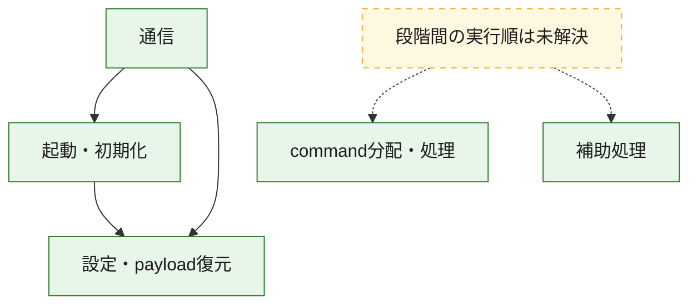
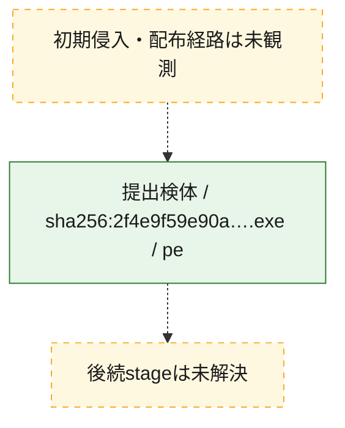
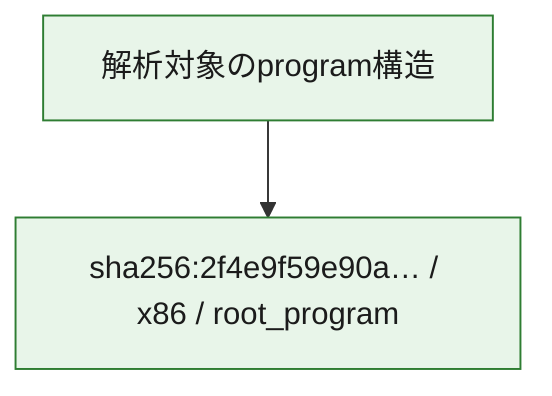

# 全体ロジック：2f4e9f59e90a05a4b36df86446da6708e49bef6066cb5d34cd3d8020d505a85e

代表関数の静的証跡から、起動・初期化、設定・payload復元、通信、command分配・処理の処理群を確認しました。

## 読み方

- phaseの掲載順は解析上の整理順です。observed_call_edgesがない段階間の実行順を断定しません。
- 図の実線は静的に観測した関係、点線と黄色のノードは未観測・未解決の関係を示します。
- 図は静的な要約であり、動的実行を再現するものではありません。
- 詳細な関数解説とfingerprintは[STATIC-LOGIC.md](STATIC-LOGIC.md)を参照してください。

## 静的可視化

### 実行フロー

### 感染チェーン

### モジュール関係

## 処理段階

### 1. 起動・初期化

entry pointから初期化と後続処理への移行を確認します。
確度: `confirmed_static_function_evidence`

- `2f4e9f59e90a05a4b36df86446da6708e49bef6066cb5d34cd3d8020d505a85e:ghidra:140009bb7` — 初期化と主要処理への分岐を行う入口関数です。 状態: `succeeded`、選定理由: `entry_point`, `meaningful_symbol_name`, `reviewed_call_centrality:7`, `role:entrypoint`
- `2f4e9f59e90a05a4b36df86446da6708e49bef6066cb5d34cd3d8020d505a85e:ghidra:1400109e0` — 初期化と主要処理への分岐を行う入口関数です。 状態: `succeeded`、選定理由: `entry_point`, `meaningful_symbol_name`, `probable_go_main_user_code`, `reviewed_call_centrality:23`, `role:entrypoint`

### 2. 設定・payload復元

設定、resource、payload、暗号化データの復元・変換を確認します。
確度: `confirmed_static_function_evidence`

- `2f4e9f59e90a05a4b36df86446da6708e49bef6066cb5d34cd3d8020d505a85e:ghidra:1400016e1` — 設定、resource、payloadなどの解析・変換を行う関数です。 状態: `succeeded`、選定理由: `meaningful_symbol_name`, `reviewed_call_centrality:1`, `role:config_or_data_transform`
- `2f4e9f59e90a05a4b36df86446da6708e49bef6066cb5d34cd3d8020d505a85e:ghidra:140001c94` — 設定、resource、payloadなどの解析・変換を行う関数です。 状態: `succeeded`、選定理由: `meaningful_symbol_name`, `reviewed_call_centrality:1`, `role:config_or_data_transform`
- `2f4e9f59e90a05a4b36df86446da6708e49bef6066cb5d34cd3d8020d505a85e:ghidra:1400022ae` — 暗号、hash、encoding、または復号処理に関係する関数です。 状態: `succeeded`、選定理由: `meaningful_symbol_name`, `reviewed_call_centrality:4`, `role:cryptographic_transform`
- `2f4e9f59e90a05a4b36df86446da6708e49bef6066cb5d34cd3d8020d505a85e:ghidra:140002ecc` — 暗号、hash、encoding、または復号処理に関係する関数です。 状態: `succeeded`、選定理由: `meaningful_symbol_name`, `reviewed_call_centrality:4`, `role:cryptographic_transform`
- `2f4e9f59e90a05a4b36df86446da6708e49bef6066cb5d34cd3d8020d505a85e:ghidra:140002fb6` — 暗号、hash、encoding、または復号処理に関係する関数です。 状態: `succeeded`、選定理由: `meaningful_symbol_name`, `reviewed_call_centrality:12`, `role:cryptographic_transform`
- `2f4e9f59e90a05a4b36df86446da6708e49bef6066cb5d34cd3d8020d505a85e:ghidra:1400031e9` — 設定、resource、payloadなどの解析・変換を行う関数です。 状態: `succeeded`、選定理由: `meaningful_symbol_name`, `reviewed_call_centrality:13`, `role:config_or_data_transform`
- `2f4e9f59e90a05a4b36df86446da6708e49bef6066cb5d34cd3d8020d505a85e:ghidra:140003c95` — 設定、resource、payloadなどの解析・変換を行う関数です。 状態: `succeeded`、選定理由: `meaningful_symbol_name`, `reviewed_call_centrality:1`, `role:config_or_data_transform`
- `2f4e9f59e90a05a4b36df86446da6708e49bef6066cb5d34cd3d8020d505a85e:ghidra:140005261` — 設定、resource、payloadなどの解析・変換を行う関数です。 状態: `succeeded`、選定理由: `meaningful_symbol_name`, `reviewed_call_centrality:2`, `role:config_or_data_transform`
- `2f4e9f59e90a05a4b36df86446da6708e49bef6066cb5d34cd3d8020d505a85e:ghidra:140005dfb` — 暗号、hash、encoding、または復号処理に関係する関数です。 状態: `succeeded`、選定理由: `meaningful_symbol_name`, `reviewed_call_centrality:2`, `role:cryptographic_transform`
- `2f4e9f59e90a05a4b36df86446da6708e49bef6066cb5d34cd3d8020d505a85e:ghidra:140005f7d` — 設定、resource、payloadなどの解析・変換を行う関数です。 状態: `succeeded`、選定理由: `meaningful_symbol_name`, `reviewed_call_centrality:12`, `role:config_or_data_transform`
- `2f4e9f59e90a05a4b36df86446da6708e49bef6066cb5d34cd3d8020d505a85e:ghidra:1400064c3` — 設定、resource、payloadなどの解析・変換を行う関数です。 状態: `succeeded`、選定理由: `meaningful_symbol_name`, `reviewed_call_centrality:9`, `role:config_or_data_transform`
- `2f4e9f59e90a05a4b36df86446da6708e49bef6066cb5d34cd3d8020d505a85e:ghidra:140008307` — 設定、resource、payloadなどの解析・変換を行う関数です。 状態: `succeeded`、選定理由: `meaningful_symbol_name`, `reviewed_call_centrality:1`, `role:config_or_data_transform`
- `2f4e9f59e90a05a4b36df86446da6708e49bef6066cb5d34cd3d8020d505a85e:ghidra:14000a76a` — 設定、resource、payloadなどの解析・変換を行う関数です。 状態: `succeeded`、選定理由: `meaningful_symbol_name`, `reviewed_call_centrality:7`, `role:config_or_data_transform`

### 3. 通信

通信初期化、endpoint処理、送受信の役割を確認します。
確度: `confirmed_static_function_evidence`

- `2f4e9f59e90a05a4b36df86446da6708e49bef6066cb5d34cd3d8020d505a85e:ghidra:140005b93` — 通信初期化、送受信、またはendpoint処理に関係する関数です。 状態: `succeeded`、選定理由: `meaningful_symbol_name`, `reviewed_call_centrality:3`, `role:network_communication`
- `2f4e9f59e90a05a4b36df86446da6708e49bef6066cb5d34cd3d8020d505a85e:ghidra:140006ad1` — 通信初期化、送受信、またはendpoint処理に関係する関数です。 状態: `succeeded`、選定理由: `meaningful_symbol_name`, `reviewed_call_centrality:3`, `role:network_communication`
- `2f4e9f59e90a05a4b36df86446da6708e49bef6066cb5d34cd3d8020d505a85e:ghidra:140007711` — 通信初期化、送受信、またはendpoint処理に関係する関数です。 状態: `succeeded`、選定理由: `meaningful_symbol_name`, `reviewed_call_centrality:3`, `role:network_communication`
- `2f4e9f59e90a05a4b36df86446da6708e49bef6066cb5d34cd3d8020d505a85e:ghidra:1400090f9` — 通信初期化、送受信、またはendpoint処理に関係する関数です。 状態: `succeeded`、選定理由: `meaningful_symbol_name`, `reviewed_call_centrality:20`, `role:network_communication`
- `2f4e9f59e90a05a4b36df86446da6708e49bef6066cb5d34cd3d8020d505a85e:ghidra:140009339` — 通信初期化、送受信、またはendpoint処理に関係する関数です。 状態: `succeeded`、選定理由: `meaningful_symbol_name`, `reviewed_call_centrality:6`, `role:network_communication`
- `2f4e9f59e90a05a4b36df86446da6708e49bef6066cb5d34cd3d8020d505a85e:ghidra:140009696` — 通信初期化、送受信、またはendpoint処理に関係する関数です。 状態: `succeeded`、選定理由: `meaningful_symbol_name`, `reviewed_call_centrality:3`, `role:network_communication`
- `2f4e9f59e90a05a4b36df86446da6708e49bef6066cb5d34cd3d8020d505a85e:ghidra:1400096f5` — 通信初期化、送受信、またはendpoint処理に関係する関数です。 状態: `succeeded`、選定理由: `meaningful_symbol_name`, `reviewed_call_centrality:5`, `role:network_communication`
- `2f4e9f59e90a05a4b36df86446da6708e49bef6066cb5d34cd3d8020d505a85e:ghidra:140009831` — 通信初期化、送受信、またはendpoint処理に関係する関数です。 状態: `succeeded`、選定理由: `meaningful_symbol_name`, `reviewed_call_centrality:10`, `role:network_communication`
- `2f4e9f59e90a05a4b36df86446da6708e49bef6066cb5d34cd3d8020d505a85e:ghidra:140009fa5` — 通信初期化、送受信、またはendpoint処理に関係する関数です。 状態: `succeeded`、選定理由: `meaningful_symbol_name`, `reviewed_call_centrality:3`, `role:network_communication`
- `2f4e9f59e90a05a4b36df86446da6708e49bef6066cb5d34cd3d8020d505a85e:ghidra:14000a099` — 通信初期化、送受信、またはendpoint処理に関係する関数です。 状態: `succeeded`、選定理由: `meaningful_symbol_name`, `reviewed_call_centrality:16`, `role:network_communication`
- `2f4e9f59e90a05a4b36df86446da6708e49bef6066cb5d34cd3d8020d505a85e:ghidra:14000b607` — 通信初期化、送受信、またはendpoint処理に関係する関数です。 状態: `succeeded`、選定理由: `meaningful_symbol_name`, `reviewed_call_centrality:15`, `role:network_communication`
- `2f4e9f59e90a05a4b36df86446da6708e49bef6066cb5d34cd3d8020d505a85e:ghidra:14000b910` — 通信初期化、送受信、またはendpoint処理に関係する関数です。 状態: `succeeded`、選定理由: `meaningful_symbol_name`, `reviewed_call_centrality:12`, `role:network_communication`

### 4. command分配・処理

受信commandやtaskの解釈、分配、個別handlerへの移行を確認します。
確度: `confirmed_static_function_evidence`

- `2f4e9f59e90a05a4b36df86446da6708e49bef6066cb5d34cd3d8020d505a85e:ghidra:14000af49` — commandの解釈、分配、または個別処理を担当する関数です。 状態: `succeeded`、選定理由: `meaningful_symbol_name`, `reviewed_call_centrality:5`, `role:command_dispatch_or_handler`
- `2f4e9f59e90a05a4b36df86446da6708e49bef6066cb5d34cd3d8020d505a85e:ghidra:14000bc5a` — commandの解釈、分配、または個別処理を担当する関数です。 状態: `succeeded`、選定理由: `meaningful_symbol_name`, `reviewed_call_centrality:5`, `role:command_dispatch_or_handler`

### 5. 補助処理

主要処理を支える一般内部関数またはlibrary処理を確認します。
確度: `confirmed_static_function_evidence`

- `2f4e9f59e90a05a4b36df86446da6708e49bef6066cb5d34cd3d8020d505a85e:ghidra:140001410` — 検体内部の一般処理を実装する関数です。 状態: `succeeded`、選定理由: `entry_point`, `meaningful_symbol_name`, `reviewed_call_centrality:1`
- `2f4e9f59e90a05a4b36df86446da6708e49bef6066cb5d34cd3d8020d505a85e:ghidra:140011190` — compiler生成処理または汎用library処理とみられる関数です。 状態: `succeeded`、選定理由: `entry_point`, `meaningful_symbol_name`, `reviewed_call_centrality:1`
- `2f4e9f59e90a05a4b36df86446da6708e49bef6066cb5d34cd3d8020d505a85e:ghidra:1400111c0` — compiler生成処理または汎用library処理とみられる関数です。 状態: `succeeded`、選定理由: `entry_point`, `meaningful_symbol_name`, `reviewed_call_centrality:2`

## 観測したcall関係

- `2f4e9f59e90a05a4b36df86446da6708e49bef6066cb5d34cd3d8020d505a85e:ghidra:140002fb6` → `2f4e9f59e90a05a4b36df86446da6708e49bef6066cb5d34cd3d8020d505a85e:ghidra:140002ecc` （`configuration` → `configuration`）
- `2f4e9f59e90a05a4b36df86446da6708e49bef6066cb5d34cd3d8020d505a85e:ghidra:1400031e9` → `2f4e9f59e90a05a4b36df86446da6708e49bef6066cb5d34cd3d8020d505a85e:ghidra:140002ecc` （`configuration` → `configuration`）
- `2f4e9f59e90a05a4b36df86446da6708e49bef6066cb5d34cd3d8020d505a85e:ghidra:140005dfb` → `2f4e9f59e90a05a4b36df86446da6708e49bef6066cb5d34cd3d8020d505a85e:ghidra:1400022ae` （`configuration` → `configuration`）
- `2f4e9f59e90a05a4b36df86446da6708e49bef6066cb5d34cd3d8020d505a85e:ghidra:1400064c3` → `2f4e9f59e90a05a4b36df86446da6708e49bef6066cb5d34cd3d8020d505a85e:ghidra:1400031e9` （`configuration` → `configuration`）
- `2f4e9f59e90a05a4b36df86446da6708e49bef6066cb5d34cd3d8020d505a85e:ghidra:1400064c3` → `2f4e9f59e90a05a4b36df86446da6708e49bef6066cb5d34cd3d8020d505a85e:ghidra:140005f7d` （`configuration` → `configuration`）
- `2f4e9f59e90a05a4b36df86446da6708e49bef6066cb5d34cd3d8020d505a85e:ghidra:140006ad1` → `2f4e9f59e90a05a4b36df86446da6708e49bef6066cb5d34cd3d8020d505a85e:ghidra:140005b93` （`communication` → `communication`）
- `2f4e9f59e90a05a4b36df86446da6708e49bef6066cb5d34cd3d8020d505a85e:ghidra:140009339` → `2f4e9f59e90a05a4b36df86446da6708e49bef6066cb5d34cd3d8020d505a85e:ghidra:1400090f9` （`communication` → `communication`）
- `2f4e9f59e90a05a4b36df86446da6708e49bef6066cb5d34cd3d8020d505a85e:ghidra:140009831` → `2f4e9f59e90a05a4b36df86446da6708e49bef6066cb5d34cd3d8020d505a85e:ghidra:140002fb6` （`communication` → `configuration`）
- `2f4e9f59e90a05a4b36df86446da6708e49bef6066cb5d34cd3d8020d505a85e:ghidra:140009831` → `2f4e9f59e90a05a4b36df86446da6708e49bef6066cb5d34cd3d8020d505a85e:ghidra:140009696` （`communication` → `communication`）
- `2f4e9f59e90a05a4b36df86446da6708e49bef6066cb5d34cd3d8020d505a85e:ghidra:14000a099` → `2f4e9f59e90a05a4b36df86446da6708e49bef6066cb5d34cd3d8020d505a85e:ghidra:140009bb7` （`communication` → `startup`）
- `2f4e9f59e90a05a4b36df86446da6708e49bef6066cb5d34cd3d8020d505a85e:ghidra:14000a099` → `2f4e9f59e90a05a4b36df86446da6708e49bef6066cb5d34cd3d8020d505a85e:ghidra:140009fa5` （`communication` → `communication`）
- `2f4e9f59e90a05a4b36df86446da6708e49bef6066cb5d34cd3d8020d505a85e:ghidra:14000b607` → `2f4e9f59e90a05a4b36df86446da6708e49bef6066cb5d34cd3d8020d505a85e:ghidra:140009339` （`communication` → `communication`）
- `2f4e9f59e90a05a4b36df86446da6708e49bef6066cb5d34cd3d8020d505a85e:ghidra:14000b607` → `2f4e9f59e90a05a4b36df86446da6708e49bef6066cb5d34cd3d8020d505a85e:ghidra:1400096f5` （`communication` → `communication`）
- `2f4e9f59e90a05a4b36df86446da6708e49bef6066cb5d34cd3d8020d505a85e:ghidra:14000b607` → `2f4e9f59e90a05a4b36df86446da6708e49bef6066cb5d34cd3d8020d505a85e:ghidra:140009831` （`communication` → `communication`）
- `2f4e9f59e90a05a4b36df86446da6708e49bef6066cb5d34cd3d8020d505a85e:ghidra:14000b607` → `2f4e9f59e90a05a4b36df86446da6708e49bef6066cb5d34cd3d8020d505a85e:ghidra:14000a099` （`communication` → `communication`）
- `2f4e9f59e90a05a4b36df86446da6708e49bef6066cb5d34cd3d8020d505a85e:ghidra:14000b910` → `2f4e9f59e90a05a4b36df86446da6708e49bef6066cb5d34cd3d8020d505a85e:ghidra:14000a099` （`communication` → `communication`）
- `2f4e9f59e90a05a4b36df86446da6708e49bef6066cb5d34cd3d8020d505a85e:ghidra:14000b910` → `2f4e9f59e90a05a4b36df86446da6708e49bef6066cb5d34cd3d8020d505a85e:ghidra:14000b607` （`communication` → `communication`）
- `2f4e9f59e90a05a4b36df86446da6708e49bef6066cb5d34cd3d8020d505a85e:ghidra:1400109e0` → `2f4e9f59e90a05a4b36df86446da6708e49bef6066cb5d34cd3d8020d505a85e:ghidra:1400064c3` （`startup` → `configuration`）
- `ghidra-function:012874b339698a164629fb05` → `ghidra-external:0231f53971400dfabed210b7` （`unclassified` → `unclassified`）
- `ghidra-function:012874b339698a164629fb05` → `ghidra-external:6793a31c42276e4e88edffbf` （`unclassified` → `unclassified`）
- `ghidra-function:012874b339698a164629fb05` → `ghidra-external:92a8f284b979ec40fda9c639` （`unclassified` → `unclassified`）
- `ghidra-function:012874b339698a164629fb05` → `ghidra-external:df9085cec630d08f5e0f84a8` （`unclassified` → `unclassified`）
- `ghidra-function:012874b339698a164629fb05` → `ghidra-function:ee83bb80dd9d48e2004ddb30` （`unclassified` → `unclassified`）
- `ghidra-function:012874b339698a164629fb05` → `ghidra-function:fb15b88df3d8e9aa4fc94957` （`unclassified` → `unclassified`）
- `ghidra-function:085d298900bdea8a4c182e3b` → `ghidra-function:e55dca9df907f46cc8d05f5d` （`unclassified` → `unclassified`）
- `ghidra-function:085d298900bdea8a4c182e3b` → `ghidra-function:f531419880af372c126dd916` （`unclassified` → `unclassified`）
- `ghidra-function:0a0c0d5b5997cc737a2c4266` → `ghidra-function:27cdf8b39c281a024f703b7f` （`unclassified` → `unclassified`）
- `ghidra-function:0a0c0d5b5997cc737a2c4266` → `ghidra-function:56ec041c1941780bee7f8ea1` （`unclassified` → `unclassified`）
- `ghidra-function:0a0c0d5b5997cc737a2c4266` → `ghidra-function:f68de3e714fbff329bad225c` （`unclassified` → `unclassified`）
- `ghidra-function:0a8f489209e9114e42245406` → `ghidra-external:92a8f284b979ec40fda9c639` （`unclassified` → `unclassified`）
- `ghidra-function:0a8f489209e9114e42245406` → `ghidra-external:9a28e4cb291cfd21424ef7c8` （`unclassified` → `unclassified`）
- `ghidra-function:0a8f489209e9114e42245406` → `ghidra-function:5040c6cde86e01d6ef5e7d9f` （`unclassified` → `unclassified`）
- `ghidra-function:0a8f489209e9114e42245406` → `ghidra-function:9199daa391cb2ce6f452fa07` （`unclassified` → `unclassified`）
- `ghidra-function:0a8f489209e9114e42245406` → `ghidra-function:b609e3b1cf65d3b77a13c3e2` （`unclassified` → `unclassified`）
- `ghidra-function:0ee19cfff5c679dc2a0b6570` → `ghidra-function:77ab9ff80fe741e7006c9fbd` （`unclassified` → `unclassified`）
- `ghidra-function:14d3748eb83e4d8160cb12f6` → `ghidra-external:0beff48b74e1e71d36b04a85` （`unclassified` → `unclassified`）
- `ghidra-function:14d3748eb83e4d8160cb12f6` → `ghidra-external:0cc8f96ed1247455454567f2` （`unclassified` → `unclassified`）
- `ghidra-function:14d3748eb83e4d8160cb12f6` → `ghidra-external:18d37dd53e36aa05a44a6df2` （`unclassified` → `unclassified`）
- `ghidra-function:14d3748eb83e4d8160cb12f6` → `ghidra-external:1bce177e175f3d30f40fa725` （`unclassified` → `unclassified`）
- `ghidra-function:14d3748eb83e4d8160cb12f6` → `ghidra-external:20e8e21066006829573adc32` （`unclassified` → `unclassified`）
- `ghidra-function:14d3748eb83e4d8160cb12f6` → `ghidra-external:32361f2c2dccc3e6c7235171` （`unclassified` → `unclassified`）
- `ghidra-function:14d3748eb83e4d8160cb12f6` → `ghidra-external:92a8f284b979ec40fda9c639` （`unclassified` → `unclassified`）
- `ghidra-function:14d3748eb83e4d8160cb12f6` → `ghidra-external:cee95da509bb5bf187b61fdc` （`unclassified` → `unclassified`）
- `ghidra-function:14d3748eb83e4d8160cb12f6` → `ghidra-function:012874b339698a164629fb05` （`unclassified` → `unclassified`）
- `ghidra-function:14d3748eb83e4d8160cb12f6` → `ghidra-function:41f86404278f5d3d53713a21` （`unclassified` → `unclassified`）
- `ghidra-function:14d3748eb83e4d8160cb12f6` → `ghidra-function:75cbe6954bc7a13f0fd3353f` （`unclassified` → `unclassified`）
- `ghidra-function:14d3748eb83e4d8160cb12f6` → `ghidra-function:7c877a6ad836ffbe616e121e` （`unclassified` → `unclassified`）
- `ghidra-function:14d3748eb83e4d8160cb12f6` → `ghidra-function:facec95e435ca67d594b3d74` （`unclassified` → `unclassified`）
- `ghidra-function:15743b337a39902b9d901076` → `ghidra-external:24003f1b101acfd170b53d8c` （`unclassified` → `unclassified`）
- `ghidra-function:15743b337a39902b9d901076` → `ghidra-function:0119426cdd76eabe2ef4c7af` （`unclassified` → `unclassified`）
- `ghidra-function:15743b337a39902b9d901076` → `ghidra-function:085d298900bdea8a4c182e3b` （`unclassified` → `unclassified`）
- `ghidra-function:3ce08747de286f6605b93c62` → `ghidra-external:8d54e281db6ee44c41bc2c24` （`unclassified` → `unclassified`）
- `ghidra-function:3ce08747de286f6605b93c62` → `ghidra-function:3261f8b14479dfea22aa2013` （`unclassified` → `unclassified`）
- `ghidra-function:4e9d943f0467bf910ad6192b` → `ghidra-function:4e9c632fc5d49cb1c2f7086d` （`unclassified` → `unclassified`）
- `ghidra-function:529123d4b6c662d7b9604747` → `ghidra-function:14d3748eb83e4d8160cb12f6` （`unclassified` → `unclassified`）
- `ghidra-function:529123d4b6c662d7b9604747` → `ghidra-function:1a82bae113f25cf9ffb89608` （`unclassified` → `unclassified`）
- `ghidra-function:529123d4b6c662d7b9604747` → `ghidra-function:30e554e2f9a7fb1bda8857b3` （`unclassified` → `unclassified`）
- `ghidra-function:529123d4b6c662d7b9604747` → `ghidra-function:4837a54db82d2b0cc8aca5a8` （`unclassified` → `unclassified`）
- `ghidra-function:529123d4b6c662d7b9604747` → `ghidra-function:5b60edec10c8937e6d74ac1f` （`unclassified` → `unclassified`）
- `ghidra-function:529123d4b6c662d7b9604747` → `ghidra-function:9c6d755944be8d5c05490488` （`unclassified` → `unclassified`）
- `ghidra-function:529123d4b6c662d7b9604747` → `ghidra-function:a651826983b6ca4650083afc` （`unclassified` → `unclassified`）
- `ghidra-function:529123d4b6c662d7b9604747` → `ghidra-function:bae245d63113513a83ed1333` （`unclassified` → `unclassified`）
- `ghidra-function:529123d4b6c662d7b9604747` → `ghidra-function:bbac895d688ce79e28393caa` （`unclassified` → `unclassified`）
- `ghidra-function:529123d4b6c662d7b9604747` → `ghidra-function:c1e8090f3f5424bfd25f305d` （`unclassified` → `unclassified`）
- `ghidra-function:529123d4b6c662d7b9604747` → `ghidra-function:cd4005e3754f557532192cb7` （`unclassified` → `unclassified`）
- `ghidra-function:529123d4b6c662d7b9604747` → `ghidra-function:f206120887b337031df51c30` （`unclassified` → `unclassified`）
- `ghidra-function:5b60edec10c8937e6d74ac1f` → `ghidra-external:cee95da509bb5bf187b61fdc` （`unclassified` → `unclassified`）
- `ghidra-function:5b60edec10c8937e6d74ac1f` → `ghidra-function:14d3748eb83e4d8160cb12f6` （`unclassified` → `unclassified`）
- `ghidra-function:5b60edec10c8937e6d74ac1f` → `ghidra-function:30e554e2f9a7fb1bda8857b3` （`unclassified` → `unclassified`）
- `ghidra-function:5b60edec10c8937e6d74ac1f` → `ghidra-function:6ce3b9e924927cc63a235f3b` （`unclassified` → `unclassified`）
- `ghidra-function:5b60edec10c8937e6d74ac1f` → `ghidra-function:96a8b3b59ece5a48353ceaa9` （`unclassified` → `unclassified`）
- `ghidra-function:5b60edec10c8937e6d74ac1f` → `ghidra-function:a651826983b6ca4650083afc` （`unclassified` → `unclassified`）
- `ghidra-function:5b60edec10c8937e6d74ac1f` → `ghidra-function:afbb6e8a41d52bef04c71059` （`unclassified` → `unclassified`）
- `ghidra-function:5b60edec10c8937e6d74ac1f` → `ghidra-function:bbac895d688ce79e28393caa` （`unclassified` → `unclassified`）
- `ghidra-function:5b60edec10c8937e6d74ac1f` → `ghidra-function:c1dc2273d0ea7e36d61180af` （`unclassified` → `unclassified`）
- `ghidra-function:5b60edec10c8937e6d74ac1f` → `ghidra-function:cd4005e3754f557532192cb7` （`unclassified` → `unclassified`）
- `ghidra-function:5b60edec10c8937e6d74ac1f` → `ghidra-function:de3d9aa989df56ee436595d9` （`unclassified` → `unclassified`）
- `ghidra-function:5b60edec10c8937e6d74ac1f` → `ghidra-function:e3e495c3905aab0f1390c855` （`unclassified` → `unclassified`）
- `ghidra-function:5b60edec10c8937e6d74ac1f` → `ghidra-function:f206120887b337031df51c30` （`unclassified` → `unclassified`）
- `ghidra-function:68f14517e651c8314ff5824f` → `ghidra-external:18d37dd53e36aa05a44a6df2` （`unclassified` → `unclassified`）
- `ghidra-function:68f14517e651c8314ff5824f` → `ghidra-external:92a8f284b979ec40fda9c639` （`unclassified` → `unclassified`）
- `ghidra-function:68f14517e651c8314ff5824f` → `ghidra-function:58183b02f89bf61b3ae54e11` （`unclassified` → `unclassified`）
- `ghidra-function:6901aa7b244f74a054cf39f7` → `ghidra-function:261b29e8f769ab0bee6e58dd` （`unclassified` → `unclassified`）
- `ghidra-function:6ba5f84774001af78993359c` → `ghidra-function:0a0c0d5b5997cc737a2c4266` （`unclassified` → `unclassified`）
- `ghidra-function:6ba5f84774001af78993359c` → `ghidra-function:66690012cfc2a6dbe859d082` （`unclassified` → `unclassified`）
- `ghidra-function:704954e7cdced031d866f690` → `ghidra-external:18d37dd53e36aa05a44a6df2` （`unclassified` → `unclassified`）
- `ghidra-function:704954e7cdced031d866f690` → `ghidra-external:2062330293cc8b5f80206219` （`unclassified` → `unclassified`）
- `ghidra-function:704954e7cdced031d866f690` → `ghidra-external:9b46f049d19018707c6e0cfc` （`unclassified` → `unclassified`）
- `ghidra-function:704954e7cdced031d866f690` → `ghidra-external:a2c5289a4f685d25eef682c5` （`unclassified` → `unclassified`）
- `ghidra-function:704954e7cdced031d866f690` → `ghidra-external:eff0e1184d32a34daa386e1f` （`unclassified` → `unclassified`）
- `ghidra-function:704954e7cdced031d866f690` → `ghidra-function:26c1f1e4eeee5f8f2d4d55f4` （`unclassified` → `unclassified`）
- `ghidra-function:704954e7cdced031d866f690` → `ghidra-function:5df22e9dc65241b7710418aa` （`unclassified` → `unclassified`）
- `ghidra-function:704954e7cdced031d866f690` → `ghidra-function:7a9214cdf84ebd98204ddbe8` （`unclassified` → `unclassified`）
- `ghidra-function:704954e7cdced031d866f690` → `ghidra-function:bd1cf0a49ff98fc8fd4f74fe` （`unclassified` → `unclassified`）
- `ghidra-function:704954e7cdced031d866f690` → `ghidra-function:bdb05023870635c479582112` （`unclassified` → `unclassified`）
- `ghidra-function:704954e7cdced031d866f690` → `ghidra-function:ce9de868a8c8b7cce7f88710` （`unclassified` → `unclassified`）
- `ghidra-function:7c6aba7ef9e81b2eb716d03e` → `ghidra-external:0cc8f96ed1247455454567f2` （`unclassified` → `unclassified`）
- `ghidra-function:7c6aba7ef9e81b2eb716d03e` → `ghidra-external:2cf61037a7ed8acab45a3411` （`unclassified` → `unclassified`）
- `ghidra-function:7c6aba7ef9e81b2eb716d03e` → `ghidra-external:2d14c02796dda4de35fd1e5c` （`unclassified` → `unclassified`）
- `ghidra-function:7c6aba7ef9e81b2eb716d03e` → `ghidra-external:8fe6a78f70ac499514d43c39` （`unclassified` → `unclassified`）
- `ghidra-function:7c6aba7ef9e81b2eb716d03e` → `ghidra-external:b6eac28de5c5a7c51b19b401` （`unclassified` → `unclassified`）
- `ghidra-function:7c6aba7ef9e81b2eb716d03e` → `ghidra-function:09349da39b1c5212f85b2984` （`unclassified` → `unclassified`）
- `ghidra-function:7c6aba7ef9e81b2eb716d03e` → `ghidra-function:16ed491eca6f9a857f074aa4` （`unclassified` → `unclassified`）
- `ghidra-function:7c6aba7ef9e81b2eb716d03e` → `ghidra-function:2f7f1af78299721db0883256` （`unclassified` → `unclassified`）
- `ghidra-function:7c6aba7ef9e81b2eb716d03e` → `ghidra-function:474223c17925a43f4af1637a` （`unclassified` → `unclassified`）
- `ghidra-function:7c6aba7ef9e81b2eb716d03e` → `ghidra-function:563a2a3f0a09dc6ea754504e` （`unclassified` → `unclassified`）
- `ghidra-function:7c6aba7ef9e81b2eb716d03e` → `ghidra-function:8d030f517416dba7d436ad5a` （`unclassified` → `unclassified`）
- `ghidra-function:7c6aba7ef9e81b2eb716d03e` → `ghidra-function:afbb6e8a41d52bef04c71059` （`unclassified` → `unclassified`）
- `ghidra-function:81c085c27ffffb0df9c83059` → `ghidra-function:7b5848d778f3eba91bb1a06d` （`unclassified` → `unclassified`）
- `ghidra-function:96a8b3b59ece5a48353ceaa9` → `ghidra-external:0cc8f96ed1247455454567f2` （`unclassified` → `unclassified`）
- `ghidra-function:96a8b3b59ece5a48353ceaa9` → `ghidra-function:75cbe6954bc7a13f0fd3353f` （`unclassified` → `unclassified`）
- `ghidra-function:96a8b3b59ece5a48353ceaa9` → `ghidra-function:7c6aba7ef9e81b2eb716d03e` （`unclassified` → `unclassified`）
- `ghidra-function:96a8b3b59ece5a48353ceaa9` → `ghidra-function:7d381754e03b879944055a07` （`unclassified` → `unclassified`）
- `ghidra-function:a5781114543effa98559e673` → `ghidra-external:52f49f982e379c0b0c8e09a4` （`unclassified` → `unclassified`）
- `ghidra-function:a63e96c973d39ba7e4276a57` → `ghidra-external:0cc8f96ed1247455454567f2` （`unclassified` → `unclassified`）
- `ghidra-function:a63e96c973d39ba7e4276a57` → `ghidra-external:2cf61037a7ed8acab45a3411` （`unclassified` → `unclassified`）
- `ghidra-function:a63e96c973d39ba7e4276a57` → `ghidra-external:52f49f982e379c0b0c8e09a4` （`unclassified` → `unclassified`）
- `ghidra-function:a63e96c973d39ba7e4276a57` → `ghidra-external:92a8f284b979ec40fda9c639` （`unclassified` → `unclassified`）
- `ghidra-function:a63e96c973d39ba7e4276a57` → `ghidra-external:b6eac28de5c5a7c51b19b401` （`unclassified` → `unclassified`）
- `ghidra-function:a63e96c973d39ba7e4276a57` → `ghidra-external:b9db8437fe326965ce0ed1ca` （`unclassified` → `unclassified`）
- `ghidra-function:a63e96c973d39ba7e4276a57` → `ghidra-external:e5a17effc920bcf446d355a0` （`unclassified` → `unclassified`）
- `ghidra-function:ab573a9fef4ee25e8823f98b` → `ghidra-external:08120cd9593cb0bcd0796319` （`unclassified` → `unclassified`）
- `ghidra-function:ab573a9fef4ee25e8823f98b` → `ghidra-function:7b5848d778f3eba91bb1a06d` （`unclassified` → `unclassified`）
- `ghidra-function:b10011cc5f9b57131e54a52e` → `ghidra-external:0cc8f96ed1247455454567f2` （`unclassified` → `unclassified`）
- `ghidra-function:b10011cc5f9b57131e54a52e` → `ghidra-external:24003f1b101acfd170b53d8c` （`unclassified` → `unclassified`）
- `ghidra-function:b10011cc5f9b57131e54a52e` → `ghidra-external:92a8f284b979ec40fda9c639` （`unclassified` → `unclassified`）
- `ghidra-function:b10011cc5f9b57131e54a52e` → `ghidra-external:9a28e4cb291cfd21424ef7c8` （`unclassified` → `unclassified`）
- `ghidra-function:b10011cc5f9b57131e54a52e` → `ghidra-external:bc1460877a01d16ab2b4fe9d` （`unclassified` → `unclassified`）
- `ghidra-function:b10011cc5f9b57131e54a52e` → `ghidra-function:19a0f4e61026f54ba3709443` （`unclassified` → `unclassified`）
- `ghidra-function:b10011cc5f9b57131e54a52e` → `ghidra-function:5040c6cde86e01d6ef5e7d9f` （`unclassified` → `unclassified`）
- `ghidra-function:b10011cc5f9b57131e54a52e` → `ghidra-function:68ddcdb93fe6081165f3d347` （`unclassified` → `unclassified`）
- `ghidra-function:b10011cc5f9b57131e54a52e` → `ghidra-function:9199daa391cb2ce6f452fa07` （`unclassified` → `unclassified`）
- `ghidra-function:b10011cc5f9b57131e54a52e` → `ghidra-function:b609e3b1cf65d3b77a13c3e2` （`unclassified` → `unclassified`）
- `ghidra-function:b10011cc5f9b57131e54a52e` → `ghidra-function:ba7308d3255924e465dab96e` （`unclassified` → `unclassified`）
- `ghidra-function:ba05bc42a3da55362658f3b9` → `ghidra-external:0cc8f96ed1247455454567f2` （`unclassified` → `unclassified`）
- `ghidra-function:ba05bc42a3da55362658f3b9` → `ghidra-external:8fe6a78f70ac499514d43c39` （`unclassified` → `unclassified`）
- `ghidra-function:ba05bc42a3da55362658f3b9` → `ghidra-external:cee95da509bb5bf187b61fdc` （`unclassified` → `unclassified`）
- `ghidra-function:ba05bc42a3da55362658f3b9` → `ghidra-function:75cbe6954bc7a13f0fd3353f` （`unclassified` → `unclassified`）
- `ghidra-function:ba05bc42a3da55362658f3b9` → `ghidra-function:7d381754e03b879944055a07` （`unclassified` → `unclassified`）
- `ghidra-function:ba05bc42a3da55362658f3b9` → `ghidra-function:b10011cc5f9b57131e54a52e` （`unclassified` → `unclassified`）
- `ghidra-function:ba05bc42a3da55362658f3b9` → `ghidra-function:cd63190ce3722beb5e3677d1` （`unclassified` → `unclassified`）
- `ghidra-function:bdf7e6d8358a8c736b0a1785` → `ghidra-external:0231f53971400dfabed210b7` （`unclassified` → `unclassified`）
- `ghidra-function:bdf7e6d8358a8c736b0a1785` → `ghidra-external:92a8f284b979ec40fda9c639` （`unclassified` → `unclassified`）
- `ghidra-function:cd63190ce3722beb5e3677d1` → `ghidra-external:18d37dd53e36aa05a44a6df2` （`unclassified` → `unclassified`）
- `ghidra-function:cd63190ce3722beb5e3677d1` → `ghidra-external:2062330293cc8b5f80206219` （`unclassified` → `unclassified`）
- `ghidra-function:cd63190ce3722beb5e3677d1` → `ghidra-external:90f42d5d90a0ea9eb73a1e52` （`unclassified` → `unclassified`）
- `ghidra-function:cd63190ce3722beb5e3677d1` → `ghidra-external:92a8f284b979ec40fda9c639` （`unclassified` → `unclassified`）
- `ghidra-function:cd63190ce3722beb5e3677d1` → `ghidra-external:9b46f049d19018707c6e0cfc` （`unclassified` → `unclassified`）
- `ghidra-function:cd63190ce3722beb5e3677d1` → `ghidra-external:a2c5289a4f685d25eef682c5` （`unclassified` → `unclassified`）
- `ghidra-function:cd63190ce3722beb5e3677d1` → `ghidra-external:eff0e1184d32a34daa386e1f` （`unclassified` → `unclassified`）
- `ghidra-function:cd63190ce3722beb5e3677d1` → `ghidra-function:26c1f1e4eeee5f8f2d4d55f4` （`unclassified` → `unclassified`）
- `ghidra-function:cd63190ce3722beb5e3677d1` → `ghidra-function:5df22e9dc65241b7710418aa` （`unclassified` → `unclassified`）
- `ghidra-function:cd63190ce3722beb5e3677d1` → `ghidra-function:bd1cf0a49ff98fc8fd4f74fe` （`unclassified` → `unclassified`）
- `ghidra-function:cd63190ce3722beb5e3677d1` → `ghidra-function:bdb05023870635c479582112` （`unclassified` → `unclassified`）
- `ghidra-function:cd63190ce3722beb5e3677d1` → `ghidra-function:ce9de868a8c8b7cce7f88710` （`unclassified` → `unclassified`）
- `ghidra-function:ce9de868a8c8b7cce7f88710` → `ghidra-function:5df22e9dc65241b7710418aa` （`unclassified` → `unclassified`）
- `ghidra-function:ce9de868a8c8b7cce7f88710` → `ghidra-function:bdb05023870635c479582112` （`unclassified` → `unclassified`）
- `ghidra-function:d4286fe0de180e19e61fb116` → `ghidra-external:0cc8f96ed1247455454567f2` （`unclassified` → `unclassified`）
- `ghidra-function:d4286fe0de180e19e61fb116` → `ghidra-external:24003f1b101acfd170b53d8c` （`unclassified` → `unclassified`）
- `ghidra-function:d4286fe0de180e19e61fb116` → `ghidra-external:3b925ff314d799e64b742f19` （`unclassified` → `unclassified`）
- `ghidra-function:d4286fe0de180e19e61fb116` → `ghidra-external:bc1460877a01d16ab2b4fe9d` （`unclassified` → `unclassified`）
- `ghidra-function:d4286fe0de180e19e61fb116` → `ghidra-function:1935b250984f8ef51e28a547` （`unclassified` → `unclassified`）
- `ghidra-function:d4286fe0de180e19e61fb116` → `ghidra-function:2fb3f51142ff8b81bd6193f0` （`unclassified` → `unclassified`）
- `ghidra-function:d4286fe0de180e19e61fb116` → `ghidra-function:42c4d26b0961a8cd0f27cc80` （`unclassified` → `unclassified`）
- `ghidra-function:d4286fe0de180e19e61fb116` → `ghidra-function:4374112a9899715028a8d6e8` （`unclassified` → `unclassified`）
- `ghidra-function:d4286fe0de180e19e61fb116` → `ghidra-function:71bdb8d11ecf6ae7b353ba0f` （`unclassified` → `unclassified`）
- `ghidra-function:d4286fe0de180e19e61fb116` → `ghidra-function:7a9214cdf84ebd98204ddbe8` （`unclassified` → `unclassified`）
- `ghidra-function:d4286fe0de180e19e61fb116` → `ghidra-function:8a52cd554f17853c61b7ccfd` （`unclassified` → `unclassified`）
- `ghidra-function:d4286fe0de180e19e61fb116` → `ghidra-function:9bafa4acb12a547af01260c1` （`unclassified` → `unclassified`）
- `ghidra-function:d4286fe0de180e19e61fb116` → `ghidra-function:b150fb33a01545f8ae9ddde9` （`unclassified` → `unclassified`）
- `ghidra-function:d4286fe0de180e19e61fb116` → `ghidra-function:b5e31b25aba1bf5e5110671a` （`unclassified` → `unclassified`）
- `ghidra-function:d4286fe0de180e19e61fb116` → `ghidra-function:ba05bc42a3da55362658f3b9` （`unclassified` → `unclassified`）
- `ghidra-function:d4286fe0de180e19e61fb116` → `ghidra-function:c08695dfbf8892410dcb005c` （`unclassified` → `unclassified`）
- `ghidra-function:d4286fe0de180e19e61fb116` → `ghidra-function:c31cf510640779018bac4020` （`unclassified` → `unclassified`）
- `ghidra-function:d4286fe0de180e19e61fb116` → `ghidra-function:cd4005e3754f557532192cb7` （`unclassified` → `unclassified`）
- `ghidra-function:d4286fe0de180e19e61fb116` → `ghidra-function:d9bef8d7c1be9bc38f24a9c5` （`unclassified` → `unclassified`）
- `ghidra-function:d4286fe0de180e19e61fb116` → `ghidra-function:dd9838ba9c448cbb98d049af` （`unclassified` → `unclassified`）
- `ghidra-function:dcdb36f6737f0ebcf3ac4a02` → `ghidra-function:e163359df6c123ab7906c1a6` （`unclassified` → `unclassified`）
- `ghidra-function:de3d9aa989df56ee436595d9` → `ghidra-external:18d37dd53e36aa05a44a6df2` （`unclassified` → `unclassified`）
- `ghidra-function:de3d9aa989df56ee436595d9` → `ghidra-external:3132c596f2d9dceeab71f831` （`unclassified` → `unclassified`）
- `ghidra-function:de3d9aa989df56ee436595d9` → `ghidra-external:cee95da509bb5bf187b61fdc` （`unclassified` → `unclassified`）
- `ghidra-function:de3d9aa989df56ee436595d9` → `ghidra-function:5ae59a34e92291612ef77ce9` （`unclassified` → `unclassified`）
- `ghidra-function:e3e495c3905aab0f1390c855` → `ghidra-external:cee95da509bb5bf187b61fdc` （`unclassified` → `unclassified`）
- `ghidra-function:e3e495c3905aab0f1390c855` → `ghidra-function:30e554e2f9a7fb1bda8857b3` （`unclassified` → `unclassified`）
- `ghidra-function:e3e495c3905aab0f1390c855` → `ghidra-function:3ce08747de286f6605b93c62` （`unclassified` → `unclassified`）
- `ghidra-function:e3e495c3905aab0f1390c855` → `ghidra-function:704954e7cdced031d866f690` （`unclassified` → `unclassified`）
- `ghidra-function:e3e495c3905aab0f1390c855` → `ghidra-function:8ea5e038ce14ec0849e65d9c` （`unclassified` → `unclassified`）
- `ghidra-function:e3e495c3905aab0f1390c855` → `ghidra-function:adce560fece09a85953b4813` （`unclassified` → `unclassified`）
- `ghidra-function:e3e495c3905aab0f1390c855` → `ghidra-function:bbac895d688ce79e28393caa` （`unclassified` → `unclassified`）
- `ghidra-function:e3e495c3905aab0f1390c855` → `ghidra-function:cd4005e3754f557532192cb7` （`unclassified` → `unclassified`）
- `ghidra-function:e3e495c3905aab0f1390c855` → `ghidra-function:f206120887b337031df51c30` （`unclassified` → `unclassified`）
- `ghidra-function:facec95e435ca67d594b3d74` → `ghidra-external:8fe6a78f70ac499514d43c39` （`unclassified` → `unclassified`）
- `ghidra-function:facec95e435ca67d594b3d74` → `ghidra-external:cee95da509bb5bf187b61fdc` （`unclassified` → `unclassified`）
- `ghidra-function:fe434731dadb21fd917665ac` → `ghidra-external:92a8f284b979ec40fda9c639` （`unclassified` → `unclassified`）
- `ghidra-function:fe434731dadb21fd917665ac` → `ghidra-external:9a28e4cb291cfd21424ef7c8` （`unclassified` → `unclassified`）
- `ghidra-function:fe434731dadb21fd917665ac` → `ghidra-function:5040c6cde86e01d6ef5e7d9f` （`unclassified` → `unclassified`）
- `ghidra-function:fe434731dadb21fd917665ac` → `ghidra-function:b609e3b1cf65d3b77a13c3e2` （`unclassified` → `unclassified`）
- `ghidra-function:fe434731dadb21fd917665ac` → `ghidra-function:ba7308d3255924e465dab96e` （`unclassified` → `unclassified`）

## 解析範囲と制約

- 選定外関数は全体inventoryへ残しますが、関数本体の個別解説対象にはしていません。
- indirect call、難読化、packer、VM、壊れたcontrol flowによりcall関係が欠落する場合があります。
- 文書は静的解析に基づき、検体実行や外部通信による動的確認は行っていません。
