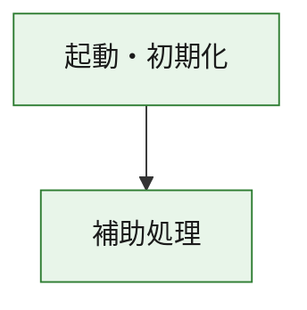
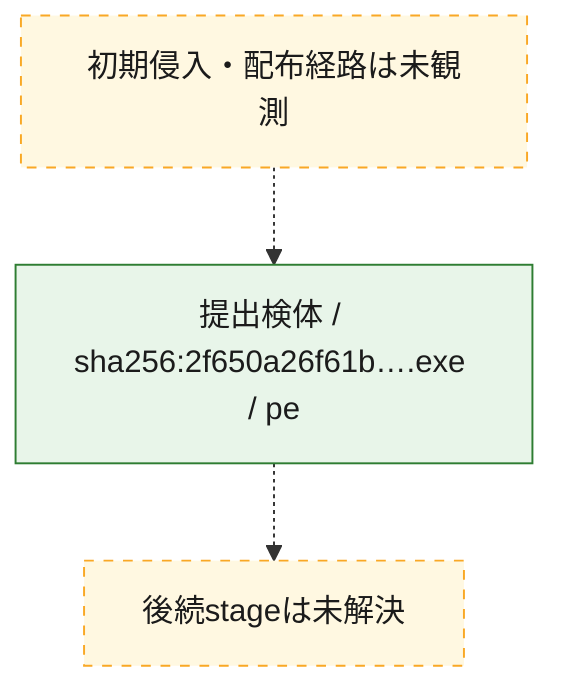
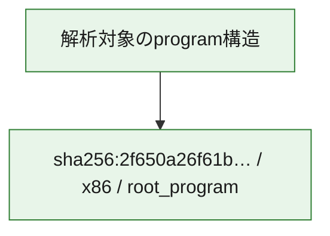

# 全体ロジック：2f650a26f61b8876b100c5b672ca8282880d579de7449d46e1afad6d8a1dc4f4

代表関数の静的証跡から、起動・初期化の処理群を確認しました。

## 読み方

- phaseの掲載順は解析上の整理順です。observed_call_edgesがない段階間の実行順を断定しません。
- 図の実線は静的に観測した関係、点線と黄色のノードは未観測・未解決の関係を示します。
- 図は静的な要約であり、動的実行を再現するものではありません。
- 詳細な関数解説とfingerprintは[STATIC-LOGIC.md](STATIC-LOGIC.md)を参照してください。

## 静的可視化

### 実行フロー

### 感染チェーン

### モジュール関係

## 処理段階

### 1. 起動・初期化

entry pointから初期化と後続処理への移行を確認します。
確度: `confirmed_static_function_evidence`

- `2f650a26f61b8876b100c5b672ca8282880d579de7449d46e1afad6d8a1dc4f4:ghidra:180001010` — 初期化と主要処理への分岐を行う入口関数です。 状態: `succeeded`、選定理由: `entry_point`, `meaningful_symbol_name`, `reviewed_call_centrality:22`, `role:entrypoint`, `small_program_complete_context`

### 2. 補助処理

主要処理を支える一般内部関数またはlibrary処理を確認します。
確度: `confirmed_static_function_evidence`

- `2f650a26f61b8876b100c5b672ca8282880d579de7449d46e1afad6d8a1dc4f4:ghidra:180001240` — 検体内部の一般処理を実装する関数です。 状態: `succeeded`、選定理由: `context_representative`, `reviewed_call_centrality:2`, `small_program_complete_context`
- `2f650a26f61b8876b100c5b672ca8282880d579de7449d46e1afad6d8a1dc4f4:ghidra:180001350` — 検体内部の一般処理を実装する関数です。 状態: `succeeded`、選定理由: `context_representative`, `reviewed_call_centrality:25`, `small_program_complete_context`
- `2f650a26f61b8876b100c5b672ca8282880d579de7449d46e1afad6d8a1dc4f4:ghidra:180003780` — 検体内部の一般処理を実装する関数です。 状態: `succeeded`、選定理由: `context_representative`, `reviewed_call_centrality:2`, `small_program_complete_context`
- `2f650a26f61b8876b100c5b672ca8282880d579de7449d46e1afad6d8a1dc4f4:ghidra:1800038e0` — 検体内部の一般処理を実装する関数です。 状態: `succeeded`、選定理由: `context_representative`, `reviewed_call_centrality:2`, `small_program_complete_context`

## 観測したcall関係

- `2f650a26f61b8876b100c5b672ca8282880d579de7449d46e1afad6d8a1dc4f4:ghidra:180001010` → `2f650a26f61b8876b100c5b672ca8282880d579de7449d46e1afad6d8a1dc4f4:ghidra:180001240` （`startup` → `support`）
- `2f650a26f61b8876b100c5b672ca8282880d579de7449d46e1afad6d8a1dc4f4:ghidra:180001010` → `2f650a26f61b8876b100c5b672ca8282880d579de7449d46e1afad6d8a1dc4f4:ghidra:180001350` （`startup` → `support`）
- `2f650a26f61b8876b100c5b672ca8282880d579de7449d46e1afad6d8a1dc4f4:ghidra:180001350` → `2f650a26f61b8876b100c5b672ca8282880d579de7449d46e1afad6d8a1dc4f4:ghidra:180001240` （`support` → `support`）
- `2f650a26f61b8876b100c5b672ca8282880d579de7449d46e1afad6d8a1dc4f4:ghidra:180001350` → `2f650a26f61b8876b100c5b672ca8282880d579de7449d46e1afad6d8a1dc4f4:ghidra:180003780` （`support` → `support`）
- `2f650a26f61b8876b100c5b672ca8282880d579de7449d46e1afad6d8a1dc4f4:ghidra:180001350` → `2f650a26f61b8876b100c5b672ca8282880d579de7449d46e1afad6d8a1dc4f4:ghidra:1800038e0` （`support` → `support`）
- `2f650a26f61b8876b100c5b672ca8282880d579de7449d46e1afad6d8a1dc4f4:ghidra:180003780` → `2f650a26f61b8876b100c5b672ca8282880d579de7449d46e1afad6d8a1dc4f4:ghidra:1800038e0` （`support` → `support`）
- `ghidra-function:6ddc3d082e7cfda19f45a765` → `ghidra-external:0b7b7d8d05028c0a3fe883d3` （`unclassified` → `unclassified`）
- `ghidra-function:6ddc3d082e7cfda19f45a765` → `ghidra-external:1a8b3d0cb4bddce9cc2225cc` （`unclassified` → `unclassified`）
- `ghidra-function:6ddc3d082e7cfda19f45a765` → `ghidra-external:39f5210f206d91a6d37967c6` （`unclassified` → `unclassified`）
- `ghidra-function:6ddc3d082e7cfda19f45a765` → `ghidra-external:428e28f697b8b90794249a58` （`unclassified` → `unclassified`）
- `ghidra-function:6ddc3d082e7cfda19f45a765` → `ghidra-external:4457dfb97c3aec73c68529f1` （`unclassified` → `unclassified`）
- `ghidra-function:6ddc3d082e7cfda19f45a765` → `ghidra-external:61fd2f3013b711fbf44aa529` （`unclassified` → `unclassified`）
- `ghidra-function:6ddc3d082e7cfda19f45a765` → `ghidra-external:647557d1851b541416ba1fbb` （`unclassified` → `unclassified`）
- `ghidra-function:6ddc3d082e7cfda19f45a765` → `ghidra-external:7a463d08263386ecad8e2a05` （`unclassified` → `unclassified`）
- `ghidra-function:6ddc3d082e7cfda19f45a765` → `ghidra-external:8228178079af10a5e6032966` （`unclassified` → `unclassified`）
- `ghidra-function:6ddc3d082e7cfda19f45a765` → `ghidra-external:87f942d0a5ad72bd669a6d8d` （`unclassified` → `unclassified`）
- `ghidra-function:6ddc3d082e7cfda19f45a765` → `ghidra-external:94b95385627a9fffdee608b1` （`unclassified` → `unclassified`）
- `ghidra-function:6ddc3d082e7cfda19f45a765` → `ghidra-external:ac7b4a6feca4c5405ef16417` （`unclassified` → `unclassified`）
- `ghidra-function:6ddc3d082e7cfda19f45a765` → `ghidra-external:b266d45b12cb0d0f218eea34` （`unclassified` → `unclassified`）
- `ghidra-function:6ddc3d082e7cfda19f45a765` → `ghidra-external:bf95b3c0e9c4b913aca82df4` （`unclassified` → `unclassified`）
- `ghidra-function:6ddc3d082e7cfda19f45a765` → `ghidra-external:c286623dec4599f5c69b4835` （`unclassified` → `unclassified`）
- `ghidra-function:6ddc3d082e7cfda19f45a765` → `ghidra-external:c5aace0913eccb0a5cf4b82f` （`unclassified` → `unclassified`）
- `ghidra-function:6ddc3d082e7cfda19f45a765` → `ghidra-external:df1b425990808e6277f677b8` （`unclassified` → `unclassified`）
- `ghidra-function:6ddc3d082e7cfda19f45a765` → `ghidra-external:e7efd8c64e8e9daecffbeb3c` （`unclassified` → `unclassified`）
- `ghidra-function:6ddc3d082e7cfda19f45a765` → `ghidra-external:ed0c045e8fa684972fea7557` （`unclassified` → `unclassified`）
- `ghidra-function:6ddc3d082e7cfda19f45a765` → `ghidra-external:f2bd3091ddd38b1a6531c755` （`unclassified` → `unclassified`）
- `ghidra-function:6ddc3d082e7cfda19f45a765` → `ghidra-external:fd2dcc58e9c523950f224fde` （`unclassified` → `unclassified`）
- `ghidra-function:6ddc3d082e7cfda19f45a765` → `ghidra-function:804b30630bd56fbba2ba53f3` （`unclassified` → `unclassified`）
- `ghidra-function:6ddc3d082e7cfda19f45a765` → `ghidra-function:acd8282005ec70e724818b5b` （`unclassified` → `unclassified`）
- `ghidra-function:6ddc3d082e7cfda19f45a765` → `ghidra-function:cf0431b629cf0701649c90cd` （`unclassified` → `unclassified`）
- `ghidra-function:9462bc29e11b39b9429f90c2` → `ghidra-function:09296c70abb3cc38c4b168e0` （`unclassified` → `unclassified`）
- `ghidra-function:9462bc29e11b39b9429f90c2` → `ghidra-function:22ef1aa136eaa85350fdba22` （`unclassified` → `unclassified`）
- `ghidra-function:9462bc29e11b39b9429f90c2` → `ghidra-function:2cb1ddac6b5cc12bee7aac05` （`unclassified` → `unclassified`）
- `ghidra-function:9462bc29e11b39b9429f90c2` → `ghidra-function:337b4bff1549629d941692b2` （`unclassified` → `unclassified`）
- `ghidra-function:9462bc29e11b39b9429f90c2` → `ghidra-function:6ddc3d082e7cfda19f45a765` （`unclassified` → `unclassified`）
- `ghidra-function:9462bc29e11b39b9429f90c2` → `ghidra-function:880f4b1b7fe513fa711f7c2e` （`unclassified` → `unclassified`）
- `ghidra-function:9462bc29e11b39b9429f90c2` → `ghidra-function:8d085d96b04c72689a858b1d` （`unclassified` → `unclassified`）
- `ghidra-function:9462bc29e11b39b9429f90c2` → `ghidra-function:9b348b28f5b3f7034424e013` （`unclassified` → `unclassified`）
- `ghidra-function:9462bc29e11b39b9429f90c2` → `ghidra-function:b80a8f7cb52d222256dbb99f` （`unclassified` → `unclassified`）
- `ghidra-function:9462bc29e11b39b9429f90c2` → `ghidra-function:cf0431b629cf0701649c90cd` （`unclassified` → `unclassified`）
- `ghidra-function:9462bc29e11b39b9429f90c2` → `ghidra-function:d4cc5b69345a623534230a35` （`unclassified` → `unclassified`）
- `ghidra-function:9462bc29e11b39b9429f90c2` → `ghidra-function:fc4e622efd959e6a45f8ae0b` （`unclassified` → `unclassified`）
- `ghidra-function:acd8282005ec70e724818b5b` → `ghidra-function:804b30630bd56fbba2ba53f3` （`unclassified` → `unclassified`）

## 解析範囲と制約

- 選定外関数は全体inventoryへ残しますが、関数本体の個別解説対象にはしていません。
- indirect call、難読化、packer、VM、壊れたcontrol flowによりcall関係が欠落する場合があります。
- 文書は静的解析に基づき、検体実行や外部通信による動的確認は行っていません。
