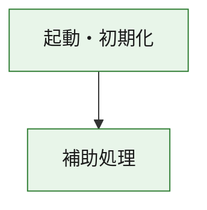
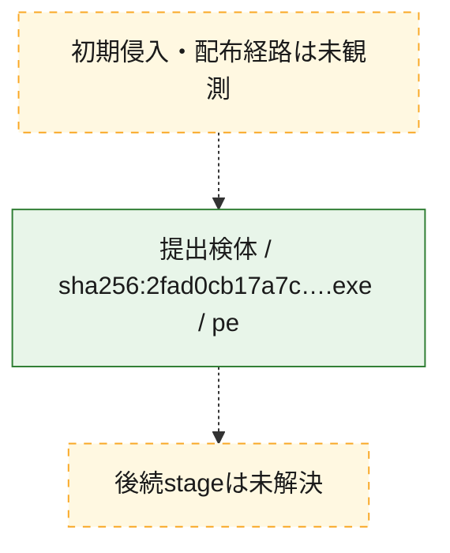
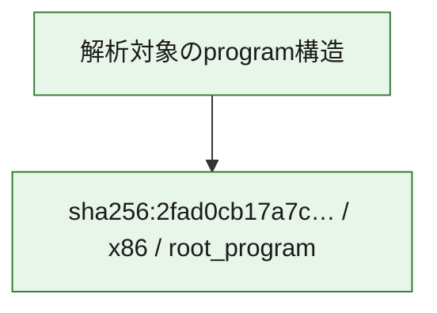

# 全体ロジック：2fad0cb17a7c03069b4c56349588db1a7db757c729cc94440085ff2bb734e836

代表関数の静的証跡から、起動・初期化の処理群を確認しました。

## 読み方

- phaseの掲載順は解析上の整理順です。observed_call_edgesがない段階間の実行順を断定しません。
- 図の実線は静的に観測した関係、点線と黄色のノードは未観測・未解決の関係を示します。
- 図は静的な要約であり、動的実行を再現するものではありません。
- 詳細な関数解説とfingerprintは[STATIC-LOGIC.md](STATIC-LOGIC.md)を参照してください。

## 静的可視化

### 実行フロー

### 感染チェーン

### モジュール関係

## 処理段階

### 1. 起動・初期化

entry pointから初期化と後続処理への移行を確認します。
確度: `confirmed_static_function_evidence`

- `2fad0cb17a7c03069b4c56349588db1a7db757c729cc94440085ff2bb734e836:ghidra:180001010` — 初期化と主要処理への分岐を行う入口関数です。 状態: `succeeded`、選定理由: `entry_point`, `meaningful_symbol_name`, `reviewed_call_centrality:22`, `role:entrypoint`, `small_program_complete_context`

### 2. 補助処理

主要処理を支える一般内部関数またはlibrary処理を確認します。
確度: `confirmed_static_function_evidence`

- `2fad0cb17a7c03069b4c56349588db1a7db757c729cc94440085ff2bb734e836:ghidra:180001240` — 検体内部の一般処理を実装する関数です。 状態: `succeeded`、選定理由: `context_representative`, `reviewed_call_centrality:2`, `small_program_complete_context`
- `2fad0cb17a7c03069b4c56349588db1a7db757c729cc94440085ff2bb734e836:ghidra:180001350` — 検体内部の一般処理を実装する関数です。 状態: `succeeded`、選定理由: `context_representative`, `reviewed_call_centrality:25`, `small_program_complete_context`
- `2fad0cb17a7c03069b4c56349588db1a7db757c729cc94440085ff2bb734e836:ghidra:180003780` — 検体内部の一般処理を実装する関数です。 状態: `succeeded`、選定理由: `context_representative`, `reviewed_call_centrality:2`, `small_program_complete_context`
- `2fad0cb17a7c03069b4c56349588db1a7db757c729cc94440085ff2bb734e836:ghidra:1800038e0` — 検体内部の一般処理を実装する関数です。 状態: `succeeded`、選定理由: `context_representative`, `reviewed_call_centrality:2`, `small_program_complete_context`

## 観測したcall関係

- `2fad0cb17a7c03069b4c56349588db1a7db757c729cc94440085ff2bb734e836:ghidra:180001010` → `2fad0cb17a7c03069b4c56349588db1a7db757c729cc94440085ff2bb734e836:ghidra:180001240` （`startup` → `support`）
- `2fad0cb17a7c03069b4c56349588db1a7db757c729cc94440085ff2bb734e836:ghidra:180001010` → `2fad0cb17a7c03069b4c56349588db1a7db757c729cc94440085ff2bb734e836:ghidra:180001350` （`startup` → `support`）
- `2fad0cb17a7c03069b4c56349588db1a7db757c729cc94440085ff2bb734e836:ghidra:180001350` → `2fad0cb17a7c03069b4c56349588db1a7db757c729cc94440085ff2bb734e836:ghidra:180001240` （`support` → `support`）
- `2fad0cb17a7c03069b4c56349588db1a7db757c729cc94440085ff2bb734e836:ghidra:180001350` → `2fad0cb17a7c03069b4c56349588db1a7db757c729cc94440085ff2bb734e836:ghidra:180003780` （`support` → `support`）
- `2fad0cb17a7c03069b4c56349588db1a7db757c729cc94440085ff2bb734e836:ghidra:180001350` → `2fad0cb17a7c03069b4c56349588db1a7db757c729cc94440085ff2bb734e836:ghidra:1800038e0` （`support` → `support`）
- `2fad0cb17a7c03069b4c56349588db1a7db757c729cc94440085ff2bb734e836:ghidra:180003780` → `2fad0cb17a7c03069b4c56349588db1a7db757c729cc94440085ff2bb734e836:ghidra:1800038e0` （`support` → `support`）
- `ghidra-function:10632e0fb4149b66b049b95d` → `ghidra-external:0646e67ce5ce5c32563b7ec0` （`unclassified` → `unclassified`）
- `ghidra-function:10632e0fb4149b66b049b95d` → `ghidra-external:1229029527efd1388a879656` （`unclassified` → `unclassified`）
- `ghidra-function:10632e0fb4149b66b049b95d` → `ghidra-external:1ddb2790730bc2dab5254554` （`unclassified` → `unclassified`）
- `ghidra-function:10632e0fb4149b66b049b95d` → `ghidra-external:1eacc445b532a082916de714` （`unclassified` → `unclassified`）
- `ghidra-function:10632e0fb4149b66b049b95d` → `ghidra-external:2efabbaa7368257b72a6578c` （`unclassified` → `unclassified`）
- `ghidra-function:10632e0fb4149b66b049b95d` → `ghidra-external:3ef8431288ae8337ae5f5f49` （`unclassified` → `unclassified`）
- `ghidra-function:10632e0fb4149b66b049b95d` → `ghidra-external:464675722e4001a721206c55` （`unclassified` → `unclassified`）
- `ghidra-function:10632e0fb4149b66b049b95d` → `ghidra-external:49318f406dc276ab6c896d9c` （`unclassified` → `unclassified`）
- `ghidra-function:10632e0fb4149b66b049b95d` → `ghidra-external:51dba9900dc5f37a20f962a6` （`unclassified` → `unclassified`）
- `ghidra-function:10632e0fb4149b66b049b95d` → `ghidra-external:6a5ca5cb15b639562d737fb5` （`unclassified` → `unclassified`）
- `ghidra-function:10632e0fb4149b66b049b95d` → `ghidra-external:6dc819ef5773ba5ea9a08742` （`unclassified` → `unclassified`）
- `ghidra-function:10632e0fb4149b66b049b95d` → `ghidra-external:88a5e4ff3aab284495ba647c` （`unclassified` → `unclassified`）
- `ghidra-function:10632e0fb4149b66b049b95d` → `ghidra-external:89dd08b29dac35b4ad7998db` （`unclassified` → `unclassified`）
- `ghidra-function:10632e0fb4149b66b049b95d` → `ghidra-external:90304c98815d8d6c32a33f07` （`unclassified` → `unclassified`）
- `ghidra-function:10632e0fb4149b66b049b95d` → `ghidra-external:9a24511294c47a13b6a448f4` （`unclassified` → `unclassified`）
- `ghidra-function:10632e0fb4149b66b049b95d` → `ghidra-external:adce6afbe35b297974a3637f` （`unclassified` → `unclassified`）
- `ghidra-function:10632e0fb4149b66b049b95d` → `ghidra-external:c5bd54b6149d344c3e0e6aac` （`unclassified` → `unclassified`）
- `ghidra-function:10632e0fb4149b66b049b95d` → `ghidra-external:d017be2c370476c7c12ca28b` （`unclassified` → `unclassified`）
- `ghidra-function:10632e0fb4149b66b049b95d` → `ghidra-external:d72012a1ba859c241343a172` （`unclassified` → `unclassified`）
- `ghidra-function:10632e0fb4149b66b049b95d` → `ghidra-external:db741eccf1481a9f810855e2` （`unclassified` → `unclassified`）
- `ghidra-function:10632e0fb4149b66b049b95d` → `ghidra-external:e5f4c3778671e15192d4c88c` （`unclassified` → `unclassified`）
- `ghidra-function:10632e0fb4149b66b049b95d` → `ghidra-function:9488cb1060a2d64f8dcd48da` （`unclassified` → `unclassified`）
- `ghidra-function:10632e0fb4149b66b049b95d` → `ghidra-function:b80d42ea59880b9d37b685a2` （`unclassified` → `unclassified`）
- `ghidra-function:10632e0fb4149b66b049b95d` → `ghidra-function:cb6f362880e3da9e6ee63a10` （`unclassified` → `unclassified`）
- `ghidra-function:b80d42ea59880b9d37b685a2` → `ghidra-function:cb6f362880e3da9e6ee63a10` （`unclassified` → `unclassified`）
- `ghidra-function:f0018475e088f4ad49881bfc` → `ghidra-function:0136133dcde5e5ab26f6fb33` （`unclassified` → `unclassified`）
- `ghidra-function:f0018475e088f4ad49881bfc` → `ghidra-function:10632e0fb4149b66b049b95d` （`unclassified` → `unclassified`）
- `ghidra-function:f0018475e088f4ad49881bfc` → `ghidra-function:14bc705c3a1f68b27f8a47eb` （`unclassified` → `unclassified`）
- `ghidra-function:f0018475e088f4ad49881bfc` → `ghidra-function:51ee08174bf4bd8b37588ae1` （`unclassified` → `unclassified`）
- `ghidra-function:f0018475e088f4ad49881bfc` → `ghidra-function:8acd2ed29accbc43b12a8878` （`unclassified` → `unclassified`）
- `ghidra-function:f0018475e088f4ad49881bfc` → `ghidra-function:9488cb1060a2d64f8dcd48da` （`unclassified` → `unclassified`）
- `ghidra-function:f0018475e088f4ad49881bfc` → `ghidra-function:9d3edf88b8a1677f86ab77cc` （`unclassified` → `unclassified`）
- `ghidra-function:f0018475e088f4ad49881bfc` → `ghidra-function:9eb071b00fb0ba65f15e3048` （`unclassified` → `unclassified`）
- `ghidra-function:f0018475e088f4ad49881bfc` → `ghidra-function:b3f0dcd7b65550586c8b1cb1` （`unclassified` → `unclassified`）
- `ghidra-function:f0018475e088f4ad49881bfc` → `ghidra-function:c8ee829e8916a3893b919345` （`unclassified` → `unclassified`）
- `ghidra-function:f0018475e088f4ad49881bfc` → `ghidra-function:e90267212edd3d82c4d52d40` （`unclassified` → `unclassified`）
- `ghidra-function:f0018475e088f4ad49881bfc` → `ghidra-function:fbf24c73aa225bb9b8582bed` （`unclassified` → `unclassified`）

## 解析範囲と制約

- 選定外関数は全体inventoryへ残しますが、関数本体の個別解説対象にはしていません。
- indirect call、難読化、packer、VM、壊れたcontrol flowによりcall関係が欠落する場合があります。
- 文書は静的解析に基づき、検体実行や外部通信による動的確認は行っていません。
