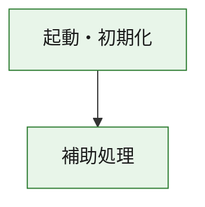
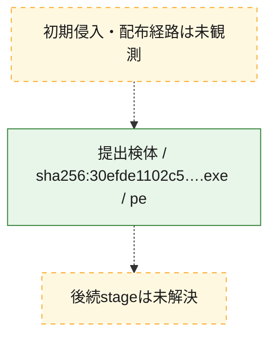
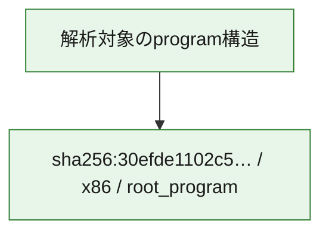

# 全体ロジック：30efde1102c5199625e7c652dbebecf7e20d15fbb47c5863437871a94871e794

代表関数の静的証跡から、起動・初期化の処理群を確認しました。

## 読み方

- phaseの掲載順は解析上の整理順です。observed_call_edgesがない段階間の実行順を断定しません。
- 図の実線は静的に観測した関係、点線と黄色のノードは未観測・未解決の関係を示します。
- 図は静的な要約であり、動的実行を再現するものではありません。
- 詳細な関数解説とfingerprintは[STATIC-LOGIC.md](STATIC-LOGIC.md)を参照してください。

## 静的可視化

### 実行フロー

### 感染チェーン

### モジュール関係

## 処理段階

### 1. 起動・初期化

entry pointから初期化と後続処理への移行を確認します。
確度: `confirmed_static_function_evidence`

- `30efde1102c5199625e7c652dbebecf7e20d15fbb47c5863437871a94871e794:ghidra:180001010` — 初期化と主要処理への分岐を行う入口関数です。 状態: `succeeded`、選定理由: `entry_point`, `meaningful_symbol_name`, `reviewed_call_centrality:22`, `role:entrypoint`, `small_program_complete_context`

### 2. 補助処理

主要処理を支える一般内部関数またはlibrary処理を確認します。
確度: `confirmed_static_function_evidence`

- `30efde1102c5199625e7c652dbebecf7e20d15fbb47c5863437871a94871e794:ghidra:180001240` — 検体内部の一般処理を実装する関数です。 状態: `succeeded`、選定理由: `context_representative`, `reviewed_call_centrality:2`, `small_program_complete_context`
- `30efde1102c5199625e7c652dbebecf7e20d15fbb47c5863437871a94871e794:ghidra:180001350` — 検体内部の一般処理を実装する関数です。 状態: `succeeded`、選定理由: `context_representative`, `reviewed_call_centrality:25`, `small_program_complete_context`
- `30efde1102c5199625e7c652dbebecf7e20d15fbb47c5863437871a94871e794:ghidra:180003780` — 検体内部の一般処理を実装する関数です。 状態: `succeeded`、選定理由: `context_representative`, `reviewed_call_centrality:2`, `small_program_complete_context`
- `30efde1102c5199625e7c652dbebecf7e20d15fbb47c5863437871a94871e794:ghidra:1800038e0` — 検体内部の一般処理を実装する関数です。 状態: `succeeded`、選定理由: `context_representative`, `reviewed_call_centrality:2`, `small_program_complete_context`

## 観測したcall関係

- `30efde1102c5199625e7c652dbebecf7e20d15fbb47c5863437871a94871e794:ghidra:180001010` → `30efde1102c5199625e7c652dbebecf7e20d15fbb47c5863437871a94871e794:ghidra:180001240` （`startup` → `support`）
- `30efde1102c5199625e7c652dbebecf7e20d15fbb47c5863437871a94871e794:ghidra:180001010` → `30efde1102c5199625e7c652dbebecf7e20d15fbb47c5863437871a94871e794:ghidra:180001350` （`startup` → `support`）
- `30efde1102c5199625e7c652dbebecf7e20d15fbb47c5863437871a94871e794:ghidra:180001350` → `30efde1102c5199625e7c652dbebecf7e20d15fbb47c5863437871a94871e794:ghidra:180001240` （`support` → `support`）
- `30efde1102c5199625e7c652dbebecf7e20d15fbb47c5863437871a94871e794:ghidra:180001350` → `30efde1102c5199625e7c652dbebecf7e20d15fbb47c5863437871a94871e794:ghidra:180003780` （`support` → `support`）
- `30efde1102c5199625e7c652dbebecf7e20d15fbb47c5863437871a94871e794:ghidra:180001350` → `30efde1102c5199625e7c652dbebecf7e20d15fbb47c5863437871a94871e794:ghidra:1800038e0` （`support` → `support`）
- `30efde1102c5199625e7c652dbebecf7e20d15fbb47c5863437871a94871e794:ghidra:180003780` → `30efde1102c5199625e7c652dbebecf7e20d15fbb47c5863437871a94871e794:ghidra:1800038e0` （`support` → `support`）
- `ghidra-function:4b2e1efd47ef48dc1df558cc` → `ghidra-function:0b2c9cd1dd9325c8963d698f` （`unclassified` → `unclassified`）
- `ghidra-function:4b2e1efd47ef48dc1df558cc` → `ghidra-function:23a8fed9ccccc1303d38ad3b` （`unclassified` → `unclassified`）
- `ghidra-function:4b2e1efd47ef48dc1df558cc` → `ghidra-function:4f511c55c29225434aa13a89` （`unclassified` → `unclassified`）
- `ghidra-function:4b2e1efd47ef48dc1df558cc` → `ghidra-function:515d481e187bab9850c711fa` （`unclassified` → `unclassified`）
- `ghidra-function:4b2e1efd47ef48dc1df558cc` → `ghidra-function:72381a3738bc8a83be861572` （`unclassified` → `unclassified`）
- `ghidra-function:4b2e1efd47ef48dc1df558cc` → `ghidra-function:7673c68b73b4877512498d4d` （`unclassified` → `unclassified`）
- `ghidra-function:4b2e1efd47ef48dc1df558cc` → `ghidra-function:85bebb53044fe492c0dcff96` （`unclassified` → `unclassified`）
- `ghidra-function:4b2e1efd47ef48dc1df558cc` → `ghidra-function:9100026041e9b5ce96d2d906` （`unclassified` → `unclassified`）
- `ghidra-function:4b2e1efd47ef48dc1df558cc` → `ghidra-function:9dc6b79c3662c927a00a6e61` （`unclassified` → `unclassified`）
- `ghidra-function:4b2e1efd47ef48dc1df558cc` → `ghidra-function:ac84fd5f06f950b9b17ab9e0` （`unclassified` → `unclassified`）
- `ghidra-function:4b2e1efd47ef48dc1df558cc` → `ghidra-function:afb1658ce703fb0228c6343a` （`unclassified` → `unclassified`）
- `ghidra-function:4b2e1efd47ef48dc1df558cc` → `ghidra-function:e581842e5428e47fdde770ef` （`unclassified` → `unclassified`）
- `ghidra-function:a1f907f45305203374e3048e` → `ghidra-function:8bbe72a706c003eebd3f3fb0` （`unclassified` → `unclassified`）
- `ghidra-function:ac84fd5f06f950b9b17ab9e0` → `ghidra-external:03a213baffefcb336f37b5bc` （`unclassified` → `unclassified`）
- `ghidra-function:ac84fd5f06f950b9b17ab9e0` → `ghidra-external:08540c36482f0e552c7f25b3` （`unclassified` → `unclassified`）
- `ghidra-function:ac84fd5f06f950b9b17ab9e0` → `ghidra-external:0aa03359b9674b05c266e3ed` （`unclassified` → `unclassified`）
- `ghidra-function:ac84fd5f06f950b9b17ab9e0` → `ghidra-external:0bb9b481940b903e62fd9fa6` （`unclassified` → `unclassified`）
- `ghidra-function:ac84fd5f06f950b9b17ab9e0` → `ghidra-external:10274a10d636e42037ec8280` （`unclassified` → `unclassified`）
- `ghidra-function:ac84fd5f06f950b9b17ab9e0` → `ghidra-external:17ef69fcbe8af2f3c8b1d723` （`unclassified` → `unclassified`）
- `ghidra-function:ac84fd5f06f950b9b17ab9e0` → `ghidra-external:28c203a346c0f61d874f71ba` （`unclassified` → `unclassified`）
- `ghidra-function:ac84fd5f06f950b9b17ab9e0` → `ghidra-external:34dc353645f9823346c3288d` （`unclassified` → `unclassified`）
- `ghidra-function:ac84fd5f06f950b9b17ab9e0` → `ghidra-external:41d88995cd7bfe38ef3bca27` （`unclassified` → `unclassified`）
- `ghidra-function:ac84fd5f06f950b9b17ab9e0` → `ghidra-external:4510a1ed18eb9de2079d81b8` （`unclassified` → `unclassified`）
- `ghidra-function:ac84fd5f06f950b9b17ab9e0` → `ghidra-external:57a81cb2f46f8382d9937db7` （`unclassified` → `unclassified`）
- `ghidra-function:ac84fd5f06f950b9b17ab9e0` → `ghidra-external:6118f1b26f3ed74dfb20e7f1` （`unclassified` → `unclassified`）
- `ghidra-function:ac84fd5f06f950b9b17ab9e0` → `ghidra-external:9088cd3eb7af3c25ca921bfc` （`unclassified` → `unclassified`）
- `ghidra-function:ac84fd5f06f950b9b17ab9e0` → `ghidra-external:916ce97aa044a6b50d00e126` （`unclassified` → `unclassified`）
- `ghidra-function:ac84fd5f06f950b9b17ab9e0` → `ghidra-external:94c9f6543added95e6f7a0f7` （`unclassified` → `unclassified`）
- `ghidra-function:ac84fd5f06f950b9b17ab9e0` → `ghidra-external:9e10b873e14f350d6b444edb` （`unclassified` → `unclassified`）
- `ghidra-function:ac84fd5f06f950b9b17ab9e0` → `ghidra-external:b0aa4760d4395e251728ec7d` （`unclassified` → `unclassified`）
- `ghidra-function:ac84fd5f06f950b9b17ab9e0` → `ghidra-external:c47621b17b657954551d3ee8` （`unclassified` → `unclassified`）
- `ghidra-function:ac84fd5f06f950b9b17ab9e0` → `ghidra-external:dcbbf54a0da499fc0ab9b101` （`unclassified` → `unclassified`）
- `ghidra-function:ac84fd5f06f950b9b17ab9e0` → `ghidra-external:e167826eb8353c0632e04dac` （`unclassified` → `unclassified`）
- `ghidra-function:ac84fd5f06f950b9b17ab9e0` → `ghidra-external:e38f4bea80966bf1dfa5c8ef` （`unclassified` → `unclassified`）
- `ghidra-function:ac84fd5f06f950b9b17ab9e0` → `ghidra-function:515d481e187bab9850c711fa` （`unclassified` → `unclassified`）
- `ghidra-function:ac84fd5f06f950b9b17ab9e0` → `ghidra-function:8bbe72a706c003eebd3f3fb0` （`unclassified` → `unclassified`）
- `ghidra-function:ac84fd5f06f950b9b17ab9e0` → `ghidra-function:a1f907f45305203374e3048e` （`unclassified` → `unclassified`）

## 解析範囲と制約

- 選定外関数は全体inventoryへ残しますが、関数本体の個別解説対象にはしていません。
- indirect call、難読化、packer、VM、壊れたcontrol flowによりcall関係が欠落する場合があります。
- 文書は静的解析に基づき、検体実行や外部通信による動的確認は行っていません。
