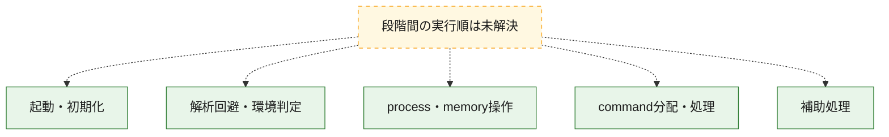
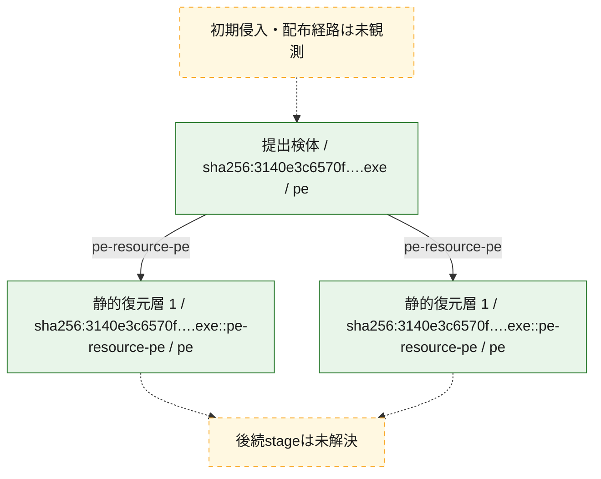
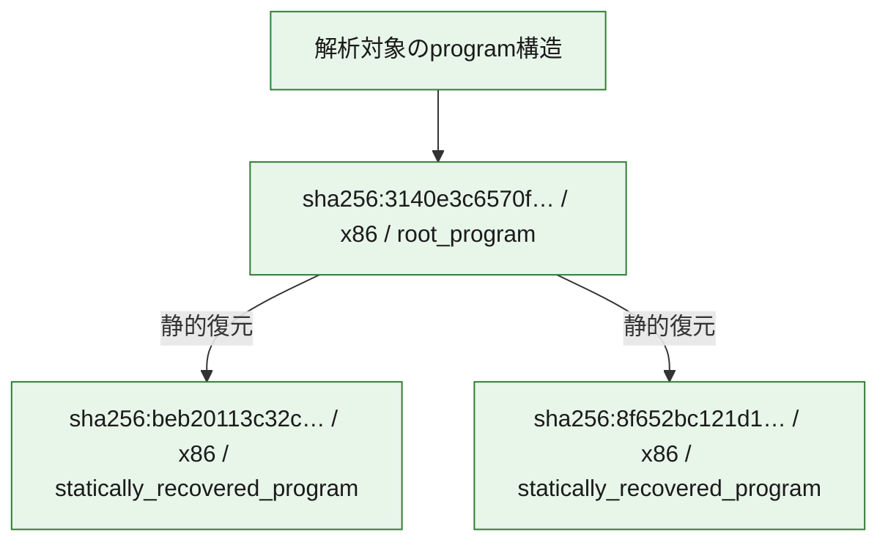

# 全体ロジック：3140e3c6570fb31aae5f424b2c6f81b7b91e654110bac5c562afdaced7e20848

代表関数の静的証跡から、起動・初期化、解析回避・環境判定、process・memory操作、command分配・処理の処理群を確認しました。

## 読み方

- phaseの掲載順は解析上の整理順です。observed_call_edgesがない段階間の実行順を断定しません。
- 図の実線は静的に観測した関係、点線と黄色のノードは未観測・未解決の関係を示します。
- 図は静的な要約であり、動的実行を再現するものではありません。
- 詳細な関数解説とfingerprintは[STATIC-LOGIC.md](STATIC-LOGIC.md)を参照してください。

## 静的可視化

### 実行フロー

### 感染チェーン

### モジュール関係

## 処理段階

### 1. 起動・初期化

entry pointから初期化と後続処理への移行を確認します。
確度: `confirmed_static_function_evidence`

- `beb20113c32caa6dabad1068410299ba3a452aca3d8f1801027200dd8ecaae39:ghidra:1800064d8` — 初期化と主要処理への分岐を行う入口関数です。 状態: `succeeded`、選定理由: `entry_point`, `meaningful_symbol_name`, `reviewed_call_centrality:5`, `role:entrypoint`
- `8f652bc121d1abc869b47f62ca35a66480e1a3162eaa92711b8e13cfd86158a1:ghidra:180008718` — 初期化と主要処理への分岐を行う入口関数です。 状態: `succeeded`、選定理由: `entry_point`, `meaningful_symbol_name`, `reviewed_call_centrality:5`, `role:entrypoint`

### 2. 解析回避・環境判定

debugger、sandbox、仮想環境、時間差などの判定を確認します。
確度: `confirmed_static_function_evidence`

- `8f652bc121d1abc869b47f62ca35a66480e1a3162eaa92711b8e13cfd86158a1:ghidra:1800027c0` — debugger、仮想環境、sandbox、または時間差の確認に関係する関数です。 状態: `succeeded`、選定理由: `context_representative`, `reviewed_call_centrality:18`, `role:anti_analysis`

### 3. process・memory操作

process、thread、module、memory操作と実行移行を確認します。
確度: `confirmed_static_function_evidence`

- `beb20113c32caa6dabad1068410299ba3a452aca3d8f1801027200dd8ecaae39:ghidra:180001020` — process、thread、module、またはmemory操作に関係する関数です。 状態: `succeeded`、選定理由: `context_representative`, `reviewed_call_centrality:27`, `role:process_or_memory_operation`
- `beb20113c32caa6dabad1068410299ba3a452aca3d8f1801027200dd8ecaae39:ghidra:1800011f0` — process、thread、module、またはmemory操作に関係する関数です。 状態: `succeeded`、選定理由: `context_representative`, `reviewed_call_centrality:16`, `role:process_or_memory_operation`
- `beb20113c32caa6dabad1068410299ba3a452aca3d8f1801027200dd8ecaae39:ghidra:180006538` — process、thread、module、またはmemory操作に関係する関数です。 状態: `succeeded`、選定理由: `context_representative`, `reviewed_call_centrality:6`, `role:process_or_memory_operation`
- `beb20113c32caa6dabad1068410299ba3a452aca3d8f1801027200dd8ecaae39:ghidra:1800065b0` — process、thread、module、またはmemory操作に関係する関数です。 状態: `succeeded`、選定理由: `context_representative`, `reviewed_call_centrality:7`, `role:process_or_memory_operation`
- `beb20113c32caa6dabad1068410299ba3a452aca3d8f1801027200dd8ecaae39:ghidra:1800065d0` — process、thread、module、またはmemory操作に関係する関数です。 状態: `succeeded`、選定理由: `context_representative`, `reviewed_call_centrality:10`, `role:process_or_memory_operation`
- `8f652bc121d1abc869b47f62ca35a66480e1a3162eaa92711b8e13cfd86158a1:ghidra:180001020` — process、thread、module、またはmemory操作に関係する関数です。 状態: `succeeded`、選定理由: `context_representative`, `reviewed_call_centrality:26`, `role:process_or_memory_operation`
- `8f652bc121d1abc869b47f62ca35a66480e1a3162eaa92711b8e13cfd86158a1:ghidra:1800013e0` — process、thread、module、またはmemory操作に関係する関数です。 状態: `succeeded`、選定理由: `context_representative`, `reviewed_call_centrality:9`, `role:process_or_memory_operation`
- `8f652bc121d1abc869b47f62ca35a66480e1a3162eaa92711b8e13cfd86158a1:ghidra:180001740` — process、thread、module、またはmemory操作に関係する関数です。 状態: `succeeded`、選定理由: `context_representative`, `reviewed_call_centrality:9`, `role:process_or_memory_operation`
- `8f652bc121d1abc869b47f62ca35a66480e1a3162eaa92711b8e13cfd86158a1:ghidra:180001c60` — process、thread、module、またはmemory操作に関係する関数です。 状態: `succeeded`、選定理由: `context_representative`, `reviewed_call_centrality:9`, `role:process_or_memory_operation`
- `8f652bc121d1abc869b47f62ca35a66480e1a3162eaa92711b8e13cfd86158a1:ghidra:180001f50` — process、thread、module、またはmemory操作に関係する関数です。 状態: `succeeded`、選定理由: `context_representative`, `reviewed_call_centrality:6`, `role:process_or_memory_operation`
- `8f652bc121d1abc869b47f62ca35a66480e1a3162eaa92711b8e13cfd86158a1:ghidra:180002360` — process、thread、module、またはmemory操作に関係する関数です。 状態: `succeeded`、選定理由: `context_representative`, `reviewed_call_centrality:12`, `role:process_or_memory_operation`
- `3140e3c6570fb31aae5f424b2c6f81b7b91e654110bac5c562afdaced7e20848:ghidra:140001e00` — process、thread、module、またはmemory操作に関係する関数です。 状態: `succeeded`、選定理由: `context_representative`, `reviewed_call_centrality:7`, `role:process_or_memory_operation`

### 4. command分配・処理

受信commandやtaskの解釈、分配、個別handlerへの移行を確認します。
確度: `confirmed_static_function_evidence_with_limits`

- `beb20113c32caa6dabad1068410299ba3a452aca3d8f1801027200dd8ecaae39:ghidra:1800061c4` — commandの解釈、分配、または個別処理を担当する関数です。 状態: `succeeded`、選定理由: `context_representative`, `reviewed_call_centrality:25`, `role:command_dispatch_or_handler`
- `beb20113c32caa6dabad1068410299ba3a452aca3d8f1801027200dd8ecaae39:ghidra:180006214` — commandの解釈、分配、または個別処理を担当する関数です。 状態: `succeeded`、選定理由: `context_representative`, `reviewed_call_centrality:15`, `role:command_dispatch_or_handler`
- `beb20113c32caa6dabad1068410299ba3a452aca3d8f1801027200dd8ecaae39:ghidra:180011ed0` — commandの解釈、分配、または個別処理を担当する関数です。 状態: `limited_bad_instruction_or_flow`、選定理由: `meaningful_symbol_name`, `reviewed_call_centrality:2`, `role:command_dispatch_or_handler`
- `8f652bc121d1abc869b47f62ca35a66480e1a3162eaa92711b8e13cfd86158a1:ghidra:180008404` — commandの解釈、分配、または個別処理を担当する関数です。 状態: `succeeded`、選定理由: `context_representative`, `reviewed_call_centrality:24`, `role:command_dispatch_or_handler`
- `8f652bc121d1abc869b47f62ca35a66480e1a3162eaa92711b8e13cfd86158a1:ghidra:180014110` — commandの解釈、分配、または個別処理を担当する関数です。 状態: `limited_bad_instruction_or_flow`、選定理由: `meaningful_symbol_name`, `reviewed_call_centrality:1`, `role:command_dispatch_or_handler`

### 5. 補助処理

主要処理を支える一般内部関数またはlibrary処理を確認します。
確度: `confirmed_static_function_evidence_with_limits`

- `beb20113c32caa6dabad1068410299ba3a452aca3d8f1801027200dd8ecaae39:ghidra:180001900` — 検体内部の一般処理を実装する関数です。 状態: `limited_bad_instruction_or_flow`、選定理由: `context_representative`, `reviewed_call_centrality:1`
- `beb20113c32caa6dabad1068410299ba3a452aca3d8f1801027200dd8ecaae39:ghidra:180001bf0` — 検体内部の一般処理を実装する関数です。 状態: `succeeded`、選定理由: `context_representative`, `reviewed_call_centrality:2`
- `beb20113c32caa6dabad1068410299ba3a452aca3d8f1801027200dd8ecaae39:ghidra:180001f40` — 検体内部の一般処理を実装する関数です。 状態: `succeeded`、選定理由: `context_representative`
- `beb20113c32caa6dabad1068410299ba3a452aca3d8f1801027200dd8ecaae39:ghidra:1800021c0` — 検体内部の一般処理を実装する関数です。 状態: `limited_bad_instruction_or_flow`、選定理由: `context_representative`, `reviewed_call_centrality:14`
- `beb20113c32caa6dabad1068410299ba3a452aca3d8f1801027200dd8ecaae39:ghidra:180002cd0` — 検体内部の一般処理を実装する関数です。 状態: `succeeded`、選定理由: `context_representative`, `reviewed_call_centrality:4`
- `beb20113c32caa6dabad1068410299ba3a452aca3d8f1801027200dd8ecaae39:ghidra:180002e40` — 検体内部の一般処理を実装する関数です。 状態: `succeeded`、選定理由: `context_representative`, `reviewed_call_centrality:3`
- `beb20113c32caa6dabad1068410299ba3a452aca3d8f1801027200dd8ecaae39:ghidra:1800030b0` — 検体内部の一般処理を実装する関数です。 状態: `succeeded`、選定理由: `context_representative`, `reviewed_call_centrality:2`
- `beb20113c32caa6dabad1068410299ba3a452aca3d8f1801027200dd8ecaae39:ghidra:180003140` — 検体内部の一般処理を実装する関数です。 状態: `succeeded`、選定理由: `context_representative`, `reviewed_call_centrality:12`
- `beb20113c32caa6dabad1068410299ba3a452aca3d8f1801027200dd8ecaae39:ghidra:180003910` — 検体内部の一般処理を実装する関数です。 状態: `succeeded`、選定理由: `context_representative`, `reviewed_call_centrality:3`
- `beb20113c32caa6dabad1068410299ba3a452aca3d8f1801027200dd8ecaae39:ghidra:180003ba0` — 検体内部の一般処理を実装する関数です。 状態: `succeeded`、選定理由: `context_representative`
- `beb20113c32caa6dabad1068410299ba3a452aca3d8f1801027200dd8ecaae39:ghidra:180003d20` — 検体内部の一般処理を実装する関数です。 状態: `succeeded`、選定理由: `context_representative`, `reviewed_call_centrality:6`
- `beb20113c32caa6dabad1068410299ba3a452aca3d8f1801027200dd8ecaae39:ghidra:180003ea0` — 検体内部の一般処理を実装する関数です。 状態: `succeeded`、選定理由: `context_representative`, `reviewed_call_centrality:5`
- `beb20113c32caa6dabad1068410299ba3a452aca3d8f1801027200dd8ecaae39:ghidra:180004000` — 検体内部の一般処理を実装する関数です。 状態: `limited_bad_instruction_or_flow`、選定理由: `context_representative`, `reviewed_call_centrality:1`
- `beb20113c32caa6dabad1068410299ba3a452aca3d8f1801027200dd8ecaae39:ghidra:1800048e0` — 検体内部の一般処理を実装する関数です。 状態: `succeeded`、選定理由: `context_representative`, `reviewed_call_centrality:1`
- `beb20113c32caa6dabad1068410299ba3a452aca3d8f1801027200dd8ecaae39:ghidra:180004da0` — 検体内部の一般処理を実装する関数です。 状態: `succeeded`、選定理由: `context_representative`, `reviewed_call_centrality:1`
- `beb20113c32caa6dabad1068410299ba3a452aca3d8f1801027200dd8ecaae39:ghidra:180004f60` — 検体内部の一般処理を実装する関数です。 状態: `limited_bad_instruction_or_flow`、選定理由: `context_representative`, `reviewed_call_centrality:3`
- `beb20113c32caa6dabad1068410299ba3a452aca3d8f1801027200dd8ecaae39:ghidra:180005650` — 検体内部の一般処理を実装する関数です。 状態: `limited_bad_instruction_or_flow`、選定理由: `context_representative`, `reviewed_call_centrality:1`
- `beb20113c32caa6dabad1068410299ba3a452aca3d8f1801027200dd8ecaae39:ghidra:180005bd0` — 検体内部の一般処理を実装する関数です。 状態: `limited_bad_instruction_or_flow`、選定理由: `context_representative`, `reviewed_call_centrality:4`
- `beb20113c32caa6dabad1068410299ba3a452aca3d8f1801027200dd8ecaae39:ghidra:18000632c` — 検体内部の一般処理を実装する関数です。 状態: `succeeded`、選定理由: `context_representative`, `reviewed_call_centrality:11`
- `beb20113c32caa6dabad1068410299ba3a452aca3d8f1801027200dd8ecaae39:ghidra:1800063b0` — 検体内部の一般処理を実装する関数です。 状態: `succeeded`、選定理由: `context_representative`, `reviewed_call_centrality:4`
- `beb20113c32caa6dabad1068410299ba3a452aca3d8f1801027200dd8ecaae39:ghidra:180006518` — 検体内部の一般処理を実装する関数です。 状態: `succeeded`、選定理由: `context_representative`, `reviewed_call_centrality:1`
- `beb20113c32caa6dabad1068410299ba3a452aca3d8f1801027200dd8ecaae39:ghidra:1800066ac` — 検体内部の一般処理を実装する関数です。 状態: `succeeded`、選定理由: `context_representative`, `reviewed_call_centrality:4`
- `beb20113c32caa6dabad1068410299ba3a452aca3d8f1801027200dd8ecaae39:ghidra:180006bbc` — 検体内部の一般処理を実装する関数です。 状態: `succeeded`、選定理由: `meaningful_symbol_name`
- `8f652bc121d1abc869b47f62ca35a66480e1a3162eaa92711b8e13cfd86158a1:ghidra:1800011f0` — 検体内部の一般処理を実装する関数です。 状態: `succeeded`、選定理由: `context_representative`, `reviewed_call_centrality:2`
- `8f652bc121d1abc869b47f62ca35a66480e1a3162eaa92711b8e13cfd86158a1:ghidra:1800012e0` — 検体内部の一般処理を実装する関数です。 状態: `succeeded`、選定理由: `context_representative`, `reviewed_call_centrality:7`
- `8f652bc121d1abc869b47f62ca35a66480e1a3162eaa92711b8e13cfd86158a1:ghidra:180002070` — 検体内部の一般処理を実装する関数です。 状態: `succeeded`、選定理由: `context_representative`, `reviewed_call_centrality:2`
- `8f652bc121d1abc869b47f62ca35a66480e1a3162eaa92711b8e13cfd86158a1:ghidra:180003b40` — 検体内部の一般処理を実装する関数です。 状態: `limited_bad_instruction_or_flow`、選定理由: `context_representative`, `reviewed_call_centrality:1`
- `8f652bc121d1abc869b47f62ca35a66480e1a3162eaa92711b8e13cfd86158a1:ghidra:180003e30` — 検体内部の一般処理を実装する関数です。 状態: `succeeded`、選定理由: `context_representative`, `reviewed_call_centrality:2`
- `8f652bc121d1abc869b47f62ca35a66480e1a3162eaa92711b8e13cfd86158a1:ghidra:180004180` — 検体内部の一般処理を実装する関数です。 状態: `succeeded`、選定理由: `context_representative`
- `8f652bc121d1abc869b47f62ca35a66480e1a3162eaa92711b8e13cfd86158a1:ghidra:180004400` — 検体内部の一般処理を実装する関数です。 状態: `limited_bad_instruction_or_flow`、選定理由: `context_representative`, `reviewed_call_centrality:14`
- `8f652bc121d1abc869b47f62ca35a66480e1a3162eaa92711b8e13cfd86158a1:ghidra:180004f10` — 検体内部の一般処理を実装する関数です。 状態: `succeeded`、選定理由: `context_representative`, `reviewed_call_centrality:4`
- `8f652bc121d1abc869b47f62ca35a66480e1a3162eaa92711b8e13cfd86158a1:ghidra:180005080` — 検体内部の一般処理を実装する関数です。 状態: `succeeded`、選定理由: `context_representative`, `reviewed_call_centrality:3`
- `8f652bc121d1abc869b47f62ca35a66480e1a3162eaa92711b8e13cfd86158a1:ghidra:1800052f0` — 検体内部の一般処理を実装する関数です。 状態: `succeeded`、選定理由: `context_representative`, `reviewed_call_centrality:2`
- `8f652bc121d1abc869b47f62ca35a66480e1a3162eaa92711b8e13cfd86158a1:ghidra:180005380` — 検体内部の一般処理を実装する関数です。 状態: `succeeded`、選定理由: `context_representative`, `reviewed_call_centrality:12`
- `8f652bc121d1abc869b47f62ca35a66480e1a3162eaa92711b8e13cfd86158a1:ghidra:180005b50` — 検体内部の一般処理を実装する関数です。 状態: `succeeded`、選定理由: `context_representative`, `reviewed_call_centrality:3`
- `8f652bc121d1abc869b47f62ca35a66480e1a3162eaa92711b8e13cfd86158a1:ghidra:180005de0` — 検体内部の一般処理を実装する関数です。 状態: `succeeded`、選定理由: `context_representative`
- `8f652bc121d1abc869b47f62ca35a66480e1a3162eaa92711b8e13cfd86158a1:ghidra:180005f60` — 検体内部の一般処理を実装する関数です。 状態: `succeeded`、選定理由: `context_representative`, `reviewed_call_centrality:13`
- `8f652bc121d1abc869b47f62ca35a66480e1a3162eaa92711b8e13cfd86158a1:ghidra:1800060e0` — 検体内部の一般処理を実装する関数です。 状態: `succeeded`、選定理由: `context_representative`, `reviewed_call_centrality:6`
- `8f652bc121d1abc869b47f62ca35a66480e1a3162eaa92711b8e13cfd86158a1:ghidra:180006240` — 検体内部の一般処理を実装する関数です。 状態: `limited_bad_instruction_or_flow`、選定理由: `context_representative`, `reviewed_call_centrality:1`
- `8f652bc121d1abc869b47f62ca35a66480e1a3162eaa92711b8e13cfd86158a1:ghidra:180006b20` — 検体内部の一般処理を実装する関数です。 状態: `succeeded`、選定理由: `context_representative`, `reviewed_call_centrality:1`
- `8f652bc121d1abc869b47f62ca35a66480e1a3162eaa92711b8e13cfd86158a1:ghidra:180006fe0` — 検体内部の一般処理を実装する関数です。 状態: `succeeded`、選定理由: `context_representative`, `reviewed_call_centrality:1`
- `8f652bc121d1abc869b47f62ca35a66480e1a3162eaa92711b8e13cfd86158a1:ghidra:1800071a0` — 検体内部の一般処理を実装する関数です。 状態: `limited_bad_instruction_or_flow`、選定理由: `context_representative`, `reviewed_call_centrality:3`
- `8f652bc121d1abc869b47f62ca35a66480e1a3162eaa92711b8e13cfd86158a1:ghidra:180007890` — 検体内部の一般処理を実装する関数です。 状態: `limited_bad_instruction_or_flow`、選定理由: `context_representative`, `reviewed_call_centrality:1`
- `8f652bc121d1abc869b47f62ca35a66480e1a3162eaa92711b8e13cfd86158a1:ghidra:180007e10` — 検体内部の一般処理を実装する関数です。 状態: `limited_bad_instruction_or_flow`、選定理由: `context_representative`, `reviewed_call_centrality:4`
- `8f652bc121d1abc869b47f62ca35a66480e1a3162eaa92711b8e13cfd86158a1:ghidra:180008dfc` — 検体内部の一般処理を実装する関数です。 状態: `succeeded`、選定理由: `meaningful_symbol_name`
- `3140e3c6570fb31aae5f424b2c6f81b7b91e654110bac5c562afdaced7e20848:ghidra:140001000` — 検体内部の一般処理を実装する関数です。 状態: `succeeded`、選定理由: `context_representative`, `reviewed_call_centrality:1`
- `3140e3c6570fb31aae5f424b2c6f81b7b91e654110bac5c562afdaced7e20848:ghidra:1400010e0` — 検体内部の一般処理を実装する関数です。 状態: `succeeded`、選定理由: `context_representative`, `reviewed_call_centrality:2`
- `3140e3c6570fb31aae5f424b2c6f81b7b91e654110bac5c562afdaced7e20848:ghidra:140001120` — 検体内部の一般処理を実装する関数です。 状態: `succeeded`、選定理由: `context_representative`, `reviewed_call_centrality:2`
- `3140e3c6570fb31aae5f424b2c6f81b7b91e654110bac5c562afdaced7e20848:ghidra:1400011c0` — 検体内部の一般処理を実装する関数です。 状態: `succeeded`、選定理由: `context_representative`, `reviewed_call_centrality:1`
- `3140e3c6570fb31aae5f424b2c6f81b7b91e654110bac5c562afdaced7e20848:ghidra:140001240` — 検体内部の一般処理を実装する関数です。 状態: `succeeded`、選定理由: `context_representative`, `reviewed_call_centrality:3`
- `3140e3c6570fb31aae5f424b2c6f81b7b91e654110bac5c562afdaced7e20848:ghidra:1400013a0` — 検体内部の一般処理を実装する関数です。 状態: `succeeded`、選定理由: `context_representative`, `reviewed_call_centrality:1`
- `3140e3c6570fb31aae5f424b2c6f81b7b91e654110bac5c562afdaced7e20848:ghidra:140001440` — 検体内部の一般処理を実装する関数です。 状態: `succeeded`、選定理由: `context_representative`, `reviewed_call_centrality:3`
- `3140e3c6570fb31aae5f424b2c6f81b7b91e654110bac5c562afdaced7e20848:ghidra:140001550` — 検体内部の一般処理を実装する関数です。 状態: `succeeded`、選定理由: `context_representative`, `reviewed_call_centrality:1`
- `3140e3c6570fb31aae5f424b2c6f81b7b91e654110bac5c562afdaced7e20848:ghidra:140001560` — 検体内部の一般処理を実装する関数です。 状態: `succeeded`、選定理由: `context_representative`, `reviewed_call_centrality:3`
- `3140e3c6570fb31aae5f424b2c6f81b7b91e654110bac5c562afdaced7e20848:ghidra:140001680` — 検体内部の一般処理を実装する関数です。 状態: `succeeded`、選定理由: `context_representative`, `reviewed_call_centrality:1`
- `3140e3c6570fb31aae5f424b2c6f81b7b91e654110bac5c562afdaced7e20848:ghidra:1400016a0` — 検体内部の一般処理を実装する関数です。 状態: `succeeded`、選定理由: `context_representative`, `reviewed_call_centrality:1`
- `3140e3c6570fb31aae5f424b2c6f81b7b91e654110bac5c562afdaced7e20848:ghidra:1400016e0` — 検体内部の一般処理を実装する関数です。 状態: `succeeded`、選定理由: `context_representative`, `reviewed_call_centrality:1`
- `3140e3c6570fb31aae5f424b2c6f81b7b91e654110bac5c562afdaced7e20848:ghidra:140001770` — 検体内部の一般処理を実装する関数です。 状態: `succeeded`、選定理由: `context_representative`, `reviewed_call_centrality:1`
- `3140e3c6570fb31aae5f424b2c6f81b7b91e654110bac5c562afdaced7e20848:ghidra:140001920` — 検体内部の一般処理を実装する関数です。 状態: `succeeded`、選定理由: `context_representative`, `reviewed_call_centrality:1`
- `3140e3c6570fb31aae5f424b2c6f81b7b91e654110bac5c562afdaced7e20848:ghidra:140001a80` — 検体内部の一般処理を実装する関数です。 状態: `succeeded`、選定理由: `context_representative`, `reviewed_call_centrality:2`
- `3140e3c6570fb31aae5f424b2c6f81b7b91e654110bac5c562afdaced7e20848:ghidra:140001ab0` — 検体内部の一般処理を実装する関数です。 状態: `succeeded`、選定理由: `context_representative`, `reviewed_call_centrality:1`
- `3140e3c6570fb31aae5f424b2c6f81b7b91e654110bac5c562afdaced7e20848:ghidra:140001ad0` — 検体内部の一般処理を実装する関数です。 状態: `succeeded`、選定理由: `context_representative`, `reviewed_call_centrality:1`
- `3140e3c6570fb31aae5f424b2c6f81b7b91e654110bac5c562afdaced7e20848:ghidra:140001af0` — 検体内部の一般処理を実装する関数です。 状態: `succeeded`、選定理由: `context_representative`, `reviewed_call_centrality:1`
- `3140e3c6570fb31aae5f424b2c6f81b7b91e654110bac5c562afdaced7e20848:ghidra:140001b10` — 検体内部の一般処理を実装する関数です。 状態: `succeeded`、選定理由: `context_representative`, `reviewed_call_centrality:1`
- `3140e3c6570fb31aae5f424b2c6f81b7b91e654110bac5c562afdaced7e20848:ghidra:140001b20` — 検体内部の一般処理を実装する関数です。 状態: `succeeded`、選定理由: `context_representative`, `reviewed_call_centrality:1`
- `3140e3c6570fb31aae5f424b2c6f81b7b91e654110bac5c562afdaced7e20848:ghidra:140001b30` — 検体内部の一般処理を実装する関数です。 状態: `succeeded`、選定理由: `context_representative`, `reviewed_call_centrality:2`
- `3140e3c6570fb31aae5f424b2c6f81b7b91e654110bac5c562afdaced7e20848:ghidra:140001b80` — 検体内部の一般処理を実装する関数です。 状態: `succeeded`、選定理由: `context_representative`, `reviewed_call_centrality:2`
- `3140e3c6570fb31aae5f424b2c6f81b7b91e654110bac5c562afdaced7e20848:ghidra:140001bd0` — 検体内部の一般処理を実装する関数です。 状態: `succeeded`、選定理由: `context_representative`, `reviewed_call_centrality:1`
- `3140e3c6570fb31aae5f424b2c6f81b7b91e654110bac5c562afdaced7e20848:ghidra:140001be0` — 検体内部の一般処理を実装する関数です。 状態: `succeeded`、選定理由: `context_representative`, `reviewed_call_centrality:2`
- `3140e3c6570fb31aae5f424b2c6f81b7b91e654110bac5c562afdaced7e20848:ghidra:140001c30` — 検体内部の一般処理を実装する関数です。 状態: `succeeded`、選定理由: `context_representative`, `reviewed_call_centrality:3`
- `3140e3c6570fb31aae5f424b2c6f81b7b91e654110bac5c562afdaced7e20848:ghidra:140001d50` — 検体内部の一般処理を実装する関数です。 状態: `succeeded`、選定理由: `context_representative`, `reviewed_call_centrality:2`
- `3140e3c6570fb31aae5f424b2c6f81b7b91e654110bac5c562afdaced7e20848:ghidra:140001d90` — 検体内部の一般処理を実装する関数です。 状態: `succeeded`、選定理由: `context_representative`, `reviewed_call_centrality:2`
- `3140e3c6570fb31aae5f424b2c6f81b7b91e654110bac5c562afdaced7e20848:ghidra:140001dd4` — 検体内部の一般処理を実装する関数です。 状態: `succeeded`、選定理由: `context_representative`, `reviewed_call_centrality:2`
- `3140e3c6570fb31aae5f424b2c6f81b7b91e654110bac5c562afdaced7e20848:ghidra:140001e90` — 検体内部の一般処理を実装する関数です。 状態: `succeeded`、選定理由: `context_representative`, `reviewed_call_centrality:7`
- `3140e3c6570fb31aae5f424b2c6f81b7b91e654110bac5c562afdaced7e20848:ghidra:140001f00` — 検体内部の一般処理を実装する関数です。 状態: `succeeded`、選定理由: `context_representative`, `reviewed_call_centrality:4`
- `3140e3c6570fb31aae5f424b2c6f81b7b91e654110bac5c562afdaced7e20848:ghidra:140001f50` — 検体内部の一般処理を実装する関数です。 状態: `succeeded`、選定理由: `context_representative`, `reviewed_call_centrality:1`

## 観測したcall関係

- 代表関数間で直接解決できた呼出関係はありません。

## 解析範囲と制約

- 選定外関数は全体inventoryへ残しますが、関数本体の個別解説対象にはしていません。
- indirect call、難読化、packer、VM、壊れたcontrol flowによりcall関係が欠落する場合があります。
- 文書は静的解析に基づき、検体実行や外部通信による動的確認は行っていません。
