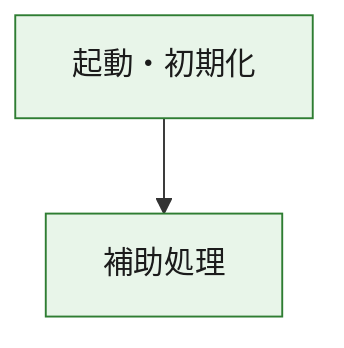
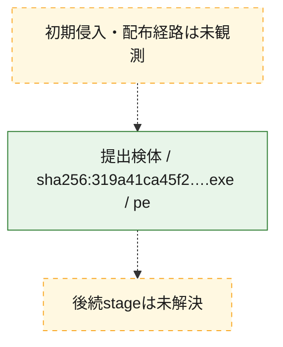
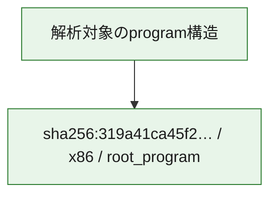

# 全体ロジック：319a41ca45f21c7ba55dfd71112e96995ea372d0db857f627abc5c00e01c60c9

代表関数の静的証跡から、起動・初期化の処理群を確認しました。

## 読み方

- phaseの掲載順は解析上の整理順です。observed_call_edgesがない段階間の実行順を断定しません。
- 図の実線は静的に観測した関係、点線と黄色のノードは未観測・未解決の関係を示します。
- 図は静的な要約であり、動的実行を再現するものではありません。
- 詳細な関数解説とfingerprintは[STATIC-LOGIC.md](STATIC-LOGIC.md)を参照してください。

## 静的可視化

### 実行フロー

### 感染チェーン

### モジュール関係

## 処理段階

### 1. 起動・初期化

entry pointから初期化と後続処理への移行を確認します。
確度: `confirmed_static_function_evidence`

- `319a41ca45f21c7ba55dfd71112e96995ea372d0db857f627abc5c00e01c60c9:ghidra:180001010` — 初期化と主要処理への分岐を行う入口関数です。 状態: `succeeded`、選定理由: `entry_point`, `meaningful_symbol_name`, `reviewed_call_centrality:22`, `role:entrypoint`, `small_program_complete_context`

### 2. 補助処理

主要処理を支える一般内部関数またはlibrary処理を確認します。
確度: `confirmed_static_function_evidence`

- `319a41ca45f21c7ba55dfd71112e96995ea372d0db857f627abc5c00e01c60c9:ghidra:180001240` — 検体内部の一般処理を実装する関数です。 状態: `succeeded`、選定理由: `context_representative`, `reviewed_call_centrality:2`, `small_program_complete_context`
- `319a41ca45f21c7ba55dfd71112e96995ea372d0db857f627abc5c00e01c60c9:ghidra:180001350` — 検体内部の一般処理を実装する関数です。 状態: `succeeded`、選定理由: `context_representative`, `reviewed_call_centrality:25`, `small_program_complete_context`
- `319a41ca45f21c7ba55dfd71112e96995ea372d0db857f627abc5c00e01c60c9:ghidra:180003780` — 検体内部の一般処理を実装する関数です。 状態: `succeeded`、選定理由: `context_representative`, `reviewed_call_centrality:2`, `small_program_complete_context`
- `319a41ca45f21c7ba55dfd71112e96995ea372d0db857f627abc5c00e01c60c9:ghidra:1800038e0` — 検体内部の一般処理を実装する関数です。 状態: `succeeded`、選定理由: `context_representative`, `reviewed_call_centrality:2`, `small_program_complete_context`

## 観測したcall関係

- `319a41ca45f21c7ba55dfd71112e96995ea372d0db857f627abc5c00e01c60c9:ghidra:180001010` → `319a41ca45f21c7ba55dfd71112e96995ea372d0db857f627abc5c00e01c60c9:ghidra:180001240` （`startup` → `support`）
- `319a41ca45f21c7ba55dfd71112e96995ea372d0db857f627abc5c00e01c60c9:ghidra:180001010` → `319a41ca45f21c7ba55dfd71112e96995ea372d0db857f627abc5c00e01c60c9:ghidra:180001350` （`startup` → `support`）
- `319a41ca45f21c7ba55dfd71112e96995ea372d0db857f627abc5c00e01c60c9:ghidra:180001350` → `319a41ca45f21c7ba55dfd71112e96995ea372d0db857f627abc5c00e01c60c9:ghidra:180001240` （`support` → `support`）
- `319a41ca45f21c7ba55dfd71112e96995ea372d0db857f627abc5c00e01c60c9:ghidra:180001350` → `319a41ca45f21c7ba55dfd71112e96995ea372d0db857f627abc5c00e01c60c9:ghidra:180003780` （`support` → `support`）
- `319a41ca45f21c7ba55dfd71112e96995ea372d0db857f627abc5c00e01c60c9:ghidra:180001350` → `319a41ca45f21c7ba55dfd71112e96995ea372d0db857f627abc5c00e01c60c9:ghidra:1800038e0` （`support` → `support`）
- `319a41ca45f21c7ba55dfd71112e96995ea372d0db857f627abc5c00e01c60c9:ghidra:180003780` → `319a41ca45f21c7ba55dfd71112e96995ea372d0db857f627abc5c00e01c60c9:ghidra:1800038e0` （`support` → `support`）
- `ghidra-function:430e343e0c0c919463a45b04` → `ghidra-function:1a576658e1a825aae1224d94` （`unclassified` → `unclassified`）
- `ghidra-function:430e343e0c0c919463a45b04` → `ghidra-function:2c71f03351cf2f3eb10f0ab0` （`unclassified` → `unclassified`）
- `ghidra-function:430e343e0c0c919463a45b04` → `ghidra-function:34d11dcd738c926577dc19cd` （`unclassified` → `unclassified`）
- `ghidra-function:430e343e0c0c919463a45b04` → `ghidra-function:5b32598ab23d35ec049a1c0a` （`unclassified` → `unclassified`）
- `ghidra-function:430e343e0c0c919463a45b04` → `ghidra-function:7fa0cf71beb5ca4d65cb5c79` （`unclassified` → `unclassified`）
- `ghidra-function:430e343e0c0c919463a45b04` → `ghidra-function:804bf12f50e05ddb29993e83` （`unclassified` → `unclassified`）
- `ghidra-function:430e343e0c0c919463a45b04` → `ghidra-function:929014b3bfc111bf62b7ec92` （`unclassified` → `unclassified`）
- `ghidra-function:430e343e0c0c919463a45b04` → `ghidra-function:a97128474cdd8a2146c650ff` （`unclassified` → `unclassified`）
- `ghidra-function:430e343e0c0c919463a45b04` → `ghidra-function:b8e59784e246bf9f9aca2499` （`unclassified` → `unclassified`）
- `ghidra-function:430e343e0c0c919463a45b04` → `ghidra-function:be9f731facabc7a9837a070e` （`unclassified` → `unclassified`）
- `ghidra-function:430e343e0c0c919463a45b04` → `ghidra-function:d0412d8c69acc3a089f163b8` （`unclassified` → `unclassified`）
- `ghidra-function:430e343e0c0c919463a45b04` → `ghidra-function:e84f428a5942215f39966d25` （`unclassified` → `unclassified`）
- `ghidra-function:5b32598ab23d35ec049a1c0a` → `ghidra-external:03a98b2f28dd0e4a4a50ff3b` （`unclassified` → `unclassified`）
- `ghidra-function:5b32598ab23d35ec049a1c0a` → `ghidra-external:07edc10108ac4e22101e830c` （`unclassified` → `unclassified`）
- `ghidra-function:5b32598ab23d35ec049a1c0a` → `ghidra-external:3688b90c5fe8ffad389e54e9` （`unclassified` → `unclassified`）
- `ghidra-function:5b32598ab23d35ec049a1c0a` → `ghidra-external:4abf029a271b90c9f62a7ecd` （`unclassified` → `unclassified`）
- `ghidra-function:5b32598ab23d35ec049a1c0a` → `ghidra-external:4edc5e033083b0b880d3b223` （`unclassified` → `unclassified`）
- `ghidra-function:5b32598ab23d35ec049a1c0a` → `ghidra-external:5335ad24a763cd8076510137` （`unclassified` → `unclassified`）
- `ghidra-function:5b32598ab23d35ec049a1c0a` → `ghidra-external:562cd4f4959562e14f3aadd0` （`unclassified` → `unclassified`）
- `ghidra-function:5b32598ab23d35ec049a1c0a` → `ghidra-external:5f1e36d48522c5e25f2010fa` （`unclassified` → `unclassified`）
- `ghidra-function:5b32598ab23d35ec049a1c0a` → `ghidra-external:78a86c77463ca20aed76ea0f` （`unclassified` → `unclassified`）
- `ghidra-function:5b32598ab23d35ec049a1c0a` → `ghidra-external:7c4d4d18b58e4ad0a1dd1e1d` （`unclassified` → `unclassified`）
- `ghidra-function:5b32598ab23d35ec049a1c0a` → `ghidra-external:7e531afa9344a5f3d590522c` （`unclassified` → `unclassified`）
- `ghidra-function:5b32598ab23d35ec049a1c0a` → `ghidra-external:82d61b0816989103ad194abd` （`unclassified` → `unclassified`）
- `ghidra-function:5b32598ab23d35ec049a1c0a` → `ghidra-external:8afbb33409614165925d169a` （`unclassified` → `unclassified`）
- `ghidra-function:5b32598ab23d35ec049a1c0a` → `ghidra-external:a2f9926df6dae5f9395a67df` （`unclassified` → `unclassified`）
- `ghidra-function:5b32598ab23d35ec049a1c0a` → `ghidra-external:c3bfedd12ff7cdce8edd92ba` （`unclassified` → `unclassified`）
- `ghidra-function:5b32598ab23d35ec049a1c0a` → `ghidra-external:c49e3e62708efe1e38c0805d` （`unclassified` → `unclassified`）
- `ghidra-function:5b32598ab23d35ec049a1c0a` → `ghidra-external:cae894c9d8f091ebdfd0eb98` （`unclassified` → `unclassified`）
- `ghidra-function:5b32598ab23d35ec049a1c0a` → `ghidra-external:da441899997e790df0db17e4` （`unclassified` → `unclassified`）
- `ghidra-function:5b32598ab23d35ec049a1c0a` → `ghidra-external:e36f27af5738292997908000` （`unclassified` → `unclassified`）
- `ghidra-function:5b32598ab23d35ec049a1c0a` → `ghidra-external:e778c7c22c814f9f978b2dba` （`unclassified` → `unclassified`）
- `ghidra-function:5b32598ab23d35ec049a1c0a` → `ghidra-external:f009637f95ace52f46c05c82` （`unclassified` → `unclassified`）
- `ghidra-function:5b32598ab23d35ec049a1c0a` → `ghidra-function:3120a0e77fd80ff097117467` （`unclassified` → `unclassified`）
- `ghidra-function:5b32598ab23d35ec049a1c0a` → `ghidra-function:6ed89b705ed279da6c1b3be0` （`unclassified` → `unclassified`）
- `ghidra-function:5b32598ab23d35ec049a1c0a` → `ghidra-function:b8e59784e246bf9f9aca2499` （`unclassified` → `unclassified`）
- `ghidra-function:6ed89b705ed279da6c1b3be0` → `ghidra-function:3120a0e77fd80ff097117467` （`unclassified` → `unclassified`）

## 解析範囲と制約

- 選定外関数は全体inventoryへ残しますが、関数本体の個別解説対象にはしていません。
- indirect call、難読化、packer、VM、壊れたcontrol flowによりcall関係が欠落する場合があります。
- 文書は静的解析に基づき、検体実行や外部通信による動的確認は行っていません。
