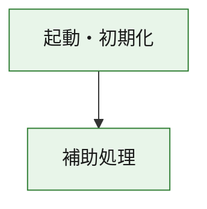
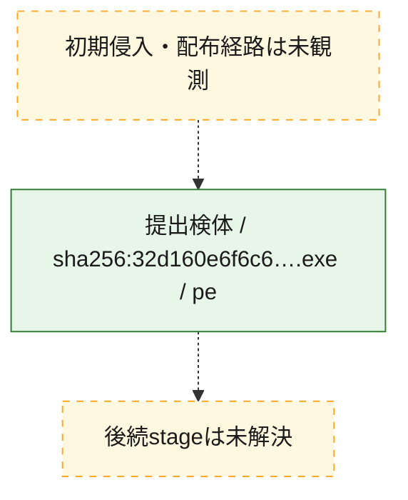
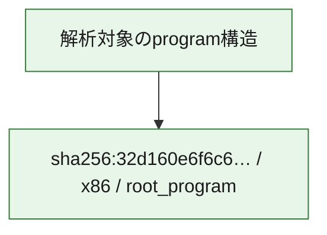

# 全体ロジック：32d160e6f6c628b3abf63646826f563590fe09d55b6519d4fc527f8817f5666a

代表関数の静的証跡から、起動・初期化の処理群を確認しました。

## 読み方

- phaseの掲載順は解析上の整理順です。observed_call_edgesがない段階間の実行順を断定しません。
- 図の実線は静的に観測した関係、点線と黄色のノードは未観測・未解決の関係を示します。
- 図は静的な要約であり、動的実行を再現するものではありません。
- 詳細な関数解説とfingerprintは[STATIC-LOGIC.md](STATIC-LOGIC.md)を参照してください。

## 静的可視化

### 実行フロー

### 感染チェーン

### モジュール関係

## 処理段階

### 1. 起動・初期化

entry pointから初期化と後続処理への移行を確認します。
確度: `confirmed_static_function_evidence`

- `32d160e6f6c628b3abf63646826f563590fe09d55b6519d4fc527f8817f5666a:ghidra:180001010` — 初期化と主要処理への分岐を行う入口関数です。 状態: `succeeded`、選定理由: `entry_point`, `meaningful_symbol_name`, `reviewed_call_centrality:22`, `role:entrypoint`, `small_program_complete_context`

### 2. 補助処理

主要処理を支える一般内部関数またはlibrary処理を確認します。
確度: `confirmed_static_function_evidence`

- `32d160e6f6c628b3abf63646826f563590fe09d55b6519d4fc527f8817f5666a:ghidra:180001240` — 検体内部の一般処理を実装する関数です。 状態: `succeeded`、選定理由: `context_representative`, `reviewed_call_centrality:2`, `small_program_complete_context`
- `32d160e6f6c628b3abf63646826f563590fe09d55b6519d4fc527f8817f5666a:ghidra:180001350` — 検体内部の一般処理を実装する関数です。 状態: `succeeded`、選定理由: `context_representative`, `reviewed_call_centrality:25`, `small_program_complete_context`
- `32d160e6f6c628b3abf63646826f563590fe09d55b6519d4fc527f8817f5666a:ghidra:180003780` — 検体内部の一般処理を実装する関数です。 状態: `succeeded`、選定理由: `context_representative`, `reviewed_call_centrality:2`, `small_program_complete_context`
- `32d160e6f6c628b3abf63646826f563590fe09d55b6519d4fc527f8817f5666a:ghidra:1800038e0` — 検体内部の一般処理を実装する関数です。 状態: `succeeded`、選定理由: `context_representative`, `reviewed_call_centrality:2`, `small_program_complete_context`

## 観測したcall関係

- `32d160e6f6c628b3abf63646826f563590fe09d55b6519d4fc527f8817f5666a:ghidra:180001010` → `32d160e6f6c628b3abf63646826f563590fe09d55b6519d4fc527f8817f5666a:ghidra:180001240` （`startup` → `support`）
- `32d160e6f6c628b3abf63646826f563590fe09d55b6519d4fc527f8817f5666a:ghidra:180001010` → `32d160e6f6c628b3abf63646826f563590fe09d55b6519d4fc527f8817f5666a:ghidra:180001350` （`startup` → `support`）
- `32d160e6f6c628b3abf63646826f563590fe09d55b6519d4fc527f8817f5666a:ghidra:180001350` → `32d160e6f6c628b3abf63646826f563590fe09d55b6519d4fc527f8817f5666a:ghidra:180001240` （`support` → `support`）
- `32d160e6f6c628b3abf63646826f563590fe09d55b6519d4fc527f8817f5666a:ghidra:180001350` → `32d160e6f6c628b3abf63646826f563590fe09d55b6519d4fc527f8817f5666a:ghidra:180003780` （`support` → `support`）
- `32d160e6f6c628b3abf63646826f563590fe09d55b6519d4fc527f8817f5666a:ghidra:180001350` → `32d160e6f6c628b3abf63646826f563590fe09d55b6519d4fc527f8817f5666a:ghidra:1800038e0` （`support` → `support`）
- `32d160e6f6c628b3abf63646826f563590fe09d55b6519d4fc527f8817f5666a:ghidra:180003780` → `32d160e6f6c628b3abf63646826f563590fe09d55b6519d4fc527f8817f5666a:ghidra:1800038e0` （`support` → `support`）
- `ghidra-function:0b1614aa961ce68f691183c2` → `ghidra-function:1c5dd35f9bec30bb5e165170` （`unclassified` → `unclassified`）
- `ghidra-function:0b1614aa961ce68f691183c2` → `ghidra-function:3015492bab22214933adfa0d` （`unclassified` → `unclassified`）
- `ghidra-function:0b1614aa961ce68f691183c2` → `ghidra-function:3f9d066559d05e8677090b77` （`unclassified` → `unclassified`）
- `ghidra-function:0b1614aa961ce68f691183c2` → `ghidra-function:3fbe600eb5a28c395bc38d98` （`unclassified` → `unclassified`）
- `ghidra-function:0b1614aa961ce68f691183c2` → `ghidra-function:54415ffe5d27348ab5c2c29d` （`unclassified` → `unclassified`）
- `ghidra-function:0b1614aa961ce68f691183c2` → `ghidra-function:6d2cbb8d0f7bc61453630d29` （`unclassified` → `unclassified`）
- `ghidra-function:0b1614aa961ce68f691183c2` → `ghidra-function:71ed0acf138e1298dfeb2788` （`unclassified` → `unclassified`）
- `ghidra-function:0b1614aa961ce68f691183c2` → `ghidra-function:722d8a4b31780e4e87cf49a7` （`unclassified` → `unclassified`）
- `ghidra-function:0b1614aa961ce68f691183c2` → `ghidra-function:77b99881876cab38aa660d34` （`unclassified` → `unclassified`）
- `ghidra-function:0b1614aa961ce68f691183c2` → `ghidra-function:a9a1eac751f5efb9bb56f5d5` （`unclassified` → `unclassified`）
- `ghidra-function:0b1614aa961ce68f691183c2` → `ghidra-function:d9a66b0f860e83e6713b7600` （`unclassified` → `unclassified`）
- `ghidra-function:0b1614aa961ce68f691183c2` → `ghidra-function:db361944d686195cf570062c` （`unclassified` → `unclassified`）
- `ghidra-function:77b99881876cab38aa660d34` → `ghidra-external:1d3c72abf397b87428712114` （`unclassified` → `unclassified`）
- `ghidra-function:77b99881876cab38aa660d34` → `ghidra-external:1da82710af5485cd24f78a33` （`unclassified` → `unclassified`）
- `ghidra-function:77b99881876cab38aa660d34` → `ghidra-external:1f6f48c764e914ae9b4fb342` （`unclassified` → `unclassified`）
- `ghidra-function:77b99881876cab38aa660d34` → `ghidra-external:2ad3ffcdb68c4cd6bfdb05d1` （`unclassified` → `unclassified`）
- `ghidra-function:77b99881876cab38aa660d34` → `ghidra-external:343d98849c80767f301f61b7` （`unclassified` → `unclassified`）
- `ghidra-function:77b99881876cab38aa660d34` → `ghidra-external:36de3c5622d90b34fb96c683` （`unclassified` → `unclassified`）
- `ghidra-function:77b99881876cab38aa660d34` → `ghidra-external:43a708fd9c6b7f8b25954e9a` （`unclassified` → `unclassified`）
- `ghidra-function:77b99881876cab38aa660d34` → `ghidra-external:4eb3668e1a8337f35eb21d81` （`unclassified` → `unclassified`）
- `ghidra-function:77b99881876cab38aa660d34` → `ghidra-external:58397625a36122c32bef9179` （`unclassified` → `unclassified`）
- `ghidra-function:77b99881876cab38aa660d34` → `ghidra-external:5e5611033d5f44f8dcbb1db0` （`unclassified` → `unclassified`）
- `ghidra-function:77b99881876cab38aa660d34` → `ghidra-external:79f6017016405750064ee5fd` （`unclassified` → `unclassified`）
- `ghidra-function:77b99881876cab38aa660d34` → `ghidra-external:7aa219300c2f6b073f412f26` （`unclassified` → `unclassified`）
- `ghidra-function:77b99881876cab38aa660d34` → `ghidra-external:7ca8de35a8ae34d75b085750` （`unclassified` → `unclassified`）
- `ghidra-function:77b99881876cab38aa660d34` → `ghidra-external:aa6b80dc27e9a99701ca6232` （`unclassified` → `unclassified`）
- `ghidra-function:77b99881876cab38aa660d34` → `ghidra-external:b9b8a895c9b35ddfd62fc432` （`unclassified` → `unclassified`）
- `ghidra-function:77b99881876cab38aa660d34` → `ghidra-external:bf8e85edd214e641616eba82` （`unclassified` → `unclassified`）
- `ghidra-function:77b99881876cab38aa660d34` → `ghidra-external:c800c8ac28707af959392202` （`unclassified` → `unclassified`）
- `ghidra-function:77b99881876cab38aa660d34` → `ghidra-external:ce0841d37345b9a06aa3a158` （`unclassified` → `unclassified`）
- `ghidra-function:77b99881876cab38aa660d34` → `ghidra-external:d045265bb60e92dd07ed7fc0` （`unclassified` → `unclassified`）
- `ghidra-function:77b99881876cab38aa660d34` → `ghidra-external:ec885f49c2644497c8b7ab8c` （`unclassified` → `unclassified`）
- `ghidra-function:77b99881876cab38aa660d34` → `ghidra-external:fd13765cee13882739b27fe5` （`unclassified` → `unclassified`）
- `ghidra-function:77b99881876cab38aa660d34` → `ghidra-function:3f9d066559d05e8677090b77` （`unclassified` → `unclassified`）
- `ghidra-function:77b99881876cab38aa660d34` → `ghidra-function:7f8d8c6c1c2bb3b16d2d5dd2` （`unclassified` → `unclassified`）
- `ghidra-function:77b99881876cab38aa660d34` → `ghidra-function:d7a4780a74e2a4f729d6feeb` （`unclassified` → `unclassified`）
- `ghidra-function:7f8d8c6c1c2bb3b16d2d5dd2` → `ghidra-function:d7a4780a74e2a4f729d6feeb` （`unclassified` → `unclassified`）

## 解析範囲と制約

- 選定外関数は全体inventoryへ残しますが、関数本体の個別解説対象にはしていません。
- indirect call、難読化、packer、VM、壊れたcontrol flowによりcall関係が欠落する場合があります。
- 文書は静的解析に基づき、検体実行や外部通信による動的確認は行っていません。
