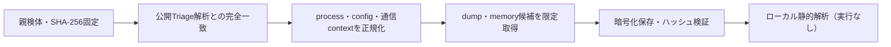

# Triage公開解析・後段取得証跡

## 完全ハッシュ一致

- [260923-3t6f2sge96](https://tria.ge/260923-3t6f2sge96): ファミリー候補 `milleniumrat`、評価score `10`
- [260722-bgs7eawhqh](https://tria.ge/260722-bgs7eawhqh): ファミリー候補 `milleniumrat`、評価score `10`
- [260701-pfdbfsfx7x](https://tria.ge/260701-pfdbfsfx7x): ファミリー候補 `milleniumrat`、評価score `10`

## プロセス・通信

- 観測process: `32e167e167c82f04b203c220b56edb95bbc3869254c7b792521a490c97e9507a.exe, OneDriveUpdate.exe, attrib.exe, chrome.exe, cmd.exe, elevation_service.exe, msedge.exe, powershell.exe, reg.exe, sc.exe, schtasks.exe, setup.exe, svchost.exe, timeout.exe, tmp_14027_update1.exe, tmp_15709_update2.exe, tmp_15756_update1.exe, tmp_18036_update3.exe, tmp_26064_update1.exe, tmp_27098_update2.exe, tmp_27848_update2.exe, tmp_31437_update1.exe, update1.exe, vshost.exe, wscript.exe`
- raw commandは保存せず、command SHA-256と処理patternだけをJSONへ保持します。
- sandbox background trafficは`context_only`であり、C2へ自動昇格しません。

- 取得できませんでした。

## 後段取得物

- `579688860a65734d8448db845939270683a2b91f8522ad68efb02300048f9d07` / `memory_image` / 221184 bytes / 親と同一: `false` / 静的解析: `partial`
- `f6081e3cbb26ab946a509c5a6f576638dc7e86e538e0fcfa62abd9608b7bec16` / `memory_image` / 6455296 bytes / 親と同一: `false` / 静的解析: `partial`

## 判定境界

Triage由来のfamily、process、config、通信は外部sandbox証跡です。Config extractorが返したendpointはC2候補として扱いますが、静的設定復元またはprocess帰属とprotocol応答が揃うまでは確認済みC2とはしません。取得成果物と検体は実行していません。
