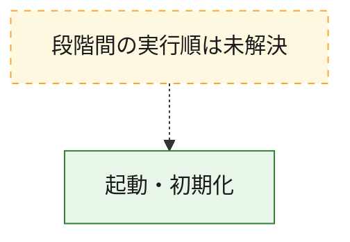
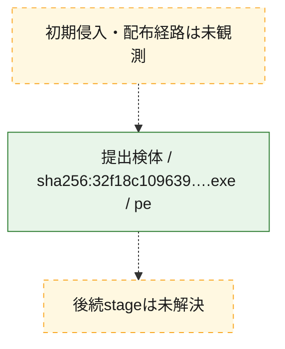
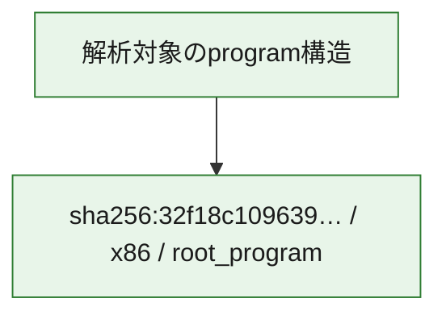

# 全体ロジック：32f18c10963960a700766993ba755aaf2d407b542a2d8a2af3dbc8da7a2afab4

代表関数の静的証跡から、起動・初期化の処理群を確認しました。

## 読み方

- phaseの掲載順は解析上の整理順です。observed_call_edgesがない段階間の実行順を断定しません。
- 図の実線は静的に観測した関係、点線と黄色のノードは未観測・未解決の関係を示します。
- 図は静的な要約であり、動的実行を再現するものではありません。
- 詳細な関数解説とfingerprintは[STATIC-LOGIC.md](STATIC-LOGIC.md)を参照してください。

## 静的可視化

### 実行フロー

### 感染チェーン

### モジュール関係

## 処理段階

### 1. 起動・初期化

entry pointから初期化と後続処理への移行を確認します。
確度: `confirmed_static_function_evidence`

- `32f18c10963960a700766993ba755aaf2d407b542a2d8a2af3dbc8da7a2afab4:ghidra:0041942f` — 初期化と主要処理への分岐を行う入口関数です。 状態: `succeeded`、選定理由: `entry_point`, `large_function:instructions=111`, `meaningful_symbol_name`, `reviewed_call_centrality:21`, `role:entrypoint`, `small_program_complete_context`

## 観測したcall関係

- `ghidra-function:7694c3028fce3f79495cf296` → `ghidra-external:258d7382a0e44c302001860e` （`unclassified` → `unclassified`）
- `ghidra-function:7694c3028fce3f79495cf296` → `ghidra-external:3da0dbeb2790d90501ca23c1` （`unclassified` → `unclassified`）
- `ghidra-function:7694c3028fce3f79495cf296` → `ghidra-external:d37d9add299054d07727f4d6` （`unclassified` → `unclassified`）
- `ghidra-function:7694c3028fce3f79495cf296` → `ghidra-function:05acb638b173e680469e6701` （`unclassified` → `unclassified`）
- `ghidra-function:7694c3028fce3f79495cf296` → `ghidra-function:0ec5facdfaa8f765d058002b` （`unclassified` → `unclassified`）
- `ghidra-function:7694c3028fce3f79495cf296` → `ghidra-function:14bd88f1dae28a09b2b998c3` （`unclassified` → `unclassified`）
- `ghidra-function:7694c3028fce3f79495cf296` → `ghidra-function:185dfc4bcca154439119a040` （`unclassified` → `unclassified`）
- `ghidra-function:7694c3028fce3f79495cf296` → `ghidra-function:4eebd9b343a541117345b2e9` （`unclassified` → `unclassified`）
- `ghidra-function:7694c3028fce3f79495cf296` → `ghidra-function:7c4397c6bf38aae900a63904` （`unclassified` → `unclassified`）
- `ghidra-function:7694c3028fce3f79495cf296` → `ghidra-function:9f0cd60635e0a8c3b2f621cc` （`unclassified` → `unclassified`）
- `ghidra-function:7694c3028fce3f79495cf296` → `ghidra-function:a054db755d57d734cc6292cf` （`unclassified` → `unclassified`）
- `ghidra-function:7694c3028fce3f79495cf296` → `ghidra-function:bc91dcfd2efbae8889aaee7d` （`unclassified` → `unclassified`）

## 解析範囲と制約

- 選定外関数は全体inventoryへ残しますが、関数本体の個別解説対象にはしていません。
- indirect call、難読化、packer、VM、壊れたcontrol flowによりcall関係が欠落する場合があります。
- 文書は静的解析に基づき、検体実行や外部通信による動的確認は行っていません。
