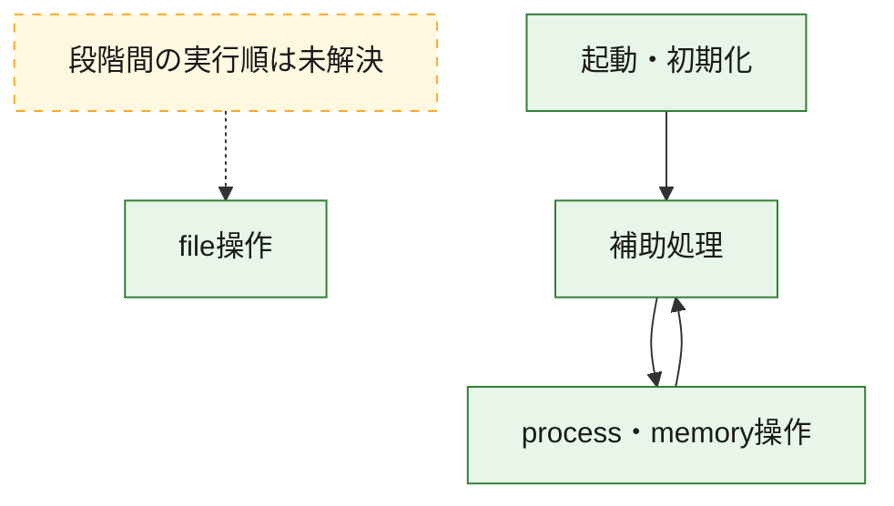
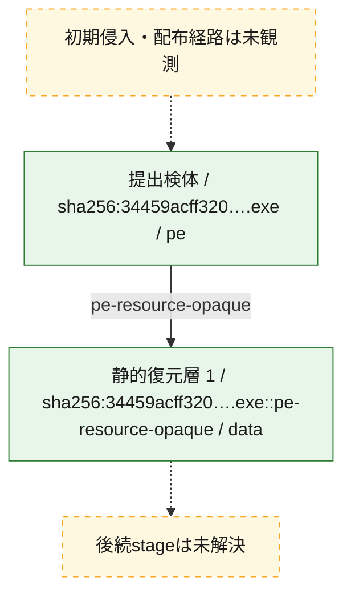
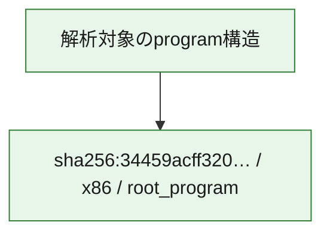

# 全体ロジック：34459acff32021df1e332e12ab6932be88dbe1a33f92bc7eae55753f8931f2db

代表関数の静的証跡から、起動・初期化、process・memory操作、file操作の処理群を確認しました。

## 読み方

- phaseの掲載順は解析上の整理順です。observed_call_edgesがない段階間の実行順を断定しません。
- 図の実線は静的に観測した関係、点線と黄色のノードは未観測・未解決の関係を示します。
- 図は静的な要約であり、動的実行を再現するものではありません。
- 詳細な関数解説とfingerprintは[STATIC-LOGIC.md](STATIC-LOGIC.md)を参照してください。

## 静的可視化

### 実行フロー

### 感染チェーン

### モジュール関係

## 処理段階

### 1. 起動・初期化

entry pointから初期化と後続処理への移行を確認します。
確度: `confirmed_static_function_evidence`

- `34459acff32021df1e332e12ab6932be88dbe1a33f92bc7eae55753f8931f2db:ghidra:140010f30` — 初期化と主要処理への分岐を行う入口関数です。 状態: `succeeded`、選定理由: `entry_point`, `meaningful_symbol_name`, `reviewed_call_centrality:21`, `role:entrypoint`

### 2. process・memory操作

process、thread、module、memory操作と実行移行を確認します。
確度: `confirmed_static_function_evidence`

- `34459acff32021df1e332e12ab6932be88dbe1a33f92bc7eae55753f8931f2db:ghidra:140001870` — process、thread、module、またはmemory操作に関係する関数です。 状態: `succeeded`、選定理由: `context_representative`, `reviewed_call_centrality:2`, `role:process_or_memory_operation`
- `34459acff32021df1e332e12ab6932be88dbe1a33f92bc7eae55753f8931f2db:ghidra:1400018d0` — process、thread、module、またはmemory操作に関係する関数です。 状態: `succeeded`、選定理由: `context_representative`, `reviewed_call_centrality:4`, `role:process_or_memory_operation`
- `34459acff32021df1e332e12ab6932be88dbe1a33f92bc7eae55753f8931f2db:ghidra:140001a50` — process、thread、module、またはmemory操作に関係する関数です。 状態: `succeeded`、選定理由: `context_representative`, `reviewed_call_centrality:6`, `role:process_or_memory_operation`
- `34459acff32021df1e332e12ab6932be88dbe1a33f92bc7eae55753f8931f2db:ghidra:140002650` — process、thread、module、またはmemory操作に関係する関数です。 状態: `succeeded`、選定理由: `context_representative`, `reviewed_call_centrality:39`, `role:process_or_memory_operation`

### 3. file操作

fileやdirectoryの作成、読書き、削除を確認します。
確度: `confirmed_static_function_evidence`

- `34459acff32021df1e332e12ab6932be88dbe1a33f92bc7eae55753f8931f2db:ghidra:140001ef0` — fileまたはdirectoryの読書き・管理に関係する関数です。 状態: `succeeded`、選定理由: `context_representative`, `reviewed_call_centrality:25`, `role:file_operation`

### 4. 補助処理

主要処理を支える一般内部関数またはlibrary処理を確認します。
確度: `confirmed_static_function_evidence`

- `34459acff32021df1e332e12ab6932be88dbe1a33f92bc7eae55753f8931f2db:ghidra:140001000` — 検体内部の一般処理を実装する関数です。 状態: `succeeded`、選定理由: `context_representative`, `reviewed_call_centrality:1`
- `34459acff32021df1e332e12ab6932be88dbe1a33f92bc7eae55753f8931f2db:ghidra:140001020` — 検体内部の一般処理を実装する関数です。 状態: `succeeded`、選定理由: `context_representative`, `reviewed_call_centrality:1`
- `34459acff32021df1e332e12ab6932be88dbe1a33f92bc7eae55753f8931f2db:ghidra:140001040` — 検体内部の一般処理を実装する関数です。 状態: `succeeded`、選定理由: `context_representative`, `reviewed_call_centrality:5`
- `34459acff32021df1e332e12ab6932be88dbe1a33f92bc7eae55753f8931f2db:ghidra:1400010b0` — 検体内部の一般処理を実装する関数です。 状態: `succeeded`、選定理由: `context_representative`, `reviewed_call_centrality:13`
- `34459acff32021df1e332e12ab6932be88dbe1a33f92bc7eae55753f8931f2db:ghidra:1400011a0` — 検体内部の一般処理を実装する関数です。 状態: `succeeded`、選定理由: `context_representative`, `reviewed_call_centrality:1`
- `34459acff32021df1e332e12ab6932be88dbe1a33f92bc7eae55753f8931f2db:ghidra:1400011e0` — 検体内部の一般処理を実装する関数です。 状態: `succeeded`、選定理由: `context_representative`, `reviewed_call_centrality:2`
- `34459acff32021df1e332e12ab6932be88dbe1a33f92bc7eae55753f8931f2db:ghidra:140001280` — 検体内部の一般処理を実装する関数です。 状態: `succeeded`、選定理由: `context_representative`, `reviewed_call_centrality:3`
- `34459acff32021df1e332e12ab6932be88dbe1a33f92bc7eae55753f8931f2db:ghidra:140001330` — 検体内部の一般処理を実装する関数です。 状態: `succeeded`、選定理由: `context_representative`, `reviewed_call_centrality:1`
- `34459acff32021df1e332e12ab6932be88dbe1a33f92bc7eae55753f8931f2db:ghidra:140001360` — 検体内部の一般処理を実装する関数です。 状態: `succeeded`、選定理由: `context_representative`, `reviewed_call_centrality:1`
- `34459acff32021df1e332e12ab6932be88dbe1a33f92bc7eae55753f8931f2db:ghidra:1400013c0` — 検体内部の一般処理を実装する関数です。 状態: `succeeded`、選定理由: `context_representative`, `reviewed_call_centrality:4`
- `34459acff32021df1e332e12ab6932be88dbe1a33f92bc7eae55753f8931f2db:ghidra:1400014d0` — 検体内部の一般処理を実装する関数です。 状態: `succeeded`、選定理由: `context_representative`, `reviewed_call_centrality:1`
- `34459acff32021df1e332e12ab6932be88dbe1a33f92bc7eae55753f8931f2db:ghidra:140001550` — 検体内部の一般処理を実装する関数です。 状態: `succeeded`、選定理由: `context_representative`, `reviewed_call_centrality:1`
- `34459acff32021df1e332e12ab6932be88dbe1a33f92bc7eae55753f8931f2db:ghidra:1400015e0` — 検体内部の一般処理を実装する関数です。 状態: `succeeded`、選定理由: `context_representative`, `reviewed_call_centrality:3`
- `34459acff32021df1e332e12ab6932be88dbe1a33f92bc7eae55753f8931f2db:ghidra:140001650` — 検体内部の一般処理を実装する関数です。 状態: `succeeded`、選定理由: `context_representative`, `reviewed_call_centrality:4`
- `34459acff32021df1e332e12ab6932be88dbe1a33f92bc7eae55753f8931f2db:ghidra:1400016c0` — 検体内部の一般処理を実装する関数です。 状態: `succeeded`、選定理由: `context_representative`, `reviewed_call_centrality:1`
- `34459acff32021df1e332e12ab6932be88dbe1a33f92bc7eae55753f8931f2db:ghidra:1400016f0` — 検体内部の一般処理を実装する関数です。 状態: `succeeded`、選定理由: `context_representative`, `reviewed_call_centrality:3`
- `34459acff32021df1e332e12ab6932be88dbe1a33f92bc7eae55753f8931f2db:ghidra:1400017a0` — 検体内部の一般処理を実装する関数です。 状態: `succeeded`、選定理由: `context_representative`, `reviewed_call_centrality:2`
- `34459acff32021df1e332e12ab6932be88dbe1a33f92bc7eae55753f8931f2db:ghidra:1400017d0` — 検体内部の一般処理を実装する関数です。 状態: `succeeded`、選定理由: `context_representative`, `reviewed_call_centrality:1`
- `34459acff32021df1e332e12ab6932be88dbe1a33f92bc7eae55753f8931f2db:ghidra:1400019b0` — 検体内部の一般処理を実装する関数です。 状態: `succeeded`、選定理由: `context_representative`, `reviewed_call_centrality:1`
- `34459acff32021df1e332e12ab6932be88dbe1a33f92bc7eae55753f8931f2db:ghidra:140001c00` — 検体内部の一般処理を実装する関数です。 状態: `succeeded`、選定理由: `context_representative`, `reviewed_call_centrality:2`
- `34459acff32021df1e332e12ab6932be88dbe1a33f92bc7eae55753f8931f2db:ghidra:140001c20` — 検体内部の一般処理を実装する関数です。 状態: `succeeded`、選定理由: `context_representative`, `reviewed_call_centrality:5`
- `34459acff32021df1e332e12ab6932be88dbe1a33f92bc7eae55753f8931f2db:ghidra:140001d30` — 検体内部の一般処理を実装する関数です。 状態: `succeeded`、選定理由: `context_representative`, `reviewed_call_centrality:12`
- `34459acff32021df1e332e12ab6932be88dbe1a33f92bc7eae55753f8931f2db:ghidra:140002230` — 検体内部の一般処理を実装する関数です。 状態: `succeeded`、選定理由: `context_representative`
- `34459acff32021df1e332e12ab6932be88dbe1a33f92bc7eae55753f8931f2db:ghidra:140002290` — 検体内部の一般処理を実装する関数です。 状態: `succeeded`、選定理由: `context_representative`, `reviewed_call_centrality:17`
- `34459acff32021df1e332e12ab6932be88dbe1a33f92bc7eae55753f8931f2db:ghidra:140002550` — 検体内部の一般処理を実装する関数です。 状態: `succeeded`、選定理由: `context_representative`, `reviewed_call_centrality:6`
- `34459acff32021df1e332e12ab6932be88dbe1a33f92bc7eae55753f8931f2db:ghidra:140002610` — 検体内部の一般処理を実装する関数です。 状態: `succeeded`、選定理由: `context_representative`, `reviewed_call_centrality:3`

## 観測したcall関係

- `34459acff32021df1e332e12ab6932be88dbe1a33f92bc7eae55753f8931f2db:ghidra:140001280` → `34459acff32021df1e332e12ab6932be88dbe1a33f92bc7eae55753f8931f2db:ghidra:1400011a0` （`support` → `support`）
- `34459acff32021df1e332e12ab6932be88dbe1a33f92bc7eae55753f8931f2db:ghidra:140001280` → `34459acff32021df1e332e12ab6932be88dbe1a33f92bc7eae55753f8931f2db:ghidra:1400011e0` （`support` → `support`）
- `34459acff32021df1e332e12ab6932be88dbe1a33f92bc7eae55753f8931f2db:ghidra:1400013c0` → `34459acff32021df1e332e12ab6932be88dbe1a33f92bc7eae55753f8931f2db:ghidra:140001330` （`support` → `support`）
- `34459acff32021df1e332e12ab6932be88dbe1a33f92bc7eae55753f8931f2db:ghidra:1400013c0` → `34459acff32021df1e332e12ab6932be88dbe1a33f92bc7eae55753f8931f2db:ghidra:140001360` （`support` → `support`）
- `34459acff32021df1e332e12ab6932be88dbe1a33f92bc7eae55753f8931f2db:ghidra:1400015e0` → `34459acff32021df1e332e12ab6932be88dbe1a33f92bc7eae55753f8931f2db:ghidra:1400014d0` （`support` → `support`）
- `34459acff32021df1e332e12ab6932be88dbe1a33f92bc7eae55753f8931f2db:ghidra:1400015e0` → `34459acff32021df1e332e12ab6932be88dbe1a33f92bc7eae55753f8931f2db:ghidra:140001550` （`support` → `support`）
- `34459acff32021df1e332e12ab6932be88dbe1a33f92bc7eae55753f8931f2db:ghidra:140001650` → `34459acff32021df1e332e12ab6932be88dbe1a33f92bc7eae55753f8931f2db:ghidra:140001280` （`support` → `support`）
- `34459acff32021df1e332e12ab6932be88dbe1a33f92bc7eae55753f8931f2db:ghidra:140001650` → `34459acff32021df1e332e12ab6932be88dbe1a33f92bc7eae55753f8931f2db:ghidra:1400013c0` （`support` → `support`）
- `34459acff32021df1e332e12ab6932be88dbe1a33f92bc7eae55753f8931f2db:ghidra:140001650` → `34459acff32021df1e332e12ab6932be88dbe1a33f92bc7eae55753f8931f2db:ghidra:1400015e0` （`support` → `support`）
- `34459acff32021df1e332e12ab6932be88dbe1a33f92bc7eae55753f8931f2db:ghidra:1400016c0` → `34459acff32021df1e332e12ab6932be88dbe1a33f92bc7eae55753f8931f2db:ghidra:140001650` （`support` → `support`）
- `34459acff32021df1e332e12ab6932be88dbe1a33f92bc7eae55753f8931f2db:ghidra:1400017a0` → `34459acff32021df1e332e12ab6932be88dbe1a33f92bc7eae55753f8931f2db:ghidra:1400016f0` （`support` → `support`）
- `34459acff32021df1e332e12ab6932be88dbe1a33f92bc7eae55753f8931f2db:ghidra:140001a50` → `34459acff32021df1e332e12ab6932be88dbe1a33f92bc7eae55753f8931f2db:ghidra:1400019b0` （`execution` → `support`）
- `34459acff32021df1e332e12ab6932be88dbe1a33f92bc7eae55753f8931f2db:ghidra:140002290` → `34459acff32021df1e332e12ab6932be88dbe1a33f92bc7eae55753f8931f2db:ghidra:140001a50` （`support` → `execution`）
- `34459acff32021df1e332e12ab6932be88dbe1a33f92bc7eae55753f8931f2db:ghidra:140002650` → `34459acff32021df1e332e12ab6932be88dbe1a33f92bc7eae55753f8931f2db:ghidra:140002610` （`execution` → `support`）
- `34459acff32021df1e332e12ab6932be88dbe1a33f92bc7eae55753f8931f2db:ghidra:140010f30` → `34459acff32021df1e332e12ab6932be88dbe1a33f92bc7eae55753f8931f2db:ghidra:1400010b0` （`startup` → `support`）
- `ghidra-function:26952f50688c06c02333efd1` → `ghidra-function:b4133333b95cf95fe38a519f` （`unclassified` → `unclassified`）
- `ghidra-function:407892881cef49c987082ffa` → `ghidra-function:661f10c9f33d8206654a935f` （`unclassified` → `unclassified`）
- `ghidra-function:4651ecdfa9e96e3b5e3a29a6` → `ghidra-function:8f963afbf20c05923c0db200` （`unclassified` → `unclassified`）
- `ghidra-function:50f08e03fbf4a35fa28fdacd` → `ghidra-function:28fa55ad02c43bbe9bee9e7c` （`unclassified` → `unclassified`）
- `ghidra-function:50f08e03fbf4a35fa28fdacd` → `ghidra-function:2ba69100c29ff585e68ff497` （`unclassified` → `unclassified`）
- `ghidra-function:50f08e03fbf4a35fa28fdacd` → `ghidra-function:7a9eb42f9eabe306023f8efa` （`unclassified` → `unclassified`）
- `ghidra-function:53ff589fab76454ece5b31cc` → `ghidra-external:c40233e68e12858a6ff2b07c` （`unclassified` → `unclassified`）
- `ghidra-function:661f10c9f33d8206654a935f` → `ghidra-function:c03448e23c33a3bda0c5aa5a` （`unclassified` → `unclassified`）
- `ghidra-function:661f10c9f33d8206654a935f` → `ghidra-function:c92c065d4cefd469e1aa6552` （`unclassified` → `unclassified`）
- `ghidra-function:661f10c9f33d8206654a935f` → `ghidra-function:ca2ca385d804da596780093b` （`unclassified` → `unclassified`）
- `ghidra-function:68f27e2144e7df847d5f8856` → `ghidra-function:2ba69100c29ff585e68ff497` （`unclassified` → `unclassified`）
- `ghidra-function:8821b3f70eecf23e4febc151` → `ghidra-external:5f10ef5e03d8c1d74cf253e6` （`unclassified` → `unclassified`）
- `ghidra-function:8821b3f70eecf23e4febc151` → `ghidra-function:039a5c4fa102304074045b39` （`unclassified` → `unclassified`）
- `ghidra-function:8821b3f70eecf23e4febc151` → `ghidra-function:09c808d1226abf2568fc8f26` （`unclassified` → `unclassified`）
- `ghidra-function:8821b3f70eecf23e4febc151` → `ghidra-function:0cc93d33c5366d29d2dc2694` （`unclassified` → `unclassified`）
- `ghidra-function:8821b3f70eecf23e4febc151` → `ghidra-function:14dc33703c13fb51d22c786d` （`unclassified` → `unclassified`）
- `ghidra-function:8821b3f70eecf23e4febc151` → `ghidra-function:17ce4910000e976f0fa5ce05` （`unclassified` → `unclassified`）
- `ghidra-function:8821b3f70eecf23e4febc151` → `ghidra-function:1be2eb07edef9f3765710ed7` （`unclassified` → `unclassified`）
- `ghidra-function:8821b3f70eecf23e4febc151` → `ghidra-function:28fa55ad02c43bbe9bee9e7c` （`unclassified` → `unclassified`）
- `ghidra-function:8821b3f70eecf23e4febc151` → `ghidra-function:3e93e12df349ceda3f94bb3e` （`unclassified` → `unclassified`）
- `ghidra-function:8821b3f70eecf23e4febc151` → `ghidra-function:5d717526a120320836436204` （`unclassified` → `unclassified`）
- `ghidra-function:8821b3f70eecf23e4febc151` → `ghidra-function:64532501bf3e8ae4eaaa294f` （`unclassified` → `unclassified`）
- `ghidra-function:8821b3f70eecf23e4febc151` → `ghidra-function:9735fe8962c822a069ac3bf3` （`unclassified` → `unclassified`）
- `ghidra-function:8821b3f70eecf23e4febc151` → `ghidra-function:bc5a49fd3dad5d02acc8926f` （`unclassified` → `unclassified`）
- `ghidra-function:8821b3f70eecf23e4febc151` → `ghidra-function:bd54553d115c2a20cf0d3543` （`unclassified` → `unclassified`）
- `ghidra-function:8821b3f70eecf23e4febc151` → `ghidra-function:ed516f4c974c219c063bef42` （`unclassified` → `unclassified`）
- `ghidra-function:8821b3f70eecf23e4febc151` → `ghidra-function:f474c73986bda217fae89751` （`unclassified` → `unclassified`）
- `ghidra-function:999a972f73c47cc5295c911f` → `ghidra-function:3570b5b3cbc64afa9df0f6df` （`unclassified` → `unclassified`）
- `ghidra-function:999a972f73c47cc5295c911f` → `ghidra-function:71f74a8c53d9ae565624733e` （`unclassified` → `unclassified`）
- `ghidra-function:999a972f73c47cc5295c911f` → `ghidra-function:897d71ea899cccab72965a18` （`unclassified` → `unclassified`）
- `ghidra-function:a04f8b500149def2c201d5bc` → `ghidra-function:d444ad76da1b946efe87383b` （`unclassified` → `unclassified`）
- `ghidra-function:a04f8b500149def2c201d5bc` → `ghidra-function:fd0a45856d6f67a2f8d2210d` （`unclassified` → `unclassified`）
- `ghidra-function:a15d95846e2bb0db0d87cfdb` → `ghidra-function:18a6fea6381c8597de2a0d9d` （`unclassified` → `unclassified`）
- `ghidra-function:a15d95846e2bb0db0d87cfdb` → `ghidra-function:1d258cc8bcea41f7ba304081` （`unclassified` → `unclassified`）
- `ghidra-function:a15d95846e2bb0db0d87cfdb` → `ghidra-function:28fa55ad02c43bbe9bee9e7c` （`unclassified` → `unclassified`）
- `ghidra-function:a15d95846e2bb0db0d87cfdb` → `ghidra-function:6d950f0e168edcb06961c783` （`unclassified` → `unclassified`）
- `ghidra-function:a15d95846e2bb0db0d87cfdb` → `ghidra-function:6e165d0d3b6256461d8fea7a` （`unclassified` → `unclassified`）
- `ghidra-function:a15d95846e2bb0db0d87cfdb` → `ghidra-function:91508f49534f5b3da1eb3fc7` （`unclassified` → `unclassified`）
- `ghidra-function:a15d95846e2bb0db0d87cfdb` → `ghidra-function:b4ed497c18a1d136c387f1af` （`unclassified` → `unclassified`）
- `ghidra-function:a15d95846e2bb0db0d87cfdb` → `ghidra-function:cedb98ea4e418079f223298b` （`unclassified` → `unclassified`）
- `ghidra-function:a15d95846e2bb0db0d87cfdb` → `ghidra-function:e6e78598d0c249081446c96b` （`unclassified` → `unclassified`）
- `ghidra-function:b345cbb359aa374a51f0f351` → `ghidra-external:0b010f54c8eff70d5baea89e` （`unclassified` → `unclassified`）
- `ghidra-function:b3e4ba5117f4fc13763060ef` → `ghidra-function:094faf0af44a2b06f869d630` （`unclassified` → `unclassified`）
- `ghidra-function:b3e4ba5117f4fc13763060ef` → `ghidra-function:09c808d1226abf2568fc8f26` （`unclassified` → `unclassified`）
- `ghidra-function:b3e4ba5117f4fc13763060ef` → `ghidra-function:103a14c699906b41498c1219` （`unclassified` → `unclassified`）
- `ghidra-function:b3e4ba5117f4fc13763060ef` → `ghidra-function:17ce4910000e976f0fa5ce05` （`unclassified` → `unclassified`）
- `ghidra-function:b3e4ba5117f4fc13763060ef` → `ghidra-function:28fa55ad02c43bbe9bee9e7c` （`unclassified` → `unclassified`）
- `ghidra-function:b3e4ba5117f4fc13763060ef` → `ghidra-function:3a0531227e9c2987670cf7ad` （`unclassified` → `unclassified`）
- `ghidra-function:b3e4ba5117f4fc13763060ef` → `ghidra-function:4e4601cd20ff262ca4fa7f8a` （`unclassified` → `unclassified`）
- `ghidra-function:b3e4ba5117f4fc13763060ef` → `ghidra-function:5c1fb3a40ea34fd3b0326a5a` （`unclassified` → `unclassified`）
- `ghidra-function:b3e4ba5117f4fc13763060ef` → `ghidra-function:7bc2270fd7408c3825359d36` （`unclassified` → `unclassified`）
- `ghidra-function:b3e4ba5117f4fc13763060ef` → `ghidra-function:8009d12600498c554859383c` （`unclassified` → `unclassified`）
- `ghidra-function:b3e4ba5117f4fc13763060ef` → `ghidra-function:980690f3e8284e34c2307d6c` （`unclassified` → `unclassified`）
- `ghidra-function:b61e6a12cf5244dda58ebb08` → `ghidra-function:05662ceaaf77d3e620ee8169` （`unclassified` → `unclassified`）
- `ghidra-function:b61e6a12cf5244dda58ebb08` → `ghidra-function:05814d9b0af0921031f96d84` （`unclassified` → `unclassified`）
- `ghidra-function:b61e6a12cf5244dda58ebb08` → `ghidra-function:0739f9bae04ba25e544e2b3d` （`unclassified` → `unclassified`）
- `ghidra-function:b61e6a12cf5244dda58ebb08` → `ghidra-function:094faf0af44a2b06f869d630` （`unclassified` → `unclassified`）
- `ghidra-function:b61e6a12cf5244dda58ebb08` → `ghidra-function:136eb3931838e6161fd350a4` （`unclassified` → `unclassified`）
- `ghidra-function:b61e6a12cf5244dda58ebb08` → `ghidra-function:1ab3245fdb4fbb5e08507c7d` （`unclassified` → `unclassified`）
- `ghidra-function:b61e6a12cf5244dda58ebb08` → `ghidra-function:1b824d2d759557577deea5c7` （`unclassified` → `unclassified`）
- `ghidra-function:b61e6a12cf5244dda58ebb08` → `ghidra-function:1d258cc8bcea41f7ba304081` （`unclassified` → `unclassified`）
- `ghidra-function:b61e6a12cf5244dda58ebb08` → `ghidra-function:2303935208a1af785ca81f1d` （`unclassified` → `unclassified`）
- `ghidra-function:b61e6a12cf5244dda58ebb08` → `ghidra-function:28fa55ad02c43bbe9bee9e7c` （`unclassified` → `unclassified`）
- `ghidra-function:b61e6a12cf5244dda58ebb08` → `ghidra-function:47969537606cb9a66fa702a7` （`unclassified` → `unclassified`）
- `ghidra-function:b61e6a12cf5244dda58ebb08` → `ghidra-function:4851b636976aa1677776718d` （`unclassified` → `unclassified`）
- `ghidra-function:b61e6a12cf5244dda58ebb08` → `ghidra-function:4c5f6691d4002e344bdf5876` （`unclassified` → `unclassified`）
- `ghidra-function:b61e6a12cf5244dda58ebb08` → `ghidra-function:4e4601cd20ff262ca4fa7f8a` （`unclassified` → `unclassified`）
- `ghidra-function:b61e6a12cf5244dda58ebb08` → `ghidra-function:6833abf49b966d4f0ad1868a` （`unclassified` → `unclassified`）
- `ghidra-function:b61e6a12cf5244dda58ebb08` → `ghidra-function:6cf8ac6d18f02e1500a6f6f5` （`unclassified` → `unclassified`）
- `ghidra-function:b61e6a12cf5244dda58ebb08` → `ghidra-function:6fb1eb6bcb7ffd75a75bac01` （`unclassified` → `unclassified`）
- `ghidra-function:b61e6a12cf5244dda58ebb08` → `ghidra-function:7320660b7d3687a8e247c239` （`unclassified` → `unclassified`）
- `ghidra-function:b61e6a12cf5244dda58ebb08` → `ghidra-function:7851343de76316b480f1d492` （`unclassified` → `unclassified`）
- `ghidra-function:b61e6a12cf5244dda58ebb08` → `ghidra-function:7ef0c60da954e01117f64984` （`unclassified` → `unclassified`）
- `ghidra-function:b61e6a12cf5244dda58ebb08` → `ghidra-function:7f379fc80fd6b3d93eeb6bf2` （`unclassified` → `unclassified`）
- `ghidra-function:b61e6a12cf5244dda58ebb08` → `ghidra-function:859ac4e8b0d536865908dcad` （`unclassified` → `unclassified`）
- `ghidra-function:b61e6a12cf5244dda58ebb08` → `ghidra-function:8fd459e69297fb28196f8e20` （`unclassified` → `unclassified`）
- `ghidra-function:b61e6a12cf5244dda58ebb08` → `ghidra-function:a3573d252295a28541cac552` （`unclassified` → `unclassified`）
- `ghidra-function:b61e6a12cf5244dda58ebb08` → `ghidra-function:a515089bfed22cefc254ed33` （`unclassified` → `unclassified`）
- `ghidra-function:b61e6a12cf5244dda58ebb08` → `ghidra-function:a71c421469b57cbaaf7bda87` （`unclassified` → `unclassified`）
- `ghidra-function:b61e6a12cf5244dda58ebb08` → `ghidra-function:ad9d56c8f07b94658ee05bd5` （`unclassified` → `unclassified`）
- `ghidra-function:b61e6a12cf5244dda58ebb08` → `ghidra-function:ada00d30c1e62094d1037740` （`unclassified` → `unclassified`）
- `ghidra-function:b61e6a12cf5244dda58ebb08` → `ghidra-function:b58b642f6f85f56b253814bc` （`unclassified` → `unclassified`）
- `ghidra-function:b61e6a12cf5244dda58ebb08` → `ghidra-function:b5e3e943f8d7c1eaa1bd2e0b` （`unclassified` → `unclassified`）
- `ghidra-function:b61e6a12cf5244dda58ebb08` → `ghidra-function:bef455a24a3ee4f4ab459001` （`unclassified` → `unclassified`）
- `ghidra-function:b61e6a12cf5244dda58ebb08` → `ghidra-function:c392bc4662eec3847e2e291d` （`unclassified` → `unclassified`）
- `ghidra-function:b61e6a12cf5244dda58ebb08` → `ghidra-function:ccdd3a2217445ff680c2c4fe` （`unclassified` → `unclassified`）
- `ghidra-function:b61e6a12cf5244dda58ebb08` → `ghidra-function:cedb98ea4e418079f223298b` （`unclassified` → `unclassified`）
- `ghidra-function:b61e6a12cf5244dda58ebb08` → `ghidra-function:cf71284dc797969d87385c73` （`unclassified` → `unclassified`）
- `ghidra-function:b61e6a12cf5244dda58ebb08` → `ghidra-function:df0bb372bc35b3e6d1575570` （`unclassified` → `unclassified`）
- `ghidra-function:b61e6a12cf5244dda58ebb08` → `ghidra-function:eee2e954e57d7f5ff965112b` （`unclassified` → `unclassified`）
- `ghidra-function:bf6222276af569868a1d8287` → `ghidra-external:2a751fbf03e928bbc9f48851` （`unclassified` → `unclassified`）
- `ghidra-function:bf6222276af569868a1d8287` → `ghidra-external:3f9407db5c6d16b5c85321ae` （`unclassified` → `unclassified`）
- `ghidra-function:bf6222276af569868a1d8287` → `ghidra-external:4229d59869ff6d3be447654d` （`unclassified` → `unclassified`）
- `ghidra-function:bf6222276af569868a1d8287` → `ghidra-external:af446e7c9cbf61986aad38ae` （`unclassified` → `unclassified`）
- `ghidra-function:bf6222276af569868a1d8287` → `ghidra-external:ccc6a447d274f18fdbf82e2b` （`unclassified` → `unclassified`）
- `ghidra-function:bf6222276af569868a1d8287` → `ghidra-external:f3a1aea37cfe2b5dd36dad9d` （`unclassified` → `unclassified`）
- `ghidra-function:bf6222276af569868a1d8287` → `ghidra-external:ff018c3da93473397112fc31` （`unclassified` → `unclassified`）
- `ghidra-function:bf6222276af569868a1d8287` → `ghidra-function:007b6c5418abd4cef65e5289` （`unclassified` → `unclassified`）
- `ghidra-function:bf6222276af569868a1d8287` → `ghidra-function:0953ab87c19843d5f185346d` （`unclassified` → `unclassified`）
- `ghidra-function:bf6222276af569868a1d8287` → `ghidra-function:29d5487692b9ef74f58a07c6` （`unclassified` → `unclassified`）
- `ghidra-function:bf6222276af569868a1d8287` → `ghidra-function:43b1e5cff43aa4b2f6943c76` （`unclassified` → `unclassified`）
- `ghidra-function:bf6222276af569868a1d8287` → `ghidra-function:4ddc7d788979855964d88130` （`unclassified` → `unclassified`）
- `ghidra-function:bf6222276af569868a1d8287` → `ghidra-function:52f19a87fcae7cc3365ca6db` （`unclassified` → `unclassified`）
- `ghidra-function:bf6222276af569868a1d8287` → `ghidra-function:5a4eb85256f36aec28e1b0cf` （`unclassified` → `unclassified`）
- `ghidra-function:bf6222276af569868a1d8287` → `ghidra-function:7b42fda3b7900df3e5bb974f` （`unclassified` → `unclassified`）
- `ghidra-function:bf6222276af569868a1d8287` → `ghidra-function:a15d95846e2bb0db0d87cfdb` （`unclassified` → `unclassified`）
- `ghidra-function:bf6222276af569868a1d8287` → `ghidra-function:d1d8c3e6bb5ec8587a3c7079` （`unclassified` → `unclassified`）
- `ghidra-function:bf6222276af569868a1d8287` → `ghidra-function:eefac13c952492cbe6ae5a51` （`unclassified` → `unclassified`）
- `ghidra-function:bf6222276af569868a1d8287` → `ghidra-function:f4dc33b6e46ecae295edbbcc` （`unclassified` → `unclassified`）
- `ghidra-function:bf6222276af569868a1d8287` → `ghidra-function:fa769a205a73895a0253a138` （`unclassified` → `unclassified`）
- `ghidra-function:bf6222276af569868a1d8287` → `ghidra-function:fed8484bfa5f7600839b096f` （`unclassified` → `unclassified`）
- `ghidra-function:c03448e23c33a3bda0c5aa5a` → `ghidra-function:7c27c41966b27935a0a22dc9` （`unclassified` → `unclassified`）
- `ghidra-function:c03448e23c33a3bda0c5aa5a` → `ghidra-function:8244680bb14f58ba4256aa2c` （`unclassified` → `unclassified`）
- `ghidra-function:c77897b2e82bbde3ae466389` → `ghidra-function:3570b5b3cbc64afa9df0f6df` （`unclassified` → `unclassified`）
- `ghidra-function:c77897b2e82bbde3ae466389` → `ghidra-function:5070cb81547ee6c6461d121a` （`unclassified` → `unclassified`）
- `ghidra-function:c77897b2e82bbde3ae466389` → `ghidra-function:64532501bf3e8ae4eaaa294f` （`unclassified` → `unclassified`）
- `ghidra-function:c77897b2e82bbde3ae466389` → `ghidra-function:71f74a8c53d9ae565624733e` （`unclassified` → `unclassified`）
- `ghidra-function:c92c065d4cefd469e1aa6552` → `ghidra-function:53ff589fab76454ece5b31cc` （`unclassified` → `unclassified`）
- `ghidra-function:c92c065d4cefd469e1aa6552` → `ghidra-function:ebcdaedf9e8e22d7c9c1b672` （`unclassified` → `unclassified`）
- `ghidra-function:ca2ca385d804da596780093b` → `ghidra-function:0e594c75026932c056f24d16` （`unclassified` → `unclassified`）
- `ghidra-function:ca2ca385d804da596780093b` → `ghidra-function:28fa55ad02c43bbe9bee9e7c` （`unclassified` → `unclassified`）
- `ghidra-function:ca2ca385d804da596780093b` → `ghidra-function:9f8b22b439400a241e06b046` （`unclassified` → `unclassified`）
- `ghidra-function:d90aaf0f0b2631047b60c7e9` → `ghidra-function:02a0086c89dd12145a9117bf` （`unclassified` → `unclassified`）
- `ghidra-function:df0bb372bc35b3e6d1575570` → `ghidra-function:6e165d0d3b6256461d8fea7a` （`unclassified` → `unclassified`）
- `ghidra-function:e6b23394fc42852ff6adb6a7` → `ghidra-function:094faf0af44a2b06f869d630` （`unclassified` → `unclassified`）
- `ghidra-function:e6b23394fc42852ff6adb6a7` → `ghidra-function:0f0cda9e2bdc63f677d333f5` （`unclassified` → `unclassified`）
- `ghidra-function:e6b23394fc42852ff6adb6a7` → `ghidra-function:27274d12e91fb8f028ac02f3` （`unclassified` → `unclassified`）
- `ghidra-function:e6b23394fc42852ff6adb6a7` → `ghidra-function:28fa55ad02c43bbe9bee9e7c` （`unclassified` → `unclassified`）
- `ghidra-function:e6b23394fc42852ff6adb6a7` → `ghidra-function:3d59cb170488215cd0c04536` （`unclassified` → `unclassified`）
- `ghidra-function:e6b23394fc42852ff6adb6a7` → `ghidra-function:4e4601cd20ff262ca4fa7f8a` （`unclassified` → `unclassified`）
- `ghidra-function:e6b23394fc42852ff6adb6a7` → `ghidra-function:6cf8ac6d18f02e1500a6f6f5` （`unclassified` → `unclassified`）
- `ghidra-function:e6b23394fc42852ff6adb6a7` → `ghidra-function:6d3656b7a66e810548889fb9` （`unclassified` → `unclassified`）
- `ghidra-function:e6b23394fc42852ff6adb6a7` → `ghidra-function:747e3a19ae13a9c168c9f9d9` （`unclassified` → `unclassified`）
- `ghidra-function:e6b23394fc42852ff6adb6a7` → `ghidra-function:96df733c4f760a825221fd09` （`unclassified` → `unclassified`）
- `ghidra-function:e6b23394fc42852ff6adb6a7` → `ghidra-function:a560ec473bac7025c321767f` （`unclassified` → `unclassified`）
- `ghidra-function:e6b23394fc42852ff6adb6a7` → `ghidra-function:cedb98ea4e418079f223298b` （`unclassified` → `unclassified`）
- `ghidra-function:e6b23394fc42852ff6adb6a7` → `ghidra-function:e3ef30b5d7eb8e509f111b50` （`unclassified` → `unclassified`）
- `ghidra-function:e6b23394fc42852ff6adb6a7` → `ghidra-function:e62331799ea3c1dfd47ff88f` （`unclassified` → `unclassified`）
- `ghidra-function:e6b23394fc42852ff6adb6a7` → `ghidra-function:eea482c034831242f578ce1d` （`unclassified` → `unclassified`）
- `ghidra-function:e6b23394fc42852ff6adb6a7` → `ghidra-function:f69f3ee99875c2679a340edb` （`unclassified` → `unclassified`）
- `ghidra-function:eea482c034831242f578ce1d` → `ghidra-external:ec9894975d6449dad6978959` （`unclassified` → `unclassified`）
- `ghidra-function:eea482c034831242f578ce1d` → `ghidra-function:2ba69100c29ff585e68ff497` （`unclassified` → `unclassified`）
- `ghidra-function:eea482c034831242f578ce1d` → `ghidra-function:86c60022a7f03713247856ba` （`unclassified` → `unclassified`）
- `ghidra-function:eea482c034831242f578ce1d` → `ghidra-function:b91c1542f09d381fc9ec0e4b` （`unclassified` → `unclassified`）
- `ghidra-function:f44b613e8493125a1f8b21dc` → `ghidra-function:6de1e92ef15ba85f9a6dce38` （`unclassified` → `unclassified`）
- `ghidra-function:f44b613e8493125a1f8b21dc` → `ghidra-function:a04f8b500149def2c201d5bc` （`unclassified` → `unclassified`）
- `ghidra-function:fb1d05bcae9497b716118ab2` → `ghidra-function:28fa55ad02c43bbe9bee9e7c` （`unclassified` → `unclassified`）
- `ghidra-function:fb1d05bcae9497b716118ab2` → `ghidra-function:6cf8ac6d18f02e1500a6f6f5` （`unclassified` → `unclassified`）
- `ghidra-function:fb1d05bcae9497b716118ab2` → `ghidra-function:a960dd8395bf24b588316eb0` （`unclassified` → `unclassified`）
- `ghidra-function:fb1d05bcae9497b716118ab2` → `ghidra-function:b4133333b95cf95fe38a519f` （`unclassified` → `unclassified`）
- `ghidra-function:fb1d05bcae9497b716118ab2` → `ghidra-function:bb3d12aa54dc6a9f410dad61` （`unclassified` → `unclassified`）

## 解析範囲と制約

- 選定外関数は全体inventoryへ残しますが、関数本体の個別解説対象にはしていません。
- indirect call、難読化、packer、VM、壊れたcontrol flowによりcall関係が欠落する場合があります。
- 文書は静的解析に基づき、検体実行や外部通信による動的確認は行っていません。
