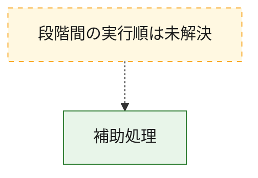
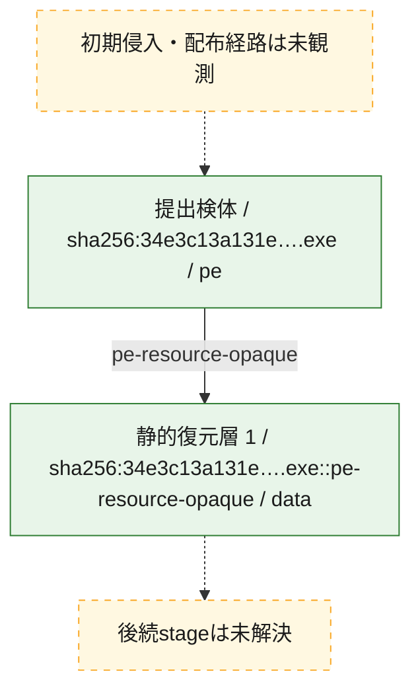
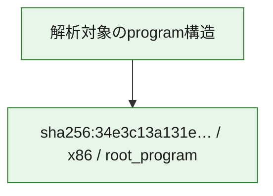

# 全体ロジック：34e3c13a131e3007871f8aa542b61888c30ebad1d61af0141d88f26c9ad68466

代表関数から主要なmalware処理段階を自動分類できませんでした。

## 読み方

- phaseの掲載順は解析上の整理順です。observed_call_edgesがない段階間の実行順を断定しません。
- 図の実線は静的に観測した関係、点線と黄色のノードは未観測・未解決の関係を示します。
- 図は静的な要約であり、動的実行を再現するものではありません。
- 詳細な関数解説とfingerprintは[STATIC-LOGIC.md](STATIC-LOGIC.md)を参照してください。

## 静的可視化

### 実行フロー

### 感染チェーン

### モジュール関係

## 処理段階

### 1. 補助処理

主要処理を支える一般内部関数またはlibrary処理を確認します。
確度: `confirmed_static_function_evidence`

- `34e3c13a131e3007871f8aa542b61888c30ebad1d61af0141d88f26c9ad68466:ghidra:0040100b` — 検体内部の一般処理を実装する関数です。 状態: `succeeded`、選定理由: `context_representative`, `small_program_complete_context`
- `34e3c13a131e3007871f8aa542b61888c30ebad1d61af0141d88f26c9ad68466:ghidra:0040108f` — 検体内部の一般処理を実装する関数です。 状態: `succeeded`、選定理由: `context_representative`, `reviewed_call_centrality:2`, `small_program_complete_context`
- `34e3c13a131e3007871f8aa542b61888c30ebad1d61af0141d88f26c9ad68466:ghidra:0040160d` — 検体内部の一般処理を実装する関数です。 状態: `succeeded`、選定理由: `context_representative`, `reviewed_call_centrality:4`, `small_program_complete_context`
- `34e3c13a131e3007871f8aa542b61888c30ebad1d61af0141d88f26c9ad68466:ghidra:00401719` — 検体内部の一般処理を実装する関数です。 状態: `succeeded`、選定理由: `context_representative`, `reviewed_call_centrality:6`, `small_program_complete_context`
- `34e3c13a131e3007871f8aa542b61888c30ebad1d61af0141d88f26c9ad68466:ghidra:0040181e` — 検体内部の一般処理を実装する関数です。 状態: `succeeded`、選定理由: `context_representative`, `reviewed_call_centrality:1`, `small_program_complete_context`
- `34e3c13a131e3007871f8aa542b61888c30ebad1d61af0141d88f26c9ad68466:ghidra:0040184b` — 検体内部の一般処理を実装する関数です。 状態: `succeeded`、選定理由: `context_representative`, `reviewed_call_centrality:7`, `small_program_complete_context`
- `34e3c13a131e3007871f8aa542b61888c30ebad1d61af0141d88f26c9ad68466:ghidra:00401993` — 検体内部の一般処理を実装する関数です。 状態: `succeeded`、選定理由: `context_representative`, `reviewed_call_centrality:4`, `small_program_complete_context`
- `34e3c13a131e3007871f8aa542b61888c30ebad1d61af0141d88f26c9ad68466:ghidra:00401a52` — 検体内部の一般処理を実装する関数です。 状態: `succeeded`、選定理由: `context_representative`, `reviewed_call_centrality:1`, `small_program_complete_context`

## 観測したcall関係

- `ghidra-function:078e7698f6d0f99404bfb3a9` → `ghidra-external:682ec687a39fe0ada7732ff1` （`unclassified` → `unclassified`）
- `ghidra-function:078e7698f6d0f99404bfb3a9` → `ghidra-external:faa889370cd97232344e8b84` （`unclassified` → `unclassified`）
- `ghidra-function:7c93f0860859ae1679c69d5b` → `ghidra-external:c27010b91cea171b9f5de6cb` （`unclassified` → `unclassified`）
- `ghidra-function:8ec48da52ba48234264dde0f` → `ghidra-external:1d19c507465f402df4aeb587` （`unclassified` → `unclassified`）
- `ghidra-function:8ec48da52ba48234264dde0f` → `ghidra-external:7c73aec8195581d4f36fb2bf` （`unclassified` → `unclassified`）
- `ghidra-function:8ec48da52ba48234264dde0f` → `ghidra-external:854c278e6729d91fad7a34b8` （`unclassified` → `unclassified`）
- `ghidra-function:8ec48da52ba48234264dde0f` → `ghidra-external:c27010b91cea171b9f5de6cb` （`unclassified` → `unclassified`）
- `ghidra-function:a4f389c7977ee908afab7bcb` → `ghidra-external:31fbbc5687e0ffd21f334eae` （`unclassified` → `unclassified`）
- `ghidra-function:a4f389c7977ee908afab7bcb` → `ghidra-external:84e1299a1ac4f529f217a9ca` （`unclassified` → `unclassified`）
- `ghidra-function:a4f389c7977ee908afab7bcb` → `ghidra-external:98e468dd7f8623761161a248` （`unclassified` → `unclassified`）
- `ghidra-function:a4f389c7977ee908afab7bcb` → `ghidra-external:d2439afd4029f4f86ffe10a4` （`unclassified` → `unclassified`）
- `ghidra-function:a4f389c7977ee908afab7bcb` → `ghidra-external:d6e6729b85ab9ad533099efb` （`unclassified` → `unclassified`）
- `ghidra-function:a4f389c7977ee908afab7bcb` → `ghidra-external:d86af2e138cefb13c433df4c` （`unclassified` → `unclassified`）
- `ghidra-function:a4f389c7977ee908afab7bcb` → `ghidra-external:faa889370cd97232344e8b84` （`unclassified` → `unclassified`）
- `ghidra-function:c3441a332fb37355dcda8ee4` → `ghidra-external:11e0b030a50f88dca539240b` （`unclassified` → `unclassified`）
- `ghidra-function:c8f5fbed24ee80bf95d4def7` → `ghidra-external:02bd94043d15bb8b012724fd` （`unclassified` → `unclassified`）
- `ghidra-function:c8f5fbed24ee80bf95d4def7` → `ghidra-external:3b7e61128b9ead6c2338383f` （`unclassified` → `unclassified`）
- `ghidra-function:c8f5fbed24ee80bf95d4def7` → `ghidra-external:650b3bcc5357ff50c8d8f5e6` （`unclassified` → `unclassified`）
- `ghidra-function:c8f5fbed24ee80bf95d4def7` → `ghidra-external:f632fce94393bf7af883cd30` （`unclassified` → `unclassified`）
- `ghidra-function:e43ee67a7ae3a757b67e58e0` → `ghidra-external:7587fe53f390bc2c4d9d3431` （`unclassified` → `unclassified`）
- `ghidra-function:e43ee67a7ae3a757b67e58e0` → `ghidra-external:8983fa9ccb425101f32026f3` （`unclassified` → `unclassified`）
- `ghidra-function:e43ee67a7ae3a757b67e58e0` → `ghidra-external:b5798ba2a44b54fbddbf498e` （`unclassified` → `unclassified`）
- `ghidra-function:e43ee67a7ae3a757b67e58e0` → `ghidra-external:ca68eba3084e4a04ca9da4c9` （`unclassified` → `unclassified`）
- `ghidra-function:e43ee67a7ae3a757b67e58e0` → `ghidra-external:e5ff8239142b92e9f46f2c72` （`unclassified` → `unclassified`）
- `ghidra-function:e43ee67a7ae3a757b67e58e0` → `ghidra-external:e9735ec46276b1d3504ccc8a` （`unclassified` → `unclassified`）

## 解析範囲と制約

- 選定外関数は全体inventoryへ残しますが、関数本体の個別解説対象にはしていません。
- indirect call、難読化、packer、VM、壊れたcontrol flowによりcall関係が欠落する場合があります。
- 文書は静的解析に基づき、検体実行や外部通信による動的確認は行っていません。
