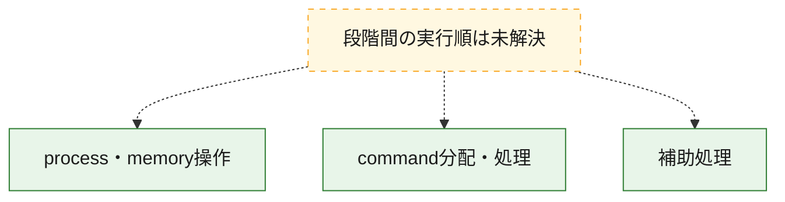
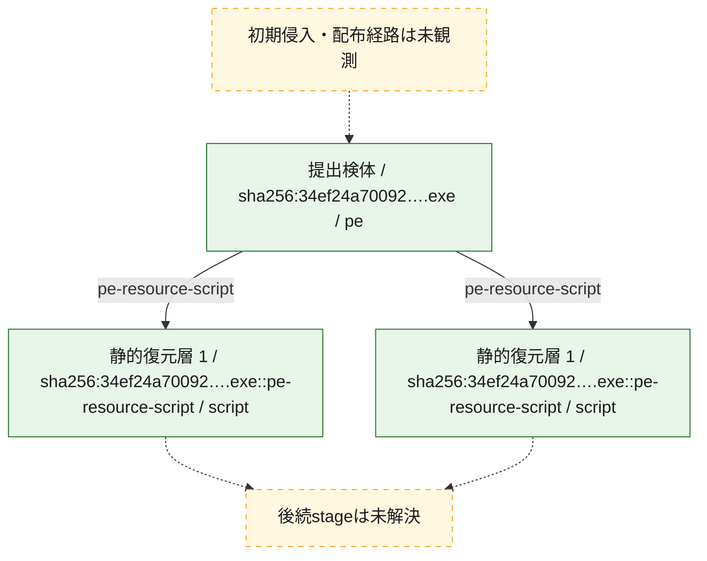
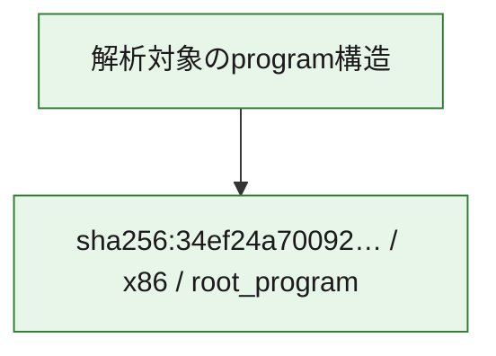

# 全体ロジック：34ef24a700926ba1de3366a617dae590fa087fb7a37942bb8ffe51fbe468872c

代表関数の静的証跡から、process・memory操作、command分配・処理の処理群を確認しました。

## 読み方

- phaseの掲載順は解析上の整理順です。observed_call_edgesがない段階間の実行順を断定しません。
- 図の実線は静的に観測した関係、点線と黄色のノードは未観測・未解決の関係を示します。
- 図は静的な要約であり、動的実行を再現するものではありません。
- 詳細な関数解説とfingerprintは[STATIC-LOGIC.md](STATIC-LOGIC.md)を参照してください。

## 静的可視化

### 実行フロー

### 感染チェーン

### モジュール関係

## 処理段階

### 1. process・memory操作

process、thread、module、memory操作と実行移行を確認します。
確度: `confirmed_static_function_evidence`

- `34ef24a700926ba1de3366a617dae590fa087fb7a37942bb8ffe51fbe468872c:ghidra:1800011d0` — process、thread、module、またはmemory操作に関係する関数です。 状態: `succeeded`、選定理由: `context_representative`, `reviewed_call_centrality:7`, `role:process_or_memory_operation`
- `34ef24a700926ba1de3366a617dae590fa087fb7a37942bb8ffe51fbe468872c:ghidra:180001250` — process、thread、module、またはmemory操作に関係する関数です。 状態: `succeeded`、選定理由: `context_representative`, `reviewed_call_centrality:7`, `role:process_or_memory_operation`
- `34ef24a700926ba1de3366a617dae590fa087fb7a37942bb8ffe51fbe468872c:ghidra:1800012d0` — process、thread、module、またはmemory操作に関係する関数です。 状態: `succeeded`、選定理由: `context_representative`, `reviewed_call_centrality:7`, `role:process_or_memory_operation`
- `34ef24a700926ba1de3366a617dae590fa087fb7a37942bb8ffe51fbe468872c:ghidra:180001350` — process、thread、module、またはmemory操作に関係する関数です。 状態: `succeeded`、選定理由: `context_representative`, `reviewed_call_centrality:7`, `role:process_or_memory_operation`
- `34ef24a700926ba1de3366a617dae590fa087fb7a37942bb8ffe51fbe468872c:ghidra:180001430` — process、thread、module、またはmemory操作に関係する関数です。 状態: `succeeded`、選定理由: `context_representative`, `reviewed_call_centrality:7`, `role:process_or_memory_operation`
- `34ef24a700926ba1de3366a617dae590fa087fb7a37942bb8ffe51fbe468872c:ghidra:1800014b0` — process、thread、module、またはmemory操作に関係する関数です。 状態: `succeeded`、選定理由: `context_representative`, `reviewed_call_centrality:7`, `role:process_or_memory_operation`
- `34ef24a700926ba1de3366a617dae590fa087fb7a37942bb8ffe51fbe468872c:ghidra:180001530` — process、thread、module、またはmemory操作に関係する関数です。 状態: `succeeded`、選定理由: `context_representative`, `reviewed_call_centrality:7`, `role:process_or_memory_operation`
- `34ef24a700926ba1de3366a617dae590fa087fb7a37942bb8ffe51fbe468872c:ghidra:1800015c0` — process、thread、module、またはmemory操作に関係する関数です。 状態: `succeeded`、選定理由: `context_representative`, `reviewed_call_centrality:7`, `role:process_or_memory_operation`
- `34ef24a700926ba1de3366a617dae590fa087fb7a37942bb8ffe51fbe468872c:ghidra:180001650` — process、thread、module、またはmemory操作に関係する関数です。 状態: `succeeded`、選定理由: `context_representative`, `reviewed_call_centrality:7`, `role:process_or_memory_operation`

### 2. command分配・処理

受信commandやtaskの解釈、分配、個別handlerへの移行を確認します。
確度: `confirmed_static_function_evidence`

- `34ef24a700926ba1de3366a617dae590fa087fb7a37942bb8ffe51fbe468872c:ghidra:1800050a0` — commandの解釈、分配、または個別処理を担当する関数です。 状態: `succeeded`、選定理由: `entry_point`, `meaningful_symbol_name`, `reviewed_call_centrality:7`, `role:command_dispatch_or_handler`
- `34ef24a700926ba1de3366a617dae590fa087fb7a37942bb8ffe51fbe468872c:ghidra:1800054b0` — commandの解釈、分配、または個別処理を担当する関数です。 状態: `succeeded`、選定理由: `entry_point`, `meaningful_symbol_name`, `reviewed_call_centrality:6`, `role:command_dispatch_or_handler`

### 3. 補助処理

主要処理を支える一般内部関数またはlibrary処理を確認します。
確度: `confirmed_static_function_evidence`

- `34ef24a700926ba1de3366a617dae590fa087fb7a37942bb8ffe51fbe468872c:ghidra:180001000` — 検体内部の一般処理を実装する関数です。 状態: `succeeded`、選定理由: `context_representative`, `reviewed_call_centrality:3`
- `34ef24a700926ba1de3366a617dae590fa087fb7a37942bb8ffe51fbe468872c:ghidra:180001050` — 検体内部の一般処理を実装する関数です。 状態: `succeeded`、選定理由: `context_representative`, `reviewed_call_centrality:1`
- `34ef24a700926ba1de3366a617dae590fa087fb7a37942bb8ffe51fbe468872c:ghidra:180001090` — 検体内部の一般処理を実装する関数です。 状態: `succeeded`、選定理由: `context_representative`, `reviewed_call_centrality:2`
- `34ef24a700926ba1de3366a617dae590fa087fb7a37942bb8ffe51fbe468872c:ghidra:180001100` — 検体内部の一般処理を実装する関数です。 状態: `succeeded`、選定理由: `context_representative`, `reviewed_call_centrality:6`
- `34ef24a700926ba1de3366a617dae590fa087fb7a37942bb8ffe51fbe468872c:ghidra:1800011a0` — 検体内部の一般処理を実装する関数です。 状態: `succeeded`、選定理由: `context_representative`, `reviewed_call_centrality:1`
- `34ef24a700926ba1de3366a617dae590fa087fb7a37942bb8ffe51fbe468872c:ghidra:1800011b0` — 検体内部の一般処理を実装する関数です。 状態: `succeeded`、選定理由: `context_representative`, `reviewed_call_centrality:1`
- `34ef24a700926ba1de3366a617dae590fa087fb7a37942bb8ffe51fbe468872c:ghidra:1800011c0` — 検体内部の一般処理を実装する関数です。 状態: `succeeded`、選定理由: `context_representative`, `reviewed_call_centrality:1`
- `34ef24a700926ba1de3366a617dae590fa087fb7a37942bb8ffe51fbe468872c:ghidra:1800013d0` — 検体内部の一般処理を実装する関数です。 状態: `succeeded`、選定理由: `context_representative`, `reviewed_call_centrality:1`
- `34ef24a700926ba1de3366a617dae590fa087fb7a37942bb8ffe51fbe468872c:ghidra:1800013e0` — 検体内部の一般処理を実装する関数です。 状態: `succeeded`、選定理由: `context_representative`, `reviewed_call_centrality:1`
- `34ef24a700926ba1de3366a617dae590fa087fb7a37942bb8ffe51fbe468872c:ghidra:1800013f0` — 検体内部の一般処理を実装する関数です。 状態: `succeeded`、選定理由: `context_representative`, `reviewed_call_centrality:1`
- `34ef24a700926ba1de3366a617dae590fa087fb7a37942bb8ffe51fbe468872c:ghidra:180001400` — 検体内部の一般処理を実装する関数です。 状態: `succeeded`、選定理由: `context_representative`, `reviewed_call_centrality:1`
- `34ef24a700926ba1de3366a617dae590fa087fb7a37942bb8ffe51fbe468872c:ghidra:180001410` — 検体内部の一般処理を実装する関数です。 状態: `succeeded`、選定理由: `context_representative`, `reviewed_call_centrality:1`
- `34ef24a700926ba1de3366a617dae590fa087fb7a37942bb8ffe51fbe468872c:ghidra:180001420` — 検体内部の一般処理を実装する関数です。 状態: `succeeded`、選定理由: `context_representative`, `reviewed_call_centrality:1`
- `34ef24a700926ba1de3366a617dae590fa087fb7a37942bb8ffe51fbe468872c:ghidra:1800015b0` — 検体内部の一般処理を実装する関数です。 状態: `succeeded`、選定理由: `context_representative`, `reviewed_call_centrality:1`
- `34ef24a700926ba1de3366a617dae590fa087fb7a37942bb8ffe51fbe468872c:ghidra:180001640` — 検体内部の一般処理を実装する関数です。 状態: `succeeded`、選定理由: `context_representative`, `reviewed_call_centrality:1`
- `34ef24a700926ba1de3366a617dae590fa087fb7a37942bb8ffe51fbe468872c:ghidra:180004c60` — 検体内部の一般処理を実装する関数です。 状態: `succeeded`、選定理由: `entry_point`, `meaningful_symbol_name`
- `34ef24a700926ba1de3366a617dae590fa087fb7a37942bb8ffe51fbe468872c:ghidra:1800053a0` — 検体内部の一般処理を実装する関数です。 状態: `succeeded`、選定理由: `entry_point`, `meaningful_symbol_name`, `reviewed_call_centrality:2`
- `34ef24a700926ba1de3366a617dae590fa087fb7a37942bb8ffe51fbe468872c:ghidra:180005410` — 検体内部の一般処理を実装する関数です。 状態: `succeeded`、選定理由: `entry_point`, `meaningful_symbol_name`, `reviewed_call_centrality:4`
- `34ef24a700926ba1de3366a617dae590fa087fb7a37942bb8ffe51fbe468872c:ghidra:1800055d0` — 検体内部の一般処理を実装する関数です。 状態: `succeeded`、選定理由: `meaningful_symbol_name`
- `34ef24a700926ba1de3366a617dae590fa087fb7a37942bb8ffe51fbe468872c:ghidra:180008160` — 検体内部の一般処理を実装する関数です。 状態: `succeeded`、選定理由: `entry_point`, `meaningful_symbol_name`
- `34ef24a700926ba1de3366a617dae590fa087fb7a37942bb8ffe51fbe468872c:ghidra:1800081a0` — 検体内部の一般処理を実装する関数です。 状態: `succeeded`、選定理由: `entry_point`, `meaningful_symbol_name`

## 観測したcall関係

- 代表関数間で直接解決できた呼出関係はありません。

## 解析範囲と制約

- 選定外関数は全体inventoryへ残しますが、関数本体の個別解説対象にはしていません。
- indirect call、難読化、packer、VM、壊れたcontrol flowによりcall関係が欠落する場合があります。
- 文書は静的解析に基づき、検体実行や外部通信による動的確認は行っていません。
