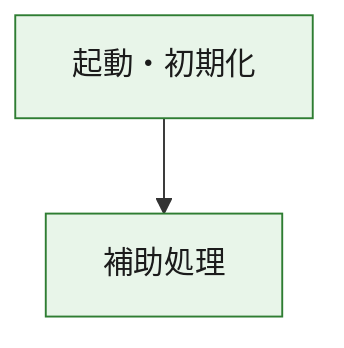
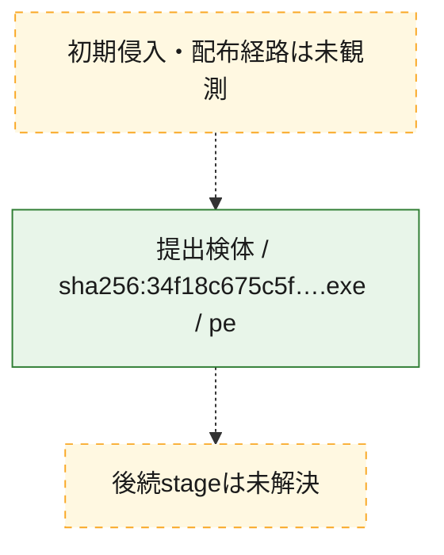
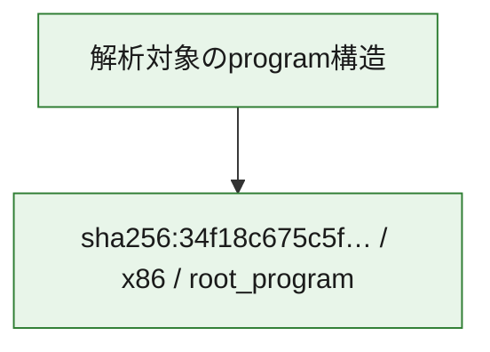

# 全体ロジック：34f18c675c5f2451688b4fb144b1d0e7b80ee905664fdcc00686e402e4009126

代表関数の静的証跡から、起動・初期化の処理群を確認しました。

## 読み方

- phaseの掲載順は解析上の整理順です。observed_call_edgesがない段階間の実行順を断定しません。
- 図の実線は静的に観測した関係、点線と黄色のノードは未観測・未解決の関係を示します。
- 図は静的な要約であり、動的実行を再現するものではありません。
- 詳細な関数解説とfingerprintは[STATIC-LOGIC.md](STATIC-LOGIC.md)を参照してください。

## 静的可視化

### 実行フロー

### 感染チェーン

### モジュール関係

## 処理段階

### 1. 起動・初期化

entry pointから初期化と後続処理への移行を確認します。
確度: `confirmed_static_function_evidence`

- `34f18c675c5f2451688b4fb144b1d0e7b80ee905664fdcc00686e402e4009126:ghidra:180001010` — 初期化と主要処理への分岐を行う入口関数です。 状態: `succeeded`、選定理由: `entry_point`, `meaningful_symbol_name`, `reviewed_call_centrality:22`, `role:entrypoint`, `small_program_complete_context`

### 2. 補助処理

主要処理を支える一般内部関数またはlibrary処理を確認します。
確度: `confirmed_static_function_evidence`

- `34f18c675c5f2451688b4fb144b1d0e7b80ee905664fdcc00686e402e4009126:ghidra:180001240` — 検体内部の一般処理を実装する関数です。 状態: `succeeded`、選定理由: `context_representative`, `reviewed_call_centrality:2`, `small_program_complete_context`
- `34f18c675c5f2451688b4fb144b1d0e7b80ee905664fdcc00686e402e4009126:ghidra:180001350` — 検体内部の一般処理を実装する関数です。 状態: `succeeded`、選定理由: `context_representative`, `reviewed_call_centrality:25`, `small_program_complete_context`
- `34f18c675c5f2451688b4fb144b1d0e7b80ee905664fdcc00686e402e4009126:ghidra:180003780` — 検体内部の一般処理を実装する関数です。 状態: `succeeded`、選定理由: `context_representative`, `reviewed_call_centrality:2`, `small_program_complete_context`
- `34f18c675c5f2451688b4fb144b1d0e7b80ee905664fdcc00686e402e4009126:ghidra:1800038e0` — 検体内部の一般処理を実装する関数です。 状態: `succeeded`、選定理由: `context_representative`, `reviewed_call_centrality:2`, `small_program_complete_context`

## 観測したcall関係

- `34f18c675c5f2451688b4fb144b1d0e7b80ee905664fdcc00686e402e4009126:ghidra:180001010` → `34f18c675c5f2451688b4fb144b1d0e7b80ee905664fdcc00686e402e4009126:ghidra:180001240` （`startup` → `support`）
- `34f18c675c5f2451688b4fb144b1d0e7b80ee905664fdcc00686e402e4009126:ghidra:180001010` → `34f18c675c5f2451688b4fb144b1d0e7b80ee905664fdcc00686e402e4009126:ghidra:180001350` （`startup` → `support`）
- `34f18c675c5f2451688b4fb144b1d0e7b80ee905664fdcc00686e402e4009126:ghidra:180001350` → `34f18c675c5f2451688b4fb144b1d0e7b80ee905664fdcc00686e402e4009126:ghidra:180001240` （`support` → `support`）
- `34f18c675c5f2451688b4fb144b1d0e7b80ee905664fdcc00686e402e4009126:ghidra:180001350` → `34f18c675c5f2451688b4fb144b1d0e7b80ee905664fdcc00686e402e4009126:ghidra:180003780` （`support` → `support`）
- `34f18c675c5f2451688b4fb144b1d0e7b80ee905664fdcc00686e402e4009126:ghidra:180001350` → `34f18c675c5f2451688b4fb144b1d0e7b80ee905664fdcc00686e402e4009126:ghidra:1800038e0` （`support` → `support`）
- `34f18c675c5f2451688b4fb144b1d0e7b80ee905664fdcc00686e402e4009126:ghidra:180003780` → `34f18c675c5f2451688b4fb144b1d0e7b80ee905664fdcc00686e402e4009126:ghidra:1800038e0` （`support` → `support`）
- `ghidra-function:55b8799f62a080d3e6cb21dd` → `ghidra-function:1d606e65902610333dbe3be5` （`unclassified` → `unclassified`）
- `ghidra-function:b0bb177a66f032f0f36c700b` → `ghidra-external:07addf000cdd7528852cc822` （`unclassified` → `unclassified`）
- `ghidra-function:b0bb177a66f032f0f36c700b` → `ghidra-external:117bee1eb402f2d1a57936b0` （`unclassified` → `unclassified`）
- `ghidra-function:b0bb177a66f032f0f36c700b` → `ghidra-external:17101170450c91e50c1d758e` （`unclassified` → `unclassified`）
- `ghidra-function:b0bb177a66f032f0f36c700b` → `ghidra-external:46cc1ee5983ecc2c27bf8626` （`unclassified` → `unclassified`）
- `ghidra-function:b0bb177a66f032f0f36c700b` → `ghidra-external:550c990cd67ca90777b69deb` （`unclassified` → `unclassified`）
- `ghidra-function:b0bb177a66f032f0f36c700b` → `ghidra-external:55b09120d0566bb7e18924dc` （`unclassified` → `unclassified`）
- `ghidra-function:b0bb177a66f032f0f36c700b` → `ghidra-external:599e346590358dd8401c9cf9` （`unclassified` → `unclassified`）
- `ghidra-function:b0bb177a66f032f0f36c700b` → `ghidra-external:5b0e3e96919dc872c2aa9b27` （`unclassified` → `unclassified`）
- `ghidra-function:b0bb177a66f032f0f36c700b` → `ghidra-external:7b8c3bc422f58bed768df8cf` （`unclassified` → `unclassified`）
- `ghidra-function:b0bb177a66f032f0f36c700b` → `ghidra-external:8a3fd224a64b5a98185aeede` （`unclassified` → `unclassified`）
- `ghidra-function:b0bb177a66f032f0f36c700b` → `ghidra-external:9242a0311d2c4a891413d974` （`unclassified` → `unclassified`）
- `ghidra-function:b0bb177a66f032f0f36c700b` → `ghidra-external:9ff0f1823bd60f9d7cc3b17b` （`unclassified` → `unclassified`）
- `ghidra-function:b0bb177a66f032f0f36c700b` → `ghidra-external:a9321c7746cc07b324bf4425` （`unclassified` → `unclassified`）
- `ghidra-function:b0bb177a66f032f0f36c700b` → `ghidra-external:ab10b57dcad3ca140c494900` （`unclassified` → `unclassified`）
- `ghidra-function:b0bb177a66f032f0f36c700b` → `ghidra-external:b0c30227ee422b8b72ec51ce` （`unclassified` → `unclassified`）
- `ghidra-function:b0bb177a66f032f0f36c700b` → `ghidra-external:b2fa4ab0cdec13aeb0c68692` （`unclassified` → `unclassified`）
- `ghidra-function:b0bb177a66f032f0f36c700b` → `ghidra-external:c50c1cd93202f43a5617a7cc` （`unclassified` → `unclassified`）
- `ghidra-function:b0bb177a66f032f0f36c700b` → `ghidra-external:cb00ef25d6d1e259027df64b` （`unclassified` → `unclassified`）
- `ghidra-function:b0bb177a66f032f0f36c700b` → `ghidra-external:db5776cb3ac7a7b0fc5566a3` （`unclassified` → `unclassified`）
- `ghidra-function:b0bb177a66f032f0f36c700b` → `ghidra-external:e11e0be5aaefd092a75561a9` （`unclassified` → `unclassified`）
- `ghidra-function:b0bb177a66f032f0f36c700b` → `ghidra-external:fd9a800055cee3d4827ddaa1` （`unclassified` → `unclassified`）
- `ghidra-function:b0bb177a66f032f0f36c700b` → `ghidra-function:1d606e65902610333dbe3be5` （`unclassified` → `unclassified`）
- `ghidra-function:b0bb177a66f032f0f36c700b` → `ghidra-function:55b8799f62a080d3e6cb21dd` （`unclassified` → `unclassified`）
- `ghidra-function:b0bb177a66f032f0f36c700b` → `ghidra-function:d875fecfd2a03ca5fe86fee9` （`unclassified` → `unclassified`）
- `ghidra-function:d2c867586e467e1d781f7059` → `ghidra-function:00c3c7b52d21cdfe6c8e5f82` （`unclassified` → `unclassified`）
- `ghidra-function:d2c867586e467e1d781f7059` → `ghidra-function:09260ccaf126522ee9e4ff3a` （`unclassified` → `unclassified`）
- `ghidra-function:d2c867586e467e1d781f7059` → `ghidra-function:0aa05b2e7b5f898a86d1abc1` （`unclassified` → `unclassified`）
- `ghidra-function:d2c867586e467e1d781f7059` → `ghidra-function:3e9d0d82642f7700be8c1fcd` （`unclassified` → `unclassified`）
- `ghidra-function:d2c867586e467e1d781f7059` → `ghidra-function:5c17d6a78b8407fb9d291b31` （`unclassified` → `unclassified`）
- `ghidra-function:d2c867586e467e1d781f7059` → `ghidra-function:61c5f69ec71263ebc94ce986` （`unclassified` → `unclassified`）
- `ghidra-function:d2c867586e467e1d781f7059` → `ghidra-function:6b35e3d606c939873c9e05c7` （`unclassified` → `unclassified`）
- `ghidra-function:d2c867586e467e1d781f7059` → `ghidra-function:73c179dfc4275b45ce558706` （`unclassified` → `unclassified`）
- `ghidra-function:d2c867586e467e1d781f7059` → `ghidra-function:7c66d30a93d7ed6f2a8e1a26` （`unclassified` → `unclassified`）
- `ghidra-function:d2c867586e467e1d781f7059` → `ghidra-function:9180c74ef76cd7ca04be7c88` （`unclassified` → `unclassified`）
- `ghidra-function:d2c867586e467e1d781f7059` → `ghidra-function:b0bb177a66f032f0f36c700b` （`unclassified` → `unclassified`）
- `ghidra-function:d2c867586e467e1d781f7059` → `ghidra-function:d875fecfd2a03ca5fe86fee9` （`unclassified` → `unclassified`）

## 解析範囲と制約

- 選定外関数は全体inventoryへ残しますが、関数本体の個別解説対象にはしていません。
- indirect call、難読化、packer、VM、壊れたcontrol flowによりcall関係が欠落する場合があります。
- 文書は静的解析に基づき、検体実行や外部通信による動的確認は行っていません。
