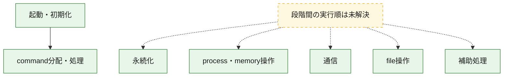
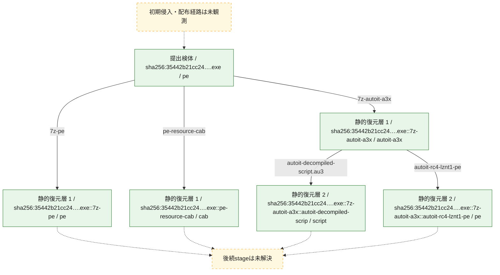
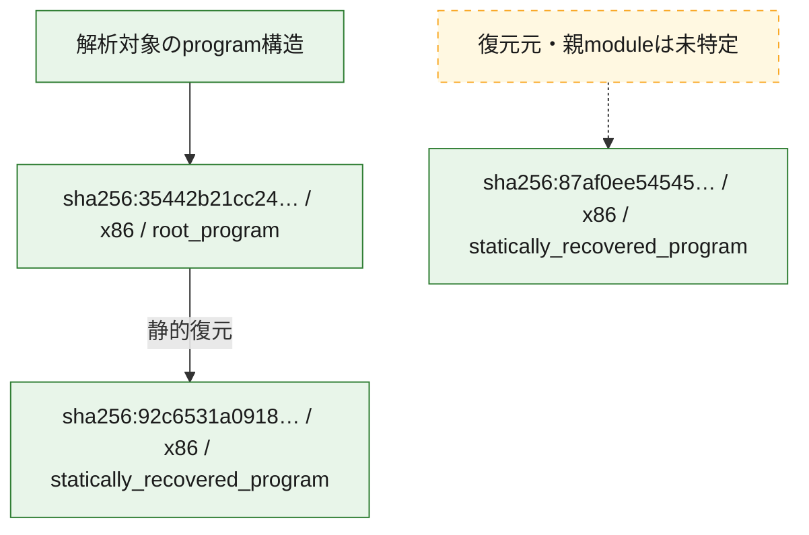

# 全体ロジック：35442b21cc246eb8070491778f7421079038ffe9a950285c39441780692d7ada

代表関数の静的証跡から、起動・初期化、永続化、process・memory操作、通信、command分配・処理、file操作の処理群を確認しました。

## 読み方

- phaseの掲載順は解析上の整理順です。observed_call_edgesがない段階間の実行順を断定しません。
- 図の実線は静的に観測した関係、点線と黄色のノードは未観測・未解決の関係を示します。
- 図は静的な要約であり、動的実行を再現するものではありません。
- 詳細な関数解説とfingerprintは[STATIC-LOGIC.md](STATIC-LOGIC.md)を参照してください。

## 静的可視化

### 実行フロー

### 感染チェーン

### モジュール関係

## 処理段階

### 1. 起動・初期化

entry pointから初期化と後続処理への移行を確認します。
確度: `confirmed_static_function_evidence`

- `92c6531a09180fae8b2aae7384b4cea9986762f0c271b35da09b4d0e733f9f45:ghidra:140025aa4` — 初期化と主要処理への分岐を行う入口関数です。 状態: `succeeded`、選定理由: `entry_point`, `meaningful_symbol_name`, `reviewed_call_centrality:22`, `role:entrypoint`
- `35442b21cc246eb8070491778f7421079038ffe9a950285c39441780692d7ada:ghidra:140001150` — 初期化と主要処理への分岐を行う入口関数です。 状態: `succeeded`、選定理由: `entry_point`, `meaningful_symbol_name`, `reviewed_call_centrality:18`, `role:entrypoint`

### 2. 永続化

自動起動や永続化に関係する設定変更を確認します。
確度: `confirmed_static_function_evidence`

- `35442b21cc246eb8070491778f7421079038ffe9a950285c39441780692d7ada:ghidra:140001168` — 自動起動または永続化に関係する処理を含む関数です。 状態: `succeeded`、選定理由: `context_representative`, `reviewed_call_centrality:17`, `role:persistence`

### 3. process・memory操作

process、thread、module、memory操作と実行移行を確認します。
確度: `confirmed_static_function_evidence_with_limits`

- `35442b21cc246eb8070491778f7421079038ffe9a950285c39441780692d7ada:ghidra:140001404` — process、thread、module、またはmemory操作に関係する関数です。 状態: `limited_bad_instruction_or_flow`、選定理由: `context_representative`, `reviewed_call_centrality:11`, `role:process_or_memory_operation`
- `35442b21cc246eb8070491778f7421079038ffe9a950285c39441780692d7ada:ghidra:1400018e4` — process、thread、module、またはmemory操作に関係する関数です。 状態: `succeeded`、選定理由: `context_representative`, `reviewed_call_centrality:12`, `role:process_or_memory_operation`
- `35442b21cc246eb8070491778f7421079038ffe9a950285c39441780692d7ada:ghidra:140001a08` — process、thread、module、またはmemory操作に関係する関数です。 状態: `succeeded`、選定理由: `context_representative`, `reviewed_call_centrality:28`, `role:process_or_memory_operation`
- `35442b21cc246eb8070491778f7421079038ffe9a950285c39441780692d7ada:ghidra:140002590` — process、thread、module、またはmemory操作に関係する関数です。 状態: `succeeded`、選定理由: `context_representative`, `reviewed_call_centrality:13`, `role:process_or_memory_operation`
- `35442b21cc246eb8070491778f7421079038ffe9a950285c39441780692d7ada:ghidra:140003118` — process、thread、module、またはmemory操作に関係する関数です。 状態: `succeeded`、選定理由: `context_representative`, `reviewed_call_centrality:22`, `role:process_or_memory_operation`

### 4. 通信

通信初期化、endpoint処理、送受信の役割を確認します。
確度: `confirmed_static_function_evidence`

- `92c6531a09180fae8b2aae7384b4cea9986762f0c271b35da09b4d0e733f9f45:ghidra:140001504` — 通信初期化、送受信、またはendpoint処理に関係する関数です。 状態: `succeeded`、選定理由: `context_representative`, `reviewed_call_centrality:17`, `role:network_communication`

### 5. command分配・処理

受信commandやtaskの解釈、分配、個別handlerへの移行を確認します。
確度: `confirmed_static_function_evidence_with_limits`

- `35442b21cc246eb8070491778f7421079038ffe9a950285c39441780692d7ada:ghidra:140008e30` — commandの解釈、分配、または個別処理を担当する関数です。 状態: `limited_bad_instruction_or_flow`、選定理由: `meaningful_symbol_name`, `role:command_dispatch_or_handler`

### 6. file操作

fileやdirectoryの作成、読書き、削除を確認します。
確度: `confirmed_static_function_evidence`

- `35442b21cc246eb8070491778f7421079038ffe9a950285c39441780692d7ada:ghidra:140001d28` — fileまたはdirectoryの読書き・管理に関係する関数です。 状態: `succeeded`、選定理由: `context_representative`, `reviewed_call_centrality:21`, `role:file_operation`
- `35442b21cc246eb8070491778f7421079038ffe9a950285c39441780692d7ada:ghidra:1400022f0` — fileまたはdirectoryの読書き・管理に関係する関数です。 状態: `succeeded`、選定理由: `context_representative`, `reviewed_call_centrality:15`, `role:file_operation`
- `35442b21cc246eb8070491778f7421079038ffe9a950285c39441780692d7ada:ghidra:1400026b8` — fileまたはdirectoryの読書き・管理に関係する関数です。 状態: `succeeded`、選定理由: `context_representative`, `reviewed_call_centrality:17`, `role:file_operation`
- `35442b21cc246eb8070491778f7421079038ffe9a950285c39441780692d7ada:ghidra:140002a10` — fileまたはdirectoryの読書き・管理に関係する関数です。 状態: `succeeded`、選定理由: `context_representative`, `reviewed_call_centrality:13`, `role:file_operation`
- `35442b21cc246eb8070491778f7421079038ffe9a950285c39441780692d7ada:ghidra:140002d34` — fileまたはdirectoryの読書き・管理に関係する関数です。 状態: `succeeded`、選定理由: `context_representative`, `reviewed_call_centrality:19`, `role:file_operation`
- `35442b21cc246eb8070491778f7421079038ffe9a950285c39441780692d7ada:ghidra:140003044` — fileまたはdirectoryの読書き・管理に関係する関数です。 状態: `succeeded`、選定理由: `context_representative`, `reviewed_call_centrality:12`, `role:file_operation`
- `35442b21cc246eb8070491778f7421079038ffe9a950285c39441780692d7ada:ghidra:14000332c` — fileまたはdirectoryの読書き・管理に関係する関数です。 状態: `succeeded`、選定理由: `context_representative`, `reviewed_call_centrality:4`, `role:file_operation`

### 7. 補助処理

主要処理を支える一般内部関数またはlibrary処理を確認します。
確度: `confirmed_static_function_evidence_with_limits`

- `92c6531a09180fae8b2aae7384b4cea9986762f0c271b35da09b4d0e733f9f45:ghidra:140001000` — 検体内部の一般処理を実装する関数です。 状態: `succeeded`、選定理由: `context_representative`, `reviewed_call_centrality:2`
- `92c6531a09180fae8b2aae7384b4cea9986762f0c271b35da09b4d0e733f9f45:ghidra:14000102c` — 検体内部の一般処理を実装する関数です。 状態: `succeeded`、選定理由: `context_representative`, `reviewed_call_centrality:2`
- `92c6531a09180fae8b2aae7384b4cea9986762f0c271b35da09b4d0e733f9f45:ghidra:140001048` — 検体内部の一般処理を実装する関数です。 状態: `succeeded`、選定理由: `context_representative`, `reviewed_call_centrality:2`
- `92c6531a09180fae8b2aae7384b4cea9986762f0c271b35da09b4d0e733f9f45:ghidra:140001064` — 検体内部の一般処理を実装する関数です。 状態: `succeeded`、選定理由: `context_representative`, `reviewed_call_centrality:2`
- `92c6531a09180fae8b2aae7384b4cea9986762f0c271b35da09b4d0e733f9f45:ghidra:140001080` — 検体内部の一般処理を実装する関数です。 状態: `succeeded`、選定理由: `context_representative`, `reviewed_call_centrality:2`
- `92c6531a09180fae8b2aae7384b4cea9986762f0c271b35da09b4d0e733f9f45:ghidra:1400010b0` — 検体内部の一般処理を実装する関数です。 状態: `succeeded`、選定理由: `context_representative`, `reviewed_call_centrality:2`
- `92c6531a09180fae8b2aae7384b4cea9986762f0c271b35da09b4d0e733f9f45:ghidra:1400010cc` — 検体内部の一般処理を実装する関数です。 状態: `succeeded`、選定理由: `context_representative`, `reviewed_call_centrality:2`
- `92c6531a09180fae8b2aae7384b4cea9986762f0c271b35da09b4d0e733f9f45:ghidra:1400010e8` — 検体内部の一般処理を実装する関数です。 状態: `succeeded`、選定理由: `context_representative`, `reviewed_call_centrality:2`
- `92c6531a09180fae8b2aae7384b4cea9986762f0c271b35da09b4d0e733f9f45:ghidra:140001104` — 検体内部の一般処理を実装する関数です。 状態: `succeeded`、選定理由: `context_representative`, `reviewed_call_centrality:2`
- `92c6531a09180fae8b2aae7384b4cea9986762f0c271b35da09b4d0e733f9f45:ghidra:140001120` — 検体内部の一般処理を実装する関数です。 状態: `succeeded`、選定理由: `context_representative`, `reviewed_call_centrality:2`
- `92c6531a09180fae8b2aae7384b4cea9986762f0c271b35da09b4d0e733f9f45:ghidra:140001140` — 検体内部の一般処理を実装する関数です。 状態: `succeeded`、選定理由: `context_representative`, `reviewed_call_centrality:6`
- `92c6531a09180fae8b2aae7384b4cea9986762f0c271b35da09b4d0e733f9f45:ghidra:1400012a0` — 検体内部の一般処理を実装する関数です。 状態: `succeeded`、選定理由: `context_representative`, `reviewed_call_centrality:4`
- `92c6531a09180fae8b2aae7384b4cea9986762f0c271b35da09b4d0e733f9f45:ghidra:140001314` — 検体内部の一般処理を実装する関数です。 状態: `succeeded`、選定理由: `context_representative`, `reviewed_call_centrality:2`
- `92c6531a09180fae8b2aae7384b4cea9986762f0c271b35da09b4d0e733f9f45:ghidra:140001470` — 検体内部の一般処理を実装する関数です。 状態: `succeeded`、選定理由: `context_representative`, `reviewed_call_centrality:6`
- `92c6531a09180fae8b2aae7384b4cea9986762f0c271b35da09b4d0e733f9f45:ghidra:1400015ec` — 検体内部の一般処理を実装する関数です。 状態: `succeeded`、選定理由: `context_representative`, `reviewed_call_centrality:20`
- `92c6531a09180fae8b2aae7384b4cea9986762f0c271b35da09b4d0e733f9f45:ghidra:1400017fc` — 検体内部の一般処理を実装する関数です。 状態: `succeeded`、選定理由: `context_representative`, `reviewed_call_centrality:2`
- `92c6531a09180fae8b2aae7384b4cea9986762f0c271b35da09b4d0e733f9f45:ghidra:140001834` — 検体内部の一般処理を実装する関数です。 状態: `limited_bad_instruction_or_flow`、選定理由: `context_representative`, `reviewed_call_centrality:3`
- `92c6531a09180fae8b2aae7384b4cea9986762f0c271b35da09b4d0e733f9f45:ghidra:1400018b4` — 検体内部の一般処理を実装する関数です。 状態: `limited_bad_instruction_or_flow`、選定理由: `context_representative`, `reviewed_call_centrality:4`
- `92c6531a09180fae8b2aae7384b4cea9986762f0c271b35da09b4d0e733f9f45:ghidra:14000190c` — 検体内部の一般処理を実装する関数です。 状態: `succeeded`、選定理由: `context_representative`, `reviewed_call_centrality:4`
- `92c6531a09180fae8b2aae7384b4cea9986762f0c271b35da09b4d0e733f9f45:ghidra:140001948` — 検体内部の一般処理を実装する関数です。 状態: `succeeded`、選定理由: `context_representative`, `reviewed_call_centrality:4`
- `92c6531a09180fae8b2aae7384b4cea9986762f0c271b35da09b4d0e733f9f45:ghidra:140001990` — 検体内部の一般処理を実装する関数です。 状態: `succeeded`、選定理由: `context_representative`, `reviewed_call_centrality:10`
- `92c6531a09180fae8b2aae7384b4cea9986762f0c271b35da09b4d0e733f9f45:ghidra:140001aa8` — 検体内部の一般処理を実装する関数です。 状態: `succeeded`、選定理由: `context_representative`, `reviewed_call_centrality:19`
- `92c6531a09180fae8b2aae7384b4cea9986762f0c271b35da09b4d0e733f9f45:ghidra:140001c20` — 検体内部の一般処理を実装する関数です。 状態: `succeeded`、選定理由: `context_representative`, `reviewed_call_centrality:17`
- `92c6531a09180fae8b2aae7384b4cea9986762f0c271b35da09b4d0e733f9f45:ghidra:140001da4` — 検体内部の一般処理を実装する関数です。 状態: `succeeded`、選定理由: `context_representative`, `reviewed_call_centrality:17`
- `92c6531a09180fae8b2aae7384b4cea9986762f0c271b35da09b4d0e733f9f45:ghidra:140001f8c` — 検体内部の一般処理を実装する関数です。 状態: `succeeded`、選定理由: `context_representative`, `reviewed_call_centrality:13`
- `92c6531a09180fae8b2aae7384b4cea9986762f0c271b35da09b4d0e733f9f45:ghidra:140002014` — 検体内部の一般処理を実装する関数です。 状態: `succeeded`、選定理由: `context_representative`, `reviewed_call_centrality:12`
- `92c6531a09180fae8b2aae7384b4cea9986762f0c271b35da09b4d0e733f9f45:ghidra:140002120` — 検体内部の一般処理を実装する関数です。 状態: `succeeded`、選定理由: `context_representative`, `reviewed_call_centrality:6`
- `92c6531a09180fae8b2aae7384b4cea9986762f0c271b35da09b4d0e733f9f45:ghidra:1400021d4` — 検体内部の一般処理を実装する関数です。 状態: `succeeded`、選定理由: `context_representative`, `reviewed_call_centrality:2`
- `92c6531a09180fae8b2aae7384b4cea9986762f0c271b35da09b4d0e733f9f45:ghidra:140002210` — 検体内部の一般処理を実装する関数です。 状態: `succeeded`、選定理由: `context_representative`, `reviewed_call_centrality:7`
- `92c6531a09180fae8b2aae7384b4cea9986762f0c271b35da09b4d0e733f9f45:ghidra:140024ec8` — 検体内部の一般処理を実装する関数です。 状態: `succeeded`、選定理由: `meaningful_symbol_name`
- `35442b21cc246eb8070491778f7421079038ffe9a950285c39441780692d7ada:ghidra:140001010` — 検体内部の一般処理を実装する関数です。 状態: `succeeded`、選定理由: `context_representative`, `reviewed_call_centrality:7`
- `35442b21cc246eb8070491778f7421079038ffe9a950285c39441780692d7ada:ghidra:1400010f0` — 検体内部の一般処理を実装する関数です。 状態: `succeeded`、選定理由: `context_representative`, `reviewed_call_centrality:2`
- `35442b21cc246eb8070491778f7421079038ffe9a950285c39441780692d7ada:ghidra:1400013e0` — 検体内部の一般処理を実装する関数です。 状態: `succeeded`、選定理由: `context_representative`, `reviewed_call_centrality:17`
- `35442b21cc246eb8070491778f7421079038ffe9a950285c39441780692d7ada:ghidra:140001440` — 検体内部の一般処理を実装する関数です。 状態: `succeeded`、選定理由: `context_representative`, `reviewed_call_centrality:7`
- `35442b21cc246eb8070491778f7421079038ffe9a950285c39441780692d7ada:ghidra:1400015b8` — 検体内部の一般処理を実装する関数です。 状態: `succeeded`、選定理由: `context_representative`, `reviewed_call_centrality:7`
- `35442b21cc246eb8070491778f7421079038ffe9a950285c39441780692d7ada:ghidra:1400016c0` — 検体内部の一般処理を実装する関数です。 状態: `succeeded`、選定理由: `context_representative`, `reviewed_call_centrality:2`
- `35442b21cc246eb8070491778f7421079038ffe9a950285c39441780692d7ada:ghidra:140001710` — 検体内部の一般処理を実装する関数です。 状態: `succeeded`、選定理由: `context_representative`, `reviewed_call_centrality:2`
- `35442b21cc246eb8070491778f7421079038ffe9a950285c39441780692d7ada:ghidra:14000173c` — 検体内部の一般処理を実装する関数です。 状態: `succeeded`、選定理由: `context_representative`, `reviewed_call_centrality:1`
- `35442b21cc246eb8070491778f7421079038ffe9a950285c39441780692d7ada:ghidra:140001798` — 検体内部の一般処理を実装する関数です。 状態: `succeeded`、選定理由: `context_representative`, `reviewed_call_centrality:4`
- `35442b21cc246eb8070491778f7421079038ffe9a950285c39441780692d7ada:ghidra:140001850` — 検体内部の一般処理を実装する関数です。 状態: `succeeded`、選定理由: `context_representative`, `reviewed_call_centrality:4`
- `35442b21cc246eb8070491778f7421079038ffe9a950285c39441780692d7ada:ghidra:1400019c0` — 検体内部の一般処理を実装する関数です。 状態: `succeeded`、選定理由: `context_representative`
- `35442b21cc246eb8070491778f7421079038ffe9a950285c39441780692d7ada:ghidra:1400019f0` — 検体内部の一般処理を実装する関数です。 状態: `succeeded`、選定理由: `meaningful_symbol_name`
- `35442b21cc246eb8070491778f7421079038ffe9a950285c39441780692d7ada:ghidra:140002540` — 検体内部の一般処理を実装する関数です。 状態: `succeeded`、選定理由: `context_representative`, `reviewed_call_centrality:1`
- `35442b21cc246eb8070491778f7421079038ffe9a950285c39441780692d7ada:ghidra:1400028b8` — 検体内部の一般処理を実装する関数です。 状態: `succeeded`、選定理由: `context_representative`, `reviewed_call_centrality:3`
- `35442b21cc246eb8070491778f7421079038ffe9a950285c39441780692d7ada:ghidra:1400029dc` — 検体内部の一般処理を実装する関数です。 状態: `succeeded`、選定理由: `context_representative`, `reviewed_call_centrality:1`
- `35442b21cc246eb8070491778f7421079038ffe9a950285c39441780692d7ada:ghidra:140002c98` — 検体内部の一般処理を実装する関数です。 状態: `succeeded`、選定理由: `context_representative`, `reviewed_call_centrality:2`
- `35442b21cc246eb8070491778f7421079038ffe9a950285c39441780692d7ada:ghidra:140002f8c` — 検体内部の一般処理を実装する関数です。 状態: `succeeded`、選定理由: `context_representative`, `reviewed_call_centrality:7`
- `87af0ee5454542fcd544ccc2b67e8a044aa0aac054454261d3d4cd1f95f33771:ghidra:140001000` — 検体内部の一般処理を実装する関数です。 状態: `succeeded`、選定理由: `context_representative`, `reviewed_call_centrality:4`
- `87af0ee5454542fcd544ccc2b67e8a044aa0aac054454261d3d4cd1f95f33771:ghidra:140001100` — 検体内部の一般処理を実装する関数です。 状態: `succeeded`、選定理由: `context_representative`, `reviewed_call_centrality:2`
- `87af0ee5454542fcd544ccc2b67e8a044aa0aac054454261d3d4cd1f95f33771:ghidra:140001280` — 検体内部の一般処理を実装する関数です。 状態: `succeeded`、選定理由: `context_representative`, `reviewed_call_centrality:2`
- `87af0ee5454542fcd544ccc2b67e8a044aa0aac054454261d3d4cd1f95f33771:ghidra:1400012c0` — 検体内部の一般処理を実装する関数です。 状態: `succeeded`、選定理由: `context_representative`, `reviewed_call_centrality:4`
- `87af0ee5454542fcd544ccc2b67e8a044aa0aac054454261d3d4cd1f95f33771:ghidra:140001340` — 検体内部の一般処理を実装する関数です。 状態: `succeeded`、選定理由: `context_representative`, `reviewed_call_centrality:4`
- `87af0ee5454542fcd544ccc2b67e8a044aa0aac054454261d3d4cd1f95f33771:ghidra:1400013e0` — 検体内部の一般処理を実装する関数です。 状態: `succeeded`、選定理由: `context_representative`, `reviewed_call_centrality:4`
- `87af0ee5454542fcd544ccc2b67e8a044aa0aac054454261d3d4cd1f95f33771:ghidra:1400014e0` — 検体内部の一般処理を実装する関数です。 状態: `succeeded`、選定理由: `context_representative`, `reviewed_call_centrality:7`
- `87af0ee5454542fcd544ccc2b67e8a044aa0aac054454261d3d4cd1f95f33771:ghidra:140001940` — 検体内部の一般処理を実装する関数です。 状態: `succeeded`、選定理由: `context_representative`, `reviewed_call_centrality:3`
- `87af0ee5454542fcd544ccc2b67e8a044aa0aac054454261d3d4cd1f95f33771:ghidra:140001ae0` — 検体内部の一般処理を実装する関数です。 状態: `succeeded`、選定理由: `context_representative`, `reviewed_call_centrality:2`
- `87af0ee5454542fcd544ccc2b67e8a044aa0aac054454261d3d4cd1f95f33771:ghidra:140001b60` — 検体内部の一般処理を実装する関数です。 状態: `succeeded`、選定理由: `context_representative`, `reviewed_call_centrality:3`
- `87af0ee5454542fcd544ccc2b67e8a044aa0aac054454261d3d4cd1f95f33771:ghidra:140001bc0` — 検体内部の一般処理を実装する関数です。 状態: `succeeded`、選定理由: `context_representative`, `reviewed_call_centrality:8`
- `87af0ee5454542fcd544ccc2b67e8a044aa0aac054454261d3d4cd1f95f33771:ghidra:1400020c0` — 検体内部の一般処理を実装する関数です。 状態: `succeeded`、選定理由: `context_representative`, `reviewed_call_centrality:11`
- `87af0ee5454542fcd544ccc2b67e8a044aa0aac054454261d3d4cd1f95f33771:ghidra:140002c40` — 検体内部の一般処理を実装する関数です。 状態: `succeeded`、選定理由: `context_representative`, `reviewed_call_centrality:2`
- `87af0ee5454542fcd544ccc2b67e8a044aa0aac054454261d3d4cd1f95f33771:ghidra:140002cc0` — 検体内部の一般処理を実装する関数です。 状態: `succeeded`、選定理由: `context_representative`, `reviewed_call_centrality:2`
- `87af0ee5454542fcd544ccc2b67e8a044aa0aac054454261d3d4cd1f95f33771:ghidra:140003ce0` — 検体内部の一般処理を実装する関数です。 状態: `succeeded`、選定理由: `context_representative`, `reviewed_call_centrality:1`
- `87af0ee5454542fcd544ccc2b67e8a044aa0aac054454261d3d4cd1f95f33771:ghidra:140003d20` — 検体内部の一般処理を実装する関数です。 状態: `succeeded`、選定理由: `context_representative`, `reviewed_call_centrality:1`
- `87af0ee5454542fcd544ccc2b67e8a044aa0aac054454261d3d4cd1f95f33771:ghidra:140003d60` — 検体内部の一般処理を実装する関数です。 状態: `succeeded`、選定理由: `context_representative`, `reviewed_call_centrality:5`
- `87af0ee5454542fcd544ccc2b67e8a044aa0aac054454261d3d4cd1f95f33771:ghidra:140003f40` — 検体内部の一般処理を実装する関数です。 状態: `succeeded`、選定理由: `context_representative`, `reviewed_call_centrality:10`
- `87af0ee5454542fcd544ccc2b67e8a044aa0aac054454261d3d4cd1f95f33771:ghidra:140004180` — 検体内部の一般処理を実装する関数です。 状態: `succeeded`、選定理由: `context_representative`, `reviewed_call_centrality:5`
- `87af0ee5454542fcd544ccc2b67e8a044aa0aac054454261d3d4cd1f95f33771:ghidra:140004400` — 検体内部の一般処理を実装する関数です。 状態: `succeeded`、選定理由: `context_representative`, `reviewed_call_centrality:4`
- `87af0ee5454542fcd544ccc2b67e8a044aa0aac054454261d3d4cd1f95f33771:ghidra:140004520` — 検体内部の一般処理を実装する関数です。 状態: `succeeded`、選定理由: `context_representative`, `reviewed_call_centrality:7`
- `87af0ee5454542fcd544ccc2b67e8a044aa0aac054454261d3d4cd1f95f33771:ghidra:140004680` — 検体内部の一般処理を実装する関数です。 状態: `succeeded`、選定理由: `context_representative`, `reviewed_call_centrality:9`
- `87af0ee5454542fcd544ccc2b67e8a044aa0aac054454261d3d4cd1f95f33771:ghidra:140004960` — 検体内部の一般処理を実装する関数です。 状態: `succeeded`、選定理由: `context_representative`, `reviewed_call_centrality:3`
- `87af0ee5454542fcd544ccc2b67e8a044aa0aac054454261d3d4cd1f95f33771:ghidra:1400049e0` — 検体内部の一般処理を実装する関数です。 状態: `succeeded`、選定理由: `context_representative`, `reviewed_call_centrality:5`
- `87af0ee5454542fcd544ccc2b67e8a044aa0aac054454261d3d4cd1f95f33771:ghidra:140004b80` — 検体内部の一般処理を実装する関数です。 状態: `succeeded`、選定理由: `context_representative`, `reviewed_call_centrality:8`
- `87af0ee5454542fcd544ccc2b67e8a044aa0aac054454261d3d4cd1f95f33771:ghidra:140004d20` — 検体内部の一般処理を実装する関数です。 状態: `succeeded`、選定理由: `context_representative`, `reviewed_call_centrality:8`
- `87af0ee5454542fcd544ccc2b67e8a044aa0aac054454261d3d4cd1f95f33771:ghidra:140004f00` — 検体内部の一般処理を実装する関数です。 状態: `succeeded`、選定理由: `context_representative`, `reviewed_call_centrality:5`
- `87af0ee5454542fcd544ccc2b67e8a044aa0aac054454261d3d4cd1f95f33771:ghidra:140005040` — 検体内部の一般処理を実装する関数です。 状態: `succeeded`、選定理由: `context_representative`, `reviewed_call_centrality:3`
- `87af0ee5454542fcd544ccc2b67e8a044aa0aac054454261d3d4cd1f95f33771:ghidra:1400050c0` — 検体内部の一般処理を実装する関数です。 状態: `succeeded`、選定理由: `context_representative`, `reviewed_call_centrality:14`
- `87af0ee5454542fcd544ccc2b67e8a044aa0aac054454261d3d4cd1f95f33771:ghidra:140005360` — 検体内部の一般処理を実装する関数です。 状態: `succeeded`、選定理由: `context_representative`, `reviewed_call_centrality:3`
- `87af0ee5454542fcd544ccc2b67e8a044aa0aac054454261d3d4cd1f95f33771:ghidra:140005560` — 検体内部の一般処理を実装する関数です。 状態: `succeeded`、選定理由: `context_representative`, `reviewed_call_centrality:3`
- `87af0ee5454542fcd544ccc2b67e8a044aa0aac054454261d3d4cd1f95f33771:ghidra:1400055c0` — 検体内部の一般処理を実装する関数です。 状態: `succeeded`、選定理由: `context_representative`, `reviewed_call_centrality:6`

## 観測したcall関係

- `92c6531a09180fae8b2aae7384b4cea9986762f0c271b35da09b4d0e733f9f45:ghidra:140025aa4` → `35442b21cc246eb8070491778f7421079038ffe9a950285c39441780692d7ada:ghidra:140008e30` （`startup` → `dispatch`）

## 解析範囲と制約

- 選定外関数は全体inventoryへ残しますが、関数本体の個別解説対象にはしていません。
- indirect call、難読化、packer、VM、壊れたcontrol flowによりcall関係が欠落する場合があります。
- 文書は静的解析に基づき、検体実行や外部通信による動的確認は行っていません。
