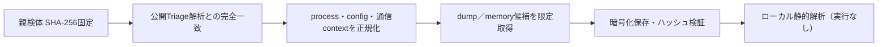

# Triage公開解析・後段取得証跡

## 完全ハッシュ一致

- [260805-ve19sa1fja](https://tria.ge/260805-ve19sa1fja): ファミリー候補 `未確定`、評価score `10`
- [260805-qqw2zsydmh](https://tria.ge/260805-qqw2zsydmh): ファミリー候補 `overlord`、評価score `10`

## プロセス・通信

- 観測process: `35442b21cc246eb8070491778f7421079038ffe9a950285c39441780692d7ada.exe, AutoIt3.exe, Explorer.EXE, HeraShield.exe, at.exe, cmd.exe, schtasks.exe`
- raw commandは保存せず、command SHA-256と処理patternだけをJSONへ保持しています。
- sandbox background trafficは`context_only`であり、C2へ自動昇格しません。

- 取得できませんでした。

## 二段目成果物

- `1c349bce8c808920f874e47e27cd4047d7013ecf6308e03934226ef9abc3ac2b` / `memory_image` / 43249664 bytes / 親と同一: `false` / 静的解析: `partial`

## 判定境界

Triage由来のfamily、process、config、通信は外部sandbox証跡です。config extractorが返したendpointはC2候補として扱えますが、
静的設定復元またはprocess帰属とprotocol応答が揃うまでは確認済みC2とはしません。取得成果物と検体は実行していません。
