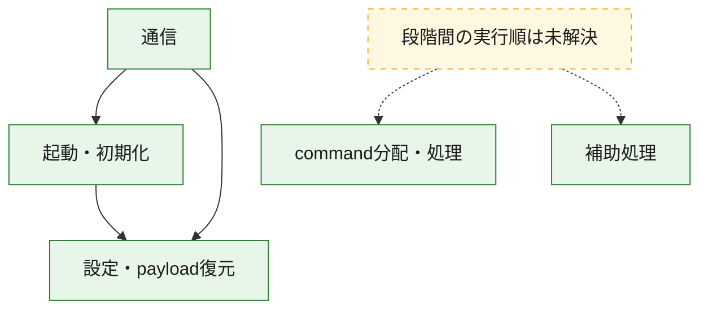
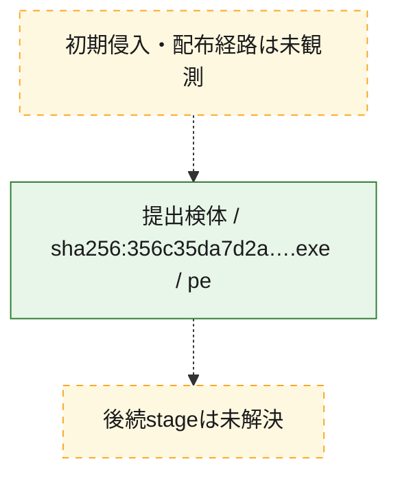
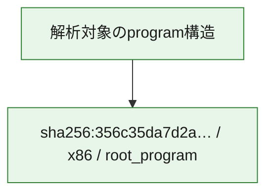

# 全体ロジック：356c35da7d2a510c0cf78eceaeb34d29ead096cb3507d6754fee3469f09250b4

代表関数の静的証跡から、起動・初期化、設定・payload復元、通信、command分配・処理の処理群を確認しました。

## 読み方

- phaseの掲載順は解析上の整理順です。observed_call_edgesがない段階間の実行順を断定しません。
- 図の実線は静的に観測した関係、点線と黄色のノードは未観測・未解決の関係を示します。
- 図は静的な要約であり、動的実行を再現するものではありません。
- 詳細な関数解説とfingerprintは[STATIC-LOGIC.md](STATIC-LOGIC.md)を参照してください。

## 静的可視化

### 実行フロー

### 感染チェーン

### モジュール関係

## 処理段階

### 1. 起動・初期化

entry pointから初期化と後続処理への移行を確認します。
確度: `confirmed_static_function_evidence`

- `356c35da7d2a510c0cf78eceaeb34d29ead096cb3507d6754fee3469f09250b4:ghidra:140009aa7` — 初期化と主要処理への分岐を行う入口関数です。 状態: `succeeded`、選定理由: `entry_point`, `meaningful_symbol_name`, `reviewed_call_centrality:7`, `role:entrypoint`
- `356c35da7d2a510c0cf78eceaeb34d29ead096cb3507d6754fee3469f09250b4:ghidra:14000fe54` — 初期化と主要処理への分岐を行う入口関数です。 状態: `succeeded`、選定理由: `entry_point`, `meaningful_symbol_name`, `probable_go_main_user_code`, `reviewed_call_centrality:23`, `role:entrypoint`

### 2. 設定・payload復元

設定、resource、payload、暗号化データの復元・変換を確認します。
確度: `confirmed_static_function_evidence`

- `356c35da7d2a510c0cf78eceaeb34d29ead096cb3507d6754fee3469f09250b4:ghidra:1400016e1` — 設定、resource、payloadなどの解析・変換を行う関数です。 状態: `succeeded`、選定理由: `meaningful_symbol_name`, `reviewed_call_centrality:1`, `role:config_or_data_transform`
- `356c35da7d2a510c0cf78eceaeb34d29ead096cb3507d6754fee3469f09250b4:ghidra:140001c94` — 設定、resource、payloadなどの解析・変換を行う関数です。 状態: `succeeded`、選定理由: `meaningful_symbol_name`, `reviewed_call_centrality:1`, `role:config_or_data_transform`
- `356c35da7d2a510c0cf78eceaeb34d29ead096cb3507d6754fee3469f09250b4:ghidra:1400022ae` — 暗号、hash、encoding、または復号処理に関係する関数です。 状態: `succeeded`、選定理由: `meaningful_symbol_name`, `reviewed_call_centrality:4`, `role:cryptographic_transform`
- `356c35da7d2a510c0cf78eceaeb34d29ead096cb3507d6754fee3469f09250b4:ghidra:140002ecc` — 暗号、hash、encoding、または復号処理に関係する関数です。 状態: `succeeded`、選定理由: `meaningful_symbol_name`, `reviewed_call_centrality:4`, `role:cryptographic_transform`
- `356c35da7d2a510c0cf78eceaeb34d29ead096cb3507d6754fee3469f09250b4:ghidra:140002fb6` — 暗号、hash、encoding、または復号処理に関係する関数です。 状態: `succeeded`、選定理由: `meaningful_symbol_name`, `reviewed_call_centrality:12`, `role:cryptographic_transform`
- `356c35da7d2a510c0cf78eceaeb34d29ead096cb3507d6754fee3469f09250b4:ghidra:1400031e9` — 設定、resource、payloadなどの解析・変換を行う関数です。 状態: `succeeded`、選定理由: `meaningful_symbol_name`, `reviewed_call_centrality:13`, `role:config_or_data_transform`
- `356c35da7d2a510c0cf78eceaeb34d29ead096cb3507d6754fee3469f09250b4:ghidra:140003c95` — 設定、resource、payloadなどの解析・変換を行う関数です。 状態: `succeeded`、選定理由: `meaningful_symbol_name`, `reviewed_call_centrality:1`, `role:config_or_data_transform`
- `356c35da7d2a510c0cf78eceaeb34d29ead096cb3507d6754fee3469f09250b4:ghidra:140005261` — 設定、resource、payloadなどの解析・変換を行う関数です。 状態: `succeeded`、選定理由: `meaningful_symbol_name`, `reviewed_call_centrality:2`, `role:config_or_data_transform`
- `356c35da7d2a510c0cf78eceaeb34d29ead096cb3507d6754fee3469f09250b4:ghidra:140005dfb` — 暗号、hash、encoding、または復号処理に関係する関数です。 状態: `succeeded`、選定理由: `meaningful_symbol_name`, `reviewed_call_centrality:2`, `role:cryptographic_transform`
- `356c35da7d2a510c0cf78eceaeb34d29ead096cb3507d6754fee3469f09250b4:ghidra:140005f7d` — 設定、resource、payloadなどの解析・変換を行う関数です。 状態: `succeeded`、選定理由: `meaningful_symbol_name`, `reviewed_call_centrality:12`, `role:config_or_data_transform`
- `356c35da7d2a510c0cf78eceaeb34d29ead096cb3507d6754fee3469f09250b4:ghidra:1400064c3` — 設定、resource、payloadなどの解析・変換を行う関数です。 状態: `succeeded`、選定理由: `meaningful_symbol_name`, `reviewed_call_centrality:9`, `role:config_or_data_transform`
- `356c35da7d2a510c0cf78eceaeb34d29ead096cb3507d6754fee3469f09250b4:ghidra:1400081f7` — 設定、resource、payloadなどの解析・変換を行う関数です。 状態: `succeeded`、選定理由: `meaningful_symbol_name`, `reviewed_call_centrality:1`, `role:config_or_data_transform`
- `356c35da7d2a510c0cf78eceaeb34d29ead096cb3507d6754fee3469f09250b4:ghidra:14000a65a` — 設定、resource、payloadなどの解析・変換を行う関数です。 状態: `succeeded`、選定理由: `meaningful_symbol_name`, `reviewed_call_centrality:7`, `role:config_or_data_transform`

### 3. 通信

通信初期化、endpoint処理、送受信の役割を確認します。
確度: `confirmed_static_function_evidence`

- `356c35da7d2a510c0cf78eceaeb34d29ead096cb3507d6754fee3469f09250b4:ghidra:140005b93` — 通信初期化、送受信、またはendpoint処理に関係する関数です。 状態: `succeeded`、選定理由: `meaningful_symbol_name`, `reviewed_call_centrality:3`, `role:network_communication`
- `356c35da7d2a510c0cf78eceaeb34d29ead096cb3507d6754fee3469f09250b4:ghidra:140006a82` — 通信初期化、送受信、またはendpoint処理に関係する関数です。 状態: `succeeded`、選定理由: `meaningful_symbol_name`, `reviewed_call_centrality:3`, `role:network_communication`
- `356c35da7d2a510c0cf78eceaeb34d29ead096cb3507d6754fee3469f09250b4:ghidra:140007682` — 通信初期化、送受信、またはendpoint処理に関係する関数です。 状態: `succeeded`、選定理由: `meaningful_symbol_name`, `reviewed_call_centrality:3`, `role:network_communication`
- `356c35da7d2a510c0cf78eceaeb34d29ead096cb3507d6754fee3469f09250b4:ghidra:140008fe9` — 通信初期化、送受信、またはendpoint処理に関係する関数です。 状態: `succeeded`、選定理由: `meaningful_symbol_name`, `reviewed_call_centrality:20`, `role:network_communication`
- `356c35da7d2a510c0cf78eceaeb34d29ead096cb3507d6754fee3469f09250b4:ghidra:140009229` — 通信初期化、送受信、またはendpoint処理に関係する関数です。 状態: `succeeded`、選定理由: `meaningful_symbol_name`, `reviewed_call_centrality:5`, `role:network_communication`
- `356c35da7d2a510c0cf78eceaeb34d29ead096cb3507d6754fee3469f09250b4:ghidra:140009586` — 通信初期化、送受信、またはendpoint処理に関係する関数です。 状態: `succeeded`、選定理由: `meaningful_symbol_name`, `reviewed_call_centrality:3`, `role:network_communication`
- `356c35da7d2a510c0cf78eceaeb34d29ead096cb3507d6754fee3469f09250b4:ghidra:1400095e5` — 通信初期化、送受信、またはendpoint処理に関係する関数です。 状態: `succeeded`、選定理由: `meaningful_symbol_name`, `reviewed_call_centrality:4`, `role:network_communication`
- `356c35da7d2a510c0cf78eceaeb34d29ead096cb3507d6754fee3469f09250b4:ghidra:140009721` — 通信初期化、送受信、またはendpoint処理に関係する関数です。 状態: `succeeded`、選定理由: `meaningful_symbol_name`, `reviewed_call_centrality:9`, `role:network_communication`
- `356c35da7d2a510c0cf78eceaeb34d29ead096cb3507d6754fee3469f09250b4:ghidra:140009e95` — 通信初期化、送受信、またはendpoint処理に関係する関数です。 状態: `succeeded`、選定理由: `meaningful_symbol_name`, `reviewed_call_centrality:3`, `role:network_communication`
- `356c35da7d2a510c0cf78eceaeb34d29ead096cb3507d6754fee3469f09250b4:ghidra:140009f89` — 通信初期化、送受信、またはendpoint処理に関係する関数です。 状態: `succeeded`、選定理由: `meaningful_symbol_name`, `reviewed_call_centrality:15`, `role:network_communication`
- `356c35da7d2a510c0cf78eceaeb34d29ead096cb3507d6754fee3469f09250b4:ghidra:14000b4f7` — 通信初期化、送受信、またはendpoint処理に関係する関数です。 状態: `succeeded`、選定理由: `meaningful_symbol_name`, `reviewed_call_centrality:11`, `role:network_communication`

### 4. command分配・処理

受信commandやtaskの解釈、分配、個別handlerへの移行を確認します。
確度: `confirmed_static_function_evidence`

- `356c35da7d2a510c0cf78eceaeb34d29ead096cb3507d6754fee3469f09250b4:ghidra:14000ae39` — commandの解釈、分配、または個別処理を担当する関数です。 状態: `succeeded`、選定理由: `meaningful_symbol_name`, `reviewed_call_centrality:5`, `role:command_dispatch_or_handler`
- `356c35da7d2a510c0cf78eceaeb34d29ead096cb3507d6754fee3469f09250b4:ghidra:14000b6b4` — commandの解釈、分配、または個別処理を担当する関数です。 状態: `succeeded`、選定理由: `meaningful_symbol_name`, `reviewed_call_centrality:5`, `role:command_dispatch_or_handler`
- `356c35da7d2a510c0cf78eceaeb34d29ead096cb3507d6754fee3469f09250b4:ghidra:14000babb` — commandの解釈、分配、または個別処理を担当する関数です。 状態: `succeeded`、選定理由: `meaningful_symbol_name`, `reviewed_call_centrality:7`, `role:command_dispatch_or_handler`

### 5. 補助処理

主要処理を支える一般内部関数またはlibrary処理を確認します。
確度: `confirmed_static_function_evidence`

- `356c35da7d2a510c0cf78eceaeb34d29ead096cb3507d6754fee3469f09250b4:ghidra:140001410` — 検体内部の一般処理を実装する関数です。 状態: `succeeded`、選定理由: `entry_point`, `meaningful_symbol_name`, `reviewed_call_centrality:1`
- `356c35da7d2a510c0cf78eceaeb34d29ead096cb3507d6754fee3469f09250b4:ghidra:1400105f0` — compiler生成処理または汎用library処理とみられる関数です。 状態: `succeeded`、選定理由: `entry_point`, `meaningful_symbol_name`, `reviewed_call_centrality:1`
- `356c35da7d2a510c0cf78eceaeb34d29ead096cb3507d6754fee3469f09250b4:ghidra:140010620` — compiler生成処理または汎用library処理とみられる関数です。 状態: `succeeded`、選定理由: `entry_point`, `meaningful_symbol_name`, `reviewed_call_centrality:2`

## 観測したcall関係

- `356c35da7d2a510c0cf78eceaeb34d29ead096cb3507d6754fee3469f09250b4:ghidra:140002fb6` → `356c35da7d2a510c0cf78eceaeb34d29ead096cb3507d6754fee3469f09250b4:ghidra:140002ecc` （`configuration` → `configuration`）
- `356c35da7d2a510c0cf78eceaeb34d29ead096cb3507d6754fee3469f09250b4:ghidra:1400031e9` → `356c35da7d2a510c0cf78eceaeb34d29ead096cb3507d6754fee3469f09250b4:ghidra:140002ecc` （`configuration` → `configuration`）
- `356c35da7d2a510c0cf78eceaeb34d29ead096cb3507d6754fee3469f09250b4:ghidra:140005dfb` → `356c35da7d2a510c0cf78eceaeb34d29ead096cb3507d6754fee3469f09250b4:ghidra:1400022ae` （`configuration` → `configuration`）
- `356c35da7d2a510c0cf78eceaeb34d29ead096cb3507d6754fee3469f09250b4:ghidra:1400064c3` → `356c35da7d2a510c0cf78eceaeb34d29ead096cb3507d6754fee3469f09250b4:ghidra:1400031e9` （`configuration` → `configuration`）
- `356c35da7d2a510c0cf78eceaeb34d29ead096cb3507d6754fee3469f09250b4:ghidra:1400064c3` → `356c35da7d2a510c0cf78eceaeb34d29ead096cb3507d6754fee3469f09250b4:ghidra:140005f7d` （`configuration` → `configuration`）
- `356c35da7d2a510c0cf78eceaeb34d29ead096cb3507d6754fee3469f09250b4:ghidra:140006a82` → `356c35da7d2a510c0cf78eceaeb34d29ead096cb3507d6754fee3469f09250b4:ghidra:140005b93` （`communication` → `communication`）
- `356c35da7d2a510c0cf78eceaeb34d29ead096cb3507d6754fee3469f09250b4:ghidra:140009229` → `356c35da7d2a510c0cf78eceaeb34d29ead096cb3507d6754fee3469f09250b4:ghidra:140008fe9` （`communication` → `communication`）
- `356c35da7d2a510c0cf78eceaeb34d29ead096cb3507d6754fee3469f09250b4:ghidra:140009721` → `356c35da7d2a510c0cf78eceaeb34d29ead096cb3507d6754fee3469f09250b4:ghidra:140002fb6` （`communication` → `configuration`）
- `356c35da7d2a510c0cf78eceaeb34d29ead096cb3507d6754fee3469f09250b4:ghidra:140009721` → `356c35da7d2a510c0cf78eceaeb34d29ead096cb3507d6754fee3469f09250b4:ghidra:140009586` （`communication` → `communication`）
- `356c35da7d2a510c0cf78eceaeb34d29ead096cb3507d6754fee3469f09250b4:ghidra:140009f89` → `356c35da7d2a510c0cf78eceaeb34d29ead096cb3507d6754fee3469f09250b4:ghidra:140009aa7` （`communication` → `startup`）
- `356c35da7d2a510c0cf78eceaeb34d29ead096cb3507d6754fee3469f09250b4:ghidra:140009f89` → `356c35da7d2a510c0cf78eceaeb34d29ead096cb3507d6754fee3469f09250b4:ghidra:140009e95` （`communication` → `communication`）
- `356c35da7d2a510c0cf78eceaeb34d29ead096cb3507d6754fee3469f09250b4:ghidra:14000b4f7` → `356c35da7d2a510c0cf78eceaeb34d29ead096cb3507d6754fee3469f09250b4:ghidra:140009f89` （`communication` → `communication`）
- `356c35da7d2a510c0cf78eceaeb34d29ead096cb3507d6754fee3469f09250b4:ghidra:14000fe54` → `356c35da7d2a510c0cf78eceaeb34d29ead096cb3507d6754fee3469f09250b4:ghidra:1400064c3` （`startup` → `configuration`）
- `ghidra-function:005eb819a38a8993ff36436e` → `ghidra-function:7436e31141c46db5d0186226` （`unclassified` → `unclassified`）
- `ghidra-function:005eb819a38a8993ff36436e` → `ghidra-function:933d84b0b916e9e596277c96` （`unclassified` → `unclassified`）
- `ghidra-function:10f94193689a026eac7de309` → `ghidra-external:36863647a89c9bad35e7a15d` （`unclassified` → `unclassified`）
- `ghidra-function:10f94193689a026eac7de309` → `ghidra-external:e1349474966d0f9368a14488` （`unclassified` → `unclassified`）
- `ghidra-function:10f94193689a026eac7de309` → `ghidra-function:935b3825c918f82cef5db414` （`unclassified` → `unclassified`）
- `ghidra-function:134cc00b5306ac410260a6b8` → `ghidra-external:54e562543412383b6432695e` （`unclassified` → `unclassified`）
- `ghidra-function:134cc00b5306ac410260a6b8` → `ghidra-external:e1349474966d0f9368a14488` （`unclassified` → `unclassified`）
- `ghidra-function:134cc00b5306ac410260a6b8` → `ghidra-function:0d67d69f0ec32e4cc3108204` （`unclassified` → `unclassified`）
- `ghidra-function:134cc00b5306ac410260a6b8` → `ghidra-function:39f5b1660e871bac31007121` （`unclassified` → `unclassified`）
- `ghidra-function:134cc00b5306ac410260a6b8` → `ghidra-function:b8068f0dc327f3100453500c` （`unclassified` → `unclassified`）
- `ghidra-function:1db43ec6c6afc7e5bcebbf42` → `ghidra-external:b107bd45ef2014b39305a99c` （`unclassified` → `unclassified`）
- `ghidra-function:1db43ec6c6afc7e5bcebbf42` → `ghidra-function:302d63cf9251ba6c805566ff` （`unclassified` → `unclassified`）
- `ghidra-function:1db43ec6c6afc7e5bcebbf42` → `ghidra-function:3c33be3607ad8dc3a99fb0eb` （`unclassified` → `unclassified`）
- `ghidra-function:1db43ec6c6afc7e5bcebbf42` → `ghidra-function:d15e959f742883d690ca8cf9` （`unclassified` → `unclassified`）
- `ghidra-function:2a6449c6faae9ad8c68d9c1d` → `ghidra-external:4ce0f4f00c1431e76fd98e3a` （`unclassified` → `unclassified`）
- `ghidra-function:2a6449c6faae9ad8c68d9c1d` → `ghidra-function:f6eab4c8b007f4ce07b8ffe5` （`unclassified` → `unclassified`）
- `ghidra-function:2e579d4cd4e1ed3e3acad848` → `ghidra-external:14cc17e6f547b8cc59ea5fba` （`unclassified` → `unclassified`）
- `ghidra-function:2e579d4cd4e1ed3e3acad848` → `ghidra-external:155dca355b18c4c362ec7e8a` （`unclassified` → `unclassified`）
- `ghidra-function:2e579d4cd4e1ed3e3acad848` → `ghidra-external:c18623a39d9076ad8ec2c759` （`unclassified` → `unclassified`）
- `ghidra-function:2e579d4cd4e1ed3e3acad848` → `ghidra-external:e1349474966d0f9368a14488` （`unclassified` → `unclassified`）
- `ghidra-function:2e579d4cd4e1ed3e3acad848` → `ghidra-function:4bd54af39ed541380e83c902` （`unclassified` → `unclassified`）
- `ghidra-function:2e579d4cd4e1ed3e3acad848` → `ghidra-function:805a585df1a68d4d679783b4` （`unclassified` → `unclassified`）
- `ghidra-function:3c33be3607ad8dc3a99fb0eb` → `ghidra-external:0f33f019922744f874fa5864` （`unclassified` → `unclassified`）
- `ghidra-function:3c33be3607ad8dc3a99fb0eb` → `ghidra-external:1f9148d8628ab34c317ea6f1` （`unclassified` → `unclassified`）
- `ghidra-function:3c33be3607ad8dc3a99fb0eb` → `ghidra-external:30a112d19df8ad2951613b0d` （`unclassified` → `unclassified`）
- `ghidra-function:3c33be3607ad8dc3a99fb0eb` → `ghidra-external:8ca47d35d199e46b91c8d3ac` （`unclassified` → `unclassified`）
- `ghidra-function:3c33be3607ad8dc3a99fb0eb` → `ghidra-external:b107bd45ef2014b39305a99c` （`unclassified` → `unclassified`）
- `ghidra-function:3c33be3607ad8dc3a99fb0eb` → `ghidra-function:6901404c6fde5d96625cf8e3` （`unclassified` → `unclassified`）
- `ghidra-function:3c33be3607ad8dc3a99fb0eb` → `ghidra-function:6ed94692dd944042fc5a0a19` （`unclassified` → `unclassified`）
- `ghidra-function:3c33be3607ad8dc3a99fb0eb` → `ghidra-function:753535ef74b8e15c09e436f0` （`unclassified` → `unclassified`）
- `ghidra-function:3c33be3607ad8dc3a99fb0eb` → `ghidra-function:7f310b6adc4a464288120de2` （`unclassified` → `unclassified`）
- `ghidra-function:3c33be3607ad8dc3a99fb0eb` → `ghidra-function:8a4401a3c9bd79c4be4dc45c` （`unclassified` → `unclassified`）
- `ghidra-function:3c33be3607ad8dc3a99fb0eb` → `ghidra-function:ecf2756bcc4757cbb99773b2` （`unclassified` → `unclassified`）
- `ghidra-function:3c33be3607ad8dc3a99fb0eb` → `ghidra-function:ee6a6aeaeecd84bf30acf712` （`unclassified` → `unclassified`）
- `ghidra-function:516f79e6630388bbf4a31ed9` → `ghidra-external:3a38f23df189be8711ef6195` （`unclassified` → `unclassified`）
- `ghidra-function:516f79e6630388bbf4a31ed9` → `ghidra-external:8ca47d35d199e46b91c8d3ac` （`unclassified` → `unclassified`）
- `ghidra-function:5d8985b2407fff93507a944c` → `ghidra-function:6d0c38073bb32737a37f5efa` （`unclassified` → `unclassified`）
- `ghidra-function:5d8985b2407fff93507a944c` → `ghidra-function:acb303c59c680dd27b1f0edb` （`unclassified` → `unclassified`）
- `ghidra-function:5ed1d269e0705625ea144a75` → `ghidra-external:3a38f23df189be8711ef6195` （`unclassified` → `unclassified`）
- `ghidra-function:5ed1d269e0705625ea144a75` → `ghidra-function:2a6449c6faae9ad8c68d9c1d` （`unclassified` → `unclassified`）
- `ghidra-function:5ed1d269e0705625ea144a75` → `ghidra-function:5b891a6dee676e91ace24572` （`unclassified` → `unclassified`）
- `ghidra-function:5ed1d269e0705625ea144a75` → `ghidra-function:a42163e9feb1b14ccd74a673` （`unclassified` → `unclassified`）
- `ghidra-function:5ed1d269e0705625ea144a75` → `ghidra-function:ab5216ad0698ed5b98cd7be6` （`unclassified` → `unclassified`）
- `ghidra-function:5ed1d269e0705625ea144a75` → `ghidra-function:c45329ce64c268a467df7b23` （`unclassified` → `unclassified`）
- `ghidra-function:5ed1d269e0705625ea144a75` → `ghidra-function:caf0bb9030442883523b06a3` （`unclassified` → `unclassified`）
- `ghidra-function:5ed1d269e0705625ea144a75` → `ghidra-function:e55bf9b8294c95cb5a031f30` （`unclassified` → `unclassified`）
- `ghidra-function:5ed1d269e0705625ea144a75` → `ghidra-function:fb12a8303cf6768d286379db` （`unclassified` → `unclassified`）
- `ghidra-function:6d8b5af3769e4920d737e220` → `ghidra-external:3a38f23df189be8711ef6195` （`unclassified` → `unclassified`）
- `ghidra-function:6d8b5af3769e4920d737e220` → `ghidra-external:8ca47d35d199e46b91c8d3ac` （`unclassified` → `unclassified`）
- `ghidra-function:6d8b5af3769e4920d737e220` → `ghidra-external:b107bd45ef2014b39305a99c` （`unclassified` → `unclassified`）
- `ghidra-function:6d8b5af3769e4920d737e220` → `ghidra-function:302d63cf9251ba6c805566ff` （`unclassified` → `unclassified`）
- `ghidra-function:6d8b5af3769e4920d737e220` → `ghidra-function:a1d50f61e84956f123ea9f08` （`unclassified` → `unclassified`）
- `ghidra-function:6d8b5af3769e4920d737e220` → `ghidra-function:d15e959f742883d690ca8cf9` （`unclassified` → `unclassified`）
- `ghidra-function:6d8b5af3769e4920d737e220` → `ghidra-function:f1f735b08069ce2347c66a1b` （`unclassified` → `unclassified`）
- `ghidra-function:740eaa9c75e0f9c324e3287a` → `ghidra-external:e7a71bc1311d824acb5a4b8d` （`unclassified` → `unclassified`）
- `ghidra-function:79f38d516d1d66cfe75aefc2` → `ghidra-function:c97d8cdc537ca4e2b4c9af7b` （`unclassified` → `unclassified`）
- `ghidra-function:84361e17011b9424ea7fe9c3` → `ghidra-external:0ba9250de332e1107f3db9ac` （`unclassified` → `unclassified`）
- `ghidra-function:84361e17011b9424ea7fe9c3` → `ghidra-external:23e5931ae8e7c349ec10ebb8` （`unclassified` → `unclassified`）
- `ghidra-function:84361e17011b9424ea7fe9c3` → `ghidra-external:36863647a89c9bad35e7a15d` （`unclassified` → `unclassified`）
- `ghidra-function:84361e17011b9424ea7fe9c3` → `ghidra-external:3a38f23df189be8711ef6195` （`unclassified` → `unclassified`）
- `ghidra-function:84361e17011b9424ea7fe9c3` → `ghidra-external:b107bd45ef2014b39305a99c` （`unclassified` → `unclassified`）
- `ghidra-function:84361e17011b9424ea7fe9c3` → `ghidra-external:c989bab7162867644cc63996` （`unclassified` → `unclassified`）
- `ghidra-function:84361e17011b9424ea7fe9c3` → `ghidra-external:e1349474966d0f9368a14488` （`unclassified` → `unclassified`）
- `ghidra-function:84361e17011b9424ea7fe9c3` → `ghidra-external:f411ba822d6aa4c1b0dd0b25` （`unclassified` → `unclassified`）
- `ghidra-function:84361e17011b9424ea7fe9c3` → `ghidra-function:2806dfe9f461e7c833ec7ac1` （`unclassified` → `unclassified`）
- `ghidra-function:84361e17011b9424ea7fe9c3` → `ghidra-function:2e579d4cd4e1ed3e3acad848` （`unclassified` → `unclassified`）
- `ghidra-function:84361e17011b9424ea7fe9c3` → `ghidra-function:302d63cf9251ba6c805566ff` （`unclassified` → `unclassified`）
- `ghidra-function:84361e17011b9424ea7fe9c3` → `ghidra-function:516f79e6630388bbf4a31ed9` （`unclassified` → `unclassified`）
- `ghidra-function:84361e17011b9424ea7fe9c3` → `ghidra-function:d77c44480dd6c8d78881c4c6` （`unclassified` → `unclassified`）
- `ghidra-function:8610d51a927a9152c5f3907a` → `ghidra-external:54e562543412383b6432695e` （`unclassified` → `unclassified`）
- `ghidra-function:8610d51a927a9152c5f3907a` → `ghidra-external:e1349474966d0f9368a14488` （`unclassified` → `unclassified`）
- `ghidra-function:8610d51a927a9152c5f3907a` → `ghidra-function:0d67d69f0ec32e4cc3108204` （`unclassified` → `unclassified`）
- `ghidra-function:8610d51a927a9152c5f3907a` → `ghidra-function:0f8f2f7a492b7789293ea297` （`unclassified` → `unclassified`）
- `ghidra-function:8610d51a927a9152c5f3907a` → `ghidra-function:b8068f0dc327f3100453500c` （`unclassified` → `unclassified`）
- `ghidra-function:933d84b0b916e9e596277c96` → `ghidra-function:82d4df09e68ed569b15ffcaf` （`unclassified` → `unclassified`）
- `ghidra-function:933d84b0b916e9e596277c96` → `ghidra-function:89351b0267a8486d945eec6c` （`unclassified` → `unclassified`）
- `ghidra-function:933d84b0b916e9e596277c96` → `ghidra-function:f4f885a1d80a00923b03ba99` （`unclassified` → `unclassified`）
- `ghidra-function:9a4593ad56a4d1b319f20117` → `ghidra-external:30c6afd815fd5f2e6ad02000` （`unclassified` → `unclassified`）
- `ghidra-function:9a4593ad56a4d1b319f20117` → `ghidra-external:515d71bc96c4452ebad9c47a` （`unclassified` → `unclassified`）
- `ghidra-function:9a4593ad56a4d1b319f20117` → `ghidra-external:64d0e6d9338e7226e3bdda35` （`unclassified` → `unclassified`）
- `ghidra-function:9a4593ad56a4d1b319f20117` → `ghidra-external:b107bd45ef2014b39305a99c` （`unclassified` → `unclassified`）
- `ghidra-function:9a4593ad56a4d1b319f20117` → `ghidra-function:21c6890bdbceb6d0f9eaee6c` （`unclassified` → `unclassified`）
- `ghidra-function:9a4593ad56a4d1b319f20117` → `ghidra-function:49e2601b26b01c4938425eed` （`unclassified` → `unclassified`）
- `ghidra-function:9a4593ad56a4d1b319f20117` → `ghidra-function:4bea5aa574289d901a7520e9` （`unclassified` → `unclassified`）
- `ghidra-function:9a4593ad56a4d1b319f20117` → `ghidra-function:6459175b513ea679afb4dfab` （`unclassified` → `unclassified`）
- `ghidra-function:9a4593ad56a4d1b319f20117` → `ghidra-function:6d405cc5453ba81fac5f5fc7` （`unclassified` → `unclassified`）
- `ghidra-function:9a4593ad56a4d1b319f20117` → `ghidra-function:6d8b5af3769e4920d737e220` （`unclassified` → `unclassified`）
- `ghidra-function:9a4593ad56a4d1b319f20117` → `ghidra-function:7c73d7fe07fae74b31d7f57a` （`unclassified` → `unclassified`）
- `ghidra-function:9a4593ad56a4d1b319f20117` → `ghidra-function:999589d46c2818850e405e6c` （`unclassified` → `unclassified`）
- `ghidra-function:9a4593ad56a4d1b319f20117` → `ghidra-function:9a8dc06a960dae7b6b747005` （`unclassified` → `unclassified`）
- `ghidra-function:9a4593ad56a4d1b319f20117` → `ghidra-function:a10f46ba53df901440eae859` （`unclassified` → `unclassified`）
- `ghidra-function:9a4593ad56a4d1b319f20117` → `ghidra-function:a1ff67edec5650e7c63c7f94` （`unclassified` → `unclassified`）
- `ghidra-function:9a4593ad56a4d1b319f20117` → `ghidra-function:c76bc32ef462d59c2dbec825` （`unclassified` → `unclassified`）
- `ghidra-function:9a4593ad56a4d1b319f20117` → `ghidra-function:caf0bb9030442883523b06a3` （`unclassified` → `unclassified`）
- `ghidra-function:9a4593ad56a4d1b319f20117` → `ghidra-function:d59bb8fb0ce0fe92fdb7f17a` （`unclassified` → `unclassified`）
- `ghidra-function:9a4593ad56a4d1b319f20117` → `ghidra-function:d90d32053cd4145620ca4742` （`unclassified` → `unclassified`）
- `ghidra-function:9a4593ad56a4d1b319f20117` → `ghidra-function:ec8144f6c2c3610a50f48a6f` （`unclassified` → `unclassified`）
- `ghidra-function:9e9b7ee7771225c173b8a42a` → `ghidra-function:5b891a6dee676e91ace24572` （`unclassified` → `unclassified`）
- `ghidra-function:9e9b7ee7771225c173b8a42a` → `ghidra-function:9b7aced495fac9de5080f509` （`unclassified` → `unclassified`）
- `ghidra-function:9e9b7ee7771225c173b8a42a` → `ghidra-function:ab5216ad0698ed5b98cd7be6` （`unclassified` → `unclassified`）
- `ghidra-function:9e9b7ee7771225c173b8a42a` → `ghidra-function:c6f40ccc07d55fca8cefebdd` （`unclassified` → `unclassified`）
- `ghidra-function:9e9b7ee7771225c173b8a42a` → `ghidra-function:caf0bb9030442883523b06a3` （`unclassified` → `unclassified`）
- `ghidra-function:9e9b7ee7771225c173b8a42a` → `ghidra-function:edccaf4242f31352f8208695` （`unclassified` → `unclassified`）
- `ghidra-function:9e9b7ee7771225c173b8a42a` → `ghidra-function:fb12a8303cf6768d286379db` （`unclassified` → `unclassified`）
- `ghidra-function:a1d50f61e84956f123ea9f08` → `ghidra-external:515d71bc96c4452ebad9c47a` （`unclassified` → `unclassified`）
- `ghidra-function:a1d50f61e84956f123ea9f08` → `ghidra-external:54e562543412383b6432695e` （`unclassified` → `unclassified`）
- `ghidra-function:a1d50f61e84956f123ea9f08` → `ghidra-external:64d0e6d9338e7226e3bdda35` （`unclassified` → `unclassified`）
- `ghidra-function:a1d50f61e84956f123ea9f08` → `ghidra-external:b107bd45ef2014b39305a99c` （`unclassified` → `unclassified`）
- `ghidra-function:a1d50f61e84956f123ea9f08` → `ghidra-external:e1349474966d0f9368a14488` （`unclassified` → `unclassified`）
- `ghidra-function:a1d50f61e84956f123ea9f08` → `ghidra-function:0d67d69f0ec32e4cc3108204` （`unclassified` → `unclassified`）
- `ghidra-function:a1d50f61e84956f123ea9f08` → `ghidra-function:0f8f2f7a492b7789293ea297` （`unclassified` → `unclassified`）
- `ghidra-function:a1d50f61e84956f123ea9f08` → `ghidra-function:2b6018ec1c3c61eb043b65bd` （`unclassified` → `unclassified`）
- `ghidra-function:a1d50f61e84956f123ea9f08` → `ghidra-function:39f5b1660e871bac31007121` （`unclassified` → `unclassified`）
- `ghidra-function:a1d50f61e84956f123ea9f08` → `ghidra-function:b8068f0dc327f3100453500c` （`unclassified` → `unclassified`）
- `ghidra-function:a1d50f61e84956f123ea9f08` → `ghidra-function:ea8b836be3475c3c9980531f` （`unclassified` → `unclassified`）
- `ghidra-function:a23d54ffc59fa7a28aeef39c` → `ghidra-external:155dca355b18c4c362ec7e8a` （`unclassified` → `unclassified`）
- `ghidra-function:a23d54ffc59fa7a28aeef39c` → `ghidra-external:e1349474966d0f9368a14488` （`unclassified` → `unclassified`）
- `ghidra-function:a8c9e6ff6911dac5430b522c` → `ghidra-external:534c8650d1323f596aadf113` （`unclassified` → `unclassified`）
- `ghidra-function:a8c9e6ff6911dac5430b522c` → `ghidra-function:ee4074d34ce998abf3858a50` （`unclassified` → `unclassified`）
- `ghidra-function:af7a607ca048c6ca40017711` → `ghidra-external:515d71bc96c4452ebad9c47a` （`unclassified` → `unclassified`）
- `ghidra-function:af7a607ca048c6ca40017711` → `ghidra-function:d6c3bc3aec192a43a63453aa` （`unclassified` → `unclassified`）
- `ghidra-function:af7a607ca048c6ca40017711` → `ghidra-function:ee3383558a8c27bc024ccde2` （`unclassified` → `unclassified`）
- `ghidra-function:bf8eea8934f0707050af6cc6` → `ghidra-function:4794b0a8a9ed8abe4f875786` （`unclassified` → `unclassified`）
- `ghidra-function:d108c04c2c716ba4de6ab57a` → `ghidra-external:0f33f019922744f874fa5864` （`unclassified` → `unclassified`）
- `ghidra-function:d108c04c2c716ba4de6ab57a` → `ghidra-external:30a112d19df8ad2951613b0d` （`unclassified` → `unclassified`）
- `ghidra-function:d108c04c2c716ba4de6ab57a` → `ghidra-external:b107bd45ef2014b39305a99c` （`unclassified` → `unclassified`）
- `ghidra-function:d108c04c2c716ba4de6ab57a` → `ghidra-external:d88e7c81d96132e0217b802b` （`unclassified` → `unclassified`）
- `ghidra-function:d108c04c2c716ba4de6ab57a` → `ghidra-external:e1349474966d0f9368a14488` （`unclassified` → `unclassified`）
- `ghidra-function:d108c04c2c716ba4de6ab57a` → `ghidra-external:e7a71bc1311d824acb5a4b8d` （`unclassified` → `unclassified`）
- `ghidra-function:d108c04c2c716ba4de6ab57a` → `ghidra-external:ec6164da5b2302d65715bb9c` （`unclassified` → `unclassified`）
- `ghidra-function:d6c3bc3aec192a43a63453aa` → `ghidra-function:3c8f179a3c6945bb6a79a515` （`unclassified` → `unclassified`）
- `ghidra-function:d6c3bc3aec192a43a63453aa` → `ghidra-function:c6426173fd5c3d60d7c1c185` （`unclassified` → `unclassified`）
- `ghidra-function:e0cd55b2f97da8aeb8bd6a82` → `ghidra-function:ee4074d34ce998abf3858a50` （`unclassified` → `unclassified`）
- `ghidra-function:e55bf9b8294c95cb5a031f30` → `ghidra-external:36863647a89c9bad35e7a15d` （`unclassified` → `unclassified`）
- `ghidra-function:e55bf9b8294c95cb5a031f30` → `ghidra-external:49fb1ce87619f5462f42ea38` （`unclassified` → `unclassified`）
- `ghidra-function:e55bf9b8294c95cb5a031f30` → `ghidra-external:dcc417861a805fe9b8d9798f` （`unclassified` → `unclassified`）
- `ghidra-function:e55bf9b8294c95cb5a031f30` → `ghidra-external:fb5751bea3cd0ef3d46047ef` （`unclassified` → `unclassified`）
- `ghidra-function:e55bf9b8294c95cb5a031f30` → `ghidra-external:fda690a6a9fc7858159a805f` （`unclassified` → `unclassified`）
- `ghidra-function:e55bf9b8294c95cb5a031f30` → `ghidra-function:1ec7d275937020fd51540ae3` （`unclassified` → `unclassified`）
- `ghidra-function:e55bf9b8294c95cb5a031f30` → `ghidra-function:477a626a9e58146edb92ed8f` （`unclassified` → `unclassified`）
- `ghidra-function:e55bf9b8294c95cb5a031f30` → `ghidra-function:5d8985b2407fff93507a944c` （`unclassified` → `unclassified`）
- `ghidra-function:e55bf9b8294c95cb5a031f30` → `ghidra-function:6d0c38073bb32737a37f5efa` （`unclassified` → `unclassified`）
- `ghidra-function:e55bf9b8294c95cb5a031f30` → `ghidra-function:6d405cc5453ba81fac5f5fc7` （`unclassified` → `unclassified`）
- `ghidra-function:e55bf9b8294c95cb5a031f30` → `ghidra-function:acb303c59c680dd27b1f0edb` （`unclassified` → `unclassified`）
- `ghidra-function:e82ba02a1b0e354661d7dcc5` → `ghidra-external:36863647a89c9bad35e7a15d` （`unclassified` → `unclassified`）
- `ghidra-function:e82ba02a1b0e354661d7dcc5` → `ghidra-external:3a38f23df189be8711ef6195` （`unclassified` → `unclassified`）
- `ghidra-function:e82ba02a1b0e354661d7dcc5` → `ghidra-external:46f20300fb9bada1d685bc5d` （`unclassified` → `unclassified`）
- `ghidra-function:e82ba02a1b0e354661d7dcc5` → `ghidra-function:d9ed60b83549e8f45d8197d4` （`unclassified` → `unclassified`）
- `ghidra-function:f1db19ec60cd782bff0e9a4a` → `ghidra-function:31ce9589a5ce0e3c3fe26b20` （`unclassified` → `unclassified`）
- `ghidra-function:f1f735b08069ce2347c66a1b` → `ghidra-external:36863647a89c9bad35e7a15d` （`unclassified` → `unclassified`）
- `ghidra-function:f1f735b08069ce2347c66a1b` → `ghidra-external:49fb1ce87619f5462f42ea38` （`unclassified` → `unclassified`）
- `ghidra-function:f1f735b08069ce2347c66a1b` → `ghidra-external:dcc417861a805fe9b8d9798f` （`unclassified` → `unclassified`）
- `ghidra-function:f1f735b08069ce2347c66a1b` → `ghidra-external:e1349474966d0f9368a14488` （`unclassified` → `unclassified`）
- `ghidra-function:f1f735b08069ce2347c66a1b` → `ghidra-external:f768ed30f7cc7b81bebc5f07` （`unclassified` → `unclassified`）
- `ghidra-function:f1f735b08069ce2347c66a1b` → `ghidra-external:fb5751bea3cd0ef3d46047ef` （`unclassified` → `unclassified`）
- `ghidra-function:f1f735b08069ce2347c66a1b` → `ghidra-external:fda690a6a9fc7858159a805f` （`unclassified` → `unclassified`）
- `ghidra-function:f1f735b08069ce2347c66a1b` → `ghidra-function:1ec7d275937020fd51540ae3` （`unclassified` → `unclassified`）
- `ghidra-function:f1f735b08069ce2347c66a1b` → `ghidra-function:477a626a9e58146edb92ed8f` （`unclassified` → `unclassified`）
- `ghidra-function:f1f735b08069ce2347c66a1b` → `ghidra-function:5d8985b2407fff93507a944c` （`unclassified` → `unclassified`）
- `ghidra-function:f1f735b08069ce2347c66a1b` → `ghidra-function:6d0c38073bb32737a37f5efa` （`unclassified` → `unclassified`）
- `ghidra-function:f1f735b08069ce2347c66a1b` → `ghidra-function:acb303c59c680dd27b1f0edb` （`unclassified` → `unclassified`）
- `ghidra-function:f2ac2b576894c80ed7fb5048` → `ghidra-function:05a356f25b2b6157242ef0ff` （`unclassified` → `unclassified`）
- `ghidra-function:fd445ae60fdf5bfe6970b413` → `ghidra-function:3e69549f874ef7b38df2e561` （`unclassified` → `unclassified`）
- `ghidra-function:fd445ae60fdf5bfe6970b413` → `ghidra-function:5b891a6dee676e91ace24572` （`unclassified` → `unclassified`）
- `ghidra-function:fd445ae60fdf5bfe6970b413` → `ghidra-function:7a7a88f20e785cd610ca49e9` （`unclassified` → `unclassified`）
- `ghidra-function:fd445ae60fdf5bfe6970b413` → `ghidra-function:84361e17011b9424ea7fe9c3` （`unclassified` → `unclassified`）
- `ghidra-function:fd445ae60fdf5bfe6970b413` → `ghidra-function:ab5216ad0698ed5b98cd7be6` （`unclassified` → `unclassified`）
- `ghidra-function:fd445ae60fdf5bfe6970b413` → `ghidra-function:c6f40ccc07d55fca8cefebdd` （`unclassified` → `unclassified`）
- `ghidra-function:fd445ae60fdf5bfe6970b413` → `ghidra-function:caf0bb9030442883523b06a3` （`unclassified` → `unclassified`）
- `ghidra-function:fd445ae60fdf5bfe6970b413` → `ghidra-function:d24e8ebc9913fbc26afe4196` （`unclassified` → `unclassified`）
- `ghidra-function:fd445ae60fdf5bfe6970b413` → `ghidra-function:d8a49d959e6c3e77be0ce961` （`unclassified` → `unclassified`）
- `ghidra-function:fd445ae60fdf5bfe6970b413` → `ghidra-function:edccaf4242f31352f8208695` （`unclassified` → `unclassified`）
- `ghidra-function:fd445ae60fdf5bfe6970b413` → `ghidra-function:fb12a8303cf6768d286379db` （`unclassified` → `unclassified`）

## 解析範囲と制約

- 選定外関数は全体inventoryへ残しますが、関数本体の個別解説対象にはしていません。
- indirect call、難読化、packer、VM、壊れたcontrol flowによりcall関係が欠落する場合があります。
- 文書は静的解析に基づき、検体実行や外部通信による動的確認は行っていません。
