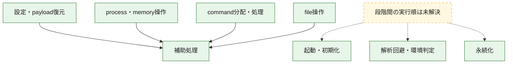
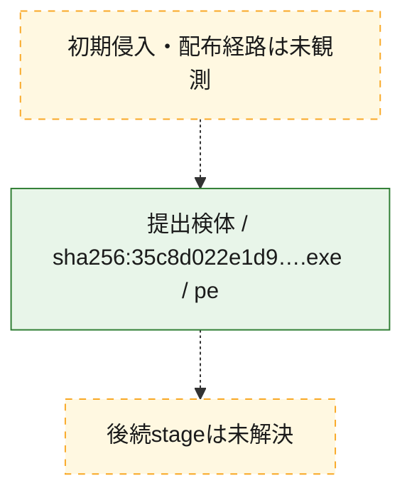
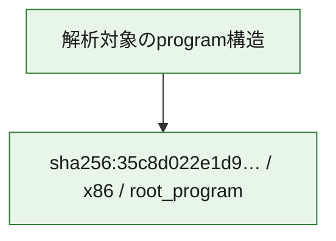

# 全体ロジック：35c8d022e1d917f1aabdceae98097ccc072161b302f84c768ca63e4b32ac2b66

代表関数の静的証跡から、起動・初期化、設定・payload復元、解析回避・環境判定、永続化、process・memory操作、command分配・処理、file操作の処理群を確認しました。

## 読み方

- phaseの掲載順は解析上の整理順です。observed_call_edgesがない段階間の実行順を断定しません。
- 図の実線は静的に観測した関係、点線と黄色のノードは未観測・未解決の関係を示します。
- 図は静的な要約であり、動的実行を再現するものではありません。
- 詳細な関数解説とfingerprintは[STATIC-LOGIC.md](STATIC-LOGIC.md)を参照してください。

## 静的可視化

### 実行フロー

### 感染チェーン

### モジュール関係

## 処理段階

### 1. 起動・初期化

entry pointから初期化と後続処理への移行を確認します。
確度: `confirmed_static_function_evidence`

- `35c8d022e1d917f1aabdceae98097ccc072161b302f84c768ca63e4b32ac2b66:ghidra:1800034d4` — 初期化と主要処理への分岐を行う入口関数です。 状態: `succeeded`、選定理由: `call_graph_centrality:in=1,out=4`, `entry_point`, `large_function:instructions=95`, `meaningful_symbol_name`, `reviewed_call_centrality:5`, `reviewed_call_centrality:6`, `role:entrypoint`
- `35c8d022e1d917f1aabdceae98097ccc072161b302f84c768ca63e4b32ac2b66:ghidra:180003608` — 初期化と主要処理への分岐を行う入口関数です。 状態: `succeeded`、選定理由: `call_graph_centrality:in=0,out=2`, `entry_point`, `meaningful_symbol_name`, `reviewed_call_centrality:2`, `role:entrypoint`

### 2. 設定・payload復元

設定、resource、payload、暗号化データの復元・変換を確認します。
確度: `confirmed_static_function_evidence`

- `35c8d022e1d917f1aabdceae98097ccc072161b302f84c768ca63e4b32ac2b66:ghidra:1800062f0` — 設定、resource、payloadなどの解析・変換を行う関数です。 状態: `succeeded`、選定理由: `call_graph_centrality:in=1,out=8`, `large_function:instructions=112`, `meaningful_symbol_name`, `reviewed_call_centrality:10`, `reviewed_call_centrality:9`, `role:config_or_data_transform`

### 3. 解析回避・環境判定

debugger、sandbox、仮想環境、時間差などの判定を確認します。
確度: `confirmed_static_function_evidence`

- `35c8d022e1d917f1aabdceae98097ccc072161b302f84c768ca63e4b32ac2b66:ghidra:180002900` — debugger、仮想環境、sandbox、または時間差の確認に関係する関数です。 状態: `succeeded`、選定理由: `call_graph_centrality:in=1,out=10`, `large_function:instructions=91`, `reviewed_call_centrality:16`, `reviewed_call_centrality:17`, `role:anti_analysis`

### 4. 永続化

自動起動や永続化に関係する設定変更を確認します。
確度: `confirmed_static_function_evidence`

- `35c8d022e1d917f1aabdceae98097ccc072161b302f84c768ca63e4b32ac2b66:ghidra:180003450` — 自動起動または永続化に関係する処理を含む関数です。 状態: `succeeded`、選定理由: `call_graph_centrality:in=2,out=8`, `reviewed_call_centrality:10`, `role:persistence`

### 5. process・memory操作

process、thread、module、memory操作と実行移行を確認します。
確度: `confirmed_static_function_evidence_with_limits`

- `35c8d022e1d917f1aabdceae98097ccc072161b302f84c768ca63e4b32ac2b66:ghidra:180001c80` — process、thread、module、またはmemory操作に関係する関数です。 状態: `succeeded`、選定理由: `call_graph_centrality:in=1,out=12`, `large_function:instructions=112`, `reviewed_call_centrality:13`, `reviewed_call_centrality:23`, `role:process_or_memory_operation`
- `35c8d022e1d917f1aabdceae98097ccc072161b302f84c768ca63e4b32ac2b66:ghidra:180002050` — process、thread、module、またはmemory操作に関係する関数です。 状態: `succeeded`、選定理由: `call_graph_centrality:in=1,out=8`, `large_function:instructions=179`, `reviewed_call_centrality:11`, `reviewed_call_centrality:13`, `role:anti_analysis`, `role:process_or_memory_operation`
- `35c8d022e1d917f1aabdceae98097ccc072161b302f84c768ca63e4b32ac2b66:ghidra:180003d3c` — process、thread、module、またはmemory操作に関係する関数です。 状態: `succeeded`、選定理由: `call_graph_centrality:in=3,out=9`, `large_function:instructions=72`, `reviewed_call_centrality:14`, `reviewed_call_centrality:19`, `role:process_or_memory_operation`
- `35c8d022e1d917f1aabdceae98097ccc072161b302f84c768ca63e4b32ac2b66:ghidra:180004ba8` — process、thread、module、またはmemory操作に関係する関数です。 状態: `succeeded`、選定理由: `call_graph_centrality:in=5,out=5`, `large_function:instructions=88`, `reviewed_call_centrality:12`, `reviewed_call_centrality:14`, `role:process_or_memory_operation`
- `35c8d022e1d917f1aabdceae98097ccc072161b302f84c768ca63e4b32ac2b66:ghidra:180005b2c` — process、thread、module、またはmemory操作に関係する関数です。 状態: `limited_bad_instruction_or_flow`、選定理由: `call_graph_centrality:in=5,out=3`, `meaningful_symbol_name`, `reviewed_call_centrality:10`, `reviewed_call_centrality:11`, `role:process_or_memory_operation`
- `35c8d022e1d917f1aabdceae98097ccc072161b302f84c768ca63e4b32ac2b66:ghidra:180005f40` — process、thread、module、またはmemory操作に関係する関数です。 状態: `succeeded`、選定理由: `call_graph_centrality:in=2,out=4`, `meaningful_symbol_name`, `reviewed_call_centrality:7`, `reviewed_call_centrality:9`, `role:process_or_memory_operation`
- `35c8d022e1d917f1aabdceae98097ccc072161b302f84c768ca63e4b32ac2b66:ghidra:180005ffc` — process、thread、module、またはmemory操作に関係する関数です。 状態: `succeeded`、選定理由: `call_graph_centrality:in=1,out=5`, `meaningful_symbol_name`, `reviewed_call_centrality:7`, `reviewed_call_centrality:9`, `role:process_or_memory_operation`
- `35c8d022e1d917f1aabdceae98097ccc072161b302f84c768ca63e4b32ac2b66:ghidra:180006048` — process、thread、module、またはmemory操作に関係する関数です。 状態: `succeeded`、選定理由: `call_graph_centrality:in=2,out=4`, `meaningful_symbol_name`, `reviewed_call_centrality:6`, `reviewed_call_centrality:9`, `role:process_or_memory_operation`
- `35c8d022e1d917f1aabdceae98097ccc072161b302f84c768ca63e4b32ac2b66:ghidra:180007da0` — process、thread、module、またはmemory操作に関係する関数です。 状態: `succeeded`、選定理由: `call_graph_centrality:in=1,out=12`, `large_function:instructions=216`, `meaningful_symbol_name`, `reviewed_call_centrality:14`, `reviewed_call_centrality:16`, `role:file_operation`, `role:process_or_memory_operation`
- `35c8d022e1d917f1aabdceae98097ccc072161b302f84c768ca63e4b32ac2b66:ghidra:18000879c` — process、thread、module、またはmemory操作に関係する関数です。 状態: `succeeded`、選定理由: `call_graph_centrality:in=1,out=8`, `large_function:instructions=119`, `reviewed_call_centrality:13`, `reviewed_call_centrality:9`, `role:process_or_memory_operation`
- `35c8d022e1d917f1aabdceae98097ccc072161b302f84c768ca63e4b32ac2b66:ghidra:18000895c` — process、thread、module、またはmemory操作に関係する関数です。 状態: `succeeded`、選定理由: `call_graph_centrality:in=2,out=4`, `meaningful_symbol_name`, `reviewed_call_centrality:6`, `reviewed_call_centrality:8`, `role:process_or_memory_operation`
- `35c8d022e1d917f1aabdceae98097ccc072161b302f84c768ca63e4b32ac2b66:ghidra:1800090a8` — process、thread、module、またはmemory操作に関係する関数です。 状態: `succeeded`、選定理由: `call_graph_centrality:in=9,out=5`, `large_function:instructions=127`, `meaningful_symbol_name`, `reviewed_call_centrality:16`, `reviewed_call_centrality:18`, `role:process_or_memory_operation`
- `35c8d022e1d917f1aabdceae98097ccc072161b302f84c768ca63e4b32ac2b66:ghidra:18000c0c8` — process、thread、module、またはmemory操作に関係する関数です。 状態: `succeeded`、選定理由: `call_graph_centrality:in=1,out=10`, `large_function:instructions=328`, `meaningful_symbol_name`, `reviewed_call_centrality:14`, `reviewed_call_centrality:15`, `role:file_operation`, `role:process_or_memory_operation`
- `35c8d022e1d917f1aabdceae98097ccc072161b302f84c768ca63e4b32ac2b66:ghidra:18000c5b4` — process、thread、module、またはmemory操作に関係する関数です。 状態: `succeeded`、選定理由: `call_graph_centrality:in=1,out=4`, `large_function:instructions=74`, `meaningful_symbol_name`, `reviewed_call_centrality:6`, `reviewed_call_centrality:7`, `role:file_operation`, `role:process_or_memory_operation`
- `35c8d022e1d917f1aabdceae98097ccc072161b302f84c768ca63e4b32ac2b66:ghidra:18000c6b8` — process、thread、module、またはmemory操作に関係する関数です。 状態: `succeeded`、選定理由: `call_graph_centrality:in=1,out=4`, `large_function:instructions=77`, `meaningful_symbol_name`, `reviewed_call_centrality:6`, `reviewed_call_centrality:7`, `role:file_operation`, `role:process_or_memory_operation`
- `35c8d022e1d917f1aabdceae98097ccc072161b302f84c768ca63e4b32ac2b66:ghidra:18000c7d4` — process、thread、module、またはmemory操作に関係する関数です。 状態: `succeeded`、選定理由: `call_graph_centrality:in=1,out=5`, `large_function:instructions=100`, `meaningful_symbol_name`, `reviewed_call_centrality:7`, `reviewed_call_centrality:8`, `role:file_operation`, `role:process_or_memory_operation`

### 6. command分配・処理

受信commandやtaskの解釈、分配、個別handlerへの移行を確認します。
確度: `confirmed_static_function_evidence`

- `35c8d022e1d917f1aabdceae98097ccc072161b302f84c768ca63e4b32ac2b66:ghidra:180003338` — commandの解釈、分配、または個別処理を担当する関数です。 状態: `succeeded`、選定理由: `call_graph_centrality:in=1,out=14`, `large_function:instructions=67`, `reviewed_call_centrality:15`, `role:command_dispatch_or_handler`
- `35c8d022e1d917f1aabdceae98097ccc072161b302f84c768ca63e4b32ac2b66:ghidra:1800043e8` — commandの解釈、分配、または個別処理を担当する関数です。 状態: `succeeded`、選定理由: `call_graph_centrality:in=3,out=3`, `meaningful_symbol_name`, `reviewed_call_centrality:6`, `reviewed_call_centrality:8`, `role:command_dispatch_or_handler`
- `35c8d022e1d917f1aabdceae98097ccc072161b302f84c768ca63e4b32ac2b66:ghidra:180006a30` — commandの解釈、分配、または個別処理を担当する関数です。 状態: `succeeded`、選定理由: `call_graph_centrality:in=6,out=5`, `meaningful_symbol_name`, `reviewed_call_centrality:12`, `role:command_dispatch_or_handler`
- `35c8d022e1d917f1aabdceae98097ccc072161b302f84c768ca63e4b32ac2b66:ghidra:180009a34` — commandの解釈、分配、または個別処理を担当する関数です。 状態: `succeeded`、選定理由: `call_graph_centrality:in=1,out=8`, `large_function:instructions=174`, `meaningful_symbol_name`, `reviewed_call_centrality:11`, `reviewed_call_centrality:9`, `role:command_dispatch_or_handler`
- `35c8d022e1d917f1aabdceae98097ccc072161b302f84c768ca63e4b32ac2b66:ghidra:18000add0` — commandの解釈、分配、または個別処理を担当する関数です。 状態: `succeeded`、選定理由: `call_graph_centrality:in=1,out=4`, `large_function:instructions=260`, `meaningful_symbol_name`, `reviewed_call_centrality:5`, `reviewed_call_centrality:6`, `role:command_dispatch_or_handler`

### 7. file操作

fileやdirectoryの作成、読書き、削除を確認します。
確度: `confirmed_static_function_evidence`

- `35c8d022e1d917f1aabdceae98097ccc072161b302f84c768ca63e4b32ac2b66:ghidra:18000bfa8` — fileまたはdirectoryの読書き・管理に関係する関数です。 状態: `succeeded`、選定理由: `call_graph_centrality:in=1,out=7`, `meaningful_symbol_name`, `reviewed_call_centrality:10`, `reviewed_call_centrality:13`, `role:file_operation`
- `35c8d022e1d917f1aabdceae98097ccc072161b302f84c768ca63e4b32ac2b66:ghidra:18000ca30` — fileまたはdirectoryの読書き・管理に関係する関数です。 状態: `succeeded`、選定理由: `call_graph_centrality:in=1,out=15`, `large_function:instructions=202`, `meaningful_symbol_name`, `reviewed_call_centrality:19`, `role:file_operation`
- `35c8d022e1d917f1aabdceae98097ccc072161b302f84c768ca63e4b32ac2b66:ghidra:18000d168` — fileまたはdirectoryの読書き・管理に関係する関数です。 状態: `succeeded`、選定理由: `call_graph_centrality:in=1,out=8`, `meaningful_symbol_name`, `reviewed_call_centrality:10`, `reviewed_call_centrality:9`, `role:file_operation`
- `35c8d022e1d917f1aabdceae98097ccc072161b302f84c768ca63e4b32ac2b66:ghidra:18000d1ec` — fileまたはdirectoryの読書き・管理に関係する関数です。 状態: `succeeded`、選定理由: `call_graph_centrality:in=1,out=6`, `meaningful_symbol_name`, `reviewed_call_centrality:7`, `reviewed_call_centrality:8`, `role:file_operation`

### 8. 補助処理

主要処理を支える一般内部関数またはlibrary処理を確認します。
確度: `confirmed_static_function_evidence`

- `35c8d022e1d917f1aabdceae98097ccc072161b302f84c768ca63e4b32ac2b66:ghidra:180006d20` — compiler生成処理または汎用library処理とみられる関数です。 状態: `succeeded`、選定理由: `call_graph_centrality:in=38,out=1`, `meaningful_symbol_name`, `reviewed_call_centrality:39`
- `35c8d022e1d917f1aabdceae98097ccc072161b302f84c768ca63e4b32ac2b66:ghidra:180007600` — 検体内部の一般処理を実装する関数です。 状態: `succeeded`、選定理由: `call_graph_centrality:in=41,out=4`, `meaningful_symbol_name`, `reviewed_call_centrality:46`, `reviewed_call_centrality:47`

## 観測したcall関係

- `35c8d022e1d917f1aabdceae98097ccc072161b302f84c768ca63e4b32ac2b66:ghidra:1800062f0` → `35c8d022e1d917f1aabdceae98097ccc072161b302f84c768ca63e4b32ac2b66:ghidra:180006d20` （`configuration` → `support`）
- `35c8d022e1d917f1aabdceae98097ccc072161b302f84c768ca63e4b32ac2b66:ghidra:180007600` → `35c8d022e1d917f1aabdceae98097ccc072161b302f84c768ca63e4b32ac2b66:ghidra:180006d20` （`support` → `support`）
- `35c8d022e1d917f1aabdceae98097ccc072161b302f84c768ca63e4b32ac2b66:ghidra:18000879c` → `35c8d022e1d917f1aabdceae98097ccc072161b302f84c768ca63e4b32ac2b66:ghidra:180006d20` （`execution` → `support`）
- `35c8d022e1d917f1aabdceae98097ccc072161b302f84c768ca63e4b32ac2b66:ghidra:180009a34` → `35c8d022e1d917f1aabdceae98097ccc072161b302f84c768ca63e4b32ac2b66:ghidra:180006d20` （`dispatch` → `support`）
- `35c8d022e1d917f1aabdceae98097ccc072161b302f84c768ca63e4b32ac2b66:ghidra:18000add0` → `35c8d022e1d917f1aabdceae98097ccc072161b302f84c768ca63e4b32ac2b66:ghidra:180006d20` （`dispatch` → `support`）
- `35c8d022e1d917f1aabdceae98097ccc072161b302f84c768ca63e4b32ac2b66:ghidra:18000bfa8` → `35c8d022e1d917f1aabdceae98097ccc072161b302f84c768ca63e4b32ac2b66:ghidra:180006d20` （`file_activity` → `support`）
- `35c8d022e1d917f1aabdceae98097ccc072161b302f84c768ca63e4b32ac2b66:ghidra:18000ca30` → `35c8d022e1d917f1aabdceae98097ccc072161b302f84c768ca63e4b32ac2b66:ghidra:180006d20` （`file_activity` → `support`）
- `35c8d022e1d917f1aabdceae98097ccc072161b302f84c768ca63e4b32ac2b66:ghidra:18000d168` → `35c8d022e1d917f1aabdceae98097ccc072161b302f84c768ca63e4b32ac2b66:ghidra:180006d20` （`file_activity` → `support`）
- `35c8d022e1d917f1aabdceae98097ccc072161b302f84c768ca63e4b32ac2b66:ghidra:18000d1ec` → `35c8d022e1d917f1aabdceae98097ccc072161b302f84c768ca63e4b32ac2b66:ghidra:180006d20` （`file_activity` → `support`）

## 解析範囲と制約

- 選定外関数は全体inventoryへ残しますが、関数本体の個別解説対象にはしていません。
- indirect call、難読化、packer、VM、壊れたcontrol flowによりcall関係が欠落する場合があります。
- 文書は静的解析に基づき、検体実行や外部通信による動的確認は行っていません。
