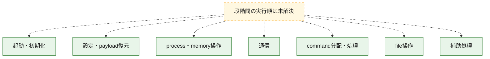
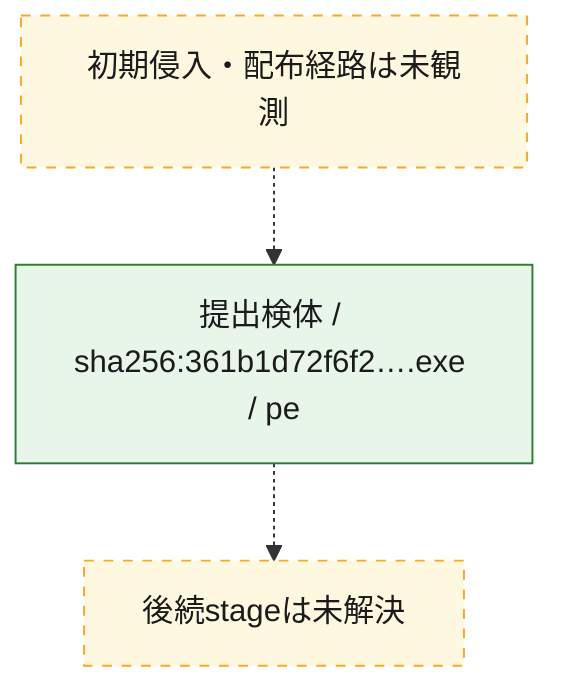
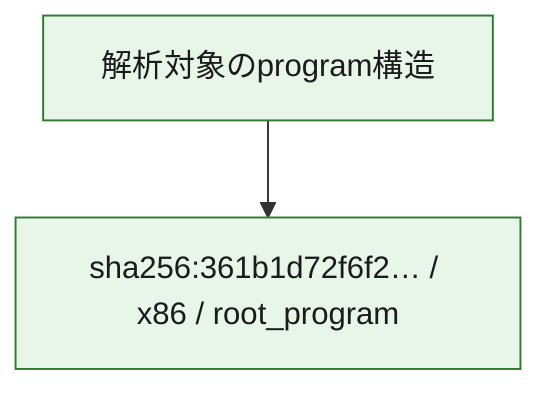

# 全体ロジック：361b1d72f6f2736e82ed9390924c0aeaf49644683f7cb871b82797ba6da20c5d

代表関数の静的証跡から、起動・初期化、設定・payload復元、process・memory操作、通信、command分配・処理、file操作の処理群を確認しました。

## 読み方

- phaseの掲載順は解析上の整理順です。observed_call_edgesがない段階間の実行順を断定しません。
- 図の実線は静的に観測した関係、点線と黄色のノードは未観測・未解決の関係を示します。
- 図は静的な要約であり、動的実行を再現するものではありません。
- 詳細な関数解説とfingerprintは[STATIC-LOGIC.md](STATIC-LOGIC.md)を参照してください。

## 静的可視化

### 実行フロー

### 感染チェーン

### モジュール関係

## 処理段階

### 1. 起動・初期化

entry pointから初期化と後続処理への移行を確認します。
確度: `confirmed_static_function_evidence_with_limits`

- `361b1d72f6f2736e82ed9390924c0aeaf49644683f7cb871b82797ba6da20c5d:ghidra:1400adc40` — 初期化と主要処理への分岐を行う入口関数です。 状態: `succeeded`、選定理由: `entry_point`, `meaningful_symbol_name`, `probable_go_main_user_code`, `reviewed_call_centrality:5`, `role:entrypoint`
- `361b1d72f6f2736e82ed9390924c0aeaf49644683f7cb871b82797ba6da20c5d:ghidra:1400ade00` — 初期化と主要処理への分岐を行う入口関数です。 状態: `failed`、選定理由: `entry_point`, `meaningful_symbol_name`, `probable_go_main_user_code`, `role:entrypoint`
- `361b1d72f6f2736e82ed9390924c0aeaf49644683f7cb871b82797ba6da20c5d:ghidra:1400be540` — 初期化と主要処理への分岐を行う入口関数です。 状態: `succeeded`、選定理由: `entry_point`, `meaningful_symbol_name`, `probable_go_main_user_code`, `reviewed_call_centrality:14`, `role:entrypoint`
- `361b1d72f6f2736e82ed9390924c0aeaf49644683f7cb871b82797ba6da20c5d:ghidra:1400c0000` — 初期化と主要処理への分岐を行う入口関数です。 状態: `succeeded`、選定理由: `entry_point`, `meaningful_symbol_name`, `probable_go_main_user_code`, `reviewed_call_centrality:9`, `role:entrypoint`
- `361b1d72f6f2736e82ed9390924c0aeaf49644683f7cb871b82797ba6da20c5d:ghidra:1400c1c80` — 初期化と主要処理への分岐を行う入口関数です。 状態: `succeeded`、選定理由: `entry_point`, `meaningful_symbol_name`, `probable_go_main_user_code`, `reviewed_call_centrality:9`, `role:entrypoint`
- `361b1d72f6f2736e82ed9390924c0aeaf49644683f7cb871b82797ba6da20c5d:ghidra:1400c4ca0` — 初期化と主要処理への分岐を行う入口関数です。 状態: `succeeded`、選定理由: `entry_point`, `meaningful_symbol_name`, `probable_go_main_user_code`, `reviewed_call_centrality:11`, `role:entrypoint`
- `361b1d72f6f2736e82ed9390924c0aeaf49644683f7cb871b82797ba6da20c5d:ghidra:1400c5d80` — 初期化と主要処理への分岐を行う入口関数です。 状態: `succeeded`、選定理由: `entry_point`, `meaningful_symbol_name`, `probable_go_main_user_code`, `reviewed_call_centrality:10`, `role:entrypoint`
- `361b1d72f6f2736e82ed9390924c0aeaf49644683f7cb871b82797ba6da20c5d:ghidra:1400c8ac0` — 初期化と主要処理への分岐を行う入口関数です。 状態: `succeeded`、選定理由: `entry_point`, `meaningful_symbol_name`, `probable_go_main_user_code`, `reviewed_call_centrality:12`, `role:entrypoint`
- `361b1d72f6f2736e82ed9390924c0aeaf49644683f7cb871b82797ba6da20c5d:ghidra:1400ca4c0` — 初期化と主要処理への分岐を行う入口関数です。 状態: `succeeded`、選定理由: `entry_point`, `meaningful_symbol_name`, `probable_go_main_user_code`, `reviewed_call_centrality:11`, `role:entrypoint`
- `361b1d72f6f2736e82ed9390924c0aeaf49644683f7cb871b82797ba6da20c5d:ghidra:1400cba00` — 初期化と主要処理への分岐を行う入口関数です。 状態: `succeeded`、選定理由: `entry_point`, `meaningful_symbol_name`, `probable_go_main_user_code`, `reviewed_call_centrality:13`, `role:entrypoint`
- `361b1d72f6f2736e82ed9390924c0aeaf49644683f7cb871b82797ba6da20c5d:ghidra:1400cdbe0` — 初期化と主要処理への分岐を行う入口関数です。 状態: `succeeded`、選定理由: `entry_point`, `meaningful_symbol_name`, `probable_go_main_user_code`, `reviewed_call_centrality:9`, `role:entrypoint`
- `361b1d72f6f2736e82ed9390924c0aeaf49644683f7cb871b82797ba6da20c5d:ghidra:1400cf440` — 初期化と主要処理への分岐を行う入口関数です。 状態: `succeeded`、選定理由: `entry_point`, `meaningful_symbol_name`, `probable_go_main_user_code`, `reviewed_call_centrality:13`, `role:entrypoint`
- `361b1d72f6f2736e82ed9390924c0aeaf49644683f7cb871b82797ba6da20c5d:ghidra:1400d05a0` — 初期化と主要処理への分岐を行う入口関数です。 状態: `succeeded`、選定理由: `entry_point`, `meaningful_symbol_name`, `probable_go_main_user_code`, `reviewed_call_centrality:11`, `role:entrypoint`
- `361b1d72f6f2736e82ed9390924c0aeaf49644683f7cb871b82797ba6da20c5d:ghidra:1400d2740` — 初期化と主要処理への分岐を行う入口関数です。 状態: `succeeded`、選定理由: `entry_point`, `meaningful_symbol_name`, `probable_go_main_user_code`, `reviewed_call_centrality:8`, `role:entrypoint`
- `361b1d72f6f2736e82ed9390924c0aeaf49644683f7cb871b82797ba6da20c5d:ghidra:1400d3b60` — 初期化と主要処理への分岐を行う入口関数です。 状態: `failed`、選定理由: `entry_point`, `meaningful_symbol_name`, `probable_go_main_user_code`, `role:entrypoint`
- `361b1d72f6f2736e82ed9390924c0aeaf49644683f7cb871b82797ba6da20c5d:ghidra:1400dd300` — 初期化と主要処理への分岐を行う入口関数です。 状態: `succeeded`、選定理由: `entry_point`, `meaningful_symbol_name`, `probable_go_main_user_code`, `reviewed_call_centrality:13`, `role:entrypoint`
- `361b1d72f6f2736e82ed9390924c0aeaf49644683f7cb871b82797ba6da20c5d:ghidra:1400e01e0` — 初期化と主要処理への分岐を行う入口関数です。 状態: `succeeded`、選定理由: `entry_point`, `meaningful_symbol_name`, `probable_go_main_user_code`, `reviewed_call_centrality:12`, `role:entrypoint`
- `361b1d72f6f2736e82ed9390924c0aeaf49644683f7cb871b82797ba6da20c5d:ghidra:1400e3960` — 初期化と主要処理への分岐を行う入口関数です。 状態: `succeeded`、選定理由: `entry_point`, `meaningful_symbol_name`, `probable_go_main_user_code`, `reviewed_call_centrality:10`, `role:entrypoint`
- `361b1d72f6f2736e82ed9390924c0aeaf49644683f7cb871b82797ba6da20c5d:ghidra:1400e6c40` — 初期化と主要処理への分岐を行う入口関数です。 状態: `succeeded`、選定理由: `entry_point`, `meaningful_symbol_name`, `probable_go_main_user_code`, `reviewed_call_centrality:10`, `role:entrypoint`
- `361b1d72f6f2736e82ed9390924c0aeaf49644683f7cb871b82797ba6da20c5d:ghidra:1400e8980` — 初期化と主要処理への分岐を行う入口関数です。 状態: `succeeded`、選定理由: `entry_point`, `meaningful_symbol_name`, `probable_go_main_user_code`, `reviewed_call_centrality:11`, `role:entrypoint`
- `361b1d72f6f2736e82ed9390924c0aeaf49644683f7cb871b82797ba6da20c5d:ghidra:1400e9e20` — 初期化と主要処理への分岐を行う入口関数です。 状態: `succeeded`、選定理由: `entry_point`, `meaningful_symbol_name`, `probable_go_main_user_code`, `reviewed_call_centrality:19`, `role:entrypoint`
- `361b1d72f6f2736e82ed9390924c0aeaf49644683f7cb871b82797ba6da20c5d:ghidra:1400ecd40` — 初期化と主要処理への分岐を行う入口関数です。 状態: `succeeded`、選定理由: `entry_point`, `meaningful_symbol_name`, `probable_go_main_user_code`, `reviewed_call_centrality:10`, `role:entrypoint`
- `361b1d72f6f2736e82ed9390924c0aeaf49644683f7cb871b82797ba6da20c5d:ghidra:1400edde0` — 初期化と主要処理への分岐を行う入口関数です。 状態: `succeeded`、選定理由: `entry_point`, `meaningful_symbol_name`, `probable_go_main_user_code`, `reviewed_call_centrality:9`, `role:entrypoint`
- `361b1d72f6f2736e82ed9390924c0aeaf49644683f7cb871b82797ba6da20c5d:ghidra:1400eee20` — 初期化と主要処理への分岐を行う入口関数です。 状態: `succeeded`、選定理由: `entry_point`, `meaningful_symbol_name`, `probable_go_main_user_code`, `reviewed_call_centrality:10`, `role:entrypoint`
- `361b1d72f6f2736e82ed9390924c0aeaf49644683f7cb871b82797ba6da20c5d:ghidra:1400efe60` — 初期化と主要処理への分岐を行う入口関数です。 状態: `succeeded`、選定理由: `entry_point`, `meaningful_symbol_name`, `probable_go_main_user_code`, `reviewed_call_centrality:11`, `role:entrypoint`

### 2. 設定・payload復元

設定、resource、payload、暗号化データの復元・変換を確認します。
確度: `confirmed_static_function_evidence`

- `361b1d72f6f2736e82ed9390924c0aeaf49644683f7cb871b82797ba6da20c5d:ghidra:140087920` — 設定、resource、payloadなどの解析・変換を行う関数です。 状態: `succeeded`、選定理由: `meaningful_symbol_name`, `reviewed_call_centrality:4`, `role:config_or_data_transform`

### 3. process・memory操作

process、thread、module、memory操作と実行移行を確認します。
確度: `confirmed_static_function_evidence`

- `361b1d72f6f2736e82ed9390924c0aeaf49644683f7cb871b82797ba6da20c5d:ghidra:140098200` — process、thread、module、またはmemory操作に関係する関数です。 状態: `succeeded`、選定理由: `meaningful_symbol_name`, `reviewed_call_centrality:6`, `role:process_or_memory_operation`

### 4. 通信

通信初期化、endpoint処理、送受信の役割を確認します。
確度: `confirmed_static_function_evidence`

- `361b1d72f6f2736e82ed9390924c0aeaf49644683f7cb871b82797ba6da20c5d:ghidra:140098ae0` — 通信初期化、送受信、またはendpoint処理に関係する関数です。 状態: `succeeded`、選定理由: `meaningful_symbol_name`, `reviewed_call_centrality:6`, `role:network_communication`

### 5. command分配・処理

受信commandやtaskの解釈、分配、個別handlerへの移行を確認します。
確度: `confirmed_static_function_evidence`

- `361b1d72f6f2736e82ed9390924c0aeaf49644683f7cb871b82797ba6da20c5d:ghidra:140097d40` — commandの解釈、分配、または個別処理を担当する関数です。 状態: `succeeded`、選定理由: `meaningful_symbol_name`, `reviewed_call_centrality:5`, `role:command_dispatch_or_handler`

### 6. file操作

fileやdirectoryの作成、読書き、削除を確認します。
確度: `confirmed_static_function_evidence`

- `361b1d72f6f2736e82ed9390924c0aeaf49644683f7cb871b82797ba6da20c5d:ghidra:1400986c0` — fileまたはdirectoryの読書き・管理に関係する関数です。 状態: `succeeded`、選定理由: `meaningful_symbol_name`, `reviewed_call_centrality:6`, `role:file_operation`

### 7. 補助処理

主要処理を支える一般内部関数またはlibrary処理を確認します。
確度: `confirmed_static_function_evidence`

- `361b1d72f6f2736e82ed9390924c0aeaf49644683f7cb871b82797ba6da20c5d:ghidra:140001080` — compiler生成処理または汎用library処理とみられる関数です。 状態: `succeeded`、選定理由: `meaningful_symbol_name`, `reviewed_call_centrality:5`
- `361b1d72f6f2736e82ed9390924c0aeaf49644683f7cb871b82797ba6da20c5d:ghidra:140070f00` — 検体内部の一般処理を実装する関数です。 状態: `succeeded`、選定理由: `meaningful_symbol_name`, `reviewed_call_centrality:3`

## 観測したcall関係

- `ghidra-function:0a8acf3e9cdaa95bb733e12d` → `ghidra-external:1b66871e21ee22a9282f3bab` （`unclassified` → `unclassified`）
- `ghidra-function:0a8acf3e9cdaa95bb733e12d` → `ghidra-external:1fd0a0f376131c578e7ae121` （`unclassified` → `unclassified`）
- `ghidra-function:0a8acf3e9cdaa95bb733e12d` → `ghidra-external:2b11f1d17a200be389d77755` （`unclassified` → `unclassified`）
- `ghidra-function:0a8acf3e9cdaa95bb733e12d` → `ghidra-external:3264b759aee68ca026ce0f90` （`unclassified` → `unclassified`）
- `ghidra-function:0a8acf3e9cdaa95bb733e12d` → `ghidra-external:705eb678cd6788323ea6e06d` （`unclassified` → `unclassified`）
- `ghidra-function:0a8acf3e9cdaa95bb733e12d` → `ghidra-external:94b6bb83d272d211782e1d6e` （`unclassified` → `unclassified`）
- `ghidra-function:0a8acf3e9cdaa95bb733e12d` → `ghidra-external:96a5b2bacc32f645cf555a4d` （`unclassified` → `unclassified`）
- `ghidra-function:0a8acf3e9cdaa95bb733e12d` → `ghidra-external:9a3206fe7c2a94cb5ebbf679` （`unclassified` → `unclassified`）
- `ghidra-function:0a8acf3e9cdaa95bb733e12d` → `ghidra-external:b4d556cdd6c9279eec004498` （`unclassified` → `unclassified`）
- `ghidra-function:0a8acf3e9cdaa95bb733e12d` → `ghidra-external:f969520562e4e9a974586b83` （`unclassified` → `unclassified`）
- `ghidra-function:0c869270a2bbd1a7a4a2fb46` → `ghidra-external:1b66871e21ee22a9282f3bab` （`unclassified` → `unclassified`）
- `ghidra-function:0c869270a2bbd1a7a4a2fb46` → `ghidra-external:1fd0a0f376131c578e7ae121` （`unclassified` → `unclassified`）
- `ghidra-function:0c869270a2bbd1a7a4a2fb46` → `ghidra-external:2b11f1d17a200be389d77755` （`unclassified` → `unclassified`）
- `ghidra-function:0c869270a2bbd1a7a4a2fb46` → `ghidra-external:3264b759aee68ca026ce0f90` （`unclassified` → `unclassified`）
- `ghidra-function:0c869270a2bbd1a7a4a2fb46` → `ghidra-external:5398966a6966f52159162909` （`unclassified` → `unclassified`）
- `ghidra-function:0c869270a2bbd1a7a4a2fb46` → `ghidra-external:7d254bdc5ba49a6f706bf280` （`unclassified` → `unclassified`）
- `ghidra-function:0c869270a2bbd1a7a4a2fb46` → `ghidra-external:95eb19a3195cafb294151806` （`unclassified` → `unclassified`）
- `ghidra-function:0c869270a2bbd1a7a4a2fb46` → `ghidra-external:9a3206fe7c2a94cb5ebbf679` （`unclassified` → `unclassified`）
- `ghidra-function:0c869270a2bbd1a7a4a2fb46` → `ghidra-external:b4d556cdd6c9279eec004498` （`unclassified` → `unclassified`）
- `ghidra-function:0c869270a2bbd1a7a4a2fb46` → `ghidra-external:c827b3dbd0480dfb42ae27ac` （`unclassified` → `unclassified`）
- `ghidra-function:0c869270a2bbd1a7a4a2fb46` → `ghidra-external:e34bb262d04e6ba24b72a53c` （`unclassified` → `unclassified`）
- `ghidra-function:0c869270a2bbd1a7a4a2fb46` → `ghidra-external:f969520562e4e9a974586b83` （`unclassified` → `unclassified`）
- `ghidra-function:0c869270a2bbd1a7a4a2fb46` → `ghidra-external:fc31aa0bdbd23af9d5ebdccf` （`unclassified` → `unclassified`）
- `ghidra-function:0d811c6d7f335f27265572da` → `ghidra-external:1b66871e21ee22a9282f3bab` （`unclassified` → `unclassified`）
- `ghidra-function:0d811c6d7f335f27265572da` → `ghidra-external:1fd0a0f376131c578e7ae121` （`unclassified` → `unclassified`）
- `ghidra-function:0d811c6d7f335f27265572da` → `ghidra-external:2b11f1d17a200be389d77755` （`unclassified` → `unclassified`）
- `ghidra-function:0d811c6d7f335f27265572da` → `ghidra-external:2b53e6773917a11d80130ee1` （`unclassified` → `unclassified`）
- `ghidra-function:0d811c6d7f335f27265572da` → `ghidra-external:3264b759aee68ca026ce0f90` （`unclassified` → `unclassified`）
- `ghidra-function:0d811c6d7f335f27265572da` → `ghidra-external:9a3206fe7c2a94cb5ebbf679` （`unclassified` → `unclassified`）
- `ghidra-function:0d811c6d7f335f27265572da` → `ghidra-external:b4d556cdd6c9279eec004498` （`unclassified` → `unclassified`）
- `ghidra-function:0d811c6d7f335f27265572da` → `ghidra-external:f6a6a845ca57128a1f25decb` （`unclassified` → `unclassified`）
- `ghidra-function:0d811c6d7f335f27265572da` → `ghidra-external:f969520562e4e9a974586b83` （`unclassified` → `unclassified`）
- `ghidra-function:0f4705dd9e9d3e23dca82b8e` → `ghidra-external:187a82b9e1ea661349a340e0` （`unclassified` → `unclassified`）
- `ghidra-function:0f4705dd9e9d3e23dca82b8e` → `ghidra-external:1b66871e21ee22a9282f3bab` （`unclassified` → `unclassified`）
- `ghidra-function:0f4705dd9e9d3e23dca82b8e` → `ghidra-external:6fd68dcec9e837463730c76f` （`unclassified` → `unclassified`）
- `ghidra-function:0f4705dd9e9d3e23dca82b8e` → `ghidra-external:a26bc603a45ae9ff4b44a0fc` （`unclassified` → `unclassified`）
- `ghidra-function:0f4705dd9e9d3e23dca82b8e` → `ghidra-external:d240505588f060cf02bd6bb0` （`unclassified` → `unclassified`）
- `ghidra-function:2b8a0a117e851762320df06a` → `ghidra-external:41e018658d004804c7ecb665` （`unclassified` → `unclassified`）
- `ghidra-function:2b8a0a117e851762320df06a` → `ghidra-external:574812c09a794047b5db393b` （`unclassified` → `unclassified`）
- `ghidra-function:2b8a0a117e851762320df06a` → `ghidra-external:d06bfb44d4489c31f047b767` （`unclassified` → `unclassified`）
- `ghidra-function:3926934303de85f067c425b8` → `ghidra-external:187a82b9e1ea661349a340e0` （`unclassified` → `unclassified`）
- `ghidra-function:3926934303de85f067c425b8` → `ghidra-external:1b66871e21ee22a9282f3bab` （`unclassified` → `unclassified`）
- `ghidra-function:3926934303de85f067c425b8` → `ghidra-external:6fd68dcec9e837463730c76f` （`unclassified` → `unclassified`）
- `ghidra-function:3926934303de85f067c425b8` → `ghidra-external:705eb678cd6788323ea6e06d` （`unclassified` → `unclassified`）
- `ghidra-function:3926934303de85f067c425b8` → `ghidra-external:c89a5d818e536ba8d019d40e` （`unclassified` → `unclassified`）
- `ghidra-function:3926934303de85f067c425b8` → `ghidra-external:d240505588f060cf02bd6bb0` （`unclassified` → `unclassified`）
- `ghidra-function:486dfab6d093b22fb1e889e1` → `ghidra-external:1b66871e21ee22a9282f3bab` （`unclassified` → `unclassified`）
- `ghidra-function:486dfab6d093b22fb1e889e1` → `ghidra-external:36a8d6a9727f8e4da3d47b59` （`unclassified` → `unclassified`）
- `ghidra-function:486dfab6d093b22fb1e889e1` → `ghidra-external:67e8fd45f9bdc88a6ad5e28d` （`unclassified` → `unclassified`）
- `ghidra-function:486dfab6d093b22fb1e889e1` → `ghidra-external:6a61cd2daf61613566933472` （`unclassified` → `unclassified`）
- `ghidra-function:486dfab6d093b22fb1e889e1` → `ghidra-external:d240505588f060cf02bd6bb0` （`unclassified` → `unclassified`）
- `ghidra-function:582abe9224b5acfe14fbf249` → `ghidra-external:1b66871e21ee22a9282f3bab` （`unclassified` → `unclassified`）
- `ghidra-function:582abe9224b5acfe14fbf249` → `ghidra-external:53889faafbd1cca0ec0e11ac` （`unclassified` → `unclassified`）
- `ghidra-function:582abe9224b5acfe14fbf249` → `ghidra-external:68b50411879bfb798f38217f` （`unclassified` → `unclassified`）
- `ghidra-function:582abe9224b5acfe14fbf249` → `ghidra-external:858e35c57c0ad7dc8af4ed52` （`unclassified` → `unclassified`）
- `ghidra-function:582abe9224b5acfe14fbf249` → `ghidra-external:8f9462d1ba2afa7002b6d6be` （`unclassified` → `unclassified`）
- `ghidra-function:5a6376dbb52a0e076bf1b140` → `ghidra-external:04dc68522eb78cfbcbb28153` （`unclassified` → `unclassified`）
- `ghidra-function:5a6376dbb52a0e076bf1b140` → `ghidra-external:1b66871e21ee22a9282f3bab` （`unclassified` → `unclassified`）
- `ghidra-function:5a6376dbb52a0e076bf1b140` → `ghidra-external:1fd0a0f376131c578e7ae121` （`unclassified` → `unclassified`）
- `ghidra-function:5a6376dbb52a0e076bf1b140` → `ghidra-external:2b11f1d17a200be389d77755` （`unclassified` → `unclassified`）
- `ghidra-function:5a6376dbb52a0e076bf1b140` → `ghidra-external:3264b759aee68ca026ce0f90` （`unclassified` → `unclassified`）
- `ghidra-function:5a6376dbb52a0e076bf1b140` → `ghidra-external:442933cf96b0870b5c7b81d0` （`unclassified` → `unclassified`）
- `ghidra-function:5a6376dbb52a0e076bf1b140` → `ghidra-external:7c51400d89083c593cda6a04` （`unclassified` → `unclassified`）
- `ghidra-function:5a6376dbb52a0e076bf1b140` → `ghidra-external:9a3206fe7c2a94cb5ebbf679` （`unclassified` → `unclassified`）
- `ghidra-function:5a6376dbb52a0e076bf1b140` → `ghidra-external:b4d556cdd6c9279eec004498` （`unclassified` → `unclassified`）
- `ghidra-function:5a6376dbb52a0e076bf1b140` → `ghidra-external:f969520562e4e9a974586b83` （`unclassified` → `unclassified`）
- `ghidra-function:659a9aa75964b5c11f1566ea` → `ghidra-external:0d3ce7dce574fa0adf337097` （`unclassified` → `unclassified`）
- `ghidra-function:659a9aa75964b5c11f1566ea` → `ghidra-external:17ec8e3d799930a9ff6d9999` （`unclassified` → `unclassified`）
- `ghidra-function:659a9aa75964b5c11f1566ea` → `ghidra-external:1b66871e21ee22a9282f3bab` （`unclassified` → `unclassified`）
- `ghidra-function:659a9aa75964b5c11f1566ea` → `ghidra-external:1fd0a0f376131c578e7ae121` （`unclassified` → `unclassified`）
- `ghidra-function:659a9aa75964b5c11f1566ea` → `ghidra-external:2b11f1d17a200be389d77755` （`unclassified` → `unclassified`）
- `ghidra-function:659a9aa75964b5c11f1566ea` → `ghidra-external:3264b759aee68ca026ce0f90` （`unclassified` → `unclassified`）
- `ghidra-function:659a9aa75964b5c11f1566ea` → `ghidra-external:442933cf96b0870b5c7b81d0` （`unclassified` → `unclassified`）
- `ghidra-function:659a9aa75964b5c11f1566ea` → `ghidra-external:9969ba4719060d15d5070e0a` （`unclassified` → `unclassified`）
- `ghidra-function:659a9aa75964b5c11f1566ea` → `ghidra-external:9a3206fe7c2a94cb5ebbf679` （`unclassified` → `unclassified`）
- `ghidra-function:659a9aa75964b5c11f1566ea` → `ghidra-external:b4d556cdd6c9279eec004498` （`unclassified` → `unclassified`）
- `ghidra-function:659a9aa75964b5c11f1566ea` → `ghidra-external:ccf3152654e70ea604727833` （`unclassified` → `unclassified`）
- `ghidra-function:659a9aa75964b5c11f1566ea` → `ghidra-external:f969520562e4e9a974586b83` （`unclassified` → `unclassified`）
- `ghidra-function:7473c77ea34eda1d4851dbba` → `ghidra-external:1b66871e21ee22a9282f3bab` （`unclassified` → `unclassified`）
- `ghidra-function:7473c77ea34eda1d4851dbba` → `ghidra-external:1fd0a0f376131c578e7ae121` （`unclassified` → `unclassified`）
- `ghidra-function:7473c77ea34eda1d4851dbba` → `ghidra-external:2b11f1d17a200be389d77755` （`unclassified` → `unclassified`）
- `ghidra-function:7473c77ea34eda1d4851dbba` → `ghidra-external:3264b759aee68ca026ce0f90` （`unclassified` → `unclassified`）
- `ghidra-function:7473c77ea34eda1d4851dbba` → `ghidra-external:95eb19a3195cafb294151806` （`unclassified` → `unclassified`）
- `ghidra-function:7473c77ea34eda1d4851dbba` → `ghidra-external:9a3206fe7c2a94cb5ebbf679` （`unclassified` → `unclassified`）
- `ghidra-function:7473c77ea34eda1d4851dbba` → `ghidra-external:b4d556cdd6c9279eec004498` （`unclassified` → `unclassified`）
- `ghidra-function:7473c77ea34eda1d4851dbba` → `ghidra-external:f969520562e4e9a974586b83` （`unclassified` → `unclassified`）
- `ghidra-function:763040195e553214f26b07f0` → `ghidra-external:04dc68522eb78cfbcbb28153` （`unclassified` → `unclassified`）
- `ghidra-function:763040195e553214f26b07f0` → `ghidra-external:1b66871e21ee22a9282f3bab` （`unclassified` → `unclassified`）
- `ghidra-function:763040195e553214f26b07f0` → `ghidra-external:1fd0a0f376131c578e7ae121` （`unclassified` → `unclassified`）
- `ghidra-function:763040195e553214f26b07f0` → `ghidra-external:2b11f1d17a200be389d77755` （`unclassified` → `unclassified`）
- `ghidra-function:763040195e553214f26b07f0` → `ghidra-external:3264b759aee68ca026ce0f90` （`unclassified` → `unclassified`）
- `ghidra-function:763040195e553214f26b07f0` → `ghidra-external:36a8d6a9727f8e4da3d47b59` （`unclassified` → `unclassified`）
- `ghidra-function:763040195e553214f26b07f0` → `ghidra-external:442933cf96b0870b5c7b81d0` （`unclassified` → `unclassified`）
- `ghidra-function:763040195e553214f26b07f0` → `ghidra-external:6a61cd2daf61613566933472` （`unclassified` → `unclassified`）
- `ghidra-function:763040195e553214f26b07f0` → `ghidra-external:9a3206fe7c2a94cb5ebbf679` （`unclassified` → `unclassified`）
- `ghidra-function:763040195e553214f26b07f0` → `ghidra-external:a57c81abc9a185c9ad894f63` （`unclassified` → `unclassified`）
- `ghidra-function:763040195e553214f26b07f0` → `ghidra-external:b4d556cdd6c9279eec004498` （`unclassified` → `unclassified`）
- `ghidra-function:763040195e553214f26b07f0` → `ghidra-external:f969520562e4e9a974586b83` （`unclassified` → `unclassified`）
- `ghidra-function:8384a291c99b0ae76ef5e0e6` → `ghidra-external:1b66871e21ee22a9282f3bab` （`unclassified` → `unclassified`）
- `ghidra-function:8384a291c99b0ae76ef5e0e6` → `ghidra-external:1fd0a0f376131c578e7ae121` （`unclassified` → `unclassified`）
- `ghidra-function:8384a291c99b0ae76ef5e0e6` → `ghidra-external:2b11f1d17a200be389d77755` （`unclassified` → `unclassified`）
- `ghidra-function:8384a291c99b0ae76ef5e0e6` → `ghidra-external:3264b759aee68ca026ce0f90` （`unclassified` → `unclassified`）
- `ghidra-function:8384a291c99b0ae76ef5e0e6` → `ghidra-external:51d095d8a4114463ce67459a` （`unclassified` → `unclassified`）
- `ghidra-function:8384a291c99b0ae76ef5e0e6` → `ghidra-external:705eb678cd6788323ea6e06d` （`unclassified` → `unclassified`）
- `ghidra-function:8384a291c99b0ae76ef5e0e6` → `ghidra-external:94b6bb83d272d211782e1d6e` （`unclassified` → `unclassified`）
- `ghidra-function:8384a291c99b0ae76ef5e0e6` → `ghidra-external:9a3206fe7c2a94cb5ebbf679` （`unclassified` → `unclassified`）
- `ghidra-function:8384a291c99b0ae76ef5e0e6` → `ghidra-external:b4d556cdd6c9279eec004498` （`unclassified` → `unclassified`）
- `ghidra-function:8384a291c99b0ae76ef5e0e6` → `ghidra-external:f969520562e4e9a974586b83` （`unclassified` → `unclassified`）
- `ghidra-function:8384a291c99b0ae76ef5e0e6` → `ghidra-external:fc90127064d65cc2b2f52c0c` （`unclassified` → `unclassified`）
- `ghidra-function:857e659e3711e0409baf3f8f` → `ghidra-external:04dc68522eb78cfbcbb28153` （`unclassified` → `unclassified`）
- `ghidra-function:857e659e3711e0409baf3f8f` → `ghidra-external:1b66871e21ee22a9282f3bab` （`unclassified` → `unclassified`）
- `ghidra-function:857e659e3711e0409baf3f8f` → `ghidra-external:1fd0a0f376131c578e7ae121` （`unclassified` → `unclassified`）
- `ghidra-function:857e659e3711e0409baf3f8f` → `ghidra-external:2b11f1d17a200be389d77755` （`unclassified` → `unclassified`）
- `ghidra-function:857e659e3711e0409baf3f8f` → `ghidra-external:3264b759aee68ca026ce0f90` （`unclassified` → `unclassified`）
- `ghidra-function:857e659e3711e0409baf3f8f` → `ghidra-external:442933cf96b0870b5c7b81d0` （`unclassified` → `unclassified`）
- `ghidra-function:857e659e3711e0409baf3f8f` → `ghidra-external:4916be9e4dc87599584c22b5` （`unclassified` → `unclassified`）
- `ghidra-function:857e659e3711e0409baf3f8f` → `ghidra-external:5398966a6966f52159162909` （`unclassified` → `unclassified`）
- `ghidra-function:857e659e3711e0409baf3f8f` → `ghidra-external:9a3206fe7c2a94cb5ebbf679` （`unclassified` → `unclassified`）
- `ghidra-function:857e659e3711e0409baf3f8f` → `ghidra-external:b4d556cdd6c9279eec004498` （`unclassified` → `unclassified`）
- `ghidra-function:857e659e3711e0409baf3f8f` → `ghidra-external:f969520562e4e9a974586b83` （`unclassified` → `unclassified`）
- `ghidra-function:85b7bbaa1ff10446425b96d4` → `ghidra-external:187a82b9e1ea661349a340e0` （`unclassified` → `unclassified`）
- `ghidra-function:85b7bbaa1ff10446425b96d4` → `ghidra-external:1b66871e21ee22a9282f3bab` （`unclassified` → `unclassified`）
- `ghidra-function:85b7bbaa1ff10446425b96d4` → `ghidra-external:2fb80a35a0154b6500949f19` （`unclassified` → `unclassified`）
- `ghidra-function:85b7bbaa1ff10446425b96d4` → `ghidra-external:6fd68dcec9e837463730c76f` （`unclassified` → `unclassified`）
- `ghidra-function:85b7bbaa1ff10446425b96d4` → `ghidra-external:705eb678cd6788323ea6e06d` （`unclassified` → `unclassified`）
- `ghidra-function:85b7bbaa1ff10446425b96d4` → `ghidra-external:d240505588f060cf02bd6bb0` （`unclassified` → `unclassified`）
- `ghidra-function:9c98f0757bbe4a842b4a5ab3` → `ghidra-external:382c9d622a064d7705c7cc4f` （`unclassified` → `unclassified`）
- `ghidra-function:9c98f0757bbe4a842b4a5ab3` → `ghidra-external:4733a40178b74001f6df7270` （`unclassified` → `unclassified`）
- `ghidra-function:9c98f0757bbe4a842b4a5ab3` → `ghidra-external:d14c92923d89d95ac542b978` （`unclassified` → `unclassified`）
- `ghidra-function:9c98f0757bbe4a842b4a5ab3` → `ghidra-external:f0ed5cf835c9e893772e67f0` （`unclassified` → `unclassified`）
- `ghidra-function:adff35220f0cf6ae4cbcf85e` → `ghidra-external:1b66871e21ee22a9282f3bab` （`unclassified` → `unclassified`）
- `ghidra-function:adff35220f0cf6ae4cbcf85e` → `ghidra-external:1fd0a0f376131c578e7ae121` （`unclassified` → `unclassified`）
- `ghidra-function:adff35220f0cf6ae4cbcf85e` → `ghidra-external:292c1d7110bd049878027a5c` （`unclassified` → `unclassified`）
- `ghidra-function:adff35220f0cf6ae4cbcf85e` → `ghidra-external:2b11f1d17a200be389d77755` （`unclassified` → `unclassified`）
- `ghidra-function:adff35220f0cf6ae4cbcf85e` → `ghidra-external:3264b759aee68ca026ce0f90` （`unclassified` → `unclassified`）
- `ghidra-function:adff35220f0cf6ae4cbcf85e` → `ghidra-external:858e35c57c0ad7dc8af4ed52` （`unclassified` → `unclassified`）
- `ghidra-function:adff35220f0cf6ae4cbcf85e` → `ghidra-external:9a3206fe7c2a94cb5ebbf679` （`unclassified` → `unclassified`）
- `ghidra-function:adff35220f0cf6ae4cbcf85e` → `ghidra-external:b4d556cdd6c9279eec004498` （`unclassified` → `unclassified`）
- `ghidra-function:adff35220f0cf6ae4cbcf85e` → `ghidra-external:ccf3152654e70ea604727833` （`unclassified` → `unclassified`）
- `ghidra-function:adff35220f0cf6ae4cbcf85e` → `ghidra-external:f969520562e4e9a974586b83` （`unclassified` → `unclassified`）
- `ghidra-function:b6e614fe2bc543c74b58d308` → `ghidra-external:04dc68522eb78cfbcbb28153` （`unclassified` → `unclassified`）
- `ghidra-function:b6e614fe2bc543c74b58d308` → `ghidra-external:0958e427b09c2124e73f6ed3` （`unclassified` → `unclassified`）
- `ghidra-function:b6e614fe2bc543c74b58d308` → `ghidra-external:1b66871e21ee22a9282f3bab` （`unclassified` → `unclassified`）
- `ghidra-function:b6e614fe2bc543c74b58d308` → `ghidra-external:1fd0a0f376131c578e7ae121` （`unclassified` → `unclassified`）
- `ghidra-function:b6e614fe2bc543c74b58d308` → `ghidra-external:2b11f1d17a200be389d77755` （`unclassified` → `unclassified`）
- `ghidra-function:b6e614fe2bc543c74b58d308` → `ghidra-external:2effee5c79f4a7a93beba294` （`unclassified` → `unclassified`）
- `ghidra-function:b6e614fe2bc543c74b58d308` → `ghidra-external:3264b759aee68ca026ce0f90` （`unclassified` → `unclassified`）
- `ghidra-function:b6e614fe2bc543c74b58d308` → `ghidra-external:4733a40178b74001f6df7270` （`unclassified` → `unclassified`）
- `ghidra-function:b6e614fe2bc543c74b58d308` → `ghidra-external:49f5644341e9fddc6730a91d` （`unclassified` → `unclassified`）
- `ghidra-function:b6e614fe2bc543c74b58d308` → `ghidra-external:705eb678cd6788323ea6e06d` （`unclassified` → `unclassified`）
- `ghidra-function:b6e614fe2bc543c74b58d308` → `ghidra-external:7f0de72d5021686248d697e4` （`unclassified` → `unclassified`）
- `ghidra-function:b6e614fe2bc543c74b58d308` → `ghidra-external:8e6f3762b84210ec5565d76e` （`unclassified` → `unclassified`）
- `ghidra-function:b6e614fe2bc543c74b58d308` → `ghidra-external:94b6bb83d272d211782e1d6e` （`unclassified` → `unclassified`）
- `ghidra-function:b6e614fe2bc543c74b58d308` → `ghidra-external:96a5b2bacc32f645cf555a4d` （`unclassified` → `unclassified`）
- `ghidra-function:b6e614fe2bc543c74b58d308` → `ghidra-external:9a3206fe7c2a94cb5ebbf679` （`unclassified` → `unclassified`）
- `ghidra-function:b6e614fe2bc543c74b58d308` → `ghidra-external:a20797e7e45d3f90eeb55cc3` （`unclassified` → `unclassified`）
- `ghidra-function:b6e614fe2bc543c74b58d308` → `ghidra-external:b4d556cdd6c9279eec004498` （`unclassified` → `unclassified`）
- `ghidra-function:b6e614fe2bc543c74b58d308` → `ghidra-external:c9ba55dfafd4b35e43b89bf0` （`unclassified` → `unclassified`）
- `ghidra-function:b6e614fe2bc543c74b58d308` → `ghidra-external:f969520562e4e9a974586b83` （`unclassified` → `unclassified`）
- `ghidra-function:bb7395f35ea88ef838f9670e` → `ghidra-external:04dc68522eb78cfbcbb28153` （`unclassified` → `unclassified`）
- `ghidra-function:bb7395f35ea88ef838f9670e` → `ghidra-external:1b66871e21ee22a9282f3bab` （`unclassified` → `unclassified`）
- `ghidra-function:bb7395f35ea88ef838f9670e` → `ghidra-external:1fd0a0f376131c578e7ae121` （`unclassified` → `unclassified`）
- `ghidra-function:bb7395f35ea88ef838f9670e` → `ghidra-external:2b11f1d17a200be389d77755` （`unclassified` → `unclassified`）
- `ghidra-function:bb7395f35ea88ef838f9670e` → `ghidra-external:3264b759aee68ca026ce0f90` （`unclassified` → `unclassified`）
- `ghidra-function:bb7395f35ea88ef838f9670e` → `ghidra-external:4733a40178b74001f6df7270` （`unclassified` → `unclassified`）
- `ghidra-function:bb7395f35ea88ef838f9670e` → `ghidra-external:9a3206fe7c2a94cb5ebbf679` （`unclassified` → `unclassified`）
- `ghidra-function:bb7395f35ea88ef838f9670e` → `ghidra-external:b4d556cdd6c9279eec004498` （`unclassified` → `unclassified`）
- `ghidra-function:bb7395f35ea88ef838f9670e` → `ghidra-external:cba5e35f422ac1d9f462f617` （`unclassified` → `unclassified`）
- `ghidra-function:bb7395f35ea88ef838f9670e` → `ghidra-external:f969520562e4e9a974586b83` （`unclassified` → `unclassified`）
- `ghidra-function:ca370c02e2ec579cc513c225` → `ghidra-external:04dc68522eb78cfbcbb28153` （`unclassified` → `unclassified`）
- `ghidra-function:ca370c02e2ec579cc513c225` → `ghidra-external:1a047dc7821b9fe2f67e54ef` （`unclassified` → `unclassified`）
- `ghidra-function:ca370c02e2ec579cc513c225` → `ghidra-external:1b66871e21ee22a9282f3bab` （`unclassified` → `unclassified`）
- `ghidra-function:ca370c02e2ec579cc513c225` → `ghidra-external:1fd0a0f376131c578e7ae121` （`unclassified` → `unclassified`）
- `ghidra-function:ca370c02e2ec579cc513c225` → `ghidra-external:2b11f1d17a200be389d77755` （`unclassified` → `unclassified`）
- `ghidra-function:ca370c02e2ec579cc513c225` → `ghidra-external:3264b759aee68ca026ce0f90` （`unclassified` → `unclassified`）
- `ghidra-function:ca370c02e2ec579cc513c225` → `ghidra-external:36a8d6a9727f8e4da3d47b59` （`unclassified` → `unclassified`）
- `ghidra-function:ca370c02e2ec579cc513c225` → `ghidra-external:442933cf96b0870b5c7b81d0` （`unclassified` → `unclassified`）
- `ghidra-function:ca370c02e2ec579cc513c225` → `ghidra-external:4916be9e4dc87599584c22b5` （`unclassified` → `unclassified`）
- `ghidra-function:ca370c02e2ec579cc513c225` → `ghidra-external:6a61cd2daf61613566933472` （`unclassified` → `unclassified`）
- `ghidra-function:ca370c02e2ec579cc513c225` → `ghidra-external:9a3206fe7c2a94cb5ebbf679` （`unclassified` → `unclassified`）
- `ghidra-function:ca370c02e2ec579cc513c225` → `ghidra-external:b4d556cdd6c9279eec004498` （`unclassified` → `unclassified`）
- `ghidra-function:ca370c02e2ec579cc513c225` → `ghidra-external:f969520562e4e9a974586b83` （`unclassified` → `unclassified`）
- `ghidra-function:cac00040ff0c936dac777a38` → `ghidra-external:1366b9e4498a09f28df2cd23` （`unclassified` → `unclassified`）
- `ghidra-function:cac00040ff0c936dac777a38` → `ghidra-external:1b66871e21ee22a9282f3bab` （`unclassified` → `unclassified`）
- `ghidra-function:cac00040ff0c936dac777a38` → `ghidra-external:1fd0a0f376131c578e7ae121` （`unclassified` → `unclassified`）
- `ghidra-function:cac00040ff0c936dac777a38` → `ghidra-external:2b11f1d17a200be389d77755` （`unclassified` → `unclassified`）
- `ghidra-function:cac00040ff0c936dac777a38` → `ghidra-external:3264b759aee68ca026ce0f90` （`unclassified` → `unclassified`）
- `ghidra-function:cac00040ff0c936dac777a38` → `ghidra-external:4733a40178b74001f6df7270` （`unclassified` → `unclassified`）
- `ghidra-function:cac00040ff0c936dac777a38` → `ghidra-external:9a3206fe7c2a94cb5ebbf679` （`unclassified` → `unclassified`）
- `ghidra-function:cac00040ff0c936dac777a38` → `ghidra-external:b4d556cdd6c9279eec004498` （`unclassified` → `unclassified`）
- `ghidra-function:cac00040ff0c936dac777a38` → `ghidra-external:f969520562e4e9a974586b83` （`unclassified` → `unclassified`）
- `ghidra-function:cae76bef220234d9ec0bdef9` → `ghidra-external:1b66871e21ee22a9282f3bab` （`unclassified` → `unclassified`）
- `ghidra-function:cae76bef220234d9ec0bdef9` → `ghidra-external:1d3cfcf73d63bf4759cf44de` （`unclassified` → `unclassified`）
- `ghidra-function:cae76bef220234d9ec0bdef9` → `ghidra-external:1fd0a0f376131c578e7ae121` （`unclassified` → `unclassified`）
- `ghidra-function:cae76bef220234d9ec0bdef9` → `ghidra-external:2b11f1d17a200be389d77755` （`unclassified` → `unclassified`）
- `ghidra-function:cae76bef220234d9ec0bdef9` → `ghidra-external:3264b759aee68ca026ce0f90` （`unclassified` → `unclassified`）
- `ghidra-function:cae76bef220234d9ec0bdef9` → `ghidra-external:578c596abf16214dae2f1a20` （`unclassified` → `unclassified`）
- `ghidra-function:cae76bef220234d9ec0bdef9` → `ghidra-external:9a3206fe7c2a94cb5ebbf679` （`unclassified` → `unclassified`）
- `ghidra-function:cae76bef220234d9ec0bdef9` → `ghidra-external:a20797e7e45d3f90eeb55cc3` （`unclassified` → `unclassified`）
- `ghidra-function:cae76bef220234d9ec0bdef9` → `ghidra-external:b4d556cdd6c9279eec004498` （`unclassified` → `unclassified`）
- 残り85件は`static-logic.json`に記録しています。

## 解析範囲と制約

- 選定外関数は全体inventoryへ残しますが、関数本体の個別解説対象にはしていません。
- indirect call、難読化、packer、VM、壊れたcontrol flowによりcall関係が欠落する場合があります。
- 文書は静的解析に基づき、検体実行や外部通信による動的確認は行っていません。
