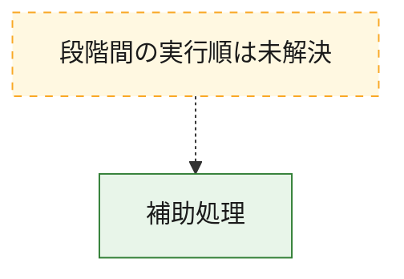
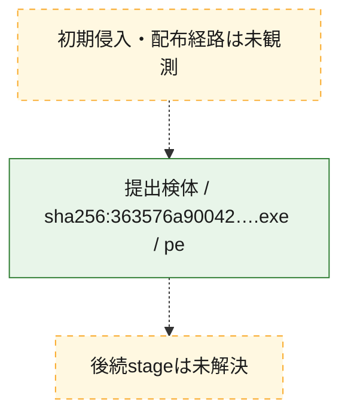
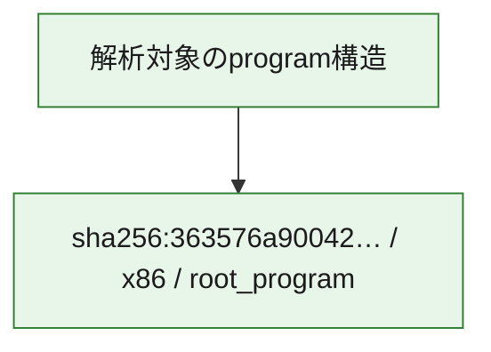

# 全体ロジック：363576a90042aa9b9bd6c8fef815f38b75bbf25dc251e8219820dff96f54c645

代表関数から主要なmalware処理段階を自動分類できませんでした。

## 読み方

- phaseの掲載順は解析上の整理順です。observed_call_edgesがない段階間の実行順を断定しません。
- 図の実線は静的に観測した関係、点線と黄色のノードは未観測・未解決の関係を示します。
- 図は静的な要約であり、動的実行を再現するものではありません。
- 詳細な関数解説とfingerprintは[STATIC-LOGIC.md](STATIC-LOGIC.md)を参照してください。

## 静的可視化

### 実行フロー

### 感染チェーン

### モジュール関係

## 処理段階

### 1. 補助処理

主要処理を支える一般内部関数またはlibrary処理を確認します。
確度: `confirmed_static_function_evidence_with_limits`

- `363576a90042aa9b9bd6c8fef815f38b75bbf25dc251e8219820dff96f54c645:ghidra:140001594` — 検体内部の一般処理を実装する関数です。 状態: `limited_bad_instruction_or_flow`、選定理由: `context_representative`, `reviewed_call_centrality:1`
- `363576a90042aa9b9bd6c8fef815f38b75bbf25dc251e8219820dff96f54c645:ghidra:1400015b0` — 検体内部の一般処理を実装する関数です。 状態: `limited_bad_instruction_or_flow`、選定理由: `context_representative`, `reviewed_call_centrality:1`
- `363576a90042aa9b9bd6c8fef815f38b75bbf25dc251e8219820dff96f54c645:ghidra:1400016c8` — 検体内部の一般処理を実装する関数です。 状態: `limited_bad_instruction_or_flow`、選定理由: `context_representative`, `reviewed_call_centrality:1`
- `363576a90042aa9b9bd6c8fef815f38b75bbf25dc251e8219820dff96f54c645:ghidra:1400017ac` — 検体内部の一般処理を実装する関数です。 状態: `limited_bad_instruction_or_flow`、選定理由: `context_representative`, `reviewed_call_centrality:1`
- `363576a90042aa9b9bd6c8fef815f38b75bbf25dc251e8219820dff96f54c645:ghidra:140001a70` — 検体内部の一般処理を実装する関数です。 状態: `limited_bad_instruction_or_flow`、選定理由: `context_representative`, `reviewed_call_centrality:1`
- `363576a90042aa9b9bd6c8fef815f38b75bbf25dc251e8219820dff96f54c645:ghidra:140001ca0` — 検体内部の一般処理を実装する関数です。 状態: `limited_bad_instruction_or_flow`、選定理由: `context_representative`, `reviewed_call_centrality:1`
- `363576a90042aa9b9bd6c8fef815f38b75bbf25dc251e8219820dff96f54c645:ghidra:140001df4` — 検体内部の一般処理を実装する関数です。 状態: `limited_bad_instruction_or_flow`、選定理由: `context_representative`, `reviewed_call_centrality:1`
- `363576a90042aa9b9bd6c8fef815f38b75bbf25dc251e8219820dff96f54c645:ghidra:14000235c` — 検体内部の一般処理を実装する関数です。 状態: `limited_bad_instruction_or_flow`、選定理由: `context_representative`, `reviewed_call_centrality:1`
- `363576a90042aa9b9bd6c8fef815f38b75bbf25dc251e8219820dff96f54c645:ghidra:1400023f4` — 検体内部の一般処理を実装する関数です。 状態: `limited_bad_instruction_or_flow`、選定理由: `context_representative`, `reviewed_call_centrality:1`
- `363576a90042aa9b9bd6c8fef815f38b75bbf25dc251e8219820dff96f54c645:ghidra:140002488` — 検体内部の一般処理を実装する関数です。 状態: `limited_bad_instruction_or_flow`、選定理由: `context_representative`, `reviewed_call_centrality:1`
- `363576a90042aa9b9bd6c8fef815f38b75bbf25dc251e8219820dff96f54c645:ghidra:14000253c` — 検体内部の一般処理を実装する関数です。 状態: `limited_bad_instruction_or_flow`、選定理由: `context_representative`, `reviewed_call_centrality:1`
- `363576a90042aa9b9bd6c8fef815f38b75bbf25dc251e8219820dff96f54c645:ghidra:14000296c` — 検体内部の一般処理を実装する関数です。 状態: `limited_bad_instruction_or_flow`、選定理由: `context_representative`, `reviewed_call_centrality:1`
- `363576a90042aa9b9bd6c8fef815f38b75bbf25dc251e8219820dff96f54c645:ghidra:140002b28` — 検体内部の一般処理を実装する関数です。 状態: `limited_bad_instruction_or_flow`、選定理由: `context_representative`, `reviewed_call_centrality:1`
- `363576a90042aa9b9bd6c8fef815f38b75bbf25dc251e8219820dff96f54c645:ghidra:140002c10` — 検体内部の一般処理を実装する関数です。 状態: `limited_bad_instruction_or_flow`、選定理由: `context_representative`, `reviewed_call_centrality:1`
- `363576a90042aa9b9bd6c8fef815f38b75bbf25dc251e8219820dff96f54c645:ghidra:140002c98` — 検体内部の一般処理を実装する関数です。 状態: `limited_bad_instruction_or_flow`、選定理由: `context_representative`, `reviewed_call_centrality:1`
- `363576a90042aa9b9bd6c8fef815f38b75bbf25dc251e8219820dff96f54c645:ghidra:140002f08` — 検体内部の一般処理を実装する関数です。 状態: `limited_bad_instruction_or_flow`、選定理由: `context_representative`, `reviewed_call_centrality:1`
- `363576a90042aa9b9bd6c8fef815f38b75bbf25dc251e8219820dff96f54c645:ghidra:1400031b8` — 検体内部の一般処理を実装する関数です。 状態: `limited_bad_instruction_or_flow`、選定理由: `context_representative`, `reviewed_call_centrality:1`
- `363576a90042aa9b9bd6c8fef815f38b75bbf25dc251e8219820dff96f54c645:ghidra:140003678` — 検体内部の一般処理を実装する関数です。 状態: `limited_bad_instruction_or_flow`、選定理由: `context_representative`, `reviewed_call_centrality:1`
- `363576a90042aa9b9bd6c8fef815f38b75bbf25dc251e8219820dff96f54c645:ghidra:1400037d0` — 検体内部の一般処理を実装する関数です。 状態: `limited_bad_instruction_or_flow`、選定理由: `context_representative`, `reviewed_call_centrality:1`
- `363576a90042aa9b9bd6c8fef815f38b75bbf25dc251e8219820dff96f54c645:ghidra:140003804` — 検体内部の一般処理を実装する関数です。 状態: `limited_bad_instruction_or_flow`、選定理由: `context_representative`, `reviewed_call_centrality:1`
- `363576a90042aa9b9bd6c8fef815f38b75bbf25dc251e8219820dff96f54c645:ghidra:140003838` — 検体内部の一般処理を実装する関数です。 状態: `limited_bad_instruction_or_flow`、選定理由: `context_representative`, `reviewed_call_centrality:1`
- `363576a90042aa9b9bd6c8fef815f38b75bbf25dc251e8219820dff96f54c645:ghidra:1400039f8` — 検体内部の一般処理を実装する関数です。 状態: `limited_bad_instruction_or_flow`、選定理由: `context_representative`, `reviewed_call_centrality:1`
- `363576a90042aa9b9bd6c8fef815f38b75bbf25dc251e8219820dff96f54c645:ghidra:140004500` — 検体内部の一般処理を実装する関数です。 状態: `limited_bad_instruction_or_flow`、選定理由: `context_representative`, `reviewed_call_centrality:1`
- `363576a90042aa9b9bd6c8fef815f38b75bbf25dc251e8219820dff96f54c645:ghidra:1400046f4` — 検体内部の一般処理を実装する関数です。 状態: `limited_bad_instruction_or_flow`、選定理由: `context_representative`, `reviewed_call_centrality:1`
- `363576a90042aa9b9bd6c8fef815f38b75bbf25dc251e8219820dff96f54c645:ghidra:140004914` — 検体内部の一般処理を実装する関数です。 状態: `limited_bad_instruction_or_flow`、選定理由: `context_representative`, `reviewed_call_centrality:1`
- `363576a90042aa9b9bd6c8fef815f38b75bbf25dc251e8219820dff96f54c645:ghidra:1400054dc` — 検体内部の一般処理を実装する関数です。 状態: `limited_bad_instruction_or_flow`、選定理由: `context_representative`, `reviewed_call_centrality:1`
- `363576a90042aa9b9bd6c8fef815f38b75bbf25dc251e8219820dff96f54c645:ghidra:14000577c` — 検体内部の一般処理を実装する関数です。 状態: `limited_bad_instruction_or_flow`、選定理由: `context_representative`, `reviewed_call_centrality:1`
- `363576a90042aa9b9bd6c8fef815f38b75bbf25dc251e8219820dff96f54c645:ghidra:14000590c` — 検体内部の一般処理を実装する関数です。 状態: `limited_bad_instruction_or_flow`、選定理由: `context_representative`, `reviewed_call_centrality:1`
- `363576a90042aa9b9bd6c8fef815f38b75bbf25dc251e8219820dff96f54c645:ghidra:140005b30` — 検体内部の一般処理を実装する関数です。 状態: `limited_bad_instruction_or_flow`、選定理由: `context_representative`, `reviewed_call_centrality:1`
- `363576a90042aa9b9bd6c8fef815f38b75bbf25dc251e8219820dff96f54c645:ghidra:140005d74` — 検体内部の一般処理を実装する関数です。 状態: `limited_bad_instruction_or_flow`、選定理由: `context_representative`, `reviewed_call_centrality:1`
- `363576a90042aa9b9bd6c8fef815f38b75bbf25dc251e8219820dff96f54c645:ghidra:140005ebc` — 検体内部の一般処理を実装する関数です。 状態: `limited_bad_instruction_or_flow`、選定理由: `context_representative`, `reviewed_call_centrality:1`
- `363576a90042aa9b9bd6c8fef815f38b75bbf25dc251e8219820dff96f54c645:ghidra:1400060c8` — 検体内部の一般処理を実装する関数です。 状態: `limited_bad_instruction_or_flow`、選定理由: `context_representative`, `reviewed_call_centrality:1`

## 観測したcall関係

- `ghidra-function:01a088850c90ae0ec7bee5a0` → `ghidra-external:5e0f9aae7143d20ccc3f03f6` （`unclassified` → `unclassified`）
- `ghidra-function:03ad4ff6cd136d111851bc00` → `ghidra-external:5e0f9aae7143d20ccc3f03f6` （`unclassified` → `unclassified`）
- `ghidra-function:100b405e84603fb9db3ae596` → `ghidra-external:5e0f9aae7143d20ccc3f03f6` （`unclassified` → `unclassified`）
- `ghidra-function:1436f9df2b27196b721adfd1` → `ghidra-external:5e0f9aae7143d20ccc3f03f6` （`unclassified` → `unclassified`）
- `ghidra-function:4243a751097fc81e68289dec` → `ghidra-external:5e0f9aae7143d20ccc3f03f6` （`unclassified` → `unclassified`）
- `ghidra-function:4e27deb2eefe771efd4dfdac` → `ghidra-external:5e0f9aae7143d20ccc3f03f6` （`unclassified` → `unclassified`）
- `ghidra-function:525fc3aa0bd6007d3174caf8` → `ghidra-external:5e0f9aae7143d20ccc3f03f6` （`unclassified` → `unclassified`）
- `ghidra-function:5443a76a27832095f5ec3f46` → `ghidra-external:5e0f9aae7143d20ccc3f03f6` （`unclassified` → `unclassified`）
- `ghidra-function:6033a3e42869c1db46ade497` → `ghidra-external:5e0f9aae7143d20ccc3f03f6` （`unclassified` → `unclassified`）
- `ghidra-function:683faa70df4b66f35e9d7a8e` → `ghidra-external:5e0f9aae7143d20ccc3f03f6` （`unclassified` → `unclassified`）
- `ghidra-function:6a089a39e4c07de3390b88eb` → `ghidra-external:5e0f9aae7143d20ccc3f03f6` （`unclassified` → `unclassified`）
- `ghidra-function:6cb5b941d655a3754e460b93` → `ghidra-external:5e0f9aae7143d20ccc3f03f6` （`unclassified` → `unclassified`）
- `ghidra-function:8ab2cfcb68d230c2b3ded00c` → `ghidra-external:5e0f9aae7143d20ccc3f03f6` （`unclassified` → `unclassified`）
- `ghidra-function:91382e387d693dac980586bc` → `ghidra-external:5e0f9aae7143d20ccc3f03f6` （`unclassified` → `unclassified`）
- `ghidra-function:9c0c04a28f1fd8f42854d75f` → `ghidra-external:5e0f9aae7143d20ccc3f03f6` （`unclassified` → `unclassified`）
- `ghidra-function:9c5834966391051dc90118ce` → `ghidra-external:5e0f9aae7143d20ccc3f03f6` （`unclassified` → `unclassified`）
- `ghidra-function:9c64ee09096e48bd731c5b52` → `ghidra-external:5e0f9aae7143d20ccc3f03f6` （`unclassified` → `unclassified`）
- `ghidra-function:a7c1c464541bd7c9ed6c8399` → `ghidra-external:5e0f9aae7143d20ccc3f03f6` （`unclassified` → `unclassified`）
- `ghidra-function:afede583409dc0a1a0114f90` → `ghidra-external:5e0f9aae7143d20ccc3f03f6` （`unclassified` → `unclassified`）
- `ghidra-function:b5aba9c5e8b9ee27520af04d` → `ghidra-external:5e0f9aae7143d20ccc3f03f6` （`unclassified` → `unclassified`）
- `ghidra-function:bf6213333d38783ba0840ae3` → `ghidra-external:5e0f9aae7143d20ccc3f03f6` （`unclassified` → `unclassified`）
- `ghidra-function:c0c42a7f44d1e6f8b760fdda` → `ghidra-external:5e0f9aae7143d20ccc3f03f6` （`unclassified` → `unclassified`）
- `ghidra-function:c499d32ac7594b5fdff83fa8` → `ghidra-external:5e0f9aae7143d20ccc3f03f6` （`unclassified` → `unclassified`）
- `ghidra-function:cc9e4a5e4fd13d64ca6a0a54` → `ghidra-external:5e0f9aae7143d20ccc3f03f6` （`unclassified` → `unclassified`）
- `ghidra-function:dd27a407fea00c7c76716a54` → `ghidra-external:5e0f9aae7143d20ccc3f03f6` （`unclassified` → `unclassified`）
- `ghidra-function:e17d147130225f0667c72dc8` → `ghidra-external:5e0f9aae7143d20ccc3f03f6` （`unclassified` → `unclassified`）
- `ghidra-function:e7cb6720615e3e039d865394` → `ghidra-external:5e0f9aae7143d20ccc3f03f6` （`unclassified` → `unclassified`）
- `ghidra-function:ea4168b62d92c072d0d8cca4` → `ghidra-external:5e0f9aae7143d20ccc3f03f6` （`unclassified` → `unclassified`）
- `ghidra-function:f048fcc600be54de037b253a` → `ghidra-external:5e0f9aae7143d20ccc3f03f6` （`unclassified` → `unclassified`）
- `ghidra-function:f1546135e1955374e648abeb` → `ghidra-external:5e0f9aae7143d20ccc3f03f6` （`unclassified` → `unclassified`）
- `ghidra-function:f5eec0f2c0c02ea21d681d7e` → `ghidra-external:5e0f9aae7143d20ccc3f03f6` （`unclassified` → `unclassified`）
- `ghidra-function:f83352ce942e7d4de9e6d9d7` → `ghidra-external:5e0f9aae7143d20ccc3f03f6` （`unclassified` → `unclassified`）

## 解析範囲と制約

- 選定外関数は全体inventoryへ残しますが、関数本体の個別解説対象にはしていません。
- indirect call、難読化、packer、VM、壊れたcontrol flowによりcall関係が欠落する場合があります。
- 文書は静的解析に基づき、検体実行や外部通信による動的確認は行っていません。
