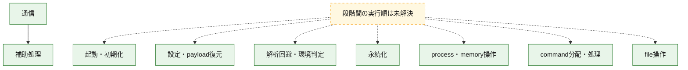
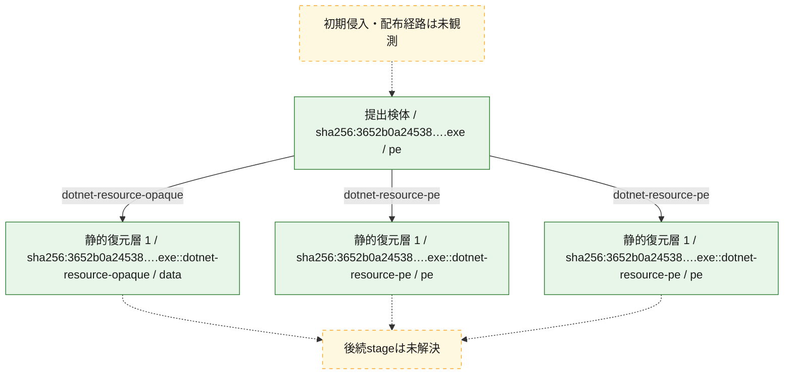
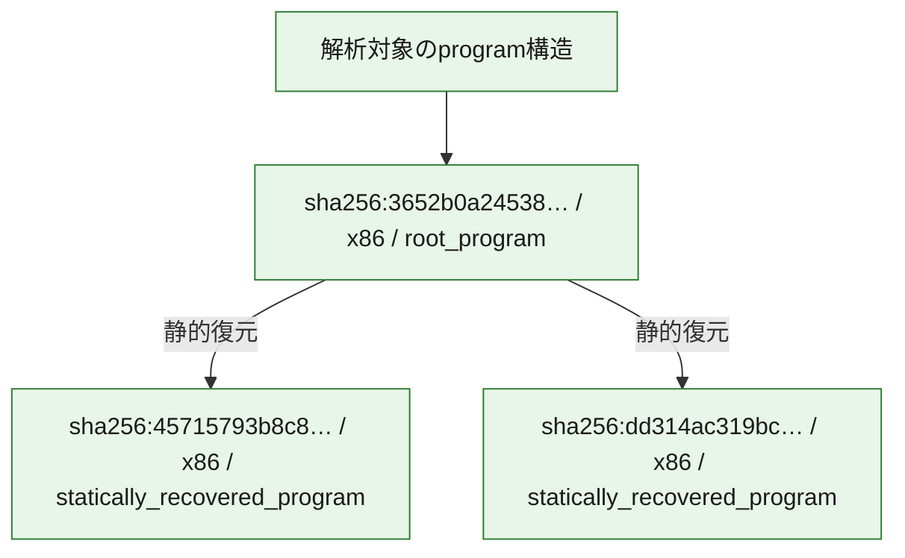

# 全体ロジック：3652b0a2453858df736e1ff16e04120b296641b22f98643a7eca6f4f981c0c3c

代表関数の静的証跡から、起動・初期化、設定・payload復元、解析回避・環境判定、永続化、process・memory操作、通信、command分配・処理、file操作の処理群を確認しました。

## 読み方

- phaseの掲載順は解析上の整理順です。observed_call_edgesがない段階間の実行順を断定しません。
- 図の実線は静的に観測した関係、点線と黄色のノードは未観測・未解決の関係を示します。
- 図は静的な要約であり、動的実行を再現するものではありません。
- 詳細な関数解説とfingerprintは[STATIC-LOGIC.md](STATIC-LOGIC.md)を参照してください。

## 静的可視化

### 実行フロー

### 感染チェーン

### モジュール関係

## 処理段階

### 1. 起動・初期化

entry pointから初期化と後続処理への移行を確認します。
確度: `confirmed_static_function_evidence`

- `3652b0a2453858df736e1ff16e04120b296641b22f98643a7eca6f4f981c0c3c:cil:0x060002c7` — 初期化と主要処理への分岐を行う入口関数です。 状態: `succeeded`、選定理由: `entry_point`, `reviewed_call_centrality:6`
- `3652b0a2453858df736e1ff16e04120b296641b22f98643a7eca6f4f981c0c3c:cil:0x060002f5` — 初期化と主要処理への分岐を行う入口関数です。 状態: `succeeded`、選定理由: `entry_point`, `large_function:instructions=82`, `reviewed_call_centrality:28`

### 2. 設定・payload復元

設定、resource、payload、暗号化データの復元・変換を確認します。
確度: `confirmed_static_function_evidence`

- `3652b0a2453858df736e1ff16e04120b296641b22f98643a7eca6f4f981c0c3c:cil:0x06000756` — 設定、resource、payloadなどの解析・変換を行う関数です。 状態: `succeeded`、選定理由: `large_function:instructions=483`, `reviewed_call_centrality:98`, `role:config_or_data_transform`
- `3652b0a2453858df736e1ff16e04120b296641b22f98643a7eca6f4f981c0c3c:cil:0x060007c1` — 暗号、hash、encoding、または復号処理に関係する関数です。 状態: `succeeded`、選定理由: `large_function:instructions=294`, `reviewed_call_centrality:68`, `role:cryptographic_transform`

### 3. 解析回避・環境判定

debugger、sandbox、仮想環境、時間差などの判定を確認します。
確度: `confirmed_static_function_evidence`

- `3652b0a2453858df736e1ff16e04120b296641b22f98643a7eca6f4f981c0c3c:cil:0x060004e4` — debugger、仮想環境、sandbox、または時間差の確認に関係する関数です。 状態: `succeeded`、選定理由: `role:anti_analysis`

### 4. 永続化

自動起動や永続化に関係する設定変更を確認します。
確度: `confirmed_static_function_evidence`

- `3652b0a2453858df736e1ff16e04120b296641b22f98643a7eca6f4f981c0c3c:cil:0x060004df` — 自動起動または永続化に関係する処理を含む関数です。 状態: `succeeded`、選定理由: `large_function:instructions=236`, `reviewed_call_centrality:44`, `role:persistence`
- `3652b0a2453858df736e1ff16e04120b296641b22f98643a7eca6f4f981c0c3c:cil:0x06000768` — 自動起動または永続化に関係する処理を含む関数です。 状態: `succeeded`、選定理由: `large_function:instructions=354`, `reviewed_call_centrality:64`, `role:persistence`

### 5. process・memory操作

process、thread、module、memory操作と実行移行を確認します。
確度: `confirmed_static_function_evidence`

- `3652b0a2453858df736e1ff16e04120b296641b22f98643a7eca6f4f981c0c3c:cil:0x0600036b` — process、thread、module、またはmemory操作に関係する関数です。 状態: `succeeded`、選定理由: `large_function:instructions=323`, `reviewed_call_centrality:52`, `role:process_or_memory_operation`
- `3652b0a2453858df736e1ff16e04120b296641b22f98643a7eca6f4f981c0c3c:cil:0x0600074e` — process、thread、module、またはmemory操作に関係する関数です。 状態: `succeeded`、選定理由: `large_function:instructions=242`, `reviewed_call_centrality:52`, `role:process_or_memory_operation`
- `3652b0a2453858df736e1ff16e04120b296641b22f98643a7eca6f4f981c0c3c:cil:0x060007d6` — process、thread、module、またはmemory操作に関係する関数です。 状態: `succeeded`、選定理由: `large_function:instructions=520`, `reviewed_call_centrality:50`, `role:process_or_memory_operation`

### 6. 通信

通信初期化、endpoint処理、送受信の役割を確認します。
確度: `confirmed_static_function_evidence`

- `3652b0a2453858df736e1ff16e04120b296641b22f98643a7eca6f4f981c0c3c:cil:0x06000384` — 通信初期化、送受信、またはendpoint処理に関係する関数です。 状態: `succeeded`、選定理由: `large_function:instructions=338`, `reviewed_call_centrality:74`, `role:network_communication`
- `3652b0a2453858df736e1ff16e04120b296641b22f98643a7eca6f4f981c0c3c:cil:0x0600073a` — 通信初期化、送受信、またはendpoint処理に関係する関数です。 状態: `succeeded`、選定理由: `large_function:instructions=790`, `reviewed_call_centrality:140`, `role:network_communication`
- `3652b0a2453858df736e1ff16e04120b296641b22f98643a7eca6f4f981c0c3c:cil:0x0600073e` — 通信初期化、送受信、またはendpoint処理に関係する関数です。 状態: `succeeded`、選定理由: `large_function:instructions=262`, `reviewed_call_centrality:58`, `role:network_communication`
- `3652b0a2453858df736e1ff16e04120b296641b22f98643a7eca6f4f981c0c3c:cil:0x06000754` — 通信初期化、送受信、またはendpoint処理に関係する関数です。 状態: `succeeded`、選定理由: `large_function:instructions=707`, `reviewed_call_centrality:158`, `role:network_communication`
- `3652b0a2453858df736e1ff16e04120b296641b22f98643a7eca6f4f981c0c3c:cil:0x06000799` — 通信初期化、送受信、またはendpoint処理に関係する関数です。 状態: `succeeded`、選定理由: `large_function:instructions=331`, `reviewed_call_centrality:68`, `role:network_communication`
- `3652b0a2453858df736e1ff16e04120b296641b22f98643a7eca6f4f981c0c3c:cil:0x060007a1` — 通信初期化、送受信、またはendpoint処理に関係する関数です。 状態: `succeeded`、選定理由: `large_function:instructions=295`, `reviewed_call_centrality:52`, `role:network_communication`
- `3652b0a2453858df736e1ff16e04120b296641b22f98643a7eca6f4f981c0c3c:cil:0x060007bb` — 通信初期化、送受信、またはendpoint処理に関係する関数です。 状態: `succeeded`、選定理由: `large_function:instructions=172`, `reviewed_call_centrality:52`, `role:network_communication`
- `3652b0a2453858df736e1ff16e04120b296641b22f98643a7eca6f4f981c0c3c:cil:0x060007bd` — 通信初期化、送受信、またはendpoint処理に関係する関数です。 状態: `succeeded`、選定理由: `large_function:instructions=322`, `reviewed_call_centrality:58`, `role:network_communication`
- `3652b0a2453858df736e1ff16e04120b296641b22f98643a7eca6f4f981c0c3c:cil:0x060007ca` — 通信初期化、送受信、またはendpoint処理に関係する関数です。 状態: `succeeded`、選定理由: `large_function:instructions=202`, `reviewed_call_centrality:52`, `role:network_communication`
- `3652b0a2453858df736e1ff16e04120b296641b22f98643a7eca6f4f981c0c3c:cil:0x060007cc` — 通信初期化、送受信、またはendpoint処理に関係する関数です。 状態: `succeeded`、選定理由: `large_function:instructions=244`, `reviewed_call_centrality:66`, `role:network_communication`
- `3652b0a2453858df736e1ff16e04120b296641b22f98643a7eca6f4f981c0c3c:cil:0x060007d8` — 通信初期化、送受信、またはendpoint処理に関係する関数です。 状態: `succeeded`、選定理由: `large_function:instructions=1014`, `reviewed_call_centrality:112`, `role:network_communication`
- `3652b0a2453858df736e1ff16e04120b296641b22f98643a7eca6f4f981c0c3c:cil:0x060007e1` — 通信初期化、送受信、またはendpoint処理に関係する関数です。 状態: `succeeded`、選定理由: `large_function:instructions=1012`, `reviewed_call_centrality:104`, `role:network_communication`
- `3652b0a2453858df736e1ff16e04120b296641b22f98643a7eca6f4f981c0c3c:cil:0x060007e3` — 通信初期化、送受信、またはendpoint処理に関係する関数です。 状態: `succeeded`、選定理由: `large_function:instructions=209`, `reviewed_call_centrality:54`, `role:network_communication`

### 7. command分配・処理

受信commandやtaskの解釈、分配、個別handlerへの移行を確認します。
確度: `confirmed_static_function_evidence`

- `3652b0a2453858df736e1ff16e04120b296641b22f98643a7eca6f4f981c0c3c:cil:0x060002fa` — commandの解釈、分配、または個別処理を担当する関数です。 状態: `succeeded`、選定理由: `large_function:instructions=200`, `reviewed_call_centrality:70`, `role:command_dispatch_or_handler`
- `3652b0a2453858df736e1ff16e04120b296641b22f98643a7eca6f4f981c0c3c:cil:0x06000388` — commandの解釈、分配、または個別処理を担当する関数です。 状態: `succeeded`、選定理由: `large_function:instructions=200`, `reviewed_call_centrality:54`, `role:command_dispatch_or_handler`
- `3652b0a2453858df736e1ff16e04120b296641b22f98643a7eca6f4f981c0c3c:cil:0x06000740` — commandの解釈、分配、または個別処理を担当する関数です。 状態: `succeeded`、選定理由: `large_function:instructions=171`, `reviewed_call_centrality:48`, `role:command_dispatch_or_handler`
- `3652b0a2453858df736e1ff16e04120b296641b22f98643a7eca6f4f981c0c3c:cil:0x06000742` — commandの解釈、分配、または個別処理を担当する関数です。 状態: `succeeded`、選定理由: `large_function:instructions=317`, `reviewed_call_centrality:48`, `role:command_dispatch_or_handler`
- `3652b0a2453858df736e1ff16e04120b296641b22f98643a7eca6f4f981c0c3c:cil:0x06000746` — commandの解釈、分配、または個別処理を担当する関数です。 状態: `succeeded`、選定理由: `large_function:instructions=360`, `reviewed_call_centrality:90`, `role:command_dispatch_or_handler`
- `3652b0a2453858df736e1ff16e04120b296641b22f98643a7eca6f4f981c0c3c:cil:0x06000766` — commandの解釈、分配、または個別処理を担当する関数です。 状態: `succeeded`、選定理由: `large_function:instructions=193`, `reviewed_call_centrality:76`, `role:command_dispatch_or_handler`
- `3652b0a2453858df736e1ff16e04120b296641b22f98643a7eca6f4f981c0c3c:cil:0x06000797` — commandの解釈、分配、または個別処理を担当する関数です。 状態: `succeeded`、選定理由: `large_function:instructions=299`, `reviewed_call_centrality:56`, `role:command_dispatch_or_handler`

### 8. file操作

fileやdirectoryの作成、読書き、削除を確認します。
確度: `confirmed_static_function_evidence`

- `3652b0a2453858df736e1ff16e04120b296641b22f98643a7eca6f4f981c0c3c:cil:0x060002f6` — fileまたはdirectoryの読書き・管理に関係する関数です。 状態: `succeeded`、選定理由: `reviewed_call_centrality:12`, `role:file_operation`

### 9. 補助処理

主要処理を支える一般内部関数またはlibrary処理を確認します。
確度: `confirmed_static_function_evidence_with_limits`

- `45715793b8c8571554b0bfb4eccc29e2884c16481e1c7dbee78363bbe4da3dd9:cil:0x06000001` — metadata上に存在しますが、解析対象となるCIL本体を持たないmethodです。 状態: `no_managed_body`、選定理由: `context_representative`, `no_internal_body_structural_fallback`
- `45715793b8c8571554b0bfb4eccc29e2884c16481e1c7dbee78363bbe4da3dd9:cil:0x06000002` — metadata上に存在しますが、解析対象となるCIL本体を持たないmethodです。 状態: `no_managed_body`、選定理由: `context_representative`, `no_internal_body_structural_fallback`
- `45715793b8c8571554b0bfb4eccc29e2884c16481e1c7dbee78363bbe4da3dd9:cil:0x06000003` — metadata上に存在しますが、解析対象となるCIL本体を持たないmethodです。 状態: `no_managed_body`、選定理由: `context_representative`, `no_internal_body_structural_fallback`
- `45715793b8c8571554b0bfb4eccc29e2884c16481e1c7dbee78363bbe4da3dd9:cil:0x06000004` — metadata上に存在しますが、解析対象となるCIL本体を持たないmethodです。 状態: `no_managed_body`、選定理由: `context_representative`, `no_internal_body_structural_fallback`
- `dd314ac319bcf2e9babe336c727a4051f9ee1f8f8544bedfdb4967e9d83c5420:cil:0x06000001` — metadata上に存在しますが、解析対象となるCIL本体を持たないmethodです。 状態: `no_managed_body`、選定理由: `context_representative`, `no_internal_body_structural_fallback`
- `dd314ac319bcf2e9babe336c727a4051f9ee1f8f8544bedfdb4967e9d83c5420:cil:0x06000002` — metadata上に存在しますが、解析対象となるCIL本体を持たないmethodです。 状態: `no_managed_body`、選定理由: `context_representative`, `no_internal_body_structural_fallback`
- `dd314ac319bcf2e9babe336c727a4051f9ee1f8f8544bedfdb4967e9d83c5420:cil:0x06000003` — metadata上に存在しますが、解析対象となるCIL本体を持たないmethodです。 状態: `no_managed_body`、選定理由: `context_representative`, `no_internal_body_structural_fallback`
- `dd314ac319bcf2e9babe336c727a4051f9ee1f8f8544bedfdb4967e9d83c5420:cil:0x06000004` — metadata上に存在しますが、解析対象となるCIL本体を持たないmethodです。 状態: `no_managed_body`、選定理由: `context_representative`, `no_internal_body_structural_fallback`
- `3652b0a2453858df736e1ff16e04120b296641b22f98643a7eca6f4f981c0c3c:cil:0x060007d0` — 検体内部の一般処理を実装する関数です。 状態: `succeeded`、選定理由: `large_function:instructions=301`, `reviewed_call_centrality:74`

## 観測したcall関係

- `3652b0a2453858df736e1ff16e04120b296641b22f98643a7eca6f4f981c0c3c:cil:0x060007e3` → `dd314ac319bcf2e9babe336c727a4051f9ee1f8f8544bedfdb4967e9d83c5420:cil:0x06000003` （`communication` → `support`）

## 解析範囲と制約

- 選定外関数は全体inventoryへ残しますが、関数本体の個別解説対象にはしていません。
- indirect call、難読化、packer、VM、壊れたcontrol flowによりcall関係が欠落する場合があります。
- 文書は静的解析に基づき、検体実行や外部通信による動的確認は行っていません。
