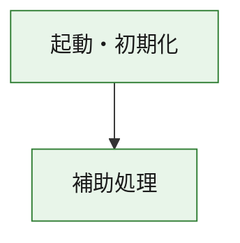
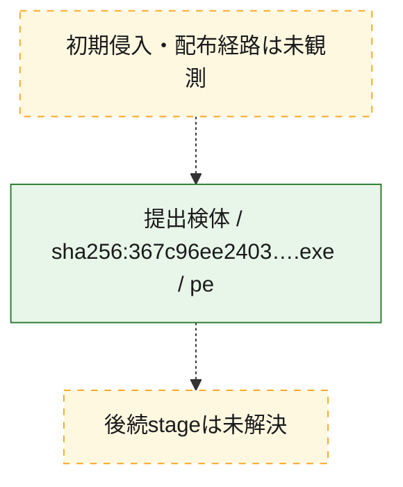
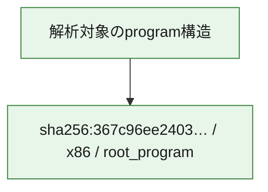

# 全体ロジック：367c96ee24039f89632411c93f2f46ebd24e190039f279773c31d426f005854e

代表関数の静的証跡から、起動・初期化の処理群を確認しました。

## 読み方

- phaseの掲載順は解析上の整理順です。observed_call_edgesがない段階間の実行順を断定しません。
- 図の実線は静的に観測した関係、点線と黄色のノードは未観測・未解決の関係を示します。
- 図は静的な要約であり、動的実行を再現するものではありません。
- 詳細な関数解説とfingerprintは[STATIC-LOGIC.md](STATIC-LOGIC.md)を参照してください。

## 静的可視化

### 実行フロー

### 感染チェーン

### モジュール関係

## 処理段階

### 1. 起動・初期化

entry pointから初期化と後続処理への移行を確認します。
確度: `confirmed_static_function_evidence`

- `367c96ee24039f89632411c93f2f46ebd24e190039f279773c31d426f005854e:ghidra:180001010` — 初期化と主要処理への分岐を行う入口関数です。 状態: `succeeded`、選定理由: `entry_point`, `meaningful_symbol_name`, `reviewed_call_centrality:22`, `role:entrypoint`, `small_program_complete_context`

### 2. 補助処理

主要処理を支える一般内部関数またはlibrary処理を確認します。
確度: `confirmed_static_function_evidence`

- `367c96ee24039f89632411c93f2f46ebd24e190039f279773c31d426f005854e:ghidra:180001240` — 検体内部の一般処理を実装する関数です。 状態: `succeeded`、選定理由: `context_representative`, `reviewed_call_centrality:2`, `small_program_complete_context`
- `367c96ee24039f89632411c93f2f46ebd24e190039f279773c31d426f005854e:ghidra:180001350` — 検体内部の一般処理を実装する関数です。 状態: `succeeded`、選定理由: `context_representative`, `reviewed_call_centrality:25`, `small_program_complete_context`
- `367c96ee24039f89632411c93f2f46ebd24e190039f279773c31d426f005854e:ghidra:180003780` — 検体内部の一般処理を実装する関数です。 状態: `succeeded`、選定理由: `context_representative`, `reviewed_call_centrality:2`, `small_program_complete_context`
- `367c96ee24039f89632411c93f2f46ebd24e190039f279773c31d426f005854e:ghidra:1800038e0` — 検体内部の一般処理を実装する関数です。 状態: `succeeded`、選定理由: `context_representative`, `reviewed_call_centrality:2`, `small_program_complete_context`

## 観測したcall関係

- `367c96ee24039f89632411c93f2f46ebd24e190039f279773c31d426f005854e:ghidra:180001010` → `367c96ee24039f89632411c93f2f46ebd24e190039f279773c31d426f005854e:ghidra:180001240` （`startup` → `support`）
- `367c96ee24039f89632411c93f2f46ebd24e190039f279773c31d426f005854e:ghidra:180001010` → `367c96ee24039f89632411c93f2f46ebd24e190039f279773c31d426f005854e:ghidra:180001350` （`startup` → `support`）
- `367c96ee24039f89632411c93f2f46ebd24e190039f279773c31d426f005854e:ghidra:180001350` → `367c96ee24039f89632411c93f2f46ebd24e190039f279773c31d426f005854e:ghidra:180001240` （`support` → `support`）
- `367c96ee24039f89632411c93f2f46ebd24e190039f279773c31d426f005854e:ghidra:180001350` → `367c96ee24039f89632411c93f2f46ebd24e190039f279773c31d426f005854e:ghidra:180003780` （`support` → `support`）
- `367c96ee24039f89632411c93f2f46ebd24e190039f279773c31d426f005854e:ghidra:180001350` → `367c96ee24039f89632411c93f2f46ebd24e190039f279773c31d426f005854e:ghidra:1800038e0` （`support` → `support`）
- `367c96ee24039f89632411c93f2f46ebd24e190039f279773c31d426f005854e:ghidra:180003780` → `367c96ee24039f89632411c93f2f46ebd24e190039f279773c31d426f005854e:ghidra:1800038e0` （`support` → `support`）
- `ghidra-function:83810b9c25c97a46c8836271` → `ghidra-function:8556c211cb89cb08855864c3` （`unclassified` → `unclassified`）
- `ghidra-function:962bf2b1398ca08ce92eddb0` → `ghidra-external:1238ed1bf8804055c57d45a2` （`unclassified` → `unclassified`）
- `ghidra-function:962bf2b1398ca08ce92eddb0` → `ghidra-external:205879a58df2bf6686080f36` （`unclassified` → `unclassified`）
- `ghidra-function:962bf2b1398ca08ce92eddb0` → `ghidra-external:2cf11ea7dbf71ccded29d7a8` （`unclassified` → `unclassified`）
- `ghidra-function:962bf2b1398ca08ce92eddb0` → `ghidra-external:2e0b6649c4f8157563943ce4` （`unclassified` → `unclassified`）
- `ghidra-function:962bf2b1398ca08ce92eddb0` → `ghidra-external:30dfbb7f535ccf3803d36290` （`unclassified` → `unclassified`）
- `ghidra-function:962bf2b1398ca08ce92eddb0` → `ghidra-external:3c445c0f1fe4f22e307f0162` （`unclassified` → `unclassified`）
- `ghidra-function:962bf2b1398ca08ce92eddb0` → `ghidra-external:3d3b6f191ee0525d55854862` （`unclassified` → `unclassified`）
- `ghidra-function:962bf2b1398ca08ce92eddb0` → `ghidra-external:4780d35e01b9633a48de9121` （`unclassified` → `unclassified`）
- `ghidra-function:962bf2b1398ca08ce92eddb0` → `ghidra-external:583233b4dd720703227c95c9` （`unclassified` → `unclassified`）
- `ghidra-function:962bf2b1398ca08ce92eddb0` → `ghidra-external:6df6a961e3b6398064c4a2bd` （`unclassified` → `unclassified`）
- `ghidra-function:962bf2b1398ca08ce92eddb0` → `ghidra-external:6e18da72f3ce7e56903cb655` （`unclassified` → `unclassified`）
- `ghidra-function:962bf2b1398ca08ce92eddb0` → `ghidra-external:6e6588e41b7eb35112e8e590` （`unclassified` → `unclassified`）
- `ghidra-function:962bf2b1398ca08ce92eddb0` → `ghidra-external:8451f4394e8e786e8a5bc5d5` （`unclassified` → `unclassified`）
- `ghidra-function:962bf2b1398ca08ce92eddb0` → `ghidra-external:87d3264c213c58a5d9057248` （`unclassified` → `unclassified`）
- `ghidra-function:962bf2b1398ca08ce92eddb0` → `ghidra-external:8cd2fc4583c249db59b11773` （`unclassified` → `unclassified`）
- `ghidra-function:962bf2b1398ca08ce92eddb0` → `ghidra-external:d90996f62e34d0db9680a8ee` （`unclassified` → `unclassified`）
- `ghidra-function:962bf2b1398ca08ce92eddb0` → `ghidra-external:dd98afd57a343e3bf1861acc` （`unclassified` → `unclassified`）
- `ghidra-function:962bf2b1398ca08ce92eddb0` → `ghidra-external:e2561fe7efb4704e80c35c0b` （`unclassified` → `unclassified`）
- `ghidra-function:962bf2b1398ca08ce92eddb0` → `ghidra-external:f30bfea5512a11acbf5718d3` （`unclassified` → `unclassified`）
- `ghidra-function:962bf2b1398ca08ce92eddb0` → `ghidra-external:f3935a936313fd11f0a4f446` （`unclassified` → `unclassified`）
- `ghidra-function:962bf2b1398ca08ce92eddb0` → `ghidra-external:f94ee59215ad5a65a016a08c` （`unclassified` → `unclassified`）
- `ghidra-function:962bf2b1398ca08ce92eddb0` → `ghidra-function:38a275325f60483dd100f689` （`unclassified` → `unclassified`）
- `ghidra-function:962bf2b1398ca08ce92eddb0` → `ghidra-function:83810b9c25c97a46c8836271` （`unclassified` → `unclassified`）
- `ghidra-function:962bf2b1398ca08ce92eddb0` → `ghidra-function:8556c211cb89cb08855864c3` （`unclassified` → `unclassified`）
- `ghidra-function:99300ec32757c50273d63ab6` → `ghidra-function:0a6618346eb032e5be977909` （`unclassified` → `unclassified`）
- `ghidra-function:99300ec32757c50273d63ab6` → `ghidra-function:0afeee1b0ade28e486f65ce9` （`unclassified` → `unclassified`）
- `ghidra-function:99300ec32757c50273d63ab6` → `ghidra-function:2fa9c9a316ae252d23292ce8` （`unclassified` → `unclassified`）
- `ghidra-function:99300ec32757c50273d63ab6` → `ghidra-function:38a275325f60483dd100f689` （`unclassified` → `unclassified`）
- `ghidra-function:99300ec32757c50273d63ab6` → `ghidra-function:5d2afb50bb06556890f6bb7f` （`unclassified` → `unclassified`）
- `ghidra-function:99300ec32757c50273d63ab6` → `ghidra-function:672ea11091697503f1daf199` （`unclassified` → `unclassified`）
- `ghidra-function:99300ec32757c50273d63ab6` → `ghidra-function:7621bbcf19328987658f5041` （`unclassified` → `unclassified`）
- `ghidra-function:99300ec32757c50273d63ab6` → `ghidra-function:91569e06da9bdcdb04490132` （`unclassified` → `unclassified`）
- `ghidra-function:99300ec32757c50273d63ab6` → `ghidra-function:962bf2b1398ca08ce92eddb0` （`unclassified` → `unclassified`）
- `ghidra-function:99300ec32757c50273d63ab6` → `ghidra-function:d67f45df6ae6fde205afc370` （`unclassified` → `unclassified`）
- `ghidra-function:99300ec32757c50273d63ab6` → `ghidra-function:dbe86da01f6c3249ffbf2f93` （`unclassified` → `unclassified`）
- `ghidra-function:99300ec32757c50273d63ab6` → `ghidra-function:eae48532af5e2f361ed78087` （`unclassified` → `unclassified`）

## 解析範囲と制約

- 選定外関数は全体inventoryへ残しますが、関数本体の個別解説対象にはしていません。
- indirect call、難読化、packer、VM、壊れたcontrol flowによりcall関係が欠落する場合があります。
- 文書は静的解析に基づき、検体実行や外部通信による動的確認は行っていません。
