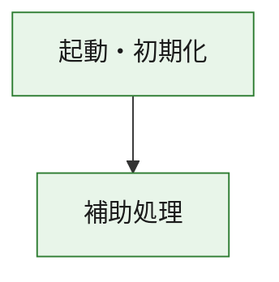
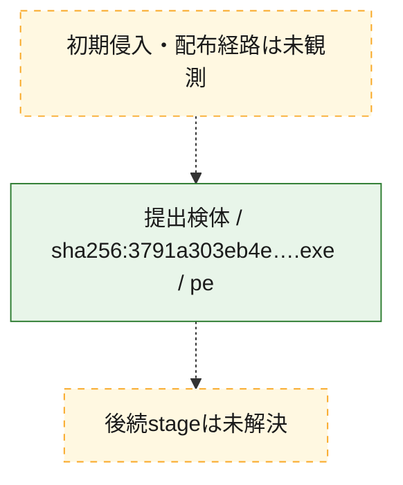
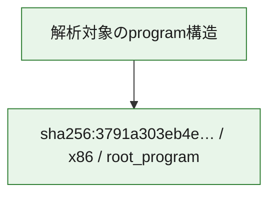

# 全体ロジック：3791a303eb4e5dee8cf73ec874506ec0fc11f48c65bc7411ccac03750a4d393c

代表関数の静的証跡から、起動・初期化の処理群を確認しました。

## 読み方

- phaseの掲載順は解析上の整理順です。observed_call_edgesがない段階間の実行順を断定しません。
- 図の実線は静的に観測した関係、点線と黄色のノードは未観測・未解決の関係を示します。
- 図は静的な要約であり、動的実行を再現するものではありません。
- 詳細な関数解説とfingerprintは[STATIC-LOGIC.md](STATIC-LOGIC.md)を参照してください。

## 静的可視化

### 実行フロー

### 感染チェーン

### モジュール関係

## 処理段階

### 1. 起動・初期化

entry pointから初期化と後続処理への移行を確認します。
確度: `confirmed_static_function_evidence`

- `3791a303eb4e5dee8cf73ec874506ec0fc11f48c65bc7411ccac03750a4d393c:ghidra:180001010` — 初期化と主要処理への分岐を行う入口関数です。 状態: `succeeded`、選定理由: `entry_point`, `meaningful_symbol_name`, `reviewed_call_centrality:22`, `role:entrypoint`, `small_program_complete_context`

### 2. 補助処理

主要処理を支える一般内部関数またはlibrary処理を確認します。
確度: `confirmed_static_function_evidence`

- `3791a303eb4e5dee8cf73ec874506ec0fc11f48c65bc7411ccac03750a4d393c:ghidra:180001240` — 検体内部の一般処理を実装する関数です。 状態: `succeeded`、選定理由: `context_representative`, `reviewed_call_centrality:2`, `small_program_complete_context`
- `3791a303eb4e5dee8cf73ec874506ec0fc11f48c65bc7411ccac03750a4d393c:ghidra:180001350` — 検体内部の一般処理を実装する関数です。 状態: `succeeded`、選定理由: `context_representative`, `reviewed_call_centrality:25`, `small_program_complete_context`
- `3791a303eb4e5dee8cf73ec874506ec0fc11f48c65bc7411ccac03750a4d393c:ghidra:180003780` — 検体内部の一般処理を実装する関数です。 状態: `succeeded`、選定理由: `context_representative`, `reviewed_call_centrality:2`, `small_program_complete_context`
- `3791a303eb4e5dee8cf73ec874506ec0fc11f48c65bc7411ccac03750a4d393c:ghidra:1800038e0` — 検体内部の一般処理を実装する関数です。 状態: `succeeded`、選定理由: `context_representative`, `reviewed_call_centrality:2`, `small_program_complete_context`

## 観測したcall関係

- `3791a303eb4e5dee8cf73ec874506ec0fc11f48c65bc7411ccac03750a4d393c:ghidra:180001010` → `3791a303eb4e5dee8cf73ec874506ec0fc11f48c65bc7411ccac03750a4d393c:ghidra:180001240` （`startup` → `support`）
- `3791a303eb4e5dee8cf73ec874506ec0fc11f48c65bc7411ccac03750a4d393c:ghidra:180001010` → `3791a303eb4e5dee8cf73ec874506ec0fc11f48c65bc7411ccac03750a4d393c:ghidra:180001350` （`startup` → `support`）
- `3791a303eb4e5dee8cf73ec874506ec0fc11f48c65bc7411ccac03750a4d393c:ghidra:180001350` → `3791a303eb4e5dee8cf73ec874506ec0fc11f48c65bc7411ccac03750a4d393c:ghidra:180001240` （`support` → `support`）
- `3791a303eb4e5dee8cf73ec874506ec0fc11f48c65bc7411ccac03750a4d393c:ghidra:180001350` → `3791a303eb4e5dee8cf73ec874506ec0fc11f48c65bc7411ccac03750a4d393c:ghidra:180003780` （`support` → `support`）
- `3791a303eb4e5dee8cf73ec874506ec0fc11f48c65bc7411ccac03750a4d393c:ghidra:180001350` → `3791a303eb4e5dee8cf73ec874506ec0fc11f48c65bc7411ccac03750a4d393c:ghidra:1800038e0` （`support` → `support`）
- `3791a303eb4e5dee8cf73ec874506ec0fc11f48c65bc7411ccac03750a4d393c:ghidra:180003780` → `3791a303eb4e5dee8cf73ec874506ec0fc11f48c65bc7411ccac03750a4d393c:ghidra:1800038e0` （`support` → `support`）
- `ghidra-function:746482e5dcda6b9dcb78de96` → `ghidra-function:be4614121c68b50303f4fbed` （`unclassified` → `unclassified`）
- `ghidra-function:eac247bb3a2da278df788a3e` → `ghidra-function:0f48b87e2312e32f61b7a2f7` （`unclassified` → `unclassified`）
- `ghidra-function:eac247bb3a2da278df788a3e` → `ghidra-function:235330667f72ee32e7bfc6bb` （`unclassified` → `unclassified`）
- `ghidra-function:eac247bb3a2da278df788a3e` → `ghidra-function:51a75b0c1b3830cb45248851` （`unclassified` → `unclassified`）
- `ghidra-function:eac247bb3a2da278df788a3e` → `ghidra-function:8014bcfdbccba8e857f4df24` （`unclassified` → `unclassified`）
- `ghidra-function:eac247bb3a2da278df788a3e` → `ghidra-function:86243afaa3d9f8557cf7c980` （`unclassified` → `unclassified`）
- `ghidra-function:eac247bb3a2da278df788a3e` → `ghidra-function:ab139f6d709a4801b33f552a` （`unclassified` → `unclassified`）
- `ghidra-function:eac247bb3a2da278df788a3e` → `ghidra-function:cc2b4545493a9ddbf3965d41` （`unclassified` → `unclassified`）
- `ghidra-function:eac247bb3a2da278df788a3e` → `ghidra-function:cc853f6900c6914a042f4fad` （`unclassified` → `unclassified`）
- `ghidra-function:eac247bb3a2da278df788a3e` → `ghidra-function:da8bb45fce4615aa7e291f07` （`unclassified` → `unclassified`）
- `ghidra-function:eac247bb3a2da278df788a3e` → `ghidra-function:dbfe5a3ffaba2598d80c4bc9` （`unclassified` → `unclassified`）
- `ghidra-function:eac247bb3a2da278df788a3e` → `ghidra-function:f11708aa259c2b34cee6b084` （`unclassified` → `unclassified`）
- `ghidra-function:eac247bb3a2da278df788a3e` → `ghidra-function:f7746689d9f49e33ed82d154` （`unclassified` → `unclassified`）
- `ghidra-function:f7746689d9f49e33ed82d154` → `ghidra-external:18eca765f851af24803c208b` （`unclassified` → `unclassified`）
- `ghidra-function:f7746689d9f49e33ed82d154` → `ghidra-external:20e1929f9e0835efa05ddb6d` （`unclassified` → `unclassified`）
- `ghidra-function:f7746689d9f49e33ed82d154` → `ghidra-external:2497b567e0f3183a6cd55d6e` （`unclassified` → `unclassified`）
- `ghidra-function:f7746689d9f49e33ed82d154` → `ghidra-external:38237d0cf02959aa826c2988` （`unclassified` → `unclassified`）
- `ghidra-function:f7746689d9f49e33ed82d154` → `ghidra-external:48abb53252c2678f64b4d1c7` （`unclassified` → `unclassified`）
- `ghidra-function:f7746689d9f49e33ed82d154` → `ghidra-external:4a0c09e895e4d07906cea348` （`unclassified` → `unclassified`）
- `ghidra-function:f7746689d9f49e33ed82d154` → `ghidra-external:4ca02ebfc060da174ca12b28` （`unclassified` → `unclassified`）
- `ghidra-function:f7746689d9f49e33ed82d154` → `ghidra-external:516edecc13d916cfc4f44935` （`unclassified` → `unclassified`）
- `ghidra-function:f7746689d9f49e33ed82d154` → `ghidra-external:58e881fe604c02fec6bd8b8b` （`unclassified` → `unclassified`）
- `ghidra-function:f7746689d9f49e33ed82d154` → `ghidra-external:63c2c6bdaf915dadf89f4901` （`unclassified` → `unclassified`）
- `ghidra-function:f7746689d9f49e33ed82d154` → `ghidra-external:69bb1f59432023cccd7792f1` （`unclassified` → `unclassified`）
- `ghidra-function:f7746689d9f49e33ed82d154` → `ghidra-external:a35387dce58a3a05a66605de` （`unclassified` → `unclassified`）
- `ghidra-function:f7746689d9f49e33ed82d154` → `ghidra-external:a8ca130ed318eda081af2cc7` （`unclassified` → `unclassified`）
- `ghidra-function:f7746689d9f49e33ed82d154` → `ghidra-external:a904665c80ec90f82b139e2e` （`unclassified` → `unclassified`）
- `ghidra-function:f7746689d9f49e33ed82d154` → `ghidra-external:b1eeacafced2bc54bdea2f5e` （`unclassified` → `unclassified`）
- `ghidra-function:f7746689d9f49e33ed82d154` → `ghidra-external:b84b171f305ec5052beff0b2` （`unclassified` → `unclassified`）
- `ghidra-function:f7746689d9f49e33ed82d154` → `ghidra-external:cae27ac078c8fe65b4d62cb8` （`unclassified` → `unclassified`）
- `ghidra-function:f7746689d9f49e33ed82d154` → `ghidra-external:e053aa2f719a2bb7892db25a` （`unclassified` → `unclassified`）
- `ghidra-function:f7746689d9f49e33ed82d154` → `ghidra-external:e1c2b19e3c2e8179afd5ebe5` （`unclassified` → `unclassified`）
- `ghidra-function:f7746689d9f49e33ed82d154` → `ghidra-external:ee234a8da91839b21ae903cb` （`unclassified` → `unclassified`）
- `ghidra-function:f7746689d9f49e33ed82d154` → `ghidra-external:eef39ed17c0990aa0f438dc4` （`unclassified` → `unclassified`）
- `ghidra-function:f7746689d9f49e33ed82d154` → `ghidra-function:746482e5dcda6b9dcb78de96` （`unclassified` → `unclassified`）
- `ghidra-function:f7746689d9f49e33ed82d154` → `ghidra-function:8014bcfdbccba8e857f4df24` （`unclassified` → `unclassified`）
- `ghidra-function:f7746689d9f49e33ed82d154` → `ghidra-function:be4614121c68b50303f4fbed` （`unclassified` → `unclassified`）

## 解析範囲と制約

- 選定外関数は全体inventoryへ残しますが、関数本体の個別解説対象にはしていません。
- indirect call、難読化、packer、VM、壊れたcontrol flowによりcall関係が欠落する場合があります。
- 文書は静的解析に基づき、検体実行や外部通信による動的確認は行っていません。
